# Leaderboard Design

A leaderboard is a deceptively boring requirement that breaks naive implementations the moment scale, ties, or time windows enter the picture. This article is for senior engineers who already know "use Redis sorted sets" and need to make the engineering decisions underneath: which ranking semantics, how to break ties without lexicographic surprises, how to shard when a single ZSET stops being enough, and where to drop exact ranks for percentile estimates.




## Why a relational database is the wrong default

Computing a player's rank in SQL means counting how many players score higher:

```sql title="naive-rank.sql"
SELECT COUNT(*) + 1 AS rank
FROM   players
WHERE  score > (SELECT score FROM players WHERE id = :player_id);
```

With a B-tree index on `score`, the planner can do an [index-only scan](https://www.postgresql.org/docs/current/indexes-index-only-scans.html) and walk only the higher-scoring portion of the index. That makes the query proportional to the player's *rank*, not the table size: cheap for the top of the board, expensive for someone in the middle of millions, and hopeless without an index.

The AWS Database Blog's leaderboard reference design [reports ~35 s for an indexed nested rank query against a 50 M-row MySQL table, vs. sub-millisecond `ZREVRANK` on the same data](https://aws.amazon.com/blogs/database/building-a-real-time-gaming-leaderboard-with-amazon-elasticache-for-redis/), which is the canonical citation for "don't compute ranks in your OLTP database":

| Players | Indexed nested rank query (MySQL)[^aws-bench] | Redis `ZREVRANK` |
| ------: | :-------------------------------------------- | :--------------- |
|      1M | ~500 ms                                       | < 1 ms           |
|     10M | ~10 s                                         | < 1 ms           |
|     50M | ~35 s                                         | < 1 ms           |

The relational system is paying for two things on every read:

1. **Re-deriving ordering.** SQL ranking functions (`RANK()`, `ROW_NUMBER()`, `DENSE_RANK()`) recompute a window over the partition on each query.
2. **Index maintenance and lock contention on writes.** A viral game with millions of concurrent score updates exhausts row-level locks and B-tree rebalancing budget long before throughput would otherwise saturate.

Redis sorted sets (ZSETs) push the ordering into the data structure itself, so reads do not have to re-derive it.

## Mental model: the ZSET dual structure

Redis stores each sorted set in **two indexes that share the same elements** (above the small-collection `listpack` threshold)[^redis-zset-docs]:

- A **skip list** keyed by `(score, member)`, ordered ascending. Provides O(log N) insertion, deletion, and rank lookup.
- A **hash table** keyed by `member`, mapping to the score. Provides O(1) score lookup.

 and a hash table (member -> score). The skip list stores forward span counts so ZRANK can return rank in O(log N).")


Each skip list node stores a `span` count along its forward pointers. Walking from the head to a member sums the spans of the pointers traversed; that sum is the rank. This is why `ZRANK` is O(log N) instead of O(N) — it is a search, not a scan[^antirez-skiplist].

> [!NOTE]
> Pugh's [original skip list paper](https://15721.courses.cs.cmu.edu/spring2018/papers/08-oltpindexes1/pugh-skiplists-cacm1990.pdf) (CACM 1990) shows that skip lists match balanced trees on expected complexity with simpler code and better cache locality for insert-heavy workloads. That trade-off — and the ease of implementing range scans — is why antirez chose skip lists over a B-tree or AVL for ZSETs.

### Core commands and their costs

All complexities are documented on the per-command pages of the Redis reference[^redis-zadd][^redis-zrank][^redis-zrange].

| Command                       | Purpose                            | Time complexity |
| :---------------------------- | :--------------------------------- | :-------------- |
| `ZADD key score member`       | Add or update a member             | O(log N)        |
| `ZINCRBY key delta member`    | Atomic score increment             | O(log N)        |
| `ZSCORE key member`           | Get a member's score               | O(1)            |
| `ZRANK / ZREVRANK key member` | Get a member's rank                | O(log N)        |
| `ZRANGE / ZREVRANGE`          | Get a contiguous slice by rank     | O(log N + M)    |
| `ZRANGEBYSCORE key min max`   | Get a contiguous slice by score    | O(log N + M)    |
| `ZCARD key`                   | Total number of members            | O(1)            |
| `ZCOUNT key min max`          | Count members in a score interval  | O(log N)        |

`M` is the number of returned elements. Redis 6.2 unified `ZRANGEBYSCORE`, `ZREVRANGEBYSCORE`, and `ZRANGEBYLEX` into the [`ZRANGE` command with `BYSCORE` / `BYLEX` / `REV` modifiers](https://redis.io/docs/latest/commands/zrange/); the older variants still work but are deprecated.

```python title="leaderboard.py"
import redis

r = redis.Redis()

r.zadd("game:lb", {"player_1": 1500, "player_2": 1200, "player_3": 1500})
r.zincrby("game:lb", 100, "player_2")  # atomic delta, no read-modify-write

top_10 = r.zrevrange("game:lb", 0, 9, withscores=True)

rank = r.zrevrank("game:lb", "player_2")  # 0-indexed rank, descending
me = r.zrevrank("game:lb", "player_2") or 0
window = r.zrevrange("game:lb", max(0, me - 5), me + 5, withscores=True)
```

### Tie handling: lexicographic by default

Scores are [IEEE 754 64-bit doubles](https://redis.io/docs/latest/commands/zadd/), so distinct integer scores up to 2<sup>53</sup> are exact, and floats outside that band may be approximated. When two members have the same score, Redis falls back to a **byte-by-byte `memcmp` of the member string**[^redis-zrangebylex]:

```bash title="lex-tie.sh"
> ZADD lb 100 alice 100 bob 100 charlie
> ZREVRANGE lb 0 -1 WITHSCORES
1) "charlie"
2) "100"
3) "bob"
4) "100"
5) "alice"
6) "100"
```

Reverse-iterating the same-score band orders them `charlie > bob > alice` because `c > b > a`. **This is almost never the ordering a competitive product wants.** Two players who both score 100 should be ranked by *who got there first*, not by username. Without an explicit tie-breaker the displayed order is also stable across restarts (it is purely a function of the score and member bytes, not insertion order), but it ignores intent. Always pick a tie-breaking strategy.

## Ranking semantics: dense, sparse, unique

There are three industry-standard ways to translate "two players are tied" into rank numbers, and they map 1:1 onto SQL window functions[^sql-rank].

| Model           | Tied scores example | SQL equivalent | Use when                                                              |
| :-------------- | :------------------ | :------------- | :-------------------------------------------------------------------- |
| **Unique rank** | 1, 2, 3, 4          | `ROW_NUMBER()` | Every player needs a distinct slot (a single ordered list).           |
| **Sparse rank** | 1, 1, 3, 4          | `RANK()`       | Tournament standings: ties share a position, then we skip.            |
| **Dense rank**  | 1, 1, 2, 3          | `DENSE_RANK()` | Awards based on distinct scores ("top three distinct results").       |

Redis ZSETs give you **unique ranking by default** because the `(score, member)` skip list is totally ordered by the lexicographic tie-break. `ZREVRANK` returns a 0-indexed unique position; subtract from `ZCARD` for the inverse direction.

### Implementing dense and sparse rank

Dense rank requires counting *distinct scores* above the player's score, not members. There is no native primitive — you have to compute it on read:

```python title="dense_rank.py"
import redis

r = redis.Redis()

DENSE_RANK_LUA = """
local scores = redis.call('ZREVRANGEBYSCORE', KEYS[1], '+inf', ARGV[1], 'WITHSCORES')
local seen, n = {}, 0
for i = 2, #scores, 2 do
    local s = scores[i]
    if not seen[s] then seen[s] = true; n = n + 1 end
end
return n
"""

def dense_rank(key: str, member: str) -> int | None:
    score = r.zscore(key, member)
    if score is None:
        return None
    distinct_above = r.eval(DENSE_RANK_LUA, 1, key, f"({score}")
    return int(distinct_above) + 1

def sparse_rank(key: str, member: str) -> int | None:
    score = r.zscore(key, member)
    if score is None:
        return None
    return r.zcount(key, f"({score}", "+inf") + 1
```

`sparse_rank` is O(log N) — `ZCOUNT` walks the skip list. `dense_rank` is bounded by the number of members with strictly higher scores; it is fine for the top of the board and a footgun in the long tail. Cache it.

> [!IMPORTANT]
> Lua `EVAL` runs single-threaded and blocks the entire Redis instance. Keep the `dense_rank` script bounded — call it for the top of the leaderboard only, or precompute distinct-score counts on writes.

## Tie-breaking: pick one and live with the trade-off

Three patterns cover almost every real product. Pick by what your tie-break needs to express, then by whether you can afford precision loss.




### Strategy 1 — composite score (encode the tie-breaker into the float)

Pack the primary score and the inverted tie-breaker into a single double or int64. Higher primary → larger top bits; earlier timestamp → larger reversed-ts bottom bits. Same `ZADD`, same complexity, no second round-trip.

```python title="composite_score.py"
MAX_INT32 = 2**31 - 1

def encode_score(score: int, ts_seconds: int) -> int:
    """Pack a non-negative 32-bit score and a reversed timestamp into int64.

    Constraints:
      - `score` must fit in 31 bits (~2.1B) to stay inside the IEEE 754 exact-integer band.
      - `ts_seconds` must be a Unix timestamp in seconds (fits int32 until 2038).
    """
    reversed_ts = MAX_INT32 - (ts_seconds & MAX_INT32)
    return (score << 32) | reversed_ts


def decode_score(packed: int) -> tuple[int, int]:
    score = packed >> 32
    reversed_ts = packed & MAX_INT32
    return score, MAX_INT32 - reversed_ts
```

Trade-offs:

- **Pros.** Single atomic write. Native sort. No reads on the hot path.
- **Cons.** Primary score is capped (here ~2.1B). Doubles lose integer precision past 2<sup>53</sup>; if you pack into a float instead of an int64 the precision budget is even tighter[^redis-zadd].

This is the right default for almost every gaming or fitness leaderboard.

### Strategy 2 — secondary hash (ZSET for primary, HASH for tie-breaker)

Keep the score in the ZSET; store the tie-breaker (timestamp, account age, region, whatever) in a separate Redis hash. Resolve ties on read.

```python title="secondary_hash.py"
import time

def update_score(lb: str, player: str, score: int) -> None:
    pipe = r.pipeline(transaction=True)
    pipe.zadd(lb, {player: score})
    pipe.hset(f"{lb}:ts", player, time.time())
    pipe.execute()

def top_with_tiebreak(lb: str, n: int) -> list[tuple[str, float]]:
    rows = r.zrevrange(lb, 0, n * 2, withscores=True)
    members = [m for m, _ in rows]
    ts = r.hmget(f"{lb}:ts", members)
    enriched = [(m, s, float(t or 0)) for (m, s), t in zip(rows, ts)]
    enriched.sort(key=lambda x: (-x[1], x[2]))  # score desc, ts asc
    return [(m, s) for m, s, _ in enriched[:n]]
```

Trade-offs:

- **Pros.** Full precision. Tie-breaker can be richer than a number (region, account age).
- **Cons.** Two round-trips per write (use `MULTI/EXEC` or pipeline). Boundary correctness — you must over-fetch and re-sort, otherwise a tied player straddling the page boundary disappears.

### Strategy 3 — encode the tie-breaker into the member string + `ZRANGEBYLEX`

When *every member shares the same score* (e.g., a "first to claim the daily quest" board), use `ZRANGEBYLEX` with a fixed score and put the tie-breaker into the member string itself.

```python title="member_encoded.py"
MAX_TS = 10**13

def make_member(player_id: str, ts_ms: int) -> str:
    reversed_ts = MAX_TS - ts_ms
    return f"{reversed_ts:013d}:{player_id}"

# All members get score 0; ZRANGEBYLEX walks them in tie-breaker order.
```

`ZRANGEBYLEX`'s contract requires all members to share the same score; with mixed scores the result is unspecified[^redis-zrangebylex]. Note: `ZRANGEBYLEX` is deprecated since Redis 6.2 in favour of `ZRANGE key min max BYLEX`.

### Decision matrix

| Strategy            | Writes        | Reads                  | Precision     | Lookup by player ID | Best for                            |
| :------------------ | :------------ | :--------------------- | :------------ | :------------------ | :---------------------------------- |
| Composite score     | 1 round-trip  | 1 round-trip           | Limited (31b) | O(log N)            | High-throughput gaming leaderboards |
| Secondary hash      | 2 round-trips | 2 round-trips + sort   | Full          | O(1) HGET           | Compound tie-breakers, audit trails |
| Member encoding     | 1 round-trip  | 1 round-trip + parse   | Full          | O(N) scan           | Same-score "first to N" boards      |

## Time-windowed leaderboards

Most products run several leaderboards in parallel: today's, this week's, this month's, all-time. The mechanical pattern is one ZSET per window, named after the window so cleanup is trivial:

```python title="time_windows.py"
from datetime import datetime, timezone

def time_window_keys(base: str, now: datetime | None = None) -> dict[str, str]:
    now = now or datetime.now(timezone.utc)
    iso_year, iso_week, _ = now.isocalendar()
    return {
        "daily":   f"{base}:daily:{now:%Y%m%d}",
        "weekly":  f"{base}:weekly:{iso_year}W{iso_week:02d}",
        "monthly": f"{base}:monthly:{now:%Y%m}",
        "alltime": f"{base}:alltime",
    }

def update_all(base: str, player: str, delta: int) -> None:
    keys = time_window_keys(base)
    pipe = r.pipeline(transaction=True)
    for k in keys.values():
        pipe.zincrby(k, delta, player)
    # only set TTL on time-windowed boards, never on alltime
    pipe.expire(keys["daily"],   2 * 24 * 3600)
    pipe.expire(keys["weekly"],  14 * 24 * 3600)
    pipe.expire(keys["monthly"], 40 * 24 * 3600)
    pipe.execute()
```

Two things that look like they should be obvious and are not:

> [!CAUTION]
> Use `ISO 8601` week numbering (`isocalendar()` in Python, `IYYYIW` in Postgres) and not `%U` / `%W`. The latter use Sunday-/Monday-based weeks that disagree with the ISO calendar and produce off-by-one weeks at year boundaries.

> [!WARNING]
> The whole `update_all` block must be a single `MULTI/EXEC` transaction, a Lua script, or a server-side function — otherwise a partial failure leaves a player ranked in `alltime` but missing from `weekly`. In Redis Cluster, force the keys to one slot with a hash tag like `game:{lb}:daily:...`.

For historical archival, freeze the top of the board into a Redis Stream (`XADD`) or a relational warehouse on rollover. Do not try to keep the live ZSET around indefinitely "just in case" — every dead window costs memory.

## Friend leaderboards: intersecting a global ZSET

A "ranked among your friends" view is the highest-volume non-global query on most consumer leaderboards. The naive approach — `ZSCORE` per friend, sort client-side — costs one round-trip per friend (or one pipelined batch of N round-trips). For a player with 200 friends and a 5 ms hop, that is at minimum 5 ms of pipelined work per request, plus the bandwidth of returning every friend's score.

`ZINTERSTORE` does it in a single command. Store each player's friends as a `SET` of member ids; intersect that with the global leaderboard ZSET, taking scores only from the global side via `WEIGHTS 1 0`:




```python title="friend_leaderboard.py"
def friend_board(viewer: str, page: int = 0, page_size: int = 20):
    dest = f"lb:f:{viewer}"
    r.zinterstore(
        dest,
        {"lb:alltime": 1, f"user:{viewer}:friends": 0},  # weight 0 on friends -> score = lb:alltime score
        aggregate="SUM",
    )
    r.expire(dest, 60)  # keep around for follow-up paginated reads
    start, end = page * page_size, (page + 1) * page_size - 1
    return r.zrevrange(dest, start, end, withscores=True)
```

Cost. `ZINTERSTORE` is documented at `O(N*K) + O(M*log(M))` where `N` is the size of the smallest input, `K` is the number of inputs, and `M` is the result size[^redis-zinterstore]. For a friend list of 200 against a 100 M-member global ZSET, `N = 200` (Redis iterates the smallest set and probes the others), so cost is dominated by friend-list size, not by global ZSET size. That is the same bound as the pipelined `ZSCORE` approach in compute, but it removes the network round-trips and the client-side sort.

Operational notes:

- **Cache the materialised set.** A short TTL (15 – 120 s) absorbs the repeat reads from infinite-scroll UIs without re-running the intersection. Invalidate on friend-graph mutations, not on every score change.
- **In Redis Cluster, hash-tag.** `lb:{game1}:alltime` and `user:{game1}:42:friends` keep the inputs and the destination on one slot; otherwise `ZINTERSTORE` hits `CROSSSLOT`.
- **Friend graph belongs in a SET, not a hash or list.** Sets give you the `O(1)` per-element membership checks `ZINTERSTORE` relies on; lists would force a scan.
- **For very large friend lists** (multi-thousand: streamers, "follow" graphs), prefer a precomputed per-viewer ZSET that you maintain incrementally on score changes — the intersection cost becomes painful at the tail of the distribution.

> [!TIP]
> Steam's `k_ELeaderboardDataRequestFriends` call returns scores for the current user's Steam friends from a global leaderboard[^steam-lb] — the same query pattern, served by Valve's backend instead of your own Redis.

## Scaling beyond a single Redis instance

A single ZSET is constrained by two limits.

- **Memory.** With the skiplist+hashtable encoding, [community measurements](https://oneuptime.com/blog/post/2026-03-31-redis-estimate-memory-for-sorted-sets-workload/view) and the [redis-db mailing list thread](https://groups.google.com/g/redis-db/c/HTk8nusqlHo/m/i3-FNrzGt-sJ) put per-element overhead at roughly 100 – 170 B *plus the member string*. Using `MEMORY USAGE` on your own keys is the only way to know precisely. A 100 M-member ZSET with short opaque member IDs realistically lands in the **15 – 25 GB** range; budgets that have circulated as "8 GB for 100 M" do not match the encoding overhead.
- **Throughput.** Redis executes commands single-threaded. On modern hardware, [official benchmarks](https://redis.io/docs/latest/operate/oss_and_stack/management/optimization/benchmarks/) and the [Arm Cobalt 100 benchmark](https://learn.arm.com/learning-paths/servers-and-cloud-computing/redis-cobalt/redis-benchmark-and-validation/) show ~130 – 140k ops/s for individual `ZADD` operations on a single instance, climbing well past that with pipelining[^redis-pipelining]. The practical write ceiling for a single ZSET is in that 100k – 200k ops/s band, depending on payload size and latency target.

When either ceiling is in sight, partition.

### Score-range partitioning

Bucket the keyspace by score, not by hash. The natural shape of a leaderboard — heavy-tailed, with most queries clustered around the top — falls out of this layout cleanly.




```python title="score_range_shards.py"
SHARDS = [
    (0,        999,         "lb:s0"),
    (1_000,    9_999,       "lb:s1"),
    (10_000,   99_999,      "lb:s2"),
    (100_000,  float("inf"), "lb:s3"),
]

def shard_for(score: float) -> str:
    for lo, hi, key in SHARDS:
        if lo <= score <= hi:
            return key
    return SHARDS[-1][2]

def update(player: str, old: float | None, new: float) -> None:
    new_key = shard_for(new)
    if old is not None and shard_for(old) != new_key:
        pipe = r.pipeline(transaction=True)
        pipe.zrem(shard_for(old), player)
        pipe.zadd(new_key, {player: new})
        pipe.execute()
        return
    r.zadd(new_key, {player: new})

def global_rank(player: str, score: float) -> int:
    own = shard_for(score)
    higher = sum(r.zcard(key) for lo, _, key in SHARDS if lo > score)
    in_shard = r.zrevrank(own, player) or 0
    return higher + in_shard + 1
```

Properties:

- **Top-N.** Read only the highest non-empty shard.
- **Neighbour queries.** Stay within one shard for any player not at a bracket boundary.
- **Global rank.** O(shards) round-trips. Cap shards at small constants and cache `ZCARD` per-shard with short TTLs (or maintain it via `INCR`/`DECR` on every move).
- **Score crosses a boundary.** Atomic `ZREM` + `ZADD` across two keys. In Redis Cluster, force shard keys onto the same slot with hash tags (e.g., `lb:{game1}:s0`, `lb:{game1}:s1`) or run cross-slot moves through application code.

### Redis Cluster: the single-key constraint

A Redis Cluster shards by key hash, not by content. **A single ZSET key is owned entirely by one node.** No matter how big it gets, it cannot be split — if you outgrow the node, you must split the *key*. Hash tags like `lb:{game1}:s0` constrain related keys to the same slot so multi-key commands keep working without `CROSSSLOT` errors[^redis-cluster-spec], at the cost of correlated load on that slot.

### Hash-sharded leaderboard with a periodic top-K aggregator

Score-range partitioning works when the score axis is a stable, bounded distribution. When it isn't — viral games, billion-player platforms, or when one shard would blow past the per-instance ceiling no matter how you slice the score axis — fall back to **hash sharding by player id**, with a periodic aggregator that maintains an exact top-K.

 % N to per-shard ZSETs; the aggregator runs scatter-gather over per-shard ZREVRANGE 0 K-1 every few seconds; the merged top-K serves the global top-N read path.")


The pattern shows up under different names — DynamoDB's [write-sharding pattern for leaderboards](https://www.dynamodbguide.com/leaderboard-write-sharding/) is the same shape with `partition_id` as the shard key and a Global Secondary Index for ordering; Apache Pinot/Flink "design YouTube top-K" pipelines do it for view counts; the canonical algorithm is k-way merge over a bounded heap of size K.

```python title="aggregator.py"
import heapq

SHARDS = [f"lb:s{i}" for i in range(N)]
TOP_K = 1000  # global top to maintain

def write(player: str, delta: int) -> None:
    shard = SHARDS[hash(player) % N]
    r.zincrby(shard, delta, player)

def rebuild_global_top() -> None:
    pipe = r.pipeline()
    for shard in SHARDS:
        pipe.zrevrange(shard, 0, TOP_K - 1, withscores=True)
    per_shard = pipe.execute()
    merged = heapq.nlargest(
        TOP_K,
        ((m, s) for rows in per_shard for m, s in rows),
        key=lambda x: x[1],
    )
    pipe = r.pipeline(transaction=True)
    pipe.delete("lb:global-top")
    if merged:
        pipe.zadd("lb:global-top", {m: s for m, s in merged})
    pipe.execute()
```

Properties:

- **Top-N reads** are O(log K + N) against `lb:global-top`. Exact for any N ≤ K, between aggregator runs.
- **Per-player rank** is O(log N<sub>shard</sub>) against the player's own shard via `ZREVRANK`. The shard owns the full slice, so neighbour windows around the player work without cross-shard coordination.
- **Aggregator cadence** is the staleness budget. 1 – 10 s is usual for live leaderboards; tournament UIs that need true real-time at the top should keep the top tier on a single dedicated ZSET (the score-range top shard) and use hash sharding for the long tail underneath.
- **Soundness of the merged top-K.** Pulling top-K from each of N shards and merging gives the exact top-K of the union — every member of the global top-K is in at least one shard's top-K, because if it weren't, that shard would have K members above it, contradicting global-top-K membership.

> [!IMPORTANT]
> The merge is exact for top-K only when the per-shard pulls are *consistent with each other in time*. Run the aggregator scatter as a single pipelined batch (or via a Lua function on each shard) so a player whose write commits between two shard reads doesn't double-count.

### Region or game partitioning

For multi-game platforms or multi-region deployments, the partition boundary tends to come from product anatomy, not from score:

```text
lb:fortnite:na-east
lb:fortnite:eu-west
lb:valorant:na-east
```

Each is an independent leaderboard with its own scaling story. Cross-region "global" boards are usually computed offline by a periodic rollup job, because synchronously merging multiple geographically distant ZSETs blows your latency budget.

## Approximate ranking for the long tail

Below the top thousand or so, exact rank stops mattering to players. The product question becomes "am I better than 80 % of users?", not "am I rank 4,217,338 or 4,217,339?". The hybrid pattern below pays for exactness only where exactness matters.

; long-tail players get a percentile via ZSCORE + ZCOUNT; t-digest from Redis Stack is the streaming-percentile alternative when ZCOUNT becomes expensive.")


```python title="hybrid_rank.py"
TOP_N = 100_000

def update_score(player: str, score: int) -> None:
    r.zincrby("lb:scores", score, player)
    threshold = r.zrevrange("lb:top", TOP_N - 1, TOP_N - 1, withscores=True)
    cutoff = threshold[0][1] if threshold else 0
    if score >= cutoff:
        r.zadd("lb:top", {player: score})
        r.zremrangebyrank("lb:top", 0, -TOP_N - 1)

def lookup(player: str) -> dict:
    rank = r.zrevrank("lb:top", player)
    if rank is not None:
        return {"rank": rank + 1}
    score = r.zscore("lb:scores", player)
    if score is None:
        return {}
    higher = r.zcount("lb:scores", f"({score}", "+inf")
    total = r.zcard("lb:scores")
    return {"percentile": round((1 - higher / total) * 100, 1)}
```

> [!NOTE]
> For genuinely streaming percentile estimation — without paying `ZCOUNT` on every request — Redis Stack ships [t-digest](https://redis.io/blog/t-digest-in-redis-stack/), a probabilistic data structure tuned for tail-percentile accuracy. It is mergeable across shards and trades a tunable `compression` parameter for memory. HyperLogLog (`PFCOUNT`) is *not* a percentile structure — it estimates set cardinality with a ~0.81 % standard error[^redis-hll] and is the right tool for "how many distinct players have ever scored?" but the wrong tool for "what percentile is this player in?".

### Sketch alternatives for true streaming top-K

When the goal is "trending top-K" rather than "leaderboard top-K" — billions of events with mostly long-tail entities, where you do not want to keep a full ZSET — the streaming literature has two standard structures[^heavy-hitters]:

- **Count-Min Sketch + min-heap of size K.** The CMS holds a frequency estimate for every member with bounded over-count; a heap of size K tracks the top tier. Update path is O(d) hashes; lookup path is O(d) plus heap maintenance. Mergeable across shards. Redis Stack exposes this via the `CMS.*` and `TOPK.*` commands.
- **Space-Saving (Metwally et al., 2005).** Maintains exactly K monitored counters. Each event either increments a tracked counter or evicts the smallest tracked entry and replaces it. Stronger guarantees than CMS for top-K identification — exact under skewed (Zipfian) distributions, which describe most real leaderboards.

Use these when the membership cardinality breaks the ZSET budget (e.g., per-second viewer leaderboards), not for player leaderboards where the membership cardinality is just "your registered users".

## Write path: anti-cheat and validation

The leaderboard is the most attractive surface in any competitive product. The write path has to assume every payload is hostile and apply layered checks before it touches the ZSET.

 gate every write; trusted writes commit; high-tier or high-z writes go to lb:pending and an async replay validator promotes or demotes them after re-running the inputs server-side.")


| Layer                         | Cost            | Catches                                         | Misses                          |
| :---------------------------- | :-------------- | :---------------------------------------------- | :------------------------------ |
| Per-player + per-IP rate limit | O(1) Redis      | Brute-force submission, replay loops            | Slow human-paced cheating       |
| Sanity bounds + velocity cap  | O(1)            | Impossible scores, impossible deltas            | Sub-bound but fabricated scores |
| HMAC over (score, ts, nonce)  | O(1) HMAC       | Tampering, payload reuse outside session        | Compromised client memory       |
| Anomaly z-score vs. baseline  | O(1) read       | Outlier deltas vs. the player's own history     | Slow drift, smurfing            |
| Async replay validation       | O(replay)       | Anything client logic can re-derive server-side | Server-only logic gaps          |

Two concrete patterns:

1. **Trusted writes path on the platform** — Steam's leaderboards expose a "Writes: Trusted" mode that disables client submission and forces score updates through `ISteamUserStats::SetLeaderboardScore` from a server identity[^steam-lb]. If you run on Steam, set this and never look back.
2. **Tentative-then-promote** — for in-house systems that cannot run authoritative game logic for every match, accept the score into a `lb:pending` ZSET, surface it as "pending" in the UI, and let an async replay validator promote it to the canonical board only after re-running the recorded inputs server-side. This is the [pattern recommended for non-server-authoritative leaderboards](https://gamedev.stackexchange.com/questions/200927/online-leaderboards-reducing-cheaters-without-authoritative-server-verifying-ev) on the Game Development Stack Exchange.

> [!CAUTION]
> Without an authoritative server simulation, no leaderboard is fully tamper-proof[^anti-cheat-truth]. The realistic goal is to make cheating expensive enough that the top of the board stays useful. Clients you do not control will eventually be reverse-engineered; budget for the ban hammer and the audit-log forensics.

## Durable storage and historical archive

The Redis ZSETs are the *index*. The score history — every accepted submission, the inputs that produced it, the audit trail of moderator actions — belongs in a durable store. Two patterns are common:

- **Cassandra / DynamoDB wide-row.** Partition by `(leaderboard_id, time_bucket)` and cluster by `(score DESC, player_id)`. The classical wide-row pattern keeps related rows co-located and uses `TimeWindowCompactionStrategy` for write-friendly time-series storage[^cassandra-tsdb]. Cap partition size by choosing a bucket granularity that keeps each partition under ~100 MB; for hot leaderboards, add a `bucket_id = hash(player_id) % B` to the partition key to avoid hot partitions[^cassandra-buckets].
- **Append-only event log.** Every accepted submission is an immutable event in Kafka / Kinesis / a Redis Stream; the leaderboard ZSET and the durable store both materialise from that log. This is the same shape as Netflix's [Distributed Counter Abstraction](https://netflixtechblog.com/netflixs-distributed-counter-abstraction-8d0c45eb66b2) "Eventually Consistent Global" mode and gives you idempotency, replay, and bug-free rebuilds for free.

Either way: never let the live ZSET be the source of truth. A bad release that issues `FLUSHALL` should be a couple of hours of replay, not a permanent data loss.

## Real-time updates

### Push: WebSockets

Players watching a live board need rank deltas as they happen. The simplest pattern is to publish every score change on a per-player Pub/Sub channel:

```python title="rank_push.py"
import asyncio
import json
import redis.asyncio as redis

r = redis.Redis()

async def subscribe(player: str, websocket) -> None:
    pubsub = r.pubsub()
    await pubsub.subscribe(f"lb:updates:{player}")
    async for message in pubsub.listen():
        if message["type"] == "message":
            await websocket.send(message["data"])

async def notify(player: str, old: int, new: int) -> None:
    await r.publish(f"lb:updates:{player}", json.dumps({"old": old, "new": new}))
```

Pub/Sub is at-most-once: subscribers that miss a message do not get a replay. For boards where the player must see every change (e.g., money-on-the-line tournament UIs), publish to a [Redis Stream](https://redis.io/docs/latest/develop/data-types/streams/) instead and let the client consume by ID.

### Batched writes

When score updates outpace the displayed refresh rate, batch them client-side and flush at the cadence of the UI:

```python title="batched_writes.py"
import asyncio
from collections import defaultdict

pending: dict[str, int] = defaultdict(int)
lock = asyncio.Lock()

async def queue(player: str, delta: int) -> None:
    async with lock:
        pending[player] += delta

async def flush() -> None:
    async with lock:
        if not pending:
            return
        snapshot = pending.copy()
        pending.clear()
    pipe = r.pipeline()
    for player, delta in snapshot.items():
        pipe.zincrby("lb:alltime", delta, player)
    await pipe.execute()

async def flusher() -> None:
    while True:
        await asyncio.sleep(0.1)
        await flush()
```

A 100 ms flush window is a 10× reduction in network round-trips for 10 ops/s/player workloads, in exchange for 100 ms of staleness — fine for almost every leaderboard, fatal for an order book.

## Common pitfalls

### 1. Forgetting tie-breakers

Works in dev with three players. Fails in production the first time a Twitch streamer's audience all hits the same achievement score. Players "swap" rank on reload because the lexicographic tie-break is based on the member byte string, not the order they reached the score.

**Fix.** Pick a tie-breaker before launch — composite score is the lowest-cost default.

### 2. `ZREVRANGE 0 -1`

Returns the whole leaderboard. With 1 M players that is a 50 MB+ payload over the wire and a long block on the Redis instance, because Redis is single-threaded and this command monopolises it.

**Fix.** Page everything. `ZREVRANGE 0 99` for the first page, `ZREVRANGE 100 199` for the next, and a "centred on me" window for the player's own card.

### 3. Cross-shard global ranks on every request

The `global_rank` helper from the partitioning section issues `ZCARD` against every shard. With dozens of shards and a 1 ms hop per shard, that is tens of milliseconds of latency per request before you have served the rank — and it scales with shard count, not with player count.

**Fix.** Cache `ZCARD` per shard with a short TTL, maintain it in a single counter via `INCR`/`DECR` on every move, or read the merged `lb:global-top` for the top tier and only sum `ZCARD`s for ranks deep in the long tail. Recompute exact global rank only for the player's own profile page, not for the leaderboard list view.

### 4. No TTL on time-windowed boards

After a year the Redis instance is sitting on 365 daily ZSETs and 52 weekly ZSETs you stopped reading nine months ago. Memory creeps until OOM.

**Fix.** Set TTL at write time. Use `ZADD` followed by `EXPIRE` inside a `MULTI/EXEC` so the TTL survives the first write into a new window key.

### 5. Non-atomic multi-board writes

Updating daily / weekly / all-time with three separate commands is fast and wrong. A timeout between commands leaves the player ahead in `alltime` but missing from `weekly`.

**Fix.** Wrap in `MULTI/EXEC` or a Lua script. In Redis Cluster, force the keys onto one slot with a hash tag.

## Real-world examples

### PlayFab (Microsoft)

PlayFab statistics implement leaderboards as **versioned counters**. Configurable `VersionChangeInterval` resets — `Hour`, `Day`, `Week`, `Month`, or `Manual` — bump the active version at the boundary; the previous version is preserved as a queryable archive[^playfab]. Resets fire at midnight UTC, with `Week` cutting between Sunday and Monday.

### Google Play Games Services

Every leaderboard automatically exposes daily, weekly, and all-time variants. Daily resets at midnight Pacific Time; weekly resets between Saturday and Sunday at midnight Pacific Time[^gpgs]. Game developers do not configure or manage rollover — the variants are always present in the SDK.

### Steam (Valve)

Steam exposes leaderboards as a hosted service via `ISteamUserStats`. Each leaderboard is identified by a string name; an entry is a 32-bit integer score plus an optional array of up to 64 `int32` "details" for session-specific metadata; a single title can host up to 10,000 leaderboards. Reads come in three modes — global, around-user, and friends — and the friends mode is the canonical hosted equivalent of the `ZINTERSTORE` pattern above. For competitive titles, Valve recommends setting "Writes" to **Trusted** in the Steamworks admin so client builds cannot submit scores at all; updates must come from a server identity through the Steam Web API[^steam-lb].

### Blizzard — World of Warcraft Mythic+ leaderboards

WoW's Mythic+ system exposes a per-realm-and-dungeon leaderboard via the official Blizzard API. The API is capped at the **top 500 runs per realm/dungeon combination**[^blizz-mythic]; as new high-keystone runs land, lower-ranked runs fall off, raising the de facto cutoff over time. The cap is the analogue of the "top-N ZSET + percentile for the rest" hybrid pattern: the platform decides exact ranks are only meaningful inside the top tier and refuses to serve more.

### Netflix Counter Abstraction

Not a leaderboard, but the closest large-scale public reference for the **"different parts of the surface need different consistency"** lesson. Netflix's [Distributed Counter Abstraction](https://netflixtechblog.com/netflixs-distributed-counter-abstraction-8d0c45eb66b2) exposes three modes against the same API:

- **Best-Effort Regional** — EVCache only, sub-millisecond, no cross-region replication, no idempotency. Good enough for A/B test counters.
- **Eventually Consistent Global** — every increment is an immutable event in their TimeSeries Abstraction (Cassandra-backed); a rollup pipeline aggregates. Single-digit millisecond reads, durable, idempotent via tokens.
- **Accurate Global** (experimental) — pre-aggregated rollup plus a live delta over unprocessed events. Higher read complexity, near-real-time accuracy.

The architectural lesson for leaderboards is the same: a competitive top-100 board and a "how do I rank in fitness this month" feed have very different consistency budgets, and bolting one design onto both is a recipe for over-engineering one and under-engineering the other.

## Practical takeaways

- **Default to a single ZSET with composite scores.** Higher 32 bits = primary score, lower 32 bits = `MAX_INT32 - timestamp`. This handles ties for the lifetime of most products without a second round-trip.
- **One ZSET per time window, with TTL.** All writes must be atomic across the windows. Hash-tag the keys when running on Redis Cluster.
- **Friend boards are a `ZINTERSTORE` away.** Keep the friend graph in a `SET`, intersect with the global ZSET, take score from the global side, cache the materialised result on a short TTL.
- **Partition by score for natural locality; switch to hash + aggregator when the top tier itself is too hot.** Score-range keeps top-N and neighbour queries local; hash-shard with a periodic top-K aggregator when shard count must grow with player count, not score range.
- **Treat the write path as hostile.** Synchronous fast checks (rate limit, sanity, HMAC, anomaly z-score) on every write; tentative-then-promote with async replay validation for top-tier writes; trusted-server-only writes whenever the platform supports it.
- **Go hybrid for the long tail.** Maintain a "top N" ZSET for exact ranks; serve everyone else a percentile from the full ZSET (or a t-digest if `ZCOUNT` becomes the bottleneck). Use Count-Min Sketch / Space-Saving for true streaming top-K when you cannot afford a full ZSET.
- **The ZSET is an index, not the source of truth.** Keep the audit trail in an append-only log and a wide-row store (Cassandra / DynamoDB) so a bad release becomes a replay, not a data-loss incident.
- **Audit the data model the first time a number looks suspicious.** `MEMORY USAGE` and `redis-benchmark` against your actual member sizes will tell you within an order of magnitude what your real budget is — do not extrapolate from blog-post numbers.

## Appendix

### Prerequisites

- Working knowledge of Redis data types (strings, hashes, sorted sets) and the `MULTI/EXEC` model.
- Familiarity with O(log N) ordered structures (skip lists or balanced trees).
- A mental model of partitioning, replication, and the `CAP`-flavoured trade-offs between consistency and latency.

### Terminology

- **ZSET / sorted set** — Redis data type storing unique members with associated double-precision scores, ordered by score and then by member byte order.
- **Skip list** — probabilistic ordered data structure with expected O(log N) search, insert, and delete; what Redis uses to back the ordered side of a ZSET.
- **Listpack** — compact contiguous encoding Redis uses for small ZSETs (default thresholds: ≤ 128 members, members ≤ 64 bytes); above the thresholds the ZSET is upgraded to skiplist + hashtable.
- **Dense / sparse / unique rank** — three ways of mapping ties to rank numbers, equivalent to SQL `DENSE_RANK()` / `RANK()` / `ROW_NUMBER()`.
- **Composite score** — single numeric value packing primary score + tie-breaker; lets one `ZADD` capture multi-criteria ordering.
- **Score-range partitioning** — sharding strategy that buckets members by score range; preserves locality for top-N and neighbour reads.
- **t-digest** — mergeable, centroid-based probabilistic data structure for streaming quantile estimation; available in Redis Stack.
- **HyperLogLog** — probabilistic structure for cardinality (count-distinct), not for percentiles; Redis's implementation has 0.81 % standard error in 12 KB.

### Summary

- Redis ZSETs serve sub-millisecond rank operations because they keep the order in the data structure (skip list ordered by `(score, member)`, hash table for O(1) score lookup).
- Without an explicit tie-breaker, ties resolve by member byte order — almost never what a competitive product wants. Composite-score encoding is the lowest-cost default tie-break.
- The three industry-standard ranking semantics (`ROW_NUMBER`, `RANK`, `DENSE_RANK`) translate directly to leaderboard requirements; only "unique" is free in Redis, the others cost extra reads.
- Time windows live in their own keys with TTL; multi-window updates must be atomic. Friend boards are `ZINTERSTORE` of the global ZSET with the friend `SET`.
- Past a single-instance ceiling, score-range partitioning preserves locality; hash-sharding with a periodic top-K aggregator scales further when score range is no longer a useful axis. The Redis Cluster `CROSSSLOT` constraint is unavoidable, so design for it.
- For hyperscale, mix exact ranks at the top with percentile estimates (or t-digest) in the long tail; Count-Min Sketch / Space-Saving cover true streaming top-K when a full ZSET is unaffordable.
- The write path is the cheating surface. Layered synchronous checks plus tentative-then-promote with async replay validation are the floor; durable storage (Cassandra wide-row, append-only log) makes the ZSET disposable.

[^aws-bench]: AWS Database Blog, ["Building a real-time gaming leaderboard with Amazon ElastiCache for Redis"](https://aws.amazon.com/blogs/database/building-a-real-time-gaming-leaderboard-with-amazon-elasticache-for-redis/). Numbers are from a MySQL nested rank query against a 50 M-row table; Postgres with an `ORDER BY score DESC LIMIT N` plan and an index on `score` performs comparably for top-N reads but degrades similarly for "what is rank of player X" queries deep in the table.
[^redis-zset-docs]: Redis docs, ["Sorted sets"](https://redis.io/docs/latest/develop/data-types/sorted-sets/). The `listpack` / `skiplist+hashtable` upgrade thresholds are configurable via `zset-max-listpack-entries` and `zset-max-listpack-value`.
[^antirez-skiplist]: antirez, [redis/redis#45 — "Why skip lists for ZSETs"](https://github.com/redis/redis/issues/45) and [the t_zset.c source](https://github.com/redis/redis/blob/unstable/src/t_zset.c). The `span` field on each forward pointer is what enables O(log N) `ZRANK`.
[^redis-zadd]: Redis docs, [`ZADD`](https://redis.io/docs/latest/commands/zadd/). Scores are 64-bit doubles; integers in `[-2^53, 2^53]` are exact, anything outside may be approximated.
[^redis-zrank]: Redis docs, [`ZRANK`](https://redis.io/docs/latest/commands/zrank/) and [`ZREVRANK`](https://redis.io/docs/latest/commands/zrevrank/). Both are O(log N).
[^redis-zrange]: Redis docs, [`ZRANGE`](https://redis.io/docs/latest/commands/zrange/) and [`ZRANGEBYSCORE`](https://redis.io/docs/latest/commands/zrangebyscore/). The `O(log N + M)` bound assumes `M` returned elements.
[^redis-zrangebylex]: Redis docs, [`ZRANGEBYLEX`](https://redis.io/docs/latest/commands/zrangebylex/). Members must share the same score for lex ordering to be defined; the command was deprecated in 6.2 in favour of `ZRANGE ... BYLEX`.
[^sql-rank]: PostgreSQL docs, [Window functions: ranking](https://www.postgresql.org/docs/current/functions-window.html); SQL Server T-SQL [`RANK`](https://learn.microsoft.com/en-us/sql/t-sql/functions/rank-transact-sql), [`DENSE_RANK`](https://learn.microsoft.com/en-us/sql/t-sql/functions/dense-rank-transact-sql), [`ROW_NUMBER`](https://learn.microsoft.com/en-us/sql/t-sql/functions/row-number-transact-sql).
[^redis-pipelining]: Redis docs, [Pipelining](https://redis.io/docs/latest/develop/use/pipelining/). Pipelining batches multiple commands per round-trip, which is the dominant lever for ZSET write throughput when network latency is non-trivial.
[^redis-cluster-spec]: Redis docs, [Cluster specification — keys hash tags](https://redis.io/docs/latest/operate/oss_and_stack/reference/cluster-spec/). Hash tags `{tag}` constrain CRC16 hashing to the substring inside braces, forcing related keys to the same hash slot.
[^redis-hll]: Redis docs, [HyperLogLog](https://redis.io/docs/latest/develop/data-types/probabilistic/hyperloglogs/). 12 KB per key, 0.81 % standard error.
[^playfab]: Microsoft Learn, [Using resettable statistics and leaderboards (PlayFab)](https://learn.microsoft.com/en-us/gaming/playfab/community/leaderboards/tournaments-leaderboards/using-resettable-statistics-and-leaderboards).
[^gpgs]: Android Developers, [Leaderboards (Play Games Services)](https://developer.android.com/games/pgs/leaderboards).
[^redis-zinterstore]: Redis docs, [`ZINTERSTORE`](https://redis.io/docs/latest/commands/zinterstore/). Complexity `O(N*K) + O(M*log(M))` where `N` is the smallest input set, `K` is the number of inputs, and `M` is the result size; `WEIGHTS w1 w2 ... wK` controls per-input score weighting.
[^steam-lb]: Steamworks docs, [Leaderboards](https://partner.steamgames.com/doc/features/leaderboards) and the [`ISteamUserStats` interface](https://partner.steamgames.com/doc/api/isteamuserstats), including `k_ELeaderboardDataRequestFriends` and the "Trusted" write mode.
[^blizz-mythic]: Raider.IO knowledge base, ["How does the Mythic+ Leaderboard / API capacity work?"](https://support.raider.io/kb/frequently-asked-questions/how-does-the-mythic-plus-leaderboard-slash-api-capacity-work) — documents the Blizzard API's 500-runs-per-realm-per-dungeon cap that the third-party tooling consumes.
[^heavy-hitters]: Cormode & Muthukrishnan, ["An improved data stream summary: the Count-Min Sketch and its applications"](https://dl.acm.org/doi/10.1016/j.jalgor.2003.12.001) (J. Algorithms, 2005); Metwally, Agrawal & El Abbadi, ["Efficient computation of frequent and top-k elements in data streams"](https://www.cs.ucsb.edu/sites/default/files/documents/2005-23.pdf) (UCSB TR 2005-23) — the Space-Saving algorithm. Redis Stack exposes both via the `CMS.*` and `TOPK.*` modules.
[^cassandra-tsdb]: The Last Pickle, ["Cassandra Time Series Data Modeling For Massive Scale"](https://thelastpickle.com/blog/2017/08/02/time-series-data-modeling-massive-scale.html) and [Apache Cassandra docs — wide partition pattern](https://cassandra.apache.org/doc/3.11/cassandra/data_modeling/data_modeling_logical.html). `TimeWindowCompactionStrategy` is the canonical compaction strategy for time-bucketed wide-row layouts.
[^cassandra-buckets]: Games24x7 Engineering, ["Beating the Heat: How We Cooled Down Cassandra's Hot Partitions to Scale"](https://medium.com/@Games24x7Tech/beating-the-heat-how-we-cooled-down-cassandras-hot-partitions-to-scale-b3a25b1c5c1c). Adds a `bucket = (rank / K) + 1` component to the partition key for high-traffic leaderboards; the standard scatter-gather query pattern across buckets follows.
[^anti-cheat-truth]: Game Development Stack Exchange, ["Online leaderboards: reducing cheaters without an authoritative server verifying every move"](https://gamedev.stackexchange.com/questions/200927/online-leaderboards-reducing-cheaters-without-authoritative-server-verifying-ev). The accepted analysis: without server-side simulation no leaderboard is fully tamper-proof; record-and-replay validation plus statistical anomaly detection is the practical floor.
