# Load Balancer Architecture: L4 vs L7, Algorithms, and TLS

A load balancer is the place in your stack where four hard problems intersect: who gets the next request (algorithm), what does "this backend is alive" mean (health), how does encrypted traffic get inspected (TLS termination), and what happens when a backend disappears mid-request (drain). This article works through each of those decisions for senior engineers who already know what TCP and HTTP are, with the trade-offs that actually show up at scale and the production patterns from Envoy, HAProxy, AWS, Netflix, Google, and Cloudflare.


## Mental model

Load balancing operates at two layers of the stack, and the choice between them sets every other decision:

- **L4 (transport).** Forward TCP, UDP, or [QUIC](https://www.rfc-editor.org/rfc/rfc9000) packets by 5-tuple — protocol plus the source and destination IP/port pair. The proxy never reads the payload, so it can be implemented in the kernel ([IPVS](https://kb.linuxvirtualserver.org/wiki/Main_Page)), in eBPF/XDP ([Cilium](https://docs.cilium.io/en/stable/network/lb-ipam/), [Cloudflare Unimog](https://blog.cloudflare.com/unimog-cloudflares-edge-load-balancer/), [Facebook Katran](https://engineering.fb.com/2018/05/22/open-source/open-sourcing-katran-a-scalable-network-load-balancer/)), or in a tight userspace loop on commodity hardware ([Maglev](https://www.usenix.org/conference/nsdi16/technical-sessions/presentation/eisenbud)).
- **L7 (application).** Terminate TCP and TLS, parse HTTP/1.1, HTTP/2, gRPC or WebSocket, and route by request content. The proxy holds connection state per stream and per backend, which is what makes header-based routing, retries, request shadowing, and rate limiting possible ([Envoy](https://www.envoyproxy.io/docs/envoy/latest/intro/arch_overview/upstream/load_balancing/load_balancers), [HAProxy](https://docs.haproxy.org/2.4/configuration.html), [NGINX](https://nginx.org/en/docs/http/load_balancing.html)).

Most production architectures use both: an L4 tier near the edge for raw packet throughput and stable VIPs, an L7 tier behind it for TLS, routing, and policy. Google's edge stack is canonically [Maglev (L4) in front of Envoy (L7)](https://www.usenix.org/sites/default/files/nsdi16-paper-eisenbud.pdf); AWS lets you compose [NLB (L4) with ALB (L7) as a target group](https://aws.amazon.com/blogs/networking-and-content-delivery/application-load-balancer-type-target-group-for-network-load-balancer/); Netflix's edge is [AWS ELB feeding Zuul (L7) feeding Ribbon clients](https://netflixtechblog.com/open-sourcing-zuul-2-82ea476cb2b3).

The four design axes you actually pick along:

| Axis            | Options                                                       | What drives the choice                                                              |
| --------------- | ------------------------------------------------------------- | ----------------------------------------------------------------------------------- |
| Layer           | L4, L7, or both                                               | Protocol, throughput, need for content-aware routing                                |
| Algorithm       | Round robin, least connections, P2C, ring hash, Maglev hash  | Pool size, request-cost variance, affinity requirements                             |
| TLS posture     | Terminate at LB, passthrough, re-encrypt                      | Need for L7 features vs compliance vs internal trust                                |
| Affinity        | None, sticky cookie, consistent hash, shared session store    | Whether the application is genuinely stateful or just inherited a stateful pattern  |

## L4 vs L7

The two layers do fundamentally different jobs per unit of work — L4 forwards a packet by hashing five integers, L7 terminates a connection and reads the request.


### L4: forward without parsing

An L4 load balancer routes by the 5-tuple `(protocol, src IP, src port, dst IP, dst port)` and never decodes the payload. Three forwarding modes show up in real deployments:

- **NAT (full proxy).** The LB rewrites the destination IP (and usually source IP, when it terminates) and sits in both directions of the flow. Simple, works across L3 boundaries, but doubles bandwidth at the LB.
- **Direct Server Return (DSR / LVS-DR).** The LB rewrites only the destination MAC and forwards the original packet. Each backend has the VIP bound to a loopback interface with `arp_ignore=1` and `arp_announce=2` so it accepts traffic for the VIP without answering ARP for it. Replies go straight from backend to client, bypassing the LB entirely. Requires L2 adjacency between LB and backends and forbids port translation, but eliminates the return-path bottleneck — the original Linux Virtual Server pattern still used in self-hosted edges ([Red Hat: LVS via Direct Routing](https://docs.redhat.com/en/documentation/red_hat_enterprise_linux/5/html/virtual_server_administration/s1-lvs-direct-vsa), [HAProxy: DSR mode](https://www.haproxy.com/blog/layer-4-load-balancing-direct-server-return-mode)).
- **Tunnel mode (IPIP / GRE / GUE).** The LB encapsulates the original packet and forwards it; the backend decapsulates. Used when the backend pool is on a different L2 segment but you still want DSR-style return paths. [Cloudflare's Unimog](https://blog.cloudflare.com/unimog-cloudflares-edge-load-balancer/) follows this pattern with a custom encapsulation.

Because L4 never reads the payload, it scales by hardware: tens of Gbps per commodity server, packet processing in XDP or DPDK, and connection tables sized in the millions. The trade-off is that everything content-aware — host header routing, JWT validation, response transformation — is impossible at this layer.

> [!NOTE]
> "L4 only" is increasingly a half-truth. Maglev and Unimog both inspect the SNI extension in the TLS ClientHello to route at flow setup, then forward subsequent packets at L4. They are sometimes called "L4.5" or "flow-aware L4" load balancers.

### L7: parse, route, transform

An L7 load balancer terminates TCP and TLS, parses the application protocol, and chooses a backend based on request content — path, method, headers, JWT claims, or anything else the proxy understands. Modern L7 proxies hold a separate pool of long-lived upstream connections and multiplex client requests onto them, which is why HTTP/2 and gRPC interact so heavily with this layer:

1. Client completes the TCP handshake and TLS handshake with the LB ([RFC 8446](https://www.rfc-editor.org/rfc/rfc8446)).
2. LB receives request headers, picks a route, and selects a backend via its algorithm.
3. LB forwards the request on a pooled upstream connection, possibly mutating headers (`X-Forwarded-For`, `X-Forwarded-Proto`, JWT claims as headers, etc.).
4. LB streams the response back, applying response transforms, caching, or compression as configured.

This is where features such as path-based routing, header-based routing, request shadowing, retries with budgets, [outlier detection](https://www.envoyproxy.io/docs/envoy/latest/intro/arch_overview/upstream/outlier), [circuit breaking](https://www.envoyproxy.io/docs/envoy/latest/intro/arch_overview/upstream/circuit_breaking), per-route rate limiting, and per-tenant traffic shifting live. The cost is non-trivial: TLS termination, HTTP parsing, and connection-pool bookkeeping push CPU and memory per request well above L4.

### Choosing the layer

| Factor                   | Lean L4                                  | Lean L7                                          |
| ------------------------ | ---------------------------------------- | ------------------------------------------------ |
| Protocol                 | Non-HTTP (databases, MQ, DNS, gaming)    | HTTP/1.1, HTTP/2, HTTP/3, gRPC, WebSocket        |
| Routing keys             | Stable per-flow                          | Path, header, method, body                       |
| TLS handling             | Passthrough or terminate-then-tunnel     | Terminate (and optionally re-encrypt)            |
| Throughput per node      | Tens of Gbps possible                    | Bound by TLS + parsing CPU                       |
| Operational expectations | Static IPs, ECMP from BGP                | Dynamic config, hot reload, telemetry            |

The "both" answer is almost always right at scale. The L4 tier exists to absorb traffic, terminate large connection counts, and survive partial failures in the L7 tier without DNS-level failover. The L7 tier exists to make routing decisions and to give you somewhere to put policy.

## Algorithms

The algorithm is the rule the proxy uses to pick a backend for the next unit of work. The right answer depends on three things: the variance in request cost, the size of the backend pool, and whether you need the same key to keep landing on the same backend.


### Round robin

The default in HAProxy (`balance roundrobin`) and in core Envoy clusters ([`ROUND_ROBIN`](https://www.envoyproxy.io/docs/envoy/latest/intro/arch_overview/upstream/load_balancing/load_balancers#weighted-round-robin)). Each request goes to the next backend in sequence, optionally weighted by capacity.

It is correct exactly when the assumptions hold: request cost is roughly uniform, backend capacity is uniform (or weighted), and you have no affinity requirement. The pathology to watch for is "slow-server amplification": one slow backend in a round-robin pool gets the same arrival rate as healthy peers, so its queue grows monotonically while peers stay idle. The standard fix is to combine round robin with a queue/limit and an outlier-detection layer.

### Least connections / least requests

`balance leastconn` in HAProxy, `LEAST_REQUEST` in Envoy. The proxy sends each new request to the backend with the fewest in-flight connections (or requests for HTTP/2). With weights, the score is `active / weight` and the lowest score wins.

This is the right default when request durations vary widely — long database queries mixed with short ones, or backends with different cache warmth. It tracks current load, so it adapts to slow backends automatically. The downsides:

- It needs accurate per-backend state, which gets fuzzy when many proxies share the same pool (each proxy only sees its own connections).
- It treats "one heavy query" the same as "ten cheap queries". Outlier detection on response latency is a useful complement.

### Power of two choices (P2C)

For large pools or when many proxies share the same backends, true least-connections falls apart: every proxy thinks the same backend is the lightest, so they all pile traffic onto it (the herding problem). [Power of two random choices](https://www.eecs.harvard.edu/~michaelm/postscripts/handbook2001.pdf) sidesteps it: pick two random healthy backends, send the request to the one with fewer in-flight requests.

The mathematical result is striking. For `n` balls into `n` bins:

- One random choice: maximum load is $\frac{\ln n}{\ln \ln n} (1 + o(1))$ with high probability.
- Two random choices: maximum load drops to $\frac{\ln \ln n}{\ln 2} + O(1)$ — an exponential improvement. Going from two choices to three only buys a constant factor more ([Azar, Broder, Karlin, Upfal, "Balanced Allocations", SIAM J. Computing 1999](https://homes.cs.washington.edu/~karlin/papers/AzarBKU99.pdf); [Mitzenmacher's thesis, 1996](https://www.eecs.harvard.edu/~michaelm/postscripts/mythesis.pdf)).


In practice, P2C is the workhorse algorithm for big pools and shared-LB topologies:

- **Envoy `LEAST_REQUEST`** with equal weights is exactly P2C with `choice_count: 2`. Note: Envoy's *cluster default* is still round robin; `LEAST_REQUEST` is opt-in. [Envoy Gateway](https://gateway.envoyproxy.io/docs/concepts/load-balancing/) flips that default and uses Least Request out of the box.
- **Netflix Zuul 2** uses a P2C variant called "Choice-of-2" that scores each candidate using a blend of in-flight requests, backend reported utilization, and per-zone success rate, plus a probation period for servers returning errors so they get a reduced share of traffic until they recover ([Netflix: Rethinking Edge Load Balancing](https://netflixtechblog.com/rethinking-netflixs-edge-load-balancing-695308b5548c)).

### Consistent hashing (ring hash, Maglev)

When the same key needs to land on the same backend — for cache locality, sticky sessions without cookies, or affinity to a sharded data store — you need a hash. Modulo hashing breaks on every membership change; consistent hashing fixes that.

The two flavours that show up in load balancers:

- **Ring hash (Karger / Ketama).** Each backend is mapped to many positions on a hash ring (virtual nodes); a key is hashed and routed to the next position clockwise. Adding or removing a backend remaps ~`K/N` keys. Ring hash is the standard in client-side libraries (memcached's libketama, Cassandra-style vnodes, Envoy's `RING_HASH`).
- **Maglev hash.** Google's [Maglev (NSDI 2016)](https://www.usenix.org/conference/nsdi16/technical-sessions/presentation/eisenbud) replaces the ring with a fixed-size lookup table of `M` entries (the paper uses `M = 65537` for small clusters and `655373` for large; both are prime so every backend's `skip` is coprime with `M` and the permutation visits every slot). Each backend computes a permutation of `[0, M)` from its name; the table is populated by round-robin "next preferred empty slot" picks across backends, so each backend ends up with `M/N` slots and a 5-tuple lookup is `O(1)`. The construction trades a small amount of disruption on membership changes for guaranteed even distribution and constant-time lookups, and is now used inside [Cloudflare's Unimog](https://blog.cloudflare.com/unimog-cloudflares-edge-load-balancer/), [Facebook Katran](https://engineering.fb.com/2018/05/22/open-source/open-sourcing-katran-a-scalable-network-load-balancer/), [Envoy's `MAGLEV` policy](https://www.envoyproxy.io/docs/envoy/latest/intro/arch_overview/upstream/load_balancing/load_balancers#maglev), and the IPVS Maglev scheduler.

> [!NOTE]
> Two related families show up in the literature but rarely in production load balancers. **Rendezvous (HRW) hashing** ([Thaler & Ravishankar, 1996](https://www.eecs.umich.edu/techreports/cse/96/CSE-TR-316-96.pdf)) computes `hash(key, backend)` for every backend and routes to the maximum, giving perfect minimal disruption at `O(N)` lookup — fine for caches with hundreds of nodes, too slow for an L4 packet path. **Jump consistent hash** ([Lamping & Veach, Google, 2014](https://arxiv.org/abs/1406.2294)) is `O(log N)` lookup with zero memory and perfectly balanced buckets, but it only handles append-only growth (buckets numbered `0..N-1`) and does not tolerate arbitrary backend removals, which is why it shows up inside data-store sharding rather than in front-line LBs.


> [!IMPORTANT]
> Consistent hashing does not protect you from hot keys. The classic example is [Discord's hot partition pain on Cassandra](https://discord.com/blog/how-discord-stores-trillions-of-messages): the keyspace was perfectly balanced, but a single popular Discord channel produced more writes than one node could absorb. The eventual fix was a different storage engine ([ScyllaDB](https://discord.com/blog/how-discord-stores-trillions-of-messages), running on 72 nodes versus the previous 177 Cassandra nodes), not a different hash. If your access pattern is skewed, the algorithm cannot save you.

### Algorithm decision matrix

| Factor                        | Round robin         | Least connections       | P2C                     | Ring hash              | Maglev hash             |
| ----------------------------- | ------------------- | ----------------------- | ----------------------- | ---------------------- | ----------------------- |
| Request-cost variance         | Low                 | High                    | High                    | Any                    | Any                     |
| Pool size sweet spot          | Any                 | Tens                    | Hundreds+               | Any                    | Hundreds+               |
| State on the proxy            | None                | Per-backend counters    | Per-backend counters    | Hash ring              | Lookup table            |
| Affinity                      | No                  | No                      | No                      | Yes (by key)           | Yes (by key)            |
| Lookup cost                   | $O(1)$              | $O(N)$ or $O(\log N)$   | $O(1)$                  | $O(\log N)$            | $O(1)$                  |
| Disruption on membership      | Low                 | Low                     | Low                     | $\approx K/N$ keys     | Slightly higher than ring; bounded |
| Hot-key resilience            | High (no affinity)  | High                    | High                    | None                   | None                    |

## Health checking

A backend is "healthy" exactly when sending it the next request is the right thing to do. That definition has to cover both the easy cases (process is up, port is open) and the hard ones (database connection pool exhausted, dependency is slow, 5xx rate climbing).

### Active probes

The proxy initiates probes on a schedule:

- **TCP probe.** Open a TCP connection; success on `SYN-ACK` within timeout. Detects port-bound liveness only — the kernel will accept connections even if your application thread is wedged.
- **HTTP probe.** `GET /healthz` and check status, optionally body. The bar is "the endpoint should fail when this instance cannot serve real traffic" — typically a thin check of essential dependencies (DB pool, downstream service tokens) but *not* full transactions, or you turn the probe into a load source.
- **gRPC probe.** [gRPC health checking protocol](https://github.com/grpc/grpc/blob/master/doc/health-checking.md) — `Check` RPC against a `Health` service.

Tunable parameters and their tradeoffs:

| Setting              | Aggressive | Balanced | Conservative |
| -------------------- | ---------- | -------- | ------------ |
| Probe interval       | 2 s        | 5 s      | 30 s         |
| Probe timeout        | 1 s        | 2 s      | 5 s          |
| Unhealthy threshold  | 2          | 3        | 5            |
| Worst-case detection | $\approx$ 5 s | $\approx$ 17 s | $\approx$ 155 s |

Where worst-case detection $\approx$ `interval × unhealthy_threshold + timeout`. Aggressive settings catch failures faster but raise both probe load on backends and the false-positive rate on transient blips. Balance them against your downstream blast radius.

### Passive / outlier detection

Active probes only test the path the proxy chose for them; real users hit different code paths, payload sizes, and dependencies. Passive checks watch *real traffic* and eject backends whose error rate or latency violates a threshold:

- **Envoy outlier detection** ejects hosts based on consecutive 5xx, consecutive gateway failures, or success rate compared to mean ([docs](https://www.envoyproxy.io/docs/envoy/latest/intro/arch_overview/upstream/outlier)).
- **HAProxy** uses `observe layer4|layer7` plus `error-limit` and `on-error` to demote servers that fail in real traffic.
- **AWS Target Groups** combine `unhealthy_threshold_count` from active probes with `targets_health` reporting.

The right pattern is both. Active probes give you fast, predictable failure detection. Passive probes give you anomaly detection — the case where `/healthz` returns 200 but every real request 500s.

### Backend lifecycle

The full state machine of a backend in the pool is more interesting than "healthy / unhealthy":


Three transitions deserve attention:

- **Slow start.** When a backend goes from "unhealthy" or "joining" to "healthy", routing it traffic at full weight immediately can overwhelm it (cold caches, JIT warmup, lazy connection pools). HAProxy supports `server <name> ... slowstart 60s`, NGINX Plus supports `slow_start=60s`, and Envoy has [SLOW_START LB config](https://www.envoyproxy.io/docs/envoy/latest/intro/arch_overview/upstream/load_balancing/slow_start). The weight ramps from 0 to nominal over the window, blunting the thundering herd.
- **Outlier eviction with recovery.** Outlier detection should be reversible. Permanently ejecting a backend that returned a few 5xx during a deploy turns into a slow-motion outage when you scale down.
- **Drain on deregister.** Removing a backend from the pool should never abort in-flight work. See the next section.

### Connection draining

When you deregister a backend (deploy, scale-in, autoscaler decision), the proxy stops sending it new requests but keeps existing ones flowing until they complete or a drain timeout expires.

For HTTP/1.1, this is mostly a matter of `Connection: close` on the next response and a wait. For HTTP/2 and HTTP/3, drain has protocol-level semantics: the server sends a [`GOAWAY` frame (RFC 9113 §6.8)](https://www.rfc-editor.org/rfc/rfc9113#section-6.8) with `Last-Stream-ID` indicating the highest stream the server will process. The recommended pattern is two `GOAWAY` frames — first with `Last-Stream-ID = 2^31 - 1` and `NO_ERROR` to advertise intent, then after at least one round-trip with the actual `Last-Stream-ID` — so streams created during the in-flight window aren't silently dropped.

Concrete defaults in the wild:

- **AWS ELB target groups:** `deregistration_delay.timeout_seconds` defaults to **300 s** and is what you tune for long-running requests ([AWS docs](https://docs.aws.amazon.com/elasticloadbalancing/latest/network/load-balancer-target-groups.html)).
- **Envoy:** `drain_time_s` defaults to **600 s** at the server level; HTTP/2 listener-level `drain_timeout` defaults to **5 s** between the two `GOAWAY` frames ([Envoy: Draining](https://www.envoyproxy.io/docs/envoy/latest/intro/arch_overview/operations/draining)).
- **Kubernetes pod termination:** `terminationGracePeriodSeconds` defaults to **30 s** and bounds the entire drain window. If your drain timeout exceeds the grace period, your pod gets `SIGKILL`ed mid-request.

The footgun: drain timeouts must be at least as long as your longest meaningful request, *and* shorter than the orchestrator's grace period. Mismatches cause silent 502s during every deploy.

> [!WARNING]
> When a recovered backend rejoins the pool, every load balancer simultaneously discovers it and routes traffic to it — a "thundering herd on recovery". Slow start (above) is the proxy-side mitigation. For DNS-level recovery, low TTLs (30–60 s) plus jittered client refresh are the equivalents.

## TLS termination

The TLS posture decision is "where is plaintext allowed?". The three modes:

, passthrough (LB never decrypts), and re-encrypt (LB decrypts, then opens a fresh TLS leg to the backend).")

### Terminate at the LB

The LB decrypts client TLS, parses HTTP, and forwards plaintext to backends. This is the modal choice for public web traffic.

- **Pros.** Centralised certificate lifecycle (one place to issue, rotate, monitor); enables every L7 feature; backends offload TLS CPU; the LB can pool persistent connections to backends.
- **Cons.** Plaintext on the internal segment between LB and backend. Acceptable inside trusted networks; not acceptable in zero-trust or PCI-scoped paths.

### Passthrough (TLS forwarded unchanged)

The LB forwards encrypted bytes; the backend completes the handshake and decrypts. The LB can still route on SNI from the ClientHello and on the 5-tuple, but the request body is opaque.

- **Pros.** End-to-end encryption — the LB never sees plaintext. Compliance-friendly. Works for self-managed certificates per backend.
- **Cons.** No request-level routing or transformation. Each backend manages its own certificate. Connection pooling at the LB no longer helps because each TLS session is bound to a specific backend.

This is the canonical L4 TLS pattern for databases, message brokers, and gRPC backends in mTLS-only meshes.

### Re-encrypt (TLS bridging)

The LB terminates client TLS, inspects the request, then opens a *new* TLS connection to the backend (often using internal PKI distinct from the public certificate).

- **Pros.** Full L7 features plus end-to-end encryption (just with a hop). Backends can require client certificates issued by your internal CA.
- **Cons.** ~2x TLS handshake cost on the LB at flow setup. Two cert lifecycles to manage. Higher CPU.

This is the standard pattern in zero-trust and service-mesh designs (Envoy's [`upstream_tls_context`](https://www.envoyproxy.io/docs/envoy/latest/api-v3/extensions/transport_sockets/tls/v3/tls.proto.html), Istio, Linkerd).

### Picking a posture

| Need                                              | Recommendation                                  |
| ------------------------------------------------- | ----------------------------------------------- |
| L7 features and your internal network is trusted  | Terminate at LB                                 |
| Compliance: LB cannot see plaintext               | Passthrough                                     |
| Internal network untrusted (zero trust, mesh)     | Re-encrypt                                      |
| Maximum CPU efficiency at LB                      | Terminate (single TLS hop)                      |
| Per-tenant or per-service backend certificates    | Re-encrypt with internal PKI                    |

## Session affinity

Affinity is "make request `R+1` from the same client land on the same backend as request `R`". If you do not need that, do not turn it on — affinity actively works against autoscaling, load balancing, and graceful drain.

### When you actually need it

- **WebSocket and Server-Sent Events.** The connection itself is the session; the backend holds upgrade state. The LB must keep the long-lived connection on one backend until it closes.
- **gRPC streaming RPCs.** Same reason — the stream is bound to a single HTTP/2 connection.
- **Sticky in-memory state that you cannot externalise.** Game servers, voice/video sessions, in-memory caches that are too hot to share. Even here, the question is "can I make this stateless?" first.

### Mechanisms

- **Cookie-based.** L7 only. The LB injects (or reads) a cookie identifying the backend. HAProxy: `cookie SERVERID insert indirect nocache`. AWS ALB stickiness uses an LB-managed cookie with TTL.
- **Header-based.** Route on a custom header (`X-Tenant-ID`, `X-Session-ID`). Works well for multi-tenant systems where the routing key is already in the request.
- **Consistent hash on a request attribute.** Hash the client IP, JWT subject, or path component. Survives client churn better than cookies but breaks down behind NAT (everyone behind the corporate proxy hits the same backend) and IPv6 multi-address rotation.
- **5-tuple at L4.** What Maglev and Unimog do natively — the connection sticks to a backend because the 5-tuple maps to a backend slot deterministically.

### Why "just enable sticky sessions" usually backfires

| Problem                | Why it hurts                                                                   |
| ---------------------- | ------------------------------------------------------------------------------ |
| Uneven load            | Long-lived sessions concentrate on whichever backend a heavy user landed on.   |
| Failure blast radius   | Backend dies → every session pinned to it loses state.                         |
| Scale-out friction     | New backends only get *new* sessions; existing load doesn't shift.             |
| Drain latency          | Connection drain has to outlast the longest session, not the longest request.  |
| DDoS amplification     | Attackers can pin large numbers of "sessions" to a single backend deliberately.|

| Alternative              | What it costs                                       |
| ------------------------ | --------------------------------------------------- |
| Shared session store (Redis/Memcached) | One network hop per request                  |
| Stateless tokens (JWT, encrypted cookie)| Token size; revocation harder                |
| Client-side storage      | Limited size; client trust assumptions              |
| DB-backed sessions       | Higher latency; DB load                             |

The modern default is "stateless service + shared session store"; reserve true stickiness for protocols where the connection itself carries state.

## Production patterns

### Netflix: Zuul 2 + Choice-of-2 + zone awareness

Netflix runs over **80 Zuul 2 clusters** handling **>1 M req/s** as the gateway between the public internet (via AWS ELB) and their backend services ([Open Sourcing Zuul 2](https://netflixtechblog.com/open-sourcing-zuul-2-82ea476cb2b3)). The interesting decisions:

- **Algorithm.** Zuul 2 abandoned round-robin in favour of "Choice-of-2": pick two random servers, score each by inflight requests + reported utilization + per-zone success rate, route to the lower score. Servers returning errors are placed on probation and receive reduced traffic until they recover ([Rethinking Edge Load Balancing](https://netflixtechblog.com/rethinking-netflixs-edge-load-balancing-695308b5548c)).
- **Async I/O.** Zuul 2 is built on Netty with a non-blocking event loop, which is what lets it hold the very large number of concurrent persistent connections that Netflix's mobile clients open.
- **Local decisions over distributed state.** Zuul deliberately avoids cross-LB state so a single LB's view does not require quorum. Drift is tolerated; consistency is not the goal at the edge.

### Google: Maglev as a software L4

Maglev runs on commodity Linux servers, terminates [VIPs announced via ECMP from the upstream router](https://www.usenix.org/sites/default/files/nsdi16-paper-eisenbud.pdf), and forwards packets to backends using the lookup table described above. Three design choices stand out:

- **Stateless, share-nothing Maglev instances.** Each Maglev sees a slice of traffic via ECMP; lookup is deterministic from the 5-tuple, so two Maglev instances will pick the same backend for the same flow without coordinating. Add a Maglev, ECMP rebalances, no flow state migration.
- **Connection tracking on top of the lookup.** The lookup table gives the right answer for new connections; per-connection state inside Maglev pins existing flows even when the backend pool changes. This is what gives Maglev its "approximate consistent hashing" property.
- **L4 only.** All L7 lives in Envoy or [GFE](https://cloud.google.com/blog/products/gcp/google-cloud-load-balancing-uses-google-frontend-locations-now-public) behind it.

### Cloudflare: anycast at the edge, Unimog inside the DC

Cloudflare announces the same anycast prefixes from **330+ cities** ([blog.cloudflare.com/500-tbps-of-capacity](https://blog.cloudflare.com/500-tbps-of-capacity/)) so the Internet's BGP routing delivers each user to the nearest PoP. Inside each PoP, [Unimog](https://blog.cloudflare.com/unimog-cloudflares-edge-load-balancer/) — an XDP/eBPF L4 load balancer — distributes packets across servers using a forwarding table derived from a Maglev-style consistent hash. Facebook's [Katran](https://engineering.fb.com/2018/05/22/open-source/open-sourcing-katran-a-scalable-network-load-balancer/) follows the same pattern: BGP-announced VIPs, ECMP from the upstream router, an XDP program in the kernel that hashes the 5-tuple into a Maglev-style consistent-hash ring backed by per-CPU LRU caches for warm flows.


Two tiers of consistent hashing stack on top of each other: **BGP + ECMP** picks one of the LB nodes inside the PoP that "wins" the user's flow (routers compute a consistent hash over the 5-tuple to keep flows pinned across paths), and **Maglev / Katran / Unimog** then picks the backend. Adding or removing an LB node only disturbs flows that hash to it; adding or removing a backend only disturbs flows whose Maglev slot mapped to it. The trade-off pair:

- **Anycast handles geographic distribution for free**, replacing a global DNS/GSLB layer. Each PoP runs the same stack; there is no single point of failure to the data plane.
- **Anycast TCP is real, but the failure mode is real too.** ECMP rebalancing on link or router events can move an in-flight flow to a different LB node, which is why every modern edge LB pairs Maglev-style hashing with a per-flow connection table — the table pins existing flows to their original backend even when the hash result changes. Empirical measurements from [Wei et al. 2018 (IEEE TNSM)](https://dl.acm.org/doi/10.1109/TNSM.2018.2804884) found ~98% of vantage points reach a stable anycast site; ~0.15% of (vantage point, anycast prefix) combinations see TCP timeouts attributable to anycast flipping. Cloudflare engineers around this with route stability tuning and Unimog's connection-aware forwarding inside the DC.

This pattern is ideal for a global edge network with hundreds of PoPs; it does not generalise to a typical enterprise running in three regions.

### AWS: NLB and ALB

AWS publishes two load balancer products that map cleanly onto the L4/L7 split:

- **Network Load Balancer (NLB).** L4 (TCP/UDP/TLS-passthrough/QUIC), [scales into millions of requests per second per node with sub-millisecond p99 latency](https://aws.amazon.com/blogs/aws/new-network-load-balancer-effortless-scaling-to-millions-of-requests-per-second/). Static IPs per AZ (good for firewall rules and on-prem allowlists). One well-known footgun: when client-IP preservation is **off**, NLB performs source NAT and is bounded by its ephemeral-port range, capping at ~55,000 simultaneous connections per `(NLB IP, target IP, target port)` tuple. The mitigations are to add more targets, more NLB IPs, or turn on client-IP preservation so NLB stops SNATing ([AWS: NLB target groups — connection limits](https://docs.aws.amazon.com/elasticloadbalancing/latest/network/load-balancer-target-groups.html), [AWS: NLB troubleshooting](https://docs.aws.amazon.com/elasticloadbalancing/latest/network/load-balancer-troubleshooting.html)).
- **Application Load Balancer (ALB).** L7. Path/host/header routing, native HTTP/2, WebSocket, gRPC (HTTPS only), connection pooling to targets, integration with Cognito/JWT auth. Newer feature: ALB can be registered as an [NLB target](https://aws.amazon.com/blogs/networking-and-content-delivery/application-load-balancer-type-target-group-for-network-load-balancer/), so you get NLB's static IPs and PrivateLink in front of ALB's L7 features — the "L4 in front of L7" pattern as a managed service.

When in doubt, AWS's own guidance is "ALB for HTTP, NLB for everything else and for static-IP requirements".

## Common pitfalls

### Health endpoints that lie

The probe endpoint returns 200 because the process is up, but the database connection pool is exhausted and every real request fails. The fix is to verify the dependencies the request actually needs — usually a thin DB ping plus essential downstream tokens — and to keep the check fast enough to run every 5 s without becoming load. Pair with passive outlier detection so a lying probe doesn't permanently hide the failure.

### Drain timeout shorter than the longest request

Deploys produce 502/503 spikes on every rollout because backends terminate before in-flight requests finish. Set drain (`deregistration_delay`, `drain_time_s`) to at least the 99th percentile of request duration *and* implement application-level graceful shutdown: stop accepting new work on `SIGTERM`, finish in-flight, then exit. For Kubernetes, make sure `terminationGracePeriodSeconds` exceeds the drain window.

### Sticky sessions without a fallback

A user's cart vanishes when their sticky backend restarts. Either replicate session state to a shared store (and accept the latency), or make the application gracefully re-derive state on a different backend (and accept the UX cost of the occasional re-login). "Sticky and irreplaceable" is not an architecture; it is a future incident.

### DNS TTL too high for failover

A 1 hour TTL means clients keep hitting the dead VIP for up to an hour after failover. Use 30–60 s TTLs for services that need fast DNS-level failover; the extra DNS query volume is negligible compared to the user-visible outage. Better still, do failover inside an anycast prefix or behind an NLB with a static IP so DNS doesn't need to change.

### No overload protection

Health checks pass, but the backend is saturated and every response is slow. Round robin keeps piling on. The fix is layered: per-backend connection limits at the LB ([Envoy `circuit_breakers`](https://www.envoyproxy.io/docs/envoy/latest/intro/arch_overview/upstream/circuit_breaking)), latency-based outlier detection (eject when p99 doubles), an algorithm that watches load (P2C, least connections), and load shedding at the application ([Netflix's Service-Level Prioritized Load Shedding](https://netflixtechblog.com/enhancing-netflix-reliability-with-service-level-prioritized-load-shedding-e735e6ce8f7d) is a good starting point).

## Practical takeaways

- **Default to two tiers.** L4 at the edge (NLB / Maglev / Unimog) for raw throughput, stable VIPs, and connection scale; L7 (Envoy / ALB / Zuul / HAProxy / NGINX) behind it for routing, TLS, and policy.
- **Pick the algorithm against the variance, not the brand.** Round robin for uniform requests on small pools, least connections for variable cost on small pools, P2C for big or shared pools, Maglev / ring hash only when you genuinely need affinity.
- **Don't trust an algorithm to fix a hot key.** If your access pattern is skewed, sharding and caching come before hashing.
- **Terminate TLS at the LB unless compliance or zero-trust requires otherwise.** Re-encryption is cheap once and expensive everywhere; reach for it when you actually have an internal-PKI story.
- **Treat drain as a first-class concern.** Configure drain timeouts > p99 request duration < orchestrator grace period. Use HTTP/2 `GOAWAY`. Use slow start on rejoin. Test it.
- **Add passive checks.** Active probes catch port-bound failures; outlier detection catches the lying-200 case. Run both.

## Appendix

### Prerequisites

- TCP/IP fundamentals (handshake, connection states, NAT)
- TLS 1.3 handshake basics ([RFC 8446](https://www.rfc-editor.org/rfc/rfc8446))
- HTTP semantics ([RFC 9110](https://www.rfc-editor.org/rfc/rfc9110)) and HTTP/2 framing ([RFC 9113](https://www.rfc-editor.org/rfc/rfc9113))
- Anycast and BGP routing at a conceptual level

### References

- [Maglev: A Fast and Reliable Software Network Load Balancer (Eisenbud et al., NSDI 2016)](https://www.usenix.org/conference/nsdi16/technical-sessions/presentation/eisenbud)
- [Balanced Allocations (Azar, Broder, Karlin, Upfal, SIAM J. Computing 1999)](https://homes.cs.washington.edu/~karlin/papers/AzarBKU99.pdf)
- [The Power of Two Choices in Randomized Load Balancing (Mitzenmacher, thesis, 1996)](https://www.eecs.harvard.edu/~michaelm/postscripts/mythesis.pdf)
- [Envoy: Supported load balancers](https://www.envoyproxy.io/docs/envoy/latest/intro/arch_overview/upstream/load_balancing/load_balancers) and [Envoy: Draining](https://www.envoyproxy.io/docs/envoy/latest/intro/arch_overview/operations/draining)
- [HAProxy 2.4 Configuration Manual](https://docs.haproxy.org/2.4/configuration.html)
- [Netflix: Open Sourcing Zuul 2](https://netflixtechblog.com/open-sourcing-zuul-2-82ea476cb2b3) and [Rethinking Netflix's Edge Load Balancing](https://netflixtechblog.com/rethinking-netflixs-edge-load-balancing-695308b5548c)
- [Cloudflare: Unimog — Cloudflare's edge load balancer](https://blog.cloudflare.com/unimog-cloudflares-edge-load-balancer/)
- [Cloudflare: Load Balancing without Load Balancers](https://blog.cloudflare.com/cloudflares-architecture-eliminating-single-p/)
- [Facebook (Meta): Open-sourcing Katran — a scalable L4 load balancer](https://engineering.fb.com/2018/05/22/open-source/open-sourcing-katran-a-scalable-network-load-balancer/)
- [Lamping & Veach: A Fast, Minimal Memory, Consistent Hash Algorithm (Google, 2014)](https://arxiv.org/abs/1406.2294)
- [Thaler & Ravishankar: A Name-Based Mapping Scheme for Rendezvous (1996)](https://www.eecs.umich.edu/techreports/cse/96/CSE-TR-316-96.pdf)
- [Wei et al., "Does Anycast Hang Up on You (UDP and TCP)?" IEEE TNSM 2018](https://dl.acm.org/doi/10.1109/TNSM.2018.2804884)
- [AWS: New Network Load Balancer — Effortless Scaling](https://aws.amazon.com/blogs/aws/new-network-load-balancer-effortless-scaling-to-millions-of-requests-per-second/) and [AWS NLB CloudWatch metrics](https://docs.aws.amazon.com/elasticloadbalancing/latest/network/load-balancer-cloudwatch-metrics.html)
- [RFC 9113 (HTTP/2) §6.8 — GOAWAY](https://www.rfc-editor.org/rfc/rfc9113#section-6.8)
- [Linux Virtual Server: LVS-DR](https://kb.linuxvirtualserver.org/wiki/LVS/DR) and [Red Hat: LVS via Direct Routing](https://docs.redhat.com/en/documentation/red_hat_enterprise_linux/5/html/virtual_server_administration/s1-lvs-direct-vsa)
- [Discord: How Discord Stores Trillions of Messages](https://discord.com/blog/how-discord-stores-trillions-of-messages)
