# Load Testing Strategy and Capacity Planning

Load tests are easy to run and hard to interpret. The familiar failure mode is a green dashboard after a scripted ramp followed by an outage when production traffic diverges from the script, when dependencies throttle the caller, or when tail latency was never part of the pass criteria. This article treats load testing as an experimental discipline—hypothesis, instrumented execution, controlled variables—and connects it to capacity planning as a decision about limits, headroom, and risk, not a single headline number.

The goal is not “more requests.” The goal is falsifiable learning: which constraints bind first under a realistic workload mix, how close the system is to its service objectives under that mix, and what to change in architecture or operations *before* the next revenue event forces the lesson in production.

## Mental model: capacity is a function, not a number

Three primitives carry every other claim in this article. They are universally known to performance engineers, but they are routinely confused in practice:

- **Little's Law** ties throughput to concurrency and time-in-system: $L = \lambda W$, where $L$ is concurrent items, $\lambda$ is arrival rate, and $W$ is mean residence time. It is the first sanity check whenever someone collapses "capacity" into a single throughput figure.[^little]
- **Kingman's formula** explains why utilisation hurts non-linearly. For a G/G/1 queue, mean wait time is approximately $W_q \approx \tau \cdot \frac{\rho}{1-\rho} \cdot \frac{c_a^2 + c_s^2}{2}$, where $\rho$ is utilisation and $c_a$, $c_s$ are coefficients of variation for arrivals and service.[^kingman] The two takeaways: latency explodes as $\rho \to 1$, and *variability* multiplies the explosion. This is why "we run at 90 % CPU" is rarely a stable plan.
- **Universal Scalability Law** explains why scaling out also bends and then *retrogrades*: throughput is bounded by serial work (Amdahl's contention term $\alpha$) and pairwise coordination cost (Gunther's coherency term $\beta$).[^usl] Past the knee, adding load actively reduces throughput.

These three together are the reason capacity is a *function* of mix, concurrency, variability, and coordination shape. A load test maps a slice of that function; capacity planning chooses where on the surface you are willing to operate.

## Start with decisions, not scripts

Before choosing a scenario shape, write down the capacity decision this run is supposed to inform. Examples: whether the current shard count absorbs Black Friday peak, whether a new dependency adds enough latency to break an SLO at expected concurrency, or whether autoscaling triggers early enough to avoid retry storms.

Each scenario should carry an explicit hypothesis in falsifiable form—for example, "at 12k sustained checkout sessions per hour with the production mix, checkout p99 latency stays below 2.5 s while error rate stays below 0.1 %." If the result cannot change a staffing, funding, architecture, or rollout decision, the run is collecting theatre metrics.

The Google SRE Workbook's chapter on [implementing SLOs](https://sre.google/workbook/implementing-slos/) is the standard cross-check for translating service objectives into operational thresholds, and the [SRE Book chapter on monitoring distributed systems](https://sre.google/sre-book/monitoring-distributed-systems/) remains the durable reference for choosing signals that survive an incident page.

## Open vs closed workload models — the choice that quietly determines validity

Most load-testing arguments are downstream of one decision that nobody flagged: open vs closed.

- **Closed model.** A fixed pool of \(N\) virtual users sends a request, waits for the response, optionally thinks, and only *then* sends the next one. When the system under test slows down, the load generator slows down with it.
- **Open model.** Requests arrive at a rate \(\lambda\) that is *independent* of how the system is performing. When the system slows down, the queue at the generator grows.

Schroeder, Wierman, and Harchol-Balter show that scheduling policies, latency distributions, and even *which* policy is "best" can flip between the two regimes—so picking the wrong model isn't a stylistic choice, it's a measurement bug.[^openclosed]


The closed model is the source of **coordinated omission**: when the SUT stalls, the closed generator stops issuing requests, so the latency distribution silently drops the worst samples. Gil Tene's HdrHistogram exposes this and offers a correction by simulating the requests that *should* have been issued at the expected interval.[^hdrhistogram] Practical guidance:

- Use an **open model** for anything that mimics public traffic, marketing pushes, multi-tenant APIs, or autoscaling validation. Tools that natively support it: [k6](https://grafana.com/docs/k6/latest/using-k6/scenarios/executors/) (`constant-arrival-rate`, `ramping-arrival-rate`), [Gatling](https://docs.gatling.io/reference/script/core/injection/) (`constantUsersPerSec`, `rampUsersPerSec`), [Locust](https://docs.locust.io/en/stable/configuration.html) (`--users` with `--spawn-rate` plus a custom `LoadTestShape`), and [wrk2](https://github.com/giltene/wrk2).
- Use a **closed model** only when modelling a bounded population with genuine think time (kiosks, batch workers, paid seats) and explicitly correct for coordinated omission via HdrHistogram or an equivalent.
- If the tool is silent on the model (older Apache JMeter thread groups, Apache Bench), assume closed. Add an explicit arrival-rate scenario before trusting any tail-latency number.

## Model traffic as a mix, not a peak RPS number

Production traffic is almost never a single endpoint fired at a constant rate. It is a **workload mix**: relative weights across user journeys, read/write balance, payload sizes, cache hit ratios, background jobs, admin traffic, and retries. Preserve the dimensions that change contention:

- **Arrival process.** Bursty arrivals create different queue dynamics than smooth ramps even at the same mean rate—Kingman's variability term is multiplicative. Capture inter-arrival CV, not just mean rate.
- **Shape of dependent calls.** Fan-out to databases, feature flags, identity providers, and object storage usually dominates tail latency. Dean and Barroso's "tail at scale" makes this concrete: with 100-way fan-out, even a 1 % chance of >1 s response per leaf yields a 63 % chance the parent waits >1 s.[^tail] Load balancers and retries can mask backend saturation until they suddenly cannot—see the SRE Workbook's [Managing Load](https://sre.google/workbook/managing-load/) chapter.
- **Idempotency and retry policy.** Retries redistribute load in time and convert a localised slowdown into a cross-service incident. Model realistic client retry behaviour, capped exponential backoff with jitter, and server throttling responses such as HTTP [429 Too Many Requests](https://www.rfc-editor.org/rfc/rfc6585). The AWS Builders' Library article on [timeouts, retries and backoff with jitter](https://aws.amazon.com/builders-library/timeouts-retries-and-backoff-with-jitter/) is the canonical reference.

If you cannot approximate the mix, say so explicitly in the report and narrow the claim: capacity was measured for *this* synthetic mix, which bounds production applicability.

## Test catalogue: same model, different questions

Once the mix exists, choose *how* load evolves in time. Five families cover the useful intent space:

| Family | Question it answers | Load shape | Typical duration |
| --- | --- | --- | --- |
| **Load (capacity search)** | Does the system meet SLOs at planned peak with this mix? | Step ramp, dwell at each step | 30 min – 4 h |
| **Stress** | How does it behave *beyond* peak — graceful degradation or collapse? | Sustained high load past the planned ceiling | 30 min – 2 h |
| **Breakpoint** | *Where* exactly does it break? | Monotonic open-model ramp, no dwell, autoscaling disabled | Until SLO/error breach |
| **Soak / endurance** | Does it stay stable while time passes? | Hold at 60–80 % of capacity | 8 h – several days |
| **Spike / burst** | Do control loops (autoscale, admission, retries) survive sudden jumps? | 2–10× step jump in seconds | 5 – 30 min |

Stress and breakpoint are often conflated. Stress holds at a *known* high level to study graceful degradation; breakpoint deliberately keeps ramping until something gives, with elasticity disabled so you measure the system, not the cloud account.[^breakpoint] Soak holds *sub-saturation* for a long time to surface leaks, fragmentation, compaction debt, credential expiry, and counter rollover—it answers "does it stay stable," not "what's the peak."


These families are orthogonal to tooling: any load generator is only as honest as the arrival process programmed into it.


## Warmup, steady-state, and what "stable" means

Cold caches, JIT compilation, lazy connection pools, and autoscaling lag all create a transient regime. **Warmup** is not optional preamble; it is how the system reaches a comparable operating point. Define **steady-state** criteria up front—for example, bounded drift in arrival rate, GC stabilisation, connection pool saturation plateau, and error rate below a threshold for *N* minutes.

Without steady-state discipline, early "great" latency is misattributed to capacity and later "bad" latency to a mystery regression, when the system was simply still warming or still draining queue backlog. For user-visible latency, browser metrics such as the [Navigation Timing Level 2](https://www.w3.org/TR/navigation-timing-2/) recommendation describe client-side phases; the report should state whether the SLO is server-side, network-inclusive, or full page lifecycle.

## Dependencies: what to mock, what to touch

Most production incidents under load involve a dependency that wasn't fully in scope. Choosing what to mock vs touch is itself an engineering decision, not a budget excuse.


Heuristics that hold up:

- **Touch real dependencies your team owns** in a production-equivalent lab. Pool waits, lock contention, and storage tail latency rarely reproduce in mocks.
- **Clone dependencies that dominate tail latency** when you can't touch the real one. Match engine, indexes, and access patterns; scaled-down data is fine, *misshapen* data is not.
- **Mock the rest with contract-tested fakes** that include realistic latency distributions and error rates, not zero-latency stubs.
- **Always isolate blast radius**: dedicated tenant, account, or namespace. A test that poisons a shared environment is a future incident with a known cause.

## Data realism: the hidden multiplier on validity

Synthetic tests fail quietly when data shape is wrong. Volume, cardinality, distribution skew, and mutability drive index behaviour, cache effectiveness, lock contention, and garbage collection. Common pitfalls:

- **Over-hot keys** or **under-realistic cardinality**, producing artificial cache hit rates.
- **Tiny fixtures** that fit entirely in memory on test clusters but not in production footprints.
- **Destructive flows without isolation**, where tests poison shared environments or each other's assumptions.

Treat anonymised production slices, generative fixtures with validated distributions, or contract-tested mocks as engineering workstreams with owners, refresh cadence, and cleanup semantics—same as the test code itself.

## Saturation signals: read the ladder, not the average

Under increasing load, systems move through a progression: rising utilisation, growing queues, tail-latency expansion, then errors and timeouts. Averages hide this story; percentiles and top-k resource consumers do not.

For host-level triage, Brendan Gregg's [USE method](http://www.brendangregg.com/usemethod.html) (utilisation, saturation, errors) is still the practical checklist for separating "machine unhealthy" from "application inefficient." For service-level diagnosis, pair latency and error SLO views with resource saturation and dependency latency—otherwise you optimise the wrong layer.

The trap is reporting averages instead of the percentile envelope. The same throughput target can be perfectly within the SLO at p50 and several multiples over budget at p99. Plot percentiles against offered throughput and the breakdown becomes visually obvious well before averages move.

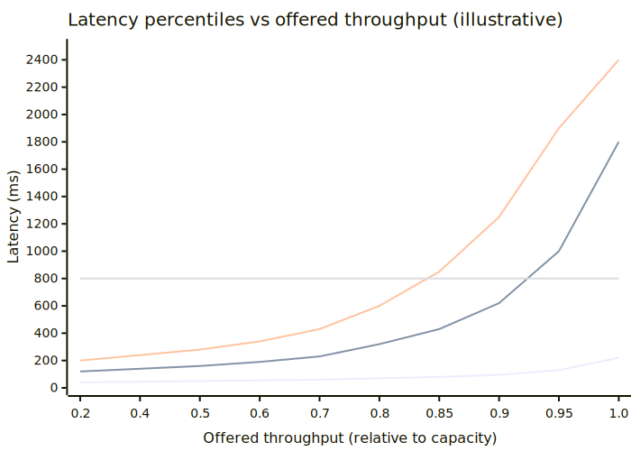
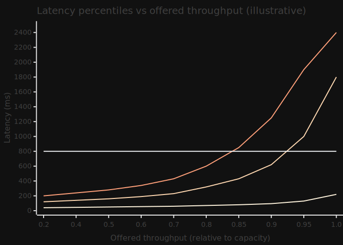

## Bottleneck classes and isolation discipline

Most production incidents under load are not mysterious; they belong to a small set of classes competing to be the binding constraint:

| Class | Typical signals | Notes |
| --- | --- | --- |
| CPU-bound | High CPU, growing run queue, flame profiles implicate hot functions | Watch for CPU wasted on retries or excessive serialisation |
| Memory / GC | Heap pressure, GC pause spikes, OOM kills | Allocation rates often matter more than steady-state heap size |
| Disk / I/O | I/O wait, fsync latency, WAL fsync stalls | SSD vs HDD and shared-storage noisy neighbours dominate repeatability |
| Network | Bandwidth, packet loss, connection churn, TLS overhead | Client-side concurrency limits and keep-alive behaviour matter |
| Synchronisation | Lock wait time, thread pool exhaustion, message backlog | Worsens nonlinearly past a threshold (Kingman's variability term) |
| Dependencies | Upstream p95/p99, pool timeouts, circuit-breaker opens | "Our service is fine" while a database or cache is not |

Effective tests change one major variable at a time when validating a suspected bottleneck. Rolling a new build, shrinking instance sizes, and doubling traffic in the same run produces a result that is not attributable—and therefore not actionable.

Cross-service bottlenecks deserve explicit mention because they invalidate local optimisation. The common pattern: the service under test saturates its thread pool while waiting on a dependency outside the test's observability boundary. When planning remediation, ask whether the binding constraint is your CPU, your dependency's capacity, or your **coupling shape**—fan-out, chatty APIs, missing batching, absence of backpressure. The right capacity decision might be more instances, or it might be removing redundant calls.

## Controls, correlation, and "we only changed one thing"

Production dashboards excel at correlation: latency rose when traffic rose. Load tests exist to tighten causality under controlled inputs. Practical controls:

- Pin build artefacts; record the exact image digest in the report.
- Fix seed data versions and feature-flag state; capture both alongside results.
- Disable unrelated background jobs and noisy neighbours.
- Re-run the failing test on a second day before treating it as a result. If the failure is not reproducible, treat the first run as suspect—flaky environments, shared dependencies, or insufficient warmup are common culprits.

The discipline is the same as any experiment: reduce degrees of freedom until the hypothesis is actually tested. The Workbook's guidance on [implementing SLOs](https://sre.google/workbook/implementing-slos/)—multi-window, multi-burn-rate alerting—maps cleanly onto declaring steady-state versus transient regimes in a test plan.

## Shadow traffic and dark launches: testing with production realism

A staging environment can be production-shaped, but it is rarely production-mixed. Two complementary techniques close that gap without putting users at risk:

- **Shadow traffic (request mirroring).** The edge proxy sends each production request to both the live service and a "shadow" copy of the new build, returns only the live response to the user, and discards the shadow response. Envoy implements this via [`request_mirror_policies`](https://www.envoyproxy.io/docs/envoy/latest/api-v3/config/route/v3/route_components.proto.html) with a configurable runtime fraction; mirroring is fire-and-forget and never affects the user-facing response.
- **Dark launches.** The new code path runs in production but its observable effects are gated by a feature flag, percentage rollout, or sandboxed side-effect target. The team measures real production behaviour before the user sees it.


> [!IMPORTANT]
> Shadow traffic is safe only when downstream side effects are isolated. A shadow path that double-charges a payment provider, double-publishes a Kafka event, or doubly mutates the same database row turns a measurement tool into an incident generator. Sandbox writes, swap providers for sandbox modes, or restrict shadowing to read-only paths.

Shadow traffic is the highest-fidelity load test available because the workload is, by construction, the workload. It is also the right vehicle for regression baselines: compare p50/p95/p99, error class, and (where feasible) response *diff* between the live and shadow paths under identical input distributions. Anything load tests miss—long-tail input shapes, undocumented client behaviour, multi-tenant skew—shows up here first.

## From measurements to a capacity envelope

A single "max RPS" number is rarely portable across mixes. What you can defend is a **capacity envelope**: for each scenario family, the maximum sustainable throughput at which the SLOs and error budgets hold, plus the observed binding constraint. The envelope is a surface, not a point—different mixes trace different curves. The Universal Scalability Law gives a useful framing for *why* throughput plateaus and degrades past a knee point: contention bends the curve, and the **coherency penalty**—pairwise coordination costs—drives the retrograde region where adding load actively reduces throughput.[^usl]

When translating measurements into allowed production targets, separate three notions:

1. **Demonstrated steady-state capacity** under the tested mix and environment-parity assumptions.
2. **Planned peak demand**, including marketing events and organic growth.
3. **Headroom**, covering failover (lose an AZ or shard), deployment-induced transients, data growth, and model error.

A workable default is to size for *N − 1 zone* failure plus 20–30 % headroom on top, then verify with a breakpoint test that the published target sits comfortably below the knee of the envelope, not on it. Headroom is not cowardice; it is the explicit price of unknowns. The [AWS Well-Architected performance efficiency pillar](https://docs.aws.amazon.com/wellarchitected/latest/performance-efficiency-pillar/welcome.html) is a mainstream articulation of reviewing data patterns, resource selection, and monitoring in light of changing demand. The AWS Builders' Library article on [using load shedding to avoid overload](https://aws.amazon.com/builders-library/using-load-shedding-to-avoid-overload/) is explicit that services should be tested past the point of failure, with the goal that *goodput plateaus* rather than drops to zero.

If you publish a number without stating the headroom rationale, operators cannot tell whether they are one bad deploy away from violating an SLO.

## Turning bottleneck class into a capacity decision

Once the binding constraint is named, the decision tree is usually boring—which is good. CPU-bound with healthy dependency headroom may justify horizontal scale *if* the architecture scales out cleanly (shared-nothing request handling, partitionable data, no hidden global locks). Memory-bound with GC churn often points to allocation hotspots or cache policy before it points to "buy bigger RAM." Dependency-bound outcomes frequently land on **shape-of-traffic** work: batching, collapsing N+1 patterns, tightening timeouts, or pushing work asynchronous so user-facing paths stop waiting on best-effort systems.

Capacity planning is not obligated to choose the cheapest engineering fix first; it *is* obligated to compare **time-to-mitigate** versus **time-to-fail** under forecast demand. A load test that ends with "we need a redesign" is still valuable if it moves that discovery left of a revenue event. Document the rejected options too ("we could scale replicas, but stateful session affinity makes that linearly expensive"), because those notes become the institutional memory that prevents repeating the same playbook.


## Regression baselines and the planning loop

A capacity envelope is only useful if it stays current. Treat the envelope as **stale by default** and establish a regression baseline that re-derives it on the changes most likely to invalidate it:

- Major version upgrades of the runtime, JVM, JIT, or database engine.
- Storage engine swaps, index changes, or schema migrations that touch hot paths.
- Architecture changes: new cache tier, resharding, fan-out or fan-in changes, retry policy changes.
- Feature-flag flips that change request shape (e.g. enabling personalisation for a new tenant tier).

The baseline run does not need to be the full breakpoint; the cheapest re-validation is the same step ramp at the same dwell points, with the percentile envelope chart compared diff-style against the previous baseline. Any deviation outside a pre-declared tolerance triggers a deeper run.

The capacity-planning loop closes here: model the workload, run the relevant test, measure the envelope, adjust the system or the published target, re-baseline. The diagram at the top of this article is that loop—not a one-shot pipeline.

## Reporting that engineering and leadership can reuse

A useful load-test report answers the same questions every time:

- **Intent**: decision, hypothesis, and non-goals (what this test does *not* prove).
- **Workload**: mix table, arrival process and *open vs closed* declaration, duration, warmup definition, steady-state evidence.
- **Environment parity**: hardware generation, build digest, feature flags, data volume/cardinality, dependency behaviour (mocked, cloned, shadowed, or real), and known drift from production.
- **Results**: SLO charts with percentiles (not averages), error taxonomy, resource saturation ladder, top findings ranked by user impact.
- **Bottleneck conclusion**: binding constraint, evidence, and whether remediation is code, data, config, or capacity.
- **Capacity recommendation**: envelope summary, chosen production target, headroom policy, and **rollback triggers** (what metric breach sends the team back to the lab).

Rollback triggers should be operational sentences, not vibes. Example: "If production checkout p99 exceeds 2.0 s for ten consecutive minutes while offered load is within 80 % of modelled peak, freeze deploys, reduce optional background traffic, and page the owning team." Pair triggers with **evidence links**: dashboards, trace exemplars, and the specific test run ID that justified the limit. That is how load testing stays connected to incident response instead of living only in a quarterly slide deck.

The best reports include a short "what we would do next week" section: the next highest-risk hypothesis, the cheapest measurement to reduce uncertainty, and the retest cadence after changes.

## Closing heuristic

Treat load testing like any other experiment: if you cannot state what would prove you wrong, you are not ready to spend the org's time running it. Tools generate load; engineering generates **evidence**—grounded in workload realism, the right open/closed model, steady-state discipline, an explicit percentile envelope, bottleneck class analysis, and a capacity envelope with honest headroom.

[^little]: John D. C. Little, [*A Proof for the Queuing Formula L = λW*](https://doi.org/10.1287/opre.9.3.383), Operations Research 9(3), 1961.
[^kingman]: J. F. C. Kingman, [*The Single Server Queue in Heavy Traffic*](https://doi.org/10.1017/S0305004100036094), Mathematical Proceedings of the Cambridge Philosophical Society, 1961.
[^usl]: Neil J. Gunther, [*A General Theory of Computational Scalability Based on Rational Functions*](https://arxiv.org/abs/0808.1431) (arXiv:0808.1431, 2008).
[^openclosed]: Bianca Schroeder, Adam Wierman, Mor Harchol-Balter, [*Open Versus Closed: A Cautionary Tale*](https://www.usenix.org/legacy/event/nsdi06/tech/full_papers/schroeder/schroeder_html/), USENIX NSDI 2006.
[^hdrhistogram]: Gil Tene, [*HdrHistogram*](http://hdrhistogram.org/) — see the `recordValueWithExpectedInterval` API for the coordinated-omission correction.
[^tail]: Jeffrey Dean and Luiz André Barroso, [*The Tail at Scale*](https://research.google/pubs/the-tail-at-scale/), Communications of the ACM 56(2), 2013.
[^breakpoint]: Grafana Labs, [*Breakpoint testing: A beginner's guide*](https://grafana.com/blog/breakpoint-testing/), 2023.
