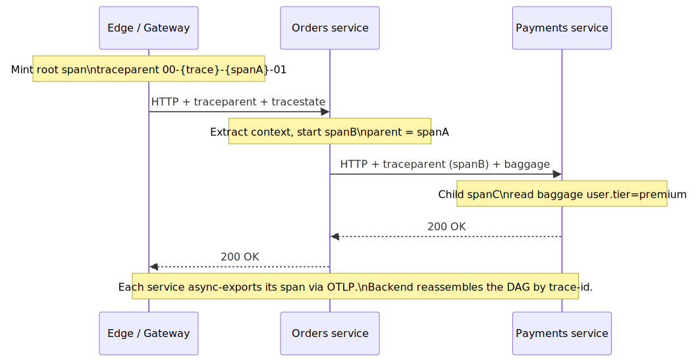
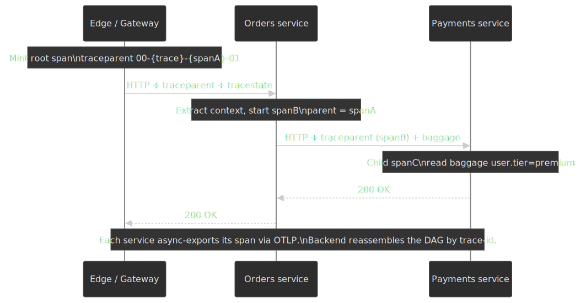

# Logging, Metrics, and Tracing Fundamentals

Observability in distributed systems rests on three complementary signals: logs capture discrete events with full context, metrics quantify system behavior over time, and traces reconstruct request paths across service boundaries. Each signal answers different questions, and choosing wrong defaults for cardinality, sampling, or retention can render your observability pipeline either useless or prohibitively expensive. This article covers the design reasoning behind each signal type, [OpenTelemetry](https://opentelemetry.io/docs/specs/otel/)'s unified data model, and the operational trade-offs that determine whether your system remains debuggable at scale.




## Abstract

Observability signals differ fundamentally in what they optimize:

- **Logs** preserve full event context at the cost of storage; use them for debugging specific incidents
- **Metrics** sacrifice detail for efficient aggregation; use them for alerting and dashboards
- **Traces** reconstruct causality across services; use them to understand distributed request flow

The critical design decisions:

1. **Cardinality** determines cost: metrics with unbounded label values (user IDs, request IDs) will crash your time-series database
2. **Sampling** trades completeness for cost: head sampling is predictable but blind to errors; tail sampling captures interesting traces but requires buffering
3. **Context propagation** (W3C Trace Context) links all three signals—without consistent TraceId propagation, correlation is manual and error-prone

OpenTelemetry (OTel) provides the current standard for instrumentation, unifying all signals under a single SDK with vendor-neutral export via OTLP (OpenTelemetry Protocol).

## Observability Signal Taxonomy

The three observability signals answer fundamentally different questions:

| Signal  | Question Answered                | Cardinality | Storage Cost | Query Pattern            |
| ------- | -------------------------------- | ----------- | ------------ | ------------------------ |
| Logs    | "What happened in this request?" | Unbounded   | Highest      | Full-text search, filter |
| Metrics | "How is the system behaving?"    | Bounded     | Lowest       | Aggregation, rate        |
| Traces  | "How did this request flow?"     | Sampled     | Medium       | Trace ID lookup, DAG     |

### Why Three Signals?

Each signal represents a different trade-off between detail and scalability:

**Logs** preserve everything—the full request body, stack traces, variable values—but this completeness makes them expensive to store and slow to query. You cannot aggregate logs efficiently; searching requires scanning text.

**Metrics** discard detail to enable aggregation. A counter tracking `http_requests_total` can be summed across instances, compared over time windows, and stored in constant space per label combination. But you cannot reconstruct individual requests from metrics.

**Traces** bridge the gap by preserving request structure (which services were called, in what order, how long each took) while sampling to control cost. A trace lets you understand causality—why a request was slow—but sampling means you might miss the specific request causing a user complaint.

### OpenTelemetry Data Model

The three signals stabilized on different timelines: tracing reached [Release Candidate in October 2020](https://medium.com/opentelemetry/tracing-specification-release-candidate-ga-p-eec434d220f2) and is stable across all major SDKs; metrics stabilized in 2022–2023; the [logs data model and Logs Bridge API/SDK specs are stable](https://opentelemetry.io/docs/specs/status/), but **per-language SDK and bridge maturity still varies** — always check each language's [spec compliance matrix](https://github.com/open-telemetry/opentelemetry-specification/blob/main/spec-compliance-matrix.md) before treating logs as production-grade in your runtime. The OTel logging strategy is intentionally a *bridge* into existing loggers (`slog`, `logback`, `zap`, `python logging`) rather than a replacement, which is why bridge appenders ship on independent timelines per language.

The conceptual lineage of the trace model traces back to [Google's Dapper paper (Sigelman et al., 2010)](https://research.google/pubs/dapper-a-large-scale-distributed-systems-tracing-infrastructure/), which established the now-universal vocabulary: trace, span, parent-id, sampling, and the requirement that propagation overhead be negligible at every hop. Zipkin and Jaeger reified the model; W3C Trace Context standardized the wire format; OpenTelemetry unified the SDK surface.

All three signals share common context:

**Traces** consist of Spans organized into a directed acyclic graph (DAG). Each Span contains:

- `TraceId` (16 bytes): Unique identifier for the entire trace
- `SpanId` (8 bytes): Unique identifier for this span
- `ParentSpanId`: Links to parent span (empty for root)
- `Name`: Operation name (e.g., `HTTP GET /users`)
- `StartTime`, `EndTime`: Microsecond timestamps
- `Status`: OK, Error, or Unset
- `Attributes`: Key-value metadata (bounded cardinality)
- `Events`: Timestamped annotations within the span
- `Links`: References to related spans (e.g., batch job linking to triggering requests)

**Metrics** use a temporal data model with three primary types:

- **Counter**: Monotonically increasing value (requests, bytes, errors)
- **Gauge**: Point-in-time measurement (CPU%, queue depth, active connections)
- **Histogram**: Distribution across buckets (latency percentiles)

**Logs** in OpenTelemetry include:

- `Timestamp`: When the event occurred
- `SeverityNumber`/`SeverityText`: Log level
- `Body`: The log message (string or structured)
- `Attributes`: Additional context
- `TraceId`, `SpanId`: Links to active trace (automatic correlation)

The critical design choice: logs automatically inherit `TraceId` and `SpanId` from the active span context. This enables trace-log correlation without manual instrumentation.

## Connecting the Three Pillars

The three signals are valuable individually, but the leverage comes from the joins between them. There are three you should design for explicitly.

### Trace context is the join key

Every signal that flows out of an instrumented process should carry the active `TraceId` (and, where it makes sense, the `SpanId`). The OpenTelemetry [logs data model](https://opentelemetry.io/docs/specs/otel/logs/data-model/) defines `TraceId` and `SpanId` as first-class top-level fields specifically so that backends can join logs to traces without parsing message bodies. Concretely:

- **Logs → Trace**: A log line emitted inside a span is decorated with that span's `TraceId` / `SpanId`. Click through from the log to the trace in your backend.
- **Metric → Trace**: An exemplar attached to a histogram bucket carries `trace_id` (see *Sampling and Correlation* below). Click through from a high-latency p99 cell to the exact slow trace.
- **Trace → Logs / Metrics**: From a span, query "all logs with this `trace_id`" and "all metric series for this `service.name` during `[span.start, span.end]`".

Without consistent `TraceId` propagation, all of this collapses to manual timestamp + `service.name` matching, which is unreliable at any non-trivial scale.

### Span events vs structured logs

Span events and structured logs overlap, and the [OpenTelemetry events / logs guidance](https://opentelemetry.io/docs/specs/otel/logs/event-api/) is the clearest source on which to pick. Use this rule:

| Use a **span event** when                                  | Use a **structured log** when                                          |
| :--------------------------------------------------------- | :--------------------------------------------------------------------- |
| The annotation is intrinsic to a single span's lifecycle.  | The event is independent of any active span (background job, startup). |
| You want it to ride with the span (no separate ingestion). | You want full-text search / log-pipeline routing on it.                |
| Examples: `cache.miss`, `retry.attempt`, `gc.pause`.       | Examples: `request received`, audit trail, deploy notice.              |

Span events are cheaper (they piggyback on an existing span), but they vanish if the span is dropped by sampling. Logs survive sampling but cost more per event. As a default: span events for in-span breadcrumbs, structured logs for everything that must be retained even when the trace is not.

### Baggage is for cross-cut context, not storage

[W3C Baggage](https://www.w3.org/TR/baggage/) lets you propagate a small set of key/value pairs across service boundaries. Use it for context every downstream service needs (`tenant.id`, `feature.flag.experiment_a`, `synthetic.probe=true`), but remember it does **not** automatically appear in spans, metrics, or logs — you copy it into span attributes / log attributes at each consumer. See the warning under *Baggage vs Span Attributes* for the size and PII caveats.

## Structured Logging Practices

Structured logging replaces free-form text with machine-parseable records, typically JSON. The design reasoning: logs must be queryable at scale, and structured formats enable indexing, filtering, and aggregation that text logs cannot support.

### Log Schema Design

A well-designed log schema includes:

```json collapse={1-2, 14-15}
// Example structured log entry
{
  "timestamp": "2024-01-15T10:23:45.123Z",
  "level": "ERROR",
  "service": "payment-service",
  "trace_id": "abc123def456",
  "span_id": "789xyz",
  "message": "Payment processing failed",
  "error.type": "TimeoutException",
  "error.message": "Gateway timeout after 30s",
  "http.method": "POST",
  "http.url": "/api/v1/payments",
  "payment.amount": 99.99,
  "payment.currency": "USD"
}
```

**Schema principles:**

1. **Flat structure**: Nested JSON (more than 2-3 levels) degrades query performance in most log backends
2. **Consistent naming**: Use OpenTelemetry Semantic Conventions (`http.method`, `error.type`) for cross-service correlation
3. **Bounded values**: Fields like `http.status_code` have finite cardinality; fields like `user_id` do not

### Log Levels and Semantics

Log levels communicate actionability, not importance:

| Level   | Semantics                                             | Production Use                   |
| ------- | ----------------------------------------------------- | -------------------------------- |
| `ERROR` | Actionable failure requiring investigation            | Alert, page on-call              |
| `WARN`  | Degraded condition, retry succeeded, missing config   | Monitor, investigate if frequent |
| `INFO`  | Business events, state transitions, request lifecycle | Normal operations                |
| `DEBUG` | Diagnostic detail, variable values                    | Disabled in production           |
| `TRACE` | Extremely verbose diagnostics                         | Never in production              |

**Design reasoning**: If every `ERROR` log does not warrant investigation, your log levels are miscalibrated. Teams that log expected conditions as `ERROR` (e.g., user validation failures) train themselves to ignore errors.

### Cardinality in Logs

Log cardinality matters less than metric cardinality for storage—logs are already unbounded by nature—but it critically affects query performance and indexing costs.

**High-cardinality fields** (user IDs, request IDs, session tokens):

- Store but do not index by default
- Use full-text search for ad-hoc queries
- Index only if frequently filtered

**Indexing strategy**:

```text
Index: timestamp, level, service, trace_id, http.status_code
No index: user_id, request_body, stack_trace
```

### Performance Implications

Logging overhead is implementation- and hardware-dependent, but in practice the order of magnitude is:

- **Synchronous file logging**: ~0.5–2 ms per entry (disk I/O bound; jitter spikes when the OS flushes)
- **Asynchronous buffered logging**: ~0.01–0.1 ms per entry (memory buffer, batched flush)
- **Network logging**: ~0.1–0.5 ms per entry (depends on batching, TLS, backpressure)

For high-throughput services (>10K requests/second), synchronous logging is not viable. Use async logging with:

- Ring buffer for backpressure (drop oldest on overflow)
- Batch size of 100-1000 entries
- Flush interval of 100-500ms

## Metrics Design and Aggregation

Metrics enable the aggregation that logs cannot support. The fundamental constraint: metrics work because they have bounded cardinality. Each unique label combination creates a new time series, and time-series databases (TSDBs) store each series independently.

### Metric Types

**Counter**: Cumulative value that only increases (or resets to zero on restart).

```promql
http_requests_total{method="GET", status="200"} 150432
http_requests_total{method="GET", status="500"} 42
http_requests_total{method="POST", status="201"} 8923
```

Query pattern: `rate(http_requests_total[5m])` gives requests per second.

**Gauge**: Point-in-time measurement that can increase or decrease.

```promql
active_connections{pool="primary"} 47
cpu_usage_percent{core="0"} 72.3
queue_depth{queue="orders"} 128
```

Query pattern: instant value or average over time window.

**Histogram**: Distribution of observations across predefined buckets.

```promql
http_request_duration_seconds_bucket{le="0.1"} 24054
http_request_duration_seconds_bucket{le="0.25"} 32847
http_request_duration_seconds_bucket{le="0.5"} 34012
http_request_duration_seconds_bucket{le="1.0"} 34500
http_request_duration_seconds_bucket{le="+Inf"} 34567
http_request_duration_seconds_count 34567
http_request_duration_seconds_sum 8234.56
```

Query pattern: `histogram_quantile(0.95, rate(http_request_duration_seconds_bucket[5m]))` gives p95 latency.

**Design reasoning for histograms**: Buckets are cumulative (`le` = "less than or equal") because cumulative buckets enable accurate percentile calculation during aggregation. Non-cumulative buckets lose information when summed across instances.

### Bucket Configuration

Histogram bucket boundaries should align with your SLOs (Service Level Objectives):

```text
# Latency histogram for API with 200ms p99 SLO
buckets: [0.01, 0.025, 0.05, 0.1, 0.2, 0.5, 1.0, 2.5, 5.0, 10.0]
         ^^^^^          ^^^^^^^^^^^^  ^^^^^^^^^^^^^^^
         fine-grained   SLO region    tail latency
```

**Trade-off**: More buckets = better resolution but more time series (one per bucket per label combination). For a metric with 5 labels averaging 10 values each: `5 labels × 10 values × 15 buckets = 7,500 time series` per metric.

### Cardinality Explosion

The most common operational failure in metrics systems: unbounded label values crash your TSDB.

**Example of cardinality explosion**:

```promql
# DANGEROUS: user_id has unbounded cardinality
http_requests_total{user_id="u123", endpoint="/api/orders"}

# With 1M users and 50 endpoints:
# 1,000,000 × 50 = 50,000,000 time series
```

Prometheus holds the active "head" block — every currently-scraped series plus its in-flight chunks — entirely in memory, secured by the WAL.[^prom-storage] Operational write-ups put per-series cost in the **~3 KiB low end to ~7 KiB upper end** range, depending on label fan-out, chunk fill, and churn; head-chunk memory mapping (added in v2.19) trims another 20–40% off resident size for stable workloads.[^prom-mmap] Even at the 3 KiB floor, 50 M active series needs roughly 150 GB of head RAM — well past what a single Prometheus pod can hold. In practice you hit OOMs, scrape timeouts, and rule-evaluation failures long before that.

[^prom-storage]: [Prometheus — Storage (local TSDB / head block / WAL)](https://prometheus.io/docs/prometheus/latest/storage/).
[^prom-mmap]: [Grafana Labs — *New in Prometheus v2.19.0: Memory-mapping of full chunks of the head block reduces memory usage by as much as 40%*](https://grafana.com/blog/2020/06/04/new-in-prometheus-v2.19.0-memory-mapping-of-full-chunks-of-the-head-block-reduces-memory-usage-by-as-much-as-40/).




**Symptoms of cardinality problems**:

- Prometheus memory usage grows unboundedly
- Query latency increases from seconds to minutes
- Scrape targets timeout
- Alerting rules fail to evaluate

**Mitigation strategies**:

1. **Never use IDs as labels**: User IDs, request IDs, transaction IDs belong in logs and traces, not metrics
2. **Pre-aggregate in application**: Count users per tier (`premium`, `standard`) rather than per user
3. **Cardinality budgets**: Set limits per metric (e.g., max 1000 series per metric)
4. **Metric relabeling**: Drop high-cardinality labels at scrape time

### RED and USE Methods

**RED Method** (for services): Request-oriented metrics aligned with user experience.

- **Rate**: Requests per second (`rate(http_requests_total[5m])`)
- **Errors**: Error rate (`rate(http_requests_total{status=~"5.."}[5m]) / rate(http_requests_total[5m])`)
- **Duration**: Latency distribution (`histogram_quantile(0.99, rate(http_request_duration_seconds_bucket[5m]))`)

**USE Method** (for resources): Resource-oriented metrics for infrastructure.

- **Utilization**: Percent time resource is busy (`avg(cpu_usage_percent)`)
- **Saturation**: Queue depth, waiting work (`avg(runnable_tasks_count)`)
- **Errors**: Hardware errors, I/O failures (`rate(disk_errors_total[5m])`)

**Design reasoning**: RED tells you when users are impacted; USE tells you why. A latency spike (RED) might be caused by CPU saturation (USE). Use both methods together.

### Google's Four Golden Signals

The SRE book's monitoring framework:

1. **Latency**: Time to service a request (distinguish success vs error latency)
2. **Traffic**: Demand on the system (requests/sec, transactions/sec)
3. **Errors**: Rate of failed requests (explicit 5xx, implicit timeouts)
4. **Saturation**: How "full" the system is (CPU, memory, queue depth)

Golden Signals overlap with RED+USE but emphasize saturation as a leading indicator. A system at 95% CPU is not yet failing (RED looks fine) but cannot absorb traffic spikes.

## Distributed Tracing and Context

Tracing reconstructs request flow across service boundaries. The core abstraction: a **Span** represents a unit of work with defined start/end times, and **Traces** are directed acyclic graphs of spans sharing a `TraceId`.

### Span Anatomy

```text
Trace: abc123
├── Span: 001 (root) "HTTP GET /checkout" [0ms - 250ms]
│   ├── Span: 002 "Query user" [10ms - 30ms]
│   ├── Span: 003 "HTTP POST /payment-service" [35ms - 200ms]
│   │   └── Span: 004 "Process payment" [40ms - 195ms]
│   │       ├── Span: 005 "Validate card" [45ms - 60ms]
│   │       └── Span: 006 "Charge gateway" [65ms - 190ms]
│   └── Span: 007 "Update inventory" [205ms - 245ms]
```

Each span includes:

- **Operation name**: What work this span represents
- **Timing**: Start and end timestamps (microsecond precision)
- **Attributes**: Key-value metadata (e.g., `http.status_code: 200`)
- **Events**: Timestamped annotations within the span (e.g., "Retry attempt 2")
- **Status**: Success, error, or unset

### Context Propagation

Trace context must cross process boundaries (HTTP calls, message queues, RPC). The [W3C Trace Context Recommendation](https://www.w3.org/TR/trace-context/) (first published 2020, [Level 1 republished 2021-11-23](https://www.w3.org/standards/history/trace-context-1/)) defines two headers:

**traceparent**: `version-trace-id-parent-id-flags`

```text
traceparent: 00-0af7651916cd43dd8448eb211c80319c-b7ad6b7169203331-01
             ^^ ^^^^^^^^^^^^^^^^^^^^^^^^^^^^^^^^ ^^^^^^^^^^^^^^^^ ^^
             |  trace-id (16 bytes / 32 hex)      parent-id        flags
             version                              (8 bytes)        (01 = sampled)
```

**tracestate**: Vendor-specific extensions

```text
tracestate: congo=t61rcWkgMzE,rojo=00f067aa0ba902b7
```

**Design reasoning**: W3C Trace Context separates trace identity (`traceparent`) from vendor extensions (`tracestate`). This enables multi-vendor environments — your Datadog instrumentation can coexist with New Relic without losing the trace ID.




> [!NOTE]
> Prior to W3C Trace Context, multiple incompatible formats coexisted: [Zipkin's B3 headers](https://github.com/openzipkin/b3-propagation) (`X-B3-TraceId`, `X-B3-SpanId`), Jaeger's `uber-trace-id`, and AWS X-Ray's `X-Amzn-Trace-Id`. Cross-vendor correlation required custom bridging at every hop. Most SDKs still ship multi-format propagators for backward compatibility.

### Baggage vs Span Attributes

**Span Attributes** attach to a single span and are not propagated:

```typescript
span.setAttribute("user.tier", "premium")
span.setAttribute("feature.flag.checkout_v2", true)
```

**Baggage** propagates across service boundaries:

```typescript
// Service A: Set baggage
baggage.setEntry("user.tier", "premium")

// Service B: Read baggage (automatically propagated)
const tier = baggage.getEntry("user.tier")
// Must explicitly add to span if needed for querying
span.setAttribute("user.tier", tier)
```

**Design reasoning**: Baggage is a transport mechanism, not storage. It travels with requests but does not automatically appear in trace backends. You must explicitly copy baggage entries to span attributes if you want them queryable.

**Use cases for baggage**:

- User ID for downstream services to log/trace
- Feature flags affecting request handling
- Deployment version for canary analysis
- Tenant ID in multi-tenant systems

> [!WARNING]
> Baggage rides in HTTP headers and the [W3C Baggage spec](https://www.w3.org/TR/baggage/) caps the encoded `baggage-string` at **8192 bytes total** with at most **64 list members**. Conformant propagators may drop entries above those limits silently. Keep baggage small, never include secrets or PII (it leaks to every downstream service and proxy log), and remember every byte is paid on every hop.

## OpenTelemetry Pipeline: SDK and Collector

The [OpenTelemetry Collector](https://opentelemetry.io/docs/collector/) is a separate process (sidecar, agent, or gateway) that decouples your application from your observability backends. It is the place where the operationally expensive work — batching, tail sampling, redaction, schema enforcement, fan-out — lives, so the SDK in the application stays cheap and synchronous decisions stay local.

, and exporters that fan out to backends.")


The Collector is built from three [pluggable component types](https://opentelemetry.io/docs/collector/architecture/) wired into named pipelines per signal:

| Component      | Role                                                       | Common examples                                                                       |
| :------------- | :--------------------------------------------------------- | :------------------------------------------------------------------------------------ |
| **Receivers**  | Accept incoming telemetry over a wire format.              | `otlp` (gRPC + HTTP), `prometheus` (scrape), `jaeger`, `zipkin`, `kafka`, `filelog`.  |
| **Processors** | Transform, filter, batch, sample, or enforce limits.       | `batch`, `memory_limiter`, `tail_sampling`, `attributes`, `resourcedetection`, `k8s`. |
| **Exporters**  | Push telemetry out to one or more backends.                | `otlp`, `prometheusremotewrite`, `loki`, vendor exporters (Datadog, NR, Honeycomb).   |

**Why a Collector instead of SDK-direct-to-backend**:

1. **Tail sampling lives here.** The SDK cannot make tail decisions because it does not see all spans of a trace; the Collector buffers per-`trace_id` and applies the policy.
2. **Batching and retry shield the application.** Network blips, backend rate limits, and TLS handshakes do not block your request path.
3. **Schema and PII enforcement.** A single processor stage drops or redacts attributes before any backend sees them — far easier than fixing 40 services.
4. **Vendor swap is a config change.** Replace `exporters.datadog` with `exporters.otlp` pointing at a self-hosted backend without touching application code.

> [!TIP]
> Run the Collector in two tiers: an **agent** (sidecar or DaemonSet) close to the workload that adds resource attributes and forwards via OTLP, and a **gateway** cluster that owns tail sampling, fan-out, and backend credentials. This keeps the per-workload footprint tiny and the expensive stateful work centralized.

## Sampling and Cost Control

At scale, 100% trace collection is economically infeasible. A service handling 100K requests/second with 5 spans per request generates 43 billion spans per day. At typical trace storage costs ($1-5 per million spans), that's $43K-$215K per day.

Sampling reduces cost but trades off completeness.

### Head-Based Sampling

Decision made at trace start, before any spans are generated:

```typescript
// Probabilistic head sampler: 10% of traces
const sampler = new TraceIdRatioBasedSampler(0.1)

// All downstream services respect the sampling decision
// via the sampled flag in traceparent header
```

**Characteristics**:

- Low overhead: decision before span generation
- Predictable cost: fixed percentage of traces
- Blind to content: cannot sample based on errors or latency (unknown at decision time)
- Efficient: non-sampled requests generate no spans

**When to use**: High-volume systems where cost predictability matters more than capturing every error.

### Tail-Based Sampling

Decision made after trace completion, based on trace content:

```typescript
// Tail sampling policy: keep errors and slow traces
const policies = [
  { name: "errors", type: "status_code", status_codes: ["ERROR"] },
  { name: "slow", type: "latency", threshold_ms: 1000 },
  { name: "baseline", type: "probabilistic", sampling_percentage: 5 },
]
```

**Characteristics**:

- Higher overhead: all spans buffered until trace completes
- Variable cost: depends on how many traces match policies
- Content-aware: can sample based on errors, latency, attributes
- Complex infrastructure: requires centralized collector with buffering

**When to use**: When capturing all errors is more important than cost predictability.

### Hybrid Sampling Strategy

Production systems typically combine both:

1. **Head sampling at 10%**: Reduces span generation by 90% with no collector buffering required.
2. **Tail sampling on the remaining 10%**: Keeps errors, slow traces, and a baseline 5% random sample.

Effective rate: ~5% of normal traces, ~10% of error / slow traces stored — but every span you do keep is preceded by a head decision, so error capture is bounded by the head ratio. If you cannot tolerate any blind spot for errors, raise the head ratio (cost) or push the error decision into the tracer itself (e.g., parent-based sampler that always samples on error span status).




### Sampling and Correlation

Sampling breaks trace-log-metric correlation when inconsistent:

**Problem**: If traces are sampled at 10% but logs are 100%, 90% of logs have no corresponding trace.

**Solutions**:

1. **Always log TraceId**: Even non-sampled traces have valid TraceIds
2. **Sample logs with traces**: Use the sampled flag to gate verbose logging
3. **Exemplars**: Attach trace IDs to metric samples for drill-down

**Exemplars** bridge metrics and traces. They are part of the [OpenMetrics](https://prometheus.io/docs/specs/om/open_metrics_spec/#exemplars) text format (not the older Prometheus exposition format) and Prometheus needs `--enable-feature=exemplar-storage` plus a scrape negotiated as `application/openmetrics-text`:

```text
# TYPE http_request_duration_seconds histogram
http_request_duration_seconds_bucket{le="0.5"} 1234 # {trace_id="abc123",span_id="def456"} 0.32 1700000000.000
```

That `# { ... } value timestamp` suffix on a bucket sample is a reference to a specific trace. Grafana, Datadog, and New Relic all turn it into a one-click drill from a latency histogram cell to the exact trace whose duration landed in that bucket. [OpenMetrics 1.0](https://prometheus.io/docs/specs/om/open_metrics_spec/#exemplars) caps the exemplar `LabelSet` at **128 UTF-8 code points** total (label names + values, excluding separators) — enough for `trace_id` + `span_id` and not much else. The [experimental OpenMetrics 2.0](https://prometheus.io/docs/specs/om/open_metrics_spec_2_0/) draft removes the hard 128 cap in favor of soft guidance, but most current Prometheus / OTel exposers still enforce the 1.0 limit, so keep exemplar labels minimal in practice.

## Dashboards and Alerts

Observability is only useful if it drives action. Dashboards visualize system state; alerts trigger investigation.

### Dashboard Design Principles

**Level-of-detail hierarchy**:

1. **Overview dashboard**: SLO status, error budget, traffic. 5-10 panels max.
2. **Service dashboard**: RED metrics per service. Drill-down from overview.
3. **Infrastructure dashboard**: USE metrics per resource. Linked from service dashboard.
4. **Debug dashboard**: Detailed metrics for incident investigation. Not for routine monitoring.

**Anti-pattern**: Wall of graphs that no one looks at. If a panel does not drive action, remove it.

### Alert Design Principles

**Alert on symptoms, not causes**:

- **Good**: Error rate > 1% for 5 minutes (user impact)
- **Bad**: CPU > 80% (might be normal, might not affect users)

**Multi-window alerting** (SLO-based):

```yaml
# Alert when burning error budget too fast
# 2% of monthly budget consumed in 1 hour = 36x burn rate
- alert: HighErrorBudgetBurn
  expr: |
    (
      sum(rate(http_requests_total{status=~"5.."}[1h]))
      / sum(rate(http_requests_total[1h]))
    ) > (0.02 / 720)  # 2% budget in 1/720th of month
  for: 5m
```

**Alert fatigue mitigation**:

- Require sustained condition (`for: 5m`) to avoid flapping
- Page only on user-impacting symptoms
- Ticket/warning for leading indicators (saturation)
- Review and prune alerts quarterly

### Runbooks

Every alert should link to a runbook covering:

1. **What this alert means**: Symptom description
2. **Impact assessment**: User-facing? Which users?
3. **Investigation steps**: Which dashboards? What queries?
4. **Remediation options**: Scaling? Rollback? Restart?
5. **Escalation path**: Who to contact if stuck

## Decision Matrix: Which Signal for Which Question

When triaging a production question, pick the cheapest signal that can answer it. The hierarchy below collapses the per-section trade-offs into a single lookup.

| Question                                                | Primary signal             | Secondary signal                       | Why                                                                          |
| :------------------------------------------------------ | :------------------------- | :------------------------------------- | :--------------------------------------------------------------------------- |
| Are users impacted right now? (alerting)                | Metrics (RED + SLO burn)   | —                                      | Constant-cost aggregation, sub-second query, paging-grade latency.           |
| Which dependency is causing the SLO burn?               | Traces (sampled)           | Metrics (per-dependency RED)           | Trace shows the slow span; metrics confirm the breadth of impact.            |
| Why did *this specific* user request fail?              | Logs (filtered by user_id) | Trace (via `trace_id` in the log)      | Logs hold the full payload; trace shows the cross-service path.              |
| Is the slow tail a noisy neighbor or my own service?    | Traces with exemplars      | USE metrics (CPU / IO saturation)      | Exemplar drill-down picks one slow trace; USE separates infra from app.      |
| Did a recent deploy regress p99?                        | Metric (latency histogram) | Trace + log (filtered by deploy / SHA) | Histogram shows the regression; trace + log show the call path that broke.   |
| Did a feature flag change behavior in a single region?  | Metric split by `region`   | Baggage-propagated `feature.flag.*`    | Cardinality is bounded by region count; baggage carries the flag downstream. |
| Audit / compliance: who did what, when?                 | Logs (durable, indexed)    | —                                      | Logs are the only signal that survives sampling and retention compression.   |
| What's the long-term capacity trend?                    | Metrics (recorded rules)   | —                                      | Logs and traces are too expensive to retain for capacity planning windows.   |

The asymmetric cost ordering (metrics ≪ traces ≪ logs) means: instrument metrics generously, sample traces aggressively, and log only what you cannot reconstruct from the other two.

## Conclusion

Effective observability requires understanding the fundamental trade-offs:

**Logs** provide complete context but are expensive and slow to query. Use them for debugging specific incidents, not routine monitoring. Structure them for queryability and keep high-cardinality fields out of indexes.

**Metrics** enable aggregation and alerting but require bounded cardinality. Never use unbounded values (IDs, emails) as metric labels. Design histograms with SLO-aligned buckets.

**Traces** reconstruct distributed request flow but require sampling. Choose sampling strategy based on whether you prioritize cost predictability (head) or error capture (tail). Hybrid approaches offer balance.

**Context propagation** (W3C Trace Context) links all three signals. Without consistent `TraceId` propagation, correlation is manual and unreliable.

The cost hierarchy—metrics cheapest, traces middle, logs expensive—should guide your instrumentation strategy. Capture metrics for everything, sample traces for request flow, and log detailed context only when investigating.

## Appendix

### Prerequisites

- Familiarity with distributed systems concepts (services, RPC, message queues)
- Basic understanding of time-series data and aggregation
- Experience with at least one monitoring tool (Prometheus, Datadog, etc.)

### Terminology

- **Cardinality**: Number of unique values a field can take; in metrics, number of unique label combinations
- **OTLP**: OpenTelemetry Protocol, the wire format for exporting telemetry
- **SLO**: Service Level Objective, a target for service reliability (e.g., 99.9% availability)
- **TSDB**: Time-Series Database, optimized for timestamped data (e.g., Prometheus, InfluxDB)
- **Exemplar**: A sample metric data point with trace ID attached for drill-down

### Summary

- Logs, metrics, and traces answer different questions: logs for "what happened," metrics for "how is it behaving," traces for "how did the request flow"
- Cardinality is the critical constraint for metrics; unbounded labels crash TSDBs
- Head sampling is predictable but blind; tail sampling captures errors but costs more
- W3C Trace Context (`traceparent`, `tracestate`) is the standard for context propagation
- RED (Rate, Errors, Duration) measures user experience; USE (Utilization, Saturation, Errors) diagnoses infrastructure
- Alert on symptoms (error rate) not causes (CPU usage)

### References

- [OpenTelemetry Specification](https://opentelemetry.io/docs/specs/otel/) — Authoritative specification for traces, metrics, logs, and baggage.
- [OpenTelemetry Versioning and Stability](https://opentelemetry.io/docs/specs/otel/versioning-and-stability/) — Per-signal lifecycle and per-language SDK stability matrix.
- [W3C Trace Context (Recommendation, 2021-11-23)](https://www.w3.org/TR/trace-context/) — `traceparent` / `tracestate` header format and semantics.
- [W3C Baggage](https://www.w3.org/TR/baggage/) — Baggage propagation header, with size and member-count limits.
- [Prometheus: Histograms and Summaries](https://prometheus.io/docs/practices/histograms/) — Cumulative bucket design and query patterns.
- [OpenMetrics 1.0 — Exemplars](https://prometheus.io/docs/specs/om/open_metrics_spec/#exemplars) — Wire format for trace-linked metric samples.
- [Google SRE Book: Monitoring Distributed Systems](https://sre.google/sre-book/monitoring-distributed-systems/) — Four Golden Signals and monitoring philosophy.
- [OpenTelemetry Semantic Conventions](https://opentelemetry.io/docs/concepts/semantic-conventions/) — Standardized attribute names for telemetry.
- [The RED Method](https://grafana.com/blog/2018/08/02/the-red-method-how-to-instrument-your-services/) — Tom Wilkie's service-oriented monitoring framework.
- [USE Method](https://www.brendangregg.com/usemethod.html) — Brendan Gregg's resource-oriented analysis method.
- [OpenTelemetry Sampling](https://opentelemetry.io/docs/concepts/sampling/) — Head and tail sampling strategies.
- [OpenTelemetry Logs Data Model](https://opentelemetry.io/docs/specs/otel/logs/data-model/) — Stable logs schema with trace correlation fields.
- [B3 Propagation (Zipkin)](https://github.com/openzipkin/b3-propagation) — Pre-W3C distributed trace headers, still common as a fallback propagator.
- [Dapper, a Large-Scale Distributed Systems Tracing Infrastructure (Sigelman et al., 2010)](https://research.google/pubs/dapper-a-large-scale-distributed-systems-tracing-infrastructure/) — The original paper that defined trace, span, parent-id, and the low-overhead sampling model.
- [OpenTelemetry Collector](https://opentelemetry.io/docs/collector/) — Receivers / processors / exporters architecture and deployment patterns (agent + gateway).
- [OpenTelemetry Logs Bridge / Event API](https://opentelemetry.io/docs/specs/otel/logs/event-api/) — When to use span events vs log records.
- [OpenMetrics 1.0 — full specification](https://prometheus.io/docs/specs/om/open_metrics_spec/) — Wire format, type system, exemplar rules.
