# Micro-Frontends Architecture: Composition, Isolation, and Delivery

Micro-frontends extend the microservice idea to the browser: independently built and deployed UI units that compose into one product. The pattern was named in the [ThoughtWorks Tech Radar in late 2016](https://www.thoughtworks.com/radar/techniques/micro-frontends) and crystallised by [Cam Jackson's June 2019 piece on martinfowler.com](https://martinfowler.com/articles/micro-frontends.html) and [Michael Geers' micro-frontends.org](https://micro-frontends.org/) (started March 2017). This article is for a senior engineer choosing whether to split a frontend, and if so, where to draw the seams. The thesis: micro-frontends are an organisational decision first; the technical pattern only earns its complexity when several teams need independent release cadence over one product surface, and even then the cheapest viable split — often a modular monolith with strong package boundaries — beats a "distributed monolith" disguised as MFEs.

## When micro-frontends actually earn their cost

> [!IMPORTANT]
> A modular monolith with disciplined ownership covers ~80% of "we should do micro-frontends" conversations. Reach for the real pattern when org reality forces it, not the other way around.

Pick micro-frontends only when most of the following hold:

- **3+ teams** each need their own release cadence on the same product surface, and feature work is currently bottlenecked on a shared release train.
- **Stable domain seams.** The split lines come from the product, not from the framework. If the seam moves every quarter, the integration tax dominates.
- **CI/CD maturity.** You already have contract testing, canary, and observability. Without these, micro-frontends just multiply outages.
- **Long-lived surface.** The cost of building shells, registries, and shared infra only amortises over years.

The opposite signals are equally clear. A single team, an unstable domain model, missing canary infrastructure, or a need for tight cross-feature interactions are all reasons to keep one app and invest in module boundaries first.


## Mental model: a stack of three boundaries

Every concrete micro-frontend setup is a choice across three independent boundaries. Confusing them is the most common source of design churn.

| Boundary | Question | Typical answers |
| --- | --- | --- |
| **Decomposition** | What is a unit? | Page, route segment, or in-page widget |
| **Composition** | Where are units assembled? | Build time, server, edge, or browser |
| **Integration** | How do units share runtime? | Iframes, Web Components, Module Federation, ESM imports |

A "page-per-team, edge-composed, Web-Components integration" stack and a "widget-per-team, browser-composed, Module Federation integration" stack are both valid micro-frontend architectures with very different trade-off profiles. Pick one boundary at a time.

### Build-time integration is the obvious wrong answer

The cheapest-looking technique — and the one most teams reach for first — is to publish each MFE as an npm package and `npm install` them into a container application that builds a single bundle. Cam Jackson's original article calls this out as the first approach to evaluate and the first to reject for the same reasons that ship a [distributed monolith](https://martinfowler.com/articles/micro-frontends.html#Build-timeIntegration): every MFE change forces a container re-release, the integration bug surface is identical to a modular monolith, and "independent deployment" becomes a CI talking point rather than reality. Use build-time linking only as a stepping stone (e.g., a shared design system shipped from one repo to many) — never as the integration seam between teams.

## Where assembly happens at run time

The location of assembly drives almost every other property — caching, latency, isolation, SEO, and team ergonomics. Once you have ruled out build-time integration, the live choice is between three run-time composition tiers.


| Strategy | Assembly point | Dominant techniques | When it fits |
| --- | --- | --- | --- |
| **Client-side** | Browser | [Module Federation](https://module-federation.io/), [Native Federation](https://www.angulararchitects.io/blog/announcing-native-federation-1-0/), [Web Components](https://developer.mozilla.org/en-US/docs/Web/API/Web_components), [single-spa](https://single-spa.js.org/), iframes | SPA-like products with rich shared interactivity and authenticated state |
| **Server-side** | Origin | SSR frameworks ([Next.js](https://nextjs.org/), [Nuxt](https://nuxt.com/)), [Tailor](https://github.com/zalando/tailor), [Podium](https://podium-lib.io/) | SEO-critical, cacheable surfaces where you want HTML out of the door fast |
| **Edge-side** | CDN PoP | [Cloudflare Workers + HTMLRewriter](https://developers.cloudflare.com/workers/runtime-apis/html-rewriter/), [ESI 1.0](https://www.w3.org/TR/esi-lang/), [Web Fragments](https://web-fragments.dev/) | Global audience, per-fragment caching, incremental migration of legacy apps |

You will often combine two — for example, edge composition for the public, cacheable shell and client-side composition for the authenticated dashboard inside it. What you almost never want is to mix all three for a single page, because each layer adds its own debug surface.

## Integration techniques in depth

### Iframes — strongest isolation, weakest UX

The iframe is the only browser primitive with a hard boundary on JavaScript, CSS, storage partitions (since [third-party storage partitioning](https://developer.mozilla.org/en-US/docs/Web/Privacy/State_Partitioning)), and origin. That isolation is exactly why they are still the right answer for embedding **untrusted** content (third-party widgets) or wrapping a legacy app you cannot otherwise touch. Communication is `postMessage`-only, and you pay a real cost in layout (no shared scrollbars, no shared focus model, accessibility tools have to walk the frame tree).

```html title="iframe-shell.html"
<main class="app-shell">
  <iframe
    src="https://catalog.example.com/embed"
    title="Product catalog"
    referrerpolicy="strict-origin-when-cross-origin"
    sandbox="allow-scripts allow-forms allow-same-origin"
    loading="lazy"
  ></iframe>
</main>
<script type="module">
  window.addEventListener("message", (event) => {
    if (event.origin !== "https://catalog.example.com") return
    if (event.data?.type === "ADD_TO_CART") {
      // bridge into the host app
    }
  })
</script>
```

Use iframes when you need a sandbox; do not use them when the only complaint is "we can't agree on a CSS reset." The accessibility, focus management, and routing penalties are real and survive every workaround.

### Web Components — the framework-neutral interface

Custom Elements and Shadow DOM are W3C/WHATWG standards designed to encapsulate styles and behaviour while behaving like a regular DOM element. They are the natural neutral interface between teams that have already chosen different frameworks.

```javascript title="product-card.js"
class ProductCard extends HTMLElement {
  static formAssociated = true

  constructor() {
    super()
    this.internals = this.attachInternals()
    this.attachShadow({ mode: "open", delegatesFocus: true })
  }

  connectedCallback() {
    const title = this.getAttribute("title") ?? ""
    const price = this.getAttribute("price") ?? ""
    this.shadowRoot.innerHTML = `
      <style>
        :host { display: block; }
        button { font: inherit; }
      </style>
      <article>
        <h3>${title}</h3>
        <p>$${price}</p>
        <button type="button">Add to cart</button>
      </article>
    `
    this.shadowRoot.querySelector("button").addEventListener("click", () => {
      this.dispatchEvent(
        new CustomEvent("add-to-cart", {
          detail: { productId: this.getAttribute("product-id") },
          bubbles: true,
          composed: true, // crosses the shadow boundary
        }),
      )
    })
  }
}

customElements.define("product-card", ProductCard)
```

Three things bite teams that adopt this naively, and all three have well-documented mitigations:

- **Events do not cross shadow boundaries by default.** Set `composed: true` on `CustomEvent` or the event will be retargeted at the host and never reach React/Vue listeners outside the component.
- **ARIA cannot reference IDs across shadow roots.** `aria-labelledby` and `aria-describedby` are scoped to the same root, which breaks the standard "label outside, control inside" pattern. Nolan Lawson's [shadow DOM and accessibility writeup](https://nolanlawson.com/2022/11/28/shadow-dom-and-accessibility-the-trouble-with-aria/) catalogues the live bug. Use [`ElementInternals.ariaLabel`](https://developer.mozilla.org/en-US/docs/Web/API/ElementInternals#instance_properties_relating_to_aria) or duplicate the label inside the shadow root.
- **Focus and forms need explicit opt-in.** `attachShadow({ delegatesFocus: true })` forwards focus from the host to the first focusable child. `static formAssociated = true` plus [`ElementInternals.setFormValue`](https://developer.mozilla.org/en-US/docs/Web/API/ElementInternals/setFormValue) is what enrols a custom element in native form submission and validation.

If your app already lives in a single framework, native components in that framework usually beat Web Components on ergonomics. The pattern earns its complexity when teams genuinely use different frameworks or when you ship a third-party widget that has to drop into anyone's stack.

### Module Federation — runtime code sharing for SPAs

[Module Federation](https://webpack.js.org/concepts/module-federation/) shipped in Webpack 5 (2020). A **host** declares **remotes** that expose modules through a `remoteEntry.js` container, and both sides declare a **shared** scope so common dependencies (React, Vue, the design system) load exactly once at runtime.

```javascript title="webpack.config.js (host)"
const { ModuleFederationPlugin } = require("webpack").container

module.exports = {
  output: { uniqueName: "shell" },
  plugins: [
    new ModuleFederationPlugin({
      name: "shell",
      remotes: {
        catalog: "catalog@https://cdn.example.com/catalog/remoteEntry.js",
        cart: "cart@https://cdn.example.com/cart/remoteEntry.js",
      },
      shared: {
        react: { singleton: true, requiredVersion: "^18.2.0" },
        "react-dom": { singleton: true, requiredVersion: "^18.2.0" },
      },
    }),
  ],
}
```

```javascript title="webpack.config.js (catalog remote)"
const { ModuleFederationPlugin } = require("webpack").container

module.exports = {
  output: { uniqueName: "catalog" },
  plugins: [
    new ModuleFederationPlugin({
      name: "catalog",
      filename: "remoteEntry.js",
      exposes: { "./ProductList": "./src/ProductList" },
      shared: {
        react: { singleton: true, requiredVersion: "^18.2.0" },
        "react-dom": { singleton: true, requiredVersion: "^18.2.0" },
      },
    }),
  ],
}
```

```jsx title="App.jsx (host)"
import React, { Suspense, lazy } from "react"
const ProductList = lazy(() => import("catalog/ProductList"))

export default function App() {
  return (
    <Suspense fallback={<p>Loading…</p>}>
      <ProductList />
    </Suspense>
  )
}
```

The runtime contract is the part teams under-invest in.


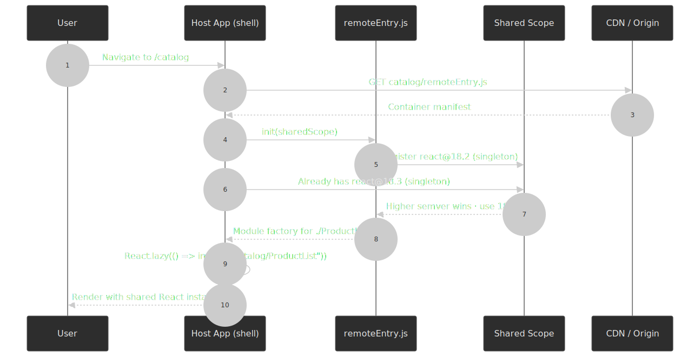

The official [`shared` configuration reference](https://module-federation.io/configure/shared) is non-negotiable reading: `singleton: true` enforces one instance, `requiredVersion` drives semver compatibility, and `strictVersion: true` upgrades version mismatches from a console warning to a runtime error. Without `singleton`, you can quietly ship two copies of React and break every hook that relies on module-scoped context.

> [!WARNING]
> Hooks, React Context, Redux, and i18n libraries all silently break when two copies of their module load. Always mark the framework, the design system runtime, and any context-bearing library as `singleton: true`. Anything stateless (e.g. lodash) can stay non-singleton to allow per-MFE versioning.

[**Module Federation 2.0**](https://github.com/module-federation/core/discussions/2397) (`@module-federation/enhanced`) is the current production target. It [decouples the runtime from the bundler](https://www.infoq.com/news/2026/04/module-federation-2-stable/), publishes an `mf-manifest.json` for deployment tracking, ships a [Chrome DevTools extension](https://module-federation.io/guide/debug/chrome-devtool) for dependency-graph inspection, and adds dynamic TypeScript type hints for remote modules. [Rspack](https://rspack.rs/guide/features/module-federation) ships built-in support for v1.5; v2.0 lands via the Rsbuild plugin. If you are starting today, target the v2.0 runtime regardless of bundler.

[**Native Federation**](https://www.angulararchitects.io/blog/announcing-native-federation-1-0/), introduced by Manfred Steyer, is the bundler-agnostic cousin: same mental model, but the wire format is plain ECMAScript Modules orchestrated by [import maps](https://html.spec.whatwg.org/multipage/webappapis.html#import-maps). It ships first-class for Angular's esbuild-based `ApplicationBuilder` and works with Vite. Use it when you want the federation pattern without coupling production to Webpack-family tooling.

### Import maps and single-spa — the standards-based path

Import maps have been a [WHATWG HTML specification](https://html.spec.whatwg.org/multipage/webappapis.html#import-maps) feature shipping in [all major browsers since 2023](https://web.dev/blog/import-maps-in-all-modern-browsers) (Chrome 89, Safari 16.4, Firefox 108). They map bare specifiers to URLs, which is enough to load and version micro-frontends without any bundler runtime.

```html title="index.html (root config)"
<script type="importmap">
  {
    "imports": {
      "@app/catalog": "https://cdn.example.com/catalog/v3.4.0/index.js",
      "@app/cart": "https://cdn.example.com/cart/v1.9.2/index.js",
      "react": "https://esm.sh/react@18.3.1",
      "react-dom/client": "https://esm.sh/react-dom@18.3.1/client"
    }
  }
</script>
```

[single-spa](https://single-spa.js.org/) is the most common orchestrator on top of this. A root config registers each MFE with an `activeWhen` route predicate and a loader; single-spa drives a `bootstrap → mount → unmount` lifecycle (each phase returns a Promise) on every route change. The optional `unload` only fires when you explicitly call [`unloadApplication`](https://single-spa.js.org/docs/api/#unloadapplication) — it resets the registered MFE to `NOT_LOADED` so the next mount re-runs `bootstrap`. Treat it as a hot-reload primitive, not as part of the steady-state route flow.

```javascript title="root-config.js"
import { registerApplication, start } from "single-spa"

registerApplication({
  name: "@app/catalog",
  app: () => import("@app/catalog"),
  activeWhen: ["/catalog", "/"],
})

registerApplication({
  name: "@app/cart",
  app: () => import("@app/cart"),
  activeWhen: ["/cart"],
})

start()
```

The [single-spa recommended setup](https://single-spa.js.org/docs/recommended-setup/) pairs import maps with [`import-map-overrides`](https://github.com/single-spa/import-map-overrides) so engineers can point a single MFE specifier at a local dev server while the rest of the app continues to load production builds. That workflow alone justifies the import-map approach for many teams.

The split versus Module Federation is real:

| Concern | Module Federation 2.0 | Import maps + single-spa |
| --- | --- | --- |
| Browser support | Any (bundler ships runtime) | All evergreen browsers natively; older needs SystemJS / `es-module-shims` |
| Shared deps | Negotiated via `shared` scope, semver, singleton | Whatever you put in the import map (no negotiation) |
| Build output | Container manifest + chunks | Plain ESM modules |
| Type safety across boundary | First-class via `mf-manifest.json` | Manual or build-time codegen |
| Runtime debug tools | Dedicated Chrome DevTools panel | Browser DevTools sources / network |

Use Module Federation when you need versioned, negotiated sharing of stateful libraries. Use import maps + single-spa when standards-only delivery and a thinner runtime are worth giving up automatic version negotiation.

### Edge composition with Cloudflare Workers and HTMLRewriter

[Cloudflare's `HTMLRewriter`](https://developers.cloudflare.com/workers/runtime-apis/html-rewriter/) is a streaming HTML parser based on Cloudflare's `lol-html`. It walks the document chunk by chunk and lets handlers transform elements as they pass — without ever buffering the full document — which is what makes it appropriate for assembling pages at the edge without sacrificing TTFB.

```javascript title="worker.js"
export default {
  async fetch(request, env) {
    const url = new URL(request.url)
    const shell = await fetch(`${env.SHELL_ORIGIN}${url.pathname}`, request)

    const fetchFragment = (origin) =>
      fetch(`${origin}${url.pathname}`, { headers: request.headers })

    return new HTMLRewriter()
      .on('fragment[name="header"]', {
        async element(el) {
          el.replace(await fetchFragment(env.HEADER_ORIGIN), { html: true })
        },
      })
      .on('fragment[name="catalog"]', {
        async element(el) {
          el.replace(await fetchFragment(env.CATALOG_ORIGIN), { html: true })
        },
      })
      .transform(shell)
  },
}
```

Two operational details matter for production:

- **Streaming replace.** Since the [January 2025 update](https://developers.cloudflare.com/changelog/post/2025-01-31-html-rewriter-streaming/), `replace`, `append`, and `prepend` accept a `Response` or `ReadableStream`. This lets you stream a fragment directly into the parent document instead of buffering it — preserving the TTFB you bought by composing at the edge.
- **Failure handling.** If a handler throws, parsing halts immediately, the transformed body errors, and any partial response is truncated. There is no retry at this layer. Wrap fragment fetches in `try/catch` and fall back to either a placeholder element or the cached previous version of the fragment.

The CSS-selector dialect supports most useful patterns (`E F`, `E > F`, attribute selectors) but [omits some pseudo-selectors](https://developers.cloudflare.com/workers/runtime-apis/html-rewriter/#bring-your-own-base-uri) like `:last-child`. Plan placeholder element shapes accordingly.

[**ESI 1.0**](https://www.w3.org/TR/esi-lang/) is the older, declarative cousin — submitted to the W3C as a Note in August 2001 by Akamai, Oracle, and others, and never promoted to a formal Recommendation. It still works on [Akamai](https://techdocs.akamai.com/property-mgr/docs/esi-edge-side-includes), [Fastly via VCL](https://www.fastly.com/blog/using-esi-part-1-simple-edge-side-include), and [Varnish](https://varnish-cache.org/), but vendor support diverges in subtle ways. Reach for ESI when you are already on a CDN that supports it well and the assembly is a static include shape; reach for HTMLRewriter or Web Fragments when you need conditional logic, parallel fetches, or streaming.

### Fragment piercing — incrementally migrating a legacy SPA

Cloudflare's [fragment piercing](https://blog.cloudflare.com/fragment-piercing/) pattern is the most useful new addition to the micro-frontend toolkit since Module Federation. The mechanism: render new fragments at the **top of the DOM** so they are interactive at first paint; once the legacy SPA hydrates, **pierce** the fragment by moving its DOM node into a `<piercing-fragment-outlet>` element inside the legacy shell. Layout, focus, form state, and text selection are preserved during the move.

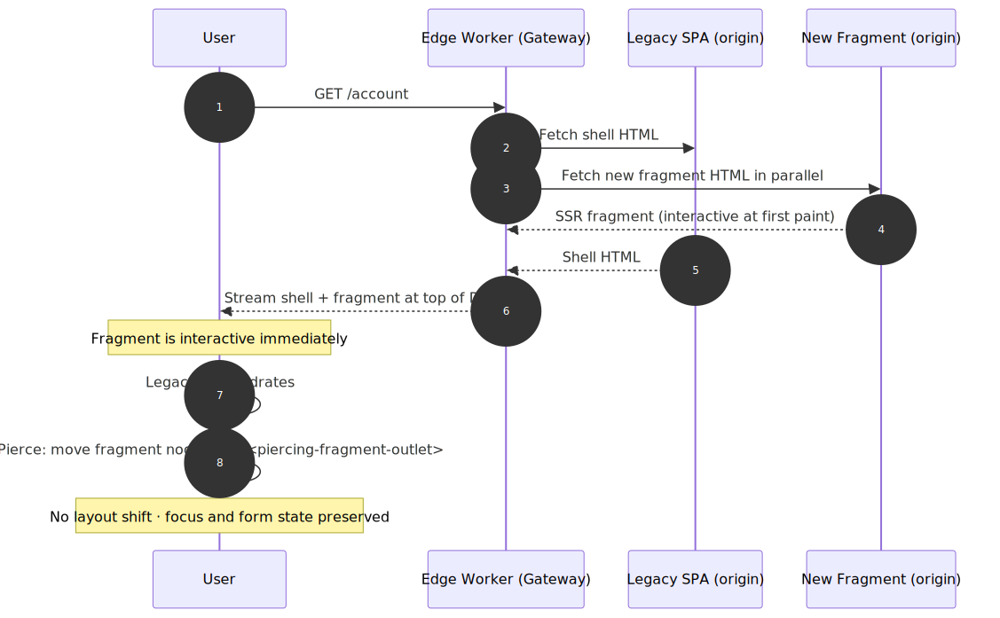
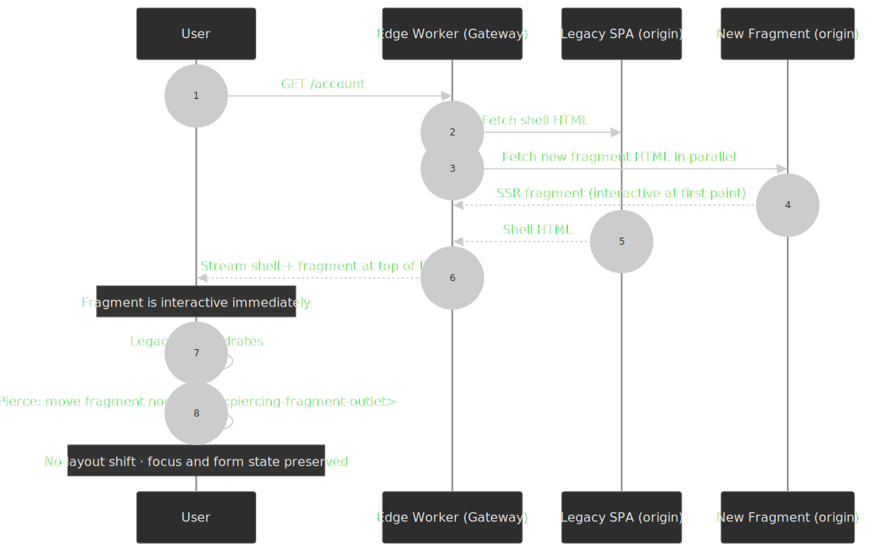

The open-source materialisation is [Web Fragments](https://web-fragments.dev/), maintained by Cloudflare's developer experience team and used to ship the production Cloudflare dashboard. It runs on Workers, Cloudflare Pages, Netlify, Vercel, or plain Node.js. If you are migrating a large client-rendered legacy app, this is the path with the lowest blast radius.

## Independent deployment in practice

"Independent deployment" is the hardest property to actually achieve, and the one most commonly faked. It means each MFE has its own pipeline that can ship to production without coordinating with peer teams, **and** the integration layer can survive any one MFE being broken.


What this requires beyond "team has a CI job":

- **A registry that is the source of truth.** An import map, an `mf-manifest.json`, or a database row keyed by environment. The shell reads it at request time. Promotion is updating the registry, not redeploying the shell.
- **Contract tests at the boundary.** Schema and event contracts are negotiated; consumer-driven contracts (e.g. [Pact](https://pact.io/)) catch breaking changes before promotion. Visual diffing on the seam (e.g. [Chromatic](https://www.chromatic.com/), Percy) catches the rest.
- **Canary at the registry layer.** Promote 1%, then 5%, then 100% of traffic to the new version by writing two registry entries and using a header or cookie to pick. This is dramatically cheaper than canarying the whole shell.
- **Per-MFE error isolation.** Catch boot and runtime errors per MFE and render a fallback. A crashed cart MFE must never blank the entire dashboard.
- **Per-fragment performance budget.** Each MFE owns a JS payload, [LCP](https://web.dev/articles/lcp), and [INP](https://web.dev/articles/inp) budget enforced in CI; the shell composes a global budget on top. Without per-fragment budgets, the page payload drifts upward by whichever team merged last.

```javascript title="error-boundary.tsx"
class MfeErrorBoundary extends React.Component {
  state = { failed: false }
  static getDerivedStateFromError() { return { failed: true } }
  componentDidCatch(error, info) {
    telemetry.recordMfeFailure(this.props.name, error, info)
  }
  render() {
    if (this.state.failed) return <FallbackTile name={this.props.name} />
    return this.props.children
  }
}
```

### Repository strategy: monorepo or polyrepo

Both work. The choice usually mirrors how the org actually builds software, not what is best in theory.

| Property | Monorepo (Nx, Turborepo, Bazel) | Polyrepo |
| --- | --- | --- |
| Atomic cross-cutting changes | Easy | Each repo, separately |
| Shared lint / tsconfig / DX tooling | Trivial | Duplicated or templated |
| Build cache and selective build | First-class with the right tool | Per-repo only |
| True team independence | Soft — root tooling is shared | Hard — each repo is sovereign |
| Onboarding new team | Need to teach the monorepo tools | Their own repo, their rules |

In an MFE world, the monorepo argument is strongest when you can keep selective builds honest (Nx affected, Turborepo filters) — otherwise every PR triggers every pipeline and "independent deployment" is theatre.

## State, routing, and other cross-cutting concerns

The hardest design work in micro-frontends is keeping the seams from leaking back into a coupling problem.

### State management — local first, then URL, then events

Adopt a hierarchy and resist the urge to skip up the chain:

1. **Local state per MFE.** Each MFE owns its model and its server cache (TanStack Query, RTK Query, Apollo). This is the boring answer and the right one for ~80% of state.
2. **URL as cross-MFE state.** Search filters, selected tab, modal-open flags. The URL is the only state primitive that is shareable, bookmarkable, and free of dependency on a runtime store.
3. **Custom events for ephemeral coupling.** "Item added to cart" is a fact that happened; the cart MFE listens, the toast MFE listens. Use `CustomEvent` with `composed: true` so events cross shadow boundaries.
4. **Shared store as a last resort.** Authentication, feature flags, and the design system theme are fair game. Treat the store contract as a long-lived API: version it, evolve it additively, never breaking-change it.

```javascript title="event-bus.js"
const bus = new EventTarget()
export const emit = (type, detail) =>
  bus.dispatchEvent(new CustomEvent(type, { detail }))
export const on = (type, handler) => {
  const listener = (e) => handler(e.detail)
  bus.addEventListener(type, listener)
  return () => bus.removeEventListener(type, listener)
}
```


### Routing — global shell, local detail

Two patterns dominate, and they correspond to the composition strategy:

- **Client-composed apps** use a global router in the shell that mounts/unmounts MFEs based on top-level routes; each MFE owns its nested routes. single-spa's `activeWhen` is the canonical implementation.
- **Server- or edge-composed apps** rely on the server/edge to map URL → fragment set; the shell almost has no router at all. Each navigation is a network round-trip, but each fragment is independently cacheable.

The footgun in client composition is back-button correctness. When MFEs each call `history.pushState`, you can end up with a history stack that no single MFE knows how to interpret. Standardise on either an event-based "navigate to URL" intent that the shell owns, or single-spa's [reroute](https://single-spa.js.org/docs/api/#triggerappchange) flow.

### Shared design system, auth, and telemetry

These three are the cross-cutting concerns that, if you do not solve them, will reinstate the very monolith the split was meant to escape.

- **Design system.** Ship as Web Components, a `singleton: true` runtime in MF, or a versioned static asset on a CDN that everyone consumes. The smell to avoid is each MFE bundling its own copy of `@design-system/*` at different versions — a 250 KB problem multiplied by N.
- **Auth.** A shell-owned auth boundary that fetches the session once and exposes it via a shared store, custom event, or response header. MFEs treat auth as read-only state.
- **Telemetry.** Standardise on one tracing format (W3C [traceparent](https://www.w3.org/TR/trace-context/)) and one error reporting target. Tag every event with `mfe_name` and `mfe_version` so you can attribute regressions.

### CSS isolation — pick one strategy and enforce it

CSS bleed across MFEs is the most common "small" bug that ages into a major rewrite. Pick one of these and codify it in the integration contract:

| Strategy | Mechanism | Cost |
| --- | --- | --- |
| **Shadow DOM** | Hard browser-enforced boundary inside Web Components | Strongest isolation; constraints around ARIA / forms / global theming variables (use CSS custom properties to bridge) |
| **CSS Modules / scoped names** | Build-time hashing (CSS Modules, vanilla-extract, Linaria, CSS-in-JS) | Cheap, framework-agnostic at the source; relies on every MFE actually using it |
| **Class-name namespace prefixes** | Convention (`.cart-*`, `.catalog-*`) enforced by lint | Lowest tooling cost; one missing prefix and the bleed is back |
| **iframes** | Cross-document boundary | Total isolation; loses shared scrollbars, focus, and fluid layout |

The design system sits above all of these — its CSS lives in one bundle, exposed via a shared singleton or a published static asset, and consumed by every MFE. A `singleton: true` design-system runtime under Module Federation is the practical default; for standards-based stacks, a versioned import-map entry that pins the design-system stylesheet works equivalently.

## Adjacent patterns: when you do not actually need MFEs

Several patterns capture the organisational and performance wins MFEs were meant to deliver, often at a fraction of the integration cost. Evaluate them before committing.

| Pattern | Captures | Trade-off |
| --- | --- | --- |
| **Modular monolith** with strict package boundaries | Code ownership, selective build via Nx / Turborepo affected | One repo, one runtime, one release train |
| **React Server Components** ([RSC, Stage 3 in React 19](https://react.dev/reference/rsc/server-components)) | Per-route server rendering, near-zero client JS for non-interactive surfaces, server-only data access | Single deployable; team independence still comes from package boundaries, not runtime split |
| **Islands architecture** ([Astro Islands](https://docs.astro.build/en/concepts/islands/), [Astro Server Islands](https://docs.astro.build/en/guides/server-islands/), [Qwik resumability](https://qwik.dev/docs/concepts/resumable/)) | Per-component JS budget, per-island hydration timing, content-first delivery | Strong perf story, but assumes one app and one team for the orchestration layer |
| **Multi-zone routing** ([Next.js Multi-Zones](https://nextjs.org/docs/app/guides/multi-zones)) | Each zone deploys independently behind a single domain via path rewrites | Coarse-grained — the unit is a whole app, not a fragment; cross-zone navigation is a hard reload |

In most cases a modular monolith plus RSC or islands closes the perf and ownership gaps without a registry, a shell, or a federation runtime. Reach for true MFEs only when the org argument — multiple teams, independent release cadence, stable seams — survives that comparison.

## Choosing the strategy



The decision rarely flows top-down from a clean blank slate. More often it works backwards from a constraint:

- **One team, one product.** Modular monolith. Skip MFEs.
- **Need to embed untrusted content or a legacy app you cannot touch.** Iframes or sandboxed Web Components.
- **SEO and TTFB are top priority, content is largely cacheable, audience is global.** Edge composition (Workers + HTMLRewriter, or Web Fragments).
- **SEO and TTFB are top priority, but content is personalised.** Server composition (SSR with [Tailor](https://github.com/zalando/tailor) / [Podium](https://podium-lib.io/) for fragments).
- **SPA-like product, multiple teams, heavy shared interactivity, authenticated users.** Client composition (Module Federation 2.0, Native Federation, or import maps + single-spa).
- **Migrating a legacy CSR app one surface at a time.** Fragment piercing with Web Fragments.

## Failure modes and anti-patterns

The pattern collects failure modes the way microservices did a decade ago. The [arXiv catalogue of micro-frontend anti-patterns](https://arxiv.org/html/2411.19472v1) (Castelli et al., 2024) and [Luca Mezzalira's "Dark Side of Micro-Frontends" talk](https://gitnation.com/contents/building-micro-frontends) cover the field; the ones that come up most in production are:

> [!CAUTION]
> The biggest risk is shipping a **distributed monolith**: you pay every cost of micro-frontends and get none of the autonomy. Every cross-cutting change still requires every team to redeploy in lockstep, only now also across N pipelines instead of one.

- **Distributed monolith.** Releases coordinate across MFEs anyway. Cause: leaky shared types, shared runtime state, or coupled features. Fix: redraw seams along stable product boundaries; make the integration layer a real API.
- **Mega frontend.** One MFE balloons into "everything except auth." Cause: easiest place to add the next feature. Fix: enforce size and ownership budgets in CI; split when an MFE has more than one team.
- **Knot frontend.** N×N cross-MFE messaging. Cause: skipping URL/event hierarchy and reaching for a shared store. Fix: re-route ephemeral coupling through events, persistent coupling through the URL.
- **Golden hammer.** Every project is now a micro-frontend, including the marketing site. Cause: org-level momentum. Fix: a written checklist (the criteria at the top of this article) gating new MFE projects.
- **Dependency multiplication.** Production payload is dominated by duplicate copies of React, the design system, and a logging client. Cause: not marking shared deps as singletons or not externalising them in import maps. Fix: enforce a singleton list in CI; report duplicate copies via the [MF Chrome DevTools extension](https://module-federation.io/guide/debug/chrome-devtool) or a bundle analyzer.
- **No CI/CD.** Independent deployment is aspirational; in practice everything ships from a Friday release branch. The catalogue calls this out as one of the most damaging anti-patterns; the fix is the boring one — invest in pipelines before the split, not after.

## Production lessons worth borrowing

A handful of teams have published deep retrospectives. They are worth reading in full:

- **[DAZN's micro-frontend infrastructure](https://medium.com/dazn-tech/how-dazn-manages-micro-frontend-infrastructure-f045d7c634c2)** built a custom `Bootstrap` loader with route-based vertical slicing and uses chaos testing (`chaos-squirrel`) to validate isolation. Their headline conclusion: the hard problem is not technical; it is communication overhead and dependency management between distributed teams.
- **[Zalando from Mosaic to Interface Framework](https://engineering.zalando.com/posts/2021/03/micro-frontends-part1.html).** Zalando pioneered server-side composition with [Tailor](https://github.com/zalando/tailor), then moved away from fragment-based architecture toward a unified React/TypeScript/GraphQL platform when fragmented tech stacks led to inconsistent UX and high onboarding friction. The retrospective is one of the most honest documents in the space.
- **[Cloudflare's fragment piercing](https://blog.cloudflare.com/fragment-piercing/)** lets you incrementally migrate a legacy CSR shell without a Big Bang rewrite, and is now in production for the Cloudflare dashboard.

The common thread: the technical pattern works; the failure mode is always organisational drift — UX consistency, performance budgets, design system ownership, and contract discipline.

## Closing heuristics

- Default to a **modular monolith with strict package boundaries**. Promote to micro-frontends only when org reality forces it.
- Pick **one composition layer** as primary. Mixing all three on a page is a debugging tax forever.
- Treat **shared dependencies, the design system, auth, and telemetry as platform investments**, not per-team work. They are the only way the split stays autonomous.
- Invest in **the integration layer before the split**: contract tests, a registry, canary at the registry, per-MFE error boundaries, end-to-end observability tagged by `mfe_name`/`mfe_version`.
- Keep a **written exit criterion**: if N MFEs collapse back into 1, what is the threshold? Without it, every team will resist re-merging long after the split has stopped paying for itself.

## References

- [Cam Jackson — Micro Frontends (martinfowler.com, 2019-06-19)](https://martinfowler.com/articles/micro-frontends.html)
- [Michael Geers — micro-frontends.org](https://micro-frontends.org/) and the book [_Micro Frontends in Action_](https://www.manning.com/books/micro-frontends-in-action) (Manning, 2020)
- [Module Federation documentation](https://module-federation.io/) and [Module Federation 2.0 release notes](https://github.com/module-federation/core/discussions/2397)
- [Webpack Module Federation reference](https://webpack.js.org/concepts/module-federation/) and [Rspack Module Federation guide](https://rspack.rs/guide/features/module-federation)
- [Manfred Steyer — Native Federation 1.0](https://www.angulararchitects.io/blog/announcing-native-federation-1-0/) and the [Angular blog post on Native Federation](https://blog.angular.dev/micro-frontends-with-angular-and-native-federation-7623cfc5f413)
- [single-spa documentation](https://single-spa.js.org/) — [recommended setup](https://single-spa.js.org/docs/recommended-setup/), [registerApplication API](https://single-spa.js.org/docs/api/), [building applications](https://single-spa.js.org/docs/building-applications/)
- [WHATWG HTML — Import maps](https://html.spec.whatwg.org/multipage/webappapis.html#import-maps) and [web.dev — Import maps in all modern browsers (2023)](https://web.dev/blog/import-maps-in-all-modern-browsers)
- [Cloudflare HTMLRewriter docs](https://developers.cloudflare.com/workers/runtime-apis/html-rewriter/) and the [streaming replace changelog (2025-01-31)](https://developers.cloudflare.com/changelog/post/2025-01-31-html-rewriter-streaming/)
- [W3C ESI Language Specification 1.0 Note (2001-08-04)](https://www.w3.org/TR/esi-lang/)
- [Cloudflare — Incremental adoption of micro-frontends with Cloudflare Workers (fragment piercing)](https://blog.cloudflare.com/fragment-piercing/) and [Web Fragments project](https://web-fragments.dev/)
- [Castelli et al. — A Catalog of Micro Frontends Anti-patterns (arXiv 2024)](https://arxiv.org/html/2411.19472v1)
- [DAZN Engineering — How DAZN manages micro-frontend infrastructure](https://medium.com/dazn-tech/how-dazn-manages-micro-frontend-infrastructure-f045d7c634c2)
- [Zalando Engineering — Micro Frontends: from Fragments to Renderers](https://engineering.zalando.com/posts/2021/03/micro-frontends-part1.html) and [Tailor (GitHub)](https://github.com/zalando/tailor)
- [Nolan Lawson — Shadow DOM and accessibility: the trouble with ARIA](https://nolanlawson.com/2022/11/28/shadow-dom-and-accessibility-the-trouble-with-aria/)
- [MDN — Web components](https://developer.mozilla.org/en-US/docs/Web/API/Web_components), [`ElementInternals`](https://developer.mozilla.org/en-US/docs/Web/API/ElementInternals), [`attachShadow({ delegatesFocus })`](https://developer.mozilla.org/en-US/docs/Web/API/Element/attachShadow)
- Adjacent patterns: [React Server Components reference](https://react.dev/reference/rsc/server-components), [Astro Islands](https://docs.astro.build/en/concepts/islands/) and [Server Islands](https://docs.astro.build/en/guides/server-islands/), [Qwik resumability](https://qwik.dev/docs/concepts/resumable/), [Next.js Multi-Zones](https://nextjs.org/docs/app/guides/multi-zones)
