# Multi-Region Architecture

Multi-region architecture is the discipline of running a system across two or more geographic regions to lower user-perceived latency, survive whole-region failures, and satisfy data-residency law — without paying the full price of synchronous global coordination on every request. This article walks through the three reusable design paths (active-passive, active-active, cell-based), the replication and conflict-resolution choices each one forces on you, the global routing layer that ties them together, and the production blueprints from Netflix, Slack, Uber, CockroachDB, and Spanner that demonstrate each path at scale. By the end you should be able to pick a topology for a new system, defend the trade-off out loud, and recognize the failure modes before they ship.


## Abstract

Multi-region architecture navigates a fundamental tension: **global reach requires geographic distribution, but distribution introduces latency for coordination**. The core design decision is where to place the consistency boundary:

- **Active-passive**: Single writer, simple consistency, higher RTO during failover
- **Active-active**: Multiple writers, lower RTO, requires conflict resolution
- **Cell-based**: Regional isolation limits blast radius regardless of active/passive choice

The CAP theorem forces the choice: partition tolerance is mandatory across regions (WAN failures happen), so you trade consistency for availability or vice versa. Most production systems choose eventual consistency with idempotent operations and reconciliation—accepting that replicas may temporarily diverge but will converge.

**Key numbers to remember:**

| Metric                                | Typical Value      |
| ------------------------------------- | ------------------ |
| Cross-region RTT (US-East to EU-West) | 70-90ms            |
| Cross-region RTT (US-East to Tokyo)   | 140-170ms          |
| Sync replication latency penalty      | ≥ 1 RTT per write  |
| Async replication lag (normal)        | 10ms - 1s          |
| Async replication lag (degraded)      | Minutes to hours   |
| Active-active failover                | Seconds            |
| Active-passive failover               | Minutes (scale-up) |
| Cell-based failover (Slack)           | < 5 minutes        |

## The Problem

### Why Single-Region Fails

**Latency ceiling**: A user in Tokyo accessing servers in US-East experiences 150-200ms RTT before any processing. For interactive applications, this degrades UX—humans perceive delays > 100ms.

**Availability ceiling**: A single region, even with multiple availability zones, shares failure domains: regional network issues, power grid problems, or cloud provider outages. AWS US-East-1 has experienced multiple region-wide incidents affecting all AZs.

**Compliance barriers**: GDPR does not itself mandate data localization, but Chapter V restricts cross-border transfers; combined with the [Schrems II ruling](https://eur-lex.europa.eu/legal-content/EN/TXT/?uri=CELEX%3A62018CJ0311) and the [EU–US Data Privacy Framework](https://commission.europa.eu/document/fa09cbad-dd7d-4684-ae60-be03fcb0fddf_en), this pushes most EU-personal-data workloads onto EU-hosted infrastructure with documented Transfer Impact Assessments. Other regimes — UAE PDPL, Russia 152-FZ, India DPDP 2023, China PIPL — go further and impose hard residency. A single-region architecture cannot satisfy conflicting jurisdiction requirements.

### Why Naive Multi-Region Fails

**Approach 1: Synchronous replication everywhere**

Write latency becomes `RTT-to-quorum + processing` (one RTT for a single remote ack, more if the protocol does prepare/commit phases). For US-to-EU replication that is at least 80–100 ms per write before any work happens; cross-continent paths quickly exceed 200 ms. Users experience this as application sluggishness. Under high load, write queues back up and cascade into failures.

**Approach 2: Read replicas only, single primary**

Reads are fast (local), but writes route to a single region. Users far from the primary experience write latency. During primary region failure, writes are unavailable until manual failover—RTO measured in minutes to hours.

**Approach 3: Multi-primary without conflict resolution**

Concurrent writes to the same data in different regions corrupt state. Last-write-wins by wall clock fails because clock skew between regions can be seconds. The system appears to work until edge cases surface in production.

### The Core Challenge

The fundamental tension: **coordination across regions requires communication, communication requires time, and time is latency**. Strong consistency demands coordination. Lower latency demands less coordination. You cannot have both.

Multi-region architecture exists to navigate this tension by:

1. Defining clear consistency boundaries (what must be consistent, what can be eventual)
2. Choosing replication strategies that match latency requirements
3. Designing conflict resolution for inevitable concurrent writes
4. Building isolation boundaries to limit failure propagation

## Design Paths

### Path 1: Active-Passive


**How it works:**

- One region (primary) handles all read and write traffic
- Standby region receives asynchronously replicated data
- Standby services may be scaled down or off to reduce cost
- Failover promotes standby to primary (manual or automated)

**When to choose:**

- Write latency is critical (single-writer means no cross-region coordination)
- Operational simplicity is prioritized
- Cost is a concern (standby can run minimal infrastructure)
- RTO of minutes is acceptable

**Key characteristics:**

- **RPO**: Depends on replication lag (typically seconds to minutes)
- **RTO**: Minutes to tens of minutes (standby scale-up, DNS propagation)
- **Consistency**: Strong within primary region
- **Cost**: Lower (standby runs minimal or no compute)

**Failover process:**

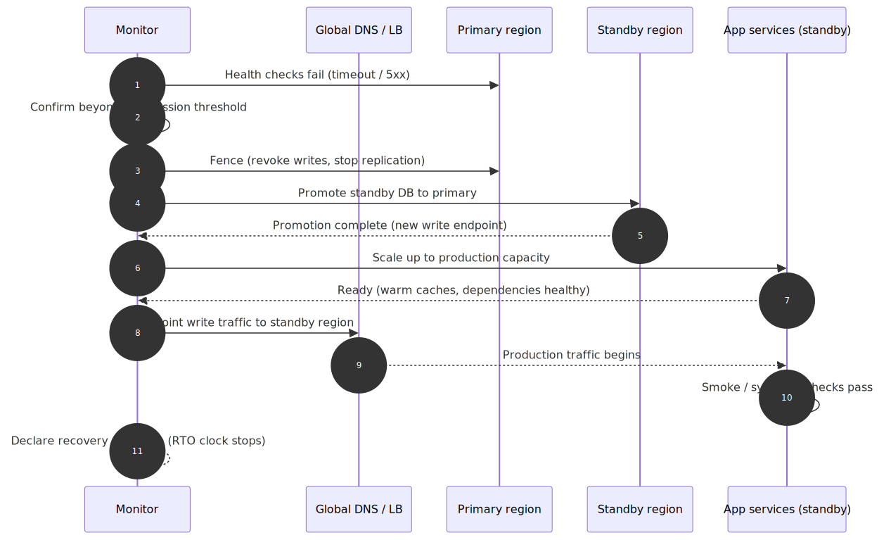
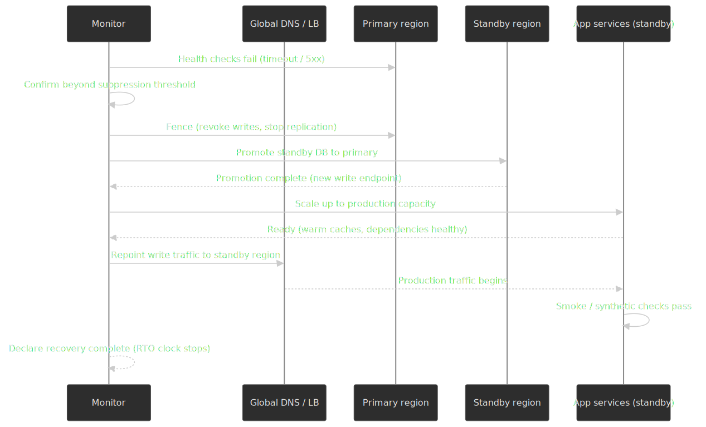

1. Detect primary failure (health checks, synthetic monitoring)
2. Fence the old primary and stop replication to prevent split-brain writes
3. Promote standby database to primary
4. Scale up standby compute (the long pole if it was kept warm rather than hot)
5. Update DNS / global routing to point at the new primary
6. Verify application health before declaring recovery complete

**Trade-offs vs active-active:**

| Aspect                 | Active-Passive         | Active-Active                    |
| ---------------------- | ---------------------- | -------------------------------- |
| Write latency          | Lowest (single region) | Higher if sync, same if async    |
| RTO                    | Minutes                | Seconds                          |
| Operational complexity | Lower                  | Higher                           |
| Cost                   | Lower                  | Higher                           |
| Consistency model      | Strong                 | Eventually consistent or complex |

**Real-world consideration:** [AWS Elastic Disaster Recovery](https://docs.aws.amazon.com/drs/latest/userguide/CloudEndure-Concepts.html) achieves an RTO of typically 5–20 minutes (dominated by OS boot time) and a sub-second RPO via continuous block-level replication. [Amazon Aurora Global Database](https://aws.amazon.com/rds/aurora/global-database/) advertises sub-second cross-region replication lag, RTO under one minute on unplanned failover, and RPO of zero on a [managed switchover](https://docs.aws.amazon.com/AmazonRDS/latest/AuroraUserGuide/aurora-global-database-disaster-recovery.html) (RPO ≈ 1 s on unplanned failover). The Aurora `rds.global_db_rpo` parameter even lets you cap the allowed lag — primary writes block once it is exceeded. These tools automate the mechanics; what they cannot eliminate is the scale-up time when the standby tier was kept warm rather than hot.

### Path 2: Active-Active



**How it works:**

- All regions actively serve production traffic
- Each region has full read/write capability
- Data replicates bidirectionally between regions
- Conflict resolution handles concurrent writes to same data

**When to choose:**

- Near-zero RTO is required (no failover delay)
- Users are globally distributed (each region serves local users)
- Write availability cannot be sacrificed during region failures
- Team can handle conflict resolution complexity

**Key characteristics:**

- **RPO**: Zero (no data loss if replication is synchronous) or near-zero (async)
- **RTO**: Seconds (traffic reroutes automatically)
- **Consistency**: Eventually consistent (async) or linearizable (sync with latency cost)
- **Cost**: Higher (full capacity in all regions)

**Conflict resolution strategies:**

| Strategy                | How It Works                          | Trade-offs                                  |
| ----------------------- | ------------------------------------- | ------------------------------------------- |
| Last-Write-Wins (LWW)   | Timestamp-based; later write wins     | Simple but loses earlier concurrent writes  |
| Application-level merge | Custom logic per data type            | Flexible but complex to implement correctly |
| CRDTs                   | Mathematically guaranteed convergence | Limited data structures, can grow unbounded |
| Quorum writes           | Majority must agree                   | Higher latency, reduced availability        |

**Real-world example (Netflix):**

Netflix has run active-active across `us-east-1` and `us-west-2` since 2013, with [Cassandra for persistent state and EVCache for the hot tier](https://netflixtechblog.com/active-active-for-multi-regional-resiliency-c47719f6685b):

- Strict region autonomy: no synchronous cross-region calls on the user request path
- Service discovery returns only local instances; the routing layer enforces this
- Writes go local; Cassandra replicates multi-directionally and EVCache invalidates cross-region via SQS
- Eventual consistency with idempotent operations; business logic tolerates temporary divergence
- User profiles and play state may briefly differ but converge via [replicated event journals](https://netflixtechblog.com/global-cloud-active-active-and-beyond-7d33dd8d8e54)
- Routing and misroute handling live in an enhanced Zuul edge service; traffic shifts globally during incidents

Result: Failover is invisible to users; [Chaos Kong](https://netflixtechblog.com/chaos-engineering-upgraded-878d341f15fa) regularly drops a full AWS region in production to prove it.

**Two regions vs three (active-active-active):**

A two-region active-active deployment cannot vote itself out of a partition: each side sees the other vanish and has no quorum to lean on. Anything stronger than CRDT/LWW semantics needs **three or more regions** so that a majority quorum can keep accepting writes when one region is unreachable. This is the topology Spanner, CockroachDB, and YugabyteDB explicitly recommend (often as `2+2+1` voters with a witness). A managed DynamoDB analogue is [Multi-Region Strong Consistency (MRSC)](https://docs.aws.amazon.com/amazondynamodb/latest/developerguide/bp-global-table-design.html), which requires three Regions for an active-active strongly-consistent table; the default Multi-Region Eventual Consistency mode runs across two with last-writer-wins.

**Trade-offs vs active-passive:**

| Aspect                 | Active-Active               | Active-Passive       |
| ---------------------- | --------------------------- | -------------------- |
| RTO                    | Seconds                     | Minutes              |
| Conflict handling      | Required                    | None (single writer) |
| Data consistency       | Eventual (typically)        | Strong               |
| Resource utilization   | Higher (all regions active) | Lower                |
| Operational complexity | Higher                      | Lower                |
| Min regions for safety | 3 (for quorum-based writes) | 2                    |

### Path 3: Cell-Based Architecture

 doesn't affect A2 or A3.")

**How it works:**

- Workload is partitioned into isolated cells
- Each cell is a complete, independent deployment
- Cells don't share state with other cells
- Users are routed to a specific cell (by user ID, tenant, geography)
- Cell failure affects only users assigned to that cell

**When to choose:**

- Blast radius limitation is critical
- Multi-tenant systems where tenant isolation is required
- Gradual rollout of changes (per-cell deployment)
- High availability requirements where zone/region failures are unacceptable

**Key characteristics:**

- **Blast radius**: Limited to cell size (e.g., 1/N of users)
- **Independence**: Cells don't communicate with each other
- **Scaling**: Add more cells rather than scaling cell size
- **Complexity**: Cell routing, cross-cell operations (rare)

**Cell sizing considerations:**

| Cell Size             | Blast Radius | Cost Efficiency | Operational Overhead |
| --------------------- | ------------ | --------------- | -------------------- |
| Small (1% of users)   | Minimal      | Lower           | Higher (more cells)  |
| Medium (10% of users) | Moderate     | Balanced        | Moderate             |
| Large (25% of users)  | Higher       | Higher          | Lower                |

**Real-world example (Slack):**

After a 2021 `us-east-1` AZ network impairment cascaded across services, Slack [migrated to a cellular architecture where each cell is an availability zone](https://slack.engineering/slacks-migration-to-a-cellular-architecture/):

- Each AZ contains a completely siloed backend deployment; intra-AZ traffic only
- Failure in one AZ is contained to that AZ; siloing is enforced at the edge load balancer
- Edge Envoy proxies are configured by Rotor — Slack's in-house xDS control plane
- Per-AZ weights via Envoy's RTDS allow draining traffic at 1% granularity
- Affected AZ is drained within ~5 minutes, with in-flight requests gracefully completed

Result: AZ failures no longer cascade; degradation is bounded to the subset of users on that cell, and incident response no longer needs root cause to act — drain first, investigate second.

**Combining with active-active:**

Cell-based architecture is orthogonal to active-passive/active-active:

- **Active-passive cells**: Each cell has a primary and standby
- **Active-active cells**: Cells in different regions serve same user partition
- **Region-scoped cells**: Cells within a region, replicated to other regions

### Decision Framework



**Quick decision matrix:**

| If you need...                      | Choose...                            |
| ----------------------------------- | ------------------------------------ |
| Simplest operations, minutes RTO OK | Active-Passive                       |
| Seconds RTO, can handle conflicts   | Active-Active                        |
| Seconds RTO, no conflicts           | Active-Active with data partitioning |
| Limit blast radius                  | Add Cell-Based to any pattern        |

## Data Replication Strategies

### Synchronous Replication

**How it works:**

Write is not acknowledged until all (or quorum of) replicas confirm receipt.

```text
Client → Primary → [Replicas confirm] → Ack to Client
```

**Latency impact:**

Write latency = `2 × RTT to farthest replica + processing`

For US-East to EU-West (80ms RTT one-way):

- Minimum write latency: 160ms + processing
- P99 can exceed 300ms under load

**When to use:**

- Zero RPO is mandatory (financial transactions, audit logs)
- Data loss is worse than latency
- Write volume is low enough to absorb latency

**Implementations:**

- **Google Spanner**: Synchronous Paxos-based replication; external consistency via TrueTime
- **CockroachDB**: Raft-based; write committed when majority of voting replicas acknowledges; uses Hybrid Logical Clocks rather than TrueTime
- **YugabyteDB**: Raft per tablet for synchronous multi-region; [xCluster](https://docs.yugabyte.com/stable/explore/going-beyond-sql/asynchronous-replication-ysql/) for async DR or active-active topologies
- **Calvin / FaunaDB**: A different approach — replicate the *transaction input log* via Paxos and execute deterministically on every replica, eliminating 2PC[^calvin]

[^calvin]: Thomson, Diamond, Weng, Ren, Shao, Abadi, [_Calvin: Fast Distributed Transactions for Partitioned Database Systems_](https://cs.yale.edu/homes/thomson/publications/calvin-sigmod12.pdf) (SIGMOD 2012). FaunaDB (now Fauna) productized the protocol; later research (SLOG 2019, Detock 2023) extends it for multi-region.

### Asynchronous Replication

**How it works:**

Primary acknowledges write immediately, replicates in background.

```text
Client → Primary → Ack to Client
         ↓ (async)
       Replicas
```

**Latency impact:**

Write latency = local processing only (microseconds to milliseconds)

**Replication lag:**

| Condition          | Typical Lag            |
| ------------------ | ---------------------- |
| Normal operation   | 10ms - 1s              |
| Network congestion | Seconds to minutes     |
| Region degradation | Minutes to hours       |
| Uber HiveSync P99  | ~20 minutes (batch)    |
| AWS Aurora Global  | Sub-second (streaming) |

**When to use:**

- Write throughput is critical
- Temporary inconsistency is acceptable
- RPO of seconds-to-minutes is tolerable

**Risk:**

Primary failure before replication completes = data loss. Committed writes may not have propagated.

### Semi-Synchronous Replication

**How it works:**

Synchronously replicate to N replicas; asynchronously to others.

```text
Client → Primary → [N replicas confirm] → Ack
         ↓ (async)
       Remaining replicas
```

**Trade-off:**

- Better durability than fully async (data exists in N+1 locations)
- Better latency than fully sync (only N replicas in critical path)
- Common pattern: sync to one replica in same region, async to others

**Implementations:**

- MySQL semi-sync replication
- PostgreSQL synchronous standby with async secondaries

### Replication Topology Patterns

, Chain (reduces primary load), Mesh (multi-primary active-active).")

| Topology | Use Case                        | Trade-off                   |
| -------- | ------------------------------- | --------------------------- |
| Star     | Active-passive, read replicas   | Primary is bottleneck       |
| Chain    | Reduce primary replication load | Higher lag to end of chain  |
| Mesh     | Active-active multi-primary     | Complex conflict resolution |

## Conflict Resolution

### The Conflict Problem

In active-active systems, concurrent writes to the same data in different regions create conflicts:

```text
Region A: SET user.name = "Alice" @ T1
Region B: SET user.name = "Bob" @ T1
```

Both writes succeed locally. When replication happens, which value wins?

### Last-Write-Wins (LWW)

**Mechanism:** Attach timestamp to each write; higher timestamp wins.

```typescript
type LWWValue<T> = {
  value: T
  timestamp: number // Hybrid logical clock recommended
}

function merge<T>(local: LWWValue<T>, remote: LWWValue<T>): LWWValue<T> {
  return local.timestamp >= remote.timestamp ? local : remote
}
```

**Clock considerations:**

- Wall clock: skew between regions can be seconds in degraded conditions; NTP narrows but does not eliminate it
- Logical clocks (e.g. Lamport): monotonic per node, but two concurrent updates on different nodes are indistinguishable from each other
- [Hybrid Logical Clocks](https://cse.buffalo.edu/tech-reports/2014-04.pdf) (HLC): combine wall-clock time with a logical counter so timestamps stay close to physical time but never go backward; used by CockroachDB and by [MongoDB's causal consistency](https://www.mongodb.com/docs/manual/core/read-isolation-consistency-recency/)

**Trade-offs:**

- **Pro:** Simple to implement
- **Con:** Earlier concurrent write is silently lost
- **Use when:** Losing concurrent writes is acceptable (e.g., last-update-wins is the business rule)

**Production usage:** [DynamoDB Global Tables](https://docs.aws.amazon.com/amazondynamodb/latest/developerguide/V2globaltables_HowItWorks.html) default to LWW for inter-region conflicts using an internal system timestamp; conditional writes (`ConditionExpression`) and atomic counters are the documented escape hatches when LWW is too lossy. [Cassandra's last-write-wins](https://cassandra.apache.org/doc/latest/cassandra/architecture/dynamo.html) follows the same model — on by default unless you opt into [Lightweight Transactions (LWT)](https://docs.datastax.com/en/dse/6.8/cql/cql/cql_using/useInsertLWT.html).

### Application-Level Merge

**Mechanism:** Custom merge function per data type.

```typescript
function mergeShoppingCart(local: Cart, remote: Cart): Cart {
  // Union of items; for duplicates, sum quantities
  const merged = new Map<ItemId, CartItem>()

  for (const item of [...local.items, ...remote.items]) {
    const existing = merged.get(item.id)
    if (existing) {
      existing.quantity += item.quantity
    } else {
      merged.set(item.id, { ...item })
    }
  }

  return { items: Array.from(merged.values()) }
}
```

**Trade-offs:**

- **Pro:** Full control over merge semantics
- **Con:** Must implement and test for each data type
- **Use when:** Business logic dictates specific merge behavior

### CRDTs (Conflict-Free Replicated Data Types)

**Mechanism:** Data structures mathematically guaranteed to converge without conflicts.

**Core CRDT types:**

| CRDT                     | Use Case               | Behavior                                           |
| ------------------------ | ---------------------- | -------------------------------------------------- |
| G-Counter                | Increment-only counter | Each node tracks own count; merge = max per node   |
| PN-Counter               | Counter with decrement | Two G-Counters (positive, negative); value = P - N |
| G-Set                    | Add-only set           | Union on merge                                     |
| OR-Set (Observed-Remove) | Set with remove        | Tracks add/remove per element with unique tags     |
| LWW-Register             | Single value           | Last-write-wins with timestamp                     |
| MV-Register              | Multi-value register   | Keeps all concurrent values                        |

**G-Counter example:**

```typescript
type GCounter = Map<NodeId, number>

function increment(counter: GCounter, nodeId: NodeId): GCounter {
  const newCounter = new Map(counter)
  newCounter.set(nodeId, (counter.get(nodeId) ?? 0) + 1)
  return newCounter
}

function merge(a: GCounter, b: GCounter): GCounter {
  const merged = new Map<NodeId, number>()
  for (const nodeId of new Set([...a.keys(), ...b.keys()])) {
    merged.set(nodeId, Math.max(a.get(nodeId) ?? 0, b.get(nodeId) ?? 0))
  }
  return merged
}

function value(counter: GCounter): number {
  return Array.from(counter.values()).reduce((sum, n) => sum + n, 0)
}
```

**Trade-offs:**

- **Pro:** Automatic convergence; no custom merge logic
- **Con:** Limited data structures; can grow unbounded (tombstones)
- **Use when:** Data model fits CRDT primitives

**Production usage:**

- **Riak:** State-based CRDTs with delta-state optimization (see [Shapiro et al. 2011 INRIA tech report](https://hal.inria.fr/inria-00555588v1/document) for the original classification)
- **Redis Enterprise (CRDB):** CRDTs for active-active geo-distribution
- **Figma:** [Operation-based CRDTs for collaborative editing](https://www.figma.com/blog/how-figmas-multiplayer-technology-works/)

See [CRDTs for Collaborative Systems](../crdt-for-collaborative-systems/README.md) for the deep dive.

### Choosing a Conflict Resolution Strategy

| Scenario                | Recommended Strategy                     |
| ----------------------- | ---------------------------------------- |
| User profile updates    | LWW (last update wins is expected)       |
| Shopping cart           | Application merge (union of items)       |
| Counters (likes, views) | G-Counter CRDT                           |
| Collaborative documents | Operation-based CRDTs or OT              |
| Financial balances      | Avoid conflict (single writer or quorum) |

## Global Load Balancing

### GeoDNS

**Mechanism:** DNS resolver returns different IP addresses based on client's geographic location.

```text
Client (Tokyo) → DNS query → GeoDNS → Returns IP of Asia-Pacific region
Client (NYC) → DNS query → GeoDNS → Returns IP of US-East region
```

**Limitations:**

- IP geolocation is imprecise (VPNs, corporate proxies, mobile networks)
- DNS caching delays failover (TTL typically minutes)
- No real-time health awareness

**When to use:**

- Coarse-grained geographic routing
- Latency optimization (not failover)
- Cost is a concern (simpler than anycast)

### Anycast

**Mechanism:** Multiple servers share the same IP address; BGP routing directs to "closest" server.

```text
Same IP announced from:
  - US-East data center
  - EU-West data center
  - Asia-Pacific data center

BGP routes to topologically closest (not geographically closest)
```

**Advantages:**

- Instant failover (BGP reconverges in seconds)
- Works regardless of DNS caching
- True network proximity (based on routing, not geography)

**Limitations:**

- Requires own AS number and upstream relationships
- Complex to operate
- Stateful connections can break during route changes

**Production usage:**

Cloudflare announces service IPs from every data center worldwide. Traffic always routes to closest data center. Regional Services feature passes traffic to region-specific processing after edge inspection.

### Latency-Based Routing

**Mechanism:** Route based on measured latency, not assumed geography.

AWS Route 53 latency-based routing:

1. AWS measures latency from DNS resolver networks to each region
2. Returns IP of region with lowest latency for that resolver
3. Periodic re-measurement adapts to network changes

**Advantages:**

- Actual performance, not assumed
- Adapts to network conditions

**Limitations:**

- Measures resolver-to-region, not end-user-to-region
- Still subject to DNS caching

### Global Server Load Balancing (GSLB)

**Mechanism:** Combines geographic awareness, health checks, and load balancing.

```text
GSLB considers:
  - Geographic proximity
  - Server health (active health checks)
  - Current load per region
  - Latency measurements
```

**Typical decision flow:**

1. Client request arrives
2. GSLB checks health of all regions
3. Filters to healthy regions
4. Selects based on latency/load/geography
5. Returns appropriate endpoint

**Trade-off vs simpler approaches:**

| Approach | Failover Speed  | Health Awareness  | Complexity |
| -------- | --------------- | ----------------- | ---------- |
| GeoDNS   | Minutes (TTL)   | None              | Low        |
| Anycast  | Seconds (BGP)   | Route-level       | High       |
| GSLB     | Seconds-Minutes | Application-level | Medium     |

## Production Implementations

### Netflix: Active-Active Multi-Region

**Context:** Streaming service with hundreds of millions of subscribers; downtime directly impacts revenue.

**Architecture:**

- Full stack deployed across multiple AWS regions (`us-east-1`, `us-west-2`, plus EU regions over time)
- All regions active, serving production traffic
- No synchronous cross-region calls on the request path (strict region autonomy[^netflix-aa])

**Key design decisions:**

| Decision                   | Rationale                                      |
| -------------------------- | ---------------------------------------------- |
| Async replication          | Write latency critical for UX                  |
| Regional service discovery | Eliminates cross-region call latency           |
| Idempotent operations      | Safe to retry; handles duplicate processing    |
| Eventual consistency       | Accepted temporary divergence for availability |

**Data handling:**

- Writes occur locally; Cassandra replicates multi-directionally between regions, EVCache uses an SQS-driven invalidation/refill protocol[^netflix-evcache]
- User profiles and playback states may temporarily differ; convergence happens through replicated event journals (Kafka/SQS)
- Deterministic A/B test bucketing (same user, same bucket regardless of region) so cross-region routing does not perturb experiments

**Routing and failover:**

- Enhanced Zuul edge proxy handles active-active routing and detects mis-routed requests
- Global routing layer shifts traffic between regions transparently during incidents

**Durability:**

- Each Cassandra replica set spans three AZs per region; cross-region replication adds further redundancy
- Routine S3 snapshots and cross-cloud backups for tier-0 data

**Testing:**

- [Chaos Kong](https://netflixtechblog.com/chaos-engineering-upgraded-878d341f15fa): drops a full AWS region in production
- [Chaos Gorilla](https://netflixtechblog.com/the-netflix-simian-army-16e57fbab116): drops a full availability zone
- Failover exercises run continuously, not as a quarterly drill

**Outcome:** Near-zero RTO, invisible failovers, routine region-drop tests in production.

[^netflix-aa]: Netflix Technology Blog, [_Active-Active for Multi-Regional Resiliency_](https://netflixtechblog.com/active-active-for-multi-regional-resiliency-c47719f6685b) (2013) and [_Global Cloud — Active-Active and Beyond_](https://netflixtechblog.com/global-cloud-active-active-and-beyond-7d33dd8d8e54) (2016).
[^netflix-evcache]: Netflix Technology Blog, [_EVCache: Distributed in-memory datastore for the cloud_](https://netflixtechblog.com/caching-for-a-global-netflix-7bcc457012f1) — describes the cross-region invalidation/refill flow.

### Slack: Cellular Architecture

**Context:** Enterprise messaging; a 2021 `us-east-1` AZ network impairment cascaded across the previously monolithic deployment and triggered a multi-year architecture redesign[^slack-cellular].

**Motivation:**

Previously, components freely crossed AZ boundaries. When one AZ degraded, retries and timeouts piled up across services in healthy AZs, turning a partial failure into a global one — a classic "gray failure" pattern.

**Architecture:**

- Each AZ contains a fully siloed backend deployment ("cell")
- Components are constrained to a single AZ; intra-AZ traffic only on the data path
- Edge Envoy load balancers handle ingress; an in-house xDS control plane called Rotor distributes config[^slack-cellular]

**Cell isolation:**

```text
Cell A1 (AZ-1): Services A, B, C → Database A1
Cell A2 (AZ-2): Services A, B, C → Database A2
Cell A3 (AZ-3): Services A, B, C → Database A3

No cross-cell communication on the request path
```

**Failover capabilities:**

| Metric                        | Value               |
| ----------------------------- | ------------------- |
| Drain affected AZ             | < 5 minutes         |
| Traffic shift granularity     | 1%                  |
| Request handling during drain | Graceful completion |

**Implementation details:**

- Migration from HAProxy to Envoy at the edge, using xDS for dynamic config
- In-house xDS control plane (Rotor); per-AZ weights distributed via Envoy's [RTDS (Runtime Discovery Service)](https://www.envoyproxy.io/docs/envoy/latest/configuration/operations/runtime/v2/rtds.proto)
- Weighted clusters allow gradual drains; in-flight requests complete naturally
- Control plane is regionally replicated and resilient to single-AZ failure
- Engineers can drain an AZ without identifying the root cause first — bias toward action

**Outcome:** AZ failures contained; graceful degradation affects only the subset of users whose cell is impaired.

[^slack-cellular]: Cooper Bethea, [_Slack's Migration to a Cellular Architecture_](https://slack.engineering/slacks-migration-to-a-cellular-architecture/) (Slack Engineering, 2023); [InfoQ summary and presentation](https://www.infoq.com/presentations/slack-cellular-architecture/).

### Uber: Multi-Region Data Consistency

**Context:** Ride-sharing and delivery; the data lake exceeds 350 PB and replicates ~8 PB across regions every day from over 5 million Hive DDL/DML events[^uber-hivesync].

**HiveSync System:**

Cross-region batch replication for the data lake:

- Event-driven jobs capture Hive Metastore changes
- MySQL captures change events; replication jobs are modeled as finite-state machines
- DAG-based orchestration with dynamic sharding to keep up with skewed partitions

**Performance:**

| Metric                | Target  | Actual      |
| --------------------- | ------- | ----------- |
| Replication SLA       | 4 hours | Met         |
| P99 lag               | —       | ~20 minutes |
| Cross-region accuracy | —       | 99.99%      |

**Data Reparo Service:**

- Scans regions for anomalies and divergence
- Reconciles mismatches to bring replicas back in line
- Catches silent replication failures and metadata drift before they corrupt downstream pipelines

**Multi-region Kafka (uReplicator):**

- Open-source replicator that extends Kafka MirrorMaker with stronger reliability guarantees[^uber-kafka]
- Zero-data-loss design: replication of consumer offsets in addition to messages
- Supports both active/active and active/passive consumption topologies

**Failover handling:**

- Tracks consumption offset in the primary region
- Replicates offset metadata to other regions
- On primary failure, consumers resume from the replicated offset rather than re-processing from the start

> [!NOTE]
> The wider Kafka ecosystem now offers three replication tools, each with different operational and offset-translation guarantees:
>
> | Tool                                                                                                            | Architecture                              | Offsets                              | Notes                                                                                       |
> | --------------------------------------------------------------------------------------------------------------- | ----------------------------------------- | ------------------------------------ | ------------------------------------------------------------------------------------------- |
> | [MirrorMaker 2 (KIP-382)](https://cwiki.apache.org/confluence/display/KAFKA/KIP-382%3A+MirrorMaker+2.0)         | Kafka Connect-based; external workers     | Translated via checkpoints           | Open source; topic prefixes by default; consumer offset shift on failover unless tuned      |
> | [Confluent Cluster Linking](https://docs.confluent.io/platform/current/multi-dc-deployments/cluster-linking/)   | Native broker-to-broker log replication   | Byte-for-byte preserved              | Confluent Platform/Cloud only; identical topic names; designed for low-RTO failover         |
> | [Amazon MSK Replicator](https://docs.aws.amazon.com/msk/latest/developerguide/msk-replicator.html)              | Managed service inside MSK                | Translated, optionally synchronized  | Cross-Region Kafka without running Connect yourself                                         |
>
> Choose by ecosystem fit and the exact RPO/RTO target — MM2 is the lowest-friction OSS choice; Cluster Linking gives the cleanest failover semantics; uReplicator and MSK Replicator are managed-platform points on the same spectrum.

[^uber-hivesync]: Uber Engineering, [_Building Uber's Data Lake: Batch Data Replication Using HiveSync_](https://www.uber.com/us/en/blog/building-ubers-data-lake-batch-data-replication-using-hivesync/).
[^uber-kafka]: Uber Engineering, [_Disaster Recovery for Multi-Region Kafka at Uber_](https://www.uber.com/us/en/blog/kafka/) (uReplicator).

### CockroachDB: Multi-Active Availability

**Context:** Distributed SQL database designed for multi-region from the start.

**Approach:**

[Multi-Active Availability](https://www.cockroachlabs.com/docs/stable/multi-active-availability): every replica is eligible to handle reads and writes through the Raft leader. Unlike traditional active-active, there is no concept of a "primary" region for a given range — leadership moves automatically.

**Replication mechanism:**

- Consensus-based (Raft); a write commits when a majority of voting replicas acknowledge
- At least 3 replicas required per range; 5 is common in multi-region for surviving full region loss

**Key features:**

| Feature              | Description                                                         |
| -------------------- | ------------------------------------------------------------------- |
| Transparent failover | Region failure handled without application changes                  |
| Zero RPO             | Majority-commit means no committed data is lost                     |
| Near-zero RTO        | Automatic leader re-election within seconds                         |
| Non-voting replicas  | Follow Raft log without quorum participation; reduce write latency  |

**Multi-region topology patterns:**

1. **Regional tables:** Data pinned to a specific region for compliance and low local-write latency
2. **Global tables:** Replicated everywhere for low-latency reads from any region
3. **Survival goals:** Configure whether the table survives a zone failure or a full region failure

**Availability:**

- Multi-region clusters on the Advanced plan target [99.999% availability](https://www.cockroachlabs.com/cloud-terms-and-conditions/cockroachcloud-technical-service-level-agreement/)
- Regional instances target 99.99%

> [!NOTE]
> CockroachDB uses Hybrid Logical Clocks rather than TrueTime, so it does not provide Spanner's _external_ consistency. Under adversarial clock skew it can exhibit a "causal reverse" anomaly that Spanner avoids; see [CockroachDB's consistency model](https://www.cockroachlabs.com/blog/consistency-model/) for the precise guarantee.

### Google Spanner: Multi-Region with External Consistency

**Context:** Google's globally distributed, strongly consistent database.

**Consistency guarantee:**

[External consistency](https://docs.cloud.google.com/spanner/docs/true-time-external-consistency) — equivalent to strict serializability. The order in which clients observe committed transactions matches the order they actually committed in real time. This is achieved by reading the TrueTime API (GPS + atomic clocks) at commit time and waiting out the uncertainty interval before acknowledging.

**Replication:**

- Synchronous, Paxos-based per data split
- A write commits when a majority of voting replicas acknowledge
- [Witness replicas](https://docs.cloud.google.com/spanner/docs/replication) participate in the vote but do not store full data and cannot serve reads — cheap quorum padding

**Architecture (typical multi-region instance):**


```text
Default: 2 read-write regions × 2 replicas + 1 witness region
         = 5 voting replicas (quorum = 3)

Write path:
1. Leader replica (in the default leader region) receives the write
2. Replicates to other voting replicas via Paxos
3. Commits once a majority (3 of 5) acknowledges
4. Waits out TrueTime uncertainty
5. Acknowledges to the client
6. Asynchronously updates read-only replicas in other regions
```

A witness region only needs to store Paxos state, so it adds quorum redundancy at a fraction of the cost of a full read-write region.

**Availability:**

- [Multi-region instances](https://cloud.google.com/spanner/sla): 99.999% monthly uptime SLA
- Regional instances: 99.99% SLA

**Trade-off:**

Higher write latency (cross-region Paxos plus TrueTime wait) in exchange for the strongest commercially available consistency model. Reads remain low-latency because they can serve from the nearest read-only or read-write replica using TrueTime to bound staleness.

### Implementation Comparison

| Aspect      | Netflix       | Slack      | Uber             | CockroachDB  | Spanner      |
| ----------- | ------------- | ---------- | ---------------- | ------------ | ------------ |
| Pattern     | Active-Active | Cell-Based | Hybrid           | Multi-Active | Multi-Active |
| Consistency | Eventual      | Eventual   | Eventual (batch) | Strong       | External     |
| RTO         | Seconds       | < 5 min    | Varies           | Near-zero    | Near-zero    |
| RPO         | Near-zero     | Near-zero  | Minutes (batch)  | Zero         | Zero         |
| Complexity  | High          | High       | High             | Medium       | High         |

## Data Residency and Sovereignty

Multi-region architecture is the layer where compliance constraints become physical. The decisions here cannot be retrofitted; they shape topology, replication, and key management.


### What the regulations actually require

| Regime                         | What it constrains                                                                              | Architectural impact                                                            |
| ------------------------------ | ----------------------------------------------------------------------------------------------- | ------------------------------------------------------------------------------- |
| GDPR + Schrems II              | Cross-border transfers of EU personal data; DPF/SCCs only valid with a Transfer Impact Assessment | Pin EU personal data to EU regions; document supplementary technical measures   |
| US CLOUD Act                   | US-headquartered providers can be compelled to produce data regardless of storage location      | EU-only regions of a US cloud are not, by themselves, sufficient                |
| China PIPL / CSL               | Hard data localization for "important data" and personal data of PRC residents                  | Separate PRC-only deployment, separate keys, no replication out                 |
| India DPDP 2023                | Cross-border transfers permitted unless restricted; sectoral exceptions exist                   | Per-tenant home region; pseudonymize before any cross-region copy               |
| Russia 152-FZ                  | Initial collection of Russian personal data must occur on Russian soil                          | Region pinning at ingress, not just at storage                                  |

### Design patterns that hold up under audit

1. **Tenant home region**: At signup, assign each tenant a home region; route writes there; replicate only with policy-aware filters.
2. **Customer-managed encryption with in-jurisdiction KMS**: Encrypt before egress; keep keys in HSMs inside the legal boundary so a CLOUD Act order cannot return plaintext.
3. **Redaction-only cross-region streams**: Allow analytics replicas to leave the jurisdiction only after pseudonymization or aggregation.
4. **Field-level residency tags**: Annotate columns/records (`pii`, `phi`, `pci`) and let replication policy decide what crosses borders.
5. **Right-to-erasure plumbing**: Tombstone propagation must reach every replica, including derived caches and search indexes — not optional in GDPR-regulated tenants.

> [!CAUTION]
> "Hosted in eu-west-1" is **not** a Schrems II answer. The European Data Protection Board's [Recommendations 01/2020 on supplementary measures](https://edpb.europa.eu/our-work-tools/our-documents/recommendations/recommendations-012020-measures-supplement-transfer_en) require additional technical safeguards for any transfer to a US-controlled provider. Encryption with keys held outside the provider's reach is the only widely-accepted measure.

## Common Pitfalls

### 1. Assuming Cross-Region Calls Are Fast

**The mistake:** Designing services that make synchronous cross-region calls, assuming network is reliable.

**Example:** Authentication service in US-East calls authorization service in EU-West for every request. Under load, 100ms+ RTT cascades into timeouts.

**Why it happens:** Works fine in development (same region) and low traffic (no queue buildup).

**Solutions:**

- Enforce region autonomy: services only call local instances
- Replicate data needed for authorization to each region
- Design for async where possible

### 2. Underestimating Replication Lag

**The mistake:** Building features that assume immediate replication.

**Example:** User updates profile in Region A, immediately checks from Region B, sees stale data. Files support ticket about "lost" update.

**Why it happens:** Normal lag is sub-second; pathological cases (network issues, load) can be minutes.

**Solutions:**

- Read-your-own-writes: Route user to same region for reads after write
- Version tokens: Client includes version; server ensures that version is visible
- UI feedback: Show "saving..." until confirmation propagates

### 3. Clock Skew in LWW

**The mistake:** Using wall clock time for last-write-wins without accounting for skew.

**Example:** Region A's clock is 5 seconds ahead. All its writes "win" against Region B, even if Region B's writes were actually later.

**Why it happens:** NTP reduces skew but doesn't eliminate it. Cloud providers have millisecond-level skew between regions under good conditions; seconds under bad.

**Solutions:**

- Hybrid Logical Clocks: Combine wall time with logical counter
- Centralized timestamp service: Single source of truth (but adds latency)
- Application-level versioning: Client-provided version numbers

### 4. Unbounded Growth in CRDTs

**The mistake:** Using CRDTs without planning for garbage collection.

**Example:** OR-Set tracks tombstones for deleted elements. After a year, set has 100K tombstones, 1K actual elements. Memory explodes.

**Why it happens:** CRDTs guarantee convergence by keeping metadata. Without cleanup, metadata grows forever.

**Solutions:**

- Tombstone expiry: Remove tombstones after grace period (risk: resurrection if old replica reconnects)
- Periodic compaction: Checkpoint state, truncate history
- Bounded metadata: Cap actor IDs, merge old entries

### 5. Testing Only Happy Path

**The mistake:** Testing failover manually once; not testing regularly or under load.

**Example:** Failover works in staging. In production, DNS cache TTL is higher, standby takes longer to scale, dependent services timeout during transition.

**Why it happens:** Failover testing is expensive and scary. Teams avoid it.

**Solutions:**

- Chaos engineering: Regular production failure injection (Chaos Monkey, Chaos Kong)
- Game days: Scheduled failover exercises
- Automated failover testing: CI/CD pipeline includes failover scenarios

### 6. Split-Brain Without Quorum

**The mistake:** Active-active with 2 regions; network partition leads to both accepting writes independently.

**Example:** US-East and EU-West can't communicate. Both continue serving traffic, writing conflicting data. When partition heals, data is corrupted beyond automatic merge.

**Why it happens:** 2-region active-active has no quorum; neither can determine if it's the "real" primary.

**Solutions:**

- 3+ regions so quorum requires a majority (2 of 3, 3 of 5, …)
- A witness region: cheap, does not serve traffic but participates in quorum (Spanner, MongoDB arbiters)
- Partition detection: the side that loses quorum drops to read-only or refuses writes until the partition heals

> [!CAUTION]
> "Just have both sides keep accepting writes and reconcile later" is only safe if every data type is a CRDT or your application explicitly tolerates lost concurrent writes. For anything resembling a financial balance, this is not a strategy — it is a future incident report.

## Conclusion

Multi-region architecture is a spectrum of trade-offs, not a single pattern to apply. The decision tree starts with RTO requirements:

- **Minutes acceptable:** Active-passive with async replication—simpler operations, lower cost
- **Seconds required:** Active-active with conflict resolution—higher complexity, near-zero RTO
- **Blast radius concern:** Add cell-based isolation—limits failure impact regardless of active/passive choice

Data replication strategy follows from RPO:

- **Zero data loss:** Synchronous replication—pay the latency cost
- **Seconds-to-minutes acceptable:** Asynchronous replication—better performance, accept lag

Conflict resolution depends on data model:

- **Overwrite is OK:** Last-write-wins
- **Custom semantics needed:** Application-level merge
- **Countable/set-like data:** CRDTs

Production systems like Netflix, Slack, and Uber demonstrate that eventual consistency with idempotent operations and reconciliation handles most use cases. Strong consistency (Spanner, CockroachDB, YugabyteDB, Calvin-style deterministic engines) is achievable but at latency cost — and any quorum-based active-active topology needs three or more regions to remain available across partitions.

Compliance constraints — Schrems II, the CLOUD Act, PIPL — increasingly dictate the *physical* shape of multi-region systems, not just the logical one. Pin tenants to home regions, hold encryption keys in jurisdiction, and let only redacted streams cross borders.

The meta-lesson: **design for failure and for jurisdiction from the start**. Assume regions will fail, replication will lag, conflicts will occur, and regulators will ask where the bytes physically rest. Build idempotency, reconciliation, key management, and graceful degradation into the foundation rather than retrofitting later.

## Appendix

### Prerequisites

- Understanding of distributed systems fundamentals (CAP theorem, consensus)
- Familiarity with database replication concepts
- Knowledge of DNS and network routing basics

### Terminology

| Term                               | Definition                                                                          |
| ---------------------------------- | ----------------------------------------------------------------------------------- |
| **RTO (Recovery Time Objective)**  | Maximum acceptable time system can be down during failure                           |
| **RPO (Recovery Point Objective)** | Maximum acceptable data loss measured in time                                       |
| **Active-Passive**                 | Architecture where one region serves traffic; others are standby                    |
| **Active-Active**                  | Architecture where all regions serve traffic simultaneously                         |
| **Cell-Based Architecture**        | Isolated deployments (cells) each serving subset of users                           |
| **CRDT**                           | Conflict-free Replicated Data Type; data structure that merges automatically        |
| **Anycast**                        | Routing technique where multiple locations share same IP; network routes to closest |
| **GeoDNS**                         | DNS that returns different IPs based on client's geographic location                |
| **Split-Brain**                    | Failure mode where partitioned nodes operate independently, causing divergence      |
| **Quorum**                         | Majority of nodes that must agree for operation to succeed                          |

### Summary

- Multi-region navigates the tension between global reach and coordination latency
- Active-passive: simple, minutes RTO, single writer
- Active-active: complex, seconds RTO, requires conflict resolution
- Cell-based: limits blast radius, orthogonal to active/passive choice
- Data replication: sync (zero RPO, high latency) vs async (low latency, potential data loss)
- Conflict resolution: LWW (simple, loses data), CRDTs (automatic, limited types), app merge (flexible, complex)
- Production systems embrace eventual consistency with idempotent operations

### References

**Architecture Patterns:**

- [AWS Well-Architected: Multi-Region Active-Active](https://aws.amazon.com/blogs/architecture/disaster-recovery-dr-architecture-on-aws-part-iv-multi-site-active-active/) - AWS multi-region DR patterns
- [AWS Well-Architected: Cell-Based Architecture](https://docs.aws.amazon.com/wellarchitected/latest/reducing-scope-of-impact-with-cell-based-architecture/what-is-a-cell-based-architecture.html) - Cell-based architecture guidance
- [Azure Multi-Region Design](https://learn.microsoft.com/en-us/azure/well-architected/reliability/highly-available-multi-region-design) - Azure multi-region strategies

**Production Case Studies:**

- [Netflix Active-Active for Multi-Regional Resiliency](https://netflixtechblog.com/active-active-for-multi-regional-resiliency-c47719f6685b) - Netflix's active-active architecture
- [Slack's Migration to Cellular Architecture](https://slack.engineering/slacks-migration-to-a-cellular-architecture/) - Slack's cell-based transformation
- [Uber's HiveSync for Cross-Region Data](https://www.uber.com/blog/building-ubers-data-lake-batch-data-replication-using-hivesync/) - Uber's data replication system
- [Uber's Kafka Disaster Recovery](https://www.uber.com/blog/kafka/) - uReplicator for multi-region Kafka

**Database Multi-Region:**

- [CockroachDB Multi-Active Availability](https://www.cockroachlabs.com/docs/stable/multi-active-availability) — CockroachDB's approach
- [Google Spanner Multi-Region](https://cloud.google.com/blog/topics/developers-practitioners/demystifying-cloud-spanner-multi-region-configurations) — Spanner replication and consistency
- [AWS Aurora Global Database](https://docs.aws.amazon.com/AmazonRDS/latest/AuroraUserGuide/aurora-global-database-disaster-recovery.html) — switchover, unplanned failover, RPO controls
- [DynamoDB Global Tables](https://docs.aws.amazon.com/amazondynamodb/latest/developerguide/V2globaltables_HowItWorks.html) — multi-active LWW (MREC) and 3-Region strongly-consistent (MRSC) variants
- [YugabyteDB Multi-Region](https://docs.yugabyte.com/stable/explore/multi-region-deployments/) — synchronous Raft and asynchronous xCluster topologies

**Streaming Multi-Region:**

- [MirrorMaker 2 design (KIP-382)](https://cwiki.apache.org/confluence/display/KAFKA/KIP-382%3A+MirrorMaker+2.0) — Connect-based Kafka replication
- [Confluent Cluster Linking](https://docs.confluent.io/platform/current/multi-dc-deployments/cluster-linking/) — broker-to-broker replication with offset preservation
- [Amazon MSK Replicator](https://docs.aws.amazon.com/msk/latest/developerguide/msk-replicator.html) — managed cross-Region replication

**Compliance:**

- [Schrems II judgment (CJEU C-311/18)](https://eur-lex.europa.eu/legal-content/EN/TXT/?uri=CELEX%3A62018CJ0311)
- [EDPB Recommendations 01/2020 on supplementary measures](https://edpb.europa.eu/our-work-tools/our-documents/recommendations/recommendations-012020-measures-supplement-transfer_en)
- [EU–US Data Privacy Framework adequacy decision](https://commission.europa.eu/document/fa09cbad-dd7d-4684-ae60-be03fcb0fddf_en)

**Distributed Systems Theory:**

- [CAP Theorem](https://en.wikipedia.org/wiki/CAP_theorem) — Brewer's theorem and practical implications
- [Hybrid Logical Clocks](https://cse.buffalo.edu/tech-reports/2014-04.pdf) — Kulkarni et al., the basis for HLC-based ordering in CockroachDB and MongoDB
- [Conflict-Free Replicated Data Types](https://hal.inria.fr/inria-00555588v1/document) — Shapiro et al., the canonical CRDT classification
- [crdt.tech](https://crdt.tech/) — community resources and reading list
- [Raft Consensus](https://raft.github.io/) — Raft algorithm specification (Ongaro & Ousterhout)
- [Spanner OSDI 2012 paper](https://research.google.com/archive/spanner-osdi2012.pdf) — the original Spanner paper

**Global Load Balancing:**

- [Cloudflare Anycast Primer](https://blog.cloudflare.com/a-brief-anycast-primer/) - How anycast works
- [AWS Route 53 Latency Routing](https://docs.aws.amazon.com/Route53/latest/DeveloperGuide/routing-policy-latency.html) - Latency-based routing
