# Netflix: From Monolith to Microservices — A 7-Year Architecture Evolution

In August 2008, a corruption event in Netflix's monolithic Oracle database prevented DVD shipments for three days — exposing a single point of failure that threatened the business. Rather than patching the existing architecture, Netflix leadership made a radical decision: migrate entirely to AWS and decompose the monolith into independent microservices.[^migration-announcement] Over the next seven years (2009 – 2016), Netflix grew from 9.4 million to roughly 89 million paid streaming subscribers, scaled from ~20 million to 2 billion+ API requests per day, and built an open-source ecosystem — Eureka, Hystrix, Zuul, the Simian Army — that redefined how the industry thinks about cloud-native architecture. This case study traces the technical decisions, migration phases, tools built, and hard-won lessons from one of the most influential architecture transformations in software history.

[^migration-announcement]: Yury Izrailevsky, Stevan Vlaovic, Ruslan Meshenberg, [Completing the Netflix Cloud Migration](https://about.netflix.com/en/news/completing-the-netflix-cloud-migration), Netflix corporate blog, 11 February 2016.

## Abstract

Netflix's monolith-to-microservices migration is an **architecture evolution story**, not a rewrite story. The mental model:

| Phase                       | Timeline  | What Changed                         | Key Challenge                      |
| --------------------------- | --------- | ------------------------------------ | ---------------------------------- |
| **Trigger**                 | Aug 2008  | Oracle DB corruption → 3-day outage  | Single point of failure exposed    |
| **Cloud pathfinders**       | 2009      | Non-critical workloads to AWS        | Proving cloud viability            |
| **Stateless decomposition** | 2010–2012 | API services extracted from monolith | Service discovery, fault isolation |
| **Data tier migration**     | 2012–2014 | Oracle → Cassandra, S3               | Data model denormalization         |
| **Multi-region resilience** | 2015–2016 | Active-active across AWS regions     | Chaos engineering at region scale  |

**Core insights:**

- **Migration was incremental, not big-bang**: Netflix ran the monolith and microservices in parallel for years, migrating one service at a time. The last piece (billing) moved to AWS in January 2016.
- **Each pain point spawned a tool**: Service discovery gaps → Eureka. Cascading failures → Hystrix. Edge routing needs → Zuul. Configuration drift → Archaius. Each Netflix OSS tool exists because a production problem demanded it.
- **Culture enabled the architecture**: Netflix's "freedom and responsibility" model — small teams (2–8 engineers) owning the full lifecycle of their services — was a prerequisite, not a consequence, of the microservices architecture.
- **The OSS ecosystem had a lifecycle**: Netflix built, open-sourced, and eventually deprecated many of these tools as the industry (and Netflix itself) shifted toward service mesh and gRPC-based patterns.

## Context

### The System

Netflix's pre-migration architecture was a conventional monolith:

- **Scale (2008)**: ~9.4 million paid subscribers and ~$1.36 billion in annual revenue.[^netflix-2008-10k]
- **Architecture**: A single Java monolithic API application — frequently referred to in retrospectives by the internal name *NCCP* — that served all client requests.[^nccp-note]
- **Database**: A monolithic Oracle relational database in a single data center.
- **Business model**: Primarily DVD-by-mail with a growing streaming service launched in January 2007.

[^netflix-2008-10k]: [Netflix 2008 Annual Report (Form 10-K)](https://s22.q4cdn.com/959853165/files/doc_financials/annual_reports/Final_AR_10K.pdf): 9.39 million subscribers as of 31 December 2008; 2008 revenue $1,364,661 thousand.
[^nccp-note]: The acronym "NCCP" appears in Netflix's public DNS and in early streaming research as a playback-control surface (e.g. `agmoviecontrol.netflix.com/nccp/...`). Several engineering retrospectives also use "NCCP" as shorthand for the pre-cloud monolithic API. Treat the expansion of the acronym as folklore rather than a load-bearing claim.

### The Trigger

**August 2008**: A major corruption event in Netflix's production Oracle database prevented DVD shipments to customers for approximately three days.[^migration-announcement] At this scale, that meant millions of customers not receiving their DVDs — the core business at the time.

**Key metrics at the time:**

| Metric            | Value                   |
| ----------------- | ----------------------- |
| Subscribers       | 9.4 million             |
| Annual revenue    | ~$1.36 billion          |
| Primary business  | DVD-by-mail             |
| Data center count | 1 (later expanded to 2) |
| Database          | Single Oracle instance  |

### Constraints

- **Single point of failure**: The Oracle database was the bottleneck for everything — schema changes alone required at least 10 minutes of planned downtime every two weeks
- **Scaling limitations**: Vertical scaling of Oracle was expensive and had hard limits
- **Streaming growth**: Netflix's streaming service (launched January 2007) was growing rapidly, and the monolith could not scale to meet projected demand
- **Capital expenditure**: Building and maintaining physical data centers required large upfront investment with long lead times
- **Talent**: Netflix had a small infrastructure team; competing with hyperscalers on infrastructure excellence was not viable

## The Problem

### Symptoms

The 2008 database corruption was the trigger, but the underlying symptoms had been accumulating:

1. **Deployment coupling**: Any change to the NCCP monolith required a full redeployment. A bug in the recommendation engine could take down the entire API surface.
2. **Schema rigidity**: Oracle schema migrations required planned downtime. With a single database, every team's schema changes competed for the same maintenance window.
3. **Scaling ceiling**: The monolith could only scale vertically. Adding capacity meant buying larger, more expensive hardware — with months of procurement lead time.
4. **Blast radius**: Every failure was a total failure. There was no way to degrade gracefully — if the database went down, everything went down.

### Root Cause Analysis

**The fundamental architecture problem:**

Netflix's monolith conflated three concerns that scale differently:

1. **Stateless API logic** (scales horizontally by adding instances)
2. **Stateful data storage** (scales via sharding, replication, or distributed databases)
3. **Business domain boundaries** (recommendations, billing, content metadata, user profiles — each with different scaling patterns, change frequencies, and failure modes)

The Oracle database created the tightest coupling: every service read from and wrote to the same schema, making independent scaling, deployment, or failure isolation impossible.

**Why patching the monolith was rejected:**

Netflix's leadership — specifically, Adrian Cockcroft (who joined as Cloud Architect) — argued that adding redundancy to the existing data center architecture would address the symptom (database SPOF) without solving the underlying scaling problem. Streaming growth projections required an architecture that could scale by orders of magnitude. The decision was to rebuild cloud-native, not lift-and-shift.

## Options Considered

### Option 1: Add Oracle Redundancy

**Approach**: Deploy Oracle RAC (Real Application Clusters) with Data Guard for disaster recovery. Keep the monolith, add database HA (High Availability).

**Pros:**

- Minimal code changes required
- Team already had Oracle expertise
- Fastest time to reduce SPOF risk

**Cons:**

- Oracle licensing costs scale super-linearly with capacity
- Does not address deployment coupling or schema rigidity
- Vertical scaling ceiling remains
- Does not solve the streaming growth trajectory

**Why not chosen**: Addressed the immediate pain but not the strategic problem. Streaming traffic was doubling annually; Oracle could not keep pace economically.

### Option 2: Lift-and-Shift to AWS

**Approach**: Move the existing monolith to AWS EC2 instances with RDS (Relational Database Service) for Oracle compatibility. Same architecture, different infrastructure.

**Pros:**

- Gains cloud elasticity for compute
- Reduces capital expenditure
- Faster to implement than a full decomposition

**Cons:**

- Monolith deployment coupling remains
- Database scaling problems persist (RDS Oracle is still a single logical database)
- "Cloud-hosted" is not "cloud-native" — does not leverage cloud primitives like auto-scaling, multi-region, eventual consistency

**Why not chosen**: Netflix wanted to be cloud-native, not merely cloud-hosted. Adrian Cockcroft articulated this distinction clearly: cloud-native means designing for failure, elasticity, and independent service deployment — not just running the same architecture on rented hardware.

### Option 3: Cloud-Native Microservices Decomposition (Chosen)

**Approach**: Decompose the monolith into independent microservices, each with its own data store, deployed on AWS. Rebuild cloud-native from the ground up.

**Pros:**

- Independent scaling per service
- Independent deployment and failure isolation
- Leverages cloud primitives (auto-scaling, multi-AZ, multi-region)
- Enables organizational scaling (small autonomous teams per service)

**Cons:**

- Multi-year migration effort
- Requires building tooling that doesn't exist (service discovery, circuit breakers, edge routing)
- Operational complexity increases dramatically
- Distributed systems introduce new failure modes (network partitions, eventual consistency)

**Why chosen**: Despite the multi-year investment, this approach aligned with Netflix's growth trajectory. The expected 10x growth in streaming traffic would be impossible to serve with a monolith on any database technology.

**Estimated effort**: 7 years to fully complete, involving hundreds of engineers.

### Decision Factors

| Factor                  | Oracle HA              | Lift-and-Shift   | Cloud-Native Microservices |
| ----------------------- | ---------------------- | ---------------- | -------------------------- |
| Time to implement       | 3–6 months             | 6–12 months      | 7 years                    |
| Addresses DB SPOF       | Yes                    | Partially        | Yes                        |
| Supports 10x growth     | No                     | Partially        | Yes                        |
| Deployment independence | No                     | No               | Yes                        |
| Operational complexity  | Low                    | Medium           | High                       |
| Upfront investment      | $$$$ (Oracle licenses) | $$ (AWS compute) | $$$ (engineering time)     |

## Implementation

### Phase 1: Cloud Pathfinders (2009)

Netflix adopted a "pathfinder" strategy — migrating non-customer-facing workloads first to build confidence and tooling.

**Workloads migrated:**

- Video encoding and transcoding pipelines
- Hadoop-based log analysis and batch processing
- Internal analytics

**Why these first**: These workloads were CPU-intensive, stateless, and did not directly affect the customer streaming experience. Failures during migration would not cause customer-visible outages.

**Key learning**: AWS worked. The team proved that Netflix's workloads could run reliably on cloud infrastructure, and the elastic scaling model reduced costs compared to maintaining idle data center capacity.

### Phase 2: Stateless Service Decomposition (2010–2012)

Netflix began extracting stateless API services from the NCCP monolith and deploying them as independent microservices on AWS.

**Strategy — the "Strangler Fig" pattern:**

Rather than rewriting the monolith, Netflix incrementally extracted services using the [strangler fig migration pattern named by Martin Fowler](https://martinfowler.com/bliki/StranglerFigApplication.html): a new system grows around the edges of the old one until the old one can be cut down with no loss of function.

1. Identify a bounded context within the monolith (e.g., user profile service).
2. Build a new microservice that implements the same functionality on AWS.
3. Route a slice of production traffic to the new service via the API gateway and validate.
4. Cut over the rest of the traffic; decommission the corresponding code in the monolith.
5. Repeat.

**Services extracted in this phase**: User profiles, recommendation engine, authentication, content metadata, A/B testing, device-specific API adapters.

**Scale progression:**

| Year | Subscribers  | API Requests/Day     |
| ---- | ------------ | -------------------- |
| 2010 | 18.3 million | ~20 million          |
| 2011 | 24.3 million | Growing rapidly      |
| 2012 | 33.3 million | Hundreds of millions |

**Tools built during this phase:**

Each migration pain point spawned a tool that Netflix open-sourced:

| Pain Point                                                         | Tool Created  | Open-sourced[^oss-dates] | Purpose                                                       |
| ------------------------------------------------------------------ | ------------- | ------------------------ | ------------------------------------------------------------- |
| Cloud instances have ephemeral IPs; services can't find each other | **Eureka**    | 4 Sep 2012               | Service discovery — AP system (availability over consistency) |
| Need runtime configuration changes without redeployment            | **Archaius**  | 18 Jun 2012              | Dynamic distributed configuration management                  |
| A slow downstream service causes thread pool exhaustion in callers | **Hystrix**   | 26 Nov 2012              | Circuit breaker with thread-pool and semaphore isolation      |
| Need client-side load balancing without a central LB as SPOF       | **Ribbon**    | 28 Jan 2013              | Client-side IPC with pluggable load balancing algorithms      |
| Need dynamic edge routing, security, and monitoring                | **Zuul**      | 12 Jun 2013              | API gateway with a runtime-loadable filter pipeline           |

[^oss-dates]: Announcement dates are taken from the corresponding Netflix Tech Blog posts: [Eureka](https://netflixtechblog.com/netflix-shares-cloud-load-balancing-and-failover-tool-eureka-c10647ef95e5), [Archaius](https://netflixtechblog.com/announcing-archaius-dynamic-properties-in-the-cloud-bf26e0baeae1), [Hystrix](https://netflixtechblog.com/introducing-hystrix-for-resilience-engineering-13531c1ab362), [Ribbon](https://netflixtechblog.com/announcing-ribbon-tying-the-netflix-mid-tier-services-together-a89346910a62), [Zuul](https://netflixtechblog.com/announcing-zuul-edge-service-in-the-cloud-ab3af5be08ee).

#### Why Eureka Over ZooKeeper

This is one of Netflix's most consequential design decisions. The choice came down to CAP theorem (Consistency, Availability, Partition tolerance) trade-offs:

| Property                          | ZooKeeper (CP)                                       | Eureka (AP)                                           |
| --------------------------------- | ---------------------------------------------------- | ----------------------------------------------------- |
| During network partition          | Nodes that can't reach quorum become **unavailable** | All nodes continue serving **stale but useful** data  |
| Client behavior on server failure | Clients lose access to service registry              | Clients use local cache — **can still find services** |
| Consistency guarantee             | Strong consistency                                   | Eventual consistency                                  |
| Weight                            | General-purpose coordination (heavyweight)           | Purpose-built for discovery (lightweight)             |

**Netflix's rationale**: In cloud environments, network partitions are frequent. A service discovery system that becomes unavailable during a partition is worse than one that returns slightly stale data. If every Eureka server goes down, clients still have a cached registry and can communicate with services they already know about.[^eureka-rationale]

[^eureka-rationale]: Karthik Ranganathan, [Eureka 2.0! Open-sourcing the Future of the Discovery Service](https://netflixtechblog.com/netflix-shares-cloud-load-balancing-and-failover-tool-eureka-c10647ef95e5), Netflix Tech Blog, 4 September 2012; [Eureka README — comparison to ZooKeeper](https://github.com/Netflix/eureka/wiki).

#### Hystrix: Preventing Cascading Failures

Hystrix addressed a specific failure pattern observed in production:

1. Service C slows down (e.g. database overload).
2. Service B's thread pool fills with requests waiting on C.
3. Service B becomes unresponsive.
4. Service A's thread pool fills with requests waiting on B.
5. One slow service cascades into a total system failure.

**Hystrix's solution — the bulkhead pattern** (named after watertight compartments in a ship's hull):

Each dependency gets its own isolated resource pool. When Service C is slow, only C's pool fills up. Services A and B continue operating normally for their other dependencies.

**Two isolation strategies:**

| Strategy              | Mechanism                                      | Timeout Support                              | Best For                                                               |
| --------------------- | ---------------------------------------------- | -------------------------------------------- | ---------------------------------------------------------------------- |
| Thread pool isolation | Separate fixed-size thread pool per dependency | Yes — threads can be reclaimed after timeout | Network calls, most remote dependencies                                |
| Semaphore isolation   | Counter limiting concurrent calls              | No — cannot timeout and reclaim              | Very high-volume, low-latency calls (hundreds per second per instance) |

By 2014 Netflix's API system was operating with **100+ HystrixCommand types and 40+ thread pools**, executing **tens of billions of thread-isolated and hundreds of billions of semaphore-isolated calls per day**.[^hystrix-scale]

> [!NOTE]
> Hystrix entered maintenance mode in November 2018. Netflix's official guidance now points new code at [resilience4j](https://resilience4j.readme.io/) and Netflix's own [`concurrency-limits`](https://github.com/Netflix/concurrency-limits) library, which replaces static thread-pool sizes with adaptive limits derived from TCP-style congestion control. See [Sunset of the original Netflix OSS stack](#sunset-of-the-original-netflix-oss-stack) below.

[^hystrix-scale]: [Hystrix wiki — Operations](https://github.com/Netflix/Hystrix/wiki/Operations) and [Home](https://github.com/Netflix/Hystrix/wiki) (Netflix, 2014–2015).

### Phase 3: Data Tier Migration (2012–2014)

The hardest phase: moving from Oracle to distributed data stores.

#### Oracle to Cassandra

**Why Cassandra:**

| Factor                   | Oracle                         | Cassandra                             |
| ------------------------ | ------------------------------ | ------------------------------------- |
| Scaling model            | Vertical (bigger hardware)     | Horizontal (add nodes)                |
| Schema changes           | 10+ min downtime per migration | Online schema evolution               |
| Consistency model        | ACID, single-master            | Tunable consistency per query         |
| Cross-region replication | Complex, expensive             | Built-in multi-datacenter replication |
| Cost model               | Per-CPU licensing ($$$)        | Open-source, commodity hardware       |

**Cassandra at Netflix scale (circa 2013):**[^cassandra-scale]

| Metric                | Value                                                       |
| --------------------- | ----------------------------------------------------------- |
| Clusters              | 50+                                                         |
| Nodes                 | 750+                                                        |
| Peak write throughput | 1,000,000+ writes/second (benchmarked 2011, revisited 2014) |
| Daily reads           | 2.1 billion                                                 |
| Daily writes          | 4.3 billion                                                 |
| Data share            | ~95% of customer-facing data on Cassandra                   |

[^cassandra-scale]: Adrian Cockcroft and Christos Kalantzis quoted in [Big movies, big data: Netflix embraces NoSQL in the cloud](https://www.infoworld.com/article/2171162/big-movies-big-data-netflix-embraces-nosql-in-the-cloud.html), InfoWorld, 2013; [Benchmarking Cassandra Scalability on AWS — Over a million writes per second](https://netflixtechblog.com/benchmarking-cassandra-scalability-on-aws-over-a-million-writes-per-second-39f45f066c9e), Netflix Tech Blog, November 2011 and [Revisiting 1 Million Writes per second](https://netflixtechblog.com/revisiting-1-million-writes-per-second-c191a31c2299), July 2014.

**Data model denormalization:**

Moving from Oracle's normalized relational model to Cassandra required fundamentally rethinking data modeling. Cassandra optimizes for read patterns, not write normalization. Netflix teams had to:

1. Identify query patterns for each service
2. Denormalize data to support those queries without joins (Cassandra does not support joins)
3. Accept data duplication as a trade-off for read performance and horizontal scalability
4. Handle eventual consistency at the application layer

#### EVCache: Distributed Caching Layer

Netflix built EVCache, a distributed caching layer on top of Memcached, to handle hot-path reads:[^evcache-scale]

| Metric                | Value                                                         |
| --------------------- | ------------------------------------------------------------- |
| Operations per second | ~400 million                                                  |
| Total data            | 14.3 PB                                                       |
| Clusters              | ~200 Memcached clusters                                       |
| Regions               | 4 AWS regions                                                 |
| Use cases             | Watch history, session metadata, personalized recommendations |

[^evcache-scale]: Scott Mansfield quoted in [Building a Global Caching System at Netflix: a Deep Dive to Global Replication](https://www.infoq.com/articles/netflix-global-cache/), InfoQ; original announcement: [Announcing EVCache: Distributed in-memory datastore for Cloud](https://netflixtechblog.com/announcing-evcache-distributed-in-memory-datastore-for-cloud-c26a698c27f7), Netflix Tech Blog, 25 February 2013.

#### Netflix Open Connect: Custom CDN

Launched on 4 June 2012, [Netflix Open Connect](https://about.netflix.com/news/announcing-the-netflix-open-connect-network) is a custom CDN with physical appliances deployed inside ISP networks. Rather than relying on third-party CDNs for video delivery, Netflix places storage appliances directly in ISP data centers — reducing transit costs and improving streaming quality. Open Connect appliances stream pre-positioned video bytes; the AWS-hosted microservices remain the control plane for browse, search, recommendations, billing, and authentication.

### Phase 4: Multi-Region Active-Active and Chaos Engineering (2015–2016)

#### The Christmas Eve 2012 Wake-Up Call

On 24 December 2012, an AWS maintenance process was inadvertently run against production ELB (Elastic Load Balancer) state data in the US-East region, deleting parts of it. A handful of Netflix's hundreds of ELBs lost the ability to forward traffic, causing a partial streaming outage on TV-connected devices in the US, Canada, and Latin America.[^xmas-postmortem]

**Impact (per Netflix's postmortem):** ELB problems began at 12:24 PM PT. Game consoles, mobile and several other device families lost the ability to start playback at around 3:30 PM PT and were restored at ~10:30 PM PT — a ~7-hour window for that device class. Final ELB state cleanup completed by ~8 AM PT on 25 December. The web on Mac/PC stayed up throughout, and devices already streaming when the outage started often kept playing.

**Netflix's response**: Rather than blaming AWS, Netflix invested in multi-region active-active architecture and built **Chaos Kong** — a tool that simulates the failure of an entire AWS region to ensure Netflix can redirect all traffic to surviving regions.

[^xmas-postmortem]: Adrian Cockcroft, [A Closer Look at the Christmas Eve Outage](https://netflixtechblog.com/a-closer-look-at-the-christmas-eve-outage-d7b409a529ee), Netflix Tech Blog, 31 December 2012; AWS, [Summary of the December 24, 2012 Amazon ELB Service Event in the US-East Region](https://aws.amazon.com/message/680587/).

#### The Simian Army

Netflix formalized chaos engineering with a suite of tools collectively called the Simian Army, publicly announced in July 2011:[^simian-army]

 to AZ/region-level outage rehearsals (Chaos Gorilla, Chaos Kong), then to request-level fault injection (FIT) and a formal experimentation platform (ChAP), all anchored on the 2015 Principles of Chaos.")

| Tool                  | Purpose                                                             |
| --------------------- | ------------------------------------------------------------------- |
| **Chaos Monkey**      | Randomly terminates production instances during business hours      |
| **Latency Monkey**    | Injects artificial delays in REST client-server communication       |
| **Conformity Monkey** | Shuts down instances not conforming to best practices               |
| **Doctor Monkey**     | Monitors instance health (CPU, memory); removes unhealthy instances |
| **Janitor Monkey**    | Finds and disposes of unused cloud resources to reduce waste        |
| **Security Monkey**   | Finds security violations and misconfigured AWS security groups     |
| **Chaos Gorilla**     | Simulates outage of an entire AWS Availability Zone                 |
| **Chaos Kong**        | Simulates failure of an entire AWS Region                           |

[^simian-army]: [The Netflix Simian Army](https://netflixtechblog.com/the-netflix-simian-army-16e57fbab116), Netflix Tech Blog, 19 July 2011.

**Core philosophy**: In cloud environments, failures are inevitable and constant. Rather than hoping systems are resilient, proactively inject failures during business hours when engineers are present. This forces teams to build redundancy and graceful degradation from the start.

**Validation event — April 2011 AWS outage**: A major AWS US-East outage took down many AWS customers. Netflix survived with minimal impact, crediting their resilience engineering practices.[^aws-2011] This validated the chaos engineering approach and accelerated its adoption across the organization.

Chaos engineering later evolved into Failure Injection Testing (FIT), introduced on 23 October 2014 by Kolton Andrus, Naresh Gopalani and Ben Schmaus.[^fit-post] Andrus subsequently co-founded Gremlin to commercialize chaos-engineering tooling. FIT provided more precise fault injection through Zuul at the request level, allowing targeted failure simulation rather than random instance termination.

In September 2015 the Netflix traffic and chaos team — Ali Basiri, Lorin Hochstein, Casey Rosenthal and others — codified the discipline as the [Principles of Chaos Engineering](https://principlesofchaos.org/), a four-step scientific method (steady-state hypothesis → real-world events → run in production → minimize blast radius).[^principles] By July 2017 this had matured into the **Chaos Automation Platform (ChAP)**, which runs canary-style chaos experiments against a small slice of live production traffic — comparing a control and an experimental cluster instead of randomly killing nodes.[^chap] Today, Netflix runs continuous, automated resilience experiments on production traffic; Chaos Monkey itself is still maintained as an open-source project.[^chaos-monkey-oss]

[^aws-2011]: Adrian Cockcroft, [Lessons Netflix Learned from the AWS Outage](https://netflixtechblog.com/lessons-netflix-learned-from-the-aws-outage-deefe5fd0c04), Netflix Tech Blog, 29 April 2011.
[^fit-post]: Kolton Andrus, Naresh Gopalani, Ben Schmaus, [FIT: Failure Injection Testing](https://netflixtechblog.com/fit-failure-injection-testing-35d8e2a9bb2), Netflix Tech Blog, 23 October 2014.
[^principles]: Ali Basiri et al., [Chaos Engineering Upgraded](https://netflixtechblog.com/chaos-engineering-upgraded-878d341f15fa), Netflix Tech Blog, 25 September 2015; [Principles of Chaos Engineering](https://principlesofchaos.org/) (community spec, 2015).
[^chap]: Ali Basiri, Lorin Hochstein, Nora Jones, Haley Tucker, [ChAP: Chaos Automation Platform](https://netflixtechblog.com/chap-chaos-automation-platform-53e6d528371f), Netflix Tech Blog, 26 July 2017.
[^chaos-monkey-oss]: [Netflix/chaosmonkey on GitHub](https://github.com/Netflix/chaosmonkey) — actively maintained, Spinnaker-integrated rewrite, in production at Netflix and externally.

#### Spinnaker: Continuous Delivery

Netflix's deployment system evolved through three generations:

1. **Manual deployments** → slow, error-prone.
2. **Asgard** → Netflix's first deployment tool, AWS-only, no end-to-end pipelines.
3. **Spinnaker** (open-sourced 16 November 2015)[^spinnaker] → multi-cloud continuous delivery platform with canary analysis, red/black (blue-green) deployments, and automated rollback.

Spinnaker replaced Asgard and was developed in partnership with Google, Microsoft, and Pivotal; it has since become a Continuous Delivery Foundation project with broad industry adoption.

[^spinnaker]: Andy Glover, [Global Continuous Delivery with Spinnaker](https://netflixtechblog.com/global-continuous-delivery-with-spinnaker-2a6896c23ba7), Netflix Tech Blog, 16 November 2015.

#### Migration Complete: January 2016

In early January 2016, Netflix shut down the last data-center components used by its streaming service.[^migration-announcement] The final piece was the billing system — the most conservative workload due to financial data sensitivity. On 6 January 2016, at CES, Netflix expanded service to over 130 new countries[^global-launch] — a global launch that would have been impossible with the original data-center architecture.

[^global-launch]: Reed Hastings, [Netflix is Now Available Around the World](https://about.netflix.com/news/netflix-is-now-available-around-the-world), Netflix corporate blog, 6 January 2016.

### Challenges Encountered

**Challenge 1: The "Death Star" Dependency Graph**

With hundreds of microservices, inter-service dependencies formed a dense, nearly impenetrable web — visualizations of the runtime call graph resembled the Death Star from Star Wars.

- **Impact**: Engineers could not reason about the blast radius of changes. A single service update could trigger unexpected failures in distant downstream services.
- **Resolution**: Netflix built internal tools — **Vizceral** (real-time traffic visualization) and **Slalom** (upstream/downstream dependency mapping) — to make the dependency graph observable during incidents.

**Challenge 2: Testing at Scale**

Traditional integration testing became unmanageable with hundreds of microservices.

- **Impact**: End-to-end test suites became slow, flaky, and incomplete. Full-stack testing of all possible service interactions was combinatorially infeasible.
- **Resolution**: Netflix shifted from pre-production integration testing to production testing via canary deployments and chaos engineering. They built Product Integration Testing to balance deployment velocity with quality assurance.

**Challenge 3: Organizational Complexity**

Microservices require organizational alignment. A team cannot deploy independently if its service shares a database or deployment pipeline with another team.

- **Impact**: [Conway's Law](https://en.wikipedia.org/wiki/Conway%27s_law) in action — the architecture could only be as decoupled as the organization.
- **Resolution**: Netflix adopted the "Full Cycle Developer" model (formalized in 2018):[^fcd] each team of 2–8 engineers owns the full lifecycle of their services — design, development, testing, deployment, operations, and support. Centralized platform teams provide shared "Paved Road" tooling rather than mandating specific technologies.

[^fcd]: Greg Burrell, [Full Cycle Developers at Netflix — Operate What You Build](https://netflixtechblog.com/full-cycle-developers-at-netflix-a08c31f83249), Netflix Tech Blog, 17 May 2018.

## Outcome

### Metrics Comparison

| Metric                  | 2008 (Monolith)          | 2016 (Microservices)                          | Change |
| ----------------------- | ------------------------ | --------------------------------------------- | ------ |
| Paid streaming subs     | 9.4 million              | 89 million                                    | ~9.5x  |
| API requests/day        | ~20 million              | 2+ billion                                    | ~100x  |
| Microservices           | 1 (monolithic API)       | hundreds (frequently cited as ~700)           | —      |
| AWS instances           | 0                        | tens of thousands (peak ~100,000 commonly cited) | —      |
| Database technology     | Single Oracle            | 50+ Cassandra clusters (750+ nodes)           | —      |
| Cache throughput        | n/a                      | ~400M ops/sec (EVCache)                       | —      |
| Deploy frequency        | Weekly (entire monolith) | Thousands per day across services             | —      |
| Blast radius of failure | Total outage             | Single service degradation                    | —      |

### Timeline

- **Total migration duration**: 7 years (2009–2016)
- **Engineering effort**: Hundreds of engineers across dozens of teams
- **Time to first customer-facing workload on AWS**: ~1 year (2009–2010)
- **Last component migrated**: Billing system (January 2016)

### Unexpected Benefits

- **Netflix Open Connect CDN**: Building cloud-native infrastructure freed Netflix to invest in its own CDN. By late 2015, Netflix accounted for ~37% of downstream North American internet traffic during peak evening hours.[^sandvine]
- **Netflix OSS influence**: The open-source tools Netflix built became the foundation of the Spring Cloud Netflix ecosystem, which was the dominant microservices framework for Java applications from ~2014 to ~2019.
- **Organizational scalability**: The microservices architecture scaled the engineering organization as effectively as it scaled the software, with each new team able to contribute independently behind well-defined service boundaries.

[^sandvine]: Sandvine, *Global Internet Phenomena Report* (2H 2015), as reported by [Variety](https://variety.com/2015/digital/news/netflix-bandwidth-usage-internet-traffic-1201507187/) and [The Washington Post](https://www.washingtonpost.com/news/the-switch/wp/2015/05/28/netflix-now-accounts-for-almost-37-percent-of-our-internet-traffic/).

## Post-Migration: From Microservices to Platform (2016–2026)

The 2016 milestone closed the migration project but opened a second arc: turning the microservices estate into a managed *platform*, federating the API surface with GraphQL, and quietly retiring the early Netflix OSS fat-client libraries that defined "cloud-native Java" between 2012 and 2018.

### Internal platforms (2014–2023)

| Platform        | Role                                                                                                          | Public dates                                                            |
| --------------- | ------------------------------------------------------------------------------------------------------------- | ----------------------------------------------------------------------- |
| **Atlas**       | Multi-dimensional time-series telemetry; the metric backbone for every microservice                           | Open-sourced 12 Dec 2014[^atlas]                                        |
| **Mantis**      | Reactive stream-processing for operational and product telemetry; runs alerting and anomaly detection         | In production since 2014; open-sourced 21 Oct 2019[^mantis]             |
| **Spinnaker**   | Multi-cloud continuous delivery with canary, red/black, and automated rollback; replaced Asgard               | Open-sourced 16 Nov 2015[^spinnaker]; later a Continuous Delivery Foundation project |
| **Titus**       | Container scheduler over EC2 fleets; absorbed workloads previously baked by Asgard + Aminator into AMIs        | Open-sourced 18 Apr 2018[^titus]                                        |
| **Cosmos**      | Microservice-based media-compute platform that replaced the monolithic *Reloaded* video pipeline (2018–2023) | Internal; no OSS release[^cosmos]                                       |

[^atlas]: Brian Harrington, [Introducing Atlas: Netflix's Primary Telemetry Platform](https://netflixtechblog.com/introducing-atlas-netflixs-primary-telemetry-platform-bd31f4d8ed9a), Netflix Tech Blog, 12 December 2014.
[^mantis]: [Open Sourcing Mantis: A Platform For Building Cost-Effective, Realtime, Operations-Focused Applications](https://netflixtechblog.com/open-sourcing-mantis-a-platform-for-building-cost-effective-realtime-operations-focused-5b8ff387813a), Netflix Tech Blog, 21 October 2019.
[^titus]: Andrew Spyker et al., [Titus, the Netflix container management platform, is now open source](https://netflixtechblog.com/titus-the-netflix-container-management-platform-is-now-open-source-f868c9fb5436), Netflix Tech Blog, 18 April 2018.
[^cosmos]: [The Netflix Cosmos Platform: Orchestrated Functions as a Microservice](https://netflixtechblog.com/the-netflix-cosmos-platform-35c14d9351ad) and [Rebuilding Netflix Video Processing Pipeline with Microservices](https://netflixtechblog.com/rebuilding-netflix-video-processing-pipeline-with-microservices-4e5e6310e359), Netflix Tech Blog. Cosmos started in 2018 as the strangler around the *Reloaded* monolith; the cutover completed September 2023.

These platforms are the operational ground truth a senior engineer should read first before judging the microservices architecture: the design decisions in Eureka, Hystrix, and Zuul only stay sustainable because Atlas instruments every call, Mantis turns those metrics into real-time alerts, Spinnaker drives canary rollouts, and Titus reschedules dead containers.

### Federated GraphQL and the Studio platform (2018–2024)

Netflix's *Studio Edge* — the API surface for the writers, lawyers, and producers who run the content pipeline — became the proving ground for federated GraphQL. Per-domain teams ship their own subgraphs as **Domain Graph Services (DGS)**, and an Apollo-style federation gateway composes them into a single supergraph.[^dgs-fed] Netflix open-sourced the **DGS framework** in February 2021; by version 10.0.0 in late 2024 it had been re-platformed on top of Spring for GraphQL with no observable performance regression.[^dgs-spring]

Federation matters here for the same reasons microservices did: it lets ~150 subgraph teams own their schema, deploy independently, and present a single coherent API to clients. It also softens the original "fat client" pain — the gateway, not each consumer service, owns cross-cutting concerns like auth, persisted queries, and field-level resolution.

[^dgs-fed]: Stephen Spalding et al., [How Netflix Scales its API with GraphQL Federation (Part 1)](https://netflixtechblog.com/how-netflix-scales-its-api-with-graphql-federation-part-1-ae3557c187e2), Netflix Tech Blog, 2020; [How Netflix Content Engineering Makes a Federated Graph Searchable](https://netflixtechblog.com/how-netflix-content-engineering-makes-a-federated-graph-searchable-5c0c1c7d7eaf), Netflix Tech Blog, 2022.
[^dgs-spring]: [Open Sourcing the Netflix Domain Graph Service Framework: GraphQL for Spring Boot](https://netflixtechblog.com/open-sourcing-the-netflix-domain-graph-service-framework-graphql-for-spring-boot-92b9dcecda18), Netflix Tech Blog, February 2021; [A Tale of Two Frameworks: The DGS Framework Meets Spring GraphQL](https://netflixtechblog.medium.com/a-tale-of-two-frameworks-the-domain-graph-service-framework-meets-spring-graphql-f8237f09c389), Netflix Tech Blog, December 2024.

### Sunset of the original Netflix OSS stack

The early Java fat-client stack — Eureka, Ribbon, Hystrix, Archaius, Zuul 1 — was a perfect fit for 2012's problem (cloud-native discovery and resilience inside a Java-only fleet) and a poor fit for 2020's problem (polyglot services, sidecar meshes, heterogeneous schedulers). Each library was placed in maintenance mode between 2018 and 2020 as Netflix moved its inter-service plane onto a thin client backed by Envoy sidecars with on-demand cluster discovery.[^oss-sunset][^netflix-mesh]

Why each tool ended up where it did:

| Tool         | Why it stopped scaling                                                                                                                                     | What replaced it                                                                                                                       |
| ------------ | ---------------------------------------------------------------------------------------------------------------------------------------------------------- | -------------------------------------------------------------------------------------------------------------------------------------- |
| **Eureka**   | Eureka 2.0's read/write split rewrite was abandoned in 2018; 1.x hardened but stagnant; client-only library is hard to use from non-JVM stacks             | Envoy sidecar with **on-demand cluster discovery** (Netflix + Envoy community, 2023); gRPC name resolution                              |
| **Ribbon**   | Client-side LB with bespoke RPC, eclipsed by gRPC and HTTP/2 load balancers                                                                                | gRPC name resolver / Spring Cloud LoadBalancer                                                                                          |
| **Hystrix**  | Static thread-pool/semaphore sizes are hard to tune; failure-isolation overlap with sidecar circuit breakers; project in maintenance since November 2018   | **resilience4j** for self-contained Java apps; **Netflix `concurrency-limits`** for adaptive in-process limits[^cc-limits]              |
| **Archaius** | Coupled to Eureka/Spring patterns Netflix no longer uses; configuration is now mostly per-service or driven by Spinnaker                                   | Spring Cloud Config / project-local config                                                                                              |
| **Zuul 1**   | Servlet/blocking model bottlenecked at edge scale; superseded by an async (Netty) rewrite                                                                  | **Zuul 2** internally, Envoy/EnvoyMobile at the edge                                                                                    |

`Netflix/concurrency-limits` is worth singling out: instead of fixed pools, it estimates the maximum in-flight count using TCP-style congestion-control algorithms (Vegas, Gradient2). The limit moves with observed latency, so the service sheds load (HTTP 429 / gRPC `RESOURCE_EXHAUSTED`) before queues blow up — solving the same cascading-failure problem Hystrix did, without per-dependency tuning.[^cc-limits]

[^oss-sunset]: See the project READMEs: [Hystrix](https://github.com/Netflix/Hystrix#hystrix-status), [Ribbon](https://github.com/Netflix/ribbon#project-status-on-maintenance) (2018 transition into maintenance mode).
[^netflix-mesh]: David Vroom et al., [Zero Configuration Service Mesh with On-Demand Cluster Discovery](https://netflixtechblog.com/zero-configuration-service-mesh-with-on-demand-cluster-discovery-ac6483b52a51), Netflix Tech Blog, August 2023.
[^cc-limits]: [Netflix/concurrency-limits on GitHub](https://github.com/Netflix/concurrency-limits); Eran Landau, [Performance Under Load — Adaptive Concurrency Limits @ Netflix](https://netflixtechblog.medium.com/performance-under-load-3e6fa9a60581), Netflix Tech Blog, 2018.

### The complexity tax

Even after the OSS retirements, Netflix's runtime is many hundreds of services with bursty failure modes, polyglot runtimes, and global multi-region traffic. The platform investments above — Atlas, Mantis, Spinnaker, Titus, DGS, the Envoy-based mesh — exist specifically to keep that complexity tractable for the small teams that own each service. The lesson for outside teams: a microservices architecture is only sustainable to the extent you can fund the platform layer that hides its complexity from product engineers.

## Lessons Learned

### Technical Lessons

#### 1. Migrate Incrementally, Not Big-Bang

**The insight**: Netflix ran the monolith and microservices in parallel for 7 years. Each service was extracted, validated, and promoted independently. The monolith was never "switched off" — it was slowly starved of traffic.

**How it applies elsewhere:**

- Use the "strangler fig" pattern: route requests to new services while keeping the monolith as a fallback
- Start with the simplest, least-coupled services. Save the hardest (stateful, financially sensitive) for last — Netflix migrated billing last.
- Maintain feature parity during migration. Users should never notice the cutover.

**Warning signs you're going too fast:**

- Multiple services being migrated simultaneously by the same team
- No rollback plan if the new service fails
- Skipping the production validation step (canary deployments)

#### 2. Each Tool Should Exist Because a Production Problem Demanded It

**The insight**: Netflix did not build Eureka, Hystrix, or Zuul because they planned to create an OSS ecosystem. Each tool was a direct response to a production pain point that had no existing solution at Netflix's scale.

**How it applies elsewhere:**

- Do not pre-build infrastructure tooling based on hypothetical needs. Wait until a real production problem manifests.
- If an existing open-source tool solves your problem, use it. Netflix built custom solutions because nothing existed in 2011–2013 that handled their cloud-native requirements. In 2026, Kubernetes, Envoy, and Istio likely solve these problems without custom tooling.

**Warning signs of premature tooling:**

- Building a service mesh before you have more than 5 services
- Implementing circuit breakers before you've experienced a cascading failure
- Building a custom API gateway before the default cloud provider's gateway becomes a bottleneck

#### 3. Chaos Engineering Is Insurance, Not Heroics

**The insight**: Netflix invested in chaos engineering (Chaos Monkey, 2010) before they had experienced a major cloud outage. When the April 2011 AWS outage hit, Netflix survived while many AWS customers did not. The insurance paid off before the premium felt expensive.

**How it applies elsewhere:**

- Start with the simplest form: randomly terminate one instance during business hours. If your service cannot handle this, you have a resilience problem.
- Graduate to zone-level (Chaos Gorilla) and region-level (Chaos Kong) failures as your architecture matures.
- Chaos engineering is most valuable when it's boring — when terminating instances produces no customer-visible impact.

**Warning signs chaos engineering is working:**

- Engineers stop panicking when instances die
- Services automatically recover without manual intervention
- On-call incidents decrease despite growing traffic

#### 4. Cloud-Native Means Designing for Failure, Not Just Hosting in the Cloud

**The insight**: Netflix explicitly rejected "lift-and-shift" (moving the monolith to AWS without architectural changes). Cloud-native means designing every component to handle the failure of any other component — ephemeral instances, network partitions, multi-region failover.

**How it applies elsewhere:**

- Every service must handle the unavailability of its dependencies (timeouts, fallbacks, circuit breakers)
- No service should assume stable IP addresses or permanent instances
- Data replication across availability zones should be the default, not an optimization

### Process Lessons

#### 1. Database Migration Is the Hardest Part

**The insight**: Migrating stateless services took 2–3 years. Migrating the data tier took another 2–3 years. The data layer is hardest because it requires rethinking data models, accepting eventual consistency, and migrating live data without downtime.

**What Netflix would emphasize:**

- Denormalization is a feature, not a compromise. Cassandra's query-optimized data model is fundamentally different from Oracle's normalized model.
- Tunable consistency (choosing consistency level per query) is more powerful than all-or-nothing ACID, but requires application-level reasoning about consistency.
- Plan for the billing system to be last. Financially sensitive data has the highest correctness requirements and the least tolerance for migration risk.

### Organizational Lessons

#### 1. Conway's Law Is a Feature, Not a Bug

**The insight**: Netflix's microservices architecture only worked because the organization was structured to match it. Small, autonomous teams (2–8 engineers) own their services end-to-end. Centralized platform teams provide shared tooling but don't mandate technology choices.

**How organization structure affected the outcome:**

- The "Full Cycle Developer" model means every engineer understands deployment, monitoring, and on-call — not just coding
- "Paved Road" tooling (recommended but not mandated tools) gives teams autonomy while reducing fragmentation
- "Highly aligned, loosely coupled" — teams get strategic context and make their own tactical decisions

**Warning signs your organization isn't ready for microservices:**

- Teams share databases across service boundaries
- A central deployment team handles all releases
- Engineers say "that's an ops problem" about their own services
- Architecture decisions require approval from a central review board

## Applying This to Your System

### When This Pattern Applies

You might benefit from a monolith-to-microservices migration if:

- Deployment coupling is your primary bottleneck — multiple teams blocked waiting for a shared release cycle
- You've hit a vertical scaling ceiling on your database
- Different parts of your system need to scale at different rates (e.g., search traffic 10x higher than checkout)
- Your blast radius is total — any failure takes down the entire system

### When This Pattern Does NOT Apply

- Your team is smaller than 20 engineers. Microservices add operational overhead that small teams cannot absorb. Keep the monolith.
- Your system is not bottlenecked by deployment coupling. If teams can deploy independently within the monolith (e.g., via well-defined modules), you don't need separate services.
- You don't have observability infrastructure. Without distributed tracing, centralized logging, and service-level metrics, debugging microservices is harder than debugging a monolith.

### Checklist for Evaluation

- [ ] Are multiple teams blocked by a shared deployment cycle?
- [ ] Have you hit a scaling ceiling on your primary database?
- [ ] Is the blast radius of any failure your entire system?
- [ ] Do different components need to scale at different rates?
- [ ] Do you have the observability infrastructure to debug distributed systems?
- [ ] Is your organization structured for independent team ownership?
- [ ] Are you prepared for a multi-year migration?

### Starting Points

1. **Map your monolith's bounded contexts**: Identify the natural service boundaries in your existing codebase. These are the seams where you'll extract services.
2. **Extract one non-critical service first**: Pick the simplest, least-coupled component. Use it to build your deployment pipeline, service discovery, and monitoring for microservices.
3. **Invest in observability before decomposition**: Distributed tracing, centralized logging, and service-level dashboards are prerequisites, not follow-on work.
4. **Delay data tier migration**: Start with stateless services. Save database decomposition for after you've proven the microservices operational model.

## Conclusion

Netflix's 7-year migration from monolith to microservices succeeded because of three mutually reinforcing decisions:

1. **Architecture**: Incremental decomposition via the strangler fig pattern, not a big-bang rewrite. Each service was extracted, validated in production with canary deployments, and promoted independently.
2. **Tooling**: Each production pain point produced a purpose-built tool — Eureka for discovery, Hystrix for fault isolation, Zuul for edge routing, Chaos Monkey for resilience validation. These tools were byproducts of the migration, not prerequisites.
3. **Organization**: Small autonomous teams (2–8 engineers) owning the full lifecycle of their services. The "Full Cycle Developer" model and "freedom and responsibility" culture made independent ownership viable.

The migration also had a lifecycle. The Netflix OSS ecosystem that defined cloud-native Java architecture from 2012 to 2018 has itself been superseded — by service mesh patterns (Envoy, gRPC), container orchestration (Kubernetes via Titus), and the "thin client + sidecar proxy" model that Netflix now uses internally. The tools changed, but the principles — design for failure, isolate blast radius, deploy independently, own what you build — remain the enduring lesson.

For teams considering this journey: Netflix spent 7 years and hundreds of engineering-years on this migration. They did it because streaming traffic was growing 100x and the monolith could not keep pace. If your growth trajectory doesn't demand this level of architectural investment, a well-structured monolith with clear module boundaries will serve you better — and Netflix's early success with the NCCP monolith proves that monoliths can scale further than most teams assume.

## Appendix

### Prerequisites

- Understanding of distributed systems fundamentals (CAP theorem, eventual consistency)
- Familiarity with service-oriented architecture and API gateway patterns
- Basic knowledge of AWS infrastructure (EC2, ELB, regions, availability zones)
- Understanding of database scaling approaches (vertical vs. horizontal, relational vs. NoSQL)

### Terminology

- **NCCP**: A name used in Netflix infrastructure (visible in DNS and early playback research) and frequently used in retrospectives as shorthand for the pre-cloud monolithic API application that served all client requests
- **Netflix OSS**: Netflix Open Source Software — the suite of cloud-native tools Netflix built and open-sourced (Eureka, Hystrix, Zuul, Ribbon, Archaius, etc.)
- **Strangler fig pattern**: A migration strategy where new services gradually replace monolith functionality, routing traffic away from the old system until it can be decommissioned
- **Bulkhead pattern**: Isolating system components into separate failure domains so that a failure in one does not cascade to others — named after watertight compartments in ship hulls
- **Circuit breaker**: A pattern that detects failures and prevents cascading failure by "tripping" (opening) when a dependency exceeds a failure threshold, redirecting to a fallback
- **EVCache**: Netflix's distributed caching layer built on top of Memcached, handling 400 million operations per second
- **Netflix Open Connect**: Netflix's custom CDN with physical appliances deployed inside ISP networks for video delivery
- **Simian Army**: Netflix's suite of chaos engineering tools (Chaos Monkey, Chaos Gorilla, Chaos Kong, etc.) that proactively inject failures in production
- **FIT (Failure Injection Testing)**: Netflix's evolved chaos engineering framework that injects failures at the request level through Zuul, providing more precise fault injection than random instance termination
- **ChAP (Chaos Automation Platform)**: 2017 successor to FIT that runs canary-style chaos experiments against a small slice of live production traffic, comparing a control and an experimental cluster
- **Atlas**: Netflix's primary multi-dimensional time-series telemetry platform, open-sourced in December 2014
- **Mantis**: Netflix's reactive stream-processing platform for operational telemetry, in production since 2014 and open-sourced in October 2019
- **Spinnaker**: Multi-cloud continuous delivery platform that replaced Asgard, open-sourced November 2015 and now a Continuous Delivery Foundation project
- **Titus**: Netflix's container scheduler over EC2 fleets, open-sourced April 2018
- **Cosmos**: Netflix's microservice-based media-compute platform that replaced the monolithic *Reloaded* video pipeline; cutover completed September 2023
- **DGS (Domain Graph Service)**: Netflix's framework for building federated GraphQL subgraphs on Spring Boot, open-sourced February 2021 and re-platformed on Spring for GraphQL in late 2024
- **Studio Edge**: The federated GraphQL supergraph that powers Netflix's content production tooling (writers, lawyers, producers), composed from ~150 DGS subgraphs
- **Resilience4j**: Lightweight Java fault-tolerance library that Netflix recommends as the modern replacement for Hystrix
- **`concurrency-limits`**: Netflix open-source library that replaces static circuit-breaker pool sizes with adaptive limits derived from TCP congestion-control algorithms (Vegas, Gradient2)
- **Paved Road**: Netflix's term for recommended (but not mandated) internal tooling and platforms that teams are encouraged to use
- **Full Cycle Developer**: Netflix's model where engineers own the full lifecycle of their services — design, development, testing, deployment, operations, and support

### Summary

- **Trigger**: A 2008 Oracle database corruption exposed Netflix's single-point-of-failure monolithic architecture, blocking DVD shipments for 3 days
- **Decision**: Rather than patching the monolith, Netflix chose cloud-native decomposition — migrating entirely to AWS and rebuilding as independent microservices
- **Duration**: 7 years (2009–2016), migrating incrementally from simplest (non-critical batch jobs) to hardest (billing system)
- **Scale achieved**: 9.4M → ~89M paid streaming subscribers, ~20M → 2B+ API requests/day, 0 → hundreds of microservices on tens of thousands of AWS instances
- **Tools created**: Each production pain point spawned an OSS tool — Eureka (discovery), Hystrix (circuit breaker), Zuul (gateway), Chaos Monkey (resilience testing)
- **Lifecycle**: The 2012-era Java fat-client stack (Eureka, Ribbon, Hystrix, Archaius, Zuul 1) entered maintenance between 2018 and 2020 as Netflix moved to an Envoy sidecar mesh, gRPC, resilience4j / `concurrency-limits` for fault tolerance, federated GraphQL via DGS for the Studio platform, and platform investments in Atlas, Mantis, Spinnaker, Titus, and Cosmos
- **Key lesson**: Microservices migration requires aligned changes across architecture (incremental decomposition), tooling (purpose-built for production pain), and organization (small autonomous teams with full-lifecycle ownership) — and a continuing platform investment to keep the resulting complexity tractable

### References

**Primary Sources (Netflix Engineering)**

- [Completing the Netflix Cloud Migration](https://about.netflix.com/en/news/completing-the-netflix-cloud-migration) - Official announcement of migration completion, January 2016
- [A Closer Look at the Christmas Eve Outage](https://netflixtechblog.com/a-closer-look-at-the-christmas-eve-outage-d7b409a529ee) - Post-mortem of the December 2012 AWS ELB outage
- [NoSQL at Netflix](https://netflixtechblog.com/nosql-at-netflix-e937b660b4c) - Rationale for Cassandra adoption over Oracle
- [Benchmarking Cassandra Scalability on AWS — Over a Million Writes per Second](https://netflixtechblog.com/benchmarking-cassandra-scalability-on-aws-over-a-million-writes-per-second-39f45f066c9e) - Cassandra performance validation, November 2011
- [Introducing Hystrix for Resilience Engineering](https://netflixtechblog.com/introducing-hystrix-for-resilience-engineering-13531c1ab362) - Hystrix circuit breaker announcement, November 2012
- [Announcing Zuul: Edge Service in the Cloud](https://netflixtechblog.com/announcing-zuul-edge-service-in-the-cloud-ab3af5be08ee) - Zuul API gateway announcement, June 2013
- [Open Sourcing Zuul 2](https://netflixtechblog.com/open-sourcing-zuul-2-82ea476cb2b3) - Zuul 2 async architecture, May 2018
- [Netflix Shares Cloud Load Balancing And Failover Tool: Eureka!](https://netflixtechblog.com/netflix-shares-cloud-load-balancing-and-failover-tool-eureka-c10647ef95e5) - Eureka service discovery announcement, September 2012
- [The Netflix Simian Army](https://netflixtechblog.com/the-netflix-simian-army-16e57fbab116) - Chaos engineering tools announcement, July 2011
- [Full Cycle Developers at Netflix — Operate What You Build](https://netflixtechblog.com/full-cycle-developers-at-netflix-a08c31f83249) - Engineering culture and ownership model, May 2018
- [Global Continuous Delivery with Spinnaker](https://netflixtechblog.com/global-continuous-delivery-with-spinnaker-2a6896c23ba7) - Spinnaker announcement, November 2015
- [Lessons Netflix Learned from the AWS Outage](https://netflixtechblog.com/lessons-netflix-learned-from-the-aws-outage-deefe5fd0c04) - Resilience validation during April 2011 AWS outage
- [Zero Configuration Service Mesh with On-Demand Cluster Discovery](https://netflixtechblog.com/zero-configuration-service-mesh-with-on-demand-cluster-discovery-ac6483b52a51) - Netflix's shift toward Envoy-based service mesh
- [Introducing Atlas: Netflix's Primary Telemetry Platform](https://netflixtechblog.com/introducing-atlas-netflixs-primary-telemetry-platform-bd31f4d8ed9a) - Atlas open-source announcement, December 2014
- [Open Sourcing Mantis](https://netflixtechblog.com/open-sourcing-mantis-a-platform-for-building-cost-effective-realtime-operations-focused-5b8ff387813a) - Mantis stream-processing platform, October 2019
- [Titus, the Netflix container management platform, is now open source](https://netflixtechblog.com/titus-the-netflix-container-management-platform-is-now-open-source-f868c9fb5436) - Titus open-source announcement, April 2018
- [The Netflix Cosmos Platform](https://netflixtechblog.com/the-netflix-cosmos-platform-35c14d9351ad) and [Rebuilding Netflix Video Processing Pipeline with Microservices](https://netflixtechblog.com/rebuilding-netflix-video-processing-pipeline-with-microservices-4e5e6310e359) - Cosmos media compute platform
- [How Netflix Scales its API with GraphQL Federation (Part 1)](https://netflixtechblog.com/how-netflix-scales-its-api-with-graphql-federation-part-1-ae3557c187e2) - Federated GraphQL adoption
- [Open Sourcing the Netflix Domain Graph Service Framework](https://netflixtechblog.com/open-sourcing-the-netflix-domain-graph-service-framework-graphql-for-spring-boot-92b9dcecda18) - DGS framework, February 2021
- [Performance Under Load — Adaptive Concurrency Limits @ Netflix](https://netflixtechblog.medium.com/performance-under-load-3e6fa9a60581) - Rationale for `Netflix/concurrency-limits`
- [ChAP: Chaos Automation Platform](https://netflixtechblog.com/chap-chaos-automation-platform-53e6d528371f) - Canary-style chaos experiments, July 2017
- [Chaos Engineering Upgraded](https://netflixtechblog.com/chaos-engineering-upgraded-878d341f15fa) and [Principles of Chaos Engineering](https://principlesofchaos.org/) - Formal scientific method, September 2015

**Conference Talks**

- [Mastering Chaos — A Netflix Guide to Microservices](https://www.infoq.com/presentations/netflix-chaos-microservices/) - Josh Evans, QCon San Francisco, 2016
- [Microservices at Netflix Scale: Principles, Tradeoffs & Lessons Learned](https://gotocon.com/amsterdam-2016/presentation/Microservices%20at%20Netflix%20Scale%20-%20First%20Principles,%20Tradeoffs%20&%20Lessons%20Learned) - Ruslan Meshenberg, GOTO Amsterdam, 2016

**AWS and External Analysis**

- [AWS Case Study: Netflix](https://aws.amazon.com/solutions/case-studies/innovators/netflix/) - AWS's account of the Netflix migration
- [Adrian Cockcroft, Netflix Heads into the Clouds](https://www.usenix.org/system/files/login/articles/cockcroft_0.pdf) - USENIX ;login: article on Netflix's cloud architecture strategy

**Academic Papers**

- [Titus: Introducing Containers to the Netflix Cloud](https://queue.acm.org/detail.cfm?id=3158370) - ACM Queue paper on Netflix's container management platform
