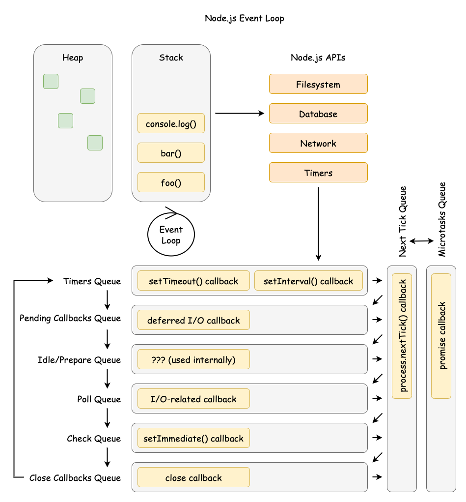
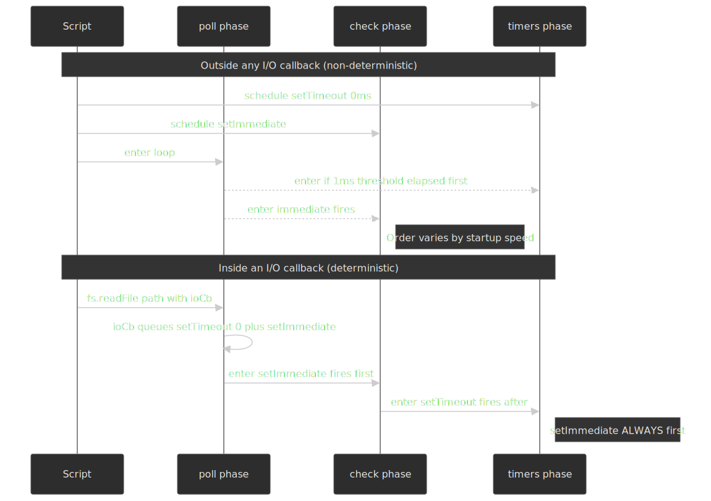

# Node.js Event Loop: Phases, Queues, and Process Exit

This article is the **Node-runtime view** of the event loop: the libuv phase order, the `process.nextTick` and microtask drain points between callbacks, the rules for `setImmediate` vs timers, the libuv thread pool boundary, and the conditions that keep a process alive (or let it exit). For the WHATWG-spec browser model see [Browser Event Loop](../browser-event-loop/README.md); for the C-level libuv internals (handles, requests, io_uring, kernel polling) see [libuv Event Loop Internals](../libuv-event-loop-internals/README.md). All version statements assume Node.js 22 LTS, which ships with libuv 1.49 ([nodejs/node v22.11.0 release notes](https://nodejs.org/en/blog/release/v22.11.0)).



## Abstract

### Mental model

- The loop is a phased scheduler in libuv (Node's cross-platform async I/O library): timers → pending callbacks → idle/prepare → poll → check → close callbacks.
- After each callback in any phase, Node drains `process.nextTick()` and then the microtask queue (Promises and `queueMicrotask()`).
- The process exits when no ref'd handles or active requests remain.

### Operational consequences

- The poll phase can block waiting for I/O readiness; recursive `process.nextTick()` or microtask chains can starve I/O indefinitely.
- Network I/O is non-blocking (epoll/kqueue/event ports/IOCP); file system operations, `dns.lookup()`, async crypto, and async zlib use the libuv thread pool (default 4 threads, max 1024, shared process-wide).
- `setImmediate()` always fires before timers when called from an I/O callback; outside I/O callbacks, the order is non-deterministic.
- libuv timers have millisecond resolution; they specify a minimum delay threshold, not a precise schedule, and `setInterval` does not adjust for callback execution time.

## Mental Model: Two Layers of Scheduling

Think of Node as two schedulers stacked together. The outer scheduler is libuv's phased loop; the inner scheduler is the microtask and `process.nextTick()` queues owned by V8 and Node. A single "tick" is one pass through the phases; after each JavaScript callback (and before the loop continues to the next callback), Node drains `process.nextTick()` and then microtasks.

Simplified flow (intentionally ignoring edge cases covered later):

1. Pick the next phase in the fixed order and run its callbacks one at a time.
2. After **each** callback (not just at phase boundaries), drain `process.nextTick()`.
3. Drain microtasks (Promise reactions and `queueMicrotask()`).
4. Repeat until no ref'd handles or active requests remain.

Example: An HTTP server accepts a socket, runs the poll callback, schedules a Promise to update metrics, and calls `setImmediate()`. The poll callback runs to completion, then `process.nextTick()` callbacks run, then the Promise microtask, and the `setImmediate()` fires later in the check phase.

## Phase Order and Semantics (libuv detail)

Node follows libuv's six conceptual phases, each with its own callback queue. The order is fixed; what changes is how much work is queued in each phase and how long poll blocks ([Node.js — The Node.js Event Loop](https://nodejs.org/en/learn/asynchronous-work/event-loop-timers-and-nexttick)).




> "Each phase has a FIFO queue of callbacks to execute." — [Node.js — The Node.js Event Loop](https://nodejs.org/en/learn/asynchronous-work/event-loop-timers-and-nexttick)

- **timers** — executes expired `setTimeout()` / `setInterval()` callbacks.
- **pending callbacks** — executes callbacks deferred from the previous loop iteration (for example, certain TCP error reporting such as `ECONNREFUSED` on Unix).
- **idle, prepare** — internal libuv bookkeeping; no user-visible callbacks.
- **poll** — pulls new I/O events from the operating system (OS) and runs their callbacks; may block if no timers are due.
- **check** — executes `setImmediate()` callbacks.
- **close callbacks** — handles `close` events (for example, on sockets).

> "A timer specifies the threshold after which a provided callback may be executed." — [Node.js — The Node.js Event Loop](https://nodejs.org/en/learn/asynchronous-work/event-loop-timers-and-nexttick)

Timers are best-effort; operating-system scheduling and other callbacks can delay them. libuv exposes millisecond-resolution timers ([uv_timer_t docs](https://docs.libuv.org/en/v1.x/timer.html)); sub-millisecond intervals are rounded up. A 50 ms repeating timer whose callback takes 17 ms will reschedule about 50 ms from the moment libuv updates "now" again, so the **wall-clock interval drifts** when callbacks are slow — `setInterval` does not adjust for execution time.

> [!IMPORTANT]
> **libuv 1.45.0 (Node.js 20+) changed when timers run.** Before 1.45, libuv processed due timers at the **top** of every iteration (and again later in the iteration); since 1.45 the canonical timer-processing point is **after the poll phase**, with one priming pass before entering the loop body when running under `UV_RUN_DEFAULT` ([libuv PR #3927](https://github.com/libuv/libuv/pull/3927)). Node.js 20+ inherits this. Code that implicitly relied on the previous interleaving — most famously, request handlers that yielded with `setImmediate()` — can now starve other work under load ([nodejs/node #57364](https://github.com/nodejs/node/issues/57364), [The dangers of setImmediate (Platformatic, 2025)](https://blog.platformatic.dev/the-dangers-of-setimmediate)).

The current Node.js docs reflect this:

> "Starting with libuv 1.45.0 (Node.js 20), the event loop behavior changed to run timers only after the poll phase, instead of both before and after as in earlier versions." — [Node.js — The Node.js Event Loop](https://nodejs.org/en/learn/asynchronous-work/event-loop-timers-and-nexttick)

Example: schedule a 100 ms timeout, then start an `fs.readFile()` that completes in 95 ms and runs a 10 ms callback. The timer fires around 105 ms, not 100 ms, because the file callback runs first and delays the timers phase.

## Microtasks and `process.nextTick()`

Node maintains two high-priority queues outside libuv's phases: the `process.nextTick()` queue and the V8 microtask queue. Both are drained between every JavaScript callback the host runs.

> "This queue is fully drained after the current operation on the JavaScript stack runs to completion and before the event loop is allowed to continue." — [Node.js — `process.nextTick()`](https://nodejs.org/docs/latest/api/process.html#processnexttickcallback-args)

> "Within Node.js, every time the 'next tick queue' is drained, the microtask queue is drained immediately after." — [Node.js — `process.nextTick()` vs `queueMicrotask()`](https://nodejs.org/docs/latest/api/process.html#when-to-use-queuemicrotask-vs-processnexttick)

In CommonJS (CJS), `process.nextTick()` callbacks run before `queueMicrotask()` ones. In ECMAScript modules (ESM), module evaluation itself is part of the microtask queue, so `queueMicrotask()` callbacks scheduled at module top-level run **before** `process.nextTick()` callbacks scheduled at the same level.

```js title="cjs.js"
const { nextTick } = require("node:process")
Promise.resolve().then(() => console.log("resolve"))
queueMicrotask(() => console.log("microtask"))
nextTick(() => console.log("nextTick"))
// Output (CJS):
// nextTick
// resolve
// microtask
```

```js title="esm.mjs"
import { nextTick } from "node:process"
Promise.resolve().then(() => console.log("resolve"))
queueMicrotask(() => console.log("microtask"))
nextTick(() => console.log("nextTick"))
// Output (ESM):
// resolve
// microtask
// nextTick
```

> [!NOTE]
> As of Node.js 22, `process.nextTick()` is documented as **Stability: 3 — Legacy**: "Use [`queueMicrotask()`](https://nodejs.org/docs/latest/api/globals.html#queuemicrotaskcallback) instead." ([Node.js process API](https://nodejs.org/docs/latest/api/process.html#processnexttickcallback-args)). Existing core APIs continue to schedule onto the next-tick queue (it is not going away), but for new userland code prefer `queueMicrotask()` for portability.

> "This can create some bad situations because it allows you to 'starve' your I/O by making recursive `process.nextTick()` calls." — [Node.js — The Node.js Event Loop](https://nodejs.org/en/learn/asynchronous-work/event-loop-timers-and-nexttick)

Starvation in production usually shows up as elevated event-loop delay before it shows up as elevated CPU. The instrumentation for catching it lives in `perf_hooks` and is covered in [Detecting blocked loops in production](#detecting-blocked-loops-in-production) below.

## `setImmediate()` vs `setTimeout()` Determinism

The ordering of `setImmediate()` and `setTimeout(..., 0)` depends on whether they are scheduled from inside an I/O callback.

 deterministically inside an I/O callback; outside an I/O callback the order depends on whether the 1 ms timer threshold has elapsed by the time the loop reaches the timers phase.")


**Inside an I/O callback (deterministic):** the loop is in the poll phase, so `check` runs next and `setImmediate()` always fires before `setTimeout()` ([Node.js — setImmediate vs setTimeout](https://nodejs.org/en/learn/asynchronous-work/event-loop-timers-and-nexttick#setimmediate-vs-settimeout)).

```js title="deterministic.js"
const fs = require("node:fs")
fs.readFile(__filename, () => {
  setTimeout(() => console.log("timeout"), 0)
  setImmediate(() => console.log("immediate"))
})
// Output: "immediate" then "timeout" — 100% deterministic
```

**Outside I/O callbacks (non-deterministic):** whether the timer or the immediate fires first depends on process-startup timing — if the loop enters the timers phase before the 1 ms minimum delay elapses, the timer fires after the immediate; if not, the timer wins.

```js title="non-deterministic.js"
setTimeout(() => console.log("timeout"), 0)
setImmediate(() => console.log("immediate"))
// Output order varies between runs
```

Design intent: `setImmediate()` exists specifically to schedule work **immediately after the current I/O callback** without waiting for the timers phase. When predictability matters, prefer `setImmediate()` inside I/O callbacks, or use explicit sequencing with Promises.

> [!CAUTION]
> Yielding from a CPU-bound HTTP handler with `setImmediate()` looks fine in light load but is dangerous under sustained traffic. Since the libuv 1.45 timer change, applications using a small number of `setImmediate()` calls per request can effectively monopolize the loop, starving health checks and other I/O ([nodejs/node #57364](https://github.com/nodejs/node/issues/57364)). Prefer worker threads, explicit load shedding, or chunked work with backoff.

## I/O Boundaries: Kernel Readiness vs. libuv Thread Pool

Network I/O is readiness-based and handled by the kernel with non-blocking sockets. libuv polls using the platform's best mechanism — epoll on Linux, kqueue on macOS/BSD, event ports on SunOS, I/O Completion Ports (IOCP) on Windows — then runs callbacks on the event-loop thread ([libuv design overview](https://docs.libuv.org/en/v1.x/design.html#the-i-o-loop)). Work that cannot be made non-blocking is pushed onto the libuv thread pool.




Thread pool properties (libuv 1.49, shipped with Node 22 LTS — see [libuv threadpool docs](https://docs.libuv.org/en/v1.x/threadpool.html)):

| Property      | Value                | Notes                                                                                  |
| ------------- | -------------------- | -------------------------------------------------------------------------------------- |
| Default size  | 4 threads            | Set at process startup                                                                 |
| Maximum size  | 1024 threads         | Increased from 128 in libuv 1.30.0                                                     |
| Configuration | `UV_THREADPOOL_SIZE` | Environment variable; must be set before the first thread-pool task runs               |
| Thread stack  | 8 MB                 | Changed in libuv 1.45.0; was platform default (often too small for deeply nested code) |
| Thread naming | `libuv-worker`       | Default name added in libuv 1.50.0                                                     |
| Scope         | Process-global       | Shared across all event loops in the process                                           |

The thread pool services:

- **File system operations** — all `fs.*` calls except `fs.watch()` (which uses kernel notifications, e.g. inotify on Linux).
- **DNS via `getaddrinfo`** — `dns.lookup()` and `dns.lookupService()` use the thread pool. `dns.resolve*()` performs DNS over the network and **does not** use the thread pool ([Node.js DNS — Implementation considerations](https://nodejs.org/api/dns.html#implementation-considerations)).
- **Async crypto** — `crypto.pbkdf2()`, `crypto.scrypt()`, async `crypto.randomBytes()`, `crypto.generateKeyPair()` and similar.
- **Async compression** — `zlib.gzip()`, `zlib.gunzip()`, `zlib.deflate()`, `zlib.inflate()` and other async `zlib.*` variants.
- **Custom work** — `uv_queue_work()` for native addons that need to run user code off the loop.

> [!WARNING]
> The thread pool is **not thread-safe for user data**. The pool is global, shared across every loop in the process; native addons that touch shared state from worker callbacks must synchronize explicitly. Because the pool is fixed-size, a single saturated workload (for example, 1,000 concurrent `fs.readFile()` calls behind 4 threads) inflates tail latency for everything that uses the pool — including `dns.lookup()` for outbound HTTP requests. Raising `UV_THREADPOOL_SIZE` (e.g. to 32–128) helps throughput but increases memory and competes with V8 for CPU.

### Detecting blocked loops in production

The `node:perf_hooks` module exposes the only first-class loop instrumentation. There is no `loopBenchmark` API in core; what you have is:

- [`monitorEventLoopDelay({ resolution })`](https://nodejs.org/api/perf_hooks.html#perf_hooksmonitoreventloopdelayoptions) — an `IntervalHistogram` of how late libuv is firing a high-resolution timer relative to its scheduled tick. Read `min`, `max`, `mean`, `stddev`, and `percentile(p)` in nanoseconds. It is a **blocked-loop smoke alarm**: a sustained p99 above ~100 ms means callbacks are running long, microtask/`nextTick` chains are starving I/O, or the thread pool is back-pressuring the loop.
- [`performance.eventLoopUtilization([util1[, util2]])`](https://nodejs.org/api/perf_hooks.html#performanceeventlooputilizationutilization1-utilization2) — returns `{ idle, active, utilization }` where `utilization` is the fraction of wall time spent **outside** the event provider (the kernel `epoll_wait` / `GetQueuedCompletionStatusEx` call). It is a **saturation signal** that catches synchronous CPU work even when overall CPU usage looks low; sustained ELU above ~0.8 is a strong signal to scale out, shed load, or move work to a worker thread.

For a userland convenience layer that polls these APIs and emits a single "blocked"/"healthy" boolean, the canonical package is [`loopbench`](https://github.com/mcollina/loopbench) by Matteo Collina; Fastify uses it to drive its `under-pressure` plugin. Treat it as a thin wrapper around the core APIs above, not a replacement.

## Worker Threads and the Per-Worker Loop

`worker_threads` does not split the main event loop — it spawns a new OS thread that owns its **own V8 isolate, its own JS heap, and its own libuv event loop** running the same six-phase order. Each worker is bootstrapped inside its loop, so `eventLoopUtilization()` is available immediately after the `'online'` event fires ([Node.js — Worker Threads](https://nodejs.org/api/worker_threads.html#workerperformance)).

 and may share memory only via SharedArrayBuffer + Atomics. The libuv thread pool stays process-global.")


Practical consequences:

- **Communication.** Default IPC is `postMessage` over a `MessagePort`, copied via the structured clone algorithm; the receiving loop wakes through `uv_async_send`. The only zero-copy path is `SharedArrayBuffer` with `Atomics` for synchronization, or transferring an `ArrayBuffer`/`MessagePort` (the original handle is detached).
- **Thread pool stays shared.** The libuv thread pool is **process-global**, so a worker calling `fs.readFile()` competes with the main loop for the same `UV_THREADPOOL_SIZE` slots. Workers move CPU work off the main loop, not I/O work — a CPU-bound worker still blocks its own JS callbacks but no longer the main loop's I/O callbacks.
- **`stdio` round-trips through the main loop.** A worker's `console.log` is a `MessagePort` write back to the parent; if the parent loop is blocked, worker stdout backs up.
- **Liveness.** A worker keeps its parent loop alive only while at least one of its `MessagePort`s is ref'd. `port.unref()` and `worker.unref()` mirror the timer/socket model so background workers do not block process exit.

> [!TIP]
> Treat `worker_threads` as the right tool for **CPU-bound** work (parsing, compression, hashing, image transcoding) where you can amortize the spawn cost with a pool. For I/O-bound fan-out, the main loop with non-blocking sockets is already concurrent — adding workers usually adds copy overhead and thread-pool contention without reducing latency.

## Process Exit and Liveness

Between iterations Node checks whether the loop is **alive**. The loop is alive when any of these conditions hold ([libuv design overview](https://docs.libuv.org/en/v1.x/design.html#the-i-o-loop)):

- Active and ref'd handles exist (timers, sockets, file watchers).
- Active requests are pending (I/O operations in flight).
- Closing handles are still in flight.

When none of these conditions hold, the process exits. This is why short scripts terminate as soon as their last callback completes — there is nothing left to wake the loop.

### `ref()` and `unref()`

By default, all timers and immediates are **ref'd** — the process will not exit while they are active. Calling `timeout.unref()` allows the process to exit even if the timer is still pending; `timeout.ref()` reverses this. Both are idempotent. Use `timeout.hasRef()` to check current status ([Node.js Timers — `Timeout.unref()`](https://nodejs.org/api/timers.html#timeoutunref)).

```js title="unref-example.js"
const timeout = setTimeout(() => console.log("never runs"), 10000)
timeout.unref()
// process exits as soon as the main script finishes;
// the unref'd timer no longer keeps the loop alive.
```

| Use `unref()` for                                            | Keep `ref()` (default) for                              |
| ------------------------------------------------------------ | ------------------------------------------------------- |
| Background heartbeats / metrics flush                        | Critical timeout that must fire before exit             |
| Idle keepalive sockets in pooled HTTP clients                | Pending request that must be observed                   |
| Watchdog timers that should not block graceful shutdown      | A user-facing `setTimeout` whose callback must run      |

`socket.unref()`, `child_process.unref()`, and `uv_handle_t`'s `uv_unref()` follow the same model. Without `unref()` you would have to manually clear every background timer during shutdown.

## Browser Event Loop Contrast (Spec-precise)

The HTML event loop model is similar in spirit but not identical in mechanism. The spec explicitly separates task queues from the microtask queue ([HTML Standard — Event loop processing model](https://html.spec.whatwg.org/multipage/webappapis.html#event-loop-processing-model)):

> "Task queues are sets, not queues."

> "The microtask queue is not a task queue."

The spec also preserves ordering within a single task source:

> "the user agent would never process events from any one task source out of order."

ECMAScript jobs are a FIFO queue ([ECMA-262 — Jobs and Host Operations](https://262.ecma-international.org/15.0/#sec-jobs)):

> "A Job is an Abstract Closure with no parameters that initiates an ECMAScript computation when no other ECMAScript computation is currently in progress."

Net effect: because HTML task queues are sets and the user agent selects a runnable task from a chosen queue, ordering across different task sources is not guaranteed; ordering within a given source is. Node's fixed phase order plus the extra `process.nextTick()` queue make scheduling more predictable for server workloads but easier to starve if high-priority queues are abused.

| Dimension                  | Browser (WHATWG HTML)                              | Node.js (libuv)                                                |
| -------------------------- | -------------------------------------------------- | -------------------------------------------------------------- |
| Macrotask boundary         | One task per iteration, UA-selected from any source | One callback per phase queue, in fixed phase order             |
| Microtask drain            | After every task, before rendering                  | After every callback in any phase                              |
| Extra high-priority queue  | None                                                | `process.nextTick()` (drains before microtasks)                |
| Rendering                  | First-class task source aligned to display refresh  | None — Node has no rendering pipeline                          |
| Idle scheduling            | `requestIdleCallback`                               | No equivalent; use `setImmediate` or `setTimeout`              |
| Starvation source          | Microtask loop blocks rendering                     | `process.nextTick` recursion blocks I/O                        |

Example: in a browser, a user-input task can run before a timer task depending on task-source selection; in Node, an I/O callback and a `setImmediate()` always follow the poll → check phase order.

## Conclusion

Node's event loop is a deliberate trade-off: fixed phases plus a dedicated thread pool make I/O-heavy servers predictable and scalable, while the high-priority queues (`process.nextTick()` and microtasks) offer low-latency scheduling at the cost of potential starvation. The libuv 1.45.0 timer change (Node 20+) altered the previously implicit interleaving of timers, polled I/O, and immediates, and the CJS-vs-ESM microtask ordering difference can cause subtle bugs when porting code.

Use the simplified two-scheduler mental model to reason quickly, then drop to the phase-level view when debugging ordering or latency. When in doubt: prefer `setImmediate()` inside I/O callbacks for deterministic scheduling, prefer `queueMicrotask()` over `process.nextTick()` for portability and to avoid I/O starvation, and instrument with `monitorEventLoopDelay()` plus `performance.eventLoopUtilization()` to catch starvation in production.

## Appendix

### Prerequisites

- Familiarity with Promises, timers, and non-blocking I/O in Node.js.
- The cross-runtime overview in [JS Event Loop](../js-event-loop/README.md) is a useful primer if you need it.

### Terminology

- **Tick** — one pass through the libuv phases.
- **Phase** — a libuv stage that owns a callback queue (timers, poll, check, etc.).
- **Handle** — a long-lived libuv resource (timer, socket, file watcher) that keeps the loop alive while active and ref'd.
- **Request** — a short-lived libuv operation (write, DNS lookup) that keeps the loop alive while pending.
- **Task** — a unit of work scheduled onto an HTML task queue (browser concept).
- **Task source** — a category of tasks in HTML (for example, timers, user interaction, networking).
- **Microtask** — a high-priority job processed after tasks/callbacks (Promise reactions, `queueMicrotask()`).

### Summary

- libuv executes callbacks in fixed phases; Node drains `process.nextTick()` then microtasks after **every** callback, not only at phase boundaries.
- Timers have millisecond resolution; they specify a minimum delay threshold, not a precise schedule. `setInterval` does not adjust for execution time.
- Since Node 20 (libuv 1.45.0), timers run only after the poll phase — a behaviour change from prior versions that exposed a real production starvation pattern with `setImmediate()`.
- The libuv thread pool (default 4, max 1024) services `fs`, `dns.lookup()`, async crypto and async zlib; saturation increases tail latency for everything that touches the pool.
- `setImmediate()` always fires before timers inside I/O callbacks; outside them the order is non-deterministic.
- `worker_threads` give each worker its own V8 isolate and its own libuv loop, but the libuv thread pool stays process-global; use workers for CPU-bound work, not I/O fan-out.
- Use `perf_hooks.monitorEventLoopDelay()` for loop-lag percentiles and `performance.eventLoopUtilization()` for ELU; `loopbench` is a userland wrapper, not a separate API.
- The process exits when no ref'd handles or active requests remain; use `unref()` for background timers that should not block shutdown.
- HTML and ECMAScript specs model tasks and microtasks differently from Node's phase-based loop.
- `process.nextTick()` is now legacy; prefer `queueMicrotask()` for new userland code.

### References

- [HTML Standard — Event loop processing model](https://html.spec.whatwg.org/multipage/webappapis.html#event-loop-processing-model)
- [ECMA-262 — Jobs and Host Operations](https://262.ecma-international.org/15.0/#sec-jobs)
- [libuv — Design overview](https://docs.libuv.org/en/v1.x/design.html)
- [libuv — Thread pool work scheduling](https://docs.libuv.org/en/v1.x/threadpool.html)
- [libuv — Timer handle](https://docs.libuv.org/en/v1.x/timer.html)
- [libuv PR #3927 — change execution order of timers](https://github.com/libuv/libuv/pull/3927)
- [Node.js — The Node.js Event Loop](https://nodejs.org/en/learn/asynchronous-work/event-loop-timers-and-nexttick)
- [Node.js — Understanding `process.nextTick()`](https://nodejs.org/en/learn/asynchronous-work/understanding-processnexttick)
- [Node.js — `process.nextTick()` API](https://nodejs.org/docs/latest/api/process.html#processnexttickcallback-args)
- [Node.js — `process.nextTick()` vs `queueMicrotask()`](https://nodejs.org/docs/latest/api/process.html#when-to-use-queuemicrotask-vs-processnexttick)
- [Node.js — Timers API](https://nodejs.org/api/timers.html)
- [Node.js — DNS module (Implementation considerations)](https://nodejs.org/api/dns.html#implementation-considerations)
- [Node.js — Performance measurement APIs (`monitorEventLoopDelay`)](https://nodejs.org/api/perf_hooks.html#perf_hooksmonitoreventloopdelayoptions)
- [Node.js — `performance.eventLoopUtilization()`](https://nodejs.org/api/perf_hooks.html#performanceeventlooputilizationutilization1-utilization2)
- [Node.js — Worker Threads (`worker_threads`)](https://nodejs.org/api/worker_threads.html)
- [`mcollina/loopbench` — userland loop-block detector](https://github.com/mcollina/loopbench)
- [Node.js v22.11.0 release notes (LTS Jod, libuv 1.49)](https://nodejs.org/en/blog/release/v22.11.0)
- [nodejs/node #57364 — Unexpected server incoming requests queue after Node.js 20](https://github.com/nodejs/node/issues/57364)
- [Platformatic — The dangers of `setImmediate` (2025)](https://blog.platformatic.dev/the-dangers-of-setimmediate)
