# Node.js Runtime Architecture: Event Loop, Streams, and APIs

Node.js is a host environment that pairs V8 with libuv, a C++ bindings layer, and a large set of JavaScript core modules and Application Programming Interfaces (APIs). This article focuses on the runtime boundaries that matter at scale: event loop ordering, microtasks, thread pool backpressure, buffer and stream memory, and Application Binary Interface (ABI) stable extension points. Coverage is current as of Node.js 22 LTS (libuv 1.49+, V8 12.4+).


## Abstract

Node.js runtime behavior is defined by three boundaries: the V8 JavaScript-to-native edge (where JIT tiers and GC pauses originate), the libuv event loop (where phase ordering and microtask interleaving determine callback timing), and the thread pool (where nominally "async" file I/O becomes a blocking queue). Mastering the runtime means understanding what crosses each boundary and when.

 or OS async I/O (non-blocking sockets).")

**Key mental models:**

- **Scheduling**: `process.nextTick` drains before Promise microtasks, which drain before any event loop phase advances. Unbounded recursion in either queue starves I/O.
- **Thread pool bottleneck**: File system ops, `dns.lookup`, and CPU-bound crypto share a default 4-thread pool. Network I/O and `dns.resolve*` bypass it entirely.
- **Backpressure contract**: `Writable.write()` returning `false` is a hard stop signal; ignoring it causes unbounded memory growth until OOM or abort.
- **ABI stability**: Node-API is the only stable native addon interface across majors. Direct V8/libuv header use requires rebuild per major.

## Runtime Layers and Call Path

Node.js is a host for ECMAScript. The runtime is composed of:

- **V8** — executes JavaScript, owns the JavaScript heap, and runs the GC.
- **JavaScript core libraries** — `node:fs`, `node:http`, `node:stream`, etc., shipped as built-in modules and serialized into the V8 startup snapshot at build time.
- **C++ bindings** (`src/`) — translate JavaScript calls into libuv requests, native library calls, and V8 API calls.
- **libuv** — single-threaded event loop, the shared thread pool, and OS I/O multiplexing (epoll on Linux, kqueue on BSD/macOS, I/O Completion Ports (IOCP) on Windows).
- **Bundled native dependencies** — [llhttp](https://github.com/nodejs/llhttp) for HTTP/1.1 message parsing, [OpenSSL](https://www.openssl.org/) (BoringSSL on some forks) for TLS and crypto primitives, [c-ares](https://c-ares.org/) for true async DNS, [zlib](https://github.com/madler/zlib) for gzip/deflate, [ngtcp2 + nghttp3](https://nghttp2.org/) for QUIC/HTTP3, and [simdutf](https://github.com/simdutf/simdutf) for UTF-8 validation.

The C++ binding layer is the only place where a JavaScript call can become a libuv request or a call into one of the bundled native libraries. The libuv loop itself is not thread-safe, so any cross-thread work — from the thread pool, a worker thread, or a native addon — must hop back via `uv_async_t` queues before touching JavaScript objects.

The design trade-off is intentional: a single event loop keeps scheduling deterministic and lightweight, but any synchronous Central Processing Unit (CPU) bound work on the main thread blocks every connection.

Example: A gateway handling 30k idle keep-alive sockets is fine as long as request handlers avoid synchronous JSON parsing. A single 20 ms CPU spike blocks all 30k sockets.

## Event Loop, Microtasks, and Ordering

The Node.js event loop executes callbacks in six phases:

1. **timers** - `setTimeout()` and `setInterval()` callbacks
2. **pending callbacks** - I/O callbacks deferred from the previous iteration
3. **idle, prepare** - internal libuv use
4. **poll** - retrieve new I/O events, execute I/O callbacks
5. **check** - `setImmediate()` callbacks
6. **close callbacks** - close event handlers (`socket.on('close')`)


As of libuv 1.45 (Node.js 20+), timers run only after the poll phase, changing the timing of `setTimeout()` relative to `setImmediate()`. Prior to libuv 1.45, timers could fire both before and after poll, making the `setTimeout(0)` vs `setImmediate()` race nondeterministic even inside I/O callbacks.

`process.nextTick()` is not part of the event loop phases. Its queue drains after the current JavaScript stack completes and before the loop advances to the next phase. The draining order is:

1. All `process.nextTick()` callbacks (recursively, until empty)
2. All Promise microtask callbacks (recursively, until empty)
3. Next event loop phase

ECMAScript defines job queues for Promise reactions but leaves inter-queue ordering to the host:

> "This specification does not define the order in which multiple Job Queues are serviced." (ECMA-262)

Node's implementation choice to drain `nextTick` before Promises is a deliberate departure from browser behavior, where only the microtask queue exists. This creates a subtle portability trap: code relying on `nextTick` priority behaves differently in browsers using `queueMicrotask()`.

```js title="timeout-vs-immediate.js" collapse={1-3,6-7}
import { readFile } from "node:fs"

readFile(__filename, () => {
  setTimeout(() => console.log("timeout"), 0)
  setImmediate(() => console.log("immediate"))
})
```

Example: Inside an I/O callback on libuv 1.45+, `setImmediate` always fires before `setTimeout(0)` because check phase precedes the next timer phase. Outside an I/O callback, the order depends on process timing and remains nondeterministic.

**Edge case**: Recursive `nextTick` chains starve I/O indefinitely. A `while (true) process.nextTick(fn)` pattern blocks the event loop forever because the loop cannot advance until the `nextTick` queue empties.

## libuv Thread Pool: When Async I/O Is Not Truly Non-Blocking

libuv uses a shared thread pool to offload operations that lack non-blocking OS primitives. The pool is global, shared across all event loops, and preallocated at startup.

**Pool configuration:**

- Default size: 4 threads
- Maximum: 1024 (increased from 128 in libuv 1.30.0)
- Set via `UV_THREADPOOL_SIZE` environment variable at process startup
- Cannot be resized after the first I/O operation triggers pool initialization

**Operations using the thread pool:**

| Category    | Operations                                                                                                      |
| ----------- | --------------------------------------------------------------------------------------------------------------- |
| File system | All `fs` APIs except `fs.FSWatcher()` and explicitly synchronous methods                                        |
| DNS         | `dns.lookup()`, `dns.lookupService()`                                                                           |
| Crypto      | `crypto.pbkdf2()`, `crypto.scrypt()`, `crypto.randomBytes()`, `crypto.randomFill()`, `crypto.generateKeyPair()` |
| Compression | All `zlib` APIs except explicitly synchronous methods                                                           |

**Operations bypassing the thread pool:**

| Category       | Operations               | Mechanism                                   |
| -------------- | ------------------------ | ------------------------------------------- |
| Network I/O    | TCP, UDP, HTTP sockets   | OS non-blocking sockets (epoll/kqueue/IOCP) |
| DNS resolution | `dns.resolve*()` methods | c-ares library (true async)                 |


The distinction between `dns.lookup()` (uses thread pool, honors `/etc/hosts` via `getaddrinfo`) and `dns.resolve*()` (uses c-ares, DNS protocol only) is a common source of confusion. Under load, `dns.lookup()` can saturate the thread pool and block file system operations.

Example: On a 16-core machine, 64 concurrent `fs.readFile` calls still execute only four at a time by default. Raising `UV_THREADPOOL_SIZE` reduces queueing but increases memory footprint and context-switch overhead. A common production value is 64–128 for I/O-heavy workloads.

**Edge case**: Setting `UV_THREADPOOL_SIZE` after any I/O operation has already occurred has no effect. The pool size is fixed at first use. This catches teams who try to configure it dynamically based on runtime conditions.

## Threading: One JS Thread, Many Workers, One Pool

Node.js has exactly one JavaScript thread *per V8 isolate*, but a single process can host many isolates via `worker_threads`. Each worker is a full Node.js environment in one process: its own V8 isolate, its own libuv event loop, its own microtask queues, its own JavaScript heap. The libuv thread pool, by contrast, is **process-global** — every isolate competes for the same default-4 threads.


| Concern              | Main thread + thread pool                                | `worker_threads`                                                                       | `cluster` (separate processes)                                       |
| :------------------- | :------------------------------------------------------- | :------------------------------------------------------------------------------------- | :------------------------------------------------------------------- |
| Goal                 | Concurrent I/O on a single isolate                       | Parallel CPU work inside one process                                                   | Horizontal CPU + isolation across processes                          |
| Memory model         | Shared JS heap                                           | Separate JS heap; explicit sharing via `SharedArrayBuffer` + `Atomics`                 | Fully separate processes; no shared memory                           |
| Communication        | Direct call                                              | Structured-clone over `MessageChannel`, transferable `ArrayBuffer`, `SharedArrayBuffer` | IPC over Unix-domain sockets / named pipes                           |
| Failure blast radius | One sync bug freezes everything                          | Crash kills only that worker's isolate                                                  | Crash kills only that process                                        |
| When to reach for it | Default for I/O-bound work                               | CPU-bound transforms (parse, hash, image, ML inference)                                | Bare-metal/VM deploys where the orchestrator does not handle scaling |

The `node:cluster` module is still supported, but the Node.js docs explicitly recommend `worker_threads` whenever process isolation is not required.[^cluster-vs-workers] In containerized deploys, the orchestrator (Kubernetes, ECS, Nomad) usually handles horizontal scaling already, so `cluster` is mostly used on bare metal or single-VM deploys; `worker_threads` is the right primitive for CPU parallelism inside one process.

> [!CAUTION]
> Pool-thread starvation is the silent killer of `worker_threads` setups. If every worker fires `crypto.scrypt` or `fs.readFile` concurrently, they all queue behind the same 4-thread default pool. Raise `UV_THREADPOOL_SIZE` *before* the first I/O call — but remember that pool threads are real OS threads with full stacks, so the cost shows up in resident set size.

For pooled task dispatch, prefer a managed pool ([Piscina](https://github.com/piscinajs/piscina) is the de facto standard) over rolling your own — worker spin-up cost is dominated by V8 isolate initialization, not OS thread creation.

## V8 Execution and Garbage Collection in Node

### Startup snapshot

Node.js boots from a V8 startup snapshot — a serialized, pre-initialized V8 heap baked into the binary at build time. The snapshot already contains the JavaScript half of the core libraries (`node:fs`, `node:url`, the loader, etc.) parsed into bytecode, so cold starts skip almost all the parse and initialization cost for built-ins.

User code can extend this with **userland snapshots**: run `node --build-snapshot entry.js` to execute `entry.js`, freeze the resulting V8 heap into `snapshot.blob`, then start later processes with `node --snapshot-blob=snapshot.blob`. The `v8.startupSnapshot` API exposes `addSerializeCallback` / `addDeserializeCallback` / `setDeserializeMainFunction` for releasing and re-acquiring resources around the freeze. In-flight asynchronous work (open sockets, timers, file descriptors) cannot be serialized, and snapshots cannot be re-snapshotted.[^startup-snapshot] This is the same machinery that backs the Single Executable Application (SEA) feature.

### JIT tiering

V8 runs a four-tier Just-In-Time (JIT) pipeline, each tier trading compilation speed for generated code quality:

| Tier          | Role               | Trigger threshold | Speed vs quality                                                                                  |
| ------------- | ------------------ | ----------------- | ------------------------------------------------------------------------------------------------- |
| **Ignition**  | Interpreter        | First call        | Instant start, slowest execution                                                                  |
| **Sparkplug** | Baseline compiler  | ~8 invocations    | Compiles bytecode to machine code without optimization; no IR (Intermediate Representation)       |
| **Maglev**    | Mid-tier optimizer | ~500 invocations  | SSA-based CFG (Control Flow Graph); ~10× slower than Sparkplug, ~10× faster than TurboFan compile |
| **TurboFan**  | Advanced optimizer | ~6000 invocations | Aggressive speculative optimization; peak throughput                                              |

Thresholds are approximate and configurable; defaults differ on Android and under fuzz/stress modes, and can change between V8 releases.


Sparkplug shipped in V8 9.1 (Chrome 91, May 2021). Maglev shipped in V8 11.7 (Chrome M117, December 2023) and was wired into Node.js 22 (V8 12.4). It was enabled by default in Node.js 22.0–22.8, then disabled by default in Node.js 22.9.0 after codegen-related crashes; opt back in with `--maglev` once your workload has been validated[^maglev-22-9].

The tiering thresholds reset if type feedback changes—for example, if a function previously saw only integers suddenly receives a string, it may deoptimize and re-tier. This explains why monomorphic call sites (single type) optimize better than polymorphic ones.

### Garbage collection

V8 uses generational Garbage Collection (GC). The young generation is intentionally small so it fills quickly and triggers frequent scavenges; survivors are promoted to the old generation. The classic Cheney semispace ran up to ~16 MiB total, but modern V8 sizes the young generation dynamically per process (often 1–16 MiB depending on heuristics and container memory) and exposes the cap via `--max-semi-space-size`[^semi-space]. The Orinoco parallel scavenger splits young-generation collection across multiple threads, keeping pause times to sub-millisecond on typical workloads.

**GC pause implications:**

- Young-generation scavenges are frequent but fast (~0.5–2 ms)
- Old-generation major GCs can pause 10–100+ ms on large heaps
- Incremental marking spreads old-generation work across frames, reducing peak pause

Example: Long-lived services with stable object shapes benefit from Maglev and TurboFan tier-up. Short-lived serverless functions (sub-100ms) spend most execution time in Ignition and Sparkplug, making startup latency and interpreter performance the dominant factors. For serverless, minimizing cold-start bytecode size matters more than peak TurboFan throughput.

## Buffers and Streams: Moving Bytes Without Blowing RAM

### Buffers

`Buffer` is a subclass of `Uint8Array`; Node.js APIs accept plain `Uint8Array` where buffers are supported. `Buffer.allocUnsafe()` returns uninitialized memory—this is a security consideration because the memory may contain sensitive data from previous allocations.

**Pool behavior:**

- `Buffer.poolSize` default: 8192 bytes (8 KiB)
- Pool used when allocation size < `Buffer.poolSize >>> 1` (4096 bytes)
- Methods using the pool: `Buffer.allocUnsafe()`, `Buffer.from(array)`, `Buffer.from(string)`, `Buffer.concat()`
- `Buffer.allocUnsafeSlow()` never uses the pool (allocates dedicated ArrayBuffer)

`process.memoryUsage().arrayBuffers` includes memory held by `Buffer` and `SharedArrayBuffer` objects, distinct from the V8 heap.

Example: If `arrayBuffers` grows by 200 MB while `heapUsed` is flat, you have large binary payloads or pooled buffers, not a JavaScript heap leak. Conversely, thousands of small `allocUnsafe` calls may reuse the same 8 KiB pool and not show up as memory growth until the pool is exhausted.

### Streams and backpressure

`Writable.write()` returns `false` when the internal buffer reaches or exceeds `highWaterMark`. This is a **hard signal** to stop writing until the `drain` event fires.

**Default `highWaterMark` values (Node.js 22+):**

- Binary streams: 65536 bytes (64 KiB) — bumped from 16 KiB in Node.js 22.0.0[^hwm-bump]
- Object mode streams: 16 objects

`highWaterMark` is a threshold, not a hard limit. Specific stream implementations may enforce stricter limits, but the base classes do not prevent writes when the threshold is exceeded—they only signal via the return value.

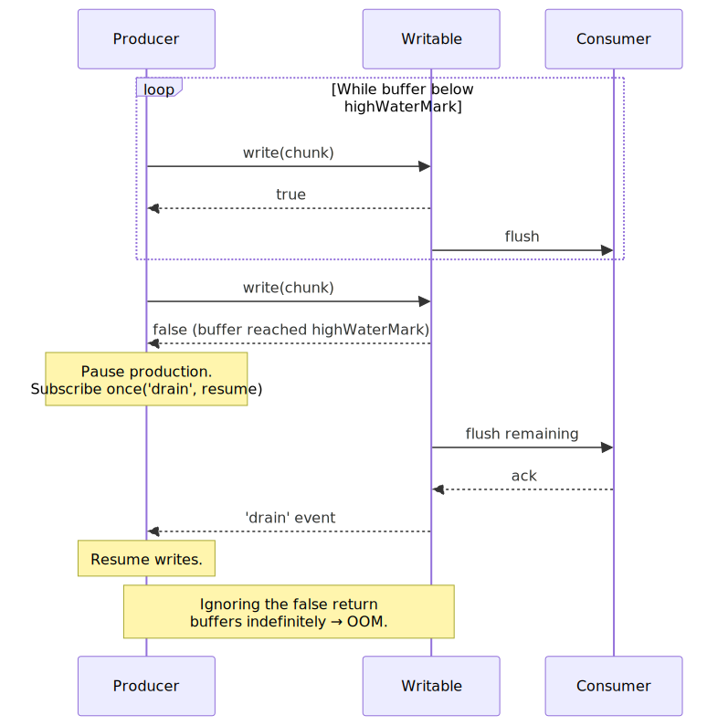
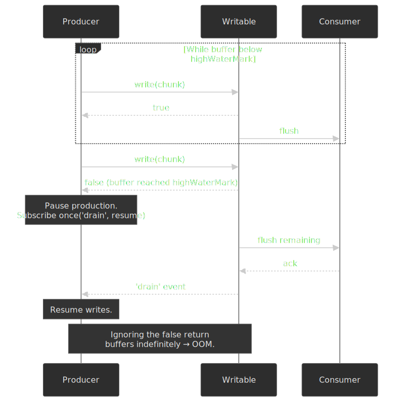

```js title="write-with-drain.js" collapse={1-2,6-7}
const ok = writable.write(chunk)

if (!ok) {
  writable.once("drain", resume)
}
```

**Failure mode**: Ignoring `write() → false` forces Node to buffer indefinitely. Memory grows until the process hits heap limits and aborts, or the OS kills it. This is also a security vector: a slow or malicious client that never drains can cause unbounded memory growth (slowloris-style attack on memory).

Example: A 200 MB upload piped through `stream.pipeline()` stays bounded by `highWaterMark`. The same upload pushed via a tight `write()` loop can spike Resident Set Size (RSS) to gigabytes and trigger an OOM abort.

### Web Streams alignment

Node's Web Streams API implements the WHATWG Streams Standard and has been stable since Node.js 21.0.0 (Stability 2). Prior to v21, it was experimental and emitted runtime warnings.

Web Streams define a queuing strategy with a `highWaterMark` that can be any non-negative number, including `Infinity` (which disables backpressure). The semantics differ from Node streams: Web Streams use a "pull" model with explicit controller signaling rather than the Node "push + drain" model.

**Interop helpers:**

- `Readable.toWeb()` / `Writable.toWeb()` - convert Node streams to Web Streams
- `Readable.fromWeb()` / `Writable.fromWeb()` - convert Web Streams to Node streams

Example: When building a library shared between browser and Node, prefer Web Streams for the public API and convert internally with `toWeb()` / `fromWeb()`. This keeps backpressure semantics consistent across environments.

## Native Extensions and ABI Stability

Node-API (formerly N-API) is the only ABI-stable surface for native addons. It was introduced in Node.js 8.0 as experimental, marked stable in Node.js 8.12, and has been the recommended approach since.

**ABI stability guarantee:**

- Functions in `node_api.h` are ABI-stable across major Node.js versions
- Addons compiled against Node-API run on later Node.js versions without recompilation
- Node-API versions are additive: a higher version includes all previous version symbols

**Current Node-API versions (as of Node.js 22):**

| Node-API version | Minimum Node.js          |
| ---------------- | ------------------------ |
| 10               | 22.14.0, 23.6.0          |
| 9                | 18.17.0, 20.3.0          |
| 8                | 12.22.0, 14.17.0, 16.0.0 |

If `NAPI_VERSION` is not defined at compile time, it defaults to 8.

**What is NOT ABI-stable:**

- Node.js C++ APIs (`node.h`, `node_buffer.h`)
- libuv APIs (`uv.h`)
- V8 APIs (`v8.h`)

Using any of these headers directly requires rebuilding for each major Node.js version. V8's C++ API changes frequently; even minor V8 updates can break compilation.

Example: If you ship a native addon using only `node_api.h`, a single build runs across Node.js 16, 18, 20, 22, and 24. If you include `v8.h` for direct V8 access, expect to maintain separate builds per major version and handle API churn (e.g., V8's handle scope changes, isolate API updates).

## Module Loading and Package Scope

Within a package, the `package.json` `"type"` field defines how Node.js treats `.js` files:

| `"type"` value | `.js` treatment | Default                    |
| -------------- | --------------- | -------------------------- |
| `"module"`     | ES module       | No                         |
| `"commonjs"`   | CommonJS        | Yes (when `"type"` absent) |

File extensions override the `"type"` field: `.mjs` is always ES module, `.cjs` is always CommonJS.

### `require(esm)` support (Node.js 22.12+)

As of Node.js 22.12.0 (backported to 20.19.0), `require()` can load ES modules without flags. This eliminates the historical barrier where CommonJS code could not synchronously import ES modules.

**Limitation**: `require(esm)` only works for ES modules without top-level `await`. If the module uses top-level `await`, Node throws `ERR_REQUIRE_ASYNC_MODULE`.

```js title="require-esm.js" collapse={1-2,5-6}
// Node.js 22.12+ allows this
const esModule = require("./es-module.mjs")

console.log(esModule.default)
```

> **Prior to Node.js 22.12**: `require()` could not load ES modules at all. The only way to use ESM from CJS was dynamic `import()`, which returns a Promise and cannot be used synchronously. This forced many libraries to ship dual CJS/ESM builds.

Check `process.features.require_module` to verify if your runtime supports `require(esm)`. The feature can be disabled with `--no-experimental-require-module`.

Example: In a `"type": "module"` package, name legacy config files `*.cjs` to keep tooling that still uses `require()` working. In Node.js 22.12+, you can simplify by using `require()` to load `.mjs` files directly, avoiding the dual-build complexity.

### ESM loader pipeline and customization hooks

Every `import` specifier — and, since `require(esm)` landed, every `require()` of an ES module — flows through the same pipeline: **resolve → load → parse → link → evaluate**, with the result keyed in the module cache by URL.


Two registration surfaces ride on top:[^module-hooks]

- **`module.registerHooks({ resolve, load })`** — synchronous, runs in the loader thread of the calling realm, supports the full CommonJS surface (including `require.resolve`). Recommended for most use cases since Node.js 22.15+.
- **`module.register(specifier, parentURL)`** — asynchronous; hooks execute in a dedicated off-thread loader (since v20.0.0) and communicate via `MessageChannel`. Required for hooks that themselves do async work (network resolves, transpilation pipelines).

Both register into a chain: each hook either calls `nextResolve()` / `nextLoad()` to delegate to the next link, or returns `{ shortCircuit: true }` to stop. The chain executes Last-In-First-Out, so the last-registered hook sees the specifier first.

> [!IMPORTANT]
> Register hooks via `--import ./loader.mjs` (or `--require` for sync hooks), never via a static `import` from your application entry. Static imports are evaluated *before* the registration call runs, so the hooks miss the very modules they were meant to intercept.

## Security: The Permission Model

Node.js historically had no in-process sandbox: any code in any dependency could read the file system, spawn child processes, or open raw sockets. The Permission Model closes that gap. It graduated from experimental (Node.js 20+, behind `--experimental-permission`) to **Stable** in Node.js 22.13.0 and 23.5.0, where the flag is now `--permission`.[^permission-model]

| Allowlist flag                                | Controls                                                       |
| :-------------------------------------------- | :------------------------------------------------------------- |
| `--allow-fs-read=<paths>`                     | Read access to the listed paths (`*` for full FS).             |
| `--allow-fs-write=<paths>`                    | Write access (delete, rename, create, modify).                 |
| `--allow-child-process`                       | `child_process` family.                                        |
| `--allow-worker`                              | `worker_threads`.                                              |
| `--allow-addons`                              | `process.dlopen` (loading native addons).                      |
| `--allow-wasi`                                | WASI sandbox creation.                                         |

When `--permission` is on, deny is the default; everything not explicitly listed is blocked. `process.permission.has(scope, reference)` lets code probe its own sandbox at runtime.

> [!WARNING]
> The Permission Model is a "seat belt" against accidental access from trusted code, not a defense against malicious code in the same process. Native addons (when allowed) execute outside the model entirely, and a sufficiently capable bug in V8 or libuv can bypass the JavaScript-level checks. Treat it as defense-in-depth, not a sandbox boundary.

## Observability and Failure Modes

### Event loop delay monitoring

`perf_hooks.monitorEventLoopDelay()` samples loop delays in nanoseconds and exposes them as a histogram. This is the primary tool for detecting event loop blocking.

```js title="event-loop-delay.js" collapse={1-3,6-7}
import { monitorEventLoopDelay } from "node:perf_hooks"

const h = monitorEventLoopDelay({ resolution: 20 })
h.enable()
```

**Interpreting delay metrics:**

| Metric         | Healthy value | Investigation path                                            |
| -------------- | ------------- | ------------------------------------------------------------- |
| p50 delay      | < 5ms         | Normal operation                                              |
| p99 delay      | < 50ms        | Occasional GC or sync work                                    |
| p99 delay      | > 100ms       | Synchronous CPU blocking, large GC, or thread pool starvation |
| min/max spread | < 10×         | Consistent behavior                                           |

### Memory breakdown

`process.memoryUsage()` returns:

- `heapUsed` / `heapTotal` - V8 JavaScript heap
- `external` - C++ objects bound to JavaScript (e.g., native addon memory)
- `arrayBuffers` - `Buffer`, `ArrayBuffer`, `SharedArrayBuffer` (outside V8 heap)
- `rss` - total resident set size (includes all of the above plus code, stacks, etc.)

Example: If `arrayBuffers` grows by 200 MB while `heapUsed` is flat, you have binary payloads or stream buffers accumulating, not a JavaScript object leak. Profile with `--heapsnapshot-near-heap-limit` to catch JavaScript leaks; use `/proc/[pid]/smaps` on Linux to diagnose native memory.

### Diagnostic failure patterns

| Symptom                           | Likely cause                        | Investigation                                                              |
| --------------------------------- | ----------------------------------- | -------------------------------------------------------------------------- |
| Low loop delay, high file latency | Thread pool saturation              | Check `UV_THREADPOOL_SIZE`, reduce concurrent `fs` calls                   |
| High loop delay spikes            | Synchronous CPU work                | Profile with `--cpu-prof`, look for JSON.parse/stringify on large payloads |
| Steady loop delay increase        | Recursive `nextTick`/Promise chains | Add `nextTick` depth limits, break long chains with `setImmediate`         |
| `arrayBuffers` growth             | Stream backpressure ignored         | Ensure `write() → false` pauses producers                                  |
| `heapUsed` growth                 | JavaScript object leak              | Heap snapshot comparison, look for detached DOM/closures                   |

**Edge case**: `process.nextTick()` recursion is invisible to `monitorEventLoopDelay()` because the delay is measured between loop iterations, not within microtask draining. Infinite `nextTick` chains freeze the process without spiking the delay histogram.

## Conclusion

Node.js performance and security live at five explicit boundaries: the V8 JIT/GC edge (tiering thresholds, pause times, snapshot startup), the libuv event loop (phase ordering, microtask priority), the libuv thread pool (4-thread default, blocking semantics, shared across workers), the worker/isolate boundary (parallel CPU work without sharing the JS heap), and the loader/permission boundary (resolve/load hooks, `--permission` allowlists). Treat each as a design surface. Instrument them with `monitorEventLoopDelay()`, `process.memoryUsage()`, and per-pool/per-worker metrics — or they surface as tail latency, memory spikes, and mysterious blocking under load.

## Appendix

### Prerequisites

- JavaScript execution model and event-driven programming
- OS I/O multiplexing primitives (epoll, kqueue, IOCP)
- Basic understanding of native addons and shared libraries

### Terminology

| Term                                    | Definition                                                                                  |
| --------------------------------------- | ------------------------------------------------------------------------------------------- |
| ABI (Application Binary Interface)      | Binary contract between compiled modules; determines if they can link without recompilation |
| API (Application Programming Interface) | Callable surface exposed to users; source-level contract                                    |
| CFG (Control Flow Graph)                | Compiler IR representing program control flow as a directed graph                           |
| GC (Garbage Collection)                 | Automatic memory reclamation                                                                |
| I/O (Input/Output)                      | Data movement to or from external devices                                                   |
| IR (Intermediate Representation)        | Compiler's internal data structure representing code between parsing and code generation    |
| JIT (Just-In-Time)                      | Compilation strategy that compiles code during execution rather than ahead of time          |
| OOM (Out of Memory)                     | Condition where memory allocation fails due to exhausted resources                          |
| RSS (Resident Set Size)                 | Memory currently resident in physical RAM for a process                                     |
| SSA (Static Single Assignment)          | IR form where each variable is assigned exactly once                                        |

### Summary

- Node.js layers V8, the JS core libraries, C++ bindings, libuv, and bundled deps (llhttp, OpenSSL, c-ares, zlib, ngtcp2, simdutf); performance depends on understanding each boundary
- The startup snapshot bakes the parsed core into the binary; `--build-snapshot` extends the same machinery to userland
- Event loop phases run in fixed order; `nextTick` > Promises > timers/poll/check
- Thread pool (default 4) handles fs, `dns.lookup()`, crypto, zlib; network I/O and `dns.resolve*()` bypass it; the pool is process-global and shared across all `worker_threads`
- `worker_threads` give parallel CPU work with isolated heaps; `cluster` is mostly redundant under container orchestration
- V8 tiering (Ignition → Sparkplug → Maglev → TurboFan) explains warmup; GC pauses dominate tail latency on large heaps
- Stream backpressure (`write() → false`) must be respected or memory grows unbounded
- Node-API is the only ABI-stable addon interface; direct V8/libuv use requires rebuild per major
- `require(esm)` in Node.js 22.12+ simplifies ESM/CJS interop for synchronous modules; `module.registerHooks` / `module.register` customize the resolve/load pipeline
- The Permission Model graduated to Stable in 22.13.0 / 23.5.0; use `--permission` plus per-resource `--allow-*` flags as defense in depth

### References

**Specifications:**

- [ECMAScript Language Specification](https://tc39.es/ecma262/) - Job queues, Promise semantics
- [WHATWG Streams Standard](https://streams.spec.whatwg.org/) - Queuing strategy, `highWaterMark`

**Node.js Official Documentation:**

- [Node.js Event Loop, Timers, and nextTick](https://nodejs.org/en/learn/asynchronous-work/event-loop-timers-and-nexttick)
- [Node.js Don't Block the Event Loop](https://nodejs.org/en/learn/asynchronous-work/dont-block-the-event-loop) - Thread pool operations
- [Node.js Streams API](https://nodejs.org/api/stream.html) - `write()`, `drain`, backpressure
- [Node.js Backpressuring in Streams](https://nodejs.org/en/learn/modules/backpressuring-in-streams)
- [Node.js Buffer API](https://nodejs.org/api/buffer.html) - Pool behavior, `allocUnsafe`
- [Node.js Web Streams API](https://nodejs.org/api/webstreams.html)
- [Node.js Packages (ESM/CJS)](https://nodejs.org/api/packages.html)
- [Node.js ESM Documentation](https://nodejs.org/api/esm.html) - `require(esm)` support
- [Node.js `node:module` API](https://nodejs.org/api/module.html) - `registerHooks`, `register`, hook chain semantics
- [Node.js V8 API](https://nodejs.org/api/v8.html) - `v8.startupSnapshot` interface
- [Node.js Permissions](https://nodejs.org/api/permissions.html) - `--permission`, `--allow-*` flags
- [Node.js Worker Threads](https://nodejs.org/api/worker_threads.html)
- [Node.js Cluster](https://nodejs.org/api/cluster.html)
- [Node.js Performance Hooks](https://nodejs.org/api/perf_hooks.html) - `monitorEventLoopDelay`
- [Node.js process API](https://nodejs.org/api/process.html) - `memoryUsage`, `nextTick`
- [Node-API Documentation](https://nodejs.org/api/n-api.html)
- [Node.js ABI Stability](https://nodejs.org/en/learn/modules/abi-stability)

**libuv Documentation:**

- [libuv Design Overview](https://docs.libuv.org/en/latest/design.html)
- [libuv Thread Pool](https://docs.libuv.org/en/v1.x/threadpool.html)

**V8 Engine (Core Maintainer):**

- [Sparkplug: V8's non-optimizing JavaScript compiler](https://v8.dev/blog/sparkplug)
- [Maglev: V8's fastest optimizing JIT](https://v8.dev/blog/maglev)
- [Orinoco: young generation garbage collection](https://v8.dev/blog/orinoco-parallel-scavenger)

**Core Maintainer Content:**

- [The Dangers of setImmediate (Platformatic/Matteo Collina)](https://blog.platformatic.dev/the-dangers-of-setimmediate) - libuv 1.45 timer changes
- [require(esm) in Node.js: From Experiment to Stability (Joyee Cheung)](https://joyeecheung.github.io/blog/2025/12/30/require-esm-in-node-js-from-experiment-to-stability/)

[^maglev-22-9]: [Node.js 22.9.0 release notes](https://nodejs.org/en/blog/release/v22.9.0) — "V8 Maglev has been disabled by default in v22 because Node.js v22 ships with V8 v12.4 which has experienced crashes and unexpected JS behaviors with Maglev codegen."
[^semi-space]: [Orinoco: young generation garbage collection (V8 blog)](https://v8.dev/blog/orinoco-parallel-scavenger) and [nodejs/node #42511 — increase default `max_semi_space_size`](https://github.com/nodejs/node/issues/42511). Modern V8 picks a per-process default; the legacy 16 MiB cap describes the pre-Orinoco Cheney semispace.
[^hwm-bump]: [Node.js Stream API — `new stream.Writable([options])`](https://nodejs.org/api/stream.html#new-streamwritableoptions): "v22.0.0 — bump default highWaterMark." Default is now `65536` (64 KiB) for byte streams and `16` for objectMode streams.
[^startup-snapshot]: [Node.js V8 startup snapshot API](https://nodejs.org/api/v8.html#startup-snapshot-api) — `--build-snapshot` and `--snapshot-blob` flags, `v8.startupSnapshot` callbacks. In-flight async work cannot be snapshotted, and processes started from a userland snapshot cannot themselves be snapshotted again.
[^cluster-vs-workers]: [Node.js `cluster` documentation](https://nodejs.org/api/cluster.html) — "If process isolation is not needed, the `worker_threads` module may be more appropriate." See also [Node.js `worker_threads`](https://nodejs.org/api/worker_threads.html) for the `MessageChannel` / `SharedArrayBuffer` model.
[^module-hooks]: [Node.js `node:module` — Customization hooks](https://nodejs.org/api/module.html#customization-hooks). `module.registerHooks` was added in v22.15.0 (sync, in-thread). `module.register` runs hooks in a dedicated loader thread since v20.0.0; chains run LIFO and each hook either calls `nextResolve` / `nextLoad` or returns `{ shortCircuit: true }`.
[^permission-model]: [Node.js Permissions documentation](https://nodejs.org/api/permissions.html) — Permission Model graduated from experimental to **Stable** in v22.13.0 and v23.5.0; the runtime flag changed from `--experimental-permission` to `--permission`. The docs explicitly call it a seat belt against trusted code, not a sandbox against malicious code.
