# Offline-First Architecture

Building applications that prioritize local data and functionality, treating network connectivity as an enhancement rather than a requirement—the storage APIs, sync strategies, and conflict resolution patterns that power modern collaborative and offline-capable applications.

Offline-first inverts the traditional web model: instead of fetching data from servers and caching it locally, data lives locally first and syncs to servers when possible. This article explores the browser APIs that enable this pattern, the sync strategies that keep data consistent, and how production applications like Figma, Notion, and Linear solve these problems at scale.




## Abstract

Offline-first architecture treats local storage as the primary data source and network as a sync mechanism. The core mental model:

- **Local-first data**: Application reads from and writes to local storage (IndexedDB, OPFS) immediately. Network operations are asynchronous background tasks, not blocking user interactions.

- **Service Workers as network proxy**: Service Workers intercept all network requests, enabling caching strategies (cache-first, network-first, stale-while-revalidate) and background sync when connectivity returns.

- **Conflict resolution is the hard problem**: When multiple clients modify the same data offline, syncing creates conflicts. Three approaches: Last-Write-Wins (simple but loses data), Operational Transform (requires central server), and CRDTs (mathematically guaranteed convergence but complex).

- **Storage is constrained and unreliable**: Browser storage quotas are mostly disk-percentage based (Chrome and Safari around 60% of disk per origin, Firefox 10%/50%), but Safari evicts the entire script-writable surface after seven days of browser use without site interaction. Persistent storage helps in Chromium/Firefox but is a no-op in Safari.

| Pattern    | Complexity | Data Loss Risk     | Offline Duration | Best For          |
| ---------- | ---------- | ------------------ | ---------------- | ----------------- |
| Cache-only | Low        | High (stale data)  | Minutes          | Static assets     |
| Sync queue | Medium     | Medium (conflicts) | Hours            | Form submissions  |
| OT-based   | High       | Low                | Days             | Real-time collab  |
| CRDT-based | Very High  | None               | Indefinite       | P2P, long offline |

## Local-First Principles

"Offline-first" is sometimes used loosely to mean "the page doesn't blow up on a flaky train". The stricter framing comes from [Kleppmann et al., "Local-first software" (Ink & Switch, 2019)](https://www.inkandswitch.com/essay/local-first/), which sets seven ideals a fully local-first system aims for:

1. **No spinners** — the app responds to input without round-tripping a server.
2. **Your work is not trapped on one device** — state syncs across the user's devices.
3. **The network is optional** — full functionality offline; sync runs in the background when a connection appears.
4. **Seamless collaboration** — real-time multi-user editing on par with cloud apps.
5. **Long-term preservation** — data outlives the application and the company that shipped it.
6. **Security and privacy by default** — end-to-end encryption; the server holds ciphertext it cannot read.
7. **You retain ultimate ownership and control** — the user can fork, export, and walk away.

Most production "offline-first" web apps satisfy 1–4 and partially 5; ideals 6 and 7 are usually only met by P2P + CRDT systems like Excalidraw or Ink & Switch's own research prototypes. Treat the seven ideals as a target gradient, not a binary check — every architecture in this article makes a different cut.

## The Challenge

### Browser Constraints

Building offline-first applications means working within browser limitations that don't exist in native apps.

**Main thread contention**: IndexedDB operations are asynchronous but still affect the main thread. Large reads/writes can cause jank. Service Workers run on a separate thread but share CPU with the page.

**Storage quotas**: Browsers limit how much data an origin can store, and quotas vary dramatically. The numbers below are from the [MDN storage quotas reference](https://developer.mozilla.org/en-US/docs/Web/API/Storage_API/Storage_quotas_and_eviction_criteria) (2026):

| Browser | Best-Effort Mode                            | Persistent Mode                | Eviction Behavior                          |
| ------- | ------------------------------------------- | ------------------------------ | ------------------------------------------ |
| Chrome  | Up to 60% of disk per origin                | Up to 60% of disk per origin   | LRU once group quota (80% of disk) is full |
| Firefox | Smaller of 10% disk or 10 GiB (per eTLD+1)  | Up to 50% of disk, capped 8 TiB | LRU per group, after user prompt           |
| Safari  | Up to 60% of disk per origin (browser app)  | Persistence flag is no-op      | 7 days of browser use without interaction  |

> [!NOTE]
> Safari's ~1 GB cap is a frequently repeated but obsolete number. WebKit moved to disk-percentage quotas (60% per origin in the browser app, 15% in embedded WebViews) several releases back. The headline constraint on Safari today is the 7-day eviction, not the size cap.

**Safari's aggressive eviction**: Safari deletes all script-writable storage (IndexedDB, Cache API, `localStorage`, `sessionStorage`, Service Worker registrations) after [seven days of Safari use without a meaningful interaction](https://webkit.org/blog/10218/full-third-party-cookie-blocking-and-more/) on the site. "Seven days of Safari use" means days the browser is actively used, not seven calendar days — and the only exemptions are home-screen PWAs, which carry their own usage counter. This fundamentally breaks long-term offline storage for Safari users on web pages.

**Storage API fragmentation**: Different storage mechanisms have different characteristics:

| Storage Type   | Max Size     | Persistence        | Indexed | Transaction Support |
| -------------- | ------------ | ------------------ | ------- | ------------------- |
| localStorage   | 5MB          | Session/persistent | No      | No                  |
| sessionStorage | 5MB          | Tab session        | No      | No                  |
| IndexedDB      | Origin quota | Persistent         | Yes     | Yes                 |
| Cache API      | Origin quota | Persistent         | No      | No                  |
| OPFS           | Origin quota | Persistent         | No      | No                  |

### Network Realities

**`navigator.onLine` is unreliable**: [MDN explicitly warns](https://developer.mozilla.org/en-US/docs/Web/API/Navigator/onLine) that browsers may not have a reliable way to know whether the device can actually reach the internet. The flag flips on whether the browser has _any_ network interface; a LAN connection behind a captive portal or a firewall that blocks egress will still report `online: true`.

```typescript
// Don't rely on this for actual connectivity
navigator.onLine // true even without internet access

// Instead, detect actual connectivity
async function checkConnectivity(): Promise<boolean> {
  try {
    const response = await fetch("/api/health", {
      method: "HEAD",
      cache: "no-store",
    })
    return response.ok
  } catch {
    return false
  }
}
```

**Network transitions are complex**: Users move between WiFi, cellular, and offline. Requests can fail mid-flight. Servers can be reachable but slow. Offline-first apps must handle all these states gracefully.

### Scale Factors

The right offline strategy depends on data characteristics:

| Factor              | Simple Offline        | Full Offline-First      |
| ------------------- | --------------------- | ----------------------- |
| Data size           | < 10MB                | 100MB+                  |
| Update frequency    | < 1/hour              | Real-time               |
| Concurrent editors  | Single user           | Multiple users          |
| Offline duration    | Minutes               | Days/weeks              |
| Conflict complexity | Overwrites acceptable | Must preserve all edits |

## Storage Layer

### IndexedDB: The Foundation

IndexedDB is the primary storage mechanism for offline-first apps. It's a transactional, indexed object store that can handle large amounts of structured data.

**Transaction model**: IndexedDB uses transactions with three modes:

- `readonly`: Multiple concurrent reads allowed
- `readwrite`: Serialized writes, blocks other readwrite transactions on same object stores
- `versionchange`: Schema changes, exclusive access to entire database

```typescript collapse={1-3, 22-30}
// Database initialization with versioning
const DB_NAME = "offline-app"
const DB_VERSION = 2

function openDatabase(): Promise<IDBDatabase> {
  return new Promise((resolve, reject) => {
    const request = indexedDB.open(DB_NAME, DB_VERSION)

    request.onupgradeneeded = (event) => {
      const db = request.result
      const oldVersion = event.oldVersion

      // Version 1: Initial schema
      if (oldVersion < 1) {
        const store = db.createObjectStore("documents", { keyPath: "id" })
        store.createIndex("by_updated", "updatedAt")
      }
      // Version 2: Add sync metadata
      if (oldVersion < 2) {
        const store = request.transaction!.objectStore("documents")
        store.createIndex("by_sync_status", "syncStatus")
      }
    }

    request.onsuccess = () => resolve(request.result)
    request.onerror = () => reject(request.error)
  })
}
```

**Versioning is critical**: IndexedDB schema changes require version increments. Opening a database with a lower version than exists fails. The `onupgradeneeded` handler must handle all version migrations sequentially.

**Cursor operations for large datasets**: For datasets too large to load entirely, use cursors. Each `cursor.continue()` re-fires `onsuccess` on the original request, so a single `onsuccess` handler per cursor is the correct shape:

```typescript title="iterate-documents.ts"
async function* iterateDocuments(db: IDBDatabase): AsyncGenerator<Document> {
  const tx = db.transaction("documents", "readonly")
  const store = tx.objectStore("documents")
  const request = store.openCursor()

  while (true) {
    const cursor = await new Promise<IDBCursorWithValue | null>((resolve, reject) => {
      request.onsuccess = () => resolve(request.result)
      request.onerror = () => reject(request.error)
    })
    if (!cursor) return
    yield cursor.value as Document
    cursor.continue()
  }
}
```

> [!CAUTION]
> IndexedDB transactions auto-commit when the event loop returns to the microtask queue with no pending requests. If you `await` a Promise that does not chain another IndexedDB request, the transaction commits and the next `cursor.continue()` throws `TransactionInactiveError`. Inside an async generator, the consumer's awaits between `yield`s are exactly such gaps — wrap heavy per-row work outside the cursor (collect IDs first, then re-open a transaction) when consumer code is async.

### Origin Private File System (OPFS)

OPFS provides file system access within the browser sandbox — faster than IndexedDB for binary data and large files. The full surface lives in the [WHATWG File System Standard](https://fs.spec.whatwg.org/) and is documented end-to-end on [MDN](https://developer.mozilla.org/en-US/docs/Web/API/File_System_API/Origin_private_file_system).

**When to use OPFS over IndexedDB**:

- Binary files (images, videos, documents)
- Large blobs (>10 MB)
- Sequential read/write patterns
- Web Workers where synchronous access is acceptable

> [!IMPORTANT]
> All OPFS handle lookups (`navigator.storage.getDirectory()`, `getFileHandle()`, `getDirectoryHandle()`) are asynchronous on every thread. The synchronous file API only kicks in _after_ you have an async file handle and call `createSyncAccessHandle()` — and the resulting `FileSystemSyncAccessHandle` only works inside a dedicated Web Worker.

```typescript title="opfs-main-thread.ts"
async function saveFile(name: string, data: ArrayBuffer): Promise<void> {
  const root = await navigator.storage.getDirectory()
  const fileHandle = await root.getFileHandle(name, { create: true })

  const writable = await fileHandle.createWritable()
  await writable.write(data)
  await writable.close()
}
```

```typescript title="opfs-worker.ts"
self.addEventListener("message", async (event: MessageEvent<{ name: string; data: ArrayBuffer }>) => {
  const { name, data } = event.data
  const root = await navigator.storage.getDirectory()
  const fileHandle = await root.getFileHandle(name, { create: true })

  const accessHandle = await fileHandle.createSyncAccessHandle()
  try {
    accessHandle.write(data, { at: 0 })
    accessHandle.flush()
  } finally {
    accessHandle.close()
  }
})
```

**OPFS limitations**:

- No indexing (unlike IndexedDB) — you manage your own file organization.
- The fast sync API is Worker-only; main-thread code uses the async `createWritable()` writer.
- No cross-origin access; sandbox is per origin.
- Same quota as IndexedDB (shared origin quota).

### Storage Manager API

The Storage Manager API provides quota information and persistence requests:

```typescript
async function checkStorageStatus(): Promise<{
  quota: number
  usage: number
  persistent: boolean
}> {
  const estimate = await navigator.storage.estimate()
  const persistent = await navigator.storage.persisted()

  return {
    quota: estimate.quota ?? 0,
    usage: estimate.usage ?? 0,
    persistent,
  }
}

async function requestPersistence(): Promise<boolean> {
  // Chrome auto-grants for "important" sites (bookmarked, installed PWA)
  // Firefox prompts the user
  // Safari doesn't support persistent storage
  if (navigator.storage.persist) {
    return await navigator.storage.persist()
  }
  return false
}
```

**Persistence reality**: Without persistent storage, browsers can evict your data at any time when storage pressure occurs. Chrome uses LRU eviction by origin. Safari's 7-day limit applies regardless of persistence requests.

**Design implication**: Never assume local data will survive. Always design for re-sync from server. Treat local storage as a cache that improves UX, not as the source of truth.

## Service Workers

[Service Workers](https://www.w3.org/TR/service-workers/) are JavaScript workers that intercept network requests, enabling offline functionality and background sync.

### Lifecycle

Service Workers have a distinct lifecycle that affects how updates propagate. The official model lives in the [W3C Service Workers spec, §2 Lifecycle](https://www.w3.org/TR/service-workers/#service-worker-lifetime); a more readable narrative is on [web.dev](https://web.dev/articles/service-worker-lifecycle).


**Installation**: Service Worker is downloaded and parsed. `install` event fires — use this to pre-cache critical assets.

**Waiting**: New Service Worker waits until all clients controlled by the old version close. This prevents breaking in-flight requests.

**Activation**: Old Service Worker is replaced. `activate` event fires — use this to clean up old caches.

```typescript collapse={1-5, 30-40}
// service-worker.ts
const CACHE_VERSION = "v2"
const STATIC_CACHE = `static-${CACHE_VERSION}`
const DYNAMIC_CACHE = `dynamic-${CACHE_VERSION}`

self.addEventListener("install", (event: ExtendableEvent) => {
  event.waitUntil(
    caches.open(STATIC_CACHE).then((cache) => {
      return cache.addAll(["/", "/app.js", "/styles.css", "/offline.html"])
    }),
  )
  // Skip waiting to activate immediately (use carefully)
  // self.skipWaiting();
})

self.addEventListener("activate", (event: ExtendableEvent) => {
  event.waitUntil(
    caches.keys().then((keys) => {
      return Promise.all(keys.filter((key) => !key.includes(CACHE_VERSION)).map((key) => caches.delete(key)))
    }),
  )
  // Take control of all pages immediately
  // self.clients.claim();
})
```

**skipWaiting pitfall**: Calling `skipWaiting()` activates the new Service Worker immediately, but existing pages still have old JavaScript. This can cause version mismatches between page code and Service Worker. Only use if your update is backward-compatible.

### Caching Strategies

Jake Archibald's [Offline Cookbook](https://web.dev/articles/offline-cookbook) defines the canonical caching strategies. Each has distinct trade-offs.


**Cache-First**: Serve from cache, fall back to network. Best for static assets that rarely change.

```typescript
async function cacheFirst(request: Request): Promise<Response> {
  const cached = await caches.match(request)
  if (cached) return cached

  const response = await fetch(request)
  if (response.ok) {
    const cache = await caches.open(STATIC_CACHE)
    cache.put(request, response.clone())
  }
  return response
}
```

**Network-First**: Try network, fall back to cache. Best for frequently-updated content where freshness matters.

```typescript collapse={1-2, 18-22}
async function networkFirst(request: Request, timeout = 3000): Promise<Response> {
  try {
    const controller = new AbortController()
    const timeoutId = setTimeout(() => controller.abort(), timeout)

    const response = await fetch(request, { signal: controller.signal })
    clearTimeout(timeoutId)

    if (response.ok) {
      const cache = await caches.open(DYNAMIC_CACHE)
      cache.put(request, response.clone())
    }
    return response
  } catch {
    const cached = await caches.match(request)
    if (cached) return cached
    throw new Error("Network failed and no cache available")
  }
}
```

**Stale-While-Revalidate**: Serve from cache immediately, update cache in background. Best for content where slight staleness is acceptable.

```typescript
async function staleWhileRevalidate(request: Request): Promise<Response> {
  const cache = await caches.open(DYNAMIC_CACHE)
  const cached = await cache.match(request)

  const fetchPromise = fetch(request).then((response) => {
    if (response.ok) {
      cache.put(request, response.clone())
    }
    return response
  })

  return cached ?? fetchPromise
}
```

**Strategy selection by resource type**:

| Resource Type             | Strategy                 | Rationale               |
| ------------------------- | ------------------------ | ----------------------- |
| App shell (HTML, JS, CSS) | Cache-first with version | Immutable builds        |
| API responses             | Network-first            | Freshness critical      |
| User-generated content    | Stale-while-revalidate   | UX + eventual freshness |
| Images/media              | Cache-first              | Rarely change           |
| Authentication endpoints  | Network-only             | Must be fresh           |

### Background Sync

Background Sync API allows deferring actions until connectivity is available:

```typescript collapse={1-5, 25-35}
// In your application code
async function queueSync(data: SyncData): Promise<void> {
  // Store the data in IndexedDB
  await saveToSyncQueue(data)

  // Register for background sync
  const registration = await navigator.serviceWorker.ready
  await registration.sync.register("sync-pending-changes")
}

// In service worker
self.addEventListener("sync", (event: SyncEvent) => {
  if (event.tag === "sync-pending-changes") {
    event.waitUntil(processSyncQueue())
  }
})

async function processSyncQueue(): Promise<void> {
  const pending = await getPendingSyncItems()

  for (const item of pending) {
    try {
      await fetch("/api/sync", {
        method: "POST",
        body: JSON.stringify(item),
      })
      await markSynced(item.id)
    } catch {
      // Will retry on next sync event
      throw new Error("Sync failed")
    }
  }
}
```

**Background Sync limitations** (per [MDN compatibility data](https://developer.mozilla.org/en-US/docs/Web/API/Background_Synchronization_API)):

- Chromium-only as of 2026 — neither Firefox nor Safari ship `SyncManager`.
- No guarantee of timing — the browser decides when to fire the sync event based on connectivity and engagement signals.
- Service worker scripts have a tight execution budget; long-running sync work can be terminated.
- Requires an active Service Worker registration on a secure origin.

**Periodic Background Sync**: Allows periodic sync even when the app is closed. Requires the [periodic-background-sync permission](https://developer.mozilla.org/en-US/docs/Web/API/Web_Periodic_Background_Synchronization_API), an installed PWA, and is also Chromium-only:

```typescript title="register-periodic-sync.ts"
const registration = await navigator.serviceWorker.ready

if ("periodicSync" in registration) {
  const status = await navigator.permissions.query({
    name: "periodic-background-sync" as PermissionName,
  })

  if (status.state === "granted") {
    await (registration as any).periodicSync.register("sync-content", {
      minInterval: 24 * 60 * 60 * 1000,
    })
  }
}
```

> [!NOTE]
> `minInterval` is a hint, not a floor. [Chrome ignores it whenever site engagement is low](https://developer.chrome.com/docs/capabilities/periodic-background-sync) and may delay or skip wake-ups entirely. Treat periodic sync as best-effort freshness, never as a primary sync path.

### Workbox

[Workbox](https://developer.chrome.com/docs/workbox/) (Google) encapsulates Service Worker patterns in a production-ready library — precaching with revision hashes, route-level caching strategies, and pluggable expiration / sync queues. Adoption sits in the low single digits of mobile sites that ship a Service Worker per the [HTTP Archive 2025 Web Almanac PWA chapter](https://almanac.httparchive.org/en/2025/pwa); the bigger story is that overall Service Worker adoption jumped because Google Tag Manager started auto-installing one.

```typescript collapse={1-8, 25-35}
import { precacheAndRoute } from "workbox-precaching"
import { registerRoute } from "workbox-routing"
import { CacheFirst, NetworkFirst, StaleWhileRevalidate } from "workbox-strategies"
import { BackgroundSyncPlugin } from "workbox-background-sync"

// Precache app shell (injected at build time)
precacheAndRoute(self.__WB_MANIFEST)

// API calls: network-first with background sync fallback
registerRoute(
  ({ url }) => url.pathname.startsWith("/api/"),
  new NetworkFirst({
    cacheName: "api-cache",
    plugins: [
      new BackgroundSyncPlugin("api-queue", {
        maxRetentionTime: 24 * 60, // 24 hours
      }),
    ],
  }),
)

// Images: cache-first
registerRoute(
  ({ request }) => request.destination === "image",
  new CacheFirst({
    cacheName: "images",
    plugins: [
      new ExpirationPlugin({
        maxEntries: 100,
        maxAgeSeconds: 30 * 24 * 60 * 60, // 30 days
      }),
    ],
  }),
)
```

**Why use Workbox**:

- Handles cache versioning and cleanup automatically
- Precaching with revision hashing
- Built-in plugins for expiration, broadcast updates, background sync
- Webpack/Vite integration for build-time manifest generation

## Sync Strategies

When clients make changes offline, syncing those changes creates the hardest problems in offline-first architecture.

### Last-Write-Wins (LWW)

The simplest conflict resolution: most recent timestamp wins.

```typescript
interface Document {
  id: string
  content: string
  updatedAt: number // Unix timestamp
}

function resolveConflict(local: Document, remote: Document): Document {
  return local.updatedAt > remote.updatedAt ? local : remote
}
```

**When LWW works**:

- Single-user applications
- Data where loss is acceptable (analytics, logs)
- Coarse-grained updates (entire document, not fields)

**When LWW fails**:

- Multi-user editing (Alice's changes overwrite Bob's)
- Fine-grained updates (field-level changes lost)
- Clock skew between clients causes wrong "winner"

**Clock skew problem**: Client clocks can drift. A device with clock set to the future always wins. Solutions:

- Use server timestamps (but requires connectivity)
- Hybrid logical clocks (Lamport timestamp + physical time)
- Vector clocks (discussed below)

### Vector Clocks

Vector clocks track causality—which events "happened before" others—without synchronized physical clocks.

```typescript
type VectorClock = Map<string, number>

function increment(clock: VectorClock, nodeId: string): VectorClock {
  const newClock = new Map(clock)
  newClock.set(nodeId, (newClock.get(nodeId) ?? 0) + 1)
  return newClock
}

function merge(a: VectorClock, b: VectorClock): VectorClock {
  const result = new Map(a)
  for (const [nodeId, count] of b) {
    result.set(nodeId, Math.max(result.get(nodeId) ?? 0, count))
  }
  return result
}

function compare(a: VectorClock, b: VectorClock): "before" | "after" | "concurrent" {
  let aBefore = false
  let bBefore = false

  const allNodes = new Set([...a.keys(), ...b.keys()])
  for (const nodeId of allNodes) {
    const aCount = a.get(nodeId) ?? 0
    const bCount = b.get(nodeId) ?? 0
    if (aCount < bCount) aBefore = true
    if (bCount < aCount) bBefore = true
  }

  if (aBefore && !bBefore) return "before"
  if (bBefore && !aBefore) return "after"
  return "concurrent" // True conflict
}
```

**Vector clocks detect conflicts but don't resolve them**: When `compare` returns `'concurrent'`, you have a true conflict that needs application-specific resolution.

**Space overhead**: Vector clocks grow with number of writers. For N clients, each entry is O(N). Dynamo-style systems use "version vectors" with pruning.

### Operational Transform (OT)

[Operational Transformation](https://en.wikipedia.org/wiki/Operational_transformation) models changes as operations that can be transformed when concurrent. The original Ellis & Gibbs paper ["Concurrency Control in Groupware Systems" (SIGMOD 1989)](https://dl.acm.org/doi/10.1145/67544.66963) introduced it, and Google's Wave / Docs team eventually shipped it at scale.

**How OT works**:

1. Client captures operations: `insert('Hello', position: 0)`
2. Client applies operation locally (optimistic update)
3. Client sends operation to server
4. Server transforms operation against concurrent operations
5. Server broadcasts transformed operation to other clients

```typescript
interface TextOperation {
  type: "insert" | "delete"
  position: number
  text?: string // for insert
  length?: number // for delete
}

// Transform op1 given op2 was applied first
function transform(op1: TextOperation, op2: TextOperation): TextOperation {
  if (op2.type === "insert") {
    if (op1.position >= op2.position) {
      return { ...op1, position: op1.position + op2.text!.length }
    }
  } else if (op2.type === "delete") {
    if (op1.position >= op2.position + op2.length!) {
      return { ...op1, position: op1.position - op2.length! }
    }
    // More complex cases: overlapping deletes, etc.
  }
  return op1
}
```

**OT requires central coordination**: The server maintains operation history and performs transforms. This means OT doesn't work for true peer-to-peer or extended offline scenarios.

**OT complexity**: Transformation functions are notoriously difficult to get right. Google Docs has had OT-related bugs despite years of engineering. The transformation must satisfy mathematical properties (convergence, intention preservation) that are hard to verify.

**Where OT excels**: Real-time collaborative editing with always-on connectivity. Low latency because changes apply immediately with optimistic updates.

### CRDTs (Conflict-free Replicated Data Types)

CRDTs are data structures mathematically designed to merge without conflicts: any order of applying changes converges to the same result. The foundational treatment is [Shapiro et al., "Conflict-free Replicated Data Types" (INRIA RR-7687, 2011)](https://hal.inria.fr/inria-00609399/document).

**Two types of CRDTs**:

**State-based (CvRDT)**: Replicate entire state, merge using mathematical join.

```typescript
// G-Counter: Grow-only counter
type GCounter = Map<string, number>

function increment(counter: GCounter, nodeId: string): GCounter {
  const newCounter = new Map(counter)
  newCounter.set(nodeId, (newCounter.get(nodeId) ?? 0) + 1)
  return newCounter
}

function merge(a: GCounter, b: GCounter): GCounter {
  const result = new Map(a)
  for (const [nodeId, count] of b) {
    result.set(nodeId, Math.max(result.get(nodeId) ?? 0, count))
  }
  return result
}

function value(counter: GCounter): number {
  return Array.from(counter.values()).reduce((sum, n) => sum + n, 0)
}
```

**Operation-based (CmRDT)**: Replicate operations, apply in any order. Requires reliable delivery (all operations eventually arrive).

**Common CRDT types**:

| CRDT                            | Use Case        | Trade-off                     |
| ------------------------------- | --------------- | ----------------------------- |
| G-Counter                       | Likes, views    | Grow-only                     |
| PN-Counter                      | Votes (up/down) | Two G-Counters                |
| G-Set                           | Tags, followers | Grow-only set                 |
| OR-Set (Observed-Remove)        | General sets    | Handles concurrent add/remove |
| LWW-Register                    | Single values   | Last-write-wins               |
| RGA (Replicated Growable Array) | Text editing    | Complex, high overhead        |

**Text CRDTs**: For collaborative text editing, specialized CRDTs like RGA, WOOT, or Yjs's implementation track character positions with unique IDs that survive concurrent edits.

```typescript
// Simplified RGA node structure
interface RGANode {
  id: { clientId: string; seq: number }
  char: string
  tombstone: boolean // Deleted but kept for ordering
  after: RGANode["id"] | null // Insert position
}
```

**CRDT trade-offs**:

- **Pros**: Mathematically guaranteed convergence, works fully offline, no central server required
- **Cons**: High memory overhead (tombstones, metadata), complex implementation, eventual consistency only

> "CRDTs are the only data structures that can guarantee consistency in a fully decentralized system, but many published algorithms have subtle bugs. It's easy to implement CRDTs badly." — Martin Kleppmann

**Interleaving anomaly**: When two users type "foo" and "bar" at the same position, naive CRDTs (notably Logoot and LSEQ) can produce "fboaor" instead of "foobar" or "barfoo". Yjs (YATA) and Automerge use heuristics that reduce this in two-replica edits but can still interleave under three-way concurrent inserts; recent algorithms like [Fugue and FugueMax (Weidner et al., 2023)](https://arxiv.org/pdf/2305.00583) explicitly satisfy a _maximal non-interleaving_ property at comparable performance. The seminal write-up of the problem is [Kleppmann et al., PaPoC 2019](https://martin.kleppmann.com/papers/interleaving-papoc19.pdf).

### Sync Strategy Comparison

| Factor                    | LWW               | Vector Clocks         | OT                   | CRDT                 |
| ------------------------- | ----------------- | --------------------- | -------------------- | -------------------- |
| Conflict resolution       | Automatic (lossy) | Detect only           | Server-based         | Automatic (lossless) |
| Offline duration          | Any               | Any                   | Short (needs server) | Any                  |
| Implementation complexity | Low               | Medium                | High                 | Very High            |
| Memory overhead           | Low               | Medium                | Low                  | High                 |
| P2P support               | Yes               | Partial               | No                   | Yes                  |
| Data loss risk            | High              | Application-dependent | Low                  | None                 |

## Design Paths

### Path 1: Cache-Only PWA

**Architecture**: Service Worker caches static assets and API responses. No local database. Changes require network.

```text
Browser → Service Worker → Cache API → (Network when available)
```

**Best for**:

- Read-heavy applications (news, documentation)
- Short offline periods (subway, airplane mode)
- Content that doesn't change offline

**Implementation complexity**:

| Aspect            | Effort |
| ----------------- | ------ |
| Initial setup     | Low    |
| Feature additions | Low    |
| Sync logic        | None   |
| Testing           | Low    |

**Device/network profile**:

- Works well on: All devices, any network
- Struggles on: Extended offline, collaborative editing

**Trade-offs**:

- Simplest implementation
- No sync conflicts
- Limited offline functionality
- Stale data possible

### Path 2: Sync Queue Pattern

**Architecture**: Changes stored in IndexedDB queue, processed when online. Server is source of truth.


**Best for**:

- Form submissions (surveys, orders)
- Single-user data (personal notes, todos)
- Tolerance for occasional conflicts

**Implementation complexity**:

| Aspect            | Effort                    |
| ----------------- | ------------------------- |
| Initial setup     | Medium                    |
| Feature additions | Medium                    |
| Sync logic        | Medium (queue management) |
| Testing           | Medium                    |

**Key implementation concerns**:

- Idempotency: Server must handle duplicate submissions
- Ordering: Queue processes FIFO, but network latency can reorder
- Failure handling: Permanent failures need user notification

```typescript collapse={1-8, 30-40}
interface SyncQueueItem {
  id: string
  operation: "create" | "update" | "delete"
  entity: string
  data: unknown
  timestamp: number
  retries: number
}

async function processQueue(): Promise<void> {
  const queue = await getSyncQueue()

  for (const item of queue) {
    try {
      await sendToServer(item)
      await removeFromQueue(item.id)
    } catch (error) {
      if (isPermanentError(error)) {
        await markAsFailed(item.id)
        notifyUser(`Failed to sync: ${item.entity}`)
      } else {
        await incrementRetry(item.id)
        if (item.retries >= MAX_RETRIES) {
          await markAsFailed(item.id)
        }
      }
    }
  }
}
```

**Trade-offs**:

- Handles common offline scenarios
- Server-side conflict resolution
- May lose changes on permanent failures
- Doesn't support real-time collaboration

### Path 3: CRDT-Based Local-First

**Architecture**: Local CRDT state is authoritative. Peers sync directly or through relay server. No central source of truth.

```text
App → CRDT State (IndexedDB) ↔ Peer/Server ↔ Other Clients' CRDT State
```

**Best for**:

- Collaborative editing (documents, whiteboards)
- P2P applications
- Extended offline with multiple editors

**Implementation complexity**:

| Aspect            | Effort                          |
| ----------------- | ------------------------------- |
| Initial setup     | High                            |
| Feature additions | High                            |
| Sync logic        | Very High (CRDT implementation) |
| Testing           | Very High                       |

**Library options** (sizes from [Bundlephobia](https://bundlephobia.com/) and each project's release notes; minified-then-gzipped where available):

| Library                                                | Focus                | Approximate size                  | Mature |
| ------------------------------------------------------ | -------------------- | --------------------------------- | ------ |
| [Yjs](https://docs.yjs.dev/)                           | Text/structured data | ~90 KB min, ~27 KB gzip           | Yes    |
| [Automerge 2](https://automerge.org/)                  | JSON documents       | Rust core compiled to ~200 KB+ Wasm | Yes    |
| [Liveblocks](https://liveblocks.io/)                   | Real-time + CRDT     | SaaS (proprietary engine)         | Yes    |
| [ElectricSQL](https://electric-sql.com/)               | Postgres sync        | Tens of KB client + Postgres extension | Emerging |

```typescript collapse={1-5, 25-35}
import * as Y from "yjs"
import { IndexeddbPersistence } from "y-indexeddb"
import { WebsocketProvider } from "y-websocket"

// Create CRDT document
const doc = new Y.Doc()

// Persist to IndexedDB
const persistence = new IndexeddbPersistence("my-doc", doc)

// Sync with server/peers when online
const provider = new WebsocketProvider("wss://sync.example.com", "my-doc", doc)

// Get shared types
const text = doc.getText("content")
const todos = doc.getArray("todos")

// Changes automatically sync
text.insert(0, "Hello")
```

**Trade-offs**:

- True offline-first with guaranteed convergence
- Supports P2P architecture
- Complex implementation
- High memory overhead
- Eventual consistency only (no transactions)

### Decision Framework




## Real-World Implementations

### Figma: Hybrid Multiplayer with Local Recovery

**Challenge**: Complex vector graphics with potentially millions of objects, multiple concurrent editors, must feel instantaneous.

**Approach**: Figma's [own engineering write-up](https://www.figma.com/blog/how-figmas-multiplayer-technology-works/) is explicit that they use a custom system that is "in the same family of solutions as CRDTs (it's similar to CRDTs but is not a CRDT)" — operations are applied through a centralized server that establishes total order, with last-writer-wins registers per property and tree-structure-aware reparenting rules. They explicitly rejected classical OT as too complex.

**Offline behavior** (per the [official Figma offline help](https://help.figma.com/hc/en-us/articles/360040328553-What-can-I-do-offline-in-Figma)):

- Changes to currently-loaded pages are queued in IndexedDB and replayed on reconnect.
- Retention window is **30 days on Chrome / Firefox / Edge / Opera, 7 days on Safari** (ITP).
- You _cannot_ open a file that wasn't loaded before going offline; this is recovery for an open editing session, not a full local-first model.

**Technical details**:

- Canvas, geometry, and the multiplayer engine are written in C++ and compiled to WebAssembly ([Figma engineering](https://www.figma.com/blog/webassembly-cut-figmas-load-time-by-3x/)); React handles only UI chrome.
- Selective sync — only download what's viewed, not entire project.
- Background prefetch of likely-needed files.

**Limitation**: There is no "download for offline" mode; if a file hasn't been opened recently, it isn't available.

### Notion: Block-Based CRDT

**Challenge**: Rich text documents with blocks (paragraphs, code, embeds), tables, and databases — with millions of users and fan-out collaboration.

**Approach** (per [Notion's "How we made Notion available offline"](https://www.notion.com/blog/how-we-made-notion-available-offline), shipped in [Notion 2.53 on 2025-08-19](https://www.notion.com/releases/2025-08-19)):

- Pages marked "Available offline" are migrated to a CRDT-backed data model in a local SQLite cache.
- Local state is tracked in `offline_page` and `offline_action` tables with multiple "reasons a page is offline" so eviction is reference-counted.
- Per-page sync watermark is reconciled on reconnect; CRDT semantics merge concurrent text edits automatically.

**Technical details**:

- Desktop and mobile apps only — the web client does not yet have offline mode.
- Database views download the **first 50 rows of the first view** for any database marked offline; remaining rows must be opened individually. As of 2026 this cap still holds across all plans.
- Free plans manually toggle pages; paid plans also auto-download top favourites and most-recent pages.

**Limitation**: Non-text properties (select fields, relations, linked databases) cannot merge cleanly. When Notion can't reconcile, it forks the page with a `(Conflict)` suffix instead of guessing.

### Linear: Delta Sync

**Challenge**: Project management with issues, projects, and workflows. Must feel instant.

**Approach** (consolidated from [Linear's own "Scaling the sync engine" talks](https://linear.app/now/scaling-the-linear-sync-engine) and the Linear-CTO-endorsed [reverse-engineering write-up](https://github.com/wzhudev/reverse-linear-sync-engine)):

- Bootstrap process downloads a normalized object pool into IndexedDB on first load.
- WebSocket pushes incremental delta packets keyed by a monotonically increasing `lastSyncId`.
- A MobX-managed in-memory object graph drives the UI; mutations are framed as transactions and queued in IndexedDB until acknowledged.
- Server is the authority for total order — no peer-to-peer sync, no CRDT.

**Technical details**:

- Sync ID increments with each server-side transaction; clients reconcile deltas since their last seen ID.
- Optimistic updates with rollback on server rejection.
- Not true offline-first — designed as a connectivity failsafe rather than a local-first system.

**Trade-off accepted**: Offline is "best effort" — clients can read cached state and queue mutations briefly, but edits require eventual connectivity. Simpler than CRDT, ships faster, gives up indefinite offline.

### Excalidraw: Pseudo-P2P with `localStorage`

**Challenge**: Collaborative whiteboard with minimal backend.

**Approach** (per [Excalidraw's E2EE blog post](https://plus.excalidraw.com/blog/end-to-end-encryption) and the [P2P feature write-up](https://plus.excalidraw.com/blog/building-excalidraw-p2p-collaboration-feature)):

- Pseudo-P2P: a Socket.IO relay (`excalidraw-room`) brokers end-to-end encrypted messages between peers.
- Local state lives in `localStorage` (keys `excalidraw` for elements, `excalidraw-state` for UI).
- AES-GCM key is generated client-side and embedded in the URL fragment, which never reaches the server — the server only sees opaque ciphertext.
- A custom reconciler resolves merge order between peers.

**Technical details**:

- Self-hosting via the open-source `excalidraw-room` server is required for non-Plus collaboration.
- Web Crypto API (`window.crypto.subtle`) is the encryption primitive, so a secure context is mandatory.
- Room-based collaboration with shareable links; works fully offline for local edits.

**Limitation**: The reconciliation strategy keeps elements alive aggressively to avoid losing concurrent edits, so a peer that didn't see a delete can reintroduce the element on reconnect. Trade-off for simplicity.

## Browser Constraints Deep Dive


### Storage Quota Management

```typescript
async function manageStorageQuota(): Promise<void> {
  const { quota, usage } = await navigator.storage.estimate()
  const usagePercent = (usage! / quota!) * 100

  if (usagePercent > 80) {
    // Proactive cleanup before hitting quota
    await evictOldCache()
  }

  if (usagePercent > 95) {
    // Critical: may start failing writes
    await aggressiveCleanup()
    notifyUser("Storage nearly full")
  }
}

async function evictOldCache(): Promise<void> {
  const cache = await caches.open("dynamic-cache")
  const requests = await cache.keys()

  // Sort by access time (stored in custom header or IndexedDB metadata)
  const sorted = await sortByLastAccess(requests)

  // Evict oldest 20%
  const toEvict = sorted.slice(0, Math.floor(sorted.length * 0.2))
  await Promise.all(toEvict.map((req) => cache.delete(req)))
}
```

**Quota exceeded handling**: When quota is exceeded, `IndexedDB` and `Cache API` throw `QuotaExceededError`. Always wrap storage operations:

```typescript
async function safeWrite(key: string, value: unknown): Promise<boolean> {
  try {
    await writeToIndexedDB(key, value)
    return true
  } catch (error) {
    if (error.name === "QuotaExceededError") {
      await evictOldCache()
      try {
        await writeToIndexedDB(key, value)
        return true
      } catch {
        notifyUser("Storage full. Some data may not be saved offline.")
        return false
      }
    }
    throw error
  }
}
```

### Safari's 7-Day Eviction

Safari's ITP deletes all script-writable storage after 7 days without user interaction. Mitigation strategies:

1. **Prompt for PWA installation**: Installed PWAs are exempt from 7-day limit
2. **Request persistent storage**: Not supported in Safari, but doesn't hurt
3. **Design for re-sync**: Assume local data may disappear
4. **Track last interaction**: Warn users approaching 7-day cliff

```typescript
const SAFARI_EVICTION_DAYS = 7

function checkEvictionRisk(): { daysRemaining: number; atRisk: boolean } {
  const lastInteraction = localStorage.getItem("lastInteraction")
  if (!lastInteraction) {
    localStorage.setItem("lastInteraction", Date.now().toString())
    return { daysRemaining: SAFARI_EVICTION_DAYS, atRisk: false }
  }

  const daysSince = (Date.now() - parseInt(lastInteraction)) / (1000 * 60 * 60 * 24)
  const daysRemaining = SAFARI_EVICTION_DAYS - daysSince

  // Update interaction timestamp
  localStorage.setItem("lastInteraction", Date.now().toString())

  return {
    daysRemaining: Math.max(0, daysRemaining),
    atRisk: daysRemaining < 2,
  }
}
```

### Cross-Browser Testing

Offline-first behavior varies significantly across browsers. Test matrix:

| Scenario                      | Chrome              | Firefox            | Safari              |
| ----------------------------- | ------------------- | ------------------ | ------------------- |
| Quota exceeded                | QuotaExceededError  | QuotaExceededError | QuotaExceededError  |
| Persistent storage            | Auto-grant for PWAs | User prompt        | Not supported       |
| Background sync               | Supported           | Not supported      | Not supported       |
| Service Worker + private mode | Works               | Works              | Limited             |
| IndexedDB in iframe           | Works               | Works              | Blocked (3rd party) |

## Common Pitfalls

### 1. Trusting navigator.onLine

**The mistake**: Using `navigator.onLine` to determine if sync should happen.

```typescript
// Don't do this
if (navigator.onLine) {
  await syncData()
}
```

**Why it fails**: `navigator.onLine` only checks for network interface, not internet connectivity. LAN without internet, captive portals, and firewalls all report `online: true`.

**The fix**: Use actual fetch with timeout as connectivity check:

```typescript
async function canReachServer(): Promise<boolean> {
  try {
    const controller = new AbortController()
    const timeoutId = setTimeout(() => controller.abort(), 5000)

    const response = await fetch("/api/health", {
      method: "HEAD",
      signal: controller.signal,
      cache: "no-store",
    })

    clearTimeout(timeoutId)
    return response.ok
  } catch {
    return false
  }
}
```

### 2. Ignoring IndexedDB Versioning

**The mistake**: Not handling schema upgrades properly.

```typescript
// Dangerous: no version handling
const request = indexedDB.open("mydb")
request.onsuccess = () => {
  const db = request.result
  const tx = db.transaction("users", "readwrite") // May not exist!
}
```

**Why it fails**: If schema changes, existing users have old schema. Without proper `onupgradeneeded`, code accessing new object stores crashes.

**The fix**: Always increment version and handle migrations:

```typescript
const DB_VERSION = 3 // Increment with each schema change

request.onupgradeneeded = (event) => {
  const db = request.result
  const oldVersion = event.oldVersion

  // Migrate through each version
  if (oldVersion < 1) {
    db.createObjectStore("users", { keyPath: "id" })
  }
  if (oldVersion < 2) {
    db.createObjectStore("settings", { keyPath: "key" })
  }
  if (oldVersion < 3) {
    const users = request.transaction!.objectStore("users")
    users.createIndex("by_email", "email", { unique: true })
  }
}
```

### 3. Service Worker Update Races

**The mistake**: Using `skipWaiting()` without considering page code compatibility.

**Why it fails**: Old page JavaScript + new Service Worker can have API mismatches. Cached responses may not match expected format.

**The fix**: Either reload the page after Service Worker update, or ensure backward compatibility:

```typescript
// In Service Worker
self.addEventListener("message", (event) => {
  if (event.data === "skipWaiting") {
    self.skipWaiting()
  }
})

// In page
navigator.serviceWorker.addEventListener("controllerchange", () => {
  // New SW took over, reload to ensure consistency
  window.location.reload()
})
```

### 4. Unbounded Storage Growth

**The mistake**: Caching without eviction policy.

```typescript
// Grows forever
const cache = await caches.open("api-responses")
cache.put(request, response) // Never cleaned up
```

**Why it fails**: Eventually hits quota, causing write failures. User experience degrades suddenly rather than gracefully.

**The fix**: Implement LRU or time-based eviction:

```typescript
const MAX_CACHE_ENTRIES = 100
const MAX_CACHE_AGE_MS = 7 * 24 * 60 * 60 * 1000 // 7 days

async function cacheWithEviction(request: Request, response: Response): Promise<void> {
  const cache = await caches.open("api-responses")
  const keys = await cache.keys()

  // Evict if over limit
  if (keys.length >= MAX_CACHE_ENTRIES) {
    await cache.delete(keys[0]) // FIFO, or implement LRU
  }

  // Store with timestamp
  const headers = new Headers(response.headers)
  headers.set("x-cached-at", Date.now().toString())
  const newResponse = new Response(response.body, {
    status: response.status,
    headers,
  })

  await cache.put(request, newResponse)
}
```

### 5. Sync Conflict Denial

**The mistake**: Assuming conflicts won't happen because "users don't edit the same thing."

**Why it fails**: Conflicts happen when the same user edits on multiple devices, when sync is delayed, or when retries duplicate operations.

**The fix**: Design for conflicts from the start:

- Use idempotent operations with unique IDs
- Implement conflict detection and resolution UI
- Log conflicts for debugging
- Test with simulated network partitions

## Conclusion

Offline-first architecture inverts the traditional web assumption: data lives locally, sync is background, and network is optional. This enables responsive UX regardless of connectivity but introduces complexity in storage management, sync strategies, and conflict resolution.

Key architectural decisions:

**Storage choice**: IndexedDB for structured data with indexing needs, OPFS for binary files and performance-critical access, Cache API for HTTP responses. All share origin quota—monitor and manage proactively.

**Sync strategy**: LWW for simple, loss-tolerant cases. Sync queues for form-style interactions. OT for real-time collaboration with reliable connectivity. CRDTs for true offline-first with guaranteed convergence.

**Browser reality**: Safari's 7-day eviction breaks long-term offline. Persistent storage is unreliable in Chromium and a no-op in Safari. `navigator.onLine` is useless for connectivity checks. Design for data loss and re-sync.

The platform is mature enough — Yjs, Automerge, Workbox, and ElectricSQL provide production-ready foundations. The complexity now lives in picking the right trade-off for your audience: how long users go offline, how many of them collaborate on the same record, and how much data loss is acceptable when the model can't reconcile.

## Appendix

### Prerequisites

- **Browser storage APIs**: localStorage, IndexedDB concepts
- **Service Workers**: Basic lifecycle and fetch interception
- **Distributed systems basics**: Consistency models, network partitions
- **Promises/async**: Modern JavaScript async patterns

### Terminology

- **CmRDT**: Commutative/operation-based CRDT—replicate operations, apply in any order
- **CvRDT**: Convergent/state-based CRDT—replicate state, merge with join function
- **ITP**: Intelligent Tracking Prevention—Safari's privacy feature that limits storage
- **LWW**: Last-Write-Wins—conflict resolution where latest timestamp wins
- **OPFS**: Origin Private File System—browser file system API
- **OT**: Operational Transform—sync strategy that transforms concurrent operations
- **PWA**: Progressive Web App—web app with offline capability via Service Worker
- **Tombstone**: Marker for deleted item in CRDT—kept for ordering, never truly removed

### Summary

- **Local-first data model**: Application reads/writes to IndexedDB or OPFS immediately; network sync is asynchronous.
- **Service Workers**: Intercept requests, implement caching strategies (cache-first, network-first, stale-while-revalidate), enable background sync.
- **Storage constraints**: Quotas are mostly disk-percentage in Chrome / Firefox / Safari today; Safari evicts script-writable storage after seven days of browser use without interaction; persistent storage helps but isn't guaranteed and is a no-op in Safari.
- **Conflict resolution**: LWW loses data; OT requires a server; CRDTs guarantee convergence but are complex and can still interleave under multi-replica edits — choose based on offline duration and collaboration needs.
- **Production patterns**: Figma runs a CRDT-_inspired_ multiplayer engine with a centralized server and a 30-day session-recovery window; Notion ships a CRDT desktop/mobile offline mode capped at 50 rows per database view; Linear is delta sync over WebSocket with `lastSyncId`, not true offline-first; Excalidraw is pseudo-P2P with E2EE and `localStorage`.

### References

Specifications and standards (tier 1):

- [Service Workers — W3C](https://www.w3.org/TR/service-workers/) — normative specification.
- [Indexed Database API 3.0 — W3C](https://www.w3.org/TR/IndexedDB/) — IndexedDB normative spec.
- [File System Standard — WHATWG](https://fs.spec.whatwg.org/) — OPFS and File System Access normative spec.
- [Web Periodic Background Synchronization — WICG](https://wicg.github.io/periodic-background-sync/) — periodic sync draft.

Vendor and platform docs (tier 2):

- [Storage quotas and eviction criteria — MDN](https://developer.mozilla.org/en-US/docs/Web/API/Storage_API/Storage_quotas_and_eviction_criteria) — browser storage limits.
- [Origin private file system — MDN](https://developer.mozilla.org/en-US/docs/Web/API/File_System_API/Origin_private_file_system) — OPFS surface area.
- [`createSyncAccessHandle()` — MDN](https://developer.mozilla.org/en-US/docs/Web/API/FileSystemFileHandle/createSyncAccessHandle) — sync OPFS access from Workers.
- [Background Synchronization API — MDN](https://developer.mozilla.org/en-US/docs/Web/API/Background_Synchronization_API) — sync event surface and compatibility.
- [Service Worker lifecycle — web.dev](https://web.dev/articles/service-worker-lifecycle) — install/activate/skipWaiting semantics.
- [The Offline Cookbook — web.dev](https://web.dev/articles/offline-cookbook) — canonical caching strategies.
- [Origin private file system — web.dev](https://web.dev/articles/origin-private-file-system) — OPFS guide.
- [Periodic Background Sync — Chrome for Developers](https://developer.chrome.com/docs/capabilities/periodic-background-sync) — Chrome heuristics and minInterval behaviour.
- [Workbox Documentation — Chrome for Developers](https://developer.chrome.com/docs/workbox/) — Service Worker library.
- [Tracking Prevention in WebKit](https://webkit.org/tracking-prevention/) — current ITP behaviour.
- [Full Third-Party Cookie Blocking — WebKit](https://webkit.org/blog/10218/full-third-party-cookie-blocking-and-more/) — Safari's 7-day script-writable-storage policy.

Research papers (tier 3):

- [Kleppmann, Wiggins, van Hardenberg, McGranaghan, "Local-first software" (Ink & Switch, 2019)](https://www.inkandswitch.com/essay/local-first/) — the seven local-first ideals.
- [Shapiro et al., "Conflict-free Replicated Data Types" (INRIA RR-7687, 2011)](https://hal.inria.fr/inria-00609399/document) — CRDT formal foundations.
- [Kleppmann & Beresford, "Interleaving anomalies in collaborative text editors" (PaPoC 2019)](https://martin.kleppmann.com/papers/interleaving-papoc19.pdf) — interleaving problem statement.
- [Weidner, Nicolaescu, et al., "Minimizing Interleaving in Collaborative Text Editing" (2023)](https://arxiv.org/abs/2305.00583) — Fugue / FugueMax algorithms.
- [Ellis & Gibbs, "Concurrency Control in Groupware Systems" (SIGMOD 1989)](https://dl.acm.org/doi/10.1145/67544.66963) — original OT paper.
- [CRDTs: The Hard Parts — Martin Kleppmann](https://martin.kleppmann.com/2020/07/06/crdt-hard-parts-hydra.html) — practitioner-facing CRDT design challenges.
- [CRDT Papers Collection](https://crdt.tech/papers.html) — academic CRDT research index.

Production write-ups (tier 5):

- [Figma's multiplayer technology — Figma Blog](https://www.figma.com/blog/how-figmas-multiplayer-technology-works/) — CRDT-inspired centralized engine.
- [Figma is powered by WebAssembly — Figma Blog](https://www.figma.com/blog/webassembly-cut-figmas-load-time-by-3x/) — C++/Wasm canvas engine.
- [What can I do offline in Figma? — Figma Help](https://help.figma.com/hc/en-us/articles/360040328553-What-can-I-do-offline-in-Figma) — 30-day / 7-day retention windows.
- [How we made Notion available offline — Notion Blog](https://www.notion.com/blog/how-we-made-notion-available-offline) — block CRDT and SQLite cache.
- [Notion 2.53 release notes (2025-08-19)](https://www.notion.com/releases/2025-08-19) — offline launch.
- [Scaling the Linear Sync Engine — Linear](https://linear.app/now/scaling-the-linear-sync-engine) — delta sync at scale.
- [Reverse engineering Linear's sync engine — wzhudev (CTO-endorsed)](https://github.com/wzhudev/reverse-linear-sync-engine) — sync ID and delta packet shape.
- [Building Excalidraw's P2P collaboration — Excalidraw Blog](https://plus.excalidraw.com/blog/building-excalidraw-p2p-collaboration-feature) — pseudo-P2P architecture.
- [End-to-end encryption in the browser — Excalidraw Blog](https://plus.excalidraw.com/blog/end-to-end-encryption) — Web Crypto + URL-fragment key.
- [HTTP Archive 2025 Web Almanac — PWA chapter](https://almanac.httparchive.org/en/2025/pwa) — Service Worker and Workbox adoption.

Library docs (tier 5):

- [Yjs documentation](https://docs.yjs.dev/) — production CRDT library.
- [`y-indexeddb`](https://github.com/yjs/y-indexeddb) — IndexedDB persistence adapter.
- [Automerge](https://automerge.org/) — JSON CRDT library.
