# Operational Transformation

OT is the algorithm family that powers Google Docs, Microsoft Word / Office 365 co-authoring, Apache Wave, and CKEditor real-time collaboration. It transforms concurrent operations so that every replica converges to the same document state without locking or losing intent. Despite three decades of academic work, most published OT algorithms have been proven incorrect — production systems sidestep the hardest correctness property by funneling every operation through a central server. This article covers how OT works, which variants survive contact with reality, and how OT compares to CRDTs in 2026.


## Mental model

OT solves concurrent editing through a deceptively simple idea: when two operations conflict, transform each one against the other so that both can apply correctly. Three concepts carry the mental model:

- **Operations** (insert, delete, retain, attribute) carry position information that becomes stale the moment a concurrent edit lands.
- **Transformation functions** adjust an operation's parameters based on a concurrent operation that already happened, so the adjusted operation still expresses the user's original intent.
- **Convergence properties** define what "correct" means. The two named in the literature are TP1 (any pair of transformation paths must agree) and TP2 (transforming a third operation past two others must be path-independent).

The single most important practical insight: **TP2 is essentially impossible to satisfy with classical operation signatures**, but a central server eliminates the need for TP2 entirely. Google Docs, Apache Wave, Microsoft Word / Office 365, CKEditor, ShareDB, and ot.js are all client-server systems for exactly this reason.

## The problem OT solves

### Why naive solutions fail

Three obvious approaches all break under realistic concurrent editing.

**Last-write-wins.** Two users edit `hello` concurrently:

- User A inserts `x` at position 0 → `xhello`.
- User B deletes character at position 4 → `hell`.

LWW discards one edit. Collaborative editors cannot drop user intent — that is the whole product.

**Locking.** Lock the document or a region during edits. With a 100 ms round-trip and a user typing five characters per second, the typist spends most of the session waiting for locks. Google's 2010 announcement of the rewritten Docs editor cited support for **up to 50 concurrent editors per document** ([Google Drive Blog, 2010](https://drive.googleblog.com/2010/09/whats-different-about-new-google-docs.html)); locking would serialize all of them.

**Apply operations as received.** Both clients start with `abc`:

- A: `Insert('x', 0)` → sends `Ins(0,'x')`.
- B: `Delete(2)` → sends `Del(2)`.

If B receives A's insert first, B's local state becomes `xabc`. B's own pending `Del(2)` then deletes `a` instead of `c`. A and B end at different strings: **divergence**.

### The core tension

OT exists because every operation encodes intent **relative to a specific document state**. When two operations are concurrent — neither causally precedes the other — their position parameters are no longer interchangeable. The system has to either replay them in a globally agreed order (locking, serialization) or rewrite them so that they remain meaningful regardless of arrival order. OT picks the second option.

## Pattern overview

### Core mechanism

OT defines a transformation function `T` (sometimes written `IT` for *inclusive transform*) that takes two concurrent operations and returns adjusted versions:

```text
T(O1, O2) → O1'   // O1 transformed against O2
T(O2, O1) → O2'   // O2 transformed against O1
```

The transformed pair must satisfy: starting from state `S`, applying `O1` then `O2'` reaches the same state as applying `O2` then `O1'`. For string operations this typically means shifting positions:

```ts title="ot-string.ts"
type InsertOp = { kind: "ins"; pos: number; char: string; site: string }
type DeleteOp = { kind: "del"; pos: number; site: string }

function transformInsertInsert(a: InsertOp, b: InsertOp): InsertOp {
  if (a.pos < b.pos) return a
  if (a.pos > b.pos) return { ...a, pos: a.pos + 1 }
  return a.site < b.site ? a : { ...a, pos: a.pos + 1 }
}

function transformDeleteInsert(del: DeleteOp, ins: InsertOp): DeleteOp {
  return del.pos < ins.pos ? del : { ...del, pos: del.pos + 1 }
}
```

A worked example makes the position-shift concrete. Both sites start at `abc`. Site A authors `Ins(0, 'x')`. Site B concurrently authors `Del(2)`. After the transform pair, both sites converge to `xab`:

 and Del(2) on 'abc' converge to 'xab' after IT(Ins, Del) and IT(Del, Ins).")

The site-id tie-break in the insert/insert case is the canonical fix for the *dOPT puzzle* — the original Ellis & Gibbs (1989) algorithm did not specify a deterministic tie-break, and concurrent inserts at the same position produced divergent state at different replicas. Ressel et al. (1996) named the puzzle and the convergence properties it exposed.[^dopt]

### Convergence properties (TP1 and TP2)

The Ressel et al. (1996) paper [_An Integrating, Transformation-Oriented Approach to Concurrency Control and Undo in Group Editors_](https://dl.acm.org/doi/10.1145/240080.240305) introduced two transformation properties (originally called C1/C2):

- **TP1 (path-pair convergence).** For any document state `S` and any pair of concurrent operations `O1`, `O2`:
  $$ S \circ O_1 \circ T(O_2, O_1) \;=\; S \circ O_2 \circ T(O_1, O_2) $$
  Two transformation paths must reach the same state. This is required.
- **TP2 (path-independence for triples).** For any three concurrent operations `O1`, `O2`, `O3`, transforming `O3` against any ordering of `O1` and `O2` must produce identical results. This is the property that broke OT for two decades.

Randolph et al. (2013) [_On Consistency of Operational Transformation Approach_](https://arxiv.org/abs/1302.3292) proved formally — using controller synthesis — that **no transformation function over the classical insert/delete signature satisfies both TP1 and TP2**. Extra parameters (tombstones, unique IDs, context vectors) are required. Every OT algorithm that claims TP2 either ships with a non-classical signature or contains a counterexample waiting to be found.[^randolph]

> [!IMPORTANT]
> The impossibility result applies to **classical signatures** — operations parameterised only by position and character. Algorithms like Tombstone Transformation Functions (TTF) and Context-Based OT (COT) avoid the impossibility by extending the signature, not by violating Randolph et al.'s theorem.

### Other invariants

| Invariant                  | Meaning                                                                                                  |
| -------------------------- | -------------------------------------------------------------------------------------------------------- |
| Causality preservation     | Operations apply in an order consistent with happened-before. Enforced via vector clocks or server seq#. |
| Intention preservation     | Each operation's effect matches what the user meant, even after transformation.                          |
| Convergence (TP1)          | All sites reach the same state after applying the same set of operations in any valid order.             |

### Failure modes

| Failure             | Impact                                   | Mitigation                                                  |
| ------------------- | ---------------------------------------- | ----------------------------------------------------------- |
| TP1 violation       | Documents diverge permanently            | Property-based testing of `T`; theorem-prover verification. |
| TP2 violation       | Divergence with three+ concurrent ops    | Use server-ordered architecture (TP2 is no longer needed).  |
| Causality violation | Ops apply out of order                   | Vector clocks or server-assigned sequence numbers.          |
| Transform bugs      | Silent corruption                        | State checksums, periodic reconciliation snapshots.         |

### Undo with concurrent operations

Undo in a single-user editor is just stack manipulation. Undo in a collaborative editor is its own correctness problem because the operation a user wants to undo no longer applies cleanly: by the time the undo lands, concurrent operations have already shifted the document state. Naive "invert the operation and apply" produces wrong results — the inverse positions are stale.

Sun's *ANYUNDO* algorithm ([CSCW 2002](https://dl.acm.org/doi/10.1145/587078.587098); refined in [Sun 2002, *Undo as concurrent inverse in group editors*](https://dl.acm.org/doi/10.1145/581603.581604)) is the canonical formal treatment. It introduces three **inverse properties** that the transformation function must satisfy alongside TP1:

- **IP1.** Applying an operation followed by its inverse is the identity: `O ∘ O⁻¹ = I`.
- **IP2.** The pair `O ∘ O⁻¹` has no observable effect on the transformation of any concurrent operation — it must not perturb the transform path of other ops.
- **IP3.** Transforming an inverse op `O⁻¹` against a concurrent op `O'` gives the same result as inverting the transform of `O` against `O'`: `T(O⁻¹, O') = T(O, O')⁻¹`.

IP3 is the rule the diagram below illustrates: when a remote `Del` arrives between a local `Ins` and the user's `Undo`, the inverse of the original insert has to be transformed against that delete before it is applied.

 before being applied — naive inversion would target the wrong position.")
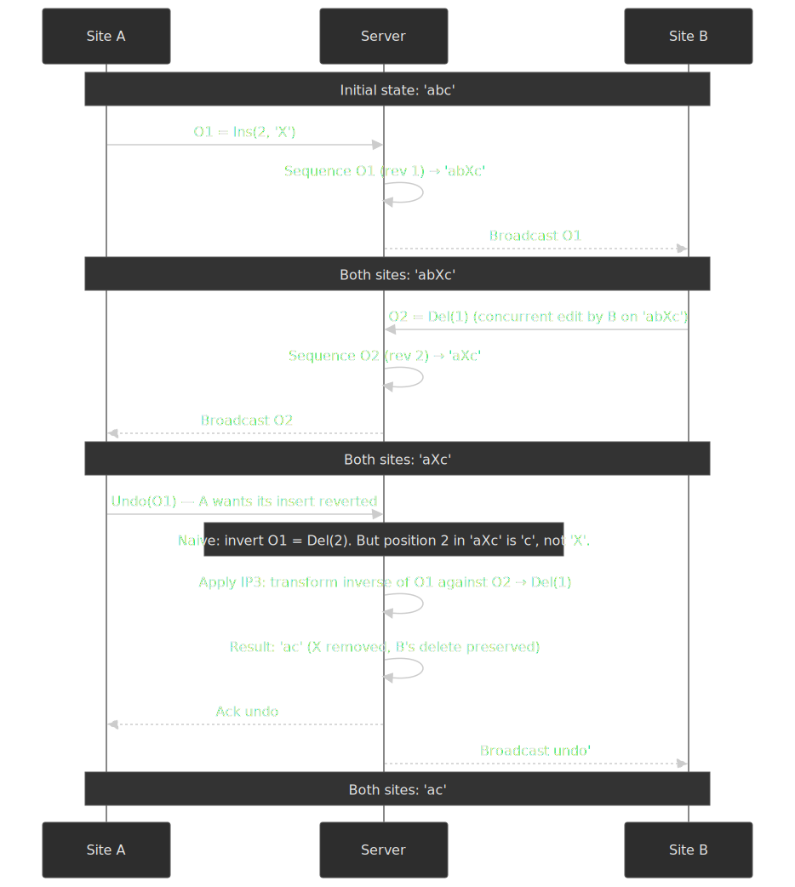

Two distinctions matter in production:

- **Global vs selective undo.** Global undo rolls back the most recent operation in the global history regardless of author — easy semantics, surprising user experience ("why did my edit just disappear?"). Selective undo lets a user undo only their own most recent operation, which requires authorship in the operation log and per-author undo stacks. CKEditor 5 and Office 365 ship selective undo; Google Docs is closer to a global model.
- **Undo of a remote op.** ANYUNDO supports it; many production engines deliberately do not, because the user-experience implications ("you just undid my last edit") are worse than the implementation cost. Shao et al.'s [O(|H|) selective-undo algorithm](https://www.binshao.info/download/undo-group2010.pdf) is the most efficient published variant.

### History pruning

The operation log grows monotonically; without pruning, opening a long-lived document replays millions of ops. Production OT engines truncate aggressively but cannot truncate freely — every client whose `serverRevision` is older than the truncation point will be unable to transform its in-flight ops against the missing history.

The standard pattern is a **snapshot + watermark**:

- Periodically materialise the document state as a snapshot at revision `R`.
- Record `R_min` = `min(serverRevision)` across all currently-connected clients (and recently-disconnected ones within an SLA window).
- Truncate operations older than `R_min`. Clients holding a `serverRevision` below `R_min` are forced to reload the document from the latest snapshot.

Wave, Google Docs, and ShareDB all use a variant of this: see the ShareDB [`ot-snapshot`](https://github.com/share/sharedb/blob/master/docs/projections.md) and the Wave whitepaper's section on wavelet snapshots. Tombstone-based variants (TTF, RGA-style CRDTs) need the same scheme plus a separate tombstone GC pass — itself a hard distributed problem because a client that comes back online after months may reference a tombstone the rest of the system has forgotten.

## Design variants

### Path 1 — Client-server OT (Jupiter / Wave model)

The Jupiter system at Xerox PARC ([Nichols et al., UIST'95](https://dl.acm.org/doi/10.1145/215585.215706)) introduced the centralized variant of OT that nearly every production collaborative editor uses today. The server maintains a single canonical operation history. Clients send local ops to the server, which:

1. Transforms each incoming op against any server-side ops the client has not yet seen.
2. Assigns a sequence number.
3. Broadcasts the transformed op to every other client.

Each client tracks three slices of state:

- **Server revision** — the last sequence number the server has acknowledged for this client.
- **Pending op** — an op that has been sent but not yet acknowledged.
- **Buffer** — local ops that arrived while the pending op was outstanding.

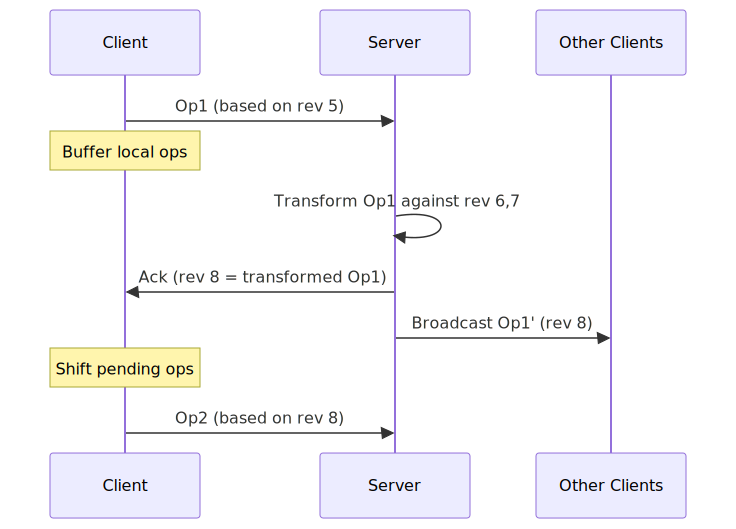
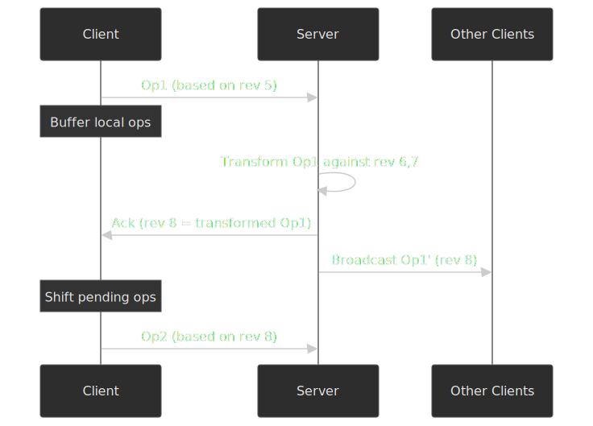

**Why this avoids TP2.** TP2 is required when an op can be transformed along multiple distinct paths. With a central server every op walks exactly one path — the one the server picks. The transformation functions only need to satisfy TP1.

**The ACK rule.** Wave's [OT whitepaper](https://svn.apache.org/repos/asf/incubator/wave/whitepapers/operational-transform/operational-transform.html) requires that the client wait for an acknowledgment before sending its next op (or batch). During the wait, local edits sit in the buffer; on ACK the buffer is composed and sent. This is what makes the math tractable in production.

| Aspect                    | Client-server                  | Peer-to-peer            |
| ------------------------- | ------------------------------ | ----------------------- |
| TP2 requirement           | Not needed                     | Required                |
| Correctness proofs        | Straightforward (TP1 only)     | Notoriously hard        |
| Server dependency         | Single point of failure        | None                    |
| Round-trip latency        | One per op batch               | None (peer-to-peer)     |
| Offline support           | Limited buffer                 | Native                  |
| Implementation effort     | Moderate                       | Very high               |

### Path 2 — Peer-to-peer OT (adOPTed, GOTO, SOCT)

In a P2P deployment, each site keeps its own operation history and transforms incoming ops against it. Without a central sequencer, three or more sites can apply the same set of ops along different paths, so TP2 must hold.

The line of papers that pursued this — adOPTed ([Ressel et al., CSCW'96](https://dl.acm.org/doi/10.1145/240080.240305)), GOTO ([Sun & Ellis, CSCW'98](https://dl.acm.org/doi/10.1145/289444.289469)), SOCT2, SDT, IMOR — kept claiming TP2 satisfaction. Each was eventually broken by counterexample. Oster et al. demonstrated several of these counterexamples using the SPIKE theorem prover ([INRIA RR-5795, 2005](https://inria.hal.science/inria-00071213v1/document)), which guided the design of TTF.

Raph Levien sums it up in his [_Towards a unified theory of Operational Transformation and CRDT_](https://medium.com/@raphlinus/towards-a-unified-theory-of-operational-transformation-and-crdt-70485876f72f):

> For a decade or so, TP2 was something of a philosopher's stone, with several alchemists of OT claiming that they had found a set of transforms satisfying TP2, only for counterexamples to emerge later.

| Algorithm | Year | TP2 claim                | Status                                                                  |
| --------- | ---- | ------------------------ | ----------------------------------------------------------------------- |
| dOPT      | 1989 | Implied                  | Counterexample by Sun et al. (1995). [^sun-counter]                     |
| adOPTed   | 1996 | Asserted                 | Counterexample by Imine et al. (2003).                                  |
| SOCT2     | 1998 | Hand-written proof       | Counterexample via SPIKE theorem prover (Oster et al. 2005).            |
| SDT       | 2002 | Claimed                  | Counterexample via SPIKE.                                               |
| IMOR      | 2003 | Machine-verified (false) | Counterexample after audit; the "proof" relied on incorrect assumptions. |

**Wave's federated experiment.** Google Wave attempted to extend its client-server OT into a federated, multi-server protocol. From Joseph Gentle, ex-Wave engineer:

> We got it working, kinda, but it was complex and buggy. We ended up with a scheme where every wave would arrange a tree of wave servers… But it never really worked.[^gentle-blog]

Wave was shut down in 2012 and the federated protocol remains unproven in production.

### Path 3 — Tombstone Transformation Functions (TTF)

TTF ([Oster et al., CollaborateCom 2006](https://inria.hal.science/inria-00109039v1/document)) sidesteps the TP2 impossibility by extending the operation signature. Instead of representing the document as a string, TTF represents it as a sequence of `(char, visible)` cells. A delete sets `visible = false` but leaves the cell in place as a tombstone:

```ts title="ttf.ts"
interface TombstoneCell {
  char: string
  visible: boolean
  id: UniqueId
}

type Document = TombstoneCell[]

function deleteAt(doc: Document, pos: number): Document {
  let visibleSeen = 0
  for (const cell of doc) {
    if (!cell.visible) continue
    if (visibleSeen === pos) {
      cell.visible = false
      return doc
    }
    visibleSeen++
  }
  return doc
}
```

Because tombstones never shift, two concurrent ops can never disagree on what position another op refers to. Oster et al. used the SPIKE theorem prover to verify that the tombstone IT functions satisfy both TP1 and TP2 in the extended signature.

**Cost.** Tombstones accumulate. A long-lived document needs distributed garbage collection — itself a hard problem — to reclaim space. Production deployments typically snapshot the document periodically and truncate tombstones older than the oldest pending operation reference.

### Path 4 — Context-Based OT (COT)

COT ([Sun & Sun, IEEE TPDS 20(10), 2009](https://dl.acm.org/doi/abs/10.1109/TPDS.2008.240)) takes a different shortcut. Instead of pairwise transformation against a history buffer, every operation carries a **context vector** that records which operations were already applied when this op was generated. Transformation is then a function of context differences, not of order.

The practical consequence: only TP1 is needed at the function level. The context vector handles the path-independence that TP2 was trying to enforce. COT also supports time-independent undo of any operation, which most other OT variants do not.

Cited production users include CoWord, CoMaya, CodoxWord, and IBM OpenCoWeb, but COT has nothing close to the production exposure of the Jupiter line.

### Decision framework


## Production implementations

### Google Docs

Google's 2010 rewrite of the Docs editor introduced character-level OT with three operation kinds (insert text, delete text, apply style to a range) and an event-sourced revision log. The visible document is the result of replaying the log from the initial state, which gives Docs:

- Free revision history ("see previous versions").
- Append-only persistence with no in-place mutation.
- Recovery from any point in time.

Google reported the editor handled up to 50 simultaneous editors per document at launch ([Google Drive Blog: _Conflict resolution_](https://drive.googleblog.com/2010/09/whats-different-about-new-google-docs_22.html), [_Making collaboration fast_](https://drive.googleblog.com/2010/09/whats-different-about-new-google-docs.html)).

The hardest parts, per Joseph Gentle (ex-Wave / ShareJS author):

- Rich text needs tree-structured operations, not just position-indexed strings.
- Cursor and selection state has to be transformed alongside content.
- Presence indicators (who is editing where) form a parallel sync channel.

Gentle's verdict on the centralized model:

> You're right about OT — it gets crazy complicated if you implement it in a distributed fashion. But implementing it in a centralized fashion is actually not so bad. Its the perfect choice for google docs.[^gentle-hn]

### Apache Wave

The open-sourced Google Wave codebase remains the most detailed public reference for production-grade OT. The [Apache Wave OT whitepaper](https://svn.apache.org/repos/asf/incubator/wave/whitepapers/operational-transform/operational-transform.html) documents:

- An XML-based document model. Every character, start tag, and end tag is an *item*; gaps between items are *positions*.
- A small operation vocabulary: `Retain(n)`, `InsertCharacters(s)`, `DeleteCharacters(n)`, `InsertElement`, `DeleteElement`, attribute mutations.
- Composition: $(B \circ A)(d) = B(A(d))$ — operations compose into batches.
- The strict ACK rule between client and server.

Wave's federation attempt — letting independent Wave servers cooperate without a single central sequencer — is the cautionary tale every collaborative-system designer should know.

### Microsoft Word / Office 365

Microsoft's real-time co-authoring engine in Word, Excel, and PowerPoint also rests on OT. The lineage is documented: the CoWord research project at Nanyang Technological University extended the GOTO/GCE OT engine to the full Word object model and was published as *Operational transformation for collaborative word processing* (Sun et al., CSCW 2004)[^cscw2004-coword]. The CoWord work was later commercialised as CodoxWord by Codox, and Microsoft's own server-mediated co-authoring (rolled out in Word 2013 / Office 365 in 2015[^office365-coauthor]) follows the same Jupiter-style architecture: the document is hosted in OneDrive / SharePoint, the server linearises operations, and clients transform incoming ops against any unseen server revisions.

Microsoft has not published the engine in detail, but the public Microsoft Research presentation [_Recent Progress in Group Editors and Operational Transformation Algorithms_](https://www.microsoft.com/en-us/research/video/recent-progress-in-group-editors-and-operational-transformation-algorithms/) and the CoWord papers are the primary sources for the design family.

### CKEditor 5

CKEditor's collaboration team published a [retrospective](https://ckeditor.com/blog/lessons-learned-from-creating-a-rich-text-editor-with-real-time-collaboration/) on building OT for a tree-structured rich-text model. Their experience report makes three points worth keeping in mind:

- When they started in 2015, only one academic paper on OT for trees existed, and they could find no evidence anyone was actively building production OT for trees.
- Tree models force *operation breaking*: a single transform can split one operation into multiple (for example, removing a range that crosses a paragraph boundary). The op set has to be designed around this from the start.
- They support **selective undo** — a user can undo their own changes without rolling back collaborators' edits — which requires explicit tracking of authorship in the operation history.

| Aspect         | Google Docs             | Apache Wave                  | Microsoft Word / Office 365  | CKEditor 5                 |
| -------------- | ----------------------- | ---------------------------- | ---------------------------- | -------------------------- |
| Architecture   | Client-server           | Client-server (+ federation) | Client-server                | Client-server              |
| Document model | Linearised ops          | XML wavelets                 | Word object model (CoWord)   | Tree-structured            |
| Offline        | Limited buffer          | Limited buffer               | Limited buffer               | Sync queue                 |
| Rich text      | Yes (range ops)         | Yes (elements + annotations) | Yes (full Word features)     | Yes (native tree ops)      |
| Undo           | Global history          | Global history               | Per-author (selective)       | Selective (per author)     |
| Production     | At massive scale        | Discontinued                 | At massive scale             | Production, commercial     |

## OT vs CRDTs

In 2026, every greenfield collaborative-editing project should start by asking whether OT or a CRDT is the better fit. The two paradigms attack the same problem from opposite directions.

| Dimension          | Operational Transformation (centralised)        | CRDTs (e.g. Yjs, Automerge)                     |
| ------------------ | ----------------------------------------------- | ----------------------------------------------- |
| Convergence proof  | TP1 + central sequencer                         | Algebraic — commutative, associative, idempotent |
| Topology           | Star (clients ↔ server)                         | Arbitrary (P2P, mesh, server, hybrid)           |
| Offline editing    | Limited buffer; long offline windows are hard   | Native — merge any time, any order              |
| Server requirement | Mandatory                                       | Optional                                        |
| Memory             | Operation log + snapshots                       | Tombstones + metadata per character (typically) |
| Rich text          | Mature (Google Docs, CKEditor)                  | Mature (Yjs `Y.XmlFragment`, Automerge `RichText`) |
| Undo               | Global or per-author with explicit tracking     | Native per-actor in most CRDTs                  |
| Network bandwidth  | Small (op delta)                                | Larger metadata, but sync protocols compress well |
| Best for           | Single-server SaaS with low-latency clients     | Local-first, offline-first, or fully distributed apps |

 and offline-window length. Server + short window is OT's home turf; P2P + long window is CRDT territory.")

Joseph Gentle's [_I was wrong. CRDTs are the future_](https://josephg.com/blog/crdts-are-the-future/) is the canonical "OT author switches sides" essay; Martin Kleppmann's [_CRDTs: The Hard Parts_](https://martin.kleppmann.com/2020/07/06/crdt-hard-parts-hydra.html) is the canonical "CRDTs are not free either" counterweight.

### Kleppmann's OT critique vs production wins

Kleppmann's argument against OT — articulated in the [_Local-First Software_](https://www.inkandswitch.com/essay/local-first/) essay and the 2022 CACM article [_Making CRDTs byzantine fault tolerant_](https://martin.kleppmann.com/papers/convergence-cacm.pdf) — is not that OT is wrong, but that it has architectural costs that disqualify it for a class of products:

- **Central server is mandatory in practice.** TP1-only OT works because the server linearises operations. There is no known production-quality OT that does without a sequencer.
- **Implementations are notoriously bug-prone.** Decades of published P2P OT algorithms have been refuted; even server-mediated implementations have to ship rich-text and tree extensions that academia has barely covered.
- **Every edit pays a round-trip.** Even with optimistic local application, the user's edits sit in a buffer until ACK. Long offline windows are not a first-class case.

The counter-argument from the production side is equally strong:

- Google Docs (50+ concurrent editors, billions of users), Office 365 (the entire Office tenant base), and CKEditor 5 (commercial deployments) demonstrate that the central-server constraint is not a constraint for SaaS. The user is on the network anyway to authenticate.
- Server-mediated OT ships **today**, with a smaller in-document metadata footprint than tombstone-heavy CRDTs and with a debug story that is just an event-sourced log.
- Rich-text CRDTs (Yjs `Y.XmlFragment`, Automerge `RichText`) only became production-ready in the late 2010s — over a decade after the equivalent OT engines.

Both authors are right. The decision is not "which is better" but "which constraint matters more in this product".

Practical heuristic: if the product can mandate connectivity and acceptable round-trip latency, OT through a battle-tested library (ShareDB, ot.js, CKEditor 5) is still the lowest-risk choice. If the product is local-first, multi-device, or has long offline windows, a CRDT (Yjs, Automerge, RGA) is almost always the right starting point.

## Implementation guide

### Building from scratch is rarely the right call


### Library options (2026)

| Library          | Language        | Architecture       | Best for                      |
| ---------------- | --------------- | ------------------ | ----------------------------- |
| ShareDB          | Node.js         | OT, client-server  | JSON / structured data        |
| ot.js            | JavaScript      | OT, client-server  | Plain text                    |
| CKEditor 5       | JavaScript      | OT, client-server  | Commercial rich text          |
| Yjs              | JavaScript / WASM | CRDT             | Local-first, offline-first    |
| Automerge        | Rust + JS       | CRDT               | JSON documents, P2P           |
| Y.Quill, Tiptap  | JavaScript      | CRDT (via Yjs)     | Rich text + offline           |

### Custom-build checklist

Reach for this only when no library fits and you are willing to absorb multi-quarter R&D risk.

- [ ] Pick architecture: **client-server** unless you have a hard reason not to.
- [ ] Define a minimal op set — every additional op multiplies transformation pairs.
- [ ] Implement TP1-satisfying transformation functions; document the tie-break rule.
- [ ] Add server sequencing so TP2 is structurally unnecessary.
- [ ] Build the client state machine (server-revision, pending, buffer) and exercise the ACK path.
- [ ] Add state checksums and a divergence-recovery snapshot path.
- [ ] Property-based test every transformation pair against TP1 with `fast-check` or equivalent.
- [ ] Fuzz test with artificial latency, packet reordering, and duplicate delivery.

Joseph Gentle's estimate from the same blog post: "Wave took 2 years to write and if we rewrote it today, it would take almost as long."[^gentle-blog]

## Common pitfalls

### 1. Reaching for peer-to-peer OT

The mistake: implementing distributed OT because it "feels cleaner" than depending on a server.

Why it fails: every classical-signature P2P OT algorithm published in three decades has been refuted, and Randolph et al. (2013) proved formally that no such algorithm can satisfy both TP1 and TP2. Extended-signature variants (TTF, COT) work but have nothing like the production exposure of CRDTs.

The right call in 2026: if you need offline-first or P2P, use a CRDT, not a hand-rolled distributed OT.

### 2. Treating operations as independent events

The mistake: client sends `Op1`, then `Op2` before `Op1` has been acknowledged, and the server processes them as two independent events.

Why it matters: `Op2` was authored against the post-`Op1` state. If `Op1` gets transformed on the server, `Op2`'s positions become stale.

The fix: enforce the ACK rule. While a pending op is unacknowledged, buffer subsequent local ops, transform them against the pending op, and send only after ACK.

```ts title="client-state.ts"
interface ClientState {
  serverRevision: number
  pending: Operation | null
  buffer: Operation[]
}

function onLocalEdit(state: ClientState, op: Operation): ClientState {
  if (state.pending) {
    const transformed = transform(op, state.pending)
    return { ...state, buffer: [...state.buffer, transformed] }
  }
  send(op)
  return { ...state, pending: op }
}
```

### 3. Unbounded operation history

The mistake: storing every keystroke forever to support a "history" feature.

Why it fails: a heavily edited document accumulates millions of operations. Loading the doc replays all of them.

The fix: **periodic snapshots**. Materialise the document state at intervals, prune the log up to the snapshot, and keep only recent ops in memory. Google Docs, CKEditor, and ShareDB all do this.

### 4. Testing only the happy path

The mistake: two clients, low latency, no packet loss.

Why it fails: every interesting OT bug needs three or more concurrent operations and out-of-order delivery. Manual testing will not surface them.

The fix: **property-based and fuzz testing** of the transformation functions against TP1.

```ts title="tp1.test.ts"
test("TP1: transformation paths converge", () => {
  fc.assert(
    fc.property(
      arbitraryDocument(),
      arbitraryOperation(),
      arbitraryOperation(),
      (doc, op1, op2) => {
        const path1 = apply(apply(doc, op1), transform(op2, op1))
        const path2 = apply(apply(doc, op2), transform(op1, op2))
        expect(path1).toEqual(path2)
      },
    ),
  )
})
```

### 5. Asymmetric transforms without consistent tie-breaking

The mistake: assuming `T(a, b)` and `T(b, a)` use the same logic.

Why it fails: when both ops insert at the same position, exactly one must shift; the choice has to be deterministic across all clients. Without a consistent tie-break (site ID, op ID, server-assigned seq), different clients pick differently and diverge.

The fix: pick a single rule — site ID lexicographic order is the most common — and implement it identically on every client.

## Conclusion

OT looks deceptively simple. The deceptive part is TP2: a property that classical insert/delete signatures cannot satisfy and that took the field two decades to formalise as impossible. Production systems handle this by refusing to play TP2 — they centralise the operation order on a server so that TP1 is the only correctness obligation.

For new collaborative work in 2026:

- If you need a server anyway and your clients are mostly online, an OT library (ShareDB, ot.js, CKEditor 5) is still the pragmatic choice.
- If your product is local-first, multi-device, or has long offline windows, start with a CRDT (Yjs, Automerge).
- If you genuinely need P2P OT, expect a multi-year build and budget for invariant testing on the order of the implementation itself.

The dominance of Jupiter-style OT is not because the algorithm is elegant — it is because shipping client-server is an order of magnitude easier than shipping distributed correctness, and the user-visible product is the same.

## Appendix

### Prerequisites

- Distributed-systems consistency models (eventual consistency, linearisability).
- Event sourcing as a persistence pattern.
- Lamport timestamps and causal ordering / happened-before.
- For the CRDT comparison, Martin Kleppmann's [_CRDTs: The Hard Parts_](https://martin.kleppmann.com/2020/07/06/crdt-hard-parts-hydra.html).

### Terminology

- **OT** — algorithm family that transforms concurrent operations to achieve convergence.
- **TP1 / TP2** — Transformation Property 1 (path-pair convergence) and Property 2 (path-independence for triples).
- **Convergence** — all replicas reach identical state after applying the same set of operations.
- **Intention preservation** — a transformed operation still expresses the user's original intent.
- **Tombstone** — placeholder retained for a deleted character so that positions remain stable.
- **TTF** — Tombstone Transformation Functions; provably correct OT using extended signatures.
- **COT** — Context-Based Operational Transformation; uses context vectors instead of history buffers.
- **CRDT** — Conflict-free Replicated Data Type; the algebraic alternative to OT.

### Summary

- OT transforms concurrent operations by adjusting their parameters against what other operations have already done.
- **TP1 is mandatory.** Every transformation function must satisfy it.
- **TP2 is impossible** with classical insert/delete signatures (Randolph et al. 2013); production systems avoid it by funnelling operations through a central server.
- Google Docs, Apache Wave, **Microsoft Word / Office 365**, CKEditor 5, ShareDB, and ot.js are all client-server systems for exactly this reason.
- **Undo with concurrent ops** needs the inverse properties IP1–IP3 (Sun's ANYUNDO); naive "invert and apply" produces wrong positions.
- **History pruning** uses snapshot + watermark on `min(serverRevision)` across active clients; tombstone variants need a separate GC pass.
- Property-based and fuzz testing against TP1 (and IP1–IP3 if undo is supported) are mandatory — manual testing misses the bugs that matter.
- Kleppmann's central-server critique is correct in principle but Office 365 / Google Docs scale shows the constraint is acceptable for SaaS; for local-first or offline-first products, CRDTs are usually a better default than OT.

### References

- Ellis, C.A. & Gibbs, S.J. (1989). [_Concurrency Control in Groupware Systems_](https://dl.acm.org/doi/10.1145/67544.66963). ACM SIGMOD'89. Original dOPT (note: the canonical "GROVE" multi-user editor lineage cited in many OT histories begins here).
- Sun, C. et al. (1995). [_A Counterexample to the Distributed Operational Transformation_](https://cs.uwaterloo.ca/research/tr/1995/08/dopt.pdf). UWaterloo TR. First refutation of dOPT.
- Nichols, D.A. et al. (1995). [_High-latency, low-bandwidth windowing in the Jupiter collaboration system_](https://dl.acm.org/doi/10.1145/215585.215706). ACM UIST'95. Foundation for client-server OT.
- Ressel, M. et al. (1996). [_An Integrating, Transformation-Oriented Approach to Concurrency Control and Undo in Group Editors_](https://dl.acm.org/doi/10.1145/240080.240305). ACM CSCW'96. Defined TP1/TP2 (then C1/C2).
- Sun, C. & Ellis, C. (1998). [_Operational transformation in real-time group editors: issues, algorithms, and achievements_](https://dl.acm.org/doi/10.1145/289444.289469). ACM CSCW'98. GOT/GOTO; named the dOPT puzzle.
- Sun, C. (2002). [_Undo as concurrent inverse in group editors_](https://dl.acm.org/doi/10.1145/581603.581604). ACM TOCHI 9(4). The ANYUNDO algorithm and the IP1/IP2/IP3 inverse properties.
- Sun, D., Xia, S., Sun, C. & Chen, D. (2004). [_Operational transformation for collaborative word processing_](https://dl.acm.org/doi/10.1145/1031607.1031681). ACM CSCW'04. CoWord — the OT lineage adopted by Microsoft Word.
- Oster, G. et al. (2005). [_Proving correctness of transformation functions in collaborative editing systems_](https://inria.hal.science/inria-00071213v1/document). INRIA RR-5795. SPIKE counterexamples to SOCT2, SDT, IMOR.
- Oster, G. et al. (2006). [_Tombstone Transformation Functions for Ensuring Consistency in Collaborative Editing Systems_](https://inria.hal.science/inria-00109039v1/document). CollaborateCom 2006. TTF.
- Sun, D. & Sun, C. (2009). [_Context-Based Operational Transformation in Distributed Collaborative Editing Systems_](https://dl.acm.org/doi/abs/10.1109/TPDS.2008.240). IEEE TPDS 20(10):1454-1470. COT.
- Shao, B., Li, D. & Gu, N. (2010). [_An algorithm for selective undo of any operation in collaborative applications_](https://www.binshao.info/download/undo-group2010.pdf). ACM Group'10. O(|H|) selective undo.
- Spiewak, D. (2010). _Understanding and Applying Operational Transformation_ — [Part 1](http://www.codecommit.com/blog/java/understanding-and-applying-operational-transformation/), Part 2, Part 3 on codecommit.com. The pragmatic Java-flavoured walkthrough most early OT implementers learned from.
- Randolph, A. et al. (2013). [_On Consistency of Operational Transformation Approach_](https://arxiv.org/abs/1302.3292). EPTCS 107 (Infinity'12). Formal impossibility of TP1+TP2 for classical signatures.
- Levien, R. (2016). [_Towards a unified theory of Operational Transformation and CRDT_](https://medium.com/@raphlinus/towards-a-unified-theory-of-operational-transformation-and-crdt-70485876f72f). Synthesis essay.
- Gentle, J. (2017). [_I was wrong. CRDTs are the future_](https://josephg.com/blog/crdts-are-the-future/). Ex-Wave / ShareJS author's retrospective.
- Kleppmann, M. et al. (2019). [_Local-first software_](https://www.inkandswitch.com/essay/local-first/). Ink & Switch. The OT-vs-CRDT framing through the lens of user data ownership.
- Kleppmann, M. (2020). [_CRDTs: The Hard Parts_](https://martin.kleppmann.com/2020/07/06/crdt-hard-parts-hydra.html). The CRDT counterweight.
- Kleppmann, M. (2022). [_Making CRDTs byzantine fault tolerant_](https://martin.kleppmann.com/papers/convergence-cacm.pdf). CACM. Survey of OT/CRDT trade-offs.
- Microsoft Research. [_Recent Progress in Group Editors and Operational Transformation Algorithms_](https://www.microsoft.com/en-us/research/video/recent-progress-in-group-editors-and-operational-transformation-algorithms/). Background on OT inside Microsoft.
- [Apache Wave OT Whitepaper](https://svn.apache.org/repos/asf/incubator/wave/whitepapers/operational-transform/operational-transform.html).
- [Google Drive Blog (2010): _Making collaboration fast_](https://drive.googleblog.com/2010/09/whats-different-about-new-google-docs.html) and [_Conflict resolution_](https://drive.googleblog.com/2010/09/whats-different-about-new-google-docs_22.html).
- [Microsoft 365 Blog (2015): _Word real-time co-authoring — a closer look_](https://www.microsoft.com/en-us/microsoft-365/blog/2015/10/30/word-real-time-co-authoring-a-closer-look/).
- [CKEditor: _How collaborative editing drove CKEditor 5's architecture_](https://ckeditor.com/blog/lessons-learned-from-creating-a-rich-text-editor-with-real-time-collaboration/).
- [ShareDB on GitHub](https://github.com/share/sharedb), [Yjs on GitHub](https://github.com/yjs/yjs), [ot.js documentation](https://ot.js.org/).

[^dopt]: Ellis & Gibbs (1989) introduced dOPT but did not specify a deterministic tie-break for concurrent inserts at the same position. Sun et al. (UWaterloo TR, 1995) gave the first published counterexample; the scenario became known as the *dOPT puzzle* in Sun & Ellis's CSCW'98 paper.

[^randolph]: Randolph et al. proved the impossibility for *classical signatures* — operations parameterised only by position and inserted character. Algorithms with extended signatures (tombstone IDs in TTF, context vectors in COT) are not refuted by this result; they pay for correctness with extra metadata per operation.

[^sun-counter]: The Sun et al. UWaterloo technical report ([cs.uwaterloo.ca/research/tr/1995/08/dopt.pdf](https://cs.uwaterloo.ca/research/tr/1995/08/dopt.pdf)) presents the first formal counterexample; the puzzle gets a name in Sun & Ellis (CSCW'98).

[^gentle-hn]: Joseph Gentle, [Hacker News comment on Collaborative Editing in ProseMirror, 2015-08-04](https://news.ycombinator.com/item?id=10003918).

[^gentle-blog]: Joseph Gentle, [_I was wrong. CRDTs are the future_](https://josephg.com/blog/crdts-are-the-future/), 2017.

[^cscw2004-coword]: Sun, D., Xia, S., Sun, C. & Chen, D. *Operational transformation for collaborative word processing*. ACM CSCW 2004. The CoWord paper that lifted GOT/GCE-style OT into Microsoft Word's object model; the public lineage Microsoft's Office co-authoring follows.

[^office365-coauthor]: Microsoft 365 Blog, [_Word real-time co-authoring — a closer look_](https://www.microsoft.com/en-us/microsoft-365/blog/2015/10/30/word-real-time-co-authoring-a-closer-look/), 30 October 2015.
