# OWASP Top 10: Web Application Security Risks

The [OWASP Top 10](https://owasp.org/Top10/) is a ranked list of the most critical web application security risks, derived from real-world vulnerability data. The [2025 edition](https://owasp.org/Top10/2025/0x00_2025-Introduction/) — the eighth installment of the project — drew on data contributed for over **2.8 million applications**, analyzed **589 distinct CWEs** in the source dataset, and finalized **248 CWEs distributed across the 10 published categories**, with a hard cap of 40 CWEs per category. The result is the de-facto industry baseline for application security priorities.[^owasp-intro]




## Abstract

OWASP Top 10:2025 is "data-informed, but not blindly data-driven": eight categories were ranked from contributed application-test data, the remaining two (Software Supply Chain Failures and Security Logging & Alerting Failures) were promoted by a community survey because the available data systematically under-represents them.[^owasp-intro] The 2025 cut introduced two new categories (**A03 Software Supply Chain Failures**, **A10 Mishandling of Exceptional Conditions**), consolidated SSRF into Broken Access Control, and elevated Security Misconfiguration to **#2** because 100% of tested applications had at least one misconfiguration CWE present.[^a02]

**Core mental model:**

| Categories                                       | Root cause                          | Primary control                              |
| ------------------------------------------------ | ----------------------------------- | -------------------------------------------- |
| A01 Access Control / A02 Misconfiguration         | Missing enforcement / hardening    | Deny by default, secure defaults, IaC review |
| A03 Supply Chain / A04 Cryptographic              | Untrusted artifacts, weak primitives | SBOM, signed artifacts, modern algorithms    |
| A05 Injection / A06 Insecure Design               | Untrusted input, missing controls    | Parameterized APIs, threat modeling          |
| A07 Authentication / A08 Integrity                | Identity & integrity assumptions    | MFA, signed updates, rollback on failure     |
| A09 Logging & Alerting / A10 Exceptional Cond.   | Insufficient visibility, fail-open  | Centralized alerting, fail-closed, rollback  |

> **Why the rankings shift.** OWASP scopes a category by grouping CWEs into a root-cause bucket, then ranks by an exploitability + impact score weighted by incidence rate. Position changes between editions reflect both real industry shifts and OWASP's deliberate move from symptom-led categories ("Sensitive Data Exposure") to root-cause categories ("Cryptographic Failures") begun in 2021.[^owasp-intro]

## What changed since 2021




| 2021 → 2025 change           | What it means                                                                                                                                                     |
| ---------------------------- | ----------------------------------------------------------------------------------------------------------------------------------------------------------------- |
| SSRF (A10:2021) → A01:2025   | SSRF is fundamentally an authorization bypass against internal targets, so it now lives inside Broken Access Control.[^a01]                                       |
| Misconfiguration: #5 → #2    | More behavior is configuration-defined; cloud and IaC drift makes misconfiguration more prevalent than weak crypto.[^a02]                                         |
| Vulnerable Components → Supply Chain Failures | Scope expands from "outdated dependency" to the full chain: developer machines, IDE extensions, registries, build systems.[^a03]                             |
| New: A10 Mishandling Exceptional Conditions | Replaces a vague "code quality" bucket with concrete failure modes: fail-open, uncaught exception, partial transaction.[^a10]                                |
| A07 renamed                   | Drops "Identification" — the category targets authentication-specific weaknesses, not the broader identification surface.[^a07]                                   |
| A08 renamed (`and` → `or`)    | Clarifying name change only: "Software **or** Data Integrity Failures".[^a08]                                                                                    |
| A09 renamed                   | "Monitoring" → "Alerting" because logging that nobody alerts on is forensically interesting but operationally useless.[^a09]                                      |

## A01: Broken Access Control

Broken Access Control retains the #1 slot. Across the contributed data, **100% of applications tested had at least one access-control CWE present**. The category covers 40 CWEs, 1,839,701 occurrences, and 32,654 CVEs — by far the largest CVE population of any category.[^a01] **Server-Side Request Forgery (SSRF, CWE-918)** was folded in because forging requests to internal resources is, mechanically, an authorization bypass.

### Vulnerability patterns

| Pattern                                 | Example                                   | CWE     |
| --------------------------------------- | ----------------------------------------- | ------- |
| Privilege escalation                    | Regular user reaches admin endpoints      | CWE-269 |
| IDOR (Insecure Direct Object Reference) | `/api/users/123` → `/api/users/456`       | CWE-639 |
| Missing function-level controls         | `POST` / `PUT` / `DELETE` lack authz      | CWE-285 |
| CORS misconfiguration                   | Wildcard origin with credentials          | CWE-942 |
| SSRF (now consolidated here)            | `http://169.254.169.254/` metadata access | CWE-918 |
| Path traversal                          | `../../../etc/passwd`                     | CWE-22  |

### Prevention

```ts title="access-control.ts" collapse={1-4, 18-25}
import { Request, Response, NextFunction } from "express"
import { verify } from "jsonwebtoken"
import { hasPermission } from "./rbac"

export function authorize(resource: string, action: string) {
  return async (req: Request, res: Response, next: NextFunction) => {
    const token = req.headers.authorization?.split(" ")[1]
    if (!token) return res.status(401).json({ error: "No token" })

    const payload = verify(token, process.env.JWT_SECRET!)
    const allowed = await hasPermission(payload.sub, resource, action)

    if (!allowed) return res.status(403).json({ error: "Forbidden" })
    next()
  }
}

app.get("/api/users/:id", authorize("users", "read"), getUser)
app.put("/api/users/:id", authorize("users", "update"), updateUser)
app.delete("/api/users/:id", authorize("users", "delete"), deleteUser)
```

The non-negotiable controls per OWASP A01 guidance:[^a01]

1. **Deny by default** — explicit grants for every resource.
2. **Server-side enforcement** — never trust client-side state.
3. **Record-ownership validation** — verify the requesting principal owns the row, not just that they can call the endpoint.
4. **Centralized access control** — one module, one place to audit.
5. **Short-lived JWTs / revoke-on-logout sessions** — invalidate stateful sessions server-side; keep stateless tokens short with refresh-token rotation.
6. **Rate limit** controller and API access to slow automated tooling.

### SSRF-specific prevention

```ts title="ssrf-prevention.ts" collapse={1-5, 20-25}
import { URL } from "url"
import dns from "dns/promises"
import ipaddr from "ipaddr.js"

const ALLOWED_HOSTS = new Set(["api.example.com", "cdn.example.com"])

async function fetchSafely(userUrl: string): Promise<Response> {
  const url = new URL(userUrl)

  if (url.protocol !== "https:") throw new Error("Only HTTPS allowed")
  if (!ALLOWED_HOSTS.has(url.hostname)) throw new Error("Host not on allowlist")

  // DNS rebinding protection: resolve once, validate every address, then fetch.
  const addresses = await dns.resolve4(url.hostname)
  for (const addr of addresses) {
    const parsed = ipaddr.parse(addr)
    if (parsed.range() !== "unicast") throw new Error("Private IP not allowed")
  }

  return fetch(url.toString(), { redirect: "error" })
}
```

> [!CAUTION]
> Cloud metadata services are the canonical SSRF target. On AWS, enforce **IMDSv2** so a single SSRF GET cannot mint credentials; on GCP and Azure, block the metadata IPs at the egress layer for any tier that accepts user-controlled URLs.

## A02: Security Misconfiguration

Security Misconfiguration jumped from #5 to #2. **100% of tested applications had at least one misconfiguration CWE**, with a max incidence rate of 27.70%, average 3.00%, ~719k occurrences, and 16 mapped CWEs.[^a02] **XML External Entities (XXE, CWE-611)** stays consolidated here — it is fundamentally a parser misconfiguration, not a separate vulnerability class.

### Common misconfigurations

| Layer     | Misconfiguration                       | Impact                |
| --------- | -------------------------------------- | --------------------- |
| Cloud     | S3 / blob bucket public by default     | Data breach           |
| Container | Container running as root              | Container escape      |
| Framework | Debug mode in production               | Stack traces leak     |
| Server    | Directory listing enabled              | Source exposure       |
| Headers   | Missing security headers               | XSS, clickjacking     |
| Defaults  | Unchanged admin credentials            | Full compromise       |
| Parser    | DTD / external entity processing on    | File disclosure, SSRF |

### Security headers

```http
Strict-Transport-Security: max-age=31536000; includeSubDomains; preload
X-Content-Type-Options: nosniff
X-Frame-Options: DENY
Referrer-Policy: strict-origin-when-cross-origin
Permissions-Policy: geolocation=(), microphone=(), camera=()
Content-Security-Policy: default-src 'self'; script-src 'self' 'nonce-{random}';
```

### Configuration hardening

```ts title="xml-parser.ts" collapse={1-2}
import { XMLParser } from "fast-xml-parser"

// fast-xml-parser is a pure-JS parser and does NOT resolve external DTD entities,
// so the classic file-disclosure XXE is not reachable here. The flags below stay
// conservative anyway and document intent. For DOM/SAX parsers backed by
// libxml2/Xerces, you MUST also disable DOCTYPE / external entity loading
// explicitly — that is where most real-world XXE bugs live.
const parser = new XMLParser({
  ignoreAttributes: false,
  processEntities: false,
  htmlEntities: false,
})
```

The OWASP A02 hardening workflow:[^a02]

1. **Repeatable hardening** — automated, identical environments differing only in secrets.
2. **Minimal install** — drop sample apps, docs, unused features and frameworks.
3. **Automated config verification** — config checks in CI, drift detection in production.
4. **Short-lived credentials** — identity federation (OIDC, SPIFFE) over hardcoded secrets in code or pipelines.
5. **Cloud IAM and firewall audits** — at least annually if not continuous.

## A03: Software Supply Chain Failures

New in 2025, A03 is the renamed and expanded successor to A06:2021 *Vulnerable and Outdated Components*. It absorbed every supply-chain failure mode, not just outdated dependencies. **The community survey ranked it #1 — exactly 50% of respondents put it first** — because the contributed data underrepresents an obviously growing risk class. The category page lists 6 mapped CWEs but surfaces only 11 CVEs in the dataset, while still recording the highest average incidence rate of any 2025 category at 5.72%.[^a03]




### Why it was added

Three incidents shaped the new category:

- **SolarWinds (2019)** — a build-system compromise in the Orion product cascaded into roughly **18,000 organizations** via signed but malicious updates.[^a03]
- **Log4Shell (CVE-2021-44228)** — a single Apache Log4j JNDI lookup CVE put an enormous fraction of Java services at risk overnight, and remained the textbook supply-chain CVE for years.[^a03]
- **Shai-Hulud (2025)** — the first successful self-propagating npm worm. Compromised packages ran a post-install script that exfiltrated tokens to public GitHub repositories and then used any harvested npm tokens to publish malicious versions of additional packages, reaching **500+ package versions** before npm disrupted it.[^a03]

### Supply chain risk vectors

| Risk                    | Example                                      | Control                                  |
| ----------------------- | -------------------------------------------- | ---------------------------------------- |
| Known vulnerabilities   | Log4Shell (CVE-2021-44228)                   | SCA scanning + SBOM diffing              |
| Typosquatting           | `lodahs` instead of `lodash`                 | Private proxy with explicit allowlist    |
| Maintainer compromise   | `event-stream` (2018), `ua-parser-js` (2021) | Audit upstream version diffs, lock files |
| Build system compromise | SolarWinds Orion                             | Signed builds, SLSA provenance           |
| Self-propagating worms  | Shai-Hulud (npm, 2025)                       | Scoped CI tokens, no long-lived publish  |

### Dependency management

```json title="package.json" collapse={1-5, 15-20}
{
  "name": "secure-app",
  "version": "1.0.0",
  "scripts": {
    "audit": "npm audit --production",
    "audit:fix": "npm audit fix",
    "sbom": "npx @cyclonedx/cyclonedx-npm --output-file sbom.json"
  },
  "dependencies": {
    "express": "4.18.2"
  },
  "overrides": {
    "lodash": "4.17.21"
  }
}
```

Supply-chain hygiene per the OWASP A03 prevention list:[^a03]

1. **SBOM** — generate with [CycloneDX](https://cyclonedx.org/) or [SPDX](https://spdx.dev/) and diff it on every release.
2. **Continuous scanning** — OWASP Dependency-Check / Dependency-Track, npm audit, Snyk, GitHub Dependabot, all in CI.
3. **Lockfile discipline** — pin versions; review transitive bumps deliberately rather than letting `^` ranges float in production.
4. **Private proxy registry** — proxy public packages, scan before allowing, and block direct internet pulls from build runners.
5. **Subresource Integrity (SRI)** for any third-party browser asset:

```html
<script
  src="https://cdn.example.com/lib.js"
  integrity="sha384-oqVuAfXRKap7fdgcCY5uykM6+R9GqQ8K/uxy9rx7HNQlGYl1kPzQho1wx4JwY8wC"
  crossorigin="anonymous"
></script>
```

If the CDN script changes, the browser refuses execution. Treat SRI hashes as another lockfile.

6. **Staged rollouts** for both your code and dependency upgrades — never ship a fleet-wide major bump on day zero of release.

## A04: Cryptographic Failures

Cryptographic Failures fell from #2 to #4. The category covers 32 mapped CWEs, ~1.66M occurrences, and 2,185 CVEs. It targets root causes (broken algorithms, weak keys, predictable PRNGs, missing authenticated encryption) rather than the symptom of data exposure.[^a04]

### Vulnerability patterns

| Pattern                          | Weakness                       | Impact                |
| -------------------------------- | ------------------------------ | --------------------- |
| Cleartext transmission           | No TLS, HTTP fallback          | MITM credential theft |
| Weak algorithms                  | MD5 / SHA-1 for passwords, DES | Offline cracking      |
| Insufficient entropy             | Predictable tokens, weak PRNG  | Session hijacking     |
| Hardcoded secrets                | API keys committed to source   | Credential compromise |
| Missing authenticated encryption | AES-CBC without HMAC           | Padding oracle        |

### Password storage

```ts title="password.ts" collapse={1-3}
import { hash, verify } from "argon2"

// Argon2id parameters above OWASP minimum (m=19 MiB, t=2, p=1).
// Tune so your hardware lands at ~250-500ms per hash.
const PASSWORD_OPTIONS = {
  type: 2, // argon2id (hybrid: side-channel + time-memory tradeoff resistant)
  memoryCost: 65536, // 64 MiB
  timeCost: 3,
  parallelism: 4,
}

export async function hashPassword(password: string): Promise<string> {
  return hash(password, PASSWORD_OPTIONS)
}

export async function verifyPassword(password: string, stored: string): Promise<boolean> {
  return verify(stored, password)
}
```

**Why Argon2id.** It is the [OWASP Password Storage Cheat Sheet](https://cheatsheetseries.owasp.org/cheatsheets/Password_Storage_Cheat_Sheet.html) primary recommendation for new systems. Memory-hardness defeats GPU/ASIC cracking; the `id` variant combines Argon2i's side-channel resistance with Argon2d's time-memory-tradeoff resistance. OWASP's *minimum* parameters are `m=19 MiB, t=2, p=1`; the example above is well above that floor and is appropriate for typical server hardware.

> [!IMPORTANT]
> OWASP A04 explicitly tells you to **prepare now for post-quantum cryptography**, citing the ENISA roadmap that targets 2030 for high-risk systems being PQC-safe. Inventory your KEM and signature usage well before that window closes.[^a04]

### Data classification workflow

1. **Identify sensitive data** per PCI DSS, GDPR, HIPAA.
2. **Encrypt at rest** with AES-256-GCM (authenticated) or equivalent.
3. **Encrypt in transit** with **TLS 1.2+** (TLS 1.3 preferred), forward-secrecy ciphers, no CBC.
4. **Manage keys** in an HSM or cloud KMS — never in source.
5. **Rotate keys** on schedule and immediately on suspected compromise.

## A05: Injection

Injection fell from #3 to #5 but is still hugely consequential: 37 mapped CWEs, 1.4M occurrences, and **62,445 CVEs — the most CVEs of any 2025 category**. The CVE volume is dominated by Cross-Site Scripting (CWE-79, >30k CVEs) and SQL Injection (>14k CVEs).[^a05] **XSS stays consolidated here — it is HTML/JavaScript injection.**

> [!NOTE]
> Prompt injection against LLMs is treated separately by the [OWASP Top 10 for LLM Applications](https://genai.owasp.org/llm-top-10/) as `LLM01:2025 Prompt Injection`. The web-app A05 does not cover prompt injection.[^a05]

### Attack surface

| Injection type | Entry point           | Prevention                                |
| -------------- | --------------------- | ----------------------------------------- |
| SQL            | Database queries      | Parameterized queries, ORM                |
| XSS            | HTML output           | Output encoding, CSP                      |
| Command        | OS shell calls        | Avoid the shell; use `execFile`-style API |
| NoSQL          | Document queries      | Schema validation, typed query builders   |
| Template       | Server-side templates | Sandbox, restricted syntax                |
| LDAP           | Directory queries     | Escape special characters                 |

### SQL injection prevention

```ts title="query.ts" collapse={1-3, 18-22}
import { Pool } from "pg"

const pool = new Pool()

// VULNERABLE: string concatenation.
async function getUserUnsafe(id: string) {
  // Attacker payload: "1; DROP TABLE accounts;--"
  return pool.query(`SELECT * FROM accounts WHERE id = ${id}`)
}

// SAFE: parameterized query.
async function getUserSafe(id: string) {
  return pool.query("SELECT * FROM accounts WHERE id = $1", [id])
}

// SAFE: ORM with typed parameters.
async function getUserORM(id: number) {
  return prisma.user.findUnique({ where: { id } })
}
```

### Content Security Policy

CSP is the primary defense-in-depth control for XSS — it tells the browser which sources are allowed to execute script:

```http
Content-Security-Policy:
  default-src 'self';
  script-src 'self' 'nonce-abc123';
  style-src 'self' 'unsafe-inline';
  img-src 'self' data: https:;
  connect-src 'self' https://api.example.com;
  frame-ancestors 'none';
  base-uri 'self';
  form-action 'self';
```

Deploy in two phases: ship `Content-Security-Policy-Report-Only` first, analyze violation reports, then enforce. Treat any inline-script violation as a refactor, not as a CSP exception.

## A06: Insecure Design

Insecure Design fell from #4 to #6 — not because design failures got rarer but because Misconfiguration and Supply Chain leapfrogged it. It still spans 39 CWEs, ~730k occurrences, and 7,647 CVEs.[^a06] The category targets architectural flaws that **cannot be fixed by secure implementation** — an insecure design cannot be saved by perfect code.

### Design vs implementation

| Insecure design                            | Implementation bug                             |
| ------------------------------------------ | ---------------------------------------------- |
| No rate limiting on password reset         | Rate limit bypassable via header               |
| Security questions for credential recovery | SQL injection in security-question handler     |
| Trust boundary not modeled                 | JWT validation missing on one endpoint         |
| No business-logic validation               | Off-by-one in a quantity check                 |

### Prevention

1. **Secure development lifecycle** with threat modeling on the critical flows, not the whole app.
2. **Security requirements written into user stories** so they ship with the feature, not after.
3. **A paved-road library** of authentication, authorization, and session patterns — opt out by exception, not by default.
4. **Plausibility checks** at every tier (can a user really order 10,000 items? buy 600 cinema seats?).
5. **Rate limits** on expensive operations.

### Example: the cinema chain group-booking attack

OWASP's canonical Insecure Design scenario: a cinema chain offers group-booking discounts and only requires a **deposit beyond fifteen attendees**. An attacker threat-models the flow and books 600 seats across multiple cinemas in a few requests, blocking real customers and never paying.[^a06] The fix is design-level: cap concurrent un-deposited holds, require escalating deposits past a threshold, and bot-detect the request pattern.

## A07: Authentication Failures

Authentication Failures keeps #7 with 36 mapped CWEs, ~1.12M occurrences, and 7,147 CVEs. The name shortened from "Identification and Authentication Failures" to focus the category on authentication-specific weaknesses. OWASP attributes the lack of upward movement to wider use of standardized identity frameworks.[^a07]

### Vulnerability patterns

| Weakness                | Exploitation                                | Control                          |
| ----------------------- | ------------------------------------------- | -------------------------------- |
| Credential stuffing     | Automated login with breached passwords     | MFA, throttling                  |
| Hybrid credential spray | `Winter2025` → `Winter2026` increments      | MFA, breach-aware password rules |
| Weak passwords          | Dictionary attacks                          | Min 8+ chars, breach-list check  |
| Session fixation        | Attacker sets session ID before login       | Regenerate session on login      |
| Missing logout          | Sessions persist after logout / SSO partial | Server-side invalidation, SLO    |
| Exposed session IDs     | IDs in URLs                                 | Cookie-only, `HttpOnly`          |

### Session management

```ts title="session.ts" collapse={1-5, 22-28}
import session from "express-session"
import RedisStore from "connect-redis"
import { createClient } from "redis"

const redisClient = createClient()

app.use(
  session({
    store: new RedisStore({ client: redisClient }),
    secret: process.env.SESSION_SECRET!,
    name: "__Host-session", // __Host- prefix forces Secure, Path=/, no Domain
    resave: false,
    saveUninitialized: false,
    cookie: {
      secure: true,
      httpOnly: true,
      sameSite: "strict",
      maxAge: 15 * 60 * 1000, // 15 minutes
    },
  }),
)

app.post("/login", async (req, res) => {
  const user = await authenticate(req.body)
  // Regenerate session on auth to defeat fixation.
  req.session.regenerate(() => {
    req.session.userId = user.id
    res.json({ success: true })
  })
})
```

### NIST SP 800-63B password guidance

[NIST SP 800-63B](https://pages.nist.gov/800-63-3/sp800-63b.html) reversed decades of password theater. OWASP A07 endorses the same guidance:[^a07]

- **No composition rules** — forced symbols make passwords *worse*, not better.
- **No periodic rotation** — change only on evidence of compromise.
- **Minimum 8 characters** (12+ in practice), maximum at least 64.
- **Check against breached password lists** — integrate something like the [Have I Been Pwned Pwned Passwords](https://haveibeenpwned.com/Passwords) k-anonymity API.
- **Allow paste** — password managers are the actual primary defense.
- **MFA wherever possible** — preferably a phishing-resistant factor (WebAuthn / passkeys) rather than SMS.

## A08: Software or Data Integrity Failures

A08 stays at #8 with a clarifying name change ("and" → "or"). It covers 14 CWEs, ~501k occurrences, and 3,331 CVEs. The line OWASP draws between A03 and A08: **A03 covers the supply chain producing the artifact, A08 covers your runtime trusting an artifact or data blob without verifying it** (auto-update, deserialization, cookie integrity).[^a08]

### Integrity patterns

| Pattern                  | Example                                | Impact              |
| ------------------------ | -------------------------------------- | ------------------- |
| Unsigned updates         | Auto-update without verification       | Malicious code      |
| Insecure deserialization | Untrusted data → object instantiation  | RCE                 |
| CI/CD compromise         | Build-server access                    | Supply-chain attack |
| CDN modification         | Third-party JS changed at the CDN      | Client-side attack  |

### Deserialization safety

```ts title="deserialize.ts" collapse={1-3}
import Ajv from "ajv"

const ajv = new Ajv()
const schema = {
  type: "object",
  properties: {
    userId: { type: "integer" },
    action: { type: "string", enum: ["read", "write"] },
  },
  required: ["userId", "action"],
  additionalProperties: false,
}

const validate = ajv.compile(schema)

function processInput(untrusted: string) {
  const data = JSON.parse(untrusted)
  if (!validate(data)) throw new Error("Invalid input schema")
  // Now safe to use data.userId, data.action.
}
```

> [!CAUTION]
> Java deserialization (`rO0` base64 prefix), .NET `BinaryFormatter`, Python `pickle`, and PHP `unserialize()` are RCE primitives whenever the byte stream is attacker-influenced. Never deserialize untrusted input with these. JSON + a schema validator like Ajv is the safe default.

### CI/CD integrity controls

1. **Signed commits** on protected branches.
2. **Reproducible / hermetic builds** — same source ⇒ same binary, ideally with [SLSA](https://slsa.dev/) provenance.
3. **Artifact signing** — verify before deployment.
4. **Least-privilege runners** — short-lived, scoped credentials per job; no persistent admin tokens.
5. **Secret scanning** — block credentials in logs and artifacts.

## A09: Security Logging & Alerting Failures

A09 keeps #9 with the deliberate rename from "Security Logging and Monitoring Failures": **alerting** is the verb that matters. The category has only 5 mapped CWEs and 723 CVEs because it is hard to detect via static testing — it returned through the community survey for the third time.[^a09] As a calibration point, the IBM *Cost of a Data Breach 2025* report puts the global mean time to identify and contain a breach at **241 days**, the lowest in nine years and still measured in hundreds of days.[^ibm-2025]

### What to log

| Event                    | Required fields                  | Alert threshold        |
| ------------------------ | -------------------------------- | ---------------------- |
| Login failure            | User, IP, timestamp, user-agent  | 5 failures / minute    |
| Access denied            | User, resource, action           | Any sensitive resource |
| Input validation failure | Sanitized input, endpoint        | 10 / minute / IP       |
| Admin action             | User, action, target             | All                    |
| Rate-limit triggered     | IP, endpoint, count              | All                    |

### Log injection prevention

```ts title="logging.ts" collapse={1-3}
import pino from "pino"

const logger = pino({
  formatters: { level: (label) => ({ level: label }) },
})

// SAFE: structured logging, attacker-controlled values are values, not formatting.
logger.info({ userId: user.id, action: "login" }, "User authenticated")

// UNSAFE: user input concatenated into the log string enables injection.
// logger.info(`User ${username} logged in`)
// username = "admin\n[ALERT] Breach"
```

### Alerting strategy

1. **Real-time alerts** for auth failures, privilege changes, sensitive-resource access.
2. **Anomaly detection** for unusual access patterns (high false-positive rate; treat as a secondary signal).
3. **Tamper-evident storage** for logs — append-only sinks, separate retention boundary.
4. **Incident response playbook** per [NIST SP 800-61r2](https://csrc.nist.gov/publications/detail/sp/800-61/rev-2/final) (or the in-progress r3 once finalized).
5. **Periodic drill** — purple-team exercises validate that detection actually fires.

## A10: Mishandling of Exceptional Conditions

New in 2025 and replacing what used to be a vague "code quality" bucket. A10 covers 24 mapped CWEs, ~770k occurrences, and 3,416 CVEs. It addresses failures to *prevent*, *detect*, or *respond* to abnormal states — crashes, fail-open conditions, partial transactions.[^a10]

### Failure modes

| Failure                | Example                              | Impact              |
| ---------------------- | ------------------------------------ | ------------------- |
| Resource exhaustion    | Unhandled upload exception leaks fds | DoS                 |
| Data exposure          | Raw DB error returned to client      | Reconnaissance      |
| Fail-open              | Exception bypasses an auth check     | Unauthorized access |
| Incomplete transaction | Transfer interrupted mid-process     | Financial fraud     |

### Prevention

```ts title="error-handling.ts" collapse={1-3}
import { Transaction } from "sequelize"

async function transferFunds(from: number, to: number, amount: number) {
  const t = await sequelize.transaction()
  try {
    await Account.decrement("balance", { by: amount, where: { id: from }, transaction: t })
    await Account.increment("balance", { by: amount, where: { id: to }, transaction: t })
    await t.commit()
  } catch (error) {
    await t.rollback() // Fail closed: no partial state survives.
    logger.error({ from, to, amount, err: error.message }, "Transfer failed")
    throw new Error("Transfer failed") // Don't leak internals.
  }
}
```

The OWASP A10 control surface:[^a10]

1. **Local handling at the point of failure** — meaningful recovery beats a top-level catch-all.
2. **Global exception handler** as a safety net, never as the primary strategy.
3. **Fail closed** — transactional rollback, deny on error, never partial state.
4. **Resource quotas** — rate limits, memory caps, connection caps.
5. **Sanitized error messages** — no stack traces, no internal paths, no DB metadata back to users.

## Conclusion

The OWASP Top 10:2025 is the clearest articulation yet of the modern AppSec baseline:

1. **Access control is still #1** — every endpoint is an authorization decision. SSRF is now part of this category.
2. **Misconfiguration is the new #2** — secure defaults are still rare; cloud and IaC make misconfigurations reproducible at scale.
3. **Supply chain is unavoidable** — the new A03 reflects SolarWinds, Log4Shell, and self-propagating npm worms. Spend on SBOM, signing, and provenance.
4. **Mishandling exceptional conditions joins the list** — fail-closed, transactional rollback, and bounded resources are now first-class controls.
5. **Detection enables response** — logging without alerting is forensic dust; if your pages don't fire, your detection doesn't exist.

Use the Top 10 as a baseline for threat modeling, code-review checklists, and security testing. For high-assurance systems, escalate to the [OWASP Application Security Verification Standard (ASVS)](https://owasp.org/www-project-application-security-verification-standard/), which covers the same ground at far greater depth.

## Appendix

### Prerequisites

- HTTP request/response model.
- Web application architecture (client/server, API tiers).
- Authentication flows (sessions, tokens).

### Summary

- **A01–A02** (Access Control, Misconfiguration): deny by default, secure defaults, cloud IAM hygiene.
- **A03–A04** (Supply Chain, Crypto): verify dependencies, modern algorithms, prepare for PQC by 2030.
- **A05–A06** (Injection, Design): parameterized APIs, threat modeling on the critical flows.
- **A07–A08** (Auth, Integrity): MFA, breach-list checks, signed updates, no untrusted deserialization.
- **A09–A10** (Logging & Alerting, Exceptional Conditions): centralized alerting, fail closed.
- 2025 added Software Supply Chain Failures and Mishandling of Exceptional Conditions; SSRF moved into A01.

### References

- [OWASP Top 10:2025](https://owasp.org/Top10/) — official project landing page.
- [Introduction — OWASP Top 10:2025](https://owasp.org/Top10/2025/0x00_2025-Introduction/) — methodology, dataset, and what changed.
- [OWASP Application Security Verification Standard (ASVS)](https://owasp.org/www-project-application-security-verification-standard/) — comprehensive security requirements.
- [OWASP Cheat Sheet Series](https://cheatsheetseries.owasp.org/) — implementation guidance per category.
- [CWE Top 25 Most Dangerous Software Weaknesses](https://cwe.mitre.org/top25/) — complementary ranking, language-agnostic.
- [NIST SP 800-63B Digital Identity Guidelines](https://pages.nist.gov/800-63-3/sp800-63b.html) — authentication requirements.
- [NIST SP 800-61r2 Computer Security Incident Handling Guide](https://csrc.nist.gov/publications/detail/sp/800-61/rev-2/final) — incident response.
- [RFC 6749 OAuth 2.0](https://datatracker.ietf.org/doc/html/rfc6749) and [OAuth 2.1 draft](https://datatracker.ietf.org/doc/html/draft-ietf-oauth-v2-1) — authorization framework.
- [RFC 8446 TLS 1.3](https://datatracker.ietf.org/doc/html/rfc8446) — transport security.
- [SLSA — Supply-chain Levels for Software Artifacts](https://slsa.dev/) — build-integrity framework.

[^owasp-intro]: OWASP, [Introduction — OWASP Top 10:2025](https://owasp.org/Top10/2025/0x00_2025-Introduction/). Methodology, dataset (2.8M+ applications), 589 CWEs analyzed, 248 CWEs across the 10 categories, eight categories from data and two from the community survey.
[^a01]: OWASP, [A01:2025 Broken Access Control](https://owasp.org/Top10/2025/A01_2025-Broken_Access_Control/). 100% of tested apps had at least one A01 CWE; 40 CWEs mapped; 1,839,701 occurrences; 32,654 CVEs; SSRF (CWE-918) consolidated here.
[^a02]: OWASP, [A02:2025 Security Misconfiguration](https://owasp.org/Top10/2025/A02_2025-Security_Misconfiguration/). 16 CWEs; max incidence 27.70%; avg incidence 3.00%; ~719k occurrences; 1,375 CVEs; XXE (CWE-611) consolidated here.
[^a03]: OWASP, [A03:2025 Software Supply Chain Failures](https://owasp.org/Top10/2025/A03_2025-Software_Supply_Chain_Failures/). 6 CWEs (table) / 5 CWEs (intro narrative); 9.56% max incidence; 5.72% average incidence; 50% of community-survey respondents ranked it #1; references SolarWinds, Log4Shell (CVE-2021-44228), and the [CISA alert on the Shai-Hulud npm supply chain compromise](https://www.cisa.gov/news-events/alerts/2025/09/23/widespread-supply-chain-compromise-impacting-npm-ecosystem).
[^a04]: OWASP, [A04:2025 Cryptographic Failures](https://owasp.org/Top10/2025/A04_2025-Cryptographic_Failures/). 32 CWEs; ~1.66M occurrences; 2,185 CVEs; recommends TLS 1.2+ with forward secrecy and warns on the ENISA-aligned 2030 PQC migration target.
[^a05]: OWASP, [A05:2025 Injection](https://owasp.org/Top10/2025/A05_2025-Injection/). 37 CWEs; ~1.4M occurrences; 62,445 CVEs; XSS dominates the CVE count. Prompt injection lives in the separate [OWASP Top 10 for LLM Applications](https://genai.owasp.org/llm-top-10/).
[^a06]: OWASP, [A06:2025 Insecure Design](https://owasp.org/Top10/2025/A06_2025-Insecure_Design/). 39 CWEs; ~730k occurrences; 7,647 CVEs; cinema-chain group-booking scenario quoted from the official page.
[^a07]: OWASP, [A07:2025 Authentication Failures](https://owasp.org/Top10/2025/A07_2025-Authentication_Failures/). 36 CWEs; ~1.12M occurrences; 7,147 CVEs; renamed from "Identification and Authentication Failures"; endorses NIST 800-63B password guidance.
[^a08]: OWASP, [A08:2025 Software or Data Integrity Failures](https://owasp.org/Top10/2025/A08_2025-Software_or_Data_Integrity_Failures/). 14 CWEs; ~501k occurrences; 3,331 CVEs; clarifying rename from "Software and Data Integrity Failures".
[^a09]: OWASP, [A09:2025 Security Logging & Alerting Failures](https://owasp.org/Top10/2025/A09_2025-Security_Logging_and_Alerting_Failures/). 5 CWEs; ~260k occurrences; 723 CVEs; renamed from "Security Logging and Monitoring Failures".
[^a10]: OWASP, [A10:2025 Mishandling of Exceptional Conditions](https://owasp.org/Top10/2025/A10_2025-Mishandling_of_Exceptional_Conditions/). New category in 2025; 24 CWEs; ~770k occurrences; 3,416 CVEs.
[^ibm-2025]: IBM, [2025 Cost of a Data Breach Report](https://www.ibm.com/think/x-force/2025-cost-of-a-data-breach-navigating-ai). Mean time to identify and contain a breach = 241 days, the lowest in nine years.
