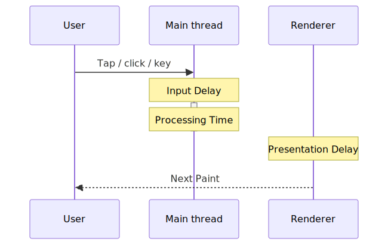
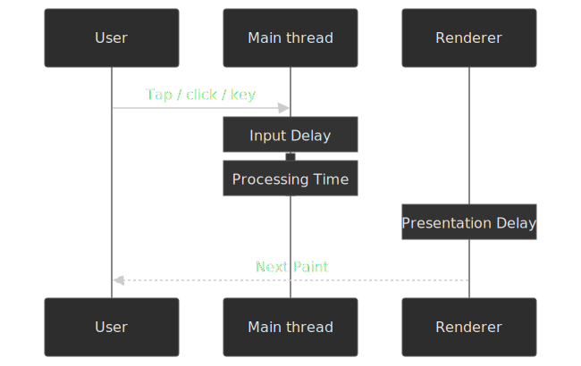

# Client Performance Monitoring

Frontend performance only matters in production. Lab tools like [Lighthouse](https://developer.chrome.com/docs/lighthouse/overview) measure performance under one synthetic device and one synthetic network; users hit your app from a mid-tier Android on a flaky 4G with a third-party tag manager loaded into the same main thread. Real User Monitoring (RUM) closes that gap by capturing per-session performance signals from the browsers of actual users, then aggregating them into the percentile-based metrics that engineering and SEO actually pay attention to. This article is a working reference for building or evaluating that pipeline: which metrics, captured how, transmitted with what guarantees, and attributed in a way that makes them actionable.




## Mental model

Three layers, four hard problems.

**Layers**

1. **Browser Performance APIs** — [`PerformanceObserver`](https://www.w3.org/TR/performance-timeline/), [Navigation Timing](https://www.w3.org/TR/navigation-timing-2/), [Resource Timing](https://www.w3.org/TR/resource-timing-2/), [Event Timing](https://www.w3.org/TR/event-timing/), [Element Timing](https://wicg.github.io/element-timing/), [Long Animation Frames](https://w3c.github.io/long-animation-frames/), and [User Timing](https://www.w3.org/TR/user-timing-3/) — expose timing data with sub-millisecond resolution. The [`web-vitals`](https://github.com/GoogleChrome/web-vitals) library wraps these and patches the well-known edge cases.
2. **Transport** — [`navigator.sendBeacon()`](https://www.w3.org/TR/beacon/) and [`fetch` with `keepalive`](https://fetch.spec.whatwg.org/#fetch-method) survive page unload, so terminal-state metrics like CLS and INP actually reach the server. The right hook is [`visibilitychange`](https://developer.mozilla.org/en-US/docs/Web/API/Document/visibilitychange_event), with `pagehide` as the bfcache-safe fallback.
3. **Backend rollup** — sampled per-session events stream through ingest, get aggregated per route at p75 / p98, and feed dashboards and alerts.

**Hard problems**

- **Sampling** — RUM is high-cardinality. Capturing 100% is rarely worth the bill; sample stable per-session so you can still slice by route or release.
- **Attribution** — `LCP = 3.2s` is unactionable. Capture the element selector, resource URL, and the long animation frames around it.
- **Lifecycle** — INP and CLS only finalize when the page is hidden or torn down. Anything that prevents [bfcache](https://web.dev/articles/bfcache) (`unload`, `beforeunload`) silently drops both your data and the user's back-button latency.
- **Lab vs field divergence** — synthetic and field always disagree, and field is the source of truth for [Core Web Vitals scoring](https://web.dev/articles/defining-core-web-vitals-thresholds).

## Core Web Vitals

[Core Web Vitals](https://web.dev/articles/vitals) are Google's three load / interactivity / stability metrics. All three are evaluated at the **75th percentile** of page visits — a page is "Good" only when at least 75% of visits clear the Good threshold[^cwv-thresholds].

### LCP (Largest Contentful Paint)

LCP measures perceived load speed by tracking when the largest visible content element renders. Per the [LCP spec](https://w3c.github.io/largest-contentful-paint/), qualifying elements are:

- `` and `<image>` inside `<svg>` (first frame for animated images)
- `<video>` (poster image, or first painted frame)
- elements with a CSS `background-image` set via `url()`
- block-level elements containing text nodes

**Sizing rules:**

- Only the visible portion within the viewport counts.
- For resized images, the smaller of intrinsic and rendered size wins (so blowing up a small image doesn't game LCP).
- Margins, padding, and borders are excluded.
- Low-entropy placeholders and fully transparent elements are filtered out.

**When LCP stops reporting.** The browser stops dispatching new LCP candidates as soon as the user interacts (tap, scroll, keypress), because user interaction usually changes what's onscreen. LCP therefore captures the initial loading experience only; ongoing rendering is INP's job[^lcp-stop].

```typescript title="lcp-measurement.ts"
new PerformanceObserver((entryList) => {
  const entries = entryList.getEntries()
  const lastEntry = entries[entries.length - 1] as LargestContentfulPaint

  console.log("LCP:", lastEntry.startTime)
  console.log("Element:", lastEntry.element)
  console.log("Size:", lastEntry.size)
  console.log("URL:", lastEntry.url) // populated for image LCPs
}).observe({ type: "largest-contentful-paint", buffered: true })
```

**Thresholds[^lcp]:**

| Rating            | Value     |
| ----------------- | --------- |
| Good              | ≤ 2.5s    |
| Needs Improvement | 2.5s – 4s |
| Poor              | > 4s      |

### INP (Interaction to Next Paint)

[INP](https://web.dev/articles/inp) replaced [FID](https://web.dev/articles/fid) as the responsiveness Core Web Vital on **March 12, 2024**[^inp-launch]. FID measured only the *input delay* of the *first* interaction; INP measures the **worst end-to-end interaction latency** across the whole page lifecycle. Chrome usage data shows roughly 90% of a user's time on a page is spent *after* it loads, so first-input-only metrics miss most of the responsiveness story[^inp-90].




**Three phases of an interaction:**

1. **Input Delay** — time from the input event until your event handlers actually start (main thread blocked by something else).
2. **Processing Time** — total time spent in your handlers for that interaction.
3. **Presentation Delay** — time from the last handler returning until the next frame is painted (recalc style, layout, paint, compositor).

**Tracked interactions:** mouse clicks, touchscreen taps, and keyboard presses (physical and on-screen keyboards both). Scroll, hover, and zoom are *excluded* — they don't run synchronous handlers in the same way[^inp-interactions].

**Final value calculation.** INP reports a single number per page lifecycle:

- Pages with **fewer than 50 interactions** report the worst single interaction latency.
- Pages with **≥ 50 interactions** ignore the highest interaction for every additional 50 interactions, which is effectively the **98th percentile** of interaction latencies[^inp-outliers]. This stops a single anomalous interaction from skewing the metric on a long-lived SPA.

```typescript title="inp-measurement.ts"
import { onINP } from "web-vitals/attribution"

onINP((metric) => {
  console.log("INP:", metric.value)
  console.log("Rating:", metric.rating)

  const { interactionTarget, interactionType, loadState } = metric.attribution
  console.log("Target selector:", interactionTarget) // CSS-selector string, "" if element was removed
  console.log("Interaction type:", interactionType) // 'pointer' | 'keyboard'
  console.log("Load state:", loadState) // 'loading' | 'dom-interactive' | 'dom-content-loaded' | 'complete'
})
```

> [!NOTE]
> As of `web-vitals` v4, the INP attribution shape uses `interactionTarget` (selector string) and `interactionType` (`'pointer' | 'keyboard'`); the legacy `eventTarget` / `eventType` fields were renamed[^web-vitals-inp-attr]. Earlier v3 collectors that destructure `eventTarget` will silently get `undefined`.

**Thresholds[^inp]:**

| Rating            | Value         |
| ----------------- | ------------- |
| Good              | ≤ 200ms       |
| Needs Improvement | 200ms – 500ms |
| Poor              | > 500ms       |

### CLS (Cumulative Layout Shift)

[CLS](https://web.dev/articles/cls) measures visual stability — how much visible content unexpectedly shifts during the page lifecycle. Unexpected shifts misalign tap targets, lose reading position, and corrupt clicks.

**Layout shift score per shift:**

$$\text{layout shift score} = \text{impact fraction} \times \text{distance fraction}$$

- **Impact fraction** — combined visible area of shifted elements (union of before and after positions) as a fraction of viewport area.
- **Distance fraction** — greatest distance any single element moved, divided by the viewport's larger dimension.

**Session windowing.** CLS does *not* sum every shift across the page lifetime. Shifts are bucketed into **session windows** with a maximum 1-second gap between consecutive shifts and a hard 5-second cap on window duration. The reported CLS value is the **maximum** of all session-window scores, not their sum[^cls-windowing]. This is the change introduced in 2021 to stop long-lived SPAs from accumulating artificially large CLS values[^cls-evolving].

. A gap of ≥ 1s closes a window; a window can be at most 5s long.")


**Expected vs unexpected.** Shifts that occur within 500ms of user interaction (click, tap, keypress) carry the `hadRecentInput` flag and are excluded from CLS. Animations done with `transform: translate()` or `transform: scale()` don't count either, because transforms don't change element box geometry[^cls-windowing].

```typescript title="cls-measurement.ts"
let clsValue = 0
const clsEntries: LayoutShift[] = []

new PerformanceObserver((entryList) => {
  for (const entry of entryList.getEntries() as LayoutShift[]) {
    if (!entry.hadRecentInput) {
      clsValue += entry.value
      clsEntries.push(entry)
    }
  }
}).observe({ type: "layout-shift", buffered: true })
```

> [!WARNING]
> The snippet above naively sums every shift — it does not implement the 1s-gap / 5s-cap session windowing. Always use the `web-vitals` library in production; the raw API is for understanding and debugging only.

**Common causes:**

- Images or `<video>` without `width` / `height` attributes (or `aspect-ratio` CSS).
- Ads, embeds, or iframes that resize after load.
- Dynamically injected content above existing content.
- Web fonts causing FOIT / FOUT (use `font-display: optional` or `size-adjust`).

**Thresholds[^cls]:**

| Rating            | Value      |
| ----------------- | ---------- |
| Good              | ≤ 0.1      |
| Needs Improvement | 0.1 – 0.25 |
| Poor              | > 0.25     |

### The 75th-percentile standard

All three metrics are evaluated at the 75th percentile of page loads in the field. A page passes if at least 75% of visits clear the Good threshold. Google chose p75 deliberately — the median is too lenient (half the users still get a poor experience), p95 is too sensitive to genuine outliers (one extreme device shifts the score), and p75 is a defensible balance across devices, networks, and locales[^cwv-thresholds].

## Performance APIs

The metrics above are only the framing. To capture them — and to measure things `web-vitals` doesn't measure for you — go straight to the underlying APIs.

### PerformanceObserver

[`PerformanceObserver`](https://developer.mozilla.org/en-US/docs/Web/API/PerformanceObserver) is the supported way to read the [Performance Timeline](https://www.w3.org/TR/performance-timeline/). Unlike `performance.getEntries()`, it delivers entries asynchronously as they're recorded.

```typescript title="performance-observer-pattern.ts"
interface PerformanceMetricCallback {
  (entries: PerformanceEntryList): void
}

function observePerformance(
  entryType: string,
  callback: PerformanceMetricCallback,
  options: { buffered?: boolean } = {},
): () => void {
  if (!PerformanceObserver.supportedEntryTypes.includes(entryType)) {
    console.warn(`Entry type "${entryType}" not supported`)
    return () => {}
  }

  const observer = new PerformanceObserver((list) => {
    callback(list.getEntries())
  })

  observer.observe({
    type: entryType,
    buffered: options.buffered ?? true,
  })

  return () => observer.disconnect()
}

const disconnect = observePerformance("largest-contentful-paint", (entries) => {
  const lcp = entries[entries.length - 1]
  console.log("LCP:", lcp.startTime)
})
```

**The `buffered` flag.** With `buffered: true`, the observer receives entries that were recorded *before* `observe()` was called — essential for metrics like LCP, FCP, and TTFB that often fire before your monitoring code is parsed and executed[^perf-timeline]. Each entry type has its own buffer cap; once exceeded, new entries fall off the buffer.

**Supported entry types (2026):**

| Entry type                 | Interface                           | Purpose                          |
| -------------------------- | ----------------------------------- | -------------------------------- |
| `navigation`               | `PerformanceNavigationTiming`       | Page load timing                 |
| `resource`                 | `PerformanceResourceTiming`         | Resource fetch timing            |
| `paint`                    | `PerformancePaintTiming`            | FP, FCP                          |
| `largest-contentful-paint` | `LargestContentfulPaint`            | LCP                              |
| `layout-shift`             | `LayoutShift`                       | CLS                              |
| `event`                    | `PerformanceEventTiming`            | Per-interaction timing (INP)     |
| `first-input`              | `PerformanceEventTiming`            | First input delay (legacy FID)   |
| `longtask`                 | `PerformanceLongTaskTiming`         | Tasks > 50ms (no script attrib.) |
| `long-animation-frame`     | `PerformanceLongAnimationFrameTiming` | LoAF (script-level attribution)  |
| `mark`                     | `PerformanceMark`                   | Custom marks                     |
| `measure`                  | `PerformanceMeasure`                | Custom measures                  |
| `element`                  | `PerformanceElementTiming`          | Specific element render timing   |

> [!NOTE]
> [Long Animation Frames](https://developer.chrome.com/docs/web-platform/long-animation-frames) does **not** replace [Long Tasks](https://w3c.github.io/longtasks/). They coexist; LoAF adds script-level attribution and frame-level lifecycle data that Long Tasks lacks. The Chrome team has stated there are no plans to deprecate the Long Tasks API[^loaf].

### Navigation Timing

[Navigation Timing Level 2](https://www.w3.org/TR/navigation-timing-2/) exposes the document-load pipeline as a single `PerformanceNavigationTiming` entry.

```typescript title="navigation-timing.ts"
function getNavigationMetrics(): Record<string, number> {
  const [nav] = performance.getEntriesByType("navigation") as PerformanceNavigationTiming[]
  if (!nav) return {}

  return {
    dnsLookup: nav.domainLookupEnd - nav.domainLookupStart,
    tcpConnect: nav.connectEnd - nav.connectStart,
    tlsHandshake: nav.secureConnectionStart > 0 ? nav.connectEnd - nav.secureConnectionStart : 0,
    ttfb: nav.responseStart - nav.requestStart,
    downloadTime: nav.responseEnd - nav.responseStart,
    domInteractive: nav.domInteractive - nav.responseEnd,
    domComplete: nav.domComplete - nav.responseEnd,
    pageLoad: nav.loadEventEnd - nav.startTime,
    transferSize: nav.transferSize,
    encodedBodySize: nav.encodedBodySize,
    decodedBodySize: nav.decodedBodySize,
  }
}
```

**Key timing points:**

```text
startTime (= 0)
    → redirectStart / redirectEnd
    → fetchStart
    → domainLookupStart / domainLookupEnd     (DNS)
    → connectStart / connectEnd               (TCP)
    → secureConnectionStart                   (TLS)
    → requestStart
    → responseStart                           (TTFB)
    → responseEnd
    → domInteractive
    → domContentLoadedEventStart / End
    → domComplete
    → loadEventStart / loadEventEnd
```

> [!NOTE]
> The legacy `PerformanceTiming.navigationStart` is gone in `PerformanceNavigationTiming` — use `startTime` (always 0 for the navigation entry) or `fetchStart` as your origin, depending on whether you want to include redirect time.

### Resource Timing

[Resource Timing Level 2](https://www.w3.org/TR/resource-timing-2/) exposes per-resource network timing for everything the document fetches (scripts, stylesheets, images, fonts, XHR/fetch requests).

```typescript title="resource-timing.ts"
interface ResourceMetrics {
  name: string
  initiatorType: string
  duration: number
  transferSize: number
  cached: boolean
}

function getSlowResources(threshold = 1000): ResourceMetrics[] {
  const resources = performance.getEntriesByType("resource") as PerformanceResourceTiming[]

  return resources
    .filter((r) => r.duration > threshold)
    .map((r) => ({
      name: r.name,
      initiatorType: r.initiatorType,
      duration: r.duration,
      transferSize: r.transferSize,
      cached: r.transferSize === 0 && r.decodedBodySize > 0,
    }))
    .sort((a, b) => b.duration - a.duration)
}

new PerformanceObserver((list) => {
  for (const entry of list.getEntries() as PerformanceResourceTiming[]) {
    if (entry.duration > 2000) {
      console.warn("Slow resource:", entry.name, entry.duration)
    }
  }
}).observe({ type: "resource", buffered: true })
```

**Cross-origin timing.** By default, cross-origin resources expose only `startTime`, `duration`, and `responseEnd`; everything else is zeroed for [privacy reasons](https://www.w3.org/TR/resource-timing-2/#sec-cross-origin-resources). The origin serving the resource opts in by sending the `Timing-Allow-Origin` response header:

```http
Timing-Allow-Origin: *
Timing-Allow-Origin: https://example.com
```

This single header is the most common reason third-party metrics show up as a featureless black box in your dashboards.

### Long Animation Frames (LoAF)

[Long Animation Frames](https://developer.chrome.com/docs/web-platform/long-animation-frames) (Chromium 123+) reports any animation frame whose total work — script, style, layout, paint — exceeds **50ms**, the threshold that breaks smooth ~60fps rendering[^loaf-spec]. Same threshold as Long Tasks, but with full per-script attribution and frame-level lifecycle data.

```typescript title="loaf-monitoring.ts"
new PerformanceObserver((list) => {
  for (const entry of list.getEntries() as PerformanceLongAnimationFrameTiming[]) {
    console.log("Long frame:", entry.duration, "ms")

    for (const script of entry.scripts) {
      console.log("  Script:", script.sourceURL)
      console.log("  Function:", script.sourceFunctionName)
      console.log("  Duration:", script.duration, "ms")
      console.log("  Invoker:", script.invoker) // 'user-callback' | 'event-listener' | …
    }
  }
}).observe({ type: "long-animation-frame", buffered: true })
```

**Why pair LoAF with INP.** Long Tasks tells you a 200ms task happened — it doesn't tell you which script or which event. LoAF gives you `scripts[]` with source URL, function name, duration, and invoker, so you can correlate a poor INP attribution against the actual code that ran in the same frame[^loaf].

### User Timing (custom metrics)

[User Timing Level 3](https://www.w3.org/TR/user-timing-3/) lets you mark and measure application-specific points and intervals.

```typescript title="user-timing.ts"
performance.mark("feature-start")

// ... feature code executes ...

performance.mark("feature-end")
performance.measure("feature-duration", "feature-start", "feature-end")

performance.measure("time-to-feature", {
  start: 0,
  end: "feature-start",
})

const measures = performance.getEntriesByType("measure")
for (const measure of measures) {
  console.log(`${measure.name}: ${measure.duration}ms`)
}

performance.mark("api-call-complete", {
  detail: {
    endpoint: "/api/users",
    status: 200,
    cached: false,
  },
})
```

The `detail` payload (User Timing Level 3) is the cleanest way to enrich a custom mark without smuggling data through the name string.

**Real-world custom metrics:**

| Metric                      | What it measures                         |
| --------------------------- | ---------------------------------------- |
| Time to Interactive Feature | When a specific feature becomes usable   |
| Search Results Render       | Time from query to results display       |
| Checkout Flow Duration      | Time through purchase funnel             |
| API Response Time           | Backend latency as experienced by client |

## Data collection architecture

Capturing metrics is the easy half. The hard half is getting them off the page reliably and aggregating them without going broke.

### Beacon transmission

[`navigator.sendBeacon()`](https://www.w3.org/TR/beacon/) was designed for exactly this — analytics payloads that need to survive page unload. The browser queues the request and sends it even if the page navigates or closes, without blocking the next page load.

```typescript title="beacon-transmission.ts" collapse={45-60}
interface PerformancePayload {
  url: string
  sessionId: string
  timestamp: number
  metrics: Record<string, number>
  attribution?: Record<string, unknown>
}

class MetricsCollector {
  private buffer: PerformancePayload[] = []
  private endpoint: string
  private maxBufferSize = 10

  constructor(endpoint: string) {
    this.endpoint = endpoint
    this.setupUnloadHandler()
  }

  record(metrics: Record<string, number>, attribution?: Record<string, unknown>): void {
    this.buffer.push({
      url: location.href,
      sessionId: this.getSessionId(),
      timestamp: Date.now(),
      metrics,
      attribution,
    })

    if (this.buffer.length >= this.maxBufferSize) {
      this.flush()
    }
  }

  private flush(): void {
    if (this.buffer.length === 0) return

    const payload = JSON.stringify(this.buffer)
    this.buffer = []

    const sent = navigator.sendBeacon(this.endpoint, payload)

    if (!sent) {
      fetch(this.endpoint, {
        method: "POST",
        body: payload,
        keepalive: true,
        headers: { "Content-Type": "application/json" },
      }).catch(() => {
        // analytics shouldn't break the page
      })
    }
  }

  private setupUnloadHandler(): void {
    document.addEventListener("visibilitychange", () => {
      if (document.visibilityState === "hidden") {
        this.flush()
      }
    })

    window.addEventListener("pagehide", () => this.flush())
  }

  private getSessionId(): string {
    let id = sessionStorage.getItem("perf_session_id")
    if (!id) {
      id = crypto.randomUUID()
      sessionStorage.setItem("perf_session_id", id)
    }
    return id
  }
}
```

**Why `visibilitychange` over `unload`.**

- `unload` doesn't fire reliably on mobile when the OS background-kills the tab.
- `unload` and `beforeunload` **disqualify the page from [bfcache](https://web.dev/articles/bfcache)** in every modern engine, costing instant back-navigation and dropping your back-button UX[^bfcache-unload]. Chromium is actively deprecating `unload`[^chromium-unload].
- `visibilitychange` fires consistently when the tab is hidden, backgrounded, or navigated away — that is the actual moment the user "left".

The full lifecycle (and the analytics hook for each transition) looks like this:




> [!IMPORTANT]
> When a page is restored from bfcache, the `pageshow` event fires with `event.persisted === true` *without* a fresh `load`. Reset your per-page metric state on that branch (or `web-vitals` will silently mis-attribute the next interaction to the previous page view)[^bfcache].

**Payload size limits.** The Beacon API spec deliberately doesn't pin a number, but the underlying [Fetch spec](https://fetch.spec.whatwg.org/#http-network-or-cache-fetch) caps the **sum of all in-flight `keepalive` request bodies** for an origin at **64 KiB**. Chromium and WebKit enforce this strictly; Firefox historically did not but is converging. Once the budget is exhausted, `sendBeacon()` returns `false` and a `fetch({ keepalive: true })` request resolves to a network error[^sendbeacon-limit][^huli-sendbeacon]. Always check the return value and have a fallback.

> [!TIP]
> Chromium 135+ ships [`fetchLater()`](https://developer.chrome.com/blog/fetch-later) — an API designed to schedule a request to be sent during page unload, with a longer in-flight window than `keepalive`. Treat it as an *optional* future-proofing layer behind a feature detect, not a `sendBeacon` replacement.

### Sampling strategies

RUM produces one event stream per session, plus per-resource and per-interaction streams on top. Capturing 100% of that on a high-traffic site is rarely worth the storage and ingestion cost. Sample stably so each session is either fully captured or fully dropped — random per-event sampling shreds your ability to do session-level joins later.

```typescript title="sampling-strategy.ts" collapse={40-55}
type SamplingDecision = "always" | "sampled" | "never"

interface SamplingConfig {
  performanceRate: number // 0-1, e.g., 0.1 = 10%
  errorRate: number // Usually 1.0 (100%)
  sessionBased: boolean // Decide once per session
}

class Sampler {
  private config: SamplingConfig
  private sessionDecision: boolean | null = null

  constructor(config: SamplingConfig) {
    this.config = config
    if (config.sessionBased) {
      this.sessionDecision = this.makeDecision(config.performanceRate)
    }
  }

  shouldSample(type: "performance" | "error"): boolean {
    if (type === "error") {
      return this.makeDecision(this.config.errorRate)
    }

    if (this.config.sessionBased && this.sessionDecision !== null) {
      return this.sessionDecision
    }

    return this.makeDecision(this.config.performanceRate)
  }

  private makeDecision(rate: number): boolean {
    return Math.random() < rate
  }
}

const sampler = new Sampler({
  performanceRate: 0.1, // 10% of sessions
  errorRate: 1.0, // 100% of errors
  sessionBased: true,
})

if (sampler.shouldSample("performance")) {
  collector.record(metrics)
}
```

**Sampling considerations:**

| Approach                   | Pros                                        | Cons                                 |
| -------------------------- | ------------------------------------------- | ------------------------------------ |
| Head-based (session start) | Stable per session, simple analysis         | May miss rare interactions           |
| Tail-based (after event)   | Can prioritize errors / slow requests       | More complex, higher initial capture |
| Rate-based (per event)     | Predictable volume                          | Splits sessions, blocks joins        |
| Adaptive (dynamic rate)    | Handles traffic spikes                      | Hard to implement correctly          |

**Typical rates:**

- Errors — 100% (always capture)
- Performance metrics — 1–10% session-sampled, depending on traffic
- Session replay — 0.1–1% (heaviest payloads)

> [!NOTE]
> For consistent slicing across releases or experiments, derive the sampling decision from a **stable hash** of the session ID rather than a fresh `Math.random()` call per page. That way the same user lands in the same bucket across multiple navigations.

### Attribution for debugging

`LCP = 3.2s` is an alert, not a fix. Attribution data identifies the element, resource, and timing breakdown that produced the value, so the dashboard line you're staring at is actionable.

```typescript title="attribution-collection.ts"
import { onLCP, onINP, onCLS } from "web-vitals/attribution"

function collectWithAttribution(): void {
  onLCP((metric) => {
    const { target, url, timeToFirstByte, resourceLoadDelay, resourceLoadDuration, elementRenderDelay } =
      metric.attribution

    sendMetric({
      name: "LCP",
      value: metric.value,
      attribution: {
        target, // CSS selector string for the LCP element
        url, // resource URL when the LCP is an image, undefined for text LCPs
        ttfb: timeToFirstByte,
        resourceLoadDelay,
        resourceLoadDuration,
        elementRenderDelay,
      },
    })
  })

  onINP((metric) => {
    const { interactionTarget, interactionType, loadState, longAnimationFrameEntries } = metric.attribution

    sendMetric({
      name: "INP",
      value: metric.value,
      attribution: {
        interactionTarget,
        interactionType,
        loadState,
        longFrames: longAnimationFrameEntries.length,
      },
    })
  })

  onCLS((metric) => {
    const { largestShiftTarget, largestShiftTime, largestShiftValue, loadState } = metric.attribution

    sendMetric({
      name: "CLS",
      value: metric.value,
      attribution: {
        shiftTarget: largestShiftTarget, // selector string for the first shifted element
        shiftTime: largestShiftTime,
        shiftValue: largestShiftValue,
        loadState,
      },
    })
  })
}
```

**Bundle size.** The standard `web-vitals` build is ~2 KB brotli; the attribution build adds ~1.5 KB on top. The 1.5 KB pays for itself the first time you have to chase down a regression — without attribution, you're guessing[^web-vitals-readme].

## Error tracking

### Capturing JavaScript errors

Comprehensive error tracking needs three handlers — synchronous errors, unhandled rejections, and resource-load failures — because no single event covers all of them.

```typescript title="error-tracking.ts" collapse={70-90}
interface ErrorReport {
  type: "runtime" | "resource" | "promise" | "network"
  message: string
  stack?: string
  source?: string
  line?: number
  column?: number
  timestamp: number
  url: string
  userAgent: string
}

class ErrorTracker {
  private endpoint: string
  private buffer: ErrorReport[] = []

  constructor(endpoint: string) {
    this.endpoint = endpoint
    this.setupHandlers()
  }

  private setupHandlers(): void {
    window.onerror = (message, source, line, column, error) => {
      this.report({
        type: "runtime",
        message: String(message),
        stack: error?.stack,
        source,
        line: line ?? undefined,
        column: column ?? undefined,
      })
      return false // don't suppress default handling
    }

    window.addEventListener("unhandledrejection", (event) => {
      this.report({
        type: "promise",
        message: event.reason?.message || String(event.reason),
        stack: event.reason?.stack,
      })
    })

    window.addEventListener(
      "error",
      (event) => {
        if (event.target !== window && event.target instanceof HTMLElement) {
          const target = event.target as HTMLImageElement | HTMLScriptElement | HTMLLinkElement
          this.report({
            type: "resource",
            message: `Failed to load ${target.tagName.toLowerCase()}`,
            source: (target as HTMLImageElement).src || (target as HTMLLinkElement).href,
          })
        }
      },
      true, // capture phase — resource errors don't bubble
    )
  }

  private report(error: Omit<ErrorReport, "timestamp" | "url" | "userAgent">): void {
    const fullError: ErrorReport = {
      ...error,
      timestamp: Date.now(),
      url: location.href,
      userAgent: navigator.userAgent,
    }

    this.buffer.push(fullError)
    this.flush()
  }

  private flush(): void {
    if (this.buffer.length === 0) return

    const payload = JSON.stringify(this.buffer)
    this.buffer = []

    navigator.sendBeacon(this.endpoint, payload)
  }
}
```

### Stack-trace parsing

Production JavaScript is minified, so raw stack traces are useless on their own. [Source maps](https://developer.chrome.com/blog/devtools-source-maps) restore original file/line information server-side.

```typescript title="stack-parsing.ts" collapse={45-60}
interface ParsedFrame {
  function: string
  file: string
  line: number
  column: number
}

function parseStackTrace(stack: string): ParsedFrame[] {
  if (!stack) return []

  const lines = stack.split("\n")
  const frames: ParsedFrame[] = []

  const chromeRegex = /at\s+(.+?)\s+\((.+?):(\d+):(\d+)\)/
  const firefoxRegex = /(.*)@(.+?):(\d+):(\d+)/

  for (const line of lines) {
    const match = chromeRegex.exec(line) || firefoxRegex.exec(line)

    if (match) {
      frames.push({
        function: match[1] || "<anonymous>",
        file: match[2],
        line: parseInt(match[3], 10),
        column: parseInt(match[4], 10),
      })
    }
  }

  return frames
}
```

Server-side, use the [`source-map`](https://www.npmjs.com/package/source-map) library (or any vendor SDK — Sentry, Datadog, Bugsnag all do this for you) to resolve `bundle.min.js:1:32417` to `src/feature/x.tsx:42:12`.

### Error grouping

Without grouping, every error instance creates a separate alert. Fingerprinting consolidates identical errors into a single issue.

```typescript title="error-grouping.ts"
function generateErrorFingerprint(error: ErrorReport): string {
  const parts = [error.type, normalizeMessage(error.message), error.stack ? getTopFrame(error.stack) : "no-stack"]

  return hashString(parts.join("|"))
}

function normalizeMessage(message: string): string {
  return message
    .replace(/\d+/g, "<N>") // numbers
    .replace(/'[^']+'/g, "'<S>'") // single-quoted strings
    .replace(/"[^"]+"/g, '"<S>"') // double-quoted strings
    .replace(/\b[a-f0-9]{8,}\b/gi, "<ID>") // hex IDs
}

function getTopFrame(stack: string): string {
  const frames = parseStackTrace(stack)
  if (frames.length === 0) return "unknown"

  const top = frames[0]
  return `${top.file}:${top.line}` // exclude column — varies with minification
}

function hashString(str: string): string {
  let hash = 0
  for (let i = 0; i < str.length; i++) {
    hash = (hash << 5) - hash + str.charCodeAt(i)
    hash |= 0
  }
  return hash.toString(16)
}
```

## Lab vs field data

### Fundamental differences

| Aspect          | Lab (synthetic)                       | Field (RUM)                     |
| --------------- | ------------------------------------- | ------------------------------- |
| Environment     | Controlled (specific device, network) | Variable (real user conditions) |
| Reproducibility | High                                  | Low                             |
| Metrics         | All measurable                        | User-experienced only           |
| Use case        | Development, CI/CD gates              | Production monitoring           |
| Data volume     | One measurement                       | Aggregated across many sessions |
| Attribution     | Full stack traces, traces             | Limited (privacy, performance)  |

### When to use each

**Lab data ([Lighthouse](https://developer.chrome.com/docs/lighthouse/overview), [WebPageTest](https://www.webpagetest.org/), [DebugBear](https://www.debugbear.com/)):**

- Pre-deployment validation.
- Regression testing in CI (assert on specific Lighthouse scores or budget files).
- Debugging specific issues against a stable baseline.
- Comparing configurations (CDN settings, image formats, hydration strategies).

**Field data (your RUM, plus [CrUX](https://developer.chrome.com/docs/crux) for industry context):**

- Understanding real user experience.
- Identifying issues lab doesn't catch (third-party scripts, real device variability, browser engine quirks).
- Monitoring production performance per-route, per-release.
- Correlating performance with business metrics (conversion, bounce, retention).

### The gap

Lab and field measurements regularly disagree by significant margins because:

1. **Device diversity** — lab uses one consistent device profile; users span a 10× CPU range.
2. **Network conditions** — lab throttles to a stable profile; real networks burst, drop, and reconnect.
3. **User behavior** — lab follows a scripted path; users interact unpredictably and trigger latent code paths.
4. **Third-party content** — ads, widgets, and embeds load and behave differently in production traffic patterns.
5. **Cache state** — lab usually tests cold; users often arrive warm.

[As web.dev puts it](https://web.dev/articles/lab-and-field-data-differences): "lab measurement is not a substitute for field measurement." Both tools answer different questions; ship both into your workflow.

## The web-vitals library

Google's [`web-vitals`](https://github.com/GoogleChrome/web-vitals) library is the de-facto reference implementation for Core Web Vitals in the browser. It wraps the raw APIs and patches the long tail of edge cases that homegrown collectors typically get wrong.

### Why use it over raw APIs

The library handles:

- **Background-tab detection** — metrics shouldn't include time the page was hidden.
- **bfcache restoration** — resets per-page metric state on `pageshow` with `persisted: true`.
- **Iframe and prerender** considerations.
- **Mobile-specific timing quirks** — particularly around input timing.
- **Final-value semantics** — INP and CLS only finalize on the right lifecycle event.

### Basic usage

```typescript title="web-vitals-setup.ts"
import { onCLS, onINP, onLCP, onFCP, onTTFB } from "web-vitals"

function sendToAnalytics(metric: { name: string; value: number; delta: number; id: string; rating: string }): void {
  const body = JSON.stringify({
    name: metric.name,
    value: metric.value,
    delta: metric.delta,
    id: metric.id,
    rating: metric.rating,
    page: location.pathname,
  })

  navigator.sendBeacon("/api/analytics", body)
}

onCLS(sendToAnalytics)
onINP(sendToAnalytics)
onLCP(sendToAnalytics)
onFCP(sendToAnalytics)
onTTFB(sendToAnalytics)
```

### Attribution build

```typescript title="web-vitals-attribution.ts"
import { onLCP, onINP, onCLS } from "web-vitals/attribution"

onLCP((metric) => {
  console.log("LCP value:", metric.value)
  console.log("LCP target selector:", metric.attribution.target)
  console.log("Resource URL:", metric.attribution.url)
  console.log("TTFB:", metric.attribution.timeToFirstByte)
  console.log("Resource load delay:", metric.attribution.resourceLoadDelay)
  console.log("Element render delay:", metric.attribution.elementRenderDelay)
})

onINP((metric) => {
  console.log("INP value:", metric.value)
  console.log("Interaction type:", metric.attribution.interactionType) // 'pointer' | 'keyboard'
  console.log("Interaction target:", metric.attribution.interactionTarget) // selector string
  console.log("Load state:", metric.attribution.loadState)
  console.log("Long frames:", metric.attribution.longAnimationFrameEntries)
})

onCLS((metric) => {
  console.log("CLS value:", metric.value)
  console.log("Largest shift target:", metric.attribution.largestShiftTarget)
  console.log("Largest shift value:", metric.attribution.largestShiftValue)
  console.log("Largest shift time:", metric.attribution.largestShiftTime)
})
```

### Key API details

**The `delta` property.** Metrics like CLS update multiple times as new shifts are observed. `delta` is the change since the last report; for analytics platforms that don't support metric updates, sum the deltas client-side or server-side.

**The `id` property.** Stable identifier for this metric instance — use it to deduplicate or aggregate multiple reports for the same page view (CLS in particular).

**Single call per page.** Call each metric function exactly once per page load. Multiple calls create multiple `PerformanceObserver` instances and produce duplicate, conflicting reports.

## Real-world implementations

### Sentry Performance

- JavaScript SDK instruments `fetch`, XHR, framework components.
- Distributed tracing connects browser spans to backend spans via `traceparent`.
- Web Vitals captured automatically via the `web-vitals` library.
- Release tracking flags performance regressions across deploys.
- Heavy on per-error attribution (source maps, breadcrumbs).

### Datadog RUM

- Lightweight SDK loaded asynchronously.
- Session-based collection with configurable sampling.
- Automatic Core Web Vitals, resource timing, long tasks.
- Session Replay overlay for debugging individual sessions.
- Joins to Datadog APM traces by `trace_id`.

### Vercel Speed Insights

- Minimal script injection in Next.js builds.
- Sends to Vercel's analytics backend.
- Core Web Vitals with Next.js-specific route attribution.
- Per-route breakdown and per-deploy comparison.

### Self-hosted (SpeedCurve, Calibre, Grafana Faro, OSS stack)

- Time-series storage for high-cardinality metrics (ClickHouse, TimescaleDB, M3, Druid).
- Aggregation pipelines for percentile rollups (Flink, Materialize, in-DB rollups).
- Visualization via Grafana, Superset, or vendor-specific dashboards.
- The honest reason teams build this themselves is data-residency, billing predictability, or wanting unfettered access to raw events.

## Operational takeaways

1. **Use the `web-vitals` library** for the three Core Web Vitals. The raw APIs are for understanding and for custom metrics; for CWVs, the edge-case surface is too large to reimplement.
2. **Beacon on `visibilitychange`, fall back to `pagehide`.** Never use `unload` or `beforeunload` — they break bfcache and drop your data.
3. **Sample stably per session.** Random per-event sampling shreds your ability to do session-level joins; hash the session ID.
4. **Always capture attribution.** A 1.5 KB bundle delta pays for itself the first time you have to debug a regression.
5. **Treat lab and field as different tools.** Lab gates regressions in CI; field tells you what users experience. Both are necessary.

## Appendix

### Prerequisites

- Browser Performance APIs (`PerformanceObserver`, timing interfaces).
- HTTP basics (request/response timing, headers).
- JavaScript event handling and the page lifecycle.

### Terminology

| Term | Definition                                                                      |
| ---- | ------------------------------------------------------------------------------- |
| RUM  | Real User Monitoring — collecting performance data from actual user sessions    |
| CrUX | Chrome User Experience Report — Google's public dataset of field performance    |
| TTFB | Time to First Byte — time until first byte of response received                 |
| FCP  | First Contentful Paint — time until first content renders                       |
| LCP  | Largest Contentful Paint — time until largest visible content renders           |
| INP  | Interaction to Next Paint — worst interaction latency (replaced FID)            |
| CLS  | Cumulative Layout Shift — measure of visual stability                           |
| LoAF | Long Animation Frame — frame taking >50ms, blocking smooth rendering            |
| bfcache | Back/forward cache — instant restore of a previous page from memory          |

### Quick reference

| Want to capture                       | Use                                                          |
| ------------------------------------- | ------------------------------------------------------------ |
| LCP, INP, CLS, FCP, TTFB              | `web-vitals` library (attribution build for production)      |
| Page-load timing breakdown            | `PerformanceNavigationTiming`                                |
| Per-resource fetch timing             | `PerformanceResourceTiming` (+ `Timing-Allow-Origin` header) |
| Custom feature timing                 | `performance.mark` / `performance.measure`                   |
| Long-running scripts blocking a frame | `PerformanceLongAnimationFrameTiming`                        |
| Specific element render timing        | `PerformanceElementTiming`                                   |
| JS errors                             | `window.onerror` + `unhandledrejection` + capture-phase `error` |

## References and footnotes

[^cwv-thresholds]: [How the Core Web Vitals metrics thresholds were defined](https://web.dev/articles/defining-core-web-vitals-thresholds) — web.dev.
[^lcp]: [Largest Contentful Paint (LCP)](https://web.dev/articles/lcp) — web.dev. Spec: [W3C Largest Contentful Paint](https://w3c.github.io/largest-contentful-paint/).
[^lcp-stop]: [LCP — When LCP stops](https://web.dev/articles/lcp#when_is_lcp_reported) — web.dev.
[^inp]: [Interaction to Next Paint (INP)](https://web.dev/articles/inp) — web.dev.
[^inp-launch]: [Interaction to Next Paint becomes a Core Web Vital on March 12](https://web.dev/blog/inp-cwv-march-12) — web.dev.
[^inp-90]: ["Chrome usage data shows that 90% of a user's time on a page is spent *after* it loads."](https://web.dev/articles/inp) — web.dev.
[^inp-interactions]: [INP — What's not measured by INP?](https://web.dev/articles/inp#whats-not-measured-by-inp) — web.dev.
[^inp-outliers]: [INP — How is INP calculated?](https://web.dev/articles/inp#how-is-inp-calculated) — web.dev.
[^cls]: [Cumulative Layout Shift (CLS)](https://web.dev/articles/cls) — web.dev.
[^cls-windowing]: [CLS — What is a session window?](https://web.dev/articles/cls#what_is_a_session_window) — web.dev.
[^cls-evolving]: [Evolving the CLS metric](https://web.dev/blog/evolving-cls) — web.dev. Background on the move from cumulative-sum to max-session-window.
[^perf-timeline]: [Performance Timeline Level 2 — `buffered` flag](https://www.w3.org/TR/performance-timeline/#dom-performanceobserverinit-buffered) — W3C.
[^loaf]: [Long Animation Frames API](https://developer.chrome.com/docs/web-platform/long-animation-frames) — Chrome for Developers (covers the LoAF / Long Tasks coexistence).
[^loaf-spec]: [Long Animation Frames API — spec](https://w3c.github.io/long-animation-frames/) — W3C.
[^bfcache]: [Back/forward cache](https://web.dev/articles/bfcache) — web.dev.
[^bfcache-unload]: [`Navigator.sendBeacon()` — Sending analytics at the end of a session](https://developer.mozilla.org/en-US/docs/Web/API/Navigator/sendBeacon#sending_analytics_at_the_end_of_a_session) — MDN.
[^chromium-unload]: [Deprecating the `unload` event](https://developer.chrome.com/docs/web-platform/deprecating-unload) — Chrome for Developers.
[^sendbeacon-limit]: [Fetch standard — `keepalive` and the 64 KiB in-flight ceiling](https://fetch.spec.whatwg.org/#http-network-or-cache-fetch) — WHATWG.
[^huli-sendbeacon]: [The 64 KiB limitation of `navigator.sendBeacon` and its implementation](https://blog.huli.tw/2025/01/06/en/navigator-sendbeacon-64kib-and-source-code/) — engineering deep dive cross-validating browser source.
[^web-vitals-readme]: [`GoogleChrome/web-vitals` — README, "Bundle size"](https://github.com/GoogleChrome/web-vitals#bundle-size).
[^web-vitals-inp-attr]: [`GoogleChrome/web-vitals` — `INPAttribution` type definition](https://github.com/GoogleChrome/web-vitals/blob/main/src/types/inp.ts) — current source for the `interactionTarget` / `interactionType` / `inputDelay` / `processingDuration` / `presentationDelay` field set.
