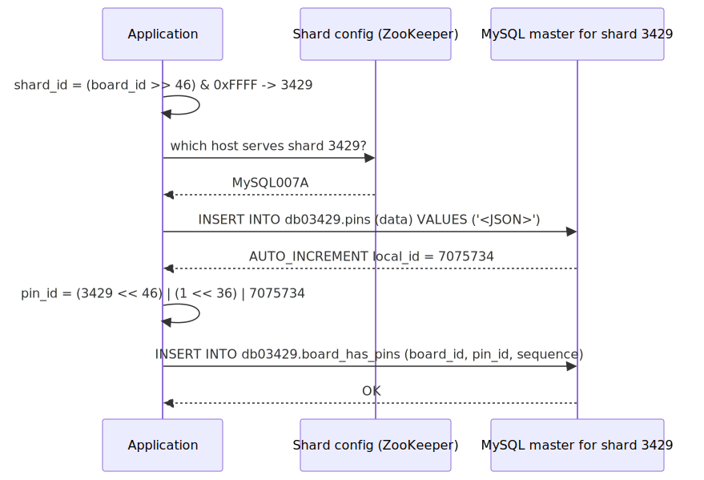
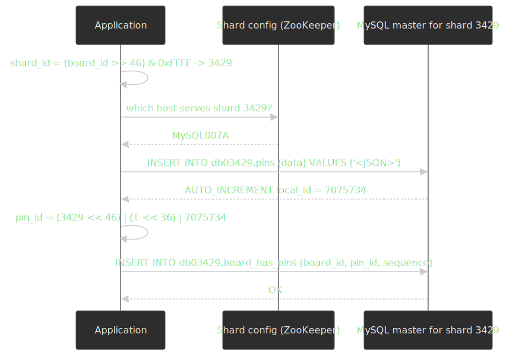
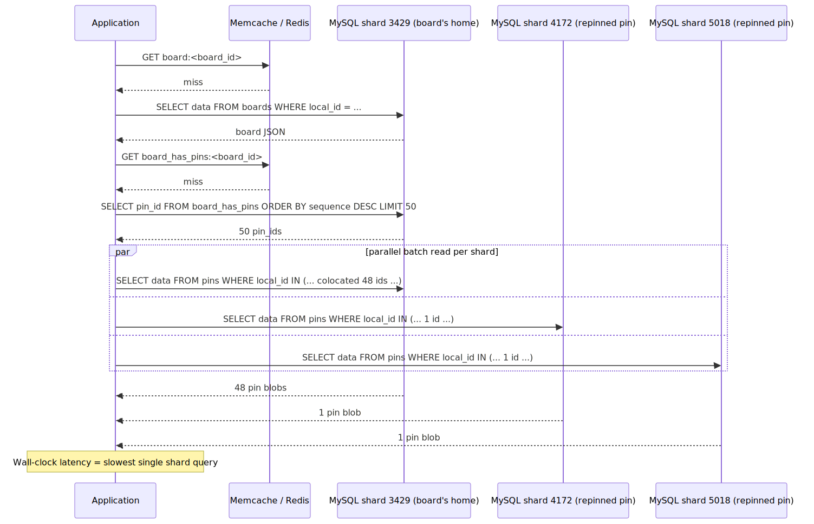
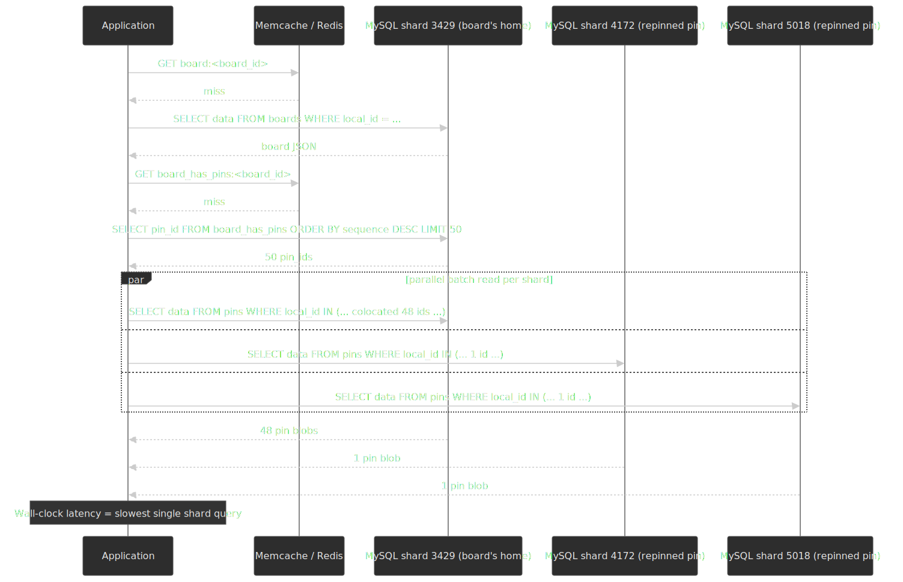

# Pinterest: MySQL Sharding from Zero to Billions of Objects

In late 2011, Pinterest was doubling its user base every 45 days, ran on three engineers, and operated six storage technologies — three of which (Cassandra, Membase, MongoDB) were failing on rotation every night. Their fix: rip out the failing NoSQL stores, keep the two stable caches (Redis, Memcache), shard MySQL into thousands of independent databases, and embed the shard location of every object directly inside its 64-bit ID so that no lookup service ever has to know where data lives. This article unpacks the design — the bit layout, the virtual-shard topology, the JSON-blob schema, the colocation rules, and the migration — and pulls out the engineering principles that explain why the same architecture is still in production more than a decade later.

; MySQL became the sharded primary store; Redis and Memcache survived as caches.")


## Abstract

Pinterest's sharding system encodes location directly into every object's identity. A 64-bit ID contains the shard number, the object type, and a per-shard auto-increment local ID — no lookup service needed[^pinterest-sharding]. The shard ID determines which physical MySQL instance currently holds that object. Virtual shards (initially 4,096 across 8 master-master pairs) decouple logical placement from physical topology, so capacity grows by splitting physical hosts without ever moving an individual row. All objects store their attributes as a JSON blob in a three-column MySQL table (`local_id`, `data`, `ts`), which sidesteps schema migrations almost entirely. Relationships use separate `noun_verb_noun` mapping tables stored on the "from" object's shard. Application-layer joins replace SQL `JOIN`s — every ID carries its own routing information, so multi-object reads parallelize across shards with wall-clock latency equal to the slowest single query.

The design works because it trades features MySQL handles poorly at scale (cross-shard joins, distributed transactions, cluster consensus) for features it handles extremely well (single-row primary-key lookups, single-shard ACID transactions, master-master replication). The result is a system where every query is a primary-key lookup against a known shard, every write is a single-shard transaction, and capacity planning collapses to "add another identical MySQL pair."

## Context

### The system

Pinterest is a visual discovery platform where users save ("pin") images and links into collections ("boards"). The core data model is small:

| Entity      | Description                                  | Scale (mid-2012)     |
| ----------- | -------------------------------------------- | -------------------- |
| **Users**   | Accounts with profiles and preferences       | ~11.7 million MAU    |
| **Pins**    | Saved images / links with metadata           | ~500 million objects |
| **Boards**  | User-created collections of pins             | tens of millions     |
| **Follows** | User-to-user and user-to-board relationships | ~1.6 billion rows    |

Source: Marty Weiner's QCon and GOTO scaling talks, summarised by [High Scalability](https://highscalability.com/scaling-pinterest-from-0-to-10s-of-billions-of-page-views-a/). Every user action — pinning, creating boards, following — generates writes to these entities and their relationships, and the read pattern is heavily fan-out: loading a board needs the board metadata plus 50+ pin objects, each of which can theoretically live on a different shard.

### The trigger

- **Date**: September–December 2011.
- **Growth**: User base doubling every 45 days. Pinterest hit 10 million unique monthly visitors faster than any prior site, [per comScore](https://highscalability.com/scaling-pinterest-from-0-to-10s-of-billions-of-page-views-a/).
- **Team**: 3 engineers in September 2011, growing to 6 by January 2012, 40 by October 2012.
- **The crisis**: every database technology in the stack was breaking in different ways every night. Three engineers could not maintain operational expertise across six storage systems while also shipping product.

### Constraints

- **Team size.** 3 engineers had to build, migrate, and operate the entire storage layer.
- **Growth rate.** No multi-month feature freeze was tolerable for long.
- **Operational simplicity.** Whatever they built had to be operable by a tiny team — and by the next batch of new hires.
- **Data safety.** They had already lost data to NoSQL failures; the replacement had to be safe above all else.

## The Problem

### The age of experimentation

By September 2011, Pinterest's storage layer was a patchwork of six technologies deployed in rapid succession to keep up with growth[^highscalability]:

| Technology    | Use case                                | Instances             | Status                          |
| ------------- | --------------------------------------- | --------------------- | ------------------------------- |
| **MySQL**     | Primary data (functionally sharded)     | 5 DBs + 9 read slaves | Stable but hitting shard limits |
| **Cassandra** | Distributed object storage              | 4 nodes               | Repeated data corruption        |
| **Membase**   | Key-value cache                         | 15 nodes (3 clusters) | Unreliable cluster management   |
| **MongoDB**   | Counters                                | 3 clusters            | Operational complexity          |
| **Redis**     | Caching, queues                         | 10 instances          | Stable                          |
| **Memcache**  | Object cache                            | 8 instances           | Stable                          |

Each technology brought its own operational model, failure modes, monitoring, backup procedure, and on-call playbook. Three engineers could not stay current across all six. (A separate Elasticsearch cluster — later Solr — handled search and is outside the scope of this article, which is about the primary write path.[^highscalability])

> [!NOTE]
> The "MySQL" row above was **functionally sharded** — different *kinds* of data (users, pins, boards, follows) lived in different MySQL instances. Pinterest had already outgrown that model: a hot table forced an entire functional shard to be split, and adding a new feature meant adding a new functional shard. The 2012 redesign moved from functional sharding to **key-based sharding**, where every shard holds the same schema and a 64-bit object ID picks the shard. Functional and key-based sharding are the two canonical sharding strategies; Pinterest's story is the transition from one to the other.

### How each technology failed

**Cassandra was the most damaging.** The cluster management algorithm — the code responsible for membership, data placement, and rebalancing — was a single point of failure replicated across every node. A bug in that algorithm could (and did) take the entire cluster down at once. Specific failures included[^highscalability]:

- **Rebalancing broke repeatedly.** Nodes would join or leave, triggering rebalances that did not complete correctly.
- **Data corruption across all nodes.** A bug in the cluster manager corrupted data on every node in at least one incident.
- **Data authority failures.** A secondary replica at 80% replication could claim primary status, resulting in ~20% data loss.
- **Four cluster-wide outages.** Cassandra's cluster manager took the site down four times.

**Membase** had similar cluster-management instability. **MongoDB** added operational complexity without solving the core scaling problem.

> [!IMPORTANT]
> The common thread was not a specific bug but a class of bug. Every clustering technology required nodes to reach **symmetric agreement** about cluster state — gossip, consensus, or anti-entropy — and that agreement protocol was the most complex code in each system. That was where the failures lived.

### Why it wasn't obvious earlier

These technologies worked fine at small scale. Cassandra handled 4 nodes without issues. The cluster-management failures only emerged as the cluster grew and experienced real-world conditions (node failures, network partitions, rebalancing under load). By the time the failure modes were obvious, Pinterest was already dependent on the technology and had no time to evaluate alternatives carefully.

As Marty Weiner — Pinterest engineer and author of the canonical sharding write-up — [later put it](https://medium.com/pinterest-engineering/learn-to-stop-using-shiny-new-things-and-love-mysql-3e1613c2ce14): pushing a young technology to its limit makes it fail in ways the documentation never describes.

### The one technology that didn't fail

MySQL. Across every incident, every hardware failure, every operational emergency, MySQL never lost data. Recovery scripts existed, were well tested, and worked. The team could always restore from backups and "live another day."

That observation — that the most mature, least exciting technology was the most reliable — became the foundation of the rearchitecture.

## Options Considered

### Option 1: scale the existing NoSQL stack

**Approach.** Fix Cassandra's operational issues, add more nodes, invest in better cluster-management tooling.

**Pros.**

- No migration required.
- Cassandra's wide-column model fits Pinterest's access patterns reasonably well.

**Cons.**

- The cluster-management failures were inherent to the technology at that maturity level, not to Pinterest's usage.
- 3 engineers cannot become Cassandra contributors *and* Pinterest engineers.
- In 2011, Pinterest would have been one of Cassandra's largest deployments, amplifying every bug.

**Why not.** No amount of operational investment would patch bugs in Cassandra's consensus protocol fast enough.

### Option 2: adopt a different NoSQL database

**Approach.** Migrate to a more mature NoSQL system (HBase, Riak, or a newer Cassandra release).

**Pros.**

- Potentially better cluster management.
- Built-in horizontal scaling.

**Cons.**

- Same fundamental risk: every clustering algorithm is inherently complex.
- Migration cost is high regardless of destination.
- Every NoSQL system was relatively immature in 2011–2012.
- Operational model still required specialised expertise.

**Why not.** Weiner [framed the insight](https://medium.com/pinterest-engineering/learn-to-stop-using-shiny-new-things-and-love-mysql-3e1613c2ce14) as: the question wasn't *which* clustering technology to use, but *whether* to use clustering at all. Every clustering system shares the same fundamental complexity — nodes must agree on cluster state, and that agreement protocol is where failures live.

### Option 3: shard MySQL with application-layer routing (chosen)

**Approach.** Partition data across many independent MySQL instances. Embed shard routing directly in object IDs. Handle all cross-shard logic in the application layer.

**Pros.**

- MySQL is the most mature relational database — decades of production hardening.
- No cluster management: each MySQL instance is independent.
- Failure modes are well understood and manageable.
- Huge talent pool — any engineer can work with MySQL.
- Excellent tooling ecosystem (XtraBackup, Innotop, Percona Toolkit).
- Predictable, near-linear performance scaling.

**Cons.**

- No cross-shard joins, foreign keys, or distributed transactions.
- Application must own all routing logic.
- Requires custom ID generation, shard mapping, and migration tooling.
- Schema flexibility within a row is limited (solved by storing a JSON blob).

**Why chosen.** MySQL had never lost Pinterest's data. Its failure modes were understood. The sharding logic was small enough to fit in half a page of code. Capacity could be added by adding more identical MySQL instances rather than debugging cluster consensus algorithms.

### Decision factors

| Factor                   | NoSQL (Cassandra/HBase)  | Different NoSQL     | Sharded MySQL               |
| ------------------------ | ------------------------ | ------------------- | --------------------------- |
| Data-safety track record | Data-loss incidents      | Unknown at scale    | Never lost data             |
| Operational complexity   | High (clustering)        | High (clustering)   | Low (independent instances) |
| Team expertise required  | Specialised              | Specialised         | General (any engineer)      |
| Maturity (2011–2012)     | Early                    | Early–moderate      | Decades                     |
| Failure blast radius     | Entire cluster           | Entire cluster      | Single shard                |
| Capacity-scaling model   | Cluster rebalancing      | Cluster rebalancing | Add identical instances     |

## Implementation

### The 64-bit ID scheme

The core design decision: every object ID encodes its own location. No lookup table, no routing service, no external dependency. Given an ID, any service can compute which shard holds that object[^pinterest-sharding].




| Field        | Bits | Range                  | Purpose                                                   |
| ------------ | ---- | ---------------------- | --------------------------------------------------------- |
| **Reserved** | 2    | always 0               | Keeps IDs positive in signed 64-bit integers              |
| **Shard ID** | 16   | 65,536 shards          | Identifies the virtual shard holding this object          |
| **Type ID**  | 10   | 1,024 object types     | Object type: Pin = 1, Board = 2, User = 3, etc.           |
| **Local ID** | 36   | ~68 billion per shard  | MySQL `AUTO_INCREMENT` within the shard's table           |

**Construction.**

```python title="ID generation" collapse={1-2}
# Called after INSERT returns the auto-increment local_id.
# shard_id is determined by colocation rules (see below).
def compose_id(shard_id, type_id, local_id):
    return (shard_id << 46) | (type_id << 36) | local_id
```

**Decomposition.**

```python title="ID parsing"
def decompose_id(object_id):
    shard_id = (object_id >> 46) & 0xFFFF
    type_id  = (object_id >> 36) & 0x3FF
    local_id = object_id & 0xFFFFFFFFF
    return shard_id, type_id, local_id
```

**Worked example** — Pin ID `241294492511762325`[^pinterest-sharding]:

| Extraction | Calculation                               | Result      |
| ---------- | ----------------------------------------- | ----------- |
| Shard ID   | `(241294492511762325 >> 46) & 0xFFFF`     | **3429**    |
| Type ID    | `(241294492511762325 >> 36) & 0x3FF`      | **1** (Pin) |
| Local ID   | `(241294492511762325 >> 0) & 0xFFFFFFFFF` | **7075733** |

From a single 64-bit integer the system already knows: this object is a Pin, it lives on shard 3429, and its row in the shard's `pins` table has `local_id = 7075733`. No external lookup, no extra round-trip.

**Reasoning for each field.**

- **Reserved bits.** Weiner called these ["worth their weight in gold"](https://medium.com/pinterest-engineering/sharding-pinterest-how-we-scaled-our-mysql-fleet-3f341e96ca6f) — a hedge from his compiler-and-chip-design background. Two bits of future flexibility cost nothing but unlock changes to the ID scheme without breaking existing IDs.
- **16-bit shard ID.** Supports 65,536 virtual shards — far more than needed initially (4,096 opened) and enough headroom for a decade of growth.
- **10-bit type.** Lets the system know what an ID refers to without querying any database. Only a few types were used initially, but the capacity for 1,024 costs nothing.
- **36-bit local ID.** ~68 billion objects per shard per type. Even at Pinterest's growth rate, no individual shard exhausts this in any reasonable horizon.

**Contrast with other ID schemes.** Instagram's [Snowflake-style ID](https://instagram-engineering.com/sharding-ids-at-instagram-1cf5a71e5a5c) (13-bit shard, 41-bit timestamp, 10-bit sequence) embeds temporal ordering instead of object type. Twitter's Snowflake uses an external mapping service for shard resolution. Pinterest traded time-based ordering for type encoding *and* eliminated the mapping service entirely — the shard is in the ID itself.

### Virtual shards and physical topology

The second key design: decouple logical placement from physical infrastructure.

**Initial deployment.** 4,096 virtual shards across 8 physical MySQL master-master pairs[^pinterest-sharding]. Each pair consists of:

- **Master A**: serves all production reads and writes, in one Availability Zone.
- **Master B**: hot standby via master-master replication, in a different AZ.

Each master hosts **512 separate MySQL databases** (one per virtual shard), named `db00000` through `db04095` across the fleet[^pinterest-sharding].

**Shard-to-host mapping** (held in configuration, distributed via [ZooKeeper](https://medium.com/pinterest-engineering/serving-configuration-data-at-scale-with-high-availability-d7d3f283ed02)):

```python title="Shard configuration"
shard_config = [
    {"range": (0, 511),    "master": "MySQL001A", "slave": "MySQL001B"},
    {"range": (512, 1023), "master": "MySQL002A", "slave": "MySQL002B"},
    {"range": (1024, 1535),"master": "MySQL003A", "slave": "MySQL003B"},
    {"range": (1536, 2047),"master": "MySQL004A", "slave": "MySQL004B"},
    {"range": (2048, 2559),"master": "MySQL005A", "slave": "MySQL005B"},
    {"range": (2560, 3071),"master": "MySQL006A", "slave": "MySQL006B"},
    {"range": (3072, 3583),"master": "MySQL007A", "slave": "MySQL007B"},
    {"range": (3584, 4095),"master": "MySQL008A", "slave": "MySQL008B"},
]
```

**Why virtual shards matter.** When `MySQL001A` runs hot, no row of data has to move. Instead:




1. Spin up a new master-master pair (`MySQL009A`/`MySQL009B`).
2. Start MySQL replication from `MySQL001A` to `MySQL009A`. All 512 databases replicate atomically as far as the application is concerned.
3. Wait for replication to catch up.
4. Update the configuration: `MySQL001A` keeps shards 0–255, `MySQL009A` takes shards 256–511.
5. Push the new config via ZooKeeper; application servers pick up the new routing.

No application code changes. No data migration scripts. No downtime. The virtual shard ID embedded in every object remains valid forever — only the physical mapping changes.

> [!IMPORTANT]
> The hard rule: once data lands on a virtual shard, it **never moves to a different virtual shard**[^pinterest-sharding]. The 64-bit ID permanently encodes shard 3429 (or whatever shard was assigned at creation). This eliminates the entire class of problems around online resharding, distributed coordination, and "moved row" races.

### Object tables: the three-column schema

Every shard contains identical tables for each object type. The schema is deliberately minimal[^pinterest-sharding]:

```sql title="Object tables"
CREATE TABLE pins (
    local_id INT PRIMARY KEY AUTO_INCREMENT,
    data TEXT,
    ts TIMESTAMP DEFAULT CURRENT_TIMESTAMP
) ENGINE=InnoDB;

CREATE TABLE boards (
    local_id INT PRIMARY KEY AUTO_INCREMENT,
    data TEXT,
    ts TIMESTAMP DEFAULT CURRENT_TIMESTAMP
) ENGINE=InnoDB;

CREATE TABLE users (
    local_id INT PRIMARY KEY AUTO_INCREMENT,
    data TEXT,
    ts TIMESTAMP DEFAULT CURRENT_TIMESTAMP
) ENGINE=InnoDB;
```

The `data` column stores a **JSON blob** containing all the object's attributes:

```json title="Example pin JSON blob"
{
  "details": "New Star Wars character",
  "link": "http://webpage.com/asdf",
  "user_id": 241294629943640797,
  "board_id": 241294561224164665,
  "source_url": "http://original-source.com/image.jpg"
}
```

**Why JSON in a `TEXT` column?** Schema evolution without `ALTER TABLE`. Adding a field to pins is:

1. Update the application's JSON deserialisation to recognise the new field.
2. Set a default for old records that lack the field.
3. New writes include the field; old records work without migration.

Pinterest reported running [only one `ALTER TABLE` in three years](https://medium.com/pinterest-engineering/sharding-pinterest-how-we-scaled-our-mysql-fleet-3f341e96ca6f) under this scheme. On large MySQL tables, `ALTER TABLE` historically required a full table rewrite that could lock writes for hours; even with [online DDL](https://dev.mysql.com/doc/refman/8.0/en/innodb-online-ddl-operations.html) introduced in 5.6, copy-rebuild operations still consume disk and replication capacity. Storing attributes as JSON sidesteps that entire problem.

**Trade-off.** You lose MySQL-level indexing on individual fields inside the blob. Pinterest accepted this because the access pattern is almost exclusively primary-key lookup — the application fetches the whole object by `local_id` and deserialises in user space.

> [!NOTE]
> Pinterest later [contributed column-level compression](https://medium.com/pinterest-engineering/evolving-mysql-compression-part-1-7f8b09666589) to Percona Server (built on an initial patch from Alibaba's Weixiang Zhai). InnoDB page compression effectively capped at ~2:1 for their JSON pin blobs; column compression with a tuned Zlib dictionary [pushed Pin data from ~3:1 to ~3.47:1](https://medium.com/pinterest-engineering/evolving-mysql-compression-part-2-2c3eb0101205). The blob model made these gains possible — the data is uniform JSON, ideal for dictionary-based compression.

### Mapping tables: relationships without joins

Relationships between objects use separate **mapping tables** with a `noun_verb_noun` naming convention[^pinterest-sharding]:

```sql title="Mapping table schema"
CREATE TABLE board_has_pins (
    board_id INT,
    pin_id INT,
    sequence INT,
    INDEX(board_id, pin_id, sequence)
) ENGINE=InnoDB;
```

| Column                         | Purpose                                   |
| ------------------------------ | ----------------------------------------- |
| **from_id** (e.g., `board_id`) | The source object's 64-bit ID             |
| **to_id** (e.g., `pin_id`)     | The target object's 64-bit ID             |
| **sequence**                   | Ordering value (typically Unix timestamp) |

**Examples.** `user_has_boards`, `board_has_pins`, `user_likes_pins`, `pin_liked_by_user`.

**Mapping tables are unidirectional.** If you need both "board has pins" and "pin belongs to board", you create two separate tables. The mapping table lives on the shard of the **"from" ID** — so `board_has_pins` lives on the board's shard, while `pin_owned_by_board` lives on the pin's shard.

**Why the `sequence` column?** `AUTO_INCREMENT` values from different shards cannot be compared meaningfully — each shard has its own sequence space. Unix timestamps provide a globally monotonic ordering that works across shards for pagination[^pinterest-sharding].

### Data colocation strategy

Objects that are frequently accessed together share a shard:

| Object       | Shard assignment rule                         |
| ------------ | --------------------------------------------- |
| **Users**    | Randomly assigned to a shard at creation      |
| **Boards**   | Same shard as the owning user                 |
| **Pins**     | Same shard as the board they belong to        |
| **Comments** | Same shard as the object being commented on   |

This means loading a user's profile with their boards needs **zero cross-shard queries**. Loading a board with its pins is also typically single-shard, since pins are colocated with their board.

The `board_id` stored in a pin's JSON blob encodes the board's shard in its upper bits. Given any pin, the system extracts `board_id`, decomposes it to get the board's shard, and queries that shard directly — no secondary lookup needed.

### Read and write paths

**Write path: creating a new pin.**




1. Extract the shard ID from the `board_id` (the pin should colocate with its board).
2. Look up the shard configuration to find the physical host.
3. `INSERT INTO db03429.pins (data) VALUES ('<JSON blob>')` — MySQL returns the `AUTO_INCREMENT` `local_id`.
4. Compose the 64-bit pin ID: `(3429 << 46) | (1 << 36) | 7075734`.
5. Insert into the mapping table on the same shard: `INSERT INTO db03429.board_has_pins (board_id, pin_id, sequence) VALUES (...)`.

**Read path: loading a board with its pins.**




1. Decompose the `board_id` to extract shard 3429.
2. Look up config: shard 3429 maps to `MySQL007A`.
3. `SELECT data FROM db03429.boards WHERE local_id = <board_local_id>`.
4. `SELECT pin_id FROM db03429.board_has_pins WHERE board_id = <board_id> ORDER BY sequence DESC LIMIT 50`.
5. For each returned `pin_id`, extract its shard. Most are on shard 3429 (colocation); batch them: `SELECT data FROM db03429.pins WHERE local_id IN (...)`.
6. For pin IDs on different shards, group by shard and execute queries **in parallel**.

**Latency.** A parallel multi-shard read completes in the time of the slowest single-shard query, not the sum of all queries.

**Caching.** In practice most reads hit **Memcache** (for individual objects) or **Redis** (for mapping lists) before touching MySQL[^pinterest-sharding]. The 64-bit ID serves as the cache key. The split is deliberate — pin objects are immutable enough to live cleanly in Memcache, while mapping lists need Redis's list/sorted-set primitives.

### Lookups without an ID

Some access patterns don't start with a Pinterest ID — logging in with an email, looking up a user by their Facebook ID, etc. Pinterest handles these with two mechanisms[^pinterest-sharding]:

**Mod shards** for hash-based lookups:

```python title="Mod shard lookup"
shard = md5("user@example.com") % 4096
```

Dedicated mod-shard servers map external identifiers to Pinterest 64-bit IDs. The hash function determines which mod shard to query.

**Unsharded user table** for global uniqueness. A single, large MySQL database enforces uniqueness constraints on usernames and emails. This avoids distributed uniqueness coordination entirely — the constraint lives in one place.

### Transactions and consistency

**Single-shard ACID.** Because colocated data lives on one MySQL instance, transactions within a shard are fully ACID:

```sql title="Read-modify-write under InnoDB row locks"
BEGIN;
SELECT data FROM db03429.pins WHERE local_id = 7075733 FOR UPDATE;
-- Application: deserialise JSON, modify description, re-serialise.
UPDATE db03429.pins SET data = '<modified JSON>' WHERE local_id = 7075733;
COMMIT;
```

`SELECT ... FOR UPDATE` acquires a row-level lock within InnoDB, preventing concurrent modifications.

**Cross-shard consistency.** Best-effort. If a write needs to update objects on two different shards, the application writes to each shard independently and retries on failure. For operations that need stronger guarantees, [Weiner explicitly notes](https://medium.com/pinterest-engineering/sharding-pinterest-how-we-scaled-our-mysql-fleet-3f341e96ca6f) you can layer a separate distributed transaction log on top — but that complexity is opt-in, not baked into every write.

**No slave reads in production.** Pinterest reads only from the master in production. Slave replication lag causes subtle bugs — records appear missing when reads hit a slave before replication completes. The master-master topology exists for failover, not read scaling.

**Soft deletes.** Rather than `DELETE` rows, the application sets an `active` field to `false` in the JSON blob. This preserves referential integrity in mapping tables and allows data recovery.

## The Migration

### Timeline

| Phase                     | Date              | Duration        |
| ------------------------- | ----------------- | --------------- |
| **Decision made**         | Late 2011         | —               |
| **Implementation begins** | January 2012      | —               |
| **Feature freeze**        | January–May 2012  | ~4–5 months     |
| **Data migrated**         | Early–mid 2012    | Multiple passes |
| **Original estimate**     | —                 | 2 months        |
| **Actual duration**       | —                 | 4–5 months      |

### Migration strategy

Pinterest used **dual-write with background migration**[^highscalability]:

1. **Dual-write phase.** Applications wrote to both the old databases and the new sharded MySQL simultaneously. New-system writes were asynchronous, so they did not block user requests.
2. **Background migration.** A scripting farm built on **[Pyres](https://github.com/binarydud/pyres)** — a Python wrapper around GitHub's Resque queue, which Pinterest [recommends as a "pro-tip" in the original sharding post](https://medium.com/pinterest-engineering/sharding-pinterest-how-we-scaled-our-mysql-fleet-3f341e96ca6f) — copied data from old databases to new shards. Pyres replaced an earlier Celery + RabbitMQ stack and was itself eventually [retired in favour of in-house PinLater in 2014](https://medium.com/@Pinterest_Engineering/pinlater-an-asynchronous-job-execution-system-b8664cb8aa7d).
3. **Iterative reconciliation.** The migration ran multiple passes. Each pass reduced the delta between old and new systems. Transitory errors (network blips, timeouts) meant individual runs missed records.
4. **User-driven validation.** Users discovered missing data (boards that didn't show up) during migration. Each report drove additional reconciliation runs.

### Data migrated

| Entity                      | Volume       |
| --------------------------- | ------------ |
| **Pins**                    | ~500 million |
| **Follower / following rows** | ~1.6 billion |

### Challenges

- **Estimated 2 months, took 4–5.** The migration was significantly harder than anticipated; transitory errors and consistency checks required multiple full passes.
- **Feature freeze.** No new features shipped during the migration. For a startup doubling every 45 days, that was a real business cost.
- **Missing data.** Users reported missing boards and pins. Each report triggered investigation and an extra migration run.

### Post-migration architecture (January 2012)

| Component            | Count          |
| -------------------- | -------------- |
| Web engines          | 90             |
| API engines          | 50             |
| MySQL databases      | 66 (m1.xlarge) |
| Redis instances      | 59             |
| Memcache instances   | 51             |

By October 2012, this had grown to 180 web engines, 240 API engines, 88 MySQL databases (now `cc2.8xlarge`, migrating to SSDs), 110 Redis instances, and 200 Memcache instances — all without changing the sharding architecture[^highscalability].

## Outcome

### Metrics comparison

| Metric                                           | Before (Sept 2011)    | After (Jan 2012)            | After (Oct 2012) |
| ------------------------------------------------ | --------------------- | --------------------------- | ---------------- |
| **Database technologies in core path**           | 6                     | 3 (MySQL, Redis, Memcache)  | 3                |
| **Engineers**                                    | 3                     | 6                           | 40               |
| **MySQL instances (master + peer)**              | 5 + 9 read slaves     | 66 + 66                     | 88 + 88          |
| **Users**                                        | ~3.2 million          | ~11.7 million MAU           | ~22 million      |
| **Data-loss incidents**                          | Multiple (Cassandra)  | Zero                        | Zero             |
| **Technologies needing specialist on-call**      | 6                     | 1 (MySQL)                   | 1                |

### Operational wins

- **Onboarding.** New engineers were contributing code in their first week. The sharding layer was simple enough that any engineer comfortable with MySQL could read it end-to-end.
- **Predictable scaling.** Adding capacity meant adding identical MySQL pairs and updating ZooKeeper-backed config. No rebalancing, no cluster consensus, no data migration.
- **Linear performance.** MySQL's response time to request rate increased linearly, not exponentially — fast and consistent.

### Long-term durability

The sharding architecture designed in late 2011 remains the system of record for core Pinterest objects more than a decade later. The original blog post [from August 2015](https://medium.com/pinterest-engineering/sharding-pinterest-how-we-scaled-our-mysql-fleet-3f341e96ca6f) called it three-and-a-half years old "and will likely be in there forever." It is. The platform has since grown to:

- **619 million MAUs** (Q4 2025, [Statista](https://www.statista.com/statistics/463353/pinterest-global-mau/)).
- **300+ billion ideas (pins)** ([Pinterest Engineering, Nov 2025](https://medium.com/pinterest-engineering/a-decade-of-ai-platform-at-pinterest-4e3b37c0f758)).

### Post-sharding evolution

The original MySQL sharding layer remained stable while Pinterest evolved the layers around it:

| Year       | Change                                                                                        | Purpose                                                                            |
| ---------- | --------------------------------------------------------------------------------------------- | ---------------------------------------------------------------------------------- |
| 2013–2014  | Built **Zen** graph service (HBase + MySQL)                                                   | Social graph and feed storage                                                      |
| ~2014      | Built **Terrapin** — read-only, batch-loaded key-value store on HDFS                          | Bulk-served ML and offline-computed datasets that did not fit the OLTP shard model |
| 2016–2017  | Built and open-sourced **[Rocksplicator](https://github.com/pinterest/rocksplicator)**        | RocksDB-based real-time data replication and cluster management                    |
| 2017       | Custom MySQL column compression upstreamed to Percona                                         | Pin-blob compression ratio improved from ~3:1 to ~3.47:1 with tuned dictionary     |
| 2019       | Open-sourced **[mysql_utils](https://github.com/pinterest/mysql_utils)** (archived June 2019) | MySQL lifecycle management tooling                                                 |
| 2020       | Built **KVStore** (unified key-value service)                                                 | Consolidated 500+ use cases, 4+ PB, 100M+ QPS onto a single RocksDB-backed service |
| 2020–2024  | Adopted **TiDB** for the graph service (PinGraph)                                             | Replaced HBase-backed Zen: ~10x P99 latency reduction, ~50% infra cost savings     |

The HBase layer added in 2013 was eventually deprecated — [at its peak roughly 50 clusters, 9,000 EC2 instances, and 6+ PB of data](https://medium.com/pinterest-engineering/hbase-deprecation-at-pinterest-8a99e6c8e6b7). Terrapin's API leaked HDFS internals into application code and was [retired in favour of KVStore in 2020](https://medium.com/@Pinterest_Engineering/3-innovations-while-unifying-pinterests-key-value-storage-8cdcdf8cf6aa). Pinterest selected TiDB after evaluating 15+ database solutions. The MySQL sharding layer, by contrast, required no equivalent migration — it has carried the OLTP write path uninterrupted while every adjacent system has been replaced at least once.

### MySQL tooling

Pinterest [open-sourced **mysql_utils**](https://medium.com/pinterest-engineering/open-sourcing-pinterest-mysql-management-tools-7a9f90cffc9) (archived June 2019) — a comprehensive MySQL management toolkit:

| Category                | Tools                                                                               |
| ----------------------- | ----------------------------------------------------------------------------------- |
| **Server lifecycle**    | `launch_replacement_db_host.py`, `mysql_restore.py`, `mysql_failover.py`            |
| **Backup and recovery** | `mysql_backup.py` (XtraBackup), `archive_mysql_binlogs.py` (point-in-time recovery) |
| **Monitoring**          | `check_mysql_replication.py`, `mysql_checksum.py` (daily `pt-checksum` verification) |
| **Shard management**    | `find_shard_mismatches.py`, `fix_orphaned_shards.py`, `schema_verifier.py`          |

The operational philosophy was **immutable servers**: MySQL instances were launched, lived, and died with minimal configuration changes. Upgrades happened by launching a replacement, replicating data, and failing over — never by mutating an existing host in place.

## Lessons Learned

### Technical lessons

#### 1. Maturity beats features

**Insight.** In 2011–2012, NoSQL databases offered features MySQL lacked (automatic sharding, flexible schemas, distributed consensus). Those features came with immature failure modes that cost Pinterest data and uptime. MySQL's decades of production hardening made it more reliable despite fewer features.

**How it applies.**

- Evaluate technologies by their failure modes, not their feature lists.
- The "boring" choice is often boring because its bugs have been found and fixed.
- Immaturity risk scales with your deployment size — if you're among the largest users, you'll find the bugs first.

**Warning signs.**

- You're adopting a technology less than ~3 years old for a critical path.
- The technology's GitHub issues include data-loss reports.
- You can't find anyone who has run it at your scale for more than a year.

#### 2. Cluster consensus is the hardest code

**Insight.** Every clustering technology that failed for Pinterest failed in the cluster-management layer — the code that handles membership, data placement, and rebalancing. This is inherently the hardest distributed-systems code to get right, and it runs on every node simultaneously. A bug there is a cluster-wide failure.

**How it applies.**

- If you can avoid distributed consensus on the data path, do so.
- Pinterest's sharding works because each MySQL instance is independent — no gossip, no leader election, no rebalancing.
- Application-layer routing is simpler to debug than cluster-layer routing.

**Warning signs.**

- Your database's rebalancing operation has ever caused an outage or data inconsistency.
- Cluster-management documentation includes phrases like "in rare cases" followed by data-loss scenarios.
- Scaling requires coordinated action across all nodes (not just adding a new node).

#### 3. Embed location in identity

**Insight.** By encoding the shard ID directly in the 64-bit object ID, Pinterest eliminated an entire class of infrastructure — shard mapping services, lookup tables, routing proxies. Any service with the ID can compute where the data lives. That removes a network hop, a cache layer, and a potential point of failure.

**How it applies.**

- Any system that routes by entity ID can benefit from location-encoded IDs.
- The trade-off is that IDs become opaque (non-sequential, non-time-ordered).
- Reserve bits in your ID scheme — the cost is minimal, the future flexibility is significant.

**Warning signs.**

- Your routing layer is a bottleneck or single point of failure.
- You maintain a separate "shard map" service that all reads/writes depend on.
- Adding a new shard requires updating a central registry and propagating the change.

#### 4. Never move data between shards

**Insight.** Pinterest's most counter-intuitive design rule: data never moves after initial placement. This eliminates rebalancing, resharding, and all the distributed coordination those operations require. Capacity grows by changing the virtual-to-physical mapping, not by moving rows.

**How it applies.**

- Design for virtual shards from day one — even if you start with few physical hosts.
- Over-provision virtual shards (Pinterest used 4,096 with room for 65,536).
- Accept that some shards will be larger than others (hot spots) — this is manageable with monitoring and targeted capacity additions.

#### 5. JSON blobs trade indexing for agility

**Insight.** Storing all object attributes as JSON in a single `TEXT` column eliminated `ALTER TABLE` operations at the cost of per-field indexing. For Pinterest's primary-key-only access pattern, this was the right trade.

**When this does NOT apply.**

- Workload requires filtering, sorting, or aggregating on arbitrary fields.
- You need database-level constraints (`CHECK`, `UNIQUE`) on individual fields.
- Objects are large enough that deserialising the entire blob to read one field is too expensive.

### Process lessons

#### 1. Feature freezes are an investment

**Insight.** Pinterest froze features for 4–5 months during migration. For a startup doubling every 45 days, that was painful. The alternative — continuing to operate six database technologies with three engineers — was worse. The freeze produced a foundation that supported the next decade of growth.

**What they'd do differently.** Estimate more conservatively. The 2-month estimate reflected engineering optimism, not the reality of migrating billions of rows with consistency guarantees.

### Organisational lessons

#### 1. Small teams need simple architectures

**Insight.** Three engineers cannot maintain operational expertise across six database technologies. The decision to consolidate onto MySQL wasn't a technical judgment about MySQL's superiority — it was a recognition that operational simplicity is a feature that compounds over time.

**How organisation shape affected the outcome.** Pinterest's tiny team forced a constraint that larger organisations often lack. With more engineers, they might have kept the NoSQL stack and hired specialists. The forced simplification produced a better architecture.

## Applying This to Your System

### When this pattern applies

You might benefit from Pinterest-style sharding if:

- Your access pattern is dominated by primary-key lookups (not ad-hoc queries).
- Your data model has clear ownership hierarchies (user owns boards, boards own pins).
- You need to scale writes horizontally without cluster coordination.
- Your team is small relative to the number of database technologies you operate.
- You value operational simplicity over feature richness.

### When this pattern does NOT apply

- **Ad-hoc analytics.** If you need to scan, filter, or aggregate across all data, sharded MySQL with JSON blobs will be painful. Use a separate analytical store.
- **Complex cross-entity queries.** If your application requires multi-entity joins as a core operation, application-layer joins add significant complexity and latency.
- **Strong cross-shard consistency.** If operations frequently span multiple shards and require transactional guarantees, you need distributed transactions — which this architecture explicitly avoids.
- **Small scale.** If your data fits on a single MySQL instance, sharding adds complexity without benefit. Start with a single database and shard when you actually need it.

### Evaluation checklist

- [ ] Are 80%+ of your queries primary-key lookups?
- [ ] Can your data model be partitioned by a natural key (user ID, tenant ID)?
- [ ] Are you operating more database technologies than you have database specialists?
- [ ] Is your current clustering layer causing operational incidents?
- [ ] Can you tolerate eventual consistency for cross-shard operations?

### Starting points

1. **Audit your query patterns.** What percentage are primary-key lookups vs. scans/aggregations?
2. **Identify colocation candidates.** Which entities are always accessed together?
3. **Design your ID scheme.** How many bits for shard, type, local ID? Reserve bits for the future.
4. **Start with virtual shards.** Even if you have one physical host, create thousands of virtual databases. Future scaling becomes a configuration change, not a migration.
5. **Prototype the JSON blob approach.** Pick one entity type, store it as JSON, and measure the impact on development velocity vs. query flexibility.

## Conclusion

Pinterest's MySQL sharding architecture succeeds not because of what it does but because of what it refuses to do. No distributed consensus. No automatic rebalancing. No cross-shard joins. No cluster management. Every feature they removed was a feature that had failed them in production.

The 64-bit ID scheme is the design's centre of gravity: by encoding shard, type, and local ID into every object's identity, the system eliminates routing services, lookup tables, and coordination protocols. A single bitwise operation replaces what would otherwise be a networked dependency. Virtual shards decouple logical placement from physical topology, making capacity additions a configuration change rather than a data migration.

The broader lesson isn't "use MySQL" — it's that the most reliable distributed system is one where each node operates independently and all coordination happens in application code that you control, understand, and can debug with standard tools. Pinterest chose this architecture not because they lacked the engineering talent for something more sophisticated, but because they had learned — through data loss and outages — that sophistication in the data layer is a liability when your team is small and your growth is exponential.

## Appendix

### Prerequisites

- Relational database fundamentals (primary keys, indexes, replication).
- Familiarity with horizontal partitioning (sharding) concepts.
- Basic distributed-systems trade-offs (CAP, consistency models).

### Terminology

- **Virtual shard.** A logical partition (MySQL database) that may move between physical hosts. Pinterest's IDs reference virtual shards, not physical hosts.
- **Master-master replication.** A MySQL configuration where two instances replicate writes to each other. Pinterest uses one as active, the other as hot standby.
- **Mapping table.** A table that stores relationships between objects (e.g. `board_has_pins`). Named with the `noun_verb_noun` convention.
- **Mod shard.** A hash-based routing scheme for lookups by non-ID attributes (email, username). Uses `md5(key) % shard_count` to determine which shard holds the mapping.
- **Colocation.** Placing related objects on the same shard to avoid cross-shard queries.

### Summary

- Pinterest replaced 5 NoSQL systems (Cassandra, Membase, MongoDB, Redis, Memcache) with sharded MySQL + Redis + Memcache after NoSQL clustering failures caused repeated data loss and outages. MySQL itself was the only datastore that never lost data.
- The 64-bit ID scheme encodes shard ID (16 bits), type (10 bits), and local ID (36 bits) — any service can route a request without an external lookup.
- 4,096 virtual shards across 8 physical MySQL pairs at launch; capacity grows by splitting physical hosts, never by moving data.
- Objects store all attributes as JSON blobs in a three-column table, making `ALTER TABLE` essentially unnecessary.
- Relationships use unidirectional mapping tables on the "from" object's shard; application-layer joins replace SQL `JOIN`s.
- Data colocation (user / board / pin on same shard) minimises cross-shard reads.
- The architecture has run in production for more than a decade, supporting Pinterest's growth to ~619M MAUs and 300B+ pins without fundamental redesign.

[^pinterest-sharding]: Marty Weiner, [Sharding Pinterest: How we scaled our MySQL fleet](https://medium.com/pinterest-engineering/sharding-pinterest-how-we-scaled-our-mysql-fleet-3f341e96ca6f), Pinterest Engineering, Aug 2015. Canonical primary-source description of the ID scheme, virtual shards, object/mapping schema, mod shards, and consistency model.
[^highscalability]: Todd Hoff, [Scaling Pinterest — From 0 to 10s of Billions of Page Views a Month in Two Years](https://highscalability.com/scaling-pinterest-from-0-to-10s-of-billions-of-page-views-a/), High Scalability, Apr 2013. Detailed write-up of Marty Weiner and Yashwanth Nelapati's QCon SF 2012 talk; source for stack composition, instance counts, failure-mode breakdown, and migration timeline.

### References

- [Sharding Pinterest: How We Scaled Our MySQL Fleet — Pinterest Engineering Blog](https://medium.com/pinterest-engineering/sharding-pinterest-how-we-scaled-our-mysql-fleet-3f341e96ca6f) — Canonical post on the sharding design.
- [Learn to Stop Using Shiny New Things and Love MySQL — Pinterest Engineering](https://medium.com/pinterest-engineering/learn-to-stop-using-shiny-new-things-and-love-mysql-3e1613c2ce14) — The design philosophy behind the MySQL decision.
- [Scaling Pinterest: From 0 to 10s of Billions of Page Views a Month — High Scalability](https://highscalability.com/scaling-pinterest-from-0-to-10s-of-billions-of-page-views-a/) — Notes from Marty Weiner's QCon SF 2012 talk.
- [Scaling Pinterest — QCon San Francisco 2012 (Yashwanth Nelapati, Marty Weiner)](https://www.infoq.com/presentations/Pinterest/) — Original conference presentation.
- [Scaling Pinterest — Marty Weiner, GOTO 2014 (YouTube)](https://www.youtube.com/watch?v=jQNCuD_hxdQ) — Updated talk covering technology selection philosophy.
- [Open-Sourcing Pinterest MySQL Management Tools — Pinterest Engineering](https://medium.com/pinterest-engineering/open-sourcing-pinterest-mysql-management-tools-7a9f90cffc9) — MySQL tooling and operational practices.
- [pinterest/mysql_utils — GitHub](https://github.com/pinterest/mysql_utils) — Open-source MySQL management toolkit (archived June 2019).
- [PinLater: An asynchronous job execution system — Pinterest Engineering](https://medium.com/@Pinterest_Engineering/pinlater-an-asynchronous-job-execution-system-b8664cb8aa7d) — Successor to the Pyres-based migration scripting farm.
- [Evolving MySQL Compression, Part 1 — Pinterest Engineering](https://medium.com/pinterest-engineering/evolving-mysql-compression-part-1-7f8b09666589) — Custom column compression for JSON blobs.
- [Evolving MySQL Compression, Part 2 — Pinterest Engineering](https://medium.com/pinterest-engineering/evolving-mysql-compression-part-2-2c3eb0101205) — Compression dictionary tuning and the 3:1 → 3.47:1 improvement.
- [3 Innovations While Unifying Pinterest's Key-Value Storage — Pinterest Engineering](https://medium.com/@Pinterest_Engineering/3-innovations-while-unifying-pinterests-key-value-storage-8cdcdf8cf6aa) — KVStore unification (2020); 500+ use cases, 4+ PB, 100M+ QPS.
- [Open-sourcing Rocksplicator — Pinterest Engineering](https://medium.com/pinterest-engineering/open-sourcing-rocksplicator-a-real-time-rocksdb-data-replicator-558cd3847a9d) — RocksDB replication framework.
- [HBase Deprecation at Pinterest — Pinterest Engineering](https://medium.com/pinterest-engineering/hbase-deprecation-at-pinterest-8a99e6c8e6b7) — Why HBase was deprecated and lessons learned.
- [Why Pinterest Modernized Their Graph Service with Distributed SQL — PingCAP](https://www.pingcap.com/blog/why-pinterest-modernized-graph-service-distributed-sql/) — TiDB / PinGraph adoption: ~10x P99 latency reduction, ~50% cost savings.
- [Sharding & IDs at Instagram — Instagram Engineering](https://instagram-engineering.com/sharding-ids-at-instagram-1cf5a71e5a5c) — Contrast: Snowflake-style ID with embedded timestamp.
- [MySQL Online DDL Operations — MySQL 8.0 Reference Manual](https://dev.mysql.com/doc/refman/8.0/en/innodb-online-ddl-operations.html) — How `ALTER TABLE` actually behaves on InnoDB at scale.
