# Queues and Pub/Sub: Decoupling and Backpressure

Message brokers sit between producers and consumers so the two sides can run at different speeds, fail independently, and scale apart. The interesting decisions are not "queue or topic" — they are **delivery semantics**, **ordering**, **backpressure**, and **broker shape**. This article works through each of those, then maps them onto the brokers that show up in production architectures: Kafka, RabbitMQ, SQS/SNS, Cloud Pub/Sub, Pulsar, and NATS.

> [!NOTE]
> This article is the broker / distributed-systems view. For the in-process
> JavaScript pattern, see the companion piece [Publish-Subscribe Pattern in
> JavaScript](../publish-subscribe-pattern/README.md). For Node-side
> concurrency control and BullMQ-style job queues, see [Async Queue Pattern
> in JavaScript](../async-queue-pattern/README.md).




## Mental Model

The smallest distinction worth memorising: **queues distribute work, topics broadcast events**.

A **queue** is a buffer where each message is processed by exactly one consumer. Workers compete for messages; horizontal scaling adds workers; if a consumer fails before acknowledging, another picks the message up.

A **topic** (pub/sub) delivers a copy of every message to every subscriber. Subscribers are independent of each other and of the producer; adding a new subscriber doesn't change the publisher.

**Kafka's consumer-group model collapses the distinction**: a topic is partitioned, each partition goes to one consumer in a group (work distribution within the group), and multiple groups subscribe independently (pub/sub across groups). One topic ends up serving as both a work queue and an event stream.

The four decisions that actually matter:

| Axis                   | Options                                       | What it buys / costs                |
| ---------------------- | --------------------------------------------- | ----------------------------------- |
| **Pattern**            | Queue, topic, hybrid (consumer groups)        | Work distribution vs. fan-out       |
| **Delivery semantics** | At-most-once, at-least-once, exactly-once     | Reliability vs. complexity / cost   |
| **Ordering**           | None, partition (per key), FIFO, total        | Throughput vs. sequencing           |
| **Consumption model**  | Pull, push                                    | Backpressure: who paces whom        |

A few reference points to anchor scale expectations:

- **LinkedIn** runs Kafka as the company-wide event backbone — over 7 trillion messages per day across 100+ clusters, 4,000+ brokers, 100,000+ topics, and 7 million partitions.[^linkedin-kafka]
- **Slack's** job queue handles 1.4 billion jobs per day and ~33K jobs/sec at peak. They redesigned it as a dual layer where Kafka is the durable buffer at ingestion and Redis is the in-memory execution store.[^slack-jobs]
- **Netflix's** Keystone pipeline grew from ~500B events/day at ~8M events/sec in 2016[^netflix-2016] to 2 trillion+ events/day and 1.5+ PB/day across hundreds of Kafka clusters by 2024-25,[^netflix-2024] feeding Flink for real-time stream processing.
- **Uber's** real-time push platform pushed 250K messages/sec to ~1.5M concurrent connections on the original Streamgate (SSE) deployment;[^uber-push] the next-generation gRPC platform now scales to ~15.5M concurrent connections.[^uber-push-grpc]

The right choice depends on whether you need work distribution or event broadcasting, how strict your consistency requirements are, and how much operational rope you have to spend.

[^linkedin-kafka]: [How LinkedIn customizes Apache Kafka for 7 trillion messages per day](https://www.linkedin.com/blog/engineering/open-source/apache-kafka-trillion-messages) — LinkedIn Engineering.
[^slack-jobs]: [Scaling Slack's Job Queue](https://slack.engineering/scaling-slacks-job-queue/) — Slack Engineering. Producers write to Kafka via `Kafkagate`; `JQRelay` moves jobs into Redis for execution.
[^netflix-2016]: [Evolution of the Netflix Data Pipeline](https://netflixtechblog.com/evolution-of-the-netflix-data-pipeline-da246ca36905) — Netflix TechBlog (2016). Original 500B events/day, ~8M peak events/sec, ~1.3 PB/day figures.
[^netflix-2024]: [How and Why Netflix Built a Real-Time Distributed Graph](https://netflixtechblog.com/how-and-why-netflix-built-a-real-time-distributed-graph-part-1-ingesting-and-processing-data-80113e124acc) and [Self-Hosting Kafka at Scale: Netflix's Journey and Challenges](https://current.confluent.io/2024-sessions/self-hosting-kafka-at-scale-netflixs-journey-and-challenges) — Netflix runs hundreds of Kafka clusters; per-topic ingest reaches ~1M msg/sec.
[^uber-push]: [Uber's Real-Time Push Platform](https://www.uber.com/blog/real-time-push-platform/) — Uber Engineering. 250K msg/sec, 1.5M concurrent connections.
[^uber-push-grpc]: [Uber's Next Gen Push Platform on gRPC](https://www.uber.com/blog/ubers-next-gen-push-platform-on-grpc/) — Uber Engineering. Migration from SSE to gRPC bidirectional streaming over QUIC/HTTP3.

## Messaging Patterns

### Point-to-Point Queues

Each message is delivered to exactly one consumer. Multiple consumers compete for messages from the same queue.

**Mechanism**: Producer enqueues messages; broker holds them until a consumer dequeues. Once delivered and acknowledged, the message is removed. If the consumer fails before acknowledging, the message becomes visible again for redelivery.

**Why it exists**: Distributes work across a pool of workers. The queue acts as a buffer—producers and consumers operate at different rates without blocking each other.

**When to use**:

- Task/job processing (email sending, image processing, report generation)
- Load leveling between services with different throughput capacities
- Work distribution across worker pools

**Trade-offs**:

- ✅ Natural load balancing across consumers
- ✅ Built-in retry semantics (message redelivered on failure)
- ✅ Simple mental model—one message, one processor
- ❌ No fan-out—if multiple services need the same event, you need multiple queues
- ❌ Message ordering may be lost with competing consumers

**Real-world**: Slack's job queue processes ~1.4 billion jobs/day at 33K jobs/sec peak — every message post, push notification, URL unfurl, and billing calculation flows through it. The redesigned architecture pairs a `Kafkagate` ingestion layer (durable buffer) with `JQRelay` workers that move jobs into per-team Redis clusters for execution.[^slack-jobs] Kafka absorbs spikes durably; Redis holds the hot working set for low-latency dispatch.

### Publish-Subscribe (Topics)

Each message is delivered to all subscribers. Subscribers receive independent copies.

**Mechanism**: Producer publishes to a topic; broker delivers copies to all active subscriptions. Each subscription maintains its own cursor/offset—subscribers process at their own pace.

**Why it exists**: Decouples producers from consumers completely. The producer doesn't know (or care) how many subscribers exist. New subscribers can be added without modifying the producer.

**When to use**:

- Event broadcasting (user signed up, order placed, price changed)
- Multiple independent consumers need the same events
- Event sourcing and audit logs
- Real-time analytics pipelines

**Trade-offs**:

- ✅ True decoupling—add subscribers without changing producers
- ✅ Each subscriber processes independently (different speeds, different transformations)
- ✅ Natural fit for event-driven architectures
- ❌ Storage scales with subscribers × messages (each subscription tracks position)
- ❌ Ordering guarantees harder across multiple subscribers

**Real-world**: Netflix's Keystone pipeline pushes member actions through Kafka topics into Apache Flink, then fans out to recommendations, A/B testing, personalisation, and the data warehouse. Each downstream surface subscribes via its own consumer group, so the same event feed serves dozens of independent use cases without back-channel coordination.[^netflix-2024]

### Hybrid: Consumer Groups

Kafka's consumer-group model collapses the two patterns above into one mechanism.

**Mechanism**: A topic is divided into partitions. Within a single consumer group, each partition is assigned to exactly one consumer (competing consumers — work distribution). Different consumer groups subscribe to the same topic independently and each see every message (pub/sub).

**Why it exists**: A single topic can serve as a work queue *and* an event log simultaneously, without the producer needing to know which downstream is which.




**Example** — order events on the `orders` topic:

- Group `fulfillment` processes each order once (work distribution).
- Group `analytics` also processes each order once, on its own offset.
- Group `fraud-detection` also processes each order once, on its own offset.

Each group sees every message; within a group, partitions distribute work.

**Real-world**: LinkedIn's 100,000+ topics across 100+ Kafka clusters serve dozens of consumer groups per topic — the same activity stream feeds search indexing, recommendations, security analytics, and the data warehouse without back-channel coordination.[^linkedin-kafka]

## Delivery Semantics

Delivery semantics define how many times a message is delivered and processed in the presence of failures. The choice is a contract between the producer, the broker, *and* the consumer — getting any one wrong undoes the guarantee.




### At-Most-Once

Messages may be lost but are never duplicated.

**Mechanism**: Producer sends message without waiting for acknowledgment (fire-and-forget). Or: consumer commits offset before processing—if processing fails, the message is skipped.

**Why it exists**: Maximum throughput and minimum latency. Suitable when occasional message loss is acceptable.

**When to use**:

- Metrics and telemetry (missing one data point is acceptable)
- Heartbeats and health checks
- Non-critical notifications

**Trade-offs**:

- ✅ Highest throughput—no acknowledgment overhead
- ✅ Lowest latency—no round-trip for confirmation
- ❌ Data loss on failures—producer crash, network issues, consumer crash

**Implementation**: Kafka with `acks=0` (producer doesn't wait for broker acknowledgment). Consumer with auto-commit enabled and commit-before-process pattern.

### At-Least-Once

Messages are never lost but may be duplicated.

**Mechanism**: Producer retries until acknowledged. Consumer processes then commits—if consumer crashes after processing but before committing, the message is redelivered.

**Why it exists**: The default for most systems because message loss is usually worse than duplication. Duplicates can be handled with idempotent processing.

**When to use**:

- Most production workloads
- Any case where data loss is unacceptable
- Systems with idempotent consumers

**Trade-offs**:

- ✅ No message loss—retries ensure delivery
- ✅ Simpler than exactly-once
- ❌ Duplicates require downstream handling
- ❌ Higher latency than at-most-once (acknowledgment round-trip)

**Implementation**: Kafka producer with `acks=all` and bounded retries; consumer commits offsets manually after successful processing. Kafka 3.0+ enables the idempotent producer (`enable.idempotence=true`) by default,[^kafka-eos] which prevents producer-retry duplicates within a single producer session.

### Exactly-Once

A message is delivered and processed exactly once.

**Why it's hard**: From the producer's perspective, three scenarios are indistinguishable:

1. Message written, ack delivered → success.
2. Message written, ack lost → producer retries, creates duplicate.
3. Message lost → producer retries correctly.

In an asynchronous network, the producer cannot tell scenario 2 from scenario 3. The Two Generals problem captures the limitation: there is no protocol that guarantees both sides agree on the outcome of a single message in a finite number of round trips.

**How systems approach it**:

- **Kafka idempotent producer + transactions** (KIP-98, since v0.11). The idempotent producer attaches a producer ID and per-partition sequence number to each batch; the broker rejects duplicate sequence numbers within the producer session. Transactions extend that to atomic writes across multiple partitions, fenced by a `transactional.id` so a restarted producer can recover. Consumers must set `isolation.level=read_committed` to skip aborted messages.[^kafka-eos] This gives end-to-end exactly-once *within* the Kafka pipeline (read → process → write back to Kafka). Side effects to non-Kafka systems still need application-level idempotency.
- **AWS SQS FIFO**: a `MessageDeduplicationId` (explicit or content-hashed) deduplicates within a fixed 5-minute window.[^sqs-dedup] Side effects again require their own idempotency.
- **Google Cloud Pub/Sub** added an `exactly-once delivery` mode (GA 2022) on pull subscriptions, which suppresses redeliveries within the ack deadline and within the region. It does not deduplicate across publish retries — the producer still needs to handle that.[^pubsub-eos]

**The reality**: brokers can deliver "exactly-once enough" along their own path. Anything that escapes the broker — a row insert, a payment, an outbound HTTP call — still needs application-level idempotency. Treat the broker's exactly-once as an optimisation, not a guarantee you can build on.

[^kafka-eos]: [KIP-98 — Exactly Once Delivery and Transactional Messaging](https://cwiki.apache.org/confluence/display/KAFKA/KIP-98+-+Exactly+Once+Delivery+and+Transactional+Messaging) and [Confluent — Exactly-once Semantics is Possible: Here's How Apache Kafka Does it](https://www.confluent.io/blog/exactly-once-semantics-are-possible-heres-how-apache-kafka-does-it/). The idempotent producer is enabled by default since [KIP-679](https://cwiki.apache.org/confluence/display/KAFKA/KIP-679%3A+Producer+will+enable+the+strongest+delivery+guarantee+by+default) (Kafka 3.0).
[^sqs-dedup]: [Using the message deduplication ID in Amazon SQS](https://docs.aws.amazon.com/AWSSimpleQueueService/latest/SQSDeveloperGuide/using-messagededuplicationid-property.html) — AWS docs.
[^pubsub-eos]: [Cloud Pub/Sub Exactly-once Delivery feature is now GA](https://cloud.google.com/blog/products/data-analytics/cloud-pub-sub-exactly-once-delivery-feature-is-now-ga) and [Exactly-once delivery — Pub/Sub](https://cloud.google.com/pubsub/docs/exactly-once-delivery).

**Trade-offs**:

- ✅ Simplifies application logic (in theory)
- ❌ High complexity and performance overhead
- ❌ Still requires application idempotency for external side effects
- ❌ Increases latency (coordination overhead)

**Real-world**: Uber's ad-event Flink jobs achieve exactly-once via Kafka transactions plus Flink checkpoints — Kafka commits and Flink checkpoints are coordinated through a two-phase commit, and downstream Pinot tables use UUID-based upserts to deduplicate any side effects that leak past the boundary.[^uber-eos]

[^uber-eos]: [Real-Time Exactly-Once Ad Event Processing with Apache Flink, Kafka, and Pinot](https://www.uber.com/blog/real-time-exactly-once-ad-event-processing/) — Uber Engineering.

## Message Ordering

Ordering guarantees determine whether consumers see messages in the same order they were produced.

### No Ordering (Unordered)

Messages may arrive in any order.

**Mechanism**: Broker delivers messages as quickly as possible without ordering constraints. Parallel delivery maximizes throughput.

**When to use**:

- Independent events with no causal relationship
- Idempotent operations where order doesn't matter
- High-throughput scenarios where ordering would bottleneck

**Trade-offs**:

- ✅ Maximum throughput—parallel delivery
- ✅ Maximum availability—no coordination required
- ❌ Cannot rely on temporal relationships between messages

**Real-world**: Google Cloud Pub/Sub is unordered by default — that is what enables its elastic scaling and low-latency fan-out. Per-key ordering is opt-in via *ordering keys* on the publish side combined with `--enable-message-ordering` on the subscription, and ordering keys must be co-located in the same publishing region to take effect.[^pubsub-ordering]

[^pubsub-ordering]: [Order messages — Pub/Sub](https://cloud.google.com/pubsub/docs/ordering) — Google Cloud docs.

### Partition-Ordered (Key-Based)

Messages with the same key are ordered; messages with different keys may interleave.

**Mechanism**: Hash the message key to determine partition. All messages with the same key go to the same partition. Each partition maintains FIFO order. Different partitions process in parallel.

**Why it exists**: Provides ordering where it matters (same entity) while allowing parallelism where it's safe (different entities).

**Example**: Order events keyed by `order_id`. All events for order #123 arrive in order (created → paid → shipped). Events for different orders may interleave.

**When to use**:

- Entity-scoped operations (all events for one user, one order, one device)
- Event sourcing where events must be applied in sequence per aggregate
- Most production use cases—80% of ordering benefit at 20% of the cost

**Trade-offs**:

- ✅ Ordering where needed (per key)
- ✅ Parallelism where safe (across keys)
- ✅ Scales linearly with partition count
- ❌ Hot keys create hot partitions (ordering constraint prevents load balancing)
- ❌ Reordering possible if key assignment changes

**Implementation**: Kafka's default model. Producer specifies key; `partitioner` hashes key to partition. Consumer processes one partition single-threaded to maintain order.

**Real-world**: chat and collaboration backends key messages by channel or conversation ID so that everything inside one channel is single-ordered while different channels process in parallel. The same idea shows up in Discord's own message store, which uses `(channel_id, time_bucket)` as the partition key in Cassandra/ScyllaDB and clusters messages by snowflake ID inside the partition — the trade-off is that very busy channels become hot partitions, which they mitigate with request coalescing in front of the database.[^discord-storage]

[^discord-storage]: [How Discord Stores Trillions of Messages](https://discord.com/blog/how-discord-stores-trillions-of-messages) — Discord blog.

### FIFO (Total Ordering per Queue)

All messages in a queue/partition arrive in exactly the order they were sent.

**Mechanism**: Single writer or sequence numbers ensure ordering. Single consumer per queue/partition ensures processing order.

**When to use**:

- Financial transactions (deposit before withdrawal)
- Strict event sequencing requirements
- State machine transitions

**Trade-offs**:

- ✅ Strict ordering guarantees
- ❌ Throughput limited by single consumer
- ❌ Typically 5-10K msg/s (vs. 100K+ for parallel)

**Implementation**: AWS SQS FIFO queues guarantee ordering within a message group. Default throughput is 300 transactions/sec per API action per group (3,000 messages/sec with 10-message batching). High-throughput mode raises the ceiling to 70,000 transactions/sec per queue (≈700,000 messages/sec with batching) in the largest regions, distributed across message groups.[^sqs-fifo-throughput]

[^sqs-fifo-throughput]: [High throughput for FIFO queues in Amazon SQS](https://docs.aws.amazon.com/AWSSimpleQueueService/latest/SQSDeveloperGuide/high-throughput-fifo.html) and [Amazon SQS message quotas](https://docs.aws.amazon.com/AWSSimpleQueueService/latest/SQSDeveloperGuide/quotas-messages.html). Quotas are TPS, not raw msg/s; batching multiplies effective throughput up to 10×.

### Total Ordering (Global)

All consumers see all messages in identical order.

**Mechanism**: Requires consensus protocol (Raft, Paxos) or single sequencer. Every message goes through a coordination point.

**Why it exists**: Required for distributed consensus, leader election, and strong consistency across replicas.

**When to use**:

- Distributed coordination (ZooKeeper, etcd)
- Database replication (same transaction order on all replicas)
- Rare in messaging—usually overkill

**Trade-offs**:

- ✅ Global consistency—all nodes see same order
- ❌ High latency—consensus overhead on every message
- ❌ Scalability bottleneck—single coordination point

**Real-world**: Apache ZooKeeper provides total ordering for coordination events. Not used for high-throughput messaging—reserved for low-volume, high-importance events like leader election and configuration changes.

## Backpressure and Flow Control

Backpressure handles the situation where producers outpace consumers. The first thing to decide is whether the **consumer** or the **broker** drives the cadence.




### Pull Model (Consumer-Controlled)

Consumer requests messages when ready to process.

**Mechanism**: Consumer polls broker for messages. Consumer controls batch size and poll frequency. Broker buffers messages until requested.

**Why it exists**: True backpressure—consumers never receive more than they can handle. Consumer naturally throttles intake based on processing capacity.

**Trade-offs**:

- ✅ Natural backpressure—consumer controls intake
- ✅ Consumer can batch for efficiency
- ✅ Broker simpler—no per-consumer delivery state
- ❌ Polling overhead (empty polls waste resources)
- ❌ Higher latency for individual messages (batch + poll interval)

**Implementation**: Kafka's `poll()` API. Consumer requests up to `max.poll.records` messages. Long polling (`fetch.max.wait.ms`) reduces empty polls.

**Real-world**: AWS SQS uses long polling (up to 20 seconds). Consumer waits for messages or timeout—eliminates empty poll overhead while maintaining pull semantics. This is why SQS scales to massive throughput without per-consumer coordination.

### Push Model (Broker-Controlled)

Broker sends messages to consumers as they arrive.

**Mechanism**: Broker maintains consumer connections. Messages pushed immediately on arrival. Prefetch/buffer limits control flow.

**Why it exists**: Lowest latency for individual messages—no poll interval. Better for real-time use cases.

**Trade-offs**:

- ✅ Lower latency—immediate delivery
- ✅ No polling overhead
- ❌ Backpressure harder—broker must track consumer capacity
- ❌ Slow consumer can overflow and lose messages
- ❌ Broker complexity—per-consumer delivery state

**Implementation**: RabbitMQ's default mode. `prefetch_count` limits unacknowledged messages per consumer. When consumer is slow, prefetch fills up, and broker stops sending.

**Real-world**: Google Cloud Pub/Sub supports push delivery to HTTP endpoints. Includes automatic retry with exponential backoff. Useful for serverless functions (Cloud Functions, Cloud Run) where the consumer is an HTTP endpoint.

### Handling Overload

When consumers can't keep up:

**Buffering**: Broker stores messages in memory/disk. Limited by available storage. Eventually, oldest messages dropped or producers blocked.

**Producer blocking**: When buffers full, producer's send blocks. Propagates backpressure upstream. Can cause cascading failures if producer has its own timeouts.

**Message dropping**: Shed load by dropping messages (usually oldest). Use for non-critical data (metrics, telemetry).

**Rate limiting**: Limit producer throughput at ingestion. Rejects excess rather than buffering.

**Consumer scaling**: Add more consumers (within partition limits). Only works with parallelizable workloads.

**Real-world**: Slack's job queue uses Redis as a "shock absorber"—fast in-memory buffer for traffic spikes. When Redis fills up, they rely on Kafka's disk-based storage as overflow. This two-tier approach handles burst traffic without dropping messages or blocking producers.

## Retry and Dead Letter Queues




### Retry Strategies

**Immediate retry**: Retry on first failure. Catches transient network issues. Risk: hammering a failing service.

**Exponential backoff**: Increase delay between retries. Formula: `delay = min(base × 2^attempt, max_delay)`. Allows failing services to recover.

**Exponential backoff with jitter**: Add randomness to delay. Prevents thundering herd when many consumers retry simultaneously. Formula: `delay = random(0, min(base × 2^attempt, max_delay))`.

**Example configuration**:

```
initial_delay: 100ms
backoff_multiplier: 2
max_delay: 30s
max_attempts: 10
jitter: full (random between 0 and calculated delay)
```

This gives delays: ~50ms, ~100ms, ~200ms, ~400ms... up to ~15s average, max 10 attempts over ~1-2 minutes.

### Dead Letter Queues (DLQ)

A secondary queue for messages that fail processing after maximum retries.

**Mechanism**: After N failures, message moves to DLQ instead of returning to main queue. DLQ holds failed messages for inspection, manual intervention, or automated reprocessing.

**Why it exists**: Prevents "poison pill" messages from blocking the queue forever. Isolates problematic messages without losing them.

**Design considerations**:

**When to DLQ**:

- Deserialization failures (malformed message)
- Validation errors (missing required fields)
- Business logic failures (invalid state transition)
- Exceeded retry limit

**When NOT to DLQ**:

- Transient failures (network timeout, service unavailable)—retry instead
- Temporary state issues (eventual consistency lag)—retry with delay

**DLQ processing patterns**:

- Manual inspection and replay after fixing consumer bug
- Automated reprocessing after dependent service recovers
- Alert on DLQ growth—indicates systematic problem
- Periodic purge of old messages (with audit log)

**Real-world**: AWS SQS integrates DLQ at the queue level. Configure `maxReceiveCount` on the source queue; messages exceeding this automatically route to the specified DLQ. CloudWatch alarms on `ApproximateNumberOfMessagesVisible` for the DLQ alert on failures.

### Poison Pill Handling

A poison pill is a message that can never be processed successfully—causes consumer crash, infinite loop, or persistent error.

**Detection**:

- Same message appearing repeatedly (delivery count)
- Consumer crashes correlate with specific message
- Processing time exceeds timeout repeatedly

**Handling**:

- Track delivery attempts per message (message metadata or external store)
- After N attempts, route to DLQ without further processing
- Log full message content and error for debugging
- Alert on poison pill rate

**Differentiation**:
| Error Type | Symptom | Action |
|------------|---------|--------|
| Transient | Network timeout, 503 | Retry with backoff |
| Poison pill | Same error every attempt, deserialization failure | DLQ immediately |
| Bug | All messages of a type fail | Stop consumer, fix bug, replay |

## Idempotency Patterns

Idempotency ensures processing a message multiple times has the same effect as processing it once. Required for at-least-once delivery to achieve exactly-once semantics.

### Why Idempotency Matters

At-least-once delivery means duplicates are possible:

- Producer retry (acknowledgment lost)
- Consumer failure before commit (redelivery)
- Broker failover (may redeliver)

Without idempotency, duplicates cause:

- Duplicate charges to customers
- Double inventory deductions
- Incorrect aggregate counts
- Duplicate notifications

### Idempotency Key Strategies

**Message ID (UUID)**:

- Each message has unique ID
- Consumer stores processed IDs
- Skip if ID already seen

**Challenge**: Must store all processed IDs forever, or risk accepting old duplicates after purge.

**Monotonic sequence numbers**:

- Producer assigns incrementing sequence per entity
- Consumer stores highest processed sequence per entity
- Reject any sequence ≤ stored value

**Advantage**: Store only one number per entity, not all message IDs.

**Example**: User #123's events have sequences 1, 2, 3... Consumer stores `user_123_seq = 5`. Message with seq=3 rejected as duplicate. Message with seq=6 processed and seq updated to 6.

**Time-windowed deduplication**:

- Store message IDs for limited window (e.g., 5 minutes)
- Assume duplicates only arrive within window
- Purge old IDs automatically

**Trade-off**: Risk of accepting duplicates outside window. SQS FIFO uses 5-minute window; Kafka's idempotent producer has effectively infinite window via producer epoch.

### Consumer Implementation

**Pattern**: Atomic check-and-process

```
BEGIN TRANSACTION
  -- Check for duplicate
  IF EXISTS (SELECT 1 FROM processed_messages WHERE id = message_id)
    ROLLBACK
    RETURN -- Already processed

  -- Process message
  ... business logic ...

  -- Record processed
  INSERT INTO processed_messages (id, processed_at) VALUES (message_id, NOW())
COMMIT
```

**Key**: The duplicate check and business logic must be in the same transaction. Otherwise, a crash between processing and recording creates inconsistency.

### Broker-Level Idempotency

**Kafka idempotent producer** (v0.11+):

- Producer assigned unique PID (producer ID)
- Each message has sequence number per partition
- Broker rejects duplicates within same producer session

**Limitation**: Only prevents duplicates from producer retries within a session. New producer instance gets new PID—application still needs idempotency for end-to-end guarantees.

**Kafka transactions**:

- Atomic writes to multiple partitions
- `read_committed` isolation for consumers
- Enables exactly-once stream processing (Kafka Streams, Flink)

**SQS FIFO deduplication**:

- `MessageDeduplicationId` per message
- Broker deduplicates within 5-minute window
- Can be explicit (producer sets ID) or content-based (hash of message body)

## Scaling Consumers

### Partitions and Parallelism

**Kafka model**: Maximum parallelism = number of partitions.

Within a consumer group:

- Each partition assigned to exactly one consumer
- More consumers than partitions → some consumers idle
- Fewer consumers than partitions → some consumers handle multiple partitions

**Choosing partition count**:

- Target throughput / per-consumer throughput = minimum partitions
- Round up for headroom and future growth
- Consider: partitions are hard to reduce, easy to add

**Example**: Need 100K msg/s. Each consumer handles 10K msg/s. Minimum partitions = 10. Add headroom → 20 partitions. Allows scaling to 20 consumers.

### Rebalancing

**Trigger**: Consumer joins, leaves, or crashes. Partition assignment changes.

**Impact**:

- Brief pause in processing (seconds to minutes)
- In-flight messages may be reprocessed (at-least-once)
- State (if any) must be rebuilt or migrated

**Strategies**:

- **Eager rebalancing**: every consumer revokes every partition; the leader reassigns; everyone resubscribes. Simple, but it's a full stop-the-world for the group.
- **Incremental cooperative rebalancing** (Kafka 2.4+, [KIP-429](https://cwiki.apache.org/confluence/display/KAFKA/KIP-429%3A+Kafka+Consumer+Incremental+Rebalance+Protocol)): only the partitions that actually move are revoked. Most consumers keep processing during the rebalance, at the cost of a slightly more complex protocol. Pair with the `CooperativeStickyAssignor` so reassignments minimise partition movement.[^kafka-rebalance]

> [!IMPORTANT]
> Cooperative rebalancing reduces the *blast radius* of each rebalance, but
> the consumer still has to assume reprocessing is possible — design every
> consumer to be idempotent and to checkpoint state externally (or rebuild
> on assignment). Cooperative just buys you a smaller pause, not exactly-once.

**Real-world**: LinkedIn pairs the cooperative-sticky assignor with their large multi-broker clusters specifically to keep partition movement low during rolling restarts and capacity changes; they still treat rebalances as ordinary failure events that the application has to ride out.[^linkedin-kafka]

[^kafka-rebalance]: [KIP-429: Kafka Consumer Incremental Rebalance Protocol](https://cwiki.apache.org/confluence/display/KAFKA/KIP-429%3A+Kafka+Consumer+Incremental+Rebalance+Protocol) and [Confluent — Incremental Cooperative Rebalancing](https://www.confluent.io/blog/incremental-cooperative-rebalancing-in-kafka/).

### Consumer Lag

Lag = how far behind the consumer is from the latest produced message.

**Metrics**:

- **Offset lag**: Latest offset − committed offset (message count)
- **Time lag**: Time since the oldest unconsumed message was produced (seconds)

Time lag is more useful for alerting—a lag of 10,000 messages means different things for different topics (high-throughput vs. low-throughput).

**Monitoring**:

```
Alert: consumer_lag_seconds > 60 for 5 minutes
Action: Investigate consumer health, consider scaling
```

**Causes of lag**:

- Consumer too slow (processing bottleneck)
- Too few consumers (under-provisioned)
- Partition imbalance (some partitions hot)
- Consumer bugs (stuck processing, memory leak)
- Rebalancing (temporary lag during reassignment)

**Operational note**: Pipelines that drive user-visible behaviour (chat delivery, notifications, ride dispatch) typically alert on *time lag* in seconds rather than absolute offset lag — what matters is "how stale will the next message be when I read it", not how many bytes are queued. Many production teams (Confluent's own operational guidance is the canonical reference) page on sustained time lag and have explicit runbooks for adding consumers vs. accepting backlog while the queue drains.[^kafka-lag]

[^kafka-lag]: [Monitor Consumer Lag](https://docs.confluent.io/platform/current/monitor/monitor-consumer-lag.html) — Confluent docs.

## Message Broker Comparison

### Design Choices

| Factor                     | Kafka                              | RabbitMQ                                | SQS / SNS                          | Cloud Pub/Sub                              | Pulsar                                  |
| -------------------------- | ---------------------------------- | --------------------------------------- | ---------------------------------- | ------------------------------------------ | --------------------------------------- |
| **Primary model**          | Partitioned log + consumer groups  | AMQP exchange + queues                  | Queue (SQS) + fan-out topic (SNS)  | Topic (push or pull subscriptions)         | Partitioned log on BookKeeper           |
| **Per-cluster throughput** | Millions of msg/s (LinkedIn 7T/day) | Tens of K to ~100K msg/s per node[^rmq] | 100K+ msg/s standard; 70K TPS FIFO HT | Millions of msg/s, autoscaled              | Validated ~1.5M msg/s on 3 nodes[^pulsar-bench] |
| **Latency p99**            | Single-digit ms                    | Sub-ms to low ms                        | 50-200 ms                          | 10-100 ms                                  | Single-digit ms                         |
| **Ordering**               | Per-partition FIFO (key-routed)    | Per-queue FIFO                          | Best-effort std; FIFO per group   | Unordered by default; per-key with ordering keys[^pubsub-ordering] | Per-partition FIFO         |
| **Retention**              | Hours → forever (config)           | Until consumed (or DLQ)                 | 1 min – 14 days[^sqs-retention]    | Up to 31 days[^pubsub-retention]           | Hours → forever, tiered to object store |
| **Multi-tenancy**          | Manual (cluster split, ACLs)       | Manual (vhosts)                         | Native (per AWS account)           | Native (per project)                       | Native (tenants + namespaces)           |
| **Operational complexity** | High (KRaft / partitions / tooling) | Medium                                   | Zero (managed)                     | Zero (managed)                             | High (broker + BookKeeper + ZK)         |

[^rmq]: [RabbitMQ Best Practice for High Performance](https://www.cloudamqp.com/blog/part2-rabbitmq-best-practice-for-high-performance.html) — CloudAMQP. Single queue ~50K msg/s; multi-queue tuning + dedicated hardware reaches 100K+.
[^pulsar-bench]: [Benchmarking and Latency Optimization of Apache Pulsar at Enterprise Scale](https://arxiv.org/abs/2603.29113) — 1,499,947 msg/s sustained on 3 bare-metal nodes.
[^sqs-retention]: [Configuring queue parameters using the Amazon SQS console](https://docs.aws.amazon.com/AWSSimpleQueueService/latest/SQSDeveloperGuide/sqs-configure-queue-parameters.html) — `MessageRetentionPeriod` ranges from 60 s to 14 days; default 4 days.
[^pubsub-retention]: [Manage message retention — Pub/Sub](https://cloud.google.com/pubsub/docs/handling-failures#message_retention_duration) — `messageRetentionDuration` up to 31 days when retention is enabled on the subscription/topic.

### Kafka

**Architecture**: Distributed commit log. Partitioned topics stored on disk. Consumers track offset (position in log).

**Strengths**:

- Extreme throughput (LinkedIn: 7 trillion msg/day)
- Long retention (replay historical events)
- Exactly-once within Kafka boundary (transactions)
- Strong ecosystem (Kafka Streams, Connect, Schema Registry)

**Weaknesses**:

- Operational complexity (ZooKeeper/KRaft, partition management)
- Partition count limits scalability of individual topics
- No built-in delayed messages
- Cold start latency (consumer must catch up from offset)

**Best for**: Event streaming, event sourcing, high-throughput pipelines, data integration.

**Real-world**: Netflix scaled the Keystone pipeline from ~500B events/day in 2016 to 2T+ events/day and 1.5+ PB/day by 2024-25, across hundreds of self-managed Kafka clusters; per-topic ingest reaches ~1M msg/sec.[^netflix-2024]

### RabbitMQ

**Architecture**: AMQP broker with exchanges and queues. Exchanges route messages to queues based on bindings and routing keys.

**Strengths**:

- Flexible routing (direct, fanout, topic, headers exchanges)
- Low latency (<1ms p99)
- Built-in delayed messages via plugin
- Dead letter exchanges
- Mature, well-understood

**Weaknesses**:

- Lower throughput than Kafka
- Limited replay (messages consumed once)
- Clustering adds complexity
- Memory-bound (large queues require disk overflow)

**Best for**: Task queues, complex routing rules, RPC patterns, lower-scale messaging.

### AWS SQS/SNS

**SQS (Simple Queue Service)**: Fully managed message queue.

- **Standard queues**: At-least-once, best-effort ordering, unlimited throughput
- **FIFO queues**: Exactly-once processing, strict ordering, 70K msg/s with high throughput mode

**SNS (Simple Notification Service)**: Fully managed pub/sub.

- Fan-out to SQS queues, Lambda, HTTP endpoints, email, SMS
- Message filtering on subscription

**SNS + SQS pattern**: SNS topic fans out to multiple SQS queues. Each queue has independent consumers. Common for event broadcasting with reliable queue-based consumption.

**Strengths**:

- Zero operational overhead
- Scales automatically
- Integrated with AWS services
- Pay-per-message pricing

**Weaknesses**:

- Higher latency (100-200ms typical)
- Limited retention (14 days max for SQS)
- No replay (once delivered, gone)
- Vendor lock-in

**Best for**: AWS-native applications, serverless architectures, teams without messaging operations expertise.

### Apache Pulsar

**Architecture**: Separated compute (brokers) and storage (BookKeeper). Topics have segments stored across bookies.

**Strengths**:

- Multi-tenancy built-in (tenants → namespaces → topics)
- Geo-replication native
- Tiered storage offload (hot in BookKeeper → cold in S3/GCS automatically)
- Hundreds of thousands of topics per cluster (architecturally up to ~1M; PIP-8 work targets more)
- Both queuing and streaming in one system

**Weaknesses**:

- Newer, smaller ecosystem
- Operational complexity (BookKeeper cluster)
- Less mature tooling than Kafka

**Best for**: Multi-tenant platforms, multi-region deployments, very high topic counts (Pulsar's design targets up to ~1M topics per cluster, with on-going work to push beyond that[^pulsar-topics]).

[^pulsar-topics]: [Apache Pulsar — Features](https://pulsar.apache.org/features/) and [PIP-8: Pulsar beyond 1M topics](https://github.com/apache/pulsar/wiki/PIP-8:-Pulsar-beyond-1M-topics).

### NATS

**Architecture**: Lightweight pub/sub with optional persistence (JetStream).

**Core NATS**: At-most-once, in-memory, fire-and-forget. Ultra-low latency.

**JetStream**: Persistence, at-least-once, replay, consumer groups.

**Strengths**:

- Extremely lightweight (~10MB binary)
- Sub-millisecond latency
- Simple protocol (text-based)
- Good for edge/IoT

**Weaknesses**:

- JetStream less mature than Kafka
- Smaller ecosystem
- Limited exactly-once support

**Best for**: Real-time communication, IoT, microservices internal messaging, edge computing.

## How to Choose

### Factors to Consider

#### 1. Messaging Pattern

| Need                                     | Recommended Approach                           |
| ---------------------------------------- | ---------------------------------------------- |
| Work distribution to worker pool         | Queue (SQS, RabbitMQ) or Kafka consumer groups |
| Event broadcasting to multiple consumers | Pub/sub (SNS, Kafka topics, Pub/Sub)           |
| Complex routing rules                    | RabbitMQ exchanges                             |
| Event replay and sourcing                | Kafka, Pulsar (log-based)                      |
| Multi-region fan-out                     | SNS, Pub/Sub, Pulsar                           |

#### 2. Throughput and Latency

| Requirement                | Recommended Approach              |
| -------------------------- | --------------------------------- |
| < 10K msg/s                | Any—choose based on other factors |
| 10K-100K msg/s             | RabbitMQ, SQS, or Kafka           |
| > 100K msg/s               | Kafka, Pulsar                     |
| Sub-millisecond latency    | NATS, RabbitMQ                    |
| Latency tolerance (100ms+) | SQS, Cloud Pub/Sub                |

#### 3. Ordering Requirements

| Requirement                  | Recommended Approach                               |
| ---------------------------- | -------------------------------------------------- |
| No ordering needed           | Any (maximize throughput)                          |
| Per-entity ordering          | Kafka (partition by key), SQS FIFO (message group) |
| Strict FIFO (low throughput) | SQS FIFO, RabbitMQ single queue                    |
| Global ordering              | Single partition or consensus-based system         |

#### 4. Operational Capacity

| Team Capability              | Recommended Approach                    |
| ---------------------------- | --------------------------------------- |
| No messaging operations team | SQS/SNS, Cloud Pub/Sub, Confluent Cloud |
| Some operations capacity     | RabbitMQ, managed Kafka                 |
| Dedicated platform team      | Self-managed Kafka, Pulsar              |

### Decision Tree

```
Start: What's your primary use case?

├── Work distribution (task queue)
│   └── Do you need complex routing?
│       ├── Yes → RabbitMQ
│       └── No → SQS or Kafka consumer groups
│
├── Event broadcasting
│   └── Do you need event replay?
│       ├── Yes → Kafka or Pulsar
│       └── No → SNS, Cloud Pub/Sub
│
├── Event sourcing / audit log
│   └── Kafka (log-based, long retention)
│
├── Real-time (sub-ms latency)
│   └── NATS or RabbitMQ
│
└── Multi-tenant platform
    └── Pulsar (native multi-tenancy)
```

## Real-World Examples

### LinkedIn: Kafka at Extreme Scale

**Scale**: ~7 trillion messages/day, 100+ Kafka clusters, 4,000+ brokers, 100,000+ topics, 7 million partitions.[^linkedin-kafka]

**Use cases**: activity tracking (profile views, searches, connections), metrics, CDC, inter-service communication.

**Architecture decisions**:

- Kafka as the central event backbone — every domain event flows through Kafka.
- Custom internal Kafka build (LiKafka) with patches contributed back upstream.
- Clusters partitioned by use case: real-time vs. batch, critical vs. best-effort, dedicated CDC vs. tracking.
- Heavy operational tooling: Cruise Control, Brooklin, automated rebalance, audit pipelines that compare producer counts to consumer counts.

**Key insight**: a partitioned commit log, with multiple consumer groups, is the ergonomic primitive that lets unrelated teams share one event stream without back-channel coordination.

### Slack: Dual-Layer Job Queue

**Scale**: ~1.4 billion jobs/day, 33K jobs/sec peak.[^slack-jobs]

**Use cases**: every message post, push notification, URL unfurl, billing event, search index update.

**Architecture decisions**:

- Producers write to Kafka via a stateless `Kafkagate` ingestion service — durable, append-only, decoupled from execution.
- `JQRelay` workers move jobs from Kafka into per-team Redis clusters that act as the in-memory execution store.
- Kafka absorbs spikes safely; Redis holds the hot working set for low-latency dispatch.
- A separate scheduler reaps and retries delayed/expired jobs; idempotency keys at the application layer absorb redeliveries.

**Key insight**: the prior single-tier Redis queue conflated buffering, scheduling, and execution; splitting the durable buffer (Kafka) from the execution store (Redis) made each layer independently scalable and operable.

### Uber: Real-Time Push Platform

**Scale**: ~250K messages/sec, ~1.5M concurrent connections on the original Streamgate (SSE) platform;[^uber-push] the next-gen gRPC-on-QUIC platform now scales to ~15.5M concurrent connections with bidirectional acknowledgments.[^uber-push-grpc]

**Use cases**: driver dispatch, rider updates, ETA, surge alerts.

**Architecture decisions**:

- Streamgate maintains long-lived WebSocket/gRPC connections, sharded via Apache Helix + ZooKeeper.
- Kafka is the durable backbone — every push is logged, so reconnecting clients can resume from the last seen sequence.
- Flink jobs derive most push payloads upstream of Streamgate, with Kafka transactions + Flink checkpoints for exactly-once on the boundary.
- Migration from SSE to gRPC bidi enabled per-message acks and head-of-line-blocking removal via QUIC.

**Key insight**: real-time push is a *hybrid* problem — the latency-sensitive front (open connections, small payloads, bidirectional acks) is a different system from the durability-sensitive back (Kafka log, Flink processing). Couple them; do not collapse them.

### Netflix: Event-Driven Pipeline

**Scale**: 2T+ events/day, 1.5+ PB/day, hundreds of self-managed Kafka clusters; peak per-topic ingest ≈ 1M msg/sec.[^netflix-2024]

**Use cases**: A/B testing, recommendations, personalisation, real-time analytics, security telemetry.

**Architecture decisions**:

- Kafka (Keystone) as the canonical event bus.
- Flink for stream processing with exactly-once via Kafka transactions + Flink checkpointing.
- Tiered cluster topology — dedicated clusters per blast-radius class, with automated failover drills to validate operational readiness.
- Fronts to both real-time (recommendations, sessions) and batch (data warehouse) consumers from the same canonical stream.

**Key insight**: an event log shared across teams is only sustainable if the *operational* contract (failover, schema evolution, topic isolation, cost attribution) is treated as part of the platform — not an afterthought.

## Common Pitfalls

### 1. Assuming Exactly-Once is Free

**The mistake**: Relying on broker's "exactly-once" guarantee without implementing application idempotency.

**Why it happens**: Marketing materials promise exactly-once. The fine print explains it's only within the broker boundary.

**The consequence**: Duplicate processing of side effects—double charges, duplicate notifications, inconsistent state.

**The fix**: Always implement application-level idempotency. Treat exactly-once as a broker optimization, not a guarantee you can rely on.

**Example**: A payment service consumed events with Kafka transactions (exactly-once processing). But the downstream payment API was called without idempotency keys. When consumer crashed and replayed, customers were charged twice.

### 2. Wrong Partition Count

**The mistake**: Starting with too few partitions (can't scale consumers) or too many (overhead, rebalancing pain).

**Why it happens**: Partition count is set at topic creation. Hard to change later.

**The consequence**: Too few → throughput ceiling, can't add consumers. Too many → slow rebalancing, high metadata overhead, reduced batching efficiency.

**The fix**: Calculate based on target throughput. Start with headroom for growth. Monitor and adjust before hitting limits.

**Formula**: `partitions = max(target_throughput / per_consumer_throughput, expected_consumer_count * 1.5)`

### 3. Not Handling Rebalancing

**The mistake**: Assuming partition assignments are stable. Not handling reassignment gracefully.

**Why it happens**: Rebalancing seems like an edge case. Works fine in testing with stable consumers.

**The consequence**: During rebalancing: duplicate processing (at-least-once), lost in-memory state, processing stalls.

**The fix**:

- Commit offsets before rebalancing (ConsumerRebalanceListener)
- Design for message reprocessing (idempotency)
- Store state externally or rebuild on assignment
- Use cooperative rebalancing for lower impact

### 4. Ignoring Consumer Lag

**The mistake**: Not monitoring how far behind consumers are.

**Why it happens**: System works fine initially. Lag builds gradually until visible problems.

**The consequence**: Processing delays compound. Old messages become stale. Eventually, messages expire before processing.

**The fix**: Monitor lag in seconds (not just offsets). Alert on sustained lag. Auto-scale consumers. Have runbooks for lag spikes.

**Example**: A notification service had 2-hour lag during peak traffic. By the time messages processed, the notifications were irrelevant ("Your ride is arriving" sent 2 hours late).

### 5. DLQ Without Monitoring

**The mistake**: Setting up DLQ but not monitoring it.

**Why it happens**: DLQ is set-and-forget. Out of sight, out of mind.

**The consequence**: Systematic failures accumulate silently. By the time noticed, thousands of messages are stuck.

**The fix**: Alert on DLQ size growth. Regularly review DLQ contents. Automate reprocessing after fixes. Track DLQ rate as a system health metric.

## Conclusion

Queues and pub/sub are complementary patterns for asynchronous communication:

**Queues (point-to-point)** distribute work across consumers:

- Each message processed by one consumer
- Natural load balancing and retry semantics
- Best for: task processing, job queues, work distribution

**Topics (pub/sub)** broadcast events to all subscribers:

- Each subscriber receives every message
- Subscribers independent and decoupled
- Best for: event broadcasting, event sourcing, analytics pipelines

**Delivery semantics** determine reliability:

- At-most-once: fast, may lose messages
- At-least-once: reliable, may duplicate (most common)
- Exactly-once: requires application idempotency (broker guarantees are limited)

**Ordering** trades off throughput:

- Partition-ordered (per-key): best balance of ordering and parallelism
- FIFO: strict but limited throughput
- Unordered: maximum throughput

**Production reference points (2024-25)**:

- **LinkedIn** (Kafka, 7T msg/day): event backbone for 100K+ topics across 100+ clusters.
- **Slack** (Kafka → Redis): durable buffer + in-memory execution for 1.4B jobs/day.
- **Netflix** (Kafka + Flink, 2T+ events/day): real-time + batch fed from one canonical event log.
- **Uber** (Kafka + custom push, 15.5M concurrent connections): durable backbone behind a real-time gRPC fan-out edge.

The choice depends on your messaging pattern (work distribution vs. fan-out), throughput, ordering, and operational capacity. None of these systems are "Kafka because Kafka"; each is Kafka because the partitioned-log + consumer-group abstraction was the cheapest way to share a stream across uncoordinated teams.

## Appendix

### Prerequisites

- Distributed systems fundamentals (network failures, eventual consistency)
- Basic understanding of asynchronous programming
- Familiarity with at least one message broker (conceptual)

### Terminology

- **Queue**: A buffer that delivers each message to one consumer (point-to-point)
- **Topic**: A channel that delivers each message to all subscribers (pub/sub)
- **Partition**: A subdivision of a topic for parallelism; each partition is ordered
- **Consumer group**: A set of consumers that share message processing; each partition goes to one consumer in the group
- **Offset**: A consumer's position in a partition (how many messages read)
- **Consumer lag**: The difference between latest produced offset and consumer's committed offset
- **DLQ (Dead Letter Queue)**: A queue for messages that failed processing after max retries
- **Idempotency**: Property where processing a message multiple times has the same effect as processing once
- **Backpressure**: Mechanism for consumers to signal producers to slow down
- **Acknowledgment (ack)**: Consumer's confirmation that a message was successfully processed
- **At-least-once**: Delivery guarantee where messages may duplicate but never lose
- **Exactly-once**: Delivery guarantee where messages are processed exactly once (requires idempotency)

### Summary

- **Queues distribute work**; topics broadcast events—choose based on consumption pattern
- **At-least-once + idempotency** = exactly-once semantics (the only reliable approach)
- **Partition-ordered** gives 80% of ordering benefit at 20% of cost—use key-based partitioning
- **Consumer group parallelism** limited by partition count—plan ahead
- **Pull model** (Kafka, SQS) handles backpressure naturally; push model needs explicit flow control
- **Monitor consumer lag in time** (not offsets) for consistent alerting across workloads
- **DLQ monitoring** is critical—growing DLQ indicates systematic failures
- **Kafka** dominates high-throughput event streaming (LinkedIn 7T/day, Netflix 2T+/day)
- **Managed services** (SQS/SNS, Cloud Pub/Sub) eliminate operations overhead for smaller scale

### References

**Official Documentation**

- [Apache Kafka Documentation](https://kafka.apache.org/documentation/) - Core concepts, producer/consumer APIs, exactly-once semantics
- [Confluent - Message Delivery Semantics](https://docs.confluent.io/kafka/design/delivery-semantics.html) - Detailed delivery guarantees explanation
- [AWS SQS Developer Guide](https://docs.aws.amazon.com/AWSSimpleQueueService/latest/SQSDeveloperGuide/) - Standard and FIFO queue semantics
- [AWS SQS FIFO Exactly-Once Processing](https://docs.aws.amazon.com/AWSSimpleQueueService/latest/SQSDeveloperGuide/FIFO-queues-exactly-once-processing.html) - Deduplication and ordering
- [RabbitMQ AMQP Concepts](https://www.rabbitmq.com/tutorials/amqp-concepts) - Exchanges, bindings, routing
- [Google Cloud Pub/Sub Documentation](https://cloud.google.com/pubsub/docs) - Push/pull delivery, ordering, exactly-once
- [Apache Pulsar Documentation](https://pulsar.apache.org/docs/) - Multi-tenancy, geo-replication, tiered storage
- [NATS Documentation](https://docs.nats.io/) - Core NATS and JetStream

**Engineering Blog Posts**

- [LinkedIn - Running Kafka at Scale](https://engineering.linkedin.com/kafka/running-kafka-scale) - 7 trillion messages/day architecture
- [LinkedIn - Apache Kafka Trillion Messages](https://engineering.linkedin.com/blog/2019/apache-kafka-trillion-messages) - Scaling journey
- [Slack - Scaling Slack's Job Queue](https://slack.engineering/scaling-slacks-job-queue/) - 1.4B jobs/day, dual-queue architecture
- [Uber - Real-Time Push Platform](https://www.uber.com/blog/real-time-push-platform/) - 250K msg/sec push messaging
- [Netflix - Real-Time Graph Ingestion](https://netflixtechblog.com/how-and-why-netflix-built-a-real-time-distributed-graph-part-1-ingesting-and-processing-data-80113e124acc) - Kafka + Flink at scale
- [Discord - How Discord Stores Trillions of Messages](https://discord.com/blog/how-discord-stores-trillions-of-messages) - Message storage evolution

**Patterns and Best Practices**

- [Microservices.io - Idempotent Consumer Pattern](https://microservices.io/patterns/communication-style/idempotent-consumer.html) - Idempotency implementation
- [Gunnar Morling - On Idempotency Keys](https://www.morling.dev/blog/on-idempotency-keys/) - Idempotency key design strategies
- [Confluent - Monitor Consumer Lag](https://docs.confluent.io/platform/current/monitor/monitor-consumer-lag.html) - Lag monitoring best practices
- [Confluent - How to Survive a Kafka Outage](https://www.confluent.io/blog/how-to-survive-a-kafka-outage/) - Failure handling and recovery

**Books**

- [Martin Kleppmann - Designing Data-Intensive Applications](https://dataintensive.net/) - Chapter 11: Stream Processing
- [Gregor Hohpe - Enterprise Integration Patterns](https://www.enterpriseintegrationpatterns.com/) - Messaging patterns (Message Channel, Dead Letter Channel)
