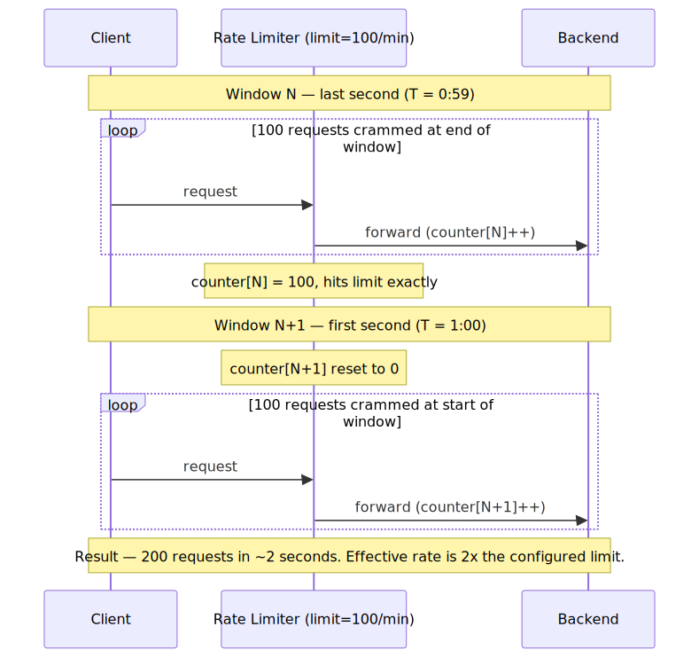
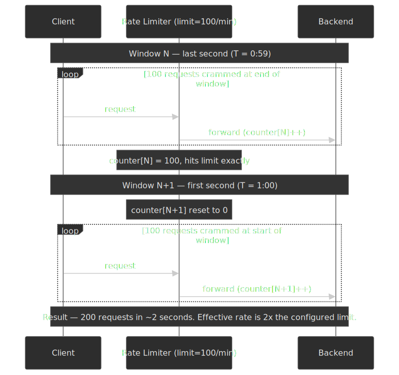

# Rate Limiting Strategies: Token Bucket, Leaky Bucket, and Sliding Window

Rate limiting protects distributed systems from abuse, prevents resource exhaustion, and rations a finite backend across many callers. This article goes deep on five algorithms — their mechanics, memory and accuracy trade-offs, and how AWS, Stripe, Cloudflare, GitHub, NGINX, and Envoy actually deploy them — then shows the distributed coordination patterns that make any of them work past one node. For the full system-design exercise (capacity numbers, fail-open posture, multi-tenant quota tree), see the companion piece [Design an API Rate Limiter](../design-api-rate-limiter/README.md).




## Abstract

Rate limiting answers one question per request: should this request proceed? Three choices determine the answer:

1. **Algorithm.** Token bucket models burst capacity separately from sustained rate. Leaky bucket forces a smooth output regardless of input shape. Fixed window is the simplest counter and the only one with a well-known boundary exploit. Sliding window log is exact but pays O(n) memory. Sliding window counter approximates the log with O(1) memory and ~6% drift on average ([Cloudflare measured 0.003% wrong-decision rate across 400 M requests from 270 K sources](https://blog.cloudflare.com/counting-things-a-lot-of-different-things/)).
2. **State location.** Counters can live in each instance (fast, but `N` instances each enforcing limit `L` collectively allow `N×L`), in shared storage like Redis ([Stripe runs ten Redis Cluster nodes for this](https://brandur.org/redis-cluster)), or split between local approximation and periodic global reconciliation ([Envoy combines local token bucket with a global gRPC service](https://www.envoyproxy.io/docs/envoy/latest/intro/arch_overview/other_features/global_rate_limiting)).
3. **Response.** A 429 alone is not enough. Clients need [`Retry-After`](https://www.rfc-editor.org/rfc/rfc9110#section-10.2.3) and ideally the IETF [`RateLimit-Policy` and `RateLimit`](https://datatracker.ietf.org/doc/html/draft-ietf-httpapi-ratelimit-headers-10) headers so they can self-throttle before they hit the wall.

The hardest part of production rate limiting is rarely the algorithm. It is the keying strategy (what gets a quota — IP, API key, user, endpoint, tenant, or a composite), the layering (per-second + per-minute + per-hour limits stacked together), and the failure mode when the counter store is unreachable.

## Token Bucket

Token bucket is the most widely deployed algorithm because it explicitly separates two concerns: sustained rate and burst capacity.

### Mechanism

A bucket holds tokens up to a maximum capacity `C`. Tokens are added at a constant refill rate `r`. Each request consumes one or more tokens — if enough are available, the request proceeds; otherwise it is rejected.

$$
\text{tokens}(t) = \min\bigl(C,\; \text{tokens}(t_\text{last}) + r \cdot (t - t_\text{last})\bigr)
$$

The dual-parameter design is intentional. Capacity controls burst size — how many requests can arrive simultaneously. Rate controls sustained throughput — the long-term average. A bucket with capacity 100 and rate 10/s allows 100 requests instantly, then 10/s thereafter until the bucket refills.




### Implementation

```ts title="token-bucket.ts" collapse={1-2, 25-30}
// Token bucket implementation with lazy refill
type TokenBucket = { tokens: number; lastRefill: number }

function tryConsume(
  bucket: TokenBucket,
  capacity: number,
  refillRate: number, // tokens per second
  tokensRequested: number = 1,
): boolean {
  const now = Date.now()
  const elapsed = (now - bucket.lastRefill) / 1000

  // Lazy refill: calculate tokens that would have been added since last call.
  bucket.tokens = Math.min(capacity, bucket.tokens + elapsed * refillRate)
  bucket.lastRefill = now

  if (bucket.tokens >= tokensRequested) {
    bucket.tokens -= tokensRequested
    return true
  }
  return false
}

const bucket: TokenBucket = { tokens: 100, lastRefill: Date.now() }
const allowed = tryConsume(bucket, 100, 10, 1) // capacity=100, rate=10/s
```

Lazy refill is the only sane implementation in production: a background timer that ticks per bucket per second is unworkable at scale. Compute how many tokens *would have been* added since the last touch, clamp to capacity, then decide. This makes token bucket O(1) time and O(1) space per client.

### Production configurations

**AWS API Gateway** uses a hierarchical token bucket with four levels of precedence, narrowest to broadest ([API Gateway docs](https://docs.aws.amazon.com/apigateway/latest/developerguide/api-gateway-request-throttling.html)):

| Level | Default | Notes |
| --- | --- | --- |
| Per-client (usage plan) | configurable | Per API key |
| Per-method (stage) | configurable | Per route + HTTP verb |
| Account, per Region | 10,000 RPS / 5,000 burst | Some Regions default to 2,500 / 1,250; raisable via support ([quotas](https://docs.aws.amazon.com/apigateway/latest/developerguide/limits.html)) |
| Region (AWS-managed) | not configurable | Underlying capacity ceiling |

The narrowest applicable limit applies — a stage-level 100 RPS overrides the account-level 10,000 RPS. A `429` response is returned when any bucket is empty.

**Stripe** runs four token-bucket-based limiters in series, each addressing a different failure mode ([Stripe Engineering: *Scaling your API with rate limiters*](https://stripe.com/blog/rate-limiters)):

1. **Request rate limiter** — caps requests per second per identity.
2. **Concurrent requests limiter** — caps in-flight requests per identity (default ~20) to protect CPU-heavy endpoints.
3. **Fleet usage load shedder** — system-state-based; reserves a percentage of fleet capacity (e.g., 20%) for critical methods like `Charges.create` and rejects non-critical traffic with `503` when the reserve is needed.
4. **Worker utilization shedder** — sheds lower-priority traffic (GETs, test mode) when worker pools approach saturation.

The first two count *what callers do*; the last two count *what the fleet can afford*. The split lets Stripe defend availability without conflating an abusive caller with an under-provisioned worker pool.

**NGINX** uses leaky bucket — see the next section. Many NGINX guides label `limit_req` "token bucket" because adding `nodelay` makes the burst behave like one, but the underlying admission model is still leaky bucket per the [official module docs](https://nginx.org/en/docs/http/ngx_http_limit_req_module.html).

### Design rationale

Token bucket exists because real traffic is bursty. Users do not send requests at uniform intervals — they click, read, click again. A strict rate limiter (leaky bucket without queue) would reject legitimate bursts that never threaten the backend.

The trade-off: token bucket allows temporary overload. A backend that handles 100 RPS comfortably on average might not survive 500 simultaneous requests. Capacity tuning requires understanding burst tolerance, not just sustained capacity. A reasonable default is `capacity = sustained_rate × max_acceptable_latency` — set the burst small enough that the worst-case queue time inside the backend stays under your latency budget.

## Leaky Bucket

Leaky bucket enforces smooth, constant-rate output regardless of input burstiness.

### Mechanism

Requests enter a queue (the "bucket"). The queue drains at a fixed rate `r`. If the queue is full, new requests are rejected. Unlike token bucket, leaky bucket does not store burst capacity — it stores *pending* requests. A full bucket means requests are waiting, not that capacity is available.

### Two variants

**Queue-based (original telecom formulation).** Maintains a FIFO queue with fixed capacity. Requests dequeue at rate `r`. This variant physically queues requests and adds latency that is bounded by `queue_size / r`.

**Counter-based.** Tracks a single counter with timestamps. On each request, decrement the counter based on elapsed time, then check whether incrementing would exceed capacity. Excess requests are rejected immediately without queueing.

```ts title="leaky-bucket-counter.ts" collapse={1-2}
type LeakyBucket = { count: number; lastLeak: number }

function tryConsume(
  bucket: LeakyBucket,
  capacity: number,
  leakRate: number, // requests per second
): boolean {
  const now = Date.now()
  const elapsed = (now - bucket.lastLeak) / 1000

  bucket.count = Math.max(0, bucket.count - elapsed * leakRate)
  bucket.lastLeak = now

  if (bucket.count < capacity) {
    bucket.count += 1
    return true
  }
  return false
}
```

### NGINX `limit_req` is leaky bucket

The most widely deployed leaky bucket implementation is NGINX's [`ngx_http_limit_req_module`](https://nginx.org/en/docs/http/ngx_http_limit_req_module.html). The module documentation is explicit: it uses the leaky bucket algorithm.

```nginx title="nginx.conf"
limit_req_zone $binary_remote_addr zone=api:10m rate=10r/s;

server {
    location /api/ {
        limit_req zone=api burst=20 nodelay;
        # 10 r/s sustained, 20-request burst tolerance, no per-request queue delay
    }
}
```

- Without `burst`, excess requests are rejected immediately with `503` (configurable via `limit_req_status`).
- With `burst=N`, up to `N` excess requests are queued and released at the configured rate.
- `nodelay` releases the queued burst *immediately* without per-request spacing, while still consuming the burst slots; slots free up at the leak rate. The combination behaves like a token bucket from the caller's point of view.

> [!TIP]
> If you want true token-bucket semantics with NGINX, use `burst=N nodelay`. If you want strict pacing for a downstream that cannot absorb spikes, use `burst=N` without `nodelay`. If you want a hard rejection at the configured rate, omit `burst` entirely.

### When to use

Leaky bucket suits scenarios that need predictable output:

- **Network traffic shaping** — the original telecommunications use case.
- **Database write batching** — keeps write spikes from saturating storage.
- **Third-party API calls** — staying within strict per-second limits that do not tolerate bursts (many bank, payments, and SMS APIs).

### Trade-offs

- ✅ Smooth, predictable output rate
- ✅ Protects backends from any burst
- ✅ O(1) time and space (counter variant) or O(`burst`) memory (queue variant)
- ❌ Rejects legitimate bursts that the backend could absorb
- ❌ Queue variant adds latency proportional to queue depth
- ❌ Old requests can starve recent ones in the queue variant under sustained overload

## Fixed Window Counter

Fixed window divides time into discrete intervals (a minute, an hour) and counts requests per interval.

### Mechanism

```text
window_id = floor(now / window_duration)
counter[window_id] += 1
if counter[window_id] > limit: reject
```

When the window advances, the counter resets. This is the simplest rate limiting algorithm — increment and compare.

### The boundary problem

Fixed window has one well-known flaw: a caller can achieve up to 2× the configured rate by timing requests at the window boundary.




The exploit is mechanical, not theoretical: a script that polls the server clock and aligns its requests to the window edge can sustain `2 × limit / window_duration` over the boundary indefinitely.

### When acceptable

- Internal services where callers are trusted not to exploit the edge.
- Combined with finer-grained limits — a per-second limit eliminates the per-minute boundary trick.
- Naturally distributed traffic where coordinated bursts at the boundary are unlikely.

**Complexity:** O(1) time, O(1) space per window. The simplest to implement and to debug.

## Sliding Window Log

Sliding window log stores the timestamp of every request, providing exact rate limiting with no boundary exploits.

### Mechanism

```ts title="sliding-window-log.ts" collapse={1-2, 19-22}
type SlidingWindowLog = { timestamps: number[] }

function tryConsume(log: SlidingWindowLog, windowMs: number, limit: number): boolean {
  const now = Date.now()
  const windowStart = now - windowMs

  log.timestamps = log.timestamps.filter((t) => t > windowStart)

  if (log.timestamps.length < limit) {
    log.timestamps.push(now)
    return true
  }
  return false
}

// 100 requests per 60 seconds
const log: SlidingWindowLog = { timestamps: [] }
tryConsume(log, 60_000, 100)
```

### Memory cost

The fatal flaw is O(n) memory where n is the request count inside the window. At 10,000 requests/second with a 60-second window, a single client needs ~600,000 timestamps; at 8 bytes each that is ~4.8 MB. A million such clients would need ~4.8 TB. Even Redis Sorted Sets, which implement this pattern efficiently with `ZADD` + `ZREMRANGEBYSCORE`, struggle at that scale.

### When to use

- Low-volume, high-precision requirements (admin operations, financial settlement).
- Audit logging where you already need exact request history.
- Verification harness for testing approximate algorithms.

## Sliding Window Counter

Sliding window counter approximates the log using O(1) memory. This is the production standard at Cloudflare, GitHub, and most large-scale APIs.

### Mechanism

Maintain counters for the current and previous windows. Weight the previous window's count by the fraction of it that overlaps the trailing portion of the sliding window.

$$
\text{estimate} = \text{count}_{N-1} \cdot \frac{w - t_\text{elapsed}}{w} + \text{count}_N
$$

…where `w` is the window duration and `t_elapsed` is how far into window `N` we currently are.




### Implementation

```ts title="sliding-window-counter.ts" collapse={1-3, 25-30}
type SlidingWindowCounter = {
  currentWindow: number
  currentCount: number
  previousCount: number
}

function tryConsume(counter: SlidingWindowCounter, windowMs: number, limit: number): boolean {
  const now = Date.now()
  const currentWindow = Math.floor(now / windowMs)

  if (currentWindow !== counter.currentWindow) {
    counter.previousCount = currentWindow === counter.currentWindow + 1 ? counter.currentCount : 0
    counter.currentCount = 0
    counter.currentWindow = currentWindow
  }

  const elapsedInWindow = now % windowMs
  const previousWeight = (windowMs - elapsedInWindow) / windowMs
  const estimate = counter.previousCount * previousWeight + counter.currentCount

  if (estimate < limit) {
    counter.currentCount += 1
    return true
  }
  return false
}
```

> [!IMPORTANT]
> When the window advances by more than one (e.g. an idle client), zero out the previous count rather than carrying forward the old `currentCount`. Otherwise a stale window-N count survives as window-N+2's "previous" and inflates the estimate.

### Accuracy

Cloudflare measured the algorithm against an exact log on 400 million requests from 270,000 sources ([*Counting things, a lot of different things*](https://blog.cloudflare.com/counting-things-a-lot-of-different-things/)):

- 0.003% of requests were miscategorised (allowed when they should have been rejected, or vice versa).
- The mean difference between estimated and true rate was 6%.
- All miscategorised allow-decisions were within 15% of the true threshold; no source was rejected when it was below the threshold.

The approximation works because most requests do not arrive exactly at window boundaries. The weighted average smooths the boundary effects that plague fixed windows.

### Trade-offs

- ✅ O(1) memory (two counters per key)
- ✅ O(1) time
- ✅ ~99.997% correct decision rate at scale
- ✅ No boundary exploit
- ❌ Slight undercount immediately after a window flip (the previous count starts decaying from `t_elapsed = 0`)
- ❌ Assumes the previous window's traffic was uniformly distributed — heavy-tailed bursts inside the previous window mute that assumption

## Choosing an algorithm

### Selection matrix

| Factor | Token Bucket | Leaky Bucket | Fixed Window | Sliding Window Log | Sliding Window Counter |
| --- | --- | --- | --- | --- | --- |
| **Burst tolerance** | Excellent (capacity controls it) | None | Up to 2× at boundary | Exact | Good |
| **Memory per client** | O(1) | O(1) (counter) / O(burst) (queue) | O(1) | O(n) | O(1) |
| **Accuracy** | Burst-aware | Strict pacing | Boundary-exploitable | Exact | ~99.997% |
| **Distributed complexity** | Medium | Hard (output ordering) | Easy | Hard (atomic log ops) | Medium |
| **Best for** | User-facing APIs, CDNs | Traffic shaping, downstream protection | Internal/trusted callers, layered with finer limits | Audit, low-volume | General-purpose, high-volume |

### How to choose

- **Token bucket** — traffic is naturally bursty, you want explicit burst-vs-sustained controls, and the backend can absorb temporary overload.
- **Sliding window counter** — you need precision, memory matters, and you do not want a boundary exploit.
- **Leaky bucket** — output must be smooth (bank APIs, SMS gateways, downstream that batches).
- **Fixed window** — only when simplicity dominates and you layer it with another algorithm at a finer time grain (per-second + per-minute is a common pair).
- **Sliding window log** — only when exactness is required and traffic volume is low enough that memory does not bite.

### Keying strategies

The key determines what gets a quota; pick it with as much care as the algorithm.

| Strategy | Pros | Cons | Use case |
| --- | --- | --- | --- |
| **IP address** | No auth required, blunt-force defense | Shared IPs (NAT, mobile carriers, proxies); easy to rotate via VPN/cloud | DDoS mitigation, anonymous endpoints |
| **API key** | Fine-grained, ties to billing tier | Requires key infrastructure | Public APIs with metered tiers |
| **User ID** | Fair per-user limits | Requires authentication on the limited path | Authenticated APIs |
| **Composite (e.g. `user × endpoint`)** | Defense in depth, prevents one user monopolising one endpoint | More keys → more memory, more cache lookups | High-security or expensive-endpoint APIs |

**Multi-layer pattern.** Apply quotas at every level that can fail:

1. Global: `10,000` RPS across all callers — protects shared infrastructure.
2. Per-IP: `100` RPS — anonymous abuse prevention.
3. Per-user: `1,000` RPS — fair sharing.
4. Per-endpoint: varies — protects expensive paths.

The narrowest applicable limit wins. The [GitHub REST API](https://docs.github.com/en/rest/using-the-rest-api/rate-limits-for-the-rest-api) layers a primary per-token quota (5,000 / hour) under a secondary "abuse" quota of about 900 points per minute that throttles even callers who are nowhere near their primary budget.

## Distributed Rate Limiting

Single-instance rate limiting is straightforward. Distributed rate limiting — where N application instances must agree on counts — is where the engineering lives. With no coordination, N instances each enforcing limit `L` collectively allow `N × L`.

 gives exact counts at the cost of a network hop per request. Local approximation gives sub-microsecond decisions at the cost of brief overshoot during sync intervals. Hybrid splits the concern: a per-instance token bucket absorbs bursts, a global service enforces the cluster-wide limit.")


### Shared state with Redis

The default pattern: centralise state in Redis, have every instance read and write the same counters.

**Sliding window log via Sorted Set.** Stripe's original Redis pattern uses a sorted set per key, with the timestamp as the score and a unique request ID as the member.

```lua title="sliding-window-log.lua"
-- KEYS[1] = rate-limit key, ARGV = window_ms, limit, now, request_id
local key = KEYS[1]
local window_ms = tonumber(ARGV[1])
local limit = tonumber(ARGV[2])
local now = tonumber(ARGV[3])
local request_id = ARGV[4]

redis.call('ZREMRANGEBYSCORE', key, 0, now - window_ms)
local count = redis.call('ZCARD', key)

if count < limit then
  redis.call('ZADD', key, now, request_id)
  redis.call('EXPIRE', key, math.ceil(window_ms / 1000))
  return 1
end
return 0
```

The Lua script executes atomically — no other Redis commands interleave between the `ZREMRANGEBYSCORE` and the `ZADD`, eliminating the read-then-write race that plagues the naive client-side version.

**Sliding window counter via two `INCR` keys.** For O(1) memory, use one key per window and weight the previous window's count.

```ts title="redis-sliding-window-counter.ts" collapse={1-4, 25-30}
import Redis from "ioredis"

async function tryConsume(redis: Redis, key: string, windowSec: number, limit: number): Promise<boolean> {
  const now = Date.now()
  const currentWindow = Math.floor(now / 1000 / windowSec)
  const elapsedInWindow = (now / 1000) % windowSec
  const previousWeight = (windowSec - elapsedInWindow) / windowSec

  const [current, previous] = await redis.mget(`${key}:${currentWindow}`, `${key}:${currentWindow - 1}`)
  const estimate = parseInt(previous || "0") * previousWeight + parseInt(current || "0")

  if (estimate < limit) {
    await redis
      .multi()
      .incr(`${key}:${currentWindow}`)
      .expire(`${key}:${currentWindow}`, windowSec * 2)
      .exec()
    return true
  }
  return false
}
```

### The get-then-set race

The naive sequence is an obvious data race:

```text
Time   Client A                       Client B
─────────────────────────────────────────────────
T1     GET counter -> 99
T2                                    GET counter -> 99
T3     check 99 < 100 -> allow
T4     SET counter = 100
T5                                    check 99 < 100 -> allow
T6                                    SET counter = 100   <- wrong: should be 101
```

Both clients observe 99 and both increment to 100. The actual count should be 101.

The fix is to push the entire read-check-write into a single atomic primitive. In Redis, that means a Lua script via `EVAL` or `EVALSHA`; Redis serialises script execution on each shard, so no other commands interleave.

```lua title="atomic-fixed-window.lua"
-- KEYS[1] = key, ARGV[1] = limit, ARGV[2] = window_seconds
local current = tonumber(redis.call('GET', KEYS[1]) or 0)
if current < tonumber(ARGV[1]) then
  redis.call('INCR', KEYS[1])
  redis.call('EXPIRE', KEYS[1], tonumber(ARGV[2]))
  return 1
end
return 0
```

For a single counter `INCR + EXPIRE` is also atomic enough — INCR is single-command and you can simply check the return value. Lua becomes essential when the operation needs more than one read or touches more than one key.

### Stripe's Redis Cluster migration

Stripe initially ran rate limiting on a single Redis instance. The story, in [Brandur Leach's words](https://brandur.org/redis-cluster):

> "We found ourselves in a situation where our rate limiters were saturating a single core and network bandwidth of one Redis instance. We were seeing ambient failures and high latencies."

The fix was to migrate to a 10-node Redis Cluster. Two design decisions made it work:

- **Hash tags for slot affinity.** Redis Cluster splits the keyspace into 16,384 hash slots. By default `CRC16(key) mod 16384` chooses the slot, which spreads related keys across nodes — bad for a Lua script that needs to touch several keys for one user. Wrapping the user identifier in `{}` forces all keys with the same tag onto the same slot:

  ```text
  {user_123}:requests       -> same slot
  {user_123}:concurrent     -> same slot
  {user_456}:requests       -> different slot (different user)
  ```

  Lua scripts can then run on one node without `CROSSSLOT` errors.

- **Scripts shipped via `EVALSHA`.** Each rate limiter Lua script is loaded once via `SCRIPT LOAD` and then invoked by SHA, avoiding per-call script transmission.

The result was horizontal scaling with negligible latency impact, because a script that runs on a single shard takes one network round-trip and a few microseconds of Redis CPU.

### GitHub's sharded, replicated Redis rate limiter

GitHub runs sharded primary-replica Redis with Lua-script atomicity ([GitHub Engineering, *How we scaled the GitHub API with a sharded, replicated rate limiter in Redis*](https://github.blog/engineering/infrastructure/how-we-scaled-github-api-sharded-replicated-rate-limiter-redis/)):

- Writes go to the primary; reads can hit replicas.
- Lua scripts handle every check-and-increment to keep the operation atomic.
- TTLs are set explicitly in the Lua script rather than relying on a separate `EXPIRE` call after the increment, which would race with eviction.

**Timestamp wobble — the bug worth knowing about.** GitHub's `X-RateLimit-Reset` header was originally derived from a Redis `TTL` call combined with the application's `Time.now`. Because measurable time elapses between the two, a second-boundary crossing made consecutive requests return reset timestamps that "wobbled" by 1 second. The fix was to write the `reset_at` value into Redis at window creation and read it back unchanged on subsequent requests; the Redis `EXPIRE` is set to `reset_at + 1 s` purely for cleanup, not for surfacing the reset time.

The lesson: never derive a value from a clock you do not own. Persist the value alongside the counter and read both atomically.

### Local approximation

For latency-sensitive paths, a Redis hop per request may be unacceptable. Local approximation maintains per-instance counters and reconciles globally on a slower cadence.

```ts title="local-approximation.ts" collapse={1-5, 30-50}
type LocalLimiter = {
  count: number
  limit: number
  syncedAt: number
}

class HybridRateLimiter {
  private local: LocalLimiter
  private syncIntervalMs: number
  private globalLimit: number

  constructor(globalLimit: number, syncIntervalMs: number = 1000) {
    this.globalLimit = globalLimit
    this.syncIntervalMs = syncIntervalMs
    this.local = { count: 0, limit: globalLimit, syncedAt: Date.now() }
  }

  async tryConsume(): Promise<boolean> {
    const now = Date.now()

    if (now - this.local.syncedAt > this.syncIntervalMs) {
      await this.sync()
    }

    if (this.local.count < this.local.limit) {
      this.local.count++
      return true
    }
    return false
  }

  private async sync(): Promise<void> {
    // Push local count to Redis, read back the global usage, recompute local budget.
  }
}
```

**Trade-off.** Between syncs, the cluster can collectively exceed the limit by `instances × per_instance_overshoot`. Tune the sync interval against acceptable overage. With 100 instances and a 1-second sync, a 1,000 RPS global limit can briefly become 100,000 RPS if every instance is saturated — usually acceptable for fairness limits, never for safety limits.

**Envoy's hybrid model** sits at the cleaner end of this spectrum ([Envoy global rate limiting docs](https://www.envoyproxy.io/docs/envoy/latest/intro/arch_overview/other_features/global_rate_limiting)):

- The [`local_ratelimit` filter](https://www.envoyproxy.io/docs/envoy/latest/configuration/http/http_filters/local_rate_limit_filter) implements a per-instance token bucket that absorbs bursts immediately.
- The `ratelimit` filter delegates to a separate gRPC [Rate Limit Service](https://github.com/envoyproxy/ratelimit) (typically Go + Redis) for cluster-wide enforcement.
- Local limits are tuned more permissively than global limits; the local bucket exists to keep traffic spikes off the global service, not to be the primary limiter.

### Cloudflare's edge architecture

Cloudflare runs rate limiting across [330+ data centres in 125+ countries](https://www.cloudflare.com/network/). Their original approach ([*Counting things, a lot of different things*](https://blog.cloudflare.com/counting-things-a-lot-of-different-things/)):

- **No global state.** Each PoP runs an isolated rate limiter.
- **Anycast routing as natural sharding.** A given client IP typically routes to the same PoP, giving each PoP a coherent view of "its" callers.
- **Twemproxy + Memcached** within each PoP. Twemproxy fan-outs counter operations across a Memcached cluster using consistent hashing; the cluster is the per-PoP shared store.
- **Asynchronous increments.** The hot path does not block on the counter update; the increment is fire-and-forget.
- **Mitigation flag caching.** Once a client crosses the threshold, the "blocked" state is cached in each edge server's local memory so subsequent requests can be rejected without another Memcached lookup.

The newer in-house Pingora proxy uses a different counting primitive: [`pingora-limits` is built on Count-Min Sketch](https://blog.cloudflare.com/how-pingora-keeps-count/), a probabilistic data structure that estimates per-key event counts in fixed memory. The sketch trades a small overestimation bias for lock-free, allocation-free updates at the per-request hot path.

The shared lesson is that at edge scale, exact global counts are not worth the latency. Approximate, locally-coherent counts that handle the 99% case in microseconds beat exact counts that add a cross-region round-trip.

## Real-World Examples

### Discord — bucket-keyed limits

[Discord's REST API](https://docs.discord.com/developers/topics/rate-limits) limits per *bucket* rather than per endpoint. The server tags each response with the bucket identity so clients can tell which routes share a quota.

```http
X-RateLimit-Bucket: abc123def456
X-RateLimit-Limit: 5
X-RateLimit-Remaining: 4
X-RateLimit-Reset: 1640995200.000
X-RateLimit-Reset-After: 1.234
X-RateLimit-Scope: user
```

Two `POST /channels/{id}/messages` calls to different channels may share a single bucket — the bucket header tells the client to throttle as if they were the same endpoint. A separate **global** limit caps each bot (or each unauthenticated IP) at 50 requests/second across all routes; the response includes `X-RateLimit-Scope: global` and `X-RateLimit-Global: true` when that limit fires. Discord additionally enforces an "invalid request" budget of 10,000 4xx/5xx responses per 10 minutes per IP that, if exceeded, triggers a temporary Cloudflare-level ban.

### GitHub — tiered limits with secondary throttles

[GitHub's REST API](https://docs.github.com/en/rest/using-the-rest-api/rate-limits-for-the-rest-api) operates explicit tiers:

| Tier | Primary limit | Notes |
| --- | --- | --- |
| Unauthenticated (per IP) | 60 / hour | Public read endpoints only |
| Authenticated (PAT, OAuth, GitHub App) | 5,000 / hour | Per token / installation |
| GitHub App on Enterprise Cloud organization | 15,000 / hour | Enterprise add-on; PATs are excluded |
| GitHub App installation (non-Enterprise) | scales with users + repos, up to 12,500 / hour | App-managed |

A separate "secondary" rate limit caps roughly 900 points/minute on REST and limits concurrent in-flight requests independently of the primary budget — GitHub explicitly recommends staying under both.

### Stripe — load-shedding hierarchy

Stripe's four-layer scheme (covered above) is interesting because three of the four limiters do not count *your* traffic — they count *fleet state*. The fleet load shedder kicks in when overall utilisation crosses a threshold, the worker shedder kicks in when worker thread pools fill. Each layer can be disabled independently via feature flag for incident response, and new limits are dark-launched (counted but not enforced) before they go live.

## Error Responses and Client Guidance

### HTTP 429 and core headers

A 429 response that does not tell the client *when* to come back is barely better than a connection reset. At minimum, return `Retry-After`.

```http
HTTP/1.1 429 Too Many Requests
Retry-After: 30
Content-Type: application/problem+json

{
  "type": "https://example.com/probs/rate-limit",
  "title": "Rate limit exceeded",
  "detail": "Retry after 30 seconds",
  "retry_after": 30
}
```

[`Retry-After`](https://www.rfc-editor.org/rfc/rfc9110#section-10.2.3) accepts either delta-seconds or an HTTP-date. Prefer delta-seconds — it sidesteps clock-skew between client and server, which is otherwise a real source of repeated 429s for callers whose clocks are minutes off.

```http
Retry-After: 30                                   # good — relative
Retry-After: Wed, 01 Jan 2025 00:00:30 GMT        # risky — depends on client clock
```

### IETF RateLimit headers

The current Internet-Draft [draft-ietf-httpapi-ratelimit-headers-10](https://datatracker.ietf.org/doc/html/draft-ietf-httpapi-ratelimit-headers-10) (published September 2025; the draft has since expired without RFC publication, but the specification is the canonical interoperability target) defines two header fields, both encoded using [HTTP Structured Fields (RFC 9651)](https://www.rfc-editor.org/rfc/rfc9651). The headers separate *policy* (what the server allows) from *state* (current usage for a named policy), and a single response can carry several policies.

```http
RateLimit-Policy: "burst";q=100;w=60, "daily";q=1000;w=86400
RateLimit: "burst";r=45;t=30
```

| Header / parameter | Meaning |
| --- | --- |
| `RateLimit-Policy` | List of named quota policies the server enforces. |
| `q` | Quota — the policy's allowance per window. |
| `w` | Window length, in seconds. |
| `qu` | Optional quota unit (default `"requests"`; can be e.g. `"content-bytes"`). |
| `pk` | Optional partition key (Structured Fields byte sequence) identifying the partition the quota is computed against. |
| `RateLimit` | Current state for one or more of the named policies. |
| `r` | Remaining quota in the named policy. |
| `t` | Time, in seconds, until the quota resets. |

> [!NOTE]
> Earlier drafts (and many production deployments) use the legacy three-header form `RateLimit-Limit`, `RateLimit-Remaining`, `RateLimit-Reset`. Several major APIs (GitHub, Twitter/X, Discord) still emit some variant of these. New servers should prefer the draft-10 syntax; client libraries that consume both styles are common.

The split between policy and state lets clients self-throttle proactively. A client that sees `r=5;t=12` knows it can send a few more requests now and should pause before the window resets, without guessing at the underlying quota.

### Client-side practices

Well-behaved clients implement the following in roughly this order of impact:

1. **Honour `Retry-After`** — never retry before it expires.
2. **Exponential backoff with jitter** — when no `Retry-After` is provided, wait `min(2^attempt × base, max) ± jitter` before the next attempt to avoid a thundering herd.
3. **Proactive throttling** — track `RateLimit: ...;r=...;t=...` and slow down before exhaustion rather than after.
4. **Bucket awareness** — for APIs that publish bucket headers (Discord, some GitHub endpoints), throttle by bucket identity so requests to different routes do not double-spend the same quota.

```ts title="client-rate-limiting.ts" collapse={1-3, 25-30}
async function fetchWithRateLimit(url: string, maxRetries: number = 5): Promise<Response> {
  for (let attempt = 0; attempt < maxRetries; attempt++) {
    const response = await fetch(url)

    if (response.status !== 429) {
      return response
    }

    const retryAfter = response.headers.get("Retry-After")
    const baseMs = retryAfter ? parseInt(retryAfter) * 1000 : Math.min(1000 * Math.pow(2, attempt), 60_000)
    const jitter = baseMs * 0.1 * (Math.random() * 2 - 1)
    await sleep(baseMs + jitter)
  }
  throw new Error("Rate limit exceeded after max retries")
}
```

## Common Pitfalls

### 1. Trusting client-controlled identifiers for keying

**Mistake.** Using `X-Forwarded-For` directly, or trusting client timestamps, when keying limits.

**Why it bites.** Both are easily forged. An attacker rotates `X-Forwarded-For` values to get fresh quota each request.

**Fix.** Get the client IP from a header your edge proxy *sets* (after stripping caller-supplied versions) and use server-side timestamps. RFC 9110's `Forwarded` header solves the multi-hop case but is also only trustworthy after edge sanitisation.

### 2. Per-instance instead of distributed limits

**Mistake.** Each app instance counts independently.

**Why it bites.** With N instances, callers get N× the intended rate.

**Fix.** Move the counter to Redis (or any shared store) and use atomic primitives (Lua, `INCR`). If Redis hops are too slow, use Envoy-style hybrid: local token bucket for bursts + global service for the cluster-wide limit.

### 3. Fixed window without finer-grained companions

**Mistake.** A single fixed-window limit is the only enforcement.

**Why it bites.** The boundary trick lets a script sustain 2× the configured rate.

**Fix.** Migrate to sliding window counter, or layer a per-second limit under the per-minute one. The per-second cap eliminates the boundary trick because the boundary becomes too narrow to exploit.

### 4. Rejecting all bursts

**Mistake.** Every request that exceeds the sustained rate gets a 429.

**Why it bites.** Real user traffic is bursty. Rejecting legitimate spikes hurts the experience even when the backend has headroom.

**Fix.** Token bucket with appropriate burst capacity, or NGINX `burst=N nodelay`. Size the burst to whatever the backend can absorb without exceeding its latency budget.

### 5. Cardinality explosion

**Mistake.** Keying by per-request-ID, per-session-ID, or any other unbounded identifier.

**Why it bites.** Memory grows with active identities. Counter store evicts under pressure, taking quotas with it.

**Fix.** Key by lower-cardinality identities (user, IP, API key, tenant). Set aggressive TTLs so idle keys get evicted promptly. Compose finer keys (e.g. `user × endpoint`) only when you have a clear reason to and know the steady-state cardinality.

### 6. Returning 429 without `Retry-After`

**Mistake.** Just the status code.

**Why it bites.** Clients have no signal for when to come back; they retry immediately and stay rate-limited indefinitely.

**Fix.** Always set `Retry-After`. Add IETF `RateLimit-Policy` and `RateLimit` headers when callers can act on them.

### 7. Failing closed when the counter store is unreachable

**Mistake.** When Redis is down, reject all traffic.

**Why it bites.** Your rate limiter outage becomes your API outage.

**Fix.** Fail open with a circuit breaker. The downside (briefly missing the limit) is almost always better than the alternative (full availability loss). The companion article on [system design](../design-api-rate-limiter/README.md) covers fail-open posture in detail.

## Conclusion

Rate limiting protects systems by controlled rejection. The algorithm choice depends on burst tolerance (token bucket allows them, leaky bucket does not), precision requirements (sliding window counter beats fixed window), and memory constraints (sliding window log is precise but expensive).

For most production APIs, the defensible default is:

- **Sliding window counter or token bucket** for the algorithm, depending on whether bursts are first-class.
- **Redis with Lua scripts** for the shared counter store, and hash tags if you need to cluster.
- **IETF `RateLimit-Policy` + `RateLimit` headers** in addition to `Retry-After` so clients can self-throttle.
- **Layered limits** — global, per-IP, per-user, per-endpoint — narrowest applicable wins.
- **Fail-open** when the counter store is unreachable, with monitoring to surface the degradation.

The hardest part is rarely the algorithm. It is keying (which identity gets a quota), layering (per-second + per-minute + per-hour stacked), and the response payload (a 429 with no headers is barely better than a connection reset).

## Appendix

### Prerequisites

- Familiarity with HTTP status codes and headers.
- Working knowledge of Redis data structures (`INCR`, `EXPIRE`, sorted sets) and the `EVAL` Lua execution model.
- Conceptual grasp of distributed coordination — eventual vs strong consistency, atomic primitives, sharding.

### Terminology

- **Bucket capacity** — maximum tokens a token bucket can hold; controls burst size.
- **Refill / leak rate** — tokens added (token bucket) or drained (leaky bucket) per time unit; controls sustained throughput.
- **Window** — the time interval over which requests are counted.
- **Keying** — the identity used to group requests for limiting (IP, user, API key, composite).
- **Hash tag** — Redis Cluster syntax (`{user_123}:requests`) that forces related keys onto the same shard.
- **Jitter** — random variation added to retry delays to prevent thundering herd.
- **Mitigation flag** — Cloudflare's per-edge cached "this client is currently blocked" signal that short-circuits subsequent counter lookups.

### Summary

- Token bucket separates burst capacity from sustained rate; use it when traffic is bursty.
- Sliding window counter gives ~99.997% accuracy on real Cloudflare traffic at O(1) memory.
- Fixed window has a boundary exploit that doubles the effective rate at window edges.
- Distributed limits need shared state (Redis) or local approximation with reconciliation.
- Use Lua scripts in Redis to make read-check-write atomic; without them you have a data race.
- Always return 429 with `Retry-After`; prefer the IETF `RateLimit-Policy` + `RateLimit` headers for proactive client throttling.
- Fail open on counter-store outages; the alternative is converting your limiter outage into an API outage.

### References

- [draft-ietf-httpapi-ratelimit-headers-10](https://datatracker.ietf.org/doc/html/draft-ietf-httpapi-ratelimit-headers-10) — IETF RateLimit headers, current draft (Sep 2025).
- [RFC 9110 §10.2.3 — `Retry-After`](https://www.rfc-editor.org/rfc/rfc9110#section-10.2.3) — semantics and acceptable values.
- [RFC 9651](https://www.rfc-editor.org/rfc/rfc9651) — HTTP Structured Fields, used by the new RateLimit headers.
- [Stripe Engineering — *Scaling your API with rate limiters*](https://stripe.com/blog/rate-limiters) — four-layer load-shedding architecture.
- [Brandur Leach — *Scaling a high-traffic rate limiting stack with Redis Cluster*](https://brandur.org/redis-cluster) — Stripe's single-node-to-cluster migration.
- [Cloudflare — *How we built rate limiting capable of scaling to millions of domains*](https://blog.cloudflare.com/counting-things-a-lot-of-different-things/) — sliding window counter accuracy data, Twemproxy + Memcached architecture.
- [Cloudflare — *How Pingora keeps count*](https://blog.cloudflare.com/how-pingora-keeps-count/) — Count-Min Sketch in production.
- [GitHub Engineering — *How we scaled the GitHub API with a sharded, replicated rate limiter in Redis*](https://github.blog/engineering/infrastructure/how-we-scaled-github-api-sharded-replicated-rate-limiter-redis/) — timestamp wobble fix.
- [GitHub REST API rate limit docs](https://docs.github.com/en/rest/using-the-rest-api/rate-limits-for-the-rest-api) — current tier breakdown and secondary limits.
- [NGINX `ngx_http_limit_req_module`](https://nginx.org/en/docs/http/ngx_http_limit_req_module.html) — leaky bucket, `burst`, and `nodelay`.
- [AWS API Gateway — request throttling](https://docs.aws.amazon.com/apigateway/latest/developerguide/api-gateway-request-throttling.html) and [quotas](https://docs.aws.amazon.com/apigateway/latest/developerguide/limits.html) — hierarchical token bucket.
- [Envoy — global rate limiting](https://www.envoyproxy.io/docs/envoy/latest/intro/arch_overview/other_features/global_rate_limiting) and [local rate limit filter](https://www.envoyproxy.io/docs/envoy/latest/configuration/http/http_filters/local_rate_limit_filter).
- [envoyproxy/ratelimit](https://github.com/envoyproxy/ratelimit) — reference Go/gRPC rate limit service.
- [Discord developer docs — rate limits](https://docs.discord.com/developers/topics/rate-limits) — bucket-based REST limits and global cap.
