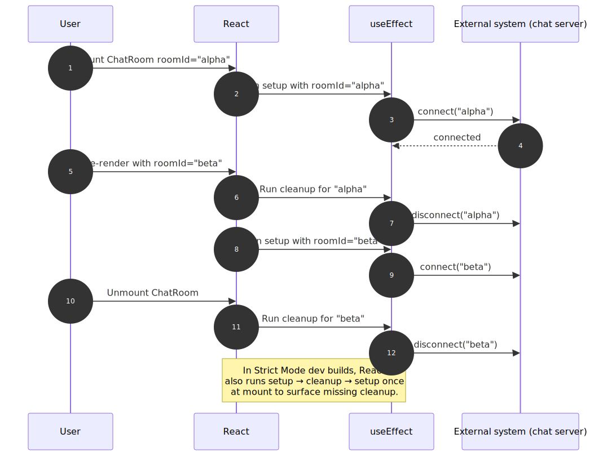
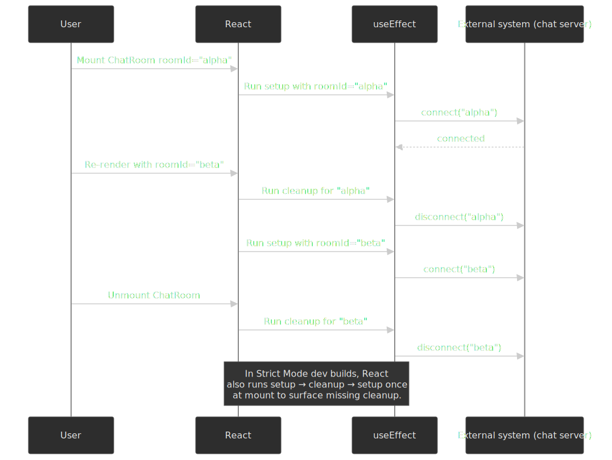
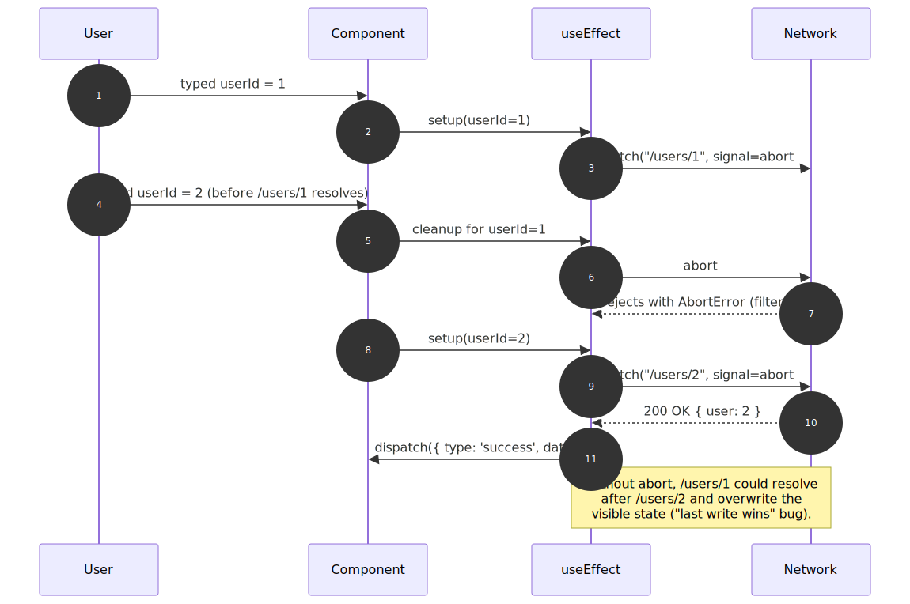
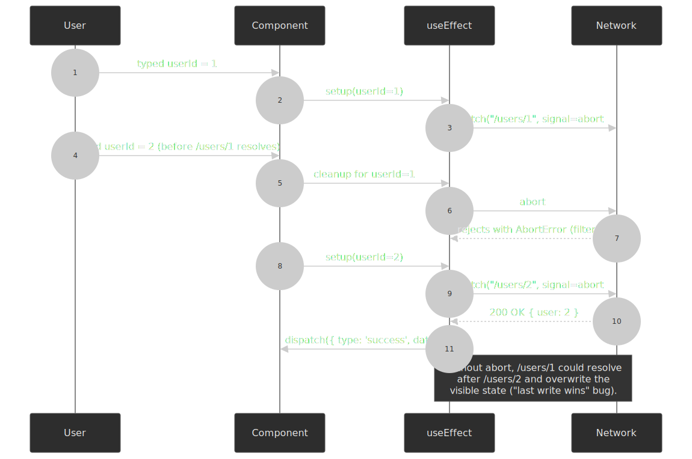

# React Hooks Fundamentals: Rules, Core Hooks, and Custom Hooks

React Hooks let functional components own state and side effects without classes. Introduced in [React 16.8 in February 2019](https://react.dev/blog/2019/02/06/react-v16.8.0), hooks are now the default API for components. This is part one of a two-article series; specialized concurrent hooks (`useTransition`, `useDeferredValue`, `useLayoutEffect`, `useSyncExternalStore`, `useId`, `use`) live in [React Hooks Advanced Patterns](../react-hooks-advanced-patterns/README.md). This article covers the architectural principles, core hooks, and patterns you reach for daily.




## Abstract

Hooks solve three problems that plagued class components: logic fragmentation across lifecycle methods, wrapper hell from HOCs (Higher-Order Components) and render props, and the cognitive overhead of JavaScript's `this` binding.

The core mental model:

- **Hooks are call-order dependent**: React stores hook state in a linked list, using call position (not names) to associate state with hooks. This enables custom hooks to have independent state without key collisions.
- **Effects are synchronization, not lifecycle**: `useEffect` keeps external systems in sync with React state. Think "synchronize chat connection with `roomId`" not "run code on mount."
- **Memoization breaks render cascades**: `useMemo` and `useCallback` preserve referential equality to prevent unnecessary re-renders of memoized children—not to optimize individual calculations.
- **Custom hooks compose without collision**: Because each hook call gets its own slot in the linked list, two hooks using the same internal hook don't conflict.

As of [React 19 (released 2024-12-05)](https://react.dev/blog/2024/12/05/react-19), new hooks like `useActionState`, `useOptimistic`, and the `use` API extend hooks to handle async data and form actions natively.

## Why Hooks Exist: The Class Component Problems

Before React 16.8, class components had three architectural problems that hooks were designed to solve:

**1. Logic Fragmentation**: A single concern (like a data subscription) was scattered across `componentDidMount` (setup), `componentDidUpdate` (sync on prop change), and `componentWillUnmount` (cleanup). Hooks co-locate related logic in a single `useEffect` call.

**2. Wrapper Hell**: HOCs and render props solved reuse but created deeply nested hierarchies (the "pyramid of doom") that were hard to debug. Custom hooks extract logic without adding wrapper components.

**3. `this` Binding**: Class methods required explicit binding or arrow function class properties. Hooks eliminate `this` entirely—components are just functions.

> **Design rationale**: The React team considered alternatives like mixins (rejected due to the "diamond problem" of conflicting method names) and render props (rejected because they still add nesting). Hooks' call-order design naturally avoids these issues. The full proposal lives in [React RFC #68: React Hooks](https://github.com/reactjs/rfcs/blob/main/text/0068-react-hooks.md); Dan Abramov's ["Why Do Hooks Rely on Call Order?"](https://overreacted.io/why-do-hooks-rely-on-call-order/) is the longer-form companion.

## The Rules of Hooks: Why Call Order Matters

Hooks have [two rules](https://react.dev/reference/rules/rules-of-hooks) that stem from a single implementation decision: React tracks hook state in a **linked list of slots indexed by call order**, not by name. Each slot is owned by the fiber for the current component instance, so the same component rendered in two places gets two independent lists.




### Rule 1: Only Call Hooks at the Top Level

React associates `useState(0)` with "the first hook call" and `useState("")` with "the second hook call." If the order changes between renders, state gets misassigned.

```tsx title="hook-rules-violation.tsx" collapse={1-2}
// ❌ Conditional hook call: order changes when `condition` flips
function BadComponent({ condition }) {
  const [count, setCount] = useState(0) // Always slot 0

  if (condition) {
    useEffect(() => console.log("effect")) // Sometimes slot 1
  }

  const [name, setName] = useState("") // Slot 1 or 2 depending on condition
}
```

When `condition` changes from `true` to `false`, React expects slot 1 to be `useEffect` but finds `useState`—state corruption occurs.

```tsx title="hook-rules-correct.tsx" collapse={1-2}
// ✅ Condition inside the hook, not around it
function GoodComponent({ condition }) {
  const [count, setCount] = useState(0) // Always slot 0
  const [name, setName] = useState("") // Always slot 1

  useEffect(() => {
    if (condition) console.log("effect") // Always slot 2
  }, [condition])
}
```

**Why this design?** The React team evaluated alternatives:

- **String keys**: Name collisions when composing hooks (two hooks using the same internal state key)
- **Symbol keys**: Can't call the same hook twice (both calls share one Symbol)
- **Manual composition**: Forces developers to manage keys through all layers

Call order solves all three: each call gets its own slot, no keys needed, no collisions.

### Rule 2: Only Call Hooks from React Functions

Hooks can only be called from function components or custom hooks (functions starting with `use`). This ensures React is in the middle of rendering when hooks are called, so it can properly track state.

The `eslint-plugin-react-hooks` plugin enforces both rules statically.

## Core Hooks

### useState: State as a Snapshot

`useState` adds local state to a component. The setter triggers a re-render with the new value.

```tsx title="useState-basics.tsx"
const [count, setCount] = useState(0) // Returns [currentValue, setter]
```

**Critical behavior**: State is a snapshot frozen at render time. The setter queues a re-render; it doesn't mutate immediately.

```tsx title="useState-snapshot.tsx" collapse={1-2}
// Each click only increments by 1, not 3
function Counter() {
  const [count, setCount] = useState(0)

  function handleClick() {
    setCount(count + 1) // Queues: set to 0 + 1
    setCount(count + 1) // Queues: set to 0 + 1 (count is still 0!)
    setCount(count + 1) // Queues: set to 0 + 1
  }
}
```

**Functional updates** solve the stale closure problem by receiving the latest state:

```tsx title="useState-functional-update.tsx" collapse={1-2}
// Each call sees the updated value—increments by 3
function Counter() {
  const [count, setCount] = useState(0)

  function handleClick() {
    setCount((c) => c + 1) // 0 → 1
    setCount((c) => c + 1) // 1 → 2
    setCount((c) => c + 1) // 2 → 3
  }
}
```

**Automatic batching (React 18+)**: When mounted with `createRoot`, React batches every `setState` call inside a single synchronous turn into one render — including updates inside `setTimeout`, microtasks, promise `.then` handlers, and native event listeners. Pre-18 only batched inside React event handlers; everything else triggered a render per call. The change is described in the [React 18 working group's automatic batching note](https://github.com/reactwg/react-18/discussions/21). When you need to read DOM after a specific update, call [`flushSync`](https://react.dev/reference/react-dom/flushSync) to opt one update out of the batch.

**Object state**: React uses [`Object.is`](https://react.dev/reference/react/useState#caveats) to detect changes. Mutating an object and calling the setter won't trigger a re-render because the reference hasn't changed.

```tsx title="useState-object-mutation.tsx"
// ❌ Mutation: React sees same reference, skips re-render
obj.x = 10
setObj(obj)

// ✅ Replacement: new reference triggers re-render
setObj({ ...obj, x: 10 })
```

**Lazy initialization**: Pass a function (not its result) when the initial value is expensive to compute. React only calls it on the first render.

```tsx title="useState-lazy-init.tsx"
// ❌ createTodos() runs every render (result ignored after first)
const [todos, setTodos] = useState(createTodos())

// ✅ createTodos runs for the initial render
// In Strict Mode development builds, React may call it twice to verify purity.
const [todos, setTodos] = useState(createTodos)
```

### useReducer: Centralized State Transitions

`useReducer` extracts state update logic into a pure function. Useful when state transitions are complex or interdependent.

```tsx title="useReducer-basics.tsx"
const [state, dispatch] = useReducer(reducer, initialState)
```

**When to choose useReducer over useState:**

| Scenario                                    | useState             | useReducer          |
| ------------------------------------------- | -------------------- | ------------------- |
| Independent values                          | ✅ Simpler           | Overkill            |
| Interdependent state (form with validation) | Scattered logic      | ✅ Centralized      |
| Complex transitions (state machine)         | Hard to follow       | ✅ Explicit actions |
| Testing state logic                         | Coupled to component | ✅ Pure function    |

```tsx title="form-reducer.tsx" collapse={1-14, 26-30}
type FormState = {
  email: string
  password: string
  errors: Record<string, string>
  isSubmitting: boolean
}

type FormAction =
  | { type: "SET_FIELD"; field: string; value: string }
  | { type: "SET_ERRORS"; errors: Record<string, string> }
  | { type: "SUBMIT_START" }
  | { type: "SUBMIT_END" }
  | { type: "RESET" }

const initialState: FormState = {
  email: "",
  password: "",
  errors: {},
  isSubmitting: false,
}

function formReducer(state: FormState, action: FormAction): FormState {
  switch (action.type) {
    case "SET_FIELD":
      return { ...state, [action.field]: action.value, errors: {} }
    case "SET_ERRORS":
      return { ...state, errors: action.errors, isSubmitting: false }
    case "SUBMIT_START":
      return { ...state, isSubmitting: true, errors: {} }
    case "SUBMIT_END":
      return { ...state, isSubmitting: false }
    case "RESET":
      return initialState
  }
}
```

The reducer is a pure function—easy to unit test without rendering a component.

### useEffect: Synchronization, Not Lifecycle

**Mental model shift**: Don't think "run on mount/unmount." Think "synchronize external system X with React state Y."

```tsx title="useEffect-sync-model.tsx" collapse={1-2}
// "Keep chat connection in sync with roomId"
function ChatRoom({ roomId }) {
  useEffect(() => {
    const connection = createConnection(roomId)
    connection.connect()
    return () => connection.disconnect() // Cleanup before re-sync
  }, [roomId]) // Re-sync when roomId changes
}
```

When `roomId` changes: cleanup runs (disconnect old room) → setup runs (connect new room). This is synchronization, not lifecycle.




**Dependency array behavior:**

```tsx title="useEffect-dependencies.tsx"
useEffect(() => { ... })           // Re-runs after every render (rare)
useEffect(() => { ... }, [])       // Runs once after initial render
useEffect(() => { ... }, [a, b])   // Re-runs when a or b changes (Object.is)
```

**Common bugs:**

| Bug            | Cause                                         | Fix                                           |
| -------------- | --------------------------------------------- | --------------------------------------------- |
| Stale closure  | Missing dependency                            | Add to array or use functional update         |
| Infinite loop  | Object/function in deps recreated each render | `useMemo`/`useCallback` or move inside effect |
| Memory leak    | No cleanup for subscription/timer             | Return cleanup function                       |
| Race condition | Async result applied after newer request      | Use `ignore` flag pattern                     |

```tsx title="useEffect-race-condition.tsx" collapse={1-2}
// Race condition fix: ignore stale responses
function Profile({ userId }) {
  const [user, setUser] = useState(null)

  useEffect(() => {
    let ignore = false
    fetchUser(userId).then((data) => {
      if (!ignore) setUser(data) // Only apply if still current
    })
    return () => {
      ignore = true
    }
  }, [userId])
}
```

**Strict Mode double-invocation**: In development, [`<StrictMode>` mounts, unmounts, then remounts components](https://react.dev/reference/react/StrictMode#fixing-bugs-found-by-re-running-effects-in-development) so every effect's setup/cleanup pair runs at least once at mount. If your effect breaks on remount, it is missing cleanup — production builds skip this and your bug ships silently.

### useRef: Mutable Values Outside the Render Cycle

`useRef` returns a mutable object `{ current: value }` that persists across renders without triggering re-renders when mutated.

**Two use cases:**

1. **DOM access**: Get a reference to a DOM node
2. **Instance variables**: Store values that shouldn't trigger re-renders (timers, previous values, flags)

```tsx title="useRef-dom.tsx" collapse={1-2}
// DOM reference for imperative focus
function TextInput() {
  const inputRef = useRef<HTMLInputElement>(null)
  return (
    <>
      <input ref={inputRef} />
      <button onClick={() => inputRef.current?.focus()}>Focus</button>
    </>
  )
}
```

```tsx title="useRef-timer.tsx" collapse={1-2}
// Store interval ID without causing re-renders
function Timer() {
  const intervalRef = useRef<ReturnType<typeof setInterval> | null>(null)

  useEffect(() => {
    intervalRef.current = setInterval(() => console.log("tick"), 1000)
    return () => {
      if (intervalRef.current !== null) clearInterval(intervalRef.current)
    }
  }, [])
}
```

> [!NOTE]
> React 19's `@types/react` removed the no-argument `useRef<T>()` overload — every `useRef` call must pass an explicit initial value (typically `null`). The migration is documented in the [React 19 upgrade guide](https://react.dev/blog/2024/04/25/react-19-upgrade-guide#ref-cleanup-required).

**Key distinction from state**: Mutating `ref.current` doesn't schedule a re-render. Use state when the UI should reflect the value; use refs for values that don't affect rendering.

### useContext: Read Context Without Prop Drilling

`useContext` reads the value of a context object created by `createContext`. It subscribes the calling component to the nearest matching `<Context.Provider>` ancestor; when that provider's `value` prop changes (compared with `Object.is`), every consumer re-renders.

```tsx title="useContext-basics.tsx" collapse={1-2}
const ThemeContext = createContext<"light" | "dark">("light")

function App() {
  return (
    <ThemeContext.Provider value="dark">
      <Toolbar />
    </ThemeContext.Provider>
  )
}

function Toolbar() {
  const theme = useContext(ThemeContext) // "dark"
  return <div className={`toolbar toolbar-${theme}`} />
}
```

Two non-obvious behaviors that bite in production:

- **All consumers re-render when `value` changes**, even if they only read one field of an object value. The fix is to split the context (one for state, one for setters) or memoize the provider's `value` so unrelated parents don't recreate it on every render. The [React docs on optimizing re-renders](https://react.dev/reference/react/useContext#optimizing-re-renders-when-passing-objects-and-functions) walk through both patterns.
- **Provider lookup is lexical, not by component identity**. Two `<ThemeContext.Provider value="dark">` ancestors in different subtrees produce different live values to their respective subtrees — context is _not_ a singleton.

In React 19, the equivalent of `useContext(MyContext)` can also be written as [`use(MyContext)`](https://react.dev/reference/react/use), which is the only hook permitted inside conditionals and loops. `useContext` itself still follows the standard rules.

## Performance Hooks: Memoization

### The Referential Equality Problem

Objects and functions are recreated on every render. If passed to a `memo()`-wrapped child, the child re-renders because `{} !== {}`.

```tsx title="referential-equality.tsx" collapse={1-2}
// Child re-renders on every parent render, even if props are "the same"
function Parent() {
  const [count, setCount] = useState(0)
  const style = { color: "blue" } // New object each render
  const onClick = () => console.log("hi") // New function each render
  return <MemoizedChild style={style} onClick={onClick} />
}
```

### useMemo: Cache Expensive Values

`useMemo` caches a computed value until dependencies change.

```tsx title="useMemo-basics.tsx"
const filtered = useMemo(() => items.filter((item) => item.matches(query)), [items, query])
```

**When to use:**

1. **Expensive calculations**: Filter/map over large arrays, complex transformations (>1ms)
2. **Referential equality for props**: Prevent re-renders of memoized children
3. **Dependencies of other hooks**: Stable object reference for `useEffect` deps

**When NOT to use:** Simple calculations like `a + b`. The overhead of memoization exceeds the cost.

### useCallback: Cache Functions

`useCallback` is `useMemo` for functions: `useCallback(fn, deps)` ≡ `useMemo(() => fn, deps)`.

```tsx title="useCallback-basics.tsx" collapse={1-2}
// Stable function reference for memoized child
function Parent() {
  const [count, setCount] = useState(0)

  const handleClick = useCallback(() => {
    setCount((c) => c + 1) // Updater function avoids `count` dependency
  }, [])

  return <MemoizedButton onClick={handleClick} />
}
```

**When to use:** Functions passed to `memo()`-wrapped children or used as `useEffect` dependencies.

### React Compiler (React 19+)

The [React Compiler reached Release Candidate on 2025-04-21](https://react.dev/blog/2025/04/21/react-compiler-rc) and is considered safe for production. It is a build-time Babel plugin that statically analyses components, then inserts memoization for values, functions, and JSX trees so re-renders only recompute what actually depends on changed inputs. Compiler-aware diagnostics now ship inside `eslint-plugin-react-hooks`.

When the compiler is enabled, manual `useMemo` and `useCallback` calls become an escape hatch rather than a default. Keep reaching for them in code the compiler explicitly opts out of (via the `"use no memo"` directive), in performance-critical paths where you want guaranteed memoization independent of the compiler version, and in libraries that must work with consumers who do not run the compiler.

## Custom Hooks

Custom hooks extract reusable stateful logic. A function starting with `use` that calls other hooks is a custom hook.

**Design principles:**

1. **Single responsibility**: One hook, one concern
2. **Composition**: Build complex hooks from simpler hooks
3. **Stable API**: Consistent return shape across versions

```tsx title="custom-hook-composition.tsx" collapse={1-2}
// Compose focused hooks rather than building monoliths
function useUserData(userId: string) {
  const { data, error, isLoading } = useFetch(`/api/users/${userId}`)
  const cached = useCache(data, `user-${userId}`)
  return { user: cached ?? data, error, isLoading }
}
```

Each hook call gets its own state slot—no conflicts even if two hooks internally use `useState`.

## Production Custom Hooks

### usePrevious: Track Previous Values

Returns the value from the previous render. Useful for comparisons, animations, and change detection.

```tsx title="usePrevious.tsx" collapse={1-2}
import { useEffect, useRef } from "react"

export function usePrevious<T>(value: T): T | undefined {
  const ref = useRef<T | undefined>(undefined)
  useEffect(() => {
    ref.current = value
  }, [value])
  return ref.current // Returns previous value during render
}
```

**How it works**: `useRef` stores the value outside the render cycle. `useEffect` updates the ref _after_ render, so during render we still see the old value.

**Edge cases:**

- First render: returns `undefined`
- Concurrent features: safe because refs are instance-specific

### useDebounce: Delay Rapid Updates

Delays updating a value until input stops for a specified duration. Common for search inputs.

```tsx title="useDebounce.tsx" collapse={1-2}
import { useState, useEffect } from "react"

export function useDebounce<T>(value: T, delay = 500): T {
  const [debouncedValue, setDebouncedValue] = useState(value)

  useEffect(() => {
    const timer = setTimeout(() => setDebouncedValue(value), delay)
    return () => clearTimeout(timer)
  }, [value, delay])

  return debouncedValue
}
```

**Usage:**

```tsx title="useDebounce-usage.tsx" collapse={1-2}
function Search() {
  const [query, setQuery] = useState("")
  const debouncedQuery = useDebounce(query, 300)

  useEffect(() => {
    if (debouncedQuery) fetchResults(debouncedQuery)
  }, [debouncedQuery])
}
```

**Edge cases:**

- Component unmount: cleanup clears pending timer
- Delay changes: timer resets with new duration

### useFetch: Data Fetching with Cancellation

Handles loading states, errors, and request cancellation via `AbortController`.

```tsx title="useFetch.tsx" collapse={1-4, 20-35}
import { useEffect, useReducer, useRef, useCallback } from "react"

type State<T> = { data: T | null; error: Error | null; isLoading: boolean }
type Action<T> = { type: "start" } | { type: "success"; data: T } | { type: "error"; error: Error }

function reducer<T>(state: State<T>, action: Action<T>): State<T> {
  switch (action.type) {
    case "start":
      return { ...state, isLoading: true, error: null }
    case "success":
      return { data: action.data, isLoading: false, error: null }
    case "error":
      return { ...state, isLoading: false, error: action.error }
  }
}

export function useFetch<T>(url: string | null) {
  const [state, dispatch] = useReducer(
    reducer as (s: State<T>, a: Action<T>) => State<T>,
    { data: null, error: null, isLoading: false } as State<T>,
  )
  const abortRef = useRef<AbortController | null>(null)

  useEffect(() => {
    if (!url) return

    abortRef.current?.abort()
    const controller = new AbortController()
    abortRef.current = controller

    dispatch({ type: "start" })

    fetch(url, { signal: controller.signal })
      .then((res) => (res.ok ? res.json() : Promise.reject(new Error(`HTTP ${res.status}`))))
      .then((data: T) => dispatch({ type: "success", data }))
      .catch((err: Error) => {
        if (err.name !== "AbortError") dispatch({ type: "error", error: err })
      })

    return () => controller.abort()
  }, [url])

  return state
}
```

**Key behaviors:**

- Cancels in-flight request when URL changes or component unmounts via [`AbortController`](https://developer.mozilla.org/en-US/docs/Web/API/AbortController), the [Fetch standard's cancellation primitive](https://fetch.spec.whatwg.org/#abortable-fetch).
- Ignores `AbortError` to avoid spurious error states.
- Uses reducer for atomic state transitions.




### useLocalStorage: Persistent State

Syncs state with `localStorage`, handling SSR (Server-Side Rendering), serialization errors, and cross-tab updates.

```tsx title="useLocalStorage.tsx" collapse={1-3, 18-30}
import { useState, useEffect, useCallback } from "react"

export function useLocalStorage<T>(key: string, initialValue: T): [T, (v: T | ((p: T) => T)) => void] {
  const [value, setValue] = useState<T>(() => {
    if (typeof window === "undefined") return initialValue
    try {
      const item = localStorage.getItem(key)
      return item ? JSON.parse(item) : initialValue
    } catch {
      return initialValue
    }
  })

  const setStoredValue = useCallback(
    (newValue: T | ((prev: T) => T)) => {
      setValue((prev) => {
        const resolved = newValue instanceof Function ? newValue(prev) : newValue
        try {
          localStorage.setItem(key, JSON.stringify(resolved))
        } catch {}
        return resolved
      })
    },
    [key],
  )

  // Sync across tabs
  useEffect(() => {
    const handler = (e: StorageEvent) => {
      if (e.key === key && e.newValue) {
        try {
          setValue(JSON.parse(e.newValue))
        } catch {}
      }
    }
    window.addEventListener("storage", handler)
    return () => window.removeEventListener("storage", handler)
  }, [key])

  return [value, setStoredValue]
}
```

**Edge cases:**

- SSR: Returns `initialValue` when `window` is undefined
- JSON errors: Falls back to initial value
- Cross-tab sync: `storage` event fires when other tabs modify the same key

### useIntersectionObserver: Viewport Detection

Detects when elements enter/leave the viewport. Replaces inefficient scroll listeners.

```tsx title="useIntersectionObserver.tsx" collapse={1-5, 19-28}
import { useEffect, useState } from "react"

interface Options {
  threshold?: number
  rootMargin?: string
  freezeOnceVisible?: boolean
}

export function useIntersectionObserver(options: Options = {}) {
  const { threshold = 0, rootMargin = "0px", freezeOnceVisible = false } = options
  const [isIntersecting, setIsIntersecting] = useState(false)
  const [node, setNode] = useState<Element | null>(null)

  useEffect(() => {
    if (!node) return
    if (freezeOnceVisible && isIntersecting) return

    const observer = new IntersectionObserver(
      ([entry]) => {
        setIsIntersecting(entry.isIntersecting)
      },
      { threshold, rootMargin },
    )

    observer.observe(node)
    return () => observer.disconnect()
  }, [node, threshold, rootMargin, freezeOnceVisible, isIntersecting])

  return [setNode, isIntersecting] as const
}
```

**Usage:** Lazy-load images when they enter viewport:

```tsx title="useIntersectionObserver-usage.tsx" collapse={1-2}
function LazyImage({ src }: { src: string }) {
  const [ref, isVisible] = useIntersectionObserver({ freezeOnceVisible: true })
  return 
}
```

## React 19 Hooks

React 19 (December 2024) introduces hooks for form handling and optimistic updates:

| Hook             | Purpose                                                         |
| ---------------- | --------------------------------------------------------------- |
| `useActionState` | Manages form submission state, errors, and pending status       |
| `useFormStatus`  | Reads parent `<form>` status without prop drilling              |
| `useOptimistic`  | Shows optimistic UI while async request completes               |
| `use`            | Reads a promise or context during render; the only hook callable inside conditionals and loops |

```tsx title="react-19-hooks.tsx" collapse={1-2}
// useActionState example
import { useActionState } from "react"

function Form() {
  const [error, submitAction, isPending] = useActionState(async (prevState, formData) => {
    const result = await saveData(formData)
    if (result.error) return result.error
    return null
  }, null)

  return (
    <form action={submitAction}>
      <button disabled={isPending}>Submit</button>
      {error && <p>{error}</p>}
    </form>
  )
}
```

The [`use` API](https://react.dev/reference/react/use) reads a promise or context value during render and is the **only** hook permitted inside conditionals and loops. When passed a promise, it suspends the component until the promise resolves — when combined with `<Suspense>`, this replaces most ad-hoc loading state.

```tsx title="use-promise.tsx" collapse={1-3}
import { use, Suspense } from "react"

function Profile({ userPromise }: { userPromise: Promise<User> }) {
  const user = use(userPromise) // Suspends until resolved
  return <h1>{user.name}</h1>
}

function App({ userPromise }: { userPromise: Promise<User> }) {
  return (
    <Suspense fallback={<Spinner />}>
      <Profile userPromise={userPromise} />
    </Suspense>
  )
}
```

## Conclusion

Hooks solve class component problems through a single mechanism: call-order-based state tracking. Master the core hooks (`useState`, `useReducer`, `useEffect`, `useRef`, `useContext`), understand their mental models (snapshots, synchronization, mutable refs, lexical providers), and compose custom hooks for reusable logic. The next part of the series — [React Hooks Advanced Patterns](../react-hooks-advanced-patterns/README.md) — picks up where this leaves off and walks through the specialized hooks (`useTransition`, `useDeferredValue`, `useLayoutEffect`, `useInsertionEffect`, `useSyncExternalStore`, `useId`, and the React 19 `use` API) that exist to solve concurrent-rendering, paint-timing, external-store, and SSR problems the core hooks cannot.

## Appendix

### Prerequisites

- React functional components
- JavaScript closures and reference equality
- Basic TypeScript (for typed examples)

### Terminology

| Term                     | Definition                                                             |
| ------------------------ | ---------------------------------------------------------------------- |
| **Hook**                 | Function starting with `use` that accesses React state or lifecycle    |
| **Memoization**          | Caching computed values to avoid recalculation                         |
| **Referential equality** | Two values are `===` (same reference in memory)                        |
| **Stale closure**        | Closure capturing outdated variable values                             |
| **HOC**                  | Higher-Order Component—function that wraps a component to add behavior |

### Summary

- Hooks use **call-order** to track state—never call conditionally
- `useState` returns a **snapshot**; use functional updates for state-dependent changes
- `useEffect` is **synchronization**, not lifecycle; always return cleanup
- `useMemo`/`useCallback` preserve **referential equality** for memoized children
- Custom hooks compose without collision because each call gets its own state slot
- React 19 adds `useActionState`, `useOptimistic`, and the `use` API for forms and async data

### References

- [React Documentation: Hooks Reference](https://react.dev/reference/react/hooks) - Official API reference for all built-in hooks
- [React Documentation: Rules of Hooks](https://react.dev/reference/rules/rules-of-hooks) - Official rules and linting
- [React RFC #68: React Hooks](https://github.com/reactjs/rfcs/blob/main/text/0068-react-hooks.md) - Original design proposal and trade-off analysis
- [React 18 working group: Automatic Batching](https://github.com/reactwg/react-18/discussions/21) - Behavior change for state updates outside React event handlers
- [Dan Abramov: Why Do Hooks Rely on Call Order?](https://overreacted.io/why-do-hooks-rely-on-call-order/) - Long-form design rationale by a former React core team member
- [React Documentation: Synchronizing with Effects](https://react.dev/learn/synchronizing-with-effects) - Mental model for useEffect
- [React Documentation: Reusing Logic with Custom Hooks](https://react.dev/learn/reusing-logic-with-custom-hooks) - Custom hooks patterns
- [React 19 Release (2024-12-05)](https://react.dev/blog/2024/12/05/react-19) - Stable launch announcement and new hooks
- [React Compiler RC (2025-04-21)](https://react.dev/blog/2025/04/21/react-compiler-rc) - Build-time auto-memoization, ESLint integration
- [React Compiler Documentation](https://react.dev/learn/react-compiler) - Setup and adoption guidance
- [Strict Mode reference](https://react.dev/reference/react/StrictMode) - Mount/unmount/mount and re-running effects in development
- [Fetch standard: abortable fetch](https://fetch.spec.whatwg.org/#abortable-fetch) - Spec for `AbortController` cancellation
- [React Hooks Advanced Patterns](../react-hooks-advanced-patterns/README.md) - Concurrent and specialized hooks
