# React Performance Patterns: Rendering, Memoization, and Scheduling

React performance is mostly a question of **which components React calls and how often**. Once you can answer that for any frame, the rest of the work — memoization, transitions, virtualization, profiling — falls into place. This article is the model and the toolkit, written against React 18.x and React 19.x with explicit notes where 19-only features (`use()`, `useDeferredValue` initial value, the React Compiler 1.0 release) change the answer.




## Mental model

Three ideas carry the rest of the article:

1. **Render is not paint.** A render is React calling your component function and producing a virtual DOM tree. The DOM only changes if reconciliation produces a diff. Rendering can be cheap or catastrophic; profiling tells you which.
2. **Reference equality drives memoization.** `React.memo`, `useMemo`, and `useCallback` all use [`Object.is`](https://developer.mozilla.org/en-US/docs/Web/JavaScript/Reference/Global_Objects/Object/is) on each prop or dependency ([memo](https://react.dev/reference/react/memo), [useMemo](https://react.dev/reference/react/useMemo)). A new object literal in render breaks the comparison the same way a deep change would.
3. **Concurrent rendering reorders work, it doesn't make work cheaper.** `useTransition` and `useDeferredValue` mark updates as interruptible so the scheduler can keep urgent work (typing, clicks) on time, but the total CPU cost is the same. They trade latency on one update for responsiveness on another.

Everything below is an application of those three ideas.

## The render pipeline

### When a component renders

A component re-renders when:

1. Its own state changes via a `set`-style updater.
2. A parent renders and the child is not bailed out by `memo` with referentially stable props.
3. A context value it subscribes to via `useContext` changes.

That's the entire trigger surface. Hooks like `useEffect` run as a side effect of a render; they don't cause the render. A React render is just `Component(props)` being called — pure computation that produces a tree, with the work split across two phases.

### Render vs. commit

| Phase | What runs | Interruptible (concurrent mode) |
| ---------- | ---- | --- |
| **Render** | Component functions, `useMemo`, `useReducer` reducers, key matching, reconciliation | Yes |
| **Commit** | DOM mutations, `useLayoutEffect`, refs, `useEffect` (scheduled afterward) | No |

The render phase is a pure computation that React may run, pause, restart, or discard. The commit phase applies the chosen result to the DOM in a single synchronous pass and then yields to the browser for paint. This split is what makes interruption safe: nothing observable has happened to the DOM until commit.

> [!IMPORTANT]
> Render must be pure. React may call your component twice in development (Strict Mode) and may discard a render mid-way in concurrent mode. Side effects belong in event handlers or effects, never in the render body.

### Reconciliation: the O(n) diff

A general tree diff is O(n³). React reaches O(n) with two assumptions documented in the official [reconciliation algorithm spec](https://legacy.reactjs.org/docs/reconciliation.html):

1. **Different element types produce different trees.** Swapping `<div>` for `<span>` (or `<Article>` for `<Comment>`) tears down the entire subtree, including all DOM nodes and component state, and rebuilds it.
2. **Stable keys identify children across renders.** Without keys, React matches list children by position. With keys, it matches by identity, which lets it move, insert, or delete with minimal DOM work.

```tsx title="Key behavior" mark={5,11}
<ul>
  {items.map((item) => (
    <li>{item.name}</li>
  ))}
</ul>

<ul>
  {items.map((item) => (
    <li key={item.id}>{item.name}</li>
  ))}
</ul>
```

> [!WARNING]
> Using array index as a `key` reuses the same DOM node and component state for whatever data lands at that position. Reorder the list and the state moves with the index, not with the row. Always key by a stable identity from the data itself.

### Fiber and double buffering

React 16 replaced the recursive stack reconciler with **Fiber**: a linked list of nodes, each one a unit of work that the scheduler can pause and resume. Every fiber holds the component type, props, the corresponding DOM node, and pointers to its parent, child, and sibling. The architecture is documented in Andrew Clark's [react-fiber-architecture](https://github.com/acdlite/react-fiber-architecture) note.

Fiber renders against a **work-in-progress (WIP) tree** that mirrors the **current tree** on screen. Each fiber points at its counterpart through the `alternate` field. When commit happens, React swaps the pointer — the WIP tree becomes current, and the previous current is reused as the next WIP. That is the double-buffering:




> **Pre-Fiber (React ≤ 15):** the stack reconciler walked the tree recursively and ran to completion once started. Long subtrees blocked the main thread for one or many frames; there was no scheduler to yield to higher-priority work.

## Memoization patterns

### When memoization helps (and when it costs)

Memoization caches the result of a computation by remembering the inputs. Caching has a price: storing the cached value, comparing the new inputs against the old. Skip it unless one of these is true:

- A component **re-renders frequently** with props that are mostly stable.
- The render or computation is **measurably expensive** (≥ ~1 ms in the profiler under realistic data).
- You're passing **callbacks or objects to a memoized child** and need referential stability for the child's `memo` to bail out.

If none of those hold, manual memoization usually slows the app down more than it saves.

### `React.memo`: skip identical re-renders

`memo` wraps a component so that React compares each prop with `Object.is` and skips the render when every prop matches ([react.dev: `memo`](https://react.dev/reference/react/memo)).

```tsx title="memo usage"
import { memo } from "react"

interface ChartProps {
  data: number[]
  color: string
}

const Chart = memo(function Chart({ data, color }: ChartProps) {
  return <canvas>{/* expensive draw */}</canvas>
})
```

For primitives this is free. For objects and functions you need referential stability — a fresh `{}` or `() => {}` literal in the parent breaks the comparison every render.

A second argument lets you supply a custom comparator:

```tsx title="Custom comparator" mark={5-10}
const Chart = memo(
  function Chart({ dataPoints }: { dataPoints: Point[] }) {
    /* ... */
  },
  (prev, next) =>
    prev.dataPoints.length === next.dataPoints.length &&
    prev.dataPoints.every((p, i) => p.x === next.dataPoints[i].x && p.y === next.dataPoints[i].y),
)
```

> [!CAUTION]
> A custom comparator must consider **every prop**, including callbacks. Comparing only `dataPoints` and ignoring an `onClick` prop bakes in the closure from the first render — the chart will keep calling stale state for the rest of its life.

### `useMemo`: cache a value

`useMemo` caches a computed value and recomputes it only when one of its dependencies fails an `Object.is` check ([react.dev: `useMemo`](https://react.dev/reference/react/useMemo)).

```tsx title="useMemo for an expensive derivation"
function TodoList({ todos, filter }: { todos: Todo[]; filter: string }) {
  const visibleTodos = useMemo(() => filterTodos(todos, filter), [todos, filter])
  return <List items={visibleTodos} />
}
```

The most common bug is creating a fresh object inside the component body and listing it as a dependency:

```tsx title="The dependency trap" mark={5,9}
function Search({ items }: { items: Item[] }) {
  const [query, setQuery] = useState("")

  // ❌ new object every render → useMemo always recomputes
  const options = { caseSensitive: false, query }

  const results = useMemo(
    () => searchItems(items, options),
    [items, options],
  )
}
```

The fix is to lift only the primitives into the dependency list and reconstruct the object inside the callback:

```tsx title="Stable dependency list" mark={4-7}
function Search({ items }: { items: Item[] }) {
  const [query, setQuery] = useState("")

  const results = useMemo(() => {
    const options = { caseSensitive: false, query }
    return searchItems(items, options)
  }, [items, query])
}
```

### `useCallback`: stable function references

`useCallback` returns the same function reference across renders as long as its dependencies are equal. It is exactly `useMemo(() => fn, deps)`, specialized for functions.

```tsx title="useCallback for memoized children"
const MemoizedChild = memo(function Child({ onClick }: { onClick: () => void }) {
  return <button onClick={onClick}>Click</button>
})

function Parent() {
  const [count, setCount] = useState(0)

  const handleClick = useCallback(() => {
    console.log("count:", count)
  }, [count])

  return <MemoizedChild onClick={handleClick} />
}
```

A frequent footgun: capturing the wrong closure with an empty dependency array.

```tsx title="Stale closure trap" mark={4-6,9-11}
function Counter() {
  const [count, setCount] = useState(0)

  // ❌ count is captured at mount and never updates
  const increment = useCallback(() => {
    setCount(count + 1)
  }, [])

  // ✅ functional update sidesteps the closure entirely
  const increment2 = useCallback(() => {
    setCount((c) => c + 1)
  }, [])
}
```

### React Compiler: automatic memoization

The [React Compiler 1.0 release on 2025-10-07](https://react.dev/blog/2025/10/07/react-compiler-1) marked the compiler stable and production-ready. It analyzes your components at build time and inserts memoization equivalent to manually-placed `memo`, `useMemo`, and `useCallback`, while avoiding the dependency-array footguns by tracking real data flow.

```tsx title="With React Compiler — no manual memoization"
function TodoList({ todos, filter }) {
  const visibleTodos = filterTodos(todos, filter)
  return <List items={visibleTodos} />
}
```

Two practical notes for adoption:

- The compiler requires components to follow [the rules of React](https://react.dev/reference/rules) (pure renders, hooks called unconditionally). Codebases with mutating renders or conditional hooks will see the compiler **silently bail out** on those files rather than break the build.
- Compiler-aware lint rules are now part of `eslint-plugin-react-hooks`; the standalone `eslint-plugin-react-compiler` is deprecated as of 1.0.

Once the compiler is on, treat manual `memo`/`useMemo`/`useCallback` as legacy: keep them where they exist, prefer compiler output for new code, and remove the manual ones when you can confirm via the profiler that the compiler covers them.

## Concurrent rendering

### What React 18 actually changed

Three things, all opt-in via `createRoot`:

1. **Interruptible render phase.** The scheduler can pause an in-progress render to handle a higher-priority update and resume afterward.
2. **Update priorities.** Updates from event handlers, mouse moves, and typing are urgent; updates wrapped in `startTransition` or read through `useDeferredValue` are not. Urgent updates pre-empt non-urgent ones.
3. **Automatic batching everywhere.** In React 17, batching only applied to React-managed event handlers. React 18 [batches updates inside promises, `setTimeout`, native event handlers, and any other async source](https://react.dev/blog/2022/03/29/react-v18#new-feature-automatic-batching), reducing the number of renders triggered by async code. `flushSync` from `react-dom` opts an individual update out.

| React 17 | React 18+ (with `createRoot`) |
| ---- | --- |
| Synchronous render — once started, runs to completion | Interruptible render — the scheduler can pause for urgent updates |
| Updates processed in arrival order | Updates have priority; urgent updates pre-empt transitions |
| Batching only inside React event handlers | Automatic batching inside promises, timers, and native handlers |

### Transitions: marking work as non-urgent

`useTransition` returns an `isPending` flag and a `startTransition` function. Updates dispatched inside `startTransition` are scheduled at transition priority — React keeps urgent work on time and resumes the transition when it's idle.

```tsx title="useTransition for tab switching"
function TabContainer() {
  const [tab, setTab] = useState("home")
  const [isPending, startTransition] = useTransition()

  function selectTab(nextTab: string) {
    startTransition(() => {
      setTab(nextTab)
    })
  }

  return (
    <div>
      <TabButtons onSelect={selectTab} isPending={isPending} />
      <div style={{ opacity: isPending ? 0.7 : 1 }}>
        <TabContent tab={tab} />
      </div>
    </div>
  )
}
```

The flow:

1. Click → `startTransition` schedules the new tab at low priority. `isPending` flips to `true` synchronously.
2. React renders the new tab in the background, yielding to the browser between chunks.
3. Any urgent update (typing, hover, click) interrupts the in-flight transition and runs first.
4. When the transition completes, React commits and `isPending` flips back to `false`.

> [!WARNING]
> The official react.dev docs are explicit: [transition updates can't be used to control text inputs](https://react.dev/reference/react/useTransition). The input value must update at urgent priority, otherwise typing feels laggy. Split into two state variables — synchronous for the input, deferred for the derived work — or use `useDeferredValue`.

```tsx title="Splitting input vs. derived state" mark={6-7,11-12}
function SearchForm() {
  const [inputValue, setInputValue] = useState("")
  const [searchQuery, setSearchQuery] = useState("")
  const [isPending, startTransition] = useTransition()

  function handleChange(e) {
    setInputValue(e.target.value)
    startTransition(() => setSearchQuery(e.target.value))
  }

  return <input value={inputValue} onChange={handleChange} />
}
```

### `useDeferredValue`: deferring values you don't own

`useDeferredValue` defers updating a value, returning the previous one until React has time to render the new one in the background. Use it when you receive a prop or read a hook value you can't wrap in `startTransition` ([react.dev: `useDeferredValue`](https://react.dev/reference/react/useDeferredValue)).

```tsx title="useDeferredValue for search results"
function SearchPage() {
  const [query, setQuery] = useState("")
  const deferredQuery = useDeferredValue(query)
  const isStale = query !== deferredQuery

  return (
    <>
      <input value={query} onChange={(e) => setQuery(e.target.value)} />
      <div style={{ opacity: isStale ? 0.5 : 1 }}>
        <Suspense fallback={<Spinner />}>
          <SearchResults query={deferredQuery} />
        </Suspense>
      </div>
    </>
  )
}
```

React 19 added an optional second argument, `useDeferredValue(value, initialValue)`, which controls what the hook returns on the **initial** render — useful for SSR'd pages where you want the deferred branch to render server-side without flashing the urgent value first.

| Debouncing (`setTimeout`) | `useDeferredValue` |
| --- | --- |
| Fixed delay (e.g. 300 ms) regardless of device speed | No fixed delay; defers only as long as React is busy |
| Blocks until the timer fires | Background render is itself interruptible |
| Same on a high-end laptop and a budget phone | Fast devices commit faster than slow ones |




### Suspense for data

Suspense lets a component "wait" for an async resource and render a fallback meanwhile. The unit of suspension is whatever the data layer throws — historically a thrown promise from a route loader or a Suspense-aware client (Relay, TanStack Query with `useSuspenseQuery`). React 19 added the [`use()` hook](https://react.dev/reference/react/use) as a first-party way to unwrap a promise during render.

```tsx title="Suspense with the React 19 use() hook"
import { Suspense, use } from "react"

function ProfilePage({ userPromise, postsPromise }) {
  return (
    <Suspense fallback={<ProfileSkeleton />}>
      <ProfileDetails promise={userPromise} />
      <Suspense fallback={<PostsSkeleton />}>
        <ProfilePosts promise={postsPromise} />
      </Suspense>
    </Suspense>
  )
}

function ProfileDetails({ promise }) {
  const user = use(promise)
  return <h1>{user.name}</h1>
}
```

> [!IMPORTANT]
> Don't construct the promise inline in a client component. `use(fetch(url))` recreates a fresh promise on every render and either suspends forever or thrashes the cache. Promises must be created by something with stable identity — a server component, a router loader, or a query library that caches by key.

Nested boundaries reveal content top-down: the outer fallback shows until `ProfileDetails` resolves, then the inner fallback shows until `ProfilePosts` resolves. Without a transition, suspending hides whatever was on screen and shows the fallback. **With a transition wrapping the navigation**, React keeps the current page visible until the new page is ready:

```tsx title="Transition keeps the previous view visible during navigation"
function Router() {
  const [page, setPage] = useState("/")
  const [isPending, startTransition] = useTransition()

  function navigate(url: string) {
    startTransition(() => setPage(url))
  }
}
```

## List virtualization

### The cost model

Rendering 10,000 list items mounts 10,000 DOM nodes. Each one consumes memory, takes part in style recalc, and contributes to the next paint. Scroll, resize, or theme changes amplify the cost. Virtualization keeps the DOM size constant by mounting only the items that intersect the viewport (plus a small overscan band) and computing the absolute positions of the rest from `rowHeight` and the scroll offset.




### react-window v2

The [react-window v2 release in 2025](https://github.com/bvaughn/react-window) reshaped the API. The previous `FixedSizeList` / `VariableSizeList` / `FixedSizeGrid` / `VariableSizeGrid` quartet collapsed into two components — `List` and `Grid` — that take the row component as a prop instead of as `children`. The library now ships native TypeScript types and handles automatic sizing without an external `AutoSizer`. The current API surface is documented at [react-window.vercel.app/list/props](https://react-window.vercel.app/list/props).

```tsx title="react-window v2 List"
import { List, type RowComponentProps } from "react-window"

interface RowProps {
  items: string[]
}

function Row({ index, style, items }: RowComponentProps<RowProps>) {
  return <div style={style}>{items[index]}</div>
}

function VirtualizedList({ items }: { items: string[] }) {
  return (
    <List
      rowComponent={Row}
      rowCount={items.length}
      rowHeight={50}
      rowProps={{ items }}
      overscanCount={5}
      style={{ height: 400 }}
    />
  )
}
```

Variable-height rows pass a function for `rowHeight`, taking the same `index` and `rowProps` the row component sees:

```tsx title="Variable-height rows in v2"
<List
  rowComponent={Row}
  rowCount={items.length}
  rowHeight={(index, { items }) => (items[index].isExpanded ? 200 : 50)}
  rowProps={{ items }}
/>
```

For genuinely dynamic content (rows that resize after mount), v2 exposes a `useDynamicRowHeight` hook that measures and caches heights so the layout stays stable as content settles.

> [!NOTE]
> v1 (`FixedSizeList`, `VariableSizeList`, `itemSize`, `itemData`) is no longer the active API. Existing v1 code keeps working until you upgrade, but new code and migrations should target v2; the v1 quartet was removed from the v2 export surface.

### Overscan

`overscanCount` (default `3` in v2) renders extra rows on either side of the viewport so a fast scroll doesn't flash an unmounted gap. Increasing it trades render cost for smoothness. Start at the default and bump to 5–10 only if you actually see flicker on representative hardware.

### What virtualization breaks

- **Browser find (`Ctrl+F`) only matches mounted DOM.** If text-search across the whole list matters, build it in user space and scroll the matching row into view.
- **Screen readers traverse the same DOM the browser does.** Items outside the mounted band are invisible to assistive tech. Keep the list semantics correct (`role="list"` / `role="listitem"`, `aria-setsize`, `aria-posinset` — all four of which v2 wires up by default) and test with VoiceOver / NVDA.
- **Anchor links and intra-page focus jumps** can land on unmounted rows. Resolve target rows to scroll offsets and call the imperative `scrollToRow` on the list ref.

## Profiling

### React DevTools Profiler

The DevTools Profiler records every commit during a session and shows them as flame graphs and ranked charts. Workflow:

1. Open React DevTools → **Profiler** tab.
2. Click **Record**, drive the interaction you care about, click stop.
3. Step through commits; the flame graph color encodes per-commit render time, and the ranked chart sorts components by self-time so the worst single offender surfaces immediately.

Enabling **"Record why each component rendered while profiling"** in DevTools settings adds a per-component reason — `Props changed` (with the prop names), `Hook 1 changed`, `Context changed`, or `Parent rendered` — which is usually the fastest path to "why is this thing re-rendering at all?".

### The `<Profiler>` component

For programmatic measurement (RUM, regression suites, dashboards), wrap a subtree in `<Profiler>`. The [`onRender` callback signature on react.dev](https://react.dev/reference/react/Profiler) is six arguments — the legacy `interactions` parameter that older tutorials reference was removed when the Interaction Tracking API was retired:

```tsx title="Programmatic profiling"
import { Profiler, type ProfilerOnRenderCallback } from "react"

const onRender: ProfilerOnRenderCallback = (
  id,
  phase,
  actualDuration,
  baseDuration,
  startTime,
  commitTime,
) => {
  reportToTelemetry({
    id,
    phase, // "mount" | "update" | "nested-update"
    actualDuration, // time spent rendering this commit (with memoization)
    baseDuration, // time it would have taken without any memoization
    startTime,
    commitTime,
  })
}

function App() {
  return (
    <Profiler id="App" onRender={onRender}>
      <MainContent />
    </Profiler>
  )
}
```

The `actualDuration` vs. `baseDuration` ratio is the cleanest signal for "is memoization actually saving work here?". When they converge, the memoization isn't paying off and you can usually remove it.

### Profiling in production

Development builds carry checks (extra `Object.freeze`, dev warnings, dispatcher swaps) that make rendering noticeably slower than production. Always confirm wins against a production build before declaring victory.

To run the React DevTools Profiler against a production-flavored build, swap `react-dom` for the `react-dom/profiling` entry point at bundle time. The classic recipe — alias `react-dom` to `react-dom/profiling` and `scheduler/tracing` to `scheduler/tracing-profiling` — still applies.

> [!CAUTION]
> React 19 changed the `react-dom` package `exports` map; a naive bundler alias of just `react-dom → react-dom/profiling` can fail at runtime ([facebook/react#32992](https://github.com/facebook/react/issues/32992)). Match the new sub-path exports (`react-dom/client`, `react-dom/server`, etc.) and verify the profiler attaches before relying on the numbers.

Also: profile on hardware your real users own. A flame graph captured on an M-series MacBook is a misleading proxy for a mid-range Android.

## Performance checklist

### Rendering
- [ ] Key list children by stable identity, not array index.
- [ ] Keep state as local as possible — colocate it with the component that reads it.
- [ ] Split components so that frequent state changes only re-render small subtrees.

### Memoization
- [ ] Apply `memo` to components that re-render often with the same props **and** receive referentially stable inputs (or are wrapped by the React Compiler).
- [ ] Reach for `useMemo` only when the calculation is measurably expensive.
- [ ] Reach for `useCallback` only when the callback is consumed by a memoized child or by an effect dependency array.
- [ ] Use the React Compiler for new codebases; remove manual memoization once profiling confirms the compiler covers it.

### Concurrent features
- [ ] Wrap non-urgent updates in `startTransition`; show an `isPending` cue.
- [ ] Use `useDeferredValue` for values you don't own (props, query results); never wrap a controlled input setter.
- [ ] Pair Suspense with transitions for navigation so the previous view stays visible during the load.

### Large lists
- [ ] Virtualize lists once item counts exceed a few hundred; use `react-window` v2's `List` / `Grid` components.
- [ ] Set `overscanCount` to taste (default 3 is usually right; raise only if you see flicker).
- [ ] Provide an explicit search affordance — `Ctrl+F` won't find unmounted items.

### Profiling
- [ ] Profile a production build before optimizing; dev numbers lie.
- [ ] Use the **why did this render** option to find unintended renders fast.
- [ ] Watch `actualDuration` vs. `baseDuration` to verify memoization is actually paying for itself.

## Heuristics

React performance work has a hierarchy. Apply it top-down — each rung makes the next cheaper:

1. **Reduce render frequency.** Local state, narrow context providers, stable keys.
2. **Skip unnecessary renders.** Memoization (manual or compiler-driven) where profiling shows benefit.
3. **Make remaining work interruptible.** Transitions and deferred values for non-urgent updates.
4. **Reduce DOM size.** Virtualize anything large; trim deeply nested wrappers.

Most React apps don't need aggressive optimization — the framework is fast by default and the compiler is closing the gap on what manual memoization used to buy you. When you do need to optimize, profile first, change one thing at a time, and confirm against a production build on real hardware.

## Appendix

### Prerequisites
- React component model (props, state, hooks, effects).
- JavaScript reference equality (`===`, `Object.is`).

### Terminology
- **VDOM (Virtual DOM):** in-memory representation of the UI that React diffs against the previous version to compute minimal DOM updates.
- **Reconciliation:** the diff/match step inside the render phase that turns the new VDOM into a list of DOM mutations.
- **Fiber:** React's unit of work — one node per component instance — linked together to form the WIP and current trees.
- **Commit:** the synchronous phase that applies the chosen WIP tree to the DOM and runs effects.
- **Transition:** a state update marked as non-urgent so the scheduler can pre-empt it for higher-priority work.

### Summary
- **Render frequency** is the primary lever — reduce unnecessary component calls.
- **Memoization** (`memo`, `useMemo`, `useCallback`) only works with referentially stable inputs; the React Compiler now does most of this for you.
- **Concurrent features** keep the UI responsive by reordering work, not by making work cheaper.
- **Virtualization** keeps the DOM size constant; react-window v2 is the current API surface.
- **Profile a production build first** — React DevTools tells you where time is actually spent.

### References

- [React: Render and Commit](https://react.dev/learn/render-and-commit) — official docs on the render pipeline.
- [Reconciliation (legacy docs)](https://legacy.reactjs.org/docs/reconciliation.html) — O(n) diffing algorithm and key heuristic.
- [`memo`](https://react.dev/reference/react/memo) — component memoization API.
- [`useMemo`](https://react.dev/reference/react/useMemo) — value memoization hook.
- [`useCallback`](https://react.dev/reference/react/useCallback) — callback memoization hook.
- [`useTransition`](https://react.dev/reference/react/useTransition) — transitions and the controlled-input caveat.
- [`useDeferredValue`](https://react.dev/reference/react/useDeferredValue) — deferred values and the React 19 `initialValue` argument.
- [`Suspense`](https://react.dev/reference/react/Suspense) — boundary semantics, fallback reveal order.
- [`use`](https://react.dev/reference/react/use) — React 19 promise/context unwrap hook.
- [`<Profiler>`](https://react.dev/reference/react/Profiler) — programmatic profiling component and `onRender` signature.
- [React 18 release notes](https://react.dev/blog/2022/03/29/react-v18) — automatic batching and concurrent features.
- [React Compiler 1.0](https://react.dev/blog/2025/10/07/react-compiler-1) — the stable compiler announcement.
- [react-fiber-architecture](https://github.com/acdlite/react-fiber-architecture) — Andrew Clark's primary-source design note.
- [react-window](https://github.com/bvaughn/react-window) — the virtualization library; see also the [v2 List props reference](https://react-window.vercel.app/list/props).
- [Virtualize long lists with react-window (web.dev)](https://web.dev/articles/virtualize-long-lists-react-window) — note: still documents the v1 API.
- [facebook/react#32992 — `<Profiler>` in React 19 production builds](https://github.com/facebook/react/issues/32992) — current status of the production-profiling alias caveat.
