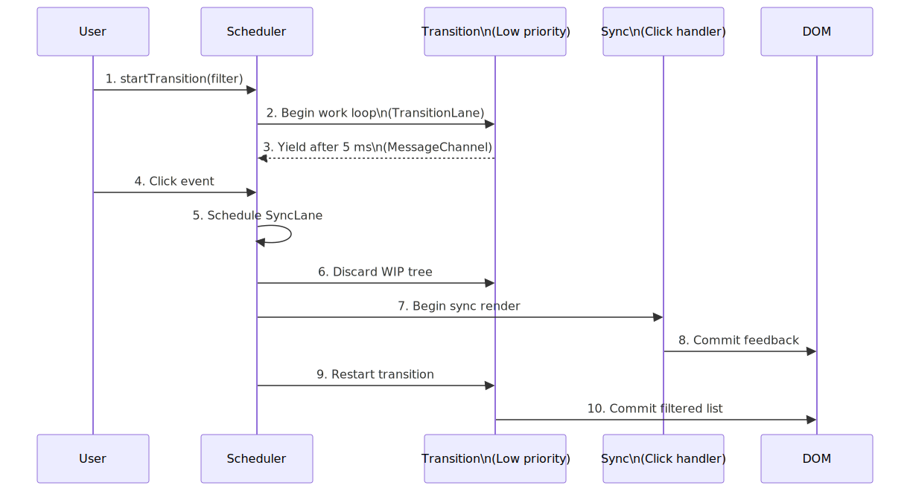
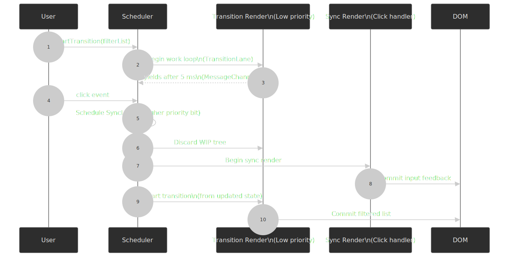

# React Rendering Architecture: Fiber, Lanes, Streaming SSR, and RSC

React's rendering architecture has evolved from a synchronous stack-based reconciler to a concurrent system built on Fiber's virtual call stack. This article works through the four layers that, together, define how a modern React app actually renders: the **Fiber reconciler**, the **lane-based priority scheduler**, **streaming SSR with Suspense**, and **React Server Components** (RSC) — stable as of [React 19, December 2024](https://react.dev/blog/2024/12/05/react-19). Each layer builds on the one below it, and most production performance and correctness questions trace back to which layer is making the decision. The audience is senior engineers who already write React and want to make architecture-level calls about which rendering strategy to use, where to place Suspense boundaries, and what infrastructure RSC actually requires.




## Mental model

The whole architecture rests on five interlocking ideas. Each one has its own section below; this is the smallest set of concepts you need to follow the rest.




1. **Fiber is a virtual call stack.** Each component instance becomes a fiber node linked via `child`/`sibling`/`return` pointers. React can pause mid-tree, yield to the browser, and resume — something the native JavaScript stack cannot express. Fiber shipped in [React 16, September 2017](https://legacy.reactjs.org/blog/2017/09/26/react-v16.0.html), as a from-scratch rewrite of the reconciler ([engineering write-up from Meta](https://engineering.fb.com/2017/09/26/web/react-16-a-look-inside-an-api-compatible-rewrite-of-our-frontend-ui-library/)).
2. **Reconciliation runs in two phases.** The render phase builds a work-in-progress (WIP) tree and is interruptible — the scheduler yields to the host every ~5 ms via `MessageChannel.postMessage`. The commit phase applies DOM mutations synchronously and cannot be interrupted.
3. **Lanes are a 31-bit priority bitmask.** As of React 18, every update gets a lane bit; the scheduler walks the highest-priority bit set first. Sync (discrete input) preempts transitions; transitions preempt idle work. This replaced the older expiration-time model.
4. **Rendering location is orthogonal to Fiber.** CSR, SSR, and RSC all use the same Fiber reconciler. They differ in *where* the render runs and *what* crosses the wire — DOM API calls in the browser for CSR, an HTML string for SSR, a serialized component tree (the **Flight** payload) for RSC.
5. **RSC is stable in React 19.** Server Components ship zero JavaScript to the client, fetch data directly on the server, and integrate with Suspense for progressive streaming. Only modules marked with `"use client"` end up in the client bundle.

## 1. The Fiber reconciliation engine

### 1.1 From stack to fiber

React's pre-16 reconciler was synchronous and bound to the JavaScript call stack: a `setState` triggered a depth-first recursion through the entire affected subtree, and the browser could not respond to input until that recursion completed. On large trees this manifested as multi-frame jank.

[React Fiber](https://github.com/acdlite/react-fiber-architecture), shipped in React 16 (September 2017), reimplemented reconciliation by **replacing the native call stack with an in-memory data structure** — a tree of fiber nodes linked via `child`/`sibling`/`return` pointers. Because the stack is now a heap-allocated structure, the scheduler can pause work, yield to the browser for input or paint, and resume later. Andrew Clark's original architecture document is still the clearest single reference.

> [!NOTE]
> Concurrent rendering itself only became opt-in with React 18's `createRoot` (March 2022). React 16 shipped Fiber as a foundation; the public concurrent APIs (`useTransition`, `useDeferredValue`, streaming SSR) came later.

### 1.2 Anatomy of a fiber node

Each fiber node is a "virtual stack frame" holding metadata about a component and its rendering state:

```javascript title="fiber-node-shape.js" collapse={1-2, 26-30}
// Simplified fiber node shape (see ReactFiber.js / ReactFiberLane.js
// in the react-reconciler package).
const fiberNode = {
  // Identity
  tag: FunctionComponent, // FunctionComponent, HostComponent, etc.
  type: ComponentFunction, // Reference to the component function/class
  key: "unique-key", // Stable identity for diffing

  // Tree pointers
  child: childFiber, // First child
  sibling: siblingFiber, // Next sibling
  return: parentFiber, // Parent (named "return" because it mirrors the call stack)

  // Props/state
  pendingProps: newProps, // Props for this render
  memoizedProps: oldProps, // Props from the previous render
  memoizedState: hookList, // Linked list of hooks (function components)

  // Double buffering
  alternate: wipFiber, // Links current ↔ work-in-progress

  // Effects (React 18+: flags instead of effectTag)
  flags: Update | Placement, // Bitmask of side effects
  subtreeFlags: flags, // Aggregated child flags

  // Scheduling (React 18+: lanes instead of expirationTime)
  lanes: SyncLane, // Lane bits for this fiber's updates
  childLanes: lanes, // Aggregated child lanes
}
```

**Double buffering.** React maintains two fiber trees — the **current tree** (what the browser is showing) and the **work-in-progress (WIP) tree** (what is being built). The `alternate` pointer links corresponding nodes. During reconciliation, React mutates the WIP tree freely; at commit, a single pointer swap promotes WIP to current. Borrowed from video-game rendering, this technique guarantees the browser never sees a half-applied update.

### 1.3 Two-phase reconciliation

Fiber's reconciliation is split into two distinct phases. The split is what enables every concurrent feature React has shipped since.

#### Render phase (interruptible)

The render phase computes *what* will change. It is asynchronous and may pause mid-tree:

1. **Work loop** starts at the root fiber, traversing depth-first.
2. **`performUnitOfWork`** calls `beginWork()` on each fiber, diffing children against the previous tree.
3. **WIP tree** builds progressively as new fibers are created and linked.
4. **Time-slicing** pauses after roughly 5 ms, yielding to the host via `MessageChannel`.

```javascript title="work-loop-concept.js" collapse={1-2}
// Conceptual work loop. Real source lives in ReactFiberWorkLoop.js
// in the facebook/react repo; the 5 ms budget is the `frameYieldMs`
// constant in packages/scheduler/src/forks/Scheduler.js.
function workLoopConcurrent() {
  while (workInProgress !== null && !shouldYield()) {
    performUnitOfWork(workInProgress)
  }
}

function shouldYield() {
  return performance.now() >= deadline // deadline = startTime + 5 ms
}
```

**Why 5 ms, and why `MessageChannel`?** The scheduler picks 5 ms so that, on a 16.67 ms frame budget, the host still has roughly 11 ms left for layout, paint, and input handling. The continuation is posted via [`MessageChannel.port2.postMessage`](https://html.spec.whatwg.org/multipage/web-messaging.html#message-channels) for two reasons: `requestIdleCallback` may never fire on a busy page, and `setTimeout(fn, 0)` is subject to a 4 ms minimum clamp once nested ([HTML spec, "timers" section](https://html.spec.whatwg.org/multipage/timers-and-user-prompts.html#timers)). `MessageChannel` queues a fresh macrotask without either constraint. The 5 ms default is the `frameYieldMs` constant inside [`packages/scheduler/src/forks/Scheduler.js`](https://github.com/facebook/react/blob/main/packages/scheduler/src/forks/Scheduler.js); see [JSer's annotated walkthrough](https://jser.dev/react/2022/03/16/how-react-scheduler-works/) for the source-level detail.

#### Commit phase (synchronous)

Once the render phase produces a complete WIP tree, React enters the commit phase, which is synchronous and uninterruptible:

1. **Tree swap**: the WIP tree replaces the current tree via pointer manipulation.
2. **DOM mutations**: React walks the `flags` bitmask on each fiber and applies inserts, updates, and deletions in order.
3. **Effects**: `useLayoutEffect` runs synchronously between mutation and paint; `useEffect` is flushed in a separate, microtask-scheduled pass after paint.

The commit phase being synchronous is *the* reason React can guarantee a consistent UI — a half-committed tree would expose torn state to event handlers and refs.

### 1.4 Lane-based priority scheduling

As of React 18, scheduling is built on **lanes** — a 31-bit bitmask where each bit represents a priority class. Lanes replaced the previous expiration-time model.

| Lane                    | Priority | Use case                                                        |
| ----------------------- | -------- | --------------------------------------------------------------- |
| `SyncLane`              | Highest  | Discrete user input (click, keypress, change)                   |
| `InputContinuousLane`   | High     | Continuous input (drag, scroll, mouse-move)                     |
| `DefaultLane`           | Normal   | Plain `setState` calls outside any scheduling primitive         |
| `TransitionLane` (×16)  | Low      | `startTransition` / `useDeferredValue` updates                  |
| `RetryLane`             | Low      | Re-render after a Suspense boundary's data resolves             |
| `IdleLane`              | Lowest   | Background work (offscreen, prerendered routes)                 |

The full enumeration lives in [`packages/react-reconciler/src/ReactFiberLane.js`](https://github.com/facebook/react/blob/main/packages/react-reconciler/src/ReactFiberLane.js). Cross-referenced annotated walkthrough: [JSer, "What are Lanes in React source code?"](https://jser.dev/react/2022/03/26/lanes-in-react/).

**Why lanes?** Expiration times forced React to process updates strictly in order of expiration. Lanes give two new capabilities:

- **Batching** — multiple updates of the same priority merge into a single render. A `setState` call inside an event handler that triggers another `setState` will, since React 18, batch into one render automatically (`automaticBatching`).
- **Preemption** — a higher-priority lane can interrupt an in-flight lower-priority render. A click during a slow `startTransition` discards the WIP tree, processes the click on `SyncLane`, then restarts the transition from the new state.

```javascript title="lane-example.js"
function handleClick() {
  setCount((c) => c + 1) // SyncLane — committed immediately
  startTransition(() => {
    setSearchResults(filterLargeList()) // TransitionLane — interruptible
  })
}
```

The sequence below shows what preemption looks like in practice: a transition starts, yields after its first 5 ms slice, and is then discarded when the user clicks.




> [!IMPORTANT]
> Preemption discards work; it does not merge it. A long transition repeatedly preempted by sync updates can starve. React's scheduler has starvation protection — lanes that have waited too long are escalated to `SyncLane` so they always commit eventually.

### 1.5 The heuristic diffing algorithm

React implements an **O(n) heuristic diff** based on two assumptions that hold for typical UI patterns ([React docs, "Reconciliation"](https://legacy.reactjs.org/docs/reconciliation.html)):

1. **Different element types produce different trees.** Comparing `<div>` to `<span>` at the same position tears down the entire subtree and rebuilds it; React makes no attempt to diff their children.
2. **`key` provides stable identity.** In lists, `key` lets React track insertions, deletions, and reordering. Without keys, React falls back to positional comparison — which both wastes work and silently corrupts component-local state when items reorder.

Both assumptions break the worst-case theoretical bound (true tree edit distance is O(n³)) in exchange for a practical O(n) that handles the vast majority of UIs correctly.

### 1.6 Hooks integration with fiber

Each function component's fiber stores its hooks as a linked list in `memoizedState`. A cursor (`workInProgressHook`) tracks the current position during render:

```javascript title="hook-structure.js" collapse={1-2}
// Simplified hook record (see ReactFiberHooks.js).
// Each hook in a component is a node in a linked list,
// in the exact order the hooks were called.
const hook = {
  memoizedState: value, // Current value (state, ref, etc.)
  baseState: value, // Base for queued updates
  queue: updateQueue, // Pending updates (state hooks only)
  next: nextHook, // Next hook in the list
}
```

**Why the rules of hooks exist.** Hooks are looked up by call order, not name. React walks the linked list position-by-position. A conditional `useState` shifts the cursor and React reads the wrong hook's state from the next render onward. The lint rule [`react-hooks/rules-of-hooks`](https://react.dev/reference/rules/rules-of-hooks) enforces consistent ordering at build time, which is why violating it is treated as a hard error rather than a warning.

## 2. Client-side rendering and hydration

### 2.1 Pure CSR

In CSR the server returns a near-empty HTML shell and the browser builds the entire DOM from JavaScript:

```javascript title="csr-init.js" collapse={1-2}
// CSR initialization (React 18+)
import { createRoot } from "react-dom/client"

const root = createRoot(document.getElementById("root"))
root.render(<App />)
```

`createRoot` builds the foundation:

1. Creates a **`FiberRootNode`** (the top-level container that owns the scheduler state).
2. Creates a **`HostRoot` fiber** corresponding to the DOM container element.
3. Links the two bidirectionally so the scheduler can walk back to the DOM root.

`root.render()` then schedules an update on the `HostRoot` fiber, which kicks off the two-phase reconciliation described above.

| Metric                       | CSR posture | Why                                                                     |
| ---------------------------- | ----------- | ----------------------------------------------------------------------- |
| TTFB                         | Fast        | Server returns a tiny shell                                             |
| FCP / LCP                    | Slow        | Blank screen until the bundle loads, parses, and executes               |
| Time to Interactive          | Slow        | All JS must execute before any handler binds                            |
| SEO                          | Poor        | Crawlers without JS execution see an empty shell                        |
| Infrastructure cost          | Lowest      | Static hosting only                                                     |

CSR is the right default for internal dashboards and authenticated SPAs where SEO is irrelevant and a loading skeleton is acceptable. It is the wrong default for public marketing or e-commerce surfaces where Core Web Vitals are revenue-coupled.

### 2.2 Server-side rendering with hydration

SSR pre-renders HTML on the server so the browser can paint immediately. **Hydration** is the process of attaching React's event delegation and component state to that server-generated HTML.

```javascript title="hydrate-root.js" collapse={1-2}
// React 18+ hydration API
import { hydrateRoot } from "react-dom/client"

hydrateRoot(document.getElementById("root"), <App />)
```

Hydration is **not a re-render**. React walks the existing DOM alongside its virtual tree and:

1. Reuses the existing DOM nodes — no inserts, no replaces.
2. Binds event handlers to those DOM nodes via React's synthetic event system.
3. Initializes hook state and queues `useEffect` callbacks for after paint.
4. Verifies that the structure of the server output matches the client render.

#### Hydration mismatches and recovery

A mismatch happens when the markup React would produce on the client differs from what the server emitted. The common causes:

| Cause                  | Example                          | Fix                                                                          |
| ---------------------- | -------------------------------- | ---------------------------------------------------------------------------- |
| Date/time              | `new Date().toISOString()`       | Render with a fixed timezone, or defer to client via `useEffect`             |
| Browser-only APIs      | `window.innerWidth`              | Guard with `typeof window !== "undefined"`, or compute inside `useEffect`    |
| Random values          | `Math.random()`                  | Generate on the server, pass as a prop                                       |
| User-locale formatters | `Intl.DateTimeFormat()`          | Pin the locale + timezone explicitly                                         |
| Extension-injected DOM | Ad blockers, password managers   | Use `suppressHydrationWarning` on the affected node                          |

React 18's recovery model is more aggressive than React 17's. Per the [`hydrateRoot` reference](https://react.dev/reference/react-dom/client/hydrateRoot), if a mismatch is detected **inside a Suspense boundary**, React discards that subtree's server HTML and re-renders it on the client. If a mismatch is detected **outside any Suspense boundary**, React falls back to a full client render of the entire root, throwing away the SSR payload for that page load. Both paths are correct but expensive — recovery costs you a paint, and in the root-fallback case it costs you the entire SSR benefit.

> [!WARNING]
> Treat hydration warnings in development as bugs, not noise. They predict a client-side re-render in production. The combination of `suppressHydrationWarning` + a mismatching subtree + no Suspense boundary is the most common silent SSR regression we see.

#### Selective hydration

Suspense lets React **prioritize hydration** on demand instead of hydrating the whole tree at once. Components inside a `<Suspense>` boundary hydrate independently of components outside it, and React schedules the hydration work alongside everything else on the lane scheduler — meaning a click on a not-yet-hydrated boundary preempts the lower-priority hydration of other boundaries and fast-paths the clicked one. The mechanism is described in [Andrew Clark's original New Suspense SSR post](https://github.com/reactwg/react-18/discussions/37).

```javascript title="selective-hydration.jsx" collapse={1-3}
// Selective hydration with Suspense (React 18+)
import { lazy, Suspense } from "react"
const HeavyPanel = lazy(() => import("./HeavyPanel"))

function App() {
  return (
    <div>
      <CriticalHeader />
      <Suspense fallback={<Skeleton />}>
        <HeavyPanel /> {/* Hydration of this subtree is prioritized
                          when the user interacts with it. */}
      </Suspense>
    </div>
  )
}
```

> [!NOTE]
> "Hydrate when scrolled into view" is **not** part of React's selective hydration. React itself prioritizes based on user interaction (clicks, key presses), not viewport visibility. Frameworks like Astro and Qwik provide viewport-triggered hydration as a separate feature; if you want it in a React app you have to wire an `IntersectionObserver` to gate the import yourself.

### 2.3 Streaming SSR with Suspense

React 18 introduced streaming SSR through Suspense boundaries. Instead of rendering the whole tree to a string and flushing once, the server flushes the static shell immediately and streams suspended subtrees as their data resolves.

```javascript title="streaming-ssr.js" collapse={1-3}
// Server streaming entry (React 18+)
import { renderToPipeableStream } from "react-dom/server"
import { App } from "./App"

const stream = renderToPipeableStream(<App />, {
  onShellReady() {
    // Shell is renderable → flush headers and start the stream.
    response.statusCode = 200
    response.setHeader("content-type", "text/html")
    stream.pipe(response)
  },
  onAllReady() {
    // Every Suspense boundary has resolved → useful for crawlers
    // or when you want a fully-formed HTML response.
  },
  onError(error) {
    console.error(error)
    response.statusCode = 500
  },
})
```

The mechanism, in three steps:

1. React renders the tree until it hits a suspended component (e.g., one that read from a not-yet-resolved promise).
2. It emits the shell HTML immediately, with a `<template>` placeholder where the suspended subtree will go.
3. As each suspended Promise resolves, React streams a small `<script>` block that injects the resolved HTML and tells the client runtime to swap the placeholder.

#### React 19 changed sibling render behavior

In React 18, siblings of a suspended component continued to *pre-render* in parallel — meaning fetch-on-render patterns naturally fanned out. In React 19, [the team disabled that pre-rendering](https://github.com/facebook/react/issues/29898): once one sibling suspends, its in-render-tree siblings no longer start their own fetches until the suspended sibling resolves. The result is sequential data fetching, which can produce noticeable waterfalls on pages built around the React Query / TanStack Suspense patterns. The change is intentional ([React team rationale](https://github.com/facebook/react/issues/29898#issuecomment-2241500215)) but contentious — see [TkDodo's three-act write-up](https://tkdodo.eu/blog/react-19-and-suspense-a-drama-in-3-acts) for the full discourse and mitigation patterns.

The two practical mitigations:

- **Move data fetching out of render.** Use route loaders (TanStack Router, React Router data APIs) or fetch from server components. This is the React team's recommended path.
- **Split the Suspense boundary.** Wrap each independent fetcher in its own `<Suspense>`; siblings in different boundaries still resolve in parallel.

## 3. Server-rendered architectures beyond the request

### 3.1 Traditional SSR (page router)

In Next.js Pages Router and similar frameworks, server rendering is page-centric: a single server function fetches everything the page needs, then the component tree renders top-down with that data threaded through props.

```javascript title="pages/products.js" collapse={1-2, 14-20}
// Next.js Pages Router pattern
// Data fetching happens before the component renders.
export async function getServerSideProps({ req, res }) {
  const products = await fetchProducts()

  res.setHeader("Cache-Control", "public, s-maxage=10, stale-while-revalidate=59")

  return { props: { products } }
}

export default function ProductsPage({ products }) {
  return (
    <div>
      {products.map((product) => (
        <ProductCard key={product.id} product={product} />
      ))}
    </div>
  )
}
```

This model couples data fetching to routing — server functions execute first, props flow down. It is easy to reason about and easy to cache at the CDN layer; it is also the source of the "everything cascades through one prop" anti-pattern that RSC was designed to eliminate.

### 3.2 Static site generation (SSG)

SSG renders pages at **build time** to static HTML files served from a CDN edge.

```javascript title="ssg-example.js"
// Next.js getStaticProps with ISR-style revalidation.
export async function getStaticProps() {
  const posts = await fetchPosts()
  return {
    props: { posts },
    revalidate: 3600, // ISR: regenerate every hour
  }
}
```

| Property             | Why it matters                                              |
| -------------------- | ----------------------------------------------------------- |
| Optimal TTFB         | Static files served from CDN edge                           |
| Trivial caching      | No server computation per request                           |
| Lowest infra cost    | No runtime origin compute                                   |
| Highest resilience   | No origin failures affect availability                      |
| Stale by default     | Pages reflect the world as of the last build, not now       |

SSG is the right default for content that changes on a schedule rather than per request — blogs, marketing pages, documentation.

### 3.3 Incremental static regeneration (ISR)

ISR sits between SSG and SSR. Pages are pre-rendered at build, but the framework re-renders them in the background after a TTL or after an explicit revalidation event:

1. First request after a deploy serves the build-time static HTML.
2. If the configured `revalidate` window has expired, the framework triggers a background regeneration.
3. The next request serves the freshly regenerated HTML.
4. If the regeneration fails, the stale page keeps serving — graceful degradation by default.

ISR was popularized by Next.js and is the term the React community uses, but it is no longer Next.js-only. As of 2026, [Vercel's ISR documentation](https://vercel.com/docs/incremental-static-regeneration) lists first-class support for Next.js, SvelteKit, Astro, and Nuxt; Gatsby exposes the same capability under the name **Deferred Static Generation (DSG)**; and Remix achieves equivalent behavior with HTTP `Cache-Control: stale-while-revalidate` semantics at the CDN layer. The implementation details (how revalidation is triggered, whether per-page or per-tag) vary; the user-visible behavior — *static, occasionally regenerated, gracefully stale* — is portable across the modern framework ecosystem.

## 4. React Server Components

### 4.1 The RSC paradigm shift

React Server Components solve a different problem than SSR. SSR optimizes the *initial paint* of a server-rendered page; RSC **eliminates client JavaScript for non-interactive components entirely**. The two are complementary — a typical RSC application uses SSR for the first paint and Flight streaming for the subsequent component-level data fetches.

| Aspect            | SSR                                          | RSC                                                |
| ----------------- | -------------------------------------------- | -------------------------------------------------- |
| When code runs    | Server (once), then client (hydration)       | Server only (never reaches the client)             |
| Client bundle     | Full app bundle                              | Only `"use client"` modules + their imports        |
| Data access       | Through an API layer                         | Direct DB, filesystem, or internal-service access  |
| Interactivity     | After hydration                              | Only inside `"use client"` islands                 |
| Wire format       | HTML                                         | Flight (a streamable React-tree serialization)     |

**Key characteristics:**

- **Zero client cost** for any code path that lives entirely in server components.
- **Direct backend access** — query a database, read a file, call an internal service without inventing a public API for it.
- **Streaming-native** — Flight integrates with Suspense for progressive rendering.
- **Composable in one direction** — server components can render client components; client components cannot render server components, only receive them as `children`.

### 4.2 The dual component model

RSC introduces a clear boundary between component types via module-level directives. Both directives are documented on react.dev: [`"use client"`](https://react.dev/reference/rsc/use-client) and [`"use server"`](https://react.dev/reference/rsc/use-server).

#### Server components (the default)

Server components are the default in any RSC-enabled environment. There is no opt-in directive — a file with no `"use client"` and no `"use server"` is a server component.

```javascript title="ProductList.server.jsx" collapse={1-2}
// Server component — runs only on the server.
// No directive needed; "server" is the default in RSC environments.
export default async function ProductList() {
  // Direct database access; no API layer required.
  const products = await db.query("SELECT * FROM products WHERE active = true")

  return (
    <ul>
      {products.map((p) => (
        <li key={p.id}>{p.name}</li>
      ))}
    </ul>
  )
}
```

**Server-component constraints:**

- No state or effect hooks (`useState`, `useReducer`, `useEffect`, `useLayoutEffect`).
- No browser APIs (`window`, `document`, event handlers).
- No client-only imports (those would be pulled into the server graph but not the client bundle, then crash at runtime).
- May freely use: `async/await` directly in the component body, filesystem and database calls, environment variables, `use()` to read promises and context.

#### Client components (explicit opt-in)

```javascript title="AddToCart.client.jsx"
"use client" // Module-level directive; this file and its imports become client code.

import { useState } from "react"

export function AddToCart({ productId }) {
  const [pending, setPending] = useState(false)

  return (
    <button onClick={() => addToCart(productId)} disabled={pending}>
      Add to cart
    </button>
  )
}
```

**`"use client"` semantics.** This is a **module boundary**, not a component boundary. All exports from a `"use client"` module — and the transitive imports of those exports — are bundled for the client. Place the directive on the first line of the file, before imports. A common mistake is to put `"use client"` inside a deeply-imported leaf module and assume only that module becomes client code; in practice, anything reachable from the entry of that module crosses into the client graph.

#### Server actions and `"use server"`

`"use server"` is a separate directive that marks a function (or all exports of a module) as a **Server Action**: a function callable from client code that always executes on the server.

```javascript title="actions.js"
"use server"

import { revalidatePath } from "next/cache" // Next.js-specific cache primitive

export async function addToCart(productId) {
  await db.cart.add(productId)
  revalidatePath("/cart")
}
```

`"use server"` does **not** mark Server Components — that is a common confusion. Server Components have no directive; `"use server"` is for the action surface. The `revalidatePath` call above is a Next.js convenience that does not exist in vanilla React; in other RSC frameworks the cache-invalidation primitive has a different name.

### 4.3 The Flight wire format

RSC serializes the rendered server tree into a **streamable wire format** colloquially called Flight (after the package `react-server-dom-webpack/server` and its peers). Unlike JSON, Flight supports:

- **Streaming** — chunks arrive progressively over the wire.
- **Promise references** — values can resolve out of order; later chunks fill in earlier placeholders.
- **Module references** — client components are encoded as a path + export name pair, not as code.

> [!IMPORTANT]
> Flight is implementation-defined, not a stable public protocol. The exact prefixes and chunk shape live in `react-server-dom-webpack`, `react-server-dom-turbopack`, and the equivalent Vite/Bun bindings. Treat it as an internal contract between the server runtime and the matching client runtime, not as a wire format you can consume by hand. (The 2025 [`CVE-2025-55182`](https://www.offsec.com/blog/cve-2025-55182/) RCE in the Flight deserializer is a reminder that the protocol is not designed for untrusted producers.)

#### Payload structure

A simplified payload looks like:

```text title="flight-payload-example.txt"
0:["$","div",null,{"children":["$","h1",null,{"children":"Store"}]}]
1:["$","$L2",null,{"productId":123}]
2:I["./AddToCart.js","AddToCart"]
3:["$","ul",null,{"children":"$@4"}]
4:["$","li",null,{"children":"Product A"}]
```

| Prefix | Meaning                                                     |
| ------ | ----------------------------------------------------------- |
| `$`    | A React element (the JSX you are used to, but serialized)   |
| `$L`   | A lazy/deferred client-component reference                  |
| `I`    | A module import row (resolves to a client-component bundle) |
| `$@`   | A Promise reference; resolved by a later numbered chunk     |

The chunks are sent over a single streaming response. The client runtime parses them as they arrive, swaps placeholder slots when later chunks fulfil them, and triggers hydration on `"use client"` islands when their bundles arrive.

#### End-to-end RSC streaming

The sequence below traces a single navigation to an RSC page with two suspended subtrees: the server flushes the shell + first chunks immediately, then continues to stream chunks for each Suspense boundary as its data resolves.


### 4.4 RSC integration with Suspense

Suspense boundaries are the unit of streaming. Each boundary resolves independently, and the server flushes its chunk as soon as that boundary is ready:

```javascript title="page.server.jsx" collapse={1-2}
// RSC page with Suspense boundaries.
import { Suspense } from "react"

export default async function Page() {
  return (
    <div>
      <Suspense fallback={<HeaderSkeleton />}>
        <AsyncHeader />
      </Suspense>
      <Suspense fallback={<ProductSkeleton />}>
        <AsyncProductList />
      </Suspense>
      <AddToCartSidebar /> {/* Client component */}
    </div>
  )
}

async function AsyncHeader() {
  const user = await fetchUserData() // Suspends until the promise resolves.
  return <Header user={user} />
}
```

Because each `<Suspense>` is its own streaming unit, `AsyncHeader` and `AsyncProductList` start their fetches in parallel — the React 19 sequential-sibling change discussed in §2.3 only applies to siblings inside the *same* boundary. Splitting boundaries is the simplest way to preserve parallel fetching in React 19.

### 4.5 React 19 RSC enhancements

React 19 stabilized RSC and shipped a related set of primitives that make server-driven mutations ergonomic from client components:

| Feature           | Description                                                                    |
| ----------------- | ------------------------------------------------------------------------------ |
| **Actions**       | Async functions in `startTransition` with automatic pending/error state        |
| **`useActionState`** | Returns `[state, action, isPending]` for form-style action invocation        |
| **`useFormStatus`**  | Reads the parent `<form>` action's pending state without prop drilling       |
| **`useOptimistic`**  | Applies an optimistic UI update while the server confirms                    |
| **`use()` hook**     | Reads a promise or context directly inside render (suspends if not resolved) |
| **Ref as prop**      | Function components accept `ref` as a normal prop; `forwardRef` is no longer required |

Each is documented in the [React 19 release post](https://react.dev/blog/2024/12/05/react-19).

### 4.6 RSC performance and infra implications

| Aspect                  | Effect of adopting RSC                                                |
| ----------------------- | --------------------------------------------------------------------- |
| Client bundle size      | Server-component code contributes 0 bytes to the client bundle        |
| Time to Interactive     | Lower — fewer bytes to parse, compile, and execute                    |
| TTFB                    | Slightly higher — server now does template work before flushing       |
| Network requests        | One streaming response replaces N separate API calls                  |
| Caching                 | Cacheable per component, per route, or at the CDN layer               |
| Origin compute cost     | Higher — every request renders on the server                          |
| Operational complexity  | Higher — needs a Node/edge runtime that hosts React's RSC environment |
| Observability surface   | New — Flight chunks, server-component errors, action invocations      |

The trade is bundle and request-count for origin compute and operational surface. It is a net win for content-heavy, public, SEO-bearing surfaces and for product surfaces with deep server-only logic. It is a net loss for thin SPAs where the server has nothing useful to do.

## 5. The React Compiler

The [React Compiler](https://react.dev/learn/react-compiler) (formerly "React Forget") is a build-time optimizer that automatically memoizes components and values. **Despite the name overlap, the Compiler is not part of React 19** — it shipped as an independent package, with v1.0 released on [October 7, 2025](https://react.dev/blog/2025/10/07/react-compiler-1) (an [RC](https://react.dev/blog/2025/04/21/react-compiler-rc) preceded it in April 2025). It targets React 17, 18, and 19; the older targets need the small `react-compiler-runtime` shim package.

### 5.1 What it does

The compiler statically analyzes function components and hooks, then emits memoized output that:

- Skips re-rendering subtrees whose inputs (props, state, hook results) are unchanged.
- Stabilizes function references so they do not invalidate downstream memoization.
- Caches expensive computed values across renders without an explicit `useMemo`.

```javascript title="before-after.js"
// Before: manual memoization
const filteredList = useMemo(() => items.filter(predicate), [items, predicate])
const handleClick = useCallback(() => doSomething(id), [id])

// After: the compiler infers and inserts the equivalent caches.
const filteredList = items.filter(predicate)
const handleClick = () => doSomething(id)
```

### 5.2 Limits and escape hatches

The compiler optimizes **how** components render, not **whether** they render. Architectural decisions remain the engineer's responsibility — list virtualization, code splitting, choice of CSR/SSR/RSC. Per the v1.0 announcement, `useMemo`, `useCallback`, and `React.memo` are not deprecated; they remain useful as **escape hatches** when:

- A third-party library compares values by reference identity and you need a stable handle.
- A `useEffect` dependency must not change unless a specific input changes, and you want explicit, audit-able control.
- The compiler legitimately cannot prove a value is pure (it conservatively skips memoization in those cases).

You also do not need to delete existing manual memoization on day one. The compiler coexists with explicit hooks; you can migrate at your own pace.

## 6. Architectural synthesis

### 6.1 The dependency chain

The four layers compose top-down. Each layer assumes the one below it.

```text
Fiber  →  Lanes  →  Suspense + Concurrency  →  Streaming SSR / RSC
```

1. **Fiber** makes work pause-able by representing the call stack as data.
2. **Lanes** assign each piece of work a priority bit and let the scheduler preempt and batch.
3. **Suspense** + **transitions** are the user-facing concurrency primitives — they only work because Fiber and Lanes exist.
4. **Streaming SSR** and **RSC** are server-side execution models that ride on the same primitives, using Suspense as the unit of streamed delivery.

A regression at any layer ripples upward. RSC streaming relies on Suspense's ability to pause render at arbitrary points; that ability requires Fiber's interruptible render phase; that requires the lane-based scheduler to know when to yield.

### 6.2 Picking a strategy

The decision tree below is the shortest defensible heuristic. The only bias to flag: when in doubt, prefer the *less* operationally complex option — CSR or SSG — and only escalate to SSR or RSC when the user-visible metric (LCP, INP, SEO indexing, bundle size) actually requires it.




| Architecture        | Where it runs        | Bundle impact         | Interactivity            | SEO         | Best for                       |
| ------------------- | -------------------- | --------------------- | ------------------------ | ----------- | ------------------------------ |
| **CSR**             | Client only          | Full app              | Immediate after JS load  | Poor        | Dashboards, internal tools     |
| **SSG**             | Build time           | Full app              | After hydration          | Excellent   | Marketing, docs, blogs         |
| **ISR / SWR**       | Build + background   | Full app              | After hydration          | Excellent   | Catalogs, content sites        |
| **Traditional SSR** | Server per request   | Full app              | After hydration          | Excellent   | Page-router apps, legacy SSR   |
| **RSC + SSR**       | Server + client      | Only client islands   | Selective per island     | Excellent   | Mixed static + interactive     |

### 6.3 Failure modes worth budgeting for

The footguns that bite in production are not in the happy path of any of these models — they are at the seams.

- **Hydration mismatches in production silently fall back to client render.** You lose the SSR benefit for that page load and the user sees a flicker. Treat any dev-only mismatch warning as a P1 bug.
- **Single Suspense boundary around N siblings serializes their fetches under React 19.** You will not see this in synthetic benchmarks; you will see it in waterfall RUM data on real networks.
- **`"use client"` placed deep in an import graph pulls in more than expected.** Audit the client bundle composition after every refactor — `next build` (and equivalents) will tell you which modules became client modules.
- **Server component code that imports a client-only library crashes at runtime.** Type checking does not catch this because the import is technically valid; the failure is environmental.
- **`useEffect` inside a Suspense fallback never runs if the fallback never renders.** Surprisingly common bug when porting an existing component into a Suspense subtree.

## Conclusion

React's architecture is a stack of cooperating layers: a virtual call stack (Fiber), a priority scheduler (Lanes), concurrency primitives that ride on those (Suspense, transitions, deferred values), and execution models that ride on the primitives (CSR, SSR, streaming SSR, RSC). The 2024–2025 wave — React 19 stabilizing RSC, the React Compiler reaching v1.0 — does not change the foundation; it makes the upper layers production-credible.

The practical payoff of internalizing this stack is making decisions at the right layer. *When* to add a Suspense boundary is a Suspense question. *When* to switch from SSR to RSC is an execution-model question. *When* to add `useMemo` (in a Compiler-enabled codebase) is now a "is this an escape hatch?" question, not a default. Most production performance regressions and weird hydration bugs are layer-confusion at root: someone reaching for a higher-layer API (`startTransition`) to fix a lower-layer problem (a render that does too much synchronous work), or vice versa.

## Appendix

### Prerequisites

- JavaScript `async`/`await` and Promises.
- React's component model (props, state, hooks).
- HTTP request/response cycle and basic CDN caching.
- Browser rendering pipeline at a high level (parse → style → layout → paint → composite).

### Summary

- **Fiber** replaces the native call stack with a tree of fiber nodes so render work can pause and resume.
- **Lanes** are a 31-bit priority bitmask; sync input preempts transitions, transitions preempt idle work, and starved lanes escalate.
- **Two-phase reconciliation** — interruptible render phase yielding via `MessageChannel` every ~5 ms; synchronous, non-interruptible commit phase.
- **Streaming SSR** flushes a shell immediately and streams Suspense boundaries as their data resolves; React 19 made siblings inside one boundary render sequentially.
- **RSC** (stable in React 19) serializes the server tree via the implementation-defined Flight format; server components contribute zero client bytes.
- **React Compiler** (v1.0, October 2025) automates most uses of `useMemo`/`useCallback`/`React.memo` at build time; works with React 17+ and is not bundled with React 19.

### References

**Official documentation**

- [React 19 release](https://react.dev/blog/2024/12/05/react-19)
- [React Compiler v1.0](https://react.dev/blog/2025/10/07/react-compiler-1) and [React Compiler RC](https://react.dev/blog/2025/04/21/react-compiler-rc)
- [Server Components reference](https://react.dev/reference/rsc/server-components)
- [`"use client"` directive](https://react.dev/reference/rsc/use-client)
- [`"use server"` directive](https://react.dev/reference/rsc/use-server)
- [`hydrateRoot` API](https://react.dev/reference/react-dom/client/hydrateRoot)
- [Suspense reference](https://react.dev/reference/react/Suspense)
- [Rules of Hooks](https://react.dev/reference/rules/rules-of-hooks)

**Architecture and design**

- [React Fiber Architecture](https://github.com/acdlite/react-fiber-architecture) — Andrew Clark's design doc
- [React 16: A look inside the rewrite](https://engineering.fb.com/2017/09/26/web/react-16-a-look-inside-an-api-compatible-rewrite-of-our-frontend-ui-library/) — Meta engineering post-mortem of the Fiber rewrite
- [New Suspense SSR architecture](https://github.com/reactwg/react-18/discussions/37) — original React 18 working-group post
- [React 19 sequential Suspense behavior](https://github.com/facebook/react/issues/29898) — issue + team rationale

**Implementation deep-dives**

- [`Scheduler.js` source](https://github.com/facebook/react/blob/main/packages/scheduler/src/forks/Scheduler.js) — `frameYieldMs`, `MessageChannel` posting
- [`ReactFiberLane.js` source](https://github.com/facebook/react/blob/main/packages/react-reconciler/src/ReactFiberLane.js) — the canonical lane definitions
- [How React Scheduler works internally](https://jser.dev/react/2022/03/16/how-react-scheduler-works/) — JSer
- [What are Lanes in React source code?](https://jser.dev/react/2022/03/26/lanes-in-react/) — JSer

**Ecosystem and analysis**

- [Next.js App Router](https://nextjs.org/docs/app) — RSC implementation in Next.js
- [Vercel ISR documentation](https://vercel.com/docs/incremental-static-regeneration) — multi-framework ISR support
- [Rendering on the Web](https://web.dev/articles/rendering-on-the-web) — Google's rendering-strategy comparison
- [React 19 and Suspense — A Drama in 3 Acts](https://tkdodo.eu/blog/react-19-and-suspense-a-drama-in-3-acts) — TkDodo on the sibling-rendering change
- [CVE-2025-55182](https://www.offsec.com/blog/cve-2025-55182/) — RCE in Flight deserializer; useful reminder that Flight is an implementation-defined internal protocol
