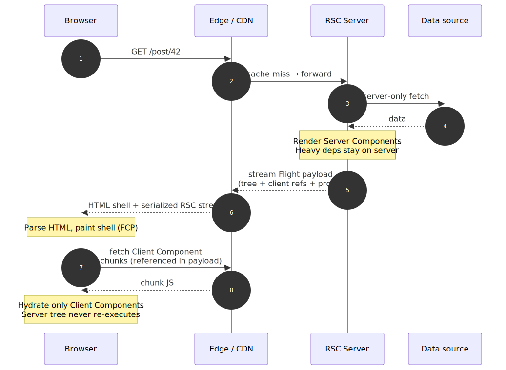
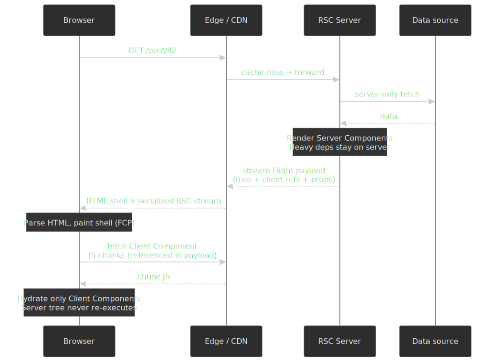

# Modern Rendering Architectures

The four canonical rendering strategies — Client-Side Rendering (CSR), Server-Side Rendering (SSR), Static Site Generation (SSG), and Incremental Static Regeneration (ISR) — are still the right mental model, but no production frontend in 2026 picks just one of them. Modern frameworks compose them inside a single page: a static shell streams from the edge, dynamic regions stream as their data resolves, and only the truly interactive components ship JavaScript to the client. This article focuses on the architectures that make that composition possible — React Server Components (RSC), Suspense streaming, islands, Partial Prerendering (PPR), and resumability — and the decision framework that tells you which to reach for.

For a deep dive on the four canonical strategies in isolation, see the companion article [Rendering Strategies: CSR, SSR, SSG, and ISR](../rendering-strategies-csr-ssr-ssg-isr/README.md). This article assumes you already know what each one is and starts from "now what".




## Thesis

Three forces have reshaped the rendering landscape since the original CSR/SSR/SSG/ISR taxonomy:

1. **Interaction to Next Paint (INP) replaced First Input Delay (FID) as a Core Web Vital on 12 March 2024**, with a "good" threshold of 200 ms at the 75th percentile, measured across the entire session [^inp-launch] [^inp-thresholds]. Bundle size now correlates directly with a Search-ranking metric, not just with a one-time interactivity number.
2. **Server-first rendering models converged.** React Server Components (RSC) keep heavy components — and their dependencies — entirely off the client bundle [^react-rsc]. Astro and Fresh ship zero JavaScript by default and let authors opt into hydration per island [^astro-islands]. Qwik replaces hydration with resumability, where the client never re-executes server logic [^qwik-resumable].
3. **Per-route, per-component composition is now table-stakes.** Next.js App Router, Nuxt 3, and SvelteKit all let a single application contain SSG, ISR, SSR, and CSR routes; PPR (Next.js 14/15 experimental, Cache Components in Next.js 16) and Astro's hybrid output let a single *page* contain static and dynamic regions [^nextjs-ppr] [^nextjs-cache-components] [^astro-server-islands].

The decision in 2026 is not "pick CSR or SSR" — it is "for each region of each page, decide where it renders, what (if anything) ships to the client, and how it becomes interactive". That is what the rest of this article is about.

## Mental model: render where, ship what, hydrate when

Every region of a modern web page sits in a 3-axis space:

| Axis | Choices | What it controls |
| --- | --- | --- |
| **Where rendered** | build, request (origin or edge), client | TTFB, freshness, server cost |
| **What ships** | nothing, serialized state, framework runtime, full code | INP, LCP, JS bundle |
| **When interactive** | never (static), on load, on idle, on visible, on interaction (Qwik) | Interaction latency, perceived speed |

CSR, SSR, SSG, and ISR are coordinates in this space. The modern architectures below — RSC, streaming, islands, resumability, PPR — are not new coordinates so much as patterns for *mixing* coordinates inside one page.

## Foundations recap

The four canonical strategies and their primary trade-off, in a sentence each:

| Strategy | Where HTML is produced | Primary trade-off |
| --- | --- | --- |
| **CSR** | Browser, after JS loads | Worst FCP/LCP; best subsequent navigation; no server cost |
| **SSR** | Server, per request | Good FCP/LCP; per-request compute; hydration cost on client |
| **SSG** | Build time, deployed to CDN | Best Core Web Vitals; content frozen until next build |
| **ISR** | Build time + background regeneration | SSG performance with bounded staleness window |

Anything below builds on these foundations — see the [companion article](../rendering-strategies-csr-ssr-ssg-isr/README.md) for mechanism, failure modes, cost models, and SEO implications of each.

## React Server Components

React Server Components (RSC) are components that execute exclusively in a server environment — at build time or per request — and render to a serialized output rather than HTML [^react-rsc]. They are not a replacement for SSR; they sit one layer below it. SSR turns a React tree into HTML for a specific request. RSC determines *what* tree is shipped to the client at all.

### What actually crosses the wire

The RSC payload (also called the "Flight" payload) carries three things:

1. **Rendered output of Server Components** — the resolved virtual tree, with elements, props, and text [^vercel-rsc-payload].
2. **References to Client Components** — opaque pointers into JavaScript chunk bundles, plus the props that should hydrate them [^vercel-rsc-payload].
3. **Serialized props for Client Components** — supports a superset of `JSON.stringify`, including Promises, iterables, and React elements [^react-rsc].

The flow is best read as a sequence — server-only data fetches, payload streams to the edge, the browser receives HTML *and* the serialized component graph, and only Client Components ever execute on the client.




### Bundle-size leverage

The single biggest reason to reach for RSC is bundle reduction. A blog renderer that uses `marked` (~50 KB) and `sanitize-html` (~25 KB) traditionally ships both libraries to every reader's browser. As an RSC, the same renderer ships zero bytes to the client — the libraries execute on the server, and only the rendered HTML and the small set of Client Components (e.g., a like button) reach the browser:

```tsx title="rsc-blog-post.tsx" showLineNumbers
import { db } from "@/lib/db"
import { renderMarkdown } from "@/lib/markdown" // 75 KB of deps stay on the server
import { LikeButton } from "./LikeButton" // Client Component — only this ships to client

export default async function BlogPost({ id }: { id: string }) {
  const post = await db.post.findUnique({ where: { id } })
  const html = renderMarkdown(post.content)

  return (
    <article>
      <h1>{post.title}</h1>
      <div dangerouslySetInnerHTML={{ __html: html }} />
      <LikeButton postId={id} />
    </article>
  )
}
```

```tsx title="LikeButton.tsx (Client Component)" showLineNumbers
"use client"
import { useState } from "react"

export function LikeButton({ postId }: { postId: string }) {
  const [liked, setLiked] = useState(false)
  return (
    <button onClick={() => setLiked((v) => !v)} aria-pressed={liked}>
      {liked ? "Liked" : "Like"}
    </button>
  )
}
```

### Constraints that make this work

Server Components cannot use `useState`, `useReducer`, `useEffect`, or any other client hook; they cannot register event handlers; they cannot touch `window`, `document`, or other browser APIs [^react-rsc]. These are not arbitrary restrictions — they are what guarantees the component never needs to ship its code to the client. The moment a component needs interactivity, it becomes a Client Component, marked with `"use client"` at the top of the file [^react-use-client].

The composition rule: Server Components can render Client Components and pass them serializable props; Client Components can receive Server Components only as `children` (or other props), not import them. This forms a directed boundary — once you cross into the client, you cannot import server-only code back in.

### Server Actions

RSC also enables Server Actions: server-side functions, marked with `"use server"`, that the client can invoke directly. Forms, button clicks, and effects can call them as if they were local; the framework handles serialization, the network round trip, and revalidation [^next-server-actions].

```tsx title="server-action.tsx"
"use server"
import { db } from "@/lib/db"
import { revalidatePath } from "next/cache"

export async function addComment(postId: string, content: string) {
  await db.comment.create({ data: { postId, content } })
  revalidatePath(`/posts/${postId}`)
}
```

The key trade-off: Server Actions remove the need for hand-written API routes for many forms, but every action is a discoverable POST endpoint and must be treated as one for authorization, rate-limiting, and CSRF protection. They are not "private functions called from the client" — they are "public RPC endpoints with type-safe call sites".

> [!IMPORTANT]
> Props passed from a Server Component to a Client Component land in the RSC payload, which is visible in network traffic [^vercel-rsc-payload]. Treat them as public. Never serialize secrets, internal IDs, or unsanitized PII through the boundary.

## Streaming SSR with Suspense

Traditional `renderToString` blocks the entire response on the slowest data fetch. React 18's `renderToPipeableStream` (Node) and `renderToReadableStream` (Web Streams) decouple TTFB from the slowest dependency by sending the static shell immediately and streaming each Suspense boundary as its data resolves [^react-pipeable-stream] [^react-readable-stream].

```ts title="server.ts" showLineNumbers collapse={1-3,18-22}
import { renderToPipeableStream } from "react-dom/server"
import { createServer } from "http"
import App from "./App"

createServer((req, res) => {
  const { pipe } = renderToPipeableStream(<App url={req.url} />, {
    bootstrapScripts: ["/bundle.js"],
    onShellReady() {
      res.statusCode = 200
      res.setHeader("Content-Type", "text/html")
      pipe(res) // shell flushes; Suspense fallbacks stream as data resolves
    },
    onShellError(err) {
      res.statusCode = 500
      res.end("Error")
    },
    onError(err) {
      console.error(err)
    },
  }).listen(3000)
})
```

`onShellReady` fires the moment everything *outside* a Suspense boundary has resolved. That is what flushes the first byte. `onAllReady` fires only when every boundary has resolved — useful for bots or for Server-Sent Events where the entire response must complete before sending [^react-pipeable-stream].

### Out-of-order streaming

Suspense boundaries can resolve in any order. React injects placeholder markers in the initial HTML and uses inline `<script>` snippets later in the stream to swap each placeholder for its real content. This is what enables fast data sources to render before slow ones, even though they appear earlier in the JSX tree:

```html
<!-- Initial flush -->
<main>
  <header>Static header</header>
  <!--$?--><template id="B:0"></template><div>Loading recommendations...</div><!--/$-->
  <footer>Static footer</footer>
</main>

<!-- Later, when the slow component resolves: -->
<div hidden id="S:0"><ul><li>...</li></ul></div>
<script>$RC("B:0", "S:0")</script>
```

The browser parses the shell, paints it, and continues parsing as more chunks arrive. From the user's perspective, the page loads progressively rather than appearing all at once after a TTFB stall.

### When streaming hurts

Streaming is not a free upgrade. Three failure modes show up in production:

- **Crawlers without JS may see only the shell.** Crawlers that do not execute the `$RC` swap scripts will index the fallback content as the body. Most modern crawlers handle it, but some social-media link-preview bots do not.
- **CDN buffers can defeat streaming.** A CDN that buffers responses to compute a `Content-Length` removes the perceived-performance benefit. Verify with `curl --no-buffer` and check headers like `Transfer-Encoding: chunked`.
- **Layout shift between fallback and resolved content.** A skeleton with the wrong dimensions causes CLS when the real content arrives. Reserve space explicitly.

## Hydration: the cost you cannot ignore

Hydration is the process of attaching React's reconciler and event handlers to a DOM the server already rendered [^react-hydrate-root]. The HTML is correct; the page looks complete; but until hydration finishes, every click is a no-op. For a complex page with hundreds of components, hydration can dominate the first 500–2000 ms of CPU time on a mid-range mobile device — exactly the window where the user is most likely to try to interact.




### The mismatch problem

`hydrateRoot` requires the server-rendered DOM to match what the client would render *exactly*. Mismatches force React to fall back to client-side rendering for the affected subtree, log a warning, and risk visual glitches [^react-hydrate-root]. Three patterns cause virtually all real-world mismatches:

```tsx title="mismatch-fixes.tsx" showLineNumbers
function WindowWidth() {
  // Mismatch: window doesn't exist on the server.
  return <div>{window.innerWidth}px</div>
}

function WindowWidthSafe() {
  const [width, setWidth] = useState<number | null>(null)
  useEffect(() => setWidth(window.innerWidth), [])
  return <div>{width ?? "—"}px</div>
}

function Now() {
  // Mismatch: server time and client time differ.
  return <time>{new Date().toLocaleString()}</time>
}

function NowSafe() {
  const [now, setNow] = useState<string | null>(null)
  useEffect(() => setNow(new Date().toLocaleString()), [])
  return <time suppressHydrationWarning>{now ?? ""}</time>
}
```

The first defense is to render time-, locale-, and viewport-dependent content on the client only. The second is `suppressHydrationWarning` for one-off cases (it suppresses *only* mismatch warnings on its element's children — it does not suppress them transitively, and it is *not* a license to silence general bugs).

### Selective hydration (React 18+)

React 18 introduced selective hydration: when a component tree is wrapped in `<Suspense>`, each boundary hydrates independently, and the scheduler prioritizes whichever boundary the user has interacted with [^react-18-suspense]. Clicking on a not-yet-hydrated section pauses hydration of other sections, hydrates the touched one, and replays the click. This does not reduce total hydration work — it just reorders it to match the user's intent.

For a content-heavy site, this means the visible header can become interactive within the first hundred milliseconds even when a complex below-the-fold widget would otherwise have monopolized the main thread.

### When hydration is the wrong abstraction

The cost of hydration is fundamentally proportional to the size of the React tree. For pages where most of the content is non-interactive — articles, product descriptions, marketing copy — hydration is doing strictly redundant work: re-executing components whose only output is the same DOM the server already produced. This is what islands and resumability target.

## Islands architecture

Islands invert the default. Instead of "render everything, hydrate everything, opt out for static", the page is static HTML by default, and each interactive component is a self-contained "island" that opts in to client-side JavaScript. Astro is the reference implementation; Fresh (Deno) is a compiled-on-demand alternative; Eleventy and Marko offer related models.

### Astro's `client:` directives

Astro components (`.astro` files) compile to zero JavaScript. UI-framework components (React, Vue, Svelte, Solid, Preact) imported into `.astro` files render as static HTML on the server unless the author adds a `client:*` directive [^astro-directives]:

| Directive | When the island hydrates | Mechanism | Use case |
| --- | --- | --- | --- |
| `client:load` | Immediately after page load | inline script | Above-the-fold interactivity (cart icon, login button) |
| `client:idle` | When `requestIdleCallback` fires (or after `timeout`) | `requestIdleCallback` | Below-the-fold non-critical (newsletter signup) |
| `client:visible` | When the component intersects the viewport | `IntersectionObserver` | Lazy interactivity (comment widget, chart) |
| `client:media="…"` | When a CSS media query matches | `matchMedia` | Mobile-only hamburger, desktop-only sidebar |
| `client:only="react"` | Client-only render (no SSR pass) | inline script | Browser-only widgets (canvas, WebGL) |

```astro title="page.astro"
---
import StaticHeader from '../components/StaticHeader.astro';   // 0 KB
import Search from '../components/Search.tsx';                  // ships only this island
import Newsletter from '../components/Newsletter.tsx';
import Cart from '../components/Cart.tsx';
---

<StaticHeader />
<Search client:load />
<Newsletter client:visible />
<Cart client:idle />
```

Each island carries only its own framework runtime and dependencies. A page with one React island and one Vue island ships both runtimes — but only on routes that actually need them, and only as the islands hydrate.

### Astro server islands and hybrid output

Astro 5 added **server islands**: components that render at request time and stream into an otherwise-static page, similar in spirit to PPR but with the static-by-default mental model [^astro-server-islands]. The `output: 'static'`, `output: 'server'`, and per-route `prerender = false` controls let a single Astro project mix SSG, SSR, and per-component server rendering.

### Islands vs partial hydration

The two terms are often conflated but mean different things:

- **Partial hydration**: a single framework hydrates a subset of its component tree. React 18's selective hydration is partial hydration — the entire React runtime still loads.
- **Islands**: each interactive component is independent. Different frameworks can coexist. There is no shared runtime to download for non-interactive parts of the page.

Concretely: a partial-hydration React page that hydrates one widget still ships ~45 KB of React runtime. An Astro page with one React island and otherwise static content ships ~45 KB *only on the route that includes the island* — and zero on all-static routes.

## Resumability: skip hydration entirely

Qwik replaces hydration with **resumability** [^qwik-resumable]. Instead of replaying server logic on the client to attach event handlers, Qwik serializes both component output *and* the relationships between event listeners, state, and code into the HTML itself. The client downloads a tiny (~1 KB) loader that reads `on:click` (and similar) attributes, and only fetches the relevant code chunk when the user actually triggers a handler.

```tsx title="qwik-counter.tsx"
import { component$, useSignal } from "@builder.io/qwik"

export const Counter = component$(() => {
  const count = useSignal(0)
  return <button onClick$={() => count.value++}>Count: {count.value}</button>
})
```

The compiler turns `onClick$` into a serialized reference (something like `on:click="q-abc123#hash"`) embedded directly in the HTML. The runtime never re-executes `Counter` on the client; it only fetches and runs the click handler when the user clicks.

| Property | Hydration (React, Vue) | Resumability (Qwik) |
| --- | --- | --- |
| Client startup work | Re-execute every component, re-run hooks, attach listeners | Read serialized `on:*` attributes |
| JavaScript downloaded eagerly | Framework runtime + every component on the route | ~1 KB loader |
| Time to interactive | After the bundle finishes hydrating | Near-instant (no replay) |
| Per-interaction cost | Already paid (hydration covered it) | One network fetch for the handler chunk |

Resumability serializes a large surface: DOM references, Promises, `Date`, `URL`, `Map`, `Set`, and lexical-scope closures across event handlers [^qwik-resumable]. Qwik handles this by extracting closures into top-level chunks and replaying captured variables via `useLexicalScope()` when a handler runs.

The trade-offs are real: Qwik's mental model is different from React's; the ecosystem is much smaller; and the per-interaction network fetch trades initial JS for a small first-interaction latency that is usually invisible on broadband but can be noticeable on a cold mobile connection. Aggressive prefetching of likely-next chunks (Qwik does this by default during browser idle time) mitigates the worst case.

## Partial Prerendering and Cache Components

Partial Prerendering (PPR) was introduced in Next.js 14 as `experimental.ppr` and remained experimental through Next.js 15 [^nextjs-ppr]. It graduated in Next.js 16 under a different name and a unified configuration: `cacheComponents`, which combines what was previously `experimental.ppr`, `experimental.useCache`, and `experimental.dynamicIO` [^nextjs-cache-components].

The idea is the same in either form: the static portion of a page (header, layout, content shell) is prerendered at build time and served from the CDN; dynamic regions are wrapped in `<Suspense>` and stream from the origin at request time. The user sees the static shell at SSG-class TTFB while the dynamic parts arrive over the same response.

```tsx title="ppr-page.tsx (Next.js 15: experimental.ppr; Next.js 16: cacheComponents)"
import { Suspense } from "react"

export default function ProductPage({ params }: { params: { id: string } }) {
  return (
    <main>
      {/* Static shell — prerendered at build */}
      <Header />
      <ProductInfo id={params.id} />

      {/* Dynamic — streams at request time */}
      <Suspense fallback={<PriceSkeleton />}>
        <LivePrice id={params.id} />
      </Suspense>
      <Suspense fallback={<RecommendationsSkeleton />}>
        <Recommendations id={params.id} />
      </Suspense>

      <Footer />
    </main>
  )
}
```

```ts title="next.config.ts (Next.js 15)"
export default {
  experimental: {
    ppr: true,
  },
}
```

```ts title="next.config.ts (Next.js 16+)"
export default {
  cacheComponents: true,
}
```

> [!WARNING]
> The configuration name and semantics changed between Next.js 15 and 16. Articles and Stack Overflow answers written before late 2025 will reference `experimental.ppr`. Cache Components also makes dynamic the default — opting back into static caching uses the `'use cache'` directive on functions or components [^nextjs-cache-components]. Verify against your installed Next.js version's docs.

PPR/Cache Components is conceptually similar to Astro's server islands: a single page composes static and dynamic regions. The mental model difference is the default — Next.js defaults to render-everything-on-the-server-then-hydrate; Astro defaults to ship-no-JS-then-add-islands.

## Framework comparison

The default rendering model and what ships to the client matter more than checkbox feature parity. Every modern framework supports SSG, SSR, ISR-equivalent caching, and streaming; the differences live in defaults and runtime size.

| Aspect | Next.js 15/16 | Astro 5 | Nuxt 3 | Qwik 1.x |
| --- | --- | --- | --- | --- |
| Default JS to client | RSC (Client Components only) | Zero (islands opt in) | Hydrated SSR + Vue runtime | ~1 KB Qwikloader |
| Underlying runtime | React | Framework-agnostic islands | Vue | Qwik (Preact-like) |
| SSG | Yes (`force-static`, default for pure routes) | Yes (default) | Yes (`prerender: true`) | Yes |
| SSR | Yes (server functions, dynamic routes) | Yes (`output: 'server'`/`'hybrid'`) | Yes (default) | Yes |
| Streaming | Yes (RSC + Suspense) | Yes (server islands) | Yes (Nitro + Vue Suspense) | Yes |
| ISR-equivalent | `revalidate`, `revalidatePath`, `revalidateTag` | `output: 'server'` + caching headers | `routeRules: { isr: N }` / `swr` | Caching headers |
| Per-page composition | PPR / Cache Components | Server islands + client islands | `routeRules` per-route | Per-route + per-handler |
| Edge runtime | Vercel Edge (V8 isolates) | Per adapter | Nitro (multi-target) | Per adapter |

| Decision | Default to |
| --- | --- |
| Content site, marketing, docs | **Astro** — zero JS by default, framework-agnostic islands when needed |
| React-heavy app with mixed static/dynamic | **Next.js** — App Router + RSC, PPR/Cache Components for the gnarly pages |
| Vue ecosystem | **Nuxt 3** — `routeRules` for per-route strategy, mature hybrid rendering |
| Mobile-first, latency-bound, willing to learn a new model | **Qwik** — resumability eliminates hydration entirely |

## Production case studies

### Shopify Hydrogen on Oxygen

Hydrogen is Shopify's React framework for headless storefronts; Oxygen is the runtime that hosts it [^shopify-oxygen]. Oxygen is built on Cloudflare's open-source `workerd` project, runs on V8 isolates instead of containers, and exposes Web Standards APIs (Fetch, Streams, Web Crypto, `Cache-Control`) rather than Node.js APIs. Per-worker limits are 30 s of CPU time per request, 128 MB of memory, and a startup time of 400 ms or less [^shopify-oxygen].

The architecture: requests hit a "Gateway Worker" that validates auth and storefront version, then route to a "Storefront Worker" running the Hydrogen application code, with caching coordinated through Shopify's CDN [^shopify-oxygen-engineering]. The original Hydrogen v1 was RSC-first; current Hydrogen builds on React Router, with the framework deciding what renders server-side and what ships to the client. The takeaway is not "RSC delivers sub-50 ms TTFB" — it is "RSC + a `workerd`-class edge runtime moves the rendering work to within a small number of network hops of the user, and the resulting TTFB is bounded by edge cache hits and origin-API latency, not by container startup".

### News and editorial sites

Long-form editorial content has the most favourable shape for islands and PPR: the article body is static and SEO-critical; the comment section, live blog, or paywall is interactive but small. The playbook in production:

- Article body and chrome: SSG or ISR with on-demand revalidation triggered by the CMS publish workflow.
- Comments, reaction buttons, embedded video controls: islands (Astro) or Client Components (Next.js RSC).
- Live blog and breaking-news tickers: streaming SSR or client-driven WebSocket updates.

This is the canonical "islands" use case and the reason Astro emphasizes it in marketing.

### SaaS dashboards

Authenticated dashboards historically defaulted to CSR — every page is personalized, SEO is irrelevant, and the SPA pattern made app-shell caching easy. Modern variants:

- **CSR remains a defensible default** when the dashboard is mostly client-state-driven (e.g., a chart-heavy admin where the canonical state lives in URL params and React Query). The simplicity of static-host deployment is real.
- **RSC + Client Components** wins when data fetches dominate render time and you can keep heavy data libraries (ORM clients, large schemas, formatters) on the server.
- **SSR + Suspense streaming** wins when the first paint of the dashboard depends on a slow data source you cannot pre-render — the shell streams immediately while widgets resolve in parallel.

## INP, bundle size, and the cost of "just hydrate it"

INP measures the latency from any user interaction during the session to the next paint, reported at the 75th percentile [^inp-launch] [^inp-thresholds]. The threshold for "good" is 200 ms; "poor" is over 500 ms. Crucially, INP is a session metric, not a load metric — every long task during the session contributes.

JavaScript on the main thread is the dominant cause of poor INP for content-heavy pages. Every hydration tick, every re-render, every event handler executes on the same thread that needs to be free to paint the response to the user's next click. The architectural levers that improve INP are exactly the ones the rest of this article describes:

1. **Ship less code.** RSC keeps server-only components off the client. Islands ship per-island, not per-page. Resumability replaces hydration with on-demand fetches.
2. **Defer non-critical hydration.** `client:idle` and `client:visible` (Astro), Suspense boundaries (React), and route-level chunking (every framework) all push hydration past first-interaction time.
3. **Avoid long tasks.** Break up render work, use `scheduler.yield` (where supported), and offload pure computation to Web Workers when it would otherwise block the main thread.

Measure with `web-vitals` in the field; the lab is misleading because INP is fundamentally interactive [^web-vitals-lib]:

```ts title="web-vitals.ts"
import { onLCP, onINP, onCLS } from "web-vitals/attribution"

function send(metric: Parameters<Parameters<typeof onINP>[0]>[0]) {
  navigator.sendBeacon(
    "/api/vitals",
    JSON.stringify({ name: metric.name, value: metric.value, id: metric.id }),
  )
}

onLCP(send)
onINP(send)
onCLS(send)
```

The `attribution` build adds a property to each metric pointing at the element, event type, and longest task that contributed to it — invaluable for triaging which interaction caused a poor INP.

## Decision framework

The "which strategy" question collapses to four diagnostic questions, with one path per answer:




### When to upgrade past the canonical strategies

Reach for **RSC** when the cost of shipping data-fetching components to the client is measurably hurting INP or LCP — typically when the route has many components with heavy non-UI dependencies (markdown rendering, large schemas, server-only SDKs).

Reach for **streaming SSR with Suspense** when the slowest data dependency dominates TTFB and the rest of the page is fast.

Reach for **islands (Astro)** when the page is content-first and the React/Vue runtime cost is the largest single contributor to JavaScript on the page. Especially when the same content is served to both authenticated and anonymous traffic and the anonymous flow doesn't need any interactivity.

Reach for **PPR / Cache Components** when a single page has a clean static/dynamic split — the shell can be prerendered, the per-user holes can stream, and you want both inside one HTTP response with no client round trip for the static parts.

Reach for **Qwik resumability** when the application is fundamentally event-driven, mobile-first, and the team can absorb a different mental model than React's.

Stay with **classic SSR + hydration** (Next.js Pages Router, Remix client-style routes, Nuxt default mode) when the team is small, the framework is what people know, and the page composition is uniform enough that per-region strategies would be over-engineering.

## Conclusion

The canonical four — CSR, SSR, SSG, ISR — are still how to *think* about rendering. Modern architectures are how to *compose* it. Two principles repay almost every investment:

1. **Default to less JavaScript on the client.** RSC, islands, resumability, and `client:idle`/`client:visible` all push in the same direction. The performance gains compound — better INP, smaller bundles, lower hosting costs, broader device support.
2. **Pick per-region, not per-app.** A single page is allowed to be SSG in its shell, SSR-streamed in its dynamic block, and CSR in its interactive widget. The frameworks support this because real applications need it.

For a new project, the default I would reach for in 2026: Astro for content-first sites; Next.js with App Router and RSC for React apps that have a meaningful server component; Nuxt 3 for Vue apps; Qwik when the application is dominated by interaction latency on mobile and the team can take the learning curve. The goal is not to land on the "best" rendering strategy — the goal is to keep the per-region cost honest as the application grows.

## Appendix

### Prerequisites

- HTML / CSS fundamentals and the DOM rendering pipeline.
- JavaScript execution model (event loop, main thread, microtask queue).
- React component model (props, state, hooks) — most modern architectures originated in React's ecosystem.
- HTTP caching (`Cache-Control`, `stale-while-revalidate`, CDN edges).
- Core Web Vitals (LCP, INP, CLS) — what they measure and why they matter for SEO.

### Terminology

| Term | Definition |
| --- | --- |
| **CSR** | Client-Side Rendering — browser builds the DOM via JavaScript |
| **SSR** | Server-Side Rendering — server returns complete HTML per request |
| **SSG** | Static Site Generation — HTML rendered at build time, served from CDN |
| **ISR** | Incremental Static Regeneration — SSG with background revalidation |
| **RSC** | React Server Components — components that execute only in a server environment |
| **PPR** | Partial Prerendering — Next.js 14/15 experimental flag for per-region static + dynamic |
| **Cache Components** | Next.js 16 stable replacement for PPR + `useCache` + `dynamicIO` |
| **Hydration** | Attaching event handlers and state to server-rendered HTML by re-executing components on the client |
| **Selective hydration** | React 18 capability to hydrate Suspense boundaries independently and prioritize user-touched ones |
| **Islands** | Architecture where the page is static by default and interactive components opt in to client-side JS |
| **Resumability** | Qwik approach: serialize execution state into HTML; client never replays component logic |
| **Flight payload** | Serialized RSC tree shipped from server to client |
| **TTFB / FCP / LCP / INP / CLS** | Time to First Byte / First Contentful Paint / Largest Contentful Paint / Interaction to Next Paint / Cumulative Layout Shift |

### Summary

- **The four canonical strategies are foundations, not choices** — modern frameworks compose them per route and per region.
- **RSC keeps server-only components off the client bundle** by serializing a React tree that references Client Component chunks.
- **Streaming SSR with Suspense** decouples TTFB from the slowest data dependency and renders out-of-order.
- **Hydration is the cost you cannot ignore** — selective hydration helps; islands and resumability question the model.
- **Islands ship per-island JavaScript** instead of per-page; a static page with one widget pays only for that widget.
- **Resumability eliminates hydration** by serializing execution state into HTML and lazily fetching event handlers.
- **PPR / Cache Components** prerenders the static shell and streams dynamic holes inside one HTTP response.
- **INP at the 75th percentile is the bundle-size pressure** — every architecture in this article is a way to make that number smaller.

### References

- React. [Server Components](https://react.dev/reference/rsc/server-components). Official RSC reference.
- React. [`'use client'`](https://react.dev/reference/rsc/use-client). Client Component directive.
- React. [`'use server'` / Server Functions](https://react.dev/reference/rsc/server-functions). Server Action mechanics.
- React. [`renderToPipeableStream`](https://react.dev/reference/react-dom/server/renderToPipeableStream). Node streaming SSR.
- React. [`renderToReadableStream`](https://react.dev/reference/react-dom/server/renderToReadableStream). Web Streams SSR.
- React. [`hydrateRoot`](https://react.dev/reference/react-dom/client/hydrateRoot). Hydration entry point and mismatch caveats.
- React. [React 18 — New Suspense features](https://react.dev/blog/2022/03/29/react-v18#new-suspense-features). Selective hydration design.
- Next.js. [Partial Prerendering (Next.js 14)](https://nextjs.org/docs/14/app/api-reference/next-config-js/partial-prerendering). Original `experimental.ppr` reference.
- Next.js. [`cacheComponents`](https://nextjs.org/docs/app/api-reference/config/next-config-js/cacheComponents). Next.js 16+ replacement for PPR.
- Next.js. [App Router rendering](https://nextjs.org/docs/app/building-your-application/rendering). Per-route rendering modes.
- Next.js. [Incremental Static Regeneration](https://nextjs.org/docs/app/building-your-application/data-fetching/incremental-static-regeneration). ISR mechanics.
- Astro. [Template directives reference — `client:*`](https://docs.astro.build/en/reference/directives-reference/). Authoritative directive list.
- Astro. [Islands architecture](https://docs.astro.build/en/concepts/islands/). Conceptual overview.
- Astro. [Server islands](https://docs.astro.build/en/guides/server-islands/). Astro 5 dynamic regions inside static pages.
- Qwik. [Resumability](https://qwik.dev/docs/concepts/resumable/). What is serialized and how the loader resumes.
- Shopify. [Oxygen runtime](https://shopify.dev/docs/storefronts/headless/hydrogen/deployments/oxygen-runtime). `workerd` runtime, V8 isolates, per-worker limits.
- Shopify Engineering. [How we built Oxygen](https://shopify.engineering/how-we-built-oxygen). Architecture deep dive.
- web.dev. [Interaction to Next Paint](https://web.dev/articles/inp). INP definition, thresholds, attribution.
- web.dev. [INP becomes a Core Web Vital](https://web.dev/blog/inp-cwv-march-12). Launch announcement and FID deprecation timeline.
- web.dev. [Rendering on the Web](https://web.dev/articles/rendering-on-the-web). Google's overview of the rendering spectrum.
- Vercel. [How to optimize RSC payload size](https://vercel.com/kb/guide/how-to-optimize-rsc-payload-size). Payload composition and tuning.

### Footnotes

[^react-rsc]: React. [Server Components reference](https://react.dev/reference/rsc/server-components). Server Components "render ahead of time…and produce a serialized output rather than HTML"; cannot use client hooks, event handlers, or browser APIs.

[^react-use-client]: React. [`'use client'` directive](https://react.dev/reference/rsc/use-client).

[^vercel-rsc-payload]: Vercel. [How to optimize RSC payload size](https://vercel.com/kb/guide/how-to-optimize-rsc-payload-size). Payload includes rendered output, references to Client Component bundles, and serialized props.

[^next-server-actions]: Next.js. [Server Actions and mutations](https://nextjs.org/docs/app/building-your-application/data-fetching/server-actions-and-mutations). `"use server"` directive and Form-action integration.

[^react-pipeable-stream]: React. [`renderToPipeableStream`](https://react.dev/reference/react-dom/server/renderToPipeableStream). Node Streams SSR API; `onShellReady` vs `onAllReady` semantics.

[^react-readable-stream]: React. [`renderToReadableStream`](https://react.dev/reference/react-dom/server/renderToReadableStream). Web Streams API equivalent.

[^react-hydrate-root]: React. [`hydrateRoot`](https://react.dev/reference/react-dom/client/hydrateRoot). Hydration semantics and mismatch behaviour.

[^react-18-suspense]: React. [React 18 release — new Suspense features](https://react.dev/blog/2022/03/29/react-v18#new-suspense-features). Selective hydration design.

[^astro-islands]: Astro. [Islands architecture](https://docs.astro.build/en/concepts/islands/). Default-zero-JS, opt-in islands model.

[^astro-directives]: Astro. [Template directives reference](https://docs.astro.build/en/reference/directives-reference/). Authoritative `client:*` directive list and trigger semantics.

[^astro-server-islands]: Astro. [Server islands](https://docs.astro.build/en/guides/server-islands/). Dynamic regions inside otherwise-static pages.

[^qwik-resumable]: Qwik. [Resumable concept](https://qwik.dev/docs/concepts/resumable/). Serialization details, Qwikloader, lexical-scope handling.

[^nextjs-ppr]: Next.js. [Partial Prerendering (Next.js 14 docs)](https://nextjs.org/docs/14/app/api-reference/next-config-js/partial-prerendering). `experimental.ppr` flag for Next.js 14/15.

[^nextjs-cache-components]: Next.js. [`cacheComponents` reference](https://nextjs.org/docs/app/api-reference/config/next-config-js/cacheComponents). Next.js 16+ unification of `ppr`, `useCache`, and `dynamicIO`.

[^shopify-oxygen]: Shopify. [Oxygen runtime](https://shopify.dev/docs/storefronts/headless/hydrogen/deployments/oxygen-runtime). `workerd`-based, V8 isolates, 30 s CPU / 128 MB memory / ≤400 ms startup limits.

[^shopify-oxygen-engineering]: Shopify Engineering. [How we built Oxygen](https://shopify.engineering/how-we-built-oxygen). Gateway-and-Storefront-Worker architecture.

[^inp-launch]: web.dev. [Interaction to Next Paint becomes a Core Web Vital on March 12](https://web.dev/blog/inp-cwv-march-12). Launch on 12 March 2024; FID deprecated.

[^inp-thresholds]: web.dev. [Interaction to Next Paint](https://web.dev/articles/inp). 200 ms "good", 500 ms "poor"; assessed at 75th percentile of session interactions.

[^web-vitals-lib]: GitHub. [`web-vitals` library](https://github.com/GoogleChrome/web-vitals). Field measurement helpers including `attribution` build.
