# RPC and API Design

Choosing a wire format and a request shape is a load-bearing architectural decision: it determines what is cacheable at the edge, how breakable the contract is across mobile releases, and how forgiving the system is when a downstream service is slow. This article compares REST, gRPC, and GraphQL at the protocol level, then works through the four cross-cutting concerns that every production API surface eventually has to solve — versioning, pagination, rate limiting, and machine-readable documentation. The audience is a senior engineer who has shipped HTTP APIs but wants the trade-offs explicit before they pick the next one.


## Mental model

API design optimizes against three orthogonal axes. Every protocol pays one of them down to buy the others.

| Axis                        | REST                                                              | gRPC                                                                                  | GraphQL                                                            |
| --------------------------- | ----------------------------------------------------------------- | ------------------------------------------------------------------------------------- | ------------------------------------------------------------------ |
| **Coupling**                | Loose. Resources + media types; clients tolerate added fields.    | Tight. Generated stubs from a `.proto`; field numbers are forever.                    | Medium. Schema is shared, but clients pick the fields per request. |
| **Wire & runtime cost**     | JSON over HTTP/1.1 or HTTP/2; verbose but cacheable.              | Protobuf over HTTP/2; compact framing; lower CPU on parse.                            | JSON over HTTP/1.1 or HTTP/2; per-field resolver cost on server.   |
| **Operational ergonomics**  | Universal tooling, CDN-friendly, curl-debuggable.                 | Needs codegen, gRPC-aware load balancing, and a proxy ([gRPC-Web][grpc-web-blog]) for browsers. | Needs query-cost analysis, persisted operations, server-side caching. |

The decision is rarely "which protocol is best" but "which surface for which client". The decision tree below captures how I split a new API surface between the three.


## REST: constraints, not a protocol

REST is an architectural style — a set of constraints — defined by Roy Fielding in [Chapter 5 of his 2000 dissertation][fielding-rest], written while he was co-authoring the HTTP/1.1 RFCs.[^fielding-context] It is not a protocol, and a system can be "REST" over almost any underlying transport.

### The six constraints

| Constraint        | What it means                              | Property gained          |
| ----------------- | ------------------------------------------ | ------------------------ |
| Client-Server     | Separation of concerns                     | Independent evolution    |
| Stateless         | No session state on the server             | Horizontal scaling       |
| Cacheable         | Responses self-describe their cacheability | Latency, lower load      |
| Uniform Interface | Standardized resource interactions         | Simplicity, visibility   |
| Layered System    | Client unaware of intermediaries           | Proxies, gateways, CDNs  |
| Code-on-Demand    | Optional executable code transfer          | Extensibility (rare)     |

Statelessness is the constraint most teams unintentionally violate; the moment a server stores per-connection session state, horizontal scaling becomes "sticky" and rolling a node becomes a logout event. The trade is real: clients have to send their identity and context (`Authorization`, `Cookie`, idempotency keys) on every request, which inflates payloads.

### HATEOAS, and why it almost never ships

The Uniform Interface bundles four sub-constraints; the most-ignored is HATEOAS — *hypermedia as the engine of application state*. The server returns links that drive the next state transition, so the client only needs to know the entry URI and the media types.

```json title="Order resource with hypermedia links"
{
  "orderId": "12345",
  "status": "pending",
  "total": 99.99,
  "_links": {
    "self": { "href": "/orders/12345" },
    "cancel": { "href": "/orders/12345/cancel", "method": "POST" },
    "pay": { "href": "/orders/12345/payment", "method": "POST" },
    "items": { "href": "/orders/12345/items" }
  }
}
```

Fielding clarified the bar in 2008 with characteristic bluntness:

> A REST API should be entered with no prior knowledge beyond the initial URI (bookmark) and set of standardized media types that are appropriate for the intended audience.[^fielding-2008]

Almost no production API meets that bar. Mobile and SDK clients prefer compile-time knowledge of the API surface; runtime link-following adds latency, parsing, and a class of "what if the link is missing" bugs that explicit API references never have. [Leonard Richardson's Maturity Model][richardson-maturity] (popularized by Martin Fowler) captures the gap: most "REST" APIs are Level 2 — resources and HTTP verb semantics — and treat HATEOAS as aspirational.

> [!NOTE]
> Calling a Level-2 design "REST" is a vocabulary fight, not a quality fight. The constraints earn architectural properties; whether you bother with all of them depends on whether you actually need those properties.

### When REST earns its place

REST is the right default whenever any of the following are true:

- The client is a third-party integrator. Universal tooling (curl, Postman, every HTTP client in every language) and the [`Cache-Control`][rfc9111] / `ETag` model for shared and edge caches are decisive.
- The data model is CRUD-shaped and the responses are stable.
- The browser is a first-class client and you want intermediaries (CDN, reverse proxy, browser cache) to do real work.

The cost shows up the moment the client wants more or less than the resource shape provides: REST forces over-fetching when the client only wants a few fields, and chains of round trips when the client wants related resources. HTTP/2 and HTTP/3 mitigate the round-trip cost via multiplexing but do not change the response shape.

## gRPC: contracts, framing, and streams

gRPC is an RPC framework over HTTP/2, with [Protocol Buffers][protobuf-encoding] as the default IDL and serialization. The combination buys three things at once: a strict contract, a compact wire format, and four communication patterns that map cleanly onto HTTP/2 streams.

### Wire format and what protobuf actually saves you

A protobuf field on the wire is a tag (field number + wire type, varint-encoded) followed by a value. Field numbers in the **1–15** range fit into a one-byte tag; **16–2047** take two bytes — which is why hot fields should claim the low numbers.[^proto-encoding] Default values for implicit-presence fields are not transmitted, and unknown fields are preserved on the round trip, which is what gives protobuf its forward-compatibility story.[^proto-defaults]

The "protobuf is N times faster than JSON" claim is over-circulated. The real shape of the trade is:

- For typical record-shaped payloads, protobuf is **smaller** than JSON, often noticeably — Auth0's published benchmark measured roughly 34% smaller and 21% faster for an uncompressed `GET` payload, but only 9% smaller and 4% faster once both were gzipped.[^auth0-protobuf]
- For string-dominated payloads (long descriptions, base64 blobs), the size win shrinks toward parity because strings are length-prefixed in protobuf and length-quoted in JSON either way.[^victoria-protobuf]
- The bigger gain in production is parser CPU, not bytes — JSON parsers do allocations and string decoding that a generated protobuf parser skips.

In short: protobuf is reliably smaller and lower-CPU than JSON, but the multiplier depends on data shape. Treat it as 2–10× smaller for record-shaped data, parity for blob-shaped data, and always benchmark your own payloads before quoting a number.

### HTTP/2 and the four streaming modes

gRPC mandates HTTP/2 end-to-end. It uses HTTP/2 framing, header compression, multiplexing, and trailers, and signals incompatibility with proxies via the [`te: trailers`][grpc-http2] header.[^grpc-http2] All four communication patterns ride on the same `:method POST /Service/Method` HTTP/2 stream:

| Pattern              | Use case                                | Example                                         |
| -------------------- | --------------------------------------- | ----------------------------------------------- |
| Unary                | Request → response                      | `GetUser(id) → User`                            |
| Server streaming     | Tail logs, large result sets, telemetry | `ListOrders() → stream Order`                   |
| Client streaming     | Chunked uploads, batched writes         | `stream Chunk → UploadResult`                   |
| Bidirectional        | Real-time sync, chat, push              | `stream Message ⇄ stream Message`               |

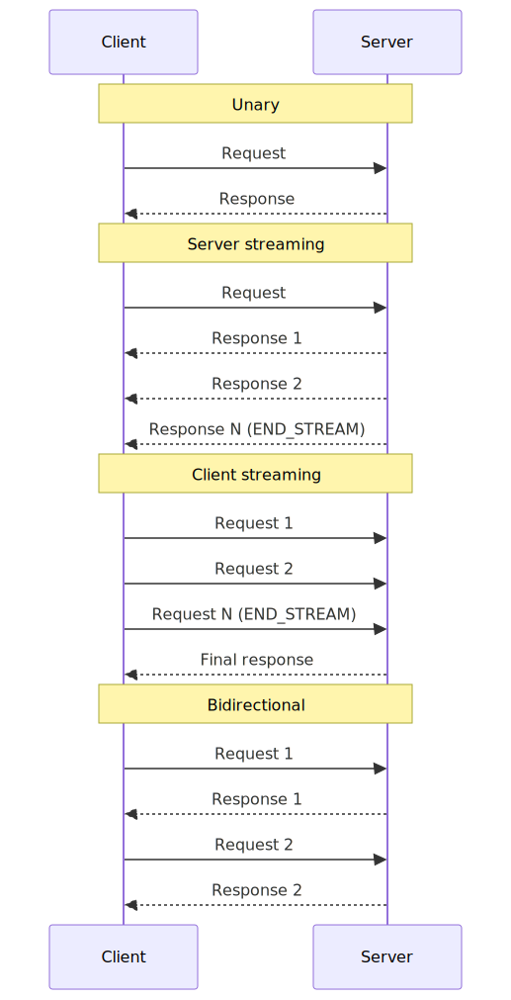
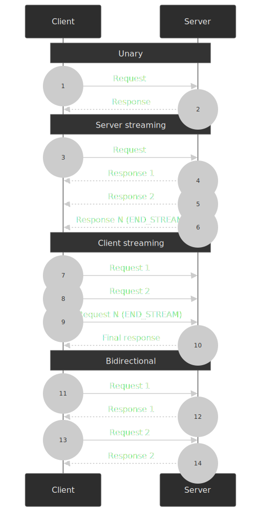

```protobuf title="order_service.proto"
service OrderService {
  rpc GetOrder(GetOrderRequest) returns (Order);
  rpc ListOrders(ListOrdersRequest) returns (stream Order);
  rpc UploadInvoice(stream Chunk) returns (UploadResult);
  rpc Sync(stream Event) returns (stream Event);
}
```

### Why browsers and load balancers are awkward

Two operational details are worth internalizing before betting on gRPC for an external API:

- **Browsers can't speak gRPC natively.** Browser JavaScript cannot read HTTP/2 trailers, and gRPC encodes its status in trailers — so [gRPC-Web][grpc-web-blog] frames the trailers into the body and a proxy (Envoy is the canonical choice) translates between gRPC-Web and gRPC-on-HTTP/2.[^grpc-web]
- **Load balancing is not free.** A single gRPC channel multiplexes many requests over one long-lived HTTP/2 connection. An L4 load balancer that hashes by connection sees one connection per client and pins all that traffic to one backend; you need an L7 (gRPC-aware) balancer or a client-side load-balancing strategy to fan out per-RPC.[^grpc-lb]

### Where gRPC earns its place

The companies that go all-in on gRPC do so because the framework solves multiple problems in one drop-in: a multilingual fleet gets generated stubs and a single contract; the network gets HTTP/2 multiplexing; the platform gets streaming primitives that are awkward to bolt onto REST.

- Netflix runs a deep gRPC stack internally — over 600 applications and 1,300 services on its `jrpc` Java framework, and uses protobuf [`FieldMask`][netflix-fieldmask] to let callers ask for only the fields they need over backend-to-backend gRPC.[^netflix-grpc]
- Uber rebuilt its mobile push platform on gRPC bidirectional streaming (over QUIC/HTTP/3) to replace battery-draining polling with a single long-lived stream, and used shadow traffic plus circuit breakers to migrate safely from the legacy REST path.[^uber-push]

The complement is also true: when there is no codegen budget, no platform discipline around `.proto` review, or no L7 mesh, gRPC tends to leak its internals into the application.

## GraphQL: shifting query shape to the client

GraphQL flips the request/response contract: the client picks fields, and the server's job is to resolve any tree the schema permits. The first-order win is that one round trip can replace two or three REST calls; the second-order cost is that every field is a potential query path on the server.

```graphql title="orders.gql"
query Orders {
  user(id: "123") {
    name
    email
    orders(first: 5) {
      id
      total
      items {
        productName
      }
    }
  }
}
```

In REST, the same data needs at least three trips (`/users/123`, `/users/123/orders`, then per-order `/orders/{id}/items`) and the client throws away anything it didn't ask for. In GraphQL, it is one POST with a known cost — provided the server can resolve the tree without falling into N+1.

### N+1, DataLoader, and per-request scoping

Per-field resolvers create the N+1 problem: a query that returns 100 orders and asks for each order's user issues 1 query for the orders and 100 follow-ups for the users. The standard fix is [Facebook's DataLoader pattern][graphql-dataloader] — coalesce all the `load(key)` calls inside a single tick of the event loop, then issue a single `WHERE id IN (...)` query.[^dataloader]

```javascript title="user-loader.js"
const userLoader = new DataLoader(async (userIds) => {
  const users = await db.users.findByIds(userIds)
  return userIds.map((id) => users.find((u) => u.id === id))
})

const resolvers = {
  Order: {
    user: (order) => userLoader.load(order.userId),
  },
}
```

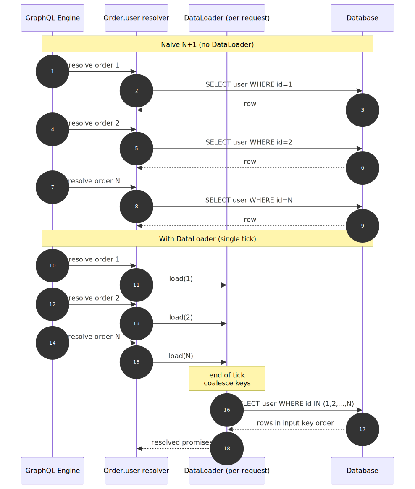
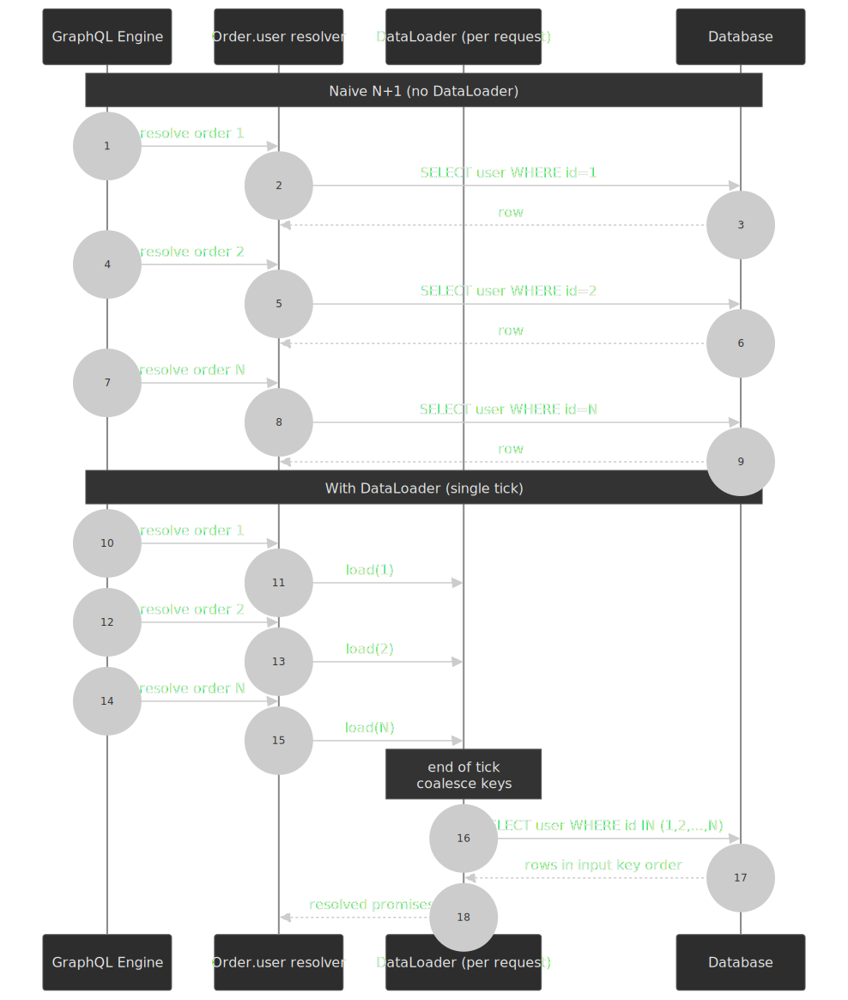

> [!IMPORTANT]
> DataLoader caches **per-instance**, and the recommended pattern is one DataLoader instance per request. Sharing a loader between requests leaks data (and identity) between users.[^dataloader]

[Shopify's GraphQL Batch][shopify-graphql-batch] is the Ruby equivalent: same pattern, same gotcha. The performance impact in their stack is reported as a step-change in query count, not a constant factor.[^shopify-batch]

### Caching, complexity, and the security surface

GraphQL throws away two things REST gets for free:

- **HTTP caching.** Queries are POSTed (the body holds the query), so CDNs and browsers won't cache the response by URL. The mitigation is a **persisted operation** model (sometimes called *trusted documents*): the server keeps an allowlist of pre-registered queries, the client sends a SHA-256 hash, and the request becomes idempotent and `GET`-able — and as a bonus, ad-hoc malicious queries are rejected at the gateway.[^trusted-docs] Apollo's *automatic persisted queries* (APQ) is the bandwidth-only version of the same idea.
- **Bounded server work.** Every field is a code path. Without depth and complexity limits, an attacker (or a sloppy client) can ask for `friends { friends { friends { ... } } }` and burn server budget. Production GraphQL gateways enforce maximum depth, weight-based query complexity, and per-cost rate limiting.

GitHub's public GraphQL API illustrates both ends: it ships an explicit schema-first surface alongside the older REST API, uses persisted queries for the mobile clients, and publishes its [query cost limits][github-rate-limits] up front.[^github-graphql]

### When GraphQL earns its place

- Mobile clients with heterogeneous data needs (different screens, different field selections per release).
- BFF / aggregator nodes consolidating multiple downstream services into one request shape.
- Frontends that iterate faster than the backend can ship endpoints.

It is rarely a fit for simple CRUD APIs (the abstraction tax is real), file uploads (multipart extension required), or fully-public APIs where you cannot enforce persisted operations.

## API versioning

A version strategy is a contract about how the API will break, not whether. Three families dominate.

### URL path versioning

```http title="URL path"
GET /v1/users
GET /v2/users
```

Trade-offs:

- **Wins:** explicit, impossible to miss; load balancer can route on path; multiple versions can be separate deployments.
- **Loses:** versioned URLs aren't really resource identifiers; clients must update every URL on a major bump.
- **Used by:** Twitter, Facebook, Google. Long-lived versions with multi-year overlap are normal.

### Header-based versioning

```http title="Custom Accept media type"
GET /users HTTP/1.1
Accept: application/vnd.myapi.v2+json
```

Trade-offs:

- **Wins:** URLs stay stable; the version sits in content negotiation where it semantically belongs.
- **Loses:** invisible in browser address bars and curl-by-default; some intermediaries silently strip custom headers; harder to test with "just change the URL".

### Date-based versioning (Stripe's model)

[Stripe's API versioning][stripe-versioning] is the most quoted example of API stability as a feature. The version is a date, e.g. `Stripe-Version: 2024-10-01`. The mechanism that makes it work is layered:

1. **Account pinning.** The first API call from a new account pins it to the most recent version.[^stripe-versioning]
2. **Header override.** A `Stripe-Version` header on a request overrides the pin, used for testing the next version before flipping the account.
3. **Compatibility layers.** Internal code is always written against the latest schema; request and response transformation modules walk older versions backward to the request's pinned date.

```http title="Date-pinned request"
GET /v1/customers HTTP/1.1
Stripe-Version: 2024-10-01
Authorization: Bearer sk_test_...
```

The architectural cost is real: the transformation modules accumulate, and the backend is permanently responsible for older shapes. The win is that code written against the API in 2011 still works in 2026.[^stripe-2011]

### What counts as a breaking change

| Breaking                                | Additive (safe)                                 |
| --------------------------------------- | ----------------------------------------------- |
| Removing a field                        | Adding a new optional field                     |
| Changing a field's type or semantics    | Adding a new endpoint                           |
| Removing or renaming an endpoint        | Adding a new optional query parameter           |
| Changing an error code or shape         | Adding a new enum value (if clients tolerate it) |
| Tightening a previously-loose validation | Loosening a previously-strict validation        |

The safest deprecation pattern is to keep the old field, return both, and surface a structured deprecation warning so consumers can act before the sunset:

```json title="Deprecation envelope"
{
  "data": { "id": "cus_123", "legacy_id": "cus_123" },
  "_warnings": [
    {
      "code": "deprecated_field",
      "message": "Field 'legacy_id' is deprecated. Use 'id' instead.",
      "deprecated_at": "2024-01-01",
      "sunset_at": "2025-01-01"
    }
  ]
}
```

## Pagination

The right pagination model is dictated by the data model and the access pattern, not by personal preference.


### Offset

```http title="Offset request"
GET /orders?limit=20&offset=40
```

Postgres (and every other relational engine) implements `LIMIT n OFFSET k` by walking the result set and discarding the first `k` rows. Page 1 is fast; page 1,000 is not.[^cursor-pagination]

| Use when               | Avoid when                          |
| ---------------------- | ----------------------------------- |
| Datasets < ~10K rows   | Datasets where users page deep      |
| Need "jump to page N"  | Underlying data churns              |
| Data is mostly static  | Latency at depth must stay constant |

### Cursor

```http title="Cursor request"
GET /orders?limit=20&after=eyJpZCI6MTIzNH0
```

A cursor is an opaque token — usually a base64-encoded JSON of the sort key — that tells the server "resume after this row". Internally:

```sql title="Cursor seek"
SELECT *
FROM orders
WHERE (created_at, id) > ($cursor_created_at, $cursor_id)
ORDER BY created_at, id
LIMIT 20;
```

Index seek instead of scan-and-discard; latency stays flat regardless of depth.

### Keyset

Same shape as cursor, but the keys travel as named query parameters instead of an opaque token:

```http title="Keyset request"
GET /orders?limit=20&created_after=2024-01-15T10:30:00Z&id_after=12345
```

Keyset trades opacity for debuggability. The query is the same, and so is the cost — but the schema leaks into the URL, so a future change of sort columns is a breaking change.

### Decision matrix

| Factor                  | Offset       | Cursor | Keyset |
| ----------------------- | ------------ | ------ | ------ |
| Dataset size            | < 10K        | Any    | Any    |
| Page depth              | Shallow only | Any    | Any    |
| "Jump to page" UI       | Yes          | No     | No     |
| Data churns mid-scroll  | Skips, dups  | Stable | Stable |
| Implementation cost     | Trivial      | Medium | Medium |
| Latency vs depth        | O(offset)    | O(1)   | O(1)   |

A reproducible benchmark on a 1,000,000-row table puts the gap at roughly **17×** at depth — keyset/cursor in the tens of milliseconds, offset in the hundreds.[^cursor-pagination] The exact multiplier varies with the index; the shape never does.

## Rate limiting

Rate limiting is two decisions in a trench coat: which algorithm shapes the traffic, and which response contract the client uses to back off.


### Token bucket

A bucket of capacity `B` is refilled at rate `r` tokens/sec. Each request consumes one token; an empty bucket means a `429`. Bursts up to `B` are allowed; sustained throughput is bounded by `r`.

[AWS API Gateway][aws-apigw-throttle] uses a token bucket per region, per account, per stage, per method, per usage-plan client — a small hierarchy of buckets evaluated bottom-up.[^aws-apigw] The default account-level steady-state is 10,000 requests/sec with a 5,000-request burst capacity.[^aws-apigw-quotas]

> [!TIP]
> Token bucket's biggest footgun is that the burst is accumulated capacity, not "extra throughput". If a long-idle client floods the API with `B` requests, your downstreams are responsible for surviving them, not the rate limiter.

### Leaky bucket

A queue of capacity `Q` drains at constant rate `r`. Bursts are absorbed by the queue, not by passing through; if the queue is full, the request is rejected. Output is perfectly smooth at the cost of queue latency.

Leaky bucket is the right shape when the downstream cannot tolerate bursts — a third-party API with its own throttle, a legacy system with low concurrency, or a database with a known slow path. It is the wrong shape for a UI that benefits from immediate feedback.

### Sliding window

| Variant         | Memory      | Accuracy    | Burst behavior |
| --------------- | ----------- | ----------- | -------------- |
| Sliding window log     | O(requests in window) | Exact       | Smooth        |
| Sliding window counter | O(1)                  | Approximate | Smooth        |

The counter variant blends the current and previous fixed window with a weighted overlap: if the previous 60-second window saw 50 requests and we are 25 seconds into a window with 30 so far, the effective count is `30 + 50 × (35/60) ≈ 59.2`. Redis-backed implementations almost always pick the counter variant for its O(1) memory footprint and good-enough accuracy.

### Headers and the contract with the client

[RFC 6585][rfc6585] defines the `429 Too Many Requests` status code, and the [`Retry-After`][rfc-retry-after] header tells the client how long to wait. The IETF [`draft-ietf-httpapi-ratelimit-headers`][rl-headers-draft] standardizes the header surface for advertising the current rate-limit state. The current draft (`-10`) consolidates everything into a single structured `RateLimit` field; older drafts shipped as separate `RateLimit-Limit`, `RateLimit-Remaining`, and `RateLimit-Reset` headers, which is what most existing APIs still emit.[^ratelimit-headers]

```http title="Rate-limit response (legacy split-header form)"
HTTP/1.1 429 Too Many Requests
RateLimit-Limit: 100
RateLimit-Remaining: 0
RateLimit-Reset: 30
Retry-After: 30
Content-Type: application/json
```

```http title="Rate-limit response (current draft, single structured field)"
HTTP/1.1 429 Too Many Requests
RateLimit: "default"; r=0; t=30
Retry-After: 30
Content-Type: application/json
```

Either form should be present on success responses too, not only on `429`s — clients that can see "remaining = 12" pace themselves; clients that only see `429` retry-storm.

## Machine-readable contracts

### OpenAPI

[OpenAPI 3.1.0 (released February 2021)][openapi-31] aligned the schema dialect with [JSON Schema 2020-12][openapi-jsonschema-blog]; before that, OpenAPI's schema language was a near-but-not-quite subset of JSON Schema, and the two ecosystems didn't compose cleanly.[^openapi-31] The practical implication is that any modern tool that speaks JSON Schema — code generators, validators, IDE plugins — can validate against an OpenAPI 3.1 document directly.

Authoring rule of thumb: generate the spec from code annotations (`@RequestMapping`, `@OperationId`, decorators in Python/TS) rather than handwriting YAML; the spec drifts the moment the source of truth lives in a different file from the implementation.

### AsyncAPI

OpenAPI describes request/response APIs. [AsyncAPI][asyncapi-30] describes message-driven ones — Kafka topics, AMQP queues, MQTT channels, WebSockets — using a similar shape but a different vocabulary: *channels* instead of paths, and *operations* (`send`/`receive`) instead of HTTP verbs. The 3.0 release decouples channels from operations, so a single channel can host multiple operations and be referenced across services.[^asyncapi-30]

```yaml title="orders.asyncapi.yaml"
asyncapi: 3.0.0
info:
  title: Order Events
  version: 1.0.0
channels:
  orderCreated:
    address: orders/created
    messages:
      orderCreated:
        payload:
          type: object
          properties:
            orderId: { type: string }
            total: { type: number }
operations:
  publishOrderCreated:
    action: send
    channel:
      $ref: '#/channels/orderCreated'
```

[Springwolf][springwolf] is the canonical Spring-side generator: it scans `@KafkaListener`, Spring AMQP, JMS, and SNS/SQS annotations and emits an AsyncAPI document at runtime, with a UI similar to Swagger UI.[^springwolf]

## Real-world surfaces

The pattern most production systems converge on is **multiple protocols, one team**.

### Slack: REST + Events API + Socket Mode

Slack ships a REST [Web API][slack-apis] for outbound calls (post message, list channels), an [Events API][slack-events] for inbound webhooks ("a user reacted to a message"), and Socket Mode (WebSocket) for apps that can't expose a public webhook endpoint. The legacy [RTM API][slack-rtm] (raw WebSocket pushed by the server) is in long-tail deprecation — modern Slack apps cannot use it, and `rtm.start` no longer behaves as advertised.[^slack-rtm] The choice is deliberate: REST keeps the integration developer experience accessible (no protobuf, no codegen), and the asynchronous channel is split between webhooks (default) and Socket Mode (firewall-friendly).

### Netflix: gRPC inside the wall

Netflix runs gRPC for backend-to-backend traffic across hundreds of services and a thousand-plus contracts in its `jrpc` Java framework, and uses protobuf `FieldMask` to let callers ask for partial response shapes — a clean way to dodge the over-fetching that any RPC framework with a fixed message shape inherits.[^netflix-grpc] The REST surface lives at the edge for browser clients and cacheable assets.

### GitHub: REST and GraphQL side-by-side

GitHub kept its REST API and added [GraphQL][github-graphql-docs] alongside it. The GraphQL API is the better fit for the mobile and integration surfaces that need flexible field selection; REST stays around for backward compatibility and for ops that benefit from HTTP caching. GraphQL clients use persisted operations to enable caching and to enforce a query allowlist.[^github-graphql]

## Common pitfalls

### Treating gRPC as a REST replacement on the browser

The mistake: a benchmark says gRPC is faster, so the team ships it for the browser API too. The price: every request now needs a gRPC-Web proxy, browser DevTools can't read the body, and the build pipeline owns a `.proto`-to-TS toolchain it didn't budget for.[^grpc-web] The fix: gRPC for service-to-service, REST or GraphQL for the browser.

### GraphQL without complexity limits

The mistake: a public GraphQL endpoint with no depth or cost ceiling. The price: a single attacker query exhausts your CPU. The fix: depth limit (10–15 is typical), per-field cost weights, and either a persisted-operation allowlist or strict cost-based rate limiting.

### Offset pagination as the default

The mistake: `LIMIT 20 OFFSET 100000` ships fine in dev (small dataset) and falls over in prod. The price: deep pages take seconds, and the database CPU graph looks like a sawtooth. The fix: default to cursor or keyset pagination, and cap the maximum offset if "jump to page" is a hard requirement.

### Breaking the API "because no one uses that field"

The mistake: a field is removed in a point release because the team can't see anyone using it in their analytics. The price: a long tail of mobile clients fail until users update — except the users who have notifications off and never will. The fix: treat the API as infrastructure. Additive changes only. Deprecate, sunset, then remove — and surface the sunset date in the response.

## Practical takeaways

| Constraint            | REST                  | gRPC               | GraphQL                    |
| --------------------- | --------------------- | ------------------ | -------------------------- |
| Public API            | Default               | Proxy required     | Lock down with allowlist   |
| Internal services     | Verbose at scale      | Default            | Usually overkill           |
| Mobile apps           | Many round trips      | Efficient + streams| Flexible field selection   |
| Browser direct        | Native                | Needs gRPC-Web     | Native                     |
| Streaming             | SSE / workarounds     | First-class        | Subscriptions (extra spec) |
| Edge caching          | First-class           | Custom             | Persisted operations       |

A defensible default for a greenfield surface in 2026:

- REST + OpenAPI for the public surface.
- gRPC for the internal mesh (with `FieldMask` if you need partial responses).
- GraphQL only where the client mix actually benefits from query flexibility — a BFF, a mobile app with many surfaces, or a developer platform — and only with persisted operations and cost limits.
- For every protocol: cursor pagination, [`RateLimit`][rl-headers-draft] headers on every response (not just `429`), and date-based or path-based versioning chosen for how often the contract will break.

## Appendix

### Prerequisites

- HTTP/1.1 and HTTP/2 fundamentals.
- Familiarity with JSON and at least one binary serialization format.
- Working knowledge of relational query plans for the pagination section.

### Footnotes

[^fielding-context]: Fielding was co-author of [RFC 2616][rfc2616] (HTTP/1.1) while writing the dissertation, which is why REST is so tightly coupled to HTTP semantics.

[^fielding-2008]: Roy T. Fielding, [REST APIs must be hypertext-driven][fielding-2008], 2008.

[^proto-encoding]: [Protocol Buffers — Encoding][protobuf-encoding] documents the varint tag layout, field-number costs, and the wire types.

[^proto-defaults]: [Language Guide (proto 3) — Default values and unknown fields][protobuf-proto3].

[^auth0-protobuf]: Auth0, [Beating JSON performance with Protobuf][auth0-protobuf]. Concrete benchmark on real REST traffic; the gap shrinks once gzip is involved.

[^victoria-protobuf]: VictoriaMetrics, [How Protobuf Works — The Art of Data Encoding][victoria-protobuf]. Includes a Go benchmark for parse cost; the parser CPU difference is consistently larger than the byte-size difference.

[^grpc-http2]: [gRPC over HTTP/2][grpc-http2] (gRPC core docs) — pseudo-headers, framing, and trailer semantics.

[^grpc-web]: [The state of gRPC in the browser][grpc-web-blog]. Trailers in body, proxy required.

[^grpc-lb]: [gRPC Load Balancing][grpc-lb] — explains why a multiplexed HTTP/2 connection breaks naive L4 balancing and what client-side balancing or look-aside LB does instead.

[^netflix-grpc]: Netflix Tech Blog, [Practical API Design at Netflix, Part 1: Using protobuf FieldMask][netflix-fieldmask].

[^uber-push]: Uber Engineering, [Uber's Next Gen Push Platform on gRPC][uber-push]. Shadow-traffic migration and circuit-breaker fallback are the operational details worth copying.

[^dataloader]: [`graphql/dataloader`][graphql-dataloader] — README documents the per-request cache rule and the single-tick batching contract.

[^shopify-batch]: Shopify Engineering, [Solving the N+1 Problem for GraphQL through Batching][shopify-graphql-batch].

[^trusted-docs]: Benjie Gillam, [GraphQL Trusted Documents][trusted-docs] — the security framing for persisted operations.

[^github-graphql]: [GitHub GraphQL API documentation][github-graphql-docs] and the public [rate limits page][github-rate-limits].

[^stripe-versioning]: Stripe Engineering, [APIs as infrastructure: future-proofing Stripe with versioning][stripe-versioning]. The compatibility-layer architecture is the actual lesson.

[^stripe-2011]: The Stripe API has been stable since launch in 2011; the same pinned 2011 request shape still works today.

[^cursor-pagination]: Milan Jovanović, [Understanding Cursor Pagination and Why It's So Fast — Deep Dive][cursor-pagination]. Benchmark and SQL plans for offset vs keyset on a million-row table.

[^aws-apigw]: AWS, [Throttle requests to your REST APIs in API Gateway][aws-apigw-throttle].

[^aws-apigw-quotas]: AWS, [Amazon API Gateway quotas][aws-apigw-quotas].

[^ratelimit-headers]: IETF, [`draft-ietf-httpapi-ratelimit-headers`][rl-headers-draft]. The RFC editors moved from three separate headers to a single structured field; both are still in the wild.

[^openapi-31]: OpenAPI Initiative, [OpenAPI Specification 3.1.0 released][openapi-31].

[^asyncapi-30]: AsyncAPI Initiative, [AsyncAPI 3.0 specification][asyncapi-30].

[^springwolf]: Baeldung, [Documenting Spring Event-Driven API Using AsyncAPI and Springwolf][springwolf].

[^slack-rtm]: Slack, [Slack APIs overview][slack-apis] and the [`rtm.start` deprecation note][slack-rtm-deprecation].

### References

[fielding-rest]: https://roy.gbiv.com/pubs/dissertation/rest_arch_style.htm
[fielding-2008]: https://roy.gbiv.com/untangled/2008/rest-apis-must-be-hypertext-driven
[richardson-maturity]: https://martinfowler.com/articles/richardsonMaturityModel.html
[rfc2616]: https://www.rfc-editor.org/rfc/rfc2616
[rfc9111]: https://www.rfc-editor.org/rfc/rfc9111
[rfc6585]: https://www.rfc-editor.org/rfc/rfc6585
[rfc-retry-after]: https://www.rfc-editor.org/rfc/rfc9110#field.retry-after
[protobuf-encoding]: https://protobuf.dev/programming-guides/encoding/
[protobuf-proto3]: https://protobuf.dev/programming-guides/proto3/
[auth0-protobuf]: https://auth0.com/blog/beating-json-performance-with-protobuf/
[victoria-protobuf]: https://victoriametrics.com/blog/go-protobuf/
[grpc-http2]: https://grpc.github.io/grpc/core/md_doc__p_r_o_t_o_c_o_l-_h_t_t_p2.html
[grpc-web-blog]: https://grpc.io/blog/state-of-grpc-web/
[grpc-lb]: https://grpc.io/blog/grpc-load-balancing/
[netflix-fieldmask]: https://netflixtechblog.com/practical-api-design-at-netflix-part-1-using-protobuf-fieldmask-35cfdc606518
[uber-push]: https://www.uber.com/us/en/blog/ubers-next-gen-push-platform-on-grpc/
[graphql-dataloader]: https://github.com/graphql/dataloader
[shopify-graphql-batch]: https://shopify.engineering/solving-the-n-1-problem-for-graphql-through-batching
[trusted-docs]: https://benjie.dev/graphql/trusted-documents
[github-graphql-docs]: https://docs.github.com/en/graphql
[github-rate-limits]: https://docs.github.com/en/graphql/overview/resource-limitations
[stripe-versioning]: https://stripe.com/blog/api-versioning
[cursor-pagination]: https://www.milanjovanovic.tech/blog/understanding-cursor-pagination-and-why-its-so-fast-deep-dive
[aws-apigw-throttle]: https://docs.aws.amazon.com/apigateway/latest/developerguide/api-gateway-request-throttling.html
[aws-apigw-quotas]: https://docs.aws.amazon.com/apigateway/latest/developerguide/limits.html
[rl-headers-draft]: https://datatracker.ietf.org/doc/html/draft-ietf-httpapi-ratelimit-headers
[openapi-31]: https://www.openapis.org/blog/2021/02/18/openapi-specification-3-1-released
[openapi-jsonschema-blog]: https://json-schema.org/blog/posts/validating-openapi-and-json-schema
[asyncapi-30]: https://www.asyncapi.com/docs/reference/specification/v3.0.0
[springwolf]: https://www.baeldung.com/java-spring-doc-asyncapi-springwolf
[slack-apis]: https://docs.slack.dev/apis/
[slack-events]: https://api.slack.com/apis/connections/events-api
[slack-rtm]: https://docs.slack.dev/tools/node-slack-sdk/rtm-api/
[slack-rtm-deprecation]: https://docs.slack.dev/changelog/2021-10-rtm-start-to-stop
