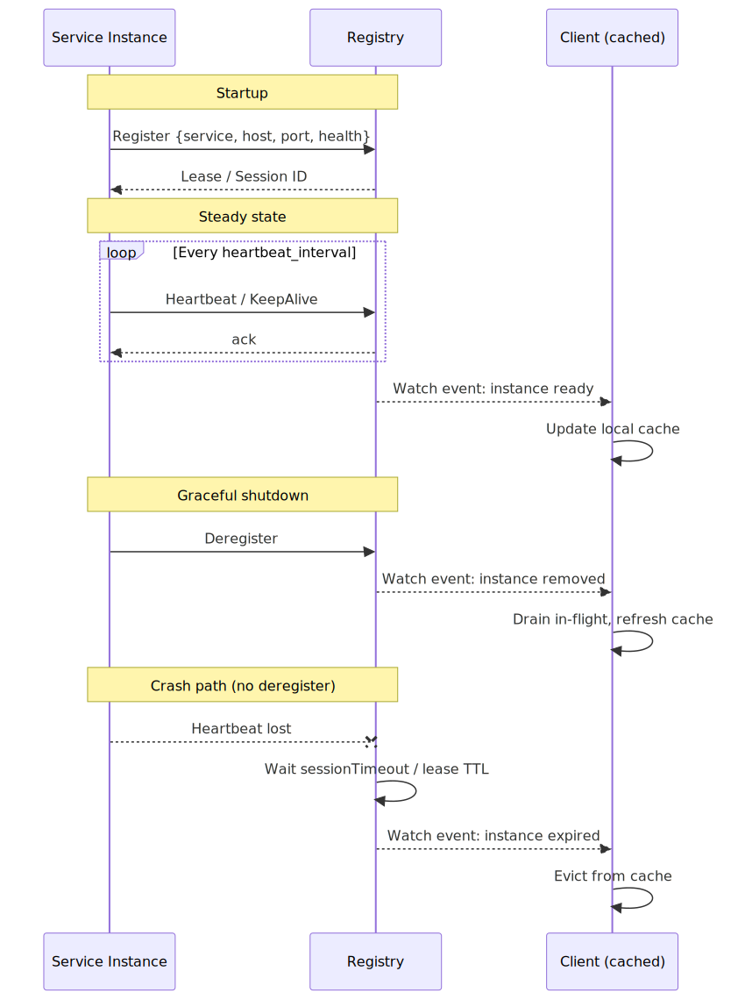
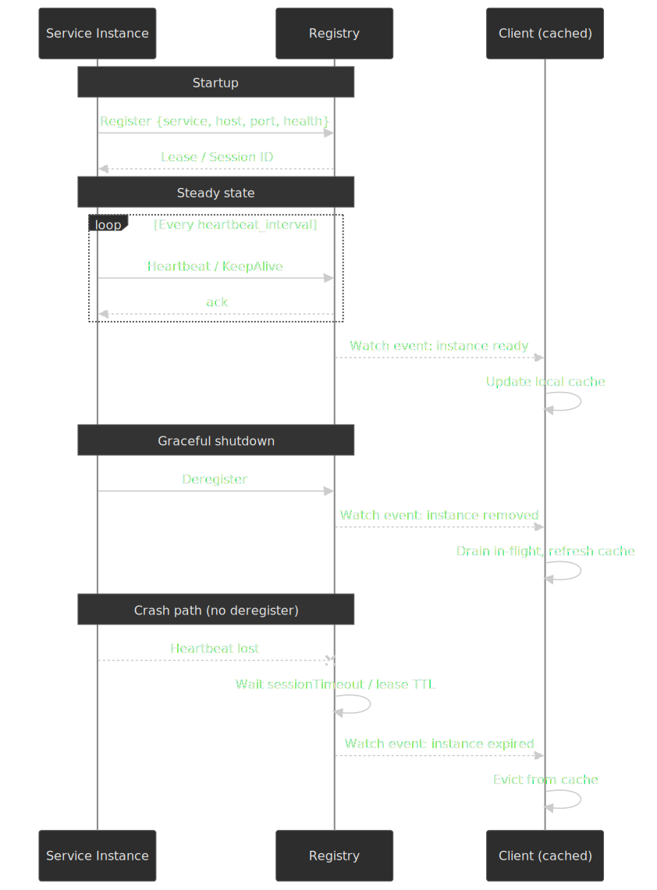
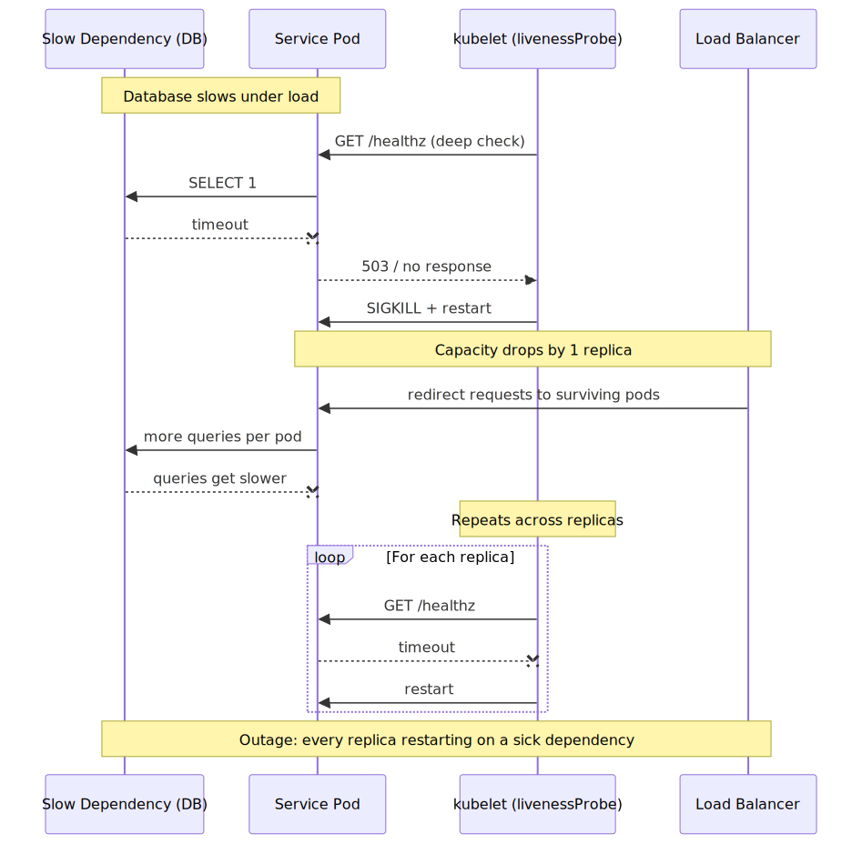
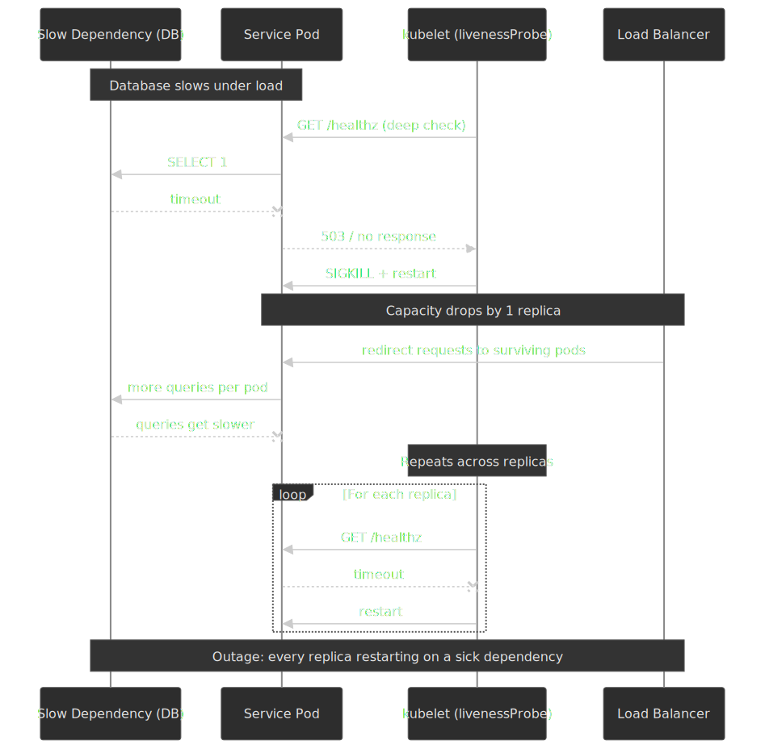
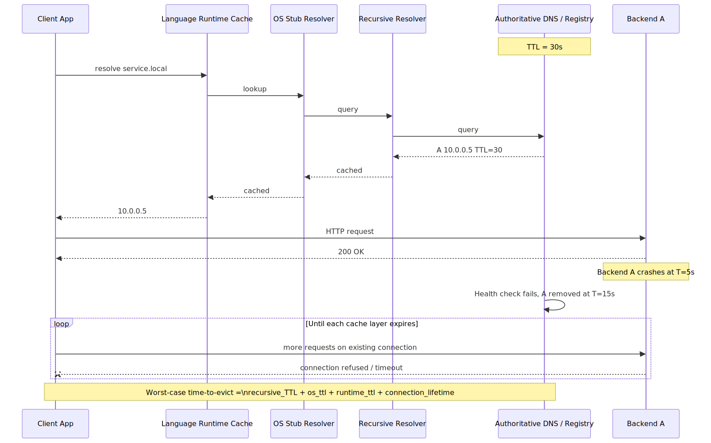
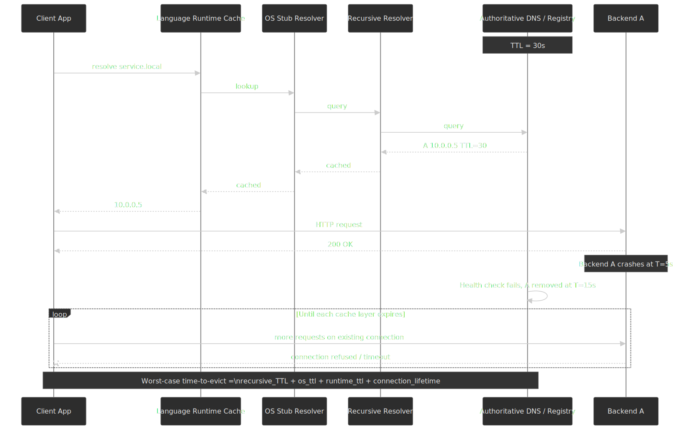

# Service Discovery and Registry Patterns

In a system where instances scale, fail, and migrate continuously, "where is service B right now?" is a real-time question with a stale answer. This article is for senior engineers picking a discovery pattern, choosing a registry, designing health checks, and reasoning about the failure modes that show up when the registry, the network, or the workload misbehaves at the same time.




## Mental Model

Service discovery sits between three moving parts: workloads that come and go, a registry that remembers who is where, and clients that need a usable answer in milliseconds. Two trade-offs dominate everything that follows.

**Freshness vs. stability.** Low TTLs and aggressive health checks detect failures fast but amplify load on the registry and on the workloads being probed. High TTLs and tolerant checks are stable but route traffic to stale endpoints — sometimes for minutes after a crash. Every knob in this article (TTL, heartbeat interval, unhealthy threshold, self-preservation, lease duration) is a position on this curve.

**Consistency model of the registry.** A **CP** registry ([ZooKeeper](https://zookeeper.apache.org/doc/current/zookeeperOver.html), [etcd](https://etcd.io/docs/v3.5/learning/api_guarantees/)) guarantees a linearizable view of who is registered, but rejects writes from minority partitions. An **AP** registry ([Eureka](https://github.com/Netflix/eureka/wiki)) keeps accepting registrations everywhere and may serve stale endpoints during a partition. Neither is "better"; they are different positions on CAP, with different obligations on the client.

| Pattern      | Discovery logic | Network hops    | Client coupling       |
| ------------ | --------------- | --------------- | --------------------- |
| Client-side  | In the client   | 1 (direct)      | High (registry-aware) |
| Server-side  | In a proxy/LB   | 2 (via proxy)   | Low (proxy handles)   |
| Service mesh | In sidecar      | 2 (via sidecar) | Zero (transparent)    |

Read the rest of the article through this lens: every pattern, registry, and probe design is a way to navigate freshness vs. stability under a chosen consistency model.

## Discovery Models

### Client-Side Discovery

The client queries the registry directly, receives a list of healthy instances, and selects one using a local load-balancing algorithm.

**Mechanism:**

1. Service instances register with the registry on startup
2. Client queries registry for available instances of target service
3. Client applies load-balancing logic (round-robin, least connections, weighted)
4. Client calls the selected instance directly

**Best when:**

- Homogeneous client stack (all services use the same framework)
- Latency-critical paths where an extra hop matters
- Need sophisticated client-side load balancing (request hedging, adaptive routing)

**Trade-offs:**

- ✅ One fewer network hop than server-side
- ✅ Client controls load-balancing algorithm
- ✅ No central bottleneck in the data path
- ❌ Discovery logic must be implemented per language/framework
- ❌ Registry changes require client library updates across all services
- ❌ Clients become coupled to registry protocol

**Real-world example:** Netflix's OSS stack pairs [Eureka](https://github.com/Netflix/eureka/wiki) as the registry with Ribbon (now retired and superseded by [Spring Cloud LoadBalancer](https://spring.io/projects/spring-cloud-commons)) for client-side load balancing. Each service embeds the client, which refreshes Eureka's registry on a default 30-second cycle and balances locally. This design removed the central LB as a bottleneck on the data path — important at Netflix's scale where a central LB would otherwise sit in front of billions of requests per day. The price was tight client coupling: every service had to be on the JVM and integrate with the same client library.

### Server-Side Discovery

Clients call a well-known proxy or load balancer address. The proxy queries the registry and forwards requests to healthy instances.

**Mechanism:**

1. Service instances register with the registry
2. Proxy/LB subscribes to registry changes
3. Client calls the proxy using a stable DNS name or VIP
4. Proxy selects an instance and forwards the request

**Best when:**

- Polyglot environment with many languages/frameworks
- External clients (mobile apps, third-party integrations)
- Centralized policy enforcement (rate limiting, auth)

**Trade-offs:**

- ✅ Clients remain simple—no discovery logic
- ✅ Single point to update discovery behavior
- ✅ Language-agnostic
- ❌ Additional network hop adds latency
- ❌ Proxy can become a throughput bottleneck
- ❌ Proxy is a single point of failure (must be HA)

**Real-world example:** AWS [Application Load Balancer](https://docs.aws.amazon.com/elasticloadbalancing/latest/application/introduction.html) integrates with ECS/EKS for server-side discovery. Services register automatically via [target group health checks](https://docs.aws.amazon.com/elasticloadbalancing/latest/application/target-group-health-checks.html); clients resolve the ALB's DNS name. AWS handles ALB availability across AZs, but customers pay an extra hop (typically a low-millisecond addition for in-region traffic) and a throughput envelope that can be raised but needs planning for flash crowds.

### Service Mesh (Sidecar Pattern)

A proxy sidecar runs alongside each service instance, handling all inbound and outbound traffic transparently. The control plane configures sidecars with routing rules and service locations.

**Mechanism:**

1. Sidecar proxy (e.g., Envoy) is injected into each pod
2. Control plane (e.g., Istiod) watches the service registry and pushes configs to sidecars
3. Application calls `localhost` or a virtual address
4. Sidecar intercepts, resolves destination, and forwards

**Best when:**

- Zero-trust networking requirements (mTLS everywhere)
- Complex traffic management (canary deployments, traffic mirroring)
- Observability requirements (distributed tracing without code changes)
- Large organizations where mandating client library changes is impractical

**Trade-offs:**

- ✅ Completely transparent to applications
- ✅ Consistent behavior across all languages
- ✅ Rich traffic management capabilities built-in
- ❌ Per-pod resource overhead — Istio's published [performance baseline](https://istio.io/latest/docs/ops/deployment/performance-and-scalability/) puts a 2-worker Envoy sidecar at ~0.20 vCPU and ~60 MiB at 1,000 RPS with 1 KB payloads, before custom filters and telemetry
- ❌ Operational complexity of the mesh control plane (CRDs, certificate rotation, version skew between sidecar and control plane)
- ❌ Debugging gets harder — every call now has three failure surfaces (app, local sidecar, remote sidecar) and observability has to disambiguate them

**Real-world example:** Lyft built [Envoy](https://eng.lyft.com/announcing-envoy-c-l7-proxy-and-communication-bus-92520b6c8191) specifically to migrate from a monolith to microservices without rewriting existing services. The sidecar pattern let them add mTLS, rate limiting, and observability uniformly across hundreds of services and dozens of languages. The accepted trade-off: a single network call now spans three components that can independently fail (app → local sidecar → remote sidecar → app), and operational tooling has to attribute latency and errors across the chain.

### Decision Matrix

| Factor               | Client-Side   | Server-Side       | Service Mesh  |
| -------------------- | ------------- | ----------------- | ------------- |
| Latency overhead     | None          | +1-5ms            | +0.5-1ms      |
| Client complexity    | High          | Low               | None          |
| Language support     | Per-language  | Any               | Any           |
| Operational overhead | Low           | Medium            | High          |
| mTLS/security        | DIY           | DIY or LB feature | Built-in      |
| Traffic management   | Limited       | LB-dependent      | Comprehensive |
| Best scale           | < 50 services | Any               | > 20 services |

## Registration and Heartbeat Lifecycle

Every registry implements roughly the same lifecycle even though the wire protocols differ: a workload registers on startup, sends heartbeats (or holds a lease) while it serves traffic, and is removed when it crashes, drains, or fails to renew. The interesting questions are *who* observes the deregistration and *how fast*.




Three rules of thumb fall out of this lifecycle:

- **Detection latency = `heartbeat_interval × max_missed + propagation_delay`.** Tightening any one of these costs registry load or false positives, not all of them at once.
- **Graceful shutdown is a deliberate act.** Workloads should deregister and drain before exiting; otherwise the registry has to wait for the heartbeat / lease timeout, and clients keep dispatching requests during that window.
- **The client cache is part of the freshness budget.** A client that polls every 30 s gets, in the worst case, a 30 s view of a registry that itself takes 10 s to detect failure — 40 s end-to-end before traffic stops flowing to a dead instance.

## Registry Design and Technologies

### ZooKeeper

**Architecture:** Hierarchical namespace (like a filesystem) with znodes. Consensus via ZAB protocol (Paxos variant). Strongly consistent (CP).

**Service discovery pattern:** Services create ephemeral znodes under `/services/{service-name}/`. Ephemeral nodes auto-delete when the session (TCP connection) terminates. Clients watch the parent node for child changes.

```text
/services
  /user-service
    /instance-001  -> {"host": "10.0.1.5", "port": 8080}
    /instance-002  -> {"host": "10.0.1.6", "port": 8080}
```

**Session timeout behavior:** The client sends heartbeats every `sessionTimeout/3`. The server side enforces `minSessionTimeout = 2 × tickTime` and `maxSessionTimeout = 20 × tickTime`; with the default `tickTime` of 2,000 ms that puts the negotiated session timeout in a 4–40 s window. When the server receives no heartbeat within the session timeout, it expires the session and atomically deletes all ephemeral nodes owned by it[^zk-sessions].

**Failure mode:** If a service process hangs (paused JVM, GC stall, blocked event loop) without dropping its TCP connection, the ZooKeeper session can survive while the application is unable to serve traffic. The ephemeral node stays, and clients keep dispatching requests to a zombie instance. **Mitigation:** Pair session liveness with an application-level health endpoint that the registry's clients (or a sidecar) actively probe.

**Best when:**

- Already using ZooKeeper for coordination (leader election, distributed locks)
- Strong consistency for service membership is non-negotiable
- Java-heavy environment (the native client is Java; non-JVM clients exist but are second-class)

**Historical context:** Apache Kafka used ZooKeeper for broker registration and topic metadata via ephemeral znodes (`/brokers/ids/{broker-id}`) until the [KRaft](https://developer.confluent.io/learn/kraft/) work moved metadata into a self-managed Raft quorum. KRaft was marked production-ready in [Kafka 3.3](https://cwiki.apache.org/confluence/display/KAFKA/KIP-833%3A+Mark+KRaft+as+Production+Ready), ZooKeeper mode was deprecated in 3.5, and ZooKeeper support was removed entirely in [Kafka 4.0](https://kafka.apache.org/blog#apache_kafka_400_release_announcement). New Kafka clusters never run ZooKeeper, but the original design is still the cleanest illustration of ephemeral-znode service discovery in production.

### etcd

**Architecture:** Flat key-value store with directory-like prefixes. Consensus via Raft. Strongly consistent (CP). gRPC API with watches.

**Service discovery pattern:** Services create keys with leases. Leases expire after TTL unless refreshed via `LeaseKeepAlive` stream.

```text
/services/user-service/instance-001 -> {"host": "10.0.1.5", "port": 8080}
/services/user-service/instance-002 -> {"host": "10.0.1.6", "port": 8080}
```

**Lease mechanism:** A lease is created with a TTL (commonly 5–30 s). Keys are attached to a lease. The client must keep the lease alive via the streaming `LeaseKeepAlive` RPC; if it stops, the server's background revoke task (running on a tight tick — every 500 ms in current implementations) sweeps the lease and atomically deletes every key attached to it[^etcd-lease].

> [!IMPORTANT]
> Lease expiration is *lazy*. The server commits the deletes after the TTL has elapsed *and* the next sweep runs, so there is a sub-second window where a key can outlive its lease. For mutual exclusion patterns (locks, leader election), guard the critical section with an etcd `Txn` that asserts the lease's `ModRevision` rather than trusting "I have a lease" inferred from the keep-alive stream.

**Watch guarantees:** Events are ordered by revision, never duplicated, and atomic across a multi-key transaction. Watches resume from a known revision after a disconnect, so a brief network blip does not skip events[^etcd-guarantees].

**API guarantees:** Strict serializability for KV operations — every completed operation is durable and linearizable.

**Best when:**

- Running Kubernetes (etcd is the backing store)
- Need strong consistency with better performance than ZooKeeper
- Polyglot environment (gRPC clients for many languages)

**Benchmark context:** etcd v3.3 averaged ~35,000 writes/sec with ~28 ms average latency in the [etcd-io/dbtester](https://github.com/etcd-io/dbtester) head-to-head — roughly 2× ZooKeeper r3.5.3-beta's throughput and ~6× Consul v1.0.2's for pure KV writes (1 KB values, 256 B keys). Treat these as an order-of-magnitude reference, not a current benchmark; modern releases of all three have moved on, and discovery workloads are read-heavy rather than write-heavy.

### Consul

**Architecture:** Gossip-based membership (Serf/SWIM protocol) + Raft for state machine. Provides service discovery, health checking, and KV store in one package.

**Service discovery pattern:** Services register via agent API or config files. Consul agents run on every node and participate in gossip. Discovery via DNS (`user-service.service.consul`) or HTTP API.

**Health checking:** Multi-layer health model:

1. **Agent gossip:** SWIM protocol detects node failures (UDP-based, ~1 second detection)
2. **Service checks:** HTTP, TCP, script, or gRPC checks configured per service
3. **TTL checks:** Service must actively report healthy within TTL

**Gossip protocol details:** Consul uses [SWIM](https://www.cs.cornell.edu/projects/Quicksilver/public_pdfs/SWIM.pdf) with HashiCorp's [Lifeguard](https://www.hashicorp.com/en/blog/making-gossip-more-robust-with-lifeguard) enhancements (self-awareness, dogpile, buddy probes) on top of the [`memberlist`](https://github.com/hashicorp/memberlist) library. [LAN gossip](https://developer.hashicorp.com/consul/docs/concept/gossip) runs on port 8301 (UDP+TCP) for intra-datacenter membership; [WAN gossip](https://developer.hashicorp.com/consul/docs/reference/architecture/ports) runs on port 8302 for federation. Nodes flagged "suspicious" get a Lifeguard-tuned grace period to refute the suspicion before being declared `failed`.

**DNS interface:** Query `user-service.service.consul` to get healthy instances. SRV records carry both port and target so a single lookup answers "where" and "on what port." By default Consul DNS responses carry a [TTL of 0](https://developer.hashicorp.com/consul/docs/reference/agent/configuration-file/dns) (no caching) — discovery freshness is the priority. Per-service `service_ttl` and a global `node_ttl` enable client-side caching for hot lookups; `only_passing` filters out services whose health checks are not in the `passing` state.

**Best when:**

- Need DNS-based discovery (legacy systems, databases)
- Multi-datacenter deployments (WAN gossip built-in)
- Want integrated health checking without external tools

**Real-world example:** HashiCorp's own platform uses Consul for discovery across multiple clouds. Their WAN gossip federation allows services in AWS to discover services in GCP without central coordination. Trade-off: Consul's KV performance lags etcd/ZooKeeper—they use it for discovery, not high-throughput configuration storage.

### Eureka

**Architecture:** AP system designed for AWS. Peer-to-peer replication between servers. Eventually consistent.

**Service discovery pattern:** Services register via REST API, then send heartbeats every 30 seconds. Clients cache the registry locally and refresh every 30 seconds.

**Self-preservation mode:** Eureka recomputes a renewal threshold every `eureka.server.renewal-threshold-update-interval-ms` (default 15 minutes) as `expected_renewals_per_minute × eureka.server.renewal-percent-threshold` (default `0.85`). If actual renewals fall below that threshold, the server stops evicting instances on the assumption that it is observing a network partition rather than a mass-failure event[^eureka-sp].

The calculation: with 2 registered instances and the default 30-second heartbeat (2 renewals/instance/minute) plus a +1 buffer, expected = 5 renewals/min, threshold = `5 × 0.85 ≈ 5`. Below 5 actual renewals/min, self-preservation activates.

**Trade-off:** Self-preservation deliberately delays the detection of *actual* failures to protect against false positives. A service that crashes during self-preservation stays in the registry until either the mode exits (renewal rate recovers) or the instance gracefully deregisters. Clients see those stale endpoints and must absorb the failures via timeouts, retries, and circuit breakers — exactly the discipline Netflix already builds into its services with [Hystrix](https://github.com/Netflix/Hystrix) / [resilience4j](https://resilience4j.readme.io/).

**Best when:**

- Running on AWS with fluctuating network conditions
- Prefer availability over consistency for discovery
- Already using Spring Cloud ecosystem

**Netflix's rationale:** Netflix chose AP semantics because routing to a potentially-stale instance is better than returning "no instances available" during a network partition. Their services are designed to handle transient failures gracefully (circuit breakers, retries, fallbacks).

### Kubernetes DNS (CoreDNS)

**Architecture:** [CoreDNS](https://coredns.io/) replaces the legacy `kube-dns` and is the default cluster DNS in modern Kubernetes. The [`kubernetes` plugin](https://coredns.io/plugins/kubernetes/) watches the API server for `Service` and `EndpointSlice` objects and synthesises DNS records on the fly.

**Service discovery pattern:** Services get DNS names from the standard Kubernetes [DNS schema](https://kubernetes.io/docs/concepts/services-networking/dns-pod-service/):

- ClusterIP: `my-service.namespace.svc.cluster.local` → the Service's ClusterIP VIP (kube-proxy fans it out to backends).
- Headless (`clusterIP: None`): `my-service.namespace.svc.cluster.local` → an A/AAAA per ready Pod.

**Record types:**

- `A` / `AAAA`: Service name → ClusterIP or Pod IPs.
- `SRV`: `_port-name._protocol.service.namespace.svc.cluster.local` → port + target.

**Caching behavior:** The `kubernetes` plugin defaults to a record TTL of [5 seconds](https://coredns.io/plugins/kubernetes/) — short on purpose, because Kubernetes endpoints turn over fast. The general-purpose [`cache` plugin](https://coredns.io/plugins/cache/) sits in front of upstream resolvers (defaults: 3,600 s success, 1,800 s denial) and is independent of in-cluster service records. The cluster-side TTL is only half the story; clients also obey the pod's `/etc/resolv.conf`, which sets `ndots: 5` by default and turns each unqualified lookup into a chain of search-domain queries.

**Best when:**

- You are already on Kubernetes.
- Discovery is in-cluster only, or the small set of cross-cluster needs can be handled with [`external-dns`](https://github.com/kubernetes-sigs/external-dns).
- The traffic-management story is simple — DNS does not give you weighted routing, canary splits, or per-request hashing on its own; reach for a service mesh or in-cluster gateway when those become real requirements.

## Health Checking Patterns

> [!IMPORTANT]
> In Kubernetes, "health check" is three different probes with three different consequences. [Liveness](https://kubernetes.io/docs/concepts/configuration/liveness-readiness-startup-probes/) failures restart the container, [readiness](https://kubernetes.io/docs/concepts/configuration/liveness-readiness-startup-probes/) failures pull the Pod out of `Endpoints`, and [startup](https://kubernetes.io/docs/concepts/configuration/liveness-readiness-startup-probes/) probes hold off the other two until first init completes. Use a different endpoint per probe.

### Health Check Types

| Type   | Mechanism                    | Detects                           | Doesn't Detect                        |
| ------ | ---------------------------- | --------------------------------- | ------------------------------------- |
| TCP    | Connect to port              | Process crash, port not listening | Application deadlock, OOM, logic bugs |
| HTTP   | GET /health returns 2xx      | Above + app can handle requests   | Dependency failures, partial failures |
| gRPC   | grpc.health.v1.Health        | Same as HTTP for gRPC services    | Same limitations                      |
| Script | Run arbitrary command        | Custom conditions                 | Slow if script is expensive           |
| TTL    | Service must actively report | Service-reported health           | Service hangs but doesn't report      |

### Designing Health Endpoints

**Shallow vs. deep checks:**

- **Shallow** (`/health`): Returns 200 if the process is running. Fast, stable, but misses dependency issues.
- **Deep** (`/health/ready`): Checks database connections, downstream services, cache. Comprehensive but can cause cascading failures if a shared dependency is slow.

**Recommendation:** Use shallow checks for liveness (keep the container running) and load balancer health (keep traffic flowing). Use deep checks for *readiness* — they signal whether to admit traffic, not whether to restart. Putting a deep check on `livenessProbe` is the canonical way to turn "the database is slow" into "the database is slow *and* every replica just got restarted".

**Example: separate endpoints for separate probes.**

```go title="health.go" collapse={1-8}
package main

import (
    "context"
    "database/sql"
    "net/http"
    "time"
)

// /healthz — liveness: process is alive and the goroutine answering this is responsive.
func livenessHandler(w http.ResponseWriter, _ *http.Request) {
    w.WriteHeader(http.StatusOK)
}

// /readyz — readiness: dependencies are reachable and we can usefully serve traffic.
func readinessHandler(db *sql.DB) http.HandlerFunc {
    return func(w http.ResponseWriter, r *http.Request) {
        ctx, cancel := context.WithTimeout(r.Context(), 2*time.Second)
        defer cancel()
        if err := db.PingContext(ctx); err != nil {
            http.Error(w, "db unreachable", http.StatusServiceUnavailable)
            return
        }
        w.WriteHeader(http.StatusOK)
    }
}
```

### Health Check Timing

**Interval and timeout configuration:**

| Parameter           | Too Low                                   | Too High                           | Typical Range             |
| ------------------- | ----------------------------------------- | ---------------------------------- | ------------------------- |
| Interval            | High load on registry/services            | Slow failure detection             | 5-30 seconds              |
| Timeout             | False positives from slow networks        | Delayed detection of hung services | 2-10 seconds              |
| Unhealthy threshold | Flapping                                  | Traffic to dead instances          | 2-3 consecutive failures  |
| Healthy threshold   | Premature traffic to recovering instances | Slow recovery                      | 2-3 consecutive successes |

**Failure detection time:** `interval × unhealthy_threshold + timeout`

Example: 10s interval, 3 failures required, 5s timeout = 35 seconds worst-case detection time.

### Anti-Patterns




**Checking dependencies in liveness probes:** When the database is slow, every replica's liveness probe times out. Kubelet restarts the pods. Fewer warm replicas now serve the same load, the database degrades further, more probes time out — cascading failure. The fix is structural, not knob-tuning: liveness checks the process; readiness checks dependencies.

**Health checks that do work:** A health endpoint that issues a database write "to verify it works" adds load proportional to the number of probers across every load balancer, orchestrator, and monitor that hits it. With 3 replicas × 5-second checks × 3 distinct probers, that is 108 writes/minute purely synthetic, before a single user request. Verify with cheap reads or rely on real-traffic SLOs.

**Single health endpoint for all purposes:** Load balancers, orchestrators, and monitoring all want different things. A single `/health` that checks everything will either be too aggressive (recycling pods on transient blips) or too lenient (admitting traffic to broken instances). Default to three: `/healthz` (liveness, process-only), `/readyz` (readiness, dependency-aware), `/startupz` for slow-booting services.

## DNS-Based Discovery Trade-offs

### Why DNS Is Attractive

- Universal support — every language, framework, and CLI tool already understands DNS.
- No client library required, so legacy and polyglot stacks work unchanged.
- Familiar operational model: delegated zones, TTLs, NXDOMAIN, the same monitoring you already have for everything else.

### Why DNS Is Limited




**TTL and caching:** DNS responses are cached at multiple layers — upstream resolver, host stub resolver, language runtime, application connection pool. Even with a 30-second cluster-side TTL, the worst-case time-to-evict is the *sum* of those layers, not the smallest:

1. Client resolves at `T=0`, gets instance A.
2. Instance A crashes at `T=5`.
3. The OS resolver cache holds the answer until `T=30`; the language runtime may cache longer (see JVM below).
4. Even after the resolver re-queries, an existing TCP/HTTP connection to A keeps draining requests until it is closed.

**Negative caching:** A query before any instance registers returns `NXDOMAIN`, which is itself cacheable. RFC 2308 sets the negative TTL from the SOA's `MINIMUM` field (or the SOA TTL, whichever is smaller). Operating systems extend this — historically [up to 15 minutes on some Windows versions](https://learn.microsoft.com/en-us/troubleshoot/windows-server/networking/dns-client-resolver-cache). New instances registering after the NXDOMAIN do not help the cache until that timer expires.

**JVM DNS caching.** The Java security property [`networkaddress.cache.ttl`](https://docs.aws.amazon.com/sdk-for-java/latest/developer-guide/jvm-ttl-dns.html) defaults to `-1` (cache forever) *only when a `SecurityManager` is installed*; without one — the modern default since [SecurityManager was deprecated for removal in JDK 17](https://openjdk.org/jeps/411) — the JVM caches successful lookups for 30 seconds. Either way, set the value explicitly in `java.security` (`networkaddress.cache.ttl=30` is a defensible default; `-Dsun.net.inetaddr.ttl=30` is the legacy fallback). Always reason about it as configured-by-the-platform, not as an implicit JVM behavior.

**Load balancing limitations:**

- DNS round-robin gives equal weight to all returned A/AAAA records — no least-connections, no latency-based steering, no zone awareness.
- DNS has no health awareness on its own. Registry-backed DNS (Consul, CoreDNS, Route53 with health checks) prunes unhealthy records, but only after the registry's own check loop converges.
- **Connection reuse defeats DNS-based load balancing.** Modern protocols (HTTP/2, gRPC) prefer one long-lived multiplexed connection per origin. A client that resolved once and connected once will keep firing requests at the same backend even after fresh records appear; new replicas added by autoscaling get little or no traffic. The standard fixes are L7 load balancing (Envoy in front of the pool, or a [headless `Service` + gRPC client-side LB](https://kubernetes.io/docs/concepts/services-networking/service/#headless-services) with subchannels per endpoint), and server-side `MAX_CONNECTION_AGE`/`MAX_CONNECTION_IDLE` to force periodic re-resolution.

### Hybrid Patterns

**Consul DNS + HTTP API:** Use DNS for simple lookups from legacy apps; use the HTTP API (or [prepared queries](https://developer.hashicorp.com/consul/api-docs/query)) for sophisticated clients that need health status, tags, weights, and metadata.

**External DNS + service discovery:** Tools like [`external-dns`](https://github.com/kubernetes-sigs/external-dns) sync Kubernetes `Service` and `Ingress` records to Route 53 / Cloud DNS so out-of-cluster clients can resolve in-cluster services without bolting on extra infrastructure.

## Security Considerations

### Authentication and Authorization

**mTLS (Mutual TLS):**

Service mesh deployments typically enforce mTLS between all services:

1. A control-plane CA (Istiod, [SPIRE](https://spiffe.io/docs/latest/spire-about/)) signs short-lived workload certificates.
2. Each workload gets an X.509 certificate whose Subject Alternative Name encodes a [SPIFFE](https://spiffe.io/docs/latest/spiffe-about/spiffe-concepts/) ID — Istio's default format is `spiffe://<trust-domain>/ns/<namespace>/sa/<service-account>`.
3. Sidecars terminate TLS via Envoy's [Secret Discovery Service](https://www.envoyproxy.io/docs/envoy/latest/configuration/security/secret) and verify the peer's SPIFFE ID, not its IP.
4. Authorization policies (Istio `AuthorizationPolicy`, Cilium network policies) reference principals derived from SPIFFE identity, so re-IP'd or re-scheduled pods inherit the right access automatically.

**Registry access control:**

- **Consul:** ACL tokens with per-service read/write permissions
- **etcd:** Role-based access control (RBAC) with per-key permissions
- **ZooKeeper:** ACLs per znode with digest, IP, or SASL authentication

**Service-to-service authorization patterns:**

| Pattern              | How It Works                            | Complexity | Flexibility          |
| -------------------- | --------------------------------------- | ---------- | -------------------- |
| mTLS identity        | Certificate SAN/CN checked by sidecar   | Medium     | Service-level        |
| JWT validation       | Bearer token verified by app or sidecar | Medium     | Request-level claims |
| External authz (OPA) | Sidecar calls policy engine             | High       | Arbitrary policies   |

### Threat Model

**Registry compromise:** An attacker who can write to the registry can redirect traffic to malicious instances. **Mitigation:** ACLs, audit logging, separate registry access from application credentials.

**Service impersonation:** Without mTLS, any pod on the network can claim to be any service. **Mitigation:** mTLS with identity verification, network policies.

**Health check bypass:** Malicious instance returns healthy but serves malformed responses. **Mitigation:** Deep health checks, anomaly detection in service mesh.

## Failure Modes and Split-Brain

 keeps the majority writable and forces the minority read-only; an AP registry (Eureka) keeps both sides writable and diverges, then reconciles via timestamp on heal.")


### Network Partitions

**CP registry (ZooKeeper, etcd) behavior:**

During a partition, the minority loses quorum and stops accepting writes. Services in the minority can't register or update health status; existing entries persist until their session or lease expires (and even then, only the *server* can delete them, which by definition is in the majority). Reads served from the minority are bounded-stale at best — etcd refuses linearizable reads from a non-leader, but serializable reads continue to return last-known state.

**AP registry (Eureka) behavior:**

Both partitions continue operating independently. Each side accepts registrations and serves discovery from its local view. After the partition heals, peers reconcile by replaying registrations and using `lastDirtyTimestamp` to prefer the most recent state. Combined with self-preservation mode, this can leave clients pointing at instances that no longer exist for several minutes after the heal.

### Split-Brain Scenarios

**Scenario:** Network partition separates 2 of 5 etcd nodes.

- 3-node partition has quorum (3/5 > 50%), continues normal operation
- 2-node partition can't achieve quorum, becomes read-only
- Services in the 2-node partition can query cached data but can't register/deregister

**Mitigation strategies:**

1. **Odd number of registry nodes** (3, 5, 7)—ensures one partition always has majority
2. **Spread across failure domains**—if registry nodes are in different AZs, a single AZ failure doesn't lose quorum
3. **Client-side caching**—clients cache last-known-good instance list for graceful degradation

### Cascading Failures

**Registry overload pattern:**

1. Registry becomes slow under load
2. Health check timeouts increase
3. Instances marked unhealthy
4. Traffic redistributes to remaining instances
5. Remaining instances overload
6. More instances marked unhealthy
7. System collapse

**Mitigation:**

- Rate limit registration/deregistration operations
- Use exponential backoff with jitter for retries
- Implement circuit breakers between services and registry
- Self-preservation mode (Eureka's approach)

## Operational Considerations

### Capacity Planning

**Registry sizing:**

| Metric           | ZooKeeper    | etcd      | Consul          |
| ---------------- | ------------ | --------- | --------------- |
| Max services     | ~100K znodes | ~1M keys  | ~10K services   |
| Memory per entry | ~1KB         | ~256B     | ~1KB            |
| Write throughput | ~10K/sec     | ~35K/sec  | ~5K/sec         |
| Read throughput  | ~100K/sec    | ~100K/sec | Limited by Raft |

**Health check load:** `number_of_instances × check_frequency × checkers_per_instance`

Example: 1,000 instances, 5-second checks, 3 registry nodes = 600 checks/second cluster-wide.

### Monitoring

**Key metrics to track:**

- **Registration rate:** Spikes indicate deployment or scaling events; sustained high rates may indicate flapping
- **Deregistration rate:** High rates during non-deployment periods indicate failures
- **Health check latency:** p99 approaching timeout indicates infrastructure stress
- **Watch/subscription lag:** Time between state change and client notification
- **Registry leader elections:** Frequent elections indicate network instability or resource constraints

### Migration Strategies

**From static configuration to service discovery:**

1. Deploy registry alongside existing static configuration
2. Register services in both places
3. Migrate clients one at a time to use discovery
4. Verify with traffic shadowing
5. Remove static configuration

**Between discovery systems (e.g., Eureka to Consul):**

1. Run both registries in parallel
2. Services register with both
3. Migrate clients incrementally
4. Monitor error rates during transition
5. Decommission old registry

## Common Pitfalls

### 1. Trusting DNS TTLs

**The mistake:** Setting a 30-second TTL and assuming clients will re-resolve every 30 seconds.

**Why it happens:** DNS caching occurs at multiple layers (resolver, OS, language runtime) with different TTL handling.

**The consequence:** Traffic routes to stale instances for minutes after deregistration.

**The fix:** Understand your client's DNS behavior. For JVM, set `networkaddress.cache.ttl` in `java.security` (the legacy `sun.net.inetaddr.ttl` system property is the fallback). For long-lived HTTP/2 / gRPC connections, push load balancing to L7 (Envoy, headless `Service` + client-side LB) and force periodic reconnection (`MAX_CONNECTION_AGE`) so DNS re-resolution actually changes anything.

### 2. Health Checks as Liveness Probes

**The mistake:** Using deep health checks (that verify dependencies) for Kubernetes liveness probes.

**Why it happens:** "Comprehensive health checking" sounds like best practice.

**The consequence:** Database slowdown kills all pods via failed liveness probes, causing complete outage.

**The fix:** Shallow checks for liveness (is the process alive?), deep checks for readiness (can it serve traffic?).

### 3. Synchronous Registry Lookups in Hot Paths

**The mistake:** Calling the registry on every request to get the latest instance list.

**Why it happens:** Desire for freshest possible data.

**The consequence:** Registry becomes bottleneck; registry latency adds to every request latency.

**The fix:** Cache instance lists locally, refresh asynchronously (every 30 seconds), subscribe to change notifications where available.

### 4. Single Registry Cluster for All Environments

**The mistake:** Using one registry cluster for dev, staging, and production.

**Why it happens:** Operational simplicity, cost savings.

**The consequence:** A misconfigured dev service registers in production; a developer's load test overwhelms the shared registry.

**The fix:** Separate registry clusters per environment with network isolation.

## Practical Takeaways

Service discovery is infrastructure — invisible when it works, catastrophic when it fails. The defaults that hold up across most production systems:

- **Pick the discovery pattern by client coupling, not by latency.** Client-side wins when you own the client stack and need request-level intelligence. Server-side wins for polyglot or external clients. A mesh wins when you need uniform mTLS, traffic shaping, and observability *across* services without rewriting them.
- **Pick the registry by operational maturity, not benchmark numbers.** A well-operated Consul cluster beats a neglected etcd cluster. The discovery workload is read-heavy and small; what matters is partition behavior, on-call familiarity, and integration with your existing platform.
- **Treat freshness as a budget, not a target.** Detection latency = `heartbeat_interval × max_missed + propagation_delay + client_cache_ttl`. Pick each knob with the others in mind, and write the worst-case detection time on your runbook.
- **Separate the three Kubernetes probes.** `/healthz` for liveness (process), `/readyz` for readiness (dependencies), `/startupz` for slow boot. A single endpoint is the most common production-outage pattern in this space.
- **Design for stale discovery.** Use timeouts, retries with jittered backoff, and circuit breakers. Discovery tells you *where services might be*; your application has to handle when they aren't.

## References

### Prerequisites

- Understanding of distributed systems fundamentals (CAP theorem, consensus, eventual consistency).
- Familiarity with load balancing (L4 vs L7, connection vs request balancing).
- Basic knowledge of DNS resolution (TTLs, recursive vs authoritative, NXDOMAIN).

### Further reading

- [Microservices.io — Client-side discovery pattern](https://microservices.io/patterns/client-side-discovery.html)
- [Microservices.io — Server-side discovery pattern](https://microservices.io/patterns/server-side-discovery.html)
- [etcd API guarantees](https://etcd.io/docs/v3.5/learning/api_guarantees/) and [etcd lease mechanism](https://etcd.io/docs/v3.4/learning/api/)
- [Consul gossip protocol](https://developer.hashicorp.com/consul/docs/concept/gossip) and [Lifeguard enhancements](https://www.hashicorp.com/en/blog/making-gossip-more-robust-with-lifeguard)
- [Netflix Eureka — Server Self-Preservation Mode](https://github.com/Netflix/eureka/wiki/Server-Self-Preservation-Mode)
- [Kubernetes DNS for Services and Pods](https://kubernetes.io/docs/concepts/services-networking/dns-pod-service/)
- [Kubernetes Liveness, Readiness, and Startup Probes](https://kubernetes.io/docs/concepts/configuration/liveness-readiness-startup-probes/)
- [CoreDNS kubernetes plugin](https://coredns.io/plugins/kubernetes/) and [cache plugin](https://coredns.io/plugins/cache/)
- [Istio architecture](https://istio.io/latest/docs/ops/deployment/architecture/) and [performance baselines](https://istio.io/latest/docs/ops/deployment/performance-and-scalability/)
- [SPIFFE concepts](https://spiffe.io/docs/latest/spiffe-about/spiffe-concepts/) and [Istio + SPIRE integration](https://istio.io/latest/docs/ops/integrations/spire/)
- [ZooKeeper Programmer's Guide](https://zookeeper.apache.org/doc/current/zookeeperProgrammers.html) and [Administrator's Guide](https://zookeeper.apache.org/doc/current/zookeeperAdmin.html)
- [Apache Kafka KIP-833 — Mark KRaft as production ready](https://cwiki.apache.org/confluence/display/KAFKA/KIP-833%3A+Mark+KRaft+as+Production+Ready)
- [RFC 2308 — Negative Caching of DNS Queries](https://datatracker.ietf.org/doc/html/rfc2308)
- [SWIM: Scalable Weakly-consistent Infection-style Process Group Membership Protocol (Das, Gupta, Motivala)](https://www.cs.cornell.edu/projects/Quicksilver/public_pdfs/SWIM.pdf)
- [Airbnb SmartStack](https://medium.com/airbnb-engineering/smartstack-service-discovery-in-the-cloud-4b8a080de619) and [Lyft's announcement of Envoy](https://eng.lyft.com/announcing-envoy-c-l7-proxy-and-communication-bus-92520b6c8191)
- [etcd-io/dbtester benchmarks](https://github.com/etcd-io/dbtester)

[^zk-sessions]: ZooKeeper Programmer's Guide — [Sessions](https://zookeeper.apache.org/doc/r3.8.3/zookeeperProgrammers.html#ch_zkSessions). The min/max session timeout multipliers (`2 × tickTime`, `20 × tickTime`) are documented in the [ZooKeeper Administrator's Guide](https://zookeeper.apache.org/doc/r3.8.3/zookeeperAdmin.html#sc_advancedConfiguration).
[^etcd-lease]: [etcd v3 API — Lease service](https://etcd.io/docs/v3.4/learning/api/) and CNCF's [Mechanism and implementation of lease](https://www.cncf.io/blog/2023/11/01/mechanism-and-implementation-of-lease/) for the 500 ms revocation tick.
[^etcd-guarantees]: [etcd API guarantees](https://etcd.io/docs/v3.5/learning/api_guarantees/) — strict serializability for KV, atomic multi-key transactions, ordered and resumable watches.
[^eureka-sp]: [Netflix Eureka — Server Self-Preservation Mode](https://github.com/Netflix/eureka/wiki/Server-Self-Preservation-Mode) and Spring Cloud's [`eureka.server.renewal-percent-threshold`](https://docs.spring.io/spring-cloud-netflix/docs/current/reference/html/) (default `0.85`, recomputed every 15 minutes).
