# Sharded Counters

A counter is a single number that goes up. At interview-board scale that is one row, one mutex, one cache key. At production scale it is a hot key that absorbs every retry storm, every viral spike, and every replication queue your storage layer can produce. The fix is mechanical: split the one number across many physical keys, then learn to live with what that buys you and what it costs.

This article is a working reference for senior engineers who already know what a counter is and now have to choose a sharding strategy, an aggregation strategy, and a consistency model that matches a specific business need. It treats the counter problem as three orthogonal axes — **shard layout**, **aggregation timing**, and **consistency model** — and uses production architectures (Firestore, DynamoDB, Netflix, Meta TAO, Twitter Manhattan) as forcing functions for each decision.

 when staleness is acceptable.")


## Mental model

Three axes, picked independently, define your counter:

1. **Shard layout** — how a write is mapped to a physical key. Random, hash-based, or time-bucketed.
2. **Aggregation timing** — when N shard values become one displayed total. Synchronous on read, asynchronous in a rollup job, or a hybrid that mixes pre-rollup with a live tail.
3. **Consistency model** — what a reader is guaranteed to see and what the system gives up to provide it. Strong (linearizable) vs. eventual.

A fourth, sometimes-applicable axis is **representation**: keep an exact integer, accept a probabilistic estimate (HyperLogLog for cardinality, Count-Min Sketch for frequency), or use a **convergent replicated data type** (CRDT) such as a G-Counter or PN-Counter that lets independent replicas merge their states deterministically without coordination. Each representation changes the cost model — probabilistic structures trade bounded error for sub-linear space; CRDTs trade per-replica state growth for coordination-free writes.

> [!IMPORTANT]
> Sharding is a contention fix, not a consistency fix. Splitting one row into N rows does nothing for cross-row atomicity, double-counting under retry, or replication lag. Pick the shard layout for write throughput; pick the aggregation strategy and consistency model for everything else.

## Why a single counter melts

A "counter" in any modern database compiles down to a serialized mutation on a single replicated key, and every storage system caps how fast that key can be safely updated.

- **Cloud Firestore** documents an architectural ceiling around **one sustained write per second** per document, and the official remediation is the [Distributed counters pattern](https://firebase.google.com/docs/firestore/solutions/counters) — N shard documents whose values you sum on read.[^firestore-counters]
- **Amazon DynamoDB** caps each physical partition at **1,000 WCU/sec and 3,000 RCU/sec**. Adaptive capacity rebalances hot partitions but cannot break that ceiling for a single item; the AWS guidance is [write sharding by suffixing the partition key](https://docs.aws.amazon.com/amazondynamodb/latest/developerguide/bp-partition-key-design-sharding.html).[^dynamo-burst][^dynamo-sharding]
- **Apache Cassandra** is famously linear-scalable for upserts, but its **counter columns** are not idempotent and require a `read-before-write` round-trip, which collapses throughput by roughly two orders of magnitude relative to ordinary writes and has burned production teams.[^ably-counters]
- **Redis** can sustain ~100K+ ops/sec for `INCR` on a single instance with sub-millisecond latency, but it executes commands single-threaded — one key is still served by one CPU core at a time.[^redis-bench]

The numbers vary by an order of magnitude, but the shape is the same: per-key throughput is bounded, and once the application crosses that bound the system stops failing gracefully. Writes back up, retries amplify, and the surrounding p99 collapses.

| Storage             | Single-key sustained write ceiling                         | Notes                                              |
| ------------------- | ---------------------------------------------------------- | -------------------------------------------------- |
| Firestore document  | ~1/sec sustained                                           | Architectural; pattern is shards subcollection     |
| DynamoDB partition  | 1,000 WCU/sec (3,000 RCU/sec)                              | Hard per-partition cap; adaptive capacity helps    |
| Cassandra (regular) | ~7K–10K ops/sec/node (workload-dependent)                  | Linear-scalable horizontally                       |
| Cassandra (counter) | One-to-two orders of magnitude lower than regular writes   | Read-before-write semantics                        |
| Redis (single key)  | ~100K ops/sec                                              | Single-threaded command execution; pipeline helps  |

The "linear with shard count" approximation is real but optimistic. You also pay for the read path, the rollup pipeline, and the operational machinery to keep N shards healthy.

## Axis 1: Shard layout

### Random sharding

Pick a shard uniformly on each write. Trivially uniform with sufficient traffic, no per-write coordination, no rebalance cost.

```python
def increment(counter_id: str, value: int = 1) -> None:
    shard_id = random.randint(0, NUM_SHARDS - 1)
    db.increment(f"{counter_id}:shard:{shard_id}", value)
```

- **Best for**: general-purpose counters where the writer identity is irrelevant and approximate uniformity is "good enough".
- **Buys you**: trivial implementation, no skew under high traffic, easy to add shards.
- **Costs you**: every read fans out to all N shards (no caching shortcut by writer identity), and low-traffic counters skew badly because uniform-at-the-limit is not uniform at low N.

This is the layout Firestore explicitly recommends in its distributed-counter sample.[^firestore-counters]

### Hash-based sharding

Map a stable attribute — user ID, IP, session — to a shard via `hash(attr) % N`.

```python
def increment(counter_id: str, client_id: str, value: int = 1) -> None:
    shard_id = hash(client_id) % NUM_SHARDS
    db.increment(f"{counter_id}:shard:{shard_id}", value)
```

- **Best for**: per-client rate limiting (each client's increments stay on one shard, so its own counter is a single read), and any case where the attribute distribution is genuinely flat.
- **Buys you**: deterministic mapping enables localised reads — the rate-limit decision for one client is one shard read, not N.
- **Costs you**: any skew in the attribute (Pareto distributions, viral content, celebrity accounts) is preserved exactly. Resharding requires either consistent hashing or an offline migration. Hot shards reappear at scale.

### Time-based sharding

Bucket writes by wall-clock window: `key:YYYY-MM-DDTHH`. The active window is hot; old windows freeze and can be compacted into a single value.

```python
def increment(counter_id: str, value: int = 1) -> None:
    window = current_window()
    shard_id = random.randint(0, SHARDS_PER_WINDOW - 1)
    db.increment(f"{counter_id}:{window}:shard:{shard_id}", value)
```

- **Best for**: time-series analytics, windowed dashboards, anything where the natural query is "how many in the last X minutes" rather than "how many ever".
- **Buys you**: bounded active-shard count, natural compaction story, easy TTL.
- **Costs you**: cross-window aggregation is non-trivial, and you now depend on time synchronization across writers (clock skew is a category of bug here).

Twitter's Manhattan exposes a dedicated **Timeseries Counters** service for exactly this pattern — millions of increments per second for observability metrics, with windowed retention built in.[^manhattan]

### Decision matrix: shard layout

| Factor                    | Random            | Hash-based             | Time-based              |
| ------------------------- | ----------------- | ---------------------- | ----------------------- |
| Implementation complexity | Low               | Medium                 | High                    |
| Write distribution        | Even (at scale)   | Sensitive to attribute | Even per window         |
| Read amortization         | None              | Per-attribute locality | Per-window caching      |
| Resharding cost           | Trivial           | High (rehash)          | Per-window cohort       |
| Default fit               | General counters  | Per-client metrics     | Analytics with TTL      |

## Axis 2: Aggregation timing

### Synchronous fan-in

Read all N shards on every query, sum, return. Exact, slow, simple.

```python
def get_count(counter_id: str) -> int:
    return sum(
        db.get(f"{counter_id}:shard:{i}") or 0
        for i in range(NUM_SHARDS)
    )
```

- **Latency**: O(N) database reads per query.
- **Accuracy**: exact under linearizable single-shard reads.
- **Failure mode**: any unavailable shard forces a choice — fail the read or return a known-incomplete value. Make this choice explicit; do not let it default into "silently wrong".
- **Use when**: N is small, accuracy is non-negotiable, the read rate is low (financial reconciliation, inventory audit).

### Asynchronous rollup

A background worker periodically sums all shards into a single cached total. Reads hit cache.

```python
def rollup(counter_id: str) -> None:
    total = sum_all_shards(counter_id)  # O(N) once per interval
    cache.set(f"{counter_id}:total", total, ttl=2 * ROLLUP_INTERVAL)

def get_count(counter_id: str) -> int:
    cached = cache.get(f"{counter_id}:total")
    if cached is not None:
        return cached
    return sum_all_shards(counter_id)  # always-on fallback
```

- **Latency**: O(1) cache read on the hot path.
- **Accuracy**: stale by up to one rollup interval (plus rollup duration).
- **Failure mode**: rollup lag drifts unboundedly when the worker can't keep up; cache eviction throws traffic onto the slow path; reads can appear non-monotonic if rollup batches process out of order.
- **Use when**: read rate dominates, staleness on the order of seconds is acceptable (likes, view counts, public dashboards).

### Hybrid: pre-rollup plus live tail

Maintain a rolled-up total **and** an event log of mutations since the last rollup. Reads return `pre_rollup + sum(events_since_last_rollup)`. This is the structure Netflix's counter abstraction uses for its "Accurate Global Counter" mode.[^netflix-counter][^netflix-infoq]

- **Latency**: O(1) typical, O(K) where K is the live tail length.
- **Accuracy**: bounded by event-log durability and the rollup window.
- **Failure mode**: dual write/read paths double the operational surface — both the cache and the event log have to be healthy; replay logic has to be idempotent.
- **Use when**: you need real-time-ish accuracy without paying the synchronous fan-in cost on every read.




### Decision matrix: aggregation

| Factor          | Synchronous     | Async rollup           | Hybrid                                |
| --------------- | --------------- | ---------------------- | ------------------------------------- |
| Read latency    | O(N) shard reads| O(1) cache read        | O(1) cache + O(K) tail                |
| Accuracy        | Exact           | Stale by ≤ T           | Configurable; near-real-time          |
| Operational deps| DB only         | DB + cache + worker    | DB + cache + event log + worker       |
| Best for        | Financial       | Social metrics         | Mixed accuracy/latency requirements   |

## Axis 3: Consistency model

The third axis is the one that most often gets picked by accident. Write it down.

### Strong consistency

Every successful read returns the result of the most recent successful write. Implementations require a write quorum that overlaps with the read quorum and (in practice) consensus — Paxos, Raft, or single-leader replication. The cost is real:

- Write latency is bounded by the slowest required replica acknowledgement.
- Availability degrades during partitions because the system refuses to serve from a minority.
- Read-side caching is constrained — caches must be invalidated synchronously or bypassed for strong reads.

**Use when** the application semantics literally cannot tolerate a stale or lost increment: bank balance, ledger entry, hard rate-limit enforcement, inventory decrement.

### Eventual consistency

Given no further updates, replicas converge. Reads may return stale values. Writes are acknowledged locally and propagated asynchronously. This is the default for almost every social-graph workload because the cost of strong consistency at that scale is unacceptable.

> [!NOTE]
> Eventual consistency does not mean "no guarantees". Useful systems layer per-session monotonicity, read-your-writes, and bounded-staleness guarantees on top of eventual replication. Match the guarantee to the user-visible expectation.

**Use when** the user-visible value is a count whose absolute correctness has no business meaning at the second-by-second timescale — like counts, view counts, follower counts, public engagement metrics.

### Why TAO chose availability

Meta's TAO is the canonical case. The original 2013 USENIX paper describes TAO as serving the social graph at **a billion reads per second and millions of writes per second** across geographically distributed clusters, and explicitly states: "It has a minimal API and explicitly favors availability and per-machine efficiency over strong consistency."[^tao-paper] Meta's own engineering write-up phrased the same trade-off more bluntly:

> For many of our products, TAO losing consistency is a lesser evil than losing availability.[^tao-blog]

The reasoning is concrete: a user looking at a like count tolerates a stale number; the same user does not tolerate the app failing to load. Counter design at TAO-scale is downstream of that single editorial decision.

### Consistency-by-use-case

| Use case                          | Consistency  | Reason                                      |
| --------------------------------- | ------------ | ------------------------------------------- |
| Bank balance, ledger              | Strong       | A lost increment is a financial loss        |
| Inventory decrement               | Strong       | Double-sell risk                            |
| Hard API quota enforcement        | Strong       | Quota overshoot has billing or abuse impact |
| Like / view / share counts        | Eventual     | Staleness is invisible to humans            |
| Analytics dashboards              | Eventual     | Aggregations dominate; staleness expected   |
| Soft rate limits / spam scoring   | Eventual     | False positives matter more than precision  |

## Probabilistic counting

When the question is "how many distinct things" or "how often does X appear" rather than "what is the exact integer", probabilistic data structures change the economics by orders of magnitude. The common ones in production are HyperLogLog (cardinality) and Count-Min Sketch (frequency).

### HyperLogLog

HyperLogLog estimates the cardinality of a multiset by tracking the maximum number of leading zeros across hashed elements — the intuition is that observing a hash with $k$ leading zeros suggests on the order of $2^k$ distinct elements have been seen. Flajolet's original 2007 paper proved a typical accuracy of **2% standard error using 1.5 KB of memory** for cardinalities exceeding $10^9$.[^hll-paper] The Google "HyperLogLog in Practice" paper introduced HLL++: 64-bit hashing for high cardinalities, sparse representation for low cardinalities, and empirical bias correction.[^hll-google]

The single most useful production property is **mergeability**: sketches built independently on different shards can be merged into a single sketch without loss of accuracy. This makes HLL the textbook solution for distributed cardinality estimation.

```python
def global_unique_users() -> int:
    sketches = [node.fetch_hll("users") for node in nodes]
    return reduce(hll_merge, sketches).estimate()
```

Meta's [HyperLogLog in Presto](https://engineering.fb.com/2018/12/13/data-infrastructure/hyperloglog/) post is the canonical war story: replacing exact `COUNT DISTINCT` with `APPROX_DISTINCT` on internal analytics workloads cut a job that previously needed terabytes of memory and several days down to "**12 hours and less than 1 MB of memory**" with accuracy bounded by HLL's standard error.[^fb-presto]

**When to use**: distinct-visitor counting, distinct-query counting, cardinality estimation in any analytics pipeline. **When not to use**: when downstream code subtracts, divides, or chains many merges (errors compound).

### Count-Min Sketch

Count-Min estimates per-item frequency in a stream. A Count-Min sketch is a `d × w` matrix of counters; every insert hashes the item with `d` independent hash functions and increments the corresponding cell in each row. Queries return the minimum across the `d` cells (which minimises overcounting from hash collisions).

The original Cormode/Muthukrishnan paper proved the canonical bound: with the sketch sized as $w = \lceil e/\varepsilon \rceil$ and $d = \lceil \ln(1/\delta) \rceil$, the estimate $\hat{a}_i$ for any item $i$ satisfies $\hat{a}_i \le a_i + \varepsilon \|a\|_1$ with probability at least $1-\delta$, and never underestimates.[^cms-paper]

Like HLL, sketches are linear: `CMS(stream_A) + CMS(stream_B) = CMS(stream_A ∪ stream_B)`. This makes Count-Min the natural choice for distributed heavy-hitter detection (top-K trending items), DDoS pattern detection, and recommendation co-occurrence.

**Limitations to internalise**:

- One-sided error (always over-estimates) — fine for "is this a heavy hitter?", broken for any decision that needs an exact count.
- No native delete — subtract operations break the bound. Conservative-update and count-mean variants exist but trade off other properties.
- Tuning $\varepsilon$ and $\delta$ requires actual workload statistics, not guesses.

### When to use which counter

| Requirement              | Exact integer | HyperLogLog | Count-Min Sketch |
| ------------------------ | ------------- | ----------- | ---------------- |
| Need an exact value      | Yes           | No          | No               |
| Counting distinct items  | Expensive     | Yes         | No               |
| Counting item frequency  | Yes           | No          | Yes              |
| Must support decrements  | Yes           | No          | No (with caveats)|
| Memory-constrained       | No            | Yes         | Yes              |
| Distributed merge        | Hard          | Trivial     | Trivial          |

## Convergent counters (CRDTs)

When the same logical counter is incremented concurrently in multiple replicas — multi-region active-active, edge clusters, or offline-first clients — coordination on every write is the wrong cost model. **Conflict-free Replicated Data Types** are the formal answer: data structures whose merge function is associative, commutative, and idempotent (a join-semilattice), so any two replicas that have observed the same set of operations converge to the same state regardless of order or duplication. Shapiro, Preguiça, Baquero, and Zawirski's 2011 INRIA technical report `RR-7506` is the comprehensive catalogue and remains the canonical reference.[^crdt-paper]

### G-Counter (grow-only)

A G-Counter is a vector of per-replica counters: `state[i]` is the total of all increments performed at replica `i`. Increment is local — replica `i` sets `state[i] += n`. Merge is element-wise `max`. The aggregate value is `Σ state[i]`. Because every replica only ever increases its own slot and merge is `max` per slot, divergence is impossible and concurrent updates never lose work.

```python
def increment(state: dict[str, int], replica_id: str, n: int = 1) -> None:
    state[replica_id] = state.get(replica_id, 0) + n

def merge(a: dict[str, int], b: dict[str, int]) -> dict[str, int]:
    return {k: max(a.get(k, 0), b.get(k, 0)) for k in a.keys() | b.keys()}

def value(state: dict[str, int]) -> int:
    return sum(state.values())
```

### PN-Counter (positive + negative)

A PN-Counter pairs two G-Counters — `P` for increments, `N` for decrements — so the value is `Σ P[i] - Σ N[i]`. This is the standard CRDT counter when the application needs both directions; storing increments and decrements separately preserves the join-semilattice property (`max` does not commute with subtraction).

### Production: Redis Active-Active CRDB

Redis Enterprise's Active-Active geo-replicated databases ship CRDT-backed types directly, including a counter type whose semantics match a PN-Counter; conflict resolution under concurrent writes across regions is automatic and lossless rather than last-writer-wins. Redis publishes the [Active-Active concepts](https://redis.io/docs/latest/operate/rs/databases/active-active/) page and an explicit [developing with CRDB counters](https://redis.io/docs/latest/operate/rs/databases/active-active/develop/data-types/counters/) guide as the operational references.[^redis-crdt-concepts][^redis-crdt-counters] The same engineering team published an SOSP-style overview, [Under the hood of Redis CRDTs](https://redis.io/blog/diving-into-crdts/), describing the operation-based variants used internally.[^redis-crdt-blog]

### Trade-offs

- **Buys you**: coordination-free writes across replicas; concurrent increments are never lost; merges are deterministic and require no consensus or vector-clock reconciliation.
- **Costs you**: state size grows with the number of replicas (one counter per replica per logical entity), so high-fan-out edge deployments inflate per-key bytes; reads must aggregate across the per-replica vector; PN-Counters cannot represent the *intent* of a "set to zero" operation, only the net difference.
- **Use when**: multi-region active-active, edge or offline-first clients, IoT fleets — anywhere the cost of inter-replica coordination on every write is unacceptable and last-writer-wins would silently drop increments.

> [!NOTE]
> CRDT counters and sharded counters compose: a CRDT counter can itself be sharded across keys within a single replica to push past per-key throughput limits, and a sharded counter can use CRDT semantics across regions to eliminate cross-region coordination. The two patterns address different problems — local hot-key contention vs. cross-replica convergence — and can be applied independently.

## Production architectures

### Firestore distributed counters

Each counter is a parent document with a `shards` subcollection. Writes hit a uniformly random shard; reads sum the subcollection. The official sample includes a Cloud Function trigger that maintains a `total` field on the parent document so well-behaved clients read one document instead of N.[^firestore-counters]

```text
counters/
  {counter_id}/                    # parent doc with metadata + rollup total
    shards/
      shard-0      { count: 1234 }
      shard-1      { count: 5678 }
      ...
      shard-{N-1}  { count: 9012 }
```

The Firebase guide is explicit that you should size shards to match expected writes per second (e.g. 10 shards for ~10 writes/sec), not to peak traffic — over-sharding inflates read cost and Cloud Function invocations linearly.[^firestore-counters]

### DynamoDB write sharding

The AWS pattern is to suffix the partition key with a small random or calculated value (`metric#shard-7`) on writes, then either fan-in on read or maintain a rollup item.[^dynamo-sharding] Adaptive capacity will rebalance up to the per-partition ceiling but cannot exceed it; once the workload genuinely needs more than 1,000 WCU on a single logical entity, sharding is the only option.

### Netflix Distributed Counter Abstraction

Netflix's [Distributed Counter Abstraction](https://netflixtechblog.com/netflixs-distributed-counter-abstraction-8d0c45eb66b2) is the most fully-described production counter platform in the public literature. It exposes a uniform `AddCount` / `GetCount` / `ClearCount` API and routes each counter to one of three modes:

| Mode                         | Backing                                               | Latency       | Use case                          |
| ---------------------------- | ----------------------------------------------------- | ------------- | --------------------------------- |
| Best-Effort Regional         | EVCache (Memcached) atomic increment, regional only  | <1 ms         | A/B test metrics, ephemeral counts|
| Eventually Consistent Global | Event log on TimeSeries (Cassandra) + rollup pipeline| single-digit ms| Most production metrics            |
| Accurate Global (experimental)| Pre-rollup total + live event delta                 | low double-digit ms| Business-critical accurate counts |

The whole platform sustains around **75K requests/second globally with single-digit millisecond p99 on the API**, processing billions of events per day.[^netflix-counter][^netflix-infoq] The notable design choices are an immutable event log as the source of truth (so any rollup can be recomputed and any counter can be replayed), and a "rollup circulation" mechanism where frequently accessed counters stay warm while cold counters get on-demand rollups on first read.




### Twitter Manhattan and Timeseries Counters

Twitter's [Manhattan](https://blog.x.com/engineering/en_us/a/2014/manhattan-our-real-time-multi-tenant-distributed-database-for-twitter-scale) is the multi-tenant key-value backend behind much of the engagement surface. Manhattan ships pluggable storage engines (an LSM-tree variant for write-heavy data, a B-tree for read-heavy, a read-only batch-load engine) and an opt-in strong-consistency service via a CAS API on top of an otherwise eventually-consistent core. Crucially, Twitter built a dedicated **Timeseries Counters** service on top of Manhattan that handles "millions of increments per second" for observability, which is the canonical Twitter-scale time-bucketed counter implementation.[^manhattan]

A separate component, [GraphJet](https://www.vldb.org/pvldb/vol9/p1281-sharma.pdf), handles real-time recommendation graph state — each server ingests up to one million graph edges per second and maintains a temporally-partitioned bipartite interaction graph in memory.[^graphjet] GraphJet is not a counter, but it lives on the same write path and is a useful reference point for "in-memory, partitioned-by-time" structures.

### Meta TAO

TAO is the social-graph store that fronts MySQL and serves the read-mostly engagement workload at Meta. Its scale, per the [USENIX paper](https://www.usenix.org/system/files/conference/atc13/atc13-bronson.pdf), is roughly a billion reads per second and millions of writes per second across geographically distributed clusters. Counter-shaped data — likes, friends, comments — uses TAO's `assoc_count` API and rides on the same eventual-consistency core. The hot-spot mitigation that matters here is **request coalescing** at the cache tier (multiple concurrent reads for the same key fold into one upstream lookup) and consistent-hashing-driven cache placement so that loss of a single cache box does not produce a thundering herd.[^tao-paper][^tao-blog]

## Failure modes

The operational failures that recur across teams, in rough order of frequency:

### Over-sharding

Symptom: 1,000 shards on a counter that does 5 writes/second. Reads are 200× slower than necessary; rollup jobs do 1,000 reads to compute a number that hasn't changed since last interval; storage and indexing overhead multiplies.

Fix: size shards to the **target** sustained write rate, not the peak you imagined. Start with `max(1, p99_writes_per_second / per_key_ceiling)` and scale up only when retry rate or write p99 actually crosses your SLA.

### Under-sharding

Symptom: a viral post lands on a single-shard counter; write contention causes exponential backoff at the storage layer; retries amplify; users see failed increments.

Fix: monitor write p99 and retry rate per logical counter, not just aggregate. Pre-shard hot-class counters (celebrity accounts, top content) ahead of demand. Use database adaptive features (DynamoDB adaptive capacity) where they exist, but treat them as a tail mitigation, not a substitute for sharding.

### Unbounded rollup lag

Symptom: rollup interval is 60s, write rate is 2× what it was at design, the rollup now takes 90s to complete. Cache freshness drifts unboundedly; readers see stale values that get older every cycle; backpressure on the rollup queue eventually OOMs the worker.

Fix: monitor `time_since_last_successful_rollup` per counter, alert when it exceeds N × interval. Scale rollup workers horizontally. Implement explicit backpressure — drop, sample, or shed events when the lag breaches a threshold rather than letting the queue grow.

### Cache treated as storage

Symptom: read path assumes the cached rollup is always present; cache eviction or restart causes the read path to fail open as "no count available".

Fix: every read path must have a synchronous fan-in fallback that is exercised in production (chaos test it). Monitor fallback rate; if it exceeds 0.1% the cache is misbehaving and the alert should fire on the cache, not on the application.

### Aggregate-only metrics hiding hot shards

Symptom: average write latency across all shards looks fine; in reality 1 of 100 shards is at 99% CPU and the rest are at 1%. Mean-of-shards is a lying metric; you only see the failure when the bad shard times out.

Fix: alert on per-shard p99, not on the mean. Use the max across shards as the primary SLI for the counter.

## Choosing your approach

The decision tree is small. Walk it explicitly for every new counter rather than copy-pasting the previous one's configuration.




### Common patterns

| Scenario                             | Recommended approach                                       |
| ------------------------------------ | ---------------------------------------------------------- |
| Social media metrics (likes, views)  | Random sharding + async rollup + cache                     |
| Strict API rate limiting             | Hash-by-client sharding + sync read of single shard        |
| Unique visitor counting              | HyperLogLog per time window                                |
| Top-K popular items                  | Count-Min Sketch + min-heap                                |
| Financial ledger                     | Single linearizable counter; do not shard                  |
| Real-time analytics dashboards       | Time-bucketed sharding + batch rollup                      |
| Mixed accuracy/latency requirements  | Hybrid (pre-rollup + live event tail) like Netflix         |
| Active-active multi-region counter   | PN-Counter CRDT (e.g. Redis Active-Active) per logical key |

### Scaling order of operations

1. **Baseline**: one counter, no sharding, monitor write p99 and retry rate.
2. **Shard horizontally** when write p99 crosses SLA. Start small (`N = expected_writes_per_second / per_key_ceiling`), grow as needed.
3. **Rollup + cache** when read fan-in latency crosses SLA, *not* before. The rollup is operational debt; do not take it on speculatively.
4. **Hybrid (event log + rollup + tail)** only when both staleness and latency are simultaneously unacceptable.
5. **Probabilistic structures** when the question is cardinality or frequency at a scale where exact counting no longer fits in memory or time.
6. **Regional or per-DC counters** when the global aggregation cost dominates and approximate global views with per-region accuracy are acceptable.

## Takeaways

- Sharding solves write contention, nothing else. Pick aggregation timing and consistency separately.
- Storage-engine ceilings are real and predictable: Firestore ~1/sec per doc, DynamoDB 1,000 WCU/sec per partition, Cassandra counters two orders of magnitude slower than ordinary writes. Design to those numbers, not to the headline benchmark.
- Eventual consistency is a feature for engagement counters and a footgun for anything resembling money. The TAO engineering write-up — "losing consistency is a lesser evil than losing availability" — is a stance, not a default.
- HyperLogLog and Count-Min Sketch turn impossible counting problems into bounded-error counting problems. Keep them in the toolbox; reach for them the moment exact counting hits a memory or time wall.
- For active-active multi-region or edge deployments, reach for a PN-Counter CRDT before reinventing conflict resolution. Coordination-free convergence is the property to optimise for; per-replica state growth is the price.
- Most production failures of sharded counters are operational, not algorithmic: over-sharding, missing fallback paths, mean-of-shards alerting, and unbounded rollup lag. Monitor per-shard, alert on lag, exercise the fallback.

## Appendix

### Prerequisites

- Distributed-systems fundamentals: replication, partitioning, consensus, consistency models.
- Working knowledge of hash functions and probabilistic data structures.
- Familiarity with caching patterns (write-through, write-behind, cache-aside, request coalescing).

### Terminology

- **Hot key**: a single key receiving disproportionate traffic, exhausting its per-key throughput budget.
- **Write contention**: concurrent writers serialized on the same physical resource, paying coordination overhead.
- **Fan-out** / **fan-in**: writes spreading across N shards / reads aggregating across N shards.
- **Rollup**: periodic background aggregation of shard values into a single cached total.
- **Cardinality**: count of distinct elements in a multiset.
- **HyperLogLog (HLL)**: probabilistic cardinality estimation, mergeable.
- **Count-Min Sketch (CMS)**: probabilistic frequency estimation with one-sided (over-) error.
- **CRDT** (Conflict-free Replicated Data Type): a data structure whose merge function is associative, commutative, and idempotent so independent replicas converge without coordination. **G-Counter** (grow-only) and **PN-Counter** (positive + negative) are the canonical counter shapes.
- **Eventual consistency**: replicas converge to the same value in the absence of new updates; reads may transiently lag.
- **Linearizability**: every read observes the most recent write, globally; the strongest consistency level commonly implemented.

### References

[^firestore-counters]: [Distributed counters — Firebase / Cloud Firestore documentation](https://firebase.google.com/docs/firestore/solutions/counters). Architectural ceiling and the canonical sharded-counter pattern.
[^dynamo-burst]: [DynamoDB burst and adaptive capacity — AWS documentation](https://docs.aws.amazon.com/amazondynamodb/latest/developerguide/burst-adaptive-capacity.html). Per-partition limits (1,000 WCU/sec, 3,000 RCU/sec) and adaptive capacity behaviour.
[^dynamo-sharding]: [Best practices for designing and using partition keys: Use sharding to distribute workloads — AWS documentation](https://docs.aws.amazon.com/amazondynamodb/latest/developerguide/bp-partition-key-design-sharding.html). Suffix-based write sharding pattern.
[^ably-counters]: [Cassandra counter columns: Nice in theory, hazardous in practice — Ably engineering, 2020](https://ably.com/blog/cassandra-counter-columns-nice-in-theory-hazardous-in-practice). Read-before-write semantics and production performance impact.
[^redis-bench]: [Redis benchmarks — Redis documentation](https://redis.io/docs/latest/operate/oss_and_stack/management/optimization/benchmarks/). Single-instance throughput and the impact of pipelining and threading.
[^tao-paper]: Bronson et al., [TAO: Facebook's Distributed Data Store for the Social Graph (USENIX ATC 2013)](https://www.usenix.org/system/files/conference/atc13/atc13-bronson.pdf). Scale numbers and the explicit availability-over-consistency stance.
[^tao-blog]: [TAO: The power of the graph — Engineering at Meta, 2013](https://engineering.fb.com/2013/06/25/core-infra/tao-the-power-of-the-graph/). Source of the "lesser evil" quote.
[^netflix-counter]: [Netflix's Distributed Counter Abstraction — Netflix Tech Blog, 2024](https://netflixtechblog.com/netflixs-distributed-counter-abstraction-8d0c45eb66b2). Three counting modes, EVCache + TimeSeries on Cassandra, rollup pipeline, 75K RPS.
[^netflix-infoq]: [Inside Netflix's Distributed Counter — InfoQ, 2024](https://www.infoq.com/news/2024/12/netflix-distributed-counter/). Independent confirmation of the throughput and latency numbers.
[^manhattan]: [Manhattan, our real-time, multi-tenant distributed database for Twitter scale — Twitter Engineering, 2014](https://blog.x.com/engineering/en_us/a/2014/manhattan-our-real-time-multi-tenant-distributed-database-for-twitter-scale). Storage engines, consistency model, Timeseries Counters service.
[^graphjet]: Sharma et al., [GraphJet: Real-Time Content Recommendations at Twitter (VLDB 2016)](https://www.vldb.org/pvldb/vol9/p1281-sharma.pdf). Per-server ingest throughput and bipartite-graph design.
[^hll-paper]: Flajolet, Fusy, Gandouet, Meunier, [HyperLogLog: the analysis of a near-optimal cardinality estimation algorithm (DMTCS, 2007)](https://algo.inria.fr/flajolet/Publications/FlFuGaMe07.pdf). Original 1.5 KB / 2% error / >10⁹ result.
[^hll-google]: Heule, Nunkesser, Hall, [HyperLogLog in Practice: Algorithmic Engineering of a State of the Art Cardinality Estimation Algorithm (EDBT 2013)](https://research.google.com/pubs/archive/40671.pdf). HLL++ improvements adopted by most modern implementations.
[^fb-presto]: [HyperLogLog in Presto: Faster cardinality estimation — Engineering at Meta, 2018](https://engineering.fb.com/2018/12/13/data-infrastructure/hyperloglog/). The "12 hours, <1 MB" production result.
[^cms-paper]: Cormode, Muthukrishnan, [An Improved Data Stream Summary: The Count-Min Sketch and its Applications (Journal of Algorithms, 2005)](https://dimacs.rutgers.edu/~graham/pubs/papers/cm-full.pdf). Formal accuracy bounds and parameter sizing.
[^crdt-paper]: Shapiro, Preguiça, Baquero, Zawirski, [A comprehensive study of Convergent and Commutative Replicated Data Types (INRIA RR-7506, 2011)](https://inria.hal.science/inria-00555588/document). G-Counter, PN-Counter, and the join-semilattice formalism.
[^redis-crdt-concepts]: [Active-Active geo-distribution — Redis documentation](https://redis.io/docs/latest/operate/rs/databases/active-active/). CRDB architecture and conflict resolution model.
[^redis-crdt-counters]: [Develop applications with Active-Active counters — Redis documentation](https://redis.io/docs/latest/operate/rs/databases/active-active/develop/data-types/counters/). Counter type semantics under concurrent multi-region writes.
[^redis-crdt-blog]: [Diving into CRDTs — Redis Blog](https://redis.io/blog/diving-into-crdts/). Operation-based CRDT variants used in Redis Enterprise.
