# Shopify: Pod Architecture for Multi-Tenant Isolation at Scale

Shopify scales a single Ruby on Rails monolith to billions of dollars of commerce per weekend by isolating the *infrastructure beneath* the monolith, not by decomposing the application above it. A **pod** is a self-contained slice of stateful infrastructure — one MySQL shard, its own Redis, its own Memcached, its own cron — that serves a subset of shops with zero cross-pod runtime dependencies. Stateless workers stay shared. The Sorting Hat (Lua on OpenResty) maps each request to its pod by injecting an `X-Sorting-Hat-PodId` header, and Ghostferry (Go, with a TLA+ specification) live-migrates a shop between pods in seconds. This article reconstructs why pods were necessary, how each moving part works, and where the pattern generalises.


## Abstract

A **pod** is a fully isolated set of datastores — MySQL shard, Redis, Memcached, cron runners — that serves a subset of shops with zero cross-pod communication. Stateless workers (app servers, job runners) are shared and route to the correct pod via a header injected by the Sorting Hat ([Shopify Engineering, 2018](https://shopify.engineering/a-pods-architecture-to-allow-shopify-to-scale)). The core insight: sharding databases horizontally solved write throughput, but left shared resources (Redis, Memcached) as single points of failure. The "Redismageddon" failure pattern — a single Redis instance taking down every shop on the platform — proved that **isolation at the data layer, not just partitioning**, was the missing design constraint.

Key architectural properties:

- **Blast radius containment** — a pod failure affects only the shops on that pod, not the entire platform.
- **Independent failover** — each pod has an active + recovery datacentre pair; failover completes in roughly a minute via a Slack command.
- **Zero-downtime rebalancing** — [Ghostferry](https://github.com/Shopify/ghostferry) (open-source, Go) moves shops between pods with seconds of downtime using batch copy + binlog tailing, with the central algorithm specified in TLA+.
- **Noisy-neighbour elimination** — resource-intensive merchants (celebrity flash sales) get dedicated pods.
- **Operational independence** — no pod-to-pod queries; cross-pod analytics flow through Debezium CDC into Kafka at ~65,000 records/second average and P99 < 10 seconds end-to-end ([Shopify Engineering, 2021](https://shopify.engineering/capturing-every-change-shopify-sharded-monolith)).

## Context

### The system

Shopify is a multi-tenant e-commerce platform built on Ruby on Rails. The monolith has been in continuous operation since 2006 — never rewritten, only restructured ([Shopify Engineering, 2020](https://shopify.engineering/shopify-monolith)).

| Metric                            | Value (2018)        | Value (2024–2025)               |
| --------------------------------- | ------------------- | ------------------------------- |
| Merchants                         | 600,000+            | Millions (5M+ commonly cited)   |
| Database pods                     | 100+                | 100+ (larger capacity per pod)  |
| Peak edge requests per minute     | 4.8 million         | 489 million (BFCM 2025)         |
| Peak app-server requests per minute | —                 | 117 million+ (BFCM 2025)        |
| Ruby codebase                     | 2.8 million+ lines  | Larger (continuous growth)      |
| Developers                        | 1,000+              | Several thousand                |
| Deploys per day                   | ~40                 | ~40                             |
| Production services               | ~100                | 400+                            |

**Tech stack**: Ruby on Rails (monolith), MySQL (primary datastore, petabyte-scale), Redis, Memcached, Apache Kafka, Elasticsearch, Kubernetes on Google Kubernetes Engine (GKE), nginx + OpenResty (load balancing), Go and Lua (infrastructure tooling) ([Shopify Engineering, 2018](https://shopify.engineering/e-commerce-at-scale-inside-shopifys-tech-stack)).

### The trigger

**2015**: Shopify hit the vertical scaling ceiling — it was no longer possible to buy a larger database server. The team implemented horizontal database sharding using `shop_id` as the partition key.

Sharding solved write throughput. But it introduced a new class of risk: when any individual shard failed, the operation it handled became unavailable across the *entire* platform. As shard count grew, the probability of *at least one* shard being down at any given moment increased linearly. Worse, critical shared resources — Redis for caching and session storage, Memcached for content caching — remained un-sharded. Every shop on the platform shared these instances.

### The catalytic incident: Redismageddon

A single Redis instance failure took down all of Shopify. Every shop, every storefront, every checkout — offline because of one crashed process. The team had sharded MySQL for throughput, but every shard still depended on the same Redis cluster. The architecture had traded one single point of failure (the database) for another (shared caching infrastructure).

> [!NOTE]
> "Redismageddon" is the internal nickname for this failure mode. Shopify's public writeups confirm the architectural pattern — "all of our infrastructure depends on the same Redis cluster" — without anchoring an exact date; community talks place it around 2016. Treat the date as approximate, the lesson as exact.

This incident reframed the problem. The question shifted from "how do we scale throughput?" to "how do we contain blast radius?"

### Constraints

- **No rewrite.** Shopify's monolith is the product. Rewriting to microservices was not an option for a profitable, growing platform with 1,000+ developers shipping daily.
- **Zero-downtime requirement.** Merchants depend on Shopify for revenue 24/7. Any migration must be invisible to shop owners.
- **Multi-tenancy is the business model.** Shopify runs millions of shops on shared infrastructure. The architecture must handle extreme variance in tenant load — from a single-product hobby shop to a Kylie Jenner flash sale generating thousands of orders per second.
- **Organisational velocity.** Roughly 400 commits merged to master daily as of 2019 ([Shopify Engineering, 2019](https://shopify.engineering/deconstructing-monolith-designing-software-maximizes-developer-productivity)). The architecture cannot slow developer productivity.

## The problem

### Symptoms

Before pods, Shopify's sharded architecture exhibited three failure patterns:

1. **Cross-tenant blast radius.** A failure in any shared resource (Redis, Memcached, load balancer config) affected every shop on the platform. Shopify's SRE team could not bound the impact of any single failure.
2. **Noisy-neighbour amplification.** Celebrity product launches (flash sales) generate traffic spikes 100× normal. When Kylie Jenner drops a new product, the traffic spike for that one shop competes for shared Redis connections, Memcached capacity, and cron scheduling with every other merchant.
3. **Failover granularity too coarse.** Failing over the entire platform between datacentres is slow, risky, and affects all merchants. There was no way to fail over just the affected shops.

### Root cause analysis

The root cause was architectural, not operational: **sharding partitions data; it does not partition failure domains**.

After database sharding, Shopify's architecture looked like this:


The MySQL shards were isolated from each other, but every other stateful component was shared. A shard failure affected operations for shops on that shard. A Redis failure affected *all* shops.

**Why it wasn't obvious**: database sharding is commonly treated as a complete horizontal scaling solution. The failure mode — shared auxiliary services becoming the new bottleneck — only manifests under specific failure conditions or extreme load variance between tenants. In normal operation, shared Redis and Memcached perform well. The problem is revealed by failures and extreme spikes, not by steady-state traffic.

## Options considered

### Option 1: Full microservices decomposition

**Approach.** Break the Rails monolith into independent services, each with its own datastore and scaling characteristics.

**Pros.**

- Independent scaling per service.
- Technology flexibility per service.
- Smaller blast radius per service failure.

**Cons.**

- Massive engineering effort for a 2.8-million-line codebase with 1,000+ developers.
- Distributed-systems complexity (distributed transactions, eventual consistency, service mesh).
- Loss of Rails productivity benefits (ActiveRecord associations, shared models, unified deployment).
- Years of migration work with uncertain payoff.

**Why not chosen.** Shopify's monolith is the product — the tight coupling enables rapid feature development. Engineering leadership explicitly rejected microservices in favour of keeping the monolith and isolating the infrastructure beneath it. The team observed that many companies' microservices migrations created more operational complexity than they solved ([Shopify Engineering, 2019](https://shopify.engineering/deconstructing-monolith-designing-software-maximizes-developer-productivity)).

### Option 2: Database-level multi-tenancy (separate databases per tenant)

**Approach.** Give each merchant their own database, Salesforce-style.

**Pros.**

- Perfect tenant isolation.
- Simple mental model.

**Cons.**

- Millions of separate databases is operationally untenable.
- Schema migrations across millions of databases take weeks or months.
- Connection pooling and resource management at that scale is unsolved.
- Most shops are small — a dedicated database per hobby shop wastes resources.

**Why not chosen.** The variance in merchant size makes per-tenant databases impractical. A pod containing thousands of small shops, plus a handful of dedicated pods for outsized merchants, gives better resource utilisation.

### Option 3: Pod architecture (chosen)

**Approach.** Group shops into pods. Each pod gets its own complete set of stateful infrastructure (MySQL, Redis, Memcached, cron). Stateless workers remain shared and route to the correct pod per request.

**Pros.**

- Blast radius bounded to pod size (typically thousands of shops, not millions).
- Shared infrastructure benefits retained for stateless components.
- Incremental migration — shops move between pods without downtime.
- Noisy neighbours isolated by assigning them dedicated pods.
- Failover granularity at pod level (~1 minute) instead of platform level.

**Cons.**

- Cross-pod queries prohibited — analytics and reporting need separate solutions.
- Operational complexity of managing 100+ pods.
- Migration tooling must guarantee zero data loss during shop moves.
- Global features (platform-wide analytics, admin dashboards) require CDC pipelines.

**Why chosen.** Pods solve the blast-radius problem without abandoning the monolith. The architecture constrains *where* failures propagate rather than trying to prevent them entirely.

### Decision factors

| Factor                          | Microservices         | Per-tenant DB           | Pod architecture     |
| ------------------------------- | --------------------- | ----------------------- | -------------------- |
| Migration effort                | Years, high risk      | Months, moderate risk   | Months, low risk     |
| Developer-productivity impact   | High (new paradigm)   | Low                     | Low                  |
| Blast-radius containment        | Per service           | Per tenant              | Per pod (tunable)    |
| Operational complexity          | Very high             | Very high at scale      | Moderate             |
| Preserves monolith benefits     | No                    | Yes                     | Yes                  |
| Incremental adoption            | Difficult             | Difficult               | Natural              |

## Implementation

### Architecture: before and after

**Before — sharded monolith.** Use the diagram in [Root cause analysis](#root-cause-analysis) above for the pre-pod view.

**After — pod architecture.**


Key differences:

1. **Redis isolated per pod** — a Redis failure in Pod 1 affects only Pod 1's shops.
2. **Memcached isolated per pod** — cache invalidation storms are pod-scoped.
3. **Cron isolated per pod** — background jobs for one pod cannot starve another pod's jobs.
4. **Dedicated pods for large merchants** — a flash-sale tenant gets its own pod, so its spike cannot affect other shops.

### Request routing: the Sorting Hat

The Sorting Hat is a Lua script running on nginx + OpenResty load balancers. It determines which pod should handle each incoming request and stamps the decision into a header that downstream workers read to pick the right connection pool.

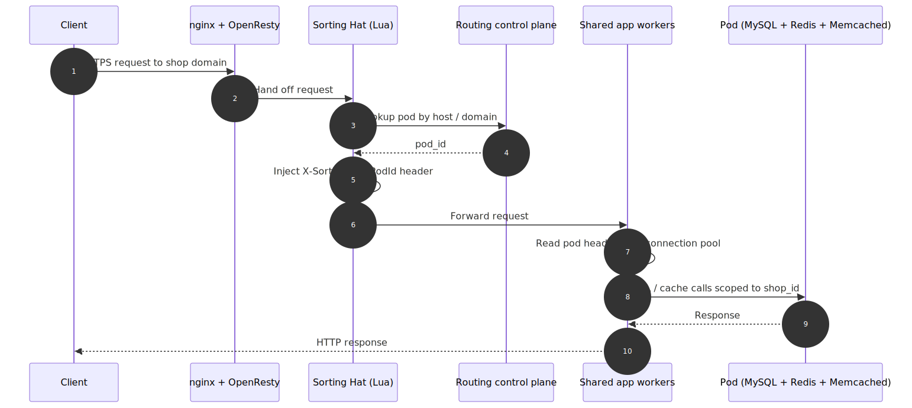
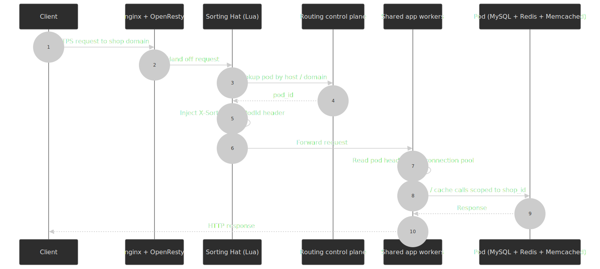

**Routing flow.**

1. Request arrives at the nginx load balancer.
2. Sorting Hat looks up the request's host/domain in a routing table.
3. It injects a header (`X-Sorting-Hat-PodId`) identifying the target pod.
4. The shared application worker pool receives the request.
5. The worker reads the pod header and connects to the correct MySQL, Redis, and Memcached instances for that pod.

Routing rules are stored as JSON payloads in a control plane, managed via a chatbot interface called **spy**. This makes routing changes operationally simple — an engineer can move a shop to a different pod by updating the routing table through a chat command ([Shopify Engineering, 2018](https://shopify.engineering/a-pods-architecture-to-allow-shopify-to-scale)).

### Additional load-balancer scripts

Shopify runs several other Lua scripts on their OpenResty load balancers — what the team has called their "secret weapon for surviving spikes" ([Eskildsen, GOTO Copenhagen 2017](https://files.gotocon.com/uploads/slides/conference_5/161/original/goto-simon.pdf)).

| Script          | Function                                                                                                            |
| --------------- | ------------------------------------------------------------------------------------------------------------------- |
| **Sorting Hat** | Routes requests to the correct pod.                                                                                 |
| **BotSquasher** | Analyses Kafka request streams to identify and block bot traffic using pattern detection.                           |
| **EdgeCache**   | Bypasses the application stack entirely, serving cached content directly from Memcached at the load-balancer level. |
| **Pauser**      | Queues requests during pod failover to prevent error responses reaching merchants.                                  |

The **Pauser** script is the linchpin of failover: instead of returning errors while a pod moves between datacentres, the load balancer holds requests in a queue and replays them once the pod is available on the target datacentre. This is what enables sub-10-second perceived downtime during failover.

### Database sharding strategy

MySQL is the primary datastore, operating at petabyte scale. The sharding key is `shop_id`, attached to every shop-owned table.

Design decisions:

- **Application-level sharding.** The Rails application determines which shard to query based on `shop_id`, not a database proxy. This keeps the routing logic in the same codebase where the queries are written.
- **One shard per pod.** Each pod contains exactly one MySQL shard. This simplifies the mapping — pod identity equals shard identity.
- **`shop_id` on every table.** Every table that stores shop-specific data includes a `shop_id` column. This is an invariant enforced across the codebase. Without it, the application cannot route queries to the correct pod.

### Cross-pod data: the CDC pipeline

The strict no-cross-pod-queries rule means global views of the data (analytics dashboards, platform-wide reporting) require a separate data path. Shopify built a Change Data Capture (CDC) pipeline using Debezium, Kafka, and Presto ([Shopify Engineering, 2021](https://shopify.engineering/capturing-every-change-shopify-sharded-monolith)).

| Component                     | Role                                                  |
| ----------------------------- | ----------------------------------------------------- |
| **Debezium**                  | Reads MySQL binlogs from each pod's shard.            |
| **Kafka Connect**             | ~150 connectors across 12 Kubernetes pods.            |
| **Confluent Schema Registry** | Avro schemas for change events.                       |
| **Apache Kafka**              | Central event bus.                                    |
| **Presto**                    | Cross-pod analytical queries on the data warehouse.   |

Pipeline numbers (2021):

- ~65,000 records/second average throughput.
- ~100,000 records/second at peak.
- P99 latency under 10 seconds from MySQL insertion to Kafka availability.

This pipeline is **read-only and eventually consistent**. There are no cross-pod writes. If an analytics dashboard shows data that is a few seconds stale, that is acceptable. If a transactional operation needs data from another pod, that is a sign the data model needs restructuring — not that the architecture needs cross-pod queries.

> [!IMPORTANT]
> Treat the no-cross-pod-write rule as an architectural invariant, not a guideline. Once you allow one cross-pod write you have re-introduced the failure-domain coupling that pods existed to break.

### Zero-downtime shop migration: Ghostferry

[Ghostferry](https://github.com/Shopify/ghostferry) is Shopify's open-source Go tool for moving shops between MySQL shards — and therefore between pods — without downtime ([Technical Overview](https://shopify.github.io/ghostferry/master/technicaloverview.html)).

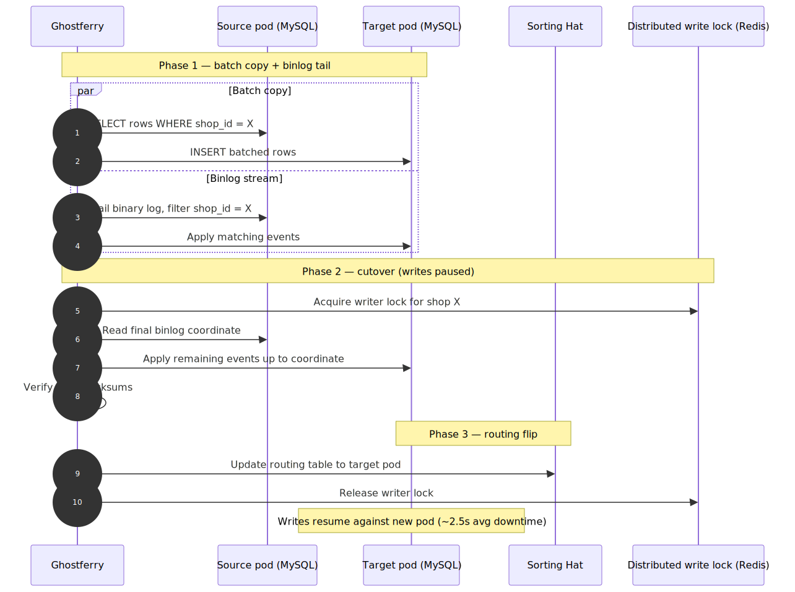
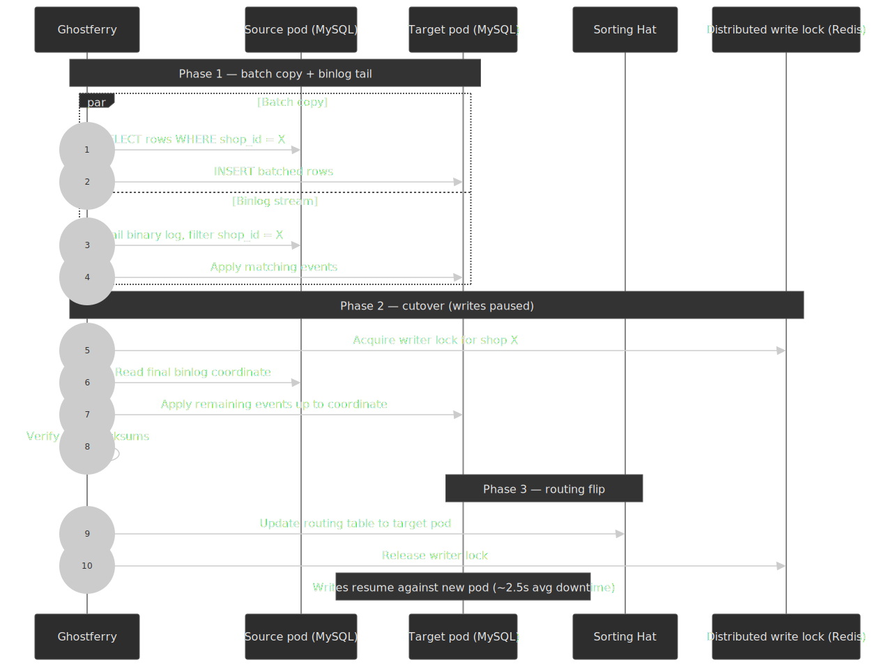

**Three-phase migration.**

- **Phase 1 — batch copy + binlog tailing.** Ghostferry iterates through source tables, selecting rows by `shop_id`. Simultaneously, it streams the MySQL binary log, filtering for changes to the relevant shop's data. Both operations run concurrently across multiple tables.
- **Phase 2 — cutover.** When the binlog queue reaches near real-time (seconds of lag), Ghostferry acquires application-level locks (multi-reader-single-writer, backed by Redis) to halt writes to the shop being moved. It records the final binlog coordinate as the stopping point.
- **Phase 3 — routing update.** The Sorting Hat's routing table is updated to point the shop's domain at the target pod. Locks are released, writes resume against the new pod. A verification suite confirms data integrity.

**Performance.** ~2.5 seconds average downtime per shop in early reporting (2018, [Shopify Engineering](https://shopify.engineering/a-pods-architecture-to-allow-shopify-to-scale)). [Bart de Water at QCon 2022](https://www.youtube.com/watch?v=yvMFLsXzRig) reported that most stores experience under 10 seconds of downtime, with larger stores under 20 seconds.

**Scale.** Hundreds of thousands of shops are moved between pods every year for rebalancing ([Shopify Engineering, 2021](https://shopify.engineering/mysql-database-shard-balancing-terabyte-scale)).

**Correctness.** The central migration algorithm is specified in **TLA+** (Temporal Logic of Actions). The TLA+ specification lives in the [`tlaplus/` directory of the Ghostferry repo](https://github.com/Shopify/ghostferry) and was used to surface concurrency edge cases — particularly around `UPDATE → INSERT → DELETE` sequences whose ordering can be violated when routes flip mid-migration — that integration testing alone would not have caught.

### Pod balancer: automated rebalancing

As traffic patterns change and new merchants onboard, pods can become imbalanced. The **pod balancer** uses historical database utilisation and traffic data to:

1. Classify shops by resource requirements.
2. Identify overloaded pods.
3. Move resource-intensive shops to less crowded pods.
4. Assign prominent merchants to dedicated pods for complete isolation.

This is a continuous, data-driven process — not a one-time migration. The goal is to keep each pod's resource utilisation within acceptable bounds while ensuring noisy neighbours do not share pods with many small merchants.

### Disaster recovery: Pod Mover

Each pod is paired with two datacentres: active and recovery. The **Pod Mover** tool moves a pod to its recovery datacentre in approximately one minute.

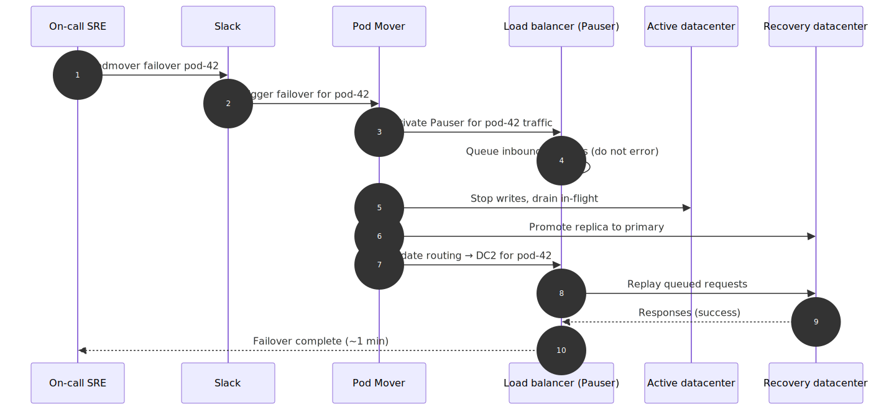
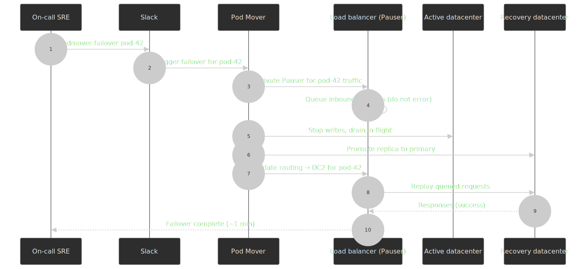

**Operational model.** Failover is triggered via a **Slack command**. An SRE types a command, and the pod's traffic redirects to the recovery datacentre. The Pauser script queues in-flight requests during the switch, so merchants do not see errors.

**Datacentre evacuation.** Moving an entire datacentre means evacuating each pod one at a time. Since each pod moves independently in roughly a minute, a full datacentre evacuation takes minutes, not hours.

### Cloud migration

In 2018, Shopify partnered with Google Cloud to migrate from physical datacentres to GKE ([Shopify Engineering, 2018](https://shopify.engineering/shopify-infrastructure-collaboration-with-google)). Headline numbers from the migration:

- 800,000+ tenants migrated.
- 50%+ of datacentre workloads moved to GCP.
- 400+ production services consolidated on Kubernetes.
- Dale Neufeld (VP of Production Engineering) led the effort.

The pod architecture made this migration tractable: each pod could be moved to GCP independently, validated, and rolled back if needed. Without pods, the migration would have been an all-or-nothing event.

### Resiliency toolkit

Shopify built and open-sourced several tools for pod-level and platform-level resilience.

| Tool                  | Purpose                                                | Notes                                                                                                                    |
| --------------------- | ------------------------------------------------------ | ------------------------------------------------------------------------------------------------------------------------ |
| **[Semian](https://github.com/Shopify/semian)**            | Circuit breaker + bulkheading for Ruby                 | In production since October 2014. Prevents cascading failures by failing fast when downstream services are unhealthy.    |
| **[Toxiproxy](https://github.com/Shopify/toxiproxy)**         | Network condition simulation and fault injection (Go)  | Simulates latency, partitions, and failures in test and staging.                                                         |
| **Genghis**           | Internal load generator                                | Runs scripted user workflows using Lua scripts across multiple GCP regions. Used to validate pod capacity before BFCM.   |
| **Resiliency Matrix** | Operational playbook                                   | Documents service status, failure scenarios, recovery procedures with RTOs (Recovery Time Objectives), on-call coverage. |

### Modular monolith: componentisation

Parallel to the pod infrastructure work, Shopify restructured the monolith's internal code organisation using a "componentisation" approach (initially called "Break-Core-Up-Into-Multiple-Pieces").

- **2017.** The team catalogued all ~6,000 Ruby classes into a spreadsheet, manually labelling each class's target component. They reorganised from the default Rails structure (`models/views/controllers`) to domain-driven organisation. This was executed via automated scripts in a single large PR ([Shopify Engineering, 2019](https://shopify.engineering/deconstructing-monolith-designing-software-maximizes-developer-productivity)).
- **2020.** Shopify released [Packwerk](https://github.com/Shopify/packwerk), an open-source Ruby gem for static dependency analysis. The monolith was organised into 37 components with defined public entrypoints ([Shopify Engineering, 2020](https://shopify.engineering/shopify-monolith)).
- **2024 retrospective.** Packwerk became less central over time. A retrospective ([Rails at Scale, 2024](https://railsatscale.com/2024-01-26-a-packwerk-retrospective/)) noted that the tool identified problems faster than teams could fix them, and the domain-based component boundaries sometimes misaligned with actual code dependencies. Privacy checks were removed in Packwerk v3.0 due to architectural misalignment.

The componentisation story illustrates an important lesson: **infrastructure isolation (pods) and code organisation (components) are complementary but independent concerns**. Pods solved the operational blast-radius problem. Components addressed developer cognitive load. Both were necessary, but solving one did not solve the other.

## Outcome

### BFCM performance over time

Black Friday/Cyber Monday (BFCM) is Shopify's annual stress test. The pod architecture's impact is visible in the platform's ability to handle exponentially growing traffic.

| Metric                         | BFCM 2018      | BFCM 2024              | BFCM 2025              |
| ------------------------------ | -------------- | ---------------------- | ---------------------- |
| Total sales                    | $1.5 billion   | $11.5 billion          | $14.6 billion          |
| Peak sales rate                | —              | $4.6 million/minute    | $5.1 million/minute    |
| Edge requests per minute (peak) | —             | 284 million            | 489 million            |
| App-server requests per minute (peak) | —       | 80 million             | 117 million+           |
| Edge requests (total)          | —              | 1.19 trillion          | 2.2 trillion           |
| Database queries (total)       | —              | 10.5 trillion          | 14.8 trillion          |
| Database writes (total)        | —              | 1.17 trillion          | 1.75 trillion          |
| Data processed                 | —              | 57.3 petabytes         | —                      |
| Customers served               | —              | 76+ million            | 81+ million            |
| Platform uptime                | 99.98%         | 99.99%+                | 99.99%+                |

Sources: [Shopify BFCM 2024 results](https://www.shopify.com/news/bfcm-data-2024); [Shopify BFCM 2025 press release](https://www.shopify.com/investors/press-releases/shopify-merchants-achieve-record-breaking-14-6-billion-in-black-friday-cyber-monday-sales); [How we prepare Shopify for BFCM (2025)](https://shopify.engineering/bfcm-readiness-2025).

### Operational improvements

| Metric                          | Before pods             | After pods               |
| ------------------------------- | ----------------------- | ------------------------ |
| Blast radius of Redis failure   | All shops               | One pod's shops          |
| Failover granularity            | Entire platform         | Per pod (~1 minute)      |
| Flash-sale isolation            | None (noisy neighbour)  | Dedicated pod            |
| Shop migration downtime         | Hours (manual)          | Seconds (automated, ~2.5 s avg in 2018 reporting) |
| Datacentre evacuation           | Hours, high risk        | Minutes (pod by pod)     |

### BFCM 2025 readiness testing

Shopify's readiness process demonstrates pod-architecture maturity. The team runs escalating load tests in the months before BFCM ([Shopify Engineering, 2025](https://shopify.engineering/bfcm-readiness-2025)).

| Test            | Peak RPM                  | Purpose                  |
| --------------- | ------------------------- | ------------------------ |
| Test 1          | Baseline                  | Validate monitoring      |
| Test 4          | 146 million RPM           | Sustained load           |
| P99 test        | 200 million RPM           | Extreme spike            |
| Peak checkout   | 80,000+ checkouts/minute  | Payment-path stress      |

These tests run against the actual production pod infrastructure. Each pod is independently validated for capacity. If a specific pod is underprovisioned, the pod balancer redistributes shops before BFCM.

### Unexpected benefits

- **Multi-region deployment.** Pods made multi-region trivial — each pod can run in a different region based on merchant geography. This was impractical with a shared-everything architecture.
- **GCP migration tractability.** The cloud migration to GKE could proceed pod by pod, with independent validation and rollback per pod.
- **Compliance isolation.** Merchants with specific data residency requirements can be placed on pods in compliant regions.

### Remaining limitations

- **No cross-pod transactions.** Features that need data from multiple pods require eventual consistency via the CDC pipeline. This constrains certain product features.
- **Operational complexity.** Managing 100+ pods requires sophisticated tooling. The pod balancer, Ghostferry, Pod Mover, and Sorting Hat are all critical infrastructure that must be maintained.
- **Schema migrations.** Altering MySQL schemas across 100+ shards requires coordination. Shopify uses online schema-change tools, but complex migrations still require careful orchestration.

## Lessons learned

### Technical lessons

#### 1. Sharding partitions data, not failure domains

**The insight.** Horizontal database sharding solves throughput scaling but does nothing for blast radius. Every shared resource above the shard layer (caches, queues, schedulers) remains a single point of failure. True multi-tenant isolation requires isolating the entire stateful stack — not just the database.

**How it applies elsewhere.**

- If you have sharded your database but share Redis/Memcached across shards, you have the same vulnerability Shopify had pre-pods.
- SaaS platforms with per-tenant databases but shared cache layers are exposed to the same cross-tenant blast radius.

**Warning signs to watch for.**

- A cache failure affects tenants on multiple shards.
- A single background job queue serves all shards.
- Failover is all-or-nothing, not per-shard.

#### 2. Isolation is more valuable than optimisation

**The insight.** Pods sacrifice some efficiency (duplicated Redis and Memcached per pod) for isolation. This is the correct trade-off for multi-tenant systems at Shopify's scale. The cost of duplicated caches is far less than the cost of a platform-wide outage caused by a shared cache failure.

**How it applies elsewhere.**

- Cell-based architecture (AWS, Azure) applies the same principle at cloud-provider scale.
- Kubernetes namespace isolation, while not as strong as Shopify's pods, follows a similar philosophy.

**Warning signs to watch for.**

- Cost-optimisation efforts that consolidate shared resources across tenants.
- Arguments that "cache hit rates will be lower with smaller pools" — true, but irrelevant if the alternative is global outages.

#### 3. Zero-downtime migration is a feature, not a luxury

**The insight.** Ghostferry's seconds-of-downtime shop migration enables continuous rebalancing. Without this capability, pod assignment would be static, leading to growing imbalances and eventually the same noisy-neighbour problem pods were designed to solve.

**How it applies elsewhere.**

- Any sharded system that cannot rebalance tenants between shards will develop hotspots.
- The investment in live migration tooling pays dividends in operational flexibility for years.

**Warning signs to watch for.**

- Shard rebalancing requires maintenance windows.
- Moving a tenant between shards takes hours or involves data-loss risk.
- Operations teams avoid rebalancing because it is too risky.

#### 4. Formal verification catches what testing misses

**The insight.** Shopify used TLA+ to specify Ghostferry's migration algorithm. During the later [Vitess migration for the Shop app](https://shopify.engineering/horizontally-scaling-the-rails-backend-of-shop-app-with-vitess), the team encountered roughly 25 bugs (six or so in Vitess itself), including race conditions where `UPDATE row → INSERT row_2 → DELETE row` sequences could land on different shards. Formal verification is particularly valuable for stateful operations where ordering and concurrency bugs cause silent data loss.

**How it applies elsewhere.**

- Any data-migration tool handling concurrent reads and writes benefits from formal specification.
- TLA+ is especially suited to verifying invariants in distributed state machines.

#### 5. The monolith can scale — if you isolate beneath it

**The insight.** Shopify rejected the microservices migration path. Instead, they kept the monolith and isolated the infrastructure it runs on. This preserved developer productivity (~40 deploys/day, ~400 commits/day) while solving the operational isolation problem. The monolith provides a single deployment unit, unified type system, and shared abstractions that microservices sacrifice.

**How it applies elsewhere.**

- Not every scaling problem requires decomposing the application. Sometimes the problem is infrastructure isolation, not code organisation.
- The "modular monolith" pattern (pods + componentised code) provides many benefits of microservices without the distributed-systems overhead.

### Process lessons

#### 1. Incident-driven architecture is effective

**The insight.** Redismageddon was the catalyst for pods. The most impactful architectural changes often emerge from specific production failures that reveal hidden assumptions. Shopify did not design pods in a vacuum — they designed pods because a concrete failure demonstrated that sharding alone was insufficient.

**What they would do differently.** Simon Eskildsen and the team have noted that proactively identifying shared resources as blast-radius risks — before an outage — would have been preferable. The **Resiliency Matrix** that Shopify now maintains is the systematic answer to this reactive pattern ([Shopify Engineering, 2020](https://shopify.engineering/resiliency-planning-for-high-traffic-events)).

#### 2. Chat-driven operations reduce mean time to recovery (MTTR)

**The insight.** Pod failover via Slack command, shop moves via chatbot — Shopify built operational tooling that any on-call engineer can invoke without SSH access or deep infrastructure knowledge. This reduces MTTR by removing the "find the right person" bottleneck.

### Organisational lessons

#### 1. Infrastructure and code organisation are orthogonal

**The insight.** Pods (infrastructure isolation) and Packwerk (code modularity) solved different problems. Pods contained blast radius. Packwerk reduced cognitive load. Solving one did not solve the other. Teams that assume "if we fix the infrastructure, the code will follow" (or vice versa) will be disappointed.

**How organisation structure affected the outcome.** Shopify's production-engineering team owned pod infrastructure independently from the application teams that used Packwerk for code organisation. This separation of concerns let both efforts progress without blocking each other.

## Applying this to your system

### When this pattern applies

You might benefit from a pod-like architecture if:

- You run a multi-tenant platform where tenant traffic variance is high (10×–1000× between smallest and largest).
- A single cache or queue failure currently affects all tenants.
- Failover is all-or-nothing for your entire platform.
- You need data residency isolation for compliance (GDPR, data sovereignty).
- Your monolith works well for development but has operational blast-radius problems.

### When this pattern does NOT apply

- **Single-tenant applications.** Pods solve multi-tenant isolation. If you have one tenant, you have one pod.
- **Low scale / small team.** Managing 100+ pods requires dedicated infrastructure engineering. If you have fewer than ~10 engineers, the operational overhead outweighs the benefits.
- **Already decomposed into services.** If you have already adopted microservices with per-service databases, you have solved (or created) a different set of problems. Pods are specifically for monolithic or shared-database architectures.

### Checklist for evaluation

- [ ] Can a single Redis/Memcached failure affect multiple tenants?
- [ ] Is failover granularity coarser than you would like?
- [ ] Do noisy tenants (traffic spikes) affect other tenants?
- [ ] Do you need per-tenant infrastructure isolation for compliance?
- [ ] Can you move tenants between shards with zero or minimal downtime?

### Starting points

If you want to explore this approach:

1. **Map your shared stateful resources.** Identify every component shared across tenant boundaries (cache, queue, scheduler, session store).
2. **Simulate a shared-resource failure.** What is the blast radius of a Redis failure? A Memcached failure? A background-job-queue failure?
3. **Prototype a single "pod".** Pick one stateful resource (e.g. Redis) and isolate it for a subset of tenants. Measure the operational impact.
4. **Build routing first.** A Sorting Hat equivalent (tenant-to-pod mapping at the load balancer) is the prerequisite for pod isolation. Without routing, you cannot direct tenants to isolated infrastructure.
5. **Invest in migration tooling early.** The value of pods depends on the ability to rebalance tenants between them. If moving a tenant requires downtime, you will resist rebalancing, and pods will drift into imbalance.

## Conclusion

Shopify's pod architecture demonstrates that the monolith vs. microservices debate presents a false dichotomy. The scaling problem was not in the application layer — it was in the infrastructure's failure-domain boundaries. By isolating stateful resources into pods while keeping the monolith intact, Shopify achieved blast-radius containment, per-pod failover, and noisy-neighbour elimination without sacrificing the developer productivity that a unified codebase provides.

The critical lesson is the distinction between **throughput scaling** and **isolation scaling**. Sharding solved throughput. Pods solved isolation. Both are necessary at Shopify's scale, and conflating them — as many teams do when they equate "sharding" with "multi-tenant isolation" — leads to architectures that handle normal load well but fail catastrophically under partial failures.

## Appendix

### Prerequisites

- Understanding of database sharding and horizontal partitioning strategies.
- Familiarity with multi-tenant SaaS architecture patterns.
- Basic knowledge of load balancer request routing.
- Understanding of MySQL replication and binary logs.

### Terminology

- **Pod** — a fully isolated set of stateful infrastructure (MySQL, Redis, Memcached, cron) serving a subset of shops.
- **Sorting Hat** — Lua script on nginx/OpenResty that routes requests to the correct pod based on host/domain lookup.
- **Ghostferry** — Shopify's open-source Go tool for zero-downtime MySQL data migration between shards/pods.
- **Pod Mover** — internal tool for failing a pod over to its recovery datacentre in roughly a minute.
- **Pod Balancer** — automated system that redistributes shops between pods based on historical resource utilisation.
- **CDC (Change Data Capture)** — pipeline that streams database changes from pod shards into a central Kafka topic for cross-pod analytics.
- **Redismageddon** — internal name for the failure mode where a single Redis instance took down all of Shopify (~2016).
- **BFCM** — Black Friday/Cyber Monday — Shopify's annual peak traffic event.
- **Packwerk** — open-source Ruby gem for enforcing modular boundaries within the monolith's codebase.
- **Semian** — open-source Ruby gem implementing circuit breakers and bulkheading to prevent cascading failures.

### Summary

- Shopify hit vertical-scaling limits in 2015 and implemented database sharding, but shared Redis/Memcached remained single points of failure.
- The "Redismageddon" failure mode — a single Redis instance taking down all shops — proved that sharding partitions data but not failure domains.
- Pods isolate the complete stateful stack (MySQL, Redis, Memcached, cron) per subset of shops, containing blast radius to a single pod.
- The Sorting Hat (Lua on OpenResty) routes requests to the correct pod by injecting a pod header based on domain lookup.
- Ghostferry enables zero-downtime shop migration between pods (seconds of downtime), with its core algorithm formally specified in TLA+.
- Pod Mover fails over individual pods between datacentres in roughly a minute, triggered via Slack command.
- The architecture scaled from 600K merchants and ~80K RPS (2018) to 489M edge RPM and 117M+ app-server RPM during BFCM 2025 while maintaining 99.99%+ uptime.

### References

- [A Pods Architecture to Allow Shopify to Scale](https://shopify.engineering/a-pods-architecture-to-allow-shopify-to-scale) — Xavier Denis, Shopify Engineering, March 2018. Canonical blog post introducing the pod concept.
- [E-Commerce at Scale: Inside Shopify's Tech Stack](https://shopify.engineering/e-commerce-at-scale-inside-shopifys-tech-stack) — Kir Shatrov, Shopify Engineering, August 2018. Tech stack overview with scale numbers.
- [Shopify's Architecture to Handle 80K RPS Celebrity Sales](https://www.youtube.com/watch?v=N8NWDHgWA28) — Simon Eskildsen, GOTO Copenhagen 2017. Conference talk on pod architecture and flash-sale handling. [Slides](https://files.gotocon.com/uploads/slides/conference_5/161/original/goto-simon.pdf).
- [Shopify's Architecture to Handle the World's Biggest Flash Sales](https://www.youtube.com/watch?v=yvMFLsXzRig) — Bart de Water, QCon 2022. Updated architecture presentation with failover details.
- [Scaling Shopify's Multi-Tenant Architecture across Multiple Datacenters](https://www.usenix.org/conference/srecon16europe/program/presentation/weingarten) — Florian Weingarten, SREcon 2016 Europe. Multi-datacentre scaling approach.
- [Deconstructing the Monolith](https://shopify.engineering/deconstructing-monolith-designing-software-maximizes-developer-productivity) — Kirsten Westeinde, Shopify Engineering, February 2019. Componentisation and modular-monolith strategy.
- [Under Deconstruction: The State of Shopify's Monolith](https://shopify.engineering/shopify-monolith) — Philip Mueller, Shopify Engineering, September 2020. Monolith status update with Packwerk introduction.
- [Capturing Every Change From Shopify's Sharded Monolith](https://shopify.engineering/capturing-every-change-shopify-sharded-monolith) — John Martin and Adam Bellemare, Shopify Engineering, March 2021. CDC pipeline architecture and numbers.
- [Shard Balancing: Moving Shops Confidently with Zero-Downtime at Terabyte-scale](https://shopify.engineering/mysql-database-shard-balancing-terabyte-scale) — Paarth Madan, Shopify Engineering, September 2021. Ghostferry and shard rebalancing deep dive.
- [Horizontally Scaling the Rails Backend of Shop App with Vitess](https://shopify.engineering/horizontally-scaling-the-rails-backend-of-shop-app-with-vitess) — Shopify Engineering, January 2024. Vitess adoption for the Shop app.
- [A Packwerk Retrospective](https://railsatscale.com/2024-01-26-a-packwerk-retrospective/) — Gannon McGibbon and Chris Salzberg, Rails at Scale, January 2024. Retrospective on modular-monolith tooling.
- [Interview: Inside Shopify's Modular Monolith](https://kovyrin.net/2024/06/16/interview-inside-shopify-monolith/) — Oleksiy Kovyrin (Principal Engineer), June 2024. Pod architecture insights and dedicated-pod strategy.
- [How We Prepare Shopify for BFCM (2025)](https://shopify.engineering/bfcm-readiness-2025) — Kyle Petroski and Matthew Frail, Shopify Engineering, November 2025. BFCM readiness process and load-testing numbers.
- [Resiliency Planning for High-Traffic Events](https://shopify.engineering/resiliency-planning-for-high-traffic-events) — Ryan McIlmoyl, Shopify Engineering, December 2020. Resiliency matrix and planning process.
- [Shopify's Infrastructure Collaboration with Google](https://shopify.engineering/shopify-infrastructure-collaboration-with-google) — Dale Neufeld, Shopify Engineering, March 2018. GCP migration details.
- [Preparing Shopify for Black Friday Cyber Monday](https://shopify.engineering/preparing-shopify-for-black-friday-cyber-monday) — Camilo Lopez, Shopify Engineering, December 2018. BFCM 2018 preparation and results.
- [BFCM 2024 results](https://www.shopify.com/news/bfcm-data-2024) — Official Shopify BFCM 2024 results.
- [BFCM 2025 results](https://www.shopify.com/investors/press-releases/shopify-merchants-achieve-record-breaking-14-6-billion-in-black-friday-cyber-monday-sales) — Official Shopify BFCM 2025 press release.
- [Ghostferry](https://github.com/Shopify/ghostferry) — open-source zero-downtime MySQL data-migration tool (Go, with TLA+ specification).
- [Semian](https://github.com/Shopify/semian) — open-source circuit-breaker and bulkheading library for Ruby.
- [Toxiproxy](https://github.com/Shopify/toxiproxy) — open-source network fault-injection proxy.
- [Packwerk](https://github.com/Shopify/packwerk) — open-source static-dependency analysis for Rails applications.
