# SLOs, SLIs, and Error Budgets

Service Level Objectives (SLOs), Service Level Indicators (SLIs), and error budgets form the framework Google's SRE practice uses to quantify reliability and trade it against development velocity. SLIs measure what users actually experience, SLOs commit to a target on those measurements, and error budgets convert the gap between perfection and the target into a finite resource that engineering can spend on releases, experiments, and incidents. This article covers the design reasoning behind each concept, the mathematics of multi-window multi-burn-rate alerting, and the operational practices — policies, review cadence, anti-patterns — that decide whether an SLO program drives decisions or just decorates a dashboard.




## Abstract

The framework rests on three interdependent concepts:

- **SLIs** quantify user-centric reliability as a ratio of good events to valid events — measuring what users experience, not what infrastructure reports.
- **SLOs** commit to explicit targets (e.g., "99.9% of requests succeed") over a defined compliance period, creating an accountability contract between product, development, and operations.
- **Error budgets** quantify acceptable unreliability ($1 - \text{SLO}$), converting an abstract target into a concrete budget that engineering can spend on planned risk and incidents.

The critical insight from the SRE Book: **100% reliability is rarely the right target** because each additional "nine" costs exponentially more while providing diminishing user benefit, and chasing it will starve feature work that users want at least as much as availability.[^sre-book-slo] Error budgets make this trade-off explicit — when budget is exhausted, prioritize reliability work; when budget remains, ship.

Three operational decisions decide whether the framework is useful or theatre:

1. **Window selection** — rolling windows (e.g., 30 days) provide continuous feedback that aligns with user experience; calendar windows (e.g., monthly) reset favorably for SLA reporting but mask incidents that fall just before the boundary.
2. **Burn rate alerting** — multi-window, multi-burn-rate alerting detects acute incidents (fast burn) and sustained drift (slow burn) without drowning the on-call in noise.[^sre-workbook-alerting]
3. **Error budget policies** — explicit policies (release gates, mandatory postmortems) tie SLO violations to organizational responses; without them, SLOs are reporting metrics, not decision instruments.[^sre-workbook-policy]

## Mental Model: SLI vs SLO vs SLA

Three terms get conflated constantly. Pin them down before any further reading:

| Term    | What it is                                       | Audience              | Consequence of violation                                          |
| ------- | ------------------------------------------------ | --------------------- | ----------------------------------------------------------------- |
| **SLI** | A measurement (`good / valid` ratio)             | Internal, on every dashboard | None directly — it's just data                              |
| **SLO** | An internal target on an SLI over a window       | Internal (eng + product) | Triggers an internal policy (release freeze, postmortem)      |
| **SLA** | A contractual commitment with a customer         | External (legal + sales) | Service credits, refunds, legal exposure                      |

A useful rule from Google's SRE org: **SLOs should be tighter than SLAs**, with internal headroom so that SLO violations are an internal alarm long before SLA penalties become a customer conversation.[^google-cloud-slos] Many teams set their SLO at a level they expect to violate occasionally and their SLA at a level they expect to never violate.

The rest of this article is about SLIs and SLOs. SLAs are a contract conversation; the engineering conversation lives in the SLO.

## Defining SLIs: User-Centric Reliability Measurement

An SLI is a quantitative measure of service behavior framed from the user's perspective. The fundamental formula, as defined in the SRE Workbook and the Art of SLOs handbook, is:[^art-of-slos]

$$
\text{SLI} = \frac{\text{good events}}{\text{valid events}} \times 100\%
$$

Where:

- **Good events** are outcomes that satisfy user requirements (HTTP 2xx, response under a latency threshold, durable write).
- **Valid events** are all countable transactions in scope. Health checks, internal traffic, and synthetic-only requests are typically excluded from the denominator because they are not what users see.

### Why User-Centric, Not System-Centric

Traditional monitoring tracks system metrics — CPU utilization, memory pressure, network throughput. None of these capture user experience:

| System metric         | User reality                                                     |
| --------------------- | ---------------------------------------------------------------- |
| 99.99% server uptime  | Users seeing 100% errors because the load balancer is misconfigured |
| 50ms average latency  | P99 users waiting 30 seconds — outliers invisible in averages    |
| All processes healthy | Users unable to complete checkout because an upstream is down    |

The design principle from the SRE Book is direct: choose SLIs that, if met, mean a typical user is happy, and if missed, mean they are not.[^sre-book-slo] SLIs should reflect the user journey, not the infrastructure topology.

### SLI Types by Service Category

Different services need different SLI shapes. The SRE Workbook distinguishes four common categories:[^sre-workbook-implementing]

| Service type                   | Primary SLIs                       | Example                                                                          |
| ------------------------------ | ---------------------------------- | -------------------------------------------------------------------------------- |
| **Request-driven** (APIs, web) | Availability, latency, throughput  | 99.9% of requests return 2xx in < 200 ms                                         |
| **Storage systems**            | Durability, availability, latency  | 99.999999999% (eleven nines) of objects retrievable; AWS S3's design target[^aws-s3-durability] |
| **Data pipelines**             | Freshness, correctness, throughput | Data arrives within 5 min of ingestion; 99.9% of records processed correctly     |
| **Scheduled jobs**             | Success rate, completion time      | 99% of daily jobs complete within their SLA window                               |

### Latency SLIs: Percentiles, Not Averages

Averages hide the worst-affected users — the same users who churn:

```text
Average latency: 100 ms
P50 (median):     50 ms
P95:             200 ms
P99:           2,000 ms   ← 1 in 100 users waiting 20× the average
```

Express a latency SLI as the ratio of fast-enough requests to total requests, not as a target on an average:

$$
\text{Latency SLI} = \frac{|\text{requests with latency} \leq \text{threshold}|}{|\text{total requests}|} \times 100\%
$$

**Recommended percentile selection**:

- **P50** — typical user experience; track for regressions but rarely the right SLO target.
- **P95** — standard SLO target; "typical worst-case" user.
- **P99** — high-value transactions (checkout, login); catches tail latency that drives churn.
- **P99.9** — latency-sensitive systems (trading, ad bidding) where the long tail is the product.

> [!CAUTION]
> P99 needs statistical significance. With 100 requests/day, P99 is a single data point and any single slow request blows the SLO. For low-traffic services, use P90 (or coarser percentiles), longer aggregation windows, or supplement with synthetic probes — see [Low-Traffic Service Challenges](#low-traffic-service-challenges).

### SLI Measurement Points

Where you measure determines what failures the SLI can see. Closer to the user catches more failure modes but costs more to instrument.




Most organizations start with service-side SLIs (cheap, instrumented in the application or load balancer) and add Real User Monitoring (RUM) for critical user journeys once a baseline is in place. The trade-off is breadth of coverage versus measurement complexity — RUM requires client instrumentation, beacon delivery, and discounting bot traffic before the metric is trustworthy.

## Defining SLOs: Targets with Commitment

An SLO combines an SLI with a target and a compliance period:

```text
SLO = SLI ≥ target over compliance_period

Example: 99.9% of HTTP requests return 2xx in < 200 ms over a rolling 30-day window
```

### Choosing Targets: The "Nines" Trade-off

Each additional "nine" of reliability has exponential cost. Allowable downtime over 30 days collapses fast:[^art-of-slos]

| Target  | Error budget | Downtime / 30 days | Engineering implications                                       |
| ------- | ------------ | ------------------ | -------------------------------------------------------------- |
| 99%     | 1%           | 7.2 hours          | Standard deployments, basic redundancy                         |
| 99.9%   | 0.1%         | ~43 minutes        | Blue-green deploys, automated rollback, on-call rotation       |
| 99.99%  | 0.01%        | ~4.3 minutes       | Multi-region active-active, chaos engineering, fast failover   |
| 99.999% | 0.001%       | ~26 seconds        | Custom hardware, dedicated SRE team, restricted release cadence |

**Design reasoning**: Users typically cannot distinguish 99.99% from 99.999% — both feel "always available" — but achieving the extra nine requires a fundamentally different architecture and operating model.[^sre-book-slo] Don't pay for nines users can't perceive.

**Target selection heuristics**:

1. **Anchor on historical data**. Setting a target below historical performance guarantees constant violation; setting it far above invites a multi-quarter reliability project before you ever ship the SLO.
2. **Respect dependencies**. Your SLO cannot meaningfully exceed your dependencies' SLOs. If your database commits to 99.9%, your service cannot honestly promise 99.99% — that extra nine is fiction the moment the database wobbles.
3. **Align with business value**. Premium / paid features may warrant tighter targets; experimental features may tolerate looser ones.
4. **Start conservative**. It is easier to tighten a target than to relax one once users have built expectations.

### Compliance Periods: Rolling vs. Calendar Windows

**Rolling windows** (e.g., last 30 days):

- Update continuously as new data enters and old data exits.
- Provide daily compliance measurements that align with user experience — a user does not "forget" an outage because the calendar flipped.
- Better for operational decision-making (release gates, deployment freezes).

**Calendar windows** (e.g., monthly):

- Reset at period boundaries; full error budget on day 1.
- Better for external SLA reporting and finance / billing cycles.
- Favor service providers — incidents on day 30 are "forgotten" on day 1.

**Mathematical impact** for a 99% SLO:

- 24-hour window: maximum 14.4 minutes of continuous downtime.
- 30-day window: maximum 7.2 hours of continuous downtime — concentrated incidents are absorbed by the budget.

Shorter windows force failures to be distributed; longer windows tolerate concentrated incidents.

**Recommendation**: rolling windows for internal SLOs (operational decisions), calendar windows for external SLAs (contractual reporting). Many teams run both side by side, computed from the same SLI.

## Error Budgets: Quantifying Acceptable Unreliability

The error budget is the mathematical complement of the SLO target:

$$
\text{Error budget} = 1 - \text{SLO target}
$$

For a 99.9% SLO the budget is 0.1% — explicit permission for 0.1% of events to fail without violating the objective.

### Error Budget as a Resource

Convert percentage to concrete numbers and the framing changes from "reliability goal" to "budget you spend":

```text
SLO:                99.9%
Compliance period:  30 days
Request volume:     10,000,000 requests/day × 30 = 300,000,000 requests/window

Error budget = 0.001 × 300,000,000 = 300,000 allowable failed requests
```

That budget is a finite resource spent on:

- **Planned risk** — deployments, migrations, experiments, load tests.
- **Unplanned incidents** — outages, regressions, dependency failures.
- **Maintenance** — upgrades, configuration changes, schema migrations.

### Budget Consumption Tracking

Track consumption continuously, not just at window boundaries:

$$
\text{Budget consumed \%} = \frac{\text{failed events}}{\text{error budget}} \times 100\%
$$

Example consumption over a 30-day period (request-driven service, 99.9% SLO, 10M requests/day):

| Day | Daily failures    | Cumulative failures | Budget consumed |
| --- | ----------------- | ------------------- | --------------- |
| 1   | 500               | 500                 | 0.17%           |
| 5   | 200               | 1,500               | 0.50%           |
| 10  | 50,000 (incident) | 52,000              | 17.3%           |
| 15  | 300               | 54,000              | 18.0%           |
| 30  | 400               | 75,000              | 25.0%           |

At 25% consumption with 75% remaining, the team can keep shipping; the incident on day 10 was paid for from budget that existed for exactly that purpose.

### Budget Exhaustion Consequences

When the error budget is exhausted (≥100% consumed), the SLO is violated. Typical organizational responses, codified in an error budget policy (covered below):

1. **Halt non-critical changes** — only ship P0 bug fixes, security patches, and reliability improvements.
2. **Mandatory postmortems** — any incident consuming >20% of budget gets a documented analysis with action items.
3. **Reliability focus** — engineering time redirects from features to reliability work until the budget is restored.
4. **Stakeholder notification** — product and leadership are informed of the velocity constraint so roadmap commitments can be re-planned.

This is the core trade-off mechanism of the framework: **error budgets give engineering permission to focus on reliability when the data says reliability is what's needed**, and permission to keep shipping when the data says reliability is fine.[^sre-workbook-policy]

## Burn Rate: The Velocity of Failure

Burn rate measures how quickly the error budget is being consumed relative to the rate at which it would be exhausted exactly at the end of the window:[^sre-workbook-alerting]

$$
\text{Burn rate} = \frac{\text{observed error rate}}{\text{tolerable error rate}}, \quad \text{where tolerable error rate} = 1 - \text{SLO target}
$$

### Burn Rate Interpretation

| Burn rate | Meaning                                                                  |
| --------- | ------------------------------------------------------------------------ |
| 1.0       | Consuming budget at exactly the planned rate; budget exhausts at window end |
| < 1.0     | Under-consuming; budget remains at window end                            |
| > 1.0     | Over-consuming; budget exhausts before window end                        |
| 14.4      | Burning monthly budget at a rate that consumes 2% of it in 1 hour       |

**Worked example**:

```text
SLO: 99.9%   →   tolerable error rate = 0.1%
Current error rate over the last 1 hour: 0.5%
Burn rate = 0.5% / 0.1% = 5.0

At burn rate 5.0, a 30-day budget exhausts in 30 / 5 = 6 days.
```

### Why Burn Rate, Not Raw Error Rate

Burn rate normalizes across services with different SLO targets, so a single dashboard can compare them honestly:[^datadog-burn-rate]

| Service     | SLO    | Current error rate | Burn rate       |
| ----------- | ------ | ------------------ | --------------- |
| Payment API | 99.99% | 0.01%              | 1.0 (on target) |
| Search      | 99.9%  | 0.01%              | 0.1 (excellent) |
| Analytics   | 99%    | 0.5%               | 0.5 (healthy)   |

Raw error rate would suggest Payment API and Search are equally healthy. Burn rate reveals Payment API is at its limit while Search has 10× of headroom.

## Multi-Window, Multi-Burn-Rate Alerting

Naive alerting on burn rate falls into one of three traps:

- **Single short window** — temporary spikes trigger false alarms; alert fatigue.
- **Single long window** — slow degradation is detected long after the budget is gone.
- **Static error-rate threshold** — either too sensitive (constant noise) or too lenient (real incidents missed).

The Google SRE Workbook recommendation is to combine multiple windows with correlated thresholds, optimized around a 99.9% SLO.[^sre-workbook-alerting]




### The Three Recommended Tiers

The Workbook recommends three tiers, with two pages and one ticket:[^sre-workbook-alerting]

| Severity | Long window | Short window | Burn rate | Budget consumed in long window |
| -------- | ----------- | ------------ | --------- | ------------------------------ |
| **Page** | 1 hour      | 5 minutes    | 14.4×     | 2%                             |
| **Page** | 6 hours     | 30 minutes   | 6×        | 5%                             |
| **Ticket** | 3 days    | 6 hours      | 1×        | 10%                            |

> [!IMPORTANT]
> Both 14.4× and 6× are page-severity in the Workbook's recommendation, not page-and-ticket. The ticket tier is the 1× / 3-day alert, which catches sustained drift too slow to look like an incident but fast enough to consume meaningful budget. Skipping the ticket tier is the most common mis-implementation of the framework.

### Multi-Window Logic

Each alert fires only when **both** its long and short windows exceed the threshold simultaneously:

```text
Page-fast fires IF:
  burn_rate(1h) > 14.4   AND   burn_rate(5m) > 14.4

Page-slow fires IF:
  burn_rate(6h) > 6      AND   burn_rate(30m) > 6

Ticket fires IF:
  burn_rate(3d) > 1      AND   burn_rate(6h) > 1
```

**Design reasoning**: the short window provides fast recovery — when an incident resolves, the short window drops below threshold within minutes and auto-resolves the alert, even though the long window will stay elevated for hours. The long window suppresses noise from transient spikes that would otherwise wake the on-call for a 30-second blip.[^sre-workbook-alerting]

### Tuning for Lower SLOs

The thresholds above are calibrated for ~99.9% SLOs.[^sre-workbook-alerting] For services with looser SLOs (90%, 95%) the error budget is huge in absolute terms, and the same burn rates may never trigger or may take days to do so. Tune by working backwards from the question "how fast can we afford to consume budget before paging?" — the budget consumed columns above are the dial worth turning.

### Prometheus Alert Rule Example

For a 99.9% SLO, the three tiers expressed in PromQL — note the ticket tier completing the trio:

```yaml title="slo-alerts.yaml"
# Page-fast: 2% of 30-day budget in 1 hour
- alert: ErrorBudgetBurnPageFast
  expr: |
    (
      sum(rate(http_errors_total[1h])) / sum(rate(http_requests_total[1h]))
    ) > 0.001 * 14.4
    and
    (
      sum(rate(http_errors_total[5m])) / sum(rate(http_requests_total[5m]))
    ) > 0.001 * 14.4
  for: 2m
  labels:
    severity: page
  annotations:
    summary: "Fast burn: 14x error budget rate"

# Page-slow: 5% of 30-day budget in 6 hours
- alert: ErrorBudgetBurnPageSlow
  expr: |
    (
      sum(rate(http_errors_total[6h])) / sum(rate(http_requests_total[6h]))
    ) > 0.001 * 6
    and
    (
      sum(rate(http_errors_total[30m])) / sum(rate(http_requests_total[30m]))
    ) > 0.001 * 6
  for: 15m
  labels:
    severity: page
  annotations:
    summary: "Slow burn: 6x error budget rate sustained"

# Ticket: 10% of 30-day budget in 3 days
- alert: ErrorBudgetBurnTicket
  expr: |
    (
      sum(rate(http_errors_total[3d])) / sum(rate(http_requests_total[3d]))
    ) > 0.001 * 1
    and
    (
      sum(rate(http_errors_total[6h])) / sum(rate(http_requests_total[6h]))
    ) > 0.001 * 1
  for: 1h
  labels:
    severity: ticket
  annotations:
    summary: "Sustained budget drift: 10% consumed over 3 days"
```

The `for:` durations are not part of the Workbook's algorithmic recommendation — the multi-window AND-logic already handles transient spikes. They are a small extra safety margin and can be dropped if your alert manager has its own dampening.

## Error Budget Policies

A policy is what turns SLO numbers into decisions. Without an explicit, pre-agreed policy, every budget exhaustion becomes a negotiation under stress — usually decided by whoever pushes hardest.[^sre-workbook-policy]




### Standard Policy Framework

A defensible default, drawn from the SRE Workbook policy template:[^sre-workbook-policy]

```text
IF budget consumed > 100% in trailing window:
  HALT all non-critical deployments
  Continue only: P0 bug fixes, security patches, reliability improvements
  Resume feature development when budget is restored

IF a single incident consumed > 20% of budget:
  MANDATORY postmortem within 5 business days
  Postmortem must include action items with owners and deadlines

IF a recurring pattern of similar incidents emerges:
  Escalate to quarterly planning as P0 reliability investment
  Product and engineering leadership review required
```

### Policy Flexibility

Not all budget consumption is equal — a thoughtful policy distinguishes:

- **External causes** (cloud-provider outage, third-party dependency down). May exempt from deployment freeze; still counts toward the SLO because the user experience was the same regardless of cause; document for stakeholder communication.
- **Internal causes** (bug, capacity, configuration). Full policy applies; engineering effort focuses on root cause.
- **Gray areas** (partial dependency responsibility, shared platform infrastructure). Case-by-case; escalate disagreements to technical leadership rather than letting them surface during the next incident.

### Policy Governance

Policies require explicit agreement from three parties or they fall apart on contact with the next incident:

1. **Product** — agrees the reliability level matches user expectations and accepts the velocity trade-off.
2. **Development** — commits to actually doing reliability work when the budget is exhausted, not negotiating around it.
3. **SRE / Operations** — confirms the target is feasible with current architecture and on-call capacity.

Without three-party agreement, the policy is a Confluence page. The SRE Workbook's policy template is a useful starting point — copy it and replace the bracketed sections with your specifics.[^sre-workbook-policy]

## SLO Review and Evolution

SLOs are not static. Review them on a cadence and adjust based on evidence, not opinion or post-incident emotion.

### Review Cadence

**Quarterly** — assess SLO targets against actual performance:

- Is the target achievable? (Constant violation suggests it is too aggressive — or that reliability investment is overdue.)
- Is the target meaningful? (Never-violated suggests it is too lenient and the framework is decorative.)
- Has user expectation changed? (New competitors, new product surface area.)

**Annually** — business alignment review:

- Do SLOs reflect current product priorities?
- Has competitive pressure changed reliability requirements?
- Is reliability investment proportional to business value?

### Adjustment Criteria

**Tighten** when:

- The team consistently exceeds the target with margin.
- User feedback indicates higher expectations.
- Business criticality has increased (e.g., a previously experimental feature is now in the critical path).

**Relax** when:

- The target is unachievable with current architecture and the cost to reach it is disproportionate.
- A dependency's reliability constrains the achievable level (you cannot exceed your weakest critical dependency).
- The cost of additional nines exceeds the business value of having them.

**Change the measurement** when:

- The SLI no longer reflects user experience (e.g., the user journey now goes through a CDN that the service-side SLI cannot see).
- The architecture changed and the old measurement point is no longer the right one.
- New failure modes need coverage.

### Audit Trail

Every SLO change deserves an entry in a change log so that future reviewers can reconstruct intent:

```markdown title="docs/slo-changes.md"
## SLO Change Log

### 2026-03-15: Payment API Availability

- **Previous**: 99.9% over 30-day rolling window
- **New**: 99.95% over 30-day rolling window
- **Justification**: 12 months of 99.97% actual performance; payment-flow criticality warrants tighter target.
- **Approved by**: [Product Owner], [Engineering Lead], [SRE Lead]
```

The audit trail is the antidote to the most common gaming pattern — quietly relaxing a target because the team is failing it — by making target changes visible and attributable.

## Gotchas and Anti-Patterns

### SLO Target Selection Pitfalls

- **The "number of nines" problem** — setting 99.999% with no historical data or architectural support. Each nine costs exponentially more; unsupported targets create constant violation and team cynicism.
- **Measuring what's easy, not what matters** — starting from available metrics rather than user experience. CPU utilization is easy to measure but does not capture user-facing failures. Resist.
- **Too many SLOs** — more than ~5 SLOs per service dilutes focus. Teams cannot prioritize when everything is an SLO; pick the SLIs that map to the user's critical journeys.
- **Misaligned incentives** — SLOs created without product involvement become engineering metrics disconnected from business value.

### Low-Traffic Service Challenges

Statistical reliability requires sample size. With low volume, a single failure can torch the budget for the day:

| Traffic level   | P99 sample size       | Minimum useful window |
| --------------- | --------------------- | --------------------- |
| 1,000 / day     | 10 events at P99      | Weekly aggregation    |
| 10,000 / day    | 100 events at P99     | Daily aggregation     |
| 1,000,000 / day | 10,000 events at P99  | Hourly aggregation    |

The SRE Workbook chapter on alerting calls this out explicitly and recommends:[^sre-workbook-alerting]

1. **Synthetic monitoring** — augment real traffic with probes from independent locations to raise the signal frequency.
2. **Longer aggregation windows** — weekly or monthly compliance periods if real traffic is sparse.
3. **Minimum failure thresholds** — require a minimum absolute error count (e.g., ≥10 failures) before alerting, so a single failed probe does not page.
4. **Service consolidation** — combine SLIs across related microservices that share a failure domain (e.g., the same database) into a single higher-level SLO.

> [!WARNING]
> If you have to use synthetic probes, mark them as a separate event class so you can audit them independently. Synthetic probes are notorious for failing for reasons unrelated to the service (probe network, monitoring deploy, expired credentials), and you may want the option to remove their failures from the budget calculation.[^sre-workbook-alerting]

### Gaming SLOs

Common manipulation patterns to watch for:

- **Adjusting targets during difficult periods** — the audit trail above is the structural defense.
- **Narrowing SLI scope to exclude problematic components** — peer review the SLI definition, not just the target.
- **Manipulating measurement to inflate compliance** — counting only health checks, excluding the slow endpoints, etc.

Prevention is structural, not motivational:

- Require stakeholder approval and an audit-trail entry for every SLO or SLI change.
- Cross-functional review of SLI definitions, not just targets.
- Never tie SLO performance to individual performance reviews — that is the single most reliable way to corrupt the numbers.

## Conclusion

The SLO framework transforms reliability from an abstract goal into a measurable, finite resource. SLIs quantify what users experience; SLOs commit to a target on those measurements; error budgets convert the target into a budget engineering can spend on releases, experiments, and incidents.

The framework's leverage is in making the trade-off explicit:

- **When budget is healthy** — ship features, take risks, deploy on Friday afternoon.
- **When budget is depleted** — stop, fix reliability, earn back the trust the budget represents.

The mathematics matters: multi-window multi-burn-rate alerting prevents both alert fatigue and missed incidents; the three-tier alerting structure (two pages plus a ticket) covers acute incidents and slow drift in one cohesive design; rolling windows align with user experience while calendar windows support contractual reporting.

Start with what users actually care about, set targets you can honestly defend, measure continuously, and let the data drive decisions. The goal is not maximum reliability — it is **appropriate reliability** that balances user experience with development velocity, agreed by product, engineering, and operations together.

## Appendix

### Prerequisites

- Familiarity with distributed systems operations (deployments, incidents, on-call).
- Basic understanding of percentiles and statistical sampling.
- Working knowledge of a monitoring system (Prometheus, Datadog, Grafana, or similar).

### Terminology

- **SLI (Service Level Indicator)** — a quantitative measure of service behavior, typically a ratio of good events to valid events.
- **SLO (Service Level Objective)** — a target value (or range) for an SLI over a defined compliance period.
- **SLA (Service Level Agreement)** — a contractual commitment with consequences for violation; distinct from an SLO, which is internal and looser.
- **Error budget** — the allowable amount of unreliability ($1 - \text{SLO target}$).
- **Burn rate** — the rate at which the error budget is being consumed relative to the rate that would exhaust it exactly at window end.
- **Compliance period** — the time window over which SLO compliance is measured (rolling or calendar).
- **Multi-window multi-burn-rate alerting** — alert design that requires both a long and a short window to exceed a burn-rate threshold before firing.

### Summary

- SLIs measure user-centric reliability as `good events / valid events`; for latency, use percentile-based ratios, not averages.
- SLOs combine SLIs with targets and compliance periods; each additional "nine" costs exponentially more, so don't pay for nines users can't perceive.
- Error budgets ($1 - \text{SLO}$) quantify acceptable unreliability and balance reliability against development velocity.
- Burn rate normalizes error rates across services with different SLOs; >1.0 means budget exhausts before window end.
- The Google SRE Workbook recommends three alert tiers (14.4× / 1h, 6× / 6h, 1× / 3 days) — two pages plus a ticket; the ticket tier is the most-skipped and the one that catches slow drift.
- Error budget policies codify organizational responses; require product, dev, and SRE agreement, with an audit trail for every change.
- Rolling windows align with operations; calendar windows suit contractual reporting; many teams compute both from the same SLI.

### References

- [Google SRE Book — Service Level Objectives](https://sre.google/sre-book/service-level-objectives/) — foundational definitions and philosophy.
- [Google SRE Workbook — Implementing SLOs](https://sre.google/workbook/implementing-slos/) — practical implementation guidance, SLI menu by service type.
- [Google SRE Workbook — Alerting on SLOs](https://sre.google/workbook/alerting-on-slos/) — multi-window multi-burn-rate alerting mathematics, three-tier table.
- [Google SRE Workbook — Error Budget Policy](https://sre.google/workbook/error-budget-policy/) — policy framework, governance, and a reusable template.
- [The Art of SLOs — Participant Handbook (Google SRE)](https://sre.google/static/pdf/art-of-slos-handbook-a4.pdf) — workshop handbook with the canonical SLI formula and outage-math tables.
- [Google Cloud — SRE fundamentals: SLI vs SLO vs SLA](https://cloud.google.com/blog/products/devops-sre/sre-fundamentals-sli-vs-slo-vs-sla) — concise framing of the three terms and how SLOs sit tighter than SLAs.
- [AWS — S3 Data Protection (durability)](https://docs.aws.amazon.com/AmazonS3/latest/userguide/DataDurability.html) — canonical eleven-nines durability example for storage SLIs.
- [Google Cloud — SLO Monitoring](https://cloud.google.com/stackdriver/docs/solutions/slo-monitoring) — cloud-native SLO implementation reference.
- [Datadog — Burn rate is a better error rate](https://www.datadoghq.com/blog/burn-rate-is-better-error-rate/) — burn rate vs. raw error rate framing for cross-service dashboards.
- [W3C Trace Context](https://www.w3.org/TR/trace-context/) — context propagation; relevant when an SLI must follow a request across services.

[^sre-book-slo]: Google SRE Book, ["Service Level Objectives"](https://sre.google/sre-book/service-level-objectives/) — the chapter that formally introduces SLIs, SLOs, and the principle that 100% is rarely the right reliability target.
[^sre-workbook-alerting]: Google SRE Workbook, ["Alerting on SLOs"](https://sre.google/workbook/alerting-on-slos/) — multi-window multi-burn-rate alerting, the three-tier "Recommended parameters for a 99.9% SLO alerting configuration" table (Table 5-8 in the published edition), and guidance on low-traffic services.
[^sre-workbook-policy]: Google SRE Workbook, ["Error Budget Policy"](https://sre.google/workbook/error-budget-policy/) — three-party agreement template, escalation paths, and policy governance.
[^sre-workbook-implementing]: Google SRE Workbook, ["Implementing SLOs"](https://sre.google/workbook/implementing-slos/) — SLI menu by service type (request-driven, storage, pipelines, scheduled jobs).
[^art-of-slos]: Google SRE, [Art of SLOs participant handbook](https://sre.google/static/pdf/art-of-slos-handbook-a4.pdf) — canonical "good events / valid events" SLI formula, outage-math tables for the nines.
[^aws-s3-durability]: AWS Documentation, [Data protection in Amazon S3](https://docs.aws.amazon.com/AmazonS3/latest/userguide/DataDurability.html) — Standard storage class is designed for 99.999999999% (eleven nines) durability across ≥3 Availability Zones.
[^google-cloud-slos]: Google Cloud, [SRE fundamentals: SLI vs SLO vs SLA](https://cloud.google.com/blog/products/devops-sre/sre-fundamentals-sli-vs-slo-vs-sla) — explicit framing that SLOs should be tighter than SLAs, with internal headroom.
[^datadog-burn-rate]: Datadog Engineering, [Burn rate is a better error rate](https://www.datadoghq.com/blog/burn-rate-is-better-error-rate/) — practical framing of burn rate as a normalizing metric across services with different SLO targets.
