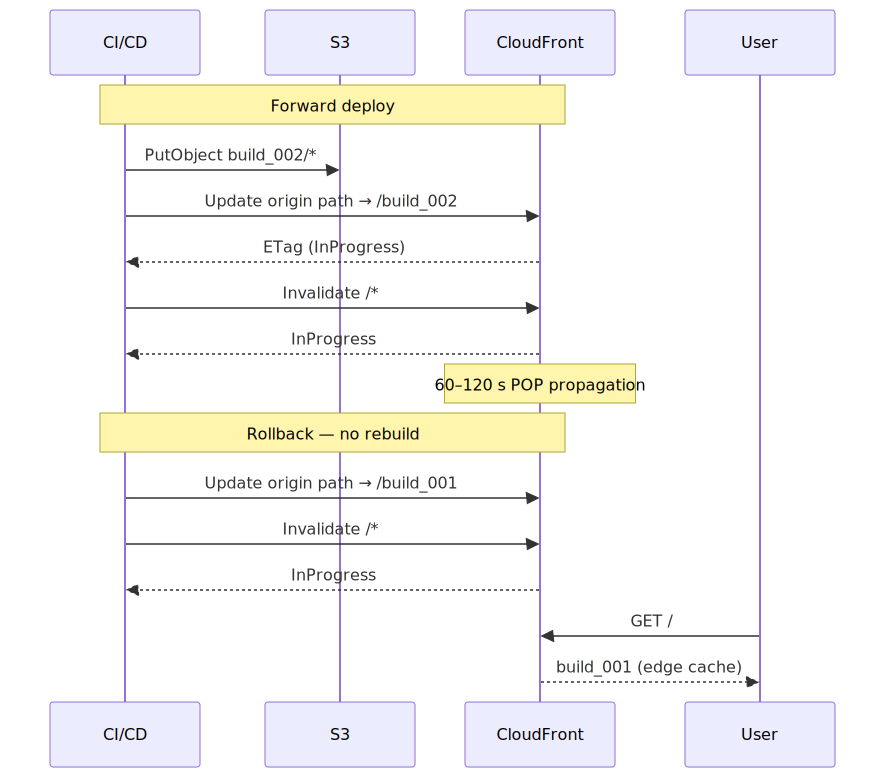
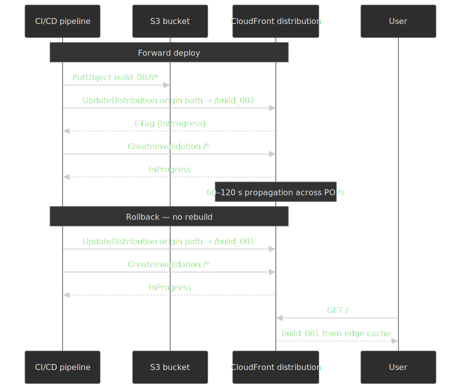

# SSG Performance on AWS: Atomic Deploys, Edge Functions, and Pre-Compression

Static site generation (SSG) only looks like "compile, upload, done" until the second time you have to roll back at 02:00 with traffic on top of half-cached assets. This article is the production playbook for serving an SSG build through Amazon S3 and CloudFront: how to lay out atomic versioned deploys, when to choose CloudFront Functions over Lambda@Edge, how to pre-compress with Brotli without breaking content negotiation, how to use the native [CloudFront Continuous Deployment](https://docs.aws.amazon.com/AmazonCloudFront/latest/DeveloperGuide/continuous-deployment.html) feature for blue/green releases, and what an SSG site can actually do about Cumulative Layout Shift.




## Thesis

Three architectural decisions compound to determine an SSG site's TTFB, blast radius, and cost:

1. **Where the work happens.** Build-time rendering moves database queries, template expansion, and asset minification out of the request path. Origin servers shrink to file delivery and the CDN does the rest.
2. **How releases are structured.** Versioned, immutable build prefixes in S3 make rollback a configuration change instead of a redeploy. Object-level S3 Versioning is the wrong tool for application rollback.
3. **Where logic lives at the edge.** [CloudFront Functions](https://docs.aws.amazon.com/AmazonCloudFront/latest/DeveloperGuide/edge-functions-choosing.html) at $0.10 per 1M handle viewer-side rewrites; [Lambda@Edge](https://docs.aws.amazon.com/AmazonCloudFront/latest/DeveloperGuide/lambda-at-the-edge.html) at $0.60 per 1M handles anything that needs the network or response body. Picking the wrong one wastes money or boxes you out of capabilities you'll need.

| Decision                        | Optimizes for                                  | You give up                                                                                |
| ------------------------------- | ---------------------------------------------- | ------------------------------------------------------------------------------------------ |
| Pre-compress at build (Brotli Q11) | 14–20% smaller bytes than Gzip -9 for JS/HTML[^brotli] | Build CPU (seconds per file at Q11) and content-negotiation complexity                     |
| Lambda@Edge over CloudFront Functions | Network access, body manipulation, longer compute (5 s viewer / 30 s origin) | 6× per-invocation cost and a `us-east-1`-only deployment surface[^lambda-edge-restrict]   |
| Versioned-prefix atomic deploys | Instant rollback, no partial state             | Storage for retained versions and a tiny CloudFront config-change loop                     |
| CloudFront Continuous Deployment | Native blue/green and canary, observable in CloudWatch | Single-distribution constraint and limited traffic-split granularity[^cd]                  |
| Origin Shield                   | Higher cache hit ratio, request collapsing     | Per-request surcharge and a second hop on cache misses                                     |

[Core Web Vitals](https://web.dev/articles/defining-core-web-vitals-thresholds) thresholds at the 75th percentile, as of 2026: **LCP ≤ 2.5 s**, **CLS ≤ 0.1**, **INP ≤ 200 ms** (INP replaced FID on 2024-03-12[^inp]). These are the floor an SSG architecture should aim past, not the ceiling.

## Mental model: SSG vs SSR vs ISR vs CSR

A senior team rarely picks one rendering mode for a whole product — modern frameworks (Next.js 15, Astro 5, SvelteKit) let you mix per route. Pick mode by data freshness and personalization cost, not by ideology.

| Property                        | SSG                                | SSR                            | ISR (revalidate)                                | CSR                                              |
| ------------------------------- | ---------------------------------- | ------------------------------ | ----------------------------------------------- | ------------------------------------------------ |
| Where HTML is built             | CI build                           | Per request on origin          | First request after `revalidate` window         | Browser, after JS executes                       |
| TTFB at edge cache hit          | Tens of ms                         | n/a (always origin round-trip) | Same as SSG between revalidations               | Fast HTML, slow meaningful content               |
| Personalization                 | None at HTML layer                 | Full                           | Limited (per-page, not per-user)                | Full (after hydration)                           |
| SEO                             | Strong — full HTML                 | Strong — full HTML             | Strong — usually fresh enough                   | Weak unless paired with prerender or SSR shell   |
| Cost shape                      | Bandwidth-only                     | Bandwidth + per-request compute | Bandwidth + occasional regeneration             | Bandwidth + API backend                          |
| Failure surface during traffic  | CDN only                           | Origin + framework runtime     | Origin during regeneration windows              | API backend                                      |

Next.js 15's per-route ISR is the `revalidate` route segment config (or the `cacheLife({ revalidate, expire, stale })` function under the new Cache Components model)[^next-isr]. Astro 5 layers Server Islands on top of static islands so a marketing page can stream a personalized header without hydrating the whole tree[^astro].

The article from here on assumes pure SSG output served from S3 + CloudFront with optional edge functions. Hybrid frameworks plug in cleanly because the deployment substrate is the same.

## Atomic, versioned deployments

> [!IMPORTANT]
> S3 Object Versioning tracks per-object history. It is not deployment versioning. Restoring a deploy that touched 500 files via S3 Versioning means 500 individual `CopyObject` calls — operationally infeasible during an incident.

The pattern that actually works in production: every CI build uploads to a unique prefix in the bucket, and CloudFront points at that prefix.

```text
s3://my-site/
├── build_001/
│   ├── index.html
│   └── assets/...
├── build_002/
│   ├── index.html
│   └── assets/...
└── build_003/
    ├── index.html
    └── assets/...
```

You can index by semver, by release tag, or by the short Git SHA — the only requirement is uniqueness and immutability. Once `build_002/` is closed, you never overwrite an object inside it. Rollback is a change to which prefix CloudFront resolves.

There are two ways to wire CloudFront to a prefix:

1. **Origin path.** Set the distribution's origin path to `/build_002`. Update via `UpdateDistribution`. This is the simplest pattern and works on a single distribution.
2. **Custom origin header + edge function.** Send a header like `x-build-version: build_002` from the origin configuration; an edge function rewrites the request URI to `/${header}/${path}`. This indirection makes A/B testing and gradual rollouts possible without a CloudFront config change per release.

The second pattern is more flexible but adds a function and the failure modes that come with it. For most SSG sites the origin path is enough; reach for the header indirection when you actually need cookie- or weight-based routing.




### Cache invalidation cost mechanics

CloudFront prices invalidation by **paths submitted per month**, not by objects matched. The first 1,000 paths per month are free; beyond that each path is $0.005, and a wildcard like `/*` counts as one path regardless of how many objects it expands to[^invalidation]. A team deploying three times a day with a single `/*` invalidation per release submits 90 paths/month — comfortably inside the free tier.

The trap is doing fine-grained invalidations because "wildcard feels too broad". Submitting 500 explicit paths per deploy puts you over the free tier on day 7.

> [!WARNING]
> Invalidations are eventually consistent across [CloudFront's POPs](https://aws.amazon.com/cloudfront/features/) (60–120 s typical, longer at the tail). Plan your release window for that gap; do not rely on invalidation completing before declaring success.

### Lifecycle and storage cost

Retain the last *N* versions you might roll back to (5–10 is normal), then expire the rest with an S3 lifecycle rule. A two-week trailing window covers nearly all "we need to revert that release" cases. For compliance-driven retention, ship the long tail to Glacier — never leave it in `STANDARD`.

## Edge logic: CloudFront Functions vs Lambda@Edge

The two AWS edge compute primitives look interchangeable on a slide. They are not — one runs on every POP for sub-millisecond rewrites, the other ferries arbitrary Node/Python code to a smaller pool of regional caches[^edge-functions].

| Capability             | CloudFront Functions               | Lambda@Edge                                    |
| ---------------------- | ---------------------------------- | ---------------------------------------------- |
| Execution location     | Every CloudFront POP (750+ globally) | 15 regional edge caches[^cf-features]        |
| Trigger points         | Viewer request and viewer response | All four (viewer + origin, request + response) |
| Max execution time     | < 1 ms                             | 5 s viewer / 30 s origin                       |
| Per-request peak scale | Millions/sec                       | Thousands/sec/region                           |
| Memory                 | 2 MB                               | 128 MB – 10,240 MB                             |
| Code package           | 10 KB                              | 50 MB                                          |
| Languages              | JavaScript (ECMAScript 5.1 subset) | Node.js, Python                                |
| Network access         | No                                 | Yes                                            |
| Body manipulation      | No                                 | Yes                                            |
| Pricing                | $0.10 / 1M invocations             | $0.60 / 1M + $0.00005001 / GB-second           |
| Free tier              | 2M invocations/month               | None                                           |

A 6× cost gap may be invisible at 10M req/month ($1 vs $6 plus duration) but it shows up at 10B. More importantly, the capability split is asymmetric: anything that needs a DNS lookup, a DynamoDB read, or to inspect the response body forces Lambda@Edge.




### Operational footguns

> [!CAUTION]
> Lambda@Edge functions deploy only to `us-east-1` and replicate from there to the regional caches. CloudFront associations must reference a numbered version, not `$LATEST` or a Lambda alias[^lambda-edge-restrict]. Plan IaC and access control around that fact: a development account in `eu-west-1` cannot host the function.

Other watchouts:

- **CloudWatch logs land in the executing region**, not in `us-east-1`. Centralize log aggregation up front or you'll hunt logs across 15 regions during incident triage.
- **Cold starts are real** for Lambda@Edge but bounded — replicas warm quickly under steady traffic. Build the cold-start latency into your p99 budget, not just p50.
- **CloudFront Functions runs ECMAScript 5.1**: no `async/await`, no `let`/`const` in older runtimes, no `Promise` outside specific globals. Lint against the documented subset.

### Build-version routing example

```javascript title="build-version-router.js" collapse={1-5}
// Lambda@Edge — origin-request trigger.
// Reads the x-build-version header injected by CloudFront's origin
// configuration and rewrites the URI into the corresponding S3 prefix.

exports.handler = (event, _context, callback) => {
  const request = event.Records[0].cf.request
  const headers = request.headers
  const version = headers["x-build-version"]?.[0]?.value || "build_004"

  request.uri = request.uri === "/" ? `/${version}/index.html` : `/${version}${request.uri}`
  callback(null, request)
}
```

Pair this with a deploy script that updates the custom origin header on the distribution config:

```bash title="set-build-version.sh" collapse={1-6}
#!/usr/bin/env bash
# Usage: ./set-build-version.sh build_003 E1234567890ABCD
set -euo pipefail
version="$1"
distribution_id="$2"

etag=$(aws cloudfront get-distribution-config --id "$distribution_id" --query 'ETag' --output text)
aws cloudfront update-distribution \
  --id "$distribution_id" \
  --distribution-config "file://dist-config-${version}.json" \
  --if-match "$etag"
aws cloudfront create-invalidation --distribution-id "$distribution_id" --paths "/*"
```

The same shape underpins blue/green and canary patterns later — a single header drives the routing.

### Origin Shield: when the second hop pays for itself

[Origin Shield](https://docs.aws.amazon.com/AmazonCloudFront/latest/DeveloperGuide/origin-shield.html) inserts a centralized regional cache between the regional edge caches and your origin. When ten POPs miss the same uncached object simultaneously, Origin Shield collapses them into a single origin fetch, then fans the response back out.

Enable when:

- Your traffic is global enough that simultaneous-miss thundering herds reach S3.
- Your origin sees enough request volume that S3 GET costs are noticeable.
- Cache hit ratio is < 90% and you've already exhausted cache-policy and TTL tuning.

Skip when traffic is regional or origin cost is dominated by data transfer (Origin Shield doesn't change egress).

## Pre-compression: serving Brotli without breaking caches

CloudFront will compress on the fly. The catch list is long enough that pre-compressing at build time is the durable answer for any non-trivial SSG site.

### CloudFront automatic compression — the catch list

[CloudFront's edge compression](https://docs.aws.amazon.com/AmazonCloudFront/latest/DeveloperGuide/ServingCompressedFiles.html) is governed by enough rules that it silently fails for plenty of real assets:

- **Object size:** only **1 KB to 10 MB** is compressed. Outside that range CloudFront serves identity, full stop.
- **Origin headers:** if your origin already sets `Content-Encoding`, CloudFront assumes the object is pre-compressed and never re-compresses.
- **HTTPS-only Brotli:** browsers send `Accept-Encoding: br` only over HTTPS. Plain HTTP gets gzip at best[^brotli-https].
- **HTTP/1.0:** CloudFront strips `Accept-Encoding` for HTTP/1.0 viewer requests, disabling compression entirely.
- **Status codes:** only `200`, `403`, and `404` responses are eligible.
- **Cache key:** you must use a cache policy with `EnableAcceptEncodingGzip` and `EnableAcceptEncodingBrotli` set to `true`; legacy cache settings cannot select Brotli.
- **TTL > 0:** disabled cache means no compression.
- **Best effort under load:** CloudFront documents that it may skip compression when stressed.
- **No retroactive compression:** objects already in the cache are not compressed when you flip the toggle. You must invalidate them.

Brotli vs Gzip in real numbers, based on Cloudflare's published benchmarks: Brotli Q11 yields roughly **14–20% smaller** JS and HTML and **17–30% smaller** CSS than Gzip -9, with comparable decompression speed[^brotli-cf]. Over 96% of browsers accept `br`[^brotli-caniuse], and the long tail still falls back to gzip.

### Build-time pipeline

Compress in CI to the maximum quality your build budget allows. Q11 on a 1.6 MB JS bundle is on the order of 1–2 seconds; that's a one-time cost amortized across every viewer.

```bash title="compress-assets.sh"
# Run after the bundler emits final assets; produces sibling .br and .gz files.
find dist -type f \( -name "*.js" -o -name "*.css" -o -name "*.html" -o -name "*.svg" \) -print0 |
  while IFS= read -r -d '' f; do
    brotli -q 11 -k -o "${f}.br" "$f"
    gzip   -9  -k          "$f"
  done
```

Upload each variant with the right `Content-Encoding` so CloudFront does not re-encode:

```bash title="upload-assets.sh"
aws s3 cp dist/main.js     s3://bucket/build_007/main.js     --content-type application/javascript
aws s3 cp dist/main.js.br  s3://bucket/build_007/main.js.br  --content-type application/javascript --content-encoding br
aws s3 cp dist/main.js.gz  s3://bucket/build_007/main.js.gz  --content-type application/javascript --content-encoding gzip
```

> [!NOTE]
> A naïve `aws s3 sync` will set `Content-Type` from the file extension, leaving `.br` and `.gz` files with `application/x-brotli` or `application/gzip` — the browser will then download instead of executing. Always set `Content-Type` to the underlying media type and `Content-Encoding` to the wire format.

### Edge content negotiation

A small CloudFront Function on the viewer-request trigger picks the variant. CloudFront Functions handles this in microseconds at every POP for $0.10/1M; Lambda@Edge would also work but is overkill.

```javascript title="negotiate-encoding.js"
// CloudFront Function — viewer-request trigger.
// Picks the best precomputed variant available based on the viewer's
// Accept-Encoding. Cache key must include Accept-Encoding to keep variants
// segregated.
function handler(event) {
  var req = event.request
  var ae = (req.headers["accept-encoding"] && req.headers["accept-encoding"].value) || ""
  if (!/\.(?:js|css|html|svg|json)$/.test(req.uri)) return req

  if (ae.indexOf("br") !== -1) {
    req.uri = req.uri + ".br"
  } else if (ae.indexOf("gzip") !== -1) {
    req.uri = req.uri + ".gz"
  }
  return req
}
```

CloudFront cache-policy configuration that pairs with this:

- Include `Accept-Encoding` in the cache key (one entry per encoding).
- Disable "Compress Objects Automatically" (you've taken over).
- Forward `Accept-Encoding` in the origin request policy.




### Indicative impact

Real numbers vary with content but the directional pattern holds: an SSG bundle that ships at ~3.5 MB uncompressed typically lands around ~250 KB Brotli Q11 (≈14:1) and ~460 KB Gzip -9 (≈8:1). Over a fast 4G link that translates to roughly half the load time at the same cache layer.

## CloudFront Continuous Deployment for blue/green

For most blue/green rollouts on CloudFront, the right answer is no longer custom Lambda@Edge cookie routing. AWS shipped [CloudFront Continuous Deployment](https://docs.aws.amazon.com/AmazonCloudFront/latest/DeveloperGuide/continuous-deployment.html) in late 2022: a managed staging distribution paired with the primary distribution via a continuous deployment policy, with weight-based or session-stickiness traffic splits[^cd]. That removes a piece of custom code that was famously easy to break.

Use it when:

- You want to test a CloudFront configuration change (cache policy, origin, function association) on a slice of real traffic before promoting.
- You want session-sticky canaries so the same viewer keeps hitting the same distribution.
- You want native CloudWatch metrics on both distributions during the canary.

Don't use it for:

- Permanent multi-distribution traffic split (it's designed for promotion, not steady-state routing).
- Geographic or per-user routing — those still belong in Lambda@Edge or in DNS-level routing (Route 53 weighted records, Global Accelerator).




### Lambda@Edge cookie routing — when you actually need it

The Lambda@Edge pattern is still the right call when:

- You need cookie- or header-driven routing **across more than two backends** (Continuous Deployment is two distributions only).
- You need cohort logic (geo, IP hash, account ID) that isn't expressible as a weight or sticky header.
- You're running a multi-tenant CDN where the routing logic is data-driven from a database.

```javascript title="cookie-routing.js" collapse={1-4}
// Lambda@Edge — origin-request trigger.
// Routes between blue and green S3 origins based on a routing cookie.
const blue  = "site-blue.s3.amazonaws.com"
const green = "site-green.s3.amazonaws.com"

exports.handler = async (event) => {
  const request = event.Records[0].cf.request
  const cookies = request.headers.cookie || []
  const wantsGreen = cookies.some(c => c.value.includes("routing=green"))
  const target = wantsGreen ? green : blue

  request.origin.s3.domainName = target
  request.headers.host = [{ key: "Host", value: target }]
  return request
}
```

The cookie is set elsewhere — typically a CloudFront Function on the viewer-response of a "join the green canary" page, or a logged-in user setting via your application.

### Canary by IP hash

For percentage-based canaries with session stickiness, hash a stable identifier (the client IP from `x-forwarded-for`, an account ID from a JWT) modulo 100 and route based on the bucket:

```javascript title="canary-router.js" collapse={1-4}
// Lambda@Edge — origin-request trigger.
// 10% canary by IP hash; same IP always lands on the same origin within
// the deployment window.
const PROD   = "prod-bucket.s3.amazonaws.com"
const CANARY = "canary-bucket.s3.amazonaws.com"
const CANARY_PCT = 10

exports.handler = async (event) => {
  const request = event.Records[0].cf.request
  const ip = request.headers["x-forwarded-for"]?.[0]?.value || "0.0.0.0"
  const bucket = ip.split(".").reduce((a, b) => a + parseInt(b, 10), 0) % 100
  request.origin.s3.domainName = bucket < CANARY_PCT ? CANARY : PROD
  return request
}
```

Tie automatic rollback to a CloudWatch alarm on canary error rate or LCP regression — the human in the loop should be the exception, not the path.

## CLS budget on a static site

Raw delivery speed is a prerequisite, not the goal. Visual stability is what users perceive. CLS aggregates unexpected shifts during the page lifecycle; a fast page that pops and reflows is worse than a slightly slower page that doesn't.

### What actually shifts on a static page

Most CLS regressions on SSG sites trace to four sources:

1. **Images without intrinsic dimensions.** The browser reserves zero space until decode; everything below moves when the image arrives.
2. **Late-injected embeds.** Ads, social cards, YouTube iframes, cookie banners arrive after the first paint and push content down.
3. **Web font swap.** The fallback metric and the loaded font have different x-heights and advance widths, causing line-break reflows.
4. **Client hydration that mounts components only on the client.** Anything rendered with `client:only` (Astro) or `dynamic(... { ssr: false })` (Next) starts as a hole.

For attribution at runtime, the [Layout Instability API](https://wicg.github.io/layout-instability/) exposes `LayoutShift.sources` — an array of up to **five** `LayoutShiftAttribution` objects sorted by impact area; if more than five elements participated in a shift, the largest five are kept[^layout-shift-sources]. `sources[0]` is your worst offender.

### Mitigations

```html title="image with reserved space.html"

```

The intrinsic `width` and `height` give the browser an aspect ratio it can reserve before the bytes land. `style="width: 100%; height: auto"` keeps it responsive without surrendering the reservation.

For variable-size embeds, reserve the most-common dimension with `min-height`:

```html title="ad slot reservation.html"
<div style="min-height: 250px;">
  <!-- Display ad mounts here after script loads -->
</div>
```

Fonts: preload the critical face and pick a fallback with similar metrics (`size-adjust`, `ascent-override`, `descent-override`, `line-gap-override` in `@font-face`):

```html title="critical font preload.html"
<link rel="preload" href="/fonts/inter-var.woff2" as="font" type="font/woff2" crossorigin>
<style>
  @font-face {
    font-family: "Inter";
    src: url("/fonts/inter-var.woff2") format("woff2");
    font-display: swap;
    size-adjust: 100.5%;
    ascent-override: 90%;
    descent-override: 22%;
    line-gap-override: 0%;
  }
</style>
```

`font-display: swap` keeps text visible during font load (better LCP) at the cost of a swap-time shift; `optional` removes the shift but accepts that some viewers never see your font on the first visit. Pick based on the metric mismatch and how visible the typography is.

### Dual-build for divergent mobile/desktop layouts

When mobile and desktop layouts produce different above-the-fold heights for the same components, a single SSG build forces one of them to shift on hydration. Two builds — separate routes for `/mobile/*` and `/desktop/*` — let each viewer get the right pre-rendered HTML.

The routing belongs in an edge function and the cache key needs to include the device dimension:

```javascript title="device-router.js"
// Lambda@Edge — origin-request trigger.
// Routes /mobile/* or /desktop/* based on CloudFront's device header.
exports.handler = async (event) => {
  const req = event.Records[0].cf.request
  const isMobile = req.headers["cloudfront-is-mobile-viewer"]?.[0]?.value === "true"
  const prefix = isMobile ? "/mobile" : "/desktop"
  req.uri = req.uri === "/" ? `${prefix}/index.html` : `${prefix}${req.uri}`
  return req
}
```

The corresponding cache policy must include `CloudFront-Is-Mobile-Viewer` (and any other dimensions you route on) in the cache key, otherwise mobile and desktop variants collide. CloudFront's `CloudFront-Is-*-Viewer` headers normalize User-Agent into a small set of booleans precisely so device-aware caching doesn't shred your hit ratio[^header-caching].

> [!TIP]
> Skip the dual-build cost (2× CI time, 2× S3 storage) until you have measured CLS difference between mobile and desktop layouts in real RUM data. The mitigation here is more expensive than most teams realize.

## URL redirects at the edge

Three options, each with a sharp constraint:

| Option                    | Where it executes               | When to reach for it                                                |
| ------------------------- | ------------------------------- | ------------------------------------------------------------------- |
| Meta refresh              | Browser, after HTML download    | Almost never — full HTML download before redirect, weak SEO signal  |
| S3 routing rules          | Origin (S3 website endpoint)    | Tiny static sites that already use the public website endpoint      |
| CloudFront Function / Lambda@Edge | CloudFront edge                 | Default for anything serious — works with private S3 + OAC          |

S3's `RoutingRules` come with two structural limits that disqualify them for production SSG sites: **50 rules per bucket**[^s3-rules], and they only work with the public S3 website endpoint — the moment you adopt [Origin Access Control (OAC)](https://docs.aws.amazon.com/AmazonCloudFront/latest/DeveloperGuide/private-content-restricting-access-to-s3.html) to lock the bucket down, you lose both routing rules and automatic `index.html` resolution[^oac-website].

For a small, static map of `/old → /new` redirects, a CloudFront Function is plenty:

```javascript title="redirect-map.js"
// CloudFront Function — viewer-request trigger.
// Issues a 301 from a static lookup table; falls through to the cache otherwise.
var REDIRECTS = {
  "/old-product": { to: "/new-product", code: 301 },
  "/promo":       { to: "/current-sale", code: 302 },
  "/legacy-docs": { to: "https://docs.example.com", code: 301 },
}

function handler(event) {
  var req = event.request
  var rule = REDIRECTS[req.uri]
  if (!rule) return req
  return {
    statusCode: rule.code,
    statusDescription: rule.code === 301 ? "Moved Permanently" : "Found",
    headers: {
      "location":      { value: rule.to },
      "cache-control": { value: "max-age=3600" },
    },
  }
}
```

Move to Lambda@Edge only when you need a redirect map larger than a single function deployment can hold (a DynamoDB lookup), or when the redirect target depends on geo or auth state.

## Operational defaults

Decisions worth making once and revisiting only on signal:

- **Versioned S3 prefix per build, lifecycle out at 14 days, retain last 5–10 explicitly.** Don't run application rollback through S3 Object Versioning.
- **Single CloudFront distribution** for the main site. Use Continuous Deployment for canaries; reach for a second distribution only when the routing genuinely doesn't fit a single config.
- **Pre-compress at build (Brotli Q11 + Gzip -9), serve via edge content negotiation.** CloudFront's automatic compression has too many silent skips for assets that matter.
- **Cache policy with `Accept-Encoding` in the cache key, Origin Request Policy forwarding only what you actually use.** Every extra cache-key dimension is a hit-ratio loss.
- **Lambda@Edge replicas live in `us-east-1`; centralize CloudWatch logs early.** Do not discover this during an incident.
- **Reserve dimensions for everything that loads asynchronously.** Images get `width`/`height`; ad slots get `min-height`; fonts get `size-adjust` overrides.
- **Wire automatic rollback to CloudWatch alarms on Lambda@Edge errors, CloudFront 5xx rate, and synthetic CWV regressions.** Manual rollback is the failure mode, not the goal.

## Appendix

### Glossary

- **TTFB (Time to First Byte)** — interval from request initiation to the first response byte.
- **LCP (Largest Contentful Paint)** — render time of the largest image or text block in the viewport. Good ≤ 2.5 s at p75.
- **CLS (Cumulative Layout Shift)** — sum of unexpected layout shifts across the page lifecycle. Good ≤ 0.1 at p75.
- **INP (Interaction to Next Paint)** — latency of the worst (or near-worst) user interaction. Replaced FID on 2024-03-12. Good ≤ 200 ms at p75.
- **ISR (Incremental Static Regeneration)** — regenerating a static page on demand after a `revalidate` interval. Next.js native; emulated by other frameworks via cron or webhooks.
- **OAC (Origin Access Control)** — CloudFront mechanism that signs origin requests so an S3 bucket can refuse public access.
- **POP (Point of Presence)** — physical location where CloudFront accepts viewer connections. Distinct from regional edge caches.
- **Regional Edge Cache (REC)** — second-tier CloudFront cache; Lambda@Edge runs here.
- **Origin Shield** — optional centralized regional cache between RECs and origin; collapses simultaneous misses.

[^brotli]: [Cloudflare — All the way up to 11: Serve Brotli from origin](https://blog.cloudflare.com/this-is-brotli-from-origin/) and [Paul Calvano — Choosing between gzip, Brotli and zStandard](https://paulcalvano.com/2024-03-19-choosing-between-gzip-brotli-and-zstandard-compression/). Both report Brotli Q11 vs Gzip -9 in the 14–25% smaller range across JS, HTML, and CSS.
[^lambda-edge-restrict]: [AWS docs — Restrictions on Lambda@Edge](https://docs.aws.amazon.com/AmazonCloudFront/latest/DeveloperGuide/lambda-at-edge-function-restrictions.html). Functions deploy to `us-east-1` and replicate; CloudFront associations must reference a numbered version.
[^cd]: [AWS docs — Use CloudFront continuous deployment to safely test CDN configuration changes](https://docs.aws.amazon.com/AmazonCloudFront/latest/DeveloperGuide/continuous-deployment.html) and [AWS Networking & Content Delivery Blog — Achieving zero-downtime deployments with Amazon CloudFront using blue/green continuous deployments](https://aws.amazon.com/blogs/networking-and-content-delivery/achieving-zero-downtime-deployments-with-amazon-cloudfront-using-blue-green-continuous-deployments/).
[^inp]: [web.dev — Interaction to Next Paint becomes a Core Web Vital on March 12](https://web.dev/blog/inp-cwv-march-12).
[^next-isr]: [Next.js docs — How to implement Incremental Static Regeneration](https://nextjs.org/docs/app/guides/incremental-static-regeneration) and [`cacheLife`](https://nextjs.org/docs/app/api-reference/functions/cacheLife). Configure ISR with the `revalidate` route segment export, or with `cacheLife({ revalidate, expire, stale })` under the Cache Components model new in Next.js 15.
[^astro]: [Astro docs — Server Islands](https://docs.astro.build/en/concepts/islands/) and [Astro 5 release notes](https://astro.build/blog/astro-5/).
[^invalidation]: [AWS docs — Pay for file invalidation](https://docs.aws.amazon.com/AmazonCloudFront/latest/DeveloperGuide/PayingForInvalidation.html). First 1,000 paths/month free, $0.005 per path beyond, wildcards count as one path.
[^edge-functions]: [AWS docs — Differences between CloudFront Functions and Lambda@Edge](https://docs.aws.amazon.com/AmazonCloudFront/latest/DeveloperGuide/edge-functions-choosing.html). Capability matrix and pricing.
[^cf-features]: [AWS — Amazon CloudFront features](https://aws.amazon.com/cloudfront/features/). Current global footprint of POPs and 15 regional edge caches.
[^brotli-https]: [AWS docs — Serve compressed files](https://docs.aws.amazon.com/AmazonCloudFront/latest/DeveloperGuide/ServingCompressedFiles.html). Browsers send `Accept-Encoding: br` only over HTTPS; HTTP/1.0 disables compression entirely; only 200/403/404 responses are eligible.
[^brotli-cf]: [Cloudflare — Results of experimenting with Brotli for dynamic web content](https://blog.cloudflare.com/results-experimenting-brotli/) for the original benchmark methodology.
[^brotli-caniuse]: [Can I use — Brotli Accept-Encoding/Content-Encoding](https://caniuse.com/brotli) reports ≈96% global support as of March 2026.
[^layout-shift-sources]: [web.dev — Debug layout shifts](https://web.dev/articles/debug-layout-shifts) explicitly documents the five-element cap and the ranking by impact area; the underlying interface is described in [MDN — `LayoutShiftAttribution`](https://developer.mozilla.org/en-US/docs/Web/API/LayoutShiftAttribution).
[^s3-rules]: [AWS docs — Configuring a webpage redirect](https://docs.aws.amazon.com/AmazonS3/latest/userguide/how-to-page-redirect.html). 50 routing rules per bucket; beyond that you need per-object `x-amz-website-redirect-location` metadata.
[^oac-website]: [Stack Overflow — Missing functionality of AWS OAC when hosting a static website from S3](https://stackoverflow.com/questions/76068611/missing-functionality-of-aws-oac-when-hosting-a-static-web-site-from-s3) cross-references the AWS docs on OAC and confirms loss of S3 website features (default index resolution, routing rules) when switching from the website endpoint to the REST endpoint with OAC.
[^header-caching]: [AWS docs — Cache content based on request headers](https://docs.aws.amazon.com/AmazonCloudFront/latest/DeveloperGuide/header-caching.html). Use `CloudFront-Is-*-Viewer` headers in the cache policy; never the raw `User-Agent` (it shreds the hit ratio).
