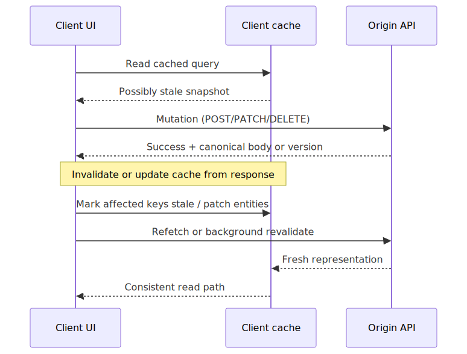
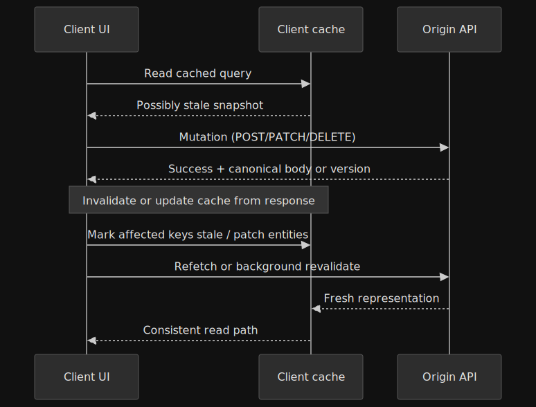

# State Management Patterns: Boundaries, Ownership, and Consistency

Most “state management” discussions collapse into library comparisons. That is backwards. The hard problems are almost always **boundary** problems: which slice of truth is authoritative, who may mutate it, how stale reads are allowed to be, and what happens when the network disagrees with the UI you already showed.

This article gives a **decision-shaped mental model** you can finish in roughly **fifteen to thirty minutes**: a taxonomy, consistency expectations, invalidation flows, optimistic patterns, the **coordination tax** you pay when data is shared, and **tool-selection heuristics** that stay portable across React, Vue, Svelte, and native web stacks.

## The core rule: one owner, one write path

For every piece of data, you should be able to answer:

1. **Who is the authority** (browser-only UI, a client-wide coordinator, or the server)?
2. **Who may write** (one module, one hook boundary, one mutation API)?
3. **What breaks** if two writers race (lost updates, torn reads, double submits)?

That framing matches how mature UI libraries already teach composition: **lift state** only far enough to share it, and keep updates flowing through a narrow API ([Sharing state between components](https://react.dev/learn/sharing-state-between-components)). Stores and cache libraries are not morally superior to props—they are **policy engines** for when lifting is no longer enough.

## Taxonomy: local, global, server, and derived

### Local and UI-adjacent state

**Local state** is ideal when only one subtree cares, the lifetime matches the UI, and you do not need a stable deep link. Inputs, disclosure toggles, transient validation messages, and animation phase fit here.

**URL-visible state** is still “local” to the browser, but the **address bar** becomes the authority users can bookmark, share, and restore. The WHATWG URL standard defines the parsing and serialization model user agents implement ([URL](https://url.spec.whatwg.org/)); pairing it with the History API is how stacks implement shareable UI state without a global store ([History](https://html.spec.whatwg.org/multipage/nav-history-apis.html#the-history-interface)). Reach for URL state when **routing is the product** (filters, tabs, pagination) rather than when you only need ephemeral feedback.

### Global coordinating state

Introduce **client-wide** coordination when multiple distant surfaces must **observe and react** to the same write stream: authenticated session shell, theme, feature flags, checkout wizard context, or cross-route undo buffers.

The failure mode is not “we used Context”—it is **ambient mutation**: dozens of modules writing the same map without invariants. Prefer **narrow write APIs** (reducer-style transitions, small command functions, or store slices with enforced preconditions) over exporting raw mutable references.

**When not to globalize:** if only two siblings need the value, **lift state to their parent** or pass explicit callbacks. If the value should survive refresh and be shareable, **prefer the URL** over a store field. Stores excel when there is **no natural hierarchical owner** or when many unrelated routes must read the same write-heavy stream (for example, unread notification counts synchronized from a WebSocket).

Server rendering adds another lens: anything you put in a global singleton must be **rehydration-safe** per request. That is why session-specific data often belongs in **cookies**, **server components**, or **per-request context**, not in module-level variables—React’s server component model exists precisely to keep request-scoped work out of shared client singletons ([Server Components](https://react.dev/reference/rsc/server-components)), with explicit client boundaries where interactivity requires them ([`'use client'`](https://react.dev/reference/rsc/use-client)).

### Server-backed state

**Server-backed** facts—permissions, balances, inventory, entitlements—have their **source of truth off-device**. HTTP semantics are explicit that some methods are expected to be **safe** reads while others carry intent to change server state ([HTTP request methods](https://www.rfc-editor.org/rfc/rfc9110.html#name-method-definitions)). Your client therefore holds a **cache** (memory, service worker, or both), not a second authority.

Caches are governed by freshness and validation rules on the wire ([HTTP Caching](https://www.rfc-editor.org/rfc/rfc9111.html)); client libraries add another policy layer (stale times, deduplication, background revalidation) on top of those foundations. The Fetch standard’s `Request`/`Response` model is the portable contract browsers use when those libraries ultimately call `fetch()` ([Fetch](https://fetch.spec.whatwg.org/#fetch-method)).

### Derived state: compute, do not duplicate

**Derived state** is anything deterministically computable from other inputs: sorted rows, disabled flags, formatted totals, “is step three complete.” Treat it as a **pure projection**—memoized selectors, computed signals, or `useMemo`-style caching—not as a parallel writable field.

Duplicating derived values as manually synced state is how teams get **update leaks**: one input changes, a derived copy forgets to refresh, and the UI lies quietly. React’s state-structure guidance calls this out explicitly as **redundant state** that should be removed in favor of computing during render ([Avoid redundant state](https://react.dev/learn/choosing-the-state-structure#avoid-redundant-state)).

Redux’s style guide states the invariant bluntly: **treat reducers as state machines**, keep state minimal, and derive everything else ([Redux Style Guide](https://redux.js.org/style-guide/style-guide#treat-reducers-as-state-machines)). You do not need Redux to apply that rule—any time you mirror `serverCart` into `clientCartSummary`, you have introduced a **second authority** unless the summary is purely computed on every read.

When profiling shows selector cost matters, move work across the boundary deliberately: **denormalize on the server** into a view model, **paginate** heavy lists, or **incrementalize** client-side (virtualized windows, incremental sort). Do not precompute into writable fields until measurement proves the projection is the bottleneck—not the network.

A useful discipline is to name **inputs** and **outputs** explicitly in code review: “This value is `f(serverCart, localPromoCode)`; it must not be written elsewhere.” That matches how selector libraries and memoization hooks are supposed to be used—as **pure functions** of upstream state—not as parallel stores.

## Worked scenario: profile, permissions, and a dashboard widget

Imagine a signed-in shell that shows **navigation**, a **profile menu**, and a **billing summary** widget. Three surfaces, one underlying truth: the authenticated principal and entitlements.

- **Profile display name** might be fine as server-backed cache data with a long `staleTime` if wrong names are low impact; **permissions** are higher impact and usually want shorter staleness or immediate invalidation after role-changing mutations.
- **Billing summary** likely needs **read-your-writes** after the user updates a payment method: optimistic UI can show “processing,” but the authoritative balance should reconcile from the mutation response or a targeted refetch.
- **Theme or density** belongs in **global local** state (or persisted preferences) with no server round-trip; mixing it into the same reducer as `user.role` obscures which updates require network acknowledgment.

The scenario is mundane on purpose: senior designs show up as **consistent policies per fact**, not as clever one-off hooks.

## Consistency: what “correct” means in a client cache

Client applications almost never show the world at a single global timestamp. They show **good-enough snapshots** under a latency budget. Make the consistency target explicit:

| Consistency target | What the user sees | Typical techniques |
| ------------------ | ------------------- | ------------------ |
| **Read-your-writes** | After I save, I see my save | Await mutation then patch cache or refetch affected keys |
| **Eventual freshness** | Data may be stale but converges | Time-to-live, background revalidation, visibility refetch ([SWR revalidation](https://swr.vercel.app/docs/revalidation) describes the same triggers in library form) |
| **Strong cross-entity** | Two panels never disagree on totals | Single query, normalized entity store, or server-computed view model |

TanStack Query’s overview describes the core **stale-while-revalidate** mental model and shared vocabulary ([Overview](https://tanstack.com/query/latest/docs/overview)); framework guides spell out defaults such as `staleTime` per adapter. Whether you adopt that library or not, the **policy vocabulary**—stale, fetching, invalidated—is what your team should align on.

## Invalidation after mutation

The dominant server-state pattern is still: **mutate, then reconcile the cache**—either by **invalidating** keys, **patching** entities from the response payload, or **optimistically** assuming success and rolling back on failure (next section).

Practical rules:

- **Prefer patching from the mutation response** when the API returns the canonical representation; it avoids a thundering herd of refetches and preserves **read-your-writes** semantics. TanStack Query treats response-driven updates as a first-class workflow ([Updates from mutation responses](https://tanstack.com/query/latest/docs/framework/react/guides/updates-from-mutation-responses)).
- **Invalidate broadly, then narrow** when you are unsure which entities changed—but measure the cost; over-invalidation is a latency and cost bug. Hierarchical or predicate-based invalidation (for example, “everything under `['project', id]`”) keeps the blast radius intentional ([Query invalidation](https://tanstack.com/query/latest/docs/framework/react/guides/query-invalidation)).
- **Version or tag aggregates** when partial updates are unsafe (financial totals, permission matrices). HTTP conditional requests (`ETag`, `If-Match`) exist precisely to detect conflicting versions ([Conditional Requests](https://www.rfc-editor.org/rfc/rfc9110.html#name-conditional-requests)).

GraphQL clients solve the same reconciliation problem with **normalized caches** and field policies ([Apollo Client Caching](https://www.apollographql.com/docs/react/caching/cache-configuration/)); the mechanism differs, but the **ownership question** does not.

### Keys, tags, and mental load

Whatever cache you use, engineers will reason in terms of **keys**—stable identifiers for “the question this cached value answers.” Good keys are **specific enough to invalidate precisely** and **stable enough not to churn** when unrelated UI state toggles. If keys encode too much incidental UI context, you lose deduplication; if they are too coarse, unrelated screens fight over the same snapshot.

Tags (or tag-like predicates) are a **human-facing layer** on top of raw keys: “this mutation touches billing, permissions, and the current project header.” They are invaluable for large apps because they move invalidation policy into **named concerns** instead of ad hoc lists of string tuples scattered through components.

## Optimistic updates: speed with a rollback story

Optimistic UI applies a predicted transition locally, then **confirms or rolls back** once the server responds. That maps cleanly to a small state machine rather than ad hoc flags.

Guardrails that separate senior systems from demos:

- **Idempotent mutations** where possible so retries do not double-charge; safe retry behavior is part of the HTTP method semantics ([Idempotent methods](https://www.rfc-editor.org/rfc/rfc9110.html#name-idempotent-methods)).
- **Per-action serialization** so double-clicks cannot fork two optimistic timelines for the same aggregate.
- **Conflict UI** when `412`/`409` style responses arrive—hide the failure and you train users not to trust the product.

TanStack Query’s optimistic-update guide walks through cache orchestration, rollback, and reconciliation against server results ([Optimistic updates](https://tanstack.com/query/latest/docs/framework/react/guides/optimistic-updates)); the same pattern appears—with different APIs—in Apollo’s optimistic mutation path ([Optimistic UI](https://www.apollographql.com/docs/react/performance/optimistic-ui/)).

## Failure modes that reviews should catch

Even correct-looking code fails in predictable ways:

- **Torn reads across panels** when two queries for logically related data are not updated as a unit. Fix by aligning keys, using a normalized entity layer, or returning a single aggregate DTO for the view.
- **Zombie effects** after unmount: async handlers resolve and call `setState` on dead trees. Abort controllers, cancellation tokens, or framework-level auto-cancellation (for example, [Strict Mode double-invocation](https://react.dev/reference/react/StrictMode) surfacing bad assumptions in development) belong in the toolkit.
- **Optimistic ghosts** where rollback restores data but not scroll position, focus, or secondary caches (localStorage drafts). The rollback story is UX-wide, not just data-wide.
- **Thundering herds** on cold start or reconnect when every mounted query refetches at once. Stagger with deduping request managers, priority tiers, or server-driven batch endpoints.

## Synchronization costs: what you pay when state is shared

Every shared atom has a **coordination surface**: subscribers must rerun, serializers must merge, tests must fixture more global prelude. Common costs:

- **Broad subscriptions** where any global change rerenders large trees. Mitigations: selectors, partitioned contexts, fine-grained reactivity, or component-local caches with explicit lift points.
- **Prop drilling vs implicit providers**: drilling is verbose but makes dataflow obvious; providers scale better but can hide **who writes**. Teams should enforce **lint or review rules** on provider placement rather than pretending one style is universally “cleaner.”
- **Cache stampedes** after invalidation—many components refetch the same key simultaneously. Deduping request managers (TanStack Query’s [`queryClient.fetchQuery`](https://tanstack.com/query/latest/docs/reference/QueryClient#queryclientfetchquery) behavior, for example) exist to collapse identical in-flight reads.

If you cannot name the **synchronization boundary**, you have not finished the design—only deferred it to production.

## Tool selection heuristics (intentionally boring)

Pick tools by **failure modes you need to prevent**, not by popularity charts.

| If your pain is… | Signals | Reach for… |
| ---------------- | ------- | ---------- |
| Lifted props spiraling | Many intermediaries, identical props threading | URL state, colocated server components (where available), or a **scoped** provider—not necessarily a global store |
| Duplicate fetches and cache chaos | Waterfalls, inconsistent staleness | A **request cache** with dedupe + invalidation policy (TanStack Query, RTK Query, SWR, Apollo Client, etc.) |
| Complex multi-step UI workflows | Enforced transitions, undo stacks | **Explicit state machines** (XState is the reference implementation ([XState](https://stately.ai/docs/xstate)); hand-rolled reducers are fine when complexity stays low) |
| High-frequency derived data | Recomputing large structures | Memoized selectors / signals; consider incrementalization when profiling proves it matters |

> **TIP:** If two libraries solve the same tier (for example, two server caches), compare **mutation defaults**, **SSR hydration story**, **DevTools**, and **escape hatches** for imperative cache patches. Those determine day-two ergonomics more than API surface sugar.

## A compact decision checklist

Before adding a store or cache dependency:

1. **Can this be subtree-local** with lifted state or URL parameters?
2. **Is the server the only authority**? If yes, model it as **server state with a policy**, not as manually mirrored global variables.
3. **What consistency level** does the product copy promise after writes?
4. **What is the invalidation scope** for each mutation—keys, entities, or tags?
5. **What is the optimistic rollback** story and conflict UX?
6. **What rerenders or refetches** does this choice imply under worst-case navigation?

State management is **systems design in miniature**. When the boundaries are crisp, the library choice is usually obvious—and sometimes unnecessary.
