# Statsig Experimentation Platform: SDK Architecture and Rollouts

Statsig is one of the few feature-flagging vendors whose product surface — flags, experiments, product analytics, session replay — sits on a single ingestion and assignment pipeline. For a senior engineer integrating it, the interesting questions are mechanical rather than marketing: how a user is bucketed, where evaluation runs, what the SDK does on a cold start, how to keep evaluation alive when the Statsig API is unreachable, and how the deployment model (cloud vs. warehouse-native) shapes the rest of the system. This article walks through those mechanics with citations to the official docs and SDK source.


## TL;DR

- **Two evaluation models, one assignment algorithm.** Server SDKs download the full ruleset and evaluate locally; client SDKs receive pre-computed values for the current user from `/initialize`. Both produce the same bucket because both feed `SHA-256(salt + unitID)` into a `mod 10000` (experiments) or `mod 1000` (layers) bucket assignment ([How Evaluation Works](https://docs.statsig.com/sdks/how-evaluation-works)).
- **Deterministic, stateless.** SDKs do not persist `user → bucket` mappings. The hash is recomputed every check; the same user gets the same bucket as long as the rule's salt is unchanged ([How Evaluation Works](https://docs.statsig.com/sdks/how-evaluation-works)).
- **Bootstrap is the recommended pattern for SSR.** A server-side `getClientInitializeResponse(user)` produces a JSON payload you can inline into the page; the browser SDK then calls `initializeSync` with no network request, eliminating UI flicker ([Server Core docs](https://docs.statsig.com/server-core/node-core), [Client SDK docs](https://docs.statsig.com/client/javascript-sdk)).
- **Failure mode is "serve last known good."** Server SDKs keep evaluating from in-memory specs when the API is unreachable; new instances coming up during an outage need a `DataAdapter` (Redis, Edge Config, your own table) to recover state ([DataAdapter docs](https://docs.statsig.com/server/concepts/data_store)).
- **Two deployment models.** Statsig Cloud is fully managed; Statsig Warehouse Native runs the Stats Engine inside your BigQuery / Snowflake / Redshift / Databricks. Pick by where your metric source-of-truth already lives, not by raw price ([WHN vs. Cloud](https://docs.statsig.com/statsig-warehouse-native/native-vs-cloud)).

## Mental model

Three concepts cover most of what follows; everything else is mechanics.

- **Config spec.** The serialized definition of every gate, experiment, layer, dynamic config, and ID list in a project. A version of this JSON document is what server SDKs download from the CDN; an evaluated projection of it is what client SDKs receive from `/initialize`.
- **Salt.** A stable, per-rule string. Combined with the user's `unitID` (e.g. `userID`, `stableID`, or any `customID`), it deterministically picks a bucket. Re-using the same rule keeps the same users in the same bucket; creating a new rule re-rolls them ([rollout-toggle FAQ](https://docs.statsig.com/sdks/how-evaluation-works)).
- **Exposure.** A logged event that says "user X was bucketed into variant Y at time T." Statistical analysis runs on exposures, not on rule definitions, so dropping or duplicating them silently corrupts experiment results.

> [!IMPORTANT]
> The package landscape is split across two SDK generations. The legacy Node SDK is `statsig-node` (class methods on a singleton: `await Statsig.initialize(key)`). The current generation is **Server Core** — `@statsig/statsig-node-core` — built on a Rust core, instantiated as `new Statsig(key, options); await statsig.initialize()`. The two surfaces are similar but not identical; the Vercel `EdgeConfigDataAdapter` example, in particular, still uses the legacy `statsig-node` package today. All examples below explicitly mark which generation they target.

## Unified pipeline, in practice


The advantage of routing flags, experiments, and analytics through the same pipeline is not aesthetic. When the exposure that bucketed a user into variant `B` and the conversion event the user generated five minutes later are processed by the same identity model and the same metric definitions, you don't need to reconcile two pipelines to claim causality. That removes a class of integration bugs that show up as "the feature flag platform says +5% but the analytics dashboard says -2%."

Statsig's architecture decomposes into the usual pieces:

| Component | Responsibility |
| :--- | :--- |
| Assignment service | Bucketing and rule evaluation. SDKs do this in-process; the service mostly serves the spec. |
| Configuration service | Persists rule definitions; emits the `download_config_specs` payload consumed by every server SDK. |
| Metrics pipeline | Ingests, dedupes, and stages exposures and custom events. |
| Analysis service | Runs the Stats Engine — CUPED, sequential testing, etc. — against the staged metric data. |

The split matters for failure mode discussion later: a problem in the metrics pipeline shows up as bad analytics, while a problem in the configuration service shows up as stale flags — and the SDK's behavior in each case is different.

## Deterministic assignment

This is the most cited claim in the article and the one that makes cross-platform consistency possible at all.

 → leading bytes → modulo 10,000 (experiments) or 1,000 (layers) → bucket → variant.")

Per the [How Evaluation Works](https://docs.statsig.com/sdks/how-evaluation-works) doc:

1. Each gate or experiment rule generates a unique, stable salt.
2. The user's `unitID` is concatenated with that salt and run through SHA-256.
3. The resulting digest is reduced to an integer and taken modulo `10000` (for experiments) or `1000` (for layers).
4. That integer is the user's bucket; rule allocation thresholds determine which variant the bucket maps to.

```ts title="assignment-sketch.ts" wrap
// Conceptual sketch — the canonical implementation lives in
// https://github.com/statsig-io/node-js-server-sdk/blob/main/src/Evaluator.ts
import { createHash } from "node:crypto"

export function bucket(unitID: string, salt: string, modulus: 10_000 | 1_000): number {
  const digest = createHash("sha256").update(`${salt}${unitID}`).digest()
  // The exact byte slice the SDK uses to fold the digest into an integer
  // is an implementation detail; treat the open-source Evaluator as the source of truth.
  const head = digest.readBigUInt64BE(0)
  return Number(head % BigInt(modulus))
}
```

> [!NOTE]
> Earlier drafts of this article specified an exact byte slice ("first 8 hex chars" or "first 8 bytes"). The public docs only state that the digest is "subjected to a modulus operation"; the byte width and endianness are implementation details that have differed between SDK generations. If your application depends on bit-exact reproduction (e.g. you're building your own assignment service that must match Statsig's), pin the version of the open-source `Evaluator.ts` and treat that as the contract, not this article.

The consequences of the algorithm are worth stating explicitly:

- **Cross-platform consistency.** A web client and a Node backend evaluating the same rule for the same user get the same bucket without any coordination, because both compute the same hash.
- **Temporal consistency under rollout changes.** Take a gate from 0% to 50%, back to 0%, and back to 50% again on the **same rule** and you re-expose the same 50% of users. Create a new rule and the salt changes, so the population re-rolls. This is the operational contract for safe canaries ([How Evaluation Works](https://docs.statsig.com/sdks/how-evaluation-works)).
- **No cached state.** SDKs do not store `user → bucket`. Statsig has explicitly written about customers who tried to add Redis to memoize this and ended up paying more for Redis than for Statsig itself; the deterministic hash is cheaper than caching it ([How Evaluation Works](https://docs.statsig.com/sdks/how-evaluation-works)).

## Server SDK: download and evaluate locally

.")

The server-side model is the simpler one to reason about: keep the project's specs in memory, evaluate locally on every check, refresh the specs in the background.

### Initialization (Server Core)

```ts title="server-init.ts" collapse={1-2}
import { Statsig, StatsigUser } from "@statsig/statsig-node-core"

const statsig = new Statsig(process.env.STATSIG_SECRET_KEY!, {
  environment: "production",
})

await statsig.initialize()

const user = new StatsigUser({ userID: "user_123" })
const isOn = statsig.checkGate(user, "new_homepage")
const config = statsig.getDynamicConfig(user, "pricing_tier")
const exp = statsig.getExperiment(user, "recommendation_algorithm")
```

Important deltas from the legacy `statsig-node` SDK ([migration notes](https://docs.statsig.com/server-core/node-core)):

- Construct an instance with `new Statsig(...)`, then `await initialize()`. There is no static `Statsig.initialize(...)` on Server Core.
- The Node Core package ships native binaries; if you use a frozen lockfile (Next.js / Docker multi-stage builds), include the platform-specific subpackages your build and runtime targets need.
- Mark `@statsig/statsig-node-core` as a `serverExternalPackages` entry in `next.config.js` to keep webpack from trying to bundle the native addon.

### Where the spec comes from

The server SDK pulls the project spec from the CDN at the documented endpoint ([CDN edge testing guide](https://docs.statsig.com/guides/cdn-edge-testing)):

```
GET https://api.statsigcdn.com/v1/download_config_specs/<SERVER_SDK_KEY>.json
```

The polling interval is configurable via `rulesetsSyncIntervalMs`; the default is 10 000 ms across the Server Core SDKs ([C++ Server SDK docs](https://docs.statsig.com/server/cpp), [legacy Python docs](https://docs.statsig.com/server/pythonSDK)). Updates use a `company_lcut` ("last config-update timestamp") so the SDK can ask the server "anything new since T?" rather than re-downloading the entire payload every cycle, and the in-memory store is swapped atomically once the new payload is parsed.

The shape of the spec — useful when reasoning about cache TTLs and DataAdapter contents:

```ts title="config-specs.ts"
interface ConfigSpecs {
  feature_gates: Record<string, FeatureGateSpec>
  dynamic_configs: Record<string, DynamicConfigSpec>
  layer_configs: Record<string, LayerSpec>
  id_lists: Record<string, string[]>
  has_updates: boolean
  time: number
}
```

### Evaluation latency

Once the spec is in memory, `checkGate` / `getExperiment` / `getDynamicConfig` are synchronous. The Statsig docs target sub-millisecond latency for these calls, with no network involved after init ([How Evaluation Works](https://docs.statsig.com/sdks/how-evaluation-works)). Treat that as a guideline rather than a guarantee — actual latency depends on rule complexity (geo / segment lookups, custom IDs, ID-list segments) and host load.

## Client SDK: pre-computed values


The browser SDK does not download the full ruleset. Two reasons:

- **Payload weight.** A non-trivial Statsig project has thousands of rules; shipping all of them to every browser session is wasteful.
- **Business-logic exposure.** Rules often encode targeting (paid users in EU, tier-1 customers, beta cohort) that you don't want to ship in plaintext to the client.

So `/initialize` accepts the user object, evaluates everything Statsig-side using the same algorithm a server SDK would, and returns a tailored payload of `{ gate → value, config → values, experiment → group }`.

### Modern `@statsig/js-client` API

```ts title="client-init.ts" collapse={1-2}
import { StatsigClient } from "@statsig/js-client"

const client = new StatsigClient(
  "client-xyz",
  { userID: "user_123", custom: { plan: "premium" } },
  { environment: { tier: "production" } },
)

await client.initializeAsync()

const showNewUI = client.checkGate("new_ui")
const layer = client.getLayer("homepage_promo")
const title = layer.get("title", "Welcome")
```

The constructor takes `(sdkKey, user, options?)`; `initializeAsync()` and `initializeSync()` take no arguments. The `details` object on each result surfaces how the value was resolved (`Network:Recognized`, `Cache:Recognized`, `Bootstrap`, `Prefetch`, `NoValues`) — invaluable for debugging stale-flag reports ([Client SDK docs](https://docs.statsig.com/client/javascript-sdk)).

### Initialization strategies

| Strategy | When values arrive | Best for | Cost |
| :--- | :--- | :--- | :--- |
| `initializeAsync()` (awaited) | After network round-trip | Login flows where staleness is unacceptable | Adds RTT to time-to-interactive |
| `initializeAsync()` (not awaited) | Cache first, network in background | SPAs that can re-render when fresh values land | Mixed values during the bootstrap window |
| `initializeSync()` from cache | Synchronously, from `localStorage` | Repeat visits | Up to one-session staleness |
| **Bootstrap** (`dataAdapter.setData` + `initializeSync`) | Synchronously, from server-injected payload | SSR (Next.js, Remix) | Couples SSR and client init; needs the server payload to be available before render |

Bootstrap is the recommended pattern when SSR is available, because it eliminates both UI flicker and the network round-trip:

```ts title="bootstrap.ts" wrap collapse={1-2}
// In the browser, after the server has injected `bootstrapValues` into the page:
import { StatsigClient } from "@statsig/js-client"

const client = new StatsigClient("client-xyz", { userID: "user_123" })
client.dataAdapter.setData(JSON.stringify(bootstrapValues))
client.initializeSync()
```

The matching server side uses `getClientInitializeResponse` from the Server Core SDK, with the `hashAlgorithm` set to `'djb2'` (the modern client SDK assumes that hash for size and lookup speed; see [bootstrap docs](https://docs.statsig.com/server-core/node-core)):

```ts title="bootstrap-server.ts" wrap
import { Statsig, StatsigUser } from "@statsig/statsig-node-core"

const statsig = new Statsig(process.env.STATSIG_SECRET_KEY!)
await statsig.initialize()

export function bootstrapFor(user: StatsigUser) {
  return statsig.getClientInitializeResponse(user, {
    hashAlgorithm: "djb2",
    featureGateFilter: new Set(["new_ui"]),
    experimentFilter: new Set(["pricing_v2"]),
  })
}
```

> [!TIP]
> Use `featureGateFilter` / `experimentFilter` / `layerFilter` to ship only the entities the page actually needs. Without filters, the bootstrap payload contains every gate / experiment / config evaluated for the user, which can balloon HTML weight and leak the existence of in-progress experiments to the client.

## DataAdapter: the only resilience knob worth tuning

When Statsig's API is reachable, the SDKs work; when it's not, behavior depends entirely on whether you supplied a `DataAdapter`.


### The interface

The `DataAdapter` (also called `DataStore` in some SDK languages) is the SDK's pluggable cache for config specs. The shape is intentionally minimal ([DataAdapter docs](https://docs.statsig.com/server/concepts/data_store)):

```ts title="data-adapter-interface.ts"
interface DataAdapter {
  initialize(): Promise<void>
  get(key: string): Promise<string | null>
  set(key: string, value: string): Promise<void>
  shutdown(): Promise<void>
  // Server Core adds:
  // supportsPollingUpdatesFor(key: string): boolean
}
```

In Server Core, the cache key format is `statsig|{path}|{format}|{hashedSDKKey}`, where `path` is `/v1/download_config_specs` or `/v1/get_id_lists`, `format` is `plain_text`, and the SDK key is folded with `djb2` ([DataAdapter docs](https://docs.statsig.com/server/concepts/data_store)). Don't reconstruct these keys yourself unless you have to — the SDK handles them.

### The single most important rule

From the official docs, repeated here because mis-configuring it will silently degrade your platform:

> In most cases, your webservers should only implement the read path (`get`). … Otherwise, every SDK instance across all of your servers will attempt to write to the store whenever it sees an update, which is inefficient and can lead to unnecessary contention or duplication. ([DataAdapter docs](https://docs.statsig.com/server/concepts/data_store))

The recommended topology:

- A single **writer** — either a dedicated microservice with the SDK, or a cron job that fetches `download_config_specs` from the CDN and writes the response into your store.
- Many **readers** — every webserver instance with the SDK and a read-only `DataAdapter` whose `set` is a no-op.

Polling for ongoing updates via the `DataAdapter` is currently supported in the Node.js, Ruby, Go, Java, and .NET SDKs ([DataAdapter docs](https://docs.statsig.com/server/concepts/data_store)). Other languages still need to fall back to the Statsig CDN once after cold start.

### Vercel Edge Config (the canonical hosted DataAdapter)

The Vercel adapter ships in `statsig-node-vercel` (note: not `@statsig/vercel-server`) and exposes `EdgeConfigDataAdapter` ([Vercel guide](https://vercel.com/docs/edge-config/edge-config-integrations/statsig-edge-config), [GitHub source](https://github.com/statsig-io/vercel-data-adapter-node)). It targets the **legacy** `statsig-node` SDK today:

```ts title="vercel-edge-bootstrap.ts" wrap
import Statsig from "statsig-node"
import { createClient } from "@vercel/edge-config"
import { EdgeConfigDataAdapter } from "statsig-node-vercel"

const edgeConfigClient = createClient(process.env.EDGE_CONFIG!)
const dataAdapter = new EdgeConfigDataAdapter({
  edgeConfigClient,
  edgeConfigItemKey: process.env.EDGE_CONFIG_ITEM_KEY!,
})

await Statsig.initialize("statsig-server-api-key-here", { dataAdapter })
```

The Statsig Vercel native integration pushes config updates into your Edge Config item automatically, so the adapter's read-only `get` is enough for most setups.

### Redis (write-it-yourself)

The first-party Redis reference is `@statsig/node-js-server-sdk-redis` on GitHub ([repo](https://github.com/statsig-io/node-js-server-sdk-redis)). The wiring follows the same shape; the only design decision is who owns the writer.

## Cloud vs. Warehouse Native

The deployment-model decision shapes everything downstream — what data you ship, what the latency budget for analysis looks like, who owns the metrics catalogue. The two options have meaningful trade-offs ([WHN vs. Cloud](https://docs.statsig.com/statsig-warehouse-native/native-vs-cloud), [WHN pipeline overview](https://docs.statsig.com/statsig-warehouse-native/analysis-tools/pipeline-overview), [decision guide](https://www.statsig.com/blog/deciding-cloud-hosted-versus-warehouse-native-experimentation-platforms)):

| Dimension | Statsig Cloud (managed) | Statsig Warehouse Native |
| :--- | :--- | :--- |
| Where data lives | Statsig's infrastructure | Your BigQuery / Snowflake / Redshift / Databricks |
| Where the Stats Engine runs | Statsig | Inside your warehouse, against your tables |
| Who owns metric definitions | SDK events autocreate metrics | You define metrics on top of warehouse tables |
| Setup effort | Drop in the SDK | Connect warehouse, model exposures, define metrics |
| Latency to results | Near real-time exposures | Bound by warehouse compute and refresh cadence |
| Egress / compliance | Data leaves your perimeter | Data stays in-warehouse |
| Best fit | Teams without a central warehouse, or teams that want speed-of-iteration over data control | Teams whose source-of-truth metrics already live in the warehouse, or who have egress / sovereignty constraints |

The WHN pipeline is materialized as a sequence of warehouse jobs: identify first exposures, annotate them against metric sources, build per-(metric, user, day) staging, and roll up to group-level summary statistics. It supports Full, Incremental, and Metric refreshes, and exposes job history and cost in the console ([WHN pipeline overview](https://docs.statsig.com/statsig-warehouse-native/analysis-tools/pipeline-overview)).

For the historical context on the engine: Statsig's own internal experiment pipeline migrated from Spark to BigQuery to escape pipeline error rates, storage limits, and Spark-cluster ops cost ([Statsig × Google Cloud postmortem](https://cloud.google.com/blog/products/data-analytics/how-statsig-migrated-to-bigquery-from-spark/)). That same shift is what makes WHN-on-BigQuery viable as a product today.

## Bootstrap initialization in Next.js

Putting Server Core, the bootstrap pattern, and the modern client SDK together for an SSR app:

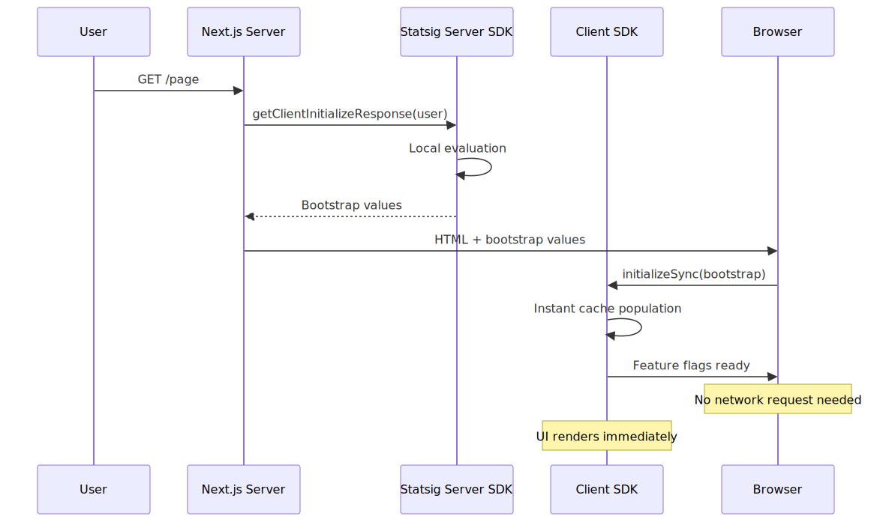
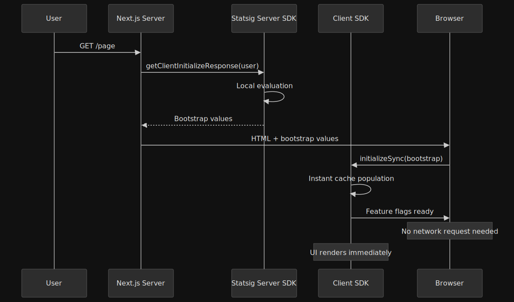

```ts title="lib/statsig-server.ts" collapse={1-2}
import { Statsig, StatsigUser } from "@statsig/statsig-node-core"

let instance: Statsig | null = null

export async function getStatsig(): Promise<Statsig> {
  if (!instance) {
    instance = new Statsig(process.env.STATSIG_SECRET_KEY!)
    await instance.initialize()
  }
  return instance
}

export async function getBootstrapValues(user: StatsigUser) {
  const s = await getStatsig()
  return s.getClientInitializeResponse(user, { hashAlgorithm: "djb2" })
}
```

```tsx title="pages/index.tsx" wrap collapse={1-2}
import type { GetServerSideProps } from "next"
import { useEffect, useState } from "react"
import { StatsigClient } from "@statsig/js-client"
import { getBootstrapValues } from "../lib/statsig-server"

export const getServerSideProps: GetServerSideProps = async ({ req }) => {
  const userID = (req.headers["x-user-id"] as string) ?? "anonymous"
  const bootstrapValues = await getBootstrapValues({ userID, custom: { source: "web" } })
  return { props: { bootstrapValues, userID } }
}

export default function Home({ bootstrapValues, userID }: { bootstrapValues: unknown; userID: string }) {
  const [client, setClient] = useState<StatsigClient | null>(null)

  useEffect(() => {
    const c = new StatsigClient(process.env.NEXT_PUBLIC_STATSIG_CLIENT_KEY!, { userID })
    c.dataAdapter.setData(JSON.stringify(bootstrapValues))
    c.initializeSync()
    setClient(c)
    return () => void c.shutdown()
  }, [bootstrapValues, userID])

  const showNewUI = client?.checkGate("new_homepage") ?? false
  return showNewUI ? <NewHomepage /> : <ClassicHomepage />
}
```

The `next.config.js` needs `serverExternalPackages: ['@statsig/statsig-node-core']` so the native binary is not bundled.

## Overrides: the testing escape hatch

Overrides skip rule evaluation entirely; the SDK returns the value you set ([Server Core overrides](https://docs.statsig.com/server-core/node-core)).

```ts title="overrides.ts"
statsig.overrideGate("new_ui", true)
statsig.overrideGate("new_ui", false, "user_123")
statsig.overrideExperimentByGroupName("pricing_v2", "treatment")
statsig.overrideDynamicConfig("homepage_copy", { title: "Hello" }, "user_123")
```

For tests that should never call out, instantiate the SDK in local mode:

```ts title="local-mode-test.ts"
const statsig = new Statsig("secret-key", { localMode: true })
await statsig.initialize()
```

## Failure modes

- **Statsig API outage, existing instances.** Server SDKs continue evaluating from the in-memory specs from the last successful poll; the SDK retries in the background and atomically swaps when a new payload arrives ([DataAdapter docs](https://docs.statsig.com/server/concepts/data_store)).
- **Statsig API outage, new instance cold start.** Without a `DataAdapter`, the SDK has no specs and `checkGate` returns the default-false. With a `DataAdapter` whose `get` returns the last cached spec, the new instance comes up fully evaluated. This is the only common scenario where a `DataAdapter` is non-optional.
- **Client browser offline.** `initializeSync` reads from `localStorage` and the SDK keeps serving the cached values. Reasons surface as `Cache:Recognized` so you can detect it; brand-new sessions with no cache return `NoValues` and fall to your code-defined defaults ([Client SDK docs](https://docs.statsig.com/client/javascript-sdk)).
- **Stale rule deploy.** Because evaluation is deterministic, the same user keeps the same bucket across rule changes that don't touch the salt. A genuinely new rule (or a salt change) re-rolls the population — desirable for a fresh experiment, dangerous if you didn't intend to.
- **Bootstrap drift.** If your SSR `getClientInitializeResponse` runs against a different `STATSIG_SECRET_KEY` (or a stale snapshot) than the client's `client-xyz` key targets, the client SDK will quietly re-evaluate against the network and you'll see flicker. Match the keys to the same project and the same environment tier.

## Operational guidance

A short list of opinionated defaults from running this in production:

- **Default to bootstrap for SSR apps.** It's the only initialization mode that gives you correct first-paint values without an extra round-trip. Filter the payload aggressively.
- **Run a single DataAdapter writer.** Don't let every webserver fight to update Redis. A cron job pulling the CDN every 30–60s is sufficient for most teams.
- **Log evaluation `details.reason` in your client telemetry.** It tells you cache vs network vs bootstrap and is the fastest path to debugging "why is this user seeing the wrong variant."
- **Match the SDK key to the bootstrap key.** A bootstrap payload generated against project A injected into a client running against project B fails silently — the client falls back to network and you lose the bootstrap benefit.
- **Don't memoize assignments yourself.** The deterministic hash is faster than a Redis lookup; the only reason to cache is the spec, not the assignment.
- **For warehouse-native, model exposures as a first-class table.** The pipeline assumes a clean exposure table with `(unitID, experiment, group, timestamp)` semantics; don't try to bolt experiment analysis onto a generic events table.

## References

- [How Evaluation Works](https://docs.statsig.com/sdks/how-evaluation-works) — the canonical description of the SHA-256 + modulus algorithm and the determinism guarantees.
- [Node Server SDK (Server Core)](https://docs.statsig.com/server-core/node-core) — modern Node init, `getClientInitializeResponse`, override APIs, manual exposures.
- [JavaScript Client SDK (Web)](https://docs.statsig.com/client/javascript-sdk) — modern `@statsig/js-client` init, `details.reason`, `dataAdapter`.
- [Server Data Stores / Data Adapter](https://docs.statsig.com/server/concepts/data_store) — interface, cache key format, recommended single-writer topology.
- [CDN Edge Testing](https://docs.statsig.com/guides/cdn-edge-testing) — the `download_config_specs` URL form.
- [Using Edge Config with Statsig (Vercel)](https://vercel.com/docs/edge-config/edge-config-integrations/statsig-edge-config) — the canonical hosted `DataAdapter` example.
- [`statsig-io/node-js-server-sdk` Evaluator.ts](https://github.com/statsig-io/node-js-server-sdk/blob/main/src/Evaluator.ts) — open-source evaluation reference; the source of truth for byte-exact bucket reproduction.
- [Statsig Warehouse Native vs. Cloud](https://docs.statsig.com/statsig-warehouse-native/native-vs-cloud) — the deployment-model trade-off matrix.
- [WHN Pipeline Overview](https://docs.statsig.com/statsig-warehouse-native/analysis-tools/pipeline-overview) — what the warehouse-native pipeline actually computes.
- [How Statsig migrated to BigQuery from Spark](https://cloud.google.com/blog/products/data-analytics/how-statsig-migrated-to-bigquery-from-spark/) — primary-source engineering postmortem on the analysis backend.
