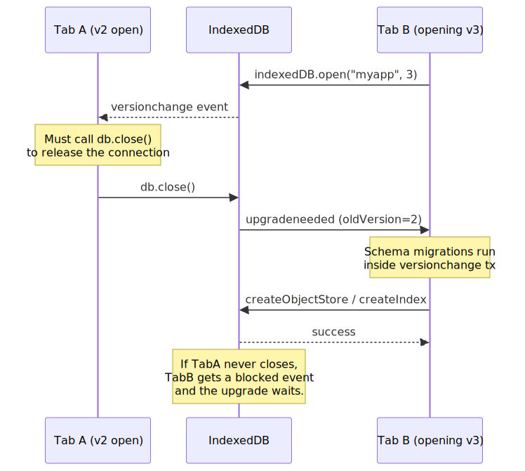
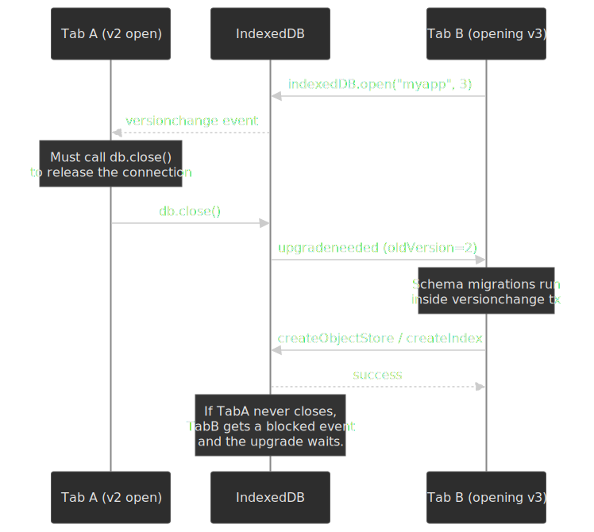

# Browser Storage APIs: localStorage, IndexedDB, and Beyond

A deep dive into browser-side persistence: design trade-offs behind each storage API, the quota model that ties them together, transaction semantics, and eviction behavior. The [WHATWG Storage Standard](https://storage.spec.whatwg.org/) (Living Standard) defines a unified per-origin quota for the asynchronous APIs, while individual specs — [Web Storage](https://html.spec.whatwg.org/multipage/webstorage.html) (localStorage/sessionStorage), [IndexedDB 3.0](https://www.w3.org/TR/IndexedDB-3/), the [Cache interface](https://w3c.github.io/ServiceWorker/#cache-interface), and the [File System Standard](https://fs.spec.whatwg.org/) (OPFS) — each optimize for a different access pattern. The right API depends on data shape, threading constraints, and durability needs, not just capacity.




## Mental model

Browser storage is not one system. It is five APIs with different serialization models, threading guarantees, and eviction behaviors, sharing a per-origin quota for the asynchronous ones and a separate small budget for Web Storage.




The quick mental model:

- **localStorage / sessionStorage** store DOMString key/value pairs synchronously on the main thread — fine for small reads, dangerous for large data. localStorage persists across sessions; sessionStorage dies with the tab.
- **IndexedDB** is an asynchronous, transactional object store using the structured clone algorithm — handles complex objects and binary data at scale, but its transaction lifetime rules break naively async code.
- **Cache API** stores `Request` → `Response` pairs and is optimized for service-worker integration (covered in depth in the [Service Workers and Cache API](../service-workers-and-cache-api/README.md) article).
- **Origin Private File System (OPFS)** provides a sandboxed file system per origin, with synchronous I/O via `FileSystemSyncAccessHandle` in dedicated workers — the fastest storage option for compute-heavy workloads.
- **Quota** is per-origin, calculated from total disk size for fingerprinting reasons. Concrete numbers vary dramatically by browser; the asynchronous APIs share a single budget while Web Storage has its own ~5 MiB allowance.

---

## The Storage Landscape

### Choosing the Right API

| Criteria        | localStorage             | sessionStorage            | IndexedDB             | Cache API           | OPFS                   |
| --------------- | ------------------------ | ------------------------- | --------------------- | ------------------- | ---------------------- |
| **Data model**  | String KV                | String KV                 | Structured objects    | Request/Response    | Raw bytes              |
| **Capacity**    | ~5 MiB                   | ~5 MiB                    | Origin quota (GiBs)   | Origin quota (GiBs) | Origin quota (GiBs)    |
| **Threading**   | Sync, blocks main thread | Sync, blocks main thread  | Async (event/promise) | Async (promise)     | Async; sync in workers |
| **Persistence** | Cross-session            | Tab lifetime              | Cross-session         | Cross-session       | Cross-session          |
| **Indexing**    | Key only                 | Key only                  | Multi-column indexes  | URL matching        | None                   |
| **Use case**    | User prefs, tokens       | Wizard state, form drafts | App data, offline DB  | HTTP response cache | SQLite, Wasm state     |

The split between synchronous and asynchronous APIs reflects a fundamental tension. Web Storage was specified early in the WHATWG era when storage needs were small and the main thread was less contended; the synchronous API made it trivial to use. But synchronous storage on the main thread does not scale, and the spec itself recommends a conservative ~5 MiB cap precisely because larger writes would jank the page. IndexedDB was designed as the scalable replacement, trading simplicity for asynchronous transactions, structured data, and indexes.

### When Cookies Still Win

Storage APIs do not replace cookies for every use case:

- **Authentication tokens**: `HttpOnly` cookies cannot be read by JavaScript, blocking XSS-based token theft. localStorage tokens are always exfiltratable.
- **Server-side access**: Cookies are sent on every same-origin HTTP request; storage APIs are client-only.
- **Expiration control**: `Expires` and `Max-Age` provide server-controlled TTLs. Storage APIs have no built-in expiration.
- **Security attributes**: `Secure`, `SameSite`, and `HttpOnly` have no storage-API equivalents.

---

## Web Storage: localStorage and sessionStorage

The [Web Storage section of the HTML spec](https://html.spec.whatwg.org/multipage/webstorage.html) defines two `Storage` objects that share an interface but differ in lifetime and scope.

### Interface and serialization

Both APIs expose the same `Storage` interface. Every value is coerced to a DOMString:

```typescript
localStorage.setItem("count", "42")
localStorage.getItem("count") // "42" (always a string)
localStorage.removeItem("count")
localStorage.clear()
localStorage.key(0)
localStorage.length

localStorage.username = "alice" // same as setItem("username", "alice")
delete localStorage.username
```

The serialization trap: every value is stringified via the `ToString` abstract operation. Plain objects become `"[object Object]"` unless you serialize explicitly:

```typescript
localStorage.setItem("user", { name: "Alice" } as unknown as string)
localStorage.getItem("user") // "[object Object]" — silent data loss

localStorage.setItem("user", JSON.stringify({ name: "Alice" }))
JSON.parse(localStorage.getItem("user")!) // { name: "Alice" }

const value = localStorage.getItem("missing") // null
JSON.parse(value as unknown as string) // null (safe)
```

### localStorage vs sessionStorage

| Behavior                    | localStorage                                 | sessionStorage                                     |
| --------------------------- | -------------------------------------------- | -------------------------------------------------- |
| **Lifetime**                | Persists until explicitly deleted or evicted | Deleted when tab/window closes                     |
| **Scope**                   | Shared across all same-origin tabs/windows   | Isolated per tab (including duplicated tabs)       |
| **Cross-tab visibility**    | Yes (via storage events)                     | No                                                 |
| **Restored on tab restore** | N/A (always available)                       | Yes — browser restores sessionStorage on tab restore |
| **Capacity**                | ~5 MiB per origin                            | ~5 MiB per origin                                  |

sessionStorage exists because localStorage's cross-tab sharing creates problems for multi-step workflows. Two concurrent checkout tabs sharing cart state through localStorage is a race condition factory; sessionStorage gives each tab its own isolated state. The HTML spec frames this as letting "separate instances of the same web application … run in different windows without interfering with each other."[^web-storage-spec]

### The synchronous problem

Web Storage is synchronous and runs on the main thread. Every `getItem` / `setItem` is I/O on the UI thread:

```typescript
localStorage.setItem("pref", "dark")
const bigData = JSON.parse(localStorage.getItem("cache")!)
```

For small values this is imperceptible. For megabytes of JSON it is enough to drop a long-task budget on the floor — the main thread parses the string, allocates a fresh object graph, and only then can the page paint again. The HTML spec acknowledges this directly: "User agents should limit the total amount of space allowed for storage areas, because hostile authors can use this feature to fill the user's hard disk."[^web-storage-spec]

### Storage events: cross-tab communication

When localStorage changes, the browser fires a `storage` event on every other same-origin Document, but never on the originating one:[^storage-event-spec]

```typescript collapse={17-24}
localStorage.setItem("theme", "dark")

window.addEventListener("storage", (event) => {
  if (event.key === "theme") {
    applyTheme(event.newValue)
  }
})

function broadcast(channel: string, data: unknown) {
  localStorage.setItem(`__msg_${channel}`, JSON.stringify({ data, timestamp: Date.now() }))
  localStorage.removeItem(`__msg_${channel}`)
}
```

By the time a listener runs in the receiving tab, `localStorage.getItem(event.key)` may already reflect a subsequent write; `event.newValue` captures the value at the time of the event but the storage area is shared mutable state.

> [!TIP]
> For cross-tab messaging without touching storage, use [`BroadcastChannel`](https://developer.mozilla.org/en-US/docs/Web/API/BroadcastChannel). It does not persist data and avoids storage I/O. The localStorage-event idiom predates BroadcastChannel and survives mostly for backward compatibility.

### Edge cases and failure modes

**`QuotaExceededError`**: thrown when `setItem` would push a Storage area past its limit. The HTML spec mandates this DOMException name when the implementation refuses to store the new value:

```typescript
try {
  localStorage.setItem("key", largeValue)
} catch (e) {
  if (e instanceof DOMException && e.name === "QuotaExceededError") {
    // evict your own old entries or warn the user
  }
}
```

**Private browsing**: in current browsers Web Storage works in private/incognito mode but the data is ephemeral. Older Safari (before Safari 11) threw `QuotaExceededError` on any `setItem` in private mode; that bug is long fixed.

**Disabled storage**: users can disable Web Storage entirely. Touching `localStorage` then throws synchronously, so feature-detect by writing:

```typescript
function isStorageAvailable(): boolean {
  try {
    const test = "__storage_test__"
    localStorage.setItem(test, test)
    localStorage.removeItem(test)
    return true
  } catch {
    return false
  }
}
```

**Quota is in UTF-16 code units**: `DOMString` is UTF-16, so a 5 MiB limit allows roughly 2.5 million BMP characters. Astral-plane characters consume two code units each (one surrogate pair).

---

## IndexedDB: transactional object store

[IndexedDB 3.0](https://www.w3.org/TR/IndexedDB-3/) is an asynchronous, transactional, indexed object store designed for structured data at scale. It uses the structured clone algorithm for serialization, supports multi-column indexes, and provides ACID-style transactions inside a single origin.

### Data model




- **Database**: named container with an integer version. Multiple databases per origin are allowed.
- **Object store**: named collection of records (analogous to a table). Records are key/value pairs where the value is anything structured-cloneable.
- **Index**: secondary key path into an object store, enabling efficient queries on non-primary-key fields.
- **Key**: every record has a key — an explicit `keyPath` property, an out-of-line key passed to `add`/`put`, or an auto-incrementing key generator.

Valid IndexedDB key types, in sort order: numbers (excluding `NaN`), `Date` objects (excluding invalid dates), strings, `ArrayBuffer` and typed arrays, and arrays — which sort element-by-element, enabling compound keys.[^idb-key]

### Database versioning and schema upgrades

IndexedDB uses an integer version scheme. Schema changes — creating or deleting object stores and indexes — can only happen inside an `upgradeneeded` event:

```typescript collapse={1-3, 28-32}
function openDB(name: string, version: number): Promise<IDBDatabase> {
  return new Promise((resolve, reject) => {
    const request = indexedDB.open(name, version)

    request.onupgradeneeded = (event) => {
      const db = request.result
      const oldVersion = event.oldVersion

      if (oldVersion < 1) {
        const users = db.createObjectStore("users", { keyPath: "id" })
        users.createIndex("by-email", "email", { unique: true })
      }
      if (oldVersion < 2) {
        const orders = db.createObjectStore("orders", {
          keyPath: "id",
          autoIncrement: true,
        })
        orders.createIndex("by-date", "createdAt")
      }
      if (oldVersion < 3) {
        const users = request.transaction!.objectStore("users")
        users.createIndex("by-role", "role")
      }
    }

    request.onsuccess = () => resolve(request.result)
    request.onerror = () => reject(request.error)
  })
}
```

The version-based upgrade mechanism exists because IndexedDB is a client-side database: you cannot run migrations on every client at the same time the way you would on a server. Each client may be at any historical version, so `upgradeneeded` fires with `oldVersion` and `newVersion` and you apply incremental migrations. The implicit `versionchange` transaction has exclusive access to the database, preventing concurrent schema modifications.

### The `versionchange` / `blocked` handshake

Version upgrades require exclusive database access. If other tabs hold open connections, the upgrade cannot proceed until they close.




```typescript
const db = await openDB("myapp", 2)

const request = indexedDB.open("myapp", 3)

db.onversionchange = () => {
  db.close()
}

request.onblocked = () => {
  console.warn("Database upgrade blocked by another tab")
}
```

> [!WARNING]
> If you do not handle `onversionchange`, your app will silently block other tabs from upgrading the schema. Always close the connection on `versionchange` and treat it as "the data model under your feet has just changed".

### Transactions

IndexedDB defines three transaction modes:

| Mode            | Concurrent Access     | Object Store Access  | Use Case           |
| --------------- | --------------------- | -------------------- | ------------------ |
| `readonly`      | Multiple concurrent   | Read only            | Queries, reporting |
| `readwrite`     | Exclusive per store   | Read + write         | Mutations          |
| `versionchange` | Exclusive (entire DB) | Schema changes + R/W | Upgrades only      |

```typescript collapse={1-3}
const db = await openDB("myapp", 1)

const tx = db.transaction(["users", "orders"], "readwrite")
const users = tx.objectStore("users")
const orders = tx.objectStore("orders")

users.put({ id: "u1", name: "Alice", role: "admin" })
orders.add({ userId: "u1", item: "Widget", createdAt: new Date() })

tx.oncomplete = () => console.log("Transaction committed")
tx.onerror = () => console.error("Transaction failed:", tx.error)
tx.onabort = () => console.warn("Transaction aborted")
```

#### Transaction lifetime: the auto-commit trap

A transaction is **active** when the task that created it is running and during the success/error event for any of its requests. As soon as control returns to the event loop with no pending requests, the transaction commits and any further request throws `TransactionInactiveError`.[^idb-tx-mdn][^idb-tx-spec]


```typescript
const tx = db.transaction("users", "readwrite")
const store = tx.objectStore("users")

store.put({ id: "1", name: "Alice" })
store.put({ id: "2", name: "Bob" })

store.put({ id: "1", name: "Alice" })
const data = await fetch("/api/user/2") // <- transaction goes inactive here
store.put(await data.json()) // throws TransactionInactiveError
```

The fix is structural: gather any external data before opening the transaction, or split the work across separate transactions.

```typescript
const data = await fetch("/api/users").then((r) => r.json())

const tx = db.transaction("users", "readwrite")
const store = tx.objectStore("users")
for (const user of data) {
  store.put(user)
}
```

For long-running batch writes you can also call `tx.commit()` explicitly to skip waiting for the implicit auto-commit; the transaction commits as soon as in-flight requests resolve and any further write throws.[^idb-commit]

### Durability hints

IndexedDB 3.0 lets you declare durability per transaction via the `durability` option:

```typescript
const tx = db.transaction("users", "readwrite", { durability: "relaxed" })

const tx2 = db.transaction("users", "readwrite", { durability: "strict" })
```

- `relaxed`: the user agent reports the transaction committed once changes are written to the OS, without waiting for the OS to flush its buffers to disk.
- `strict`: the user agent verifies all changes have been written to a persistent storage medium before reporting success.[^idb-durability]

Chrome made `relaxed` the default for `readwrite` transactions in **Chrome 121** (January 2024). The Chrome team measured a **3–30× write-throughput improvement** on real workloads — `fsync` after every commit was the dominant cost on most platforms.[^chrome-durability] Firefox has never `fsync`-ed every IndexedDB commit, and the standardized `durability` hint reached cross-browser Baseline support in May 2024.[^idb-durability]

The trade-off is narrow: with `relaxed`, data written in the last few seconds before a power loss or kernel panic may be lost. Browser crashes and tab crashes are still safe because the write has already gone through the browser's IPC boundary into the storage subsystem.

> [!NOTE]
> For most apps the data in IndexedDB is a cache of server state, and `relaxed` is the right default. Reach for `strict` only when the browser is the system of record (offline-first productivity tools, local databases, drafts that have not yet round-tripped to a server).

### Structured clone: what can be stored

IndexedDB serializes values using the [structured clone algorithm](https://html.spec.whatwg.org/multipage/structured-data.html#structuredserializeinternal), which understands more types than JSON.

**Cloneable** (round-trip without loss):

- Primitives — string, number, boolean, null, undefined, BigInt
- `Date`, `RegExp`
- `ArrayBuffer`, typed arrays, `DataView`
- `Blob`, `File`, `FileList`
- `ImageBitmap`, `ImageData`
- `Map`, `Set`
- `Array`, plain objects (own enumerable properties)

**Not cloneable** (throws `DataCloneError`):[^structured-clone]

- Functions and closures
- DOM nodes
- Symbols
- Property descriptors (getters, setters)
- `WeakMap` / `WeakSet`
- Class instances **lose their prototype** — they round-trip as plain objects with the same enumerable data

```typescript
store.put({
  id: "1",
  created: new Date(),
  tags: new Set(["a", "b"]),
  binary: new Uint8Array([1, 2]),
})

class User {
  greet() {
    return "hi"
  }
}
store.put({ id: "1", user: new User() })
```

### Indexes and querying

Indexes enable efficient lookups on non-primary-key fields. A compound index over `[category, price]` lets you scan a contiguous range that covers an exact category and a price band:

```typescript collapse={1-5}
const store = db.createObjectStore("products", { keyPath: "id" })
store.createIndex("by-category", "category")
store.createIndex("by-price", "price")
store.createIndex("by-cat-price", ["category", "price"])

const tx = db.transaction("products", "readonly")
const index = tx.objectStore("products").index("by-price")

const request = index.get(29.99)

index.getAll(IDBKeyRange.bound(10, 50)) // 10 ≤ price ≤ 50
index.getAll(IDBKeyRange.bound(10, 50, true, false)) // 10 < price ≤ 50
index.getAll(IDBKeyRange.lowerBound(100)) // price ≥ 100
index.getAll(IDBKeyRange.upperBound(20)) // price ≤ 20

const compoundIndex = tx.objectStore("products").index("by-cat-price")
compoundIndex.getAll(IDBKeyRange.bound(["electronics", 50], ["electronics", 200]))
```

Cursors stream large result sets without materialising the whole array:

```typescript
const tx = db.transaction("products", "readonly")
const index = tx.objectStore("products").index("by-price")

const cursorRequest = index.openCursor(IDBKeyRange.lowerBound(50), "next")

cursorRequest.onsuccess = () => {
  const cursor = cursorRequest.result
  if (cursor) {
    processProduct(cursor.value)
    cursor.continue()
  }
}
```

### Edge cases and failure modes

**Storage corruption**: rare, but can happen after kernel panics or crashes mid-write on some platforms. Recovery means deleting and rebuilding the database:

```typescript
const deleteRequest = indexedDB.deleteDatabase("myapp")
deleteRequest.onsuccess = () => {
  // recreate from server or defaults
}
deleteRequest.onblocked = () => {
  // other tabs still have open connections — ask the user to close them
}
```

**`QuotaExceededError` inside a transaction**: unlike Web Storage, this can fire on any write inside a transaction. A failed write aborts the entire transaction:

```typescript
tx.onerror = (event) => {
  if (tx.error?.name === "QuotaExceededError") {
    // entire transaction was rolled back; evict and retry
  }
}
```

**Private browsing limits**: Chromium enforces a smaller per-origin quota in incognito and deletes everything when the window closes. The exact ceiling shifts with Chrome versions; treat it as "small and ephemeral" rather than memorising a number.

**IDB on workers**: IndexedDB is available in dedicated, shared, and service workers. For bulk writes, always run them off the main thread:

```typescript title="worker.ts"
self.onmessage = async (event) => {
  const db = await openDB("bulk", 1)
  const tx = db.transaction("data", "readwrite")
  for (const record of event.data.records) {
    tx.objectStore("data").put(record)
  }
  tx.oncomplete = () => self.postMessage({ status: "done" })
}
```

---

## Origin Private File System (OPFS)

The [Origin Private File System](https://fs.spec.whatwg.org/#origin-private-file-system) (WHATWG File System Standard) provides a sandboxed file system per origin. Its synchronous access mode in workers makes it the fastest storage primitive on the platform.

### Why OPFS exists

IndexedDB's structured-clone overhead and transaction lifetime add latency that matters for compute-heavy workloads. OPFS gives you raw byte access:

- **SQLite in the browser**: the official [SQLite Wasm](https://sqlite.org/wasm) build and community wrappers like [sql.js](https://github.com/sql-js/sql.js) use OPFS as a backing store.
- **Wasm state persistence**: Emscripten-compiled toolchains map OPFS into a virtual filesystem.
- **Large binary data**: image / video / audio pipelines that need direct byte access without a serialization tax.

### API surface

OPFS exposes two access modes — async (everywhere) and sync (workers only):

```typescript
const root = await navigator.storage.getDirectory()
const fileHandle = await root.getFileHandle("data.bin", { create: true })

const file = await fileHandle.getFile() // returns a File (Blob subclass)
const writable = await fileHandle.createWritable()
await writable.write(new Uint8Array([1, 2, 3]))
await writable.close()
```

```typescript title="worker.ts"
const root = await navigator.storage.getDirectory()
const fileHandle = await root.getFileHandle("data.bin", { create: true })

const syncHandle = await fileHandle.createSyncAccessHandle()

const buffer = new ArrayBuffer(1024)
syncHandle.read(buffer, { at: 0 })
syncHandle.write(new Uint8Array([1, 2, 3]), { at: 0 })
syncHandle.flush()
syncHandle.close()
```

`createSyncAccessHandle` is restricted to **dedicated workers**. Shared workers, service workers, and the main thread cannot use it.[^opfs-sync] The restriction exists because synchronous I/O on the main thread would block user interaction — the same reason Web Storage is small. By limiting sync access to dedicated workers, the spec gives you the throughput of synchronous I/O without the main-thread penalty. By default the handle takes an exclusive lock on the file; Chrome 121+ added a `mode: "readwrite-unsafe"` option for concurrent access, with the safety burden moved to the application.[^opfs-modes]

OPFS files are invisible to the user (no file picker), not shareable across origins, and count against the same per-origin quota as IndexedDB and Cache API.

---

## Storage Quotas and Eviction

The [WHATWG Storage Standard](https://storage.spec.whatwg.org/) defines a unified quota model for the asynchronous APIs (IndexedDB, Cache API, OPFS). Web Storage has its own, separate, ~5 MiB allowance.

### Quota by browser

The numbers below come from the [MDN Storage quotas and eviction criteria](https://developer.mozilla.org/en-US/docs/Web/API/Storage_API/Storage_quotas_and_eviction_criteria) reference and the WebKit storage policy blog post. All quotas are calculated from total disk size — not free disk — for fingerprinting reasons, so an origin may not actually be able to reach its theoretical limit.[^webkit-storage]

| Browser     | Per-origin quota (best-effort)                                       | Overall limit            | Eviction policy                                    |
| ----------- | -------------------------------------------------------------------- | ------------------------ | -------------------------------------------------- |
| **Chrome / Chromium** | Up to 60% of total disk                                       | Up to 80% of total disk  | LRU under storage pressure; persistent skipped     |
| **Firefox** | smaller of (10% of total disk, 10 GiB group limit per eTLD+1)        | 50% of free disk         | LRU under pressure; persistent up to 50% / 8 TiB   |
| **Safari (17+)** | Browser apps: 60% of total disk; embedded WebViews: 15% of disk | Browser: 80%; embedded: 20% | LRU under pressure **plus** ITP 7-day inactivity eviction |

A Safari cross-origin iframe gets roughly 1/10 the parent origin's quota, in addition to storage partitioning by top-level site.[^webkit-storage] Older Safari (pre-17) gave each origin an initial 1 GiB quota and prompted the user before raising it; Safari 17+ no longer prompts and uses the disk-percentage model above.

### The StorageManager API

```typescript
const estimate = await navigator.storage.estimate()
console.log(`Used: ${(estimate.usage! / 1024 / 1024).toFixed(1)} MiB`)
console.log(`Quota: ${(estimate.quota! / 1024 / 1024).toFixed(0)} MiB`)
console.log(`Available: ${((estimate.quota! - estimate.usage!) / 1024 / 1024).toFixed(0)} MiB`)

const persisted = await navigator.storage.persist()
if (persisted) {
  console.log("Storage marked persistent — won't be evicted automatically")
} else {
  console.log("Browser denied persistence request")
}

const isPersisted = await navigator.storage.persisted()
```

By default all storage is best-effort: the browser may evict it under storage pressure without asking the user. Calling `navigator.storage.persist()` requests persistent mode, which exempts the origin from pressure eviction. Each engine grants the request differently:[^persistent-storage]

- **Chrome/Edge** auto-grants persistence for installed PWAs and origins with high engagement.
- **Firefox** prompts the user explicitly.
- **Safari** grants persistence based on heuristics like whether the site is opened as a Home Screen Web App.

> [!IMPORTANT]
> Persistent storage is not protection against bugs, deletion by the user, or ITP. It only opts the origin out of automatic pressure eviction. The data can still go away.

### Safari's 7-day eviction (ITP)

Since Safari 13.1 (March 2020) Intelligent Tracking Prevention deletes **all script-writable storage** for an origin after seven days of Safari use without first-party user interaction. The cap covers localStorage, sessionStorage, IndexedDB, the Cache API, service-worker registrations, MediaKeys, and JavaScript-set cookies. Server-set cookies are exempt.[^itp-cap]

What counts as user interaction: a tap, click, or keyboard input on the site in a first-party context. Navigation via `window.open`, link decoration, or referrer alone does not reset the timer. The "seven days" is seven days of *Safari use*, not seven calendar days.

PWAs added to the Home Screen on iOS or to the Dock on macOS are exempt — their storage uses a different bucket and the ITP timer does not apply.

> [!CAUTION]
> Any offline-first app on Safari that the user does not open weekly will lose its client-side data. For Safari users, server-side persistence is mandatory; design the offline cache to rebuild from the server, not as the system of record.

### Storage partitioning

Modern browsers partition storage by top-level site to prevent cross-site tracking, which changes the semantics for embedded contexts:

- **Chrome 115+** partitions third-party storage by top-level site. An iframe from `cdn.example.com` embedded on `siteA.com` gets a different storage bucket than the same iframe on `siteB.com`. The partition covers IndexedDB, Cache API, localStorage, sessionStorage, service workers, BroadcastChannel, and Web Locks.[^chrome-partitioning]
- **Firefox 103+** ships State Partitioning by default as part of Total Cookie Protection, double-keying client-side state by `(resource origin, top-level site)`.[^firefox-partitioning]
- **Safari** has partitioned third-party storage for years via ITP. The [Storage Access API](https://developer.mozilla.org/en-US/docs/Web/API/Storage_Access_API) lets embedded contexts request first-party storage access after a user gesture.

If your app embeds iframes that rely on shared storage, partitioning breaks those assumptions. The Storage Access API and `document.requestStorageAccess()` are the supported escape hatch for legitimate cross-site needs.

---

## Practical Patterns

### Wrapper with fallback

```typescript collapse={1-6, 27-30}
type StorageValue = string | number | boolean | object | null

interface StorageAdapter {
  get(key: string): Promise<StorageValue>
  set(key: string, value: StorageValue): Promise<void>
}

const localStorageAdapter: StorageAdapter = {
  async get(key) {
    const raw = localStorage.getItem(key)
    return raw ? JSON.parse(raw) : null
  },
  async set(key, value) {
    try {
      localStorage.setItem(key, JSON.stringify(value))
    } catch (e) {
      if (e instanceof DOMException && e.name === "QuotaExceededError") {
        // evict oldest entries and retry, or fall back to IndexedDB
        throw new Error("localStorage quota exceeded")
      }
      throw e
    }
  },
}

const adapter = isStorageAvailable() ? localStorageAdapter : indexedDBAdapter
await adapter.set("prefs", { theme: "dark", lang: "en" })
```

### IndexedDB promise wrapper

The raw IndexedDB API uses event callbacks. A thin promise wrapper removes most of the boilerplate without hiding the semantics that matter (transaction lifetime, abort, error vs complete):

```typescript
function wrapRequest<T>(request: IDBRequest<T>): Promise<T> {
  return new Promise((resolve, reject) => {
    request.onsuccess = () => resolve(request.result)
    request.onerror = () => reject(request.error)
  })
}

function wrapTransaction(tx: IDBTransaction): Promise<void> {
  return new Promise((resolve, reject) => {
    tx.oncomplete = () => resolve()
    tx.onerror = () => reject(tx.error)
    tx.onabort = () => reject(tx.error || new DOMException("Transaction aborted"))
  })
}

const tx = db.transaction("users", "readwrite")
tx.objectStore("users").put({ id: "1", name: "Alice" })
await wrapTransaction(tx)
```

> [!TIP]
> For production, use Jake Archibald's [`idb`](https://github.com/jakearchibald/idb) — a tiny, well-tested promise wrapper. [Dexie.js](https://dexie.org/) layers a query builder and live queries on top. Both keep the spec-level semantics visible instead of hiding them.

### Cache invalidation with TTL keys

```typescript
function setWithTTL(key: string, value: unknown, ttlMs: number) {
  const entry = { value, expiry: Date.now() + ttlMs }
  localStorage.setItem(key, JSON.stringify(entry))
}

function getWithTTL<T>(key: string): T | null {
  const raw = localStorage.getItem(key)
  if (!raw) return null

  const entry = JSON.parse(raw)
  if (Date.now() > entry.expiry) {
    localStorage.removeItem(key)
    return null
  }
  return entry.value
}
```

---

## Conclusion

Browser storage APIs sit on a spectrum from simple-but-blocking (Web Storage) to powerful-but-complex (IndexedDB) to raw-but-fast (OPFS). The right choice is driven by data shape, access pattern, and threading constraint, not capacity headroom.

- **Web Storage** is for small, string-serializable preferences that need cross-tab visibility. Past a few KiB, move on.
- **IndexedDB** handles structured app data at scale, but its transaction lifetime, version-upgrade protocol, and `versionchange` / `blocked` coordination demand careful implementation.
- **OPFS** unlocks performance-critical workloads — client-side SQLite, Wasm state, raw bytes — through synchronous worker access.
- **Cache API** belongs to the service-worker world and is covered in the [Service Workers and Cache API](../service-workers-and-cache-api/README.md) companion article.

The unifying constraint is the per-origin quota: every script-writable byte except Web Storage shares a single budget that varies dramatically by browser. Safari's 7-day ITP eviction makes server-side persistence non-optional for any serious app. Storage partitioning by top-level site changes the rules for third-party contexts. Design for eviction, not just persistence.

---

## Appendix

### Prerequisites

- JavaScript Promises and async/await
- Same-origin policy
- JSON serialization

### Terminology

- **Origin**: scheme + host + port tuple (`https://example.com:443`). Storage is scoped per origin.
- **eTLD+1**: effective Top-Level Domain plus one label (`example.com` for `sub.example.com`). Used for quota grouping in Firefox.
- **Structured clone**: serialization algorithm that supports more types than JSON (Date, Map, Set, ArrayBuffer, Blob, ImageBitmap). Used by IndexedDB, `postMessage`, and `structuredClone()`.
- **OPFS**: Origin Private File System — a sandboxed, per-origin virtual file system with synchronous access in dedicated workers.
- **ITP**: Intelligent Tracking Prevention — Safari's privacy framework that restricts cross-site tracking and evicts script-writable storage after seven days without first-party user interaction.
- **best-effort storage**: default mode where the browser may evict data under storage pressure without consent.
- **persistent storage**: opt-in mode (requested via `navigator.storage.persist()`) that exempts the origin from pressure-driven eviction.

### Summary

- **localStorage** is synchronous, blocks the main thread, stores DOMString KV pairs, has a ~5 MiB limit, and notifies other same-origin tabs via `storage` events.
- **sessionStorage** shares the same API but is scoped to a single tab and dies when the tab closes.
- **IndexedDB 3.0** provides asynchronous transactional storage with structured clone serialization, multi-column indexes, and cursor-based iteration. Transactions auto-commit when control returns to the event loop with no pending requests — `await`-ing a non-IDB promise mid-transaction throws `TransactionInactiveError`.
- **OPFS** offers the fastest storage via `FileSystemSyncAccessHandle` in dedicated workers — ideal for SQLite/Wasm workloads.
- **Quota** is per-origin and calculated from total disk: Chrome up to ~60% of disk, Firefox `min(10% disk, 10 GiB group)` best-effort, Safari 17+ ~60% of disk in browser apps. `navigator.storage.persist()` requests eviction protection.
- **Storage partitioning** (Chrome 115+, Firefox 103+, Safari) isolates third-party storage by top-level site, breaking cross-site storage sharing.

### References

**Specifications (primary sources)**

- [Storage Standard](https://storage.spec.whatwg.org/) — WHATWG Living Standard (quota model, storage buckets, persistence)
- [Web Storage — HTML Standard](https://html.spec.whatwg.org/multipage/webstorage.html) — WHATWG (localStorage, sessionStorage)
- [Indexed Database API 3.0](https://www.w3.org/TR/IndexedDB-3/) — W3C (transactions, object stores, indexes, versioning)
- [File System Standard](https://fs.spec.whatwg.org/) — WHATWG (OPFS, FileSystemSyncAccessHandle)
- [Service Worker Specification — Cache interface](https://w3c.github.io/ServiceWorker/#cache-interface) — W3C
- [Structured clone algorithm](https://html.spec.whatwg.org/multipage/structured-data.html#structuredserializeinternal) — HTML Standard

**Official documentation**

- [Storage quotas and eviction criteria — MDN](https://developer.mozilla.org/en-US/docs/Web/API/Storage_API/Storage_quotas_and_eviction_criteria)
- [IndexedDB API — MDN](https://developer.mozilla.org/en-US/docs/Web/API/IndexedDB_API)
- [IDBTransaction — MDN](https://developer.mozilla.org/en-US/docs/Web/API/IDBTransaction)
- [Web Storage API — MDN](https://developer.mozilla.org/en-US/docs/Web/API/Web_Storage_API)
- [Origin Private File System — MDN](https://developer.mozilla.org/en-US/docs/Web/API/File_System_API/Origin_private_file_system)
- [FileSystemSyncAccessHandle — MDN](https://developer.mozilla.org/en-US/docs/Web/API/FileSystemSyncAccessHandle)
- [Storage Access API — MDN](https://developer.mozilla.org/en-US/docs/Web/API/Storage_Access_API)

**Vendor engineering**

- [Storage for the Web — web.dev](https://web.dev/articles/storage-for-the-web)
- [A change to the default durability mode in IndexedDB — Chrome blog](https://developer.chrome.com/blog/indexeddb-durability-mode-now-defaults-to-relaxed)
- [Storage Partitioning — Chrome Privacy Sandbox](https://privacysandbox.google.com/cookies/storage-partitioning)
- [Updates to Storage Policy — WebKit blog](https://webkit.org/blog/14403/updates-to-storage-policy/)
- [Full Third-Party Cookie Blocking and More — WebKit blog](https://webkit.org/blog/10218/full-third-party-cookie-blocking-and-more/)
- [State Partitioning — MDN](https://developer.mozilla.org/en-US/docs/Web/Privacy/Guides/State_Partitioning)
- [SQLite Wasm](https://sqlite.org/wasm) — official SQLite WebAssembly build
- [`idb` library — Jake Archibald](https://github.com/jakearchibald/idb)
- [Dexie.js](https://dexie.org/)

[^web-storage-spec]: [Web Storage — WHATWG HTML Standard](https://html.spec.whatwg.org/multipage/webstorage.html)
[^storage-event-spec]: [The storage event — WHATWG HTML Standard](https://html.spec.whatwg.org/multipage/webstorage.html#the-storage-event)
[^idb-key]: [IDB key types and ordering — IndexedDB 3.0](https://www.w3.org/TR/IndexedDB-3/#key-construct)
[^idb-tx-mdn]: [IDBTransaction — MDN](https://developer.mozilla.org/en-US/docs/Web/API/IDBTransaction)
[^idb-tx-spec]: [Transaction lifecycle — IndexedDB 3.0](https://w3c.github.io/IndexedDB/#transaction-lifecycle-concept)
[^idb-commit]: [IDBTransaction.commit() — MDN](https://developer.mozilla.org/en-US/docs/Web/API/IDBTransaction/commit)
[^idb-durability]: [IDBTransaction.durability — MDN](https://developer.mozilla.org/en-US/docs/Web/API/IDBTransaction/durability)
[^chrome-durability]: [A change to the default durability mode in IndexedDB — Chrome blog](https://developer.chrome.com/blog/indexeddb-durability-mode-now-defaults-to-relaxed)
[^structured-clone]: [The structured clone algorithm — MDN](https://developer.mozilla.org/en-US/docs/Web/API/Web_Workers_API/Structured_clone_algorithm)
[^opfs-sync]: [FileSystemSyncAccessHandle — MDN](https://developer.mozilla.org/en-US/docs/Web/API/FileSystemSyncAccessHandle)
[^opfs-modes]: [createSyncAccessHandle — MDN](https://developer.mozilla.org/en-US/docs/Web/API/FileSystemFileHandle/createSyncAccessHandle)
[^webkit-storage]: [Updates to Storage Policy — WebKit blog](https://webkit.org/blog/14403/updates-to-storage-policy/)
[^persistent-storage]: [Persistent storage — web.dev](https://web.dev/articles/persistent-storage)
[^itp-cap]: [Full Third-Party Cookie Blocking and More — WebKit blog](https://webkit.org/blog/10218/full-third-party-cookie-blocking-and-more/)
[^chrome-partitioning]: [Storage Partitioning — Chrome Privacy Sandbox](https://privacysandbox.google.com/cookies/storage-partitioning)
[^firefox-partitioning]: [State Partitioning — MDN](https://developer.mozilla.org/en-US/docs/Web/Privacy/Guides/State_Partitioning)
