# Storage Choices: SQL vs NoSQL

The "SQL vs NoSQL" framing is a poor tool for a real decision. PostgreSQL stores and indexes JSON natively, MongoDB executes ACID transactions across sharded clusters, and NewSQL engines like Spanner and CockroachDB give you SQL with horizontal scale. What actually matters is the fit between your **data model**, your **dominant access patterns**, your **consistency budget**, and the **operational complexity** your team can sustainably carry. This article gives you a defensible framework for that fit, with cited production examples of where each paradigm holds up and where it breaks.




## Mental model

Four levers, in this order:

- **Data model.** Highly relational data with multi-table joins → relational. Aggregates accessed as units → document. Pure key lookups at extreme scale → key-value. Append-heavy time/event data → wide-column. Connection-heavy queries → graph.
- **Access pattern matters more than data size.** A 10 TB dataset with point lookups is easier to scale than a 100 GB dataset that requires ad-hoc joins.
- **Consistency is per-operation, not per-database.** Most production engines let you pick strong vs eventual reads at call time — DynamoDB[^dynamo-consistency], Cassandra[^cassandra-consistency], even Postgres replicas.
- **Operational capability is a hard constraint.** A theoretically optimal engine you cannot debug at 3am is the wrong choice. Cassandra's flexibility costs operational depth that many teams underestimate[^cassandra-antipatterns].

The question is never "SQL or NoSQL?". It is: *what queries must be fast, what consistency must they have, and how will this shape evolve as load grows?*

## The database landscape

### Relational (SQL)

Relational engines store rows in tables, enforce schema via DDL, and use SQL to compose joins, aggregates, subqueries, and window functions. The model traces back to Codd's 1970 paper[^codd] and benefits from five decades of query-planner refinement.

- **Strong schema** — structure declared upfront; changes go through migrations.
- **ACID by default** — atomicity, consistency, isolation, durability are the table stakes.
- **Rich query language** — joins, aggregates, set operations, window functions.
- **Mature optimizer** — cost-based planning, statistics, well-understood execution plans.

| Engine     | Distinctive trait                          | Practical scale ceiling                | Best for                            |
| ---------- | ------------------------------------------ | -------------------------------------- | ----------------------------------- |
| PostgreSQL | Extensible (JSONB, PostGIS, pgvector)      | One primary + read replicas; logical replication for sharding | General purpose, complex queries    |
| MySQL      | Mature replication, large operator pool   | Read replicas; horizontal scale via Vitess[^vitess] | Web apps, read-heavy workloads     |
| Oracle     | RAC clustering, mature enterprise features | Very high (with cost)                  | Enterprise, regulated workloads    |
| SQL Server | Windows / .NET integration, BI tooling     | High                                   | Microsoft ecosystems                |

### NoSQL categories

"NoSQL" is an umbrella, not a paradigm. The four sub-models below have very different shapes.

#### Document stores

Store JSON/BSON documents with nested fields. Schema is per-document, not per-collection.

- **Aggregates as documents** — embed data you read together; reduce joins.
- **Flexible schema** — add fields without coordinating migrations.
- **Rich queries on nested paths** — index by any field.

| Engine            | Distinctive trait                                     | Consistency                            | Best for                       |
| ----------------- | ----------------------------------------------------- | -------------------------------------- | ------------------------------ |
| MongoDB           | Multi-document ACID across sharded clusters[^mongo-tx] | Tunable (eventual → linearizable)      | General document workloads     |
| Couchbase         | N1QL (SQL-like) over documents, memory-first          | Tunable                                | Cache + persistence            |
| Amazon DocumentDB | MongoDB-compatible API, managed                       | Strong within region                   | AWS-native document apps       |

A single BSON document is capped at 16 MiB[^mongo-limit] — a hard wall that pushes large blobs into GridFS or out into object storage entirely.

#### Key-value stores

The simplest model: opaque values keyed by an identifier. The engine knows nothing about the value's structure.

- **O(1) access** — predictable latency, no parsing.
- **Maximum throughput** — minimal overhead per request.
- **No structural querying** — your application owns serialization and indexing.

| Engine          | Distinctive trait                                                      | Persistence                | Best for                                     |
| --------------- | ---------------------------------------------------------------------- | -------------------------- | -------------------------------------------- |
| Redis           | Rich data structures (lists, sorted sets, streams, HyperLogLog)       | Optional snapshot + AOF    | Caching, sessions, leaderboards, queues      |
| Memcached       | Multi-threaded, slab allocator, no persistence                         | None                       | Pure caching                                  |
| Amazon DynamoDB | Managed, auto-scaling, integrated with Streams + Global Tables          | Durable (multi-AZ)        | Serverless, spiky workloads                  |
| etcd            | Raft consensus + watch API[^etcd]                                     | Durable                    | Configuration, service discovery, leader election |

#### Wide-column stores

Rows keyed by a partition key, with columns grouped into families and stored sparsely. Tuned for high write throughput and range scans within a partition. Storage is built on log-structured merge (LSM) trees[^bigtable], so writes are append-only and compaction runs in the background.

- **Column families** — group columns that are read together.
- **Sparse rows** — every row can have a different column set.
- **Write-optimized** — sequential disk writes, deferred compaction.

| Engine            | Distinctive trait                                | Consistency                  | Best for                                   |
| ----------------- | ------------------------------------------------ | ---------------------------- | ------------------------------------------ |
| Apache Cassandra  | Multi-DC replication, tunable consistency        | Tunable (`ONE` → `ALL`)[^cassandra-consistency] | Time-series, IoT, global apps              |
| Apache HBase      | Tight Hadoop integration, strong per-region      | Strong (single region server) | Analytics on HDFS data                    |
| ScyllaDB          | C++ Cassandra-compatible, shard-per-core         | Tunable                      | Performance-critical Cassandra workloads   |

#### Graph databases

Nodes and edges are first-class. Traversals follow pointers between adjacent records — *index-free adjacency* — instead of resolving foreign keys with hash or merge joins.

- **Edge-native traversal** — friend-of-friend queries don't blow up across joins.
- **Pattern matching** — Cypher, Gremlin, GSQL, SPARQL.
- **Schema-light** — relationship types stay flexible.

| Engine        | Distinctive trait                                | Query language    | Best for                            |
| ------------- | ------------------------------------------------ | ----------------- | ----------------------------------- |
| Neo4j         | Mature, Cypher, ACID                             | Cypher            | Social graphs, recommendations      |
| Amazon Neptune | Property-graph + RDF, managed                    | Gremlin / SPARQL  | AWS-native graph apps               |
| TigerGraph    | Distributed, native parallel processing           | GSQL              | Large-scale graph analytics         |

### NewSQL: the convergence

NewSQL engines combine SQL semantics with horizontal scale via distributed consensus (Paxos or Raft) plus multi-version concurrency control (MVCC). They explicitly trade write latency for serializable transactions across shards and regions.

| Engine          | Inspiration   | Distinctive trait                              | Latency profile                                 |
| --------------- | ------------- | ---------------------------------------------- | ----------------------------------------------- |
| Google Spanner  | Internal need | TrueTime (atomic clocks + GPS)[^spanner]       | Single-region commits in tens of ms; multi-region 100s of ms[^spanner-latency] |
| CockroachDB     | Spanner       | Hybrid logical clocks on commodity NTP[^crdb-clock] | Cross-region writes typically 100s of ms; tunable `--max-offset` (default 500 ms, recommended 250 ms multi-region) |
| TiDB            | MySQL         | MySQL wire protocol, separate TiKV layer       | Comparable to MySQL for in-region traffic        |
| YugabyteDB      | PostgreSQL    | PostgreSQL wire protocol, DocDB storage layer  | Comparable to PostgreSQL for in-region traffic   |

> [!NOTE]
> Spanner's TrueTime keeps the global clock-uncertainty bound (`ε`) within roughly 1–7 ms today and used commit-wait to enforce external consistency[^spanner]. CockroachDB on commodity NTP can't keep `ε` that tight, so it uses uncertainty-window restarts instead of commit-wait[^crdb-clock]. Both pay for cross-region consistency in latency; the question is just where you take the hit.

For deeper coverage of distributed-transaction semantics, see [Consistency Models and the CAP Theorem](../consistency-and-cap-theorem/README.md).

## Design choice 1: data model

Pick the model that matches how data is *read* in the hot path. Everything else follows.

### Relational

**Mechanism.** Normalize data into tables, link with foreign keys, reconstruct aggregates with joins.

**When it fits**

- Many-to-many relationships across multiple entities.
- The same data is queried through several different access patterns.
- Referential integrity is part of the domain model.
- Ad-hoc reporting and analytics queries are required.

**Trade-offs**

- ✅ Any query pattern; cost-based optimizer.
- ✅ Constraints enforce invariants; transactions roll back partial writes.
- ✅ Mature tooling, large operator pool, SQL standardization.
- ❌ Joins cost more as the working set leaves RAM.
- ❌ Schema changes need coordinated migrations.
- ❌ Horizontal scaling requires application-level sharding or NewSQL.

**Production example.** GitHub runs MySQL as the system of record. Their HA architecture replaced VIP/DNS failover with `orchestrator` + Consul + a custom GitHub Load Balancer (GLB), explicitly to handle cross-DC failover and avoid split-brain[^github-mysql]. Vitess is *not* the basis of GitHub's MySQL HA; the failure domain there is per-cluster, with manual sharding when needed.

### Document

**Mechanism.** Store related data together as a single nested document. Document boundaries follow access patterns, not normalization.

**When it fits**

- Data is naturally accessed as an aggregate (user profile + preferences + recent orders).
- Schema evolves often; new fields appear regularly.
- Relationships across documents are rare.
- Each document fits comfortably under the engine's size cap (16 MiB in MongoDB[^mongo-limit]).

**Trade-offs**

- ✅ Single-fetch reads vs multi-table joins.
- ✅ Schema flexibility without coordinated migrations.
- ✅ Domain objects map cleanly to documents.
- ❌ Duplication when the same value appears in multiple documents.
- ❌ Cross-document queries are awkward.
- ❌ Large documents amplify read/write IO.

**Production example.** eBay uses MongoDB for parts of its catalog and other read-intensive, multi-DC workloads, scaling replica sets up to ~50 members for read fan-out and resilience[^ebay-mongo]. Listings vary in shape per category — a "laptop" and an "antique chair" share little — and a relational schema would either go sparse-columned or fall into entity-attribute-value, which is a query nightmare.

### Key-value

**Mechanism.** Opaque values indexed by a key. The engine stores and returns bytes; the application owns serialization, schema, and any secondary access patterns.

**When it fits**

- Access is purely by primary key.
- You don't need to query by value contents.
- Throughput requirements are extreme (millions of ops/sec).
- The store sits in front of another database as a cache.

**Trade-offs**

- ✅ Predictable O(1) latency.
- ✅ Highest throughput per node.
- ✅ Simplest possible operational model.
- ❌ No queries beyond the key.
- ❌ Application owns indexing and consistency between cache and source of truth.
- ❌ No structural enforcement on value contents.

**Production example.** Discord uses Redis to cache fast-changing ephemeral state (presence, typing indicators) sitting in front of their main message store. Their Elixir-based gateway tier maintains in-memory presence state in `GenServer`s and historically scaled to 5M concurrent users on that pattern alone[^discord-elixir], with Redis as a complementary cache for cross-process state. The persistence story is separate — see Discord's [trillions-of-messages migration](#discord-from-mongodb-to-cassandra-to-scylladb).

### Wide-column

**Mechanism.** Rows keyed by a partition key; columns grouped into families and stored sparsely on disk. LSM-tree storage favors sequential writes; range scans inside a partition are fast.

**When it fits**

- Time-series or event data with a natural time-based partition.
- Write-dominated workloads (sensor data, message logs).
- Data partitions cleanly by one key (`user_id`, `device_id`, `channel_id`).
- Queries scan ranges within a partition, not across them.

**Trade-offs**

- ✅ High write throughput from append-heavy storage.
- ✅ Fast range scans inside a partition.
- ✅ Multi-DC replication is built in.
- ❌ No cross-partition joins.
- ❌ Bad partition keys produce hot partitions that no auto-scaler can fix.
- ❌ Read-modify-write requires a read first; tombstones complicate deletes.

**Production example.** Netflix has demonstrated Cassandra scaling linearly past 1M writes/sec on a 285-node cluster[^netflix-cassandra] and uses it for write-heavy time-series workloads (viewing history, telemetry). The partition shape — one user's history per partition — fits Cassandra's strengths and tolerates eventual consistency for downstream reads.

### Graph

**Mechanism.** Entities are nodes; relationships are edges with their own properties. Traversals chase edge pointers without relational joins.

**When it fits**

- Queries traverse relationships (friend-of-friend, shortest path, subgraph match).
- Relationships carry properties beyond just a foreign key.
- The schema is highly connected (social, knowledge, identity graphs).
- Query depth varies (1-hop vs 6-hop traversals on the same data).

**Trade-offs**

- ✅ Index-free adjacency; traversal cost scales with path length, not table size.
- ✅ Expressive pattern-matching query languages.
- ✅ Natural model for connected data.
- ❌ Less efficient for non-graph queries.
- ❌ Distributed graph databases are operationally complex.
- ❌ Smaller ecosystem and operator pool than relational.

**Production example.** LinkedIn built **LIquid**, a proprietary in-house relational graph database, to power their Economic Graph (members, companies, jobs, skills). LIquid serves on the order of millions of QPS over hundreds of billions of edges[^linkedin-liquid], for a member base now above 1 billion[^linkedin-members]. Off-the-shelf graph engines did not meet their latency or scale requirements; the existence of LIquid is itself a useful signal about how far general-purpose graph engines stretch.

### Decision matrix: data model

| Factor                 | Relational            | Document                  | Key-value  | Wide-column           | Graph               |
| ---------------------- | --------------------- | ------------------------- | ---------- | --------------------- | ------------------- |
| Query flexibility      | High (SQL)            | Medium (per-path queries) | None       | Low (partition scans) | High (traversals)   |
| Schema evolution       | Migrations            | Flexible                  | N/A        | Semi-flexible         | Flexible            |
| Transaction scope      | Multi-table           | Single/multi-document     | Single key | Single partition      | Multi-node          |
| Join performance       | Good (indexed)        | Poor (app-side)           | N/A        | Very poor             | Native (traversals) |
| Write throughput       | Medium                | Medium                    | Very high  | Very high             | Medium              |
| Horizontal scaling     | Hard (without NewSQL) | Native                    | Native     | Native                | Medium              |

## Design choice 2: consistency

Pick the *weakest* consistency you can get away with for each operation; pay only where the business demands it.




### ACID

**Mechanism.** Atomicity (all-or-nothing), Consistency (invariants preserved), Isolation (concurrent transactions don't leak), Durability (committed writes survive crashes).

**When it fits**

- Financial movements (no double-spend, no lost write).
- Inventory decrement (no oversell).
- Any operation where partial failure is worse than total failure.
- Multi-record business invariants.

**Trade-offs**

- ✅ Strong guarantees simplify application code.
- ✅ Rollback is automatic on failure.
- ✅ Isolation levels offer a knob (read committed → serializable).
- ❌ Coordination overhead caps throughput.
- ❌ Distributed transactions add latency.
- ❌ Lock contention hurts under high concurrency.

**Production example.** Stripe documented their pattern for migrating an active production data store with zero downtime — using a four-step dual-write pattern (dual-write → migrate reads → migrate writes → drop old store) and verifying read paths with GitHub's Scientist library[^stripe-migrations]. The pattern itself is engine-agnostic, but the requirement that every step preserve invariants — no lost subscription, no double-charged customer — is exactly what ACID buys you.

### BASE

**Mechanism.** Basically Available (the system answers), Soft state (state may shift without input as updates propagate), Eventually consistent (replicas converge given time and a quiet period).

**When it fits**

- Availability matters more than freshness.
- Stale reads are acceptable (feeds, recommendations, analytics).
- Multi-DC deployment with partition tolerance is a must.
- Write throughput dominates the workload.

**Trade-offs**

- ✅ Higher availability during partitions.
- ✅ Lower latency (no coordination wait).
- ✅ Better horizontal scalability.
- ❌ Application must handle stale reads explicitly.
- ❌ Conflict resolution is a real cost.
- ❌ Reasoning about correctness is harder.

**Production example.** Amazon's shopping cart used DynamoDB-style eventual consistency from the original Dynamo design[^dynamo-paper]: occasionally surfacing a deleted item is much cheaper than refusing the user a cart at all. The trade-off was an explicit business decision in favor of availability over momentary consistency.

### Tunable consistency in practice

Most production engines let you choose per call. Do.

```ts title="dynamodb-reads.ts" showLineNumbers
import { DynamoDBClient, GetItemCommand } from "@aws-sdk/client-dynamodb"
const client = new DynamoDBClient({})

const eventualRead = await client.send(
  new GetItemCommand({
    TableName: "orders",
    Key: { orderId: { S: "ORD-123" } },
    // ConsistentRead defaults to false → 0.5 RCU per 4 KB
  }),
)

const strongRead = await client.send(
  new GetItemCommand({
    TableName: "orders",
    Key: { orderId: { S: "ORD-123" } },
    ConsistentRead: true, // Reads from leader; 1 RCU per 4 KB (2x the cost)
  }),
)
```

The cost gap is not theoretical: a strongly consistent DynamoDB read costs twice the read-capacity units of an eventually consistent one[^dynamo-pricing], and may fail during a partition while the eventual read still succeeds.

```cql title="cassandra-consistency.cql"
-- Eventual: any replica answers
SELECT * FROM orders WHERE order_id = 'ORD-123'
USING CONSISTENCY ONE;

-- Strong within a single DC
SELECT * FROM orders WHERE order_id = 'ORD-123'
USING CONSISTENCY LOCAL_QUORUM;

-- Strong across DCs (highest latency)
SELECT * FROM orders WHERE order_id = 'ORD-123'
USING CONSISTENCY EACH_QUORUM;
```

Cassandra's tunable knobs document this directly[^cassandra-consistency]: pick the lowest consistency level that satisfies the requirement, then pay only when you must.

### Decision matrix: consistency

| Requirement              | Database category | Consistency level             | Example                              |
| ------------------------ | ----------------- | ----------------------------- | ------------------------------------ |
| Financial movements      | SQL / NewSQL      | Serializable                  | Transfer money between accounts      |
| Inventory decrement      | SQL / NewSQL      | Read committed + row locking   | Reserve last unit in stock           |
| User profile read        | Any               | Eventual OK                   | Display a user's bio                 |
| User reads own write     | Any               | Read-your-writes / strong      | User updates settings, then reloads  |
| Shopping cart            | Document / KV     | Eventual + idempotent ops      | Add item to cart                     |
| Analytics aggregation    | Any               | Eventual OK                   | Dashboard counts                     |
| Leader election          | KV with consensus | Linearizable                  | etcd, ZooKeeper                      |

## Design choice 3: scaling strategy

How the database grows with load determines its long-term viability.

### Vertical scaling

**Mechanism.** More CPU, more RAM, more SSD on a single node. Works until you hit hardware ceilings — and those ceilings are surprisingly far out.

**When it fits**

- Active dataset fits in RAM (or close to it).
- Joins span the whole dataset.
- Operational simplicity matters more than maximum scale.
- Read replicas cover the read budget.

**Practical limits**

- AWS U7i / U7inh High Memory instances reach up to 1,920 vCPU and 32 TiB of RAM in a single VM[^aws-u7i] — well beyond what most applications can fully utilize. Comparable Azure M-series and GCP memory-optimized instances trail at roughly 416 vCPU and ~12 TiB.
- I/O bandwidth caps around the ~100 Gbps range for top-tier network attachments.
- Even with replicas, writes still go to one primary — failover, not horizontal write scale.

**Real-world ceiling.** Stack Overflow runs as a 9-server on-prem monolith on Windows / IIS / SQL Server, serving on the order of ~2 billion page views per month with a single primary SQL Server (and a hot standby) holding 1.5 TB of RAM as cache[^stackoverflow-arch]. The deliberate choice to stay vertical comes from a deeply joined data model and a query pattern dominated by tag, user, and question relationships that resist clean sharding.

### Horizontal scaling

**Mechanism.** Distribute data across nodes via sharding/partitioning. Each node owns a subset of the keyspace.

**When it fits**

- Data exceeds single-node capacity.
- Write throughput exceeds single-node capability.
- Multi-region deployment is required.
- Availability budget rules out single points of failure.

**Challenges**

- **Shard-key choice** — bad keys produce hot partitions you can't auto-scale out of.
- **Cross-shard operations** — joins become expensive or impossible.
- **Rebalancing** — adding nodes triggers data movement.
- **Operational complexity** — more nodes, more failure modes, more on-call work.




| Strategy            | Mechanism                          | Pros                              | Cons                                       |
| ------------------- | ---------------------------------- | --------------------------------- | ------------------------------------------ |
| Hash-based          | `hash(key) mod N` chooses shard    | Even distribution                 | Range queries scatter across all shards    |
| Range-based         | Key ranges per shard               | Efficient range scans             | Hot ranges throttle writes                 |
| Directory-based     | Lookup table from key → shard      | Flexible, supports rebalancing    | Lookup tier becomes a bottleneck           |
| Consistent hashing  | Keys map to ring positions         | Minimal reshuffle when adding nodes | Skew without virtual nodes                |

DynamoDB applies consistent hashing on the partition key, and AWS's own guidance leads with "design partition keys to distribute traffic evenly"[^dynamo-partition-keys]. The classic anti-pattern — using `date` as the partition key for time-series data so every write hits today's partition — caps throughput regardless of provisioned capacity.

## Design choice 4: operational reality

The best database for the workload is useless if you can't operate it reliably.

### Managed vs self-hosted

| Factor              | Managed (RDS, Atlas, DynamoDB) | Self-hosted                       |
| ------------------- | ------------------------------ | --------------------------------- |
| Setup time          | Minutes                        | Hours to days                     |
| Patching            | Automatic                      | Manual                            |
| Backups             | Configured by default          | Must implement                    |
| HA                  | One toggle                     | Architect from scratch            |
| Cost at scale       | Higher $/GB                    | Lower $/GB, higher $/engineer     |
| Customization       | Limited                        | Full control                      |
| Debug access        | Limited visibility             | Full access                       |

Cassandra is a useful concrete example here. The official Cassandra capacity-planning guide enumerates a long list of anti-patterns that cause production incidents — wrong storage (SAN/NAS), CPU frequency scaling, oversized heaps, wide partitions, read-before-write — and most of them only surface as symptoms when you operate the cluster, not when you size it[^cassandra-antipatterns]. Teams without deep distributed-systems experience routinely underestimate this.

### Team expertise

Pick databases your team can:

1. **Design schemas for.** Document and wide-column thinking is genuinely different from relational.
2. **Debug in production.** Read query plans? Diagnose compaction storms? Decode tombstone buildup?
3. **Operate during incidents.** Failover procedures, data recovery, and the quiet 4am follow-ups.
4. **Optimize over time.** Query tuning, index management, capacity planning — all need a steady-state owner.

## Polyglot persistence

Most large systems converge on multiple databases — one per workload class — rather than forcing a single engine to cover everything. The cost is operational; the savings come from removing the pathological cases.




The Netflix data platform is a good shape to study because its components are well documented:

- **EVCache (Memcached)** for low-latency cached reads.
- **Cassandra** for write-heavy time-series and user state.
- **MySQL/RDS** for billing and other ACID-required workloads.
- **CockroachDB** for global transactional state where Cassandra's consistency was insufficient.
- **Elasticsearch** for search.
- **Druid** and other OLAP engines for real-time analytics.

This shape is documented in Netflix's own engineering writing and several practitioner deep dives[^netflix-polyglot]. The lesson is not "Netflix uses everything"; it is "the cost of running multiple databases is often lower than the cost of fighting the wrong one."

## Real-world case studies

### Discord: from MongoDB to Cassandra to ScyllaDB

**Problem.** Discord stores trillions of messages. MongoDB couldn't keep up with the write throughput once the working set left RAM[^discord-msgs].

**Why Cassandra fit.** Append-heavy time-series writes hit Cassandra's LSM strengths. Discord modeled `(channel_id, message_id)` as `(partition key, clustering key)`, with `message_id` being a Snowflake — naturally sortable by time.

**The hot-partition problem.** Large channels (10M+ messages) produced enormous partitions that triggered compaction storms, GC pauses, and tail-latency spikes — exactly the kind of operational issue that no marketing slide warns you about.

**The fix.** A staged rewrite[^discord-msgs]:

- Built a Rust-based **data services** tier between the API and the storage layer to coalesce hot-key requests and route consistently.
- Migrated from Cassandra to **ScyllaDB** (C++, no JVM GC). The Cassandra cluster had grown to 177 nodes; the post-migration ScyllaDB cluster is **72 nodes**, with each ScyllaDB node holding ~9 TB of disk vs ~4 TB on Cassandra.
- Migrated trillions of historical messages with a custom Rust migrator hitting up to **3.2M messages/sec**, completing in 9 days.
- p99 read latency moved from 40–125 ms (Cassandra, GC-affected) to ~15 ms (ScyllaDB); p99 insert latency from 5–70 ms to ~5 ms.

**Trade-off accepted.** No cross-channel queries; eventual consistency (acceptable when a chat message arrives 100 ms late).

**Insight.** The MongoDB failure was not MongoDB's fault — it was a workload mismatch. Document stores excel at aggregate reads; Discord's workload is high-write append. See also the deeper [Discord message storage](../discord-message-storage/README.md) write-up.

### Uber: Schemaless on MySQL

**Problem.** Diverse data types (trips, users, payments) with variable schemas, high write throughput, and multi-DC replication.

**Why off-the-shelf NoSQL didn't fit.**

- Cassandra: lacked the change-notification mechanism Uber needed.
- MongoDB: single-primary write bottleneck for their access pattern.
- DynamoDB: AWS-only, and Uber wanted portability.

**The Schemaless design.**[^uber-schemaless] An "append-only sparse three-dimensional persistent hash map" addressed by `(row key UUID, column name, ref key)`, sharded by row key UUID over a fleet of MySQL instances. Updates become inserts at higher ref keys; the schema lives in the application, not in MySQL. Change notifications propagate through MySQL triggers and a downstream queue. Schemaless eventually evolved into Docstore as Uber needed richer SQL capabilities[^uber-docstore].

**Trade-off accepted.** Build and operate custom middleware; in return, get exactly the semantics needed on top of well-understood MySQL.

**Insight.** "Specialized layer on proven infrastructure" can beat "adopt a new database" when the team's MySQL operational depth is already there. See the longer [Uber Schemaless datastore](../uber-schemaless-datastore/README.md) deep dive.

### Netflix: polyglot by design

**Problem.** Netflix needs viewing history, user preferences, real-time analytics, billing, search — none of which has the same shape.

**Their split.** Multiple databases, each picked for its strength: Cassandra (write-heavy time-series), EVCache (hot reads), MySQL/RDS (billing, ACID), CockroachDB (global transactional state), Elasticsearch (search), Druid (real-time analytics)[^netflix-polyglot].

**Trade-off accepted.** Operational complexity of multiple engines, in exchange for using the right tool per job.

**Insight.** Polyglot is the *default* shape at large scale. The hard part is operational discipline, not engine choice.

### Slack: sharded MySQL via Vitess

**Problem.** Real-time messaging with complex workspace permissions, search, and integrations — and a workload that grew from "a few teams" to "billions of messages per day".

**Why MySQL stayed.** Slack started workspace-sharded on MySQL: every channel, message, and DM for a workspace lived on one shard, with a metadata cluster mapping `workspace_id` → shard[^slack-vitess]. The model was simple but produced hot shards as enterprise customers grew.

**Why Vitess.** As of 2020, Slack reported that 99% of their MySQL query load runs through Vitess[^slack-vitess]. Vitess gave them a sharding layer that could distribute load across more shards (and along different keys, like `channel_id`) without abandoning MySQL.

**Trade-off accepted.** Vitess operational complexity in exchange for keeping MySQL semantics and a sharding layer that survives growth.

**Insight.** SQL scales further than the "SQL doesn't scale" reflex suggests, *when* you invest in the sharding layer.

## Common pitfalls

### Pitfall 1: NoSQL "for scale" before scale exists

**The mistake.** Reaching for Cassandra or MongoDB because "SQL doesn't scale" while data is < 100 GB.

**Why it happens.** NoSQL hype, fear of future migrations, cargo-culting FAANG architecture choices.

**The cost.** Lost productivity from fighting NoSQL constraints (no joins, eventual-consistency bugs) when one PostgreSQL primary plus replicas would have served you for years.

**The fix.** Start with PostgreSQL. Add read replicas when read-bound. Shard or move to NewSQL when you actually hit single-node limits — most apps never get there. Stack Overflow serves billions of monthly page views on a vertical SQL primary[^stackoverflow-arch]; that ceiling is much higher than people assume.

### Pitfall 2: ignoring partition-key design

**The mistake.** Picking a partition key without analyzing access patterns, then discovering hot partitions in production.

**Why it happens.** Partition design is treated as an afterthought; "natural" keys (`timestamp`, `status`) look convenient.

**The cost.** 90% of traffic hits 10% of partitions. Auto-scaling can't help — you need *more* partitions, which requires data motion.

**Concrete example.** A DynamoDB table with `date` as partition key for IoT events. All writes hit today's partition, capping throughput regardless of provisioned capacity[^dynamo-partition-keys].

**The fix.**

- Analyze the actual access pattern before committing.
- Use composite keys to spread hot keys: `(user_id, date)` rather than `date`.
- Add synthetic prefixes ("salting") for genuinely unavoidable hot keys.
- Test with realistic traffic before production.

### Pitfall 3: document store as relational

**The mistake.** Modelling MongoDB documents like relational tables — normalizing data, doing app-side joins, expecting referential integrity.

**Why it happens.** Developers default to relational thinking and don't redesign for the document model.

**The cost.** N+1 queries, no transactional integrity across documents, the worst of both worlds.

**The fix.** If you need relational semantics, use a relational store. If you choose documents, embrace denormalization: embed data you read together; accept eventual consistency on cross-document references.

### Pitfall 4: underestimating operational cost

**The mistake.** Adopting Cassandra (or any wide-column engine) because it "scales automatically", without distributed-systems operational depth.

**Why it happens.** Vendor and conference content emphasizes features; operational cost shows up only after the cluster lives in production.

**The cost.** Compaction storms, tombstone buildup, hinted-handoff failures. Engineering time leaks into firefighting instead of features.

**The fix.**

- Staff with the experience or budget the training.
- Use managed offerings (DataStax Astra, Amazon Keyspaces, Aiven for Cassandra) when in-house expertise is thin.
- Consider simpler alternatives (DynamoDB, ScyllaDB Cloud) that trade flexibility for operability.

### Pitfall 5: one database for everything

**The mistake.** "We're a Postgres shop" or "we're all-in on Mongo" enforced as policy across all workloads.

**Why it happens.** Desire for simplicity, infrastructure standardization, vendor relationships.

**The cost.** Square peg, round hole: Postgres as a hot cache (slow), Mongo as a financial ledger (dangerous), Cassandra for ad-hoc joins (impossible).

**The fix.** Accept polyglot persistence. The operational cost of multiple databases is usually lower than the development cost of fighting the wrong one.

## How to choose




### Step 1: characterize the workload

Answer four questions in writing before considering vendors:

1. **Access patterns.** Point lookups? Range scans? Complex joins? Full-text? Traversals?
2. **Read/write ratio.** Read-heavy, write-heavy, or balanced?
3. **Consistency requirements.** What if a user reads stale data? What if a write partially fails?
4. **Scale projections.** Data and request volume in 1 year, 3 years.

### Step 2: narrow the category

| If your workload is...                          | Consider...                          |
| ----------------------------------------------- | ------------------------------------ |
| Complex relational with joins                   | PostgreSQL, MySQL, NewSQL            |
| Document aggregates, flexible schema            | MongoDB, Couchbase                   |
| Simple key-value lookups, extreme throughput    | Redis, DynamoDB                      |
| Time-series / append-heavy / range scans         | Cassandra, ScyllaDB, TimescaleDB, InfluxDB |
| Multi-hop traversals                             | Neo4j, Neptune                       |
| Full-text search and analytics                   | Elasticsearch, OpenSearch            |

### Step 3: evaluate concrete engines

For each candidate:

1. **Benchmark with realistic workload.** Synthetic benchmarks lie. Use your actual queries.
2. **Evaluate managed vs self-hosted.** Factor in the cost of an on-call rotation, not just license.
3. **Check the ecosystem.** Client libraries, monitoring, tooling for your stack.
4. **Assess team expertise.** The best database is one your team can operate.

### Step 4: plan for evolution

1. Can this engine reach 10x your current projection without a rewrite?
2. What's the migration path if requirements change?
3. How do you evolve the schema?
4. What's the backup, point-in-time-recovery, and DR story?

## Practical takeaways

1. **Access patterns drive choice more than data size.** A 10 TB dataset of point lookups is easier than 100 GB of ad-hoc joins.
2. **Consistency is per-operation, not per-database.** Most production systems use strong reads where they must and eventual reads where they can.
3. **Operational capability is a real constraint.** Theoretically optimal but operationally over your head is the wrong choice.
4. **Polyglot is pragmatic.** Most large systems use multiple databases on purpose; the cost is operational, not architectural.
5. **Start simple and scale intentionally.** A single PostgreSQL primary handles more than most apps will ever need; add complexity only on hitting actual ceilings.

The right database is the one that solves today's problem while preserving tomorrow's optionality. Usually that means well-understood technology with a clear scaling path — not the most powerful engine you might one day grow into.

## Appendix

### Prerequisites

- [Consistency Models and the CAP Theorem](../consistency-and-cap-theorem/README.md) — formal grounding for ACID, BASE, and tunable consistency.
- Working knowledge of indexes, transactions, and replication.

### Related deep dives in this collection

- [Discord message storage](../discord-message-storage/README.md) — wide-column at chat scale.
- [GitHub MySQL migration](../github-mysql-migration/README.md) — relational at GitHub.
- [Instagram Cassandra migration](../instagram-cassandra-migration/README.md) — wide-column for activity data.
- [Pinterest MySQL sharding](../pinterest-mysql-sharding/README.md) — application-level sharding on relational.
- [Uber Schemaless datastore](../uber-schemaless-datastore/README.md) — custom layer on MySQL.

### Terminology

- **ACID** — Atomicity, Consistency, Isolation, Durability.
- **BASE** — Basically Available, Soft state, Eventually consistent.
- **LSM tree** — Log-structured merge tree; write-optimized storage layout.
- **Partition key** — Key that determines which shard owns a record.
- **Sharding** — Horizontal partitioning of data across multiple nodes.
- **Replication factor** — Number of copies of data maintained across nodes.
- **Quorum** — Minimum number of nodes that must acknowledge an operation.
- **NewSQL** — SQL semantics with horizontal scalability and distributed consensus.
- **MVCC** — Multi-version concurrency control; read transactions never block on writes.

### References

[^codd]: [A Relational Model of Data for Large Shared Data Banks](https://www.seas.upenn.edu/~zives/03f/cis550/codd.pdf) — Codd, 1970.

[^dynamo-paper]: [Dynamo: Amazon's Highly Available Key-value Store](https://www.allthingsdistributed.com/files/amazon-dynamo-sosp2007.pdf) — DeCandia et al., SOSP 2007.

[^bigtable]: [Bigtable: A Distributed Storage System for Structured Data](https://research.google.com/archive/bigtable-osdi06.pdf) — Chang et al., OSDI 2006.

[^spanner]: [Spanner: Google's Globally-Distributed Database](https://www.usenix.org/system/files/conference/osdi12/osdi12-final-16.pdf) — Corbett et al., OSDI 2012. TrueTime keeps `ε` typically under 10 ms.

[^spanner-latency]: [Spanner: TrueTime and external consistency](https://docs.cloud.google.com/spanner/docs/true-time-external-consistency) — Google Cloud documentation. Cross-region commit latency is dominated by Paxos round trips between leaders.

[^crdb-clock]: [Living without atomic clocks](https://www.cockroachlabs.com/blog/living-without-atomic-clocks/) and [Clock management in CockroachDB](https://www.cockroachlabs.com/blog/clock-management-cockroachdb/) — Cockroach Labs Engineering. Default `--max-offset` is 500 ms; recommended 250 ms for multi-region.

[^mongo-tx]: [Production considerations: transactions on sharded clusters](https://www.mongodb.com/docs/manual/core/transactions-sharded-clusters/) — MongoDB documentation.

[^mongo-limit]: [MongoDB Limits and Thresholds](https://www.mongodb.com/docs/v7.0/reference/limits/) — 16 mebibyte cap on a single BSON document.

[^etcd]: [etcd: A distributed, reliable key-value store](https://etcd.io/) — Raft consensus + watch API; Kubernetes' control-plane datastore.

[^cassandra-consistency]: [Apache Cassandra: configuring data consistency](https://cassandra.apache.org/doc/latest/cassandra/architecture/dynamo.html#tunable-consistency) — per-operation tunable consistency levels.

[^cassandra-antipatterns]: [Anti-patterns in Cassandra](https://docs.datastax.com/en/planning/oss/anti-patterns.html) — DataStax capacity planning guide.

[^vitess]: [Vitess](https://vitess.io/) — open-source horizontal scaling for MySQL, used at YouTube, PlanetScale, Slack, Square, and others.

[^github-mysql]: [MySQL High Availability at GitHub](https://github.blog/engineering/infrastructure/mysql-high-availability-at-github/) — Orchestrator + Consul + GLB; the article describes failover, not sharding via Vitess.

[^ebay-mongo]: [eBay: Building Mission-Critical Multi-Data Center Applications with MongoDB](https://www.mongodb.com/company/blog/technical/ebay-building-mission-critical-multi-data-center-applications-with-mongodb) — vendor-published case study; replica sets up to 50 members for read-intensive catalog workloads.

[^discord-elixir]: [How Discord Scaled Elixir to 5,000,000 Concurrent Users](https://discord.com/blog/how-discord-scaled-elixir-to-5-000-000-concurrent-users) — Elixir GenServers maintain in-memory presence at the gateway tier.

[^discord-msgs]: [How Discord Stores Trillions of Messages](https://discord.com/blog/how-discord-stores-trillions-of-messages) — MongoDB → Cassandra → ScyllaDB migration with Rust data services tier.

[^netflix-cassandra]: [Benchmarking Cassandra Scalability on AWS — Over a Million Writes per Second](https://netflixtechblog.com/benchmarking-cassandra-scalability-on-aws-over-a-million-writes-per-second-39f45f066c9e) — Netflix Tech Blog, 2011.

[^netflix-polyglot]: [Polyglot Persistence Powering Microservices](https://www.infoq.com/articles/polyglot-persistence-microservices/) and the [Netflix Tech Blog: Cassandra](https://netflixtechblog.com/tagged/cassandra) tag — overview of Netflix's data platform.

[^linkedin-liquid]: [LIquid: The soul of a new graph database, Part 1](https://www.linkedin.com/blog/engineering/graph-systems/liquid-the-soul-of-a-new-graph-database-part-1) and [How LIquid Connects Everything](https://www.linkedin.com/blog/engineering/graph-systems/how-liquid-connects-everything-so-our-members-can-do-anything) — LinkedIn Engineering. LIquid serves on the order of millions of QPS over hundreds of billions of edges.

[^linkedin-members]: [LinkedIn membership numbers](https://espirian.co.uk/linkedin-membership-numbers/) — tracker of LinkedIn's official member-count milestones; LinkedIn passed 1 billion members in early 2024.

[^stripe-migrations]: [Online migrations at scale](https://stripe.com/blog/online-migrations) — Stripe Engineering. Four-step dual-write pattern with Scientist-style read verification.

[^stackoverflow-arch]: [Stack Overflow Architecture](https://newsletter.techworld-with-milan.com/p/stack-overflow-architecture) (2023 update) and the canonical [Stack Overflow: The Architecture - 2016 Edition](https://nickcraver.com/blog/2016/02/17/stack-overflow-the-architecture-2016-edition/). Roughly 2 billion monthly page views; SQL Server primary + hot standby with 1.5 TB RAM each.

[^aws-u7i]: [Amazon EC2 High Memory U7i instances](https://aws.amazon.com/ec2/instance-types/u7i/) — single-VM ceilings up to 1,920 vCPU and 32 TiB of RAM.

[^dynamo-pricing]: [Amazon DynamoDB Pricing](https://aws.amazon.com/dynamodb/pricing/) — 1 RCU per 4 KB strongly consistent read vs 0.5 RCU per 4 KB eventually consistent read.

[^dynamo-consistency]: [DynamoDB read consistency](https://docs.aws.amazon.com/amazondynamodb/latest/developerguide/HowItWorks.ReadConsistency.html) — eventually-consistent (default) vs strongly-consistent reads.

[^dynamo-partition-keys]: [Designing partition keys to distribute workload](https://docs.aws.amazon.com/amazondynamodb/latest/developerguide/bp-partition-key-design.html) — DynamoDB best practices.

[^uber-schemaless]: [Designing Schemaless, Uber Engineering's Scalable Datastore Using MySQL](https://www.uber.com/us/en/blog/schemaless-part-one-mysql-datastore/) and [Part Two: Architecture](https://www.uber.com/us/en/blog/schemaless-part-two-architecture/).

[^uber-docstore]: [Evolving Schemaless into a Distributed SQL Database](https://www.uber.com/us/en/blog/schemaless-sql-database/) — the path from Schemaless to Docstore.

[^slack-vitess]: [Scaling Datastores at Slack with Vitess](https://slack.engineering/scaling-datastores-at-slack-with-vitess/) — Slack Engineering, 2020. As of publication, 99% of MySQL query load was running through Vitess.
