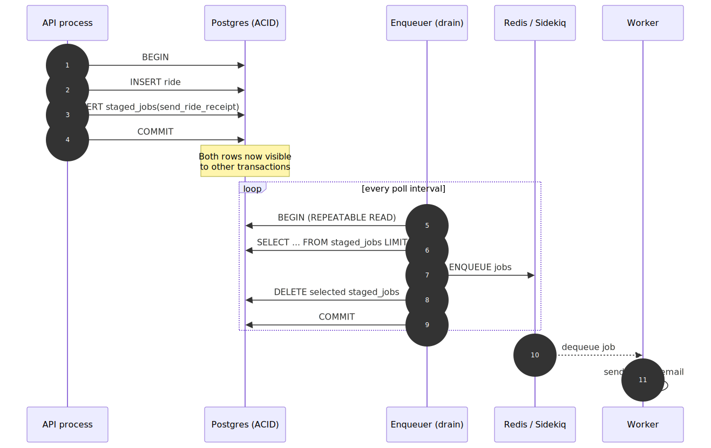
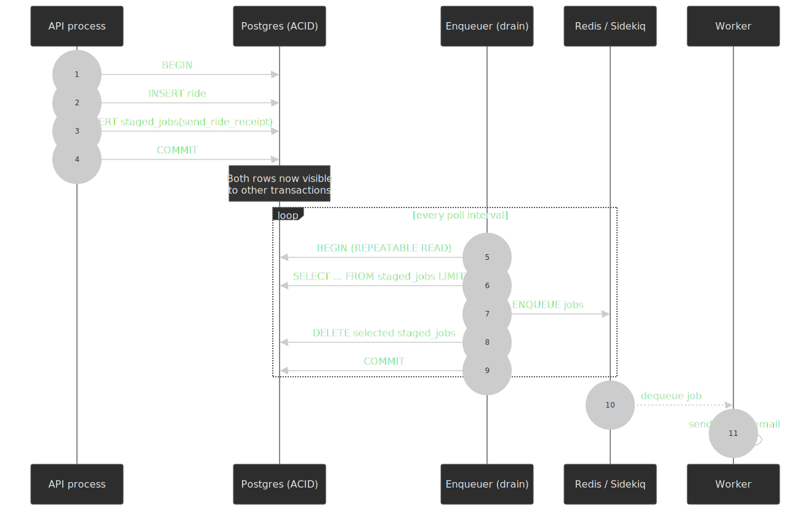

# Stripe: Idempotency for Payment Reliability

Stripe handles network ambiguity in a payment API the way a database handles a power loss: it makes every state transition recoverable, then retries to convergence. The mechanism is a small set of patterns — `Idempotency-Key` requests, atomic phases bracketing every external call, recovery points that survive process death, and jobs staged inside the same transaction that produced them. This article walks through how those pieces fit together at the scale Stripe operates ($1 trillion in 2023 payment volume on a 99.999%-uptime document store)[^1][^2], what changed when API v2 shipped, and how to apply the same model to your own system.




## Why payment APIs need exactly-once semantics

A network call can fail in three ways that look identical from the client side:

1. The connection never reaches the server.
2. The server accepts the request, mutates state, then crashes before responding.
3. The server completes the request, but the response is lost in transit.

Only the first is unambiguously safe to retry. The other two leave the client guessing whether a charge already happened. For a card-present flow this is recoverable through human reconciliation; for a programmatic API it shows up as duplicate charges, broken inventory, and chargebacks.

Stripe's response is not a more clever retry algorithm — it is a contract between client and server: the client picks a unique key per logical operation and includes it on every retry; the server promises that the same key produces the same observable outcome[^3]. The client no longer has to know whether the server saw the original request.

> [!NOTE]
> `GET` and `DELETE` are idempotent by HTTP semantics ([RFC 9110 §9.2.2](https://www.rfc-editor.org/rfc/rfc9110#section-9.2.2)). Idempotency keys exist for the verbs that aren't — `POST`, and (in API v2) `DELETE` for endpoints that have side effects beyond resource removal[^4][^5].

## Mental model: the database as the coordinator

The pattern Stripe popularised — and that Brandur Leach documented in detail when he was at Stripe — sits on three load-bearing ideas[^3]:

| Concept                  | What it is                                                                                                          | Why it works                                                                                                  |
| :----------------------- | :------------------------------------------------------------------------------------------------------------------ | :------------------------------------------------------------------------------------------------------------ |
| **Idempotency key row**  | A `(user_id, idempotency_key)` row that persists request metadata, lock state, recovery point, and cached response. | The unique constraint serializes concurrent retries; the cached response handles "the response got lost".     |
| **Atomic phase**         | A `SERIALIZABLE` transaction whose boundary sits *between* foreign-state mutations.                                 | Local work either fully commits or fully rolls back; foreign calls become checkpointable.                     |
| **Recovery point**       | A `TEXT` label persisted at the end of each atomic phase.                                                           | A retry — by the original client or a background completer — jumps directly to the next unfinished phase.     |

The single most important rule: **commit local state before initiating any foreign-state mutation.** Once the request has crossed your boundary (Stripe API, mailer, Kafka, another microservice), you can't roll it back; you can only record that it happened and either retry it idempotently or compensate.

## The idempotency-key row

Stripe stores idempotency keys per account in a row that tracks the request through its lifecycle. The Rocket Rides reference implementation[^6] uses Postgres; Stripe internally uses DocDB (Stripe's MongoDB-derived document store)[^2], but the schema is functionally equivalent.

```sql title="idempotency_keys.sql"
CREATE TABLE idempotency_keys (
    id              BIGSERIAL   PRIMARY KEY,
    idempotency_key TEXT        NOT NULL,
    user_id         BIGINT      NOT NULL,
    locked_at       TIMESTAMPTZ,
    request_method  TEXT        NOT NULL,
    request_path    TEXT        NOT NULL,
    request_params  JSONB       NOT NULL,
    response_code   INT         NULL,
    response_body   JSONB       NULL,
    recovery_point  TEXT        NOT NULL DEFAULT 'started',
    last_run_at     TIMESTAMPTZ NOT NULL DEFAULT now(),
    created_at      TIMESTAMPTZ NOT NULL DEFAULT now(),
    CONSTRAINT idempotency_keys_user_key_unique
        UNIQUE (user_id, idempotency_key)
);
```

Four design decisions shape every interaction with this table:

- **Per-account scope.** The unique key is `(user_id, idempotency_key)`, not the key alone. Two unrelated accounts can pick the same UUID without colliding[^3].
- **`locked_at` as a soft lock.** The first request to insert the row also locks it; concurrent requests for the same key see the lock and return `409 Conflict`. The lock is cleared when the row reaches `finished` or when an error path explicitly releases it.
- **`recovery_point` as a state-machine cursor.** Each atomic phase ends by writing the next recovery point in the same transaction it commits work into. A retry reads the cursor and jumps to the matching phase.
- **`request_params` for fingerprinting.** Reusing the same key with a different body is almost always a bug, and Stripe rejects it with `409 Conflict` and a `idempotency_error` type[^4][^7].

### Key requirements (Stripe-specific)

| Property      | Value                                                                | Source                                                                                                  |
| :------------ | :------------------------------------------------------------------- | :------------------------------------------------------------------------------------------------------ |
| Header name   | `Idempotency-Key`                                                    | [Stripe API reference][stripe-idem]                                                                     |
| Max length    | 255 characters                                                       | [Stripe API reference][stripe-idem]                                                                     |
| Recommended   | UUIDv4 or other random string with sufficient entropy                | [Stripe API reference][stripe-idem]                                                                     |
| Scope         | Per account / per sandbox                                            | [Stripe API reference][stripe-idem], [Stripe API v2 overview][stripe-v2]                                |
| v1 retention  | At least 24 hours, then reaped                                       | [Stripe API reference][stripe-idem], [Stripe error reference][stripe-errors]                            |
| v2 retention  | 30 days within the same account / sandbox                            | [Stripe API v2 overview][stripe-v2]                                                                     |
| Replay marker | Response includes `Idempotent-Replayed: true`                        | [Stripe error reference][stripe-errors]                                                                 |

[stripe-idem]: https://docs.stripe.com/api/idempotent_requests
[stripe-v2]: https://docs.stripe.com/api-v2-overview
[stripe-errors]: https://docs.stripe.com/error-low-level

> [!CAUTION]
> Don't put email addresses, account IDs, or any other sensitive data in the key. Keys land in logs and metrics; treat them as opaque[^4].

## Atomic phases: bracketing every foreign call

An atomic phase is a `SERIALIZABLE` Postgres transaction whose body executes only local mutations. The boundary of a phase is the next foreign-state mutation — the call to Stripe, the call to the mailer, the publish to Kafka. Brandur's three rules for finding phase boundaries[^3]:

1. The idempotency-key upsert is its own phase.
2. Every foreign-state mutation is its own phase.
3. Every other operation between two foreign mutations gets grouped into one phase, regardless of how many DB rows it touches.

The Rocket Rides flow has one foreign call (the Stripe charge) and produces three local atomic phases plus the foreign mutation between them.




### Why `SERIALIZABLE`

Stripe (and the Rocket Rides implementation) uses the strictest transaction isolation level available in Postgres. The reason is the idempotency-key upsert: two requests with the same key arriving within microseconds need a guarantee that exactly one of them creates the row and the other gets a `409 Conflict`. Lower isolation levels can permit the [write-skew](https://www.postgresql.org/docs/current/transaction-iso.html#XACT-SERIALIZABLE) anomaly that breaks this invariant[^3].

The cost is that concurrent transactions touching the same row pair can abort with `Sequel::SerializationFailure`, surfacing to the client as `409 Conflict`. The official guidance is to retry on the client; the SDKs already do this[^7].

```ruby title="atomic_phase.rb" mark={3-13}
def atomic_phase(key, &block)
  DB.transaction(isolation: :serializable) do
    ret = block.call
    case ret
    when RecoveryPoint
      key.update(recovery_point: ret.name)
    when Response
      key.update(
        recovery_point: 'finished', locked_at: nil,
        response_code: ret.status, response_body: ret.body
      )
    when NoOp
      # phase touched nothing on the key
    end
  end
rescue Sequel::SerializationFailure
  halt 409, { error: 'concurrent request' }.to_json
end
```

Each phase returns one of three sentinel values: a new `RecoveryPoint`, a terminal `Response` (success or unrecoverable error), or a `NoOp` if the phase was a probe (e.g. the upsert of an already-finished key)[^3].

### Recovery points are a DAG, not a loop

Recovery points form a directed acyclic graph anchored at `started` and absorbed at `finished`. Every successful phase advances the cursor; every unrecoverable error short-circuits straight to `finished` with the response cached on the row.




The driver loop is a `case` over `recovery_point` that runs the matching phase and lets the loop iterate again with the new cursor value. A request that starts at `charge_created` because a previous attempt crashed mid-flow will skip directly to phase 3[^3].

## Foreign-state mutations: the constraint that drives the design

Once you call out to Stripe, send an email, or publish to a downstream system, you cannot atomically undo it. That single fact is what forces the atomic-phase pattern: you must commit a local record of *intent to call* before the call, and a local record of *what happened* after, so that retries can be reasoned about.

When the foreign API also speaks `Idempotency-Key`, you derive its key deterministically from your own row's primary key. The Rocket Rides example uses `rocket-rides-atomic-#{key.id}`[^3]:

```ruby title="external_call.rb"
charge = Stripe::Charge.create(
  {
    amount: 20_00, currency: 'usd',
    customer: user.stripe_customer_id,
    description: "Charge for ride #{ride.id}",
  },
  {
    idempotency_key: "rocket-rides-atomic-#{key.id}",
  },
)
```

Now both your own retries and Stripe's internal retries are safe: every attempt sends the same derived key to Stripe, and Stripe's idempotency layer guarantees the charge is created exactly once[^4].

### When the foreign API isn't idempotent

Brandur's framing is the right one: **if a foreign API doesn't support idempotency keys and you see an indeterminate failure (timeout, connection reset), you have to mark that operation as permanently failed.** You cannot safely retry, because you don't know whether the side effect already happened[^3]. That is why Stripe pushes idempotency support so hard onto its own ecosystem — every adopter raises the floor for everyone else.

### Mapping foreign errors to phase outcomes

| Foreign outcome                          | What the phase returns                                | What the client sees                              |
| :--------------------------------------- | :---------------------------------------------------- | :------------------------------------------------ |
| 2xx success                              | Advance recovery point, persist any returned IDs.     | Eventually a 2xx with `Idempotent-Replayed: true` on retries. |
| 4xx — card declined / unrecoverable      | Terminal `Response(402, …)`; key jumps to `finished`. | 402 `Request Failed` with the decline reason[^8]. |
| 5xx / timeout — recoverable foreign side | Raise; the phase aborts, lock is cleared, retry safe. | 503 with `Stripe-Should-Retry: true` from upstream[^4]. |
| Indeterminate, non-idempotent            | Terminal `Response` marking failure.                  | Operator-facing alert; no automatic retry.        |

## Transactionally-staged job drains

The natural temptation when writing the receipt-email step is to enqueue a Sidekiq job from inside the transaction:

```ruby title="naive.rb"
DB.transaction do
  ride = Ride.create(...)
  Sidekiq.enqueue(SendReceiptJob, ride.id)   # WRONG
end
```

Two failure modes here, both subtle and both production-real[^9]:

1. **Worker beats the commit.** Redis is fast. The worker dequeues, queries Postgres for `ride.id`, and finds nothing — the outer transaction hasn't committed yet.
2. **Crash between commit and enqueue.** Move the enqueue *after* the commit and the bug inverts: the row is durable, but the process dies before Redis sees the job. The receipt is silently lost.

The transactionally-staged-job-drain pattern fixes both by making the job insert part of the same transaction as the work it follows up on, then having a separate enqueuer process drain the staging table to the real queue[^9].

```sql title="staged_jobs.sql"
CREATE TABLE staged_jobs (
    id       BIGSERIAL PRIMARY KEY,
    job_name TEXT      NOT NULL,
    job_args JSONB     NOT NULL
);
```

```ruby title="enqueuer.rb"
acquire_lock(:enqueuer) do
  loop do
    DB.transaction(isolation_level: :repeatable_read) do
      jobs = StagedJob.order(:id).limit(BATCH_SIZE)
      next if jobs.empty?
      jobs.each { |j| Sidekiq.enqueue(j.job_name, *j.job_args) }
      StagedJob.where(Sequel.lit('id <= ?', jobs.last.id)).delete
    end
    sleep_with_exponential_backoff
  end
end
```




The properties this gives you are stronger than they look:

- **No lost jobs.** Rows only leave the staging table after Redis acknowledges the enqueue, and the enqueuer deletes them inside its own transaction.
- **No phantom jobs.** A rolled-back outer transaction takes the staged row with it.
- **At-least-once delivery, naturally.** A crash between enqueue and delete causes a re-enqueue on restart; downstream workers must already be idempotent (and yours will be, because you've been reading this article).

> [!TIP]
> Run the enqueuer at `REPEATABLE READ` so its `SELECT … LIMIT` and the subsequent `DELETE` see the same snapshot[^9]. Postgres's serializable level would also work but adds avoidable conflict overhead.

## Background recovery: the completer

Two things can leave a key stuck mid-flow: the originating client gives up before retrying, or a process crash leaves `locked_at` set with no live request behind it. The completer is a background process that picks up these orphans and pushes them through to `finished`. The Rocket Rides implementation runs in a loop, querying for keys whose `locked_at` is older than a grace period (5 minutes in the reference, longer in practice), and replays them via the same atomic-phase pipeline[^3].

```ruby title="completer.rb"
GRACE = 5 * 60 # seconds

loop do
  IdempotencyKey
    .where('recovery_point != ?', 'finished')
    .where('locked_at < ?', Time.now - GRACE)
    .each { |key| resume_from_recovery_point(key) }

  sleep 1
end
```

The grace window has to outlast a slow-but-active request. Too short and the completer races a still-live request, double-locking; too long and abandoned work piles up. Stripe doesn't publish its production value; the reference uses 5 minutes, and that's a sane default unless your phases are unusually long[^3].

## Reaping: the row isn't permanent

Idempotency keys are bounded-storage primitives. They exist to make the *near-term* retry safe, not to act as an audit log. A reaper deletes rows that have outlived the retention horizon.

| Stripe surface | Retention                              | Source                                |
| :------------- | :------------------------------------- | :------------------------------------ |
| API v1         | At least 24 hours                      | [API reference][stripe-idem]          |
| API v2         | 30 days, scoped to account / sandbox   | [API v2 overview][stripe-v2]          |
| Rocket Rides demo | 72 hours (Brandur's recommendation) | [brandur.org/idempotency-keys][bidem] |

[bidem]: https://brandur.org/idempotency-keys

After expiry, a retry with the same key is treated as a brand-new request[^4]. Defences against the resulting duplicate-operation risk:

- Pick natural idempotency where possible (`PUT` over `POST`, "update or create" over "create").
- Add a business-level dedup check (does a charge for this `order_id` already exist?).
- Move to API v2's 30-day window for workflows that span days.

## What changed in API v2

API v2 is a parallel namespace under `/v2` that ships the post-2024 design patterns. Idempotency is one of the surfaces that got the most attention[^5].




| Dimension              | API v1                                                                             | API v2                                                                                              |
| :--------------------- | :--------------------------------------------------------------------------------- | :-------------------------------------------------------------------------------------------------- |
| Verbs that accept keys | `POST` only (`GET`/`DELETE` ignore the header)                                     | `POST` and `DELETE`                                                                                 |
| Replay window          | At least 24 hours                                                                  | 30 days, same account or sandbox, same API                                                          |
| Failed-request replay  | Returns the cached error, including the original 5xx                               | Re-executes the failed request idempotently and returns the new outcome (or an explanatory error)   |
| Encoding               | `application/x-www-form-urlencoded` requests, JSON responses                       | JSON in and out                                                                                     |
| Versioning             | Implicit per SDK release                                                           | `Stripe-Version` header is required                                                                 |

Source: [API v2 overview — Idempotency differences between API v1 and API v2](https://docs.stripe.com/api-v2-overview#idempotency)[^5].

The v2 retry behaviour is the most significant practical change. In v1, a transient infrastructure failure that produced a 500 was permanently cached: every subsequent retry of that key got the same 500 back, and the client had to mint a fresh key to actually try again[^4][^7]. In v2, the server attempts to re-execute the failed request without producing extraneous side effects and returns the new outcome[^5]. For payment flows that span asynchronous webhooks and human action, the longer 30-day window lets the client safely retry a key it generated days earlier.

## Error handling at the HTTP layer

Stripe's HTTP status code reference[^7]:

| Code | Meaning                       | Idempotency interaction                                              | Recommended client action                              |
| :--- | :---------------------------- | :------------------------------------------------------------------- | :----------------------------------------------------- |
| 200  | OK                            | Cached and replayed on retries (`Idempotent-Replayed: true`)         | Done.                                                  |
| 400  | Bad Request                   | Cached if the endpoint started executing; otherwise not cached       | Fix params; mint a fresh key for the corrected request |
| 401  | Unauthorized                  | Not cached (rate/auth runs before the idempotency layer)             | Fix credentials; same key still safe                   |
| 402  | Request Failed (e.g. decline) | Cached                                                               | Surface to user; request a different card              |
| 403  | Forbidden                     | Behaves like 401                                                     | Same as 401                                            |
| 409  | Conflict                      | Concurrent request with same key, or parameter mismatch on same key  | Backoff and retry; or mint new key on parameter change |
| 424  | External Dependency Failed    | Treated like a 5xx                                                   | Retry with same key (backoff)                          |
| 429  | Too Many Requests             | Not cached (rate limiter runs before idempotency layer)              | Exponential backoff, same key safe                     |
| 5xx  | Server Error                  | v1: cached; v2: re-executed                                          | Retry with same key; expect identical body in v1       |

The `Stripe-Should-Retry` response header is the authoritative signal — `true` says retrying is safe, `false` says don't bother, missing means the API can't determine. Stripe SDKs honour it automatically[^7].

### The 409 paths

Two distinct conditions surface as `409 Conflict` with `type: "idempotency_error"`:

- **Concurrent in-flight request** with the same key. The lock on the row is held; the second request loses[^4].
- **Parameter mismatch** — same key, different request body. Stripe returns the well-known message *"Keys for idempotent requests can only be used with the same parameters they were first used with"*[^7][^10].

Both are recoverable, but only one calls for waiting and retrying — the other calls for a new key.

## Retry strategy on the client

Idempotency makes retries safe; it doesn't make them free. Without bounded backoff and jitter, every recovering server immediately gets crushed by the [thundering herd](https://en.wikipedia.org/wiki/Thundering_herd_problem) of clients that synchronised their retry schedules during the outage[^11].

The standard recipe — already implemented in the Stripe SDKs — is exponential backoff with full jitter:

\[
\text{sleep} = \min\bigl(\text{base} \cdot 2^{n-1},\ \text{cap}\bigr); \quad
\text{actual} = \text{rand}(0,\ \text{sleep})
\]

The Stripe Ruby SDK ships the capability disabled by default; configure it explicitly[^12]:

```ruby title="stripe_config.rb"
Stripe.max_network_retries = 2
```

Once enabled, the SDK auto-generates idempotency keys for `POST` requests that don't supply one, retries network errors and `429` lock timeouts on an exponential-backoff schedule with jitter, and respects the `Stripe-Should-Retry` header[^7][^11].

> [!IMPORTANT]
> The default `max_network_retries = 0` is intentional: blindly retrying without thinking about idempotency would create the very duplicate-write bugs the SDK exists to prevent. Treat the choice to enable retries as the moment to also confirm every relevant request includes a stable idempotency key[^12].

## Rate limits and how they interact with idempotency

The basic global limits[^13]:

| Mode    | Operations per second |
| :------ | :-------------------- |
| Live    | 100                   |
| Sandbox | 25                    |

Per-resource limits are layered on top (Payment Intents has 1000 updates/hour per intent, the Files API caps at 20 reads + 20 writes/sec, etc.). When a request is rate-limited, Stripe returns `429` with `Stripe-Rate-Limited-Reason` set to one of `global-rate`, `global-concurrency`, `endpoint-rate`, `endpoint-concurrency`, or `resource-specific`[^13]. Crucially, **the rate limiter runs before the idempotency layer**, so the same key remains safe to use on the retry — the request never reached the idempotency machinery in the first place[^7].

Object lock timeouts surface the same way (`429 lock_timeout`); they have a different cause (concurrent mutations on the same Stripe object) but the same mitigation — retry on the same key with backoff[^13].

## Webhooks: a separate at-least-once channel

Idempotency keys handle the *outbound* request from your client into Stripe. Webhooks handle the *inbound* event from Stripe into your endpoint — and they have their own delivery semantics:

- **At-least-once delivery.** Stripe retries deliveries that don't return `2xx` for up to three days in live mode (a few hours in sandbox)[^14].
- **No ordering guarantee.** Two events in the same logical sequence may arrive out of order; design your handler to be commutative.
- **Duplicate events possible.** Even a single delivery can occasionally produce two `Event` objects with the same `data.object` ID and `event.type`; dedupe on `(event.id, event.type, data.object.id)`[^14].
- **Signed for authenticity.** Each delivery includes a `Stripe-Signature` header carrying a timestamp and one or more HMAC-SHA256 signatures over `{timestamp}.{raw_body}`. Stripe's libraries default to a 5-minute tolerance window to mitigate [replay attacks](https://en.wikipedia.org/wiki/Replay_attack)[^14].

A correct handler is short:

```ruby title="webhook_handler.rb"
post '/webhooks/stripe' do
  payload = request.body.read
  sig     = request.env['HTTP_STRIPE_SIGNATURE']
  event   = Stripe::Webhook.construct_event(payload, sig, ENDPOINT_SECRET)

  return 200 if ProcessedEvent.exists?(event_id: event.id)

  DB.transaction do
    ProcessedEvent.create(event_id: event.id)
    handle(event)
  end
  200
end
```

The signature verification rejects forged events; the `ProcessedEvent` insert (with a unique constraint on `event_id`) makes duplicate deliveries idempotent[^14]. Combined with a transactionally-staged-job-drain for any heavy follow-up work, you can return `200` quickly and let downstream processing happen at its own pace.

## Trade-offs and limits

The pattern optimises for correctness over throughput in three measurable ways:

| Cost                                  | Why                                                                                          | Mitigation                                                                            |
| :------------------------------------ | :------------------------------------------------------------------------------------------- | :------------------------------------------------------------------------------------ |
| Extra database round-trips per request | Idempotency upsert + recovery-point updates + cached response read                           | Co-locate the table with the rest of the request's hot path; consider partitioning by `(user_id, created_at)`. |
| Conflict overhead from `SERIALIZABLE`  | Concurrent requests on the same key abort one transaction; same-row contention raises latency | Treat 409s on retry as expected; use jittered exponential backoff client-side          |
| Operational surface area               | Three new background processes (enqueuer, completer, reaper)                                  | Keep them small, well-monitored, and idempotent themselves                            |

This pattern doesn't fit cleanly when:

- The foreign API isn't idempotent. You can still record intent, but you can't safely auto-retry indeterminate failures.
- The data store doesn't offer real ACID transactions. Atomic phases collapse — every operation becomes a foreign-state mutation[^3].
- The work is fan-in/fan-out across regions where serialisable isolation has unbounded coordination cost. Look at sagas with explicit compensations instead.
- Throughput dwarfs correctness needs (analytics ingest, telemetry). Use simpler at-least-once with downstream dedup.

## IETF standardisation

The pattern Stripe popularised is on its way to becoming a formal HTTP header. [`draft-ietf-httpapi-idempotency-key-header-07`](https://datatracker.ietf.org/doc/draft-ietf-httpapi-idempotency-key-header/) (last revised 2025-10-15, expires 2026-04-18 in its current form)[^15] specifies an `Idempotency-Key` request header with structured-field syntax, prescribed semantics for retries vs. concurrent requests, and recommended error responses (`409` for in-flight, `422` for fingerprint mismatch). The draft's "Implementation Status" appendix lists the surface area of adoption[^15]:

- **`Idempotency-Key` header (matches Stripe's spelling):** Stripe, Adyen, Dwolla, Interledger, WorldPay, Yandex Cloud, Finastra, Datatrans, http4s.
- **Different header name, same concept:** PayPal (`PayPal-Request-Id`, 45-day retention)[^16], Razorpay (`X-Payout-Idempotency`), Twilio (`I-Twilio-Idempotency-Token` for webhooks), Chargebee (`chargebee-idempotency-key`), Open Banking UK (`x-idempotency-key`), BBVA (`X-Unique-Transaction-ID`).
- **Body field instead of header:** Square (`idempotency_key` in body), Google Standard Payments (`requestId` in body).

The draft's IESG state currently shows "Expired", but it's been advancing through revisions for several years and the latest revision is recent[^15]. Until it ships as an RFC, Stripe's `Idempotency-Key` is the de facto standard most adopters mirror.

## Applying this to your own system

If your system has any of these properties, the pattern earns its complexity:

- A non-idempotent operation whose accidental repetition has business cost (charges, inventory decrements, notifications, account creation).
- An ACID-compliant primary store (Postgres, MySQL, CockroachDB, Spanner, well-configured MongoDB).
- A foreign-state mutation (third-party API, transactional email, message broker) that supports its own idempotency mechanism.

The minimal version is genuinely small: the table, an upsert with `SERIALIZABLE` isolation, response caching, parameter fingerprinting, and a 4xx/409 on mismatch. That covers the bulk of real production failures. Add recovery points and the completer when you have multiple atomic phases or long-running workflows; add the staged-job drain when you start emitting follow-up work.

The reference implementation lives at [`brandur/rocket-rides-atomic`](https://github.com/brandur/rocket-rides-atomic) — about 700 lines of Ruby, including tests, that exercise every code path described above[^3].

## References

[^1]: Stripe, "[Stripe's 2023 annual letter](https://stripe.com/annual-updates/2023)" — "Our users processed a collective $1 trillion on Stripe, equivalent to 1% of global GDP and growing."
[^2]: J. Morzaria & S. Narkhede, Stripe Engineering, "[How Stripe's document databases supported 99.999% uptime with zero-downtime data migrations](https://stripe.dev/blog/how-stripes-document-databases-supported-99.999-uptime-with-zero-downtime-data-migrations)" (2024-06-06).
[^3]: B. Leach, "[Implementing Stripe-like Idempotency Keys in Postgres](https://brandur.org/idempotency-keys)" (2017-10-27). Companion repo: [brandur/rocket-rides-atomic](https://github.com/brandur/rocket-rides-atomic).
[^4]: Stripe, "[API reference — Idempotent requests](https://docs.stripe.com/api/idempotent_requests)".
[^5]: Stripe, "[API v2 overview — Idempotency](https://docs.stripe.com/api-v2-overview#idempotency)".
[^6]: GitHub, "[brandur/rocket-rides-atomic](https://github.com/brandur/rocket-rides-atomic)" — the canonical reference implementation cited by the Stripe blog post.
[^7]: Stripe, "[Advanced error handling](https://docs.stripe.com/error-low-level)" — including `Stripe-Should-Retry`, `Idempotent-Replayed`, the HTTP status code reference, and the 24-hour retention statement.
[^8]: Stripe, "[API errors](https://docs.stripe.com/api/errors)" — defines `idempotency_error`, the `409 Conflict` status, and the `402 Request Failed` semantics.
[^9]: B. Leach, "[Transactionally Staged Job Drains in Postgres](https://brandur.org/job-drain)" (2017-09-20).
[^10]: The exact error message *"Keys for idempotent requests can only be used with the same parameters they were first used with"* is reproduced in many Stripe SDK error tests and Stack Overflow reports; see e.g. [Stack Overflow #51278290](https://stackoverflow.com/questions/51278290/django-stripe-idempotent-requests-can-only-be-used-with-the-same-parameters).
[^11]: Stripe Engineering, "[Designing robust and predictable APIs with idempotency](https://stripe.com/blog/idempotency)" (2017) — original Stripe blog post by Brandur Leach covering exponential backoff with jitter.
[^12]: Stripe-Go GitHub issue [#804](https://github.com/stripe/stripe-go/issues/804) confirming that `MaxNetworkRetries` defaults to `0` across Stripe SDKs (same default in stripe-ruby and stripe-node) and that automatic retries plus auto-generated idempotency keys are explicitly opt-in. See also Stripe's [error reference](https://docs.stripe.com/error-low-level).
[^13]: Stripe, "[Rate limits](https://docs.stripe.com/rate-limits)" — global limits, the `Stripe-Rate-Limited-Reason` header values, and lock-timeout semantics.
[^14]: Stripe, "[Webhooks](https://docs.stripe.com/webhooks)" — three-day retry window, signature verification with HMAC-SHA256, 5-minute tolerance default, duplicate-event guidance.
[^15]: J. Jena & S. Dalal, "[The Idempotency-Key HTTP Header Field](https://datatracker.ietf.org/doc/draft-ietf-httpapi-idempotency-key-header/)" — IETF draft, currently `-07`, last revised 2025-10-15. Adopter list in §4 ("Implementation Status").
[^16]: PayPal Developer, "[Idempotency](https://developer.paypal.com/api/rest/reference/idempotency/)" — `PayPal-Request-Id` header with 45-day retention.
