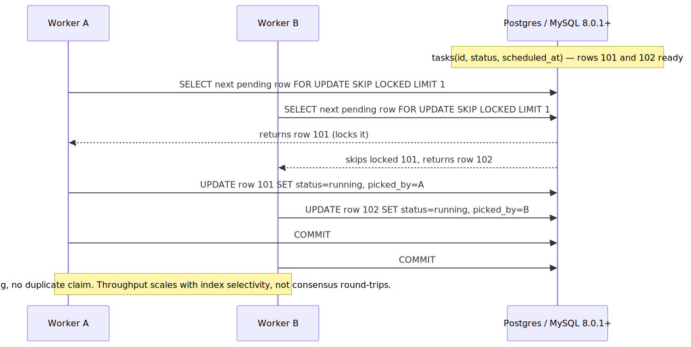
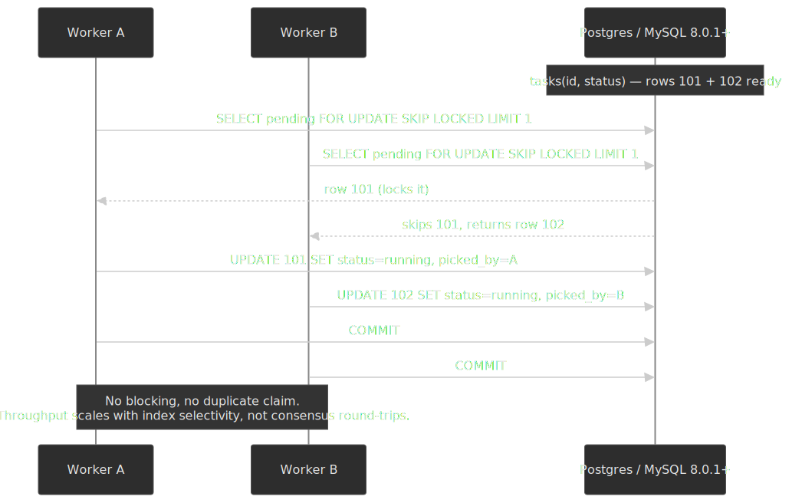
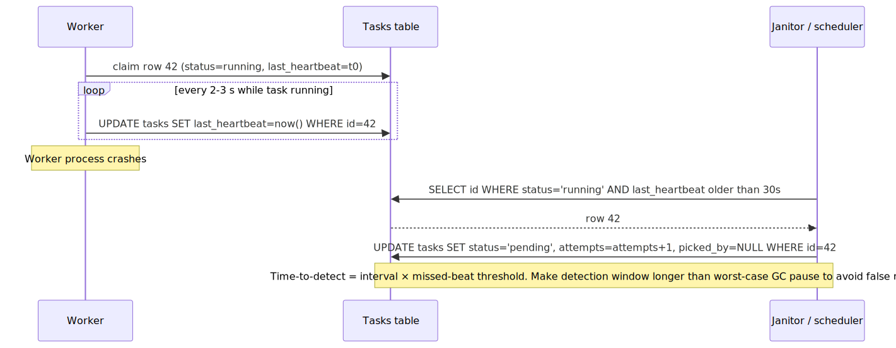
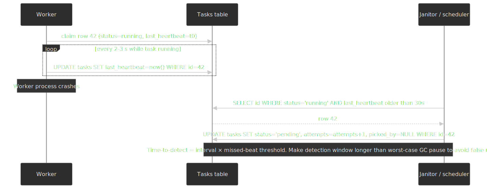

# Task Scheduler Design

Distributed task scheduling is fundamentally about **coordination without contention**: multiple scheduler instances must agree on which tasks to run, when to run them, and which worker executes each one — without becoming a bottleneck and without allowing duplicate execution. This article is a senior-engineer-level walk through the design space, the guarantees you can actually buy, and how production systems (Airflow, Temporal, Celery, Google's distributed cron) chose their trade-offs.




## Mental model

Hold these four ideas before reading the rest:

- **Scheduling and execution are separate concerns.** The scheduler decides _what_ runs and _when_; workers do the work. This separation is what lets you scale them independently and replace either one without rewriting the other.
- **Exactly-once is impossible. Effectively-once is not.** Distributed systems can't deliver each task exactly once because of the [Two Generals Problem](https://en.wikipedia.org/wiki/Two_Generals%27_Problem). What they _can_ do is **at-least-once delivery + idempotent processing**, which is observably indistinguishable from exactly-once when handlers are designed for it.
- **The database is a legitimate coordination primitive.** Modern schedulers (Airflow 2+, [`db-scheduler`](https://github.com/kagkarlsson/db-scheduler), Quartz JDBC) use `SELECT ... FOR UPDATE SKIP LOCKED` instead of Raft or Paxos. The operational simplicity often beats the theoretical elegance — Airflow's design document is explicit about this[^aip15].
- **Time is unreliable.** Clocks drift, NTP corrects them in jumps, virtual machines pause, and leap seconds make minutes 59 or 61 seconds long. Robust schedulers use monotonic clocks for delays and event ordering rather than wall-clock arithmetic for correctness.

The headline trade-off space:

| Guarantee     | Cost                                       | Use when                        |
| ------------- | ------------------------------------------ | ------------------------------- |
| At-most-once  | Lowest latency, no retries, no idempotency | Best-effort metrics, cache fill |
| At-least-once | Requires idempotent handlers + dedup       | Most production workloads       |
| Exactly-once  | Coordination overhead, lower throughput    | Billing, payments, ledger writes |

## Scheduling models

### Cron-based (time-triggered)

Tasks fire at specific times defined by cron expressions (`0 9 * * *` for 9 AM daily). The scheduler evaluates each expression against the current time and enqueues matching jobs. Cron has been the default since [Version 7 Unix in 1979](https://en.wikipedia.org/wiki/Cron#History) and the syntax has barely changed.

**Best when:** predictable, recurring workloads (daily reports, hourly aggregations) that align with calendar boundaries and where execution time should not drift based on the previous run.

**Trade-offs:**

- ✅ Human-readable schedules, well-understood semantics.
- ✅ Natural fit for business-process schedules (close-of-day, billing cycles).
- ❌ Clock skew can cause duplicate or missed runs across replicas.
- ❌ "Catch-up" behaviour after downtime varies by implementation (Airflow back-fills, most others skip).
- ❌ Overlapping runs if a previous execution exceeds the interval — handled by an explicit overlap policy (see below).

> [!NOTE]
> Kubernetes CronJob `spec.timeZone` reached general availability in v1.27, accepting IANA zone names instead of inheriting `kube-controller-manager`'s local time[^k8sgaCron]. Older clusters silently treat all schedules as UTC, which is a common production trap when migrating from a non-UTC host cron.

### Interval-based (fixed delay)

Tasks run at a fixed interval _from the completion of the previous run_ ("every 30 minutes after last success"). The next execution time is `previous_completion + interval`.

**Best when:** task duration varies significantly, you need a guaranteed gap between runs, or you want to spread load evenly without piling up.

**Trade-offs:**

- ✅ Prevents overlap by construction.
- ✅ Self-adjusts to task duration.
- ❌ Execution times drift through the day; no "9 AM" guarantee.
- ❌ The first run requires separate configuration.

Temporal Schedules support `every <duration>` with an optional phase offset aligned to the Unix epoch[^tsched]. If a workflow execution takes five minutes and the schedule is every 30 minutes, the next start is 30 minutes after completion — not 30 minutes after the original scheduled time.

### Delay-based (one-shot future)

Task executes once after a specified delay ("run in 30 seconds"). Common for deferred processing: reminder email 24 hours after signup, retry a failed payment in 1 hour.

**Best when:** one-time future execution where the delay is computed at submission time (e.g. retry backoff).

**Trade-offs:**

- ✅ Simple mental model, dynamic per task.
- ❌ Wall-clock adjustments can fire early or late.
- ❌ Long delays (days, weeks) require durable storage.

> [!IMPORTANT]
> Compute deadlines using monotonic clocks or scheduler-relative offsets, not `time.time() + delay`. NTP corrections can step the wall clock forward or backward at any moment, which on a wall-clock implementation looks like a task firing minutes early or arriving minutes late.

### Event-triggered (reactive)

Tasks fire in response to external events: file uploads, database changes, webhook calls, message arrivals. There is no fixed schedule — execution is purely reactive.

**Best when:** processing depends on external data availability, the workload is bursty or unpredictable, or you need near-real-time responsiveness.

**Trade-offs:**

- ✅ Minimal latency; no wasted polling cycles.
- ✅ Natural fit for event-driven architectures.
- ❌ Thundering herd if many events arrive simultaneously.
- ❌ Requires robust event-delivery infrastructure (durable broker, dead-letter handling).

Airflow 3 (released 2025) added explicit event-driven scheduling on top of its renamed "Asset" concept (formerly Datasets). DAGs can now be scheduled on `AssetWatcher` triggers that listen to message queues such as SQS or Kafka, rather than only on time intervals[^airflow3event].

## Coordination mechanisms

This is the core design decision: how do multiple scheduler instances agree on who runs what, without becoming the bottleneck themselves?




### Option 1: database row locks (no consensus)

Schedulers use database row-level locks (`SELECT ... FOR UPDATE SKIP LOCKED`) to claim tasks. There is no inter-scheduler communication — the database _is_ the coordination primitive.

```sql title="claim.sql"
SELECT id, payload FROM tasks
WHERE status = 'pending'
  AND scheduled_at <= NOW()
ORDER BY priority DESC, scheduled_at ASC
LIMIT 1
FOR UPDATE SKIP LOCKED;

UPDATE tasks
SET status = 'running', picked_by = $worker_id, picked_at = NOW()
WHERE id = $task_id;
```

`SKIP LOCKED` is what makes this scale — without it, every concurrent claim would block on the same row at the head of the queue. With it, each transaction simply skips rows already locked by another transaction and grabs the next available one.




**Best when:** operational simplicity matters, you already run PostgreSQL or MySQL, throughput is below ~10K tasks/second, or your team does not want to operate ZooKeeper / etcd / Consul just for the scheduler.

**Trade-offs:**

- ✅ No additional infrastructure.
- ✅ Familiar SQL semantics; ACID guarantees on state transitions.
- ✅ Scales horizontally by adding scheduler instances.
- ❌ Database becomes the bottleneck at extreme scale.
- ❌ Requires PostgreSQL 9.5+[^pgskip] or MySQL 8.0.1+[^myskip] for `SKIP LOCKED`.
- ❌ Lock contention under very high concurrency, especially with low-cardinality `ORDER BY` columns.

> [!TIP]
> Apache Airflow 2+ uses active-active schedulers backed exclusively by row-level locks. From the official scheduler docs: _"by not using direct communication or consensus algorithm between schedulers (Raft, Paxos, etc.) nor another consensus tool (Apache Zookeeper, or Consul for instance) we have kept the 'operational surface area' to a minimum"_[^aip15].

### Option 2: leader election (single active scheduler)

One scheduler is elected leader; only the leader assigns tasks. If the leader fails, another instance takes over via a consensus protocol (Raft) or a coordination service (ZooKeeper, etcd).

**Best when:** you need strict global ordering, a single scheduler can handle the throughput, you already operate ZooKeeper or etcd for other purposes, or you require single-writer semantics for compliance reasons.

**Trade-offs:**

- ✅ No duplicate scheduling by construction.
- ✅ Simpler reasoning about task order.
- ❌ Single-leader bottleneck on throughput.
- ❌ Failover latency during leader election.
- ❌ Extra operational surface (the consensus service itself).

Leader election is usually lease-based: the leader holds a lease for a fixed window (often 10–30 s) and must renew before expiry. If renewal fails (crash, network partition, GC pause longer than the lease), other candidates compete for the lease. Set the lease longer than your worst-case stop-the-world pause to avoid pathological flapping.

### Option 3: work stealing (distributed load balancing)

Each worker holds local task state; idle workers "steal" work from busier ones. Stealing rebalances load dynamically without a central assigner.

**Best when:** task durations are highly variable, workers have different capacities, or minimising tail latency matters.

**Trade-offs:**

- ✅ Self-balancing, good for heterogeneous workloads.
- ✅ Reduces idle time on faster workers.
- ❌ More complex to implement correctly than pull-from-queue.
- ❌ Stealing has overhead — pure short-task workloads do not benefit.

Dask Distributed implements a centralised variant: the scheduler ranks each task by a computation-to-communication ratio and biases stealing toward saturated workers. Tasks that are cheap to move (high compute, low data) are stolen first; tasks dominated by data-transfer cost stay put[^daskwork]. This is closer to "rebalancing the rich" than to classical per-worker deque stealing.

### Option 4: consistent hashing (partitioned scheduling)

Tasks are assigned to schedulers / workers by hashing the task ID. Each node owns a partition of the hash ring; adding or removing nodes only re-shuffles neighbouring partitions instead of the entire keyspace.

**Best when:** task affinity matters (cache locality, sticky session state), you need predictable distribution, or you want horizontal scaling without rehashing all in-flight work.

**Trade-offs:**

- ✅ Deterministic assignment — same task always goes to the same node.
- ✅ Minimal disruption when nodes join or leave.
- ✅ Good cache utilisation.
- ❌ Hot partitions if task IDs are not uniformly distributed.
- ❌ Cluster changes still trigger some rebalancing.
- ❌ Doesn't natively handle variable per-task complexity.

Virtual nodes (each physical node owning many positions on the ring) significantly improve distribution. The exact ratio is workload-dependent — Cassandra ships with 256 vnodes per node by default, while many systems land in the 100–1000 range. Tune this with measured load variance, not a number copied from a blog post.

## Task storage

### Database-only (PostgreSQL or MySQL)

A canonical pattern looks like this:

```sql title="schema.sql" showLineNumbers
CREATE TABLE scheduled_tasks (
    id              BIGSERIAL PRIMARY KEY,
    task_name       VARCHAR(255) NOT NULL,
    payload         JSONB,
    scheduled_at    TIMESTAMPTZ NOT NULL,
    priority        SMALLINT DEFAULT 0,
    status          VARCHAR(20) DEFAULT 'pending',
    picked_by       VARCHAR(255),
    picked_at       TIMESTAMPTZ,
    attempts        INT DEFAULT 0,
    max_attempts    INT DEFAULT 3,
    last_heartbeat  TIMESTAMPTZ,
    created_at      TIMESTAMPTZ DEFAULT NOW()
);

CREATE INDEX idx_pending_tasks
    ON scheduled_tasks (scheduled_at, priority)
    WHERE status = 'pending';
```

**Best when:** durability is critical, you already run PostgreSQL, throughput is under ~10K tasks/second, and you want to enqueue tasks atomically with business writes (transactional outbox).

**Trade-offs:**

- ✅ Single source of truth; SQL for ad-hoc queries and operational debugging.
- ✅ Atomic enqueue together with business transactions.
- ✅ Built-in persistence and replication.
- ❌ Higher latency than in-memory brokers.
- ❌ Connection pool exhaustion under high load.
- ❌ Index maintenance overhead at high churn.

The [`db-scheduler`](https://github.com/kagkarlsson/db-scheduler) library is a clean reference implementation: a single table, a partial index on pending tasks, heartbeat tracking via `last_heartbeat`, and reclamation of stalled tasks by another worker.

### Message broker (Redis / RabbitMQ / Kafka)

**Best when:** throughput exceeds ~10K tasks/second, fire-and-forget semantics are acceptable, you already run a broker, or you need real-time fan-out to many consumers.

**Trade-offs:**

- ✅ Sub-millisecond latency.
- ✅ Built-in pub/sub, fan-out, and partitioning.
- ✅ Natural backpressure via queue depth.
- ❌ Separate durability story (Redis RDB/AOF, RabbitMQ mirroring/quorum queues, Kafka replication).
- ❌ Two systems to operate alongside the primary database.

| Broker       | Model                | Durability                | Typical throughput | Best for                     |
| ------------ | -------------------- | ------------------------- | ------------------ | ---------------------------- |
| **Redis**    | Push (lists/streams) | Optional (RDB/AOF)        | 100K+ ops/sec      | Low-latency, simple queues   |
| **RabbitMQ** | Push (AMQP)          | Mirrored / quorum queues  | 50K+ msg/sec       | Complex routing, reliability |
| **Kafka**    | Pull (log)           | Replicated partitions     | 1M+ msg/sec        | High volume, replayable log  |

### Hybrid (database + broker)

Database stores task definitions, history, and durable state; broker handles real-time distribution and worker fan-out.

**Best when:** you need both durability and low latency, workflows have complex state, you have audit-trail requirements, or scale demands broker-class throughput.

**Trade-offs:**

- ✅ Database for queries, broker for speed.
- ❌ Two systems to operate _and_ keep consistent.
- ❌ More failure modes (broker-DB skew, message-DB skew, partial failures).

A common shape: PostgreSQL holds job definitions and execution history (often time-partitioned), while Redis Sorted Sets index jobs by scheduled timestamp for fast polling and Redis Streams hand off to workers.

## Delivery guarantees

### At-most-once

Fire the task, do not track outcome. If the worker crashes mid-execution, the task is lost.

**Implementation:** no acknowledgement, no retries, no persistence.

**Use when:** task loss is acceptable (best-effort metrics, opportunistic cache warm-up), duplicate execution is worse than missed execution, or maximum throughput is the only goal.

### At-least-once

The task remains "in-flight" until the worker acknowledges completion. Crashes before acknowledgement trigger re-delivery.

```text title="at-least-once flow"
1. Worker claims task   → status = 'running'
2. Worker executes
3. Worker acknowledges  → status = 'completed'
4. If heartbeat missed or visibility timeout expires, task returns to queue
```

At-least-once means tasks **may run more than once**. Handlers must be idempotent:

```python title="payment_handler.py"
def process_payment(order_id: str, amount_cents: int) -> None:
    # idempotency_key uniquely identifies this payment intent
    inserted = insert_payment_attempt(
        idempotency_key=f"order:{order_id}",
        amount_cents=amount_cents,
    )
    if not inserted:
        return  # already processed, treat as success

    charge_credit_card(order_id, amount_cents)
    mark_order_paid(order_id)
```

The unique constraint on `idempotency_key` is what makes the second invocation a no-op rather than a duplicate charge. This pattern generalises: **state insert with a unique key, side effect, ack** — in that order — turns at-least-once into effectively-once.

### Exactly-once (effectively-once)

True exactly-once delivery is impossible in distributed systems; what production systems provide is **at-least-once delivery + idempotent processing**, which is observably equivalent.




**Implementation strategies:**

1. **Idempotency keys** — store processed task IDs and short-circuit duplicates.
2. **Transactional outbox** — record completion atomically with business state.
3. **Deduplication window** — remember recent task IDs for a TTL.

Exactly-once semantics typically cost throughput. Reported overhead varies wildly by workload — Confluent's Kafka EOS benchmarks land in the single-digit-percent range for streaming pipelines, while transaction-bounded RDBMS pipelines often see 10–30% reduction. Treat any number you see as workload-specific and measure your own.

Production examples worth knowing:

- **Temporal** — Workflow code achieves effectively-once via deterministic event-history replay. Every workflow step is recorded; replaying the history reconstructs exact state. Activities (external calls) remain at-least-once and require idempotent implementations.
- **Kafka** — Combines idempotent producers (per-producer ID + per-partition sequence numbers) with transactions that atomically commit messages and consumer offsets[^kafkaeos].
- **AWS Step Functions Standard Workflows** — Exactly-once execution per step in the internal state machine, up to one year of execution duration[^sfnstd].

## Failure handling

### Heartbeat-based recovery

The scheduler must detect stalled or crashed workers before retrying — otherwise tasks sit forever in `running` state.




| Parameter          | Typical value  | Rationale                                            |
| ------------------ | -------------- | ---------------------------------------------------- |
| Heartbeat interval | 2–3 seconds    | Frequent enough to detect failures quickly           |
| Failure threshold  | 3 missed beats | Avoids false positives from transient hiccups       |
| Time to detection  | ~6–9 seconds   | Interval × threshold                                 |

Two models exist:

- **Push (worker → scheduler):** worker sends periodic "I'm alive" updates. Simpler, but the scheduler must track every worker.
- **Pull (scheduler → worker):** scheduler polls worker status. More control, but adds latency and a discovery problem.

A janitor sweep then reclaims stalled rows:

```sql title="reclaim.sql"
UPDATE tasks
SET status = 'pending',
    picked_by = NULL,
    picked_at = NULL,
    attempts = attempts + 1
WHERE status = 'running'
  AND last_heartbeat < NOW() - INTERVAL '30 seconds'
  AND attempts < max_attempts;
```

> [!CAUTION]
> Set the detection window comfortably larger than your worst-case GC pause (or VM live-migration freeze, or kubelet eviction grace period). A reclaim during a long pause produces a duplicate execution _while the original is still running_ — exactly the case your idempotency layer needs to handle.

### Retry strategies

**Exponential backoff with jitter:**

$$
\text{delay} = \min\bigl(\text{base} \cdot 2^{\text{attempt}} + \text{jitter},\; \text{max\_delay}\bigr)
$$

| Attempt | Base delay | With ±20% jitter |
| ------- | ---------- | ---------------- |
| 1       | 1s         | 0.8–1.2s         |
| 2       | 2s         | 1.6–2.4s         |
| 3       | 4s         | 3.2–4.8s         |
| 4       | 8s         | 6.4–9.6s         |
| 5       | 16s        | 12.8–19.2s       |

Jitter matters because without it, every task that failed in the same outage retries at the same instant — a synchronised thundering herd that often re-triggers the original failure. AWS's analysis of [exponential backoff and jitter](https://aws.amazon.com/blogs/architecture/exponential-backoff-and-jitter/) is the canonical reference and includes simulation results.

**Distinguish error classes:**

| Error class    | Retryable        | Example                                                 |
| -------------- | ---------------- | ------------------------------------------------------- |
| **Transient**  | Yes              | Network timeout, rate limit, temporary unavailability   |
| **Permanent**  | No               | Invalid input, missing resource, authentication failure |
| **Unknown**    | Conservative yes | Unexpected exceptions, ambiguous error codes            |

Returning a typed result (or wrapping exceptions into transient / permanent buckets) is what makes the retry policy mechanical instead of ad-hoc.

### Dead-letter queue (DLQ)

After exhausting retries, failed tasks move to a DLQ for inspection, replay, or specialised re-processing.

**Best practices:**

1. **Don't auto-consume.** Blindly reprocessing the DLQ repeats the same failure; only drain it once you've fixed the root cause.
2. **Preserve context.** Store the original payload, every error message, attempt timestamps, and worker IDs.
3. **Alert on growth.** DLQ accumulation is a leading indicator of systemic issues.
4. **Set a TTL.** Old DLQ entries (weeks or months) are usually stale; archive or delete.

```sql title="dlq.sql"
CREATE TABLE dead_letter_queue (
    id                BIGSERIAL PRIMARY KEY,
    original_task_id  BIGINT,
    task_name         VARCHAR(255),
    payload           JSONB,
    error_message     TEXT,
    error_stack       TEXT,
    attempts          INT,
    failed_at         TIMESTAMPTZ DEFAULT NOW(),
    worker_id         VARCHAR(255),
    metadata          JSONB
);
```

## Clock skew and time synchronisation

Distributed systems have unreliable clocks for several reasons:

- **NTP accuracy.** Internet NTP commonly delivers tens of milliseconds of synchronisation in steady state, with worse spikes during reconvergence. Sub-millisecond accuracy needs PTP or dedicated hardware references.
- **VM live migration.** Hypervisors may freeze a guest for hundreds of milliseconds and the wall clock skips forward when the guest unfreezes.
- **NTP step corrections.** When drift exceeds the slew threshold, NTP corrects the wall clock instantly, which can move time backward.
- **Leap seconds.** Real minutes can have 59 or 61 seconds; Google famously chose to "smear" leap seconds across a window to dodge bugs.

The impact on schedulers:

- A task scheduled for `T` may execute at `T ± skew` across replicas.
- Two scheduler replicas may both decide a cron job is due and run it twice.
- Logs across nodes can show effects appearing before causes when sorted by wall clock.

### Mitigation

**Use monotonic clocks for delays:**

```python title="delay.py"
import time

start = time.monotonic()
deadline = start + 30  # seconds in monotonic time

# never use time.time() + 30 for a deadline — wall clock can step
```

**Detect clock anomalies and fail loudly:**

```python title="clock_health.py"
def check_clock_health(last_timestamp: float, expected_interval: float) -> None:
    current = time.time()
    drift = current - last_timestamp
    if drift < 0:
        raise ClockSkewError(f"clock regressed by {-drift:.3f}s")
    if drift > expected_interval * 2:
        log.warning("large clock jump: %.3fs", drift)
```

**Use event sourcing instead of clocks for correctness.** Temporal records every workflow step as an immutable event; replay reconstructs state from the event log, making execution deterministic regardless of clock variations.

**Use bounded-uncertainty time when consistency matters.** Google's Spanner uses GPS receivers and atomic clocks to bound clock uncertainty; the published 2012 paper reports the steady-state uncertainty `ε` as a sawtooth typically in the 1–7 ms range, with occasional spikes during master maintenance[^spanner]. TrueTime returns an interval `[earliest, latest]` and Spanner waits out the uncertainty before committing. This is infrastructure-heavy and impractical outside hyperscalers.

## Handling concurrent executions

When a scheduled task runs longer than its interval, multiple instances may overlap. Schedulers expose explicit overlap policies so this isn't accidental:

| Policy             | Behaviour                                       | Use when                              |
| ------------------ | ----------------------------------------------- | ------------------------------------- |
| **Allow**          | Multiple concurrent runs                        | Tasks are independent; parallel is OK |
| **Forbid / Skip**  | Skip if previous still running                  | Idempotency concerns, resource limits |
| **Replace / Cancel** | Cancel previous, start new                    | Latest data more important            |
| **Buffer**         | Queue for after current finishes                | Must process every trigger            |

Temporal's overlap policies — directly from the docs[^tsched]:

- `Skip` (default) — don't start if previous is still running.
- `BufferOne` — buffer at most one execution to start after the current completes.
- `BufferAll` — queue every missed execution; recommended when used together with backfill.
- `CancelOther` — cancel the running execution, then start the new one.
- `TerminateOther` — terminate (no graceful cancel) the running execution, then start the new one.
- `AllowAll` — no limits on concurrent executions.

Kubernetes CronJob exposes a smaller set:

```yaml title="cronjob.yaml"
spec:
  concurrencyPolicy: Forbid       # Allow | Forbid | Replace
  startingDeadlineSeconds: 200    # fail if can't start within 200s
  timeZone: "America/New_York"    # GA in 1.27
```

## Real-world case studies

### Apache Airflow — database-centric HA

**Problem:** run thousands of DAGs reliably without single points of failure.

**Architecture:** multiple scheduler instances active-active, PostgreSQL or MySQL row-level locks for coordination, no inter-scheduler RPC; Celery or Kubernetes for execution.

**Key insight:** "_by not using direct communication or consensus algorithm between schedulers (Raft, Paxos, etc.) ... we have kept the 'operational surface area' to a minimum_"[^aip15].

**Trade-off accepted:** the database is the bottleneck at extreme scale. Mitigation is replicas, partitioning, and accepting that horizontal scheduler scaling has a ceiling determined by your database tier.

**Operational guidance:** Astronomer recommends at least two schedulers in production for HA, scaling beyond that for throughput[^astro].

### Temporal — durable execution via event sourcing

**Problem:** long-running workflows (hours to a year) that must survive infrastructure failures.

**Architecture:**

- **History service** stores an immutable event log per workflow execution.
- **Matching service** manages task queues for worker polling.
- **Workers** are stateless processes executing workflow / activity code.

**Key insight:** workflow state is reconstructed by replaying events, not stored explicitly. Code must be deterministic — identical inputs must always produce identical outputs.

**Exactly-once guarantee:** workflow code is effectively-once even when replayed; activity code is at-least-once and must be made idempotent by the application.

**Production usage:** Stripe uses Temporal as a durability layer for payment workflows[^stripeTemp]; Datadog uses Temporal for Database Reliability Engineering — automating database operations and remediation that previously relied on hand-rolled scripts[^ddtemp].

### Celery — broker-based task distribution

**Problem:** distribute Python tasks across worker pools with minimal latency.

**Architecture:** clients submit tasks to a broker (Redis or RabbitMQ); workers poll the broker, execute, and return results to a result backend.

**Trade-off:** simplicity over durability. Tasks held only in Redis can be lost on a Redis crash; for critical workloads, use RabbitMQ with persistent messages and explicit ACKs (or move the durable record to your primary database).

**Manageability gap:** Celery is famously hard to introspect once a worker pool misbehaves — there is no first-class concept of workflow state to query. For complex workflow needs, either a workflow engine (Airflow, Temporal) or a durable-execution platform is usually a better fit.

### Google's distributed cron — reliability via Paxos

**Problem:** run millions of cron jobs reliably across global datacenters.

**Key lessons from the Google SRE book**[^googcron]:

1. **Idempotency or state lookup.** "When a leader replica dies after a scheduled launch starts but before completion notification, the system must handle this by ensuring all operations on external systems are either idempotent or their state can be looked up." Google chose to construct deterministic operation names ahead of time so a recovering leader can ask "did this name actually launch?" instead of risking a duplicate.
2. **Store state in a Paxos-based system.** Cron configuration and execution state live in a globally consistent store so leader handover never loses state.
3. **Decouple scheduling from execution.** The cron service decides _when_ to launch; separate infrastructure handles _how_ to run the work.

## Common pitfalls

### Pitfall 1 — Ignoring idempotency

**Mistake:** assuming tasks run exactly once and writing non-idempotent handlers.

**Why it happens:** at-least-once semantics aren't obvious until the first duplicate execution in production.

**Consequence:** double charges, duplicate notifications, corrupted derived data.

**Fix:** design every handler for re-execution. Idempotency keys, unique constraints, or check-then-act with proper locking.

### Pitfall 2 — Unbounded retries

**Mistake:** retrying indefinitely without backoff or attempt limits.

**Why it happens:** optimism that transient failures will resolve.

**Consequence:** permanent failures consume worker capacity forever. The retry queue grows unbounded and the system grinds to a halt.

**Fix:** exponential backoff, maximum retry count, DLQ for terminal failures, and a typed error model that classifies transient vs. permanent.

### Pitfall 3 — Missing heartbeats

**Mistake:** no mechanism to detect stalled workers.

**Why it happens:** happy-path testing rarely simulates mid-execution crashes.

**Consequence:** tasks stuck in `running` forever; phantom workers holding work hostage.

**Fix:** worker heartbeats during execution, time-based reclamation, dashboards for worker health.

### Pitfall 4 — Wall-clock assumptions

**Mistake:** using wall-clock time for scheduling decisions without accounting for skew or steps.

**Why it happens:** developer machines have well-synced clocks; production environments don't.

**Consequence:** duplicate cron runs, missed schedules, premature firings after NTP corrections.

**Fix:** monotonic clocks for delays; clock-skew detection; tolerances in schedule matching; deterministic event sourcing where ordering matters for correctness.

### Pitfall 5 — Overloading the scheduler

**Mistake:** running heavy computation in the scheduler process.

**Why it happens:** convenience — a small task feels easier to inline than to dispatch.

**Consequence:** scheduler becomes the bottleneck; scheduling latency rises; cascading delays show up everywhere downstream.

**Fix:** schedulers schedule. Workers compute. Keep the scheduler process lightweight and responsive.

## How to choose

Start with these questions:

1. **What is the throughput requirement?**
   - < 1K tasks/min — database-only (PostgreSQL).
   - 1K–100K tasks/min — database + broker hybrid.
   - > 100K tasks/min — dedicated message broker, sharded scheduling.

2. **How critical is task completion?**
   - Best-effort — at-most-once on a simple broker.
   - Must complete — at-least-once with idempotent handlers.
   - Financial / billing — effectively-once via durable execution or transactional outbox.

3. **How long do tasks run?**
   - Seconds — simple queue (Celery, RQ, BullMQ).
   - Minutes to hours — workflow engine with checkpointing.
   - Days to a year — durable execution (Temporal, AWS Step Functions Standard).

4. **What operational capacity do you have?**
   - Small team — managed services (AWS Step Functions, Cloud Tasks, Temporal Cloud).
   - Dedicated SRE — self-hosted Temporal, Airflow.

| Requirement            | Celery     | Airflow      | Temporal    | DB-only   |
| ---------------------- | ---------- | ------------ | ----------- | --------- |
| Simple async tasks     | ✅ Best    | ⚠️ Overkill  | ⚠️ Overkill | ✅ Good   |
| Complex workflows      | ⚠️ Limited | ✅ Best      | ✅ Best     | ❌ Poor   |
| Long-running (hours+)  | ❌ Poor    | ⚠️ Limited   | ✅ Best     | ❌ Poor   |
| Exactly-once needed    | ❌ Poor    | ⚠️ Via hooks | ✅ Best     | ⚠️ Manual |
| Operational simplicity | ✅ Good    | ⚠️ Medium    | ⚠️ Medium   | ✅ Best   |

## Conclusion

Task-scheduler design reduces to three decisions:

1. **How do you coordinate?** Database row locks (simple, capped throughput), consensus / leader election (strict ordering, single-leader bottleneck), or partitioning (deterministic, requires uniform key distribution).
2. **What guarantees do you provide?** At-least-once with idempotent handlers is the pragmatic default. Effectively-once is achievable; true exactly-once isn't.
3. **Where does state live?** Database-only for durability and simplicity, broker for throughput, hybrid for both at the cost of operating two systems.

The industry has converged on two patterns:

- **Simple tasks** — database-as-queue with `SELECT FOR UPDATE SKIP LOCKED`. PostgreSQL handles >10K tasks/second with a partial index and disciplined connection pooling. No additional infrastructure.
- **Complex workflows** — durable-execution engines (Temporal, AWS Step Functions Standard) that provide effectively-once execution, long-running support, and automatic recovery via event sourcing.

The key insight from production systems: **operational simplicity beats theoretical optimality**. Airflow uses database locks instead of Raft. Temporal replays events instead of distributed transactions. Both work reliably at scale by choosing the simplest mechanism that still meets the requirement.

## Appendix

### Prerequisites

- Distributed systems fundamentals (CAP, FLP, consensus).
- Database transactions and locking.
- Familiarity with at least one message broker (Redis, RabbitMQ, Kafka).
- Experience operating at least one task scheduling system.

### Terminology

- **DAG (Directed Acyclic Graph)** — workflow representation where tasks are nodes and dependencies are edges; Airflow's primary unit of scheduling.
- **DLQ (Dead Letter Queue)** — storage for messages that cannot be processed after exhausting retries.
- **Durable execution** — execution model where workflow state survives infrastructure failures via checkpointing or event sourcing.
- **Idempotent** — operation that produces the same result regardless of how many times it executes.
- **Heartbeat** — periodic signal from worker to scheduler indicating liveness.
- **Work stealing** — load-balancing technique where idle workers (or a central scheduler on their behalf) reassign work from saturated workers.

### Summary

- **Database row locks** (`SELECT FOR UPDATE SKIP LOCKED`) replace consensus algorithms for most scheduler coordination — simpler to operate with acceptable scale limits.
- **At-least-once + idempotency** delivers effectively-once execution without the cost of true exactly-once.
- **Heartbeat mechanisms** detect stalled workers; reclaim tasks once heartbeats lapse beyond the detection window.
- **Exponential backoff with jitter** prevents thundering herds during retry storms.
- **Clock skew is unavoidable** — use monotonic clocks for delays, event sourcing for ordering, and explicit time zones for cron.
- **Durable execution** is the modern answer for long-running workflows; event sourcing enables deterministic replay.

### References

[^aip15]: ["Scheduler — Apache Airflow"](https://airflow.apache.org/docs/apache-airflow/stable/administration-and-deployment/scheduler.html). Official scheduler docs covering AIP-15 (multi-scheduler HA without consensus).
[^pgskip]: ["SELECT — PostgreSQL 9.5"](https://www.postgresql.org/docs/9.5/sql-select.html#SQL-FOR-UPDATE-SHARE). `FOR UPDATE SKIP LOCKED` was introduced in 9.5.
[^myskip]: ["MySQL 8.0.1: Using SKIP LOCKED and NOWAIT to handle hot rows"](https://dev.mysql.com/blog-archive/mysql-8-0-1-using-skip-locked-and-nowait-to-handle-hot-rows/). MySQL added `SKIP LOCKED` to InnoDB in 8.0.1.
[^k8sgaCron]: ["CronJob — Kubernetes"](https://kubernetes.io/docs/concepts/workloads/controllers/cron-jobs/) and [KEP-3140](https://github.com/kubernetes/enhancements/issues/3140). `spec.timeZone` reached GA in v1.27.
[^tsched]: ["Schedule — Temporal Platform Documentation"](https://docs.temporal.io/schedule). Overlap policies, catchup, and pause behaviour.
[^kafkaeos]: ["Kafka Transactional Support"](https://developer.confluent.io/courses/architecture/transactions/) — Confluent's reference on EOS via idempotent producers and transactional commits.
[^sfnstd]: ["Choosing workflow type in Step Functions"](https://docs.aws.amazon.com/step-functions/latest/dg/choosing-workflow-type.html). Standard workflows: exactly-once execution, up to one year duration.
[^googcron]: ["Distributed Periodic Scheduling with Cron — Google SRE Book"](https://sre.google/sre-book/distributed-periodic-scheduling/). Chapter 24 of the SRE book.
[^spanner]: Corbett et al., ["Spanner: Google's Globally-Distributed Database" (OSDI 2012)](https://research.google.com/archive/spanner-osdi2012.pdf). TrueTime ε behaviour described in §5.3 and Figure 6.
[^astro]: ["Benefits of the Airflow 2.0 Scheduler — Astronomer"](https://www.astronomer.io/blog/airflow-2-scheduler/) and [Astro deployment resources](https://www.astronomer.io/docs/astro/deployment-resources).
[^stripeTemp]: ["Stripe Sessions: Payments Without Speed Bumps"](https://temporal.io/resources/on-demand/stripe-sessions). Stripe's use of Temporal as a resilience layer for payment workflows.
[^ddtemp]: ["How Datadog Ensures Database Reliability with Temporal"](https://temporal.io/resources/case-studies/how-datadog-ensures-database-reliability-with-temporal). Datadog's use of Temporal for Database Reliability Engineering.
[^airflow3event]: ["Event-driven scheduling — Airflow"](https://airflow.apache.org/docs/apache-airflow/stable/authoring-and-scheduling/event-scheduling.html) and ["Asset-Aware Scheduling"](https://airflow.apache.org/docs/apache-airflow/stable/authoring-and-scheduling/asset-scheduling.html).
[^daskwork]: ["Work Stealing — Dask.distributed"](https://distributed.dask.org/en/stable/work-stealing.html). Computation-to-communication ratio binning and saturated-worker rebalancing.

#### Further reading

- [`db-scheduler`](https://github.com/kagkarlsson/db-scheduler) — Java reference implementation of the database-as-queue pattern.
- [PostgreSQL job queue gist (Chanks)](https://gist.github.com/chanks/7585810) — implementation hitting ~10K jobs/second with PostgreSQL.
- [The Definitive Guide to Durable Execution](https://temporal.io/blog/what-is-durable-execution) — Temporal's own primer on event sourcing for workflows.
- [AWS exponential backoff and jitter](https://aws.amazon.com/blogs/architecture/exponential-backoff-and-jitter/) — analysis and simulations.
- [Reliable Cron across the Planet (ACM Queue)](https://queue.acm.org/detail.cfm?id=2745840) — companion ACM Queue article to the SRE book chapter.
