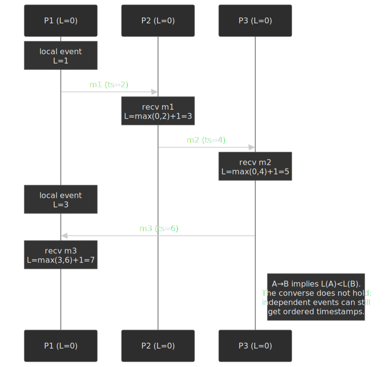
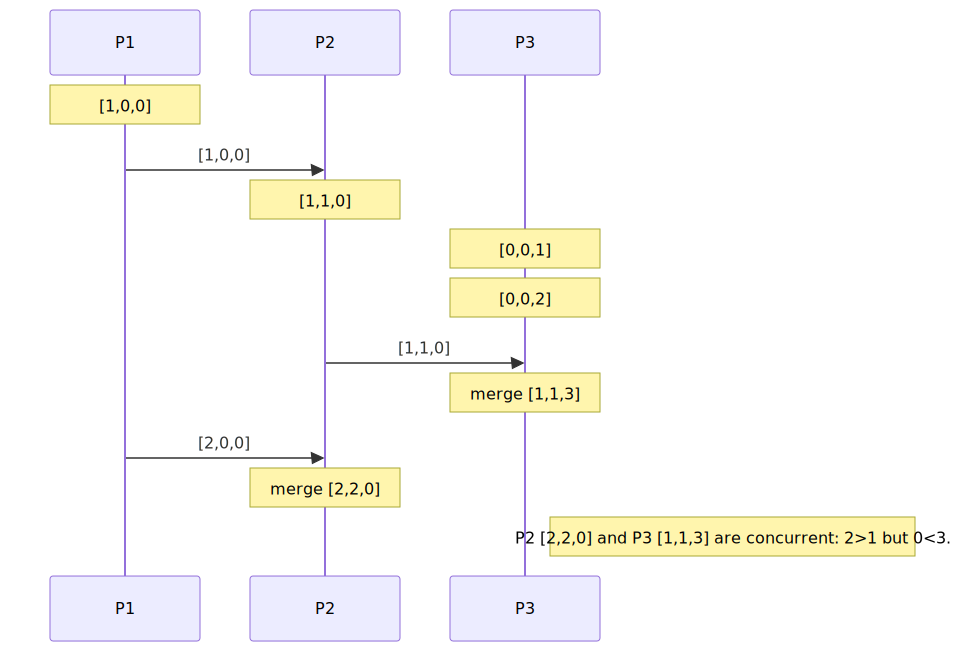
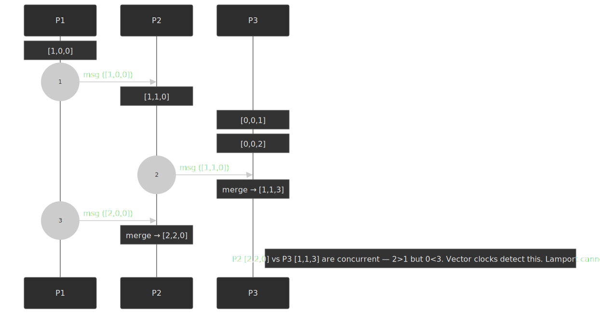
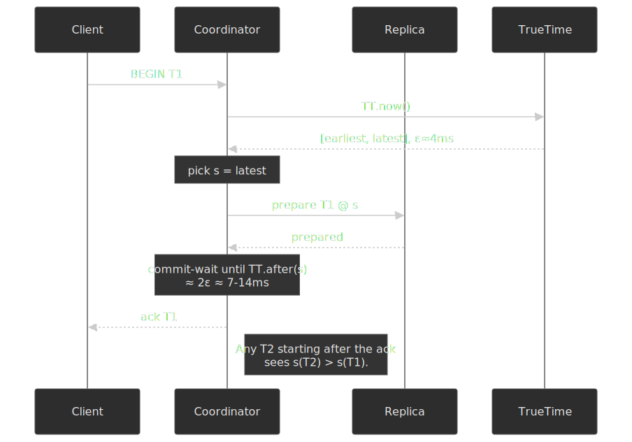

# Time and Ordering in Distributed Systems

Time in a distributed system is not what it seems. Physical clocks drift, message delays are unbounded and asymmetric, and no observer can stamp events with "true" time. Yet ordering events correctly is what lets a database commit a transaction, a chat client place a reply after a question, and a CRDT merge two writes without losing data. This article walks the design space — physical clocks, logical clocks, hybrid clocks, broadcast ordering primitives, and time-sortable ID schemes — and grounds each in production systems that paid for the choice.

 map onto three classes of ordering guarantee. Hybrid clocks reach total order only when uncertainty is explicitly bounded.")


## Mental model

Three families, three guarantees, three different bills.

- **Physical clocks** read wall time. They drift, they skew across machines, and they can roll backwards. With careful infrastructure ([TrueTime](https://www.usenix.org/system/files/conference/osdi12/osdi12-final-16.pdf), [PTP](https://standards.ieee.org/ieee/1588/6825/)) you can bound the uncertainty; with ordinary [NTP](https://datatracker.ietf.org/doc/html/rfc5905) you cannot.
- **Logical clocks** ignore wall time and capture only causality. [Lamport timestamps](https://lamport.azurewebsites.net/pubs/time-clocks.pdf) give a single counter per process that respects "happens-before"; vector clocks extend this to detect concurrent events at `O(n)` space.
- **Hybrid Logical Clocks** ([HLC](https://cse.buffalo.edu/tech-reports/2014-04.pdf)) glue a physical millisecond timestamp to a logical counter, staying close to wall time while keeping causality intact in `O(1)` space. This is the default for modern distributed databases.

| Approach      | Space / event | Detects concurrency | Wall-clock bound | Used in                          |
| ------------- | ------------- | ------------------- | ---------------- | -------------------------------- |
| Physical only | O(1)          | No                  | Yes (with NTP/PTP) | Single datacenter, monitoring  |
| Lamport       | O(1)          | No                  | No               | Totally ordered logs, broadcast  |
| Vector        | O(n)          | Yes                 | No               | Conflict detection, CRDTs        |
| HLC           | O(1)          | Partial             | Yes (bounded)    | Distributed databases (CockroachDB, YugabyteDB) |
| TrueTime      | O(1) interval | No                  | Yes (bounded ε)  | Spanner                          |

The choice depends on what you must detect. Lamport is enough for "before-or-after" within a single causal chain. Vector clocks are required when concurrent writes must be reconciled. HLC is the right default when you need timestamps that are both meaningful as wall time and safe under reordering. TrueTime — bounded physical time with explicit uncertainty — is the only option that gives external consistency without coordination, and only Google has the GPS-and-atomic-clock fleet to run it cheaply.

## Why distributed time is hard

### Physical clocks drift

Every clock drifts. Quartz oscillators in commodity servers commonly run at 10–100 ppm tolerance — meaning a clock can gain or lose **8.64 seconds per day per 100 ppm** (`100 × 10⁻⁶ × 86 400 s ≈ 8.64 s`). Even RFC 5905, the [NTPv4 specification](https://datatracker.ietf.org/doc/html/rfc5905#section-10), uses a 100 ppm frequency difference as its worked example for what unsynchronised clocks can do. NTP's own internal frequency-tolerance constant `PHI`, used to grow dispersion estimates between syncs, defaults to a far stricter [15 ppm](https://datatracker.ietf.org/doc/html/rfc5905#section-10).

Drift sources stack:

- **Manufacturing variance** sets the baseline.
- **Temperature** moves the resonant frequency of the crystal. Tuning-fork oscillators (the 32.768 kHz crystals in watches and low-power MCUs) follow a parabolic curve around their turnover temperature; AT-cut crystals (typical in CPUs and TCXOs) follow a cubic curve and are far better controlled. Either way, a 10 °C swing can shift effective frequency by several ppm.[^quartz]
- **Aging** drifts the resonant frequency over months and years.

Two machines whose clocks each drift 50 ppm in opposite directions diverge by ~8.6 s per day if left unsynchronised. NTP keeps them within milliseconds; PTP within microseconds; TrueTime within tens of microseconds.

[^quartz]: The 0.035 ppm/°C² figure cited in many tutorials applies to 32.768 kHz tuning-fork crystals around 25 °C. AT-cut MHz oscillators used in computers have a different (cubic) temperature curve; see [Vig, "Quartz Crystal Resonators and Oscillators"](https://apps.dtic.mil/sti/tr/pdf/ADA248503.pdf), §4.

### Network delays are unbounded and asymmetric

Even if clocks were perfect, comparing timestamps requires exchanging messages, and message delays vary unpredictably:

| Path                        | Typical RTT  |
| --------------------------- | ------------ |
| Same rack                   | 0.1–0.5 ms   |
| Same datacenter             | 0.5–2 ms     |
| Cross-region (same continent) | 30–80 ms   |
| Cross-continent             | 100–300 ms   |

Worse, the forward and reverse paths can differ. NTP's offset estimate `θ = ((T₂ − T₁) + (T₃ − T₄)) / 2` — see [RFC 5905 §8](https://datatracker.ietf.org/doc/html/rfc5905#section-8) — assumes the one-way delay is exactly half the round-trip. When BGP, congestion control, or switch-fabric load make the paths asymmetric, the offset estimate carries a systematic error equal to half the asymmetry.

### The happens-before relation

[Lamport (1978)](https://lamport.azurewebsites.net/pubs/time-clocks.pdf) defined the only ordering primitive that survives all of this. Event A **happens-before** event B (`A → B`) if any of the following holds:

1. A and B are on the same process and A precedes B in program order.
2. A is a message send and B is the corresponding receive.
3. There exists C with A → C and C → B (transitivity).

If neither A → B nor B → A holds, A and B are **concurrent** (`A ‖ B`). Concurrent here means *causally unrelated*, not "at the same wall-clock instant". Two events on different processes that never communicate are concurrent regardless of when their physical clocks said they happened.

> [!IMPORTANT]
> Happens-before is not a ranking — it is a partial order. Any algorithm that pretends it is total (e.g. by sorting events by physical timestamp and resolving ties arbitrarily) is silently inventing a causality that does not exist.

### Why naive wall-clock ordering fails

Consider three nodes whose clocks are skewed:

```text
Node A (clock fast by 50 ms): write(x=1) at T=1050
Node B (clock accurate):      write(x=2) at T=1000
Node C (clock slow by 30 ms): read(x)    at T=970
```

Sorted by wall-clock timestamp, the order looks like `C reads → B writes → A writes`. But if B's write actually happened first in real time and A read B's value before writing, the causal order is `B → A`, not `A → B`. Pick the wall-clock interpretation and a system using last-write-wins will silently overwrite A's update with B's older value.

The classic production failure mode is the opposite. Amazon's [Dynamo paper](https://www.allthingsdistributed.com/files/amazon-dynamo-sosp2007.pdf) describes shopping-cart writes that *survive* concurrent updates by union-merging conflicting versions tracked with vector clocks — but the merge sometimes "resurrects" an item the customer just deleted. The lesson is the same in both directions: physical timestamps are not a substitute for causality, and any "fix" that flattens causality into a single number leaks bugs into the application.

## Physical clock synchronisation

### NTP

[NTP version 4](https://datatracker.ietf.org/doc/html/rfc5905) is the default sync protocol on the public internet. The four-timestamp exchange:

1. Client sends request at `T₁` (client clock).
2. Server stamps receive at `T₂`, response at `T₃` (server clock).
3. Client stamps receive at `T₄` (client clock).
4. Round-trip delay `δ = (T₄ − T₁) − (T₃ − T₂)`.
5. Offset `θ = ((T₂ − T₁) + (T₃ − T₄)) / 2`.

NTP organises servers into a **stratum** hierarchy: stratum 0 is a reference clock (atomic, GPS), stratum 1 is directly connected to stratum 0, each subsequent hop adds uncertainty. Achievable accuracy depends on the path:

| Scenario                  | Typical accuracy | Bottleneck                    |
| ------------------------- | ---------------- | ----------------------------- |
| LAN, dedicated NTP server | 0.1–1 ms         | Network jitter, OS scheduling |
| Internet, stratum 2 peers | 10–50 ms         | Asymmetric routing            |
| Internet, public pool     | 50–100 ms        | Server load + path variance   |

> [!WARNING]
> NTP's accuracy assumes symmetric paths. If your traffic crosses an MPLS overlay where forward and reverse paths take different links, your clock can carry tens of milliseconds of systematic skew that no amount of NTP polling will remove.

### PTP

IEEE 1588 [Precision Time Protocol](https://standards.ieee.org/ieee/1588/6825/) achieves sub-microsecond accuracy by moving the timestamping work into the NIC and switch fabric instead of leaving it in software. Hardware timestamps eliminate OS-scheduling jitter; PTP-aware switches correct for in-network residence time. The cost is dedicated hardware and a clean LAN topology.

PTP is mandated where regulators require it: financial trading desks under [MiFID II RTS 25](https://www.esma.europa.eu/sites/default/files/library/2015/11/2015-esma-1464_-_final_report_-_draft_rts_and_its_on_mifid_ii_and_mifir.pdf) need millisecond UTC traceability for trade timestamps, and 5G fronthaul needs sub-microsecond phase alignment.

### TrueTime

Google's [TrueTime](https://www.usenix.org/system/files/conference/osdi12/osdi12-final-16.pdf) inverts the assumption underpinning NTP and PTP. Instead of pretending a clock returns a point, `TT.now()` returns an **interval** `[earliest, latest]` guaranteed to contain true time. Half the interval width is `ε` ("epsilon").

Implementation, per the Spanner paper:

- Each datacenter has multiple **time masters**, each with either a GPS receiver or an atomic clock (rubidium, later cesium).
- A **time slave daemon** on every machine polls multiple masters and reconciles them.
- Between polls, ε grows at a worst-case **drift rate of 200 µs/s** assumed by the daemon.

Numbers reported in [§3 of Spanner OSDI 2012](https://www.usenix.org/system/files/conference/osdi12/osdi12-final-16.pdf):

| Metric                     | Value                  |
| -------------------------- | ---------------------- |
| Typical ε (sawtooth, 30 s poll) | 1–7 ms             |
| Most-of-the-time ε         | ~4 ms                  |
| Worst-case drift           | 200 µs/s               |

> [!NOTE]
> TrueTime's design rationale is the inversion: bound the uncertainty and *expose* it. Spanner then uses commit-wait of `2ε` (typically ~8 ms with a 30 s poll interval; up to ~14 ms when ε peaks) so that any transaction starting after T₁ is acknowledged is guaranteed to see a higher timestamp than T₁ — without any coordination between them.

### Amazon Time Sync Service

AWS exposes a per-AZ NTP service at the link-local address [169.254.169.123](https://docs.aws.amazon.com/AWSEC2/latest/UserGuide/configure-ec2-ntp.html) (and `fd00:ec2::123` over IPv6) for every EC2 instance, backed by a satellite-disciplined reference fleet. Since November 2023, Nitro instances also expose a [Precision Hardware Clock](https://aws.amazon.com/blogs/compute/its-about-time-microsecond-accurate-clocks-on-amazon-ec2-instances/) over PTP, with low–double-digit microsecond accuracy and an open-source [`ClockBound`](https://github.com/aws/clock-bound) daemon that exposes the current uncertainty as an interval — effectively a TrueTime-shaped API for AWS.

### Picking a physical-time strategy

| Strategy                       | Accuracy           | Cost      | Best for                  |
| ------------------------------ | ------------------ | --------- | ------------------------- |
| Public NTP pools               | 50–100 ms          | Free      | Logging, monitoring       |
| Dedicated NTP infrastructure   | 1–10 ms            | Medium    | Most distributed systems  |
| Cloud-provider time service    | 0.1–1 ms (NTP) / µs (PTP, Nitro PHC) | Low | EC2-resident workloads |
| PTP with hardware timestamping | <1 µs              | High      | Trading, telecoms         |
| TrueTime / ClockBound          | µs with bounds     | Very high | Externally consistent DBs |

## Logical clocks

### Lamport timestamps

Lamport's logical clock turns the happens-before partial order into a total order over event timestamps. Every process maintains a counter `L`:

```text title="Lamport algorithm"
on local event:           L = L + 1
on send(m):               L = L + 1; attach L to m
on receive(m, ts=T):      L = max(L, T) + 1
```

 < L(B), but the converse does not hold.")


Properties:

- **Soundness:** if `A → B`, then `L(A) < L(B)`.
- **No converse:** `L(A) < L(B)` does *not* imply `A → B`. Concurrent events can land in any timestamp order.
- **Total order via tiebreak:** sort by `(L, processId)` to get a consistent global order — useful for state-machine replication and totally-ordered broadcast.

The trade is brutal but clean: you give up the ability to detect concurrency, and you keep `O(1)` overhead per event.

### Vector clocks

Vector clocks (independently introduced by [Fidge (1988)](https://www.cs.uoregon.edu/Reports/AREA-198801-Fidge.pdf) and [Mattern (1989)](https://www.vs.inf.ethz.ch/publ/papers/VirtTimeGlobStates.pdf)) capture the full causal history. Every process `i` keeps a vector `V[1..n]`:

```text title="Vector clock algorithm"
on local event:           V[i] = V[i] + 1
on send(m):               V[i] = V[i] + 1; attach V to m
on receive(m, U):         V[j] = max(V[j], U[j]) for all j; V[i] = V[i] + 1
```

Comparisons:

- `V(A) < V(B)` iff `V(A)[i] ≤ V(B)[i]` for all `i` and `V(A) ≠ V(B)` — A causally precedes B.
- `V(A) ‖ V(B)` iff neither `V(A) < V(B)` nor `V(B) < V(A)` — concurrent.




The cost is the obvious one: each timestamp is `O(n)` where `n` is the number of participating processes. With ten replicas this is invisible. With ten thousand clients writing directly into a Dynamo-style replica set, each timestamp is tens of kilobytes — and that quickly outweighs the actual payload.

### Vector-clock variants

Production systems tame the size with one of several optimisations:

- **Version vectors** track only write events instead of every internal step. Reduces churn for read-heavy workloads.
- **Dotted version vectors** ([Preguiça et al., 2010](https://arxiv.org/abs/1011.5808)) attach a `(node, counter)` "dot" to each value so a single replica can carry sibling values without an entry per writer. Used by [Riak](https://docs.riak.com/riak/kv/latest/learn/concepts/causal-context.1.html).
- **Interval tree clocks** ([Almeida et al., 2008](https://gsd.di.uminho.pt/members/cbm/ps/itc2008.pdf)) let nodes fork and join their identity, so vector size grows with actual concurrency rather than potential participants.
- **Bounded vector clocks** prune entries for nodes not seen recently. The trade-off is false-positive concurrency: pruned entries can mark previously ordered events as concurrent.

### When vector clocks are worth the cost

| Scenario                  | Use vector clocks? | Rationale                              |
| ------------------------- | ------------------ | -------------------------------------- |
| Multi-master replication  | Yes                | Concurrent writes must be detected     |
| CRDT-based storage        | Yes                | Merge semantics depend on causality    |
| Single-leader replication | No                 | The leader serialises all writes       |
| Event sourcing            | No                 | A monotonic global sequence suffices   |
| Distributed cache         | No                 | Last-write-wins is acceptable          |

## Hybrid Logical Clocks

### The HLC design

[Kulkarni et al. (2014)](https://cse.buffalo.edu/tech-reports/2014-04.pdf) proposed Hybrid Logical Clocks to combine the wall-clock interpretability of physical time with the causality guarantees of Lamport clocks. Each timestamp is a pair `(l, c)`:

- `l` — physical time component, monotonic and bounded to within ε of wall-clock time.
- `c` — logical counter that breaks ties when the physical component would not change.

```text title="HLC algorithm — Kulkarni et al. (2014), Figure 5"
on local event or send:
  l_old = l
  l = max(l_old, pt.now())
  if l == l_old: c = c + 1
  else:          c = 0
  return (l, c)

on receive (l_m, c_m):
  l_old = l
  l = max(l_old, l_m, pt.now())
  if   l == l_old == l_m: c = max(c, c_m) + 1
  elif l == l_old:        c = c + 1
  elif l == l_m:          c = c_m + 1
  else:                   c = 0
  return (l, c)
```

Properties (Theorem 2 in the original paper):

1. **Monotonic.** HLC timestamps only increase.
2. **Bounded drift.** `l − pt.now() ≤ ε`, where ε is the maximum clock skew observed across the cluster.
3. **Causality.** If `A → B`, then `HLC(A) < HLC(B)` lexicographically.
4. **Constant space.** Two integers per timestamp regardless of cluster size.

### HLC vs alternatives

| Property                 | Lamport | Vector | HLC          |
| ------------------------ | ------- | ------ | ------------ |
| Detects concurrency      | No      | Yes    | Partial[^hlc] |
| Wall-clock approximation | No      | No     | Yes (bounded) |
| Space per timestamp      | O(1)    | O(n)   | O(1)         |
| Comparison complexity    | O(1)    | O(n)   | O(1)         |
| Usable as a primary key  | Awkward | No     | Yes          |

[^hlc]: HLC can detect concurrency only when two events' physical components differ by more than the maximum clock skew. Within ε of each other, concurrent events become totally ordered by their logical counters and look causally related — this is the guarantee CockroachDB's read uncertainty interval pays for.

The design rationale is pragmatic: give up perfect concurrency detection, and in return get timestamps that are meaningful to humans, fit in 64 + 32 bits, sort lexicographically, and survive a leader change without coordination.

### HLC in production: CockroachDB

[CockroachDB](https://www.cockroachlabs.com/docs/stable/architecture/transaction-layer) tags every transaction with an HLC timestamp at start and uses it for both MVCC visibility and transaction ordering.

- **Default maximum clock offset:** [500 ms](https://www.cockroachlabs.com/blog/clock-management-cockroachdb/). A node that observes more than `0.8 × max_offset` divergence from a majority of its peers shuts itself down — Cockroach prefers unavailability over silent corruption.
- **Read uncertainty interval:** when a read at timestamp `ts` finds a value at timestamp `v` such that `ts < v ≤ ts + max_offset`, the value might have been written before the reader started but with a faster clock. The transaction restarts (refreshes) with a higher timestamp and retries, narrowing the window.
- **Encoding:** an HLC value is a `(walltime_ns, logical)` pair — 64 bits of nanoseconds since the Unix epoch plus a 32-bit logical counter — compared lexicographically.
- **Persistence:** Cockroach persists the local HLC before acknowledging any write, so a restart cannot regress timestamps and break monotonicity.

CockroachDB's blog post [Living Without Atomic Clocks](https://www.cockroachlabs.com/blog/living-without-atomic-clocks/) explains the trade against Spanner directly: CockroachDB targets serializability rather than Spanner's external consistency, accepting more transaction restarts in exchange for running on commodity NTP-disciplined clocks instead of GPS receivers and atomic clocks.

## Ordering guarantees and broadcast protocols

When multiple nodes need to deliver the same set of messages, the spec is a **broadcast primitive** with a specific ordering guarantee.




### Total order broadcast

All correct nodes deliver all messages in the same order.

- **Validity.** If a correct process broadcasts `m`, all correct processes eventually deliver `m`.
- **Agreement.** If a correct process delivers `m`, all correct processes eventually deliver `m`.
- **Total order.** If processes `p` and `q` both deliver `m₁` and `m₂`, they deliver them in the same order.

Total order broadcast is equivalent to consensus ([Chandra & Toueg, 1996](https://www.cs.cornell.edu/home/sam/ftp/realfaults.ps.gz)). Implementations:

| Approach                              | Pro                       | Con                                |
| ------------------------------------- | ------------------------- | ---------------------------------- |
| Sequencer (single ordering node)      | Fast in the happy path    | Single point of failure / bottleneck |
| Lamport timestamps + tiebreak         | No leader, no SPOF        | Requires all-to-all communication  |
| Consensus per message (Paxos/Raft)    | Fault tolerant            | Latency cost of consensus rounds   |

### Causal broadcast

Weaker than total order: only causally related messages must be delivered in order.

- If `send(m₁) → send(m₂)`, then every node delivers `m₁` before `m₂`.
- Concurrent messages may be delivered in any order on different nodes.

The classic implementation attaches a vector clock to each message and holds delivery until all causally preceding messages have been delivered. This is the right primitive for collaborative editing, social-graph fanout, and chat — readers care that replies follow the message they reply to, not that everyone sees the same order.

### FIFO broadcast

Weakest of the three useful guarantees: only orders messages from the same sender.

- If process `p` sends `m₁` then `m₂`, every node delivers `m₁` before `m₂`.
- No ordering across senders.

Trivially implemented with per-sender sequence numbers. Sufficient for change-data-capture from a single source, log shipping from one writer, and most stream-processing pipelines that work on a single partition at a time.

## Time-sortable IDs

Most systems also need to mint identifiers that double as a sort key. The choice of ID scheme is downstream of the same physical-vs-logical-clock trade-off.

### UUID v1 (time-based)

60-bit timestamp + 14-bit clock sequence + 48-bit node ID.

- ✅ Globally unique without coordination.
- ✅ Embeds creation time.
- ❌ Timestamp bits are not in the most-significant position, so sorted insertion into a B-tree scatters writes across the index.
- ❌ Leaks the generator's MAC address (privacy issue).

### UUID v4 (random)

122 random bits + 6 version/variant bits.

- ✅ Trivially unique and uncoordinated.
- ✅ Carries no information.
- ❌ No temporal sort; B-tree inserts land at random positions, hurting cache locality.

### UUID v7 (time-ordered)

[RFC 9562 §5.7](https://datatracker.ietf.org/doc/html/rfc9562#name-uuid-version-7), published in 2024, defines a time-sortable UUID:

| Field        | Bits | Notes                                          |
| ------------ | ---- | ---------------------------------------------- |
| `unix_ts_ms` | 48   | Unix epoch milliseconds, big-endian            |
| `ver`        | 4    | Version field, value `0b0111`                  |
| `rand_a`     | 12   | Random bits or sub-ms monotonic counter        |
| `var`        | 2    | Variant field, value `0b10`                    |
| `rand_b`     | 62   | Random bits (or extended monotonic counter)    |

- ✅ Lexicographically sortable by creation time.
- ✅ Standard-format, no coordination.
- ❌ Millisecond precision; concurrent IDs from one generator must use the optional sub-ms counter to remain strictly monotonic.

### Snowflake

Twitter's [Snowflake](https://blog.x.com/engineering/en_us/a/2010/announcing-snowflake) (2010) packs a 64-bit ID:

| Field      | Bits | Notes                                 |
| ---------- | ---- | ------------------------------------- |
| Sign       | 1    | Always 0 (positive `int64`)           |
| Timestamp  | 41   | Milliseconds since a custom epoch     |
| Machine ID | 10   | 1024 generators                       |
| Sequence   | 12   | Per-millisecond counter, 4096/ms/node |

That's ~4 million IDs/s/machine and ~4 billion IDs/s across the full 1024-machine fleet. K-sortable, compact, fits in a `bigint`.

Variants tweak the bit budget for different scales:

- **Discord** uses [42 + 5 + 5 + 12](https://discord.com/developers/docs/reference#snowflakes) — 42 bits of ms timestamp since the [Discord epoch](https://discord.com/developers/docs/reference#snowflakes) of 2015-01-01, 5 bits of internal worker ID, 5 bits of internal process ID, 12 bits of increment. The longer timestamp buys more decades before the epoch wraps.
- **Instagram**'s scheme attributes ([2014 engineering blog](https://instagram-engineering.com/sharding-ids-at-instagram-1cf5a71e5a5c)): 41-bit timestamp + 13-bit shard ID + 10-bit sequence, generated inside Postgres via stored procedures so the shard ID is the row's home shard.
- **ULID** uses 48-bit ms timestamp + 80-bit randomness, with a Crockford-base32 textual form that sorts lexicographically.

### ID-scheme decision matrix

| Primary need                     | Pick                | Rationale                              |
| -------------------------------- | ------------------- | -------------------------------------- |
| Time-sortable, standard format   | UUIDv7              | RFC 9562, lexicographic sort           |
| Compact + high throughput        | Snowflake variant   | 64 bits, millions of IDs/s/node        |
| No coordination, opaque IDs      | UUIDv4 or ULID      | No machine ID required                 |
| Database primary key             | UUIDv7 or Snowflake | Good index locality, monotonic-ish     |
| Cryptographic randomness         | UUIDv4              | Maximum entropy; never use for crypto identifiers if you can avoid it |

> [!CAUTION]
> Snowflake-style schemes assume the system clock never goes backwards. NTP step adjustments, leap second smearing, VM live-migration, and system-clock resets (`hwclock -s`) all violate that assumption. Production generators must monitor `system_clock.now()` against the last issued ID and either spin-wait, switch to a logical-only fallback, or refuse to issue IDs.

## Real-world implementations

### Spanner: TrueTime for external consistency

**Problem.** Globally distributed transactions that appear to execute in commit order, even across continents, with no central serialiser.

**Approach.** Bound clock uncertainty with TrueTime, then use **commit-wait**: after assigning a transaction `T₁` a commit timestamp `s = TT.now().latest`, the coordinator blocks until `TT.after(s)` returns true (≈ `2ε`, typically a single-digit number of milliseconds) before acknowledging the client.

 > s(T1) without any T1↔T2 messaging.")


This buys [external consistency](https://research.google.com/pubs/archive/45855.pdf): if `T₁` commits before `T₂` starts (in real time, anywhere on the planet), `T₂` sees `T₁`'s effects. Read-only transactions then serve at any past timestamp from any replica without coordination.

The price is the commit-wait — typically single-digit milliseconds, up to ~14 ms when ε peaks. For workloads dominated by writes, this is significant; for the read-mostly workloads Spanner targets (advertising, knowledge graphs), it is paid once per write and amortised across many reads.

### CockroachDB: HLC without atomic clocks

**Problem.** Spanner-style consistency on commodity hardware with NTP-disciplined clocks.

**Approach.** HLC for timestamps + read refresh on uncertainty + hard upper bound on tolerated clock skew (default 500 ms).

When a read encounters a value whose timestamp falls inside the read's uncertainty interval `[ts, ts + max_offset]`, the transaction does not assume causality — it bumps its timestamp past the encountered value and retries. Too many refreshes and the transaction aborts and restarts at a fresh timestamp.

CockroachDB delivers serializable isolation rather than Spanner's external consistency, but it does so on hardware your operations team already runs. The [Jepsen analysis from 2017](https://jepsen.io/analyses/cockroachdb-beta-20160829) formalises this trade.

### Discord: Snowflake IDs as the ordering substrate

**Problem.** Allocate unique, time-sortable message IDs at hundreds of thousands of messages per second, with the database storing them as the partition key for a per-channel timeline.

**Approach.** A modified Snowflake (42 + 5 + 5 + 12 with a 2015 epoch). Because IDs are time-sortable, "messages before / after ID X" pagination is a simple range query, and the storage layer ([originally Cassandra](https://discord.com/blog/how-discord-stores-billions-of-messages), [now ScyllaDB](https://discord.com/blog/how-discord-stores-trillions-of-messages)) can shard timelines by channel and bucket by time without consulting a coordination service.

Why not UUIDv7? At Discord's design time (2015), UUIDv7 did not exist. Today it would be a defensible choice — but it is twice the storage and (without the optional monotonic counter) carries strictly less ordering information than a Snowflake with a per-process sequence.

### DynamoDB: from vector clocks to single-leader-per-partition

The original [Dynamo paper](https://www.allthingsdistributed.com/files/amazon-dynamo-sosp2007.pdf) used vector clocks to detect concurrent writes in a multi-master, eventually-consistent ring. The famous failure mode was the **resurrected shopping-cart item**: a union-merge of two concurrent versions reinstates an item one version had deleted.

The current [DynamoDB service](https://www.amazon.science/publications/amazon-dynamodb-a-scalable-predictably-performant-and-fully-managed-nosql-database-service) (the USENIX ATC 2022 paper) is a different design: each partition has a Multi-Paxos replication group with a single leader that serialises writes; conflict resolution moved from vector-clock reconciliation into application-level conditional writes. The lesson is structural: vector clocks scale with the number of concurrent writers, and once writers can be funnelled through a per-partition leader, the cost no longer pays its way.

## Common pitfalls

### Trusting physical timestamps for ordering

**The mistake.** Using `System.currentTimeMillis()` (or any local clock read) to order events across nodes.

**Why it happens.** It works perfectly on one machine and seems to work in test, where clock skew is small.

**The consequence.** In production, two writes can arrive at different nodes whose clocks disagree by tens of milliseconds. Last-write-wins picks the wrong winner. Audit logs are ordered incorrectly. Distributed counters under-count.

**The fix.** Use logical or hybrid clocks for ordering. Reserve physical time for *display* (so users see "2 minutes ago") and TTL/expiry (where small skew is harmless).

### Assuming NTP is "good enough"

**The mistake.** Relying on NTP for sub-millisecond ordering.

**Why it happens.** NTP nominally targets millisecond accuracy, and `chronyc tracking` usually reports a small offset.

**The consequence.** Asymmetric routing introduces systematic skew that no NTP poll will detect. Cross-region NTP can drift 50–100 ms. A single bad upstream stratum 1 server can step the clock backwards.

**The fix.** For ordering, use logical clocks. For bounded physical time, use PTP, AWS Time Sync (PHC), or a TrueTime-equivalent — and if the answer matters, expose the uncertainty (use `ClockBound` or its equivalent) rather than pretending it is zero.

### Ignoring clock rollback

**The mistake.** Assuming `System.currentTimeMillis()` is monotonic.

**Why it happens.** Almost always true. The exceptions are rare and easy to overlook.

**The consequence.** VM live-migration between hosts, NTP step adjustment, leap-second smearing, and system-clock resets can roll the wall clock backwards. Snowflake-style ID generators then mint duplicate IDs. HLC implementations lose monotonicity if not persisted. Distributed lock leases expire early or late.

**The fix.**

- Use the platform's monotonic clock (`CLOCK_MONOTONIC` on Linux, `System.nanoTime()` in Java, `process.hrtime()` in Node.js) for *durations*.
- Use the wall clock only for human display and durable timestamps, and never compare wall-clock readings across machines.
- Detect rollback in ID generators and either spin-wait or switch to a fallback strategy.

### Vector-clock space explosion

**The mistake.** Using vector clocks across thousands of writers.

**Why it happens.** Vector clocks elegantly solve causality and are easy to implement on a small example.

**The consequence.** Each timestamp grows linearly with the number of distinct writers. With 10 000 clients, a single timestamp is tens of kilobytes — orders of magnitude larger than the value it annotates.

**The fix.**

- Limit vector-clock participants to *replicas*, not clients.
- Drop to HLC if full concurrency detection is not actually required.
- Use [dotted version vectors](https://docs.riak.com/riak/kv/latest/learn/concepts/causal-context.1.html) or [interval tree clocks](https://gsd.di.uminho.pt/members/cbm/ps/itc2008.pdf) for dynamic node sets.

### Conflating causality with ordering

**The mistake.** Reading "happens-before" as "happened before in real time".

**Why it happens.** The name is misleading. Lamport timestamps define a partial order over events that did communicate; events that did not communicate are concurrent regardless of which physical instant you assign them.

**The consequence.** Treating concurrent events as ordered leads to incorrect conflict resolution and silently wrong derived state.

**The fix.** Internalise the implication direction: `L(A) < L(B)` is necessary but not sufficient for `A → B`. If you need to *detect* concurrency, you need vector clocks, version vectors, or HLC with an explicit uncertainty window.

## How to choose

### 1. Identify the ordering requirement

- Do you need a global total order, or just causal order?
- What is the cost of incorrect ordering? Data loss, audit failure, user confusion?
- Do you need to *detect* concurrent events for conflict resolution?
- Is wall-clock approximation needed for display, TTL, or external billing?

### 2. Map the requirement to a primitive

| If you need…                         | Pick                                  |
| ------------------------------------ | ------------------------------------- |
| Causal ordering only                 | Lamport timestamps                    |
| Conflict detection (multi-master)    | Vector clocks or a CRDT               |
| Sortable IDs with time approximation | UUIDv7 or Snowflake variant           |
| Database transaction timestamps      | HLC                                   |
| External consistency                 | Consensus + commit-wait (TrueTime / ClockBound) |

### 3. Account for scale

| Scale                        | Recommendation                              |
| ---------------------------- | ------------------------------------------- |
| < 10 nodes in consensus group | Vector clocks remain manageable             |
| 10–1000 nodes                | HLC; avoid per-node vectors                 |
| > 1000 nodes                 | HLC with a hard maximum-skew bound          |
| Single leader                | A monotonic sequence number is enough       |
| Multi-region                 | Build skew bounds that include 100 ms+ RTT  |

### 4. Pick the ID scheme last

| Primary need          | Pick                       |
| --------------------- | -------------------------- |
| Database primary keys | UUIDv7 or Snowflake        |
| Distributed tracing   | UUIDv4 (randomness)        |
| User-visible IDs      | Snowflake variant (compact)|
| Maximum throughput    | Snowflake                  |
| No machine-ID coordination | UUIDv7                |

## Practical takeaways

- There is no global clock. Stop reaching for one.
- Causality is a *partial* order. Algorithms that flatten it into a single number are silently inventing structure.
- HLC is the right default for distributed-database timestamps: monotonic, wall-clock-bounded, and fits in 96 bits.
- TrueTime / ClockBound is the only practical path to external consistency without coordination — and only because someone else (Google, AWS) runs the GPS-and-atomic-clock fleet for you.
- Vector clocks scale with the number of concurrent writers, not the size of the cluster. Keep that number small.
- Snowflake-style IDs give you sortable identifiers at the cost of trusting your wall clock — handle clock rollback explicitly or accept duplicate IDs.
- The cheapest correct ordering primitive is the weakest one your application can tolerate.

## Appendix

### Prerequisites

- Distributed-systems vocabulary: nodes, messages, network partitions.
- Familiarity with database isolation levels and consistency models.
- A working knowledge of B-tree index locality (relevant to the ID-scheme discussion).

### Terminology

- **Clock drift.** Rate at which a clock gains or loses time relative to a reference, measured in ppm.
- **Clock skew.** Instantaneous difference between two clocks.
- **Happens-before (`→`).** Causal-ordering relation defined by Lamport.
- **Concurrent (`‖`).** Two events with no causal relationship.
- **Linearizability.** Operations appear atomic and consistent with real-time order.
- **External consistency.** If `T₁` commits before `T₂` starts (real time), `T₁`'s timestamp is less than `T₂`'s.
- **Monotonic.** Strictly non-decreasing.

### References

#### Foundational papers

- Lamport, "[Time, Clocks, and the Ordering of Events in a Distributed System](https://lamport.azurewebsites.net/pubs/time-clocks.pdf)" (1978). Defines happens-before, introduces logical clocks.
- Fidge, "[Timestamps in Message-Passing Systems That Preserve the Partial Ordering](https://www.cs.uoregon.edu/Reports/AREA-198801-Fidge.pdf)" (1988). Vector clocks.
- Mattern, "[Virtual Time and Global States of Distributed Systems](https://www.vs.inf.ethz.ch/publ/papers/VirtTimeGlobStates.pdf)" (1989). Independent derivation of vector clocks.
- Kulkarni, Demirbas, Madappa, Avva, Leone, "[Logical Physical Clocks and Consistent Snapshots in Globally Distributed Databases](https://cse.buffalo.edu/tech-reports/2014-04.pdf)" (2014). Hybrid Logical Clocks.

#### System papers

- Corbett et al., "[Spanner: Google's Globally-Distributed Database](https://www.usenix.org/system/files/conference/osdi12/osdi12-final-16.pdf)" (OSDI 2012). TrueTime and external consistency.
- Brewer, "[Spanner, TrueTime & The CAP Theorem](https://research.google.com/pubs/archive/45855.pdf)" (Google, 2017).
- DeCandia et al., "[Dynamo: Amazon's Highly Available Key-value Store](https://www.allthingsdistributed.com/files/amazon-dynamo-sosp2007.pdf)" (SOSP 2007). Vector clocks in production.
- Elhemali et al., "[Amazon DynamoDB: A Scalable, Predictably Performant, and Fully Managed NoSQL Database Service](https://www.amazon.science/publications/amazon-dynamodb-a-scalable-predictably-performant-and-fully-managed-nosql-database-service)" (USENIX ATC 2022). The current DynamoDB internals.
- Taft et al., "[CockroachDB: The Resilient Geo-Distributed SQL Database](https://www.cockroachlabs.com/guides/cockroachdb-the-resilient-geo-distributed-sql-database/)" (SIGMOD 2020).

#### Specifications

- [RFC 5905](https://datatracker.ietf.org/doc/html/rfc5905) — Network Time Protocol Version 4.
- [RFC 9562](https://datatracker.ietf.org/doc/html/rfc9562) — UUID, including v6/v7/v8.
- [IEEE 1588](https://standards.ieee.org/ieee/1588/6825/) — Precision Time Protocol.

#### Engineering blog posts

- Twitter Engineering, "[Announcing Snowflake](https://blog.x.com/engineering/en_us/a/2010/announcing-snowflake)" (2010).
- Discord Engineering, "[How Discord Stores Billions of Messages](https://discord.com/blog/how-discord-stores-billions-of-messages)" (2017).
- Discord Engineering, "[How Discord Stores Trillions of Messages](https://discord.com/blog/how-discord-stores-trillions-of-messages)" (2023).
- Cockroach Labs, "[Living Without Atomic Clocks](https://www.cockroachlabs.com/blog/living-without-atomic-clocks/)" (2016).
- Cockroach Labs, "[Clock Management in CockroachDB](https://www.cockroachlabs.com/blog/clock-management-cockroachdb/)" (2021).
- AWS Compute Blog, "[It's About Time: Microsecond-Accurate Clocks on Amazon EC2](https://aws.amazon.com/blogs/compute/its-about-time-microsecond-accurate-clocks-on-amazon-ec2-instances/)" (2023).
- Instagram Engineering, "[Sharding & IDs at Instagram](https://instagram-engineering.com/sharding-ids-at-instagram-1cf5a71e5a5c)" (2014).

#### Books

- Kleppmann, *Designing Data-Intensive Applications* (2017). Chapter 8 covers distributed time and consistency.
