# Trees and Graphs: Traversals and Applications

Trees and graphs are the connective tissue of working systems — file systems and B-tree indexes, build DAGs and package managers, schedulers and routers, virtual DOMs and union-find connectivity. This article is the senior-engineer mental model: which tree variant fits which workload, when adjacency lists beat matrices, why three colours are needed for directed cycle detection, what Kahn's algorithm actually does in a build pipeline, when Dijkstra silently lies (negative weights), and why path-compressed union-find behaves like O(1) in practice. Each section pairs the mechanism with a diagram, a complexity row, and the production system that depends on it.


## Mental model

Trees and graphs share a node-and-edge substrate. The distinction is structural: trees enforce a single parent and forbid cycles; graphs allow arbitrary connections, including cycles and multi-edges. Once you internalise that, the rest is engineering trade-offs:

- **Tree variant = access-pattern fit.** AVL trades insert/delete cost for tighter height (search-heavy). Red-black trees trade height for rotation budget (write-heavy and the default in standard libraries). B/B+ trees raise fanout so the working set fits fewer disk or SSD pages (databases, file systems). Tries amortise per-character work across shared prefixes (autocomplete, IP routing).
- **Graph representation = density bet.** Adjacency matrices give O(1) edge lookup but always cost O(V²) space — only worth it on dense graphs. Adjacency lists cost O(V + E) and dominate everywhere else, which means almost everything real (social networks, road maps, dependency graphs).
- **Traversal = question shape.** DFS uses a stack and probes deep first — natural for cycle detection, topological order, and any "explore one branch fully" problem. BFS uses a queue and explores level by level — the only traversal that finds shortest paths in unweighted graphs in linear time.
- **Union-Find = connectivity oracle.** Path compression plus union-by-rank pushes the amortised cost per operation to O(α(n)), where α is the inverse Ackermann function — at most 4 for any input the universe can hold[^tarjan75].

## Tree variants

### Binary search tree (BST)

A BST holds the in-order invariant `left subtree < node < right subtree`. Search, insert, and delete are O(h) where `h` is the height. The catch: the height isn't bounded unless something keeps it bounded.

```ts title="bst-degenerate.ts" collapse={1-3}
interface BSTNode<T> {
  value: T
  left: BSTNode<T> | null
  right: BSTNode<T> | null
}

// Sorted insertions degenerate the tree to a linked list:
// insert(1), insert(2), insert(3), insert(4)
//   1 -> 2 -> 3 -> 4   (height = n, all ops O(n))
//
// The fix is a balancing invariant: AVL, Red-Black, B-tree, treap, ...
```

> [!WARNING]
> A "plain" BST is a teaching artefact, not a production data structure. Sorted-input degeneration is the most common interview-grade footgun. Reach for a self-balancing variant or a hash map by default; only hand-roll a BST when you control the key distribution.

 or red-black (write-heavy / mixed).")

### AVL trees: strict balance for search-heavy workloads

AVL trees, named after Adelson-Velsky and Landis (1962), were the first self-balancing BSTs[^avl-paper]. Every node's balance factor — the height difference between left and right subtrees — must stay in `{-1, 0, +1}`. Insert or delete may break this; the tree restores it with a single or double rotation along the path back to the root.

- **What you get:** the tightest height bound of the common balanced trees (`h ≤ 1.44 · log₂(n+2)`)[^wiki-avl]. Lookups visit fewer nodes than a comparable red-black tree.
- **What you pay:** more rotations per modification (potentially log n on the path back to the root) — a cost that matters under heavy mutation.
- **When to reach for it:** search-dominated workloads where you can amortise the rotation cost — read-mostly indexes, lookup-heavy in-memory dictionaries.

### Red-black trees: looser balance for write-heavy workloads

Red-black trees come from Guibas and Sedgewick's 1978 paper "A Dichromatic Framework for Balanced Trees"[^rb-paper]. The invariants are colour-based, not height-based:

1. Every node is red or black.
2. The root is black.
3. NIL leaves are black.
4. A red node's children are both black (no two reds in a row).
5. Every root-to-leaf path crosses the same number of black nodes ("black-height").

Together these bound the height at `2 · log₂(n+1)` — looser than AVL — but in exchange every insert needs at most 2 rotations and every delete at most 3, making modifications cheaper on average[^wiki-rb].

- **Production footprint:** Java's `TreeMap` and `TreeSet`, the GCC and LLVM standard libraries' `std::map` / `std::set`, and the Linux kernel's red-black tree (`include/linux/rbtree.h`) used by the Completely Fair Scheduler — and now the EEVDF scheduler since Linux 6.6 — to keep the runqueue ordered by virtual deadline[^cfs-doc][^eevdf-vt].
- **Why the kernel chose RB over a heap:** the scheduler needs O(log n) insert and remove plus O(1) "leftmost" lookup (the next task). A red-black tree gives both with a contiguous parent/child layout that doesn't need the heap's sift-down on arbitrary removal[^cfs-doc].

### AVL vs red-black: the trade-off

| Aspect        | AVL                              | Red-Black                                |
| ------------- | -------------------------------- | ---------------------------------------- |
| Balance       | Strict (height diff ≤ 1)         | Loose (height ≤ 2 × optimal)             |
| Search        | Slightly faster (shorter height) | Slightly slower                          |
| Insert/Delete | Up to log n rotations            | ≤ 2 (insert) / ≤ 3 (delete) rotations    |
| Use case      | Read-dominant                    | Write-dominant or mixed (the std-lib default) |

> [!TIP]
> If you're not sure, pick red-black. Standard libraries shipped that decision because the rotation budget matters more for typical workloads than the constant-factor lookup difference.

### B-trees and B+ trees: page-aware indexes

Binary trees are wrong for storage that fetches in pages. A modern HDD pays roughly 4–10 ms per random seek; a NVMe SSD pays 20–80 µs[^melbicom-storage]. Either way the cost per node access dwarfs the comparison cost, so the engineering goal is to **make each fetched page do as much work as possible**. That means raising the fanout.

A B-tree of order `m`[^wiki-btree]:

- Every node holds up to `m − 1` keys and `m` children.
- Every non-root node holds at least `⌈m/2⌉ − 1` keys.
- All leaves sit at the same depth (perfectly balanced).

Sized so a node fits one page (4–16 KB), a B-tree with millions of keys is typically 3–4 levels deep, so a point lookup costs 3–4 page fetches.

A **B+ tree** is the variant most production databases ship[^pg-nbtree][^mysql-innodb]:

- Internal nodes store only routing keys.
- All values live in the leaf level.
- Leaves are linked into a doubly-linked list for cheap range scans.


Production footprint:

- **PostgreSQL** uses Lehman & Yao's high-concurrency B+ tree variant, which adds a right-link per page so readers traverse without blocking on splits[^pg-nbtree].
- **MySQL InnoDB** stores every table as a clustered B+ tree on the primary key; secondary indexes are separate B+ trees whose leaves hold the primary-key value rather than a row pointer[^mysql-innodb].
- **SQLite** uses a B-tree for index pages and a B+ tree for table pages[^sqlite-btree].
- **File systems**: NTFS, HFS+, Btrfs, and XFS use B/B+ trees for directories and on-disk indexes; ext4 uses an HTree (a hashed B-tree variant with fixed depth 1–2) for directory indexing[^ext4-htree].

```ts title="btree-shape.ts" collapse={1-2}
interface BTreeNode<K, V> {
  keys: K[]                  // up to m - 1
  children: BTreeNode<K, V>[] // up to m
  isLeaf: boolean
}

// Order-4 node holding keys [10, 20, 30] partitions the key space:
//   (-inf, 10)  [10, 20)  [20, 30)  [30, +inf)
//      child 0    child 1    child 2    child 3
//
// 1M keys, order 100 (~100 keys per page) -> height ≤ 3 -> at most
// 3 page fetches per point lookup, regardless of where the key sits.
```

### Tries: prefix-shared search

Tries (aka prefix trees) replace per-key comparison with per-character descent. Each edge represents one character; a marked node means "a stored string ends here". Lookup, insert, and delete are O(L) where L is the key length — independent of how many strings are stored.

- **What they buy:** prefix queries that hash maps cannot answer (autocomplete, "all keys starting with `pre`"), and longest-prefix matching for routing tables.
- **What they cost:** more memory than a hash table — every distinct character on the path needs a node or edge unless you compress.
- **The compressed variants matter in practice:**
  - **Radix / Patricia tries** collapse single-child chains into a single edge labelled with multiple characters[^radix-wiki].
  - **LC-tries** add level compression on top, expanding dense subtries into a single node with a `2^k`-entry vector. The Linux IPv4 routing table (`fib_trie`) has used an LC-trie for longest-prefix-match lookups since kernel 2.6.39[^fib-trie].

Application footprint: autocomplete, spell checking, IP routing (LC-trie / Patricia), genomic suffix structures.

## Graph representations

, wins on sparse graphs) while an adjacency matrix reserves a cell per vertex pair (O(V²), wins only on dense graphs and Floyd-Warshall-style algorithms).")

### Adjacency matrix

A V × V matrix where `matrix[i][j]` carries the edge weight (or 0/1 for unweighted). Edges are O(1) to look up but space is O(V²) regardless of how many edges exist.

```ts title="adjacency-matrix.ts" collapse={1-2}
class GraphMatrix {
  private matrix: number[][]

  constructor(vertices: number) {
    this.matrix = Array.from({ length: vertices }, () => Array(vertices).fill(0))
  }

  addEdge(u: number, v: number, weight = 1): void {
    this.matrix[u][v] = weight
    // For undirected: this.matrix[v][u] = weight
  }

  hasEdge(u: number, v: number): boolean {
    return this.matrix[u][v] !== 0 // O(1)
  }
}
```

When it wins: dense graphs (E ≈ V²), heavy edge-existence queries, small graphs where V² is acceptable, and algorithms that benefit from cache-friendly contiguous memory (Floyd-Warshall is the canonical example).

### Adjacency list

Each vertex maps to its set of neighbours. Space is O(V + E); edge-existence is O(degree) with arrays, O(1) with sets or hash maps.

```ts title="adjacency-list.ts" collapse={1-2}
class GraphList {
  private adj: Map<number, Set<number>>

  constructor() {
    this.adj = new Map()
  }

  addEdge(u: number, v: number): void {
    if (!this.adj.has(u)) this.adj.set(u, new Set())
    this.adj.get(u)!.add(v)
  }

  hasEdge(u: number, v: number): boolean {
    return this.adj.get(u)?.has(v) ?? false
  }

  neighbors(u: number): number[] {
    return [...(this.adj.get(u) ?? [])]
  }
}
```

When it wins: sparse graphs (E ≪ V²) — which is virtually every real graph (social networks, road networks, dependency graphs), and any algorithm that iterates neighbours rather than probing arbitrary edges.

### Representation trade-offs

| Operation          | Adjacency Matrix | Adjacency List |
| ------------------ | ---------------- | -------------- |
| Space              | O(V²)            | O(V + E)       |
| Edge lookup        | O(1)             | O(1) with set, O(degree) with list |
| Neighbour iteration | O(V)             | O(degree)      |
| Add edge           | O(1)             | O(1)           |
| Remove edge        | O(1)             | O(degree) with list, O(1) with set |
| Dense graphs       | Efficient        | Wasteful       |
| Sparse graphs      | Wasteful         | Efficient      |

> [!TIP]
> Default to adjacency lists with hash sets per vertex. Switch to matrices only when the graph is provably dense (Floyd-Warshall, dense bipartite matching) or when you need branch-free edge lookups in a hot loop.

## Traversal algorithms

### Depth-first search (DFS)

DFS goes deep before wide. The recursive version uses the call stack; the iterative version uses an explicit stack so you can run it on graphs deeper than your call-stack limit.

```ts title="dfs.ts" collapse={1-3}
function dfsRecursive(
  graph: Map<number, number[]>,
  start: number,
  visited = new Set<number>(),
): void {
  if (visited.has(start)) return
  visited.add(start)
  // process(start)
  for (const neighbor of graph.get(start) ?? []) {
    dfsRecursive(graph, neighbor, visited)
  }
}

function dfsIterative(graph: Map<number, number[]>, start: number): void {
  const visited = new Set<number>()
  const stack = [start]
  while (stack.length > 0) {
    const node = stack.pop()!
    if (visited.has(node)) continue
    visited.add(node)
    // process(node)
    const neighbors = graph.get(node) ?? []
    for (let i = neighbors.length - 1; i >= 0; i--) {
      if (!visited.has(neighbors[i])) stack.push(neighbors[i])
    }
  }
}
```

Tree DFS variants are useful in their own right:

- **Preorder** (root → left → right): tree copying, serialisation.
- **Inorder** (left → root → right): produces sorted output for a BST.
- **Postorder** (left → right → root): tree deletion, expression evaluation, dependency resolution where children must finish before the parent.

Complexity: O(V + E) time, O(V) space (visited set + stack/recursion depth).

> [!CAUTION]
> Recursive DFS on a graph with depth > ~10⁴ blows the JavaScript call stack and most language defaults. For deep graphs (file system trees, dependency DAGs across large monorepos), the iterative form is the safe default.

### Breadth-first search (BFS)

BFS explores all neighbours of the current node before any of their children, using a queue.

```ts title="bfs.ts" collapse={1-3}
function bfs(graph: Map<number, number[]>, start: number): void {
  const visited = new Set<number>([start])
  const queue: number[] = [start]
  while (queue.length > 0) {
    const node = queue.shift()!
    // process(node)
    for (const neighbor of graph.get(node) ?? []) {
      if (!visited.has(neighbor)) {
        visited.add(neighbor)
        queue.push(neighbor)
      }
    }
  }
}
```

The defining property: in an **unweighted** graph, the first time BFS visits a node, it's via a shortest path (in edge count). That single fact powers most "minimum hops" problems — friend-of-a-friend search, web crawls bounded by depth, network reachability checks.

Complexity: O(V + E) time, O(V) space.

> [!NOTE]
> `Array.shift()` is O(n) in V8 and most engines, so a naïve BFS in JavaScript can degrade to O(V²) on large graphs. Use a circular buffer, `Deque`, or an index-based queue head pointer if BFS is on a hot path.

### DFS vs BFS

| Aspect          | DFS                                              | BFS                                                |
| --------------- | ------------------------------------------------ | -------------------------------------------------- |
| Data structure  | Stack (explicit or call stack)                    | Queue                                              |
| Exploration     | Deep first                                        | Level by level                                     |
| Path finding    | Any path                                          | Shortest path (unweighted)                         |
| Memory          | O(max depth)                                      | O(max width)                                       |
| Use cases       | Cycle detection, topological sort, maze solving   | Shortest path, level traversal, nearest neighbours  |

In wide-shallow graphs, DFS uses less memory; in deep-narrow graphs, BFS uses less. For balanced trees, both stay at O(log n).

## Cycle detection

### Undirected graphs: DFS with parent tracking

In undirected graphs, the `parent → child → parent` round-trip is structural, not a cycle. So the rule is: an edge to an already-visited node that **isn't the immediate parent** is a back edge — and a back edge is a cycle.

```ts title="cycle-undirected.ts" collapse={1-3}
function hasCycleUndirected(graph: Map<number, number[]>, vertices: number[]): boolean {
  const visited = new Set<number>()

  function dfs(node: number, parent: number | null): boolean {
    visited.add(node)
    for (const neighbor of graph.get(node) ?? []) {
      if (!visited.has(neighbor)) {
        if (dfs(neighbor, node)) return true
      } else if (neighbor !== parent) {
        return true
      }
    }
    return false
  }

  for (const v of vertices) {
    if (!visited.has(v) && dfs(v, null)) return true
  }
  return false
}
```

### Directed graphs: three-colour DFS

In a directed graph, "I've seen this node before" doesn't mean "I'm in a cycle" — you might just be re-arriving via a different path. The cycle question is: did I re-arrive at a node **still on the current DFS path**? That requires three states, not two.


```ts title="cycle-directed.ts" collapse={1-5}
enum Color { WHITE, GRAY, BLACK }

function hasCycleDirected(graph: Map<number, number[]>, vertices: number[]): boolean {
  const color = new Map<number, Color>()
  vertices.forEach((v) => color.set(v, Color.WHITE))

  function dfs(node: number): boolean {
    color.set(node, Color.GRAY)
    for (const neighbor of graph.get(node) ?? []) {
      if (color.get(neighbor) === Color.GRAY) return true       // back edge
      if (color.get(neighbor) === Color.WHITE && dfs(neighbor)) return true
    }
    color.set(node, Color.BLACK)
    return false
  }

  for (const v of vertices) {
    if (color.get(v) === Color.WHITE && dfs(v)) return true
  }
  return false
}
```

This same machinery underlies most directed-DAG validators: import-cycle detection in module bundlers, dependency cycle detection in package managers, build-graph validation in CI.

## Topological sorting

A topological order on a directed acyclic graph lists vertices so that for every edge `u → v`, `u` precedes `v`. It is the canonical output of dependency resolution.

### Kahn's algorithm (BFS-based)

Repeatedly emit a vertex with in-degree 0; decrement the in-degree of each of its out-neighbours; repeat until empty. If you ran out of zero-in-degree vertices but vertices remain, the graph has a cycle.


```ts title="topological-kahn.ts" collapse={1-3}
function topologicalSortKahn(
  graph: Map<number, number[]>,
  vertices: number[],
): number[] | null {
  const inDegree = new Map<number, number>()
  vertices.forEach((v) => inDegree.set(v, 0))
  for (const [, neighbors] of graph) {
    for (const neighbor of neighbors) {
      inDegree.set(neighbor, (inDegree.get(neighbor) ?? 0) + 1)
    }
  }

  const queue = vertices.filter((v) => inDegree.get(v) === 0)
  const result: number[] = []
  while (queue.length > 0) {
    const node = queue.shift()!
    result.push(node)
    for (const neighbor of graph.get(node) ?? []) {
      const newDegree = inDegree.get(neighbor)! - 1
      inDegree.set(neighbor, newDegree)
      if (newDegree === 0) queue.push(neighbor)
    }
  }

  return result.length === vertices.length ? result : null // null = cycle
}
```

### DFS-based approach

Visit each unvisited vertex; emit it on the way back up (postorder); reverse at the end. The same colour bookkeeping that detected directed cycles tells you when the input isn't a DAG.

```ts title="topological-dfs.ts" collapse={1-3}
function topologicalSortDFS(graph: Map<number, number[]>, vertices: number[]): number[] | null {
  const visited = new Set<number>()
  const inStack = new Set<number>()
  const result: number[] = []

  function dfs(node: number): boolean {
    if (inStack.has(node)) return false
    if (visited.has(node)) return true
    visited.add(node)
    inStack.add(node)
    for (const neighbor of graph.get(node) ?? []) {
      if (!dfs(neighbor)) return false
    }
    inStack.delete(node)
    result.push(node)
    return true
  }

  for (const v of vertices) {
    if (!visited.has(v) && !dfs(v)) return null
  }
  return result.reverse()
}
```

Both are O(V + E). Pick Kahn's when you also want to drive a worker pool (it produces ready vertices in batches as in-degrees hit zero); pick the DFS form when the surrounding code already does a DFS.

Real-world applications: build systems (Make, Maven, Gradle, Bazel), package managers (npm, pip, cargo), database migrations, course-prerequisite scheduling, and any pipeline where step `A` must complete before step `B` begins.

## Shortest paths

 or Johnson's (sparse).")

### BFS for unweighted graphs

When every edge counts the same, BFS is the shortest-path algorithm. The first visit to a node is via a shortest path; reconstruct the path with a `parent` pointer back-chain.

```ts title="bfs-shortest-path.ts" collapse={1-3}
function shortestPath(
  graph: Map<number, number[]>,
  start: number,
  end: number,
): number[] | null {
  const visited = new Set<number>([start])
  const parent = new Map<number, number>()
  const queue = [start]

  while (queue.length > 0) {
    const node = queue.shift()!
    if (node === end) {
      const path = [end]
      let current = end
      while (parent.has(current)) {
        current = parent.get(current)!
        path.unshift(current)
      }
      return path
    }
    for (const neighbor of graph.get(node) ?? []) {
      if (!visited.has(neighbor)) {
        visited.add(neighbor)
        parent.set(neighbor, node)
        queue.push(neighbor)
      }
    }
  }
  return null
}
```

### Dijkstra (non-negative weights)

Always extract the unsettled vertex with the smallest tentative distance; relax its outgoing edges; repeat. The greedy invariant — once a vertex is settled, its distance is final — depends critically on edges being non-negative.

- **Complexity:** O((V + E) log V) with a binary heap. The classic Fibonacci-heap result is O(E + V log V) but the constant factors usually make a binary or `d`-ary heap competitive in practice[^cs6046-fib].
- **Footprint:** GPS routing (with A\* on top), OSPF link-state routing, anything weighted with non-negative costs.

> [!CAUTION]
> Dijkstra silently produces wrong answers on graphs with negative edge weights — it never revisits a "settled" vertex, so a later, cheaper path through a negative edge is missed. If your graph can have negative weights, you need Bellman-Ford. There is no "fix Dijkstra to handle negatives" without becoming Bellman-Ford.

### Bellman-Ford (handles negative weights)

Relax every edge V − 1 times. After that many rounds the shortest path distances are final unless a negative cycle exists; one extra round detects the cycle by spotting an edge that still relaxes.

- **Complexity:** O(V·E) — slower than Dijkstra by a factor of `V / log V`, paid in exchange for negative-weight support and explicit cycle detection.
- **Footprint:** the original distance-vector routing protocols (RIP), arbitrage detection across currency exchange rates (a profitable cycle is a negative cycle in `-log(rate)` space).

### Algorithm selection

| Scenario                    | Algorithm                  | Time complexity            |
| --------------------------- | -------------------------- | -------------------------- |
| Unweighted graph            | BFS                        | O(V + E)                   |
| Non-negative single source  | Dijkstra                   | O(E + V log V)             |
| Negative weights / cycles   | Bellman-Ford               | O(V · E)                   |
| All-pairs (dense)           | Floyd-Warshall             | O(V³)                      |
| All-pairs (sparse, no negs) | V × Dijkstra               | O(V · (E + V log V))       |
| All-pairs (sparse, w/ negs) | Johnson's (reweight + Dijkstra) | O(V · E + V² log V)   |

## Union-Find (disjoint set union)

Union-Find answers "are `x` and `y` in the same connected component?" in near-constant amortised time. The two optimisations that get it there are:

- **Union by rank** (or by size): when merging two trees, attach the shorter under the taller so heights stay logarithmic.
- **Path compression**: every `find` walk re-points every visited node directly at the root, flattening the tree as a side effect of querying it.

 walks 7 → 5 → 3 → 1. After: each visited node points straight at the representative, so future finds are O(1).")

```ts title="union-find.ts" collapse={1-3}
class UnionFind {
  private parent: Map<number, number>
  private rank: Map<number, number>

  constructor(elements: number[]) {
    this.parent = new Map()
    this.rank = new Map()
    elements.forEach((e) => {
      this.parent.set(e, e)
      this.rank.set(e, 0)
    })
  }

  find(x: number): number {
    if (this.parent.get(x) !== x) {
      this.parent.set(x, this.find(this.parent.get(x)!)) // path compression
    }
    return this.parent.get(x)!
  }

  union(x: number, y: number): void {
    const rootX = this.find(x)
    const rootY = this.find(y)
    if (rootX === rootY) return
    const rankX = this.rank.get(rootX)!
    const rankY = this.rank.get(rootY)!
    if (rankX < rankY) this.parent.set(rootX, rootY)
    else if (rankX > rankY) this.parent.set(rootY, rootX)
    else {
      this.parent.set(rootY, rootX)
      this.rank.set(rootX, rankX + 1)
    }
  }

  connected(x: number, y: number): boolean {
    return this.find(x) === this.find(y)
  }
}
```

With both optimisations, the amortised cost of `m` operations on `n` elements is Θ(m · α(n)), where α is the inverse Ackermann function — at most 4 for any `n` you can store on real hardware[^tarjan75][^dsu-wiki].

Footprint: Kruskal's MST, dynamic connectivity, percolation models, image segmentation, and the cycle detector in undirected graph builders.

## Production applications

### DOM and virtual DOM (React)

The DOM is a tree; React's reconciliation diffs two virtual DOM trees. The general "minimum edit distance between trees" problem is O(n³)[^react-recon]; React shaves it to O(n) with two heuristics, lifted directly from the official docs:

1. Two elements of different types produce different trees — React tears the old subtree down rather than diffing across the boundary.
2. Sibling elements with stable `key` props are matched by key across renders; without keys, React falls back to index-based matching, which thrashes when list order changes.

That's why missing or unstable keys cause "lost focus / scroll position when a row reorders" — the DOM nodes are correct, but they're now associated with different React fibers.

### File systems

Modern file systems use trees at two levels: directory hierarchies as logical trees, and on-disk indexes as B/B+ trees or hashed variants[^ext4-htree].

- **Directory entries → inode numbers** map names to metadata; ext4 indexes large directories with HTree (a hashed B-tree variant).
- **NTFS, HFS+, Btrfs, XFS** use B-trees / B+ trees for directory indexes and on-disk metadata.
- **Dentry cache** in the Linux VFS layer caches resolved path components so repeated lookups don't replay the on-disk traversal.

### Build and package systems

Maven, Gradle, npm, cargo, pip, Bazel, and Buck all model their build graph as a DAG and run topological sort on it. Gradle's two-phase resolution[^gradle-graph] is representative:

1. **Graph resolution**: build the DAG of declared and transitive dependencies.
2. **Artifact resolution**: fetch files for every resolved component.

The topological order both forces correct compile order and reveals the parallelism — every group of zero-in-degree tasks is independent and can be scheduled across cores.

### Database indexes

B+ trees dominate database indexing because they minimise page fetches under realistic working-set sizes. A binary index of 1 million keys is ~20 levels deep; a B+ tree with fanout ~100 is 3 levels deep — and on a large table that often means 3 page reads rather than 20, the difference between sub-millisecond lookup and disk-bound query[^pg-nbtree][^mysql-innodb].

### Network routing

The Linux kernel's IPv4 forwarding table is an LC-trie (`fib_trie`)[^fib-trie]. Longest-prefix-match descents stop early thanks to path and level compression, keeping per-packet routing decisions in CPU-cache time.

### Social networks

Friend graphs use BFS for the "n-th degree" queries that power "people you may know" panels, and personalised PageRank for ranking. Mutual-connections heuristics fall out as a one-step BFS combined with set intersection — no special data structure required, just an adjacency list.

## Complexity reference

### Tree operations

| Structure          | Search   | Insert   | Delete   | Space  | Best for                         |
| ------------------ | -------- | -------- | -------- | ------ | -------------------------------- |
| BST (balanced)     | O(log n) | O(log n) | O(log n) | O(n)   | Generic ordered map (textbook)   |
| AVL                | O(log n) | O(log n) | O(log n) | O(n)   | Read-heavy in-memory dictionaries |
| Red-black          | O(log n) | O(log n) | O(log n) | O(n)   | Standard libraries, kernel queues |
| B / B+ tree        | O(log n) | O(log n) | O(log n) | O(n)   | Disk / SSD-resident indexes       |
| Trie (uncompressed) | O(L)    | O(L)     | O(L)     | O(n·L) | Prefix queries                    |
| Radix / LC-trie    | O(L)     | O(L)     | O(L)     | O(n)   | IP routing, dictionary compression |

### Graph operations by representation

| Operation           | Adjacency Matrix | Adjacency List |
| ------------------- | ---------------- | -------------- |
| Space               | O(V²)            | O(V + E)       |
| Edge lookup         | O(1)             | O(1)/O(degree) |
| Neighbour iteration | O(V)             | O(degree)      |
| Add edge            | O(1)             | O(1)           |
| Remove edge         | O(1)             | O(1)/O(degree) |

### Algorithm complexity

| Algorithm        | Time           | Space | Use case                               |
| ---------------- | -------------- | ----- | -------------------------------------- |
| DFS              | O(V + E)       | O(V)  | Cycle detection, topological sort       |
| BFS              | O(V + E)       | O(V)  | Shortest path (unweighted)              |
| Dijkstra         | O(E + V log V) | O(V)  | Shortest path (non-negative weights)    |
| Bellman-Ford     | O(V · E)       | O(V)  | Shortest path with negative weights     |
| Floyd-Warshall   | O(V³)          | O(V²) | All-pairs (dense graphs)                |
| Johnson's        | O(V·E + V² log V) | O(V²) | All-pairs (sparse, possibly negative) |
| Topological sort | O(V + E)       | O(V)  | Dependency resolution                   |
| Union-Find       | O(α(n))        | O(n)  | Dynamic connectivity, MST               |

## Practical takeaways

1. **Pick the tree by workload, not by familiarity.** AVL for read-heavy in-memory dictionaries, red-black as the safe default (it's what every standard library shipped), B+ trees the moment data lives on disk or SSD, tries and their compressed variants for prefix-keyed problems.
2. **Default to adjacency lists with hash sets.** Matrices only earn their O(V²) cost on dense graphs or in algorithms (Floyd-Warshall) that exploit the contiguous layout.
3. **DFS for "explore one branch fully", BFS for "shortest path / nearest first".** Iterate, don't recurse, when graphs may be deeper than a few thousand nodes.
4. **Three-colour DFS for directed cycle detection, parent-tracking DFS for undirected.** The two-state version that works in undirected graphs silently misses cycles in directed ones.
5. **Negative weights → Bellman-Ford, otherwise Dijkstra.** Don't try to retrofit Dijkstra; the greedy invariant breaks the moment an edge can be negative.
6. **Path-compressed union-find is effectively O(1).** Reach for it any time the question is "are these in the same set?" — Kruskal, percolation, dynamic connectivity, dynamic equivalence classes.

## Appendix

### Prerequisites

- Big O notation and amortised analysis
- Recursion and iteration
- Arrays, hash maps, stacks, queues
- Comfortable reading TypeScript / pseudocode

### Terminology

- **BST (Binary Search Tree):** binary tree with the in-order key invariant.
- **AVL tree:** self-balancing BST keeping balance factor in {-1, 0, +1}.
- **Red-black tree:** self-balancing BST using node colouring; the standard-library default.
- **B-tree / B+ tree:** multi-way trees designed for paged storage; B+ trees keep all values at the leaf level for cheap range scans.
- **Trie / radix tree / LC-trie:** prefix trees with progressively more aggressive compression.
- **DAG:** directed graph with no directed cycle.
- **DFS / BFS:** depth-first / breadth-first traversals.
- **Topological order:** linearisation of a DAG respecting edge direction.
- **Union-Find / DSU:** disjoint-set data structure with near-O(1) amortised operations.

### References

[^avl-paper]: Adelson-Velsky, Landis, "An algorithm for the organization of information" (1962). [Wikipedia summary](https://en.wikipedia.org/wiki/AVL_tree).
[^wiki-avl]: ["AVL tree" — Wikipedia](https://en.wikipedia.org/wiki/AVL_tree) — the height bound `h ≤ 1.44 · log₂(n+2)` and rotation cases.
[^rb-paper]: Guibas, Sedgewick, "A Dichromatic Framework for Balanced Trees" (1978).
[^wiki-rb]: ["Red–black tree" — Wikipedia](https://en.wikipedia.org/wiki/Red%E2%80%93black_tree) — invariants, height bound, rotation budget.
[^cfs-doc]: ["CFS Scheduler" — kernel.org](https://docs.kernel.org/scheduler/sched-design-CFS.html) — red-black tree as the runqueue, leftmost-task selection.
[^eevdf-vt]: ["sched/eevdf: Sort the rbtree by virtual deadline" — Linux kernel mail archive](https://mailweb.openeuler.org/archives/list/kernel@openeuler.org/message/KJ7UVDCOBVLDCPTIW6WEMMZ7U4LT3JBD/) — EEVDF (default since Linux 6.6) keeps the rbtree, sorted by virtual deadline.
[^melbicom-storage]: [Melbicom, "Dedicated Server Storage: HDD vs SSD vs NVMe"](https://www.melbicom.net/blog/dedicated/hdd-vs-ssd-vs-nvme/) — random-read latency: NVMe 0.02–0.08 ms, SATA SSD ~0.1 ms, 7200 RPM HDD 4–10 ms.
[^wiki-btree]: ["B-tree" — Wikipedia](https://en.wikipedia.org/wiki/B-tree) — order, fanout, page-aligned design rationale.
[^pg-nbtree]: [PostgreSQL `nbtree` README](https://github.com/postgres/postgres/blob/master/src/backend/access/nbtree/README) — Lehman & Yao high-concurrency B+ tree implementation.
[^mysql-innodb]: [MySQL Reference Manual — InnoDB clustered and secondary indexes](https://dev.mysql.com/doc/refman/9.3/en/innodb-index-types.html) — B+ tree clustered indexes, secondary indexes carrying the primary key.
[^sqlite-btree]: [SQLite B-Tree module](https://sqlite.org/btreemodule.html) — index pages use B-trees, table pages use B+ trees.
[^ext4-htree]: ["HTree" — Wikipedia](https://en.wikipedia.org/wiki/HTree) and [Linux kernel ext4 directory docs](https://docs.kernel.org/filesystems/ext4/directory.html) — fixed-depth hashed B-tree variant for ext3/ext4 directory indexing.
[^radix-wiki]: ["Radix tree" — Wikipedia](https://en.wikipedia.org/wiki/Radix_tree) — Patricia / radix trie compression and routing-table use.
[^fib-trie]: [Linux kernel "LC-trie implementation notes"](https://www.kernel.org/doc/html/v6.0/networking/fib_trie.html) — LC-trie as the IPv4 routing table since 2.6.39.
[^cs6046-fib]: [MIT 6.046J Lecture 16 — disjoint-set data structures and Fibonacci heap context](https://ocw.mit.edu/courses/6-046j-design-and-analysis-of-algorithms-spring-2012/dbbca5218779336114dcd3b3195e7783_MIT6_046JS12_lec16.pdf).
[^tarjan75]: Tarjan, "Efficiency of a Good But Not Linear Set Union Algorithm", *Journal of the ACM* (1975). The original O(α(n)) amortised bound for union-by-rank + path compression.
[^dsu-wiki]: ["Disjoint-set data structure" — Wikipedia](https://en.wikipedia.org/wiki/Disjoint-set_data_structure) — α(n) ≤ 4 for any practical input; Fredman/Saks lower bound.
[^react-recon]: [React legacy docs — Reconciliation](https://legacy.reactjs.org/docs/reconciliation.html) — generic O(n³), heuristic O(n) using element type and `key` prop.
[^gradle-graph]: [Gradle docs — Graph and artifact resolution](https://docs.gradle.org/current/userguide/graph_resolution.html) — two-phase dependency resolution.
