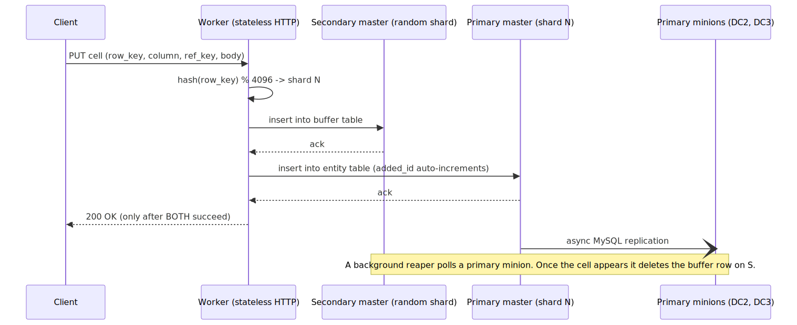
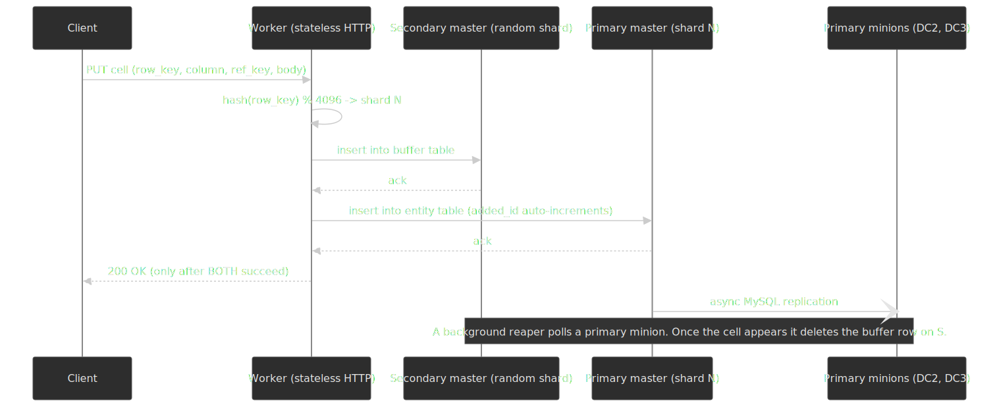

# Uber Schemaless: Building a Scalable Datastore on MySQL

In early 2014, Uber's trip storage was a single PostgreSQL instance growing roughly 20% per month, on track to exhaust both disk and IOPS by the end of the year[^mezzanine]. Rather than adopt Cassandra or Riak, the team built **Schemaless** — a thin, horizontally scalable layer on top of sharded MySQL — and cut over a month before Halloween 2014[^mezzanine]. The core insight was operational, not technical: pick the storage engine the team can debug at 3 a.m., then make it look distributed by adding the smallest possible coordination layer on top. This case study walks the cell model, the fixed-shard layout, the two-cluster buffered-write protocol, the trigger framework, and the design lines along which Schemaless eventually broke and was replaced by Docstore.




## Thesis

Schemaless is a deliberately small abstraction. The whole product fits on one whiteboard:

- **Immutable cells** indexed by `(row_key, column_name, ref_key)` mean every write is idempotent and the database is also a totally-ordered change log per shard[^part1][^part3].
- **Fixed 4,096 shards** with `shard = hash(row_key) % 4096` keep routing stateless and remove the hard parts of dynamic resharding[^mezzanine][^part2].
- **Two-cluster buffered writes** — every write hits a randomly chosen secondary plus the primary in lockstep — turns asynchronous MySQL replication into a durability story without taking a 2PC penalty on the hot path[^part2].
- **Eventually consistent secondary indexes** with denormalized payloads keep index queries single-shard, at the price of <20 ms staleness windows[^part1].
- **Triggers** turn the per-shard log into an at-least-once, idempotent event bus that drives billing, analytics, and cross-DC replication[^part3].

What it did *not* try to do — multi-row transactions, strict consistency, an expressive query language — is exactly what eventually motivated [Docstore](#evolution-to-docstore) in 2021[^docstore].

## Mental model

A senior reader can hold most of Schemaless with five terms:

| Term                | Meaning                                                                                                               |
| :------------------ | :-------------------------------------------------------------------------------------------------------------------- |
| **Cell**            | Immutable `(row_key, column_name, ref_key) → JSON body` tuple. Once written, never rewritten.[^part1]                 |
| **Shard**           | One of 4,096 logical partitions (typical config). `shard = hash(row_key) % 4096`.[^part2]                             |
| **Storage cluster** | One MySQL master + two minions, with minions placed in different data centres. Async replication.[^part2]             |
| **Worker node**     | Stateless HTTP server that routes requests, fans out, runs the circuit breaker, and orchestrates buffered writes.[^part2] |
| **Buffered write**  | Always-on dual write: the same cell goes to a secondary cluster's buffer table and to the primary cluster.[^part2]    |

Two non-obvious moves underpin everything else: cells are addressed by `(row_key, column_name, ref_key)` rather than `(row_key)` so that one logical "row" can be a sparse, versioned grid; and the entity table's MySQL primary key is an `added_id` auto-increment, which lets every shard double as an append-only log keyed on insertion order[^part2].

## The pre-Schemaless problem

### A single Postgres instance under exponential trip growth

In early 2014, the entire trips table was on a single PostgreSQL instance — the largest, fastest-growing, and IOPS-heaviest data type in Uber's monolith[^mezzanine]. Trip volume was growing at ~20%/month and the team projected the instance would run out of both storage and IOPS by year-end if untouched[^mezzanine]. Even routine schema operations on the trips table — adding a column or an index — were causing downtime[^mezzanine].

### Why the team rejected Postgres for the new tier

Evan Klitzke's "Why Uber Engineering Switched from Postgres to MySQL"[^pg2mysql] documents the structural reasons Postgres no longer fit the trips workload at Uber's scale. The full post is worth reading; the relevant pieces here are:

- **Index write amplification.** Postgres' MVCC stores immutable row tuples identified by a `ctid` (physical disk offset). When a row is updated, a new tuple is created with a new `ctid`, and **every index** must add a pointer to the new tuple — even if its indexed columns did not change[^pg2mysql]. A 12-index table absorbs 12 index writes per row update.
- **Verbose WAL replication.** Postgres streaming replication ships the WAL, which encodes every physical change including all of the above index writes. Cross-datacenter bandwidth becomes the bottleneck before the master does[^pg2mysql].
- **Process-per-connection cost.** Postgres forks a process per connection and uses System V IPC for shared structures; MySQL spawns a thread per connection on top of futex-based primitives. Uber routinely ran MySQL deployments at ~10,000 concurrent connections; Postgres started misbehaving past a few hundred even with adequate RAM, forcing them onto pgbouncer and exposing them to "idle in transaction" outages[^pg2mysql].

### Alternatives that were not chosen

The team's [stated requirements](https://www.uber.com/blog/schemaless-part-one-mysql-datastore/) for the new trip store were: linear horizontal scaling, write availability under failover, downstream-notification primitives, secondary indexes, and *operational trust* — could on-call debug it at 3 a.m.[^part1].

| Option              | What it offered                                | What blocked it                                                                  |
| :------------------ | :--------------------------------------------- | :------------------------------------------------------------------------------- |
| Cassandra           | Linear scaling, tunable consistency            | No native notification; eventual consistency complicating indexes; ops maturity at Uber's scale was the deal-breaker[^part1] |
| Riak                | Masterless, sibling reconciliation             | Same notification gap; CRDT modelling cost; ops experience[^part1]              |
| MongoDB             | Document model, familiar query language        | Scaling concerns and a consistency model the team did not trust for trip data[^part1] |
| **Custom on MySQL** | Operational depth; deterministic perf model    | Build cost; everything beyond a single MySQL had to be built[^part1][^mezzanine] |

The 2016 retrospective is candid that the call was about *ops trust*, not theoretical fit: Cassandra and Riak both ended up in production at Uber for other workloads later[^part1]. The trip store needed something the team already knew how to operate.

> [!NOTE]
> Two acknowledged design influences: FriendFeed's "schemaless MySQL" pattern (JSON blobs in a flat MySQL row), and Pinterest's operational discipline around sharded MySQL[^part1]. The data model itself is described in the Schemaless papers as an "append-only sparse three-dimensional persistent hash map, very similar to Google's Bigtable"[^part1].

## The cell model

### Definition

```text
Cell = (row_key, column_name, ref_key) → body
```

| Field         | Type                  | Role                                                                |
| :------------ | :-------------------- | :------------------------------------------------------------------ |
| `row_key`     | UUID                  | Logical entity (e.g. `trip_uuid`); the only field used for sharding. |
| `column_name` | string                | App-defined attribute group (e.g. `BASE`, `STATUS`, `FARE`). Schemaless does not interpret it. |
| `ref_key`     | int                   | Monotonic version number per `(row_key, column_name)`. Highest wins on read. |
| `body`        | compressed JSON blob  | Stored as MessagePack-encoded JSON, ZLib-compressed[^part2].        |

In MySQL, every cell lives in a single **entity table** per shard with a compound index on `(row_key, column_name, ref_key)`. The MySQL primary key is a separate `added_id` auto-increment integer; this is what makes inserts physically sequential on disk and exposes the shard as a partitioned log[^part2].

```ts title="cell-shape.ts"
type Cell = {
  rowKey: string;       // UUID
  columnName: string;   // e.g. "BASE"
  refKey: number;       // monotonic per (rowKey, columnName)
  body: Record<string, unknown>;
};

const tripBase: Cell = {
  rowKey: "trip_uuid_abc123",
  columnName: "BASE",
  refKey: 3,
  body: {
    driverUuid: "driver_xyz",
    riderUuid: "rider_456",
    status: "completed",
    pickupLat: 37.7749,
    pickupLng: -122.4194,
  },
};
```

The application — not Schemaless — decides what a column is. Mezzanine, the trip store, splits a trip across `BASE` (set once at trip end), `STATUS` (one cell per billing attempt), `NOTES` (driver/rider notes), and `FARE_ADJUSTMENT` (rare). Splitting is deliberate: it sidesteps update conflicts and minimises write amplification because each column's writes are independent[^part1].

### Why immutability earns its keep

Immutability is the single design choice that pulls the most weight:

- **Idempotent writes.** Re-issuing a write with the same `(row_key, column_name, ref_key)` is rejected as a duplicate; the buffered-write protocol leans on this[^part2].
- **Total order per shard.** `added_id` is unique and monotonic *within a shard*, identical across replicas. That makes failover safe and triggers re-readable from any replica without reordering[^part2][^part3].
- **Replication is a memcpy.** No conflict resolution, no last-writer-wins logic, no vector clocks. The cell either exists at the destination or it does not.
- **The DB is also the change log.** Triggers ride on `added_id` rather than a separate WAL pipeline (see [Trigger framework](#trigger-framework)).

The trade-off is the obvious one: every "update" is an append, and old versions accumulate until a long-lived entity is compacted out-of-band.

> [!CAUTION]
> Immutability fits transaction-shaped data — trips, billing attempts, payment events — well. It is a poor fit for hot, frequently-mutated objects (e.g., a counter or a frequently-edited document) and for large entities where a small change rewrites a large blob.

## Sharding architecture

### Fixed 4,096 shards, deterministic routing

Schemaless assigns each cell to a shard via `shard = hash(row_key) % 4096`. The shard count is fixed at instance creation time (typically 4,096 — the number is configurable but 4,096 is the documented default)[^part2][^mezzanine]. Worker nodes can compute the routing locally without consulting any coordination service; no metadata service sits in the request path.

```python title="routing.py"
SHARDS = 4096

def shard_id(row_key: bytes) -> int:
    return hash_uuid(row_key) % SHARDS
```

Crucially, "fixed" applies to the **logical** shard count — not the physical placement. Capacity is added by **moving shards onto more MySQL hosts**; Uber's documented expansion path is "split each MySQL server in two"[^mezzanine]. The cells themselves are not rehashed, so there is no consistent-hashing rebalance protocol; only shard ownership moves.

> [!IMPORTANT]
> The 4,096-shard ceiling caps the maximum *parallelism* of a single Schemaless instance, not its absolute capacity. Beyond that ceiling each shard absorbs more load, and the team's lever is to spin up another Schemaless instance — by 2016 there were 40+, by 2018 more than 50[^frontless][^herb].

### Storage cluster topology

Each shard is owned by a **storage cluster**: one MySQL master plus typically two minions, with minions placed in different data centres for DC-failure tolerance[^part2].

```text
Shard N
└── Master  ────── async MySQL replication ──── Minion (DC2)
                                            └── Minion (DC3)
```

Reads default to the master (so clients see their own writes) but the API allows per-request routing to a minion when stale-read tolerance is acceptable. Production replication lag is typically subsecond[^part2].

### Why MySQL specifically

MySQL is the *thinnest possible* substrate for the Schemaless contract:

- The compound index on `(row_key, column_name, ref_key)` makes "give me the latest cell for this row+column" an indexed lookup.
- InnoDB's per-shard ACID is enough; Schemaless never asks MySQL for cross-shard guarantees.
- Async replication, backup, and crash recovery are mature and operationally familiar.

Starting in 2019, Uber migrated Schemaless and Docstore storage nodes from InnoDB to **MyRocks** (MySQL on RocksDB's LSM-tree engine), netting >30% disk savings; InnoDB compression alone gave only ~5% because the worker layer already compresses cell bodies before storage[^myrocks].

## Worker tier and request paths

Worker nodes are stateless HTTP servers. They do four jobs:

1. **Route**. Hash the row key, look up the cluster for the shard, and pick a node by request type.
2. **Aggregate**. For multi-row index queries, fan out to the relevant shards and merge.
3. **Detect failure**. A circuit breaker on each storage-node connection switches reads to a healthy node when the master misbehaves[^part2].
4. **Buffer writes**. Coordinate the two-cluster write protocol described below[^part2].

Because workers are stateless, Uber scales them by adding more boxes; by mid-2016 there were several thousand worker processes across all Schemaless instances[^frontless].

### Cell write path

A single cell write is a two-cluster commit, not a single insert:




Concretely, when a cell arrives at a worker:

1. Hash `row_key` to find the **primary cluster** for shard *N*.
2. Pick a **secondary cluster** at random (the count of secondaries is configurable).
3. Write the cell into the secondary's *buffer table*. If this fails, fail the request.
4. Write the cell into the primary's *entity table*. If this fails, fail the request.
5. Only after both succeed, return success to the client[^part2].
6. The primary master replicates to its minions asynchronously.
7. A background reaper polls a primary minion; when the cell appears there, it deletes the buffer row from the secondary[^part2].

### Buffered writes — the always-on durability story

The repo's earlier framing of buffered writes as "fail over to another master when the primary is down" is the failure-time behaviour, not the design. **Buffered writes happen on every successful request**, precisely because MySQL replication from master to minions is asynchronous. If the primary master dies after acking but before replicating, the cell would be lost. The secondary's buffer table is the temporary backup that closes that window[^part2].




Two consequences fall out:

- **Failure mode.** If the primary master is down, writes still succeed (they land in the secondary buffer), but they are not yet readable through the primary. The client is told the master is down, so it knows the new cell is "buffered, not visible". This is the [hinted-handoff][hinted-handoff] family of techniques, in the same lineage as Dynamo's[^part2].
- **Idempotency cleanup.** If multiple writes with the same `(row_key, column_name, ref_key)` race, only one wins; the buffer table simply rejects the duplicate when the primary catches up[^part2].

[hinted-handoff]: https://cassandra.apache.org/doc/stable/cassandra/operating/hints.html

> [!WARNING]
> The "client knows the cell is buffered" bit only helps if the client uses it. In production, the read-your-write contract is best-effort during master failover; downstream services should be designed for at-least-once delivery anyway because [triggers](#trigger-framework) inherit the same property.

### Failure modes by component

| Failure                  | Reads                                       | Writes                                              | Recovery                                          |
| :----------------------- | :------------------------------------------ | :-------------------------------------------------- | :------------------------------------------------ |
| Worker process crash     | Other workers serve; client retries elsewhere. | Same.                                            | Process-level restart.                            |
| Primary minion down      | Reads route to master or the other minion.  | No impact (writes go to master).                    | Async replication catches up.                     |
| Primary master down      | Reads fail over to a minion (stale-tolerant). | Writes still succeed via the secondary cluster's buffer table; reads of the new cell are not yet visible on the primary[^part2]. | Promote a minion; replay buffered writes once primary is back. |
| Whole DC outage          | Reads served from minions in surviving DCs. | Writes succeed; primary masters in the affected DC are skipped. | DC restored or replaced; minions rebuilt from healthy peers. |
| Secondary cluster failure | Unaffected.                                | Worker picks another secondary at random.           | None at request time.                             |

## Secondary indexes

### Eventually consistent, denormalized, single-shard queries

A Schemaless secondary index is a *separate* MySQL table per shard. When a cell is written, the entity-table insert happens **first and ack-able**; index updates happen out-of-band, **without a 2PC** — Uber explicitly chose to avoid the cross-shard 2PC overhead[^part1]. Production lag between cell writes and the corresponding index updates is "well below 20 ms" but not bounded[^part1].

To keep index queries on a single shard, indexes are themselves *sharded by a designated shard field*. Uber recommends denormalising frequently-queried fields into the index entry so queries can return without a follow-up entity-table fetch:

```yaml title="driver_partner_index.yaml"
shard_field: driver_partner_uuid   # determines shard placement; must be immutable
filter_fields:
  - city_uuid
  - trip_created_at
denormalized_fields:
  - status
  - fare_currency
  - distance_km
```

> [!IMPORTANT]
> The shard field of an index must be **immutable**[^part1]. If you index trips by their driver and the driver assignment changes after the trip starts, you cannot rely on the index — you would need a new cell with a new shard placement, or a different index entirely. Uber explicitly notes this is a constraint they were "exploring how to make mutable without too big of a performance overhead" as of 2016.

Choosing the shard field also matters for distribution: UUIDs distribute evenly; city IDs are skewed; status enums are pathological[^part1].

## Trigger framework

### The DB as an event bus

Because every cell has a unique, monotonic `added_id` per shard, every Schemaless instance is also a **partitioned change log**. The trigger framework tails that log: client programs register a callback against a column, and the framework calls the callback at-least-once for every new cell in that column[^part3].

```python title="bill_rider.py"
@trigger(column="BASE", table="trips")
def bill_rider(cell):
    status = trips.get_latest(cell.row_key, "STATUS")
    if status and status.body.get("is_completed"):
        return  # idempotency check
    fare = trips.get_latest(cell.row_key, "BASE").body
    result = payments.charge(cell.row_key, fare)
    trips.put(cell.row_key, "STATUS", {"is_completed": result.ok})
```

### Architecture




The framework's pieces[^part3]:

- **Per-shard offset.** Each trigger worker tracks the highest `added_id` it has processed for each shard it owns. Offsets are persisted to ZooKeeper or to a Schemaless instance.
- **Leader election.** One worker is elected leader and assigns shards to workers; on worker failure, the leader redistributes the failing worker's shards. During leader election, in-flight processing continues but rebalancing pauses.
- **In-shard ordering.** Cells within a shard are delivered in `added_id` order; failures stall the shard until either retried successfully or moved to a parking queue past a configured threshold[^part3].
- **Scale ceiling.** Up to 4,096 trigger workers per Schemaless instance — one per shard.

| Property      | Behaviour                                                                                   |
| :------------ | :------------------------------------------------------------------------------------------ |
| Delivery      | At-least-once. Callback must be idempotent.                                                |
| Ordering      | Total order per shard; no cross-shard ordering.                                             |
| Backpressure  | Failed cells park after threshold; system halts to surface systematic bugs.                |
| Coordination  | ZooKeeper or Schemaless itself for offsets and leader election.                            |

### What this enables

| Use case             | Trigger column                | Action                                                |
| :------------------- | :---------------------------- | :---------------------------------------------------- |
| Billing              | `BASE` of trips               | Charge rider; write `STATUS`.                          |
| Analytics ingest     | Any                           | Stream into the data warehouse.                       |
| Cross-DC replication | Any                           | Forward to a peer DC (eventually replaced by Herb — see below). |
| Notifications        | `BASE`                        | Push to driver/rider devices.                         |

The pattern generalises: any append-only datastore is already an event source; Schemaless made the event-source semantics first-class.

## Multi-datacenter replication: Herb

Schemaless triggers were the first cross-DC replication path; in 2018, Uber published [Herb][herb-post], a Go-based replication engine that reads MySQL binlogs ("commit logs") instead of polling cells, and runs a full-mesh topology between DCs[^herb].

Herb's design points:

- **Mesh, not chain.** Each DC connects directly to every other DC; one slow DC does not block faster peers.
- **At-least-once, in-order per origin.** All DCs see updates in the same order they were written at the origin DC, which simplifies consumer logic.
- **Streaming, not polling.** Herb tails the binary logs rather than running expensive `SELECT` queries against the entity table.
- **Pluggable transport.** Started on TCP, moved to HTTP, then YARPC.
- **Production performance.** A reported median of 550–900 cells/sec per stream with end-to-end replication latency of 82–90 ms — of which roughly 40 ms is cross-DC network time[^herb].

[herb-post]: https://www.uber.com/blog/herb-datacenter-replication/

## Migration: Project Mezzanine

Schemaless went live as **Project Mezzanine** — the trip-store cutover from a single PostgreSQL instance — about a month before Halloween 2014, after roughly five months of design and implementation and a six-week final crunch[^mezzanine].

### The dual-write playbook


The migration was the now-canonical strangler-fig pattern, executed before that name was popular[^mezzanine]:

1. **Introduce an abstraction.** A `lib/tripstore` Python package gated reads and writes behind a feature flag.
2. **Backfill + mirror.** Backfill PG into Schemaless; mirror new writes to both. Backfill, refactor, and Schemaless feature work proceeded in parallel and shipped continuously.
3. **Shadow read + diff.** Probabilistically replay reads against Schemaless and compare results to PG. Sampling controlled the extra load on the already-saturated PG box.
4. **Flip + decommission.** A month before Halloween 2014, the team gathered in a "war room" at 6 a.m. and flipped the primary path to Schemaless. The cutover was uneventful — no alerts, no rollback.

### Specific de-risking moves worth stealing

- **Trip-IDs to UUIDs first.** PG used auto-increment IDs that the rest of the codebase had baked in. Hundreds of SQL queries had to be rewritten to UUID before the storage swap could even start[^mezzanine].
- **Probabilistic shadow validation.** Validating every read would have killed the PG box. The team validated a sampled fraction, dialing the rate up as they got more confident.
- **Idempotency replaces transactions.** The team explicitly notes "the (mental) transition from writing code against a key-value store with limited query capabilities … takes time to master. Idempotency replaces transactions."[^mezzanine]
- **Plan for multiple backfills.** "Don't expect to get the data model right the first time. Plan for multiple complete and partial backfills."[^mezzanine]

| Date             | Event                                                                          |
| :--------------- | :----------------------------------------------------------------------------- |
| Early 2014       | Trip growth at ~20%/month; storage + IOPS exhaustion projected for year-end[^mezzanine]. |
| ~5 months        | Schemaless design + initial implementation[^mezzanine].                          |
| 6 weeks          | Final "war room" sprint: backfill, validation, refactor[^mezzanine].             |
| ~Oct 1, 2014     | Cutover from PostgreSQL to Schemaless ("a month before Halloween")[^mezzanine].  |
| Oct 31, 2014     | Halloween — Uber's traditional traffic peak — passed without incident[^mezzanine]. |

## Operational outcomes

### Scale at which Schemaless settled

| Metric                        | Value             | Source                              |
| :---------------------------- | :---------------- | :---------------------------------- |
| Schemaless instances (2016)   | 40+               | Frontless retrospective[^frontless] |
| Schemaless instances (2018)   | 50+               | Herb post[^herb]                    |
| Storage nodes (mid-2016)      | Many thousands    | Frontless[^frontless]               |
| Worker processes (mid-2016)   | Several thousand  | Frontless[^frontless]               |
| Trip volume (Jun 18, 2016)    | 2 billion total trips on Uber | Press coverage of Uber's own announcement[^twobillion] |

### Project Frontless: Python → Go on the worker tier

By mid-2016 the Python+uWSGI worker tier was eating CPU and limiting concurrency. **Project Frontless** rewrote the worker tier in Go, validating each new endpoint by running it side-by-side with the Python version and diffing responses on real production traffic before flipping over[^frontless]. The Mezzanine read endpoints were fully on Frontless by December 2016; the project as a whole was published in February 2018[^frontless].

| Metric              | Improvement (vs Python worker) |
| :------------------ | :----------------------------- |
| Median request latency | -85%[^frontless]            |
| P99 request latency    | -70%[^frontless]            |
| CPU utilization        | -85%[^frontless]            |

The validation-by-comparison technique generalises: it is the same trick used in [Mezzanine](#migration-project-mezzanine) for the storage swap, applied to a *protocol* swap.

## Evolution to Docstore

By 2020 the same constraints that made Schemaless cheap to build were friction for general-purpose use cases. Uber published Docstore in February 2021 as Schemaless's evolution[^docstore].

| Property         | Schemaless             | Docstore                                                       |
| :--------------- | :--------------------- | :------------------------------------------------------------- |
| Data model       | Immutable cells        | Mutable rows with optional nested structures                  |
| Schema           | None                   | Schema-on-write with explicit evolution                        |
| Consistency      | Eventual               | **Strict serializability per partition**[^docstore]           |
| Transactions     | None                   | Multi-row, ACID, replicated via Raft consensus[^docstore]     |
| Query model      | Cell + sharded indexes | Materialized views; richer queries with composite partition keys[^docstore] |
| Replication unit | MySQL row              | MySQL transaction (log entry in a Raft replicated state machine)[^docstore] |

The architectural delta is small but consequential: instead of one master + async minions, a Docstore partition is **3–5 nodes running Raft**, with each replica's MySQL applying the same transaction in the same order. MySQL still does row-level locking; Raft just makes the transaction log durable and consistent across replicas[^docstore].

Uber's stated goal for Docstore was the explicit mid-point between document and relational: "the best of both worlds: schema flexibility of document models, and schema enforcement seen in traditional relational models."[^docstore]

## What to take from this

### When the Schemaless playbook applies

- The dominant workload is **append-shaped** (transactions, trips, events, audit logs).
- **Operational depth** in MySQL/Postgres outweighs the appeal of a NoSQL feature checklist.
- **Eventual consistency** of secondary indexes is acceptable, or your indexes are not consistency-critical.
- **Single-row consistency** is enough; cross-row transactions are rare or can be modeled as event sourcing.
- The **build-vs-buy** budget is real: Schemaless took ~5 months for a full team, plus continuous investment for years[^mezzanine].

### When it does not

- You need cross-row ACID transactions with general-purpose semantics — you want Docstore, Spanner, CockroachDB, or a managed equivalent.
- Your workload is hot, mutable objects (counters, frequently-edited documents); immutability becomes a tax, not a feature.
- You need rich query support (joins, aggregates) at the storage tier.
- Your team prefers managed services to operational ownership.

### Patterns worth lifting

1. **Idempotent writes as a substitute for distributed transactions.** Append-only schema with `(key, version)` keys means every retry, replay, or out-of-order delivery is harmless.
2. **Two-cluster buffered writes for async-replication durability.** Cheaper than synchronous replication, much safer than naked async.
3. **Per-shard log = event bus for free.** If your writes are append-only and ordered within a shard, you have an event source — expose it.
4. **Strangler-fig with shadow validation.** `lib/tripstore` + probabilistic read-diffing turned a year-long migration into a non-event[^mezzanine].
5. **Replace runtimes the same way you replace storage.** Project Frontless validated Go endpoints against Python endpoints in production before cutting over[^frontless].

## References

[^part1]: Jakob Holdgaard Thomsen. ["Designing Schemaless, Uber Engineering's Scalable Datastore Using MySQL"](https://www.uber.com/blog/schemaless-part-one-mysql-datastore/). Uber Engineering, January 12, 2016.
[^part2]: Jakob Holdgaard Thomsen. ["The Architecture of Schemaless, Uber Engineering's Trip Datastore Using MySQL"](https://www.uber.com/blog/schemaless-part-two-architecture/). Uber Engineering, January 15, 2016.
[^part3]: Jakob Holdgaard Thomsen. ["Using Triggers On Schemaless, Uber Engineering's Datastore Using MySQL"](https://www.uber.com/blog/schemaless-part-three-datastore-triggers/). Uber Engineering, January 19, 2016.
[^mezzanine]: René Schmidt. ["Project Mezzanine: The Great Migration"](https://www.uber.com/blog/mezzanine-codebase-data-migration/). Uber Engineering, July 28, 2015.
[^frontless]: Jesper Lindstrom Nielsen and Anders Johnsen. ["Code Migration in Production: Rewriting the Sharding Layer of Uber's Schemaless Datastore"](https://www.uber.com/blog/schemaless-rewrite/). Uber Engineering, February 22, 2018.
[^herb]: Himank Chaudhary. ["Herb: Multi-DC Replication Engine for Uber's Schemaless Datastore"](https://www.uber.com/blog/herb-datacenter-replication/). Uber Engineering, July 25, 2018.
[^docstore]: Himank Chaudhary, Ovais Tariq, Deba Chatterjee. ["Evolving Schemaless into a Distributed SQL Database"](https://www.uber.com/blog/schemaless-sql-database/). Uber Engineering, February 23, 2021.
[^pg2mysql]: Evan Klitzke. ["Why Uber Engineering Switched from Postgres to MySQL"](https://www.uber.com/blog/postgres-to-mysql-migration/). Uber Engineering, July 26, 2016.
[^myrocks]: Mehul Patel. ["MySQL to MyRocks Migration in Uber's Distributed Datastores"](https://www.uber.com/blog/mysql-to-myrocks-migration-in-uber-distributed-datastores/). Uber Engineering, 2024.
[^twobillion]: Coverage of Uber's June 18, 2016 announcement that the platform reached its 2-billionth ride: [Reuters](https://www.reuters.com/article/technology/uber-reaches-2-billion-rides-six-months-after-hitting-its-first-billion-idUSKCN0ZY1T7/), [Fortune](https://fortune.com/2016/07/18/uber-two-billion-rides/).
