# Unique ID Generation in Distributed Systems

Distributed identifier design is a three-way trade between **coordination cost**, **sortability**, and **information leakage**. Pure random IDs scale infinitely but destroy index locality. Centralised counters give perfect ordering but won't survive sharding. Time-ordered IDs split the difference, and since [RFC 9562](https://www.rfc-editor.org/rfc/rfc9562.html) (May 2024) and [PostgreSQL 18](https://www.postgresql.org/about/news/postgresql-18-released-3142/) (September 2025), the default for new tables in distributed systems should be **UUID v7** unless one of three constraints — strict 64-bit budget, hard public-token unguessability, or single-DB ordering — pulls you elsewhere.




## The mental model

Every ID generator answers four questions. Pick the trade-offs you can live with first; the format follows.

| Question                                                                          | Cheap answer (no coordination)                                | Expensive answer                            |
| :-------------------------------------------------------------------------------- | :------------------------------------------------------------ | :------------------------------------------ |
| **Where does uniqueness come from?**                                              | Enough randomness that collisions are negligible              | A central authority (DB sequence, ZooKeeper) |
| **Where does ordering come from?**                                                | A timestamp baked into the high bits                          | A monotonic counter from a single writer    |
| **Where does space partitioning come from?**                                      | Worker / shard ID encoded into the value                      | A separate routing table                    |
| **What does the ID leak?**                                                        | Creation time at chosen precision; sometimes worker location  | Nothing (pure random)                       |

The five families covered in this article each pick a different point on those axes:

| Family                       | Bits   | Random bits | Time field          | Coordination required        | RFC / spec |
| :--------------------------- | :----- | :---------- | :------------------ | :--------------------------- | :--------- |
| **UUID v4** (random)         | 128    | 122         | none                | none                         | [RFC 9562 §5.4](https://www.rfc-editor.org/rfc/rfc9562.html#name-uuid-version-4) |
| **UUID v7** (time + random)  | 128    | 74          | 48-bit Unix ms      | none                         | [RFC 9562 §5.7](https://www.rfc-editor.org/rfc/rfc9562.html#name-uuid-version-7) |
| **Snowflake** (time + node)  | 64     | 0           | 41-bit ms (custom epoch) | worker / datacenter ID  | [twitter-archive/snowflake](https://github.com/twitter-archive/snowflake/tree/snowflake-2010) |
| **ULID** (time + random)     | 128    | 80          | 48-bit Unix ms      | none                         | [ulid/spec](https://github.com/ulid/spec) |
| **KSUID** (time + random)    | 160    | 128         | 32-bit s (custom epoch) | none                       | [segmentio/ksuid](https://github.com/segmentio/ksuid) |

> [!NOTE]
> RFC 9562 [obsoletes RFC 4122](https://www.rfc-editor.org/rfc/rfc9562.html#section-1) and adds three new versions: UUID v6 (reordered v1, MAC-bearing), UUID v7 (Unix-ms + random), and UUID v8 (custom layout). It also explicitly catalogues 16 prior community designs — including ULID, Snowflake, KSUID, and Instagram's ShardingID — as the [motivation for v7](https://www.rfc-editor.org/rfc/rfc9562.html#section-2.1).

## Why coordination is the real cost

In a single PostgreSQL or MySQL instance, `BIGSERIAL` / `AUTO_INCREMENT` is unbeatable: 8 bytes, perfectly monotonic, free from the engine. The moment writes spread across shards, regions, or independent processes, that single counter becomes a coordination point — every insert pays a network round-trip or risks duplicates.

The classic workaround is Flickr's [ticket-server pattern](https://code.flickr.net/2010/02/08/ticket-servers-distributed-unique-primary-keys-on-the-cheap/): a dedicated MySQL server uses `REPLACE INTO ... ; SELECT LAST_INSERT_ID()` to mint IDs for the rest of the cluster. To survive failure they ran two ticket servers with `auto-increment-increment = 2` and offsets 1 and 2 — even on one box, odd on the other. It works, but you've now built a tiny distributed system whose only product is integers.

Twitter ran into the same wall when migrating from MySQL to Cassandra. Their [Snowflake README](https://github.com/twitter-archive/snowflake/tree/snowflake-2010) opens with the line that summarises the whole problem space:

> As we at Twitter move away from Mysql towards Cassandra, we've needed a new way to generate id numbers. There is no sequential id generation facility in Cassandra, nor should there be.

Their requirements are still the canonical checklist for any distributed ID:

- **Performance:** ≥ 10k IDs/sec/process, ≤ 2 ms response.
- **Uncoordinated:** generators must not talk to each other.
- **Roughly time-ordered (k-sorted):** within ~1 s, ideally tens of ms.
- **Directly sortable** without parsing.
- **Compact:** ≤ 64 bits.

Subsequent designs trade off these requirements differently. UUID v7 drops the 64-bit budget for spec compatibility and zero coordination. ULID drops the worker-ID coordination entirely and accepts the 128-bit cost. KSUID extends the random payload at the cost of 160 bits. Snowflake keeps 64 bits but pays for a worker-ID assignment system.

## How each format actually looks

The rest of this section walks each format's bit layout, real-world deployment, and trade-offs. The bit positions matter — the **timestamp must occupy the most significant bits** for lexicographic sort to equal time sort, and the version/variant fields must sit exactly where RFC 9562 says they sit, or downstream UUID parsers will reject the value.

### UUID v4 — pure random

122 bits of CSPRNG output, with 4 bits fixed for version (`0100`) and 2 bits fixed for variant (`10`) per [RFC 9562 §5.4](https://www.rfc-editor.org/rfc/rfc9562.html#name-uuid-version-4):

```text title="UUID v4 layout"
xxxxxxxx-xxxx-4xxx-yxxx-xxxxxxxxxxxx
         ^    ^    ^
         |    |    +-- variant bits (y ∈ {8,9,a,b}); rest of nibble random
         |    +------- version 4 (literal '4')
         +------------ 122 random bits total across the dashes
```

What makes v4 attractive is also what makes it expensive at scale: the 122 random bits are unguessable enough to use as a public token (no IDOR risk by enumeration), and require no coordination whatsoever. The cost is that consecutive inserts land at uniformly-distributed positions in any B-tree index that uses the UUID as a key.

**Use v4 when:** the ID is a public token, you don't sort by it, and write volume is low enough that index fragmentation doesn't bite. **Avoid v4 when** the column is a primary key on a write-heavy table; a v7 swap is usually a one-line `ALTER TABLE ... SET DEFAULT uuidv7()`.

### UUID v7 — time + random, RFC 9562

The most significant 48 bits are a Unix millisecond timestamp; the remaining 74 bits (after version + variant) are random or — optionally — partly a sub-millisecond counter[^v7-monotonic]:

[^v7-monotonic]: [RFC 9562 §6.2 — Monotonicity and Counters](https://www.rfc-editor.org/rfc/rfc9562.html#name-monotonicity-and-counters) lists three methods to extend ordering inside a single millisecond: **Method 1** (fixed-bit dedicated counter), **Method 2** (monotonic random — increment the previous random value by a small random delta), and **Method 3** (sub-millisecond timestamp fraction in `rand_a`). PostgreSQL 18's `uuidv7()` uses Method 3: it consumes available sub-ms clock precision into `rand_a`, then fills `rand_b` with random bits ([PG18 docs](https://www.postgresql.org/docs/18/functions-uuid.html)).

```text title="UUID v7 layout (RFC 9562 §5.7)"
 0                   1                   2                   3
 0 1 2 3 4 5 6 7 8 9 0 1 2 3 4 5 6 7 8 9 0 1 2 3 4 5 6 7 8 9 0 1
+-+-+-+-+-+-+-+-+-+-+-+-+-+-+-+-+-+-+-+-+-+-+-+-+-+-+-+-+-+-+-+-+
|                           unix_ts_ms                          |
+-+-+-+-+-+-+-+-+-+-+-+-+-+-+-+-+-+-+-+-+-+-+-+-+-+-+-+-+-+-+-+-+
|          unix_ts_ms           |  ver  |       rand_a          |
+-+-+-+-+-+-+-+-+-+-+-+-+-+-+-+-+-+-+-+-+-+-+-+-+-+-+-+-+-+-+-+-+
|var|                        rand_b                             |
+-+-+-+-+-+-+-+-+-+-+-+-+-+-+-+-+-+-+-+-+-+-+-+-+-+-+-+-+-+-+-+-+
|                            rand_b                             |
+-+-+-+-+-+-+-+-+-+-+-+-+-+-+-+-+-+-+-+-+-+-+-+-+-+-+-+-+-+-+-+-+
```

Because the timestamp sits in the high bits in network byte order, raw byte comparison sorts UUID v7 values chronologically — the [RFC explicitly designed this](https://www.rfc-editor.org/rfc/rfc9562.html#section-6.10): "implementations that require sorting (e.g., database indexes) sort as opaque raw bytes without the need for parsing or introspection."

PostgreSQL 18 ([released 2025-09-25](https://www.postgresql.org/about/news/postgresql-18-released-3142/)) ships native `uuidv7()` and `uuid_extract_timestamp()` functions. The migration is mechanical:

```sql title="PostgreSQL 18+ migration from v4 to v7"
-- before
ALTER TABLE users ALTER COLUMN id SET DEFAULT gen_random_uuid();

-- after (PG 18+)
ALTER TABLE users ALTER COLUMN id SET DEFAULT uuidv7();

-- existing v4 rows remain valid; only new rows are time-ordered.
SELECT uuid_extract_version(id), uuid_extract_timestamp(id) FROM users;
```

For PG ≤ 17, application-side libraries fill the gap; the resulting bytes are identical.

**Use v7 when:** the column is a primary key, time-of-creation ordering is useful, and 128 bits is an acceptable storage cost. This is the new default for almost every distributed table.

### Snowflake — 64 bits with worker partitioning

Twitter's [original Snowflake](https://github.com/twitter-archive/snowflake/tree/snowflake-2010) packs 41 bits of timestamp (custom epoch, 69-year horizon), 10 bits of machine ID, and 12 bits of sequence into a signed 64-bit integer:

```text title="Twitter Snowflake layout (64 bits)"
| 1 |        41 bits           |  10 bits   |  12 bits  |
+---+--------------------------+------------+-----------+
| 0 | ms since custom epoch    | machine ID | sequence  |
+---+--------------------------+------------+-----------+
  ^                              ^             ^
  sign bit (always 0)            up to 1024    4096 IDs / ms
                                 generators    per generator
```

The 10 machine-ID bits are usually subdivided into 5 bits of datacenter and 5 bits of worker-within-datacenter, matching the [twitter-archive Scala library](https://en.wikipedia.org/wiki/Snowflake_ID#Format). That gives 32 datacenters × 32 workers = 1024 generators. Each generator emits up to 4096 IDs per millisecond (`2^12`), for ~4M IDs/sec/generator.

The dominant variants change only the bit allocation:

| Source              | Timestamp | Worker / shard          | Sequence | Epoch start          |
| :------------------ | :-------- | :---------------------- | :------- | :------------------- |
| **Twitter / X**     | 41 bits   | 10 bits (5 dc + 5 worker) | 12 bits | custom (2010)        |
| **Discord**[^disc]  | 42 bits   | 5 worker + 5 process    | 12 bits  | 2015-01-01 UTC (`1420070400000`) |
| **Instagram**[^ig]  | 41 bits   | 13 bits (logical shard) | 10 bits  | custom               |
| **Sonyflake**       | 39 bits (10 ms) | 16 bits machine    | 8 bits   | custom               |

[^disc]: [Discord API reference — Snowflakes](https://docs.discord.com/developers/reference#snowflakes). Discord uses **42 timestamp bits + 5 internal worker + 5 internal process + 12 increment** — not Twitter's 41+10+12. Both still total 64 bits because Twitter reserves the sign bit.

[^ig]: [Sharding & IDs at Instagram](https://instagram-engineering.com/sharding-ids-at-instagram-1cf5a71e5a5c). Instagram trades per-shard throughput for shard count: 13-bit shard ID = 8192 shards, but only 1024 IDs / ms / shard. The shard ID is *logical*, not physical, so they can rebalance shards across hosts without changing IDs.

Worker-ID assignment is the operational tax. Common approaches:

| Strategy                       | Pros                                       | Cons                                                       |
| :----------------------------- | :----------------------------------------- | :--------------------------------------------------------- |
| Static config (env var, file)  | Trivial; no runtime dependencies           | Manual provisioning; reuse on rollback risks duplicates    |
| ZooKeeper / etcd lease         | Dynamic; safe across restarts              | Adds a coordination service and its operational burden     |
| Database table claim on start  | Reuses existing infra                      | Lease release on crash needs a heartbeat / TTL             |
| Kubernetes StatefulSet ordinal | Free, deterministic per pod ordinal        | Tied to one orchestrator; need fallback for raw VMs        |

Snowflake's other operational gotcha is the system clock — if it moves backward (NTP step, leap-second smear, VM live migration), the generator either blocks or emits duplicates. The [Twitter README](https://github.com/twitter-archive/snowflake/tree/snowflake-2010) is explicit: *"Snowflake protects from non-monotonic clocks ... If your clock is running fast and NTP tells it to repeat a few milliseconds, snowflake will refuse to generate ids until a time that is after the last time we generated an id."* Run NTP in slew-only mode, or use [chrony with `makestep` disabled](https://chrony-project.org/doc/4.5/chrony.conf.html#makestep), so the clock never jumps backward.

**Use Snowflake when:** the ID column must fit in `BIGINT` (legacy schemas, existing analytics tooling, mobile clients without 128-bit support), and you already have a story for worker-ID assignment.

### ULID — 128-bit, base32-encoded, monotonic

ULID is a community spec ([ulid/spec](https://github.com/ulid/spec)) that predates and partly inspired UUID v7. Layout: 48 bits of Unix-ms timestamp + 80 bits of randomness, encoded as 26 characters using [Crockford's Base32](https://www.crockford.com/base32.html) (alphabet excludes `I`, `L`, `O`, `U` to avoid OCR/typing confusion):

```text title="ULID layout (128 bits, 26-char encoding)"
| 48 bits timestamp | 80 bits randomness |
+-------------------+--------------------+
|   10 chars        |   16 chars         |    Crockford Base32

Example: 01HZX3K2VW6N1B5RTQDKJWA8MV
         ^^^^^^^^^^                     timestamp (10 chars)
                   ^^^^^^^^^^^^^^^^     randomness (16 chars)
```

The spec defines an explicit **monotonic factory**: when consecutive ULIDs share a millisecond, the random portion is incremented by one (least significant bit) instead of regenerated. If the increment overflows 80 bits within the same millisecond, generation must fail. Same idea as UUID v7 Method 2, but specified at the format level rather than as an option.

ULID's main argument over UUID v7 is the encoding: 26 characters of `[0-9A-Z]` versus 36 characters of hex with dashes. URLs and logs are noticeably shorter, and the alphabet is case-insensitive. The trade-off is that ULID is a community spec, not an IETF standard, so library coverage and database support are thinner.

**Use ULID when:** the string representation matters (URL slugs, copy-paste IDs, log readability) and you don't need RFC compliance. For new code that mostly stays in binary form, UUID v7 wins on standardisation.

### KSUID — 160 bits, 128 random, second precision

[Segment's KSUID](https://github.com/segmentio/ksuid) is the outlier on size and entropy. Layout: 32-bit timestamp (seconds since a custom epoch of `2014-05-13`) + 128 bits of cryptographic randomness, encoded as 27 base62 characters:

```text title="KSUID layout (160 bits)"
|  32 bits   |        128 bits       |
+------------+-----------------------+
|  s since   |   cryptographic       |
| 2014-05-13 |    random payload     |     20 bytes total
+------------+-----------------------+
                                          27 base62 chars
Example: 1srOrx2ZWZBpBUvZwXKQmoEYga2
```

The 128-bit random payload is the deliberate design choice: it gives the same collision resistance as a *full* UUID v4 but stacked on top of a sortable timestamp. Segment's [original KSUID announcement](https://segment.com/blog/a-brief-history-of-the-uuid/) framed it as starting from UUID v4 and adding ordering: *"after a requirement to order these identifiers by time emerged, KSUID was born."*

The cost is size: 160 bits is 25% bigger than a UUID; 27 base62 chars beats UUID's 36 hex chars but loses to ULID's 26. The second-only timestamp also means **all KSUIDs created within the same wall-clock second are unordered relative to each other** — fine for "show me all events from yesterday" but useless for "the most recent event."

**Use KSUID when:** the random payload's collision resistance is genuinely needed (e.g., adversarial environments where worker entropy may be partially compromised) and second-level ordering is acceptable. Most teams reaching for KSUID would do better with UUID v7.

### Database sequences — the baseline you compare against

`BIGSERIAL` (PostgreSQL) and `AUTO_INCREMENT` (MySQL) are still the right answer for any single-database, single-region table. They generate 8-byte monotonic integers and live happily inside the storage engine. The Flickr ticket-server pattern extends the same idea across shards by running a dedicated allocation database.

The point at which you outgrow a sequence is rarely throughput (modern Postgres can hand out millions of `nextval()` per second from a single backend) — it's **distribution**: when a write needs to land on shard S without first round-tripping to a global ID server. That's exactly the constraint Snowflake and UUID v7 solve.

## Why time-ordered IDs win on B-trees

The single biggest engineering reason to prefer UUID v7 / Snowflake / ULID over UUID v4 is database write performance. RFC 9562 itself flags this in [§2.1](https://www.rfc-editor.org/rfc/rfc9562.html#section-2.1): *"UUID versions that are not time ordered, such as UUIDv4 ... have poor database-index locality. ... The resulting negative performance effects on the common structures used for this (B-tree and its variants) can be dramatic."*

The mechanism is straightforward. Postgres and MySQL store table indexes as B+trees with leaf pages of typically 8 KB. Inserts must land in the leaf whose key range contains the new value:




With sequential or time-ordered keys, every new row lands in the rightmost leaf page. The page fills, splits once into a new rightmost page, and the cycle repeats. The working set is small (one or two leaves), the buffer pool stays warm, and WAL volume is minimised because each split affects two pages instead of cascading.

With uniformly-random keys, each insert targets a uniformly random leaf — usually one already at full capacity. The page splits in two half-full pages. The next insert into either half is again random, which means *those* half-full pages stay half-full for a long time. The result: a "swiss cheese" index that's roughly twice the size it needs to be, plus 2-3× the WAL volume of a sequential-key insert pattern.

Real-world numbers from primary-source migrations:

| Source                                                                                                    | Workload                          | Result of v4 → v7 / sequential migration                |
| :-------------------------------------------------------------------------------------------------------- | :-------------------------------- | :------------------------------------------------------ |
| [Buildkite (Sept 2023)](https://buildkite.com/resources/blog/goodbye-integers-hello-uuids/)               | Production Postgres primary key   | **~50% reduction in WAL rate**; similar drop in write IO |
| [credativ benchmark on PG 18](https://www.credativ.de/en/blog/postgresql-en/a-deeper-look-at-old-uuidv4-vs-new-uuidv7-in-postgresql-18/) | Synthetic insert workload         | UUID v7 inserts ~30% faster; index ~25% smaller         |

> [!IMPORTANT]
> The exact ratio of page splits is workload-dependent. The qualitative claim — random IDs cause materially more splits, larger indexes, and more WAL — is universal. The quantitative claim — "500× more page splits" — varies wildly by row size, fillfactor, table size, and `shared_buffers`. Cite measurements from your own workload, not a blog headline.

The win is largest for tables that are (a) big enough that the working set exceeds the buffer pool, and (b) write-heavy enough that page splits dominate. For a 1M-row lookup table that fits entirely in memory, the difference is invisible.

## Trade-off matrices

The "which one" question collapses to a few orthogonal axes. Each table below holds the others fixed.

### Sortability and ordering precision

| Format     | Lexicographic sort = time sort? | Ordering precision        | Strict monotonic within a node? |
| :--------- | :------------------------------ | :------------------------ | :------------------------------ |
| UUID v4    | No                              | n/a                       | No                              |
| UUID v7    | Yes                             | 1 ms; sub-ms via Method 3 | Optional (counter / Method 1)   |
| Snowflake  | Yes (within a worker)           | 1 ms                      | Yes (sequence guarantees)       |
| ULID       | Yes                             | 1 ms                      | Yes (monotonic factory)         |
| KSUID      | Yes (within a second)           | 1 s                       | No                              |
| BIGSERIAL  | Yes                             | gap-free integer          | Yes (single writer)             |

### Coordination and operational burden

| Format     | Generator coordination          | Failure modes to plan for                                           |
| :--------- | :------------------------------ | :------------------------------------------------------------------ |
| UUID v4    | None                            | Weak RNG (VM clones with shared entropy); birthday collisions at extreme scale |
| UUID v7    | None                            | Clock skew across generators (only affects ordering, not uniqueness) |
| Snowflake  | Worker-ID assignment            | Clock running backward; worker-ID reuse on rollback; sequence overflow |
| ULID       | None                            | Clock skew; monotonic-factory rollover within 1 ms                  |
| KSUID      | None                            | Same as v4 (random); plus 1-second ordering coarseness              |
| BIGSERIAL  | One central writer              | SPOF; cross-shard duplicates; cross-region latency                  |

### Storage and on-the-wire size

| Format     | Binary size | Canonical text                       | Postgres column           | Index leaf cost vs `BIGINT` |
| :--------- | :---------- | :----------------------------------- | :------------------------ | :-------------------------- |
| BIGSERIAL  | 8 B         | decimal (≤19 chars)                  | `BIGINT`                  | 1× (baseline)               |
| Snowflake  | 8 B         | decimal (≤19 chars)                  | `BIGINT`                  | 1×                          |
| UUID v4/v7 | 16 B        | 36 chars (hex with dashes)           | `UUID` (16 B internally)  | 2×                          |
| ULID       | 16 B        | 26 chars (Crockford Base32)          | `BYTEA(16)` or `UUID`     | 2×                          |
| KSUID      | 20 B        | 27 chars (base62)                    | `BYTEA(20)` or `CHAR(27)` | 2.5×                        |

At 1 billion rows, the difference between an 8-byte and 16-byte primary key is 8 GB on the heap and another 8 GB on every index that includes it (PG 16+'s index dedup helps a little, but not for unique B-trees on UUIDs).

### Information leakage

| Format    | Leaks creation time      | Leaks node identity    |
| :-------- | :----------------------- | :--------------------- |
| UUID v1   | Yes (100-ns precision)   | Yes (MAC address)      |
| UUID v4   | No                       | No                     |
| UUID v6   | Yes (100-ns precision)   | Yes (MAC address)      |
| UUID v7   | Yes (1 ms)               | No                     |
| Snowflake | Yes (1 ms)               | Yes (worker ID, plain) |
| ULID      | Yes (1 ms)               | No                     |
| KSUID    | Yes (1 s)                | No                     |

> [!CAUTION]
> Anything time-ordered leaks creation time. For public-facing IDs that must be unguessable and untraceable (password-reset tokens, share links, anything an attacker could enumerate), use UUID v4 or a separate opaque token. For internal primary keys, time leakage is almost never a real privacy issue — but for a `users.id` exposed in URLs, an attacker who scrapes the API can build a registration timeline of the user base. If that matters, keep an internal v7 primary key and expose a separate v4 (or HMAC-derived) public ID.

UUID v1 and v6 [embed the generator's MAC address](https://www.rfc-editor.org/rfc/rfc9562.html#section-6.10) in the node field unless explicitly randomised. The Melissa virus author was [identified in 1999](https://www.cnn.com/TECH/computing/9904/02/melissa.arrest.03/) partly through MAC-derived UUIDs in Word documents. Don't ship v1 or v6 publicly without overriding the node field with random bits.

## Real-world deployments

### Twitter / X — the canonical Snowflake

Twitter built Snowflake to support the Cassandra migration ([blog post, 2010](https://blog.x.com/engineering/en_us/a/2010/announcing-snowflake)). Their requirements drove the now-standard 41+10+12 layout: 64-bit ceiling for compatibility with their existing storage, k-sorted within ~10 ms, no coordination between generators, ≥10k IDs/sec/process. The same generator service is still in use for tweet IDs.

### Discord — Twitter's design with a shifted epoch

[Discord's developer reference](https://docs.discord.com/developers/reference#snowflakes) documents their fork: a 2015-01-01 epoch (`1420070400000`) and a 5+5+12 split of the lower 22 bits (5-bit worker, 5-bit process, 12-bit increment). The custom epoch keeps Discord IDs numerically smaller than Twitter's for the same wall-clock time. Snowflakes are used uniformly for messages, users, channels, guilds, and attachments.

### Instagram — sharded Snowflake on Postgres

Instagram's [original blog post](https://instagram-engineering.com/sharding-ids-at-instagram-1cf5a71e5a5c) describes a 41+13+10 split: more shard space (8192 vs Twitter's 1024), fewer IDs per ms per shard (1024 vs 4096). Crucially, IDs are generated *inside* the database via a PL/pgSQL function that reads `nextval()` for the shard's sequence — so the shard ID is encoded in the primary key and the row is *self-routing*: any worker can derive the destination shard from any ID without a lookup.

### Buildkite — sequential int + UUIDv4 → UUID v7

Buildkite's [migration writeup](https://buildkite.com/resources/blog/goodbye-integers-hello-uuids/) is the most-cited single primary source for "how much does v4 → v7 actually save". Their starting point was the dual-identifier pattern (sequential int primary key + v4 secondary for external use). When sharding became unavoidable, they switched primary keys to UUID v7. The headline result: ~50% reduction in WAL rate over a 6-week change window, with similar drops in write IO. They also discovered that some downstream customer integrations validated the version nibble and rejected `7` — a real-world reminder that UUID parsers in the wild aren't always RFC-current.

### PostgreSQL 18 — UUID v7 in the engine

PG 18 ([released 2025-09-25](https://www.postgresql.org/about/news/postgresql-18-released-3142/)) ships [`uuidv7([shift interval])`](https://www.postgresql.org/docs/18/functions-uuid.html), `uuidv4()`, `uuid_extract_timestamp()`, and `uuid_extract_version()` natively. The implementation uses Method 3 — sub-millisecond clock precision in `rand_a` — so within a single millisecond, IDs are time-ordered to whatever precision the platform clock provides. The optional `shift interval` parameter lets you offset the embedded timestamp, useful for backfilling time-ordered IDs into historical rows.

## Common pitfalls

### Using UUID v4 for write-heavy primary keys

Most ORMs default to v4. For a quickstart or prototype, fine. For a table that will exceed your buffer pool, v4 is the wrong default — the index goes fragmented and write latency creeps up over months. Switch to v7 at table-creation time; retrofitting after the fact is painful.

### Treating UUID collisions as impossible

The [birthday-paradox math](https://www.rfc-editor.org/rfc/rfc9562.html#section-6.7) on 122 random bits reaches 50% collision probability at ~`2^61` ≈ 2.3 × 10^18 generated values — comfortably astronomical for any realistic system. **But** the assumption is uniform CSPRNG output. Real failure modes:

- Forked processes / VM clones with duplicated entropy state.
- Container images that pre-seed `/dev/urandom` at build time.
- Buggy or non-cryptographic UUID libraries (some early Node `uuid` versions, some C# legacy).

The defensive pattern is the same regardless of generator:

```sql title="Defensive insert that survives a duplicate ID"
INSERT INTO users (id, email)
VALUES (gen_random_uuid(), 'alice@example.com')
ON CONFLICT (id) DO NOTHING
RETURNING id;
-- A NULL return means a collision; retry with a new ID.
```

### Clock skew in Snowflake / UUID v7 generators

Time-based IDs all assume the clock moves forward. NTP step adjustments, leap-second handling, VM live migrations, and Kubernetes pod evictions can all move it backward. Snowflake breaks loudly (the original implementation refuses to mint IDs while the clock catches up); UUID v7 implementations vary — some block, some advance the timestamp synthetically and consume `rand_a` as a counter (RFC §6.2 *Counter Rollover Handling*).

A defensive Snowflake-style generator handles drift in two regimes:

```ts title="snowflake.ts" showLineNumbers mark={9-19}
const EPOCH = 1577836800000n // 2020-01-01 UTC
const WORKER_BITS = 10n
const SEQ_BITS = 12n
const MAX_SEQ = (1n << SEQ_BITS) - 1n

let lastTimestamp = 0n
let sequence = 0n

function generate(workerId: bigint): bigint {
  let now = BigInt(Date.now()) - EPOCH
  if (now < lastTimestamp) {
    const drift = lastTimestamp - now
    if (drift < 10n) {
      // small drift: busy-wait until the clock catches up
      while (now <= lastTimestamp) now = BigInt(Date.now()) - EPOCH
    } else {
      throw new Error(`Clock moved backward by ${drift}ms; refusing to mint`)
    }
  }
  if (now === lastTimestamp) {
    sequence = (sequence + 1n) & MAX_SEQ
    if (sequence === 0n) {
      // sequence exhausted in this ms; spin to next ms
      while (now <= lastTimestamp) now = BigInt(Date.now()) - EPOCH
    }
  } else {
    sequence = 0n
  }
  lastTimestamp = now
  return (now << (WORKER_BITS + SEQ_BITS)) | (workerId << SEQ_BITS) | sequence
}
```

The 10 ms cutoff matches the [Twitter README's posture](https://github.com/twitter-archive/snowflake/tree/snowflake-2010): small drift waits, large drift fails so the operator can investigate. Configure NTP in slew-only mode (`tinker step 0` in `ntp.conf`, or `makestep -1 -1` in chrony) so the clock never jumps backward in production.

### Exposing Snowflake worker IDs

Sequential worker IDs (0, 1, 2, …) embedded in public-facing IDs reveal infrastructure topology — number of workers, datacenter assignment, even crash-and-restart patterns. Hash the worker ID into the worker-ID space rather than using the raw ordinal:

```ts
// Don't:
const workerId = serverIndex % 1024
// Do:
const workerId = createHash('sha256')
  .update(serverName + deploymentSecret)
  .digest()
  .readUInt16BE(0) % 1024
```

You still need a mechanism to detect collisions on assignment (claim the worker ID via a lease table or ZooKeeper ephemeral node), but the value is no longer informative to an outside observer.

### Mixing UUID v7 generators with mismatched clock skew

Two generators emitting v7 IDs concurrently from clocks 50 ms apart will produce IDs that interleave out of strict global order. This is fine for index locality (the index is still mostly-sorted) but breaks any "newest first" pagination that assumes IDs are globally monotonic. Either accept k-sortedness within ~clock-skew bounds, or carry a separate `created_at` column and sort by that.

## How to choose

For a new system on a modern stack:

- **Default to UUID v7.** Time-ordered, RFC-standardised, native in PG 18, no coordination, no MAC leak. The 128-bit storage cost is rarely the binding constraint.
- **Use Snowflake when** you must fit `BIGINT`, you control deployment well enough to assign worker IDs, and you can tolerate the clock-skew failure mode. Mostly: legacy schemas, mobile clients without 128-bit support, very-high-throughput stream IDs.
- **Use ULID when** the string representation matters (URL slugs, log readability) and RFC compliance doesn't.
- **Use UUID v4 when** the ID is a public token whose unguessability is the security property — and only then. Don't use it as a primary key on a write-heavy table.
- **Stick with `BIGSERIAL`** while you remain on a single database. Switch to v7 the moment sharding shows up on the roadmap, not after.

The 50%-reduction-in-WAL number from Buildkite is reproducible: time-ordered keys are a free win on any write-heavy Postgres or MySQL table that uses UUID v4 today.

## References

### Specifications

- [RFC 9562 — Universally Unique IDentifiers (UUIDs)](https://www.rfc-editor.org/rfc/rfc9562.html) — IETF Standards Track, May 2024. Obsoletes RFC 4122; defines v1, v3, v4, v5, v6, v7, v8 and the monotonicity Methods 1/2/3.
- [ulid/spec](https://github.com/ulid/spec) — ULID community specification (Crockford Base32, 48-bit ms timestamp, 80-bit randomness, monotonic factory).
- [segmentio/ksuid](https://github.com/segmentio/ksuid) — KSUID reference implementation and rationale.

### Primary-source design documents

- [Twitter's Snowflake README (2010)](https://github.com/twitter-archive/snowflake/tree/snowflake-2010) — original requirements, layout, and clock-skew posture.
- [Announcing Snowflake — Twitter Engineering](https://blog.x.com/engineering/en_us/a/2010/announcing-snowflake) — introductory blog post.
- [Sharding & IDs at Instagram](https://instagram-engineering.com/sharding-ids-at-instagram-1cf5a71e5a5c) — 41+13+10 layout; PL/pgSQL implementation.
- [Discord API reference — Snowflakes](https://docs.discord.com/developers/reference#snowflakes) — 42+5+5+12 layout, 2015-01-01 epoch.
- [Ticket Servers: Distributed Unique Primary Keys on the Cheap (Flickr, 2010)](https://code.flickr.net/2010/02/08/ticket-servers-distributed-unique-primary-keys-on-the-cheap/) — `REPLACE INTO` two-server pattern.

### Performance and migration evidence

- [Goodbye integers, hello UUIDv7 — Buildkite (Sept 2023)](https://buildkite.com/resources/blog/goodbye-integers-hello-uuids/) — 50% WAL-rate reduction case study.
- [A deeper look at UUIDv4 vs UUIDv7 in PostgreSQL 18 — credativ](https://www.credativ.de/en/blog/postgresql-en/a-deeper-look-at-old-uuidv4-vs-new-uuidv7-in-postgresql-18/) — synthetic benchmark.
- [PostgreSQL 18 release announcement (2025-09-25)](https://www.postgresql.org/about/news/postgresql-18-released-3142/).
- [PostgreSQL 18 — UUID Functions](https://www.postgresql.org/docs/18/functions-uuid.html) — `uuidv7()`, `uuid_extract_timestamp()`, `uuid_extract_version()`.

### Related primary-source background

- [Snowflake ID — Wikipedia](https://en.wikipedia.org/wiki/Snowflake_ID) — survey of Snowflake variants.
- [Crockford Base32](https://www.crockford.com/base32.html) — encoding used by ULID.
