# Design a URL Shortener: IDs, Storage, and Scale

A URL shortener looks like a one-line problem — store a `code → URL` row, return a redirect — but the constraints that matter are the ones that surface only at scale: collision-free IDs across many writers, single-digit-millisecond redirects across the planet, hot-key behavior on viral links, and an analytics path that never blocks the redirect. This article walks the design end-to-end at roughly Bitly's order of magnitude (≈6 billion clicks/month as of 2014, growing past 9 billion by 2017)[^bitly-scale], with each major decision tied to its underlying constraint and trade-off.


## Mental model

Hold three ideas in mind for the rest of the article:

1. **Read path and write path are different services with different SLOs.** The redirect path is single-digit-millisecond and absorbs the entire fan-out of viral traffic. The shortening path runs writes, validation, and malware scanning, and is happy with hundreds of milliseconds.
2. **The short code is the only thing that matters in the hot path.** Once you've decided how it's generated, every other choice (storage layout, caching tier, sharding key) follows from that one.
3. **Analytics can never block redirects.** Anything you want to count goes onto a queue, period. Counters in the primary store are a footgun (more on Cassandra `COUNTER` below).

The core decisions, in one table:

| Decision               | Choice                                  | Why                                                                                                  |
| ---------------------- | --------------------------------------- | ---------------------------------------------------------------------------------------------------- |
| ID generation          | KGS for random codes + Snowflake fallback | Pre-allocated codes guarantee zero collisions; Snowflake handles batch / programmatic writes |
| Encoding               | Base62 (`0-9 A-Z a-z`)                  | URL-safe, compact, no `+`/`/` to escape                                                              |
| Primary store          | Wide-column KV (Cassandra / ScyllaDB / DynamoDB) | Partition-key lookups are O(1); read-heavy 100:1 fits the model                          |
| Cache tier             | CDN edge → Redis cluster → primary store | CDN absorbs viral spikes; Redis catches everything else                                              |
| Redirect status        | `302 Found` with `Cache-Control: private, max-age=60` | `302` is not heuristically cacheable per RFC 9111; explicit `max-age` keeps CDN absorption while preserving analytics fidelity[^rfc9111-302] |
| Analytics              | Fire-and-forget → Kafka → ClickHouse    | Decouples redirect SLO from analytics throughput                                                     |
| Sharding               | Consistent hashing on `short_code`      | Minimal data movement during cluster changes                                                         |

Trade-offs you are explicitly accepting:

- `302` increases origin load relative to `301`'s heuristic caching, in exchange for accurate per-click analytics.
- A pre-generated key service (KGS) costs storage and operational attention, in exchange for zero collisions.
- Async analytics means dashboards lag by 1–5 seconds.
- A bloom filter in front of the primary store eliminates most cache-stampede traffic for non-existent codes, at the cost of a small fixed memory footprint and a tunable false-positive rate (see [Redirect path](#redirect-path)).

## Requirements

### Functional

| Requirement         | Priority | Notes                                                              |
| ------------------- | -------- | ------------------------------------------------------------------ |
| Shorten long URLs   | Core     | Generate a unique short code for any well-formed URL               |
| Redirect short URLs | Core     | Return `302` with destination in `Location`                        |
| Custom short codes  | Core     | User-specified aliases (e.g. `suj.ee/launch-2026`)                 |
| Link expiration     | Core     | TTL-based or click-limit                                           |
| Click analytics     | Core     | Count, geo, device, referrer                                       |
| Link management     | Extended | Edit destination, disable links                                    |
| Bulk shortening     | Extended | Batch API with job tracking                                        |
| QR code generation  | Extended | On-demand QR for any short URL                                     |

### Non-functional

| Requirement         | Target                   | Why this number                                                                  |
| ------------------- | ------------------------ | -------------------------------------------------------------------------------- |
| Availability        | 99.99 %                  | Short links are embedded in emails, posts, QR codes; downtime is irreversible    |
| Redirect latency    | p99 < 50 ms              | Below the human-perceptible threshold and SEO-relevant for crawlers              |
| Write latency       | p99 < 200 ms             | Acceptable for an interactive `POST /urls`                                       |
| Read throughput     | 100k RPS sustained       | Headroom for viral amplification                                                 |
| Write throughput    | 1k RPS sustained         | Most traffic is reads                                                            |
| Durability          | 11 nines                 | Equivalent to S3 standard; lost mappings are unrecoverable from the origin       |
| URL lifetime        | ≥ 5 years default        | Permalinks for content; tunable per link                                         |

### Scale estimation

Working at roughly Bitly's 2014 order of magnitude:

- 100:1 read:write ratio. Single viral link can produce 80 % of daily traffic in minutes — plan for it.
- 1 M new URLs/day, 100 M redirects/day → ~1.2 k RPS average, ~12 k peak, 100 k+ during a spike.
- 5-year storage: 1 M URLs/day × 365 × 5 × ~500 B ≈ 0.9 TB of mappings, plus 100 M clicks/day × 200 B ≈ 7 TB/year of analytics.

The numbers say two things: storage is cheap, and **the engineering problem is read latency under bursty traffic, not raw capacity**.

## ID generation: four real options

Picking how you mint short codes determines almost everything downstream — coordination model, collision risk, code length, and whether the design is horizontally scalable at all.

### Option A — Auto-increment counter

A relational `BIGINT IDENTITY` column hands out IDs; the application Base62-encodes the value.

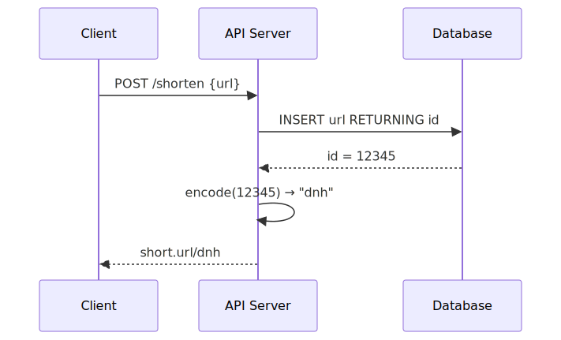
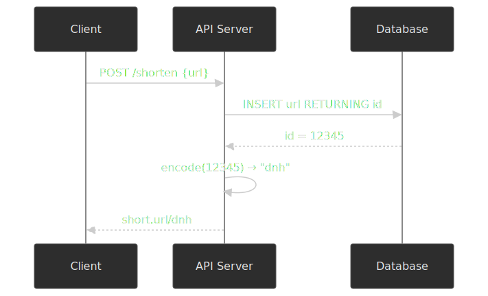

Pros: trivially correct, compact codes (sequential IDs Base62-encode to short strings), single source of truth.

Cons: a single writer is a single point of failure and a hard ceiling on write throughput; the IDs are guessable, exposing total link counts and enabling enumeration scraping. Workable for an internal tool or an MVP, indefensible at Bitly scale.

### Option B — Hash-based generation

Hash the long URL (MD5/SHA-256), truncate to the desired length, retry on collision.


Pros: deterministic — same long URL always produces the same short code, enabling natural deduplication. No central coordinator.

Cons: collisions are inevitable. With a 7-character Base62 keyspace ($62^7 \approx 3.52 \times 10^{12}$), the expected number of collisions across $N$ writes is approximately $\frac{N^2}{2 \cdot 62^7}$ — roughly 142 k collisions at 1 B URLs (about one write in 7 000) and 14 M at 10 B (about one in 700). Each collision means an extra round trip to the store and a salt-and-rehash retry. It also rules out user-chosen custom codes since they'd have to fit the same scheme.

### Option C — Snowflake (distributed time-ordered IDs)

Twitter's Snowflake[^snowflake-2010] packs a 64-bit ID as `[1 bit unused][41 bit timestamp ms since epoch][10 bit worker ID][12 bit sequence]`, yielding 4 096 IDs per millisecond per node and 1 024 nodes — about 4.1 M IDs/s aggregate at one-millisecond grain[^snowflake-wiki].


| Bits | Field      | Purpose                                                               |
| ---- | ---------- | --------------------------------------------------------------------- |
| 41   | Timestamp  | Milliseconds since a chosen epoch (≈ 69 years headroom)               |
| 10   | Node ID    | 1 024 unique generators (datacenter + worker)                         |
| 12   | Sequence   | 4 096 IDs/ms/node                                                     |

Pros: no coordination, time-ordered (good for range scans and analytics), proven at Twitter and adopted by Discord for snowflake-style message IDs[^discord-snowflake].

Cons: Base62-encoding a 64-bit integer produces an 11-character code, longer than what KGS or counter approaches yield. Operationally you must (a) prevent two nodes from ever sharing a node ID and (b) survive backwards clock jumps — the canonical implementations refuse to issue IDs until the clock recovers, which is a real availability event.

> [!NOTE]
> The epoch in a Snowflake implementation is arbitrary as long as it predates the first issued ID. Twitter chose `1288834974657` ms (2010-11-04T01:42:54.657 UTC)[^snowflake-2010]. Pick your own and document it; you cannot change it later without remapping every existing ID.

### Option D — Pre-generated Key Generation Service (KGS)

An offline process generates all short codes in advance and stores them in a `keys_unused` table. Application servers fetch batches into a local buffer and atomically move codes from `unused → allocated → used`.


Pros: zero collisions by construction; codes are short and configurable in length; custom user-chosen codes can be reserved out of the same pool.

Cons: storing the entire 6-character Base62 keyspace ($62^6 \approx 56.8 \times 10^9$ codes) at 6 B per code is roughly 400 GB raw — manageable but not trivial. KGS becomes a critical dependency on the write path, and key exhaustion needs to be alerted on long before it happens. App-server crashes orphan whatever codes were in their local buffer; at scale this is acceptable wastage.

### Comparison

| Factor               | Counter   | Hash    | Snowflake  | KGS           |
| -------------------- | --------- | ------- | ---------- | ------------- |
| Collision risk       | None      | Real    | None       | None          |
| Coordination on write| Required  | None    | None       | Batch fetch   |
| Code length          | Shortest  | Fixed   | 11 chars   | Configurable  |
| Predictability       | High      | Low     | Medium     | Low           |
| Horizontal scale     | Poor      | Good    | Excellent  | Good          |
| Custom codes         | Hard      | Hard    | Hard       | Native        |
| Operational burden   | Low       | Medium  | Medium     | High          |

This article focuses on a **KGS-primary, Snowflake-fallback** hybrid. KGS handles user-facing single-link creation (short codes, custom aliases). Snowflake covers programmatic / bulk writes where the longer code is acceptable and you do not want to pay a KGS round-trip.

## High-level design

### Request path

 into the per-domain core services.")

### Backing services


### Shortening service

Handles writes — validation, malware scanning, code assignment, persistence.

| Decision           | Choice                                                | Why                                                                   |
| ------------------ | ----------------------------------------------------- | --------------------------------------------------------------------- |
| Duplicate handling | Optional dedup, off by default                        | Tracking links want one code per click campaign; idempotent shortening would defeat that |
| URL validation     | Format synchronously, reachability via async HEAD     | Don't block the user on a slow destination                            |
| Scanning           | Synchronous for new domains, async for known-good     | Fast path for the long tail of safe traffic                            |
| Custom codes       | Reserved out of the KGS pool                          | Keeps the code space coherent; one source of truth                     |

### Redirect path

The 99 % case. Must be cheap, predictable, and never block on analytics or scanning.

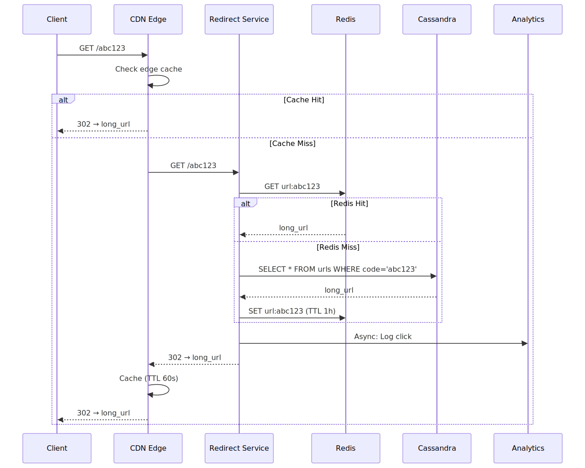
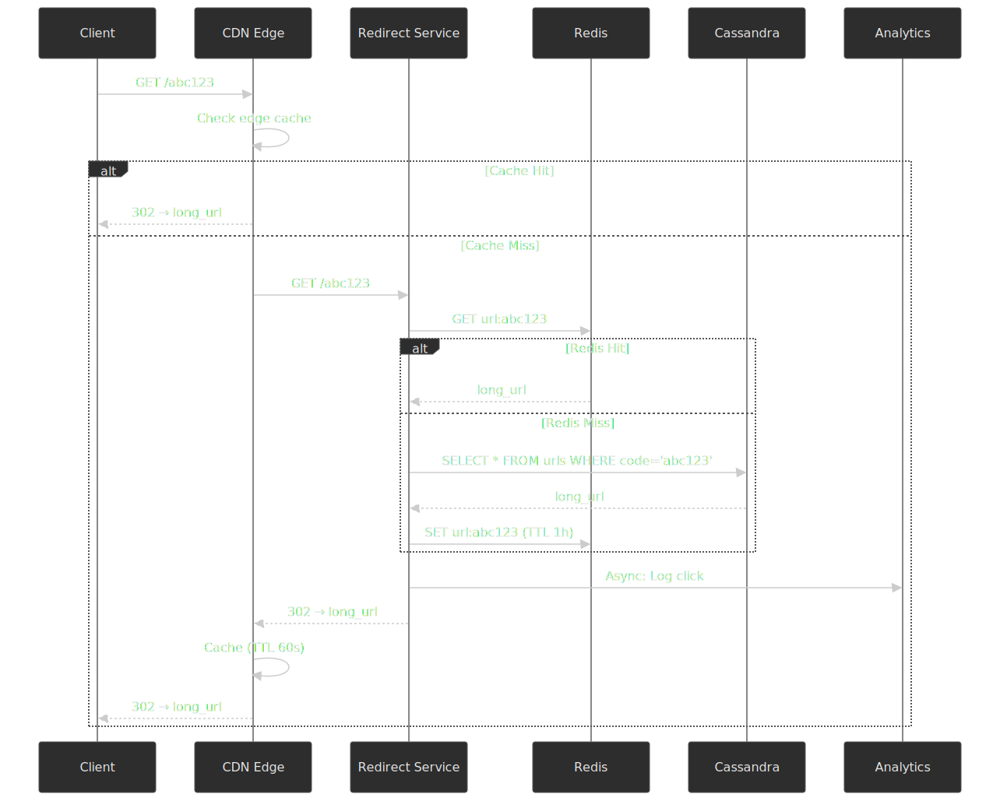

Why each layer is there:

- **CDN edge** (CloudFront / Fastly / Cloudflare) caches the `302` for the configured `max-age`. A viral link that goes from 0 → 100 k RPS gets absorbed entirely at the edge after the first hit per POP.
- **Redis cluster** caches everything that escapes the CDN. LRU eviction; a TTL of an hour or so keeps memory bounded.
- **Bloom filter** in Redis keeps cache-stampede-style attacks (spraying random codes that don't exist) from reaching the primary store. The trade-off is a fixed-cost false-positive rate. For a 1 B-item bloom filter at a 0.1 % false-positive rate, the canonical formula $m = -\frac{n \ln p}{(\ln 2)^2}$ gives ≈ 14.4 bits/element and roughly 1.7 GB of memory[^bloom-sizing].

> [!IMPORTANT]
> Use `302 Found` with `Cache-Control: private, max-age=60`. RFC 9111 makes `301` heuristically cacheable indefinitely by default; `302` is only cacheable when you opt in via explicit freshness headers[^rfc9111-302]. The explicit `max-age` lets the CDN absorb spikes for a minute while keeping clicks observable.

### Key Generation Service (KGS)


Allocation flow:

1. Each app server requests a batch (typically 1 000 codes).
2. The KGS atomically moves the batch from `unused` → `allocated` keyed by the requesting server's instance ID.
3. The app server holds the batch in memory and assigns codes locally.
4. On code use, the row moves from `allocated` → `used`.
5. On graceful shutdown, the server returns its unused tail; on a crash, those codes are orphaned. At scale, a few thousand orphaned codes per crash is irrelevant against billions of available codes.

Failure handling:

- **KGS unavailable.** App servers continue serving from their local buffers. Sized for ~1 hour of writes, this absorbs short outages; longer than that, the shortening API starts returning `503` while redirects keep working from cache and the primary store.
- **Key exhaustion.** Alert at 80 % of the unused pool consumed; trigger background generation. Never let the buffer drop below the time it takes to provision more codes.

### Analytics collector

Click data is captured outside the redirect path. The redirect handler emits a fire-and-forget event; everything downstream is best-effort with no SLO impact on the redirect.

```typescript title="ClickEvent.ts"
interface ClickEvent {
  shortCode: string
  timestamp: number

  // Captured at edge
  ipHash: string         // SHA-256 with rotating salt; never store raw IP for >1 day
  userAgent: string
  referer: string | null

  // Enriched downstream
  country: string
  city: string
  deviceType: "mobile" | "desktop" | "tablet"
  browser: string
  os: string

  isBot: boolean
  botType: string | null
}
```

Pipeline:

1. Redirect service appends to an in-memory buffer; flushed to Kafka in batches of 100 or every second.
2. Stream processor enriches events (geo-IP, UA parsing, bot detection).
3. Enriched events land in ClickHouse via batched inserts.
4. A real-time counter in Redis is updated for the API to read without hitting ClickHouse.

> [!CAUTION]
> Do not put click counters in the primary store as Cassandra `COUNTER` columns. Counter writes are not idempotent; on a write timeout the client cannot tell whether the increment succeeded, so a retry over-counts and a non-retry under-counts[^cassandra-counter]. Counter columns also can't share a table with non-counter data, can't have TTLs, and can't be part of a primary key. Keep "fresh" counters in Redis (atomic `INCR`) and authoritative aggregates in ClickHouse.

## API design

### Create short URL

`POST /api/v1/urls`

```json title="POST /api/v1/urls (request)"
{
  "url": "https://example.com/very/long/path?with=params",
  "customCode": "launch-2026",
  "expiresAt": "2027-12-31T23:59:59Z",
  "password": "optional-password",
  "maxClicks": 1000,
  "tags": ["campaign-2026", "social"]
}
```

```json title="POST /api/v1/urls (201 Created)"
{
  "id": "url_abc123def456",
  "shortCode": "launch-2026",
  "shortUrl": "https://suj.ee/launch-2026",
  "longUrl": "https://example.com/very/long/path?with=params",
  "createdAt": "2026-04-21T10:00:00Z",
  "expiresAt": "2027-12-31T23:59:59Z",
  "isPasswordProtected": true,
  "maxClicks": 1000,
  "clickCount": 0,
  "qrCode": "https://suj.ee/api/v1/urls/url_abc123def456/qr"
}
```

| Code | Error                 | When                                |
| ---- | --------------------- | ----------------------------------- |
| 400  | `INVALID_URL`         | Malformed scheme or unreachable URL |
| 400  | `INVALID_CUSTOM_CODE` | Code contains disallowed characters |
| 409  | `CODE_TAKEN`          | Custom code already in use          |
| 403  | `URL_BLOCKED`         | Destination flagged by scanner      |
| 429  | `RATE_LIMITED`        | Too many requests                   |

| Plan       | Create/hour | Create/day |
| ---------- | ----------- | ---------- |
| Free       | 50          | 500        |
| Pro        | 500         | 5 000      |
| Enterprise | 5 000       | Unlimited  |

### Redirect

`GET /{shortCode}` returns:

```http title="HTTP/1.1 302 Found"
HTTP/1.1 302 Found
Location: https://example.com/very/long/path
Cache-Control: private, max-age=60
X-Robots-Tag: noindex
```

| Code | When                                      |
| ---- | ----------------------------------------- |
| 404  | Short code not found                      |
| 410  | Link expired or disabled                  |
| 429  | Click limit exceeded                      |
| 403  | Password required (renders HTML form)     |

### Analytics

`GET /api/v1/urls/{id}/analytics`

| Param     | Type    | Default | Notes                                    |
| --------- | ------- | ------- | ---------------------------------------- |
| period    | string  | `7d`    | One of `24h`, `7d`, `30d`, `90d`, `custom` |
| startDate | ISO8601 | —       | Required when `period=custom`            |
| endDate   | ISO8601 | —       | Required when `period=custom`            |
| groupBy   | string  | `day`   | `hour`, `day`, `week`, `month`           |

```json title="Analytics response"
{
  "urlId": "url_abc123def456",
  "period": { "start": "2026-04-14T00:00:00Z", "end": "2026-04-21T23:59:59Z" },
  "summary": { "totalClicks": 15420, "uniqueClicks": 12350, "botClicks": 1230 },
  "timeSeries": [
    { "date": "2026-04-14", "clicks": 2100, "unique": 1800 },
    { "date": "2026-04-15", "clicks": 2450, "unique": 2100 }
  ],
  "topReferrers": [
    { "referrer": "x.com", "clicks": 5200, "percentage": 33.7 },
    { "referrer": "linkedin.com", "clicks": 3100, "percentage": 20.1 }
  ],
  "topCountries": [
    { "country": "US", "clicks": 6800, "percentage": 44.1 },
    { "country": "UK", "clicks": 2300, "percentage": 14.9 }
  ],
  "devices": {
    "mobile":  { "clicks": 9200, "percentage": 59.7 },
    "desktop": { "clicks": 5800, "percentage": 37.6 },
    "tablet":  { "clicks":  420, "percentage":  2.7 }
  }
}
```

### Bulk and listing

`POST /api/v1/urls/bulk` returns `202 Accepted` with a job ID; the caller polls `/api/v1/jobs/{id}`. `GET /api/v1/urls?cursor=...&limit=50` returns paginated user URLs with cursor-based navigation. Cursor pagination is deliberately chosen over offset because the underlying `urls_by_user` partition is sorted on `created_at DESC`.

## Data modeling

### URL mappings (Cassandra / ScyllaDB / DynamoDB)

The primary table is optimized for redirect lookups by `short_code`. Cassandra's `LeveledCompactionStrategy` is the right choice here: read-heavy workloads benefit from at-most-one-SSTable-per-level guarantees, at the cost of higher write amplification[^cassandra-lcs].

```cql title="url_mappings.cql"
CREATE TABLE url_mappings (
  short_code TEXT,
  long_url   TEXT,
  user_id    UUID,
  created_at TIMESTAMP,
  expires_at TIMESTAMP,
  is_active  BOOLEAN,
  password_hash TEXT,
  max_clicks INT,
  metadata MAP<TEXT, TEXT>,
  PRIMARY KEY (short_code)
) WITH default_time_to_live = 157680000  -- 5 years
  AND compaction = {'class': 'LeveledCompactionStrategy'}
  AND caching = {'keys': 'ALL', 'rows_per_partition': 'ALL'};
```

Note: `click_count` is **not** in this table. Counter columns force a separate counter-only table and bring the consistency footguns called out earlier; we keep the source of truth in ClickHouse and a fresh value in Redis.

A secondary table keyed by user supports the dashboard:

```cql title="urls_by_user.cql"
CREATE TABLE urls_by_user (
  user_id    UUID,
  created_at TIMESTAMP,
  short_code TEXT,
  long_url   TEXT,
  click_count BIGINT,
  is_active  BOOLEAN,
  PRIMARY KEY ((user_id), created_at, short_code)
) WITH CLUSTERING ORDER BY (created_at DESC);
```

This is a denormalized companion table written by the shortening service; the `click_count` here is a periodically refreshed cache from ClickHouse, not a live counter.

**Why a wide-column store at all?** O(1) lookups by partition key, horizontal scaling, tunable consistency (read `ONE` for redirects is fine; write `QUORUM` for shortening), and built-in TTL for expiration. ScyllaDB is a drop-in replacement that trades JVM dependence for a shard-per-core C++ runtime and reports lower p99 tail latencies in vendor benchmarks[^scylla-vs-cassandra]. DynamoDB is the AWS-native option with serverless billing; it enforces hard per-partition limits (3 000 RCU / 1 000 WCU) but uses adaptive capacity ("split for heat") to redistribute hot partitions automatically — important for viral links[^ddb-hot-partition].

### Click analytics (ClickHouse)

Raw click events land in a `MergeTree` partitioned by month; query workloads are served by materialized views.

```sql title="clicks.sql"
CREATE TABLE clicks (
  short_code String,
  clicked_at DateTime64(3),

  ip_hash    FixedString(16),
  country    LowCardinality(String),
  city       String,

  device_type Enum8('mobile' = 1, 'desktop' = 2, 'tablet' = 3),
  browser     LowCardinality(String),
  os          LowCardinality(String),

  referrer_domain LowCardinality(String),
  referrer_path   String,

  is_bot   UInt8,
  bot_type LowCardinality(String),

  date Date MATERIALIZED toDate(clicked_at),
  hour UInt8 MATERIALIZED toHour(clicked_at)
)
ENGINE = MergeTree()
PARTITION BY toYYYYMM(clicked_at)
ORDER BY (short_code, clicked_at)
TTL clicked_at + INTERVAL 1 YEAR;
```

For sums (`count()`), `SummingMergeTree` is the right materialized-view target. For unique counts, use `AggregatingMergeTree` with `uniqState()` and read with `uniqMerge()`; storing `uniqExact()` directly inside a `SummingMergeTree` does not aggregate further on subsequent merges and will quietly under-count[^clickhouse-mv]:

```sql title="clicks_daily_mv.sql"
CREATE MATERIALIZED VIEW clicks_daily_mv
ENGINE = AggregatingMergeTree()
PARTITION BY toYYYYMM(date)
ORDER BY (short_code, date, country, device_type)
AS SELECT
  short_code,
  date,
  country,
  device_type,
  countState()      AS clicks,
  uniqState(ip_hash) AS unique_clicks
FROM clicks
GROUP BY short_code, date, country, device_type;
```

ClickHouse strengths used here: columnar storage with `LowCardinality` dictionary encoding for the high-cardinality-low-value columns (country, browser, OS), `MergeTree` partition pruning by month for time-range queries, and TTL-driven retention. Best practice is ten-to-hundred partitions total, which `toYYYYMM` keeps you safely inside[^clickhouse-best].

### Users and configuration (PostgreSQL)

Relational data — accounts, custom domains, API keys — lives in PostgreSQL because it actually benefits from ACID transactions and joins.

```sql title="users.sql"
CREATE TABLE users (
  id UUID PRIMARY KEY DEFAULT gen_random_uuid(),
  email TEXT UNIQUE NOT NULL,
  password_hash TEXT NOT NULL,
  plan TEXT DEFAULT 'free',
  api_key_hash TEXT UNIQUE,
  created_at TIMESTAMPTZ DEFAULT NOW(),
  updated_at TIMESTAMPTZ DEFAULT NOW()
);

CREATE TABLE custom_domains (
  id UUID PRIMARY KEY DEFAULT gen_random_uuid(),
  user_id UUID REFERENCES users(id),
  domain TEXT UNIQUE NOT NULL,
  is_verified BOOLEAN DEFAULT false,
  ssl_status TEXT DEFAULT 'pending',
  created_at TIMESTAMPTZ DEFAULT NOW()
);

CREATE TABLE api_keys (
  id UUID PRIMARY KEY DEFAULT gen_random_uuid(),
  user_id UUID REFERENCES users(id),
  key_hash TEXT UNIQUE NOT NULL,
  name TEXT,
  permissions JSONB DEFAULT '["read", "write"]',
  last_used_at TIMESTAMPTZ,
  expires_at TIMESTAMPTZ,
  created_at TIMESTAMPTZ DEFAULT NOW()
);
```

### KGS storage (PostgreSQL)

The KGS lives in PostgreSQL because its work is small-volume, transactional, and benefits from `FOR UPDATE SKIP LOCKED` for collision-free batch allocation:

```sql title="kgs.sql"
CREATE TABLE keys_unused (
  short_code TEXT PRIMARY KEY,
  created_at TIMESTAMPTZ DEFAULT NOW()
);

CREATE TABLE keys_allocated (
  short_code   TEXT PRIMARY KEY,
  allocated_to TEXT NOT NULL,
  allocated_at TIMESTAMPTZ DEFAULT NOW()
);

CREATE TABLE keys_used (
  short_code TEXT PRIMARY KEY,
  used_at TIMESTAMPTZ DEFAULT NOW()
);

CREATE OR REPLACE FUNCTION allocate_keys(server_id TEXT, batch_size INT)
RETURNS TABLE(short_code TEXT) AS $$
BEGIN
  RETURN QUERY
  WITH allocated AS (
    DELETE FROM keys_unused
    WHERE short_code IN (
      SELECT ku.short_code
      FROM keys_unused ku
      LIMIT batch_size
      FOR UPDATE SKIP LOCKED
    )
    RETURNING keys_unused.short_code
  )
  INSERT INTO keys_allocated (short_code, allocated_to)
  SELECT a.short_code, server_id
  FROM allocated a
  RETURNING keys_allocated.short_code;
END;
$$ LANGUAGE plpgsql;
```

`FOR UPDATE SKIP LOCKED` is the key primitive — concurrent allocators don't block on each other's batches, they each grab the next available rows.

### Selection matrix

| Data                  | Store       | Why                                                    |
| --------------------- | ----------- | ------------------------------------------------------ |
| URL mappings          | Cassandra / ScyllaDB / DynamoDB | O(1) by partition key, horizontal scale, TTL |
| Click events          | ClickHouse  | Columnar, compression, sub-second aggregates           |
| User accounts         | PostgreSQL  | ACID, joins, native UUIDs, plenty fast at this size    |
| KGS keys              | PostgreSQL  | Transactional batch allocation with `SKIP LOCKED`      |
| Hot URL cache         | Redis       | Sub-ms `GET`, TTL, atomic operations                    |
| Rate limits           | Redis       | Atomic counters, sliding-window via sorted sets        |
| Bloom filter          | Redis (`RedisBloom`) | `BF.MEXISTS` membership for cheap negative lookups |

## Low-level design

### Base62 encoder

```typescript title="base62.ts" collapse={1-5}
const CHARSET = "0123456789ABCDEFGHIJKLMNOPQRSTUVWXYZabcdefghijklmnopqrstuvwxyz"
const BASE = BigInt(62)

export function encodeBase62(num: bigint): string {
  if (num === 0n) return CHARSET[0]
  let result = ""
  while (num > 0n) {
    result = CHARSET[Number(num % BASE)] + result
    num = num / BASE
  }
  return result
}

export function decodeBase62(str: string): bigint {
  let result = 0n
  for (const char of str) {
    const index = CHARSET.indexOf(char)
    if (index === -1) throw new Error(`Invalid character: ${char}`)
    result = result * BASE + BigInt(index)
  }
  return result
}

export function encodeBase62Padded(num: bigint, length: number): string {
  return encodeBase62(num).padStart(length, "0")
}
```

| Length | Combinations | Comfortable up to       |
| ------ | ------------ | ----------------------- |
| 6      | 56.8 B       | A small public service  |
| 7      | 3.5 T        | Bitly-class scale       |
| 8      | 218 T        | Internet-scale headroom |

### Snowflake generator

```typescript title="snowflake.ts" collapse={1-15}
const EPOCH = 1735689600000n // 2025-01-01T00:00:00Z; choose your own and never change it.
const NODE_BITS = 10n
const SEQUENCE_BITS = 12n

const MAX_NODE_ID = (1n << NODE_BITS) - 1n
const MAX_SEQUENCE = (1n << SEQUENCE_BITS) - 1n
const NODE_SHIFT = SEQUENCE_BITS
const TIMESTAMP_SHIFT = SEQUENCE_BITS + NODE_BITS

export class SnowflakeGenerator {
  private nodeId: bigint
  private sequence: bigint = 0n
  private lastTimestamp: bigint = -1n

  constructor(nodeId: number) {
    if (nodeId < 0 || BigInt(nodeId) > MAX_NODE_ID) {
      throw new Error(`Node ID must be between 0 and ${MAX_NODE_ID}`)
    }
    this.nodeId = BigInt(nodeId)
  }

  generate(): bigint {
    let timestamp = BigInt(Date.now()) - EPOCH

    if (timestamp < this.lastTimestamp) {
      // Clock moved backwards (NTP step). Refuse rather than risk duplicate IDs.
      throw new Error("Clock moved backwards; refusing to issue an ID")
    }

    if (timestamp === this.lastTimestamp) {
      this.sequence = (this.sequence + 1n) & MAX_SEQUENCE
      if (this.sequence === 0n) {
        timestamp = this.waitNextMillis(this.lastTimestamp)
      }
    } else {
      this.sequence = 0n
    }

    this.lastTimestamp = timestamp
    return (timestamp << TIMESTAMP_SHIFT) | (this.nodeId << NODE_SHIFT) | this.sequence
  }

  private waitNextMillis(lastTimestamp: bigint): bigint {
    let timestamp = BigInt(Date.now()) - EPOCH
    while (timestamp <= lastTimestamp) {
      timestamp = BigInt(Date.now()) - EPOCH
    }
    return timestamp
  }
}
```

The clock-backwards check is the operationally-important detail: NTP slewing is fine, but a sudden step backward would issue duplicates. Throwing is the canonical Twitter-implementation choice; the alternative is a wait-loop that turns a clock event into a service availability event.

### Redirect service with bloom filter

```typescript title="RedirectService.ts" collapse={1-20}
import { BloomFilter } from "bloom-filters"

interface RedirectResult {
  found: boolean
  longUrl?: string
  isExpired?: boolean
  requiresPassword?: boolean
}

class RedirectService {
  private readonly redis: RedisCluster
  private readonly cassandra: CassandraClient
  private readonly bloomFilter: BloomFilter
  private readonly analytics: AnalyticsCollector

  constructor() {
    // 1B items, 0.1% false-positive rate ≈ 14.4 bits/item ≈ 1.7 GB
    this.bloomFilter = BloomFilter.create(1_000_000_000, 0.001)
  }

  async redirect(shortCode: string, context: RequestContext): Promise<RedirectResult> {
    if (!this.bloomFilter.has(shortCode)) {
      return { found: false }
    }

    const cached = await this.redis.hgetall(`url:${shortCode}`)
    if (cached && cached.long_url) {
      this.logClick(shortCode, context)
      return this.buildResult(cached)
    }

    const row = await this.cassandra.execute(
      "SELECT * FROM url_mappings WHERE short_code = ?",
      [shortCode],
    )
    if (!row || row.length === 0) {
      return { found: false } // Bloom-filter false positive
    }

    const url = row[0]
    await this.redis.hset(`url:${shortCode}`, {
      long_url: url.long_url,
      expires_at: url.expires_at?.toISOString() || "",
      password_hash: url.password_hash || "",
      is_active: url.is_active ? "1" : "0",
    })
    await this.redis.expire(`url:${shortCode}`, 3600)

    this.logClick(shortCode, context)
    return this.buildResult(url)
  }

  private buildResult(data: any): RedirectResult {
    if (data.is_active === "0" || data.is_active === false) return { found: false }
    if (data.expires_at && new Date(data.expires_at) < new Date()) {
      return { found: true, isExpired: true }
    }
    if (data.password_hash) {
      return { found: true, requiresPassword: true, longUrl: data.long_url }
    }
    return { found: true, longUrl: data.long_url }
  }

  private logClick(shortCode: string, context: RequestContext): void {
    this.analytics
      .log({
        shortCode,
        timestamp: Date.now(),
        ip: context.ip,
        userAgent: context.userAgent,
        referer: context.referer,
      })
      .catch((err) => console.error("Analytics error:", err))
  }
}
```

### Sliding-window rate limiter

A standard sorted-set rate limiter. The Lua script keeps the read-modify-write atomic, which matters under burst load:

```typescript title="SlidingWindowRateLimiter.ts" collapse={1-12}
interface RateLimitResult {
  allowed: boolean
  remaining: number
  resetAt: number
}

class SlidingWindowRateLimiter {
  private readonly redis: RedisCluster

  async checkLimit(key: string, limit: number, windowMs: number): Promise<RateLimitResult> {
    const now = Date.now()
    const windowStart = now - windowMs

    const result = await this.redis.eval(
      `
      local key = KEYS[1]
      local now = tonumber(ARGV[1])
      local window_start = tonumber(ARGV[2])
      local limit = tonumber(ARGV[3])
      local window_ms = tonumber(ARGV[4])

      redis.call('ZREMRANGEBYSCORE', key, '-inf', window_start)
      local count = redis.call('ZCARD', key)

      if count < limit then
        redis.call('ZADD', key, now, now .. ':' .. math.random())
        redis.call('PEXPIRE', key, window_ms)
        return {1, limit - count - 1, now + window_ms}
      else
        local oldest = redis.call('ZRANGE', key, 0, 0, 'WITHSCORES')
        local reset_at = oldest[2] + window_ms
        return {0, 0, reset_at}
      end
      `,
      [key],
      [now, windowStart, limit, windowMs],
    )

    return { allowed: result[0] === 1, remaining: result[1], resetAt: result[2] }
  }
}
```

### URL scanner

```typescript title="URLScanner.ts" collapse={1-15}
interface ScanResult {
  isSafe: boolean
  threats: string[]
  scanTime: number
}

class URLScanner {
  private readonly blocklist: BlocklistService
  private readonly webRisk: WebRiskClient        // Google Web Risk API for commercial use
  private readonly virusTotal: VirusTotalClient
  private readonly redis: RedisCluster

  async scan(url: string): Promise<ScanResult> {
    const urlHash = this.hashUrl(url)

    const cached = await this.redis.get(`scan:${urlHash}`)
    if (cached) return JSON.parse(cached)

    const domain = new URL(url).hostname
    const threats: string[] = []

    if (await this.blocklist.contains(domain)) {
      return this.cacheResult(urlHash, { isSafe: false, threats: ["blocklist"], scanTime: Date.now() })
    }

    if (await this.isKnownGood(domain)) {
      return this.cacheResult(urlHash, { isSafe: true, threats: [], scanTime: Date.now() })
    }

    const wrResult = await this.webRisk.lookup(url)
    if (wrResult.threats.length > 0) threats.push(...wrResult.threats)

    if (await this.isSuspicious(domain)) {
      const vtResult = await this.virusTotal.scan(url)
      if (vtResult.positives > 2) threats.push("malware")
    }

    return this.cacheResult(urlHash, { isSafe: threats.length === 0, threats, scanTime: Date.now() })
  }

  private async cacheResult(hash: string, result: ScanResult): Promise<ScanResult> {
    const ttl = result.isSafe ? 86400 : 3600
    await this.redis.setex(`scan:${hash}`, ttl, JSON.stringify(result))
    return result
  }

  private async isKnownGood(domain: string): Promise<boolean> {
    return this.redis.sismember("domains:allowlist", domain)
  }

  private async isSuspicious(domain: string): Promise<boolean> {
    const domainAge = await this.getDomainAge(domain)
    return domainAge < 30
  }
}
```

> [!NOTE]
> Google Safe Browsing v4 is restricted to non-commercial use. Commercial URL shorteners must use the Google Web Risk API; the Lookup endpoint is rate-limited to 6 000 requests/minute per project, which is the natural ceiling on synchronous scanning[^web-risk].

### Analytics pipeline

```typescript title="AnalyticsCollector.ts" collapse={1-10}
interface ClickEvent {
  shortCode: string
  timestamp: number
  ip: string
  userAgent: string
  referer: string | null
}

class AnalyticsCollector {
  private readonly kafka: KafkaProducer
  private readonly buffer: ClickEvent[] = []
  private readonly BUFFER_SIZE = 100
  private readonly FLUSH_INTERVAL = 1000

  constructor() {
    setInterval(() => this.flush(), this.FLUSH_INTERVAL)
  }

  async log(event: ClickEvent): Promise<void> {
    this.buffer.push(event)
    if (this.buffer.length >= this.BUFFER_SIZE) await this.flush()
  }

  private async flush(): Promise<void> {
    if (this.buffer.length === 0) return
    const events = this.buffer.splice(0)
    await this.kafka.sendBatch({
      topic: "clicks",
      messages: events.map((e) => ({
        key: e.shortCode,
        value: JSON.stringify(e),
        timestamp: e.timestamp.toString(),
      })),
    })
  }
}

class ClickProcessor {
  private readonly clickhouse: ClickHouseClient
  private readonly geoIP: GeoIPService
  private readonly deviceParser: DeviceParser
  private readonly botDetector: BotDetector

  async process(event: ClickEvent): Promise<EnrichedClick> {
    const geo = await this.geoIP.lookup(event.ip)
    const device = this.deviceParser.parse(event.userAgent)
    const isBot = this.botDetector.detect(event.userAgent, event.ip)

    return {
      short_code: event.shortCode,
      clicked_at: new Date(event.timestamp),
      ip_hash: this.hashIP(event.ip),  // GDPR: rotating-salt hash; never persist raw IP
      country: geo.country,
      city: geo.city,
      device_type: device.type,
      browser: device.browser,
      os: device.os,
      referrer_domain: this.extractDomain(event.referer),
      referrer_path: this.extractPath(event.referer),
      is_bot: isBot.isBot ? 1 : 0,
      bot_type: isBot.type,
    }
  }

  private hashIP(ip: string): string {
    return crypto
      .createHash("sha256")
      .update(ip + process.env.IP_SALT)
      .digest("hex")
      .substring(0, 32)
  }
}
```

The salt is rotated on a schedule (typically daily) so that the hash is reversible only within the rotation window — long enough to deduplicate same-day visitors, short enough to limit GDPR exposure on any single salt leak.

## Failure modes and operational implications

This is the part the design has to survive in production.

### Viral hot keys

A single tweet can move a link from 0 to 100 k RPS in minutes. Mitigations stack:

- **CDN edge caching** is the primary defense — once the first request per POP populates the edge cache, the next 60 s are served entirely off the CDN and never touch your infrastructure.
- **Redis hot-key shielding.** If the same code shows up in your Redis cluster's hottest-key telemetry, optionally pin it to a local in-process cache on the redirect nodes for the duration of the spike.
- **Per-link rate caps** for free-tier abuse: a free-plan link with > 10 M clicks/hour is almost certainly being weaponized; throttle and alert.

### Cache-stampede on non-existent codes

A scanner spraying random codes that don't exist would bypass Redis (miss everywhere) and hammer the primary store. The bloom filter in front of Redis keeps roughly 99.9 % of these requests from ever reaching the primary store. False positives still pass through, which is why the Cassandra read is bounded with a small local connection pool.

### Abuse and link rot

URL shorteners are an ideal vector for phishing because the destination is opaque[^menlo-shortener-abuse]. Defense:

- **At creation time:** synchronous Web Risk API lookup, with a fast-path allowlist of well-known domains; suspicious domains (recently registered, unusual TLD) get a deeper VirusTotal scan.
- **Continuously:** rescan all live links periodically (a TTL-based queue keyed on `last_scanned_at`); flip `is_active = false` on links whose destination later turns malicious. The redirect path checks `is_active` on every read.
- **At request time:** rate-limit per source IP, and refuse to redirect requests with anomalous patterns (no `User-Agent`, suspicious `Referer`).

Link rot is the destination going away — your link is fine, but `destination.example.com/page` returns 404. Background HEAD-checking and a `last_known_status` column let you serve a graceful interstitial instead of a hard browser error.

### Counter drift

ClickHouse aggregates lag the redirect by 1–5 seconds. If the API is asked for "clicks right now", read from Redis (`INCR`-style fresh counter), not ClickHouse. Reconcile the two values periodically; small drift is acceptable, large drift means an analytics pipeline incident worth paging on.

### KGS exhaustion

The most embarrassing outage is "out of short codes". Alert on `keys_unused` dropping below your weekly burn rate, not below some absolute number. The generator job runs continuously off-peak; if it fails for a day, the alert fires before write capacity is at risk.

### Redirect-service partial outage

If Redis is degraded but the primary store is healthy, the redirect path slows down but stays correct. If the primary store is down, the bloom filter and Redis can serve roughly the cache hit rate — typically > 95 % — with the rest returning a temporary `503`. Do not return `404` for misses-through-degradation; that bakes a wrong answer into client and CDN caches.

## Frontend considerations

### The redirect handler is the hot path

```typescript title="redirect-handler.ts" collapse={1-8}
export async function handleRedirect(req: Request): Promise<Response> {
  const shortCode = req.url.split("/").pop()
  if (!isValidCode(shortCode)) {
    return new Response(null, { status: 404 })
  }

  const result = await redirectService.redirect(shortCode, {
    ip: req.headers.get("x-forwarded-for"),
    userAgent: req.headers.get("user-agent"),
    referer: req.headers.get("referer"),
  })

  if (!result.found) return new Response(null, { status: 404 })
  if (result.isExpired) return new Response("Link expired", { status: 410 })
  if (result.requiresPassword) return renderPasswordPage(shortCode)

  return new Response(null, {
    status: 302,
    headers: {
      Location: result.longUrl,
      "Cache-Control": "private, max-age=60",
      "X-Robots-Tag": "noindex",
    },
  })
}
```

### 302 vs 301 in practice

| Concern              | `301 Moved Permanently`                                | `302 Found`                                            |
| -------------------- | ------------------------------------------------------- | ------------------------------------------------------- |
| Default cacheability | Heuristically cacheable indefinitely (RFC 9111 §4.2.2)[^rfc9111-302] | Only cacheable with explicit freshness                  |
| Click tracking       | Misses cached repeat clicks                             | Tracks every click after `max-age` expires              |
| Updating destination | Browser/CDN may serve stale forever                     | Reflected after `max-age` expires                       |
| CDN strategy         | Long TTL is safe — but you can never retract            | Short TTL recommended (60 s typical)                    |

### Dashboard state

```typescript title="dashboardStore.ts" collapse={1-12}
interface DashboardState {
  urls: Map<string, URLSummary>
  selectedUrl: string | null
  analytics: AnalyticsData | null
  dateRange: DateRange
  isLoading: boolean
}

const useDashboardStore = create<DashboardState>((set, get) => ({
  urls: new Map(),
  selectedUrl: null,
  analytics: null,
  dateRange: { start: subDays(new Date(), 7), end: new Date() },
  isLoading: false,

  fetchUrls: async () => {
    set({ isLoading: true })
    const urls = await api.getUrls()
    set({ urls: new Map(urls.map((u) => [u.id, u])), isLoading: false })
  },

  selectUrl: async (urlId: string) => {
    set({ selectedUrl: urlId, isLoading: true })
    const analytics = await api.getAnalytics(urlId, get().dateRange)
    set({ analytics, isLoading: false })
  },

  updateDateRange: async (range: DateRange) => {
    set({ dateRange: range })
    const { selectedUrl } = get()
    if (selectedUrl) {
      set({ isLoading: true })
      const analytics = await api.getAnalytics(selectedUrl, range)
      set({ analytics, isLoading: false })
    }
  },
}))
```

### Real-time click counter

```typescript title="ClickStreamClient.ts" collapse={1-10}
class ClickStreamClient {
  private ws: WebSocket | null = null
  private subscriptions = new Set<string>()

  connect(authToken: string): void {
    this.ws = new WebSocket(`wss://api.suj.ee/ws?token=${authToken}`)
    this.ws.onmessage = (event) => {
      const data = JSON.parse(event.data)
      if (data.type === "click") this.handleClick(data.shortCode, data.count)
    }
  }

  subscribe(shortCode: string): void {
    this.subscriptions.add(shortCode)
    this.ws?.send(JSON.stringify({ action: "subscribe", shortCode }))
  }

  private handleClick(shortCode: string, count: number): void {
    useDashboardStore.getState().updateClickCount(shortCode, count)
  }
}
```

The WebSocket reads from the Redis fresh counter (via a thin pub/sub bridge), not from ClickHouse. Real-time means within 1 s of the click; dashboards pulling from ClickHouse are eventually consistent within the materialized-view refresh interval.

## Infrastructure

### Cloud-agnostic shape

| Component        | Purpose                          | Options                              |
| ---------------- | -------------------------------- | ------------------------------------ |
| CDN              | Edge cache, DDoS absorb          | Cloudflare, Fastly, CloudFront       |
| Load balancer    | Traffic distribution             | HAProxy, NGINX, AWS ALB              |
| Application      | Redirect, API                    | Node.js, Go, Rust                    |
| KV cache         | Hot URLs, rate limits, bloom     | Redis Cluster, KeyDB, Dragonfly      |
| Primary store    | URL mappings                     | Cassandra, ScyllaDB, DynamoDB        |
| Analytics store  | Click data                       | ClickHouse, Druid, TimescaleDB       |
| Message queue    | Analytics pipeline               | Kafka, Pulsar, Redpanda              |
| Object storage   | Exports, backups                 | S3, GCS, MinIO                       |

### AWS reference


| Service                      | Configuration                  | Why                                          |
| ---------------------------- | ------------------------------ | -------------------------------------------- |
| CloudFront                   | 200+ POPs                      | Global low-latency redirects                 |
| Redirect tier (Fargate)      | 2 vCPU, 4 GB, 50 tasks         | Stateless, scales horizontally               |
| Shortening tier (Fargate)    | 2 vCPU, 4 GB, 10 tasks         | Lower traffic, write-heavy                   |
| ElastiCache Redis            | r6g.xlarge cluster, 3 shards   | Hot URLs, rate limits, bloom                 |
| Amazon Keyspaces             | On-demand                      | Serverless Cassandra; auto-scales            |
| RDS PostgreSQL               | db.r6g.large Multi-AZ          | Users, KGS, configuration                    |
| MSK                          | kafka.m5.large × 3             | Click event streaming                        |

| Managed                | Self-hosted alternative   | When to switch                          |
| ---------------------- | ------------------------- | --------------------------------------- |
| Amazon Keyspaces       | ScyllaDB on EC2           | Cost at scale, p99 sensitivity          |
| ElastiCache            | Redis Cluster on EC2      | RedisBloom / specific modules           |
| CloudFront             | Cloudflare                | DDoS protection, predictable pricing    |
| MSK                    | Redpanda                  | Lower latency, simpler ops              |

### Monitoring

| Metric                | Alert at  | Action                                       |
| --------------------- | --------- | -------------------------------------------- |
| Redirect latency p99  | > 100 ms  | Check Redis health, CDN cache-hit ratio      |
| CDN cache-hit ratio   | < 80 %    | Review `Cache-Control`; scope `Vary` headers |
| 404 rate              | > 5 %     | Likely a scanner; check WAF rules            |
| KGS unused inventory  | < 1 week of writes | Trigger key generation                |
| Analytics lag         | > 60 s    | Scale Kafka consumers; check ClickHouse      |
| Counter drift (ClickHouse vs Redis) | > 5 % | Pipeline incident; investigate         |

Each redirect carries a trace ID propagated through CDN → LB → service → cache → store → analytics. Sample rate is 100 % for errors and 1 % for normal traffic — enough to characterize p99 without paying the cost of full sampling at the redirect tier.

## Practical takeaways

- **The redirect path is the product.** Optimize relentlessly for it; everything else exists to serve it without slowing it down.
- **`302` with a short explicit `Cache-Control: max-age` is the right default.** `301` only if you genuinely don't need analytics and are sure the destination is forever.
- **KGS for primary code generation, Snowflake for bulk/programmatic.** This avoids the worst of both — collision overhead and unnecessary code length.
- **Counters never live in the primary store.** Cassandra `COUNTER` columns invite over- and under-counting on retries; use Redis for fresh values and ClickHouse for authoritative totals.
- **Bloom filter sizing is math, not vibes.** $m = -n \ln p / (\ln 2)^2$; 1 B items at 0.1 % FPR is ≈ 1.7 GB.
- **Plan for the viral spike, not the steady state.** A single link can move 80 % of daily traffic in minutes; CDN-first design is non-negotiable.
- **Abuse defense is a continuous job, not a creation-time check.** Live-rescan known links; flip `is_active` when a destination turns bad.

## Appendix

### Prerequisites

- Distributed-systems fundamentals: replication, consistent hashing, quorum reads/writes.
- Database trade-offs: when SQL beats NoSQL and vice versa.
- HTTP redirect semantics — RFC 9110 §15.4.2 (301), §15.4.3 (302); RFC 9111 §4.2.2 (heuristic freshness).
- Caching strategies: TTL, eviction policies, hot-key behavior.

### Terminology

| Term                   | Definition                                                                   |
| ---------------------- | ---------------------------------------------------------------------------- |
| Base62                 | Encoding using `0-9 A-Z a-z` for URL-safe short codes                        |
| Snowflake ID           | Twitter's distributed ID format: timestamp + worker + sequence in 64 bits   |
| KGS                    | Key Generation Service — pre-allocates unique short codes                    |
| Bloom filter           | Probabilistic membership test; never says "no" wrong, can say "yes" wrong   |
| Consistent hashing     | Sharding scheme that minimizes data movement on cluster-membership changes  |
| CDN                    | Content Delivery Network — edge caching for global low latency              |
| Hot key                | A cache key receiving disproportionate traffic (viral links)                |

### References

- [Bitly — Lessons Learned Building a Distributed System That Handles 6 Billion Clicks a Month (2014)](https://highscalability.com/bitly-lessons-learned-building-a-distributed-system-that-han/) — primary source for scale numbers and SOA architecture pattern.
- [Bitly — NSQ: realtime distributed message processing at scale](https://word.bitly.com/post/33232969144/nsq) — origin of NSQ; useful baseline for async messaging design.
- [Twitter Engineering — Announcing Snowflake (2010)](https://blog.x.com/engineering/en_us/a/2010/announcing-snowflake) — original Snowflake design.
- [Snowflake ID — Wikipedia](https://en.wikipedia.org/wiki/Snowflake_ID) — concise reference for the 64-bit layout.
- [RFC 9110 — HTTP Semantics, §15.4.2 (301), §15.4.3 (302)](https://www.rfc-editor.org/rfc/rfc9110.html#name-301-moved-permanently)
- [RFC 9111 — HTTP Caching, §4.2.2 (Calculating Heuristic Freshness)](https://www.rfc-editor.org/rfc/rfc9111.html#name-calculating-heuristic-fresh)
- [Apache Cassandra — Counter columns (`COUNTER` data type)](https://cassandra.apache.org/doc/stable/cassandra/cql/types.html)
- [Apache Cassandra — Leveled Compaction Strategy](https://cassandra.apache.org/doc/latest/cassandra/managing/operating/compaction/lcs.html)
- [Google Web Risk API — Quotas and limits](https://docs.cloud.google.com/web-risk/quotas)
- [ClickHouse — Use materialized views](https://clickhouse.com/docs/best-practices/use-materialized-views) and [Top 10 best practices](https://clickhouse.com/blog/10-best-practice-tips)
- [AWS Database Blog — DynamoDB partitions, hot keys, and split-for-heat](https://aws.amazon.com/blogs/database/part-2-scaling-dynamodb-how-partitions-hot-keys-and-split-for-heat-impact-performance/)

[^bitly-scale]: [Bitly: Lessons Learned Building a Distributed System That Handles 6 Billion Clicks a Month](https://highscalability.com/bitly-lessons-learned-building-a-distributed-system-that-han/), High Scalability summary of a Bitly engineering presentation, July 2014. Subsequent industry coverage put Bitly at 9–11 B clicks/month by late 2017.

[^snowflake-2010]: [Announcing Snowflake](https://blog.x.com/engineering/en_us/a/2010/announcing-snowflake), Twitter (now X) Engineering Blog, June 2010. Custom epoch `1288834974657` ms = 2010-11-04T01:42:54.657 UTC.

[^snowflake-wiki]: [Snowflake ID](https://en.wikipedia.org/wiki/Snowflake_ID), Wikipedia, accessed 2026-04-21.

[^discord-snowflake]: [Discord Developer Documentation — Snowflakes](https://discord.com/developers/docs/reference#snowflakes).

[^rfc9111-302]: [RFC 9111 §4.2.2 (Calculating Heuristic Freshness)](https://www.rfc-editor.org/rfc/rfc9111.html#name-calculating-heuristic-fresh) and [RFC 9110 §15.4.3 (302 Found)](https://www.rfc-editor.org/rfc/rfc9110.html#status.302). 301 responses are heuristically cacheable; 302 responses are cacheable only when the response includes explicit freshness information (e.g. `Cache-Control: max-age` or `Expires`).

[^cassandra-counter]: [Apache Cassandra — Data Types: counter](https://cassandra.apache.org/doc/stable/cassandra/cql/types.html) on counter limitations; [Cassandra counter columns: nice in theory, hazardous in practice](https://ably.com/blog/cassandra-counter-columns-nice-in-theory-hazardous-in-practice), Ably Engineering, for a production-experience perspective on retry and replica-failure semantics.

[^cassandra-lcs]: [Apache Cassandra — Leveled Compaction Strategy](https://cassandra.apache.org/doc/latest/cassandra/managing/operating/compaction/lcs.html). Note that Cassandra 5.0 introduces UCS (Unified Compaction Strategy); LCS remains valid for read-dominant workloads.

[^web-risk]: [Google Web Risk — Quotas and limits](https://docs.cloud.google.com/web-risk/quotas) and [Safe Browsing APIs (v4) Overview](https://developers.google.com/safe-browsing/v4) on the non-commercial restriction.

[^bloom-sizing]: Bloom-filter bit count $m = -\frac{n \ln p}{(\ln 2)^2}$ and optimal hash count $k = \frac{m}{n} \ln 2$. For $n = 10^9$ and $p = 0.001$: $m \approx 1.44 \times 10^{10}$ bits ($\approx 1.7$ GB), $k = 10$. See [Bloom filter calculator](https://hur.st/bloomfilter/) and the [Redis Bloom filter docs](https://redis.io/docs/latest/develop/data-types/probabilistic/bloom-filter/) bits-per-element table.

[^clickhouse-mv]: See [ClickHouse — Use materialized views](https://clickhouse.com/docs/best-practices/use-materialized-views) and the engine-specific docs for [`SummingMergeTree`](https://clickhouse.com/docs/engines/table-engines/mergetree-family/summingmergetree) and `AggregatingMergeTree`. `SummingMergeTree` only sums numeric columns on merge; non-additive aggregates such as `uniqExact` belong in `AggregatingMergeTree` with `*State` / `*Merge` functions.

[^clickhouse-best]: [Top 10 best practices tips for ClickHouse](https://clickhouse.com/blog/10-best-practice-tips), ClickHouse Blog. Recommends 10–100 partitions total; `toYYYYMM` is the typical default.

[^scylla-vs-cassandra]: [ScyllaDB vs. Apache Cassandra](https://www.scylladb.com/compare/scylladb-vs-apache-cassandra/), ScyllaDB. Vendor source — values are indicative, not independent benchmarks.

[^ddb-hot-partition]: [Scaling DynamoDB: how partitions, hot keys, and split-for-heat impact performance](https://aws.amazon.com/blogs/database/part-2-scaling-dynamodb-how-partitions-hot-keys-and-split-for-heat-impact-performance/), AWS Database Blog.

[^menlo-shortener-abuse]: [URL shortening allows threats to evade URL filtering and categorization tools](https://www.menlosecurity.com/blog/url-shortening-allows-threats-to-evade-url-filtering-and-categorization-tools), Menlo Security.
