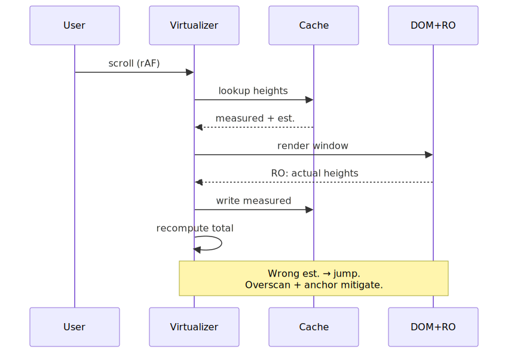
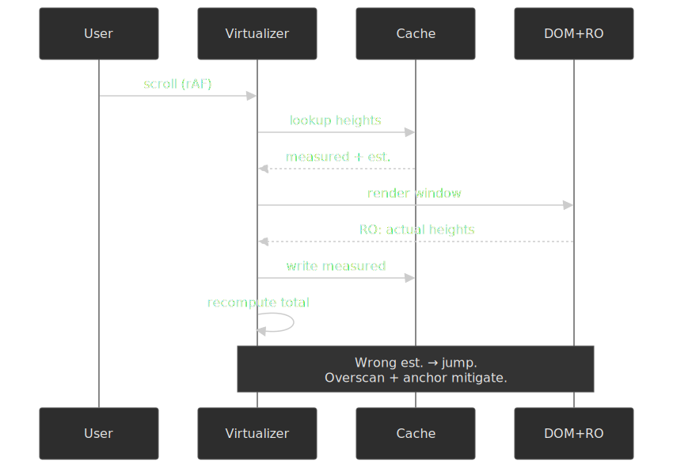

# Virtualization and Windowing

Rendering 1,000+ items naively builds a DOM tree large enough that style and layout alone block the main thread for hundreds of milliseconds — far past the 16.7 ms frame budget at 60 fps[^rail]. Virtualization sidesteps that by rendering only the items currently in the viewport plus a small overscan buffer, keeping the DOM at `O(viewport)` regardless of total list length. The trade-off you accept in exchange: more code, scroll-position bookkeeping, and a cluster of accessibility, search, and anchor-link regressions you have to engineer around.




## Mental model

Virtualization is a **viewport-centric rendering strategy**: compute which items fall inside the visible window, render only those plus an overscan buffer, and position them with GPU-accelerated transforms instead of layout-triggering properties. The core insight: users can only see one viewport at a time, so anything else is wasted layout, paint, and memory.

Three implementation shapes dominate, plus one CSS-only alternative:

1. **Fixed-height** — pure arithmetic positioning when every item is the same height. Simplest, fastest, rarely matches real content.
2. **Variable-height** — measure as you render, cache heights, estimate the unmeasured. Production standard for dynamic content.
3. **DOM recycling** — keep a fixed pool of nodes; reposition and rebind their content as the user scrolls. Eliminates allocation churn.
4. **CSS `content-visibility: auto`** — defer layout/paint for off-screen elements while keeping the full DOM. Preserves find-in-page and anchor links; trades virtualization's memory savings for a CSS-only implementation.

The constraints that shape all four:

- **Frame budget.** 16.67 ms per frame at 60 fps; the browser eats roughly 4 ms of that for its own work, leaving ~10–12 ms for JS, style, and layout combined[^web-rendering].
- **Compositor-only positioning.** `transform: translateY()` runs on the compositor thread; `top`/`margin-top` triggers layout on every scroll frame[^compositor-only][^lighthouse-noncomp].
- **Measurement APIs.** `ResizeObserver` for heights[^resize-observer-spec], `IntersectionObserver` for viewport entry[^intersection-observer].
- **Accessibility.** Screen readers see only what's in the DOM, so virtualized content needs ARIA scaffolding (`aria-setsize`, `aria-posinset`) and explicit focus management.

## When you actually need it

| Item count | Without virtualization                   | With virtualization |
| ---------- | ---------------------------------------- | ------------------- |
| 50–100     | Acceptable on desktop, measure on mobile | Optional            |
| 500+       | Noticeable jank on scroll                | Recommended         |
| 1,000+     | Blocked frames, dropped scroll input     | Required            |
| 10,000+    | Unusable on mid-range hardware           | Only viable path    |

Two operational facts drive these thresholds:

- **Layout scales with DOM size.** Style recalc and layout walk the tree, so the cost grows with element count even when only a fraction is on screen.
- **Memory pressure on mobile.** Each DOM node carries a JS wrapper, computed style, and layout box. On low-end Android (effective JS heap of 50–100 MB), 10,000+ nodes can trigger GC pauses or out-of-memory crashes[^web-rendering].

The reader-facing requirements that constrain the implementation:

- Scroll must feel native — no jumps, no blank flashes.
- Arrow keys, click, and focus respond well under 100 ms[^rail].
- Scrollbar drag to arbitrary positions must produce the right items, not a misaligned approximation.
- Cmd/Ctrl+F should find content — and this is exactly what naive virtualization breaks.

## The four design paths

### Path 1 — Fixed-height virtualization

When every item shares the same height, positioning is pure arithmetic. No measurement, no cache, no estimation error.

```typescript title="fixed-height-virtualizer.ts" collapse={1-3,29-35}
import { useState, useCallback } from 'react';

interface FixedVirtualizerProps<T> {
  items: T[];
  itemHeight: number;
  containerHeight: number;
  overscan?: number;
  renderItem: (item: T, index: number) => React.ReactNode;
}

function FixedVirtualizer<T>({
  items,
  itemHeight,
  containerHeight,
  overscan = 3,
  renderItem,
}: FixedVirtualizerProps<T>) {
  const [scrollTop, setScrollTop] = useState(0);

  const startIndex = Math.max(0, Math.floor(scrollTop / itemHeight) - overscan);
  const endIndex = Math.min(
    items.length,
    Math.ceil((scrollTop + containerHeight) / itemHeight) + overscan
  );

  const visibleItems = items.slice(startIndex, endIndex);
  const offsetY = startIndex * itemHeight;
  const totalHeight = items.length * itemHeight;

  const handleScroll = useCallback((e: React.UIEvent<HTMLDivElement>) => {
    setScrollTop(e.currentTarget.scrollTop);
  }, []);

  return (
    <div style={{ height: containerHeight, overflow: 'auto' }} onScroll={handleScroll}>
      <div style={{ height: totalHeight, position: 'relative' }}>
        <div style={{ transform: `translateY(${offsetY}px)` }}>
          {visibleItems.map((item, i) => (
            <div key={startIndex + i} style={{ height: itemHeight }}>
              {renderItem(item, startIndex + i)}
            </div>
          ))}
        </div>
      </div>
    </div>
  );
}
```

The critical line is `transform: translateY()` — it runs on the compositor thread without triggering layout or paint when the element is on its own compositor layer[^compositor-only][^lighthouse-noncomp]. Use `top`, `margin-top`, or `position: absolute; top` and you trigger a full layout pass on every scroll frame, which is the single most common reason a "virtualized" list still drops frames.

| Metric                    | Value                           |
| ------------------------- | ------------------------------- |
| DOM nodes                 | O(viewport) — typically 20–50   |
| Layout time               | 1–3 ms per frame                |
| Memory                    | O(viewport) — no cache needed   |
| Scroll performance        | Steady 60 fps                   |
| Implementation complexity | Low                             |

**Best for** log viewers, monospace text, simple data tables with uniform rows, and any list where uniform height is acceptable.

**Trade-offs**

- Simplest implementation; smallest bundle contribution.
- Pure-math positioning means consistent, predictable performance.
- Real content (images, variable text, expandable sections) almost never fits the fixed-height assumption.

VS Code's editor view has historically used this shape — line-based virtualization with monospace lines that share a height, which is what makes positioning sub-millisecond on 100K+-line files. It now also supports variable line heights via decorations[^vscode-variable-line-heights], but the fast path is still fixed.

### Path 2 — Variable-height virtualization

Items are measured as they mount via `ResizeObserver`; measurements feed a height cache; unmeasured items are positioned with an estimate. This is the production default for any feed-style content.

```typescript title="variable-height-virtualizer.ts" collapse={1-5,60-80}
import { useState, useEffect, useRef, useCallback } from "react"

interface VariableVirtualizerProps<T> {
  items: T[]
  estimatedItemHeight: number
  containerHeight: number
  overscan?: number
  renderItem: (item: T, index: number, measureRef: (el: HTMLElement | null) => void) => React.ReactNode
}

function VariableVirtualizer<T>({
  items,
  estimatedItemHeight,
  containerHeight,
  overscan = 3,
  renderItem,
}: VariableVirtualizerProps<T>) {
  const [scrollTop, setScrollTop] = useState(0)
  const [heightCache, setHeightCache] = useState<Map<number, number>>(new Map())

  const getItemOffset = (index: number): number => {
    let offset = 0
    for (let i = 0; i < index; i++) {
      offset += heightCache.get(i) ?? estimatedItemHeight
    }
    return offset
  }

  const findStartIndex = (scrollPos: number): number => {
    let low = 0,
      high = items.length - 1
    while (low < high) {
      const mid = Math.floor((low + high) / 2)
      if (getItemOffset(mid + 1) <= scrollPos) {
        low = mid + 1
      } else {
        high = mid
      }
    }
    return Math.max(0, low - overscan)
  }

  const startIndex = findStartIndex(scrollTop)

  let endIndex = startIndex
  let accumulatedHeight = 0
  while (endIndex < items.length && accumulatedHeight < containerHeight + overscan * estimatedItemHeight) {
    accumulatedHeight += heightCache.get(endIndex) ?? estimatedItemHeight
    endIndex++
  }
  endIndex = Math.min(items.length, endIndex + overscan)

  const totalHeight = getItemOffset(items.length)
  const offsetY = getItemOffset(startIndex)

  const measureElement = useCallback(
    (index: number) => (el: HTMLElement | null) => {
      if (el) {
        const observer = new ResizeObserver(([entry]) => {
          const height = entry.contentRect.height
          setHeightCache((prev) => {
            if (prev.get(index) === height) return prev
            const next = new Map(prev)
            next.set(index, height)
            return next
          })
        })
        observer.observe(el)
        return () => observer.disconnect()
      }
    },
    [],
  )

  // ... scroll handler and render logic
}
```

The flow that the code above hides — measure, cache, render, correct — is what makes variable-height feel jumpy if you don't engineer it carefully:




#### The estimation problem

When the user drags the scrollbar to an arbitrary position, the virtualizer must position items it has never measured. Initial render uses estimates; if those estimates are wrong, the corrected positions cause a visible jump as `ResizeObserver` callbacks land. Mitigations stack:

1. **Type-based estimates.** If items have a discriminating type (text, image, embed, card), keep per-type averages instead of one global number.
2. **Running average.** Track the mean of measured heights and use it for new estimates.
3. **Larger overscan in the scroll direction.** Render extra items past the viewport so estimation errors correct off-screen.
4. **Progressive scroll correction.** Adjust scroll position smoothly rather than snapping when measurements arrive.

#### How `ResizeObserver` actually delivers

Two non-obvious facts from the spec are worth internalizing because they shape what you can do inside a measurement callback.

`ResizeObserver` reports content-box geometry (`contentRect`) by default, which excludes padding, border, and margin[^resize-observer-mdn]. If your item layout depends on margins, fold them in explicitly:

```typescript title="margin-aware-measurement.ts"
const computedStyle = getComputedStyle(element)
const marginTop = parseFloat(computedStyle.marginTop)
const marginBottom = parseFloat(computedStyle.marginBottom)
const totalHeight = entry.contentRect.height + marginTop + marginBottom
```

The spec prevents infinite resize loops with a **depth-based** delivery rule, not breadth-first: each iteration of the delivery loop only reports observations for elements **deeper in the DOM tree than the shallowest element delivered in the previous iteration**. If the loop terminates with skipped observations still pending, the user agent fires the `ResizeObserver loop completed with undelivered notifications` error and defers the rest to the next frame[^resize-observer-spec][^resize-observer-mdn]. This is why a measurement callback that mutates ancestors of the observed element typically surfaces as that error in production telemetry — and why scheduling such mutations through `requestAnimationFrame` (so they land in the next frame) usually fixes it.

| Metric                    | Value                                       |
| ------------------------- | ------------------------------------------- |
| DOM nodes                 | O(viewport) — typically 20–50               |
| Layout time               | 2–5 ms (measurement overhead)               |
| Memory                    | O(n) for height cache in worst case         |
| Scroll performance        | 30–60 fps depending on measurement frequency |
| Implementation complexity | High                                        |

**Best for** social feeds, chat with mixed media, any dynamic content where you can't enforce a single height.

### Path 3 — DOM recycling

Instead of mounting and unmounting nodes as items enter or leave the viewport, recycle a fixed pool: when an item scrolls out, its DOM node is repositioned and its content rebound to the new item.

```typescript title="dom-recycling-concept.ts"
class DOMRecycler {
  private pool: HTMLElement[] = []
  private poolSize: number

  constructor(viewportSize: number, overscan: number) {
    this.poolSize = viewportSize + overscan * 2
    this.initializePool()
  }

  private initializePool() {
    for (let i = 0; i < this.poolSize; i++) {
      const element = document.createElement("div")
      element.className = "virtual-item"
      this.pool.push(element)
    }
  }

  recycleElement(element: HTMLElement, newItem: Item, newPosition: number) {
    element.textContent = newItem.content
    element.style.transform = `translateY(${newPosition}px)`
  }
}
```

Why recycling helps once mount/unmount churn is the bottleneck:

- **No GC pressure.** Allocation per scroll frame is the part that triggers the worst GC pauses; reusing nodes flattens that.
- **Warm style cache.** Reused nodes carry their cached computed style; the engine can skip work on common branches.
- **Constant memory.** Pool size is set up front; total list length doesn't change it.

| Metric         | Value                           |
| -------------- | ------------------------------- |
| DOM nodes      | Fixed pool size (constant)      |
| GC pauses      | Eliminated during scroll        |
| Memory pattern | Flat — no growth with scroll    |
| Initial render | Slightly slower (pool creation) |

[AG Grid uses DOM virtualization for both rows and columns](https://www.ag-grid.com/javascript-data-grid/dom-virtualisation/) — the docs explicitly call out that elements are inserted and removed as the user scrolls, with a default `rowBuffer` of 10 around the viewport, and that disabling virtualization "significantly increases the memory footprint and slows down the browser". For a 100K-row grid the rendered DOM stays in the dozens, not the hundreds of thousands.

### Path 4 — CSS `content-visibility: auto`

`content-visibility` tells the browser to skip rendering work for off-screen elements while keeping them in the DOM[^cv-mdn].

```css title="content-visibility-example.css"
.list-item {
  content-visibility: auto;
  contain-intrinsic-size: 0 100px; /* placeholder size while off-screen */
}
```

The values:

- `visible` (default) — render normally.
- `auto` — apply size containment and skip layout/paint while off-screen; render normally when it scrolls in.
- `hidden` — never render contents (cheaper than `display: none` for show/hide because the rendering tree state is preserved).

`contain-intrinsic-size` is **mandatory in practice for scrollable lists**. Under `content-visibility: auto`, off-screen elements receive size containment and the browser treats their contents as if they were empty, defaulting their box to `0px`. Without `contain-intrinsic-size` they collapse out of the layout, the scroll container shrinks, and the scrollbar position jitters as elements enter the viewport[^cv-mdn][^cis-mdn].

#### Browser support and Baseline status

`content-visibility` reached **Baseline Newly Available** on 2025-09-15[^cv-baseline]. Per [caniuse](https://caniuse.com/css-content-visibility): Chrome/Edge 85+, Firefox 125+ (April 2024), Safari 18.0+ (September 2024). Older Safari has partial support; full support landed in Safari 26 in 2025.

> [!NOTE]
> If you ship to a userbase that includes Safari 17 or Firefox ESR pinned below 125, treat `content-visibility` as a progressive enhancement: feature-detect with `CSS.supports('content-visibility', 'auto')` and fall back to virtualization (or no optimization) for unsupported clients.

| Metric                    | Value                                            |
| ------------------------- | ------------------------------------------------ |
| DOM nodes                 | All items remain in DOM                          |
| Layout time               | O(viewport) for layout/paint; O(n) for style     |
| Memory                    | O(n) — every item exists                         |
| Find-in-page              | Works natively                                   |
| Anchor links              | Work natively                                    |
| Implementation complexity | Trivial (CSS only)                               |

**Trade-offs vs virtualization**

| Capability            | Virtualization   | content-visibility |
| --------------------- | ---------------- | ------------------ |
| Find-in-page (Ctrl+F) | Broken           | Works              |
| Anchor links (`#id`)  | Broken           | Works              |
| Memory usage          | O(viewport)      | O(n)               |
| Bundle size impact    | Library required | Zero (CSS)         |
| Browser support       | Universal        | Baseline 2025      |
| Accessibility         | Requires ARIA    | Native (DOM intact) |

**Use `content-visibility` over virtualization when** the list has fewer than ~10K items, memory is not the binding constraint, find-in-page or anchor links matter, or you want the cheapest possible implementation.

The web.dev case study reports a 7× rendering improvement on a chunked travel-blog page — initial rendering time dropped from 232 ms to 30 ms after applying `content-visibility: auto` to article sections — without changing any DOM structure[^cv-webdev].

### Decision framework




| Factor                | Fixed-height | Variable-height | DOM recycling | content-visibility |
| --------------------- | ------------ | --------------- | ------------- | ------------------ |
| Item count limit      | Unlimited    | Unlimited       | Unlimited     | ~10K (memory)      |
| Dynamic heights       | No           | Yes             | Yes           | Yes                |
| Find-in-page          | No           | No              | No            | Yes                |
| Anchor navigation     | No           | No              | No            | Yes                |
| Memory efficiency     | High         | Medium          | High          | Low                |
| Implementation effort | Low          | High            | High          | Trivial            |
| GC pauses             | Possible     | Possible        | Eliminated    | Possible           |
| Browser support       | Universal    | Universal       | Universal     | Baseline 2025      |

## Browser APIs you actually use

### `ResizeObserver` for height measurement

`ResizeObserver` reports element-size changes asynchronously, avoiding the synchronous layout cost of `getBoundingClientRect()` calls in a scroll handler[^resize-observer-spec].

```typescript title="resize-observer-measurement.ts" collapse={1-2,20-25}
function measureItemHeight(element: HTMLElement, onMeasure: (height: number) => void): () => void {
  const observer = new ResizeObserver((entries) => {
    const height = entries[0].contentRect.height
    onMeasure(height)
  })

  observer.observe(element)

  return () => observer.disconnect()
}
```

See [§ How ResizeObserver actually delivers](#how-resizeobserver-actually-delivers) above for the depth-based loop limit and what it means for callback design.

### `IntersectionObserver` for visibility detection

`IntersectionObserver` reports viewport entries and exits asynchronously, batched, and without forcing synchronous layout[^intersection-observer]. The canonical use in a virtualized list is a sentinel for infinite-scroll loading, not the per-item visibility bookkeeping (the virtualizer does that with arithmetic).

```typescript title="intersection-observer-sentinel.ts" collapse={1-2}
function setupLoadMoreTrigger(sentinel: HTMLElement, onVisible: () => void) {
  const observer = new IntersectionObserver(
    (entries) => {
      if (entries[0].isIntersecting) {
        onVisible()
      }
    },
    {
      rootMargin: "200px",
      threshold: 0,
    },
  )

  observer.observe(sentinel)
  return () => observer.disconnect()
}
```

Why prefer it over `scroll`-event tracking:

- Calculations are off the main thread.
- It does not force synchronous layout the way a scroll-event handler that reads geometry does.
- Multiple intersections deliver in one callback.

### `requestAnimationFrame` for scroll handling

`scroll` events fire many times per frame on touch devices and high-refresh displays. Coalescing into a single `requestAnimationFrame` callback prevents redundant work.

```typescript title="raf-scroll-handling.ts"
let scheduled = false
let lastScrollTop = 0

function handleScroll(e: Event) {
  lastScrollTop = (e.target as HTMLElement).scrollTop

  if (!scheduled) {
    scheduled = true
    requestAnimationFrame(() => {
      updateVisibleRange(lastScrollTop)
      scheduled = false
    })
  }
}
```

Pair this with `{ passive: true }` so the browser doesn't have to wait for `preventDefault()` decisions before scrolling.

## Failure modes and edge cases

### Scroll-position jumping

**Symptom.** Dragging the scrollbar to an arbitrary position briefly shows the wrong items, then snaps to the right ones.

**Root cause.** Unmeasured items used estimated heights; the estimates were wrong; corrected measurements arrive a frame or two later via `ResizeObserver`.

```typescript title="jump-mitigation.ts"
const heightEstimates: Record<ItemType, number> = {
  text: 60,
  image: 300,
  video: 400,
  card: 150,
}

function estimateHeight(item: Item): number {
  return heightEstimates[item.type] ?? 100
}

let totalMeasured = 0
let measurementCount = 0

function updateEstimate(measuredHeight: number) {
  totalMeasured += measuredHeight
  measurementCount++
}

function getEstimate(): number {
  return measurementCount > 0 ? totalMeasured / measurementCount : defaultEstimate
}
```

Type-based estimates plus a running average is the floor of what production libraries do; layered on top, they keep a wider overscan in the scroll direction so corrections happen off-screen.

### Keyboard focus loss

> [!WARNING]
> When a focused virtualized item scrolls out and gets unmounted, focus is lost. For keyboard and screen-reader users this is a hard regression: the page silently jumps focus to `<body>` and they lose their position in the list. Track logical focus separately from DOM focus and restore it when the item scrolls back in.

```typescript title="focus-management.ts" collapse={1-3,25-35}
import { useState, useEffect, useRef, useCallback } from "react"

function useFocusManagement(visibleRange: { start: number; end: number }) {
  const [focusedIndex, setFocusedIndex] = useState<number | null>(null)
  const itemRefs = useRef<Map<number, HTMLElement>>(new Map())

  const handleKeyDown = useCallback(
    (e: KeyboardEvent) => {
      if (e.key === "ArrowDown" && focusedIndex !== null) {
        setFocusedIndex(focusedIndex + 1)
      } else if (e.key === "ArrowUp" && focusedIndex !== null) {
        setFocusedIndex(Math.max(0, focusedIndex - 1))
      }
    },
    [focusedIndex],
  )

  useEffect(() => {
    if (focusedIndex !== null && focusedIndex >= visibleRange.start && focusedIndex <= visibleRange.end) {
      itemRefs.current.get(focusedIndex)?.focus()
    }
  }, [focusedIndex, visibleRange])

  return { focusedIndex, setFocusedIndex, itemRefs, handleKeyDown }
}
```

### Screen-reader semantics

Screen readers navigate the DOM. Virtualized items are not in the DOM until they enter the viewport, so a virtualized list looks much shorter to assistive tech than it actually is. The fix is two separate ARIA pieces, used for different things.

**1. List semantics — make the visible items advertise the full set.** When the complete set of items is not all present in the DOM, every rendered item must carry `aria-setsize` (the full count) and `aria-posinset` (its position within that count) so the screen reader can announce "item 42 of 10,000"[^aria-listbox]:

```html title="aria-positioning.html"
<div role="list" aria-label="Messages">
  <div role="listitem" aria-setsize="10000" aria-posinset="42">Item 42 of 10,000</div>
  <!-- one element per visible (rendered) item -->
</div>
```

**2. Live-region announcements — only for genuinely new content.** Wrapping the list itself in `aria-live` is the most common mistake: every item that mounts during scroll gets announced, drowning the user in noise. Use a separate, visually hidden live region for events the user actually wants narrated (a new chat message arriving, a new search result loading at the top), and leave the list semantics alone[^aria-live]:

```html title="aria-live-region.html"
<!-- separate region, lives outside the virtualized list -->
<div aria-live="polite" aria-relevant="additions" class="visually-hidden">
  <!-- write a one-line summary here when a new message arrives -->
</div>
```

| Attribute       | Where it goes                            | Purpose                                                 |
| --------------- | ---------------------------------------- | ------------------------------------------------------- |
| `role="list"`   | Container                                | Identifies the container as a list.                     |
| `aria-setsize`  | Each rendered item                       | Total count, including off-screen virtualized items.    |
| `aria-posinset` | Each rendered item                       | Position of the item in the full set.                   |
| `aria-busy`     | Container, while loading                 | Suppresses announcements during a batch update.         |
| `aria-live`     | **Separate region**, never on the list   | Announce only genuinely new items.                      |

Focus management goes alongside this: use a roving `tabindex` (one item is `tabindex="0"`, the rest are `-1`) so the keyboard user lands on the active item, not the container, and so virtualization can swap nodes without losing the tab order.

> [!NOTE]
> The WICG `<virtual-scroller>` proposal that aimed to provide a native, accessible virtualization primitive was [archived in October 2021](https://github.com/WICG/virtual-scroller); the working group pivoted to lower-level primitives (display-locking), which is what eventually shipped as `content-visibility`. There is no near-term native replacement — accessibility remains the application's problem.

### Find-in-page

Browser Ctrl+F / Cmd+F searches only the rendered DOM. Virtualized items aren't in it. Three options, in order of cost:

1. **Switch to `content-visibility`** when the list size allows it. Native find-in-page comes back for free.
2. **Custom search UI.** Implement an in-app search that scans the underlying data, then `scrollToIndex` on a hit.

   ```typescript title="custom-search.ts"
   function searchAndScroll(query: string, items: Item[], virtualizer: Virtualizer) {
     const matchIndex = items.findIndex((item) => item.content.toLowerCase().includes(query.toLowerCase()))
     if (matchIndex !== -1) {
       virtualizer.scrollToIndex(matchIndex, { align: "center" })
     }
   }
   ```

3. **Tell the user.** A small notice that browser find won't reach all items is worse than fixing it but better than a silent regression.

### Bidirectional scroll (chat history)

Chat lists prepend history at the top while new messages arrive at the bottom. Both directions modify the list, and the user must not see the viewport jump.

**Scroll anchoring** — when items are added above the viewport, adjust scroll position to keep the visible content stationary:

```typescript title="scroll-anchoring.ts"
function addHistoryItems(newItems: Item[], existingItems: Item[]) {
  const scrollContainer = containerRef.current
  const currentScrollTop = scrollContainer.scrollTop
  const anchorItem = findFirstVisibleItem()
  const anchorOffset = getItemOffset(anchorItem.index)

  const combined = [...newItems, ...existingItems]

  requestAnimationFrame(() => {
    const newAnchorOffset = getItemOffset(anchorItem.index + newItems.length)
    const adjustment = newAnchorOffset - anchorOffset
    scrollContainer.scrollTop = currentScrollTop + adjustment
  })
}
```

This is the dominant pattern in production chat clients (Discord, Slack, Telegram web). The browser also has a built-in [CSS `overflow-anchor`](https://developer.mozilla.org/en-US/docs/Web/CSS/overflow-anchor) for non-virtualized layouts, but virtualizers manage scroll position imperatively and usually disable it.

### Dynamic content (images loading)

Images without intrinsic dimensions cause layout shift on load, invalidating cached heights. Reserve space with `aspect-ratio` so the layout box is correct before pixels arrive:

```css title="aspect-ratio-placeholder.css"
.image-container {
  aspect-ratio: 16 / 9;
  width: 100%;
}

.image-container img {
  width: 100%;
  height: 100%;
  object-fit: cover;
}
```

If images are unpredictable in size, re-measure on load and write the corrected height back into the cache.

## Performance optimization

### Overscan

Overscan renders extra items past the viewport so the user does not see blank space during fast scrolling. Higher overscan is smoother but renders more work per frame.

| Scroll behavior         | Recommended overscan |
| ----------------------- | -------------------- |
| Slow / moderate         | 1–2 items            |
| Fast scroll expected    | 3–5 items            |
| Scrollbar drag support  | 5–10 items           |

Direction-aware overscan — extra in the scroll direction, less behind — is a cheap win:

```typescript title="directional-overscan.ts"
function calculateOverscan(scrollDirection: "up" | "down") {
  return {
    overscanBefore: scrollDirection === "up" ? 5 : 2,
    overscanAfter: scrollDirection === "down" ? 5 : 2,
  }
}
```

### Compositor-only positioning

```css title="gpu-positioning.css"
/* Compositor only */
.virtual-item {
  transform: translateY(var(--offset));
  will-change: transform;
}

/* Triggers layout */
.virtual-item-bad {
  position: absolute;
  top: var(--offset);
}
```

`will-change: transform` hints to the browser to promote the element to its own compositor layer in advance[^will-change]. Use it sparingly: MDN explicitly warns it is "intended to be used as a last resort, in order to try to deal with existing performance problems"[^will-change]. Promoting every item costs memory and can hurt performance on memory-constrained devices.

### Memory management for very large lists

When the list reaches millions of items, the height cache itself becomes the bottleneck. Segment-based caching with LRU eviction keeps it bounded:

```typescript title="segment-cache.ts"
class SegmentedHeightCache {
  private segments: Map<number, Map<number, number>> = new Map()
  private segmentSize = 1000
  private maxSegments = 10

  get(index: number): number | undefined {
    const segmentId = Math.floor(index / this.segmentSize)
    const segment = this.segments.get(segmentId)
    return segment?.get(index)
  }

  set(index: number, height: number) {
    const segmentId = Math.floor(index / this.segmentSize)
    if (!this.segments.has(segmentId)) {
      if (this.segments.size >= this.maxSegments) {
        this.evictOldest()
      }
      this.segments.set(segmentId, new Map())
    }
    this.segments.get(segmentId)!.set(index, height)
  }

  private evictOldest() {
    const firstKey = this.segments.keys().next().value
    this.segments.delete(firstKey)
  }
}
```

## Grid virtualization

Grid virtualization is two-dimensional: window both rows and columns simultaneously.

```typescript title="grid-virtualizer.ts" collapse={1-3,35-45}
interface GridVirtualizerProps {
  rowCount: number
  columnCount: number
  rowHeight: number
  columnWidth: number
  containerWidth: number
  containerHeight: number
}

function calculateVisibleGrid({
  scrollTop,
  scrollLeft,
  rowHeight,
  columnWidth,
  containerWidth,
  containerHeight,
  rowCount,
  columnCount,
}: GridVirtualizerProps & { scrollTop: number; scrollLeft: number }) {
  const startRow = Math.floor(scrollTop / rowHeight)
  const endRow = Math.min(rowCount, Math.ceil((scrollTop + containerHeight) / rowHeight) + 1)

  const startCol = Math.floor(scrollLeft / columnWidth)
  const endCol = Math.min(columnCount, Math.ceil((scrollLeft + containerWidth) / columnWidth) + 1)

  return {
    visibleRows: { start: startRow, end: endRow },
    visibleCols: { start: startCol, end: endCol },
  }
}
```

The differences from list virtualization that bite:

- **Header sync.** Column headers must scroll horizontally with the body; row headers must scroll vertically. Most teams sync them imperatively in the same scroll handler.
- **Cell selection.** Multi-cell selection requires tracking 2D ranges and rendering selection highlights efficiently — usually via overlay layers, not per-cell DOM.
- **Column resize.** Width changes invalidate every cached column position; the recompute is more expensive than row-height updates because it touches the horizontal axis formula for every visible row.

## Reference implementations

### Discord — chat with rich, mixed content

Discord stores trillions of messages in [ScyllaDB after migrating off Cassandra in 2022](https://discord.com/blog/how-discord-stores-trillions-of-messages); their published architecture covers the storage layer in detail but not the client message-rendering implementation. In practice, large chat clients of this shape combine the patterns documented above: variable-height virtualization with type-based estimates, scroll anchoring on history loads, and a separate fast path for "jump to message" that uses estimation rather than measurement.

### Figma — non-DOM canvas virtualization

Figma's renderer was WebGL-based since 2015 and [migrated to WebGPU in September 2025](https://www.figma.com/blog/figma-rendering-powered-by-webgpu/), built on the Dawn implementation that backs Chromium WebGPU support — which itself shipped in [Chrome 113 in April 2023](https://web.dev/blog/webgpu-supported-major-browsers). The "virtualization" in this architecture is not a DOM concern at all: a spatial index (R-tree) selects which canvas objects to upload to the GPU at the current viewport and zoom, and level-of-detail simplification keeps far-away objects cheap. The DOM never sees the millions of objects; only the rendered canvas does.

### Monaco / VS Code — editor virtualization

The editor uses line-based virtualization. The fast path historically assumes uniform line heights, which is what enables sub-millisecond scroll-position math on 100K+-line files. Variable line heights are now supported per-line via [editor decorations](https://github.com/microsoft/vscode/issues/246822); the line height for a row is the maximum of decoration heights applied to it.

For very large files, VS Code selectively disables features (`editor.largeFileOptimizations`) — syntax highlighting, code folding, the minimap — trading capability for responsiveness. This is the underrated lesson from VS Code: virtualization alone is not enough at the extreme; you also need to know which features are safe to drop.

## Library landscape

The numbers below are the gzipped install sizes reported by Bundlephobia at the time of writing — for production budgeting, regenerate them against the version you ship.

### `react-window`

Authored by [Brian Vaughn](https://github.com/bvaughn), former React core team. Designed as a smaller, more focused successor to `react-virtualized`. Components: `FixedSizeList`, `VariableSizeList`, `FixedSizeGrid`, `VariableSizeGrid`. Reported [bundle size ~6.5 kB minified+gzipped (v2.x)](https://bundlephobia.com/package/react-window).

Best for teams who want a small, well-maintained React solution for the common shapes.

### `react-virtuoso`

Specialized for variable-height content with automatic measurement. Built around `ResizeObserver`-driven height tracking, has first-class support for prepend (chat) and grouped lists with sticky headers. Reported [bundle size ~3.5 kB minified+gzipped](https://bundlephobia.com/package/react-virtuoso).

Best for social feeds, chat, anywhere heights vary unpredictably.

### `@tanstack/virtual`

Framework-agnostic core with adapters for React, Vue, Svelte, and Solid, maintained by [Tanner Linsley](https://github.com/TanStack). The core handles the math; the adapter handles framework integration. Reported [bundle size for `@tanstack/react-virtual` is well under 1 kB minified+gzipped](https://bundlephobia.com/package/@tanstack/react-virtual) — most of the perceived size in apps comes from the adapter and the surrounding API surface.

Best for teams who need virtualization across multiple frameworks or want fine-grained control over measurement and rendering.

### Quick comparison

| Library              | Variable height | Auto-measure | Framework | Best fit                   |
| -------------------- | --------------- | ------------ | --------- | -------------------------- |
| react-window         | Manual          | No           | React     | Simple uniform-ish lists   |
| react-virtuoso       | Built-in        | Yes          | React     | Dynamic content / chat     |
| @tanstack/virtual    | Built-in        | Yes          | Any       | Multi-framework or custom  |
| vue-virtual-scroller | Built-in        | Yes          | Vue       | Vue apps                   |

## Practical takeaways

- **Default to `content-visibility: auto`** when the list fits in memory and find-in-page or anchor links matter. It is the cheapest implementation and preserves browser semantics.
- **Pick fixed-height virtualization** only when the design genuinely supports uniform heights — log viewers, monospace editors, simple grids.
- **Pick variable-height virtualization** for almost everything else. Pair it with type-based estimates and a wider scroll-direction overscan to absorb estimation error off-screen.
- **Reach for DOM recycling** when you measure GC pauses during continuous scroll and the allocation churn is the cause.
- **Always use `transform: translateY()`** for positioning. `top` / `margin-top` is the most common cause of "virtualized but still janky" lists.
- **Coalesce scroll handlers through `requestAnimationFrame`** and pass `{ passive: true }` to the listener.
- **Treat focus and ARIA as part of the virtualizer**, not as a follow-up. The `<virtual-scroller>` standardization effort was archived; the application owns this.
- **Benchmark against real data shapes**, not synthetic uniform lists. Estimation error and image loads dominate real performance — synthetic benchmarks rarely surface them.

## Appendix

### Prerequisites

- Browser rendering pipeline (style → layout → paint → composite).
- React or another component framework, for the library examples.
- Big-O intuition.

### Terminology

| Term             | Definition                                                              |
| ---------------- | ----------------------------------------------------------------------- |
| Virtualization   | Rendering only visible items plus an overscan buffer.                   |
| Windowing        | Synonym for virtualization in this context.                             |
| Overscan         | Extra items rendered past the visible viewport.                         |
| DOM recycling    | Reusing DOM elements instead of mounting and unmounting them.            |
| Height cache     | Storage of measured item heights, keyed by item index.                  |
| Scroll anchoring | Keeping visible content stationary as items are added above the viewport. |

### References

[^rail]: [web.dev — Measure performance with the RAIL model](https://web.dev/articles/rail). The RAIL model defines the &lt;100 ms response budget for input handling and the 16 ms-per-frame target for scrolling and animation.
[^web-rendering]: [web.dev — Rendering performance](https://web.dev/articles/rendering-performance). Frame-budget arithmetic and how layout/paint cost scales.
[^compositor-only]: [web.dev — How to create high-performance CSS animations](https://web.dev/articles/animations-guide#stick_to_compositor-only_properties). `transform` and `opacity` run on the compositor when the element is on its own layer.
[^lighthouse-noncomp]: [Chrome for Developers — Avoid non-composited animations](https://developer.chrome.com/docs/lighthouse/performance/non-composited-animations). Lists which properties trigger style/layout/paint.
[^will-change]: [MDN — `will-change`](https://developer.mozilla.org/en-US/docs/Web/CSS/will-change). The "last resort" guidance and over-promotion warning.
[^resize-observer-spec]: [W3C — Resize Observer (Deliver Resize Loop Error notification)](https://www.w3.org/TR/resize-observer/#deliver-resize-loop-error-notification). Specifies the depth-based delivery rule and the loop-error event.
[^resize-observer-mdn]: [MDN — `ResizeObserver`](https://developer.mozilla.org/en-US/docs/Web/API/ResizeObserver). Notes the depth-based loop and the `ResizeObserver loop completed with undelivered notifications` error.
[^intersection-observer]: [W3C — Intersection Observer](https://www.w3.org/TR/intersection-observer/). Asynchronous, batched viewport-intersection reporting.
[^cv-mdn]: [MDN — `content-visibility`](https://developer.mozilla.org/en-US/docs/Web/CSS/content-visibility). Values, semantics, and the requirement to pair with `contain-intrinsic-size`.
[^cis-mdn]: [MDN — `contain-intrinsic-size`](https://developer.mozilla.org/en-US/docs/Web/CSS/contain-intrinsic-size). Placeholder size for size-contained elements.
[^cv-baseline]: [web.dev — `content-visibility` is now Baseline Newly available](https://web.dev/blog/css-content-visibility-baseline). Baseline status and final browser-version table.
[^cv-webdev]: [web.dev — `content-visibility`: the new CSS property that boosts your rendering performance](https://web.dev/articles/content-visibility). Source of the 232 ms → 30 ms (7×) initial-render measurement on the chunked travel-blog demo.
[^aria-listbox]: [W3C — ARIA Authoring Practices Guide: Listbox pattern](https://www.w3.org/WAI/ARIA/apg/patterns/listbox/) and [Grid pattern](https://www.w3.org/WAI/ARIA/apg/patterns/grid/). Authoritative guidance on `aria-setsize`, `aria-posinset`, and roving tabindex when the full set isn't in the DOM.
[^aria-live]: [MDN — `aria-live`](https://developer.mozilla.org/en-US/docs/Web/Accessibility/ARIA/Reference/Attributes/aria-live) and [W3C WAI — Live regions](https://www.w3.org/WAI/ARIA/apg/practices/live-regions/). Live regions are designed for occasional, user-relevant updates; placing them on a continuously changing list creates announcement floods.
[^vscode-variable-line-heights]: [microsoft/vscode — Test: variable line heights (#246822)](https://github.com/microsoft/vscode/issues/246822). Documents the per-decoration variable-line-height support added to the editor.
