# WCAG 2.2: A Practical Guide for Senior Engineers

WCAG 2.2 is the current W3C accessibility recommendation and the standard that every modern accessibility law in the US and EU resolves to. It is also the version that finally takes cognitive disabilities, touch input, and focus visibility seriously. This guide explains the nine new success criteria added in 2.2 and the one obsolete criterion removed, the implementation patterns that satisfy them in production code, the realistic split between what automated testing catches and what only manual testing can find, and the 2026–2030 enforcement timeline under ADA Title II and the European Accessibility Act.

.")


## Abstract

WCAG 2.2 was published as a W3C Recommendation on [5 October 2023](https://www.w3.org/WAI/news/2023-10-05/wcag22rec/) and republished with editorial updates on [12 December 2024](https://www.w3.org/TR/WCAG22/). It builds on the [POUR framework](https://www.w3.org/TR/WCAG22/#wcag-2-layers-of-guidance) (Perceivable, Operable, Understandable, Robust) with three cumulative conformance levels, totalling 86 success criteria after the 2.1 → 2.2 delta:

| Level   | Criteria added at this level | Cumulative total | Practical meaning                                                            |
| ------- | ---------------------------- | ---------------: | ---------------------------------------------------------------------------- |
| **A**   | 31                           |               31 | Removing absolute barriers — assistive tech cannot operate the page without these. |
| **AA**  | +24                          |               55 | Legal target in every modern accessibility regulation. The bar to design for. |
| **AAA** | +31                          |               86 | Specialised contexts only; some content cannot conform by construction. |

> [!NOTE]
> Per-level counts come from working through the W3C "What's New" delta: WCAG 2.1 had 30 A / 20 AA / 28 AAA; 2.2 added 2 A, 4 AA, 3 AAA and removed 1 A (4.1.1 Parsing). 2.2 totals: 31 A + 24 AA + 31 AAA = 86.

WCAG 2.2's [9 additions and 1 removal](https://www.w3.org/WAI/standards-guidelines/wcag/new-in-22/) cluster around three previously underserved areas:

- **Cognitive accessibility** (4 criteria): Consistent Help, Redundant Entry, Accessible Authentication (Min + Enh) — the additions designed for users who cannot reliably memorise, transcribe, or solve puzzles.
- **Motor / pointer input** (2 criteria): Target Size Minimum 24×24 CSS pixels, Dragging Movements alternatives.
- **Focus visibility** (3 criteria): Focus Not Obscured (Min + Enh), Focus Appearance.
- **Removed** (1 criterion): 4.1.1 Parsing is now [obsolete](https://www.w3.org/WAI/WCAG22/Understanding/parsing.html); duplicate IDs and improper nesting still fail when they break 4.1.2 Name, Role, Value.

If you carry exactly four implementation defaults out of this guide:

1. Lean on semantic HTML for landmarks, headings, and form controls before reaching for ARIA.
2. Manage focus explicitly in SPAs, modals, and any route change — the most common source of regressions.
3. Wire `axe-core` (or Pa11y) into CI for the ~57% it catches, but never call automation "compliant" without manual + screen reader passes for the rest.
4. Target WCAG 2.2 AA today even where the law still references 2.1 AA. The delta is 6 criteria and demonstrably narrows legal exposure.

## What changed from WCAG 2.1 to WCAG 2.2




The W3C [What's New in WCAG 2.2](https://www.w3.org/WAI/standards-guidelines/wcag/new-in-22/) page is the canonical source for the delta. The implementation-relevant subset:

### New Level A criteria

**[3.2.6 Consistent Help](https://www.w3.org/WAI/WCAG22/Understanding/consistent-help)** — when a help mechanism (human contact details, contact mechanism, self-help option, automated contact) is repeated across a set of pages, it must occur in the same relative order. The criterion is satisfied either by physical layout consistency or by direct-link consistency. Most marketing sites already satisfy it accidentally; the failure mode is a chat widget that moves between corners on different routes of an SPA.

```html
<footer>
  <nav aria-label="Help">
    <a href="/contact">Contact</a>
    <a href="/faq">FAQ</a>
    <button id="chat-toggle" type="button">Chat support</button>
  </nav>
</footer>
```

**[3.3.7 Redundant Entry](https://www.w3.org/WAI/WCAG22/Understanding/redundant-entry)** — within a single process, information the user already provided must be auto-populated or selectable. The exceptions are essential re-entry (security confirmations), data that is no longer valid, and data required to ensure security. Browser autofill alone does not satisfy this; the application is responsible for the carry-over.

```html
<fieldset>
  <legend>Billing address</legend>
  <label>
    <input type="checkbox" id="same-as-shipping" checked />
    Same as shipping address
  </label>
</fieldset>
```

### New Level AA criteria

**[2.4.11 Focus Not Obscured (Minimum)](https://www.w3.org/WAI/WCAG22/Understanding/focus-not-obscured-minimum)** — when a UI component receives keyboard focus, it must not be entirely hidden by author-created content. Partial obscuring is permitted at AA; AAA (2.4.12) tightens this to "no part hidden". The footgun is sticky headers and footers; the cheap fix is `scroll-margin` plus `scroll-padding`:

```css title="focus-visibility.css"
:focus {
  scroll-margin-top: 5rem;
  scroll-margin-bottom: 5rem;
}

html {
  scroll-padding-top: 5rem;
}
```

**[2.5.7 Dragging Movements](https://www.w3.org/WAI/WCAG22/Understanding/dragging-movements)** — any function that uses dragging must have a single-pointer alternative (a tap, click, or button) unless dragging is essential or the user agent provides it. This is broader than "drag-and-drop reorder" — sliders, signature pads, and map panning all fall in scope unless they have a button or numeric alternative.

```html
<li draggable="true">
  <span>Item 1</span>
  <button type="button" aria-label="Move Item 1 up">↑</button>
  <button type="button" aria-label="Move Item 1 down">↓</button>
</li>
```

**[2.5.8 Target Size (Minimum)](https://www.w3.org/WAI/WCAG22/Understanding/target-size-minimum.html)** — pointer targets must be at least 24 × 24 CSS pixels, with five enumerated exceptions:

| Exception        | When it applies                                                                                                                                                       |
| ---------------- | --------------------------------------------------------------------------------------------------------------------------------------------------------------------- |
| **Spacing**      | An undersized target is permitted if a 24 px diameter circle centred on it does not intersect another target's circle.                                                |
| **Equivalent**   | Another control on the same page achieves the same function and meets 24 × 24.                                                                                        |
| **Inline**       | The target sits within a sentence or is constrained by the line-height of the surrounding text (links inside paragraphs, footnote markers).                            |
| **User agent**   | The browser or platform widget controls the size and the author has not modified it (native date picker cells, browser scrollbars).                                   |
| **Essential**    | The position is essential or legally required for the information conveyed (interactive maps, signature pads).                                                        |

The most common failure pattern is a row of icon-only buttons that are visually 16 × 16 with no spacing exception — collapse them into a kebab/overflow menu, or pad the click target without changing the visual size.

**[3.3.8 Accessible Authentication (Minimum)](https://www.w3.org/WAI/WCAG22/Understanding/accessible-authentication-minimum)** — no step of an authentication flow may require a [cognitive function test](https://www.w3.org/TR/WCAG22/#dfn-cognitive-function-test) (memorising a password, transcribing a code, solving a puzzle) unless an alternative exists. The W3C explicitly calls out two compliant mechanisms: password manager autofill (so the page must not block paste or autofill) and copy-paste support. Object recognition and personal-content recognition are AA-permitted exceptions but fail at AAA (3.3.9).

What this looks like in practice:

- Set `autocomplete="username"` and `autocomplete="current-password"` so password managers can autofill.
- Do not block paste on the password field. JavaScript like `onpaste="return false"` is a direct AA failure.
- Provide a passwordless alternative — magic link, WebAuthn / passkey, or federated SSO.
- Reusable image CAPTCHAs ("click all the buses") fail 3.3.9 at AAA, but pass 3.3.8 at AA because they are object recognition.

```html title="accessible-login.html"
<form>
  <label for="email">Email</label>
  <input type="email" id="email" autocomplete="username" />

  <label for="password">Password</label>
  <input type="password" id="password" autocomplete="current-password" />

  <button type="button" data-action="magic-link">Email me a sign-in link</button>
</form>
```

### New Level AAA criteria

- **[2.4.12 Focus Not Obscured (Enhanced)](https://www.w3.org/WAI/WCAG22/Understanding/focus-not-obscured-enhanced)** — strict version of 2.4.11; the focused component must not be obscured at all.
- **[2.4.13 Focus Appearance](https://www.w3.org/WAI/WCAG22/Understanding/focus-appearance.html)** — the focus indicator must (a) cover an area at least as large as a 2 CSS pixel thick perimeter of the unfocused component, and (b) have a 3:1 contrast ratio between the same pixels in the focused and unfocused states.
- **[3.3.9 Accessible Authentication (Enhanced)](https://www.w3.org/WAI/WCAG22/Understanding/accessible-authentication-enhanced)** — removes the AA "object recognition" and "personal content" exceptions.

### What "removed: 4.1.1 Parsing" actually means

The W3C [Understanding page for 4.1.1](https://www.w3.org/WAI/WCAG22/Understanding/parsing.html) explains the rationale: assistive technologies no longer parse HTML directly. They consume the browser's accessibility tree, which is built by the browser's own HTML parser — and modern HTML parsers tolerate every malformation that 4.1.1 was designed to flag.

> [!IMPORTANT]
> Do not delete tests that check for duplicate IDs, mismatched ARIA references, or improper nesting. Those failures still bite — they just bite via 4.1.2 Name, Role, Value when an `aria-labelledby="x"` resolves to two elements, and via 1.3.1 Info and Relationships when nesting breaks the accessibility tree. The right migration is to relocate the assertions, not to drop them.

## The POUR principles

WCAG groups all 86 success criteria under four principles. Knowing which principle a criterion belongs to clarifies what fails when the criterion fails — and which user is affected first.

| Principle           | What fails when violated                                            | Representative criteria                                                  |
| ------------------- | ------------------------------------------------------------------- | ------------------------------------------------------------------------ |
| **Perceivable**     | Content cannot be perceived through any available sense.            | Text alternatives, captions, contrast, adaptable presentation.           |
| **Operable**        | Users cannot interact with the interface.                           | Keyboard access, sufficient time, seizure prevention, navigation, focus. |
| **Understandable**  | Users cannot comprehend content or predict behaviour.               | Readable text, predictable operation, input assistance.                  |
| **Robust**          | Assistive technologies cannot interpret content reliably.           | Name, role, value; status messages.                                      |

Two practical implications follow from this layout:

- **Perceivable failures create absolute barriers for one disability group.** A missing `alt` attribute returns nothing to a blind user. A 3:1 contrast ratio on body text is unreadable to many low-vision users.
- **Operable failures usually affect multiple groups at once.** A keyboard trap blocks keyboard-only users, motor-impaired users on switch devices, and screen-reader users who navigate with the keyboard.

WCAG 2.2's additions are heavily weighted toward **Understandable** (the cognitive criteria) — the area that 2.0 and 2.1 underserved. The CDC's 2022 BRFSS data finds that [13.9% of US adults report a cognitive disability](https://www.cdc.gov/disability-and-health/articles-documents/disability-impacts-all-of-us-infographic.html) (serious difficulty concentrating, remembering, or making decisions), making it the most common disability category in the survey.

## Semantic HTML and ARIA — defaults that satisfy most criteria

Semantic HTML satisfies the majority of WCAG criteria automatically because native elements ship with the right roles, states, and keyboard behaviour mapped into the [accessibility tree](https://developer.mozilla.org/en-US/docs/Glossary/Accessibility_tree). The [ARIA Authoring Practices Guide (APG)](https://www.w3.org/WAI/ARIA/apg/) is the canonical reference for the cases where native HTML doesn't have a corresponding pattern.

### Landmarks and structure

```html
<header>
  <nav aria-label="Primary">
    <ul>
      <li><a href="#main">Skip to main content</a></li>
      <li><a href="/home">Home</a></li>
      <li><a href="/about">About</a></li>
    </ul>
  </nav>
</header>

<main id="main">
  <article>
    <h1>Page title</h1>
    <section>
      <h2>Section heading</h2>
      <p>Content…</p>
    </section>
  </article>
</main>

<aside aria-labelledby="related-h">
  <h2 id="related-h">Related</h2>
</aside>

<footer>…</footer>
```

The heading hierarchy must be sequential — never skip a level. The `lang` attribute on `<html>` is mandatory; mark inline language changes with a nested `lang` to keep screen readers from mispronouncing.

### Forms

Every input needs a programmatic label. Prefer explicit `<label for="…">`; use `aria-label` only when the design genuinely cannot accommodate visible text (typically a search field with an adjacent submit button).

```html
<label for="email">Email address (required)</label>
<input
  type="email"
  id="email"
  name="email"
  required
  aria-describedby="email-help email-error"
  aria-invalid="false"
/>
<p id="email-help">We use this to send your receipt.</p>
<p id="email-error" role="alert" hidden>Please enter a valid email address.</p>
```

Group related controls (radios, related checkboxes) inside `<fieldset>` with a `<legend>` — without it, screen readers will announce each option without the group's purpose.

For error handling: announce errors with `role="alert"` (or a polite live region for non-critical updates), set `aria-invalid` on the field, and link the error message via `aria-describedby`. Server-rendered error messages should be present in the DOM at page load with `hidden` removed when active — adding `role="alert"` after the fact risks the message being missed.

### Images and media

Alt text serves the same purpose as the image. Decorative images take an empty `alt=""` (and optionally `role="presentation"`). Functional images (a button with no text) take alt text describing the action, not the icon.

```html


<button type="submit"></button>
```

For complex images (charts, diagrams), pair a short `alt` with a longer description via `aria-describedby` or a visible caption.

Video and audio require the right combination of synchronised tracks. Captions cover spoken dialogue and important sounds. Audio descriptions narrate visually significant content for blind users. A transcript covers both at once and is the cheapest accommodation when full captions and descriptions are out of scope.

```html
<video controls>
  <source src="training.mp4" type="video/mp4" />
  <track kind="captions" src="captions.en.vtt" srclang="en" label="English captions" />
  <track kind="descriptions" src="descriptions.en.vtt" srclang="en" label="Audio descriptions" />
  <p>Your browser doesn't support video. <a href="transcript.html">Read the transcript</a>.</p>
</video>
```

### Custom widgets — when to reach for ARIA

The first rule of ARIA is "no ARIA is better than bad ARIA". A `<button>` already exposes role, focusability, Enter/Space activation, and the disabled state — recreating it with `<div role="button">` requires you to re-implement all of that, and most reimplementations get at least one piece wrong.

Reach for ARIA when the native HTML genuinely doesn't cover the pattern: tabs, comboboxes, tree views, date grids, drag-and-drop reorderable lists, autocompletes, modal dialogs without `<dialog>`. The APG has a [full pattern catalogue](https://www.w3.org/WAI/ARIA/apg/patterns/) with the keyboard interactions and ARIA attributes each pattern requires.

```html
<div role="tablist" aria-label="Article sections">
  <button role="tab" aria-selected="true" aria-controls="panel-1" id="tab-1">Overview</button>
  <button role="tab" aria-selected="false" aria-controls="panel-2" id="tab-2" tabindex="-1">Details</button>
</div>
<section role="tabpanel" id="panel-1" aria-labelledby="tab-1">…</section>
<section role="tabpanel" id="panel-2" aria-labelledby="tab-2" hidden>…</section>
```

Note the `tabindex="-1"` on the inactive tab — the tablist pattern uses arrow-key navigation between tabs and reserves Tab for moving in and out of the group.

### Colour and contrast

WCAG 2.2 keeps the 2.1 contrast requirements (1.4.3 Contrast Minimum, 1.4.11 Non-text Contrast):

- Body text: **4.5:1** against the background (3:1 for "large text" — 18 pt, or 14 pt bold).
- UI component boundaries and graphical objects: **3:1**.
- Focus indicators participate in 1.4.11 today, and additionally in 2.4.13 Focus Appearance at AAA.

Never rely on colour alone. An error state needs colour plus an icon, text, or pattern; a required field needs an asterisk, not just a red label.

## Focus management — the most common source of regressions

Focus management is where WCAG compliance most often quietly degrades after launch. Static HTML pages get focus management for free from the browser; SPAs and modals do not.

The two patterns to get right:

### Modal dialogs

The [APG dialog pattern](https://www.w3.org/WAI/ARIA/apg/patterns/dialog-modal/) requires three things:

1. **Initial focus** moves into the dialog when it opens (typically the first interactive element, or the dialog's heading via `tabindex="-1"` when the dialog has long content).
2. **Focus is trapped** — Tab and Shift+Tab cycle within the dialog and never escape to background content.
3. **Focus is restored** to the element that opened the dialog when it closes.

The native `<dialog>` element with `showModal()` handles focus containment in modern browsers, but does not always restore focus to the trigger if it was removed from the DOM during the dialog's lifetime — code defensively.

```javascript title="modal-focus.js"
function trapFocus(container) {
  const focusable = container.querySelectorAll(
    'button, [href], input, select, textarea, [tabindex]:not([tabindex="-1"])',
  )
  const first = focusable[0]
  const last = focusable[focusable.length - 1]

  container.addEventListener("keydown", (e) => {
    if (e.key !== "Tab") return
    if (e.shiftKey && document.activeElement === first) {
      last.focus()
      e.preventDefault()
    } else if (!e.shiftKey && document.activeElement === last) {
      first.focus()
      e.preventDefault()
    }
  })
}

function openModal(modal) {
  const previousFocus = document.activeElement
  modal.removeAttribute("hidden")
  modal.querySelector("button, [href], input")?.focus()
  trapFocus(modal)
  modal.addEventListener(
    "close",
    () => previousFocus instanceof HTMLElement && previousFocus.focus(),
    { once: true },
  )
}
```

### SPA route changes

When a client-side router swaps the page contents, the browser does nothing — focus stays on the link the user just activated, and screen readers do not announce the new route. The fix is to update the document title and move focus into the new view's main landmark or heading:

```javascript title="spa-navigation.js"
function navigateTo(routePromise) {
  return routePromise.then(({ html, title }) => {
    const main = document.getElementById("main-content")
    main.innerHTML = html
    document.title = title

    main.setAttribute("tabindex", "-1")
    main.focus({ preventScroll: false })
  })
}
```

A polite live region announcing the route change is a useful complement, but moving focus is the requirement.

### Live regions for dynamic updates

Use `aria-live` (or its preset roles) when content changes outside the user's current focus:

```html
<div id="status" role="status" aria-live="polite"></div>
<div id="alerts" role="alert" aria-live="assertive"></div>
```

`polite` waits for the screen reader to finish what it's saying. `assertive` interrupts and should be reserved for genuine alerts — a cart counter incrementing is not an alert.

### Visible focus indicators

WCAG 2.4.7 Focus Visible (AA, since 2.0) is the floor; 2.4.13 Focus Appearance (AAA, new in 2.2) is the bar to design for. The cheapest compliant default is a 2 px outline with offset:

```css title="focus-visible.css"
:focus-visible {
  outline: 2px solid #005fcc;
  outline-offset: 2px;
}
```

Use `:focus-visible` rather than `:focus` so mouse clicks on buttons don't show a focus ring (they still get one when keyboard-activated). Never apply `outline: none` without a replacement — every browser ships a default outline because the platform ships an accessibility default.

## Testing strategy — what each layer actually catches

Automated tools detect [~57.4% of accessibility issues](https://www.deque.com/automated-accessibility-coverage-report/) and cover [16 of 50 WCAG 2.1 Level AA success criteria](https://www.deque.com/blog/automated-testing-study-identifies-57-percent-of-digital-accessibility-issues/) (≈32%) according to Deque's 2021 study across more than 13,000 pages. Those numbers are still the reference today; the rest needs manual inspection.




| Layer                       | What it catches                                                                                       | What it misses                                                          |
| --------------------------- | ----------------------------------------------------------------------------------------------------- | ----------------------------------------------------------------------- |
| Automated rules             | Missing alt, low contrast (text + UI), duplicate IDs, ARIA syntax errors, missing form labels, landmark structure. | Alt-text accuracy, label clarity, reading order, ARIA *correctness*.    |
| Manual structural review    | Heading order, focus order, error message helpfulness, target size sanity, colour-only signals.       | Real AT behaviour under live regions, gesture-based widgets.            |
| Screen reader smoke test    | Live region announcements, modal focus loops, route announcements, form completion flow.              | Cognitive load, real-world AT user workflows.                           |
| Assistive-tech user research | Cognitive friction, real workflow blockers, prosthetic-fit issues.                                    | Coverage at scale; one-off insights.                                    |

Contrast issues alone account for roughly 30% of all detected issues in the Deque dataset. Highly automatable, but only one slice of the picture.

### Tool selection

[axe-core](https://github.com/dequelabs/axe-core) is the de-facto engine. Wire it into the test runner you already use:

```javascript title="playwright.config.ts" collapse={1-5}
import AxeBuilder from "@axe-core/playwright"
import { test, expect } from "@playwright/test"

test("home is WCAG 2.2 AA clean", async ({ page }) => {
  await page.goto("/")
  const results = await new AxeBuilder({ page })
    .withTags(["wcag2a", "wcag2aa", "wcag21a", "wcag21aa", "wcag22aa"])
    .analyze()
  expect(results.violations).toEqual([])
})
```

[Pa11y](https://pa11y.org/) is good for crawl-the-sitemap CLI checks. [Lighthouse](https://developer.chrome.com/docs/lighthouse/accessibility/) ships an axe-core subset and is fine for first-pass scoring but not for compliance verification — it skips rules that depend on user interaction.

### Screen reader smoke tests

The [WebAIM Screen Reader User Survey #10](https://webaim.org/projects/screenreadersurvey10/) (1,539 respondents, December 2023 – January 2024) gives the realistic distribution. Match your test matrix to your audience, not to your team's hardware:

| Platform   | Screen reader | Primary use share | Notes                                                               |
| ---------- | ------------- | ----------------: | ------------------------------------------------------------------- |
| Windows    | JAWS          |             40.5% | Commercial; the enterprise standard.                                |
| Windows    | NVDA          |             37.7% | Free, open-source; most common for testing.                         |
| macOS      | VoiceOver     |              9.7% | Built in; required for the Apple ecosystem.                         |
| Mobile     | VoiceOver     |             70.6% | Mobile primary; iOS dominance among survey respondents.             |
| Mobile     | TalkBack      |             29.4% | Android primary.                                                    |

NVDA + Firefox and VoiceOver + Safari are the most efficient first two combinations; together they cover the majority of likely AT contexts. Test (a) navigation flow with the screen reader's heading and landmark commands, (b) form completion end to end, (c) live region announcements after a deliberate state change, and (d) error recovery after a deliberately invalid submission.

### CI/CD integration

Two patterns scale:

- **Smoke axe per route** in the test runner you already use (above). Fast; gates PRs.
- **Crawl-and-report** via Pa11y or axe-core CLI on a deployed preview, with the report uploaded as a PR artifact. Slower; prevents regressions on routes nobody touched.

```yaml title=".github/workflows/accessibility.yml" collapse={1-22}
name: Accessibility
on: [push, pull_request]
jobs:
  axe:
    runs-on: ubuntu-latest
    steps:
      - uses: actions/checkout@v4
      - uses: actions/setup-node@v4
        with: { node-version: "20" }
      - run: npm ci
      - run: npm run build
      - run: npm start &
      - run: npx wait-on http://localhost:3000
      - run: npx playwright install --with-deps
      - run: npx playwright test tests/a11y
      - if: failure()
        uses: actions/upload-artifact@v4
        with:
          name: axe-report
          path: test-results/
```

> [!CAUTION]
> Do not gate on Lighthouse's accessibility *score* in CI. The score weights rules unevenly and is non-deterministic on dynamic pages. Gate on the underlying axe rule output instead.

## Web Components and Shadow DOM

Shadow DOM is a real accessibility constraint. ARIA IDREF attributes (`aria-labelledby`, `aria-describedby`, `aria-controls`, `for`) cannot cross the shadow boundary in any shipping browser today. The platform answer — the [Reference Target](https://github.com/WICG/webcomponents/issues/1111) proposal under WICG — is in [Chromium origin trial as of 2025](https://groups.google.com/a/chromium.org/g/blink-dev/c/C3pELgMqzCY/m/Lpb6DkueAQAJ) but not yet a cross-browser standard.

Practical patterns that work today:

- **Use `aria-label` on the host** when the component name is short and stable. The host's `aria-label` is exposed in the accessibility tree as long as the shadow root forwards focus to a focusable internal element.
- **Forward observed ARIA attributes** from the host into the shadow DOM in `attributeChangedCallback`:

  ```javascript title="web-component-a11y.js" collapse={1-8}
  class AccessibleToggle extends HTMLElement {
    static get observedAttributes() {
      return ["aria-label", "aria-pressed"]
    }

    connectedCallback() {
      const internal = this.shadowRoot.querySelector("button")
      for (const attr of AccessibleToggle.observedAttributes) {
        if (this.hasAttribute(attr)) {
          internal.setAttribute(attr, this.getAttribute(attr))
        }
      }
    }

    attributeChangedCallback(name, _old, value) {
      this.shadowRoot?.querySelector("button")?.setAttribute(name, value)
    }
  }
  ```

- **Delegate focus** by passing `delegatesFocus: true` to `attachShadow()`. The host element becomes the focus target while the focus visually lands on the first focusable internal element. This is the right default for components that wrap a single interactive element.
- **Slot the label content** when the consumer needs to provide the label as markup rather than as a string — `<my-input><span slot="label">Email</span></my-input>` keeps the labelling element in the light DOM, where IDREFs already work.

The [Element Internals API](https://developer.mozilla.org/en-US/docs/Web/API/ElementInternals) (`this.attachInternals()`) lets a custom element participate in form submission, validity, and the accessibility tree without exposing the shadow root. It is the modern way to ship a custom form control with the right accessible name and role.

## Legal landscape — 2026 to 2030

Accessibility law in the US and EU has moved from guidance to enforcement, with two material updates since the article's first publication.

### United States

**ADA Title II (state and local government).** The DOJ's [April 2024 final rule](https://www.ada.gov/resources/2024-03-08-web-rule/) adopts WCAG 2.1 Level AA. The compliance dates were extended by an [interim final rule published 20 April 2026](https://www.federalregister.gov/documents/2026/04/20/2026-07663/extension-of-compliance-dates-for-nondiscrimination-on-the-basis-of-disability-accessibility-of-web) (FR Doc. 2026-07663):

| Entity                                              | Original deadline | New deadline (after April 2026 IFR) |
| --------------------------------------------------- | ----------------- | ----------------------------------- |
| Public entities with population ≥ 50,000           | 24 April 2026     | **26 April 2027**                   |
| Public entities < 50,000 + special district govts. | 26 April 2027     | **26 April 2028**                   |

> [!IMPORTANT]
> The DOJ extension is one year only. The 2 April 2026 IFR added a transition; it did not change the technical standard (still WCAG 2.1 AA) or the long-term direction.

**ADA Title III (private sector).** No version-specific WCAG citation exists in regulation. Federal courts consistently apply WCAG 2.1 AA as the de facto standard. [Robles v. Domino's Pizza, 913 F.3d 898 (9th Cir. 2019)](https://cdn.ca9.uscourts.gov/datastore/opinions/2019/01/15/17-55504.pdf) held that Title III applies to a business's website and mobile app when they have a *nexus* to a physical place of public accommodation; the Supreme Court [denied cert](https://www.scotusblog.com/cases/case-files/dominos-pizza-llc-v-robles/) on 7 October 2019, leaving the Ninth Circuit's reading in place.

**Section 508 (federal agencies).** Still references [WCAG 2.0 Level A and AA](https://www.section508.gov/develop/applicability-conformance/) via the Revised 508 Standards (2017, effective 2018). An ICT refresh to WCAG 2.1/2.2 has been discussed but is not on the published rulemaking schedule.

### European Union

**European Accessibility Act (Directive (EU) 2019/882).** [Enforced from 28 June 2025](https://commission.europa.eu/strategy-and-policy/policies/justice-and-fundamental-rights/disability/european-accessibility-act-eaa_en) for products and services placed on the EU market — including products sold from outside the EU to EU consumers. The harmonised technical standard is [EN 301 549 v3.2.1](https://www.etsi.org/deliver/etsi_en/301500_301599/301549/03.02.01_60/en_301549v030201p.pdf), which incorporates WCAG 2.1 Level AA in full. Existing services in the market on 28 June 2025 have a transition period until 28 June 2030. An update to EN 301 549 to reference WCAG 2.2 is in progress.

**Web Accessibility Directive (Directive (EU) 2016/2102).** Applies to public-sector bodies. Required WCAG 2.1 AA via EN 301 549 since September 2020.

> [!TIP]
> Build to WCAG 2.2 AA today even where the law still references 2.1 AA. The delta is six AA criteria, all are practical to satisfy with the patterns in this guide, and demonstrating awareness of the current standard meaningfully narrows litigation risk under both ADA Title III and EAA national-level enforcement.

## Practical takeaways

- **Prioritise the six new AA criteria** if you are already 2.1 AA: Focus Not Obscured, Dragging, Target Size, Consistent Help, Redundant Entry, Accessible Authentication.
- **Audit authentication first.** It is the most common AA failure introduced by recent CAPTCHA, MFA, and "type the code" flows.
- **Treat focus management as a first-class concern in your SPA** — write tests for it, not just for visual output.
- **Wire axe-core into CI today**, but pair it with at least one screen reader smoke test per major release. Automation alone is a known and quantified ~57% solution.
- **Build to 2.2 AA across the board**, even where the law still references 2.1 AA. The delta is small and the legal exposure is real.

## Appendix

### Prerequisites

- HTML5 semantic elements and document structure.
- CSS layout, contrast, and responsive design fundamentals.
- JavaScript event handling and DOM manipulation.
- Basic familiarity with assistive technology categories (screen readers, switch devices, voice control).

### Terminology

- **a11y** — numeronym for "accessibility" (a + 11 letters + y).
- **AT** — assistive technology; software or hardware enabling people with disabilities to operate computers.
- **POUR** — Perceivable, Operable, Understandable, Robust; WCAG's organising principles.
- **ARIA** — Accessible Rich Internet Applications; W3C specification for enhancing HTML semantics.
- **APG** — ARIA Authoring Practices Guide; canonical pattern catalogue with keyboard interactions.
- **Live region** — ARIA mechanism for announcing dynamic content changes to screen readers.
- **Focus trap** — containing keyboard focus within a component (intentional in modals, a bug elsewhere).
- **Cognitive function test** — WCAG 2.2's term for a step that requires memory, transcription, or puzzle-solving.

### References

**Specifications (primary)**

- [WCAG 2.2 W3C Recommendation](https://www.w3.org/TR/WCAG22/) — normative requirements.
- [Understanding WCAG 2.2](https://www.w3.org/WAI/WCAG22/Understanding/) — intent and techniques per criterion.
- [What's New in WCAG 2.2](https://www.w3.org/WAI/standards-guidelines/wcag/new-in-22/) — W3C summary of changes.
- [WAI-ARIA 1.2](https://www.w3.org/TR/wai-aria-1.2/) — ARIA specification.
- [ARIA Authoring Practices Guide](https://www.w3.org/WAI/ARIA/apg/) — component patterns and keyboard interaction.

**Official documentation**

- [MDN Accessibility](https://developer.mozilla.org/en-US/docs/Web/Accessibility) — browser implementation details.
- [ADA.gov web accessibility guidance](https://www.ada.gov/resources/web-guidance/) — DOJ guidance.
- [EN 301 549 v3.2.1](https://www.etsi.org/deliver/etsi_en/301500_301599/301549/03.02.01_60/en_301549v030201p.pdf) — EU technical standard.

**Testing tools and research**

- [axe-core on GitHub](https://github.com/dequelabs/axe-core) — accessibility testing engine.
- [Deque automated coverage report](https://www.deque.com/automated-accessibility-coverage-report/) — research on automation limits.
- [WebAIM Screen Reader User Survey #10](https://webaim.org/projects/screenreadersurvey10/) — current AT distribution.

**Legal**

- [DOJ ADA Title II web rule fact sheet (2024)](https://www.ada.gov/resources/2024-03-08-web-rule/).
- [DOJ ADA Title II compliance extension (April 2026 IFR)](https://www.federalregister.gov/documents/2026/04/20/2026-07663/extension-of-compliance-dates-for-nondiscrimination-on-the-basis-of-disability-accessibility-of-web).
- [European Accessibility Act overview](https://commission.europa.eu/strategy-and-policy/policies/justice-and-fundamental-rights/disability/european-accessibility-act-eaa_en).
- [Robles v. Domino's Pizza, 913 F.3d 898 (9th Cir. 2019)](https://cdn.ca9.uscourts.gov/datastore/opinions/2019/01/15/17-55504.pdf).
