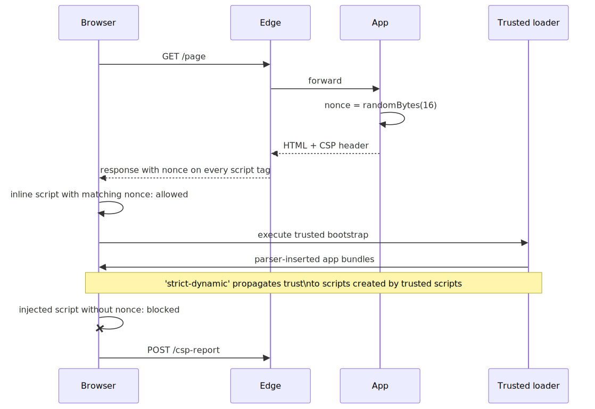
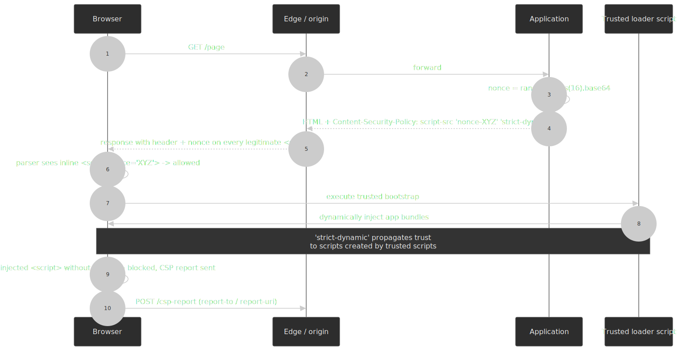
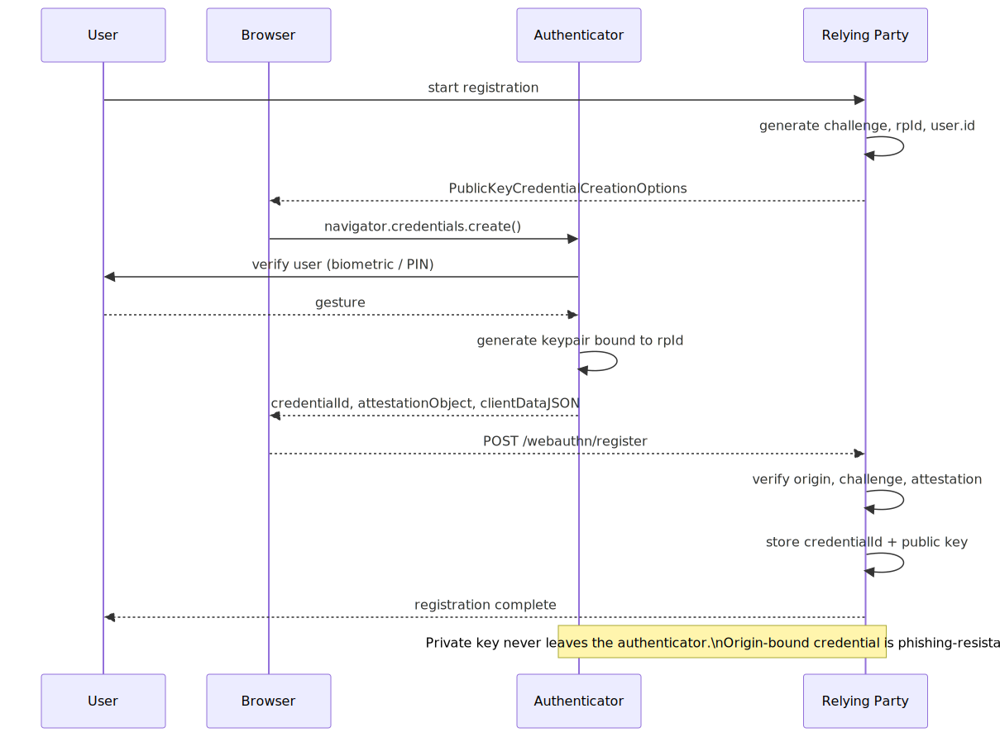
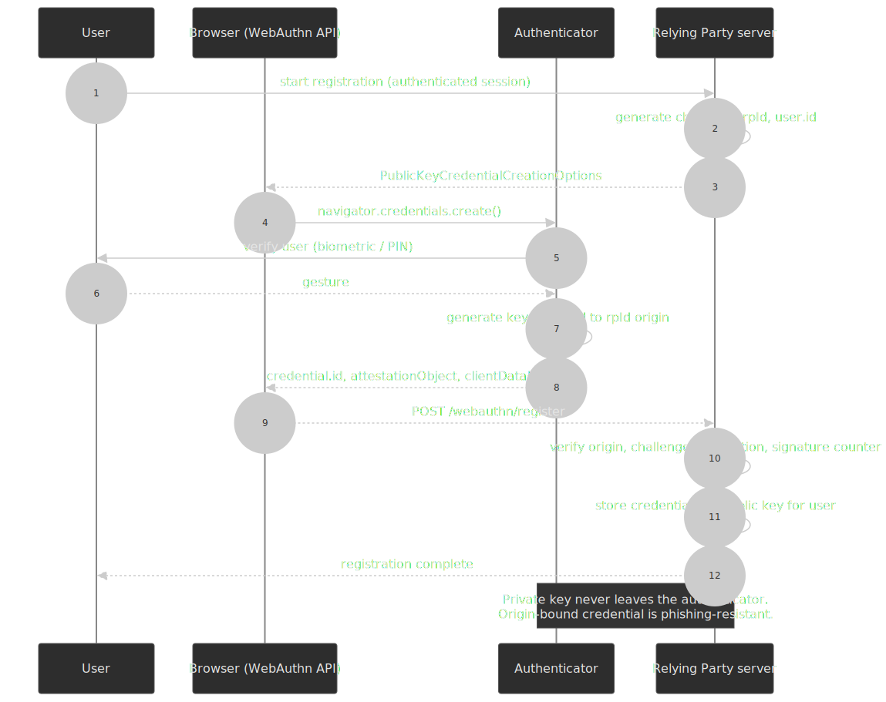

# Web Application Security Architecture

Web application security is a layered control problem: every boundary — edge,
browser, application, data, observability — owns a slice of the attack
surface, and any single layer must be assumed to fail. This article maps the
2026 control set onto that model: where strict
[Content Security Policy (CSP)](https://www.w3.org/TR/CSP3/) and
[Trusted Types](https://www.w3.org/TR/trusted-types/) eliminate XSS classes,
where [WebAuthn](https://www.w3.org/TR/webauthn-3/) eliminates phishing, where
[Argon2id](https://cheatsheetseries.owasp.org/cheatsheets/Password_Storage_Cheat_Sheet.html)
eliminates GPU-friendly cracking, and where the
[OWASP Top 10:2025](https://owasp.org/Top10/2025/) tells us the operational
defects that still dominate breaches.




## Mental model

Three claims drive every decision in this article:

1. **No single control holds.** Treat each layer as a probabilistic filter,
   not a guarantee. A WAF rule, a CSP directive, a parameterized query, and a
   request-time authorization check are independent — when one fails, the
   others must still bound the blast radius.
2. **Configuration is the failure mode.** The
   [OWASP Top 10:2025](https://owasp.org/Top10/2025/0x00_2025-Introduction/)
   keeps Broken Access Control at #1 and elevates Security Misconfiguration to
   #2 — both are categories where the technology is sound and the deployment
   is not.[^owasp-intro]
3. **Cryptographic proof beats reputation.** The 2016 Google study
   *"CSP Is Dead, Long Live CSP!"* showed that **94.72%** of real CSP policies
   were bypassable due to allowlisted hosts that exposed JSONP or vulnerable
   AngularJS endpoints.[^csp-dead] Modern controls — nonces, SRI, signed
   artifacts, passkeys — replace "this domain is friendly" with "this hash /
   signature matches".

| Boundary       | Primary control                              | What it catches                                         |
| :------------- | :------------------------------------------- | :------------------------------------------------------ |
| Edge           | TLS 1.3, HSTS, WAF                           | Network interception, generic exploit signatures        |
| Browser policy | Strict CSP + nonces, Trusted Types, COOP/COEP | XSS execution, clickjacking, cross-origin leaks         |
| Application    | AuthN, central AuthZ middleware, validation  | IDOR, privilege escalation, injection                   |
| Data           | Argon2id, AES-256-GCM, parameterized queries | Credential cracking, dump replay, query injection       |
| Observability  | Audit log, anomaly detection, alerting       | Slow breaches, abuse patterns, post-incident forensics  |

## Foundational principles

### Defense in depth

No single control is infallible. Defense in depth layers controls so that the
*probability of all layers failing simultaneously* is negligible, even when
each layer alone has known weaknesses.

The classic anti-pattern is treating one layer as load-bearing — typically a
WAF as the only XSS defense. WAF signature evasion is a well-explored attack
class (e.g., HTML-spec edge cases, mutation-XSS payloads) and a WAF cannot
sandbox JavaScript executed by a real DOM. The right position is: WAF is a
coarse pre-filter, CSP is the structural control, output encoding is the per-
sink control, and Trusted Types removes the unsafe sinks entirely.

### Least privilege

Grant the minimum permissions a task requires, scoped tightly enough that a
compromise has narrow blast radius.

```javascript title="service-permissions.js"
const servicePermissions = {
  "api-read-service": {
    database: ["SELECT"],
    tables: ["users", "products"],
    columns: { users: ["id", "name", "email"] },
  },
  "api-write-service": {
    database: ["INSERT", "UPDATE"],
    tables: ["orders", "cart"],
  },
}
```

The harder version of this principle is *temporal* least privilege: grant
elevated rights for a bounded window (just-in-time), then revoke. Persistent
admin grants for occasional needs are how a routine credential leak becomes a
domain-admin event.

### Fail secure

Errors in security-critical code paths must default to *deny*. Attackers
deliberately craft inputs that drive code into exception paths.

```javascript title="auth-check.js"
async function checkAccessSecure(userId, resource) {
  try {
    const allowed = await authService.check(userId, resource)
    return allowed === true
  } catch (error) {
    logger.error("Auth check failed", { userId, resource, error: error.message })
    return false
  }
}
```

> [!CAUTION]
> Error messages must not leak information. `Invalid username` vs
> `Invalid password` reveals which half of the credential pair is correct.
> Use a single generic `Invalid credentials` for both branches and log the
> distinction server-side only.

## OWASP Top 10:2025

The [2025 edition](https://owasp.org/Top10/2025/0x00_2025-Introduction/) was
published in November 2025 and is the eighth installment of the list.[^owasp-intro]
It capped each category at 40 mapped CWEs, consolidated SSRF into Broken
Access Control, and introduced two new categories driven by recent breach
patterns: **A03 Software Supply Chain Failures** (broadened from the 2021
"Vulnerable and Outdated Components") and **A10 Mishandling of Exceptional
Conditions**.[^owasp-intro]

| Rank   | Category                                | Notable change                                  |
| :----- | :-------------------------------------- | :---------------------------------------------- |
| A01    | Broken Access Control                   | Unchanged from 2021; SSRF folded in             |
| A02    | Security Misconfiguration               | Up from #5 (2021)                               |
| A03    | Software Supply Chain Failures          | New framing of "Vulnerable & Outdated Components" |
| A04    | Cryptographic Failures                  | Down from #2 (2021)                             |
| A05    | Injection                               | Down from #3 (2021)                             |
| A06    | Insecure Design                         | New in 2021, retained                           |
| A07    | Authentication Failures                 |                                                 |
| A08    | Software or Data Integrity Failures     |                                                 |
| A09    | Security Logging & Alerting Failures    |                                                 |
| A10    | Mishandling of Exceptional Conditions   | New in 2025                                     |

### A01: Broken Access Control

OWASP reports an average incidence rate of **3.73%** across tested
applications, mapped to 40 CWEs.[^owasp-a01] Authorization logic is scattered
across handlers; the fix is structural, not local.

```javascript title="ownership-middleware.js" mark={9-13}
const requireOwnership = (resourceType) => async (req, res, next) => {
  const resourceId = req.params.id
  const userId = req.user.id

  const isOwner = await checkOwnership(userId, resourceType, resourceId)
  const isAdmin = req.user.roles.includes("admin")

  if (!isOwner && !isAdmin) {
    logger.warn("Access denied", { userId, resourceType, resourceId })
    return res.status(403).json({ error: "Access denied" })
  }
  next()
}

app.get(
  "/api/users/:id/documents",
  authenticate,
  requireOwnership("user"),
  async (req, res) => {
    const documents = await db.documents.findByUserId(req.params.id)
    res.json(documents)
  },
)
```

The structural rule is: **every route reads its authorization from a single
named policy**. Inline `if (req.user.id === resource.ownerId)` checks are how
endpoints silently drift out of the policy.

OWASP's consolidation of SSRF into A01 reflects a shared root cause: the
server makes a privileged decision (whether to fetch this URL) on behalf of
the user without verifying the resulting resource is one the user is
authorized to reach.[^owasp-intro] We come back to SSRF in
[Attack vectors](#server-side-request-forgery-ssrf).

### A02: Security Misconfiguration

Defaults are tuned for developer ergonomics, not production. The most common
misconfigurations:

| Component       | Misconfiguration                      | Exploit                       |
| :-------------- | :------------------------------------ | :---------------------------- |
| Express.js      | Missing `helmet()` middleware         | XSS via missing CSP / X-Frame |
| Database        | Default `root` / `password`           | Full database access          |
| Cloud storage   | Public bucket ACLs                    | Data exfiltration             |
| Error handling  | Stack traces in production            | Internal structure disclosure |
| API frameworks  | Verbose CORS (`Access-Control-Allow-Origin: *` with credentials) | Cross-origin data theft |

A baseline Express configuration that fixes the common defaults:

```javascript title="server.js"
import express from "express"
import helmet from "helmet"
import rateLimit from "express-rate-limit"

const app = express()

app.use(
  helmet({
    contentSecurityPolicy: {
      directives: {
        defaultSrc: ["'self'"],
        scriptSrc: ["'self'"],
        styleSrc: ["'self'", "'unsafe-inline'"],
        imgSrc: ["'self'", "data:", "https:"],
        objectSrc: ["'none'"],
        frameAncestors: ["'none'"],
      },
    },
    hsts: { maxAge: 31536000, includeSubDomains: true, preload: true },
  }),
)

app.use(
  rateLimit({
    windowMs: 15 * 60 * 1000,
    max: 100,
    standardHeaders: true,
    legacyHeaders: false,
  }),
)

app.use(express.json({ limit: "100kb" }))

app.use((err, req, res, next) => {
  logger.error("Request error", { error: err.message, requestId: req.id })
  res.status(500).json({ error: "Internal error", requestId: req.id })
})
```

> [!TIP]
> The `'unsafe-inline'` style fallback above is the pragmatic default;
> migrate to nonces or hashes for `style-src` once the design system stops
> emitting inline styles. The `script-src` directive should never include
> `'unsafe-inline'` — see [Strict CSP](#content-security-policy-csp) below.

### A03: Software Supply Chain Failures

Direct dependencies are the smallest part of the attack surface. A typical
Node.js application's transitive graph runs into hundreds of packages, any of
which is a credential-harvesting opportunity if the maintainer account is
compromised. Recent representative incidents include the
[`event-stream` 2018 takeover](https://github.com/dominictarr/event-stream/issues/116)
and the
[`xz-utils` 2024 backdoor](https://research.swtch.com/xz-script).
The 2025 OWASP entry broadened the framing from "vulnerable components" to
the full pipeline: typosquatting, dependency confusion, maintainer account
compromise, and CI/CD artifact tampering.[^owasp-intro]

Baseline mitigations:

```json title="package.json (excerpt)"
{
  "scripts": {
    "audit": "npm audit --audit-level=high",
    "audit:signatures": "npm audit signatures",
    "sbom": "npx @cyclonedx/cyclonedx-npm --output-file sbom.json"
  }
}
```

For browser-loaded third-party assets,
[Subresource Integrity (SRI)](https://www.w3.org/TR/sri-2/) gives
cryptographic proof that the served bytes match what was reviewed:

```html title="index.html"
<script
  src="https://cdn.example.com/lib.js"
  integrity="sha384-oqVuAfXRKap7fdgcCY5uykM6+R9GqQ8K/uxy9rx7HNQlGYl1kPzQho1wx4JwY8wC"
  crossorigin="anonymous"
></script>
```

SRI supports `sha256`, `sha384`, and `sha512` digests and requires
`crossorigin` because the browser must fetch the resource using the CORS
protocol to compute and compare the hash.[^sri-spec] The
[`Integrity-Policy`](https://developer.mozilla.org/en-US/docs/Web/HTTP/Reference/Headers/Integrity-Policy)
response header (now in the SRI spec) lets a site enforce that *all*
matching subresources carry an `integrity` attribute, surfacing accidental
regressions instead of silently loading unverified bytes.

### A04: Cryptographic Failures

The 2025 edition retains the broad framing: "data in transit and at rest must
be encrypted with current algorithms; sensitive data must not exist in places
it doesn't need to." The OWASP
[Password Storage Cheat Sheet](https://cheatsheetseries.owasp.org/cheatsheets/Password_Storage_Cheat_Sheet.html)
gives the current canonical choices:

| Use case                     | Algorithm    | Configuration                                                    |
| :--------------------------- | :----------- | :--------------------------------------------------------------- |
| Password hashing             | Argon2id     | One of five equivalent OWASP profiles (see below); all `p=1`     |
| Password hashing (legacy)    | bcrypt       | Cost ≥ 10; max 72-byte input (Blowfish P-array limit)            |
| Symmetric encryption         | AES-256-GCM  | 256-bit key, **random 96-bit IV per operation** (NIST SP 800-38D)|
| Asymmetric encryption        | RSA-OAEP     | 3072-bit minimum, 4096-bit preferred                             |
| Digital signatures           | Ed25519      | 256-bit keys, deterministic signatures                           |

OWASP publishes five equivalent Argon2id profiles that trade memory for
time; pick the highest-memory profile the host can sustain, then bump
`timeCost` instead of dropping memory further.[^owasp-passwords]

| `memoryCost` (`m`)  | `timeCost` (`t`) | `parallelism` (`p`) | Notes                                  |
| :------------------ | :--------------- | :------------------ | :------------------------------------- |
| 47104 (46 MiB)      | 1                | 1                   | Argon2id only; not safe for Argon2i    |
| 19456 (19 MiB)      | 2                | 1                   | Argon2id only; not safe for Argon2i    |
| 12288 (12 MiB)      | 3                | 1                   | Safe for Argon2id and Argon2i          |
| 9216 (9 MiB)        | 4                | 1                   | Safe for Argon2id and Argon2i          |
| 7168 (7 MiB)        | 5                | 1                   | Safe for Argon2id and Argon2i          |

```javascript title="argon2id.js"
import { hash, verify } from "@node-rs/argon2"

async function hashPassword(password) {
  return await hash(password, {
    memoryCost: 47104,
    timeCost: 1,
    parallelism: 1,
  })
}

async function verifyPassword(password, hashedPassword) {
  return await verify(hashedPassword, password)
}
```

**Why Argon2id over bcrypt.** Argon2 won the 2015
[Password Hashing Competition](https://www.password-hashing.net/) explicitly
to resist hardware-accelerated attacks: its `memoryCost` parameter forces
each guess into a memory-bound region, neutering the GPU and ASIC parallelism
advantage that wrecks CPU-bound functions.[^argon2-phc] bcrypt remains
acceptable for legacy systems but caps password input at 72 bytes (Blowfish's
18-entry × 4-byte P-array) — modern implementations transparently truncate,
which can silently mask password-length policies.

### A05: Injection

Untrusted data interpreted as code, across many command surfaces:

| Type     | Vector                          | Defense                                         |
| :------- | :------------------------------ | :---------------------------------------------- |
| SQL      | String-concatenated queries     | Parameterized queries, ORM placeholders         |
| NoSQL    | Object property injection (`{$gt: ""}`) | Schema validation; coerce to expected type |
| Command  | Shell concatenation             | Avoid the shell — `execFile` with array args    |
| LDAP     | Filter string manipulation      | Escape per RFC 4515 special characters          |
| Template | User-controlled template syntax | Sandbox or disable user templates entirely      |

```javascript title="sql-injection-defense.js" mark={2,5}
const query = `SELECT * FROM users WHERE email = '${email}'` // VULNERABLE

const [rows] = await db.execute(
  "SELECT * FROM users WHERE email = ?",
  [email],
)
```

```javascript title="command-injection-defense.js" mark={4,9}
import { execFile } from "child_process"
import { promisify } from "util"

const execFileAsync = promisify(execFile)

async function ping(host) {
  if (!/^[a-zA-Z0-9.-]+$/.test(host)) {
    throw new Error("Invalid hostname")
  }
  const { stdout } = await execFileAsync("ping", ["-c", "4", host])
  return stdout
}
```

### A06–A10 in one pass

| Rank | Category                              | Defining failure                                  | Operational fix                                       |
| :--- | :------------------------------------ | :------------------------------------------------ | :---------------------------------------------------- |
| A06  | Insecure Design                       | Threat model omitted at design time               | Threat-modeling workshops on every new bounded context |
| A07  | Authentication Failures               | Password reuse, weak MFA, fixed sessions          | Passkeys, MFA, regen session on auth, rate limit      |
| A08  | Software / Data Integrity Failures    | Unsigned artifacts, mutable releases              | Signed artifacts, SLSA-style provenance, locked images |
| A09  | Logging & Alerting Failures           | Local logs only, no alerting                      | Centralized logs, real-time alerts on auth & PII paths |
| A10  | Mishandling Exceptional Conditions    | Catch-all swallowing security failures            | Structured error handling, fail-closed defaults        |

## Security headers

HTTP security headers move policy enforcement from the application into the
browser. They are cheap (set once at the edge), composable, and they catch
classes of bug that application-side fixes miss.

### Content Security Policy (CSP)

[CSP Level 3](https://www.w3.org/TR/CSP3/) is a W3C **Working Draft** (most
recently published 2026-04-21) that restricts where a page may load and
execute scripts, styles, and other resources.[^csp3]

**Why allowlists fail.** The seminal Google study analyzed ~26,000 distinct
real CSPs and found **94.72%** were trivially bypassable; 75.81% used script
allowlists that included a host serving an exploitable JSONP endpoint or a
vulnerable AngularJS version.[^csp-dead] The fix is to invert trust:
authenticate every script execution with a per-response cryptographic nonce,
and let `'strict-dynamic'` propagate trust transitively.

```http title="Strict CSP response header"
Content-Security-Policy:
  default-src 'self';
  script-src 'self' 'nonce-R4nd0mN0nc3' 'strict-dynamic';
  style-src 'self' 'nonce-R4nd0mN0nc3';
  object-src 'none';
  base-uri 'self';
  frame-ancestors 'none';
  report-to csp-endpoint
```




The mechanism, in four steps:

1. **Generate** a fresh nonce per response (≥ 128 bits, base64-encoded).
2. **Serve** it both in the CSP header and on every legitimate inline /
   external `<script>` tag the page emits.
3. **Browser** executes only scripts whose `nonce` attribute matches.
4. **`'strict-dynamic'`** lets a trusted script load further scripts without
   listing every URL — the trust travels with the parser-inserted relationship,
   not with the URL.

```javascript title="csp-middleware.js"
import crypto from "crypto"

function generateCSP(req, res, next) {
  const nonce = crypto.randomBytes(16).toString("base64")
  res.locals.nonce = nonce

  res.setHeader(
    "Content-Security-Policy",
    [
      "default-src 'self'",
      `script-src 'self' 'nonce-${nonce}' 'strict-dynamic'`,
      `style-src 'self' 'nonce-${nonce}'`,
      "object-src 'none'",
      "base-uri 'self'",
      "frame-ancestors 'none'",
    ].join("; "),
  )

  next()
}
```

> [!IMPORTANT]
> The nonce **must** be unguessable and unique per response. Reusing a nonce
> across responses lets an attacker who steals one nonce keep injecting
> indefinitely. Caching layers must vary on the response or strip the header
> on cache fills.

### Trusted Types

[Trusted Types](https://www.w3.org/TR/trusted-types/) close the
DOM-XSS gap CSP cannot reach: they refuse to let raw strings reach
[injection sinks](https://github.com/google/trusted-types/wiki/Sinks)
like `Element.innerHTML`, `document.write`, or `eval`. As of February 2026
the API is [Baseline](https://github.com/web-platform-dx/developer-signals/issues/118)
across all major browsers — Chrome and Edge since 83, Firefox since 148,
Safari since 26.[^trusted-types-caniuse]

```http title="Trusted Types enforcement"
Content-Security-Policy: require-trusted-types-for 'script'; trusted-types myPolicy
```

```javascript title="trusted-types-policy.js"
const policy = trustedTypes.createPolicy("myPolicy", {
  createHTML: (input) => DOMPurify.sanitize(input),
  createScript: () => {
    throw new Error("Scripts not allowed")
  },
  createScriptURL: (input) => {
    const url = new URL(input, location.origin)
    if (url.origin !== location.origin) {
      throw new Error("Cross-origin scripts not allowed")
    }
    return url.toString()
  },
})

element.innerHTML = policy.createHTML(userInput)
```

A 2021 Google internal review estimated Trusted Types would have prevented at
least **61%** of DOM XSS vulnerabilities reported through Google's
Vulnerability Reward Program, including bugs missed by static analysis
pipelines.[^trusted-types-google] Its value is structural: instead of asking
every developer to remember to sanitize, the browser refuses to render the
unsanitized result.

### HTTP Strict Transport Security (HSTS)

[RFC 6797](https://www.rfc-editor.org/rfc/rfc6797) lets a server tell
browsers to only ever connect over HTTPS for a given host. Once latched, the
policy survives until `max-age` expires.

```http
Strict-Transport-Security: max-age=31536000; includeSubDomains; preload
```

| Directive           | Purpose                                                |
| :------------------ | :----------------------------------------------------- |
| `max-age`           | Policy duration in seconds (`31536000` = 1 year)       |
| `includeSubDomains` | Applies to all subdomains                              |
| `preload`           | Eligible for the [HSTS preload list](https://hstspreload.org/) |

> [!WARNING]
> The HSTS preload list is sticky. Once a host ships in a Chromium / Firefox
> preload list, removal can take **months** to roll out to user populations.
> Verify *every* subdomain serves valid HTTPS before enabling `includeSubDomains;
> preload`.

### Other essential headers

```http
X-Content-Type-Options: nosniff
X-Frame-Options: DENY
Referrer-Policy: strict-origin-when-cross-origin
Permissions-Policy: camera=(), microphone=(), geolocation=()
Cross-Origin-Opener-Policy: same-origin
Cross-Origin-Embedder-Policy: require-corp
```

| Header                         | Mitigates                                              |
| :----------------------------- | :----------------------------------------------------- |
| `X-Content-Type-Options`       | MIME-sniffing attacks                                  |
| `X-Frame-Options`              | Clickjacking (legacy; CSP `frame-ancestors` supersedes it) |
| `Referrer-Policy`              | URL leakage to third parties                           |
| `Permissions-Policy`           | Feature abuse (camera, mic, geolocation, etc.)         |
| `Cross-Origin-Opener-Policy`   | Spectre-style cross-origin side channels               |
| `Cross-Origin-Embedder-Policy` | Cross-origin resource leaks (paired with COOP for `crossOriginIsolated`) |

## Authentication and session security

### WebAuthn (passkeys)

[WebAuthn Level 3](https://www.w3.org/TR/webauthn-3/) reached W3C Candidate
Recommendation Snapshot status on 2026-01-13.[^webauthn3] The model is
public-key cryptography per origin: the authenticator (TPM, Secure Enclave,
hardware key, or platform passkey) generates a keypair bound to the
relying-party origin, and the private key never leaves the device.




```javascript title="register-passkey.js"
async function registerPasskey(userId, userName) {
  const challenge = await fetch("/api/webauthn/challenge").then((r) => r.json())

  const credential = await navigator.credentials.create({
    publicKey: {
      challenge: Uint8Array.from(challenge.value, (c) => c.charCodeAt(0)),
      rp: { name: "Example Corp", id: "example.com" },
      user: {
        id: Uint8Array.from(userId, (c) => c.charCodeAt(0)),
        name: userName,
        displayName: userName,
      },
      pubKeyCredParams: [
        { alg: -7, type: "public-key" },   // ES256
        { alg: -257, type: "public-key" }, // RS256
      ],
      authenticatorSelection: {
        authenticatorAttachment: "platform",
        userVerification: "required",
        residentKey: "required",
      },
      timeout: 60000,
    },
  })

  await fetch("/api/webauthn/register", {
    method: "POST",
    body: JSON.stringify({
      id: credential.id,
      rawId: btoa(String.fromCharCode(...new Uint8Array(credential.rawId))),
      response: {
        clientDataJSON: btoa(
          String.fromCharCode(...new Uint8Array(credential.response.clientDataJSON)),
        ),
        attestationObject: btoa(
          String.fromCharCode(...new Uint8Array(credential.response.attestationObject)),
        ),
      },
    }),
  })
}
```

Passkeys are **phishing-resistant by construction**: the authenticator
verifies the relying party's `rpId` against the origin the browser is on, so
a credential issued for `example.com` will silently refuse to sign for
`exarnple.com`. There is no password to phish, no shared secret to exfiltrate
from a server dump, and discoverable credentials (`residentKey: required`)
power the username-less sign-in flow.

### Secure session cookies

```javascript title="session-cookie.js"
const sessionOptions = {
  name: "__Host-session",
  secret: process.env.SESSION_SECRET,
  cookie: {
    httpOnly: true,
    secure: true,
    sameSite: "strict",
    maxAge: 15 * 60 * 1000,
    path: "/",
  },
  resave: false,
  saveUninitialized: false,
}
```

The `__Host-` prefix is enforced by the browser per
[RFC 6265bis](https://datatracker.ietf.org/doc/draft-ietf-httpbis-rfc6265bis/):
the cookie *must* be `Secure`, must have `Path=/`, and must **not** carry a
`Domain` attribute — eliminating the entire class of "subdomain takeover
sets a cookie that the parent trusts" attacks.

`SameSite` semantics:

| Value    | Sent on                                                | Use for                          |
| :------- | :----------------------------------------------------- | :------------------------------- |
| `Strict` | First-party requests only                              | Auth + state-changing actions    |
| `Lax`    | Same-site + top-level navigations with safe methods    | General-purpose default          |
| `None`   | All contexts (requires `Secure`)                       | Legitimate cross-site embeds     |

> [!NOTE]
> Per RFC 6265bis, modern browsers treat cookies *without* an explicit
> `SameSite` attribute as `Lax` by default — Chrome shipped this in version
> 80 (2020) and others followed.[^samesite-default] If you need cross-site
> cookies, set `SameSite=None; Secure` explicitly; without `Secure`, the
> cookie is rejected.

### Token storage

| Storage                    | XSS exposure | CSRF exposure | Verdict                                 |
| :------------------------- | :----------- | :------------ | :-------------------------------------- |
| `localStorage`             | High         | None          | Never for auth tokens                   |
| `sessionStorage`           | High         | None          | Never for auth tokens                   |
| `HttpOnly` cookie          | None         | Mitigable     | **Preferred**, with `SameSite=Strict`   |
| In-memory JS variable      | Medium       | None          | Short-lived access tokens only          |

`HttpOnly` cookies are inaccessible to JavaScript, so a successful XSS cannot
read them; `SameSite=Strict` blocks cross-origin requests from including the
cookie, neutralizing CSRF; `Secure` keeps them off plaintext channels. The
combination of all three is the strongest stock defense the platform offers.

## Attack vectors and defenses

### Cross-Site Scripting (XSS)

| Type      | Vector                       | Persistence | Detection                |
| :-------- | :--------------------------- | :---------- | :----------------------- |
| Stored    | Database → rendered page     | Permanent   | Server-side scanning     |
| Reflected | URL parameter → response     | None        | WAF + input validation   |
| DOM-based | Client-side JS → DOM sink    | None        | Trusted Types + strict CSP |

DOM XSS is the variant strict CSP cannot directly catch — it lives in
strings flowing into `innerHTML`, `eval`, `setTimeout(string)`, and similar
sinks. Trusted Types fixes this at the platform layer:

```javascript title="trusted-types-vs-raw.js"
document.getElementById("output").innerHTML = userInput // VULNERABLE

const policy = trustedTypes.createPolicy("sanitizer", {
  createHTML: (input) => DOMPurify.sanitize(input),
})
document.getElementById("output").innerHTML = policy.createHTML(userInput)
```

### Cross-Site Request Forgery (CSRF)

CSRF turns a victim's authenticated session into the attacker's submission
mechanism: the victim's browser is tricked into making a state-changing
request, and the cookie rides along automatically.

Defense layers (all three together, not pick-one):

1. **`SameSite` cookies** (`Strict` for auth, `Lax` for general state).
2. **Synchronizer / double-submit token** for state-changing requests.
3. **Origin / Referer validation** as a coarse server-side check.

> [!CAUTION]
> The widely cited [`csurf`](https://www.npmjs.com/package/csurf) package was
> [deprecated in September 2022](https://github.com/expressjs/discussions/issues/155)
> and was formally retired by the Express maintainers in
> [the 2025 legacy-package cleanup](https://expressjs.com/2025/05/16/express-cleanup-legacy-packages.html).
> Use a maintained signed-double-submit implementation such as
> [`csrf-csrf`](https://www.npmjs.com/package/csrf-csrf) or the
> community-maintained [`@dr.pogodin/csurf`](https://www.npmjs.com/package/@dr.pogodin/csurf) fork.

```javascript title="csrf-csrf.js"
import { doubleCsrf } from "csrf-csrf"

const { doubleCsrfProtection, generateToken } = doubleCsrf({
  getSecret: () => process.env.CSRF_SECRET,
  cookieName: "__Host-psifi.x-csrf-token",
  cookieOptions: { sameSite: "strict", httpOnly: true, secure: true, path: "/" },
  size: 64,
  getTokenFromRequest: (req) => req.headers["x-csrf-token"],
})

app.get("/form", (req, res) => {
  const token = generateToken(req, res)
  res.render("form", { csrfToken: token })
})

app.post("/transfer", doubleCsrfProtection, (req, res) => {
  processTransfer(req.body)
})
```

### Server-Side Request Forgery (SSRF)

SSRF induces the *server* to make a request the attacker could not make
themselves, typically to an internal service the attacker cannot route to.
It is now folded into A01 because the underlying defect is authorization:
the server makes the request without verifying the destination is one the
caller is allowed to reach.[^owasp-intro]

Common high-value SSRF targets:

| Target                                              | Why it matters                                        |
| :-------------------------------------------------- | :---------------------------------------------------- |
| `169.254.169.254` / `metadata.google.internal`      | Cloud instance metadata (IAM tokens, instance creds)  |
| `127.0.0.1`, `localhost`                            | Loopback admin endpoints, debug ports                 |
| `10.0.0.0/8`, `172.16.0.0/12`, `192.168.0.0/16`     | RFC 1918 private network ranges                       |
| `fc00::/7`, `fe80::/10`                             | IPv6 private + link-local                             |

A robust outbound URL validator combines a deny list with **post-resolution**
IP checks (because hostnames lie) and re-resolution before reconnect (because
of [DNS rebinding](https://attack.mitre.org/techniques/T1090/)):




```javascript title="ssrf-guard.js"
import { URL } from "url"
import dns from "dns/promises"

const BLOCKED_HOSTS = new Set([
  "169.254.169.254",
  "metadata.google.internal",
  "localhost",
  "127.0.0.1",
])

const PRIVATE_RANGES = [
  { start: 0x0a000000, end: 0x0affffff }, // 10.0.0.0/8
  { start: 0xac100000, end: 0xac1fffff }, // 172.16.0.0/12
  { start: 0xc0a80000, end: 0xc0a8ffff }, // 192.168.0.0/16
]

export async function isAllowedUrl(urlString) {
  const url = new URL(urlString)

  if (!["http:", "https:"].includes(url.protocol)) return false
  if (BLOCKED_HOSTS.has(url.hostname)) return false

  const addresses = await dns.resolve4(url.hostname)
  for (const addr of addresses) {
    const ip = addr
      .split(".")
      .reduce((acc, oct) => (acc << 8) + parseInt(oct, 10), 0)
    if (PRIVATE_RANGES.some((r) => ip >= r.start && ip <= r.end)) {
      return false
    }
  }

  return true
}
```

> [!WARNING]
> Allow-listing alone (`isAllowedUrl`) is not enough — the
> [DNS rebinding](https://en.wikipedia.org/wiki/DNS_rebinding) class of
> attack defeats it by returning a public IP at validation time and a
> private IP a few seconds later. Use the resolved IP from validation as the
> connect target (pin to the IP, send the original `Host` header), and
> re-validate on every reconnection.

## Security by rendering strategy

Different rendering strategies expose different attack surfaces; the control
set should follow.

| Strategy | Primary attack surface                                   | Highest-leverage controls                          |
| :------- | :------------------------------------------------------- | :------------------------------------------------- |
| SSR      | Template injection, SSRF, session fixation, CSRF         | Auto-escaping templates, session regen on auth, origin checks, strict CSRF |
| SSG      | Build-pipeline supply chain, DOM XSS in client JS, cached vulns | SBOM + signature checks in CI, hash-based CSP (stable assets), immutable artifact promotion |
| CSR      | DOM XSS, token leakage, open redirects                   | Trusted Types, `HttpOnly` cookies, strict CSP with nonces, allow-list redirect targets |

A SPA running an API behind a CDN inherits all three concern sets — the
build pipeline of the SSG, the runtime sinks of the CSR, and the
session/auth surface of the SSR backend.

## Practical takeaways

- **Centralize authorization in middleware.** Inline `if (req.user.id ===
  resource.ownerId)` checks are how endpoints quietly drift out of policy.
- **Strict CSP, not allowlists.** Per-response nonces plus `'strict-dynamic'`
  beat any reasonable host allowlist.[^csp-dead] Pair with Trusted Types to
  close the DOM-XSS gap.
- **Argon2id at the OWASP profile.** Lower the memory only when hardware
  cannot sustain it, and bump the time cost in compensation.[^owasp-passwords]
- **Passkeys over passwords for new flows.** Phishing resistance is built in;
  no shared secret to leak.
- **Use the `__Host-` prefix and `SameSite=Strict` for session cookies.**
  Replace any current `csurf` usage with a maintained alternative.
- **Treat the supply chain as part of the runtime.** SBOM + signature
  verification + SRI for browser-loaded third-party assets.
- **Validate outbound URLs after DNS resolution, then pin the socket to the
  resolved IP.** Hostname allow-lists alone do not stop DNS rebinding.

## Appendix

### Prerequisites

- HTTP fundamentals (headers, methods, status codes, cookies).
- Same-origin policy and CORS.
- Public-key cryptography fundamentals (asymmetric vs symmetric, hashing).
- Node.js / browser JavaScript familiarity.

### Terminology

- **CSP** — Content Security Policy; browser-enforced loading restrictions.
- **CSRF** — Cross-Site Request Forgery; tricks an authenticated user into a request.
- **HSTS** — HTTP Strict Transport Security; forces HTTPS.
- **IDOR** — Insecure Direct Object Reference; unauthorized resource access via ID manipulation.
- **OWASP** — Open Worldwide Application Security Project.
- **SBOM** — Software Bill of Materials.
- **SRI** — Subresource Integrity; cryptographic verification of subresources.
- **SSRF** — Server-Side Request Forgery.
- **WAF** — Web Application Firewall.
- **XSS** — Cross-Site Scripting.

### References

- [OWASP Top 10:2025 — Introduction](https://owasp.org/Top10/2025/0x00_2025-Introduction/)
- [OWASP Top 10:2025 — A01 Broken Access Control](https://owasp.org/Top10/2025/A01_2025-Broken_Access_Control/)
- [OWASP Password Storage Cheat Sheet](https://cheatsheetseries.owasp.org/cheatsheets/Password_Storage_Cheat_Sheet.html)
- [OWASP CSP Cheat Sheet](https://cheatsheetseries.owasp.org/cheatsheets/Content_Security_Policy_Cheat_Sheet.html)
- [W3C CSP Level 3](https://www.w3.org/TR/CSP3/)
- [W3C Trusted Types](https://www.w3.org/TR/trusted-types/)
- [W3C WebAuthn Level 3](https://www.w3.org/TR/webauthn-3/)
- [W3C Subresource Integrity 2](https://www.w3.org/TR/sri-2/)
- [RFC 6797 — HSTS](https://www.rfc-editor.org/rfc/rfc6797)
- [RFC 6265bis — Cookies](https://datatracker.ietf.org/doc/draft-ietf-httpbis-rfc6265bis/)
- [NIST SP 800-38D — AES-GCM](https://nvlpubs.nist.gov/nistpubs/Legacy/SP/nistspecialpublication800-38d.pdf)
- [Password Hashing Competition](https://www.password-hashing.net/)
- [Mozilla Observatory](https://observatory.mozilla.org/)
- [SSL Labs Server Test](https://www.ssllabs.com/ssltest/)

[^owasp-intro]: [OWASP Top 10:2025 — Introduction](https://owasp.org/Top10/2025/0x00_2025-Introduction/) — published Nov 2025.
[^owasp-a01]: [OWASP Top 10:2025 — A01: Broken Access Control](https://owasp.org/Top10/2025/A01_2025-Broken_Access_Control/) — incidence rate 3.73%, 40 mapped CWEs.
[^owasp-passwords]: [OWASP Password Storage Cheat Sheet — Argon2id](https://cheatsheetseries.owasp.org/cheatsheets/Password_Storage_Cheat_Sheet.html#argon2id) — five equivalent OWASP Argon2id profiles, all with `p=1`.
[^csp-dead]: Weichselbaum et al., [CSP Is Dead, Long Live CSP! On the Insecurity of Whitelists and the Future of Content Security Policy](https://research.google/pubs/csp-is-dead-long-live-csp-on-the-insecurity-of-whitelists-and-the-future-of-content-security-policy/), ACM CCS 2016.
[^csp3]: [W3C Content Security Policy Level 3, Working Draft 2026-04-21](https://www.w3.org/TR/CSP3/).
[^trusted-types-caniuse]: [caniuse — Trusted Types for DOM manipulation](https://caniuse.com/trusted-types) and [Web Platform DX — Trusted Types Baseline (2026-02-24)](https://github.com/web-platform-dx/developer-signals/issues/118).
[^trusted-types-google]: Google, [Trusted Types — mid-2021 report](https://storage.googleapis.com/gweb-research2023-media/pubtools/6259.pdf) — analysis of DOM XSS reports to Google's VRP.
[^webauthn3]: [W3C WebAuthn Level 3, Candidate Recommendation Snapshot 2026-01-13](https://www.w3.org/TR/webauthn-3/).
[^samesite-default]: [draft-ietf-httpbis-rfc6265bis](https://datatracker.ietf.org/doc/draft-ietf-httpbis-rfc6265bis/) — default `Lax` enforcement; Chromium shipped this default in Chrome 80, see [Chromium SameSite FAQ](https://www.chromium.org/updates/same-site/faq/).
[^argon2-phc]: [Password Hashing Competition](https://www.password-hashing.net/) — Argon2 selected as winner on 2015-07-20; [`P-H-C/phc-winner-argon2`](https://github.com/P-H-C/phc-winner-argon2).
[^sri-spec]: [W3C Subresource Integrity Level 2, Working Draft](https://www.w3.org/TR/sri-2/) — `sha256`, `sha384`, `sha512` digests; `crossorigin` required.
