# Web Components: Custom Elements, Shadow DOM, and practical boundaries

Web Components are not a single API. They are a **composition of browser standards** — primarily [Custom Elements](https://html.spec.whatwg.org/multipage/custom-elements.html), [Shadow DOM](https://dom.spec.whatwg.org/#shadow-trees), and [HTML `<template>`](https://html.spec.whatwg.org/multipage/scripting.html#the-template-element) with [`<slot>`](https://html.spec.whatwg.org/multipage/scripting.html#the-slot-element) — that let you define reusable, encapsulated elements that work without a specific framework runtime. That portability is the headline benefit; the engineering cost is learning where the encapsulation boundary sits and how consumers (including frameworks) are supposed to cross it safely.

This article stays practical: mental model first, then lifecycle and styling APIs, then accessibility and forms, then interoperability and adoption heuristics. For a broader platform overview, the MDN guide [Web Components](https://developer.mozilla.org/en-US/docs/Web/API/Web_components) remains the best consolidated entry point.




## The three pillars (and the boundary they create)

1. **Custom Elements** — JavaScript classes registered with [`customElements.define()`](https://html.spec.whatwg.org/multipage/custom-elements.html#dom-customelementregistry-define), instantiated by the parser or `document.createElement()`.
2. **Shadow DOM** — an attached shadow tree with its own [style and DOM encapsulation](https://dom.spec.whatwg.org/#concept-shadow-tree) rules (with deliberate escape hatches).
3. **Templates and slots** — inert markup in [`<template>`](https://html.spec.whatwg.org/multipage/scripting.html#the-template-element) and [composed tree projection](https://dom.spec.whatwg.org/#concept-slot) via [`<slot>`](https://html.spec.whatwg.org/multipage/scripting.html#the-slot-element).

Together, they create a **hard boundary** between what you promise as a public surface (attributes, properties, events, CSS custom properties, and opt-in styling hooks) and what you treat as private implementation (nodes and selectors inside the shadow tree).

## Custom Elements: registration, attributes, and properties

You register a tag with a hyphen in the name (a requirement of the [valid custom element name](https://html.spec.whatwg.org/multipage/custom-elements.html#valid-custom-element-name) algorithm):

```js
class MyCard extends HTMLElement {
  connectedCallback() {
    this.textContent = this.getAttribute("title") ?? "";
  }
}

customElements.define("my-card", MyCard);
```

Two details trip up even experienced teams:

- **Attributes versus properties** — HTML attributes are strings; element state often is not. Frameworks and DOM APIs frequently set **properties**; your element should usually implement reflection patterns (or explicit setters) rather than assuming `attributeChangedCallback` alone will fire. The HTML spec’s notes on [reflecting IDL attributes](https://html.spec.whatwg.org/multipage/common-dom-interfaces.html#reflecting-content-attributes-in-idl-attributes) are the authoritative background.
- **`observedAttributes` is a filter** — [`attributeChangedCallback`](https://html.spec.whatwg.org/multipage/custom-elements.html#concept-custom-element-definition-attribute-changed-callback) only runs for attributes listed by [`static observedAttributes`](https://html.spec.whatwg.org/multipage/custom-elements.html#dom-element-observedattributes). Everything else is ignored for performance.

### Autonomous vs customized built-ins

Most examples use **autonomous** custom elements (`extends HTMLElement`). The platform also supports **customized built-ins** (`extends HTMLButtonElement`, etc.), which use `customElements.define(..., { extends: "button" })` and the `is=""` attribute. Cross-engine support is uneven and unlikely to converge soon: Chromium and Firefox implement them, but [WebKit has declined to implement them](https://github.com/WebKit/standards-positions/issues/97) and is instead exploring an alternative ([platform-provided behaviors](https://github.com/WebKit/standards-positions/issues/642)) — there is no signal that Safari will ship `is=""`. The pragmatic guidance is unchanged: design systems default to autonomous custom elements because Safari users would otherwise be excluded, and scoped registries (below) refuse `extends` entirely.

## Shadow DOM: open, closed, and what “encapsulation” means

`attachShadow({ mode: "open" | "closed" })` creates a shadow root. [`mode: "open"`](https://dom.spec.whatwg.org/#dom-element-attachshadow) allows `element.shadowRoot` for debugging, testing, and tooling; [`closed`](https://dom.spec.whatwg.org/#shadowrootmode-closed) hides that handle — which is **not a security boundary** (callers with script access can still wrap or proxy your element), but it does communicate “hands off” to well-behaved code.




**Declarative Shadow DOM** ([HTML template element with `shadowrootmode`](https://html.spec.whatwg.org/multipage/scripting.html#attr-template-shadowrootmode)) matters for SSR and static HTML. As of 2024 it is [Baseline newly available](https://web.dev/articles/declarative-shadow-dom) across Chrome 111+, Safari 16.4+, and Firefox 123+, so server-rendered shadow roots are a realistic option for component libraries that need first paint without a runtime. You still need a coherent story for hydration and progressive enhancement — see [Declarative Shadow DOM](https://developer.mozilla.org/en-US/docs/Web/HTML/Reference/Elements/template#declarative_shadow_dom) on MDN. Watch out for the legacy `shadowroot` attribute; the standardized name is `shadowrootmode` and older renderers may emit the deprecated form.

### Slots and composition

Named and default slots let consumers pass **light DOM** children that render **as if** they lived inside your component, while still participating in the [composed tree](https://dom.spec.whatwg.org/#composed-tree) for events and hit testing. Listen for [`slotchange`](https://html.spec.whatwg.org/multipage/scripting.html#event-slotchange) when you need to react to what actually got assigned (especially for lazy or conditional slotted content).

Two slot assignment modes exist: the default **named** mode (children with a matching `slot=""` attribute project automatically) and **manual** mode, opted into via `attachShadow({ slotAssignment: "manual" })`, which makes you call [`HTMLSlotElement.assign()`](https://developer.mozilla.org/en-US/docs/Web/API/HTMLSlotElement/assign) explicitly. Manual mode is useful when the child element shouldn't carry a `slot` attribute or when you assemble the DOM in a non-template language ([slot assignment in DOM](https://dom.spec.whatwg.org/#slot-assignment)). Most libraries start with the declarative form.

## Lifecycle: constructor discipline and document moves




The [custom element reactions](https://html.spec.whatwg.org/multipage/custom-elements.html#custom-element-reactions) you reach for most often are:

| Callback | Spec hook | Typical use |
| --- | --- | --- |
| `constructor` | [create an element](https://html.spec.whatwg.org/multipage/custom-elements.html#concept-upgrade-an-element) | Call `super()`; **avoid** DOM reads/writes, attribute work, or child assumptions — the element may not be fully upgraded or connected. |
| `connectedCallback` | [inserted into a document](https://html.spec.whatwg.org/multipage/custom-elements.html#dom-lifecycle-callbacks-connected-callback) | Wire observers, start timers, render into shadow DOM. |
| `disconnectedCallback` | [removed from a document](https://html.spec.whatwg.org/multipage/custom-elements.html#dom-lifecycle-callbacks-disconnected-callback) | Tear down listeners and timers; undo side effects. |
| `attributeChangedCallback` | [attribute changed](https://html.spec.whatwg.org/multipage/custom-elements.html#dom-lifecycle-callbacks-attribute-changed-callback) | Sync observed attributes into shadow state. |
| `adoptedCallback` | [adopted into a new document](https://html.spec.whatwg.org/multipage/custom-elements.html#dom-lifecycle-callbacks-adopted-callback) | Reset document-scoped handles (`document` reference changes) when moving nodes across windows or templates. |
| `connectedMoveCallback` | [connected move callback reaction](https://html.spec.whatwg.org/multipage/custom-elements.html#custom-element-reactions) | Preserve state across [`Element.moveBefore()`](https://developer.mozilla.org/en-US/docs/Web/API/Element/moveBefore) — when defined, the browser fires this in place of the disconnect/connect pair, keeping focus, animations, and `<iframe>` loads intact. Chromium 133+ ships it; other engines pending. |

> [!TIP]
> If you need one-time setup that depends on layout, combine `connectedCallback` with `requestAnimationFrame` or [`ResizeObserver`](https://developer.mozilla.org/en-US/docs/Web/API/ResizeObserver) rather than doing heavy measurement in the constructor.

There is **no built-in “render scheduling”** like a framework’s batching. If `attributeChangedCallback` can fire in bursts, debounce or microtask-coalesce updates to avoid redundant layout work.

## Styling across the boundary: shadow-safe defaults and opt-in escape hatches

Shadow DOM scopes selectors by default: **outside CSS does not match inside**, and **inside CSS does not leak out** ([shadow tree style scoping](https://dom.spec.whatwg.org/#shadow-tree-style-scoping)). Cross-boundary styling is intentional and versioned:

| Mechanism | Role | Notes |
| --- | --- | --- |
| [CSS custom properties](https://developer.mozilla.org/en-US/docs/Web/CSS/Using_CSS_custom_properties) | Theming tokens | Inherit through the boundary; prefer this for colors, spacing, and typography contracts. |
| [`:host` / `:host(...)`](https://developer.mozilla.org/en-US/docs/Web/CSS/:host) | Style the custom element itself | Primary surface for layout (`display`, sizing) on the host. |
| [`::slotted(...)`](https://developer.mozilla.org/en-US/docs/Web/CSS/::slotted) | Style **light DOM** nodes assigned to slots | Limited selector syntax; you are still styling consumer-owned nodes — treat it as a compatibility surface, not a private implementation detail. |
| [`::part(...)`](https://developer.mozilla.org/en-US/docs/Web/CSS/::part) + [`part` / `exportparts`](https://developer.mozilla.org/en-US/docs/Web/HTML/Global_attributes/part) | Opt-in styling of **internal** shadow nodes | Stable only if you treat `part` names as semver API. |

> [!IMPORTANT]
> [`:host-context(...)`](https://developer.mozilla.org/en-US/docs/Web/CSS/:host-context) is **not reliably available** across engines — Firefox [declined to implement it](https://github.com/mdn/content/issues/38960) and the CSS Working Group has signalled the selector is being dropped. Prefer theming via **custom properties** on ancestors or explicit host attributes instead of `host-context` for production systems.

### Constructible stylesheets and shared rules

Inlining the same `<style>` into every shadow root is fine for one or two elements, but it scales badly: each instance pays a parse and a memory cost. Constructible stylesheets fix this by letting you build a `CSSStyleSheet` once and adopt it into many shadow roots:

```js title="my-card.js"
const sheet = new CSSStyleSheet();
sheet.replaceSync(`
  :host { display: block; }
  .body { padding: var(--card-padding, 12px); }
`);

class MyCard extends HTMLElement {
  constructor() {
    super();
    const root = this.attachShadow({ mode: "open" });
    root.adoptedStyleSheets = [sheet];
    root.innerHTML = `<div class="body"><slot></slot></div>`;
  }
}
customElements.define("my-card", MyCard);
```

The same `CSSStyleSheet` instance can be assigned to `document.adoptedStyleSheets` and to any number of `ShadowRoot.adoptedStyleSheets` arrays; mutations via `replaceSync()`/`replace()` propagate to every adopter ([MDN: `Document.adoptedStyleSheets`](https://developer.mozilla.org/en-US/docs/Web/API/Document/adoptedStyleSheets)). Browser support is broad: Chrome 73+, Firefox 101+, Safari 16.4+. Pair this with [CSS Module Scripts](https://developer.chrome.com/blog/css-module-scripts) (`import styles from "./card.css" with { type: "css" }`) when your toolchain supports them so the sheet object is the same across every importer.

## Accessibility: own the host contract

Assistive technologies generally interact with the **flattened tree** and focus navigation across shadow roots, but **ARIA semantics you care about usually need a clear owner**. Patterns that work well:

- Put **roles, names, and states** on the **host** when the host is the control (`button`-like widgets, switches, tabs) — see [Using ARIA: practical guide](https://www.w3.org/WAI/ARIA/apg/practices/) and [ARIA in HTML](https://w3c.github.io/html-aria/) for what is valid on which HTML elements.
- For rich content inside shadow DOM, ensure **focusable elements** have labels and that **keyboard order** matches visual order; `tabindex` gymnastics on slotted content are a smell that the component contract is unclear.
- Remember **`aria-*` reflects string semantics** — mirror boolean state to `aria-checked`, `aria-expanded`, etc., when you expose toggles or disclosure regions.

Where you previously had to set those `aria-*` attributes on the host imperatively (and risked clobbering page-author overrides), [`ElementInternals` exposes the `ARIAMixin` accessibility properties](https://html.spec.whatwg.org/multipage/custom-elements.html#elementinternals) (`role`, `ariaLabel`, `ariaChecked`, …) that act as **default semantics**. The browser uses them unless the page author sets the matching attribute on the host:

```js title="my-switch.js"
class MySwitch extends HTMLElement {
  static observedAttributes = ["checked"];

  constructor() {
    super();
    this._internals = this.attachInternals();
    this._internals.role = "switch";
    this._internals.ariaChecked = "false";
  }

  attributeChangedCallback(name, _old, value) {
    if (name === "checked") {
      this._internals.ariaChecked = value !== null ? "true" : "false";
    }
  }
}
customElements.define("my-switch", MySwitch);
```

This pattern works in Chromium-based engines, Firefox 119+, and Safari 16.4+ ([WebKit: ElementInternals and Form-Associated Custom Elements](https://webkit.org/blog/13711/elementinternals-and-form-associated-custom-elements/)) and is the right starting point for any control-shaped component.

Web Components do not remove the need for accessibility testing; they move complexity to **your public API surface** (host attributes/properties/events) instead of framework component props.

## Form-associated custom elements

To participate in `<form>` submission, constraint validation, and the [`FormData`](https://developer.mozilla.org/en-US/docs/Web/API/FormData) lifecycle, autonomous custom elements can opt in via [`ElementInternals`](https://html.spec.whatwg.org/multipage/custom-elements.html#the-elementinternals-interface):

```js
class MyField extends HTMLElement {
  static formAssociated = true;

  constructor() {
    super();
    this._internals = this.attachInternals();
    this.attachShadow({ mode: "open" }).innerHTML =
      `<input aria-label="Value" />`;
    this._input = this.shadowRoot.querySelector("input");
    this._input.addEventListener("input", () => {
      this._internals.setFormValue(this._input.value);
      this._internals.setValidity({});
    });
  }
}

customElements.define("my-field", MyField);
```

The WHATWG HTML specification’s [“Faces of custom elements”](https://html.spec.whatwg.org/multipage/custom-elements.html#custom-elements-face-example) section walks through the same concepts: **form owner**, **submission value**, and **reset/restore** hooks via [`formAssociated`](https://html.spec.whatwg.org/multipage/custom-elements.html#dom-elementinternals-form) and [`attachInternals()`](https://html.spec.whatwg.org/multipage/custom-elements.html#dom-attachinternals).

## Framework interoperability: properties, events, and SSR

Frameworks do not “special case” Web Components uniformly. The stable integration contract is boring on purpose:

- **Pass complex data via properties**, not only string attributes — many frameworks need [custom property descriptors](https://developer.mozilla.org/en-US/docs/Web/API/Web_components/Using_custom_elements#setting_a_custom_elements_properties_in_javascript) or thin wrappers.
- **Communicate outward with DOM events** ([`CustomEvent`](https://developer.mozilla.org/en-US/docs/Web/API/CustomEvent/CustomEvent) with `composed: true` when you intend the event to escape shadow DOM — see [`Event.composed`](https://dom.spec.whatwg.org/#dom-event-composed)).
- **Avoid breaking SSR** — mismatched HTML, forgotten declarative shadow roots, or client-only constructors that assume `window` are common failure modes.

React historically treated unknown tag names as strings for children; **React 19** added [first-class custom-element support](https://react.dev/blog/2024/12/05/react-19#support-for-custom-elements) — props are assigned as element properties when one exists on the instance (otherwise as attributes), and listeners use the `on<EventName>` JSX syntax for `CustomEvent`s. SSR rendering follows narrower rules: only primitive props serialize as attributes, and `false`, objects, and functions are dropped. Vue provides [`defineCustomElement`](https://vuejs.org/guide/extras/web-components.html) for publishing Vue SFCs as standards elements. Regardless of stack, **treat your Web Component like a mini-library** with semver, docs, and explicit supported usage.

## Scoped custom element registries

The original `customElements.define()` writes into a single page-wide registry, which makes name collisions a hard error: two libraries that both claim `<dropdown>` cannot coexist on the same page. [Scoped custom element registries](https://developer.chrome.com/blog/scoped-registries) fix this by letting you instantiate `new CustomElementRegistry()` and bind it to a shadow root, a document, or a single created element. Inside that subtree, the same tag name can resolve to a different definition.

```js title="register-scoped.js"
const local = new CustomElementRegistry();
local.define("dropdown", AppDropdown);

const root = host.attachShadow({ mode: "open", customElementRegistry: local });
root.innerHTML = `<dropdown>...</dropdown>`;
```

Status as of 2026-Q1:

- **Safari** shipped scoped registries first (Safari 26.0); **Chromium** followed in 146 (Chrome and Edge), per [Chrome's announcement post](https://developer.chrome.com/blog/scoped-registries). Other engines are tracking it as an [Interop 2026 focus area](https://webkit.org/blog/17818/announcing-interop-2026/).
- The `extends` option is **not supported** on scoped registries — if you rely on customized built-ins, stay on the global `customElements`.
- Declarative shadow DOM has a matching `shadowrootcustomelementregistry` attribute on `<template>` for SSR-built scoped trees ([MDN: `CustomElementRegistry`](https://developer.mozilla.org/en-US/docs/Web/API/CustomElementRegistry)).

For now, treat scoped registries as the answer to **"what if two design systems land on the same page"**, but do not depend on them as the *only* mechanism for embedding — keep your library installable into the global registry as a fallback while support spreads.

## When Web Components are a strong fit — and when they are not

**Strong fit**

- **Design systems and embeddable widgets** consumed across multiple stacks (micro-frontends, CMS themes, partner pages).
- **Long-lived leaf components** where shadow style encapsulation removes accidental global CSS coupling.
- **Progressive enhancement** paths where a small surface area upgrades static HTML.

**Weaker fit**

- **Application-wide orchestration** where you already depend on a framework’s reactivity, data loaders, and router — duplicating that inside shadow roots rarely pays off.
- **Frequent cross-cutting visual changes** without a disciplined `::part` / token story — you will fight your own boundary.
- **Teams without test discipline** for accessibility and focus — the platform gives primitives, not guarantees.

## Further reading

- [WHATWG HTML — Custom elements](https://html.spec.whatwg.org/multipage/custom-elements.html)
- [WHATWG DOM — Shadow trees](https://dom.spec.whatwg.org/#shadow-trees)
- [MDN — Web Components](https://developer.mozilla.org/en-US/docs/Web/API/Web_components)
- [Chrome Developers — Custom elements v1](https://web.dev/articles/custom-elements-v1) (still useful for mental models and performance notes)

If you adopt Web Components, adopt them as **versioned platform APIs**: document the host contract, test across engines, and treat every `::part` name like an exported symbol — because to your consumers, it is.
