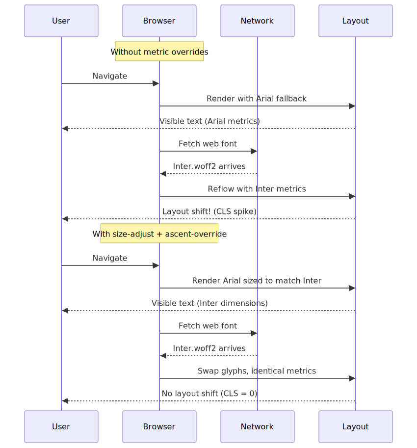
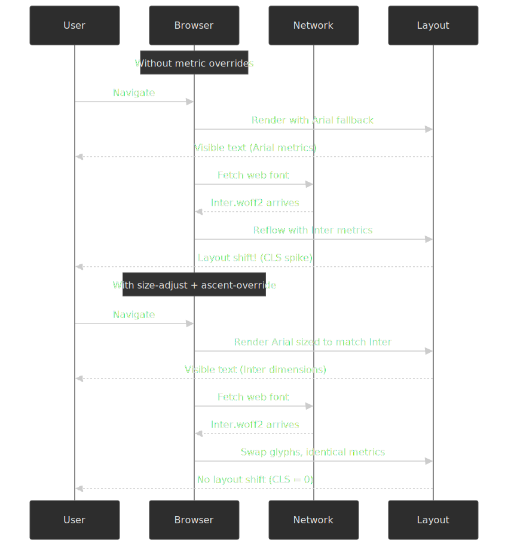

# CSS and Typography Performance Optimization

CSS and typography sit on the critical rendering path: until the browser builds the CSSOM and resolves the font stack, it cannot paint a single pixel of meaningful content. This article is the CSS-and-fonts chapter of the [Web Performance Optimization series](../web-performance-overview/README.md), sitting between [JavaScript optimization](../web-performance-javascript-optimization/README.md) and [image optimization](../web-performance-image-optimization/README.md). It covers what render-blocking actually means, how to reduce it, how containment scopes layout work, and how to make font loading invisible to Cumulative Layout Shift (CLS).




## Abstract

CSS and typography performance follows a layered optimization model:




**Core mental model**: CSS is render-blocking by design — the browser must build the CSSOM before the first paint, otherwise it would risk a flash of unstyled content ([MDN: render-blocking CSS](https://developer.mozilla.org/en-US/docs/Web/Performance/Guides/Critical_rendering_path#render_blocking_css)). Every optimization either reduces blocking time (critical CSS, compression), narrows the layout scope (containment), or prevents reflows (compositor animations, font metric overrides).

**The 14KB threshold** persists across HTTP/2 and HTTP/3 because TCP slow-start's initial congestion window is fixed at 10 segments × ~1460 bytes ≈ 14,600 bytes by [RFC 6928](https://datatracker.ietf.org/doc/html/rfc6928), independent of the application protocol. Critical CSS that fits this budget renders in the first round-trip.

**Font-induced CLS** occurs because fallback and custom fonts have different metrics. The fix is not avoiding `font-display: swap`; it's making the swap dimensionally identical through metric overrides (`size-adjust`, `ascent-override`).

**Browser support context (as of April 2026)**:

- `content-visibility` is [Baseline Newly available since September 15, 2025](https://web.dev/blog/css-content-visibility-baseline) (Chrome 85+, Firefox 125+, Safari 18+).
- Font metric overrides `ascent-override`, `descent-override`, and `line-gap-override` are **not Baseline** — Safari (through 26.x) still has no support per [caniuse](https://caniuse.com/mdn-css_at-rules_font-face_ascent-override). Only `size-adjust` works in Safari 17+.
- The CSS Paint API (Houdini) remains experimental — [neither Firefox nor Safari ship native support](https://caniuse.com/css-paint-api).

## Part 1: CSS Delivery Optimization

### 1.1 Render-Blocking Fundamentals

Browsers block painting until all stylesheets that match the current `media` query are fetched, parsed, and folded into the [CSS Object Model (CSSOM)](https://developer.mozilla.org/en-US/docs/Web/API/CSS_Object_Model). The render tree cannot be assembled without it, so layout and paint cannot start.

**Design rationale**: showing partial styling is worse UX than a brief delay, so the platform errs on the side of waiting. This is also why CSS delivery optimization matters more than for scripts: unlike `async`/`defer`, there is no first-class "deferred stylesheet" — only attribute hacks like the `media="print"` swap. See the [CRP series](../crp-cssom-construction/README.md) for a step-by-step tour of CSSOM construction.

| Technique               | Core Idea                     | Typical Win                      | Gotchas                             |
| ----------------------- | ----------------------------- | -------------------------------- | ----------------------------------- |
| Concatenate & Minify    | Merge files, strip whitespace | Fewer requests, ~20-40% byte cut | Cache-busting needed                |
| Gzip/Brotli Compression | Transfer-level reduction      | 70-95% smaller payloads          | Requires correct `Content-Encoding` |
| HTTP/2 Preload          | Supply CSS early              | Shorter first byte on slow RTT   | Risk of duplicate pushes            |

```html
<link rel="preload" href="/static/app.css" as="style" onload="this.onload=null;this.rel='stylesheet'" />
<noscript><link rel="stylesheet" href="/static/app.css" /></noscript>
```

### 1.2 Bundling Strategy

Bundling every style into one mega-file simplifies caching but couples cache busting for unrelated views. A hybrid approach balances cache hit rate and payload:

- **global.css**: Shared styles (layout, typography, components)
- **route-[name].css**: Route-specific styles loaded on demand

### 1.3 Critical CSS Extraction

Inlining just the above-the-fold rules eliminates a full round-trip, shrinking First Contentful Paint (FCP) by hundreds of milliseconds on slow connections — see [web.dev: Extract and inline critical CSS](https://web.dev/articles/extract-critical-css).

**Target**: ≤14KB compressed critical CSS, fitting in the first round-trip:




**Why 14KB persists with HTTP/2 and HTTP/3**: [RFC 6928](https://datatracker.ietf.org/doc/html/rfc6928) sets the initial congestion window (initcwnd) to `min(10*MSS, max(2*MSS, 14600))` bytes. HTTP/2 and HTTP/3 add multiplexing on top but do not change TCP's (or QUIC's) congestion control: the first round-trip can only carry ~14,600 bytes regardless of application protocol. Tim Kadlec's [Tune The Web review](https://www.tunetheweb.com/blog/critical-resources-and-the-first-14kb/) covers the nuances — ACKs during the TLS handshake can grow the window before the HTML response, so this is a useful budget rather than a hard ceiling.

**Tooling Workflow:**

1. Crawl HTML at target viewports (`critical`, `Penthouse`, or Chrome Coverage)
2. Inline output into `<style>` in the document `<head>`
3. Defer the full sheet with `media="print"` swap pattern

```bash
npx critical index.html \
  --width 360 --height 640 \
  --inline --minify \
  --extract
```

**Generated output:**

```html
<style id="critical">
  /* minified critical rules */
  header {
    display: flex;
    align-items: center;
  }
  /* ... */
</style>

<link rel="stylesheet" href="/static/app.css" media="print" onload="this.media='all'" />
```

**Trade-offs:**

- **Pros**: Faster FCP/LCP, Lighthouse "Eliminate render-blocking" pass
- **Cons**: Inline styles increase HTML size and disable CSS caching for those bytes; multi-route apps need per-page extraction

## Part 2: CSS Runtime Optimization

### 2.1 CSS Containment

The [`contain` property](https://www.w3.org/TR/css-contain-2/) instructs the engine to scope layout, paint, style, and size computations to a subtree.

```css
.card {
  contain: layout paint style;
}
```

- **layout** — descendant layout never escapes the box; ancestors do not reflow when children change.
- **paint** — descendants are clipped to the padding box; off-screen subtrees are skipped entirely.
- **style** — counters and quotes do not leak across the boundary.
- **size** — the box reports an intrinsic size of zero until `contain-intrinsic-size` is given; pair carefully.

The shorthand `contain: content` (= `layout paint style`) is the safe default for most independent components ([MDN: Using CSS containment](https://developer.mozilla.org/en-US/docs/Web/CSS/Guides/Containment/Using)).

**Where it pays off**: independent widgets that change frequently — large feeds, ad slots, dashboard cards — because a contained subtree's mutations no longer invalidate sibling or ancestor layout. The actual savings depend on DOM size and how often the subtree changes; treat double-digit-percent figures from vendor blog posts as illustrative, not as a benchmark for your page.

**Limitations**: `contain: paint` clips overflow, so dropdowns, tooltips, and `position: fixed` children that need to escape the box will be clipped. `contain: size` collapses the box to zero unless you supply `contain-intrinsic-size`.

### 2.2 content-visibility

`content-visibility: auto` extends containment with lazy rendering — the browser skips layout and paint for the subtree until it approaches the viewport.

```css
.section {
  content-visibility: auto;
  contain-intrinsic-size: auto 1000px; /* placeholder + remembered size */
}
```

- The original web.dev demo measured rendering time dropping from **232 ms to 30 ms** (≈7×) on a long travel-blog page when chunked sections were marked `content-visibility: auto` ([Una Kravets, web.dev](https://web.dev/articles/content-visibility)).
- `contain-intrinsic-size` is mandatory in practice: without it, every offscreen section reports a height of zero and the scrollbar collapses.
- [Baseline Newly available since September 15, 2025](https://web.dev/blog/css-content-visibility-baseline) — Chrome 85+, Firefox 125+, Safari 18+.

**The `auto` keyword in `contain-intrinsic-size`**: `auto 1000px` tells the browser to use the last-rendered size once it has been observed, falling back to 1000px initially. This avoids the "scrollbar twitch" you get with a fixed placeholder when sections turn out to be different sizes.

**Why this is more than `loading="lazy"` for sections**: the browser skips not only paint but also layout, style recalc, and IntersectionObserver-style bookkeeping for off-screen elements. When the user scrolls near the element, rendering happens just-in-time. The trade-off is scroll-time compute for faster initial paint.

> [!NOTE]
> Before September 2025, Firefox shipped `content-visibility` disabled-by-default (versions 109–124) and Safari had no support. If you need to support browsers older than that window, treat the property as a progressive enhancement — unsupported browsers simply ignore the rule and render normally.

### 2.3 will-change

A hint for upcoming property transitions, letting the engine pre-promote a layer or set up the right paint context.

```css
.modal {
  will-change: transform, opacity;
}
```

[MDN explicitly calls `will-change` a "last resort"](https://developer.mozilla.org/en-US/docs/Web/CSS/will-change) for elements with measured performance problems, not a preventive optimization. Over-use is actively counter-productive:

- Each promoted layer consumes GPU memory; on memory-constrained devices this can starve the rest of the compositor.
- Maintaining many layers adds composition overhead that frequently outweighs the savings.
- Browsers may ignore the hint when it judges the cost is too high.

**Recommended pattern**: Toggle via JavaScript, not static CSS:

```javascript title="will-change-toggle.js" collapse={1-2, 10-15}
const modal = document.querySelector(".modal")

// Apply before animation starts
modal.addEventListener("mouseenter", () => {
  modal.style.willChange = "transform, opacity"
})

// Remove after animation completes
modal.addEventListener("animationend", () => {
  modal.style.willChange = "auto"
})
```

**When static CSS is acceptable**: Predictable, frequent animations like slide decks or page-flip interfaces where the element will definitely animate on interaction.

### 2.4 Compositor-Friendly Animations

Animate only **opacity** and **transform** to keep the work on the compositor thread, avoiding main-thread layout and paint ([web.dev: animations guide](https://web.dev/articles/animations-guide)). Layout-affecting properties (`top`, `left`, `width`, `height`, `margin`) force a full-frame pipeline; large or frequent ones will drop frames on mid-tier devices.

```css
/* Good: Compositor-only */
.modal-enter {
  transform: translateY(100%);
  opacity: 0;
}

.modal-enter-active {
  transform: translateY(0);
  opacity: 1;
  transition:
    transform 300ms ease,
    opacity 300ms ease;
}

/* Bad: Triggers layout */
.modal-enter-bad {
  top: 100%;
}

.modal-enter-active-bad {
  top: 0;
  transition: top 300ms ease;
}
```

### 2.5 CSS Houdini Paint Worklet

Paint Worklets allow JavaScript-generated backgrounds executed off-main-thread. The CSS Paint API enables custom rendering without DOM overhead.

```javascript title="checkerboard.js" collapse={1-2}
// checkerboard.js - Paint Worklet module
registerPaint(
  "checker",
  class {
    paint(ctx, geom) {
      const s = 16
      for (let y = 0; y < geom.height; y += s) for (let x = 0; x < geom.width; x += s) ctx.fillRect(x, y, s, s)
    }
  },
)
```

```html
<script>
  CSS.paintWorklet.addModule("/checkerboard.js")
</script>
```

```css
.widget {
  background: paint(checker);
}
```

**Browser Support (NOT Baseline)**:

| Browser | Status            | Notes                              |
| ------- | ----------------- | ---------------------------------- |
| Chrome  | Full support      | 65+ (April 2018)                   |
| Edge    | Full support      | 79+                                |
| Firefox | **Not supported** | Under consideration (Bug #1302328) |
| Safari  | **Partial**       | Development stage, experimental    |

**Recommendation**: Treat CSS Paint API as experimental. Use the [CSS Paint Polyfill](https://github.com/GoogleChromeLabs/css-paint-polyfill) by Chrome DevRel for cross-browser support, but consider it progressive enhancement rather than core functionality. The polyfill leverages `-webkit-canvas()` and `-moz-element()` for optimized rendering in non-supporting browsers.

### 2.6 CSS Size & Selector Efficiency

| Optimization                                     | How it helps                                                          | Caveats                                                  |
| ------------------------------------------------ | --------------------------------------------------------------------- | -------------------------------------------------------- |
| Tree-shaking ([PurgeCSS](https://purgecss.com/), Tailwind JIT, [UnoCSS](https://unocss.dev/)) | Removes dead selectors; large utility frameworks routinely shrink 60-90% | Dynamic class names need an explicit safelist            |
| Selector simplicity                              | Short selectors reduce match time                                     | Almost never measurable until DOMs exceed ~10k nodes     |
| Registered (`@property`) custom properties       | Inheritance and animatability declared once; recalc avoids re-parsing values | `@property` is Baseline only since 2024; older browsers fall back to plain custom properties |

```css
/* Efficient: simple, non-chained */
.card-title {
}

/* Inefficient: deeply nested */
.container > .content > .card > .header > .title {
}
```

For most production sites, selector simplicity is a code-quality concern, not a performance one — DevTools' [Selector Stats](https://developer.chrome.com/docs/devtools/performance/selector-stats) panel will tell you the moment that stops being true.

## Part 3: Font Asset Optimization

### 3.1 The Modern Font Format: WOFF2

The [W3C WOFF2 specification](https://www.w3.org/TR/WOFF2/) replaces WOFF 1.0's zlib/Flate compression with Brotli plus content-aware preprocessing of the `glyf` and `loca` tables. The combination yields ~30% smaller files than WOFF and 60–70% smaller than uncompressed TTF.

| Format  | Compression | Size vs TTF      | Browser support             | Recommendation |
| ------- | ----------- | ---------------- | --------------------------- | -------------- |
| WOFF2   | Brotli + table transforms | 60–70% smaller | [>97% globally](https://caniuse.com/woff2) | Primary choice |
| WOFF    | zlib/Flate  | ~40% smaller     | Universal legacy            | Drop for new sites |
| TTF/OTF | None        | Baseline         | Legacy desktop              | Avoid for web  |

**Modern declaration:**

```css
@font-face {
  font-family: "MyOptimizedFont";
  font-style: normal;
  font-weight: 400;
  font-display: swap;
  src: url("/fonts/my-optimized-font.woff2") format("woff2");
}
```

### 3.2 Font Subsetting

Subsetting removes glyphs your site never uses. Real-world reductions of 60–90% are routine; the [Google Fonts case study using `unicode-range`](https://developers.googleblog.com/smaller-fonts-with-woff-20-and-unicode-range/) reported >40% download savings even without aggressive subsetting.

**Strategies:**

**Language-based subsetting:**

```css
@font-face {
  font-family: "MyMultilingualFont";
  src: url("/fonts/my-font-latin.woff2") format("woff2");
  unicode-range:
    U+0000-00FF, U+0131, U+0152-0153, U+02BB-02BC, U+02C6, U+02DA, U+02DC, U+2000-206F, U+2074, U+20AC, U+2122;
}

@font-face {
  font-family: "MyMultilingualFont";
  src: url("/fonts/my-font-cyrillic.woff2") format("woff2");
  unicode-range: U+0400-045F, U+0490-0491, U+04B0-04B1, U+2116;
}
```

**Using pyftsubset:**

```bash
pyftsubset SourceSansPro.ttf \
  --output-file="SourceSansPro-subset.woff2" \
  --flavor=woff2 \
  --layout-features='*' \
  --unicodes="U+0020-007E,U+2018,U+2019,U+201C,U+201D,U+2026"
```

**Critical considerations:**

- Check font EULA permits subsetting (modification)
- Dynamic content may introduce missing glyphs (tofu boxes)
- Use `glyphhanger` for automated analysis

### 3.3 Variable Fonts

Variable fonts pack every weight, width, slant, and optical-size axis into one OpenType 1.8+ file ([MDN: Variable fonts guide](https://developer.mozilla.org/en-US/docs/Web/CSS/CSS_fonts/Variable_fonts_guide)). Fewer requests, often fewer bytes overall.

**Size comparison (Source Sans Pro)** — figures from [Mandy Michael's benchmark](https://uxdesign.cc/the-performance-benefits-of-variable-fonts-79af8c4ff56c):

- All static weights (OTF): ~1,170 KB
- Variable font (OTF): ~405 KB
- Variable font (WOFF2): ~112 KB

A single static WOFF2 weight is comparable in size to a full variable WOFF2; the win shows up the moment you ship two or more weights.

**Declaration (modern syntax)**:

```css
@font-face {
  font-family: "MyVariableFont";
  src: url("MyVariableFont.woff2") format("woff2");
  font-weight: 100 900;
  font-stretch: 75% 125%;
  font-style: normal;
}
```

**Format syntax evolution** ([CSS Fonts Module Level 4](https://www.w3.org/TR/css-fonts-4/#font-face-src-loading)):

| Syntax                                | Status                                                       |
| ------------------------------------- | ------------------------------------------------------------ |
| `format("woff2")`                     | **Recommended in practice** — modern browsers auto-detect variation tables |
| `format("woff2") tech("variations")`  | Current spec, the future-proof form                          |
| `format("woff2-variations")`          | Deprecated but still parsed by all major engines             |
| `format("woff2 supports variations")` | Removed from the spec, will not parse                        |

**Why bare `format("woff2")` is enough today**: variable fonts are still WOFF2 binaries; the variation tables sit inside the font file and are detected by every shipping browser engine. The `tech()` function exists for future formats (e.g. COLRv1, incremental fonts) where the wrapper format alone does not imply support.

**Usage:**

```css
h1 {
  font-family: "MyVariableFont", sans-serif;
  font-weight: 785; /* Any value in range */
}

.condensed {
  font-stretch: 85%;
}
```

**Browser fallback:**

```css title="variable-font-fallback.css" collapse={1-14}
/* Static fonts for legacy browsers */
@font-face {
  font-family: "MyStaticFallback";
  src: url("MyStatic-Regular.woff2") format("woff2");
  font-weight: 400;
}
@font-face {
  font-family: "MyStaticFallback";
  src: url("MyStatic-Bold.woff2") format("woff2");
  font-weight: 700;
}

body {
  font-family: "MyStaticFallback", sans-serif;
}

/* Variable font for modern browsers */
@supports (font-variation-settings: normal) {
  @font-face {
    font-family: "MyVariableFont";
    src: url("MyVariableFont.woff2") format("woff2-variations");
    font-weight: 100 900;
  }

  body {
    font-family: "MyVariableFont", sans-serif;
  }
}
```

## Part 4: Font Loading Strategies

### 4.1 Self-Hosting vs Third-Party

**The shared-cache myth is dead.** Every modern browser now [partitions the HTTP cache by top-level site](https://developer.chrome.com/blog/http-cache-partitioning) — Chrome 86 (Oct 2020), Firefox 85 (Jan 2021), and Safari since 2013. A font downloaded by `site-a.com` cannot be reused by `site-b.com`, so the historical "everyone uses Google Fonts so it's already cached" argument no longer holds. Addy Osmani's [double-keyed caching write-up](https://addyosmani.com/blog/double-keyed-caching/) covers the security rationale and the measurable impact on cache-hit rate.

**Benefits of self-hosting:**

- Eliminates third-party connection overhead (DNS + TCP + TLS)
- Full control over caching headers
- GDPR/privacy compliance (no third-party requests)
- Ability to subset exactly as needed

### 4.2 Strategic Preloading

Preload critical fonts to discover them early:

```html
<head>
  <link rel="preload" href="/fonts/critical-heading-font.woff2" as="font" type="font/woff2" crossorigin="anonymous" />
</head>
```

**Critical attributes:**

- `as="font"`: Correct prioritization and caching
- `type="font/woff2"`: Skip preload if format unsupported
- `crossorigin`: **Required** even for same-origin fonts (CORS mode)

**Warning**: Only preload critical fonts. Preloading too many creates contention.

### 4.3 font-display Strategies

The [`font-display` descriptor](https://developer.mozilla.org/en-US/docs/Web/CSS/@font-face/font-display) splits font loading into a **block period** (invisible text), a **swap period** (fallback shown, swap when font arrives), and a **failure period** (give up, keep fallback).




| Value      | Block period              | Swap period | Behavior          | CWV impact         | Use case                      |
| ---------- | ------------------------- | ----------- | ----------------- | ------------------ | ----------------------------- |
| `block`    | Short (~3s recommended)   | Infinite    | FOIT              | Bad FCP/LCP        | Icon fonts only               |
| `swap`     | Extremely small (~0)      | Infinite    | FOUT              | Good FCP, risk CLS | Headlines with metric overrides |
| `fallback` | Extremely small (~100ms)  | ~3s         | Compromise        | Balanced           | Body text                     |
| `optional` | Extremely small (~100ms)  | None        | Performance-first | Excellent CLS      | Non-critical text             |

**The exact timings are recommendations, not normative.** [CSS Fonts Module Level 4](https://www.w3.org/TR/css-fonts-4/#font-display-desc) defines relative concepts ("extremely small", "short") rather than exact milliseconds. Implementations vary — Firefox exposes the threshold as `gfx.downloadable_fonts.fallback_delay`, and Chrome's `optional` may skip the network request entirely on slow connections.

**Strategy alignment:**

- Preloaded fonts → `font-display: swap` (with CLS mitigation)
- Non-preloaded fonts → `font-display: optional`

```css
/* Critical heading font - preloaded */
@font-face {
  font-family: "HeadingFont";
  font-display: swap;
  src: url("/fonts/heading.woff2") format("woff2");
}

/* Body font - not preloaded */
@font-face {
  font-family: "BodyFont";
  font-display: optional;
  src: url("/fonts/body.woff2") format("woff2");
}
```

### 4.4 Preconnect for Third-Party

If using Google Fonts or other CDNs:

```html
<head>
  <link rel="preconnect" href="https://fonts.googleapis.com" />
  <link rel="preconnect" href="https://fonts.gstatic.com" crossorigin />
</head>
```

## Part 5: Eliminating Font-Induced CLS

### 5.1 The Root Cause

CLS occurs when fallback and custom fonts have different x-heights, ascents, descents, or character widths. When `font-display: swap` triggers, text reflows and surrounding content shifts.




### 5.2 Font Metric Overrides

Use CSS descriptors to force fallback fonts to match custom font dimensions:

- **size-adjust**: Scale overall glyph size
- **ascent-override**: Space above baseline
- **descent-override**: Space below baseline
- **line-gap-override**: Extra space between lines

**Browser support (NOT Baseline)** — per [caniuse](https://caniuse.com/mdn-css_at-rules_font-face_ascent-override) as of April 2026:

| Property            | Chrome | Firefox | Safari |
| ------------------- | ------ | ------- | ------ |
| `size-adjust`       | 92+    | 92+     | 17+    |
| `ascent-override`   | 87+    | 89+     | **No** (through 26.x) |
| `descent-override`  | 87+    | 89+     | **No** (through 26.x) |
| `line-gap-override` | 87+    | 89+     | **No** (through 26.x) |

**Safari limitation**: Safari supports only `size-adjust`. Applying it alone — without the matching ascent/descent corrections — can scale text into a different vertical box than the web font expects, sometimes increasing layout shift instead of reducing it. The pragmatic workaround is to scope the full override block to engines that support it.

**Workaround for Safari**: Consider using `@supports` to exclude Safari from full metric overrides:

```css
@supports (ascent-override: 1%) {
  /* Chrome, Edge, Firefox only */
  @font-face {
    font-family: "Inter-Fallback";
    src: local("Arial");
    ascent-override: 90.2%;
    descent-override: 22.48%;
    size-adjust: 107.4%;
  }
}
```

### 5.3 Implementation

**Step 1: Define the web font:**

```css
@font-face {
  font-family: "Inter";
  font-style: normal;
  font-weight: 400;
  font-display: swap;
  src: url("/fonts/inter-regular.woff2") format("woff2");
}
```

**Step 2: Create metrics-adjusted fallback:**

```css
@font-face {
  font-family: "Inter-Fallback";
  src: local("Arial");
  ascent-override: 90.2%;
  descent-override: 22.48%;
  line-gap-override: 0%;
  size-adjust: 107.4%;
}
```

**Step 3: Use both in font stack:**

```css
body {
  font-family: "Inter", "Inter-Fallback", sans-serif;
}
```

**Result**: Arial renders with Inter's dimensions. When Inter loads, no layout shift occurs.

### 5.4 Automated Solutions

**Tools for calculating overrides:**

- [Fallback Font Generator](https://screenspan.net/fallback)
- [Capsize](https://seek-oss.github.io/capsize/)
- [Fontaine](https://github.com/unjs/fontaine) — Node.js library

**Framework integration:**

- **Next.js 13.2+**: [`next/font`](https://nextjs.org/docs/app/api-reference/components/font) automatically calculates and injects fallback fonts with `size-adjust`. It self-hosts Google Fonts at build time for GDPR compliance and eliminates runtime network requests.
- **Nuxt**: [`@nuxtjs/fontaine`](https://github.com/nuxt-modules/fontaine) provides automatic fallback generation.

> [!NOTE]
> The `@next/font` package was renamed to the built-in `next/font` in Next.js 13.2 and [completely removed in Next.js 14](https://nextjs.org/docs/messages/built-in-next-font) (October 2023). Use `import { Inter } from 'next/font/google'` or `import localFont from 'next/font/local'`. The codemod `npx @next/codemod built-in-next-font .` migrates legacy imports.

## Part 6: Build-Time Processing

### 6.1 Pre- vs Post-Processing

- **Preprocessors (Sass, Less)**: Add variables/mixins but increase build complexity
- **PostCSS**: Autoprefixing, minification (`cssnano`), media query packing with negligible runtime cost

### 6.2 CSS-in-JS Considerations

Runtime CSS-in-JS libraries like styled-components and Emotion serialize and inject styles inside the React render path. The cost shows up as additional scripting work — typically tens to hundreds of milliseconds per route on mid-tier hardware ([Aggelos Arvanitakis on perfplanet](https://calendar.perfplanet.com/2019/the-unseen-performance-costs-of-css-in-js-in-react-apps/)). It comes from three places:

1. **JS parsing** — CSS strings embedded in JS bundles increase parse time.
2. **Style injection** — runtime `<style>` creation and CSSOM mutation on every render that produces a new style.
3. **Server/client mismatch risk** — server-rendered CSS must match the client-generated CSS exactly, and runtime CSS-in-JS [breaks streaming SSR](https://www.infoq.com/news/2022/10/prefer-build-time-css-js/) because the server must wait for the React render to flush all styles.

**Design trade-off**: runtime CSS-in-JS buys you colocation and prop-driven styles at the cost of runtime work and a more complex SSR story. If you don't need styles to depend on runtime values (user prefs, API responses), a build-time extractor wins on every axis.

**Static extraction alternatives:**

| Library         | Approach                           | Trade-off                          |
| --------------- | ---------------------------------- | ---------------------------------- |
| Linaria         | Zero-runtime, extracts to CSS      | No dynamic styles                  |
| vanilla-extract | TypeScript-first, type-safe tokens | Build-time only                    |
| Panda CSS       | Atomic CSS generation              | Learning curve for atomic approach |

These compile to static CSS at build time, achieving the same performance as hand-written CSS while retaining component-scoped authoring. Use runtime CSS-in-JS only when you need styles that depend on runtime values (user preferences, API responses).

## Part 7: Measurement & Diagnostics

### 7.1 DevTools Analysis

- **Performance > Selector Stats**: Match attempts vs hits for slow selectors
- **Coverage tab**: Unused CSS per route for pruning
- **Network panel**: Font loading waterfall and timing

### 7.2 Lighthouse Audits

- Render-blocking resources
- Unused CSS
- Font display strategy
- CLS attribution (font-related shifts)

### 7.3 Custom Metrics

```javascript title="performance-monitoring.js" collapse={1-2, 12-13}
// Monitor font loading with PerformanceObserver
const fontObserver = new PerformanceObserver((list) => {
  list.getEntries().forEach((entry) => {
    if (entry.initiatorType === "css" && entry.name.includes("font")) {
      console.log(`Font loaded: ${entry.name}`)
      console.log(`Load time: ${entry.responseEnd - entry.startTime}ms`)
    }
  })
})
fontObserver.observe({ type: "resource" })

// Monitor layout shifts for font-induced CLS
const clsObserver = new PerformanceObserver((list) => {
  list.getEntries().forEach((entry) => {
    if (!entry.hadRecentInput) {
      console.log(`Layout shift: ${entry.value}`)
      entry.sources?.forEach((source) => {
        // Text elements are likely font-related
        if (source.node?.tagName === "P" || source.node?.tagName === "H1") {
          console.log("Possible font-induced CLS")
        }
      })
    }
  })
})
clsObserver.observe({ type: "layout-shift" })
```

## Implementation Checklist

### CSS Delivery

- [ ] Extract and inline critical CSS (≤14KB compressed)
- [ ] Defer non-critical CSS with media="print" swap
- [ ] Configure Gzip/Brotli compression
- [ ] Implement route-based CSS splitting

### CSS Runtime

- [ ] Apply `contain: layout paint style` to independent components
- [ ] Use `content-visibility: auto` for off-screen sections
- [ ] Animate only `transform` and `opacity`
- [ ] Use `will-change` sparingly and remove after animation

### Font Assets

- [ ] Convert to WOFF2 format
- [ ] Subset fonts for target languages
- [ ] Evaluate variable fonts for 3+ weight variants
- [ ] Target ≤100KB total font payload

### Font Loading

- [ ] Self-host fonts for control and privacy
- [ ] Preload critical fonts with crossorigin attribute
- [ ] Use appropriate font-display values
- [ ] Implement font metric overrides for zero-CLS

### Monitoring

- [ ] Track CSS coverage and remove unused rules
- [ ] Monitor font-related CLS in production
- [ ] Set up alerts for font loading regressions

## Performance Budget

| Resource          | Target | Notes                    |
| ----------------- | ------ | ------------------------ |
| Critical CSS      | ≤14KB  | Fits in first TCP packet |
| Total CSS         | ≤50KB  | After compression        |
| Total fonts       | ≤100KB | Critical fonts only      |
| Max font families | 2-3    | Variable fonts preferred |

## Conclusion

CSS and typography performance reduces to a small number of physical truths.

**CSS is render-blocking by design.** The browser must build the complete CSSOM before painting, so delivery optimization (critical CSS inline, deferral via `media="print"`, compression) is fundamentally different from JavaScript optimization where `async`/`defer` exist as first-class primitives.

**Font loading is a CLS problem before it is a download problem.** The fix is not picking between `font-display: swap` and `block`; it's making the swap dimensionally identical with `size-adjust` and friends. Safari's missing `ascent-override` / `descent-override` support means zero-CLS font swaps remain aspirational on Apple devices — there is no clean workaround until Safari ships these descriptors.

**Containment moves layout from global to local scope.** `contain` and `content-visibility` don't reduce the browser's total work; they scope it to subtrees so a single change doesn't cascade across the document. This is where complex interfaces — dashboards, infinite lists, content-heavy pages — get their wins.

**The 14KB critical-CSS target is TCP physics, not HTTP fashion.** HTTP/2 and HTTP/3 improve multiplexing but neither changes RFC 6928's initial congestion window. Fitting critical CSS in the first round-trip remains the fastest path to first paint, regardless of protocol.

For the rest of the performance picture, see the sibling articles in this series: [infrastructure & networking](../web-performance-infrastructure-stack/README.md), [JavaScript optimization](../web-performance-javascript-optimization/README.md), and [image optimization](../web-performance-image-optimization/README.md). The [overview article](../web-performance-overview/README.md) ties them together.

## Appendix

### Prerequisites

- Understanding of the browser rendering pipeline (DOM → CSSOM → Render Tree → Layout → Paint → Composite)
- Familiarity with Core Web Vitals (LCP, CLS, INP)
- Basic knowledge of HTTP caching and compression

### Terminology

- **CSSOM**: CSS Object Model—the browser's parsed representation of stylesheets
- **FOUC**: Flash of Unstyled Content—visible unstyled HTML before CSS loads
- **FOIT**: Flash of Invisible Text—invisible text while fonts load (with `font-display: block`)
- **FOUT**: Flash of Unstyled Text—fallback font visible before custom font loads (with `font-display: swap`)
- **Compositor**: Browser thread that handles GPU-accelerated rendering of layers
- **initcwnd**: Initial congestion window—TCP's starting packet count (~10 packets ≈ 14KB)

### Summary

1. **Load fast**: Minify, compress, split, and inline critical CSS ≤14KB (fits initial congestion window)
2. **Render smart**: Apply `contain`/`content-visibility` to isolate subtrees from global layout
3. **Animate on compositor**: Stick to `opacity`/`transform`; use `will-change` sparingly and toggle via JS
4. **Optimize fonts**: WOFF2 + subsetting + variable fonts; target ≤100KB total
5. **Eliminate CLS**: Font metric overrides for dimensionally identical fallbacks (Safari lacks `ascent-override`)
6. **Ship less CSS**: Tree-shake frameworks, keep selectors flat, measure with Coverage tab

### References

**Specifications**:

- [W3C WOFF2 Specification](https://www.w3.org/TR/WOFF2/) — Web Open Font Format 2.0
- [CSS Containment Module Level 2](https://www.w3.org/TR/css-contain-2/) — Containment and `content-visibility`
- [CSS Fonts Module Level 4](https://www.w3.org/TR/css-fonts-4/) — `font-display`, font metric descriptors, `tech()` function
- [RFC 6928](https://datatracker.ietf.org/doc/html/rfc6928) — Increasing TCP's Initial Window (the 14KB rule)

**Official Documentation**:

- [CSS Containment - MDN](https://developer.mozilla.org/en-US/docs/Web/CSS/CSS_containment) - Containment and content-visibility
- [will-change - MDN](https://developer.mozilla.org/en-US/docs/Web/CSS/will-change) - Animation optimization hints
- [Variable Fonts - MDN](https://developer.mozilla.org/en-US/docs/Web/CSS/CSS_fonts/Variable_fonts_guide) - Variable fonts guide
- [font-display - MDN](https://developer.mozilla.org/en-US/docs/Web/CSS/@font-face/font-display) - Font loading behavior control
- [ascent-override - MDN](https://developer.mozilla.org/en-US/docs/Web/CSS/@font-face/ascent-override) - Font metric descriptors
- [Chrome DevTools Coverage](https://developer.chrome.com/docs/devtools/coverage) - Finding unused CSS
- [Next.js Font Optimization](https://nextjs.org/docs/pages/api-reference/components/font) - next/font API reference

**Industry Expert Content**:

- [Critical CSS - web.dev](https://web.dev/articles/extract-critical-css) - Extracting and inlining critical CSS
- [content-visibility - web.dev](https://web.dev/articles/content-visibility) - Lazy rendering for better performance
- [CSS content-visibility Baseline - web.dev](https://web.dev/blog/css-content-visibility-baseline) - September 2025 baseline announcement
- [Font Metric Overrides - web.dev](https://web.dev/articles/css-size-adjust) - Preventing CLS with size-adjust
- [Why 14KB - Tune The Web](https://www.tunetheweb.com/blog/critical-resources-and-the-first-14kb/) - TCP slow start and critical resources
- [Variable Fonts - Evil Martians](https://evilmartians.com/chronicles/the-joy-of-variable-fonts-getting-started-on-the-frontend) - Format syntax evolution
- [Double-keyed caching - Addy Osmani](https://addyosmani.com/blog/double-keyed-caching/) - How browser cache partitioning changed the web
- [The performance benefits of Variable Fonts - Mandy Michael](https://uxdesign.cc/the-performance-benefits-of-variable-fonts-79af8c4ff56c) - Source of the Source Sans Pro size benchmark

**Tools**:

- [pyftsubset](https://fonttools.readthedocs.io/en/latest/subset/) - Font subsetting tool
- [Fallback Font Generator](https://screenspan.net/fallback) - Calculate font metric overrides
- [Capsize](https://seek-oss.github.io/capsize/) - Font metrics calculation
- [CSS Paint Polyfill](https://github.com/GoogleChromeLabs/css-paint-polyfill) - Cross-browser Houdini support
