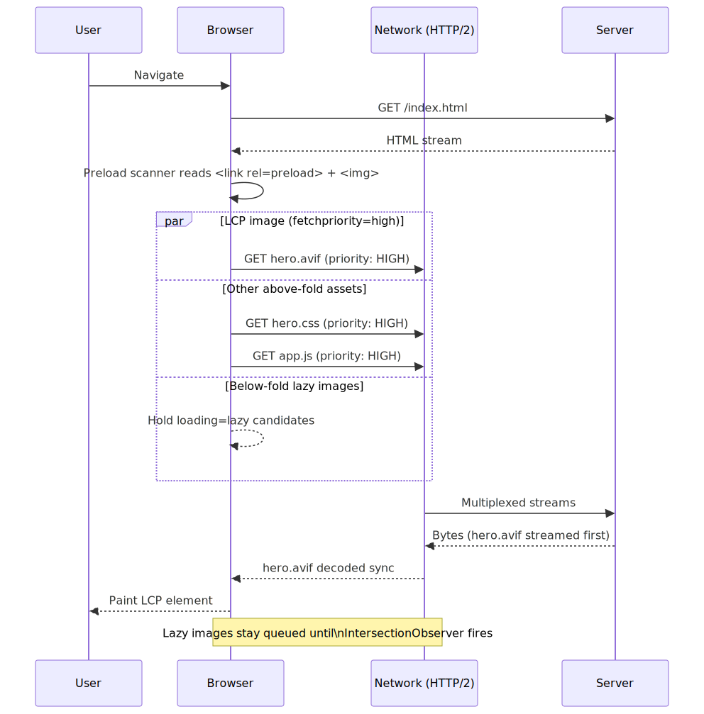
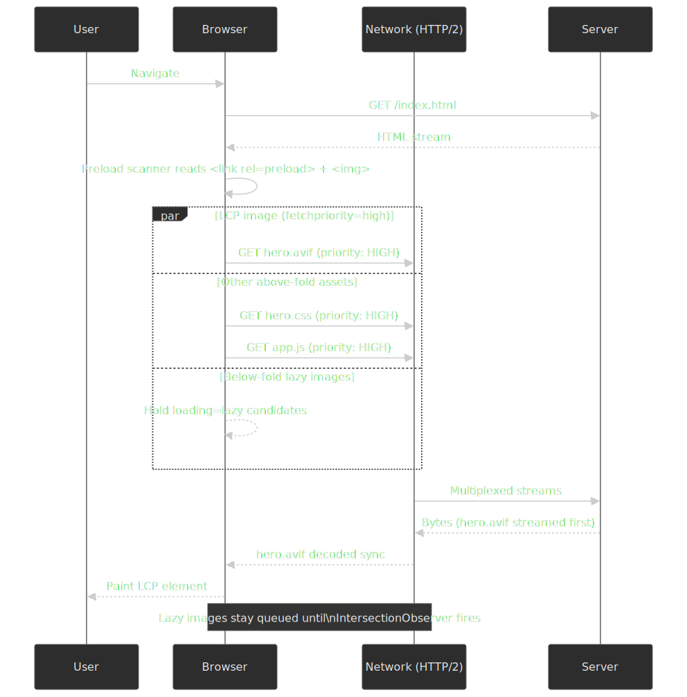

# Image Performance Optimization for the Web

Images dominate page weight on most sites and are the single most common
LCP element on the web. The wins are not subtle — pick the right format,
serve the right pixels for the device, and tell the browser which image
matters most, and you can shave 50–80% off bytes shipped and seconds off
LCP. The cost is a four-stage pipeline that has to be applied
consistently, with one inversion most teams miss: **the LCP image
needs the opposite attributes from every other image on the page**.




This guide is part of the [Web Performance Optimization](../web-performance-overview/README.md)
series; for the broader picture see the
[infrastructure stack](../web-performance-infrastructure-stack/README.md),
[JavaScript optimization](../web-performance-javascript-optimization/README.md),
and [CSS / typography](../web-performance-css-typography/README.md) entries.
For the metric-focused field measurement of LCP and CLS, see
[Core Web Vitals measurement](../core-web-vitals-measurement/README.md).

## Mental model

Optimizing images is a sequence of **four independent decisions**, each
with a clear default and a clear escape hatch. The decisions compound:
the wrong format at stage 1 can negate any clever fetch priority at
stage 3.

1. **Format** — pick the smallest format the browser will accept. Use
   [`<picture>`](https://html.spec.whatwg.org/multipage/embedded-content.html#the-picture-element)
   to negotiate AVIF → WebP → JPEG/PNG.
2. **Sizing** — never ship desktop pixels to a phone. Use `srcset` (with
   width descriptors) plus `sizes` so the browser can pick the smallest
   candidate that still covers the device's pixel density.
3. **Loading priority** — tell the browser which image is the LCP, defer
   everything else. The pair to reach for: `fetchpriority="high"` on the
   hero, `loading="lazy"` on everything below the fold.
4. **Decoding** — control whether decode work happens on the main thread
   (good for the hero, bad for a 50-image gallery).

Two non-negotiables apply across all four stages:

- Always set explicit `width` and `height` (or `aspect-ratio` in CSS) so
  the browser reserves the slot before the bytes arrive — this is what
  prevents lazy-loaded images from shifting the layout and trashing
  [CLS](https://web.dev/articles/cls).
- Never lazy-load the LCP image. The browser does not know which image
  is the LCP until it has laid out the page, and by then the request is
  late.

## Image formats

The format ladder has been stable since 2024: **AVIF for the smallest
photographic payloads, WebP as the broadly safe default, JPEG/PNG as
fallback, JPEG XL as a future bet for archival and lossless JPEG
recompression.**

### Format comparison

| Format      | Compression vs JPEG | Lossy / Lossless | Color depth      | HDR support              | Alpha | Browser support (2026)                  | Best use case                |
| ----------- | ------------------- | ---------------- | ---------------- | ------------------------ | ----- | --------------------------------------- | ---------------------------- |
| **AVIF**    | 30–50% smaller      | both             | 8 / 10 / 12-bit  | PQ / HLG with BT.2020/.2100 | yes   | ~94% global ([caniuse](https://caniuse.com/avif)) | HDR photos, rich media       |
| **WebP**    | 25–34% smaller      | both             | 8-bit            | no                       | yes   | ~97% global ([caniuse](https://caniuse.com/webp)) | General web delivery default |
| **JPEG XL** | 20–60% smaller      | both             | up to 32-bit float | full Rec.2100            | yes   | Safari 17+; Chrome 145 (flag); Firefox Nightly (flag) | Archival, JPEG recompression |
| **JPEG**    | baseline            | lossy            | 8-bit            | no                       | no    | 100%                                    | Universal fallback           |
| **PNG**     | lossless only       | lossless         | 1–16-bit         | no                       | yes   | 100%                                    | Graphics, logos, sharp UI    |
| **SVG**     | n/a (vector)        | lossless         | n/a              | n/a                      | yes   | 100%                                    | Icons, logos, illustrations  |

Browser-support numbers are from caniuse.com global usage tables in
April 2026; both AVIF and WebP are now broadly safe defaults, with
AVIF still trailing WebP by ~3 percentage points because Safari only
shipped it in 16.4 (March 2023) and Edge waited until version 121.




### AVIF (AV1 Image File Format)

AVIF reuses AV1's intra-frame coding to compress still images. It is
the smallest broadly-supported format on the web today, but encoding is
slow enough that it really only fits build-time or async edge
generation.

**Container and codec:**

- Container: HEIF (ISO/IEC 23008-12), itself built on the ISO Base Media
  File Format (ISO/IEC 14496-12), specified by
  the [Alliance for Open Media's AVIF v1.2.0 (2025)](https://aomedia.org/docs/AV1%20Image%20File%20Format%20(AVIF)%20v1.2.0.pdf).
- Codec: AV1 intra-frame coding from the
  [AV1 Bitstream & Decoding Process Specification](https://aomediacodec.github.io/av1-spec/).
- Tiling: large images are stored as an `'grid'` derivation of smaller
  tile items linked by `'dimg'` references, so an encoder can keep
  memory bounded for very high-resolution images.

**Why it compresses better than JPEG:**

- Square superblocks of 64×64 or 128×128 luma samples, recursively
  partitioned all the way down to 4×4 — the encoder picks block size
  per region instead of forcing a fixed 8×8 DCT grid.
- 56 directional intra-prediction modes (8 nominal angles with 7
  ±3°-step offsets each) plus DC, Paeth, and three smooth predictors —
  far richer than JPEG's single intra mode.
- A non-binary, multi-symbol adaptive arithmetic coder operating on
  cumulative distribution functions (up to 16 symbols per alphabet) —
  not CABAC; AV1 explicitly avoided binary arithmetic coding to reduce
  serial decode dependencies.
- In-loop CDEF (constrained directional enhancement filter) plus loop
  restoration with a switchable Wiener / dual self-guided filter clean
  up ringing and quantization artifacts before the bitstream is
  finalized.
- Optional film-grain synthesis — encode the clean image, signal the
  grain parameters, and let the decoder regenerate the grain instead
  of spending bits on it.

> [!WARNING]
> AVIF encoding is roughly **8–10× slower than JPEG** at the
> compression-effort settings most encoders default to. Treat it as a
> build-time or async-edge format; do not encode AVIF on the request
> path of a synchronous handler.

### WebP

WebP is the pragmatic default. It loses a few percentage points to AVIF
on photos but encodes fast, decodes fast on weak hardware, and has had
~97% support since Safari 14 picked it up in 2020.

**Architecture:**

- Lossy mode: VP8 codec with 16×16 macroblocks, intra-frame prediction,
  and DCT residual coding (RFC 6386).
- Lossless mode: VP8L with four transform types — predictor (spatial),
  color, subtract-green, and color-indexing — plus Huffman entropy
  coding ([WebP lossless bitstream spec](https://developers.google.com/speed/webp/docs/webp_lossless_bitstream_specification),
  [RFC 9649](https://datatracker.ietf.org/doc/html/rfc9649)).
- Animation via frame differencing in a single container — drop GIF
  ASAP if you still ship it, WebP animation is typically an order of
  magnitude smaller.

**Limits:**

- 8-bit color only — no HDR, no wide-gamut workflows.
- No progressive decode — the image renders frame-by-frame, so on a
  slow link a partial WebP just looks like a missing image until the
  whole file lands.

### JPEG XL

JPEG XL is the long-bet format. Its killer features are **lossless
JPEG recompression** and **bit-exact reconstruction** of the original
JPEG: you can re-encode an existing JPEG library to JPEG XL, save
~16–22% on bytes, and decode back to the byte-identical JPEG when
needed ([JPEG official white paper](https://ds.jpeg.org/whitepapers/jpeg-xl-whitepaper.pdf)).

**Architecture:**

- VarDCT mode for lossy: variable block-size DCT (square and rectangular
  blocks from 2×2 to 256×256) plus the XYB perceptual color space.
- Modular mode for lossless / near-lossless: FLIF-derived predictive
  coding with per-channel context modeling.
- Progressive decode driven by saliency hints — the encoder can flag
  important regions to decode first, useful for low-bandwidth previews.
- Up to 32-bit float color depth and full Rec.2100 HDR.

**Browser status (April 2026):**

- **Safari 17+** ships native JPEG XL (since macOS Sonoma / iOS 17,
  September 2023). No animation or progressive decode yet.
- **Chrome 145** (February 2026)
  [re-added JPEG XL behind `chrome://flags`](https://www.heise.de/en/news/Chrome-145-brings-back-JPEG-XL-11173820.html)
  using a new Rust decoder (`jxl-rs`) — not on by default.
- **Firefox** keeps `image.jxl.enabled` as a build-time flag; the Rust
  decoder is being integrated into Nightly (targeting 149) but stable
  builds still ship without it.

> [!NOTE]
> Until JPEG XL is on by default in two engines, treat it as an
> **archival** format (storage savings, no client benefit) rather than
> a delivery format. AVIF + WebP + JPEG covers the delivery path.

### Format negotiation with `<picture>`

The `<picture>` element is **format negotiation, not size negotiation**.
The browser walks the `<source>` elements in document order and picks
the **first** one whose `media` query matches and whose `type` is a
supported MIME type — it does not compare candidate file sizes
([WHATWG HTML §img element](https://html.spec.whatwg.org/multipage/images.html)).

```html
<picture>
  <!-- Browser takes the first supported source -->
  <source srcset="image.avif" type="image/avif" />
  <source srcset="image.webp" type="image/webp" />
  
</picture>
```

Selection order matters because of that "first supported" rule: list
**smaller formats first** (AVIF before WebP before JPEG). If you list
JPEG first, every modern browser will happily download JPEG and ignore
the AVIF you spent build time generating.

## Responsive images

Format negotiation alone still ships desktop pixels to a phone. The
`srcset` + `sizes` pair lets the browser pick the smallest image that
covers the actual rendered slot at the device's pixel density.

### The selection algorithm

Spelling out what the [WHATWG "select an image source" algorithm](https://html.spec.whatwg.org/multipage/images.html#update-the-source-set)
actually does:




```html

```

**Worked example.** Viewport 400px, DPR 2:

1. `sizes` is parsed left-to-right; `(max-width: 600px) 100vw` matches
   first → slot is 400 CSS px.
2. Required pixels = `400 × 2` = 800.
3. Browser picks the smallest `srcset` candidate ≥ 800px → `image-800.jpg`.

> [!IMPORTANT]
> The last `sizes` entry **must** be unconditional (no media query) — it
> is the default. Browsers stop at the first match, so condition order
> matters; put the most-specific media query first.

A few rules people get wrong:

- `sizes` lengths are CSS pixels (`100vw`, `50vw`, `800px`); **percentages
  are not allowed**.
- Always include `src` as the fallback for very old browsers and for
  contexts where `srcset` parsing is skipped (e.g. some email clients).
- The browser may pick an upper-tier candidate to honor "smallest ≥
  required" but is allowed to round down or up to honor user preferences
  like Save-Data — treat the algorithm as "the browser will pick a
  reasonable candidate", not "exactly the one I named".

### Density descriptors for fixed-dimension images

Logos, icons, avatars — anything whose CSS width does not change with
the viewport — does not need `sizes`. Use `x` descriptors:

```html

```

`x` descriptors only target DPR; mixing `x` and `w` in the same
`srcset` is invalid per spec and most browsers will pick whichever
descriptor type appears first.

### Art direction with `<picture media>`

When viewport changes warrant a different **crop** (not just a
different size), nest the resolution-switching `srcset` inside
`<source media=...>`:

```html
<picture>
  <source
    media="(max-width: 768px)"
    srcset="hero-mobile-400.jpg 400w, hero-mobile-600.jpg 600w"
    sizes="100vw"
  />
  <source
    media="(min-width: 769px)"
    srcset="hero-desktop-800.jpg 800w, hero-desktop-1200.jpg 1200w"
    sizes="50vw"
  />
  
</picture>
```

| Pattern              | Purpose                                                           | When to use                          |
| -------------------- | ----------------------------------------------------------------- | ------------------------------------ |
| `srcset` alone       | Resolution switching — same image, different sizes                | Bandwidth optimization               |
| `<picture media>`    | Art direction — different crops or compositions per viewport      | Hero images that need a portrait crop on mobile |
| `<picture type>`     | Format negotiation — AVIF / WebP / JPEG fallback                  | Always (modern formats)              |

### Combined: format + art direction + resolution

The full pattern combines all three. Verbose, but structured:

```html
<picture>
  <!-- Mobile crop, AVIF -->
  <source
    media="(max-width: 768px)"
    srcset="hero-mobile-400.avif 400w, hero-mobile-600.avif 600w"
    sizes="100vw"
    type="image/avif"
  />
  <!-- Mobile crop, WebP -->
  <source
    media="(max-width: 768px)"
    srcset="hero-mobile-400.webp 400w, hero-mobile-600.webp 600w"
    sizes="100vw"
    type="image/webp"
  />
  <!-- Desktop crop, AVIF -->
  <source
    srcset="hero-800.avif 800w, hero-1200.avif 1200w"
    sizes="(max-width: 1200px) 50vw, 600px"
    type="image/avif"
  />
  <!-- Desktop crop, WebP -->
  <source
    srcset="hero-800.webp 800w, hero-1200.webp 1200w"
    sizes="(max-width: 1200px) 50vw, 600px"
    type="image/webp"
  />
  <!-- Final fallback: JPEG -->
  
</picture>
```

## Loading strategy

This is the section where the LCP-vs-everything-else inversion lives.
Every modern attribute on `` has an "LCP setting" and a
"below-the-fold setting", and they're opposites.




```html
<!-- LCP image: maximum priority -->


<!-- Below-the-fold: minimum impact -->

```

| Attribute         | LCP image                         | Below-the-fold                       |
| ----------------- | --------------------------------- | ------------------------------------ |
| `loading`         | `eager` (default)                 | `lazy` (defer until near viewport)   |
| `fetchpriority`   | `high` (top of resource queue)    | `auto` (browser decides)             |
| `decoding`        | `sync` (atomic paint with text)   | `async` (decode off main render)     |
| `width` / `height`| **always set** (CLS protection)   | **always set** (CLS protection)      |

### `fetchpriority`

`fetchpriority` is a hint to the browser's resource scheduler, not a
directive ([WHATWG fetch priority attributes](https://html.spec.whatwg.org/multipage/urls-and-fetching.html#fetch-priority-attribute)):

- **`high`** — bump above the default priority for this resource type.
- **`low`** — drop below the default.
- **`auto`** (default) — let the browser's heuristics decide.

The default heuristics can absolutely pick the wrong image on a busy
page — a slider's first slide, a carousel's loading frame, a logo above
the hero. The Chrome team's
[Fetch Priority API guide](https://web.dev/articles/fetch-priority)
documents Google Flights moving LCP from **2.6s → 1.9s** by adding
`fetchpriority="high"` to the hero image; Etsy reported a 4% LCP
improvement from the same change at scale.

> [!CAUTION]
> Don't put `fetchpriority="high"` on more than one image per page.
> If everything is high priority, nothing is — you've just told the
> scheduler "treat all of these like the LCP" and it can't distinguish
> them.

### `decoding`

The `decoding` attribute tells the browser when image decoding can
happen relative to the rest of the render. Per the
[HTML spec](https://html.spec.whatwg.org/multipage/embedded-content.html#attr-img-decoding),
the missing-value default is **`auto`** — implementations differ on
what `auto` means, with Chromium historically biasing toward sync and
Firefox toward async.

| Value   | Behavior                                                                | When to use                          |
| ------- | ----------------------------------------------------------------------- | ------------------------------------ |
| `sync`  | Decode synchronously and present atomically with surrounding content    | LCP image                            |
| `async` | Decode in parallel; allow other content to render first                 | Below-the-fold, dynamic galleries    |
| `auto`  | Implementation-defined (the missing-value default)                      | If you don't have a strong opinion   |

The trade-off:

- `sync` keeps the image in lockstep with surrounding text; a perceptually
  stable LCP paints all at once. Cost: a brief main-thread stall for
  decode.
- `async` lets the rest of the frame render first; cost: a visible "pop-in"
  if the image decodes after surrounding content.

For dynamic insertion (`element.src = ...`), prefer the
[`HTMLImageElement.decode()`](https://developer.mozilla.org/en-US/docs/Web/API/HTMLImageElement/decode)
Promise API — it returns once decoding is done, so you can append the
element to the DOM only after the pixels are ready, avoiding both jank
and pop-in.

### Native lazy loading

`loading="lazy"` defers the fetch until the image is "near" the
viewport. Chromium's heuristic, per the
[web.dev browser-level lazy loading guide](https://web.dev/articles/browser-level-image-lazy-loading),
is currently:

- **~1250px** from the viewport on fast connections (4G+)
- **~2500px** on slower connections (3G or worse)

Other rules to know:

- The `loading` attribute does nothing without `width` and `height`
  (or CSS `aspect-ratio`); without those you'll lazy-load and shift
  the layout, trashing CLS.
- Native lazy loading is **disabled when JavaScript is disabled** —
  the browser falls back to eager fetching for every image
  ([Stefan Judis: "Disabled JavaScript turns off native lazy loading"](https://www.stefanjudis.com/today-i-learned/disabled-javascript-turns-off-native-lazy-loading/)).
- Setting `loading="lazy"` on an off-screen LCP candidate (e.g., a hero
  hidden behind a layout-loaded slide) will tank LCP. The browser
  cannot retroactively reclassify the image as the LCP and re-prioritize
  it.

> [!WARNING]
> The single most common LCP regression I see in code review:
> someone copy-pastes `loading="lazy"` onto every `` "for
> performance" without knowing which image is the LCP. Audit hero
> images in CI; do not blanket-apply lazy loading.

### Preloading late-discovered images

The HTML preload scanner finds `` and `<link rel="preload">`
elements during streaming HTML parse, before the main parser has
constructed the DOM. That fast path **does not** cover CSS background
images or JS-injected images — those are discovered too late to help
LCP. Preload them explicitly:

```html
<head>
  <!-- Preload LCP image with format negotiation; the browser picks the first -->
  <link rel="preload" as="image" href="hero.avif" type="image/avif" fetchpriority="high" />
  <link rel="preload" as="image" href="hero.webp" type="image/webp" fetchpriority="high" />
</head>
```

Use preload when:

- The LCP image is a CSS `background-image`.
- The LCP image is rendered by a JS framework after hydration.
- The LCP image is inside a lazy-loaded component (route chunk, modal).

Skip preload when the LCP image is a plain `` above the fold —
the preload scanner already finds it. A redundant preload competes
with the `` for the same byte-range and can actually slow LCP.

### Discovery sequence

Putting the loading attributes together against the network gives the
sequence the browser actually executes:




## Programmatic control

Native attributes cover ~95% of cases. The two situations that still
need code: custom lazy-load thresholds, and adapting image quality to
network conditions.

### IntersectionObserver for fine-grained lazy loading

Use this when you need a different threshold than Chromium's hard-coded
1250/2500px, or when you're lazy-loading something that isn't an
`` (e.g., an iframe with a custom loader).

```ts title="intersection-observer-lazy.ts"
const lazyImages = document.querySelectorAll<HTMLImageElement>("img[data-src]")

const observer = new IntersectionObserver(
  (entries) => {
    entries.forEach((entry) => {
      if (!entry.isIntersecting) return

      const img = entry.target as HTMLImageElement
      img.src = img.dataset.src!

      img
        .decode()
        .then(() => img.classList.add("loaded"))
        .catch(() => console.error("Decode failed:", img.src))

      observer.unobserve(img)
    })
  },
  {
    rootMargin: "200px",
    threshold: 0.1,
  },
)

lazyImages.forEach((img) => observer.observe(img))
```

The `img.decode()` call is the important part: it returns a Promise
that resolves once the bitmap is fully decoded, so you can flip a
`loaded` class and run a fade-in only after the pixels are real. Without
`decode()`, the `` paints a blank frame between `src` assignment
and the actual decode.

### Network-aware loading (Save-Data and effective type)

The [Network Information API](https://wicg.github.io/netinfo/) exposes
three signals that are useful for image quality:

- `effectiveType` — bucketed connection quality (`slow-2g`, `2g`, `3g`,
  `4g`).
- `downlink` — estimated bandwidth in Mbps.
- `saveData` — boolean reflecting the user's explicit Save-Data
  preference (Chrome, Edge, Samsung Internet, Opera).

```ts title="network-aware-loading.ts"
interface ConnectionInfo {
  effectiveType: "slow-2g" | "2g" | "3g" | "4g"
  downlink: number
  saveData: boolean
}

function getImageQuality(): number {
  const connection = (navigator as Navigator & { connection?: ConnectionInfo }).connection

  if (!connection) return 80

  if (connection.saveData) return 50
  if (connection.effectiveType === "slow-2g") return 40
  if (connection.effectiveType === "2g") return 50
  if (connection.effectiveType === "3g") return 70
  return 85
}

function buildImageUrl(basePath: string, width: number): string {
  const quality = getImageQuality()
  return `${basePath}?w=${width}&q=${quality}&f=auto`
}
```

Effective connection thresholds, per the
[Network Information API draft](https://wicg.github.io/netinfo/#dom-effectiveconnectiontype):

- `slow-2g` — RTT ≥ 2000 ms
- `2g` — RTT ≥ 1400 ms
- `3g` — RTT ≥ 270 ms, downlink < 700 Kbps
- `4g` — RTT < 270 ms, downlink ≥ 700 Kbps

> [!IMPORTANT]
> The Network Information API has only ~76% global support
> ([caniuse](https://caniuse.com/netinfo)) and is **Chromium-only** —
> Safari and Firefox have explicitly declined to ship it on
> fingerprinting grounds. Your fallback path needs to be a sensible
> default (treat unknown as 4G), not "no images".

## Server-side generation

Two production options: build-time generation with a library like
[Sharp](https://sharp.pixelplumbing.com/), or runtime generation behind
an image CDN. They cover different operating points.

### Build-time with Sharp

Sharp wraps libvips and is the standard for static or build-step image
generation in Node:

```ts title="generate-responsive-images.ts"
import sharp from "sharp"
import path from "path"

const WIDTHS = [400, 800, 1200, 1600]
const FORMATS = ["avif", "webp"] as const

interface OutputFile {
  path: string
  width: number
  format: string
  size: number
}

async function generateResponsiveImages(inputPath: string, outputDir: string): Promise<OutputFile[]> {
  const outputs: OutputFile[] = []
  const baseName = path.basename(inputPath, path.extname(inputPath))

  for (const width of WIDTHS) {
    for (const format of FORMATS) {
      const outputPath = path.join(outputDir, `${baseName}-${width}.${format}`)

      const info = await sharp(inputPath)
        .resize(width, null, { withoutEnlargement: true })
        .toFormat(format, {
          quality: format === "avif" ? 65 : 80,
          effort: format === "avif" ? 4 : 6,
        })
        .toFile(outputPath)

      outputs.push({ path: outputPath, width, format, size: info.size })
    }
  }

  return outputs
}
```

Practical encoder defaults:

- AVIF `quality` 60–70 lands around JPEG `quality` 80–85 in perceived
  quality for typical photographic content.
- AVIF `effort` 4 is Sharp's default and a sensible build-time number;
  effort 9 is roughly 8× slower for a few percent more compression.
- WebP `quality` 75–85 covers most use cases; `effort` 6 is the highest
  Sharp exposes.

### Image CDN at the edge

Image CDNs (Cloudflare Images / Cloudinary / imgix / Akamai Image
Manager) handle format negotiation and resizing per request, keyed on
the `Accept` header:

```html
<!-- Cloudflare Images: format=auto switches AVIF/WebP/JPEG by Accept header -->

```

| Approach            | Wins                                                           | Costs                                       |
| ------------------- | -------------------------------------------------------------- | ------------------------------------------- |
| Build-time (Sharp)  | Free at runtime; deterministic; works offline / static-host    | Build-time grows with image set; rebuild on every transform change |
| Image CDN           | Per-request format/size negotiation; new sizes need no rebuild | Per-request cost; vendor lock-in; cache miss penalty |
| Hybrid (CDN over Sharp originals) | Build originals + WebP, let CDN derive AVIF and resizes | Two layers to operate                       |

Most production systems converge on **hybrid**: ship pre-baked
originals + WebP for the broad case, let an image CDN derive AVIF and
the long tail of sizes on demand.

## Performance monitoring

The two PerformanceObserver types worth wiring up: LCP attribution and
resource timing for image entries.

### LCP attribution

```ts title="lcp-image-tracking.ts"
const lcpObserver = new PerformanceObserver((list) => {
  const entries = list.getEntries()
  const lastEntry = entries[entries.length - 1] as PerformanceEntry & {
    element?: Element
    url?: string
    size?: number
    renderTime?: number
    loadTime?: number
  }

  if (lastEntry.element?.tagName === "IMG") {
    console.log("LCP element:", lastEntry.element)
    console.log("LCP time:", lastEntry.renderTime || lastEntry.loadTime)
    console.log("Image URL:", lastEntry.url)
    console.log("Image size (px²):", lastEntry.size)
  }
})

lcpObserver.observe({ type: "largest-contentful-paint", buffered: true })
```

The interesting field is `lastEntry.url`: when the LCP element is an
image, that URL tells you exactly which asset to optimize. Pipe it to
your RUM backend, group by URL, and the worst LCP offenders surface
quickly.

### Resource Timing for images

```ts title="image-resource-tracking.ts"
const resourceObserver = new PerformanceObserver((list) => {
  for (const entry of list.getEntries()) {
    const resource = entry as PerformanceResourceTiming

    if (resource.initiatorType !== "img") continue

    const metrics = {
      url: resource.name,
      transferSize: resource.transferSize,
      encodedBodySize: resource.encodedBodySize,
      decodedBodySize: resource.decodedBodySize,
      duration: resource.responseEnd - resource.startTime,
      ttfb: resource.responseStart - resource.startTime,
    }

    console.log("Image loaded:", metrics)
  }
})

resourceObserver.observe({ type: "resource", buffered: true })
```

`transferSize` vs `encodedBodySize` is the cache hint: if `transferSize`
is much smaller than `encodedBodySize`, the resource came from the
HTTP cache or a 304. `decodedBodySize / transferSize` is the
compression ratio — useful for spotting under-compressed images.

## Practical takeaways

- Pick formats top-down in `<picture>` (AVIF → WebP → JPEG). The
  browser takes the first supported one; size order is on you.
- `srcset` ships the right pixels; `sizes` tells the browser how big
  the slot will be. Without `sizes`, it assumes 100vw and over-fetches.
- The LCP image needs `loading="eager" + fetchpriority="high" +
  decoding="sync"`. Everything else needs the inverse. Audit this in CI.
- Always set `width` and `height`. Lazy-loading without dimensions
  trades download bytes for layout shift.
- The Network Information API is Chromium-only — design for an unknown
  network as the default case, treat detected slow networks as a
  bonus.
- Build-time encoding is free at runtime; image CDNs are flexible at
  runtime. Most teams end up hybrid; pick deliberately.

## Appendix

### Prerequisites

- Familiarity with [Core Web Vitals](../core-web-vitals-measurement/README.md) (LCP, CLS, INP).
- Working understanding of HTTP/2 resource prioritization and the
  preload scanner.
- Comfort reading `<picture>` / `<source>` markup and the WHATWG image
  selection algorithm.

### Terminology

- **AVIF** — AV1 Image File Format; ISOBMFF container around AV1
  intra-frame coding.
- **CABAC** — Context-Adaptive Binary Arithmetic Coding; used by H.264
  / HEVC, **not** by AV1 (AV1 uses non-binary CDF-based arithmetic
  coding).
- **CDEF** — Constrained Directional Enhancement Filter; AV1 in-loop
  filter that suppresses ringing along detected edge directions.
- **CDF** — Cumulative Distribution Function; per-context probability
  table that AV1's arithmetic coder updates online.
- **CLS** — Cumulative Layout Shift; Core Web Vital measuring visual
  stability.
- **DCT** — Discrete Cosine Transform; the spatial-frequency basis used
  by JPEG and (with VarDCT) by JPEG XL.
- **DPR** — Device Pixel Ratio; physical pixels per CSS pixel (e.g., 2
  for Retina, 3 for high-density mobile).
- **HEIF** — High Efficiency Image File Format (ISO/IEC 23008-12); the
  container family AVIF reuses.
- **LCP** — Largest Contentful Paint; Core Web Vital measuring
  perceived load time of the largest above-the-fold content element.
- **VarDCT** — Variable-block-size DCT mode in JPEG XL.

### Summary

- **Format priority**: AVIF (~94% support, 30–50% smaller) → WebP
  (~97% support, 25–34% smaller) → JPEG fallback. Use `<picture>` for
  negotiation; first matching `<source>` wins.
- **Responsive images**: `srcset` with `w` descriptors plus `sizes` for
  slot hints. Browser computes `slot × DPR` and picks the smallest
  candidate ≥ requirement.
- **LCP images**: `loading="eager"`, `fetchpriority="high"`,
  `decoding="sync"`. The opposite of every other image on the page.
- **Below-fold images**: `loading="lazy"`, `fetchpriority="auto"`,
  `decoding="async"`. Native lazy loading needs both `width`/`height`
  and JavaScript enabled.
- **Preload** CSS background-images and JS-injected LCP candidates;
  do **not** preload `` tags the preload scanner already finds.
- **JPEG XL**: archival-grade compression with bit-exact JPEG
  recompression; Safari 17+ is on by default, Chrome 145+ is behind a
  flag. Treat it as storage savings, not delivery, until two engines
  ship it on by default.

### References

**Specifications**

- [WHATWG HTML — img element & responsive images](https://html.spec.whatwg.org/multipage/images.html) — `srcset`/`sizes` selection algorithm, `<picture>` source selection.
- [WHATWG HTML — picture element](https://html.spec.whatwg.org/multipage/embedded-content.html#the-picture-element) — element semantics and parsing.
- [AV1 Image File Format (AVIF) v1.2.0 — Alliance for Open Media (2025)](https://aomedia.org/docs/AV1%20Image%20File%20Format%20(AVIF)%20v1.2.0.pdf) — current AVIF specification.
- [AV1 Bitstream & Decoding Process Specification](https://aomediacodec.github.io/av1-spec/) — superblocks, intra-prediction modes, CDF coder.
- [WebP Container Specification (Google)](https://developers.google.com/speed/webp/docs/riff_container) — RIFF container, VP8 / VP8L modes.
- [RFC 6386 — VP8 Data Format and Decoding Guide](https://datatracker.ietf.org/doc/html/rfc6386) — VP8 codec used by lossy WebP.
- [JPEG XL White Paper (JPEG / ISO)](https://ds.jpeg.org/whitepapers/jpeg-xl-whitepaper.pdf) — VarDCT, modular mode, lossless JPEG transcoding.

**Official documentation**

- [MDN — Responsive Images](https://developer.mozilla.org/en-US/docs/Learn/HTML/Multimedia_and_embedding/Responsive_images) — `srcset`, `sizes`, `<picture>` walkthrough.
- [MDN — HTMLImageElement.decoding](https://developer.mozilla.org/en-US/docs/Web/API/HTMLImageElement/decoding) — decoding hint behavior.
- [MDN — HTMLImageElement.decode()](https://developer.mozilla.org/en-US/docs/Web/API/HTMLImageElement/decode) — Promise-based decode for dynamic insertion.
- [web.dev — Optimize Largest Contentful Paint](https://web.dev/articles/optimize-lcp) — LCP image strategy from the Chrome team.
- [web.dev — Optimize resource loading with the Fetch Priority API](https://web.dev/articles/fetch-priority) — `fetchpriority` semantics, Google Flights case study.
- [web.dev — Browser-level image lazy-loading](https://web.dev/articles/browser-level-image-lazy-loading) — Chrome's lazy-load thresholds and behavior.
- [Network Information API draft (WICG)](https://wicg.github.io/netinfo/) — `effectiveType`, `saveData`, downlink heuristics.
- [Cloudflare Images — Transform via URL](https://developers.cloudflare.com/images/transform-images/transform-via-url/) — `cdn-cgi/image/...` URL scheme.

**Browser support**

- [caniuse — AVIF](https://caniuse.com/avif) — ~94% global support, version-by-version table.
- [caniuse — WebP](https://caniuse.com/webp) — ~97% global support.
- [caniuse — JPEG XL](https://caniuse.com/jpegxl) — current support status.
- [caniuse — Network Information API](https://caniuse.com/netinfo) — ~76% global support, Chromium only.
- [Chrome 145 brings back JPEG XL — heise online (2026)](https://www.heise.de/en/news/Chrome-145-brings-back-JPEG-XL-11173820.html) — Chrome JXL re-introduction.

**Tools**

- [Sharp (Node.js)](https://sharp.pixelplumbing.com/) — high-performance image processing built on libvips.
- [Squoosh (Google)](https://squoosh.app/) — browser-based encoder comparison.
- [libjxl](https://github.com/libjxl/libjxl) — JPEG XL reference implementation (`cjxl` / `djxl`).
