# Web Performance Infrastructure: DNS, HTTP/3, CDN, Compression, Origin

Infrastructure sets the floor for every other web-performance metric. No amount of code-splitting, font tuning, or image optimization can rescue a page whose TTFB is 800 ms because the connection negotiated TLS twice, missed the edge cache, and hit a cold database connection. This article walks the stack from the moment a browser resolves a hostname to the moment your origin returns bytes — DNS, the connection (HTTP/3 + TLS 1.3), the CDN edge, payload compression, and origin caching — and surfaces the trade-offs that decide each knob.

It is the infrastructure entry of the [web performance series](../web-performance-overview/README.md). The hand-offs are explicit: the connection layer feeds the [JavaScript optimization](../web-performance-javascript-optimization/README.md), [CSS & typography](../web-performance-css-typography/README.md), and [image optimization](../web-performance-image-optimization/README.md) work that follow.


## Mental model

Every navigation traverses four stages: **DNS → connection → edge → origin**. Each stage either succeeds quickly (and the next stage gets a budget) or burns the page's TTFB budget all by itself. Three structural ideas drive the entire stack:

1. **Eliminate round trips.** TCP needs three handshakes (TCP, TLS, often application-level redirects). QUIC fuses the TCP and TLS handshakes; HTTPS DNS records eliminate the Alt-Svc upgrade hop; 0-RTT removes the handshake entirely for return visits.
2. **Move bytes closer to the user.** A CDN PoP in the user's metro area shortens RTT from ~150 ms (Sydney → us-east-1) to <10 ms. Edge functions extend that proximity from cached objects to dynamic logic.
3. **Don't recompute what you already computed.** Multi-layer caching (browser → service worker → edge → reverse proxy → in-memory store → DB query plan cache) means most bytes never touch a database, and many never touch an origin.

, edge cache, edge function, then VPC into origin.")

The corollary is a budget: if connection + edge fits inside ~50 ms, origin has ~150 ms to render an HTML response and still pass [TTFB <200 ms](https://web.dev/articles/ttfb). Most "slow site" investigations resolve to one of: DNS not advertising HTTP/3, edge cache key not matching, origin not pooling DB connections.

### Targets

| Layer        | Target                                                       | Failure signal                              |
| ------------ | ------------------------------------------------------------ | ------------------------------------------- |
| DNS          | <20 ms excellent, <50 ms acceptable                          | Visitor logs show >100 ms `dns_lookup`      |
| Connection   | 1-RTT new connection; 0-RTT for return visits                | Lots of TCP/TLS time in WebPageTest filmstrip |
| Edge         | >80% origin offload **by bytes** (not just by request count) | High origin egress bill; cache-hit ratio lies |
| Compression  | Brotli on the wire for HTML/CSS/JS, AVIF/WebP for images     | `Content-Encoding: identity` for text       |
| Origin TTFB  | <100 ms p50, <200 ms p75                                     | LCP regressions traced to server-timing     |
| Cache        | <1 ms hit on Redis/Memcached for hot keys                    | DB CPU saturated by repeated identical queries |

## Connection layer

The first three round trips between browser and edge — DNS lookup, transport handshake, TLS handshake — are the cheapest milliseconds you'll ever buy. They have no business logic in them and you can shave most of them with configuration alone.

### DNS as a performance lever

DNS used to mean "hostname → IP". [RFC 9460](https://datatracker.ietf.org/doc/html/rfc9460) (November 2023) added two record types — `SVCB` and `HTTPS` — that let DNS hand back protocol negotiation hints in the same response as the IP, eliminating the Alt-Svc upgrade hop that used to delay first-time HTTP/3 connections by 1-2 RTTs ([Cloudflare: Speeding up HTTPS and HTTP/3 negotiation with DNS](https://blog.cloudflare.com/speeding-up-https-and-http-3-negotiation-with-dns/)).

```dns title="example.com zone"
; HTTPS RR — advertises HTTP/3 + HTTP/2 and an IPv4 hint in one DNS response
example.com.        300 IN HTTPS 1 . alpn="h3,h2" port="443" ipv4hint="192.0.2.1"

; SVCB RR — same idea for non-HTTP services
_8443._foo.example. 300 IN SVCB  1 svc.example.net. alpn="h3" port="8443"
```

The interesting service parameters:

- `alpn="h3,h2"` — tells the client which ALPN tokens to attempt, in preference order, before any handshake. Skips Alt-Svc.
- `ipv4hint`, `ipv6hint` — short-circuit the second `A` / `AAAA` lookup when the resolver returns the HTTPS record.
- `ech` — Encrypted Client Hello configuration; lets the client send the SNI under encryption.

**Adoption**. As of mid-2023 the [first large-scale measurement study](https://arxiv.org/abs/2309.10344) (IMC 2023) found ~10.5 M HTTPS records and ~4 K SVCB records on the open internet, with Cloudflare hosting the overwhelming majority — its automatic deployment for customer zones is what lit up the long tail. Independent operators outside the major CDNs are still rare. Browser support: Chrome 96+, Firefox 78+ (DNS-over-HTTPS only), Safari 14+ (most aggressive consumer of the record).

> [!TIP]
> If you front your zone with Cloudflare, the HTTPS record is free. If you run your own authoritative DNS, deploying it is a one-time zone edit and immediately saves the Alt-Svc round trip on the first HTTP/3 connection.

```javascript title="dns-timing.js"
const measureDnsTiming = () => {
  const nav = performance.getEntriesByType("navigation")[0]
  const dns = nav.domainLookupEnd - nav.domainLookupStart
  return {
    timing: dns,
    bucket: dns < 20 ? "excellent" : dns < 50 ? "good" : "needs-improvement",
  }
}
```

### HTTP/3 and QUIC

HTTP/3 ([RFC 9114](https://datatracker.ietf.org/doc/html/rfc9114), June 2022) drops TCP for [QUIC](https://datatracker.ietf.org/doc/html/rfc9000) (RFC 9000, May 2021). The redesign is not a small one: QUIC pushes streams down into the transport layer and merges the TLS 1.3 handshake into the transport handshake.

**What QUIC fixes that you can't fix at the application layer:**

1. **TCP head-of-line blocking.** HTTP/2's stream multiplex was an application-layer fiction over a single TCP byte stream. One lost packet stalls every stream. QUIC implements streams in the transport itself, so a lost packet on `/main.js` does not block `/styles.css`.
2. **Slow handshake.** TCP needs 1 RTT to open, then TLS 1.3 needs another. QUIC fuses both into 1 RTT, and 0 RTT for resumed connections.
3. **Connection migration.** TCP identifies a connection by the 4-tuple `(srcIP, srcPort, dstIP, dstPort)`; switching from Wi-Fi to cellular kills it. QUIC identifies a connection by an opaque Connection ID and survives the move.

 versus HTTP/3 (QUIC) under packet loss — independent QUIC streams keep /b and /c moving while /a is retransmitted.")
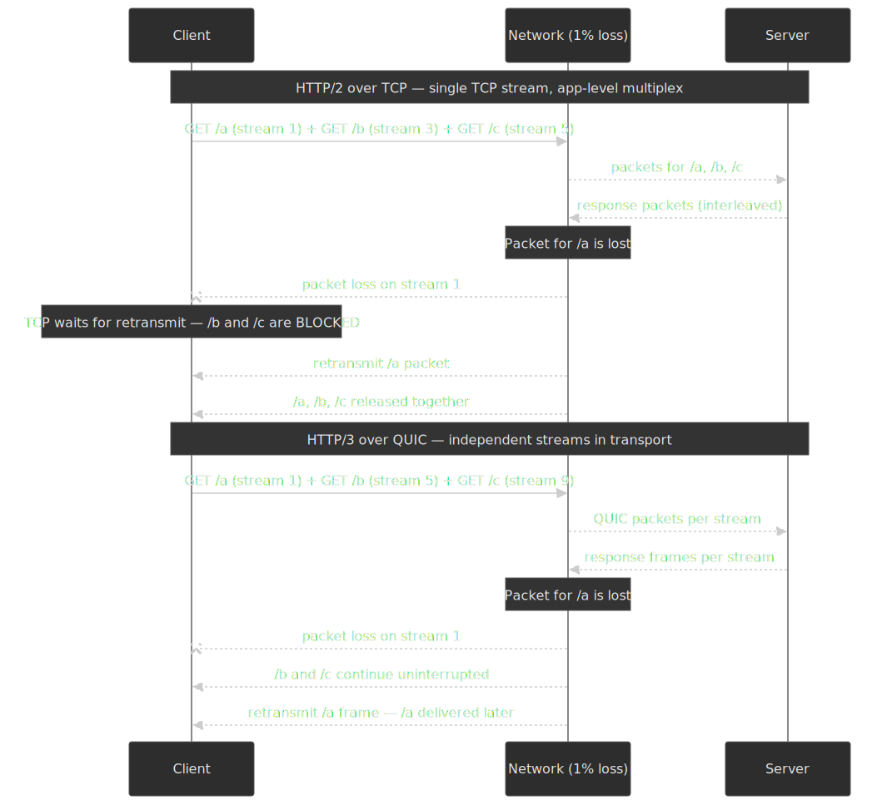

**Adoption**. As of April 2026 [W3Techs reports HTTP/3 advertised by 39% of all websites](https://w3techs.com/technologies/details/ce-http3) (typically via Alt-Svc or HTTPS records). Cloudflare Radar measures actual request-level use closer to **21%** ([Cloudflare 2025 Year in Review](https://blog.cloudflare.com/radar-2025-year-in-review/)) — the gap is bots and first-visit page loads that haven't yet discovered the protocol. Browser support is mature: Chrome 87+, Firefox 88+, Safari 16+ (default-on by Safari 17), Edge 87+.

**Where HTTP/3 actually wins, and where it loses:**

| Scenario                  | HTTP/3 vs HTTP/2     | Notes                                                                                       |
| ------------------------- | -------------------- | ------------------------------------------------------------------------------------------- |
| Lossy mobile / Wi-Fi      | 30%+ faster          | Stream-level loss recovery wins decisively                                                 |
| Stable broadband, small page | Comparable        | Handshake savings show up on first connection only                                          |
| Stable broadband, fast link (≥1 Gbps) | HTTP/3 can lose | "[QUIC is not Quick Enough over Fast Internet](https://dl.acm.org/doi/10.1145/3589334.3645323)" (WWW 2024): user-space ACK handling and missing UDP GRO support cap throughput |
| Repeated visits           | 0-RTT eliminates handshake | Application must enforce idempotency on 0-RTT requests                                |

> [!IMPORTANT]
> HTTP/3 is not always faster. On a clean fixed-line connection at >1 Gbps, kernel-bypass cost and missing UDP segmentation offload can leave QUIC trailing TCP. Enable HTTP/3 by default but keep TCP as a healthy fallback path.

### TLS 1.3 and 0-RTT

TLS 1.3 ([RFC 8446](https://datatracker.ietf.org/doc/html/rfc8446), August 2018) was redesigned with the explicit goal of cutting the handshake to a single round trip.

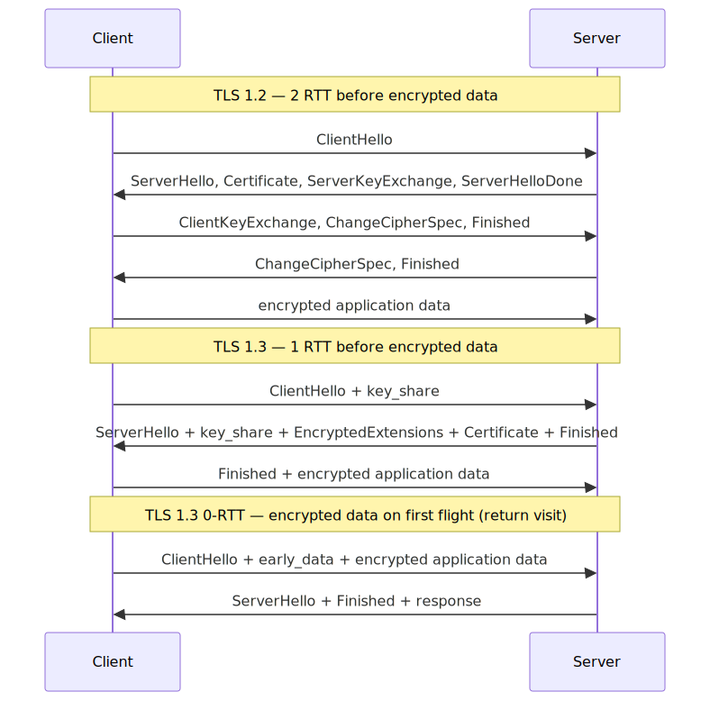
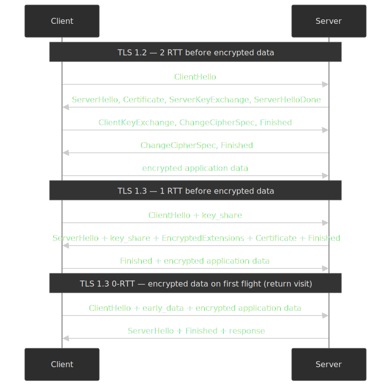

The mechanism: TLS 1.2 negotiated cipher suites, exchanged certificates, and ran key exchange in three flights. TLS 1.3 strips the legacy ciphers, mandates ephemeral Diffie-Hellman, and fuses everything into one flight. The client sends `key_share` in `ClientHello`; the server can reply with the certificate, key, and `Finished` in the very next message; encrypted application data follows in the client's second flight.

**0-RTT resumption** lets a returning client send encrypted application data inside its first flight, using a pre-shared key from the previous session. Latency win: an entire round trip.

> [!WARNING]
> 0-RTT data is replayable. An attacker who captures the first flight can replay it; the server cannot distinguish the replay from the original. Use 0-RTT only for **idempotent** operations (`GET`, conditional `HEAD`); never for anything that mutates state. Cloudflare keeps 0-RTT off by default for Business and Enterprise zones for this reason ([Introducing 0-RTT](https://blog.cloudflare.com/introducing-0-rtt/)).

**Adoption**. TLS 1.3 is now the default on the modern web. Cloudflare reports ~93% of its connections negotiate TLS 1.3 ([SSLreminder check-in, April 2025](https://blog.sslreminder.pro/posts/ssl-tls-world-in-2025-quick-check-in/)); F5 Labs' top-million sweep finds ~75% of websites support it ([F5 Labs: State of PQC on the Web, 2025](https://www.f5.com/labs/articles/the-state-of-pqc-on-the-web)). Qualys SSL Labs caps the grade at A- for any server that doesn't.

**Post-quantum is rolling in**. By the end of 2025, [over half of human-initiated TLS traffic on Cloudflare uses the X25519MLKEM768 hybrid key agreement](https://blog.cloudflare.com/pq-2025/) (classical X25519 + NIST ML-KEM-768). The hybrid scheme adds a few hundred bytes to the `ClientHello` but no extra round trip — there is no perf reason to delay enabling it on supported infrastructure.

### Connection layer trade-offs

| Lever                  | Buys                                              | Costs                                                                | Adoption (early 2026)              |
| ---------------------- | ------------------------------------------------- | -------------------------------------------------------------------- | ---------------------------------- |
| HTTPS DNS records       | Skip Alt-Svc upgrade; protocol hints in DNS       | Authoritative DNS must support; client implementations vary          | ~Cloudflare-default; rare elsewhere |
| HTTP/3 (QUIC over UDP) | No TCP HOL blocking; 0-RTT; connection migration  | UDP often blocked/throttled; loss at very high bandwidth             | 39% sites support / 21% requests    |
| TLS 1.3 1-RTT          | Half the TLS handshake time                       | Drops legacy ciphers; some old middleboxes break                     | ~93% of Cloudflare TLS connections  |
| TLS 1.3 0-RTT          | Zero handshake on return visits                   | Replay-vulnerable; idempotent requests only                          | Selectively enabled                 |
| Hybrid PQ (X25519MLKEM768) | Future-proofs against record-now-decrypt-later | A few hundred bytes in `ClientHello`; no extra RTT                   | >50% of Cloudflare human traffic    |

## Edge network

CDNs started as static file caches. They are now the application perimeter — the place where caching, request termination, security policy, and increasingly business logic live. The single most useful mental shift is from "how do we make origin faster" to "how much can we keep from ever hitting origin".

### CDN architecture

A CDN reduces latency three ways: geographic proximity (PoP near the user), TLS termination at the edge (no transcontinental handshake), and cache absorption (most bytes never reach origin).

**Origin offload, not cache-hit ratio.** A 95% cache-hit ratio sounds excellent — until the missing 5% are 50 MB API responses and 95% of bytes are still leaving origin. Always measure offload **by bytes**:

\[ \text{Origin offload} = 1 - \frac{\text{bytes served by origin}}{\text{total bytes served}} \]

Targets vary by workload, but an 80%+ byte offload on a content site and 50%+ on a logged-in app are realistic.


The four cache states a CDN works through:

1. **Fresh hit** — object in cache, under `max-age`. Serve from PoP, ~5-20 ms.
2. **Stale hit + SWR** — object in cache, past `max-age`, within `stale-while-revalidate` window. Serve stale immediately; revalidate in background. Defined in [RFC 5861](https://datatracker.ietf.org/doc/html/rfc5861); see also [web.dev: stale-while-revalidate](https://web.dev/articles/stale-while-revalidate).
3. **Miss** — fetch from origin (ideally over private interconnect), apply `Cache-Control` rules, store and serve.
4. **Bypass** — `Cache-Control: private`, `no-store`, or non-cacheable status; pass through.

```javascript title="cdn-strategy.js"
const cdnStrategy = {
  static: {
    types: ["images", "fonts", "css", "js"],
    headers: { "Cache-Control": "public, max-age=31536000, immutable" },
  },
  dynamic: {
    types: ["api", "html"],
    headers: { "Cache-Control": "public, max-age=300, stale-while-revalidate=60" },
  },
  micro: {
    types: ["inventory", "pricing", "news"],
    headers: { "Cache-Control": "public, max-age=5, stale-while-revalidate=30" },
  },
}
```

`immutable` is the easy case: build artifacts get a content hash in the URL and are cached forever. The interesting cases are dynamic and micro: you trade a few seconds of staleness for orders-of-magnitude origin offload. Even a 5-second `max-age` on a hot product page collapses thousands of identical requests into one origin hit per PoP per 5 seconds.

### Edge computing

Cached objects only solve half the problem; the other half is the dynamic logic — auth checks, A/B variants, geo-personalization — that you used to round-trip to origin. Edge computing platforms run that logic at the PoP.

**Platform landscape (early 2026):**

| Platform                | Runtime          | Cold start             | Notable property                                                |
| ----------------------- | ---------------- | ---------------------- | --------------------------------------------------------------- |
| Cloudflare Workers      | V8 isolate       | <5 ms; 99.99% warm     | "Shard and conquer" routing keeps requests on warm isolates ([Cloudflare](https://blog.cloudflare.com/eliminating-cold-starts-2-shard-and-conquer/)) |
| Vercel Edge Functions   | V8 isolate       | ~5 ms                  | Same isolate model; tightly integrated with Vercel deploys      |
| Vercel Fluid Compute    | Node.js / Python | Near-zero (warm reuse) | Long-running serverless context shared across requests          |
| Netlify Edge Functions  | Deno             | ~10 ms                 | Standard web APIs, TypeScript-native                            |
| Fastly Compute          | WebAssembly      | Sub-millisecond        | Polyglot via WASM; the most isolation-strict of the four        |
| AWS Lambda@Edge         | Node.js / Python | Hundreds of ms         | Tied to CloudFront; container-class cold starts; deepest AWS integration |

V8 isolates achieve their cold-start numbers by sharing a single OS process across many tenants and reusing a pre-warmed JS context. The trade-off is the runtime: no filesystem, no raw TCP/UDP, ~128 MB memory cap, ~30 ms CPU per request. Lambda@Edge gives you a real Node/Python container — and pays for it in cold-start latency.


**Useful at the edge:**

- Auth token validation (reject early; protect origin)
- Geo-routing (`cf-ipcountry`, `x-vercel-ip-country`)
- A/B variant assignment and cookie stamping
- Simple rate limiting (per-IP, per-token)
- HTML rewrites (header / footer / banners)

```javascript title="edge-worker.js" collapse={1-3}
addEventListener("fetch", (event) => {
  event.respondWith(handleRequest(event.request))
})

async function handleRequest(request) {
  const url = new URL(request.url)

  if (url.pathname === "/homepage") {
    const variant = getABTestVariant(request)
    const html = await renderPersonalized(request, variant)
    return new Response(html, {
      headers: {
        "content-type": "text/html",
        "cache-control": "public, max-age=300",
        "x-variant": variant,
      },
    })
  }

  const country = request.headers.get("cf-ipcountry")
  return new Response(await getLocalizedContent(country), {
    headers: { "content-type": "text/html", "cache-control": "public, max-age=600" },
  })
}
```

> [!CAUTION]
> Edge runtimes are a different platform, not "Node.js with a CDN in front". Anything that touches `fs`, raw TCP, native modules, or `eval` belongs in a regular origin service or a [BFF](#backend-for-frontend-bff). Plan the boundary before you start porting routes.

## Payload optimization

Bytes you didn't send are the cheapest bytes. Compression sits between the application and the wire and is one of the highest-leverage configuration changes in the stack.

### Compression strategy

Three algorithms matter today:

- **Gzip** (1992, [RFC 1952](https://datatracker.ietf.org/doc/html/rfc1952)) — universal floor.
- **Brotli** (2015, [RFC 7932](https://datatracker.ietf.org/doc/html/rfc7932)) — Google-designed for web payloads, ships with a static dictionary of common web tokens.
- **Zstandard** (2016, [RFC 8878](https://datatracker.ietf.org/doc/html/rfc8878)) — Facebook-designed, prioritizes speed at gzip-class ratios.

The right choice depends on whether the bytes are pre-compressed once at build time or compressed on the fly per request:

| Algorithm     | Static (build-time) | Dynamic (per request) | Browser support (Mar 2026, [caniuse](https://caniuse.com/brotli)) | When to reach for it                                  |
| ------------- | ------------------- | --------------------- | ----------------------------------------------------------------- | ----------------------------------------------------- |
| **Gzip**       | Level 6-9          | Level 6               | ~99%                                                              | Universal fallback                                    |
| **Brotli**     | Level 11           | Level 4-5             | ~96%                                                              | Default for static text; dynamic when CPU allows      |
| **Zstandard**  | Level 19           | Level 3-12            | ~83% ([caniuse](https://caniuse.com/zstd))                        | Dynamic content where Brotli's encoder is too slow    |

Brotli typically produces 15-25% smaller output than gzip for HTML/CSS/JS ([benchmarks](https://paulcalvano.com/2024-03-19-choosing-between-gzip-brotli-and-zstandard-compression/)); Zstandard matches gzip on ratio while compressing meaningfully faster. **Brotli level 11 is for pre-compression only** — its encoder is far too CPU-heavy for the request path. For dynamic responses, Brotli 4-5 (or Zstandard) tends to be the right balance.

**Wire reality** ([HTTP Archive Web Almanac 2025 — CDN](https://almanac.httparchive.org/en/2025/cdn)):

- **CDN-served bytes**: Brotli 46%, gzip 42%, Zstandard 12% (Zstandard quadrupled in one year).
- **Origin-served bytes**: gzip 61%, Brotli 39%, Zstandard rounding error.

Origins lag the edge by years. The fastest one-line win in many stacks is enabling `brotli_static on` and shipping pre-compressed `.br` artifacts:

```nginx title="nginx.conf"
http {
    brotli on;
    brotli_static on;            # serve pre-compressed .br files when present
    brotli_comp_level 5;         # dynamic responses only
    brotli_types
        application/javascript
        application/json
        text/css
        text/html
        image/svg+xml;

    gzip on;
    gzip_static on;
    gzip_vary on;
    gzip_types
        application/javascript
        application/json
        text/css
        text/html;
}
```

> [!TIP]
> Pre-compress at build time and let the server pick. `gzip_static on` + `brotli_static on` mean Nginx will serve `app.js.br` to a Brotli-capable client, `app.js.gz` to a gzip-only client, and the raw `app.js` if neither is acceptable — without re-encoding on the request path.

Safari is the awkward case for Zstandard: until iOS 26.3 it does not advertise `zstd` in `Accept-Encoding`, so falling back to Brotli for Safari clients is automatic and lossless ([WebKit standards-positions #168](https://github.com/WebKit/standards-positions/issues/168)).

## Origin infrastructure

Once a request escapes the CDN, the origin's job is to answer in <100 ms p50. That budget breaks down into TLS termination (negligible if reused), routing (load balancer), business logic (app tier), and data access (caches, then DB).

### Load balancing

The choice of algorithm is a function of how stateful your traffic is and how homogeneous your fleet is.

**Static algorithms** (no per-server state):

- **Round robin** — homogeneous fleet, stateless workloads. Simple, fair, oblivious to actual load.
- **Weighted round robin** — heterogeneous instance types; assign weight in proportion to capacity.

**Dynamic algorithms** (look at server state):

- **Least connections** — best for long-lived connections (WebSocket, streaming, long polling). A round-robin LB will pile new connections on already-saturated servers.
- **Least response time** — favors fast-responding nodes; useful when backend variance is high (e.g., heterogeneous DB shards behind a thin app tier).

**Session persistence** (for stateful apps):

- **Source-IP hash** — cheap, but breaks behind NAT or corporate proxies (whole offices appear as one IP).
- **Cookie-based** — LB stamps a cookie, routes by cookie. Resilient to client-IP changes; preferred for sticky sessions.

> [!WARNING]
> Session persistence is a leak abstraction. Every server that holds session state is a single point of failure for those users. Prefer stateless app tiers + a shared session store (Redis) so the LB can route freely.

### In-memory caching

A Redis or Memcached layer lets you serve repeated reads from RAM instead of re-running a query plan against the database. The latency math is brutal in your favor: RAM access is on the order of 100 ns per Jeff Dean's [Latency Numbers Every Programmer Should Know](https://gist.github.com/jboner/2841832); an SSD random read is ~100 µs (1000× slower), and a query on a large table that misses the buffer pool is milliseconds at minimum.

| Aspect          | Memcached                          | Redis                                       |
| --------------- | ---------------------------------- | ------------------------------------------- |
| **Data model**  | Key → opaque blob                  | Strings, hashes, lists, sets, sorted sets, streams |
| **Threading**   | Multi-threaded                     | Single-threaded core (+ I/O threads in Redis 6+, optional cluster) |
| **Persistence** | None (volatile)                    | RDB snapshots, AOF logging                  |
| **Replication** | None built-in                      | Primary-replica, Redis Cluster              |
| **Use case**    | Pure cache; max throughput         | Cache + data structures + pub/sub + streams |

Reach for Memcached for the simplest case: opaque blobs, ephemeral, throughput-bound. Reach for Redis when you need the data structures (rate limiting via `INCR` + `EXPIRE`, leaderboards via sorted sets, token buckets, queues) or when you need persistence and replication.

```javascript title="cache-helper.js"
async function getCached(key, fetchFn, ttlSeconds = 3600) {
  try {
    const cached = await redis.get(key)
    if (cached) return JSON.parse(cached)

    const data = await fetchFn()
    await redis.setex(key, ttlSeconds, JSON.stringify(data))
    return data
  } catch {
    return fetchFn()
  }
}
```

> [!IMPORTANT]
> The cache must never become a hard dependency for correctness. The `catch` block above degrades gracefully to the origin call when Redis is unavailable. Treat the cache as a performance optimization, not a database.

### Database optimization

Under the cache layer, three classic levers move the needle:

- **Stop using `SELECT *`.** Wide row reads waste I/O, network, and parser time. Project only the columns you need; index-only scans become possible.
- **`EXPLAIN ANALYZE` every hot query** before declaring it done. The plan's row estimate against the actual row count is the fastest way to spot a missing index, a stale statistic, or a join order bug.
- **Index for `WHERE`, `JOIN`, and `ORDER BY` predicates.** Each new index slows writes — partial indexes (`WHERE status = 'active'`) and covering indexes (include the projected columns) often beat broad indexes.

**Read replicas** scale read throughput at the cost of replication lag. Routing read traffic to replicas is fine when the application can tolerate "eventually consistent" reads (product detail pages, search results); use the primary for read-after-write paths (just-saved cart, just-edited profile).

**Connection pooling** is non-negotiable at any scale: opening a Postgres connection costs ~10-50 ms (TCP + auth + session setup) and consumes ~10 MB on the server side. Pool with [PgBouncer](https://www.pgbouncer.org/) (transaction-mode for OLTP) or [ProxySQL](https://proxysql.com/) for MySQL.

### Caching tiers

Putting it together, a request that misses the browser cache might still serve from any of half a dozen tiers before reaching the database:


The number on each tier is the median read latency once warm. Each descent is roughly an order of magnitude slower, which is why the engineering question is rarely "should we cache this" and usually "at which tier".

For a deeper treatment of cache invalidation strategies (LRU vs LFU, write-through vs write-back, stampede control), see the [caching fundamentals article](../caching-fundamentals-and-strategies/README.md).

## Application architecture levers

Two patterns sit at the boundary between infrastructure and application code and matter enough to mention here: BFFs and private VPC routing.

### Backend for Frontend (BFF)

In a microservices system, a single page often needs data from 5-10 services. Letting the browser make all of those calls produces three failures:

1. **Waterfall latency** — calls often depend on each other; serialized request chains compound RTT.
2. **Over-fetching** — every service returns its full response model; the browser discards most of it.
3. **Partial-failure handling** — every call can fail independently; the UI has to reason about a combinatorial state space.

A BFF is a thin server-side aggregator owned by the same team as the frontend. It runs colocated with the services it calls (same VPC, ideally same region), composes responses, and returns one optimized payload. See the [API gateway patterns article](../api-gateway-patterns/README.md) for where BFFs fit alongside gateways and meshes.

```javascript title="product-page-bff.js"
class ProductPageBFF {
  async getPageData(productId, userId) {
    const [product, reviews, inventory, recommendations] = await Promise.all([
      this.productService.getProduct(productId),
      this.reviewService.getReviews(productId),
      this.inventoryService.getStock(productId),
      this.recommendationService.getRecommendations(productId, userId),
    ])
    return {
      product: shape(product),
      reviews: shape(reviews),
      availability: shape(inventory),
      recommendations: shape(recommendations),
    }
  }
}
```

Typical BFF wins on a many-service page: 60-80% fewer browser-initiated requests, 30-50% smaller payload over the wire (because the BFF only returns the fields the page uses), and noticeably better cache hit rates on the aggregated response. Exact numbers depend heavily on how chatty the underlying services are.

### Private VPC routing for server-side fetches

A server-side fetch from a Next.js / Remix / Astro server to your own API has two paths:

1. **Public path** — `https://api.example.com` resolves to the CDN, traverses the public internet, terminates TLS at the edge, and reaches origin. Round trip: 100-300 ms, billable egress.
2. **Private path** — `https://api.internal.example.com` resolves to a VPC-internal address; both endpoints are in the same VPC. Round trip: 5-20 ms, no public egress.

Use the public path for client-side fetches (browsers can't see your VPC); use the private path for server-rendered pages.

```javascript title="api-client.js"
class ApiClient {
  constructor() {
    this.publicUrl = process.env.NEXT_PUBLIC_API_URL
    this.privateUrl = process.env.API_URL_PRIVATE
  }

  clientFetch(path, init) {
    return fetch(`${this.publicUrl}${path}`, init)
  }

  serverFetch(path, init) {
    return fetch(`${this.privateUrl}${path}`, {
      ...init,
      headers: { "X-Internal-Request": "true", ...init?.headers },
    })
  }
}
```

The win is large (often an order of magnitude on TTFB for SSR) but only available if both the renderer and the API live inside the same network boundary.

### Modern rendering patterns

Two architectural choices sit further upstream and shape how much work the connection layer is even responsible for:

- **Islands architecture** ([Astro Islands](https://docs.astro.build/en/concepts/islands/)) ships static HTML by default and hydrates only marked components. For content sites this typically removes a large majority of the JavaScript that would otherwise traverse the connection layer. See [bundle splitting strategies](../bundle-splitting-strategies/README.md) for the broader story.
- **Resumability** ([Qwik](https://qwik.dev/docs/concepts/resumable/)) serializes execution state into the HTML and skips hydration entirely, lazy-loading component code only on first interaction. The trade-off is a heavier HTML payload; it works best for content-heavy sites with sparse interactivity.

Both patterns are out of scope for this article; pick them up alongside the [JavaScript optimization](../web-performance-javascript-optimization/README.md) entry of the series.

## Multi-layer client caching

Three browser-side tiers extend the multi-layer model into the user's device:

- **HTTP cache** — controlled by `Cache-Control`. Free, default, lives across tabs and sessions.
- **Service Worker cache** — programmatic. Lets you intercept requests, choose strategies (cache-first for assets, network-first for API, stale-while-revalidate for everything else), and ship offline experiences.
- **IndexedDB** — for structured data larger than `localStorage`'s 5-10 MB cap (the [storage estimate](https://developer.mozilla.org/docs/Web/API/StorageManager/estimate) varies by browser and origin storage pressure).

```javascript title="service-worker.js" collapse={1-4}
import { registerRoute } from "workbox-routing"
import { CacheFirst, NetworkFirst, StaleWhileRevalidate } from "workbox-strategies"
import { ExpirationPlugin } from "workbox-expiration"

registerRoute(
  ({ request }) => request.destination === "image" || request.destination === "font",
  new CacheFirst({
    cacheName: "static-assets",
    plugins: [new ExpirationPlugin({ maxEntries: 100, maxAgeSeconds: 30 * 24 * 60 * 60 })],
  }),
)

registerRoute(
  ({ request }) => request.destination === "script" || request.destination === "style",
  new StaleWhileRevalidate({ cacheName: "bundles" }),
)

registerRoute(
  ({ url }) => url.pathname.startsWith("/api/"),
  new NetworkFirst({
    cacheName: "api-cache",
    networkTimeoutSeconds: 3,
    plugins: [new ExpirationPlugin({ maxEntries: 50, maxAgeSeconds: 5 * 60 })],
  }),
)
```

> [!CAUTION]
> Service Workers are sticky. A bad service worker can pin a broken version of your site for users until they manually clear storage. Always ship a kill-switch route and version your caches.

## Measuring the stack

Tuning without measurement is guesswork. Two sources of truth, paired:

- **Real User Monitoring (RUM)** — what actual users experienced. Use [`PerformanceObserver`](https://developer.mozilla.org/docs/Web/API/PerformanceObserver) for [LCP](https://web.dev/articles/lcp), [INP](https://web.dev/articles/inp), [CLS](https://web.dev/articles/cls), [TTFB](https://web.dev/articles/ttfb). Sample at least the 75th percentile (the bar Core Web Vitals is graded against).
- **Lab synthetics** — [Lighthouse CI](https://github.com/GoogleChrome/lighthouse-ci) on every PR, run from a known device profile and network throttling. Catches regressions before they ship.

```javascript title="rum-monitor.js" collapse={1-14, 46-56}
class RumBudgetMonitor {
  constructor() {
    this.budgets = { lcp: 2500, fcp: 1800, inp: 200, cls: 0.1, ttfb: 600 }
    this.violations = []
    this.init()
  }

  init() {
    if (!("PerformanceObserver" in window)) return

    new PerformanceObserver((list) => {
      const last = list.getEntries().at(-1)
      if (last && last.startTime > this.budgets.lcp) {
        this.record("LCP", last.startTime, this.budgets.lcp)
      }
    }).observe({ entryTypes: ["largest-contentful-paint"] })

    new PerformanceObserver((list) => {
      const max = Math.max(...list.getEntries().map((e) => e.value))
      if (max > this.budgets.inp) this.record("INP", max, this.budgets.inp)
    }).observe({ entryTypes: ["interaction"] })

    new PerformanceObserver((list) => {
      let cls = 0
      for (const entry of list.getEntries()) {
        if (!entry.hadRecentInput) cls += entry.value
      }
      if (cls > this.budgets.cls) this.record("CLS", cls, this.budgets.cls)
    }).observe({ entryTypes: ["layout-shift"] })
  }

  record(metric, actual, budget) {
    const violation = { metric, actual, budget, ts: Date.now(), url: location.href }
    this.violations.push(violation)
    this.send(violation)
  }
}
```

For end-to-end RUM, the `web-vitals` library handles the metric definitions and edge cases for you; see [client-side performance monitoring](../performance-monitoring-client/README.md).

```yaml title=".github/workflows/performance.yml"
name: Performance Audit
on: [pull_request, push]

jobs:
  lighthouse:
    runs-on: ubuntu-latest
    steps:
      - uses: actions/checkout@v4
      - name: Run Lighthouse CI
        uses: treosh/lighthouse-ci-action@v12
        with:
          configPath: ./lighthouserc.json
          uploadArtifacts: true
```

```javascript title=".size-limit.js"
module.exports = [
  { name: "Main Bundle", path: "dist/main.js", limit: "150 KB", gzip: true },
  { name: "CSS Bundle", path: "dist/styles.css", limit: "50 KB", gzip: true },
]
```

A bundle-size budget enforced in CI is the cheapest way to keep the JS work in [the JavaScript optimization article](../web-performance-javascript-optimization/README.md) from regressing.

## Implementation checklist

### Connection layer

- [ ] Publish HTTPS DNS records with `alpn="h3,h2"` and IP hints.
- [ ] Enable HTTP/3 on CDN and origin; keep TCP fallback healthy.
- [ ] Negotiate TLS 1.3 by default; enable hybrid post-quantum (X25519MLKEM768) where supported.
- [ ] Allow 0-RTT for idempotent endpoints only; verify replay handling.

### Edge network

- [ ] Set `Cache-Control` deliberately per route (`immutable` for hashed assets, `s-maxage` + `stale-while-revalidate` for HTML/API).
- [ ] Track origin offload **by bytes** in CDN dashboards, not just hit ratio.
- [ ] Move latency-sensitive logic (auth, geo, A/B, simple rewrites) to edge functions.
- [ ] Document the edge runtime constraint set so teams don't ship code that won't run there.

### Compression

- [ ] Pre-compress static assets with Brotli 11 at build time.
- [ ] Configure dynamic compression at Brotli 4-5 (or Zstandard 3-12 where supported).
- [ ] Verify `Content-Encoding: br` (or `zstd`) in production responses.
- [ ] Confirm Safari fallback to Brotli when serving Zstandard.

### Origin infrastructure

- [ ] Match LB algorithm to traffic shape (least-conns for long-lived; weighted RR for heterogeneous).
- [ ] Front databases with Redis/Memcached for hot reads; degrade gracefully on cache miss.
- [ ] Use connection pooling (PgBouncer / ProxySQL); never open a new DB connection per request.
- [ ] Route SSR fetches over the private VPC; reserve the public path for browser clients.

### Measurement

- [ ] RUM with `PerformanceObserver` or `web-vitals`, sampled at p75.
- [ ] Lighthouse CI on every PR with throttled profiles.
- [ ] Bundle-size budgets enforced in CI.
- [ ] Server-Timing headers emitted by the BFF / origin so RUM can attribute TTFB to the right tier.

## Appendix

### Prerequisites

- Comfort with the HTTP request/response lifecycle.
- Familiarity with DNS, TCP/IP, and TLS at the protocol-mechanism level.
- Working knowledge of caching primitives (TTL, invalidation, stampede control).
- Experience configuring at least one CDN (Cloudflare, Fastly, CloudFront, Akamai).

### Terminology

- **TTFB (Time to First Byte)** — interval from request initiation to the first byte of the response.
- **RTT (Round-Trip Time)** — time for a packet to travel to a destination and back.
- **PoP (Point of Presence)** — CDN edge location.
- **QUIC** — UDP-based transport ([RFC 9000](https://datatracker.ietf.org/doc/html/rfc9000)) underlying HTTP/3.
- **HOL blocking** — head-of-line blocking; one slow/lost packet stalls all subsequent ones in the same logical stream.
- **0-RTT** — TLS 1.3 resumption mode that lets a client send encrypted data in its first flight.
- **BFF** — Backend for Frontend; thin server-side aggregator dedicated to one frontend.
- **VPC** — Virtual Private Cloud; isolated cloud network with private addressing.
- **SVCB / HTTPS RR** — DNS resource records ([RFC 9460](https://datatracker.ietf.org/doc/html/rfc9460)) that ship protocol negotiation hints in the DNS response.

### Series navigation

- [Web Performance: Overview and Playbook](../web-performance-overview/README.md) — the parent
- **You are here:** Infrastructure
- [JavaScript Optimization](../web-performance-javascript-optimization/README.md)
- [CSS & Typography](../web-performance-css-typography/README.md)
- [Image Optimization](../web-performance-image-optimization/README.md)

### References

**Specifications**

- [RFC 9460 — SVCB and HTTPS RRs](https://datatracker.ietf.org/doc/html/rfc9460) (Nov 2023)
- [RFC 9114 — HTTP/3](https://datatracker.ietf.org/doc/html/rfc9114) (Jun 2022)
- [RFC 9000 — QUIC](https://datatracker.ietf.org/doc/html/rfc9000) (May 2021)
- [RFC 8446 — TLS 1.3](https://datatracker.ietf.org/doc/html/rfc8446) (Aug 2018)
- [RFC 5861 — `stale-while-revalidate` and `stale-if-error`](https://datatracker.ietf.org/doc/html/rfc5861)
- [RFC 7932 — Brotli](https://datatracker.ietf.org/doc/html/rfc7932)
- [RFC 8878 — Zstandard](https://datatracker.ietf.org/doc/html/rfc8878)
- [RFC 9111 — HTTP caching](https://datatracker.ietf.org/doc/html/rfc9111)

**Official documentation**

- [HTTP/3 Explained](https://http3-explained.haxx.se/) — Daniel Stenberg
- [Cloudflare Workers](https://developers.cloudflare.com/workers/)
- [Vercel Edge Functions](https://vercel.com/docs/functions/runtimes/edge)
- [Astro Islands](https://docs.astro.build/en/concepts/islands/)
- [Qwik resumability](https://qwik.dev/docs/concepts/resumable/)
- [Redis docs](https://redis.io/docs/)
- [Workbox](https://developer.chrome.com/docs/workbox)

**Primary-source maintainer content**

- [Cloudflare: Eliminating cold starts (Shard and Conquer)](https://blog.cloudflare.com/eliminating-cold-starts-2-shard-and-conquer/)
- [Cloudflare: Speeding up HTTPS and HTTP/3 negotiation with DNS](https://blog.cloudflare.com/speeding-up-https-and-http-3-negotiation-with-dns/)
- [Cloudflare: Introducing 0-RTT](https://blog.cloudflare.com/introducing-0-rtt/)
- [Cloudflare: State of the post-quantum Internet 2025](https://blog.cloudflare.com/pq-2025/)
- [Cloudflare 2025 Year in Review](https://blog.cloudflare.com/radar-2025-year-in-review/)

**Industry references and benchmarks**

- [HTTP Archive Web Almanac 2025 — CDN](https://almanac.httparchive.org/en/2025/cdn)
- [F5 Labs: State of PQC on the Web (2025)](https://www.f5.com/labs/articles/the-state-of-pqc-on-the-web)
- [Paul Calvano: Choosing between gzip, Brotli and Zstandard](https://paulcalvano.com/2024-03-19-choosing-between-gzip-brotli-and-zstandard-compression/)
- [QUIC is not Quick Enough over Fast Internet (WWW 2024)](https://dl.acm.org/doi/10.1145/3589334.3645323)
- [A First Look at SVCB and HTTPS DNS Resource Records in the Wild (IMC 2023)](https://arxiv.org/abs/2309.10344)
- [Latency Numbers Every Programmer Should Know](https://gist.github.com/jboner/2841832)
- [Can I Use: HTTP/3](https://caniuse.com/http3)
- [Can I Use: Brotli](https://caniuse.com/brotli)
- [Can I Use: Zstandard](https://caniuse.com/zstd)
