# JavaScript Performance Optimization for the Web

JavaScript execution is the dominant source of main-thread blocking in modern web applications, and the main thread is the only thread that can paint, run input handlers, or run layout. Every long task therefore translates directly into [Interaction to Next Paint (INP)](https://web.dev/articles/inp) — the Core Web Vital that since [March 12, 2024](https://web.dev/blog/inp-cwv-march-12) replaces First Input Delay and is "good" at ≤200&nbsp;ms at the 75th percentile.

This article covers four levers a senior engineer can pull to keep the main thread responsive: the script-loading pipeline, task scheduling primitives, bundle shape (code splitting and tree shaking), and Web Workers. It is part of a [web-performance series](../web-performance-overview/README.md) — measurement and infrastructure are covered in sibling entries.




## Mental model: three sources of main-thread blocking

JavaScript performance optimization addresses three distinct bottlenecks. Each lever in this article maps onto exactly one of them.

1. **Parse-time blocking** — Scripts block DOM construction during fetch and execution. The `async`, `defer`, and `type="module"` attributes control when scripts execute relative to parsing: `defer` guarantees document order after parsing completes, `async` executes on arrival (no order guarantee), and modules are deferred by default with dependency-graph resolution.
2. **Run-time blocking** — Tasks exceeding 50&nbsp;ms (the [W3C Long Tasks API](https://w3c.github.io/longtasks/) threshold) block input handling and inflate INP. [`scheduler.yield()`](https://developer.mozilla.org/en-US/docs/Web/API/Scheduler/yield) (Chromium 129+, Firefox 142+) yields to the browser while preserving the originating task's priority through a continuation queue — unlike `setTimeout(0)`, which appends to the back of the macrotask queue.
3. **Bundle-size blocking** — Large initial bundles delay Time to Interactive (TTI). Code splitting via dynamic `import()` defers non-critical code; tree shaking eliminates dead exports statically. Both rely on ES modules — CommonJS is runtime-resolved and cannot be statically analyzed.

Web Workers cut transversely across all three: they move computation entirely off the main thread. [Transferable objects](https://developer.mozilla.org/en-US/docs/Web/API/Web_Workers_API/Transferable_objects) keep that off-loading cheap by handing ownership of large buffers to the worker without copying.

> [!NOTE]
> Where a claim is version- or browser-sensitive, we date-stamp it. Browser-API status changes quickly; check [MDN's compatibility tables](https://developer.mozilla.org/en-US/docs/Web/API/Scheduler) before shipping a fallback strategy.

## Script Loading: Parser Interaction and Execution Order

The choice of script loading strategy determines when the browser's HTML parser yields control to JavaScript execution.

### Why Parser Blocking Matters

The HTML parser cannot construct DOM nodes while JavaScript executes — a classic script may call `document.write()` or mutate the DOM being built, so the parser is forced to suspend. This is the fundamental tension: scripts need DOM access, but parsing must complete for the DOM to exist. The [WHATWG HTML scripting model](https://html.spec.whatwg.org/multipage/scripting.html#prepare-the-script-element) formalises three resolutions: blocking (the legacy default), `async` (parallel fetch, execute on arrival), and `defer` (parallel fetch, execute after parsing in document order).

### Execution Order Guarantees by Attribute

| Attribute       | Fetch    | Execute       | Order            | Use Case                                    |
| --------------- | -------- | ------------- | ---------------- | ------------------------------------------- |
| (none)          | Blocking | Immediate     | Document         | Legacy scripts requiring `document.write()` |
| `async`         | Parallel | On arrival    | **None**         | Independent analytics, ads                  |
| `defer`         | Parallel | After parsing | Document         | Application code with DOM dependencies      |
| `type="module"` | Parallel | After parsing | Dependency graph | Modern ESM applications                     |

### Why `defer` Executes After Parsing

The `defer` attribute was introduced in Internet Explorer 4 (1997) and standardized in HTML 4 ([Mozilla Hacks history](https://hacks.mozilla.org/2009/06/defer/)). The design rationale: the author asserts the script does not call `document.write()`, so the parser can keep building the DOM while the script downloads and execute it once parsing is done. Before `defer`, every classic script blocked parsing during both download and execution — a major perceived-performance problem on slow networks.

Internally, the HTML spec defines a [list of scripts that will execute when the document has finished parsing](https://html.spec.whatwg.org/multipage/scripting.html#list-of-scripts-that-will-execute-when-the-document-has-finished-parsing). Deferred scripts append to this list and execute sequentially before `DOMContentLoaded`, preserving document order.

### Parser-Script Timing

The four loading modes produce four distinct interleavings of HTML parsing and script execution.




### `async` vs `defer` Decision Matrix




### Module Scripts: Deferred by Default

ES modules (`type="module"`) are deferred by default with additional semantics:

- **Strict mode**: Always enabled; `this` is `undefined` at top level.
- **Dependency resolution**: The whole module graph is fetched before any module body runs.
- **Top-level `await`**: Supported; blocks dependent modules, not the parser ([TC39 spec](https://tc39.es/proposal-top-level-await/)).

```html collapse={1-3}
<!-- Analytics: independent, no DOM dependency -->
<script src="analytics.js" async></script>

<!-- Polyfills → Framework → App: order-dependent -->
<script src="polyfills.js" defer></script>
<script src="framework.js" defer></script>
<script src="app.js" defer></script>

<!-- Modern entry: ESM with automatic deferral -->
<script type="module" src="main.js"></script>
```

> [!TIP]
> The `nomodule` fallback was load-bearing through ~2020 (IE11, older Safari). With IE11 fully retired and Safari 14+ shipping ESM since 2020, in 2026 most production apps can drop `nomodule` and the parallel ES5 bundle entirely — saving 30-50% of build time and roughly half the bytes for legacy users who would have downloaded both.

## Long Task Management: The 50ms Threshold

Tasks exceeding 50&nbsp;ms are classified as **long tasks** by the [W3C Long Tasks API](https://w3c.github.io/longtasks/) and directly inflate Interaction to Next Paint.

### Why 50ms?

The threshold comes from the [RAIL performance model](https://web.dev/articles/rail) and is reused as the [`requestIdleCallback` deadline cap](https://w3c.github.io/requestidlecallback/#dfn-deadline). The arithmetic:

- Users perceive responses under 100&nbsp;ms as instantaneous ([Nielsen, 1993](https://www.nngroup.com/articles/response-times-3-important-limits/)).
- A 50&nbsp;ms task budget leaves 50&nbsp;ms for the browser to coalesce input, run hit-testing, run layout/paint, and present a frame.
- 50 + 50 = 100&nbsp;ms keeps the interaction inside the perceptual "instant" envelope.

INP itself uses a more generous 200&nbsp;ms p75 budget — the gap between 50&nbsp;ms (per task) and 200&nbsp;ms (per interaction) absorbs multiple tasks plus the browser's own rendering work.

### `scheduler.yield()`: Priority-Preserving Yielding

`scheduler.yield()` shipped in [Chromium 129](https://developer.chrome.com/release-notes/129#schedulerryield) (September 2024) and [Firefox 142](https://developer.mozilla.org/en-US/docs/Web/API/Scheduler/yield#browser_compatibility) (August 2025). Safari has not yet implemented it as of April 2026, so the [Scheduler API is not Baseline](https://developer.mozilla.org/en-US/docs/Web/API/Scheduler) — design code paths to fall back gracefully.

```javascript collapse={1-2}
async function processLargeDataset(items) {
  const results = []
  const BATCH_SIZE = 50

  for (let i = 0; i < items.length; i++) {
    results.push(await computeExpensiveOperation(items[i]))

    // Yield every 50 items, maintaining task priority
    if (i % BATCH_SIZE === 0 && i > 0) {
      await scheduler.yield()
    }
  }

  return results
}
```

### Why Not `setTimeout(0)`?

`setTimeout(0)` has four limitations that `scheduler.yield()` addresses:

| Aspect                | `setTimeout(0)`                                                                                                                    | `scheduler.yield()`                  |
| --------------------- | ---------------------------------------------------------------------------------------------------------------------------------- | ------------------------------------ |
| Queue position        | Back of task queue                                                                                                                 | Continuation queue (higher priority) |
| Minimum delay         | ≥4&nbsp;ms after 5 nested calls per [HTML spec §timers](https://html.spec.whatwg.org/multipage/timers-and-user-prompts.html#timers) | None                                 |
| Background throttling | Heavily throttled in background tabs (Chrome budgets to ≈1&nbsp;Hz after 5&nbsp;min)                                                | Respects priority                    |
| Priority awareness    | None                                                                                                                               | Inherits from parent task            |

The [WICG Scheduling explainer](https://github.com/WICG/scheduling-apis/blob/main/explainers/yield-and-continuation.md) defines a **continuation queue** per priority that runs *before* the regular task queue at the same priority. Concretely: a `user-visible` continuation runs before `user-visible` regular tasks but after any `user-blocking` task. This is what lets a long task voluntarily yield to user input without losing its place in the system priority order.

 and scheduler.yield() resume relative to other queued work at user-visible priority.")


```javascript
// Priority inheritance demonstration
scheduler.postTask(
  async () => {
    // This runs at background priority
    await heavyComputation()

    // After yield, still at background priority
    // But ahead of OTHER background tasks
    await scheduler.yield()

    await moreComputation()
  },
  { priority: "background" },
)
```

### Adaptive Time-Slice Yielding

For variable-cost work items, yield based on elapsed time rather than iteration count:

```javascript collapse={1-3}
async function adaptiveProcessing(workQueue) {
  const TIME_SLICE_MS = 5

  while (workQueue.length > 0) {
    const sliceStart = performance.now()

    // Process until time slice exhausted
    while (workQueue.length > 0 && performance.now() - sliceStart < TIME_SLICE_MS) {
      processWorkItem(workQueue.shift())
    }

    if (workQueue.length > 0) {
      await scheduler.yield()
    }
  }
}
```

### Browser Support and Fallback

| API                    | Chrome          | Firefox        | Safari (April 2026) |
| ---------------------- | --------------- | -------------- | ------------------- |
| `scheduler.postTask()` | 94 (Sept 2021)  | 142 (Aug 2025) | Not supported       |
| `scheduler.yield()`    | 129 (Sept 2024) | 142 (Aug 2025) | Not supported       |

For browsers without support, fall back to `setTimeout(0)` and accept that priority information is lost:

```javascript collapse={1-5}
const yieldToMain = () => {
  if ("scheduler" in globalThis && "yield" in scheduler) {
    return scheduler.yield()
  }
  return new Promise((resolve) => setTimeout(resolve, 0))
}
```

## Code Splitting: Reducing Initial Bundle Size

Code splitting defers loading non-critical code until needed, reducing Time to Interactive (TTI).

### Route-Based Splitting

Route-based splitting is the highest-impact strategy—each route loads only its required code:

```javascript collapse={1-4}
import { lazy, Suspense } from "react"
import { Routes, Route } from "react-router-dom"

const Home = lazy(() => import("./pages/Home"))
const Dashboard = lazy(() => import("./pages/Dashboard"))
const Settings = lazy(() => import("./pages/Settings"))

function App() {
  return (
    <Suspense fallback={<LoadingSpinner />}>
      <Routes>
        <Route path="/" element={<Home />} />
        <Route path="/dashboard" element={<Dashboard />} />
        <Route path="/settings" element={<Settings />} />
      </Routes>
    </Suspense>
  )
}
```

### The Chunk Loading Waterfall Problem

Sequential chunk loading creates waterfalls:

1. Download and parse `entry.js`
2. Router determines current route
3. Download route chunk
4. Parse and hydrate

**Solution**: Inject a preload script that runs before the main bundle:

```html
<script>
  const routeChunks = { "/": "home.js", "/dashboard": "dashboard.js" }
  const chunk = routeChunks[location.pathname]
  if (chunk) {
    const link = document.createElement("link")
    link.rel = "preload"
    link.as = "script"
    link.href = `/chunks/${chunk}`
    document.head.appendChild(link)
  }
</script>
```

### `webpackPrefetch` vs `webpackPreload`

| Directive         | Timing               | Priority | Use Case                            |
| ----------------- | -------------------- | -------- | ----------------------------------- |
| `webpackPreload`  | Parallel with parent | Medium   | Needed for current navigation       |
| `webpackPrefetch` | During browser idle  | Low      | Likely needed for future navigation |

```javascript
// Preload: needed NOW, loads in parallel
import(/* webpackPreload: true */ "ChartingLibrary")

// Prefetch: needed LATER, loads during idle
import(/* webpackPrefetch: true */ "./SettingsPage")
```

**Trade-off**: Overusing `preload` competes for bandwidth with critical resources. Prefetch is safer—it uses idle time but may not complete before needed.

### Component-Level Splitting

Split individual heavy components (>30KB) that aren't needed immediately:

```javascript collapse={1-2, 18-23}
import { lazy, Suspense, useState, startTransition } from "react"

const HeavyChart = lazy(() => import("./HeavyChart"))

function Dashboard() {
  const [showChart, setShowChart] = useState(false)

  const loadChart = () => {
    // Use transition to avoid blocking UI
    startTransition(() => setShowChart(true))
  }

  return (
    <div>
      <button onClick={loadChart}>Show Analytics</button>
      {showChart && (
        <Suspense fallback={<ChartSkeleton />}>
          <HeavyChart />
        </Suspense>
      )}
    </div>
  )
}
```

## Tree Shaking: Dead Code Elimination

Tree shaking removes unused exports from the bundle at build time.

### Why ES Modules Enable Tree Shaking

ES modules are **statically analyzable**—imports and exports can be determined at compile time without executing code.

> **ECMA-262 design**: Import/export declarations can only appear at module top level, and specifiers must be string literals.

```javascript
// ✅ Static - bundler knows exactly what's used
import { add, multiply } from "./math.js"

// ❌ Dynamic - cannot analyze at build time
const fn = condition ? "add" : "multiply"
import("./math.js").then((mod) => mod[fn]())
```

CommonJS cannot be tree-shaken because `require()` is a runtime function that can be called conditionally with computed paths.

### When Tree Shaking Fails

1. **Side effects present**: Code that runs on import (polyfills, CSS, prototype modifications)
2. **Dynamic property access**: `utils[methodName]`
3. **Dynamic imports**: The entire module is included
4. **Missing `sideEffects` field**: Bundler assumes all files have side effects

```json
// package.json - declare no side effects for aggressive tree shaking
{
  "sideEffects": false
}

// Or whitelist files with side effects
{
  "sideEffects": ["*.css", "./src/polyfills.js"]
}
```

**Critical pitfall**: `sideEffects: false` without whitelisting CSS files will remove all CSS imports.

### Bundler Differences

| Bundler | Analysis Level      | Trade-off                      |
| ------- | ------------------- | ------------------------------ |
| Rollup  | AST node level      | Best optimization, slower      |
| webpack | Module/export level | Relies on Terser for final DCE |
| esbuild | Top-level statement | Fastest, more conservative     |

esbuild interprets `sideEffects: false` narrowly—it removes entire unused modules but doesn't tree-shake individual statements within modules.

## Web Workers: Off-Main-Thread Computation

Web Workers run JavaScript in background threads, preventing long computations from blocking the main thread.

### When to Use Workers

Workers have non-trivial overhead — message serialization (or transfer), thread creation, no DOM access, no synchronous main-thread interaction. Use them for:

- **CPU-intensive computation**: Image processing, encryption, compression.
- **Large data processing**: Sorting, filtering, aggregation.
- **Background sync**: Data transformation while UI remains responsive.

The [WHATWG Workers spec](https://html.spec.whatwg.org/multipage/workers.html#workers) is explicit that "workers are relatively heavy-weight, and are not intended to be used in large numbers" — so reach for a pool, not a worker per task.

### Basic Worker Pattern

```javascript title="main.js"
const worker = new Worker("worker.js")

worker.postMessage({ type: "PROCESS", data: largeDataset })

worker.onmessage = (event) => {
  if (event.data.type === "COMPLETE") {
    updateUI(event.data.result)
  }
}

worker.onerror = (error) => {
  console.error("Worker error:", error.message)
}
```

```javascript title="worker.js"
self.onmessage = (event) => {
  const { type, data } = event.data

  if (type === "PROCESS") {
    try {
      const result = expensiveComputation(data)
      self.postMessage({ type: "COMPLETE", result })
    } catch (error) {
      self.postMessage({ type: "ERROR", message: error.message })
    }
  }
}
```

### Transferable Objects: Zero-Copy Transfer

By default, `postMessage` uses the [structured clone algorithm](https://html.spec.whatwg.org/multipage/structured-data.html#structuredserializewithtransfer) — deep copying data. For large `ArrayBuffer`s, use transfer instead:

```javascript
const buffer = new ArrayBuffer(1024 * 1024 * 100) // 100MB
console.log(buffer.byteLength) // 104857600

// Transfer ownership - zero copy
worker.postMessage({ buffer }, [buffer])

console.log(buffer.byteLength) // 0 (detached)
```

Per the HTML spec, [transferring is irreversible](https://html.spec.whatwg.org/multipage/structured-data.html#transferable-objects): once transferred, an object cannot be used or re-transferred from the original context.

**Transferable types** ([MDN](https://developer.mozilla.org/en-US/docs/Web/API/Web_Workers_API/Transferable_objects)): `ArrayBuffer`, `MessagePort`, `ImageBitmap`, `OffscreenCanvas`, `ReadableStream`, `WritableStream`, `TransformStream`, `VideoFrame`, `AudioData`, `RTCDataChannel` (Chromium-only).

> [!CAUTION]
> `TypedArray`s (e.g. `Uint8Array`, `Float32Array`) are **not** transferable. Only the underlying `ArrayBuffer` is. Pass `view.buffer` in the transfer list and reconstruct the view on the other side.

### Error Handling Edge Cases

**Synchronous exceptions** propagate to the parent via `worker.onerror`:

```javascript
worker.onerror = (event) => {
  console.error(`Worker error: ${event.message} at ${event.filename}:${event.lineno}`)
  event.preventDefault() // Prevents default error logging
}
```

**Unhandled promise rejections do NOT propagate** to the parent—they only log to the worker's console. Implement explicit error messaging:

```javascript title="worker.js"
self.addEventListener("unhandledrejection", (event) => {
  self.postMessage({
    type: "ERROR",
    message: event.reason?.message || "Unhandled rejection",
  })
})
```

### Worker Pool for Parallel Processing

```javascript collapse={1-14, 29-50}
class WorkerPool {
  constructor(workerScript, poolSize = navigator.hardwareConcurrency) {
    this.workers = []
    this.queue = []
    this.available = []

    for (let i = 0; i < poolSize; i++) {
      const worker = new Worker(workerScript)
      worker.onmessage = (e) => this.handleMessage(worker, e)
      worker.onerror = (e) => this.handleError(worker, e)
      this.workers.push(worker)
      this.available.push(worker)
    }
  }

  execute(task) {
    return new Promise((resolve, reject) => {
      const wrapper = { task, resolve, reject }

      if (this.available.length > 0) {
        this.dispatch(this.available.pop(), wrapper)
      } else {
        this.queue.push(wrapper)
      }
    })
  }

  dispatch(worker, wrapper) {
    worker.currentTask = wrapper
    worker.postMessage(wrapper.task)
  }

  handleMessage(worker, event) {
    const { resolve, reject } = worker.currentTask

    if (event.data.error) {
      reject(new Error(event.data.error))
    } else {
      resolve(event.data.result)
    }

    // Return to pool or process queue
    if (this.queue.length > 0) {
      this.dispatch(worker, this.queue.shift())
    } else {
      this.available.push(worker)
    }
  }

  handleError(worker, event) {
    worker.currentTask?.reject(new Error(event.message))
    // Worker may be unusable - consider recreating
  }

  terminate() {
    this.workers.forEach((w) => w.terminate())
  }
}
```

### SharedArrayBuffer and Cross-Origin Isolation

`SharedArrayBuffer` enables shared memory between the main thread and workers, but is gated on **cross-origin isolation** as a [Spectre](https://v8.dev/blog/spectre) mitigation. The page must be served with both:

```http
Cross-Origin-Opener-Policy: same-origin
Cross-Origin-Embedder-Policy: require-corp
```

The reason: a writer in one thread plus a reader in another thread can be used to build a [high-resolution timer](https://web.dev/articles/why-coop-coep) by busy-counting an incrementing counter. That timer is precise enough to mount cache-timing attacks that extract cross-origin secrets via Spectre. Cross-origin isolation guarantees the page cannot embed cross-origin secrets in the first place, neutralising the attack.

```javascript
// Verify cross-origin isolation
if (crossOriginIsolated) {
  const shared = new SharedArrayBuffer(1024)
  // Can use Atomics for synchronization
} else {
  console.warn("SharedArrayBuffer unavailable - not cross-origin isolated")
}
```

> [!WARNING]
> Safari does not support `COEP: credentialless` (a more permissive variant available in Chromium and Firefox). On a Safari-supporting site you are forced to `require-corp`, which means **every** cross-origin subresource — fonts, images, ads, third-party scripts — must explicitly opt in via CORS or CORP. Audit your CDN headers before flipping isolation on; a single missing CORP header tanks the page.

## React Optimization Patterns

React applications have framework-specific optimization opportunities.

### React.memo: Preventing Unnecessary Re-renders

`React.memo` creates a higher-order component that skips re-rendering when props are shallowly equal:

```javascript collapse={12-18}
const ExpensiveList = React.memo(function ExpensiveList({ items, onSelect }) {
  return (
    <ul>
      {items.map((item) => (
        <li key={item.id} onClick={() => onSelect(item.id)}>
          {item.name}
        </li>
      ))}
    </ul>
  )
})

// Custom comparison for complex props
const MemoizedChart = React.memo(
  function Chart({ data, config }) {
    return <ChartImpl data={data} config={config} />
  },
  (prev, next) => {
    return prev.data.length === next.data.length && prev.config.type === next.config.type
  },
)
```

**When to use**: Components that receive the same props frequently, expensive render logic, components deep in the tree that re-render due to parent updates.

**When NOT to use**: Components that always receive new props (breaks memoization), simple components (memo overhead exceeds render cost).

### useMemo and useCallback: Stabilizing References

```javascript collapse={1-2, 16-20}
function DataGrid({ data, filters, onRowClick }) {
  const [sortConfig, setSortConfig] = useState({ key: "id", direction: "asc" })

  // Memoize expensive computation
  const filteredData = useMemo(() => {
    return data.filter((item) => matchesFilters(item, filters)).sort((a, b) => compareBy(a, b, sortConfig))
  }, [data, filters, sortConfig])

  // Stabilize callback reference for memoized children
  const handleRowClick = useCallback(
    (rowId) => {
      onRowClick(rowId)
    },
    [onRowClick],
  )

  return <MemoizedTable data={filteredData} onRowClick={handleRowClick} />
}
```

### React Server Components

[React Server Components](https://react.dev/reference/rsc/server-components) became stable with React 19 (December 2024) and ship today via Next.js App Router (production-mature) and React Router v7 (in development). They run on the server with zero client bundle impact:

```javascript title="ServerComponent.jsx"
// No 'use client' - runs on server only
import { db } from "./database" // Server-only module
import ClientChart from "./ClientChart"

export default async function Dashboard({ userId }) {
  // Direct database access - no API needed
  const metrics = await db.query("SELECT * FROM metrics WHERE user_id = ?", [userId])

  return (
    <div>
      <h1>Dashboard</h1>
      {/* ClientChart creates a split point */}
      <ClientChart data={metrics} />
    </div>
  )
}
```

```javascript title="ClientChart.jsx"
"use client"

import { useState } from "react"

export default function ClientChart({ data }) {
  const [zoom, setZoom] = useState(1)
  return <canvas data-zoom={zoom} />
}
```

**Key insight**: The `'use client'` directive creates an automatic code split point. Server-side dependencies (database clients, large processing libraries) never ship to the client.

### Virtualization for Large Lists

For lists with thousands of items, render only visible items:

```javascript collapse={1-3}
import { useVirtualizer } from "@tanstack/react-virtual"

function VirtualList({ items }) {
  const parentRef = useRef(null)

  const virtualizer = useVirtualizer({
    count: items.length,
    getScrollElement: () => parentRef.current,
    estimateSize: () => 50, // Estimated row height
    overscan: 5, // Render 5 extra items above/below viewport
  })

  return (
    <div ref={parentRef} style={{ height: "400px", overflow: "auto" }}>
      <div style={{ height: virtualizer.getTotalSize() }}>
        {virtualizer.getVirtualItems().map((virtualRow) => (
          <div
            key={virtualRow.key}
            style={{
              position: "absolute",
              top: virtualRow.start,
              height: virtualRow.size,
            }}
          >
            {items[virtualRow.index].name}
          </div>
        ))}
      </div>
    </div>
  )
}
```

## Performance Measurement

Effective optimization requires continuous measurement.

### Core Web Vitals Monitoring

```javascript collapse={1-7, 35-45}
class PerformanceMonitor {
  constructor() {
    this.metrics = {}
    this.setupObservers()
  }

  setupObservers() {
    // Largest Contentful Paint
    new PerformanceObserver((list) => {
      const entries = list.getEntries()
      this.metrics.lcp = entries[entries.length - 1].startTime
    }).observe({ type: "largest-contentful-paint" })

    // Interaction to Next Paint (replaced FID March 2024)
    new PerformanceObserver((list) => {
      for (const entry of list.getEntries()) {
        if (!this.metrics.inp || entry.duration > this.metrics.inp) {
          this.metrics.inp = entry.duration
        }
      }
    }).observe({ type: "event", buffered: true, durationThreshold: 16 })

    // Cumulative Layout Shift
    let clsValue = 0
    new PerformanceObserver((list) => {
      for (const entry of list.getEntries()) {
        if (!entry.hadRecentInput) {
          clsValue += entry.value
          this.metrics.cls = clsValue
        }
      }
    }).observe({ type: "layout-shift" })
  }

  report() {
    navigator.sendBeacon("/api/metrics", JSON.stringify(this.metrics))
  }
}
```

### Long Task Detection

```javascript
const longTaskObserver = new PerformanceObserver((list) => {
  for (const entry of list.getEntries()) {
    if (entry.duration > 100) {
      console.warn(`Long task: ${entry.duration.toFixed(0)}ms`, {
        attribution: entry.attribution,
      })
    }
  }
})

longTaskObserver.observe({ type: "longtask" })
```

## Practical takeaways

- **Default to `defer`** for application code, `async` for truly independent scripts (analytics, error reporters), and `type="module"` for any new bundle entry. Drop the `nomodule` ES5 fallback bundle unless RUM data still shows IE11/legacy Safari traffic.
- **Reach for `scheduler.yield()`** when you have work that legitimately exceeds 50&nbsp;ms and cannot be moved to a worker. Wrap it behind a feature-detected fallback to `setTimeout(0)` for Safari.
- **Code-split by route first**, by interaction second, by component third. Pair every dynamic `import()` of a likely-needed chunk with a `<link rel="preload">` or `webpackPreload` hint to avoid the request waterfall.
- **Tree-shake aggressively** with `"sideEffects": false` plus an explicit allow-list for CSS and polyfills. Verify with `import-cost` or `bundle-analyzer` — Terser's DCE is opaque otherwise.
- **Hoist CPU-heavy work into a Worker pool sized to `navigator.hardwareConcurrency - 1`**. Use transferables for any buffer over a few hundred kilobytes; `SharedArrayBuffer` only when read/write traffic is high enough to amortise the cross-origin-isolation rollout cost.
- **Measure before and after every change** with [`PerformanceObserver`](https://developer.mozilla.org/en-US/docs/Web/API/PerformanceObserver) and field-data RUM. Synthetic Lighthouse runs miss the device + network distribution that determines real INP.

## Related reading in this series

- [Web Performance Overview](../web-performance-overview/README.md) — series index, Core Web Vitals refresher, JS-vs-rest budget breakdown.
- [Web Performance Infrastructure Stack](../web-performance-infrastructure-stack/README.md) — DNS, HTTP/3, edge, BFF, and caching levers.
- [CSS & Typography Performance](../web-performance-css-typography/README.md) — render-blocking CSS, containment, font-loading strategies.
- [Image Optimization](../web-performance-image-optimization/README.md) — formats, responsive `srcset`, lazy-loading, LCP image rules.
- [Bundle Splitting Strategies](../bundle-splitting-strategies/README.md) — deeper dive on splitting heuristics and resource hints.
- [Browser Event Loop](../browser-event-loop/README.md) — model behind the scheduler primitives in this article.

## Appendix

### Prerequisites

- Familiarity with JavaScript event loop and task queue model
- Understanding of browser rendering pipeline (parse, style, layout, paint)
- Basic React knowledge for framework-specific sections

### Summary

- **Script loading**: `defer` = order-preserved after parsing; `async` = executes on arrival (no order); `module` = deferred with dependency resolution.
- **50ms threshold**: RAIL model target — 100&nbsp;ms perceived instant, 50&nbsp;ms task budget leaves room for input handling.
- **`scheduler.yield()`**: Chromium 129+ and Firefox 142+; not yet in Safari. Preserves task priority via continuation queues; falls back to `setTimeout(0)` elsewhere.
- **Tree shaking**: Requires ES modules (static structure); fails on side effects, dynamic property access, dynamic imports, or a missing `sideEffects` field.
- **Web Workers**: Off-thread computation; use transferables for large `ArrayBuffer`s; promise rejections inside the worker do not propagate to the main thread.
- **React Server Components**: Stable in React 19 (Dec 2024); zero client bundle for server-only components.
- **INP**: Replaced FID on 12 March 2024; "good" at ≤200&nbsp;ms p75.

### References

#### Specifications

- [WHATWG HTML - Scripting](https://html.spec.whatwg.org/multipage/scripting.html) - Script loading attributes and execution order
- [W3C Long Tasks API](https://w3c.github.io/longtasks/) - 50ms threshold definition
- [WICG Prioritized Task Scheduling](https://wicg.github.io/scheduling-apis/) - scheduler.yield() and scheduler.postTask()
- [W3C requestIdleCallback](https://w3c.github.io/requestidlecallback/) - 50ms deadline rationale
- [WHATWG HTML - Web Workers](https://html.spec.whatwg.org/multipage/workers.html) - Worker lifecycle and messaging
- [WHATWG - Structured Clone](https://html.spec.whatwg.org/multipage/structured-data.html) - Serialization algorithm and transferables
- [ECMA-262](https://262.ecma-international.org/) - ES module static structure

#### Official Documentation

- [MDN - Script Element](https://developer.mozilla.org/en-US/docs/Web/HTML/Element/script) - async, defer, module
- [MDN - scheduler.yield()](https://developer.mozilla.org/en-US/docs/Web/API/Scheduler/yield) - API reference and browser support
- [MDN - Web Workers API](https://developer.mozilla.org/en-US/docs/Web/API/Web_Workers_API) - Worker patterns
- [MDN - Transferable Objects](https://developer.mozilla.org/en-US/docs/Web/API/Web_Workers_API/Transferable_objects) - Zero-copy transfer
- [webpack - Code Splitting](https://webpack.js.org/guides/code-splitting/) - Dynamic imports and chunk configuration
- [webpack - Tree Shaking](https://webpack.js.org/guides/tree-shaking/) - sideEffects field
- [React - lazy](https://react.dev/reference/react/lazy) - Component-level code splitting
- [React - Server Components](https://react.dev/reference/rsc/server-components) - Server/client boundary

#### Core Maintainer Content

- [WICG Yield Explainer](https://github.com/WICG/scheduling-apis/blob/main/explainers/yield-and-continuation.md) - Priority inheritance mechanism
- [Chrome Developers - scheduler.yield()](https://developer.chrome.com/blog/use-scheduler-yield) - setTimeout limitations
- [V8 Blog - Spectre](https://v8.dev/blog/spectre) - SharedArrayBuffer security restrictions
- [React 18 Suspense SSR Architecture](https://github.com/reactwg/react-18/discussions/37) - Streaming and selective hydration

#### Industry Expert Content

- [web.dev - Optimize Long Tasks](https://web.dev/articles/optimize-long-tasks) - Task scheduling strategies
- [web.dev - INP](https://web.dev/articles/inp) - Interaction to Next Paint metric
- [web.dev - CommonJS Bundles](https://web.dev/articles/commonjs-larger-bundles) - Why CommonJS prevents tree shaking
