# Web Performance Optimization: Overview and Playbook

A playbook-style entry point to the Web Performance series. The goal is a small set of mental models (a CWV scorecard, a layered dependency stack, and a "which metric is failing → which layer to fix" decision tree) so you can pick the right deep-dive article instead of optimising blindly.




## Abstract

Web performance optimisation reduces to three user-centric questions: **how fast does the main content appear?** ([Largest Contentful Paint, LCP](https://web.dev/articles/lcp)), **how quickly does the page respond to interaction?** ([Interaction to Next Paint, INP](https://web.dev/articles/inp)), and **does the layout stay stable while loading?** ([Cumulative Layout Shift, CLS](https://web.dev/articles/cls)). These three [Core Web Vitals](https://web.dev/articles/vitals) are Google's user-experience ranking signals, [measured at the 75th percentile of real user visits per origin per device class](https://web.dev/articles/defining-core-web-vitals-thresholds#data-source-and-percentile). A URL passes only when p75 hits "good" on all three for both mobile and desktop slices.

The optimisation stack is a layered dependency chain — each layer caps what the next can achieve:

1. **Infrastructure** (DNS, HTTP/3, CDN, caching) determines the floor for every metric. You cannot optimise your way out of a slow origin or a missing edge cache.
2. **JavaScript** (bundle size, long tasks, workers) directly gates INP. The 200 ms INP budget at p75 forces you to break work into chunks and move computation off the main thread.
3. **CSS & Typography** (critical path, containment, font loading) affect both LCP and CLS. Inlined critical CSS unblocks first paint; font-metric overrides eliminate text-swap layout shift.
4. **Images** (formats, responsive sizing, priority hints) usually dominate LCP on content-heavy pages. AVIF/WebP and `fetchpriority="high"` target the actual LCP element.

Each layer has diminishing returns without the previous one being sound. A perfectly code-split bundle does not help if TTFB is 2 seconds. Zero-CLS font loading does not help if JavaScript blocks the main thread for 500 ms during the user's first tap.

## Core Web Vitals Thresholds

As of [March 12, 2024](https://web.dev/blog/inp-cwv-march-12), the Core Web Vitals are LCP, INP, and CLS — capturing loading, interactivity, and visual stability. INP replaced FID on that date and the deprecation period for FID-based APIs ran to [September 9, 2024](https://web.dev/blog/inp-cwv-launch).

| Metric                              | Good   | Needs Improvement | Poor   | What It Measures                          |
| ----------------------------------- | ------ | ----------------- | ------ | ----------------------------------------- |
| **LCP** ([Largest Contentful Paint](https://web.dev/articles/lcp))  | ≤ 2.5 s  | 2.5–4.0 s         | > 4.0 s  | When the main content element finishes painting     |
| **INP** ([Interaction to Next Paint](https://web.dev/articles/inp)) | ≤ 200 ms | 200–500 ms       | > 500 ms | The slowest interaction's input → next paint duration   |
| **CLS** ([Cumulative Layout Shift](https://web.dev/articles/cls))   | ≤ 0.1   | 0.1–0.25          | > 0.25   | Largest windowed sum of unexpected layout shifts |

**Supporting metrics (not Core Web Vitals):**

| Metric                        | Good   | Needs Improvement | Poor    | Why It Matters                            |
| ----------------------------- | ------ | ----------------- | ------  | ----------------------------------------- |
| **TTFB** ([Time to First Byte](https://web.dev/articles/ttfb)) | ≤ 800 ms | 800–1 800 ms       | > 1 800 ms | Sets the floor for FCP and LCP            |
| **FCP** ([First Contentful Paint](https://web.dev/articles/fcp)) | ≤ 1.8 s | 1.8–3.0 s | > 3.0 s | First paint of any DOM content; LCP can't be earlier |

> [!NOTE]
> The web.dev "good" TTFB threshold (≤ 800 ms) is deliberately loose so that the p75 of users still get a "good" FCP under realistic network conditions. As an engineering target for a CDN-fronted, cached origin, treat ≤ 200 ms as the aspirational bar and use 800 ms as the don't-regress red line.

TTFB is excluded from the Core Web Vitals because fast server response does not guarantee good user experience — a page can have 100 ms TTFB but 5 s of JavaScript blocking LCP. However, slow TTFB makes good LCP nearly impossible: at p75, every millisecond of TTFB is a millisecond unavailable for the rest of the LCP budget.

### Why These Metrics?

Google's [threshold methodology](https://web.dev/articles/defining-core-web-vitals-thresholds) targets p75 with two competing constraints: achievability (a meaningful fraction of sites can reach "good" with focused effort) and meaningfulness (users perceive the difference). 2.5 s LCP corresponds to lab and field research on perceived load; 200 ms INP is at the upper end of the 100–200 ms window where interactions still feel instant; 0.1 CLS is the largest shift a typical user does not consciously notice.

> [!IMPORTANT]
> **INP is harder than FID was.** [First Input Delay](https://web.dev/articles/fid) measured only the _input delay_ of the _first_ interaction — the time before the handler started. INP measures the _full_ input → processing → presentation duration of every click, tap, and keyboard interaction, then [reports the longest one](https://web.dev/articles/inp#how-to-measure-inp) — except on pages with 50 or more interactions, where the 98th-percentile interaction is reported instead (one outlier dropped per 50 interactions). Most sites that comfortably passed FID failed INP at first because FID ignored both subsequent interactions and processing time entirely.

### Which metric is failing? Start with the bottleneck

Before diving into a layer, identify which metric is failing on field data and which layer is the most likely cause. The decision tree below routes from a failing CWV to the deep-dive article that covers the relevant fix.

 data to pick the failing metric, then route to the layer that most often causes it. Skip to the article in the series that covers that layer.")


## 1. Infrastructure & Architecture

Infrastructure determines the performance floor. Network round trips, TLS handshakes, server processing, and cache misses create latency that no amount of frontend optimisation can overcome. A 2 s TTFB leaves only 500 ms for everything else against a 2.5 s LCP target.

**Detailed coverage:** [Infrastructure Optimization for Web Performance](../web-performance-infrastructure-stack/README.md)

### Quick reference

| Layer            | Key technologies           | Target metrics        |
| ---------------- | -------------------------- | --------------------- |
| **DNS**          | SVCB/HTTPS records ([RFC 9460](https://datatracker.ietf.org/doc/html/rfc9460)) | < 50 ms resolution    |
| **Protocol**     | HTTP/3 / QUIC ([RFC 9114](https://datatracker.ietf.org/doc/html/rfc9114)), [TLS 1.3](https://datatracker.ietf.org/doc/html/rfc8446) | < 100 ms connection   |
| **Edge**         | CDN, edge functions        | > 80 % origin offload |
| **Origin**       | Load balancing, Redis, connection pooling | < 200 ms TTFB         |
| **Architecture** | Islands, BFF, resumability | 50–80 % JS reduction (workload-dependent) |

### Key techniques

- **DNS protocol discovery.** HTTPS resource records ([RFC 9460](https://datatracker.ietf.org/doc/html/rfc9460), published November 2023) advertise `alpn=h3` so browsers attempt HTTP/3 on the first request rather than upgrading via `Alt-Svc`, saving 100–300 ms ([Cloudflare](https://blog.cloudflare.com/speeding-up-https-and-http-3-negotiation-with-dns/)).
- **HTTP/3 and QUIC.** Eliminates TCP head-of-line blocking and merges crypto+transport handshakes. In stable networks the page-load gain over HTTP/2 is modest (single-digit percent) — HTTP/3's real wins are in lossy or high-RTT conditions, where Cloudpanel's synthetic benchmarks at 15 % packet loss show ~55 % faster page load vs. HTTP/2 ([details](https://www.cloudpanel.io/blog/http3-vs-http2/)). Cloudflare's own production data showed [12.4 % faster TTFB and small page-load gains](https://blog.cloudflare.com/http-3-vs-http-2/) on average.
- **Edge computing.** Runs personalisation, A/B routing, and auth at the CDN edge, removing an origin round-trip for the request paths that touch them.
- **BFF pattern.** A backend-for-frontend collapses chatty client-to-service calls into one tailored response. Concrete savings vary by workload — typically a meaningful drop in request count and payload, especially for mobile and waterfall-heavy SPAs.
- **Multi-layer caching.** [RFC 9111](https://datatracker.ietf.org/doc/html/rfc9111)-compliant edge cache + service worker + IndexedDB + origin object cache. Each layer answers a different request class (cold vs. warm vs. revisit).

## 2. JavaScript Optimization

JavaScript directly gates INP. Every millisecond of main-thread blocking is a millisecond added to interaction latency. The 200 ms INP budget means: receive input, run handlers, let the browser paint — all within 200 ms. Tasks longer than [50 ms are flagged as Long Tasks](https://www.w3.org/TR/longtasks/) and risk exceeding the budget on mid-tier devices.

**Detailed coverage:** [JavaScript Performance Optimization](../web-performance-javascript-optimization/README.md)

### Quick reference

| Technique             | Use case          | Impact                         |
| --------------------- | ----------------- | ------------------------------ |
| **`async` / `defer`** | Script loading    | Unblock HTML parsing           |
| **Code splitting**    | Large bundles     | Defer non-critical code from initial payload |
| **`scheduler.yield()`** | Long tasks > 50 ms | Yield to high-priority work without losing the queue position ([Chrome 129+, Firefox 142+](https://developer.chrome.com/blog/use-scheduler-yield)) |
| **Web Workers**       | Heavy computation | Move work off the main thread (parsing, image decode, crypto) |
| **`React.memo` / `useMemo`** | Re-render cost  | Skip unnecessary subtree work  |

### Key techniques

- **Script loading.** `defer` for app code (parallel fetch, in-document-order execution after parse). `async` for independent scripts (analytics, third-party widgets).
- **Code splitting.** Route-based with `React.lazy()` + `Suspense`; component-level for heavy widgets (rich text, charts).
- **Task scheduling.** Use [`scheduler.yield()`](https://developer.chrome.com/blog/use-scheduler-yield) (Chrome 129+, Firefox 142+) over `setTimeout(0)` so the continuation jumps to the front of the queue after the browser handles input/render. Yield every ~5 ms or every N items in long loops.
- **Worker pools.** A pool with bounded concurrency and a task queue beats spawning a worker per call. Use [transferable objects](https://developer.mozilla.org/en-US/docs/Web/API/Web_Workers_API/Transferable_objects) to avoid copying large buffers.
- **Tree shaking.** Mark packages `"sideEffects": false`, use ES modules end-to-end so bundlers can statically eliminate unused exports (CommonJS is runtime-resolved and resists this).

## 3. CSS & Typography

CSS is render-blocking by default; web fonts cause layout shift when they swap from a fallback. The critical rendering path needs CSS before first paint, but only the CSS for above-the-fold content. Font loading is the most common preventable CLS source — fallback fonts have different metrics than web fonts, so text reflows on swap.

**Detailed coverage:** [CSS and Typography Optimization](../web-performance-css-typography/README.md)

### Quick reference

| Technique            | Use case              | Impact                    |
| -------------------- | --------------------- | ------------------------- |
| **Critical CSS**     | Above-the-fold styles | Eliminate render-blocking on first paint |
| **CSS containment**  | Layout isolation      | Bound layout/paint to subtrees ([CSS Containment Module Level 2](https://www.w3.org/TR/css-contain-2/)) |
| **WOFF2 + subset**   | Font delivery         | 30–50 % smaller than WOFF; subset removes unused glyphs |
| **`font-display`**   | Loading strategy      | Control [FOIT/FOUT](https://developer.mozilla.org/en-US/docs/Web/CSS/@font-face/font-display) trade-off |
| **Metric overrides** | Fallback matching     | Zero-CLS font swap via `size-adjust` / `ascent-override` / `descent-override` |

### Key techniques

- **Critical CSS.** Inline above-the-fold styles within the [~14 KB initial congestion window](https://datatracker.ietf.org/doc/html/rfc6928) so first paint is unblocked in a single round-trip. Defer the rest with the `media="print"` → `onload` swap pattern.
- **CSS containment.** `contain: layout paint style` isolates reflows and repaints to the contained subtree, which keeps a misbehaving widget from re-laying-out the entire page.
- **Compositor-only animation.** Only animate `transform` and `opacity` to stay on the compositor thread (60 fps without main-thread work).
- **Font subsetting.** Strip unused glyphs with [`pyftsubset`](https://fonttools.readthedocs.io/) (e.g., Latin-only). Single language subsets often save 60–90 % of file size.
- **Variable fonts.** A single file for all weights/widths is usually smaller than three or more static files combined.
- **Font metric overrides.** [`size-adjust`, `ascent-override`, `descent-override`, `line-gap-override`](https://developer.mozilla.org/en-US/docs/Web/CSS/@font-face/size-adjust) on `@font-face` for the local fallback to match the web font's box, eliminating font-swap CLS.

## 4. Image Optimization

Images are typically the LCP element on content-heavy pages. A 2 MB hero served as JPEG when an equivalent-quality AVIF would be 400 KB directly delays LCP. Beyond format, the browser must discover, request, download, and decode the image before it can paint — so loading strategy matters as much as bytes.

**Detailed coverage:** [Image Optimization for Web Performance](../web-performance-image-optimization/README.md)

### Quick reference

| Technique            | Use case            | Impact                    |
| -------------------- | ------------------- | ------------------------- |
| **AVIF / WebP**      | Modern browsers     | ~30–50 % smaller than JPEG (AVIF), ~25–34 % (WebP) |
| **`srcset` + `sizes`** | Responsive images   | Right resolution per viewport / DPR |
| **`loading="lazy"`** | Below-fold images   | Defer fetch until near viewport |
| **`fetchpriority="high"`** | LCP images    | Promote LCP candidate above other resources ([web.dev](https://web.dev/articles/fetch-priority)) |
| **`decoding="async"`** | Non-blocking decode | Move decode off the main thread |

### Format selection

| Format   | Size vs JPEG (same quality) | Browser support (2026) | Best use case          |
| -------- | --------------------------- | ---------------------- | ----------------------- |
| **AVIF** | ~30–50 % smaller            | ~94 % ([caniuse](https://caniuse.com/avif)) | HDR photos, rich media  |
| **WebP** | ~25–34 % smaller            | ~97 % ([caniuse](https://caniuse.com/webp)) | General photos & UI     |
| **JPEG** | baseline                    | 100 %                  | Universal fallback      |
| **PNG**  | n/a (lossless)              | 100 %                  | Graphics, transparency  |

### Key techniques

- **Picture element.** Negotiate AVIF → WebP → JPEG via `<picture><source type="image/avif"><source type="image/webp"></picture>`. Pagesmith generates this automatically for local raster images in this repo.
- **Responsive images.** `srcset` with width descriptors (`image-480w.jpg 480w`), `sizes` for layout hints (`(min-width: 768px) 50vw, 100vw`).
- **LCP images.** `loading="eager"` + `fetchpriority="high"` + `decoding="async"` on the actual LCP element.
- **Below-the-fold images.** `loading="lazy"`. Browsers typically pre-fetch a viewport or two ahead.
- **Network-aware loading.** Adjust quality / format based on [`navigator.connection.effectiveType`](https://developer.mozilla.org/en-US/docs/Web/API/NetworkInformation/effectiveType) where available.

## 5. Performance Monitoring

Continuous monitoring keeps the optimisations effective and catches regressions before they reach the field. The CWV thresholds are p75 metrics — without field data you cannot prove you pass them.

**Detailed coverage:** [Core Web Vitals Measurement: Lab vs Field Data](../core-web-vitals-measurement/README.md)

### Key signals to track

- **Core Web Vitals (field).** LCP, INP, CLS via the [`web-vitals`](https://github.com/GoogleChrome/web-vitals) library or `PerformanceObserver`, sliced by device class and route. Field data — not Lighthouse — is what Search uses.
- **TTFB and origin health.** Server response time and cache hit ratio at the edge and origin.
- **Bundle sizes.** Track JS/CSS bytes per route in CI; fail the build on regression with `size-limit` or your bundler's stats.
- **Resource budgets.** Use [Lighthouse performance budgets](https://web.dev/articles/use-lighthouse-for-performance-budgets) (`budget.json`) or your CDN's analytics to enforce per-page byte counts.

### Monitoring tools

| Tool                    | Purpose                     | Where it fits |
| ----------------------- | --------------------------- | -------------- |
| **[Lighthouse CI](https://github.com/GoogleChrome/lighthouse-ci)** | Synthetic monitoring per PR | GitHub Actions / your CI |
| **[`web-vitals`](https://github.com/GoogleChrome/web-vitals) + RUM** | Field metrics from real users | Your analytics pipeline |
| **[CrUX](https://developer.chrome.com/docs/crux) (Chrome UX Report)** | Public p75 field data per origin | PageSpeed Insights, [CrUX dashboard](https://developer.chrome.com/docs/crux/dashboard) |
| **[`size-limit`](https://github.com/ai/size-limit)** | Bundle size budgets         | CI/CD pipeline |
| **[WebPageTest](https://www.webpagetest.org/)** | Detailed waterfall + filmstrip | Manual diagnosis |

## Implementation Checklist

### Infrastructure

- [ ] Enable HTTP/3 with HTTPS DNS records
- [ ] Configure TLS 1.3 with 0-RTT resumption
- [ ] Set up CDN with edge computing capabilities
- [ ] Implement multi-layer caching (CDN + Service Worker + Redis)
- [ ] Configure Brotli compression (level 11 static, level 4-5 dynamic)

### JavaScript

- [ ] Implement route-based code splitting
- [ ] Use `scheduler.yield()` for tasks >50ms
- [ ] Offload heavy computation to Web Workers
- [ ] Configure tree shaking with ES modules
- [ ] Set up bundle size budgets in CI

### CSS & Typography

- [ ] Extract and inline critical CSS (≤14KB)
- [ ] Apply CSS containment to independent sections
- [ ] Use WOFF2 format with subsetting
- [ ] Implement font metric overrides for zero-CLS
- [ ] Preload critical fonts with crossorigin attribute

### Images

- [ ] Serve AVIF/WebP with JPEG fallback via `<picture>`
- [ ] Implement responsive images with srcset and sizes
- [ ] Use `fetchpriority="high"` for LCP images
- [ ] Apply `loading="lazy"` to below-fold images
- [ ] Set explicit width/height to prevent CLS

### Monitoring

- [ ] Set up Lighthouse CI in GitHub Actions
- [ ] Configure bundle size budgets with size-limit
- [ ] Implement RUM with PerformanceObserver
- [ ] Create performance dashboards and alerts

## Performance Budget Reference

```json
{
  "resourceSizes": {
    "total": "500KB",
    "javascript": "150KB",
    "css": "50KB",
    "images": "200KB",
    "fonts": "75KB"
  },
  "metrics": {
    "lcp": "2.5s",
    "fcp": "1.8s",
    "ttfb": "200ms",
    "inp": "200ms",
    "cls": "0.1"
  }
}
```

## Series Articles

| Article                                                                          | Focus area              | Key topics                                 |
| -------------------------------------------------------------------------------- | ----------------------- | ------------------------------------------ |
| [Infrastructure Optimization](../web-performance-infrastructure-stack/README.md) | Network & architecture  | DNS, HTTP/3, CDN, edge, BFF, caching       |
| [JavaScript Optimization](../web-performance-javascript-optimization/README.md)  | Client-side performance | Code splitting, workers, React, scheduling |
| [CSS & Typography](../web-performance-css-typography/README.md)                  | Rendering & fonts       | Critical CSS, containment, font loading    |
| [Image Optimization](../web-performance-image-optimization/README.md)            | Media delivery          | Formats, responsive, lazy loading          |
| [Core Web Vitals Measurement](../core-web-vitals-measurement/README.md)          | Measurement             | Lab vs. field, `web-vitals` library, RUM   |

## Practical takeaways

- **Measure before you optimise.** Use field data (CrUX or your own RUM) to identify the failing metric at p75. Synthetic Lighthouse scores are a debugging aid, not a pass/fail signal.
- **Fix the layer that owns the metric.** A site with good infrastructure but poor INP needs JavaScript work, not more CDN tuning. A bad LCP on a content-heavy page is almost always images or TTFB, not CSS.
- **Respect the dependency chain.** Each layer caps what the next can deliver. A 2 s TTFB cannot be hidden by clever code splitting.
- **Track regressions in CI, not just dashboards.** Bundle-size budgets and Lighthouse CI catch regressions before they reach users; CrUX reports them 28 days later.
- **Pick one metric per quarter.** Most teams improve more by spending a quarter focused on INP than by spreading effort across all three CWV at once.

## Appendix

### Prerequisites

- Working knowledge of the browser rendering pipeline (parse, layout, paint, composite)
- Familiarity with HTTP/1.1, HTTP/2, and the basics of TLS
- Mental model of the JavaScript execution model, the event loop, and microtasks

### Summary

- **Core Web Vitals** (as of [March 12, 2024](https://web.dev/blog/inp-cwv-march-12)): LCP ≤ 2.5 s, INP ≤ 200 ms, CLS ≤ 0.1 — measured at the 75th percentile of real user visits.
- **Optimisation layers** form a chain: Infrastructure → JavaScript → CSS/Typography → Images. Each layer caps the next.
- **Infrastructure:** HTTP/3, edge CDN, multi-layer caching aim for TTFB ≤ 800 ms (web.dev "good"), with ≤ 200 ms as the engineering target on cached origins.
- **JavaScript:** code splitting, [`scheduler.yield()`](https://developer.chrome.com/blog/use-scheduler-yield), and Web Workers keep INP under 200 ms.
- **CSS & fonts:** critical CSS inlining within the [14 KB initial congestion window](https://datatracker.ietf.org/doc/html/rfc6928); [font metric overrides](https://developer.mozilla.org/en-US/docs/Web/CSS/@font-face/size-adjust) eliminate font-swap CLS.
- **Images:** AVIF/WebP via `<picture>`, responsive `srcset`, `fetchpriority="high"` on the LCP element.
- **Measurement:** field data (CrUX/RUM) is the source of truth; lab tools are for diagnosis.

### References

**Specifications and standards**

- [RFC 9110 — HTTP Semantics](https://datatracker.ietf.org/doc/html/rfc9110)
- [RFC 9111 — HTTP Caching](https://datatracker.ietf.org/doc/html/rfc9111)
- [RFC 9114 — HTTP/3](https://datatracker.ietf.org/doc/html/rfc9114)
- [RFC 9000 — QUIC](https://datatracker.ietf.org/doc/html/rfc9000)
- [RFC 9460 — SVCB and HTTPS DNS resource records](https://datatracker.ietf.org/doc/html/rfc9460)
- [RFC 8446 — TLS 1.3](https://datatracker.ietf.org/doc/html/rfc8446)
- [RFC 6928 — Increasing TCP's Initial Window](https://datatracker.ietf.org/doc/html/rfc6928)
- [W3C CSS Containment Module Level 2](https://www.w3.org/TR/css-contain-2/)
- [W3C Long Tasks API](https://www.w3.org/TR/longtasks/)

**Official documentation**

- [Web Vitals overview](https://web.dev/articles/vitals)
- [Largest Contentful Paint (LCP)](https://web.dev/articles/lcp)
- [Interaction to Next Paint (INP)](https://web.dev/articles/inp)
- [Cumulative Layout Shift (CLS)](https://web.dev/articles/cls)
- [Time to First Byte (TTFB)](https://web.dev/articles/ttfb)
- [First Contentful Paint (FCP)](https://web.dev/articles/fcp)
- [Defining Core Web Vitals thresholds](https://web.dev/articles/defining-core-web-vitals-thresholds)
- [INP becomes a Core Web Vital, March 12 2024](https://web.dev/blog/inp-cwv-march-12)
- [`scheduler.yield()` — Chrome for Developers](https://developer.chrome.com/blog/use-scheduler-yield)
- [Fetch priority](https://web.dev/articles/fetch-priority)

**Implementation references**

- [Web Workers API — MDN](https://developer.mozilla.org/en-US/docs/Web/API/Web_Workers_API)
- [CSS Containment — MDN](https://developer.mozilla.org/en-US/docs/Web/CSS/CSS_containment)
- [Responsive Images — MDN](https://developer.mozilla.org/en-US/docs/Learn/HTML/Multimedia_and_embedding/Responsive_images)
- [Variable fonts — MDN](https://developer.mozilla.org/en-US/docs/Web/CSS/CSS_fonts/Variable_fonts_guide)
- [`web-vitals` JavaScript library](https://github.com/GoogleChrome/web-vitals)
- [Lighthouse CI](https://github.com/GoogleChrome/lighthouse-ci)
- [HTTP/3 Explained (Daniel Stenberg)](https://http3-explained.haxx.se/)
