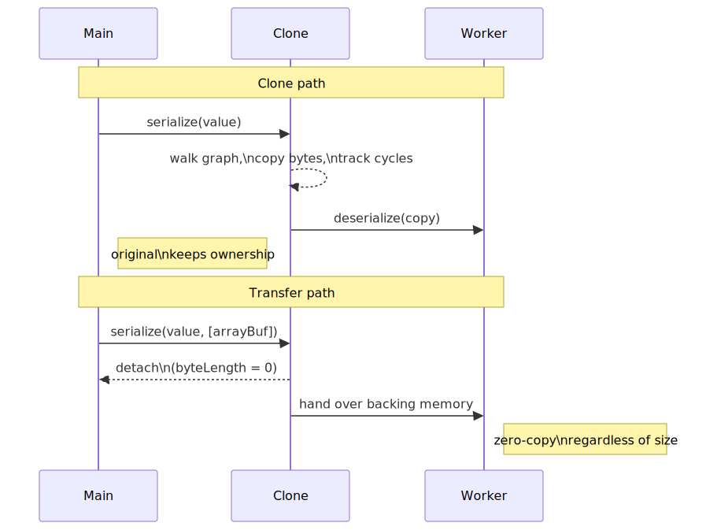
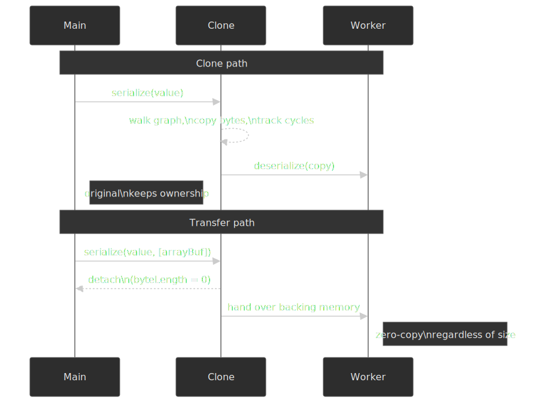

# Web Workers and Worklets for Off-Main-Thread Work

Workers and worklets are two different answers to the same constraint: every page has exactly one main thread, and that thread is responsible for JavaScript, style and layout, paint, and event delivery. Anything that ties the main thread up beyond a frame budget shows up as jank. **Workers** move work to a sibling thread and communicate over [`postMessage()`](https://html.spec.whatwg.org/multipage/web-messaging.html#dom-window-postmessage); they are general-purpose and asynchronous. **Worklets** are short-lived script contexts that the browser invokes synchronously inside a specific rendering pipeline stage; they are narrow-purpose and timing-sensitive. Confusing the two is the most common mistake — workers are the wrong tool for paint or audio, and worklets are the wrong tool for parsing a CSV.




## Mental Model

Three primitives, each with a distinct ownership model, cover almost every off-main-thread case on the web platform:

1. **Workers.** Independent OS-level threads with isolated heaps and event loops, owned by the page (or the browser, in the Service Worker case). Cross-context communication uses [structured cloning](https://html.spec.whatwg.org/multipage/structured-data.html#structured-cloning) by default, [transferable objects](https://html.spec.whatwg.org/multipage/structured-data.html#transferable-objects) for zero-copy handoffs, and [`SharedArrayBuffer`](https://tc39.es/ecma262/multipage/structured-data.html#sec-sharedarraybuffer-objects) for true shared memory under [cross-origin isolation](https://developer.mozilla.org/en-US/docs/Web/API/Window/crossOriginIsolated).
2. **Worklets.** Short-lived script contexts attached to a specific pipeline phase (paint, compositor, or audio render thread), defined by the [Houdini Worklets spec](https://drafts.css-houdini.org/worklets/). They have no DOM, no `fetch`, no `setTimeout`. Their power is that the browser can call them at the exact moment a frame, paint, or audio block is being produced.
3. **Cross-thread coordination.** [Atomics](https://tc39.es/ecma262/multipage/structured-data.html#sec-atomics-object) on top of `SharedArrayBuffer` for lock-free synchronization; [`Atomics.waitAsync`](https://developer.mozilla.org/en-US/docs/Web/JavaScript/Reference/Global_Objects/Atomics/waitAsync) for non-blocking waits when running on the main thread.

The article walks through each layer with a bias toward what is actually shipped today and what is still on the drawing board.

## Worker Types and Lifecycle

The HTML Living Standard defines a worker as an [agent with its own event loop, JavaScript heap, and global scope](https://html.spec.whatwg.org/multipage/workers.html#worker-processing-model). It is a sibling of the document, not a child of any DOM tree.

### Dedicated Workers

A Dedicated Worker is a 1:1 channel between a creator and a worker thread, exposed through the [`Worker` interface](https://html.spec.whatwg.org/multipage/workers.html#worker).

```js title="Creating a dedicated worker" collapse={1-2,10-15}
// main.js
// Dedicated workers are bound to their creator

const worker = new Worker("/compute-worker.js", {
  type: "module", // Enable ES modules (default: 'classic')
  name: "compute", // Optional name for debugging
})

worker.postMessage({ task: "factorial", n: 1000000n })

// compute-worker.js
self.onmessage = (e) => {
  const result = computeFactorial(e.data.n)
  self.postMessage(result)
}
```

The HTML spec defines a [worker processing model](https://html.spec.whatwg.org/multipage/workers.html#worker-processing-model) in which each worker tracks an *owner set*, a *closing flag*, and a *terminate-on-impermissible* rule. The lifecycle states are:

| State               | Condition                                                                         | Behavior                    |
| ------------------- | --------------------------------------------------------------------------------- | --------------------------- |
| **Actively needed** | Has a fully active `Document` owner, or is owned by another actively needed worker | Full execution permitted    |
| **Protected**       | Actively needed AND (a `SharedWorker`, has open ports, or has timers/network)     | Cannot be garbage collected |
| **Permissible**     | Has any owner, or is a `SharedWorker` within the between-loads timeout            | May be suspended            |
| **Suspendable**     | Permissible but not actively needed                                               | UA may pause its event loop |

[`Worker.terminate()`](https://html.spec.whatwg.org/multipage/workers.html#dom-worker-terminate) sets the closing flag, discards queued tasks, and aborts the running script — there is no graceful shutdown hook. If you need cooperative shutdown, model it explicitly with a final message and a `close()` call inside the worker.

### Shared Workers

[Shared Workers](https://html.spec.whatwg.org/multipage/workers.html#shared-workers-and-the-sharedworker-interface) implement many-to-one: every browsing context within the same origin that addresses the worker by URL and name connects to the same instance.

```js title="Shared worker connection" collapse={1-2,11-20}
// main.js (in multiple tabs)
// Multiple tabs connect to the same named worker

const worker = new SharedWorker("/shared-state.js", "session-state")
worker.port.start()
worker.port.postMessage({ action: "subscribe", channel: "updates" })
worker.port.onmessage = (e) => {
  console.log("Update:", e.data)
}

// shared-state.js
const connections = new Set()

self.onconnect = (e) => {
  const port = e.ports[0]
  connections.add(port)
  port.onmessage = (msg) => {
    // Broadcast to all connected ports
    for (const p of connections) p.postMessage(msg.data)
  }
}
```

Differences from a Dedicated Worker:

- Communication uses an explicit [`MessagePort`](https://html.spec.whatwg.org/multipage/web-messaging.html#message-channels) accessed via `worker.port`. The port is implicitly started for `onmessage` listeners but **must be explicitly started** when using `addEventListener('message', ...)`.
- The worker survives as long as at least one port remains connected.
- `onconnect` fires once per new context; the worker maintains its own `connections` set.
- State persists across page navigations within the same origin via the spec's [between-loads shared worker timeout](https://html.spec.whatwg.org/multipage/workers.html#dom-sharedworker), which lets a same-origin reload reattach without losing state.

> [!NOTE]
> Browser support for Shared Workers has been uneven. Safari shipped them in version 16, but they remain unavailable on iOS WebKit-derived browsers. Treat them as an enhancement layer when designing cross-tab features; fall back to [`BroadcastChannel`](https://developer.mozilla.org/en-US/docs/Web/API/BroadcastChannel) plus per-tab Dedicated Workers when you need a portable baseline.

### Service Workers

[Service Workers](https://w3c.github.io/ServiceWorker/) operate under browser control rather than page control. The browser starts them in response to network or background events and terminates them when idle.




```js title="Service worker registration" collapse={1-3,12-20}
// main.js
// Service workers are registered, not constructed
// They control pages matching their scope

if ("serviceWorker" in navigator) {
  const reg = await navigator.serviceWorker.register("/sw.js", {
    scope: "/",
    type: "module",
  })
}

// sw.js
self.addEventListener("install", (e) => {
  e.waitUntil(caches.open("v1").then((c) => c.addAll(["/app.js", "/styles.css"])))
})

self.addEventListener("fetch", (e) => {
  e.respondWith(caches.match(e.request).then((r) => r || fetch(e.request)))
})
```

The behavioural contract differs sharply from Dedicated and Shared Workers:

| Aspect        | Dedicated/Shared Worker                  | Service Worker                                    |
| ------------- | ---------------------------------------- | ------------------------------------------------- |
| Lifetime      | Developer controls via `new`/`terminate` | Browser controls; may terminate any time          |
| Persistence   | Lives while page is open                 | Persists across page loads and browser restarts   |
| Network       | Regular `fetch` access                   | Intercepts all `fetch` requests in [scope](https://w3c.github.io/ServiceWorker/#service-worker-registration-scope) |
| DOM access    | None                                     | None (talks to clients via `Client.postMessage`)  |
| Start trigger | Explicit construction                    | `fetch`, `push`, `sync`, `notificationclick`, etc. |

Event handlers must complete quickly. Long-running work belongs inside [`event.waitUntil(promise)`](https://w3c.github.io/ServiceWorker/#dom-extendableevent-waituntil), which keeps the worker alive until the promise settles. Even with `waitUntil`, the browser will eventually evict an idle worker — Chromium [terminates after roughly 30 seconds of inactivity](https://developer.chrome.com/docs/extensions/develop/concepts/service-workers/lifecycle), and a single in-flight event capped at 5 minutes. Treat Service Worker memory as ephemeral and persist anything you need in `caches`, `IndexedDB`, or the [`FileSystemHandle`](https://developer.mozilla.org/en-US/docs/Web/API/File_System_API) APIs.

> [!IMPORTANT]
> Service Workers register against an HTTPS origin (or `localhost` for development). The script's URL determines the maximum scope. A worker at `/scripts/sw.js` cannot control `/`; either move the script to the root or set the `Service-Worker-Allowed` response header to widen its scope.

### Module Workers vs Classic Workers

The `type` option on [`Worker`](https://html.spec.whatwg.org/multipage/workers.html#dom-worker) and [`ServiceWorkerContainer.register`](https://w3c.github.io/ServiceWorker/#dom-serviceworkercontainer-register) controls script loading semantics.

**Classic workers** (`type: 'classic'`, the default):

- [`importScripts()`](https://html.spec.whatwg.org/multipage/workers.html#dom-workerglobalscope-importscripts) synchronously loads and executes scripts.
- `import` / `export` statements throw `SyntaxError`.
- Strict mode is opt-in.
- Top-level `this` references the global scope.

**Module workers** (`type: 'module'`):

- ES module semantics, including `import` / `export` and dynamic `import()`.
- `importScripts()` always throws `TypeError`.
- Strict mode is on and cannot be disabled.
- Top-level `this` is `undefined`.
- `import.meta.url` resolves to the worker's script URL.
- `<link rel="modulepreload">` can warm up the dependency graph before construction. See the [web.dev module workers guide](https://web.dev/articles/module-workers) for the deployment notes.

```js title="Module worker with dynamic import" collapse={1-2,9-12}
// worker.js (type: 'module')
// Dynamic imports work in module workers

import { heavyCompute } from "./compute.js"

self.onmessage = async (e) => {
  // Dynamic import for code splitting
  const { processImage } = await import("./image-processor.js")
  const result = await processImage(e.data)
  self.postMessage(result)
}
```

Module workers have slightly higher cold-start cost because the browser must resolve and fetch the dependency graph before running any code, but they unlock tree-shaking and shared module deduplication with the main thread. Pick module workers by default; reach back for classic workers only when you must `importScripts()` from a runtime-resolved list.

## Communication and Data Transfer

`postMessage` is the seam between threads. Two algorithms govern what crosses that seam: the [Structured Clone Algorithm](https://html.spec.whatwg.org/multipage/structured-data.html#structured-cloning) and the [transfer protocol](https://html.spec.whatwg.org/multipage/structured-data.html#transferable-objects).




### Structured Clone Algorithm

`postMessage()` serializes data with the [Structured Clone Algorithm](https://html.spec.whatwg.org/multipage/structured-data.html#structuredserialize), which walks the object graph, copies platform values, and tracks references to preserve cycles.

**Supported types** (per [HTML §2.7](https://html.spec.whatwg.org/multipage/structured-data.html#serializable-objects)):

- Primitives (except `Symbol`).
- `Object`, `Array`, `Map`, `Set`.
- `Date`, `RegExp`.
- `ArrayBuffer`, `TypedArray`, `DataView`.
- `Blob`, `File`, `FileList`.
- `ImageData`, `ImageBitmap`.
- `Error` (a fixed subset of properties).

**Cannot be cloned** — throws `DataCloneError`:

- Functions, including bound methods.
- DOM nodes.
- Property descriptors and getters/setters (only own enumerable data properties survive).
- Prototype chain (instances arrive as plain objects).
- `Symbol` keys.

```js title="Structured cloning behavior" collapse={1-3,15-20}
// Cycles are preserved
const obj = { name: "circular" }
obj.self = obj
worker.postMessage(obj) // Works—cycle is maintained

// Functions fail
worker.postMessage({ fn: () => {} }) // DataCloneError

// Class instances lose their prototype
class Point {
  constructor(x, y) {
    this.x = x
    this.y = y
  }
}
worker.postMessage(new Point(1, 2))
// Worker receives: { x: 1, y: 2 } (plain object, no Point prototype)

// Maps and Sets are preserved
worker.postMessage(new Map([["key", "value"]]))
// Worker receives: Map { 'key' => 'value' }
```

The same algorithm powers [`structuredClone()`](https://developer.mozilla.org/en-US/docs/Web/API/Window/structuredClone), so anything that survives a `postMessage` survives an in-process deep clone too.

### Transferable Objects

[Transferables](https://developer.mozilla.org/en-US/docs/Web/API/Web_Workers_API/Transferable_objects) move ownership instead of copying. The source context detaches the resource, the destination context attaches it, and the underlying memory is never duplicated.

The complete list of transferable types, per the HTML spec and per-API specs:

| Family             | Transferables                                                                                                                          |
| ------------------ | -------------------------------------------------------------------------------------------------------------------------------------- |
| Memory             | `ArrayBuffer`                                                                                                                          |
| Messaging          | `MessagePort`                                                                                                                          |
| Graphics           | `ImageBitmap`, `OffscreenCanvas`                                                                                                       |
| Streams            | `ReadableStream`, `WritableStream`, `TransformStream`                                                                                  |
| Media              | `MediaStreamTrack`, `MediaSourceHandle`                                                                                                |
| WebCodecs          | [`AudioData`](https://www.w3.org/TR/webcodecs/#audiodata), [`VideoFrame`](https://www.w3.org/TR/webcodecs/#videoframe)                 |
| WebRTC / WebMIDI   | `RTCDataChannel`, `MIDIAccess`                                                                                                         |
| WebTransport       | `WebTransportReceiveStream`, `WebTransportSendStream`                                                                                  |

> [!CAUTION]
> Typed arrays (`Uint8Array`, `Float32Array`, …) are **serializable but not transferable**. Pass `arr.buffer` in the transfer list, not `arr`. The receiving side gets a fresh typed array view over the moved buffer.

```js title="Transferring an ArrayBuffer" collapse={1-2,12-18}
// Create a 100MB buffer
const buffer = new ArrayBuffer(100 * 1024 * 1024)

console.log(buffer.byteLength) // 104857600

// Transfer ownership to worker
worker.postMessage(buffer, [buffer])

console.log(buffer.byteLength) // 0 (detached)

// Worker receives the buffer instantly
// In worker:
self.onmessage = (e) => {
  const received = e.data
  console.log(received.byteLength) // 104857600
  // Worker now owns this buffer
}
```

### Performance Characteristics

Cloning cost is roughly linear in the size and complexity of the data graph; transfer cost is constant. The numbers below are order-of-magnitude figures from the [Chrome team's "Transferable Objects: Lightning Fast"](https://developer.chrome.com/blog/transferable-objects-lightning-fast/) post and follow-up benchmarks — treat them as a sanity check, not a contract.

| Data size | Approx. clone time | Approx. transfer time | Recommendation                                        |
| --------- | ------------------ | --------------------- | ----------------------------------------------------- |
| < 10 KB   | < 1 ms             | ~0 ms                 | Either method is acceptable                           |
| 50 KB     | ~5 ms              | < 1 ms                | Clone for one-shot calls; transfer above ~60 Hz       |
| 100 KB    | ~10 ms             | < 1 ms                | Transfer if you need to stay inside a 16 ms frame      |
| 1 MB      | ~100 ms            | < 1 ms                | Always transfer                                       |
| 32 MB     | ~300 ms            | a few ms              | Always transfer                                       |
| > 200 MB  | unreliable         | tens of ms            | Stream or chunk; consider `SharedArrayBuffer` instead |

For high-frequency channels (e.g. 60 Hz animation frames or 1 kHz sensor samples), even small cloning overhead piles up. Pre-allocate the buffer pool, transfer the same buffers back and forth, and avoid recreating typed arrays per frame.

### Error Handling

Worker errors propagate via the `error` event on the constructor side and `unhandledrejection` for promises:

```js title="Worker error handling" collapse={1-3,14-20}
// Main thread
worker.onerror = (event) => {
  // ErrorEvent properties:
  console.error(`${event.filename}:${event.lineno}:${event.colno}`)
  console.error(event.message)
  event.preventDefault() // Suppress default console error
}

worker.onmessageerror = (event) => {
  // Fires when deserialization fails
  console.error("Failed to deserialize message")
}

// Worker can catch its own errors
self.onerror = (message, filename, lineno, colno, error) => {
  // Return true to prevent propagation to main thread
  return true
}
```

`messageerror` fires when the receiving side cannot deserialize a message — typically because a transferable was already detached or a serialized class no longer matches the expected shape. Unhandled promise rejections inside the worker fire `unhandledrejection` on the worker global scope, mirroring the main-thread API.

## SharedArrayBuffer and Atomics

`SharedArrayBuffer` (SAB) gives every connected agent a view onto the same physical bytes. The price is cross-origin isolation, because shared memory plus a high-resolution counter is enough to defeat the [Spectre side-channel mitigations](https://web.dev/articles/why-coop-coep) the platform put in place after 2018.

### Cross-Origin Isolation Requirements

Three pieces have to line up before `SharedArrayBuffer` is exposed to your page (per the [MDN COEP guide](https://developer.mozilla.org/en-US/docs/Web/HTTP/Reference/Headers/Cross-Origin-Embedder-Policy#features_that_depend_on_cross_origin_isolation)):

```http
Cross-Origin-Opener-Policy: same-origin
Cross-Origin-Embedder-Policy: require-corp
```

Plus, if a parent has dropped it, the [`cross-origin-isolated` permission policy](https://developer.mozilla.org/en-US/docs/Web/HTTP/Reference/Headers/Permissions-Policy/cross-origin-isolated) must allow the feature in the current frame.

- `COOP: same-origin` severs the relationship between your top-level document and any cross-origin popups, so a malicious opener cannot reach into your `window`.
- `COEP: require-corp` requires every cross-origin subresource to opt in via a [`Cross-Origin-Resource-Policy`](https://developer.mozilla.org/en-US/docs/Web/HTTP/Reference/Headers/Cross-Origin-Resource-Policy) header (or use `crossorigin` on the embedding tag).
- The `credentialless` variant of COEP is the pragmatic fallback when you embed third-party assets that you cannot make CORS-aware: cross-origin no-cors fetches go through, but the browser strips cookies and credentials so the response cannot leak per-user data.

```js title="Checking cross-origin isolation" collapse={1-3}
// Runtime check before using SharedArrayBuffer
if (!crossOriginIsolated) {
  throw new Error("SharedArrayBuffer requires cross-origin isolation")
}

const sab = new SharedArrayBuffer(1024)
const view = new Int32Array(sab)
```

[`Window.crossOriginIsolated`](https://developer.mozilla.org/en-US/docs/Web/API/Window/crossOriginIsolated) is the runtime feature switch; check it before constructing a SAB and have a clone-based fallback for cases where the headers cannot be set (third-party iframes, classic CDNs, etc.).

### Atomics Operations

[`Atomics`](https://tc39.es/ecma262/multipage/structured-data.html#sec-atomics-object) provides the synchronization primitives. Each operation maps onto a hardware atomic instruction; semantics are sequentially consistent within the JavaScript memory model defined in [ECMA-262 §29](https://tc39.es/ecma262/multipage/memory-model.html).

```js title="Producer-consumer with Atomics" collapse={1-5,25-35}
// Shared buffer layout:
// [0]: ready flag (0 = not ready, 1 = data available)
// [1-n]: data

const sab = new SharedArrayBuffer(1024)
const control = new Int32Array(sab, 0, 1)
const data = new Float64Array(sab, 8)

// In producer worker:
function produce(value) {
  data[0] = value
  Atomics.store(control, 0, 1) // Mark ready
  Atomics.notify(control, 0, 1) // Wake one waiter
}

// In consumer worker:
function consume() {
  while (Atomics.load(control, 0) === 0) {
    Atomics.wait(control, 0, 0) // Block until notified
  }
  const value = data[0]
  Atomics.store(control, 0, 0) // Mark consumed
  return value
}

// Available atomic operations:
// Atomics.load(ta, index) - atomic read
// Atomics.store(ta, index, value) - atomic write
// Atomics.add(ta, index, value) - atomic add, returns old value
// Atomics.sub(ta, index, value) - atomic subtract
// Atomics.and/or/xor(ta, index, value) - bitwise operations
// Atomics.compareExchange(ta, index, expected, replacement)
// Atomics.exchange(ta, index, value) - atomic swap
// Atomics.wait(ta, index, value, timeout?) - block until changed
// Atomics.notify(ta, index, count?) - wake waiting threads
```

> [!WARNING]
> [`Atomics.wait()`](https://tc39.es/ecma262/multipage/structured-data.html#sec-atomics.wait) blocks the calling agent. Calling it on the main thread freezes input handling, layout, and paint — and most browsers refuse to do it at all for that reason. Use [`Atomics.waitAsync()`](https://developer.mozilla.org/en-US/docs/Web/JavaScript/Reference/Global_Objects/Atomics/waitAsync) (Baseline newly available since November 2025) to get a `Promise`-based wait that the main thread can `await` without stalling the event loop.

### Design Rationale: Why Cross-Origin Isolation?

Shared memory plus a worker that increments a counter as fast as possible is a high-resolution clock. Combined with a microarchitectural side-channel like Spectre, that clock is enough to read memory across the same address space.

```js title="High-resolution timing via SharedArrayBuffer" collapse={1-2,8-12}
// Attacker spins in a worker, incrementing a counter
// Main thread reads the counter before/after a memory access
// The delta reveals cache timing, potentially leaking memory contents

const sab = new SharedArrayBuffer(4)
const counter = new Int32Array(sab)

// Worker thread (spinning)
while (true) Atomics.add(counter, 0, 1)

// Main thread measures timing
const start = Atomics.load(counter, 0)
// ... memory access ...
const elapsed = Atomics.load(counter, 0) - start
```

Cross-origin isolation contains this threat by:

1. Preventing cross-origin documents from sharing the agent cluster (so they cannot map the same SAB).
2. Throttling [`performance.now()`](https://developer.mozilla.org/en-US/docs/Web/API/Performance/now#reduced_time_precision) and `Date.now()` resolution outside isolated contexts.
3. Forcing every cross-origin subresource to explicitly opt in, so a malicious ad cannot piggy-back inside an isolated document.

The [web.dev cross-origin isolation guide](https://web.dev/articles/cross-origin-isolation-guide) walks through the rollout strategy — `COOP-Report-Only` and `COEP-Report-Only` first, then `credentialless` for partial coverage, then `require-corp` once every embedded asset has CORP headers.

## Worklets: Rendering Pipeline Integration

Worklets exist because workers cannot meet the timing contract of the rendering pipeline. The [Houdini Worklets specification](https://drafts.css-houdini.org/worklets/) defines them as short-lived global scopes that the user agent invokes synchronously inside the relevant pipeline stage. There may be more than one global scope per worklet — the spec allows the UA to instantiate the class multiple times for parallelism — so worklet code must be stateless across invocations.

### Why Worklets Exist

Workers communicate asynchronously, which means their results arrive after the frame they were intended for has already been painted:

```js title="Why workers fail for paint" collapse={1-4}
// Problem: Worker results arrive too late
worker.postMessage({ width: 100, height: 100 })
worker.onmessage = (e) => {
  // This runs AFTER the current frame has painted
  element.style.backgroundImage = `url(${e.data})`
  // User sees a frame with the OLD background
}
```

Worklets are called synchronously inside the phase that needs them:

```css
/* Paint worklet runs during paint phase */
.custom-bg {
  background: paint(custom-gradient);
}
/* Browser calls paint() synchronously before compositing */
```

### Worklet Restrictions

Synchronous integration costs flexibility. The [Worklet global scope](https://drafts.css-houdini.org/worklets/#worklets-section) is intentionally minimal:

| Restriction                   | Reason                                     |
| ----------------------------- | ------------------------------------------ |
| No DOM access                 | Would require cross-thread synchronization |
| No `fetch()` or network       | Would block rendering                      |
| No `setTimeout`/`setInterval` | Timing tied to render events               |
| Limited global scope          | Prevents accidental expensive operations   |
| Multiple instances            | Browser may parallelize execution          |

The browser may create multiple worklet global scopes and instantiate your class multiple times. Never rely on instance state persisting across invocations; persist any cross-frame state through arguments and class fields that you treat as immutable.

### Paint Worklet (CSS Painting API)

[Paint Worklets](https://drafts.css-houdini.org/css-paint-api/) generate custom CSS `<image>` values during the paint phase. They register a class with a `paint(ctx, geom, props)` method; the browser calls it whenever a `paint(name)` CSS function needs to be resolved.

```js title="Registering a paint worklet" collapse={1-4,25-35}
// paint-checkerboard.js
// Paint worklets define custom CSS image generators

class CheckerboardPainter {
  static get inputProperties() {
    return ["--checker-size", "--checker-color-1", "--checker-color-2"]
  }

  paint(ctx, geom, props) {
    const size = parseInt(props.get("--checker-size")) || 32
    const color1 = props.get("--checker-color-1").toString() || "#fff"
    const color2 = props.get("--checker-color-2").toString() || "#000"

    for (let y = 0; y < geom.height; y += size) {
      for (let x = 0; x < geom.width; x += size) {
        const isEven = (x / size + y / size) % 2 === 0
        ctx.fillStyle = isEven ? color1 : color2
        ctx.fillRect(x, y, size, size)
      }
    }
  }
}

registerPaint("checkerboard", CheckerboardPainter)

// main.js - register the worklet
CSS.paintWorklet.addModule("/paint-checkerboard.js")
```

```css title="Using the paint worklet" collapse={1-2}
/* CSS usage */
.checkerboard {
  --checker-size: 20;
  --checker-color-1: #f0f0f0;
  --checker-color-2: #333;
  background: paint(checkerboard);
}
```

[`PaintRenderingContext2D`](https://drafts.css-houdini.org/css-paint-api/#paintrenderingcontext2d) is a strict subset of `CanvasRenderingContext2D`:

- Supported: `fillRect`, `strokeRect`, `drawImage`, `arc`, `bezierCurveTo`, path operations, transforms.
- **Not** supported: text rendering (`fillText`, `strokeText`), `getImageData`, `putImageData`. Text is excluded because it would require pulling font metrics into the paint context.

Browser behaviour to be aware of:

- The browser may cache results when size, custom property values, and arguments are unchanged.
- Elements outside the viewport may defer painting until they scroll into view.
- A `paint()` call that takes too long is terminated and the painted area falls back to transparent.

**Support (as of 2026):** Chromium-based browsers ship the API; [Safari and Firefox do not](https://developer.mozilla.org/en-US/docs/Web/API/CSS_Painting_API#browser_compatibility) ([caniuse: css-paint-api](https://caniuse.com/css-paint-api)). Use the [`css-paint-polyfill`](https://github.com/GoogleChromeLabs/css-paint-polyfill) for cross-browser parity, or treat custom paint as a progressive enhancement layered on top of a static background.

### Animation Worklet

[`AnimationWorklet`](https://drafts.css-houdini.org/css-animation-worklet-1/) was Houdini's answer to scripted, jank-resistant animations driven by `ScrollTimeline` or `DocumentTimeline`. The animator class controls `effect.localTime` directly, in principle running on the compositor thread.

```js title="Scroll-linked animation worklet (legacy API)" collapse={1-4,20-30}
// parallax-animator.js
// Animation worklet for scroll-driven effects

class ParallaxAnimator {
  constructor(options) {
    this.rate = options.rate || 0.5
  }

  animate(currentTime, effect) {
    // currentTime comes from the timeline (e.g., scroll position)
    // effect.localTime controls the animation progress
    effect.localTime = currentTime * this.rate
  }
}

registerAnimator("parallax", ParallaxAnimator)

// main.js
await CSS.animationWorklet.addModule("/parallax-animator.js")

const scroller = document.querySelector(".scroll-container")
const target = document.querySelector(".parallax-element")

const animation = new WorkletAnimation(
  "parallax",
  new KeyframeEffect(target, [{ transform: "translateY(0)" }, { transform: "translateY(-200px)" }], {
    duration: 1,
    fill: "both",
  }),
  new ScrollTimeline({ source: scroller }),
  { rate: 0.3 },
)
animation.play()
```

> [!IMPORTANT]
> Animation Worklet was an [Origin Trial in Chrome 71–74](https://chromestatus.com/feature/5762982487261184) and never shipped to stable. Safari and Firefox have no implementation. The use cases the API was designed for — scroll-linked timelines, view-driven animations — are now solved by [CSS Scroll-driven Animations](https://developer.mozilla.org/en-US/docs/Web/CSS/Guides/Scroll-driven_animations) (`animation-timeline`, `scroll-timeline`, `view-timeline`), which ship in Chromium 115+, Safari 26+, and behind a flag in Firefox. Treat Animation Worklet as a historical primitive; reach for declarative scroll-driven animations for new work.

The takeaway is structural: when a Houdini API ends up in this state, the platform usually answers with a more declarative replacement that the compositor can optimise without scripted callbacks. Audio Worklet is the counterexample, and it survived precisely because audio has no declarative replacement.

### Audio Worklet

[`AudioWorklet`](https://www.w3.org/TR/webaudio/#audioworklet) processes audio samples on the [Web Audio rendering thread](https://www.w3.org/TR/webaudio/#audio-graph-rendering) under hard real-time constraints. Each `process()` call has to fill the output before the next render quantum is due.

```js title="Custom gain processor" collapse={1-4,25-40}
// gain-processor.js
// Audio worklet for custom sample processing

class GainProcessor extends AudioWorkletProcessor {
  static get parameterDescriptors() {
    return [
      {
        name: "gain",
        defaultValue: 1.0,
        minValue: 0,
        maxValue: 2,
        automationRate: "a-rate", // per-sample automation
      },
    ]
  }

  process(inputs, outputs, parameters) {
    const input = inputs[0]
    const output = outputs[0]
    const gain = parameters.gain

    for (let channel = 0; channel < output.length; channel++) {
      for (let i = 0; i < output[channel].length; i++) {
        // gain may be k-rate (single value) or a-rate (per-sample)
        const g = gain.length > 1 ? gain[i] : gain[0]
        output[channel][i] = input[channel]?.[i] * g || 0
      }
    }
    return true // Continue processing
  }
}

registerProcessor("gain-processor", GainProcessor)

// main.js
const ctx = new AudioContext()
await ctx.audioWorklet.addModule("/gain-processor.js")

const gainNode = new AudioWorkletNode(ctx, "gain-processor")
gainNode.parameters.get("gain").value = 0.5

source.connect(gainNode)
gainNode.connect(ctx.destination)
```

**Render quantum:** Fixed at 128 sample-frames per the [Web Audio API spec](https://www.w3.org/TR/webaudio/#render-quantum-size) and [MDN's `AudioWorkletProcessor.process()` reference](https://developer.mozilla.org/en-US/docs/Web/API/AudioWorkletProcessor/process). At 48 kHz, that is roughly 2.67 ms per callback. Web Audio v2 introduces a `renderSizeHint` for `AudioContextOptions` to negotiate other sizes ([W3C Web Audio 1.1 §2.2](https://www.w3.org/TR/webaudio-1.1/#AudioContextOptions)), but as of early 2026 it is not yet broadly available — design for 128 unless you have explicitly negotiated otherwise.

**Communication.** Use a [`MessagePort`](https://developer.mozilla.org/en-US/docs/Web/API/AudioWorkletNode/port) (accessed via `node.port` / `this.port`) for control messages. Allocations and I/O inside `process()` are unsafe — the audio thread cannot tolerate a GC pause or an OS scheduling hiccup. Pre-allocate every buffer and parameter array in the constructor.

**Support (as of 2026):** All modern browsers — the API has been Baseline since Safari 14.1 in 2021 and is the production-ready primitive in the Houdini family.

### Layout Worklet (Experimental)

The [CSS Layout API](https://drafts.css-houdini.org/css-layout-api/) lets authors implement custom layout algorithms (masonry, true 2-D flow, custom grids). The API is Chromium-only, gated behind a flag, and the spec is still in flux.

```js title="Layout worklet (experimental)" collapse={1-3}
// Experimental - API may change
// Available in Chrome behind experimental flag

class MasonryLayout {
  static get inputProperties() {
    return ["--columns"]
  }

  async intrinsicSizes(children, edges, styleMap) {
    // Return intrinsic sizing
  }

  async layout(children, edges, constraints, styleMap) {
    // Position children, return fragment
  }
}

registerLayout("masonry", MasonryLayout)
```

**Status (as of 2026):** Behind flags in Chromium, no signal from WebKit or Gecko. Specification still evolving. Not production-ready.

## Use-Case Decision Matrix

When more than one primitive could work, picking the wrong one usually shows up as either jank (worker results arriving too late) or starvation (worklet code attempting work it cannot do). The decision tree below collapses the choice down to one or two questions.




| Scenario                                  | Recommended                              | Why                                          |
| ----------------------------------------- | ---------------------------------------- | -------------------------------------------- |
| Heavy computation (WASM, crypto, parsing) | Dedicated Worker                         | Isolates CPU work from UI                    |
| Cross-tab shared state                    | Shared Worker (with BroadcastChannel fallback) | Single instance serves multiple tabs         |
| Offline support, caching                  | Service Worker                           | Intercepts network, persists across sessions |
| Custom CSS backgrounds/borders            | Paint Worklet (Chromium) + polyfill      | Synchronous with paint phase                 |
| Scroll-linked animations                  | CSS Scroll-driven Animations             | Animation Worklet never shipped              |
| Real-time audio effects                   | Audio Worklet                            | Runs on audio thread, < 3 ms latency         |
| Large binary transfers (> 1 MB)           | Worker + Transferables                   | Zero-copy transfer                           |
| Lock-free shared state                    | `SharedArrayBuffer` + Atomics            | True shared memory (requires COOP/COEP)      |
| Per-frame off-main-thread compositing     | `OffscreenCanvas` in a Dedicated Worker  | Renders to a transferable canvas             |

## Debugging and Profiling

### Chrome DevTools

**Workers**

- The Sources panel's *Threads* sidebar lists every active worker; pause and console-eval target the selected one.
- The Performance panel includes worker activity in the flame chart and surfaces transfer / clone events on the timing track.
- The Memory panel can take heap snapshots of any worker.

**Worklets**

- Paint Worklets: enable *Paint flashing* in the Rendering drawer to see when a `paint()` invocation runs.
- Audio Worklets: visit `chrome://webaudio-internals` to inspect the live audio graph and see processor latency.
- The Performance panel shows worklet execution on the appropriate compositor or audio track.

### Common Issues

**Worker won't start:**

- Check the console for fetch errors — 404s, CORS, or mixed content.
- Module workers need a JavaScript MIME type on the response (`text/javascript` or `application/javascript`).
- Mixed content blocks an HTTP worker URL on an HTTPS page.

**Messages aren't arriving:**

- Confirm `port.start()` has been called on `SharedWorker` and `MessageChannel` ports when using `addEventListener` (the `onmessage` setter starts the port implicitly).
- Watch for `DataCloneError` in the console — usually a function or DOM node sneaking into the payload.
- Make sure the worker hasn't been terminated (`worker.terminate()` is immediate and silent).

**`SharedArrayBuffer` is `undefined`:**

- Verify `crossOriginIsolated === true` from a console in the affected document.
- Check the response headers for both COOP and COEP, and that no parent frame's `Permissions-Policy` is blocking it.
- Make sure every cross-origin subresource has `Cross-Origin-Resource-Policy` set, or switch COEP to `credentialless` if you cannot.

## Conclusion

Workers and worklets serve distinct concurrency needs. Workers provide general-purpose parallelism with message-passing isolation — safe by default, with `SharedArrayBuffer` available when true shared memory is required. Worklets integrate into the rendering pipeline for cases where asynchronous communication cannot meet timing requirements; in 2026 the only worklet that has fully delivered on that promise is Audio Worklet, with Paint Worklet shipping in Chromium and Animation Worklet effectively replaced by CSS Scroll-driven Animations.

For most applications, Dedicated Workers with transferables provide the best balance of simplicity and performance. Reach for SAB only when lock-free shared memory is the actual bottleneck, and for worklets only when the work has to participate in a specific pipeline stage.

## Appendix

### Prerequisites

- JavaScript event loop and asynchronous execution model.
- Basic understanding of the browser rendering pipeline (style → layout → paint → composite).
- Familiarity with Promises and async/await.
- For SharedArrayBuffer: shared-memory concurrency concepts (visibility, ordering, atomicity).

### Terminology

- **Structured Clone Algorithm:** the serialization mechanism used by `postMessage()` and `structuredClone()` to copy JavaScript values between contexts.
- **Transferable:** an object whose ownership can be moved (not copied) between contexts via `postMessage()`.
- **Render quantum:** the fixed block size (128 sample-frames in Web Audio v1) processed per Audio Worklet callback.
- **Cross-origin isolation:** the security mode requiring COOP and COEP headers that enables `SharedArrayBuffer` and high-resolution timing.
- **Agent / agent cluster:** the JavaScript spec term for an execution context. Workers are separate agents; SAB-sharing requires being in the same agent cluster.

### Summary

- **Dedicated Workers** are 1:1 with explicit `terminate()` control.
- **Shared Workers** serve multiple tabs over `MessagePort`s and survive page reloads within the same origin.
- **Service Workers** run under browser control for network interception, push, and background sync; persist `caches`/`IndexedDB`, not in-memory state.
- **Module workers** (`type: 'module'`) enable ES module syntax; classic workers use `importScripts()`.
- **Structured cloning** copies data; **transferables** move ownership for zero-copy performance.
- **`SharedArrayBuffer`** requires cross-origin isolation (COOP `same-origin` + COEP `require-corp` or `credentialless`) due to Spectre mitigations.
- **Paint Worklets** generate custom CSS images synchronously during paint; Chromium-only as of 2026.
- **Animation Worklet** never shipped to stable; use [CSS Scroll-driven Animations](https://developer.mozilla.org/en-US/docs/Web/CSS/Guides/Scroll-driven_animations) instead.
- **Audio Worklets** process samples in 128-sample blocks with sub-3 ms timing requirements; the only Houdini API with full cross-browser support.

### References

- [WHATWG HTML Living Standard — Workers](https://html.spec.whatwg.org/multipage/workers.html) — authoritative worker lifecycle and API specification.
- [WHATWG HTML — Structured Data](https://html.spec.whatwg.org/multipage/structured-data.html) — structured clone algorithm and transferable objects.
- [W3C Service Workers Level 1](https://w3c.github.io/ServiceWorker/) — Service Worker lifecycle and event model.
- [W3C CSS Painting API Level 1](https://drafts.css-houdini.org/css-paint-api/) — Paint Worklet specification.
- [W3C CSS Animation Worklet API](https://drafts.css-houdini.org/css-animation-worklet-1/) — Animation Worklet specification (historical).
- [W3C Web Audio API — AudioWorklet](https://www.w3.org/TR/webaudio/#audioworklet) — Audio Worklet specification.
- [ECMA-262 — Atomics and SharedArrayBuffer](https://tc39.es/ecma262/multipage/structured-data.html#sec-atomics-object) — language-level shared memory primitives.
- [MDN — Web Workers API](https://developer.mozilla.org/en-US/docs/Web/API/Web_Workers_API) — comprehensive API reference.
- [MDN — Transferable Objects](https://developer.mozilla.org/en-US/docs/Web/API/Web_Workers_API/Transferable_objects) — transferable types reference.
- [web.dev — Cross-Origin Isolation Guide](https://web.dev/articles/cross-origin-isolation-guide) — COOP/COEP rollout strategy.
- [web.dev — Module Workers](https://web.dev/articles/module-workers) — module worker usage patterns.
- [Chromium Animation Worklet status](https://chromestatus.com/feature/5762982487261184) — Origin Trial history.
- [MDN — CSS Scroll-driven Animations](https://developer.mozilla.org/en-US/docs/Web/CSS/Guides/Scroll-driven_animations) — declarative replacement for scroll-linked Animation Worklet use cases.
- [Chrome Developers — Transferable Objects: Lightning Fast](https://developer.chrome.com/blog/transferable-objects-lightning-fast/) — the original benchmark post for transfer vs clone.
