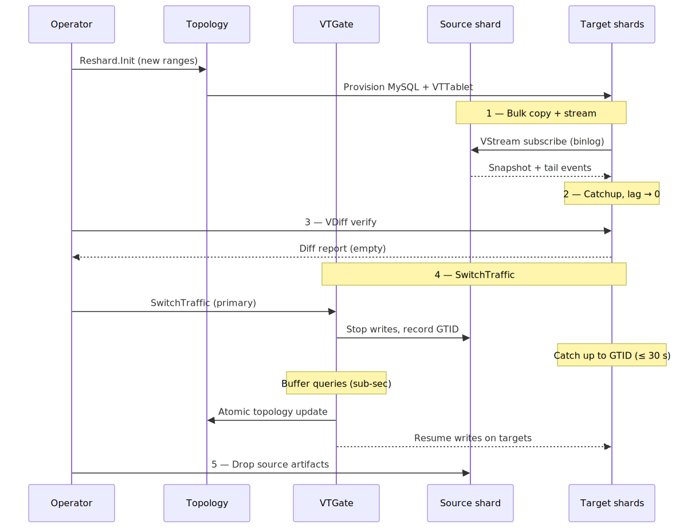
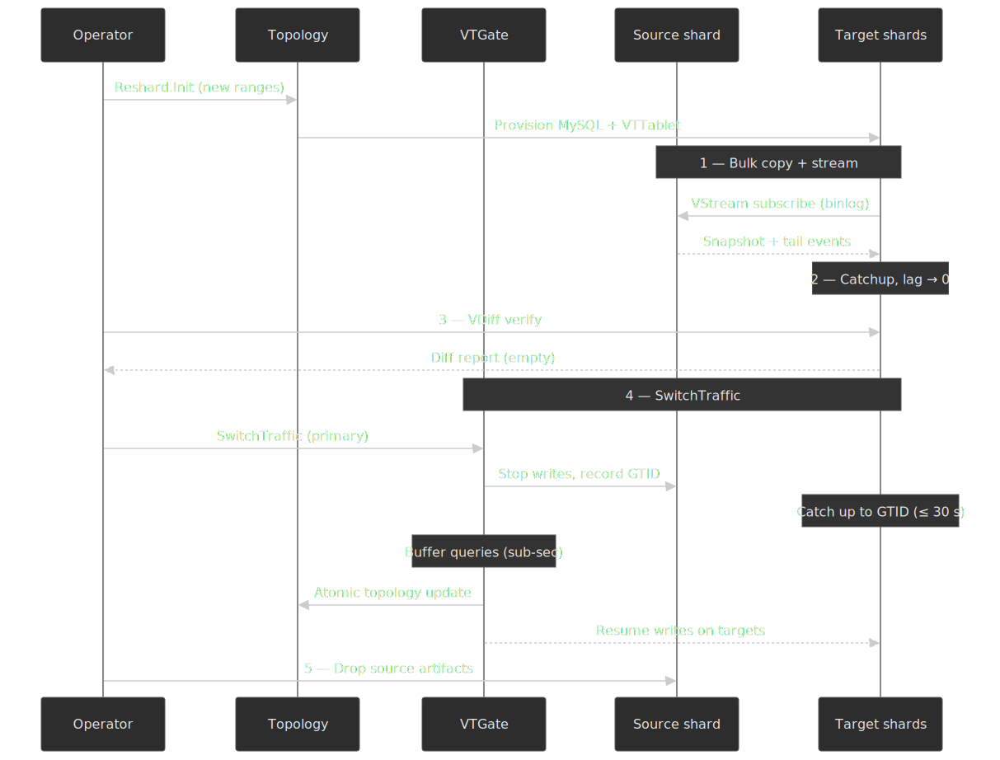

# YouTube: Scaling MySQL to Serve Billions with Vitess

How YouTube built Vitess to horizontally scale MySQL from 4 shards to 256 across tens of thousands of nodes, serving millions of queries per second without abandoning the relational model—and why they eventually migrated to Spanner anyway.

## Abstract

Vitess answers a question most teams face eventually: what happens when MySQL can't keep up, but migrating to a different database is more expensive than scaling the one you have?

- **The core insight**: Instead of replacing MySQL, insert a proxy layer (VTGate + VTTablet) that handles connection pooling, query routing, and shard management. Applications talk to Vitess as if it were a single MySQL instance. The proxy parses SQL — a foundational decision that enabled query rewriting, shard routing, and safety mechanisms a pass-through proxy can never achieve.
- **Connection pooling came first**: YouTube's immediate crisis was thousands of application-side connections stampeding a freshly-promoted primary on failover. VTTablet's bounded connection pool was Vitess's first feature, holding MySQL at a safe connection count regardless of application-fleet size.
- **Sharding evolved from vertical to horizontal**: YouTube split unrelated table groups (user data, video metadata, fraud tables) into separate keyspaces first, then horizontally sharded individual tables using Vindexes — pluggable functions that map column values to keyspace IDs and therefore to shards.
- **Resharding without downtime**: VReplication copies data to new shards while a binlog stream keeps them in sync. `SwitchTraffic` atomically updates topology, and VTGate buffers in-flight queries during the sub-second cutover window. YouTube's largest keyspace eventually reached 256 shards through repeated exponential splitting.
- **The trade-off**: Vitess sacrifices cross-shard transaction isolation, stored procedures, window functions, and foreign keys across shards. It optimizes for the dominant case — single-shard lookups and index scans — and pushes the rest of the burden into application design or two-phase commit.

## Context

### The System

YouTube was [acquired by Google in October 2006 for $1.65 billion in stock](https://www.sec.gov/Archives/edgar/data/1288776/000119312506206884/dex991.htm). At the time, YouTube's backend ran on MySQL—a decision made by the original founding team and one that would persist for over a decade.

| Attribute          | Detail                                                                                                |
| ------------------ | ----------------------------------------------------------------------------------------------------- |
| **Database**       | MySQL (InnoDB)                                                                                        |
| **Sharding**       | Application-level sharding before Vitess; YouTube's largest keyspace eventually reached 256 shards[^1] |
| **Connections**    | Several thousand simultaneous connections per primary at peak (the original failure trigger)           |
| **Replicas**       | 80–100 replicas per primary on the largest keyspace[^1]                                               |
| **Data centers**   | 20 globally distributed cells[^1]                                                                     |
| **Write topology** | All writes concentrated in Mountain View; reads load-balanced to local replicas in each cell[^1]      |

[^1]: Jiten Vaidya and Sugu Sougoumarane, [Kubernetes Podcast Episode 81: Vitess](https://kubernetespodcast.com/episode/081-vitess/) (Nov 2019). Jiten describes YouTube's largest keyspace as "256 shards" with "between 80 to 100 replicas distributed across 20 data centers."

### The Trigger

**Date**: 2010, when Vitess development began. By that point YouTube had already manually sharded its database, and feature velocity was suffering under the weight of application-resident sharding logic[^1].

The acute failure mode was a cascading connection storm. A traffic spike or a failover event caused every web server to simultaneously reconnect to a new primary, overwhelming it with thousands of connections at once—crashing the new primary, triggering another failover, in a cascading loop. As Sugu Sougoumarane and Mike Solomon catalogued YouTube's MySQL pain points[^2], a single root cause kept surfacing: there was no layer between the application fleet and MySQL that could enforce discipline at the connection or query level.

[^2]: Sugu Sougoumarane and Mike Solomon, [Vitess: Scaling MySQL at YouTube Using Go](https://www.usenix.org/conference/lisa12/vitess-scaling-mysql-youtube-using-go), USENIX LISA '12 (Dec 2012).

### Constraints

- **MySQL was non-negotiable**: YouTube's entire stack—schemas, queries, operational tooling—was built on MySQL. A migration to a different database would have been a multi-year effort affecting every team.
- **Google's infrastructure was MySQL-hostile**: Inside Google, Borg (the predecessor to Kubernetes) treated local disk as ephemeral. The well-supported storage options were Bigtable and Colossus. There was no first-class MySQL support—no mounted block storage, no official tooling[^1].
- **Application code owned sharding logic**: Every query in the codebase knew which shard to target. The application determined read-replica routing and shard selection based on WHERE clauses. Cross-shard indexes were maintained manually[^1].
- **Schema changes were dangerous**: Any DDL (Data Definition Language) operation on large tables risked locking the database and causing outages.

## The Problem

### Symptoms

The failure mode was a cascading connection storm:

1. A primary MySQL instance would degrade (slow queries, hardware issue, or planned maintenance).
2. The instance would be removed from serving, triggering failover to a replica.
3. Thousands of web-server connections would simultaneously open against the new primary.
4. The new primary, already catching up on replication, couldn't absorb the connection stampede.
5. The new primary would crash or become unresponsive.
6. Another failover would trigger, repeating the cycle.

**Timeline of escalation:**

- **Late 2000s**: Manual application-level sharding produces brittle operations and slows feature velocity[^1].
- **2010**: Sugu Sougoumarane and Mike Solomon begin building Vitess; VTTablet (connection pooling and query safety) ships as the first component[^3].
- **2012**: First public release on `code.google.com`; first conference talk at USENIX LISA[^2].
- **2013**: A Google-wide mandate moves YouTube data into Google's own data centers; Vitess is forced to run on Borg with ephemeral local disk[^1].

[^3]: PlanetScale / Vitess engineering, [Connection pooling in Vitess](https://vitess.io/blog/2023-03-27-connection-pooling-in-vitess/) (Mar 2023). VTTablet was built in 2010 specifically to solve unbounded connection growth.

### Root Cause Analysis

**Investigation process:**

Solomon spent several days cataloging every database problem, the current workaround, and what an ideal solution would look like[^2]. The exercise revealed that individual fixes (better monitoring, faster failover, query optimization) addressed symptoms but not the architectural flaw.

**The actual root cause:**

The problems were not MySQL's fault—they were management problems at scale:

1. **Unbounded connections**: Applications opened connections directly to MySQL. As the application fleet grew, connection counts grew proportionally with no ceiling.
2. **No query safety net**: Any developer could deploy a query without a LIMIT clause, a missing index scan, or a long-running transaction. There was no central point to enforce query discipline.
3. **Shard topology leaked into application code**: Every service needed to know the sharding layout, which shard held which data, and whether to read from primary or replica. This coupling made resharding a coordinated multi-team effort.
4. **No operational abstraction**: Failover, backup, schema changes, and shard management were all manual or semi-automated processes that required deep MySQL expertise.

### Why It Wasn't Obvious

The problems appeared to be independent: connection storms, slow queries, schema change outages, and resharding difficulty. The spreadsheet exercise revealed they all stemmed from the same missing layer—there was no intermediary between the application and MySQL that could enforce discipline, abstract topology, and manage connections centrally.

## Options Considered

### Option 1: Migrate to NoSQL (Cassandra, MongoDB, or Bigtable)

**Approach:** Abandon MySQL entirely and rewrite the data layer for a horizontally scalable NoSQL system.

**Pros:**

- Native horizontal scaling without middleware
- No sharding logic needed (built into the database)

**Cons:**

- Complete rewrite of all data access patterns
- Loss of ACID transactions, joins, and the relational model
- YouTube's schemas and queries were deeply relational
- Multi-year migration with high risk of data inconsistency

**Why not chosen:** The relational model was embedded in YouTube's DNA. Queries used joins, transactions, and complex WHERE clauses that NoSQL databases of 2010 couldn't efficiently support. The migration cost was prohibitive.

### Option 2: Migrate to Google Spanner or Megastore

**Approach:** Use Google's internally developed distributed databases, which offered strong consistency and horizontal scaling.

**Pros:**

- Global distribution with strong consistency
- Supported by Google's infrastructure team
- No operational burden on YouTube's team

**Cons:**

- Spanner was not externally documented until [OSDI 2012](https://research.google/pubs/spanner-googles-globally-distributed-database-2/), and not generally available outside Google for years after.
- [Megastore](https://www.cidrdb.org/cidr2011/Papers/CIDR11_Paper32.pdf) had significant performance limitations for OLTP — the Spanner paper itself notes Megastore's "relatively poor write throughput" with conflict on Paxos groups[^4].
- Migration from MySQL's schema and query patterns would still be extensive.
- YouTube's query patterns didn't require global strong consistency for most data.

**Why not chosen:** The timing didn't work. When Vitess development started in 2010, Spanner wasn't available. Megastore's performance characteristics didn't match YouTube's OLTP workload. YouTube did eventually migrate substantial workloads to Spanner around the time Vitess graduated CNCF — see [The Spanner Migration](#the-spanner-migration) below.

[^4]: James C. Corbett et al., [Spanner: Google's Globally-Distributed Database](https://www.usenix.org/system/files/conference/osdi12/osdi12-final-16.pdf), OSDI '12, §1.

### Option 3: Modify MySQL Source Code

**Approach:** Fork MySQL and add sharding, connection pooling, and operational tooling directly into the database engine.

**Pros:**

- No proxy overhead
- Deepest possible integration

**Cons:**

- Maintaining a MySQL fork means tracking every upstream security patch and version upgrade
- Limited team with MySQL internals expertise
- Changes would be MySQL-version-specific

**Why not chosen:** The maintenance burden of a MySQL fork was unsustainable. Every MySQL upgrade would require re-merging custom changes. Security patches would be delayed while the team validated compatibility.

### Option 4: Build a Middleware Layer (Chosen)

**Approach:** Insert a proxy between applications and MySQL that handles connection pooling, query routing, shard management, and operational automation—without modifying MySQL itself.

**Pros:**

- MySQL remains unmodified (easy to upgrade, apply security patches)
- Applications can be migrated incrementally
- Operational tooling centralized in one system
- Open-sourceable (no proprietary MySQL changes)

**Cons:**

- Additional network hop adds latency
- Must build and maintain a SQL parser
- Some MySQL features become unavailable across shards (cross-shard joins, transactions)

**Why chosen:** This approach addressed all identified problems without requiring changes to MySQL or a full data layer rewrite. The proxy could be deployed incrementally, and every feature built for YouTube would work for any MySQL deployment.

### Decision Factors

| Factor                | NoSQL Migration     | Spanner/Megastore   | MySQL Fork                  | Middleware (Vitess)           |
| --------------------- | ------------------- | ------------------- | --------------------------- | ----------------------------- |
| Migration effort      | Years, full rewrite | Years, full rewrite | Months, ongoing maintenance | Incremental                   |
| MySQL compatibility   | None                | None                | Full (but fragile)          | High (with known limitations) |
| Operational risk      | High                | Medium              | Medium                      | Low (incremental rollout)     |
| Long-term maintenance | Low                 | Low                 | Very high                   | Medium                        |
| Team expertise        | New skills needed   | New skills needed   | Deep MySQL internals        | MySQL + middleware            |

## Implementation

### The Foundational Decision: Building a SQL Parser

The single most important architectural decision was building a full SQL parser in Go. The choice to *not* fork MySQL itself — and instead solve every problem in a middleware layer — was deliberate, driven by the maintenance cost of tracking upstream MySQL releases and security patches[^1].

**Why it mattered:** A pass-through proxy can pool connections and route based on database names, but it can't:

- Rewrite queries (adding LIMIT clauses, injecting shard-targeting hints)
- Analyze query plans to determine which shards need the query
- Deduplicate identical concurrent queries
- Enforce query safety rules (blocking unbounded scans)
- Support transparent resharding (the proxy must understand WHERE clauses to route correctly)

Building the parser transformed Vitess from a connection pooler into a distributed database system.

### Architecture: Three Core Components

#### VTGate: The Stateless Query Router

VTGate is the entry point for all application queries. It speaks both the MySQL wire protocol and gRPC, so applications can connect to it as if it were a standard MySQL server.

**Responsibilities:**

- **Query parsing and routing**: Analyzes SQL to determine which shards contain the relevant data using Vindex lookups
- **Scatter-gather execution**: For queries spanning multiple shards, VTGate sends queries in parallel and merges results
- **Result aggregation**: Handles ORDER BY, GROUP BY, and LIMIT across shards at the proxy level
- **Transaction coordination**: Routes multi-statement transactions and coordinates two-phase commits when needed

VTGate is stateless—it can be horizontally scaled behind a load balancer. If one VTGate instance fails, clients reconnect to another with no state loss. Stateful coordination (locking, transaction state when 2PC is in use) lives in lower layers, so adding VTGate capacity is a straightforward horizontal-scale operation.

#### VTTablet: The Per-MySQL Sidecar

Every MySQL instance has a VTTablet process running alongside it. VTTablet was the first component built, solving the immediate connection pooling crisis.

**Responsibilities:**

- **Connection pooling**: Maintains a fixed pool of connections to MySQL, preventing the unbounded connection growth that caused cascading failures. The pool uses lock-free algorithms with atomic operations and non-blocking data structures[^3].
- **Query safety**: Caps result-set sizes (default `queryserver-config-max-result-size` is [10,000 rows](https://vitess.io/docs/22.0/user-guides/configuration-basic/vttablet-mysql/) — exceeding it returns an error rather than silently truncating) and kills queries exceeding configurable time limits (default `queryserver-config-query-timeout` is 30s).
- **Query deduplication (consolidator)**: When identical read-only queries execute simultaneously, VTTablet's consolidator holds subsequent queries until the first completes and serves the same result to all waiters. This collapses thundering-herd patterns where many viewers hit the same hot row at once.
- **Row-level caching (legacy)**: Earlier Vitess versions shipped an optional memcached-backed row cache invalidated by the binlog stream. The row cache has since been deprecated in favor of pushing caching upward into application/CDN layers.
- **Query blacklisting**: Operators can block specific query patterns (by fingerprint) without an application deployment — useful for shutting down a noisy bad query in seconds.

#### Topology Service: The Metadata Store

The Topology Service stores the mapping of keyspaces to shards to tablets. It uses a pluggable backend—YouTube used an internal system, but open-source deployments typically use etcd, ZooKeeper, or Consul.

**Stored data:**

| Data                       | Purpose                                                |
| -------------------------- | ------------------------------------------------------ |
| Keyspace definitions       | Which logical databases exist                          |
| Shard ranges               | Which key ranges map to which shards                   |
| Tablet types and locations | Primary, replica, read-only replica per shard per cell |
| VSchema                    | Vindex definitions and routing rules                   |

VTGate caches topology data locally and refreshes periodically, avoiding the topology service from becoming a bottleneck.

### Sharding Design: Vindexes

YouTube's sharding evolved through two phases:

**Phase 1: Vertical sharding.** Unrelated table groups were separated into distinct keyspaces (logical databases). User data, video metadata, and fraud detection tables each got their own keyspace. This buys real relief but has a hard ceiling: once every loosely-coupled table group lives in its own keyspace, the only way to keep scaling is to split a single keyspace horizontally.

**Phase 2: Horizontal sharding with Vindexes.** Tables within a keyspace are split across shards based on a sharding key. A Vindex (Virtual Index) is a pluggable function that maps a column value to a keyspace ID, which in turn determines the target shard[^5]. Vitess ships predefined Vindexes and lets users plug in custom ones; the planner picks the lowest-cost applicable Vindex for each query.

| Vindex type             | Mechanism                                                 | Use case                                            | Cost     |
| ----------------------- | --------------------------------------------------------- | --------------------------------------------------- | -------- |
| **Identity / numeric**  | Column value used directly as keyspace ID                 | Pre-hashed data, integer keys with good distribution | 0        |
| **Hash / xxhash**       | Deterministic hash of column value (functional Vindex)    | Even distribution, point lookups                    | 1        |
| **Lookup (Unique)**     | Persistent backing table mapping values to a keyspace ID  | Secondary index on a non-sharding column            | 10       |
| **Lookup (NonUnique)**  | Same, but one-to-many mapping                             | Search by a non-unique attribute                    | 20       |
| **Region / multicol**   | Multi-column or geo-prefix functions                      | Tenant-based or geographic partitioning             | 1+       |
| **Custom**              | User-provided function                                    | Vendor-based routing, custom partitioning           | Variable |

[^5]: [Vindexes — The Vitess Docs](https://vitess.io/docs/22.0/reference/features/vindexes/). The cost column is taken directly from the official cost table; lower-cost Vindexes are chosen first by the planner.

**Critical design constraint**: Horizontal sharding requires converting many-to-many relationships into one-to-one or one-to-many hierarchies. Cross-shard relationships are maintained through lookup Vindexes that are updated during writes — Vitess offers `consistent_lookup` and `consistent_lookup_unique` variants that avoid two-phase commit by using carefully ordered locking[^5].

### Resharding: Growing to 256 Shards

YouTube grew its largest keyspace to 256 shards through repeated splitting, where each pass doubled capacity. The mechanism is a multi-phase workflow built on VReplication:

1. **Create target shards.** New empty MySQL instances are provisioned for the target shard ranges.
2. **Start VReplication streams.** VReplication copies all data from source shards to target shards using a "pull" model — target tablets subscribe to source change events via the binary log[^6].
3. **Catch up.** Once the bulk copy completes, VReplication enters streaming mode, applying ongoing changes to keep targets in lockstep with sources.
4. **Verify.** [VDiff](https://vitess.io/docs/22.0/reference/vreplication/vdiff/) compares source and target data for row-level consistency.
5. **Switch traffic.** [`SwitchTraffic`](https://vitess.io/docs/22.0/reference/vreplication/reshard/) stops writes on source primaries, waits for the target to reach the recorded source position, then atomically updates the topology so VTGate routes traffic to the new shards. The default catchup timeout is 30 s; VTGate buffers in-flight queries during the swap to keep the application-visible blip well under a second[^7].
6. **Cleanup.** Old shards and replication artifacts are removed once `ReverseTraffic` rollback is no longer needed.

Capacity planning at YouTube was a monthly meeting that decided which keyspaces needed another split[^1]. Because each split doubles capacity, growth quickly outruns the need to reshard — Sugu and Jiten describe a state where capacity becomes "no-stress" once you are several doublings ahead of demand.

[^6]: [VReplication Overview — The Vitess Docs](https://vitess.io/docs/22.0/reference/vreplication/vreplication/) and [VStream](https://vitess.io/docs/22.0/reference/vreplication/vstream/).
[^7]: [Reshard — The Vitess Docs](https://vitess.io/docs/22.0/reference/vreplication/reshard/). VTGate query buffering during cutover is documented in the same page under "How traffic is switched."

### Running on Borg: Cloud-Native Before Cloud-Native

In 2013, Google mandated that YouTube move all data into Google's internal infrastructure (Borg). This constraint inadvertently made Vitess cloud-native[^1]:

- **Ephemeral local disk**: Borg treated local storage as temporary. Vitess had to handle MySQL running on storage that could disappear at any reschedule.
- **Semi-synchronous replication**: To preserve durability despite ephemeral storage, MySQL was configured so a primary only acknowledges a commit after at least one replica has received the transaction in its relay log[^1]. This guaranteed that data survived even if the primary's local disk was reclaimed.
- **Automated failover**: With ephemeral infrastructure, node loss was routine. Vitess automated the entire reparenting process via [`PlannedReparentShard`](https://vitess.io/docs/22.0/user-guides/configuration-advanced/reparenting/#plannedreparentshard) (graceful, for scheduled maintenance) and [`EmergencyReparentShard`](https://vitess.io/docs/22.0/user-guides/configuration-advanced/reparenting/#emergencyreparentshard) (promotes the most advanced replica based on GTID position).

This Borg experience translated directly to Kubernetes compatibility when Vitess open-sourced. The assumption that infrastructure is ephemeral — the core tenet of cloud-native design — was baked in from 2013, well before the term existed in CNCF marketing.

### Language Choice: Go

Vitess was written in Go starting in 2010, before Go 1.0 was released. Sugu described the decision as trusting the language's creators — Rob Pike, Russ Cox, Ken Thompson, and Robert Griesemer — and called it "one of the best decisions we have ever made"[^1].

Go's goroutines and channels mapped naturally to Vitess's concurrency model: handling thousands of simultaneous database connections, parallel query execution across shards, and streaming replication events.

### VReplication: The Underlying Primitive

VReplication is the change-data-capture (CDC) substrate built into Vitess. It subscribes to MySQL's binary log events on the source side and materializes the result on the target side — possibly with filtering, transformation, or projection[^6].

**Uses:**

- **Resharding**: Copies and streams data during shard splits (described above).
- **Online DDL**: Creates a shadow table with the new schema, uses VReplication to backfill and tail it, then atomically switches. Vitess can also delegate to external tools like `gh-ost` or `pt-online-schema-change`.
- **Materialized views and `MoveTables`**: Builds denormalized copies of data in other keyspaces, or moves whole tables between keyspaces with the same workflow as resharding.
- **Cross-cluster replication / CDC**: Feeds data to analytics systems or disaster-recovery clusters via the [VStream](https://vitess.io/docs/22.0/reference/vreplication/vstream/) gRPC API. Debezium and similar tools consume VStream directly.

## Outcome

### Scale Achieved

| Metric                          | Value                                                                 |
| ------------------------------- | --------------------------------------------------------------------- |
| **Peak QPS (YouTube-wide)**     | Tens of millions of QPS at peak[^1]                                   |
| **MySQL instances**             | Thousands of MySQL instances managed under Vitess[^1]                 |
| **Maximum shards per keyspace** | 256[^1]                                                               |
| **Replicas per primary**        | 80–100[^1]                                                            |
| **Cells (data centers)**        | 20[^1]                                                                |
| **Active serving period**       | ~2011 onward as the core MySQL serving infrastructure[^2]             |
| **Users served (2024)**         | ~2.49 billion monthly active YouTube users (2024 figure)              |

### Operational Improvements

| Area                      | Before Vitess                             | After Vitess                                            |
| ------------------------- | ----------------------------------------- | ------------------------------------------------------- |
| **Connection management** | Unbounded, cascading failures             | Fixed pool, graceful degradation                        |
| **Query safety**          | No enforcement, developer discipline only | Automatic LIMIT injection, query killing, blacklisting  |
| **Schema changes**        | Dangerous, locking, outage-prone          | Online DDL via VReplication or gh-ost                   |
| **Resharding**            | Manual, multi-team coordinated effort     | Automated, zero-downtime VReplication workflow          |
| **Failover**              | Semi-manual, error-prone                  | Automated PlannedReparentShard / EmergencyReparentShard |
| **Shard topology**        | Embedded in application code              | Abstracted behind VTGate                                |

### The Spanner Migration

> [!NOTE]
> Specifics of YouTube's internal database migration to Spanner are not described in any official Google publication. The summary below is reconstructed from community discussion and the publicly known trajectory of Google's storage standardization on Spanner; treat exact dates and scope as approximate.

In the late 2010s, parts of YouTube's data layer began moving to Google Cloud Spanner. Plausible drivers were both technical and organizational:

**Technical factors:**

- Spanner provides global, externally-consistent transactions[^4] — something Vitess's two-phase commit can approximate within a cluster but not at the global, single-snapshot level Spanner offers.
- Cross-shard transactions in Vitess require either careful application sequencing or 2PC; the latter has well-known throughput costs[^1].
- Spanner removes the operational overhead of managing MySQL primary/replica topology entirely.

**Organizational factors:**

- Google's broader strategy has been to standardize on Spanner internally; once a managed Spanner offering exists and is mandated, the marginal cost to YouTube of running its own MySQL fleet rises every year.

This trajectory underlines a recurring lesson: Vitess was the right solution for the 2010s, buying YouTube nearly a decade of MySQL scaling while Spanner matured. The middleware approach is inherently a bridge — it extends a relational database's useful life but doesn't eliminate its fundamental limits around distributed transactions and global consistency.

### Industry Adoption

After YouTube, Vitess was adopted by companies facing similar scaling challenges:

| Company          | Scale                                                                | Use case                                                                                  |
| ---------------- | -------------------------------------------------------------------- | ----------------------------------------------------------------------------------------- |
| **Slack**        | 2.3M QPS at peak (2M reads + 300K writes); ~3-year migration to 99% by Dec 2020 | Replaced workspace-based sharding with channel-ID sharding to spread load and survive 2020 traffic surges[^8] |
| **GitHub**       | Public fork at [github/vitess-gh](https://github.com/github/vitess-gh) | MySQL horizontal partitioning for GitHub.com                                              |
| **HubSpot**      | >1,000 MySQL clusters per environment; ~750 Vitess shards per data center; ~1M QPS steady state | Vitess on Kubernetes for HA and managed failover[^9]                                       |
| **JD.com**       | Tens of thousands of MySQL containers; millions of tables, trillions of rows | E-commerce data on Kubernetes-managed Vitess[^10]                                          |
| **Square/Block** | Cash App on Vitess (sharded across tens of shards as of last public talks) | Financial transaction data                                                                |
| **Shopify**      | Multi-terabyte, billions of rows                                     | Shop-app horizontal scaling                                                               |

Vitess graduated as a [CNCF project on November 5, 2019](https://www.cncf.io/announcements/2019/11/05/cloud-native-computing-foundation-announces-vitess-graduation/) — the eighth project to graduate, after Kubernetes, Prometheus, Envoy, CoreDNS, containerd, Fluentd, and Jaeger. [PlanetScale](https://planetscale.com), founded in 2018 by Vitess co-founders Sugu Sougoumarane and Jiten Vaidya, commercialized Vitess as a managed database service[^1].

[^8]: Rafael Chacón Vivas, [Scaling Datastores at Slack with Vitess](https://slack.engineering/scaling-datastores-at-slack-with-vitess/), Slack Engineering (Dec 2020).
[^9]: HubSpot Product & Engineering, [Improving Reliability: Building a Vitess Balancer to Minimize MySQL Downtime](https://product.hubspot.com/blog/improving-reliability) and [How HubSpot Upgraded a Thousand MySQL Clusters at Once](https://product.hubspot.com/blog/hubspot-upgrades-mysql).
[^10]: CNCF, [How JD.com uses Vitess to manage scaling databases for hyperscale](https://www.cncf.io/blog/2019/08/01/how-jd-com-uses-vitess-to-manage-scaling-databases-for-hyperscale/) (Aug 2019).

## Lessons Learned

### Technical Lessons

#### 1. Build the Parser

**The insight:** The decision to build a SQL parser—rather than a simpler pass-through proxy—transformed Vitess from a connection pooler into a distributed database. Every subsequent feature (query rewriting, shard routing, safety enforcement, online DDL) depended on the ability to parse and analyze SQL.

**How it applies elsewhere:** When building middleware between applications and databases, invest in understanding the protocol deeply. A semantic understanding of the traffic flowing through your proxy unlocks capabilities that pass-through approaches cannot achieve.

**Warning signs to watch for:** If your database proxy is growing features that require understanding query semantics (routing by table, rate limiting by query type, query rewriting), and you don't have a parser, you're accumulating technical debt.

#### 2. Connection Pooling Is Not Optional at Scale

**The insight:** MySQL's connection model (one thread per connection, significant per-connection memory overhead) makes unbounded connections a reliability risk. VTTablet's lock-free connection pool was the first Vitess feature because cascading connection storms were the most immediate threat.

**How it applies elsewhere:** Any system with a connection-per-request model will eventually hit a ceiling. The answer isn't "just add more connections" — it's centralizing connection management in a pool with a hard ceiling. MySQL's SSL handshake alone can add up to ~50 ms per connection[^3], making reuse critical for latency-sensitive workloads.

**Warning signs to watch for:** If your database connection count correlates linearly with your application fleet size, you will eventually hit the database's connection limit during a traffic spike or failover event.

#### 3. Middleware Buys Time, Not Eternity

**The insight:** Vitess gave YouTube the better part of a decade of MySQL scaling (early 2010s onward). But the fundamental limitations of MySQL-with-middleware — no cross-shard transaction isolation, no global strong consistency, operational complexity of managing replication — remained. YouTube eventually moved substantial workloads to Spanner once it matured.

**How it applies elsewhere:** If you're evaluating Vitess or similar middleware, understand that it extends your current database's useful life but doesn't eliminate its architectural constraints. Plan for the eventual migration—the middleware phase should be buying time while you evaluate and prepare for the next platform, not avoiding the decision indefinitely.

#### 4. Decouple Shard Topology from Application Code

**The insight:** Before Vitess, YouTube's application code knew the sharding layout—which shard held which data, how to route reads vs. writes. This coupling made resharding a multi-team coordination effort. Moving this knowledge into the proxy allowed resharding without application changes.

**How it applies elsewhere:** Any time infrastructure topology leaks into application code, you create an n-team coordination problem for infrastructure changes. Abstractions that hide topology (service meshes, database proxies, message broker abstractions) pay for themselves in operational agility.

### Process Lessons

#### 1. The Spreadsheet That Changed Everything

**What they did:** Before writing code, Solomon spent days creating a comprehensive spreadsheet of every database problem, every existing workaround, and what an ideal solution would look like. This systematic analysis revealed that seemingly independent problems shared a root cause.

**What they'd do differently:** Start with this analysis earlier. YouTube spent years fighting individual symptoms before the spreadsheet exercise revealed the systemic issue.

#### 2. Open-Source from the Start

**What they did:** Vitess was designed as open source from inception. Every feature YouTube needed had to be implemented generically—no YouTube-specific assumptions baked in.

**The payoff:** This constraint forced cleaner abstractions. When Vitess was open-sourced (2012 on code.google.com, later GitHub), it was immediately usable by other organizations. This decision also led to PlanetScale and a sustainable commercial ecosystem around the project.

### Organizational Lessons

#### 1. Corporate Standardization Can Override Technical Fit

YouTube's migration toward Spanner was driven partly by Google's broader push to standardize on Spanner — not purely by technical limitations of Vitess. This is a common pattern in large organizations: the "best" technology for a team may lose to the "standard" technology for the organization.

**Implication:** When building systems, consider both technical fit and organizational trajectory. If your organization is converging on a standard data platform, building extensive middleware for an alternative may create technical debt that accelerates rather than defers migration.

## Applying This to Your System

### When This Pattern Applies

You might benefit from a Vitess-like approach if:

- Your MySQL database is approaching single-instance limits (connections, storage, or QPS)
- Your application code contains shard-routing logic
- Schema changes are risky, slow, or require downtime
- Failover is manual or error-prone
- You need horizontal scaling but can't afford a full database migration

### When This Pattern Does Not Apply

Vitess is the wrong choice if:

- Your workload requires frequent cross-shard transactions with isolation guarantees
- You rely heavily on stored procedures, window functions, or foreign keys across tables
- Your dataset fits comfortably on a single MySQL instance (premature sharding adds complexity without benefit)
- You need HTAP (Hybrid Transactional/Analytical Processing)—Vitess is optimized for OLTP

### Checklist for Evaluation

- [ ] Are you hitting MySQL connection limits during traffic spikes or failovers?
- [ ] Is your application code aware of your database's sharding topology?
- [ ] Do schema changes require downtime or multi-day coordination?
- [ ] Are you running manual or semi-automated failover processes?
- [ ] Do you have at least 3-5 engineers who can dedicate time to Vitess operations (or budget for a managed service)?
- [ ] Can your data model be restructured to minimize cross-shard queries?

### Starting Points

If you want to explore Vitess:

1. **Start with connection pooling**: Deploy VTTablet in front of an unsharded MySQL instance. This provides immediate value (connection management, query safety) without any sharding complexity.
2. **Vertical sharding next**: Separate unrelated table groups into distinct keyspaces. This doesn't require changing your data model.
3. **Horizontal sharding when needed**: Only shard tables that have outgrown a single instance. Define Vindexes based on your most common query patterns.
4. **Consider managed options**: PlanetScale and other providers operate Vitess as a service, eliminating the operational overhead that consumes 3-10 engineers for self-managed deployments.

## Conclusion

Vitess represents a pragmatic engineering philosophy: rather than rebuilding from scratch, extend what works. YouTube took a database (MySQL) that was well-understood, well-tested, and deeply embedded in their stack, and built a middleware layer that addressed its scaling limitations without abandoning its strengths.

The architectural bet — building a full SQL parser in a proxy layer — was the critical decision. It transformed a connection pooler into a distributed database that fronted thousands of MySQL instances across 20 cells and served YouTube's billions of monthly users for the better part of a decade.

But Vitess also illustrates the limits of the middleware approach. Cross-shard transaction isolation, global strong consistency, and the operational complexity of managing MySQL replication topology at scale are fundamental constraints that a proxy layer cannot fully resolve. YouTube's eventual migration of substantial workloads to Spanner reinforces the point: middleware extends, but does not eliminate, the need for a purpose-built distributed database at global scale.

For the majority of organizations — those that need horizontal MySQL scaling but operate at meaningfully less than YouTube's tens-of-millions QPS — Vitess remains one of the most battle-tested solutions available. The key is understanding what it optimizes (single-shard OLTP, operational automation, transparent resharding) and what it sacrifices (cross-shard isolation, full MySQL feature compatibility).

## Appendix

### Prerequisites

- MySQL replication concepts (primary-replica, GTID, semi-synchronous replication)
- Horizontal sharding fundamentals (consistent hashing, key-range partitioning)
- Basic understanding of connection pooling and database proxy patterns

### Terminology

| Term                 | Definition                                                                                                  |
| -------------------- | ----------------------------------------------------------------------------------------------------------- |
| **Keyspace**         | A logical database in Vitess, equivalent to a MySQL database but potentially spanning multiple shards       |
| **Vindex**           | Virtual Index—a pluggable function mapping column values to keyspace IDs for shard routing                  |
| **VTGate**           | Stateless proxy that routes queries to the correct shards                                                   |
| **VTTablet**         | Per-MySQL sidecar handling connection pooling, query safety, and replication management                     |
| **VReplication**     | Vitess's built-in change-data-capture system used for resharding, online DDL, and data materialization      |
| **Reparenting**      | Promoting a replica to primary, either planned (PlannedReparentShard) or emergency (EmergencyReparentShard) |
| **Topology Service** | Distributed metadata store (etcd, ZooKeeper, or Consul) holding shard maps and tablet information           |
| **Keyspace ID**      | A computed value that determines which shard a row belongs to                                               |

### Further reading

- [Vitess: Scaling MySQL at YouTube Using Go](https://www.usenix.org/conference/lisa12/vitess-scaling-mysql-youtube-using-go) — Sugu Sougoumarane and Mike Solomon's original presentation (USENIX LISA '12, December 2012).
- [Vitess Official Documentation — History](https://vitess.io/docs/22.0/overview/history/) — project timeline and milestones.
- [Vitess Documentation — Sharding & Vindexes](https://vitess.io/docs/22.0/reference/features/vindexes/) — Vindex types, cost model, and configuration.
- [Vitess Documentation — VReplication](https://vitess.io/docs/22.0/reference/vreplication/vreplication/) and [Reshard](https://vitess.io/docs/22.0/reference/vreplication/reshard/) — the resharding workflow in detail.
- [Vitess Documentation — MySQL compatibility](https://vitess.io/docs/22.0/reference/compatibility/mysql-compatibility/) — complete list of supported and unsupported MySQL features.
- [Connection pooling in Vitess](https://vitess.io/blog/2023-03-27-connection-pooling-in-vitess/) — VTTablet pool implementation, settings pool, and tradeoffs.
- [Distributed transactions in Vitess](https://vitess.io/blog/2016-06-07-distributed-transactions-in-vitess/) — 2PC implementation and the three transaction modes.
- [CNCF Vitess Graduation Announcement](https://www.cncf.io/announcements/2019/11/05/cloud-native-computing-foundation-announces-vitess-graduation/) and [Vitess Project Journey Report](https://www.cncf.io/reports/vitess-project-journey-report/) — adoption and community metrics.
- [Scaling Datastores at Slack with Vitess](https://slack.engineering/scaling-datastores-at-slack-with-vitess/) — Slack's 3-year migration case study.
- [Kubernetes Podcast Episode 81: Vitess](https://kubernetespodcast.com/episode/081-vitess/) — Jiten Vaidya and Sugu Sougoumarane on Vitess origin, YouTube scale, Borg, and PlanetScale.
- [Spanner: Google's Globally-Distributed Database](https://research.google/pubs/spanner-googles-globally-distributed-database-2/) — OSDI 2012 paper, the database YouTube eventually targets.
