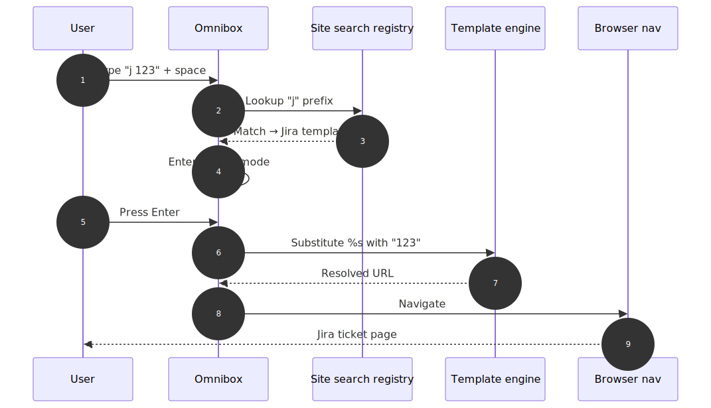
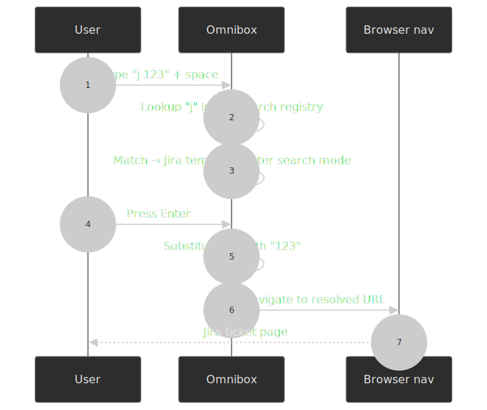

# Chrome Developer Setup: Extensions, Profiles, and Shortcuts

A Chrome configuration optimized for senior developers: omnibox keywords for instant navigation, browser-agnostic tooling for cross-browser testing, and profile isolation for multi-account workflows.

## The mental model

Chrome's omnibox functions as a command-line dispatcher when you wire it up with custom site search shortcuts. Each shortcut binds a keyword to a URL template containing `%s` as a query placeholder — typing `j 123` expands to `https://company.atlassian.net/secure/QuickSearch.jspa?searchString=123` and navigates there directly[^chrome-site-search].

The full setup boils down to five ideas:

1. **Omnibox = dispatch layer.** Keywords match a registry, the template expands, and the browser navigates without ever touching a search results page.
2. **AI tool URL parameters are uneven.** As of April 2026, only Perplexity's `?q=` reliably auto-submits; Claude's `?q=` stopped working in October 2025 and ChatGPT's was hardened in July 2025 after a [Tenable prompt-injection disclosure](https://www.tenable.com/security/research/tra-2025-22).
3. **Browser-agnostic tools = portability.** Raindrop.io and Bitwarden sync across Chrome, Firefox, Arc, and Brave so testing in another engine never costs you bookmarks or credentials.
4. **Profile isolation = context separation.** Each Chrome profile keeps its own cookies, extensions, and search engines, which is what makes work/personal/testing separation tractable.
5. **Manifest V3 is the floor, not the ceiling.** Chrome 139 (June 2025) removed Manifest V2 entirely[^mv2-timeline]. uBlock Origin Lite operates inside the [`declarativeNetRequest`](https://developer.chrome.com/docs/extensions/reference/api/declarativeNetRequest) (DNR) limits; the original uBlock Origin survives only on Firefox and on Brave's MV2 backend.

The payoff: developers context-switch constantly between Jira, Confluence, AI tools, and Google Workspace. Omnibox shortcuts collapse each lookup to a single keyboard action; the rest of this post is the catalogue I actually use, plus the trade-offs that come with the platform shifts of the last year.

---

## Address bar keywords

Chrome's site search shortcuts (Settings → Search engine → Manage search engines and site search) let you define custom URL templates. Type the keyword followed by a space (or Tab), and Chrome enters "search mode" for that shortcut — your query replaces `%s` in the template[^chrome-site-search].

**Setup:** Navigate to `chrome://settings/searchEngines`, scroll to **Site search**, click **Add**.

Each shortcut stores three fields:

- **Name** — display label (for example, "Jira Quick Search").
- **Shortcut** — the keyword you type (`j`).
- **URL** — template with `%s` placeholder (`https://company.atlassian.net/secure/QuickSearch.jspa?searchString=%s`).

When you type `j 123` and press Enter, Chrome substitutes `123` for `%s` and navigates directly. The space after the keyword triggers search mode; Tab is an explicit alternative when the keyword overlaps with a domain.

> [!NOTE]
> **Site search shortcuts do not sync across devices.** Chrome syncs bookmarks, history, passwords, and extensions, but custom search engines remain device-local — this has been the case for years and was still true in Chrome 147[^chrome-sync]. There's no native export/import; recreate them per device, or use a third-party shortcuts manager that supports JSON export.

### Development & work tools

> Replace `<your-company-name>` and `<your-project-code>` with your actual Jira/Atlassian values.

| Tool                    | Keyword | URL template                                                                                             | Example                                      |
| :---------------------- | :------ | :------------------------------------------------------------------------------------------------------- | :------------------------------------------- |
| **Jira (Smart Search)** | `j`     | `https://<your-company-name>.atlassian.net/secure/QuickSearch.jspa?searchString=%s`                      | `j 123` (jumps to ticket) or `j login bug`   |
| **Jira (Project)**      | `jp`    | `https://<your-company-name>.atlassian.net/issues?jql=textfields~"%s" AND project="<your-project-code>"` | `jp checkout` (searches only this project)   |
| **Jira Ticket**         | `jt`    | `https://<your-company-name>.atlassian.net/browse/<your-project-code>-%s`                                | `jt 125` (opens ticket `<project-code>-125`) |
| **Confluence**          | `cf`    | `https://<your-company-name>.atlassian.net/wiki/search?text=%s`                                          | `cf onboarding`                              |
| **Bitbucket**           | `bb`    | `https://bitbucket.org/search?q=%s`                                                                      | `bb repo_name`                               |
| **Chrome Web Store**    | `ext`   | `https://chrome.google.com/webstore/search/%s`                                                           | `ext json viewer`                            |

Jira's Smart Search (`QuickSearch.jspa`) is the high-leverage one: it accepts ticket numbers, free text, and JQL fragments, so `j PROJ-123` opens a ticket and `j login bug` searches across projects. The project-scoped `jp` shortcut adds a JQL `project="..."` filter to constrain results when you're heads-down on one codebase.

### AI tools

| Tool           | Keyword  | URL template                            | Status (April 2026)                                            |
| :------------- | :------- | :-------------------------------------- | :------------------------------------------------------------- |
| **Perplexity** | `p`      | `https://www.perplexity.ai/search?q=%s` | Works; auto-submits                                            |
| **Claude**     | `c`      | `https://claude.ai/new?q=%s`            | Broken since early October 2025[^claude-q-broken]              |
| **ChatGPT**    | `gpt`    | `https://chatgpt.com/?q=%s`             | Restricted by `sec-fetch-site` after July 2025 hardening       |
| **Gemini**     | `gemini` | Use `@gemini` in omnibox                | Native shortcut uses an internal header, not a URL parameter   |

The fragmentation matters because each tool has a different reason for being where it is:

- **Perplexity** still works as a one-shot research command — the `?q=` parameter both prefills *and* submits the query, so the result page renders without further interaction. This is the only mainstream AI surface where omnibox-style queries land cleanly today.
- **Claude.** Anthropic's `claude.ai/new?q=` quietly stopped processing the parameter in early October 2025; users surfaced the regression in a [GitHub bug report](https://github.com/anthropics/claude-code/issues/8827) and Anthropic has not restored it. The shortcut still works as plain navigation; the prompt just won't pre-fill.
- **ChatGPT.** Tenable disclosed [TRA-2025-22](https://www.tenable.com/security/research/tra-2025-22) in July 2025: an attacker-controlled URL with `?q=` could one-click hijack a logged-in ChatGPT session via prompt injection. OpenAI's fix gates auto-submission on the `sec-fetch-site` header, so requests originating from elsewhere on the web (including the omnibox in many cases) no longer trigger the model. Native URL parameters are now unreliable enough that I treat them as broken.
- **Gemini.** `gemini.google.com` does not honour `?q=` directly[^gemini-no-q]. Chrome's built-in `@gemini` shortcut works because the browser injects an internal `x-omnibox-gemini` header that the Gemini frontend respects; you trigger it by typing `@gemini`, then space or Tab. If you really want `?q=` semantics, the [Gemini URL Prompt extension](https://chromewebstore.google.com/detail/gemini-url-prompt-auto-prefill/gcooahlbfkojbacclfbofkcknbiopjan) injects the prompt into the input field client-side.

> [!TIP]
> Given the URL-parameter restrictions, I keep Perplexity as the default search engine on my personal profile and reach for `@gemini` or the Claude desktop app for everything else. The single omnibox is still the right interface — it's just that "auto-submit on `?q=`" is no longer a portable contract.

### Google Workspace

| Tool              | Keyword | URL template                                     | Example                 |
| :---------------- | :------ | :----------------------------------------------- | :---------------------- |
| **Google Sheets** | `sheet` | `https://docs.google.com/spreadsheets/u/0/?q=%s` | `sheet Q1 budget`       |
| **Google Docs**   | `doc`   | `https://docs.google.com/document/u/0/?q=%s`     | `doc meeting notes`     |
| **Google Drive**  | `dr`    | `https://drive.google.com/drive/search?q=%s`     | `dr project proposal`   |
| **Gmail**         | `gm`    | `https://mail.google.com/mail/u/0/#search/%s`    | `gm invoice from apple` |

The `/u/0/` segment selects the first logged-in Google account. `/u/1/` is the second, `/u/2/` the third, and so on; for multi-account workflows, create one shortcut per account index rather than swapping accounts in-app.

**Instant creation shortcuts:** Chrome recognises Google's `.new` TLDs natively. Type `sheet.new`, `doc.new`, `slides.new`, or `meet.new` directly in the omnibox to create a blank file or start a meeting — no custom shortcut required.

### Entertainment & shopping

| Tool              | Keyword | URL template                                      | Example              |
| :---------------- | :------ | :------------------------------------------------ | :------------------- |
| **YouTube**       | `yt`    | `https://www.youtube.com/results?search_query=%s` | `yt coding tutorial` |
| **YouTube Music** | `ym`    | `https://music.youtube.com/search?q=%s`           | `ym lo-fi beats`     |
| **Amazon**        | `az`    | `https://www.amazon.com/s?k=%s`                   | `az running shoes`   |

### Utilities

| Tool                | Keyword | URL template                                         | Example                |
| :------------------ | :------ | :--------------------------------------------------- | :--------------------- |
| **Google Maps**     | `map`   | `https://www.google.com/maps/search/%s`              | `map coffee near me`   |
| **Google Calendar** | `cal`   | `https://calendar.google.com/calendar/r/search?q=%s` | `cal standup`          |
| **Google Images**   | `img`   | `https://www.google.com/search?tbm=isch&q=%s`        | `img transparent logo` |
| **Define (Google)** | `def`   | `https://www.google.com/search?q=define+%s`          | `def esoteric`         |

`cal.new` creates a new calendar event; `meet.new` starts a Google Meet.

---

## Chrome profiles

Chrome profiles provide isolated browser environments — each profile carries its own cookies, history, extensions, bookmarks, and site search shortcuts. The isolation is what makes the rest of this setup work in practice for developers who:

- **Manage multiple accounts** — separate profiles for work Google account, personal account, and client accounts avoid the constant sign-in/sign-out churn that web apps inflict on shared sessions.
- **Test in clean environments** — a "testing" profile without extensions reveals how real users experience your site.
- **Maintain context boundaries** — work bookmarks, search engines, and extensions stay out of personal browsing.

**Creating profiles:** Click your profile avatar (top-right) → **Add** → sign in with a Google account, or use without an account for local-only profiles.

**Visual identification:** Assign distinct colours and names to each profile. Chrome paints the profile colour into the title bar so the active context is always visible.

**Profile sync:** When signed into a Google account, Chrome syncs bookmarks, history, passwords, and extensions across devices. Each profile syncs independently — work to work, personal to personal — with the carve-out from the [omnibox shortcut warning](#address-bar-keywords) above.

---

## Essential extensions

Browser-agnostic tools matter for anyone who tests across Chrome, Firefox, Arc, and Brave. The goal is to avoid lock-in while keeping a single workflow.

### Cross-browser sync

| Extension                               | Purpose                                                                                                                                                                                                       |
| :-------------------------------------- | :------------------------------------------------------------------------------------------------------------------------------------------------------------------------------------------------------------ |
| **[Raindrop.io](https://raindrop.io/)** | Bookmark manager with browser extensions for Chrome, Firefox, Safari, and Edge. Syncs through Raindrop's servers (not browser-native sync), supports nested collections, tags, and full-text search.          |
| **[Bitwarden](https://bitwarden.com/)** | Open-source password manager with passkey storage. The desktop app provides system-wide autofill (works in all browsers and native apps); the browser extensions connect to the desktop app or to Bitwarden's servers. |

**Why Raindrop.io over browser bookmarks:** native bookmarks only sync within one browser ecosystem. Raindrop.io maintains a single library accessible from any browser — useful when you switch to Firefox to keep the original uBlock Origin or to Arc for its workspace features. The Chrome extension also supports Chrome's side panel, which keeps bookmarks one click away without leaving the current page.

**Important limitation:** Raindrop.io does not hook into the browser's built-in "Add bookmark" dialog; you save through Raindrop's own button or keyboard shortcut.

**Bitwarden passkey login (November 2025):** Bitwarden browser extensions for Chromium-based browsers can authenticate via WebAuthn PRF (Pseudo-Random Function), enabling phishing-resistant, passwordless login with a hardware key or platform authenticator. The PRF passkey extends to vault decryption, which makes "log in and unlock the vault in one tap" a real workflow. Up to five PRF-compatible passkeys per account, available on the free tier[^bw-passkey-login]. As of February 5, 2026, passkey vault unlock is generally available across the web app and Chromium-based browser extensions[^bw-passkey-unlock]. The Windows 11 desktop app additionally registers as a native passkey provider, so passkeys created or used outside the browser route through Bitwarden too.

### Development

| Extension                                                                                                                    | Purpose                                                                                                                                                                                                                                                                                                                                                                       |
| :--------------------------------------------------------------------------------------------------------------------------- | :---------------------------------------------------------------------------------------------------------------------------------------------------------------------------------------------------------------------------------------------------------------------------------------------------------------------------------------------------------------------------- |
| **[React Developer Tools](https://chromewebstore.google.com/detail/react-developer-tools/fmkadmapgofadopljbjfkapdkoienihi)** | Adds **Components** and **Profiler** tabs to DevTools. Inspect the component hierarchy, props and state; profile render performance. The 7.0 line (October 2025) added React 19 hook inspection — `useActionState`, `useOptimistic`, `useFormStatus`, and the `use` hook[^react-devtools-changelog].                                                                          |
| **[uBlock Origin Lite](https://chromewebstore.google.com/detail/ublock-origin-lite/ddkjiahejlhfcafbddmgiahcphecmpfh)**       | MV3-compliant content blocker built on the [`declarativeNetRequest`](https://developer.chrome.com/docs/extensions/reference/api/declarativeNetRequest) (DNR) API. Each extension is guaranteed 30,000 enabled static rules with additional rules drawn from a global pool. Effective for mainstream ads; less effective than the full uBlock Origin against advanced trackers. |

**React Developer Tools — what you actually use:**

- **Components tab** — browse the component tree, inspect props/state, edit values in real time.
- **Profiler tab** — record render sessions, view flamegraphs showing which components rendered and how long each took.
- **Element sync** — selecting an element in the Elements panel highlights the corresponding React component.
- **Suspense / Server Components** — a "Suspended by" surface in the experimental Suspense tab makes Next.js / RSC suspension causes legible.
- **React 19 hooks** — full inspection support for `useActionState`, `useOptimistic`, `useFormStatus`, and the `use` hook. Hydration-mismatch reporting is also better in the 7.0 line[^react-devtools-changelog].

#### Manifest V3 changed what an ad blocker can do

Chrome 139 (June 2025) removed Manifest V2 (MV2) support entirely, including the `ExtensionManifestV2Availability` enterprise policy that had previously kept MV2 alive[^mv2-timeline]. MV2 extensions on Chrome stable are now disabled and cannot be re-enabled.

| Timeline               | Event                                                                                |
| :--------------------- | :----------------------------------------------------------------------------------- |
| 2020                   | Manifest V3 introduced                                                               |
| October 2024           | Gradual MV2 disabling begins in Chrome stable                                        |
| Chrome 138 (May 2025)  | Final version supporting MV2 with the `ExtensionManifestV2Availability` policy       |
| Chrome 139 (June 2025) | MV2 support and the enterprise policy removed; MV2 extensions disabled for everyone  |

**Why MV3 limits ad blockers.** MV2's [`webRequest`](https://developer.chrome.com/docs/extensions/reference/api/webRequest) API let extensions intercept and modify network requests dynamically — that's how the original uBlock Origin made context-aware blocking decisions. MV3's [`declarativeNetRequest`](https://developer.chrome.com/docs/extensions/reference/api/declarativeNetRequest) requires extensions to declare static filtering rules in advance: each extension is guaranteed 30,000 enabled static rules (`GUARANTEED_MINIMUM_STATIC_RULES`), with anything beyond that drawn from a shared global pool whose remaining capacity depends on what other installed extensions have already enabled. The result, as uBlock Origin's own docs put it, is that uBlock Origin Lite "cannot rely on a strict superset of the technologies and capabilities" the full version uses[^ubo-lite-limits].

**Alternatives for full-fat blocking:**

- **Firefox** — Mozilla has stated it has no plans to deprecate MV2 and will give at least 12 months' notice if that ever changes; the original uBlock Origin still ships there[^firefox-mv2].
- **Brave** — since v1.81, Brave hosts MV2 builds of uBlock Origin, AdGuard, NoScript, and uMatrix on its own backend, installable from `brave://settings/extensions/v2`[^brave-mv2]. Brave Shields (the built-in Rust ad blocker) also runs independently of any extension API.
- **Opera and Vivaldi** — actively maintaining MV2 support at time of writing.

> [!CAUTION]
> "MV3 is fine for me" is a defensible position for casual browsing, but if your work depends on cosmetic filtering, scriptlet injection, or large custom rule sets (mainstream ad blockers ship lists in the hundreds of thousands), uBlock Origin Lite is structurally weaker. Plan for a second browser if you actually rely on those features.

### AI integration

| Extension                                                                                            | Purpose                                                                                                                                                                                  |
| :--------------------------------------------------------------------------------------------------- | :--------------------------------------------------------------------------------------------------------------------------------------------------------------------------------------- |
| **[Claude in Chrome](https://claude.com/chrome)**                                                    | Browser automation in a side panel: Claude can navigate pages, click elements, fill forms, read the DOM and console, manage tabs, and execute multi-step workflows. Paid plans only.    |

**Claude in Chrome** launched as a research preview limited to ~1,000 Max subscribers on August 25, 2025 ("[Piloting Claude for Chrome](https://claude.com/blog/claude-for-chrome)") and rolled out to all paid plans (Pro, Max, Team, Enterprise) in mid-December 2025. As of April 2026 the extension supports:

- **Direct browser control** — navigate, click, type, scroll, read DOM and console logs.
- **Multi-tab workflows** — group tabs for Claude to interact with multiple pages simultaneously.
- **Scheduled tasks** — configure shortcuts to run automatically on a schedule.
- **Workflow recording** — record manual actions to teach Claude repeatable workflows.
- **Planning mode** — "Ask before acting" has Claude propose a plan for approval, then execute autonomously within approved boundaries.
- **Claude Code integration** — Claude Code can drive the same Chrome instance via Native Messaging, so you can build in the terminal and have Claude verify behaviour in the browser; requires Claude Code ≥ 2.0.73 and the extension ≥ 1.0.36[^claude-code-chrome].

**Model availability (April 2026):** model access in the side panel depends on the plan, not the extension itself[^claude-chrome-models].

| Plan                          | Models available in Claude in Chrome           |
| :---------------------------- | :--------------------------------------------- |
| **Free**                      | Extension not available                        |
| **Pro** ($20/month)           | Haiku 4.5                                      |
| **Max** ($100 / $200/month)   | Opus 4.6, Sonnet 4.6, Haiku 4.5                |
| **Team, Enterprise**          | Opus 4.6, Sonnet 4.6, Haiku 4.5; admin controls |

**Model-lifecycle context:** Anthropic's flagship has churned hard since the article was first published. Claude 3.5 Sonnet (`claude-3-5-sonnet-20240620` and `-20241022`) was retired October 28, 2025; Claude 3 Opus (`claude-3-opus-20240229`) was retired January 5, 2026[^claude-deprecations]. Opus 4.5 shipped November 24, 2025[^opus-4-5], Opus 4.6 on February 5, 2026[^opus-4-6], and Opus 4.7 — the current frontier model — on April 16, 2026[^opus-4-7]. Sonnet 4.6 (February 17, 2026) is now the default Claude.ai model on Free and Pro tiers.

> [!IMPORTANT]
> Claude in Chrome runs with your live browser session. Anthropic's guidance is to limit it to trusted sites and to leave "Ask before acting" enabled until you've built up a sense for how a given site behaves. Prompt injection from third-party page content is a real risk surface for any browser-controlling agent.

**My Claude workflow:**

| Surface                     | Use case                                                     |
| :-------------------------- | :----------------------------------------------------------- |
| **Desktop app** (`⌥ Space`) | Quick questions without context-switching                    |
| **Claude Code CLI + IDE**   | Coding tasks: debugging, refactoring, generation             |
| **Browser extension**       | Automation: filling forms, navigating sites, extracting data |

The split eliminates tool-switching: quick lookups in the desktop app, coding in the terminal, browser automation in Chrome.

## Conclusion

Chrome's productivity comes from treating the omnibox as a command dispatcher, not a search bar. Site search shortcuts collapse the navigate-then-search pattern into a single keyboard action; profile isolation lets the same browser hold work, personal, and testing contexts without bleed; and browser-agnostic tools like Raindrop.io and Bitwarden mean the workflow survives a switch to Firefox or Brave.

The sharper edges are platform shifts that landed in the last year:

- **Manifest V3 is the floor.** Chrome 139 sealed the MV2 deprecation in June 2025; serious ad blocking now requires Firefox or Brave's MV2 backend.
- **AI tool URL parameters are uneven.** Perplexity's `?q=` still auto-submits; Claude's broke in October 2025; ChatGPT's was hardened in July 2025 after Tenable's [TRA-2025-22](https://www.tenable.com/security/research/tra-2025-22); Gemini relies on Chrome's `@gemini` shortcut and an internal header rather than a URL parameter.
- **Browser-native AI agents are real.** Claude in Chrome ships to every paid Anthropic plan; the model you actually get inside the side panel is Pro = Haiku 4.5, Max+ = Opus / Sonnet / Haiku.

The key insight: invest the configuration time once, then benefit from the reduced friction on every subsequent interaction.

## Appendix

### Prerequisites

- Chrome (or a Chromium-based browser) installed.
- Familiarity with Chrome DevTools basics.
- For Claude in Chrome: a paid Claude subscription (Pro, Max, Team, or Enterprise).

### Terminology

- **Omnibox** — Chrome's address bar, which functions as both URL input and search box.
- **Site search shortcut** — Chrome's term for custom search engine keywords.
- **Manifest V3 (MV3)** — Chrome's extension platform introduced in 2020; uses declarative APIs with reduced dynamic capabilities. MV2 support was removed in Chrome 139 (June 2025).
- **`declarativeNetRequest` (DNR)** — MV3's network filtering API; rules are declared statically up front. Each extension is guaranteed 30,000 enabled static rules with additional rules drawn from a shared global pool.
- **WebAuthn PRF** — the Pseudo-Random Function extension to WebAuthn, which lets a passkey derive a stable secret usable for vault decryption (and not just authentication).
- **Native Messaging** — Chrome extension API that lets an extension communicate with a co-installed native binary; Claude Code uses it to drive the Claude in Chrome extension from the terminal.

### Summary

- **Omnibox shortcuts** map keywords to URL templates; `j 123` becomes direct Jira navigation. Shortcuts do not sync across devices.
- **AI tool URL parameters** are uneven: only Perplexity's `?q=` works reliably; Claude's broke in October 2025; ChatGPT's was hardened in July 2025; Gemini uses `@gemini` plus an internal header.
- **Chrome profiles** provide isolated environments for work, personal, and testing contexts.
- **Raindrop.io** syncs bookmarks across browsers and supports Chrome's side panel.
- **Bitwarden** supports passkey login on Chromium browser extensions (November 2025) and passkey vault unlock (February 2026); free tier included.
- **Manifest V3** completed in June 2025 (Chrome 139); uBlock Origin Lite is bounded by DNR's static-rule model. For full-fat blocking, use Firefox or Brave's MV2 backend.
- **Claude in Chrome** automates browser tasks; Pro gets Haiku 4.5 in the side panel, Max/Team/Enterprise get Opus 4.6, Sonnet 4.6, and Haiku 4.5.

### References

**Official documentation**

- [Set default search engine and site search shortcuts](https://support.google.com/chrome/answer/95426) — Chrome Help Center.
- [Manage Chrome with multiple profiles](https://support.google.com/chrome/answer/2364824) — Chrome Help Center.
- [`chrome.declarativeNetRequest` API reference](https://developer.chrome.com/docs/extensions/reference/api/declarativeNetRequest) — Chrome for Developers.
- [Manifest V2 support timeline](https://developer.chrome.com/docs/extensions/develop/migrate/mv2-deprecation-timeline) — Chrome for Developers.
- [Resuming the transition to Manifest V3](https://developer.chrome.com/blog/resuming-the-transition-to-mv3) — Chrome for Developers.
- [React Developer Tools](https://react.dev/learn/react-developer-tools) — React documentation.
- [Chrome Releases blog](https://chromereleases.googleblog.com/) — version announcements.

**Vendor pages**

- [Piloting Claude for Chrome](https://claude.com/blog/claude-for-chrome) — Anthropic (August 25, 2025; updated December 2025).
- [Use Claude Code with Chrome](https://code.claude.com/docs/en/chrome) — Claude Code docs.
- [Get started with Claude in Chrome](https://support.claude.com/en/articles/12012173-get-started-with-claude-in-chrome) — Claude help centre.
- [Introducing Claude Opus 4.7](https://www.anthropic.com/news/claude-opus-4-7) — Anthropic (April 16, 2026).
- [Model deprecations](https://platform.claude.com/docs/en/about-claude/model-deprecations) — Claude API docs.
- [Raindrop.io](https://raindrop.io/) — bookmark manager.
- [Raindrop.io changelog](https://help.raindrop.io/changelog).
- [Bitwarden](https://bitwarden.com/) — password manager.
- [Bitwarden passkey login for browser extensions](https://bitwarden.com/blog/log-into-bitwarden-with-a-passkey/) — Bitwarden blog.
- [Log in with passkeys](https://bitwarden.com/help/login-with-passkeys/) — Bitwarden help docs.

**Technical analysis**

- [What Manifest V3 means for Brave Shields](https://brave.com/blog/brave-shields-manifest-v3/) — Brave (MV2 hosting and `brave://settings/extensions/v2`).
- [Firefox continues Manifest V2 support](https://www.bleepingcomputer.com/news/security/firefox-continues-manifest-v2-support-as-chrome-disables-mv2-ad-blockers/) — BleepingComputer.
- [uBlock Origin home page](https://ublockorigin.com/) — current state of MV3 limitations.
- [About Chrome's MV3 extension warnings](https://github.com/gorhill/uBlock/wiki/About-Google-Chrome's-%22This-extension-may-soon-no-longer-be-supported%22) — uBlock Origin wiki.

**AI tool URL parameters**

- [OpenAI ChatGPT prompt injection via `?q=` parameter](https://www.tenable.com/security/research/tra-2025-22) — Tenable Research, July 2025.
- [Submission of prompt via URL parameter stopped working (Claude)](https://github.com/anthropics/claude-code/issues/8827) — anthropics/claude-code GitHub issue.
- [Set prompt to AI Studio via URL query parameter](https://discuss.ai.google.dev/t/set-prompt-to-aistudio-via-url-query-parameter/77309) — Google AI Developers forum (Gemini header behaviour).
- [Gemini URL Prompt extension](https://chromewebstore.google.com/detail/gemini-url-prompt-auto-prefill/gcooahlbfkojbacclfbofkcknbiopjan) — Chrome Web Store.

[^chrome-site-search]: [Set default search engine and site search shortcuts](https://support.google.com/chrome/answer/95426) — Chrome Help Center.

[^chrome-sync]: [sync "Search engines" settings](https://support.google.com/chrome/thread/154354527/sync-search-engines-settings?hl=en) — Google Chrome Community thread; Chrome's syncable data list does not include site search shortcuts.

[^mv2-timeline]: [Manifest V2 support timeline](https://developer.chrome.com/docs/extensions/develop/migrate/mv2-deprecation-timeline) — Chrome for Developers; Chrome 138 was the final MV2-supporting version, Chrome 139 removed both runtime support and the `ExtensionManifestV2Availability` enterprise policy.

[^claude-q-broken]: [BUG: Submission of prompt via URL parameter stopped working](https://github.com/anthropics/claude-code/issues/8827) — anthropics/claude-code; reported regression of `claude.ai/new?q=` in early October 2025.

[^gemini-no-q]: [Set prompt to AI Studio via URL query parameter](https://discuss.ai.google.dev/t/set-prompt-to-aistudio-via-url-query-parameter/77309) — Google AI Developers forum; Gemini relies on the `x-omnibox-gemini` header that Chrome injects when you trigger `@gemini`.

[^bw-passkey-login]: [Bitwarden expands passkey login to browser extensions](https://www.businesswire.com/news/home/20251118890517/en/Bitwarden-Expands-Passkey-Login-to-Browser-Extensions-for-Secure-Passwordless-Authentication) — November 18, 2025; and [Log in with passkeys](https://bitwarden.com/help/login-with-passkeys/) — Bitwarden help docs (five-passkey limit, free tier inclusion).

[^bw-passkey-unlock]: [You can now unlock your vault with a passkey](https://community.bitwarden.com/t/you-can-now-unlock-your-vault-with-a-passkey/93556) — Bitwarden community announcement, February 5, 2026.

[^react-devtools-changelog]: [react-devtools CHANGELOG](https://github.com/facebook/react/blob/main/packages/react-devtools/CHANGELOG.md) — React 19 hook inspection (`useActionState`, `useOptimistic`, `useFormStatus`, `use`) added in v7.0.0; v7.0.1 (October 2025) shipped UI fixes for the experimental Suspense tab.

[^ubo-lite-limits]: [uBlock Origin home page](https://ublockorigin.com/) — quotes the constraints DNR places on MV3 content blockers and contrasts them with the dynamic webRequest model used by the original.

[^firefox-mv2]: [Manifest V3 & Manifest V2 (March 2024 update)](https://blog.mozilla.org/addons/2024/03/13/manifest-v3-manifest-v2-march-2024-update/) — Mozilla Add-ons blog; reaffirmed indefinite MV2 support with at least 12 months' notice before any change.

[^brave-mv2]: [What Manifest V3 means for Brave Shields and the use of extensions in the Brave browser](https://brave.com/blog/brave-shields-manifest-v3/) — Brave; lists MV2 hosting for uBlock Origin, AdGuard, uMatrix, and NoScript, available at `brave://settings/extensions/v2` since v1.81.

[^claude-code-chrome]: [Use Claude Code with Chrome (beta)](https://code.claude.com/docs/en/chrome) — Claude Code docs; Native Messaging integration with version requirements.

[^claude-chrome-models]: [Get started with Claude in Chrome](https://support.claude.com/en/articles/12012173-get-started-with-claude-in-chrome) — Anthropic help centre; Pro plans see Haiku 4.5 only, Max/Team/Enterprise see Opus 4.6, Sonnet 4.6, and Haiku 4.5.

[^claude-deprecations]: [Model deprecations](https://platform.claude.com/docs/en/about-claude/model-deprecations) — Claude API docs; Claude 3.5 Sonnet retired October 28, 2025, Claude 3 Opus retired January 5, 2026.

[^opus-4-5]: [Introducing Claude Opus 4.5](https://www.anthropic.com/news/claude-opus-4-5) — Anthropic, November 24, 2025.

[^opus-4-6]: [Introducing Claude Opus 4.6](https://www.anthropic.com/news/claude-opus-4-6) — Anthropic, February 5, 2026.

[^opus-4-7]: [Introducing Claude Opus 4.7](https://www.anthropic.com/news/claude-opus-4-7) — Anthropic, April 16, 2026; current Anthropic flagship.
