# macOS System Setup

This is what I run on every new Mac. One `curl` command bootstraps the toolchain, an Ansible playbook installs packages and lays down configs, and a cleanup loop keeps the repository and the system from drifting apart. The full source lives at [github.com/sujeet-pro/dot-files](https://github.com/sujeet-pro/dot-files).

The post is opinionated. It is also the only setup I am still happy with after a few years of iteration, so the choices here have all survived at least one rewrite.




## Three rules that shape everything

1. **Reproducibility is not optional.** A fresh Mac should reach full productivity from one command, with no manual install steps interleaved between Ansible runs. That keeps the repo honest — anything I had to do "by hand" gets added back to the playbook.
2. **Work and personal stay separated at the identity layer.** Different git emails, different SSH keys, different commit-signing keys, all selected automatically by repo path or remote URL. I should never be able to push to a work repo with my personal identity, even by accident.
3. **The repo is the source of truth.** Configs are symlinked, not copied. Identities are templated from environment variables, not committed. A cleanup check flags anything I installed by hand so I can either adopt it or remove it.

## One-line bootstrap

```sh
bash -c "$(curl -fsSL https://raw.githubusercontent.com/sujeet-pro/dot-files/main/bootstrap-remote.sh)"
```

That script clones the repo to `~/personal/dot-files` and runs `./setup.sh`, which:

1. Installs Xcode CLI tools, Homebrew, Ansible, and the `community.general` collection if any are missing.
2. Copies `configs/shell/.zshenv.example` to `~/.zshenv` and stops if I have not filled in the required variables (`GIT_USER_NAME`, `GIT_PERSONAL_EMAIL`, `GIT_WORK_EMAIL`, `SSH_PERSONAL_KEY`, `SSH_WORK_KEY`).
3. Runs `ansible-playbook setup.yml --ask-become-pass`.
4. Runs the cleanup check (more on that below).

After that, every day-to-day operation is a Make target:

```sh
make update      # brew update + re-run the playbook
make check       # ansible --check --diff (dry run)
make cleanup     # only the cleanup check
make validate    # tools, symlinks, env vars, defaults
make test-vm     # full end-to-end run inside a Tart macOS VM
```

`make test-vm` is the one I use whenever I refactor the playbook. Tart spins up a clean macOS Sequoia VM and runs the full bootstrap end to end. It takes ~30 minutes the first time (the base image is around 15 GB) and a few minutes after, but it is the only way I trust the "fresh Mac" claim.

## Why Ansible (and not a shell script)

Setup scripts that just shell out to `brew install` work right up until they do not. The first time you re-run them on a partially set-up machine, you find out which steps were idempotent and which ones were just "lucky on a clean Mac".

Ansible buys three things that matter here:

- **Idempotent modules** for the things shell scripts get wrong: `community.general.homebrew`, `community.general.osx_defaults`, `ansible.builtin.file` with `state: link`, and the `template` module for Jinja2-rendered configs.
- **A real role/task model**, so the playbook reads as nine focused roles (`homebrew`, `mise`, `shell`, `git`, `ssh`, `apps`, `aws`, `dev-tools`, `macos`) instead of one ever-growing script.
- **`--check --diff`** for free, which is what `make check` runs before any non-trivial change.

The cost is one extra Homebrew dependency. That is a trade I will take every time over a 600-line shell script that "mostly" handles re-runs.

## What gets installed

The full lists live in `roles/homebrew/vars/main.yml` and `roles/apps/vars/main.yml`. The shape:

| Layer                | How it is installed                | Examples                                                                                                          |
| -------------------- | ---------------------------------- | ----------------------------------------------------------------------------------------------------------------- |
| CLI tools            | Homebrew formulae                  | `bat`, `eza`, `ripgrep`, `fzf`, `zoxide`, `starship`, `lazygit`, `git-delta`, `difftastic`, `atuin`, `btop`, `jq` |
| Language runtimes    | `mise` (managed inside the `mise` role) | `node@lts`, `bun`, `python@3.12`, `java@temurin-17`, `uv`, `yarn@1`                                               |
| GUI apps             | Homebrew casks                     | `cursor`, `visual-studio-code`, `zed`, `ghostty`, `cmux`, `claude`, `claude-code`, `raycast`, `bruno`             |
| VS Code extensions   | `code --install-extension` from `apps` role | `anthropic.claude-code`, `astro-build.astro-vscode`, `biomejs.biome`, `eamodio.gitlens`                           |
| macOS defaults       | `community.general.osx_defaults`   | screenshot location and format, Finder, Dock, keyboard repeat, Mission Control                                    |
| Raycast scripts      | Symlinked into `~/.config/raycast` | Kill port, open Ghostty here, toggle dark mode, flush DNS, pretty JSON, etc.                                      |

A few choices in there are worth calling out.

### One runtime manager: `mise`

Older versions of this setup used `goenv`, `pyenv`, SDKMAN, and `fnm` — one tool per language. That worked, but each one shelled out at startup, each one had its own way of pinning versions, and each one had its own quirks for activating environments.

`mise` collapses all of that into one tool that handles every runtime, plus arbitrary CLI tools, plus per-project environment variables. The whole runtime list is six lines:

```toml title="configs/mise/config.toml"
[tools]
bun = "latest"
java = "temurin-17"
node = "lts"
python = "3.12"
uv = "latest"
yarn = "1"
```

In `.zshrc` it is one activation line:

```zsh title="configs/shell/.zshrc"
if command -v mise &>/dev/null; then
  eval "$(mise activate zsh)"
fi
```

`direnv` also dropped out — `mise` reads `[env]` blocks from `.mise.toml` natively, and the `~/.zshenv` PATH entry for `~/.local/share/mise/shims` makes the runtimes available to GUI apps too.

> [!NOTE]
> Volta is officially [marked as unmaintained](https://github.com/volta-cli/volta/issues/2080) — the pinned tracking issue went up in late 2025 and recommends migrating to `mise`. If you are still on Volta, this is a good moment to switch. The [Node.js download page](https://nodejs.org/en/download) now lists `fnm` alongside `nvm` as a first-class install option, and `mise` is the path with the lowest long-term maintenance for anyone juggling more than one runtime.

### Modern CLI defaults

I do not type the legacy commands any more, so the aliases reflect that:

| Default     | Replacement   | Why                                                                            |
| ----------- | ------------- | ------------------------------------------------------------------------------ |
| `ls`        | `eza`         | Icons, git status, tree view, sane colors                                      |
| `cat`       | `bat`         | Syntax highlighting and line numbers; aliased with `--paging=never`            |
| `grep`      | `ripgrep`     | Respects `.gitignore`, parallel, ~5–10× faster on real repos                   |
| `cd`        | `zoxide`      | Frecency-ranked jumps via `cd <pattern>`; replaces `cd` directly with `--cmd=cd` |
| `Ctrl+R`    | `atuin`       | Full-text fuzzy history with timestamps, per-directory filters, optional sync  |
| `git diff`  | `git-delta`   | Configured as the pager and `interactive.diffFilter`                           |
| `git diff`  | `difftastic`  | Available as `git dft` for AST-aware diffs that ignore formatting              |
| `git ui`    | `lazygit`     | Aliased as `lg` for stage-by-hunk, rebase-by-keystroke workflows               |

Two of these earn the swap on their own:

- **`atuin`** keeps a SQLite history per machine, optionally syncs across machines, and turns `Ctrl+R` into a full-screen fuzzy search with command duration, exit code, and the working directory it ran in. After a few weeks I stopped reaching for `history | grep` entirely.
- **`difftastic`** is the only diff that has ever made a noisy PR review feel quiet. `git dft` shows what actually changed when most of the diff is whitespace or reformatting.

### The shell, in dependency order

`.zshrc` is structured as numbered sections so the load order is obvious. The condensed shape:

```zsh title="configs/shell/.zshrc"
# 0. Detect Homebrew prefix once, cache as $BREW_PREFIX
# 1. PATH (user bin → Homebrew → rest)
# 2. mise activation
# 3. History (1M entries, EXTENDED_HISTORY, dedupe)
# 4. compinit + completion styling
# 5. fzf integration (--zsh, fd-aware FZF_DEFAULT_COMMAND, bat preview)
# 6. atuin init
# 8. Aliases (eza, bat, git, kubectl, docker, AWS, jq)
# 9. zsh-autosuggestions → starship → zsh-syntax-highlighting (last)
# 10. Antigravity, bun, vite-plus
# 11. zoxide init (must be the last chpwd hook)
```

Two non-obvious choices in there:

- **`kubectl` and `helm` are lazy-loaded.** Their completion files are slow to source (~200 ms combined) and I rarely use them in a fresh shell. Wrapping them in functions that source completions on first call moves that cost off cold start.
- **`zoxide` initializes last, after `starship`.** Both register `chpwd` hooks; if `zoxide` is initialized first, anything that re-registers `chpwd` later silently breaks frecency tracking.

The full list of features and shortcuts lives in [`configs/shell/SHELL-GUIDE.md`](https://github.com/sujeet-pro/dot-files/blob/main/configs/shell/SHELL-GUIDE.md) inside the dot-files repo.

## Identity separation: git and SSH

This is the part that took the most iteration. The constraints:

- Personal commits must use my personal email and SSH signing key.
- Work commits must use my work email and SSH signing key.
- The wrong identity should never be possible, even on a freshly cloned repo I have not touched yet.
- Commit signing must be on by default.

The shape that finally stuck uses three layers — a base config, a per-context overlay selected by `includeIf`, and a per-host SSH `IdentityFile`.




### Layer 1: a base `~/.gitconfig`

The base config is generated from a Jinja2 template (`roles/git/templates/gitconfig.j2`). It sets the personal identity as the default, enables SSH commit signing, configures the modern delta + difftastic diff stack, and ends with conditional includes:

```ini title="~/.gitconfig"
[user]
    name = Sujeet
    email = contact@sujeet.pro

[gpg]
    format = ssh

[gpg "ssh"]
    allowedSignersFile = ~/.config/git-configs/allowed_signers

[user]
    signingkey = ~/.ssh/id_ed25519_personal.pub

[commit]
    gpgsign = true

[tag]
    gpgsign = true

[core]
    pager = delta
    hooksPath = ~/.git-hooks

[interactive]
    diffFilter = delta --color-only

[merge]
    conflictstyle = zdiff3
```

A couple of those defaults deserve a mention:

- **`gpg.format = ssh`** uses the existing SSH key as the commit signing key. No GPG, no separate keyring, no passphrase wrangling — and GitHub and GitLab both accept SSH-signed commits as verified.
- **`merge.conflictstyle = zdiff3`** shows the original common ancestor block alongside the conflicting versions. It makes 3-way merges much easier to reason about than the default `merge` style. Available since Git 2.35.

### Layer 2: conditional includes, two ways

The base config ends with `includeIf` blocks generated from the env vars in `~/.zshenv`:

```ini title="~/.gitconfig"
# Directory-based: any repo under ~/work/ or ~/workspace/
[includeIf "gitdir:~/work/"]
    path = ~/.config/git-configs/work.gitconfig

# Remote-URL-based: any repo whose remote points at our work GitHub org
[includeIf "hasconfig:remote.*.url:git@github.com:Quince-Engineering/**"]
    path = ~/.config/git-configs/work.gitconfig

[includeIf "hasconfig:remote.*.url:https://github.com/Quince-Engineering/**"]
    path = ~/.config/git-configs/work.gitconfig
```

`gitdir:` covers the normal case where work repos live under `~/work/`. `hasconfig:remote.*.url:` (Git 2.36+) covers the case I missed for years — cloning a work repo into `~/personal/something` and then accidentally signing commits with the wrong identity.

The work overlay is small:

```ini title="~/.config/git-configs/work.gitconfig"
[user]
    email = sujeet@company-name.com
    signingkey = ~/.ssh/id_ed25519_work.pub

[core]
    excludesFile = ~/.gitignore-work

[init]
    defaultBranch = master

[pull]
    rebase = true
```

`~/.gitignore-work` is shared with the team's expectations (no `.mise.toml` in committed work). The personal side keeps `mise` configs in repos because that is the source of truth for local environments.

### Layer 3: SSH per-host identity

The SSH config is a tiny template that maps each host to the right key:

```ini title="~/.ssh/config"
Include ~/.colima/ssh_confi?

Host github.com
  HostName github.com
  User git
  IdentityFile ~/.ssh/id_ed25519_personal

Host bitbucket.org
  HostName bitbucket.org
  User git
  IdentityFile ~/.ssh/id_ed25519_work

Include ~/.ssh/config.local
```

`~/.ssh/config.local` is for personal hosts that have no business in a public dotfiles repo (EC2 boxes, home lab IPs, etc.). The Colima `Include` is glob-tolerant — it silently skips when the file does not exist on machines without container work.

> [!TIP]
> Generate Ed25519 keys with `ssh-keygen -t ed25519 -C "your_email@example.com"`. They are smaller, faster, and the recommended default from both [GitHub](https://docs.github.com/en/authentication/connecting-to-github-with-ssh/generating-a-new-ssh-key-and-adding-it-to-the-ssh-agent) and the OpenSSH project. RSA only matters for legacy systems.

## Editor and terminal

I use **Zed** as the daily editor (and as `$EDITOR`), **Cursor** for AI-heavy refactors, and **VS Code** when I need an extension that nothing else has. All three live as Homebrew casks and have their settings symlinked from the repo:

```text
~/.config/zed/settings.json                                → configs/zed/settings.json
~/Library/Application Support/Code/User/settings.json      → configs/vscode/settings.json
```

The terminal is **Ghostty** (with **[cmux](https://github.com/manaflow-ai/cmux)** as a `libghostty`-based macOS terminal with vertical tabs, native split panes, and workspace restore — useful when juggling several AI agents at once). One Ghostty config powers both:

```ini title="configs/ghostty/config"
font-family = JetBrainsMono Nerd Font
font-size = 15
theme = dark:Atom One Dark,light:Atom One Light
window-padding-x = 4
window-padding-y = 4
cursor-style = block
cursor-style-blink = false
mouse-hide-while-typing = true
copy-on-select = clipboard
confirm-close-surface = false
```

A Nerd Font is a hard requirement here — `eza`, `starship`, and the language indicators in the prompt all assume the icon range is available. I use `font-jetbrains-mono-nerd-font` and never set the non-nerd variant; that way the editor and terminal share one font family.

The VS Code extensions list lives in `roles/apps/vars/main.yml` and gets installed (and uninstalled) by the playbook. The cleanup check uses `code --list-extensions` to detect anything I added by hand and prompts me to either add it to the repo or uninstall it.

## macOS defaults via Ansible

The `macos` role is the part I missed in earlier iterations of this setup. macOS has dozens of preferences that I always set on a fresh machine, and the ones I forget become small, daily annoyances.

The whole role is `community.general.osx_defaults` calls fed from `roles/macos/vars/main.yml`:

```yaml title="roles/macos/vars/main.yml" collapse={1-2}
# Screenshots
screenshot_location: "{{ home_dir }}/screen-captures"
screenshot_format: png
screenshot_disable_shadow: true

# Finder
finder_show_hidden_files: true
finder_search_scope: SCcf  # Search current folder by default
finder_disable_extension_warning: true

# Dock
dock_autohide: true
dock_tilesize: 36
dock_mineffect: scale
dock_show_recents: false
dock_autohide_delay: 0

# Keyboard
keyboard_key_repeat: 2
keyboard_initial_repeat: 15
keyboard_disable_press_and_hold: true

# Mission Control
missioncontrol_mru_spaces: false

# General UI
ui_save_to_disk: true
ui_disable_quarantine: true
```

Two of those are worth singling out:

- **`ApplePressAndHoldEnabled = false`** turns off the accent-character popup so holding down a key actually repeats. With `KeyRepeat = 2` and `InitialKeyRepeat = 15`, key repeat in editors is suddenly fast enough to use.
- **`DSDontWriteNetworkStores = true`** stops macOS from sprinkling `.DS_Store` files across network shares and USB volumes. Future me, working with a colleague on a shared drive, says thank you.

The role finishes by `killall Dock Finder SystemUIServer` so the changes apply without a logout.

## The cleanup check

This is the feature I underestimated when I added it.

After every `setup.sh` (or `make cleanup`), the script compares what is actually installed against what the repo declares:

- `brew leaves` (only explicitly installed formulae) vs `homebrew_formulae` and `homebrew_formulae_absent`
- `brew list --cask` vs `homebrew_casks` and `homebrew_casks_absent`
- `code --list-extensions` vs `vscode_extensions`

For every unmanaged item, it offers four choices:

```text
What would you like to do?
  [a] Add all to dotfiles config (homebrew_formulae)
  [r] Remove all from system
  [i] Review individually
  [s] Skip
```

The "absent" lists are the other half of the trick — when I deliberately remove a tool (say, `tree` after I started using `eza --tree`), it goes into `homebrew_formulae_absent` so the next `brew install` does not silently put it back, and so the cleanup check stops nagging me about it.

The result is that the repo and the system never quietly diverge. Either I declare a tool, or I uninstall it.

## What I deliberately left out

A few things that look like they should be in here, and are not:

- **`oh-my-zsh` / `prezto`.** I tried both for years. They are heavy, they hide the actual zsh config behind plugin abstractions, and the bits I actually use (autosuggestions, syntax highlighting, fzf integration, a fast prompt) are all standalone packages that load in well under 100 ms. The zshrc is now ~280 lines I can read top to bottom.
- **Per-language version managers.** As covered above, `mise` does it all.
- **A separate clipboard manager.** Raycast already includes one, plus the script commands and window management I would otherwise install separately. One launcher is enough.
- **A custom `~/.gitconfig` per repo.** The conditional-include pattern handles every case I have ever needed without a single per-repo config file.

## What is still manual

Things [`settings-manual.md`](https://github.com/sujeet-pro/dot-files/blob/main/settings-manual.md) tracks because no amount of Ansible will fix them:

- Apps not in Homebrew or behind MDM (App Store apps, Perplexity, work-managed installs).
- Raycast extensions and hotkey assignments — Raycast does not expose a CLI for these.
- Atuin login (interactive; needs an account if you want sync).
- SSH key generation and uploading the public keys to GitHub / Bitbucket.
- Browser sign-ins and extensions.

The list is short on purpose. Anything that lands on it stays there until either upstream ships a CLI or I find a reasonable workaround.

## Summary

- One `curl` line bootstraps a fresh Mac end to end; everything after is `make update`.
- Ansible roles isolate concerns: Homebrew, mise, shell, git, ssh, apps, AWS, dev-tools, macOS defaults.
- `mise` replaces every per-language version manager and every `direnv` use case I had.
- Git identity is layered: base config + `gitdir:` and `hasconfig:remote.*.url:` includes + per-host SSH `IdentityFile`. Commits are SSH-signed by default.
- Modern CLI defaults — `eza`, `bat`, `ripgrep`, `fzf`, `zoxide`, `atuin`, `git-delta`, `difftastic`, `lazygit` — replace the legacy UNIX equivalents and stay opinionated about the swap.
- macOS defaults are set via `community.general.osx_defaults` so a fresh machine does not feel like a fresh machine for very long.
- The cleanup check stops the repo and the system from drifting apart, by forcing every install to be a deliberate "add to dotfiles" or "remove from system" decision.

## References

- [`sujeet-pro/dot-files`](https://github.com/sujeet-pro/dot-files) — the repository this post describes
- [Git conditional includes](https://git-scm.com/docs/git-config#_conditional_includes) — `gitdir`, `gitdir/i`, `onbranch`, `hasconfig:remote.*.url:`
- [SSH commit signing on GitHub](https://docs.github.com/en/authentication/managing-commit-signature-verification/about-commit-signature-verification#ssh-commit-signature-verification)
- [`mise` documentation](https://mise.jdx.dev/) — runtime and tool manager
- [`atuin`](https://atuin.sh/) — magical shell history
- [`git-delta`](https://github.com/dandavison/delta) and [`difftastic`](https://difftastic.wilfred.me.uk/)
- [`starship` configuration](https://starship.rs/config/)
- [`zoxide` algorithm](https://github.com/ajeetdsouza/zoxide/wiki/Algorithm) — frecency ranking
- [Volta deprecation notice](https://github.com/volta-cli/volta/issues/2080) — context for the `mise` migration
- [Ghostty configuration](https://ghostty.org/docs/config)
- [Ansible `community.general.osx_defaults` module](https://docs.ansible.com/ansible/latest/collections/community/general/osx_defaults_module.html)
